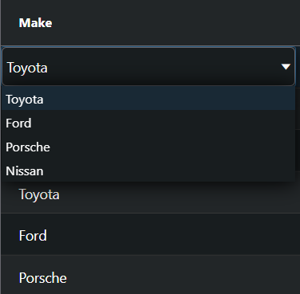

# 安装配置

- 安装依赖，两者必须版本一致

  ```bash
  npm install --save ag-grid-community
  npm install --save ag-grid-angular
  ```

- 根模块导入 `AgGridModule `

  ```typescript
  import { AgGridModule } from 'ag-grid-angular';
  
  @NgModule({
   imports: [AgGridModule]
  })
  export class AppModule { }
  ```

- 样式导入

  ```scss
  // styles.scss
  // 核心 css，必须引入
  @import 'ag-grid-community/styles/ag-grid.css';
  // 主题 css，可选
  @import 'ag-grid-community/styles/ag-theme-alpine.css';
  ```


# 选项

用于配置 ag-grid 的属性和回调

- 文本值属性

- `@Inputs` 绑定的属性
- `@Inputs` 绑定的回调属性
- `@Outputs` 绑定的事件


- `GridOptions` 对象可以代替组件绑定使用，也可以作为组件绑定的补充

- 同时绑定的情况下，组件绑定的优先级更高

- `GridOptions<TData>` 中的泛型参数 `TData` 是行数据的数据类型

  ```typescript
  const gridOptions: GridOptions<ICar> = {
    getRowId: (params) => params.data.make + params.data.model,
    onRowSelected: (event) => {
      if (event.data) {
        const price = event.data.price;
      }
    }
  }
  ```


## 列定义

### 列定义属性 ColDef

- `ColDef<TData>` 泛型类型 `TData` 为行数据的数据类型

- 列定义属性添加先后顺序：默认列定义 `defaultColDef` → 列定义 `columnDefs` →  列模板 `columnType`

  在每个阶段，如果列属性已存在，则后者将覆盖现有值


#### 绑定字段 field

- 访问行数据对象中的值，设置行数据对象的 `key` 属性，会通过 `.` 语法获取对象引用中指定 `key` 的内容
- 嵌套对象可以使用 `.` 字符串来深引用，如果选项 `suppressFieldDotNotation: true` 则不为深引用

```typescript
const rowData = {
  name: 'Michael Phelps',
  person: { age: 23, country: 'United States' },
  medals: { gold: 8, silver: 0, bronze: 0 }
}
```

```typescript
columnDefs: ColDef[] = [
  { field: 'name' },
  // 行数据有嵌套的对象，可以使用 . 连接指定
  { field: 'medals.gold', headerName: 'Gold' }
]
```


#### 指定列 ID colId

- 提供列的唯一 ID，缺省为列字段


#### 指定列模板 type

- 指定列模板或列模板数组，简化列的定义

- 在 `columnTypes` 选项中定义列的模板

  ` columnTypes: { [key: string]: ColDef<TData> } | undefined`

  ```typescript
  columnTypes = {
    nonEditableColumn: { editable: false },
    numberColumn: { width: 130, filter: 'agNumberColumnFilter' },
    dateColumn: {
      filter: 'agDateColumnFilter',
      filterParams: { comparator: myDateComparator },
      suppressMenu: true
    }
  }
  ```

  ```html
  <ag-grid-angular [columnTypes]="columnTypes"></ag-grid-angular>
  ```

- 在列定义中指定要使用的模板

  ```typescript
  columnDefs: ColDef[] = [
    { field: 'age', type: 'numberColumn' },
    { field: 'date', type: ['dateColumn', 'nonEditableColumn'], width: 220 }
  ]
  ```


#### 显示字段获取器 valueGetter

- 从指定的函数或表达式获取显示单元格的值

  ```typescript
  columnDefs: ColDef[] = [
    {
      headerName: '#',
      valueGetter: (params: ValueGetterParams) => params.node ? params.node.rowIndex : null,
    },
    { field: 'a' },
    { field: 'b' },
    { 
      headerName: 'A + B',
      colId: 'a&b',
      valueGetter: (params: ValueGetterParams) => params.data.a + params.data.b;
    },
    {
      headerName: 'Chain',
      valueGetter: (params: ValueGetterParams) => params.getValue('a&b') * 1000,
    }
  ]
  ```

- `valueGetter` 函数必须是纯函数，只会在重绘期间调用 `valueGetter` 一次，即使该值可能被多次使用

- `valueGetter` 参数类型

  `valueGetter: string | ValueGetterFunc<TData> `

  ```typescript
  interface ValueGetterFunc<TData = any> {
      (params: ValueGetterParams<TData>) : any
  }
  ```

  ```typescript
  interface ValueGetterParams<TData = any> {
    // 获取其他列的值
    getValue: (field: string) => any;
    // 行节点的对象
    node: IRowNode<TData> | null;
    // 行数据 
    data: TData | undefined;
    // 列对象
    column: Column;
    // 列属性定义对象
    colDef: ColDef<TData>;
    // ag-grid api
    api: GridApi<TData>;
    // 列 api
    columnApi: ColumnApi;
    // gridOptions.context
    context: any;
  }
  ```

  

#### 格式化值 valueFormatter

- 通过函数或表达式返回用于 UI 显示的格式化值

  ```typescript
  columnDefs: ColDef[] = [
    { 
      headerName: '(A)',
      field: 'a',
      valueFormatter: (params: ValueFormatterParams) => '(' + params.value + ')'
    }
  ]
  ```

- `valueFormatter` 参数类型

  `valueFormatter: string | ValueFormatterFunc<TData>`

  ```typescript
  interface ValueFormatterFunc<TData = any> {
    (params: ValueFormatterParams<TData>): string;
  }
  ```

  ```typescript
  interface ValueFormatterParams<TData = any, TValue = any> {
    // 单元格的 value
    value: TValue;
    // 行节点的对象
    node: IRowNode<TData> | null;
    // 行数据 
    data: TData | undefined;
    // 列对象
    column: Column;
    // 列属性定义对象
    colDef: ColDef<TData>;
    // ag-grid api
    api: GridApi<TData>;
    // 列 api
    columnApi: ColumnApi;
    // gridOptions.context
    context: any;
  }
  ```


#### 参考数据映射 refData

- 定义 `{ [key: string]: string }` 格式的数据映射集，用于将列值映射到映射集中对应的值

```typescript
// 映射集对象
const carMappings = {
  tyt: 'Toyota',
  frd: 'Ford',
  prs: 'Porsche',
  nss: 'Nissan',
};
```

```typescript
// 行数据
rowData: [
  { brand: 'tyt' },
  { brand: 'frd' },
  { brand: 'prs' },
  { brand: 'nss' },
]
```

```typescript
// 列定义
columnDefs: ColDef[] = [
  {
    // 显示的结果为 refData 映射后的数据
    field: 'make',
    // select 编辑器
    cellEditor: 'agSelectCellEditor',
    // select 下拉列表，选择的内容为基础数据，显示的内容为 refData 指定的映射数据
    cellEditorParams: { values: Object.keys(carMappings) },
    // 映射数据集
    refData: carMappings
  }
]
```

 


### 列选项 columnDefs

`columnDefs?: (ColDef<TData> | ColGroupDef<TData>)[] | null;`

- 列定义 `ColDef`
- 

- 列 `ColDef` 和列组 `ColGroupDef`

  

  


## 事件

- 事件处理程序是通过 `@Outputs` 绑定
- 事件是异步的，ag-grid 的状态是在调用事件回调时确定


### 初始化 gridReady

- ag-grid 初始化时，将触发 `gridReady` 事件，可以设置 `onGridReady(params)` 回调函数来获取 `api`

  ```html
  <ag-grid-angular (gridReady)="onGridReady($event)"></ag-grid-angular>
  ```

  ```typescript
  onGridReady = (params: GridReadyEvent) => {
    this.api = params.api;
    this.columnApi = params.columnApi;
  }
  ```

- 也可以使用 `@ViewChild` 获取 api

  ```html
  <ag-grid-angular #agGrid"></ag-grid-angular>
  ```

  ```typescript
  @ViewChild(AgGridAngular) agGrid: AgGridAngular
  ```

  ```typescript
  this.agGrid.api.deselectRows();
  ```

- 


## API

用于在创建 ag-grid 后与其交互的方法


## 事件

ag-grid 发布的事件，通知程序状态的变化


## 行节点

ag-grid 中每一行都是由一个行节点对象表示，该对象拥有行数据的引用，也具有行交互的属性和事件、方法


# 列 Column

## 列定义

### 列定义 columnDefs

- `columnDefs` 选项指定 `ColDef` 或 `ColGroupDef` 数组对象来定义列或者列组，网格按照数组中的列定义顺序进行定位
- `ColDef<TData>` 、`ColGroupDef<TData>` 的泛型类型 `TData` 为行数据的数据类型


#### 绑定字段 field

- 访问行数据对象中的值，设置行数据对象的 `key` 属性，会通过 `.` 语法获取对象引用中指定 `key` 的内容
- 嵌套对象可以使用 `.` 字符串来深引用，如果选项 `suppressFieldDotNotation: true` 则不为深引用

```typescript
const rowData = {
  name: 'Michael Phelps',
  person: { age: 23, country: 'United States' },
  medals: { gold: 8, silver: 0, bronze: 0 }
}
```

```typescript
columnDefs: ColDef[] = [
  { field: 'name' },
  // 行数据有嵌套的对象，可以使用 . 连接指定
  { field: 'medals.gold', headerName: 'Gold' }
]
```


#### 指定列模板 type

- 指定在 `columnTypes` 选项中定义的列模板，使用列模板可以简化列的定义

  在 `columnTypes` 选项中定义列的模板

  `columnTypes: { [key: string]: ColDef<TData> } | undefined`

  ```typescript
  columnTypes = {
    nonEditableColumn: { editable: false },
    numberColumn: { width: 130, filter: 'agNumberColumnFilter' },
    dateColumn: {
      filter: 'agDateColumnFilter',
      filterParams: { comparator: myDateComparator },
      suppressMenu: true
    }
  }
  ```

  ```html
  <ag-grid-angular [columnTypes]="columnTypes"></ag-grid-angular>
  ```

  在列定义中指定要使用的模板

  ```typescript
  columnDefs: ColDef[] = [
    { field: 'age', type: 'numberColumn' },
    { field: 'date', type: ['dateColumn', 'nonEditableColumn'], width: 220 }
  ]
  ```


## 列 API

### 更新列 setColumnDefs

设置新的列定义，网格将重绘所有列标题，然后重绘所有行

`api.setColumnDefs(colDefs: (ColDef<TData> | ColGroupDef<TData>)[])`

- 添加、删除列

  ```typescript
  // 完整列定义
  const colIncluded: ColDef[] = [{ field: 'name' }, { field: 'age' }, { field: 'country' }]
  // 删除后部分列定义
  const colExcluded: ColDef[] = [{ field: 'name' }, { field: 'country' }]
  
  // 列定义
  columnDefs: ColDef[] = colIncluded
  ```

  ```typescript
  // 排除
  exclude() {
    this.gridApi.setColumnDefs(colExcluded);
  }
  // 恢复
  include() {
    this.gridApi.setColumnDefs(colIncluded);
  }
  ```

- 修改列定义

  


