# 基础架构

 


# 环境搭建

## 脚手架

### 安装脚手架

- 安装 Node

- 安装脚手架

  CLI 的版本号和 Angular 是一致的

  ```bash
  # 安装脚手架
  npm install -g @angular/cli
  ```

  ```bash
  # 卸载脚手架
  npm uninstall -g angular-cli
  # 清除缓存 
  npm cache clean
  ```

  ```bash
  # 更新脚手架
  ng update @angular/cli @angular/core
  ```

- 安装依赖

  ```bash
  # 软件依赖
  npm i --save 包名
  # 开发依赖
  npm i --save-dev 包名
  ```


### 新建项目

```bash
# 新建项目
ng new newDemo

# 新建项目（添加参数：不要下载安装；样式表要css；不要路由支持）
ng new newDemo --skip-intall css --routing false

# 新建项目（不需要单元测试文件，保留html模板文件，不保留css文件）
ng new newDemo --minimal --inlineTemplate false
```

```bash
# 查询新建项目指令支持的参数
ng new --help

########## 主要参数 #############
# 精简的Angular项目 (没有单元测试关联文件)
--minimal=true
# 不需要初始化Git仓库
--skipGit=true
# 不需要安装项目依赖
--skip-install
# 样式选择
--style=css
# 不创建路由文件
--routing=false
# 内联模板
--inlineTemplate
# 行内样式
--inlineStyle
# 修改名称的前缀‘App‘
--prefix
# 不创建单元测试
-S
```


### 生成文件

根据 `schematic` 的设置生成或修改对应的文件

```bash
ng generate <schematic> [options]
ng g <schematic> [options]
```

#### 添加组件

```bash
ng generate component 组件名（驼峰形式）
ng g component 组件名（驼峰形式）
ng g component 文件夹名/组件名（驼峰形式）
ng g c 组件名（驼峰形式）
```

```bash
# 使用的检测策略
--changeDetection=Default|OnPush
# 入口组件
--entryComponent
# 模块中导出组件
--export
# 不生成子文件夹
--flat
# 内联模板，简写 -t
--inline-template
# 内联样式，简写 -s
--inlineStyle
# 选择器前缀，简写 -p
--prefix=prefix
# 不要测试文件
--spec=false
# 不导入模块中
--skip-import
# 声明模块，简写 -m
--module=module
# 视图封装策略
--viewEncapsulation=Emulated|Native|None|ShadowDom
# 样式文件
--style=css|scss|sass|less|styl
# 项目名称
--project=project
# 用于此组件的HTML选择器
--selector=selector	
```


#### 添加模块

```bash
ng generate module 模块名（驼峰形式）
ng g module 模块名（驼峰形式）
ng g module 文件夹名/模块名（驼峰形式）
ng g m 模块名（驼峰形式）
```

```bash
# 不生成子文件夹
--flat
# 不要测试文件
--spec=false
# 创建路由模块
--routing
# 路由模块的作用范围
--routing-scope=Child|Root
# 声明模块，简写 -m
--module=module
# 项目名称
--project=project
```


#### 添加指令

```bash
ng generate directive 指令名（驼峰形式）
ng g directive 指令名（驼峰形式）
ng g directive 文件夹名/指令名（驼峰形式）
ng g d 指令名（驼峰形式）
```

```bash
# 模块中导出组件
--export
# 不生成子文件夹
--flat
# 选择器前缀，简写 -p
--prefix=prefix
# 不要测试文件
--spec=false
# 不导入模块中
--skip-import
# 声明模块，简写 -m
--module=module
# 项目名称
--project=project
# 用于此组件的HTML选择器
--selector=selector	
```


#### 添加管道

```bash
ng generate pipe 管道名（驼峰形式）
ng g pipe 管道名（驼峰形式）
ng g pipe 文件夹名/管道名（驼峰形式）
ng g p 管道名（驼峰形式）
```

```bash
# 模块中导出组件
--export
# 不生成子文件夹
--flat
# 不要测试文件
--spec=false
# 不导入模块中
--skip-import
# 声明模块，简写 -m
--module=module
# 项目名称
--project=project
```


#### 添加服务

```bash
ng generate service 服务名（驼峰形式）
ng g service 服务名（驼峰形式）
ng g service 文件夹名/服务名（驼峰形式）
ng g s 服务名（驼峰形式）
```

```bash
# 不生成子文件夹
--flat
# 不要测试文件
--spec=false
# 声明模块，简写 -m
--module=module
```


#### 添加守卫

```bash
ng generate guard 守卫名（驼峰形式）
ng g guard 守卫名（驼峰形式）
ng g guard 文件夹名/守卫名（驼峰形式）
ng g g 守卫名（驼峰形式）
```

```bash
# 不生成子文件夹
--flat
# 不要测试文件
--spec=false
# 声明模块，简写 -m
--module=module
```


### 启动服务

```bash
# 启动开发服务器，项目编译
ng serve
# 编译后在浏览器打开
ng serve --open
```

```bash
# 开启热更新
--hmr
# 禁用热更新警告
hmrWarning=false
# 更改运行端口，默认4200
--port
# 指定构建目标，指定angular.json中的configuration，别名：-c
--configuration=configuration
# host对应的监听地址，默认localhost，允许本地ip访问 --host 0.0.0.0
--host=host
# 启用构建输出的优化
--optimization
# 构建配置设置为生产目标
--prod
# 代理配置文件
--proxyConfig=proxyConfig
# HTTPS服务
--ssl
# 有改变的时候重新构建
--watch
```


### 编译项目

```bash
# 将应用程序编译到给定输出路径中名为 dist 的输出目录中
# 开发环境编译
ng build
# 生产环境编译
ng build --prod
```

```bash
# 新输出目录的完整路径，默认dist
--outputPath=outputPath
# 相对于outputPath的样式资源的路径
--resourcesOutputPath=resourcesOutputPath
# 输出sourcemaps，默认true
--sourceMap
# 仅包含供应商库的单独捆绑包，默认true
--vendorChunk
# 指定构建目标，指定angular.json中的configuration，别名：-c
--configuration=configuration
# 构建配置设置为生产目标
--prod
# 使用AOT编译
--aot
# 使用'aot'选项时，启用'@angular-devkit/build-optimizer'优化
--buildOptimizer
# 启用构建输出的优化
--optimization
# 定义输出文件名缓存清除散列模式
--outputHashing=none|all|media|bundles
# polyfills文件的完整路径
--polyfills=polyfills
# 生成'stats.json'文件，可以使用'webpack-bundle-analyzer'等工具进行分析
--stats-json
# 本地化文件
--i18nFile=i18nFile
# 本地化文件的格式
--i18nFormat=i18nFormat
# 语言环境
--i18nLocale=i18nLocale
```


### 其他

- 代码规范扫描

  ```bash
  # 代码规范扫描
  ng lint
  # 自动修改部分代码规范问题
  ng lint -fix
  ```

- cli 命令查询

  ```bash
  # 查询ng命令的子命令
  ng help
  ```

- 手机真机调试

  1. 手机和电脑在同一网络
  2. `ng serve --host 0.0.0.0`
  3. 手机打开 http://电脑IP:4200


## 项目文件

### 项目目录

```bash
newDemo
    │
    ├─e2e																# end to end 自动化集成测试目录
    │  │  
    │  └─src
    │  │       app.e2e-spec.ts
    │  │       app.po.ts
    │  │
    │  │  protractor.conf.js
    │  │  tsconfig.json
    │          
    └─src 															# 源代码目录
    │    ├─app													# 工程源码目录
    │    │      app.component.css				# 根组件
    │    │      app.component.html      # 根组件
    │    │      app.component.spec.ts
    │    │      app.component.ts        # 根组件
    │    │      app.module.ts						# 根模块
    │    │      
    │    ├─assets												# 静态资源目录
    │    │      .gitkeep
    │    │      
    │    └─environments									# 环境配置
    │    │        environment.prod.ts		# 生产环境
    │    │        environment.ts				# 开发环境
    │    │  favicon.ico									# 收藏图标
    │    │  index.html									# 单页应用的宿主HTML
    │    │  main.ts											# 入口ts文件
    │    │  polyfills.ts								# 填充库 用于不同浏览器的兼容脚本加载
    │    │  styles.css									# 整个项目的全局CSS
    │    │  test.ts											# 测试入口
    │    
    │  .browserslistrc									# 浏览器兼容性
    │  .editorconfig										# 在不同的代码编辑器中统一编码风格
    │  .gitignore												# git中忽略文件列表
    │  angular.json											# angular配置文件
    │  karma.conf.js										# 自动化测试karma配置文件
    │  package-lock.json								# package.json中依赖的软件包所依赖的软件包
    │  package.json											# npm描述文件，包含脚本，项目依赖
    │  README.md												# 说明文档
    │  tsconfig.app.json								# typescritp配置 针对项目开发
    │  tsconfig.base.json								# typescritp配置 全局性
    │  tsconfig.json										# 项目引用的typescritp配置文件列表
    │  tsconfig.spec.json								# typescritp配置 针对测试
    │  tslint.json											# 静态代码扫描 定义编码规则
```


### main.ts

入口文件

```typescript
// enableProdMode 方法调用后会开启生产模式
import { enableProdMode } from '@angular/core';
// Angular 应用程序的启动在不同平台上是不一样的
// 在浏览器中启动时需要用到 platformBrowserDynamic 方法，返回平台实例对象
import { platformBrowserDynamic } from '@angular/platform-browser-dynamic';
// 根模块 用于启动应用程序
import { AppModule } from './app/app.module';
// 引入环境变量对象
import { environment } from './environments/environment';

// 如果是生产环境，开启生产模式
if (environment.production) {
  enableProdMode();
}
// 启动应用程序
platformBrowserDynamic()
  .bootstrapModule(AppModule)
  .catch(err => console.error(err));
```


### environment.ts

环境设置

```typescript
// 字典型的变量
export const environment = {
  production: false,
  // 可以定义api接口地址等
  baseUrl: 'https://yourcompany.apis',
};

// environment.prod.ts 是开发用环境设置
// ng build --prod 编译使用开发环境设置
```


### app.module.ts

Angular 根模块，告诉 Angular 如何组装应用

```typescript
// CommonModule 提供各种服务和指令，如ngif，ngfor
// BrowserModule 已经导入并导出了 CommonModule 模块
import { BrowserModule } from '@angular/platform-browser';  // 浏览器解析的模块
import { NgModule } from '@angular/core';					// Angular模块装饰器
import { AppComponent } from './app.component';				// 根组件
import { NewsComponent } from './components/news/news.component';
import { HomeComponent } from './components/home/home.component';
import { HeaderComponent } from './components/header/header.component';
/* @NgModule装饰器, @NgModule接受一个元数据对象，告诉 Angular 如何编译和启动应用 */
@NgModule({
  declarations: [    /* 配置当前项目运行的的组件 */
    AppComponent, NewsComponent, HomeComponent, HeaderComponent
  ],
  imports: [  /* 配置当前模块运行依赖的其他模块 */
    BrowserModule
  ],
  providers: [],  /* 配置项目所需要的服务，该服务只能在当前模块的组件中使用 */
  bootstrap: [AppComponent]  // 指定应用的主视图通过引导根AppModule来启动应用，一般写的是根组件
})
// 根模块不需要导出任何东西，因为其它组件不需要导入根模块
export class AppModule { }
```


### app.component.ts

```typescript
import { Component } from '@angular/core';		//引入核心模块里面的Component
@Component({
  /* 指定这个组件的使用方式
  	 app-home   ->  <app-home></app-home>
  	 [app-home] ->  <div app-home></div>
  	 .app-home  ->  <div class="app-home"></div>
  */
  // 根组件app-root在index.html中被调用
  selector: 'app-root',
  /* 关联组件的模板文件
  	 templateUrl: '组件模板文件路径'
  	 template: `组件模板字符串`
  */
  templateUrl: './app.component.html',
  /* 关联组件的样式文件
  	 styleUrls: ['组件样式文件路径']
  	 styles: [`组件样式`]
  */
  styleUrls: ['./app.component.scss']
})
export class AppComponent {
  title = 'angulardemo01';   //定义属性
  constructor(){ }  //构造函数
}
```


### angular.json

整个 angular 项目的定义文件，包含应用程序的所有配置

```json
{
  "$schema": "./node_modules/@angular/cli/lib/config/schema.json",
  "version": 1,
  // 使用 ng generate application/library 创建项目放入的目录
  "newProjectRoot": "projects",
  // projects中可以放多个项目，但主项目只能有一个
  // 使用 ng new projectName、ng generate application <name>、ng generate library <name> 创建项目会列在其中
  "projects": {
    // 项目名
    "mainApp": {
      "projectType": "application",
      // 定制 ng generate 子命令的默认选项
      "schematics": {},
      "root": "",								// 项目的根文件夹, "" 代表工作区的顶层
      "sourceRoot": "src",      // 源码目录
      "prefix": "app",					// 组件或指令的前缀
      "architect": {						// 构建器的配置选项
        // ng 命令的详细配置
        "build": {},
        "serve": {},
        "extract-i18n": {},
        "test": {},
        "lint": {},
        "e2e": {}
      }
    },
    // 使用 ng generate application/library 创建出来的多个项目
    "secondApp": {}
  },
  "defaultProject": "mainApp"		// 默认的项目
}
```

- `projects` 中可以放多个项目，但主项目只能有一个

  ```sh
  # 创建子项目
  ng generate application <name> [options]
  # 创建子类库
  ng generate library <name> [options]
  ```

- `schematics` 用于定制 `ng generate` 子命令的默认选项

  ```json
  "schematics": {
    // ng generate component 配置
    "@schematics/angular:component": {
      "style": "scss",
      // 默认OnPush
      "changeDetection": "OnPush"
    },
    // ng generate directive 配置
    "@schematics/angular:directive": {
      // 不创建 spec 文件
      "skipTests": true
    }
  }
  ```

- `architect` 每个构建目标的共有属性

  ```json
  "build": {
    // 构建工具的 npm 包
    // ng serve 为 @angular-devkit/build-angular:dev-server
    "builder": "@angular-devkit/build-angular:browser",
    // 针对当前builder所需要的配置项
    "options": {
      // 打包后输出文件路径，默认为dist
      "outputPath": "dist/projectName",	
      // 指定首页文件
      "index": "src/index.html",
      // 指定应用程序的入口
      "main": "src/main.ts",
      // 指定polyfill文件
      "polyfills": "src/polyfills.ts",
      // 指定tsconfig文件
      "tsConfig": "tsconfig.app.json",
      // 是否aot编译
      "aot": true,
      // 静态资源路径，构建时复制到`outDir`指定的目录
      "assets": [
        "src/favicon.ico",
        "src/assets",
        // 也可以包含一个对像
        {
          // 根目录为input
          "glob": "**/*", // 通配符以input路径作为基准
          // 相对于工作区根目录的路径
          // 指定"src/assets/"，意味着将"src/assets/"复制到dist/assets目录下
          // 也可以指定类似 "./node_modules/some-package/images" 路径
          "input": "src/assets/", 
          // 相对于outDir的路径，（默认为 dist/project-name）
          "output": "/assets/",
          // 要排除的 glob 列表
          "ignore": ["**/*.svg"],
        }
      ],
      // 添加到项目全局上下文中的样式文件
      // 引入的css路径，如果想引入bootstrap可以在这里引入css
      "styles": [
        "src/styles.scss",
        // 也可以是对象
        {
          "input": "src/external-module/styles.scss",
          "inject": false,  // 是否注入到index.html
          "bundleName": "external-module" // 命名捆绑包
        }
      ],
      // 引入的js路径，jquery可以这里引入, 和styles一样也可以包含一个对象
      "scripts": [],
      // 编译时引入全局通用样式文件
      // 可以从项目中的任何位置导入variables.scss，而无需相对路径：
      // 之前@import '../style-paths/variables'; 现在@import 'variables';
      "stylePreprocessorOptions": {
        "includePaths": [
          "src/style-paths/variables.scss"
        ]
      },
      // 默认bundle大小限制，超出限制报告警告或错误
      "budgets": [
        {
          "type": "initial",
          "maximumWarning": "4mb",
          "maximumError": "5mb"
        }
      ],
      // 扩展webpack脚本，现在可以在 webpack.config.js 中开发webpack
      "customWebpackConfig": {
        "path": "./webpack.config.js"
      },
      // Angular CLI 检测到浏览器端应用依赖了 CommonJS 模块，就会发出警告
      // 要禁用这些警告，可以把这些 CommonJS 模块的名字添加到allowedCommonJsDependencies
      "allowedCommonJsDependencies": ["lodash"]
    },
    // 针对不同目标环境的备用配置
    // production 和 development 构建配置
    // 默认情况下，ng build 命令使用 production 配置
    "configurations": {
      // ng build --prod --configuration=production
      "production": {
        // 文件编译替换
        "fileReplacements": [
          {
            "replace": "src/environments/environment.ts",
            "with": "src/environments/environment.prod.ts"
          }
        ],
        // 对构建输出进行各种优化
        // 脚本和样式的最小化、摇树优化、消除死代码、内联关键 CSS、字体内联
        "optimization": true,
        // 打包结果会带一串hash，破坏浏览器缓存
        "outputHashing": "all",
        // 映射文件
        "sourceMap": false,
        // 从全局样式中将css提取到css文件而不是js文件中，已弃用
        "extractCss": true,
        // 将文件名用于延迟加载的块
        "namedChunks": false,
        // aot预编译模式
        "aot": true,
        // 将所有许可证提取到一个单独的文件中
        "extractLicenses": true,
        // 使用仅包含供应商库的单独捆绑包。
        "vendorChunk": false,
        // 包含@angular-devkit/build-optimizer 包以在使用 AOT 选项时进行优化
        "buildOptimizer": true,
        "budgets": [
          {
            "type": "initial",
            "maximumWarning": "2mb",
            "maximumError": "5mb"
          }
        ]
      },
      // ng build --prod  --configuration=dev
      "dev": {
        "fileReplacements": [
          {
            "replace": "src/environments/environment.ts",
            "with": "src/environments/environment.dev.ts"
          }
        ]
      }
    }
  }
  ```


### package.json

```json
{
  "name": "pinduoduo",
  "version": "0.0.0",
  // scripts指定脚本任务
  // 使用定义的scripts脚本命令的好处是，可以使用自己定义的(这个文件里的)版本的CLI去运行
  "scripts": {
    "ng": "ng",           // npm run ng
    "start": "ng serve",
    "build": "ng build",
    "test": "ng test",
    "lint": "ng lint",
    "e2e": "ng e2e"
  },
  "private": true,
  // 依赖 项目里直接使用的依赖
  // 安装直接依赖 npm i --save @angular/form
  "dependencies": {
    "@angular/router": "~10.0.0",
    "rxjs": "~6.5.5",
  },
  // 开发阶段依赖 不跟随发布
  // 安装开发依赖 npm -i --save-dev typescript
  "devDependencies": {
    "typescript": "~3.9.5"
  }

  // 版本号："~3.9.5" 大版本号.小版本号.补丁版本号 major.minor.patch
  // ~代表着 前两个版本号一致，后面的补丁版本不锁定
  // ^代表着 锁定大版本号
  // 没有符号代表着 严格锁定某一个版本
}
```

- 启动脚本

  ```json
  "scripts": {
    "start": "ng serve -o --host 0.0.0.0 --proxy-config proxy.conf.json",
    "build:prod": "ng build --prod --build-optimizer --configuration=production",
    "build:dev": "ng build --prod  --configuration=dev",
    "analyze": "ng build --prod --build-optimizer --stats-json",
    "test-coverage": "ng test --code-coverage --watch=false"
  }
  ```


# 组件 Component

## 创建组件

```bash
ng g component 文件夹名/组件名
```


## 组件结构

组件控制屏幕的一部分（视图）

```typescript
import { Component, OnInit } from '@angular/core';

// @Component注解标记一个Class为Angular Component
// 模板，样式和组件一起决定视图的外观和行为
@Component({
  selector: 'app-header',
  templateUrl: './header.component.html',		// templateUrl或者template将模板和组件联系起来
  /* 内联模板写法
  template: `<div></div>`, */
  styleUrls: ['./header.component.scss']		// styleUrl或者styles将样式和组件联系起来
})
// 组件的逻辑定义在class中，class通过属性和方法与视图进行交互
export class HeaderComponent implements OnInit {
  constructor() { }
  ngOnInit() {}
  // public 默认 可以在这个类里面使用、也可以在类外面使用
  // protected 只有在当前类和它的子类里面可以访问
  // private 只有在当前类才可以访问这个属性
  public title = "我是一个组件";
}
```

组件扩展 html 标签

```html
<!-- 当html标签使用 -->
<app-header></app-header>
```

组件本身的样式

```css
:host {
}
```

```css
/* 限定组件本身只能在哪个父级内才生效 */
:host-context(父级标签名) {
}
```


## 组件注解

`@Component` 注解

### selector

类型: `string`

css **选择器名**，用于在模板中标记出该组件，并触发其实例化

只允许指令使用那些不跨元素边界的 CSS 选择器

- `element-name`：根据元素名选取
- `.class`：根据类名选取
- `[attribute]`：根据属性名选取
- `[attribute=value]`：根据属性名和属性值选取
- `:not(sub_selector)`：只有当元素不匹配子选择器 `sub_selector` 的时候才选取
- `selector1, selector2`：无论 selector1 还是 selector2 匹配时都选取

```typescript
// <greet></greet>
@Component({    
  selector: 'greet', 
  template: 'Hello {{name}}!'
})

// <div class='greet'></div>
@Component({    
  selector: '.greet', 
  template: 'Hello {{name}}!'
})

// <div greet></div>
@Component({    
  selector: ['greet'],
  template: 'Hello {{name}}!'
})

// <input type="text">
@Component({    
  selector: 'input[type=text]'
})
```

继承自 `@Directive` 装饰器


### template

类型: `string`

组件的**内联模板**。如果提供了它，就不要再用 `templateUrl` 提供模板

使用 **``** 实现多行字符串


### templateUrl

类型: `string`

组件**模板文件的 URL**。如果提供了它，就不要再用 `template` 来提供内联模板


### styles

类型: `string[]`

组件用到的一个或多个**内联的 CSS 样式**


### styleUrls

类型: `string[]`

一个或多个 URL，指向组件 **CSS 样式表的文件**

- `styleUrls` 和 `styles` 容许同时指定

- 优先级：模板内联样式 > `styleUrls` > `styles`


### providers

类型: `Provider[]`

使用一个**令牌配置组件的注入器**

**注入的服务是按组件实例化**的，并且**可以在组件及其子树中的所有子组件中访问**

服务**不是单例**的，**每次都会获得**所提供服务的**新实例**，**服务实例将与组件一起销毁**

**子组件会逐级向上寻找 `provider`**，直到找到为止，否则就会抛出错误

- `@NgModule` 中的 `providers`

  服务将是**全局单例**的，即使重复声明，也不会重新创建实例，**最终都会注册到根级注入器**

  **懒加载模块中提供的服务实例会在子注入器（懒加载模块）上创建**

- `@Injectable` 的 `provideIn`

  服务的 `@Injectable` 装饰器的 `provideIn` 属性可以视为**以反向方式指定依赖关系**，**服务本身宣布它应该提供给哪些模块使用**

  申明的模块可以是 `root` 或其他任何可用模块。**`root` 实际上是 `AppModule` 的别名**

  如果服务仅被注入到懒加载模块，它将捆绑在懒加载包中

  如果服务又被注入到正常模块中，它将捆绑在主包中

继承自 `@Directive` 装饰器


### viewProviders

类型: `Provider[]`

注入的服务**只能在视图的各个子节点中可用**（投射的子组件不可用）

`viewProviders` 与 `providers` 的区别

```typescript
// 服务
@Injectable()
export class MyService {
  // 打印在哪里调用了该服务
  testIfGetService(where) {
    console.log('Got My Service in ' + where);
  }
}

// 投射用子组件
@Component({
  selector: 'vp-child',
  template: `<div>This is child!!!</div>`
})
export class VPChild {
  constructor(private service: MyService) {
    this.service.testIfGetService('child');
  }
}

// 模板调用子组件
@Component({
  selector: 'vp-viewchild',
  template: `<div>This is viewChild!!!</div>`
})
export class ViewVPChild {
  constructor(private service: MyService){
    this.service.testIfGetService('viewChild');
  }
}
```

`providers` 形式注册服务

```typescript
// 父组件
@Component({
  selector: 'vp-parent',
  template: `
  <div>This is parent!!!</div>
	<ng-content></ng-content>
	<vp-viewchild></vp-viewchild>
`,
  // providers形式注册服务
  providers: [MyService]
})
export class VPParent {
  constructor(private service: MyService) {
    this.service.testIfGetService('parent');
  }
}
```

**在父组件用使用 `providers` 注册的服务，对 `viewChildren` 和 `contentChildren` 都可见**

```html
<vp-parent>
  <vp-child></vp-child>
</vp-parent>

<!--
运行结果
Got My Service in parent
Got My Service in child
Got My Service in viewchild
-->
```

`viewProviders` 形式注册服务

```typescript
// 父组件
@Component({
  selector: 'vp-parent',
  template: `
  <div>This is parent!!!</div>
	<ng-content></ng-content>
	<vp-viewchild></vp-viewchild>
`,
  // viewProviders形式注册服务
  viewProviders: [MyService]
})
export class VPParent{
  constructor(private service: MyService){
    this.service.testIfGetService('parent');
  }
}
```

**在父组件用 `viewProviders` 注册的服务，对 `contentChildren` 是不可见的**

```html
<vp-parent>
  <vp-child></vp-child>
</vp-parent>
<!--
运行结果报错
Error: StaticInjectError[Myservice]
-->

<vp-parent>
  <vp-child></vp-child>
</vp-parent>
<!--
运行结果
Got My Service in parent
Got My Service in viewchild
-->
```


### exportAs

类型: `string`

定义一个名字，用于在模板中把该组件赋值给一个变量，即**给组件定义一个别名**

- 当一个**组件绑定于一个元素时**，那么声明的**模板引用变量**将**会被解析为当前元素上所绑定的组件**


- 当有多个名字时，使用逗号分隔


- 如果在 html 标签上不使用别名获取不到正确的结果的时候使用


```typescript
// 在table标签上上使用#id，取到的是ElementRef对象
// 正确取得 #table=matTable
@Component({
  selector: 'mat-table, table[mat-table]',
  exportAs: 'matTable',
})
```

继承自 `@Directive` 装饰器


### changeDetection

类型: `ChangeDetectionStrategy`

**变更检测策略**

当组件实例化之后，Angular 会创建一个变更检测器，它负责传播组件各个绑定值的变化

- `ChangeDetectionStrategy.OnPush` 组件的**变化监测只检查输入属性**（即 `@Input` 修饰的变量）的值是否发生变化，当这个值为引用类型（`Object`，`Array` 等）时，则**只对比该值的引用**

- `ChangeDetectionStrategy.Default` 组件的**每次变化监测都会检查其内部的全部数据**（引用对象也会**深度遍历**），以此获得先后的数据变化

- `OnPush` 策略提高了变化监测的性能，若**组件的更新只依赖输入属性的值，推荐使用 `OnPush`**


### encapsulation

类型: `ViewEncapsulation`

模板和 CSS 样式使用的**样式封装策略**

```typescript
@Component({
  template: `<h1>test</h1>`,
  styles: [`h1 { color: #f50; }`],
  encapsulation: ViewEncapsulation.XXX
})
```

- `ViewEncapsulation.ShadowDom`  Shadow DOM 模式

  使用原生的 `Shadow DOM` 封装样式，并为组件的宿主元素创建一个 `ShadowRoot`

  它只在原生支持 `Shadow DOM` 的平台上才能工作

  ```html
  #shadow-root (open)
  <style>h1 { color: #f50; }</style>
  <h1>test</h1>
  ```

- `ViewEncapsulation.Emulated` 仿真模式

  模拟类似 `Shadow DOM` 的行为，经过 Angular 提供的样式包装机制来模拟组件的独立性，使得**组件的样式不受外部影响**

  样式有范围封装，父组件不影响子组件的样式

  **默认设置**

  ```html
  <style>h1[_ngcontent-c0] { color: #f50; }</style>
  <h1 _ngcontent-c0>test</h1>
  ```

  如果非要让**父组件的样式覆盖子组件的样式**，使用 `::ng-deep`

- `ViewEncapsulation.None`

  无 `Shadow DOM`，而且也无样式包装

  使用**全局 CSS，不做任何封装**，样式直接应用到整个 `document`

  **向下影响自己的子组件，向上影响自己的父组件**

  ```html
  <style>h1 { color: #f50; }</style>
  <h1>test</h1>
  ```

- `ViewEncapsulation.Native`

  在 angular10.0 中已经去除

如果没有设置，该值就会从 `CompilerOptions` 中获取。默认的编译器选项是 `ViewEncapsulation.Emulated`

```typescript
// main.ts
// 为所有组件统一设定一种模式
platformBrowserDynamic().bootstrapModule(AppModule, {
  defaultEncapsulation: ViewEncapsulation.None
})
```

如果设置为 `ViewEncapsulation.Emulated`，并且该组件没有指定 `styles` 或 `styleUrls`，就会自动切换到`ViewEncapsulation.None`


### animations

类型: `any[]`

一个或多个动画 `trigger()` 调用，包含一些 `state()` 和 `transition()` 定义

- 参考[动画]目录


### preserveWhitespaces

类型: `boolean`

为 `true` 则保留，为 `false` 则从编译后的模板中**移除可能多余的空白字符**，默认为 `false`

空白字符就是指那些能在 JavaScript 正则表达式中匹配 `\s` 的字符


### interpolation

类型: `[string, string]`

改写默认的插值表达式起止分界符 `[ '{{', '}}']`

```typescript
interpolation: ['~~','~~']
```

```html
<div>~~title~~</div>
```


### entryComponents

已弃用

类型:` Array<Type | any[]>`

定义动态组件，和当前组件一起编译

这里列出的每个组件，Angular 都会创建一个 `ComponentFactory` 并保存进 `ComponentFactoryResolver` 中


### inputs

类型: `string[]`

组件的输入属性。**等价于 `@Input` 属性装饰器**

```typescript
@Component({
  selector: 'my-component',
  inputs: ['name']
})
class MyComponent {
  name: string;
  // 和@Input() name: string; 的作用一样
}
```

`directiveProperty: bindingProperty`（指令实例属性：标签元素属性）形式

如果没有设置 `bindingProperty`，就假设它和 `directiveProperty` 一样

```typescript
@Component({
  selector: 'bank-account',
  inputs: ['bankName', 'id: account-id'],
  template: `
    Bank Name: {{bankName}}
    Account Id: {{id}}
  `
})
class BankAccount {
  bankName: string;
  id: string;
}
```

继承自 `@Directive` 装饰器


### outputs

类型: `string[]`

组件的输出属性。**等价于 `@Output` 属性装饰器**

```typescript
@Component({
  selector: 'my-component',
  outputs: ['newEvent']
})
export class MyComponent {
  newEvent: EventEmitter<string>;
  // 和 @Output() newEvent: EventEmitter<string>; 的作用一样
}
```

继承自 `@Directive` 装饰器


### queries

类型: `{[key: string]: any}`

将配置查询注入到当前组件中

- ##### 内容查询

  内容查询会在 `ngAfterContentInit` 回调之前设置好。**等价于 `@ContentChild`**

  ```html
  <my-list>
    <li *ngFor="let item of items;">{{item}}</li>
  </my-list>
  ```

  ```typescript
  @Directive({
    selector: 'li'
  })
  export class ListItem {}
  
  @Component({
    selector: 'my-list',
    template: `
  	<ul>
  	    <ng-content></ng-content>
  	</ul>
  `,
    queries: {
      items: new ContentChild(ListItem)
    }
  })
  export class MyListComponent {
    items: QueryList<ListItem>;
    // 等价于:
    // @ContentChild(ListItem) items: QueryList<ListItem>;
  }
  ```

- ##### 视图查询

  视图查询会在调用 `ngAfterViewInit` 回调之前设置好。**等价于 `@ViewChild`**

  ```typescript
  @Component({
    selector: 'demo-component',
    template: `
  	<input #theInput type='text' />
  	<div>Demo Component</div>
  `,
    queries: {
      theInput: new ViewChild('theInput')
    }
  })
  export class DemoComponent {
    theInput: ElementRef;
    // 等价于:
    // @ViewChild('theInput') theInput: ElementRef;
  }
  ```

继承自 `@Directive` 装饰器


### host

类型: `{[key:string]:string}`

使用一组键值对，把类的**属性映射到宿主元素**的绑定（`Property`、`Attribute` 和事件）

比如给 `<app-about></app-about>` 添加动态样式

- 当 `key` 是宿主元素的 `Property` 时，这个 **`Property` 值就会传播到指定的 `DOM` 属性**


- 当 `key` 是 `DOM` 中的静态 `Attribute` 时，这个 **`Attribute` 值就会传播到宿主元素上指定的 `Property` 去**


- 对于事件处理， `key` 就是该指令**想要监听的 `DOM` 事件**

  全局事件要把监听目标 `window`、`document`、`body` 添加到事件名的前面； 

- `value` 就是当该事件发生时要执行的语句。如果该语句返回 `false`，那么就会调用这个 `DOM` 事件的 `preventDefault` 函数。 这个语句中可以引用局部变量 `$event` 来获取事件数据

```typescript
@Component({
  selector: 'demo-component',
  host: {
    // 属性的值默认为变量，变量直接在组件里定义即可
    // '[style.color]': "'red'" 设置字符串
    '(click)': 'onClick($event.target)', 	// 事件
    'role': 'nav', 							// 属性
    '[class.pressed]': 'isPressed', 		// 类
    'class': 'mat-table'					// 类
  }
})
export class DemoComponent {
  isPressed: boolean = true;
  onClick(elem: HTMLElement) {
    console.log(elem);
  }
}

// 等价于
@Component({
  selector: 'demo-component'
})
export class DemoComponent {
  @HostBinding('attr.role') role = 'nav';
  @HostBinding('class.pressed') isPressed: boolean = true;
  @HostListener('click', ['$event.target'])
  onClick(elem: HTMLElement) {
    console.log(elem);
  }
}
```

继承自 `@Directive` 装饰器


### jit

类型: `true`

如果存在，则该指令/组件将被 `AOT` 编译器忽略，只会被 `JIT` 编译

应用程序必须导入 `@angular/compiler` 

继承自 `@Directive` 装饰器


## 组件样式

### 封装模式

参考【组件注解】的【`encapsulation`】

- `ShadowDom` 原先浏览器 `Shadow DOM` 行为
- `Emulated` 仿真模式，通过Angular来模拟类似 `Shadow DOM` 的行为
- `None` 无任何封装行为

`Shadow DOM` 作用是让组件的样式只进不出，**组件内的样式不会影响到外部组件**


### 样式隔离

默认的情况下( `encapsulation: ViewEncapsulation.Emulated` )，习惯把组件的样式写在对应的 css 文件中

例如在 A 组件中写了 `h1 { color: red }`，这个样式只会在 A 组件中生效，而不会影响到其他的组件

```typescript
@Component({
  selector: 'app-root',
  templateUrl: './app.component.html',
  styles: [` .red-button {  background: red;} `]
})
export class AppComponent {}
```

```typescript
@Component({
  selector: 'app-blue-button',
  template: `<button class="blue-button">Button</button>`,
  styles: [` .blue-button { background: blue; } `]
})
export class BlueButtonComponent {}
```

```html
<!-- app.component.html -->
<button class="red-button">Button</button>
<app-blue-button></app-blue-button>
```

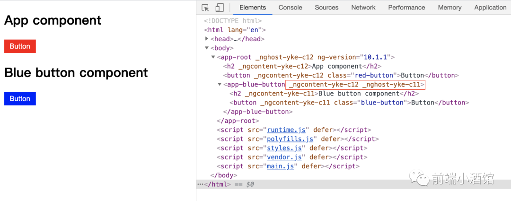 

- **每个组件的宿主元素都会被分配一个唯一的属性**，具体取决于组件的处理顺序，在例子中就是 `_nghost_xxx`

- **每个组件模板中的每个元素还会被分配一个该组件特有的属性**，在例子中就是 `_ngcontent_xxx`

- 每次运行属性字符串都是随机的

  这些属性可以和 CSS 结合起来，比如蓝色按钮的样式会是这样

  ```css
  .blue-button[_ngcontent-yke-c11] { background: blue; }
  ```

  通过这种方式使 `blue-button` 类只能应用于有这个属性的元素上，而不会影响到其他组件中的元素


### :host

`:host` 伪类选择器，用来**作用于组件(宿主元素)本身**

- 要把宿主样式作为条件，就要像函数一样把其它选择器放在 `:host` 后面的括号中
- 通过 `:host` 选择器设置的**样式优先级高**

为组件本身 `app-blue-button` 添加边框，在组件的样式文件中使用 `:host`

```less
:host {
  display: block;
  border: 1px solid red;

  .light-btn: {
    font-weight: normal;
  }
}
```

编译后的样式

```css
[_nghost-yke-c11] {
  display: block;
  border: 1px solid red;    
}
[_nghost-yke-c11] .light-btn[_ngcontent-yke-c11] {
  font-weight: normal;
}
```


### :host-context

`:host-context()` 以函数的形式，在**当前组件宿主元素的祖先节点中查找 CSS 类**， 直到文档的根节点为止

- 基于某些来自组件视图外部的条件应用样式很有用


- 在文档的元素上可能有一个用于表示样式主题 (theme) 的 CSS 类，基于它来决定组件的样式


```typescript
// 根据祖先元素的 CSS 类是 blue-theme 还是 red-theme 来决定哪个 CSS 会生效
@Component({  
selector: 'app-btn-theme',
  template: `<button class="btn-theme">Button</button>`,
  styles: [`
:host-context(.blue-theme) .btn-theme {
	background: blue;
 }
:host-context(.red-theme) .btn-theme {
	background: red;
} 
`]
})
export class BtnThemeComponent { }
```


### ::ng-deep

告知 angular **不要在 `::ng-deep` 之后的元素类型上添加属性修饰**

- 例如 `::ng-deep p span` 经过编译后就是 `p span`，但是这样样式就具有了全局性
- 所以最好**结合 `:host ` 使用**，例如 `:host ::ng-deep p span`

- 主要用来**改变第三方组件的一些样式**

  例如在 `app-header` 组件中，使用 `<nz-breadcrumb>`。默认情况下 `nz-breadcrumb` 会对最后一项加粗。

  ```html
  <nz-breadcrumb>
    <nz-breadcrumb-item>Home</nz-breadcrumb-item>
    <nz-breadcrumb-item>Detail</nz-breadcrumb-item>
  </nz-breadcrumb>
  ```

  编译后的 html

  ```html
  <nz-breadcrumb _ngcontent-c1="" class="ant-breadcrumb">
    <nz-breadcrumb-item _ngcontent-c1="">
      <span class="ant-breadcrumb-link">
        Home
      </span>
      <span class="ant-breadcrumb-separator">/</span></nz-breadcrumb-item>
    <nz-breadcrumb-item _ngcontent-c1="">
      <span class="ant-breadcrumb-link">
        Detail
      </span>
      <span class="ant-breadcrumb-separator">/</span></nz-breadcrumb-item>
  </nz-breadcrumb>
  ```

  对于第三方组件 `nz-breadcrumb` 组件而言，`.ant-breadcrumb-link` 是其组件内部某个 HTML 元素的 `class` 而已，且它有自己的一套组件封装规则。如果想要去掉加粗的样式，直接在 `app-header` 组件的 `styles` 中修改，可能不一定会有想要的结果

  ```css
  :host .ant-breadcrumb-link {
    font-weight: normal;
  }
  /* 编译后 */
  [_nghost-c1] .ant-breadcrumb-link[_ngcontent-c1] {
    font-weight: normal;
  }
  ```

  生成的 CSS 中有 `[_ngcontent-c1]` 属性修饰，导致 `app-header` 组件样式无法改变第三方组件 `nz-breadcrumb` 组件内容的样式

  使用 `::ng-deep` 来**强制样式允许侵入子组件**

  ```css
  :host ::ng-deep .ant-breadcrumb-link {
    font-weight: normal;
  }
  /* 编译后 */
  [_nghost-c1] .ant-breadcrumb-link {
    font-weight: normal;
  }
  ```


## 组件生命周期

### 生命周期执行流程

 

1. `constructor` 构造函数，主要进行依赖注入

2. `ngOnChanges` 输入属性变化时调用

3. `ngOnInit` 组件初始化时调用

4. `ngDoCheck` 脏值检测时调用
5. `ngAfterContentInit` 内容投影完成时调用
6. `ngAfterContentChecked` 检查投影内容时调用
7. `ngAfterViewInit` 组件及子组件视图初始化完成时调用
8. `ngAfterViewChecked` 检查视图变化时调用
9. `ngOnDestroy` 组件销毁时调用


### ngOnChanges

```typescript
ngOnChanges(changes: SimpleChanges) {
  console.log(changes)
}
```

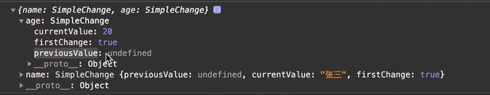 

- **组件的输入属性 `@Input` 变化时调用，可以被触发调用多次**，**第一次是在组件初始化之前**

  没有 `@Input` 变量，不会触发 `ngOnChanges` 事件

- 对于**基本数据类型**来说，只要**值发生变化就可以被检测**

- 对于**引用类型**来说，可以**检测引用地址的变化**，但是检测不到对象内属性值得变化，但是不影响组件模板更新数据

- 参数 `SimpleChanges`，字典型的对象

  - 每一个 `key` 值是**输入的参数属性的名字**，`value` 值是 `simpleChange` 对象

  - `SimpleChanges` 参数**只存储发生变化的数据**，没发生变化的数据不存储

  - `SimpleChanges` 的子属性类型为 `SimpleChange`，**包含当前值，前一个值，是否是第一次改变**

- 主要**用在父子组件传值中**，父组件给子组件传值的时候，以及父组件改变传值的数据时调用
- 要注意父级改变传递值的情况，会导致 `ngOnChange` 在生命周期的任何时刻都可能被再次调用


### ngOninit

- **首次接收到输入属性值后执行**，在第一轮 `ngOnChanges` 完成之后调用

- 组件初始化完成，**在这个函数中可以安全的使用组件的属性和方法**
- 只装载一次

- 主要用来**处理请求数据**


### ngDoCheck

- **脏值检测时被调用**

- `ngOnChanges` 和 `ngDoCheck` 被认为**不应该在同一个组件之中，同时被订阅**

- `ngOnChanges` 是监听自己组件本身的变化，`ngDoCheck` 是 Angular 做整个框架性检查

- **只要输入属性发生变化**，**无论是基本类型还是引用类型，还是引用类型的属性发生变化，都会执行**

- 可以被调用多次


### ngAfterContentInit

- 组件内容初始化

- `ng-content` **投影内容完成时调用**
- 第一次 `ngDoCheck` 之后调用，只调用一次


### ngAfterContentChecked

- 组件内容的脏值检测

- 可以被调用多次，在 `ngAfterContentInit` 和每次 `ngDoCheck` 之后调用


### ngAfterViewInit

- 组件的视图初始化完成

- 一个**组件和它的子组件都初始化完成**之后调用
- 第一次 `ngAfterContentChecked` 之后调用，只调用一次

- **`DOM` 操作都应该在这里处理**


### ngAfterViewChecked

- 组件的视图的脏值检测
- 每次做完组件视图和子视图的变更检测之后调用

- 可以被调用多次，在 `ngAfterViewInit` 和每次 `ngAfterContentChecked` 之后调用


### ngOnDestory 

- 组件、指令、管道或服务被销毁时调用

- 实例被销毁时，做一些清理工作

  清理定时函数

  取消可观察对象

  可以用来在组件销毁时进行数据保存工作


### 父子组件生命周期

1. 父组件的 `constuctor`
2. 子组件的 `constuctor`
3. 父组件的 `ngOnChanges`、`ngOnInit`、`ngDoCheck`、`ngAfterContentInit`、`ngAfterContentChecked`
4. 父组件值传递到子组件，触发子组件的 `OnChanges`
5. 子组件的 `ngOnInit`、`ngDoCheck`、`ngAfterContentInit`、`ngAfterContentChecked`、`ngAfterViewInit`、`ngAfterViewChecked`
6. 父组件的 `ngAfterViewInit`， `ngAfterViewChecked`

注意：

- 父组件将绑定值传入到子组件是在：父组件执行到 `ngAfterContentChecked` 时触发
- 父组件的 `AfterViewInit` 会等到所有的子组件的生命周期执行完成才执行


## 组件输入输出

 

### 父组件给子组件传值 @Input 

```html
<!-- 父组件调用子组件的时候传入数据 -->
<app-header [msg]="msg" [run]='run' [home]='this'></app-header>
```

```typescript
// 子组件引入Input
import { Component, OnInit, Input } from '@angular/core';
// 子组件中@Input 接收父组件传过来的数据
export class HeaderComponent implements OnInit {
  // 如果变量要和属性名不一样，可以在@Input()内写属性的名字
  // @Input('msg') myMsg: string;
  @Input() msg: string;
  // 可以接受父组件的方法作为参数
  @Input() run: any;
  // 甚至可以直接把父组件传过来
  @Input() home: HomeComponent;
  constructor() {}
  ngOnInit() {}
}

// 父组件
export class HomeComponent implements OnInit {
  public msg: string = '我是父组件的msg';
  run() {
    alert('我是父组件的run方法');
  }
}
```


### 子组件触发父组件的方法 @Output 

```typescript
// 子组件
// 子组件引入Output 和EventEmitter
import { Component, OnInit ,Input, Output, EventEmitter } from '@angular/core';

// EventEmitter 事件发射器
// 子组件中实例化EventEmitter
@Output() private outer = new EventEmitter<string>();

// 子组件通过事件驱动EventEmitter对象outer 实例广播数据
sendParent(){
	this.outer.emit('msg from child')
}
```

```html
<!-- 父组件调用子组件时 定义接收广播事件 -->
<!-- outer就是子组件的EventEmitter对象outer -->
<!-- $event是事件所携带的数据 -->
<app-header (outer)="runParent($event)"></app-header>
```

```typescript
// 父组件接收子组件传递过来的数据
runParent(msg:string){
	alert(msg);
}
```


### 子组件获取父组件元素节点

```typescript
// 子组件
export class ChildComponent implements OnInit {
  constructor(private elRef: ElementRef) {}
  ngOnInit() {
    // 获取父元素节点名
    console.log(this.elRef.nativeElement.parentElement.nodeName);
    // 查找祖先节点 IE不支持
    console.log(this.elRef.nativeElement.closest('.parent-element-class'));
  }
}
```


### 父组件调用子组件方法

```typescript
// 子组件
@Component({
  selector: 'app-child',
  template: `<p>child work</p>`
})
export class ChildComponent implements OnInit {
  childPrint() {
    alert("来自子组件的打印");
  }
}
```

```typescript
// 父组件
// 通过模板内部定义子组件变量,在父组件上可以直接调用子组件的方法
@Component({
  selector: 'app-parent',
  template: `
<app-child #child></app-child>
<button (click)="child.childPrint()"></button>`
})
export class ParentAndChildComponent implements OnInit { }
```


### 非父子组件之间的通信

- ##### 公共的服务

  做一个**全局单例的 `service`**，**多个组件共享这个实例**，就可以共享其中的成员，来进行通讯

  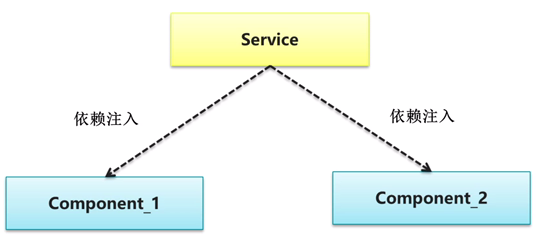 

- ##### Localstorage 或者 Cookie

  弊端：存储空间有限，只能存储字符串

  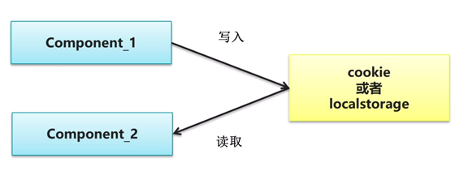 

  ```typescript
  setData(){
    window.localStorage.setItem("test", JSON.stringify({ key: 'test', value: 1 }));
  }
  
  getData() {
   var json = window.localStorage.getItem("test");
   var obj = JSON.parse(json);
   console.log(obj.key);
   console.log(obj.value);
  }
  ```

- ##### 路由传值


## 脏值检测

### 脏值检测基本概念

- 什么是脏值检测：**当数据改变时更新视图** (`DOM`)

- 什么时候触发脏值检测

  1. **浏览器事件**(`click`, `mouseover`, `keyup` 等)
  2. **异步函数**(`setTimeout`, `setInterval` 等）
  3. **HTTP 请求**

- 如何进行脏值检测

  检查两个状态值，当前状态和新状态

- 脏值检测执行顺序

  检查的方向是**单向**的，会**从根组件开始，逐一检测每一个组件**

  检测基于组件树的单向数据流，组件树 + 单项数据流使 Angular 在检测每一个组件时**不需要考虑当前组件会修改父组件的数据**

  检查是同步的操作

  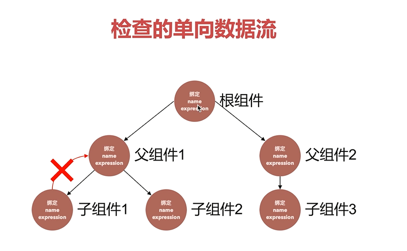  

- 开发模式下脏值检测会进行两遍

  在开发模式下，Angular 会有意的进行两次脏值检测，目的是提示开发者：开发的代码违背了单向数据流的策略

  在**脏值检测之后会进行 `AfterViewChecked` 和 `AfterViewInit` 生命周期方法**

  在**更新视图之后的生命周期方法里**，是**不能改变属性值(绑定的属性)**的，因为会再次引起新的一轮脏值检测，会带来无限循环问题

  这种做法是不符合单向数据流的，因为父组件已经被检测过，虽然界面也会正常的被修改，但是会打印出错误

  进行两次脏值检测是就为了防止无限检测的问题，第一遍脏值检测结束以后，会马上进行第二遍的检测，检测这次的值和上一次的值是否是一致，如果不一致会抛出异常

  ```typescript
  @Component({
    selector: 'app-child',
    template: `<span [textContent]="title"></span>`
  })
  export class ChildComponent implements OnInit {
    _title = 'hi';
    @Input()
    public get title(): string {
      console.log('脏值检测');
      return this._title;
      /* 执行结果：
  		 *	脏值检测
  		 *	脏值检测
  		 */
    }
    ngAfterViewChecked(): void {
      // 在此处会抛出异常，不要在 ngAfterViewChecked 或者 ngAfterViewInit 中去改变属性值
      // this.title = 'hello';
      // 异常为 ExpressionChangedAfterItHasBeenCheckedError
    }
  }
  ```
  
- 使用 `NgZone` 改变属性值

  ```typescript
  import { NgZone } from '@angular/core';
  
  export class ChildComponent {
    _title;
    public get time(): number {
      /** 如果写成下面的代码就会出现异常
       * 这是由于脏值检测是一个单向的同步的检测过程，而且会进行两次检查
       * 这会导致下面的结果在两次检查中值是不一样的，所以会抛出异常 
       */
      // return Date.now();
      return this._time;
    }
    constructor(ngZone: NgZone) { }
    ngAfterViewChecked() {
      // zone.js 提供了在一个浏览器应用中使用不同的运行时上下文的能力
      ngZone.runOutsideAngular(() => {
        // 异步改变值
        setInterval(() => {
          this._time = Date.now();
        }, 1);
      });
    }
  }
  ```

- ##### 使用 DOM 避免脏值检测的无限循环

  ```html
  <!--
  <span [textContent]="time | date: 'HH:mm:ss:SSS'"></span>
  -->
  <span #timeRef></span>
  ```

  ```typescript
  export class ChildComponent {
    @ViewChild('timeRef') timeRef: ElementRef;
    constructor(rd: Renderer2) {
      /* 引发脏值检测的无限循环，当然如果不是性能出现很大的问题，这样做也可以
  		setInterval(() => {
  		  this.time = Date.now();
  		  cd.markForCheck();
  		}, 100);
     */
  
      // 如果不使用绑定，采用直接写 DOM 的形式可以解决脏值检测无限循环的带来的性能问题
      setInterval(() => {
        rd.setProperty(
          this.timeRef.nativeElement, 'innerText',
          // 管道使用的变换函数也可以直接在类中使用
          // 下面的 formatDate 就是 DatePipe 的变换函数
          formatDate(Date.now(), 'HH:mm:ss:SSS', 'zh-Hans')
        );
      }, 100);
    }
  }
  ```

- 使用异步更新属性的值

  变化监测是同步执行的，如果在代码中异步更新属性的值，那么在第二次验证循环运行时这些属性是不会被改变的

  ```typescript
  ngAfterViewInit() {
    setTimeout(() => {
      this.title = 'hello';
    });
  }
  ```


### NgZone

Angular 引入 Zone.js 以处理变更检测

具体来说，Zone.js 通过对所有常见的**异步 API 打上了“补丁” 以追踪所有的异步操作**，进而使 Angular 可以决定何时刷新 UI

- 什么是 Zone

  Zone 是一种用于拦截和跟踪异步工作的机制。

- 什么是 NgZone

  Zone.js 将会对每一个异步操作创建一个 task，一个 task 运行于一个 Zone 中

  通常来说， 在 Angular 应用中，每个 task 都会在 Angular Zone 中运行，这个 Zone 被称为 NgZone

  一个 Angular 应用中只存在一个 Angular Zone，而变更检测只会由运行于这个 NgZone 中的异步操作触发。

- `runOutsideAngular`

  函数 `runOutsideAngular` 用于确保**代码于 NgZone 之外运行**，即保证 Angular 的**变更检测不会因为相关代码而触发**

  ```typescript
  // setInterval 定时器不会触发变更检测
  constructor(private ngZone: NgZone) {
    this.ngZone.runOutsideAngular(() => {
      setInterval(() => doSomething(), 100)
    });
  }
  ```

- `run`

  `run` 方法的目的与 `runOutsideAngular` 正好相反，任何写在 `run` 里的方法，都会进入 Angular Zone 的管辖范围

  ```typescript
  // 通过 run() 方法使得在 Zone 之外的操作重新又进入了 Zone 的管辖范围
  num = 0;
  constructor(private zone: NgZone) {
    this.zone.runOutsideAngular(() => {
      let i = 0;
      const token = setInterval(() => {
        this.zone.run(() => {
          this.num = ++i;
        })
  
        if (i == 10) {
          clearInterval(token);
        }
      }, 1000);
    })
  }
  ```

- ##### NgZone 和 rxjs 结合使用，在 Zone 外创建数据流、Zone 内订阅数据流

  ```typescript
  notify$ = new Subject();
  
  ngOnInit() {
    this.notify$.subscribe(() => {
      this.message = 'timeout';
    })
  }
  
  constructor(private zone: NgZone) {
    // 将过期时间保存在 localStorage 中
    localStorage.setItem('expiredDate', addMinutes(new Date(), 1).getTime().toString());
    // 一旦时间过期，runOutsideAngular 中的定时器便会通知 Zone 中的 message 更新并同时清除自己
    this.zone.runOutsideAngular(() => {
      const i = setInterval(() => {
        const expiredDate = +localStorage.getItem('expiredDate');
        if (new Date().getTime() - expiredDate > 0) {
          this.zone.run(() => {
            this.notify$.next();
          })
          clearInterval(i);
        };
      }, 1000)
      })
  }
  ```


###  变更检测策略

- 默认策略 `ChangeDetectionStrategy.Default`

  不管在任何一个地方发生了一个变化，脏值检测都会把整个树跑一遍。

  不会有遗漏，但是树过大，性能降低

- 变更检测策略 `ChangeDetectionStrategy.OnPush`

  只对组件当中的**有 `@Input` 注解的属性进行检测**

  这个属性发生了改变，就会引发一次脏值检测；不改变，不检测

  如果没有检测到组件的变化，那就没有必要检测其子组件树的变化了，因为开发者说了：如果我没变，我的子组件是不会变的

  检测也**只检查有脏值检测发生的节点和它的子组件**

  **有时需要手动通知框架进行脏值检测**

  如果子组件设置了 `OnPush` 策略，**子组件所有的状态的改变，都依赖于父组件的 `@Input`**

  ```typescript
  @Component({
    selector: 'app-parent',
    templateUrl: './parent.component.html'
    // OnPush策略
    changeDetection: ChangeDetectionStrategy.Default
  })
  export class ParentComponent implements OnInit { }
  ```


### ChangeDetectorRef

#### 配置使用

- 引入 `ChangeDetectorRef` 模块

  ```typescript
  import { ChangeDetectorRef } from "angular";
  ```

- 声明

  ```typescript
  constructor(private cd: ChangeDetectorRef) 
  ```

- 使用

  ```typescript
  this.cd.detectChanges();
  ```


#### markForCheck

**通知框架执行脏值检测**，忽视当前组件或是父组件中 `OnPush` 的影响

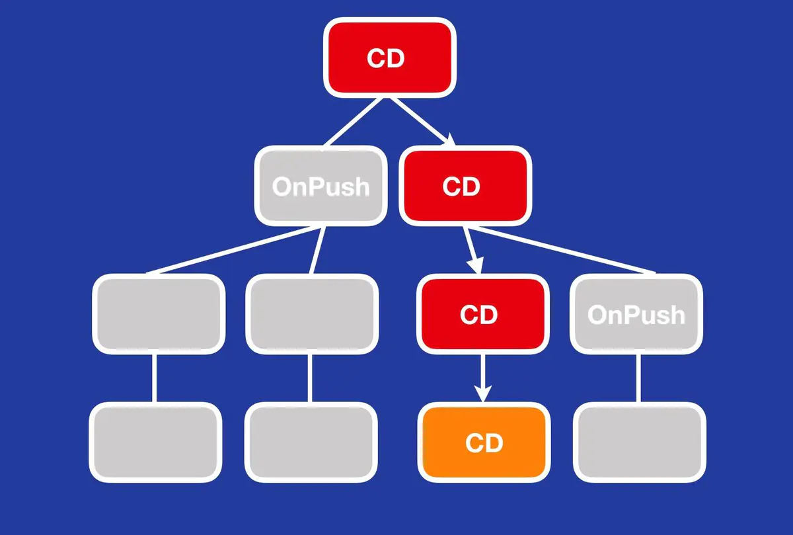 

- ##### 手动通知框架进行脏值检测

  如果设置了 `OnPush` 策略，没有 `Input` 参数，但是**有其他（例如路径，http 获取数据等）参数会发生变化**

  这些**变化会被系统忽略掉**，**需要手动通知系统属性的变化**
  
  ```typescript
  @Component({
    changeDetection: ChangeDetectionStrategy.OnPush
  })
  export class HomeDetailComponent implements OnInit {
    constructor(private cd: ChangeDetectorRef) { }
    selectedTabLink;
    ngOnInit() {
      // 路径参数发生变化
      this.route.paramMap.subscribe(params => {
        console.log('路径参数: ', params);
        this.selectedTabLink = params.get('tabLink');
        // 发生变化，通知系统检查
        this.cd.markForCheck();
      });
    }
  }
  ```


#### detectChanges

该方法会从当前组件到各个子组件开始触发一次变化检测

与 `detach()` 结合，可以实现局部变更检测

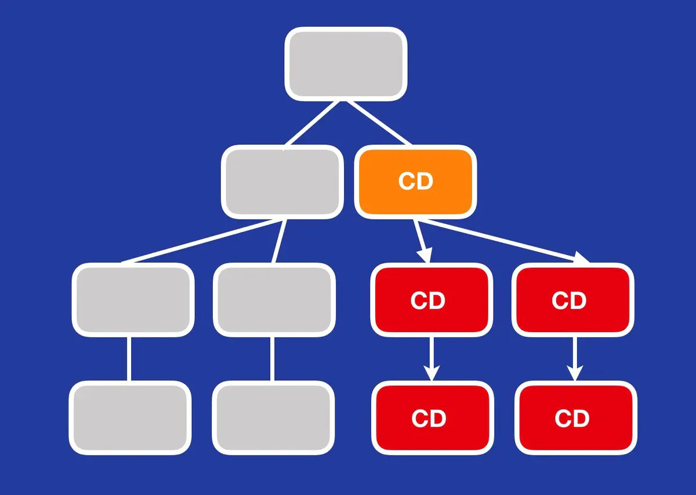 


#### checkNoChanges

该方法会从当前组件到各个子组件开始触发一次变化检测，如果有检测某个组件发生了变化，抛出异常并停止检测。

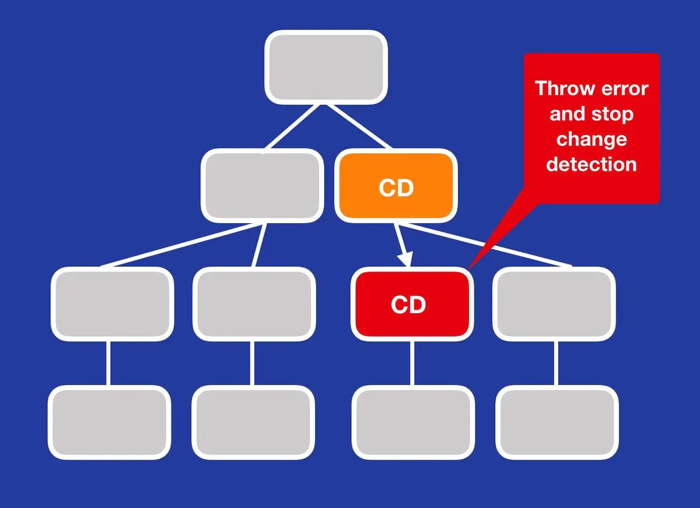 


#### detach，reattach

手动将所在组件与其子组件分离或是重新连接

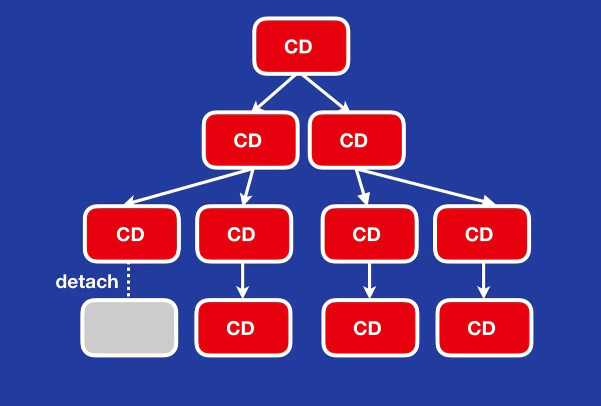 


## 动态组件

### 宿主视图

宿主视图是在动态实例化组件时创建的，可以通过容器 `ViewContainerRef` 的 `createComponent` 方法，实例化并插入组件到容器

- 当需要添加新的 DOM 元素时（组件、模版），需要一个可以插入这个元素的位置，可以使用 `ViewContainerRef` 作为新组件的兄弟节点的 DOM 元素 / 容器，任何 DOM 元素都可以作为 `ViewContainerRef` 容器

- 创建出来的组件**在宿主元素外面**，**作为宿主元素兄弟节点**被插入  

- 使用 `ViewContainerRef` 对象的 `createComponent` 方法实例化一个组件，并将宿主视图插入到容器

  `createComponent(componentType, options?)`

  

- 通过 **`#` 模板变量标记插入点**，来插入动态组件

  ```html
  <button (click)='createComponent()'>创建组件</button>
  <ng-container #container>Container</ng-container>
  ```

  ```typescript
  export class SampleComponent {
    @Input() adComponent: AdComponent;
    // 通过 ViewChild 获取 ViewContainerRef
    @ViewChild('container', { read: ViewContainerRef }) container: ViewContainerRef; 
    // angular13 之前写法
    // constructor(private componentFactoryResolver: ComponentFactoryResolver) {} 
    createComponent() {
     	this.container.clear();
      /* angular13之前写法
      const factory = this.componentFactoryResolver.resolveComponentFactory(TimeComponent); 
  		this.componentRef = this.container.createComponent(factory);
      **/ 
      // 插入动态组件，返回 ComponentRef 的组件实例
      this.componentRef = this.container.createComponent(adComponent);
      // 为组件传参
      this.componentRef.instance.time = new Date();
    }
  }
  ```

- 通过**指令标记组件插入点**，来插入动态组件

  ```typescript
  // 使用指令来在模板中标记出有效的插入点
  @Directive({
    selector: '[adHost]',
  })
  export class AdDirective {
    // 依赖注入 ViewContainerRef 来获取对容器视图的访问权
    // 容器就是要动态加入的组件的宿主
    constructor(public viewContainerRef: ViewContainerRef) { }
  }
  ```
  
  ```html
  <div class="ad-banner-example">
    <h3>Advertisements</h3>
    <!-- 指示组件动态加载位置，使用 ng-template 不会渲染任何额外的输出 -->
    <ng-template adHost></ng-template>
  </div>
  ```
  
  ```typescript
  export class AdBannerComponent  {
    @Input() component;  	// 传入的组件
    @Input() params;			// 要插入的组件的参数
    @ViewChild(AdDirective, { static: true }) adHost!: AdDirective;  // 指令实例
    ngOnInit() {
      this.loadComponent();
    }
    loadComponent() {
      // 组件要插入到的位置：访问宿主的 viewContainerRef
      const viewContainerRef = this.adHost.viewContainerRef;
      viewContainerRef.clear();
      // 调用 ViewContainerRef 的 createComponent()，将组件添加到模板中
      // 返回组件实例
      const componentRef = viewContainerRef.createComponent<AdComponent>(this.component);
      // 向组件传参 
      componentRef.instance.data = this.params;
    }
  }
  ```

- 传递动态组件定义的 `Input` 和 `Output` 参数

  ```typescript
  // 动态组件定义
  export class LazyFormComponent {
    @Input() buttonTitle: string = "Submit";
    @Output() formSubmitted = new EventEmitter();
    submitForm() {
      this.formSubmitted.emit();
    }
  }
  ```

  ```typescript
  export class SampleComponent {
    formSubmittedSubscription = new Subscription();
    loadForm() {
      this.componentRef = this.container.createComponent(TimeComponent);
      // 为组件传递 buttonTitle 参数
      this.componentRef.instance.buttonTitle = "Contact Us";
      // 为组件传递 formSubmitted 事件函数
      this.formSubmittedSubscription = this.componentRef.instance.formSubmitted.subscribe(
        () => console.log("The Form Submit Event is captured!")
      );
    }
    ngOnDestroy(): void {
      this.formSubmittedSubscription.unsubscribe();
    }
  }
  ```

- 依赖服务的动态组件，需要

  ```
  
  ```

  


### 传送点 portal

Angular-cdk 的 `Portal` 包提供了一个灵活的布局体系，可以把动态内容渲染到应用中

- 安装 Angular-cdk，导入 `Portal` 模块

  ```bash
  npm i @angular/cdk
  ```

  ```typescript
  import { PortalModule } from '@angular/cdk/portal';
  ```

- `portal` 是要动态渲染到页面的内容，渲染到页面上的空白插槽（ `PortalOutlet` ）中
- `portal` 可以是组件（`ComponentPortal `），模板 `TemplateRef `（`TemplatePortal`），DOM 元素（`DomPortal`）
- `PortalOutlet` 相当于页面上的空白插槽，可以将 `portal` 放在 `PortalOutlet` 中渲染出来


#### 组件传送点 ComponentPortal

实例化组件作为传送点 `ComponentPortal`

底层的实现原理是 `ViewContainerRef.createComponent()`

```typescript
// 参数1：组件
// 参数2：视图容器，决定了该组件将附着到组件树的哪个位置，可选
// 参数3：用于实例化组件的注入器，可选
// 参数4：默认会使用outlet的componentFactoryResolver，可选
const componentPortal = new ComponentPortal(component); 
const componentPortal = new ComponentPortal(component, viewContainerRef, injector, componentFactoryResolver);
```

```typescript
// 注入令牌 
export class TimeToken {
  time: Date
}
// 要插入的组件
@Component({
  selector: 'component-portal-example',
  template: `要插入的组件 {{ time | date: 'HH:mm:ss' }}`,
})
export class ComponentPortalExample {
  time: Date;
  constructor(private timeToken: TimeToken) {
    // 获取注入器传入的参数 
    this.time = timeToken.time;
  }
}
```

```html
<div class="example-portal-outlet">
  <!-- 将selectedPortal挂载到PortalOutlet上 -->
  <ng-template [cdkPortalOutlet]="selectedPortal"></ng-template>
</div>
<button (click)="selectedPortal = componentPortal">Render component portal</button>
```

```typescript
import { Portal, ComponentPortal } from '@angular/cdk/portal';

export class CdkPortalOverviewExample implements AfterViewInit {
  selectedPortal: Portal<any>;
  componentPortal: ComponentPortal<ComponentPortalExample>;
  ngAfterViewInit() {
    // 通过注入器传参 
    const injector = Injector.create({ 
      providers: [{ provide: TimeToken, useValue: {time: new Date()}}]
    });
    // 创建portal
    this.componentPortal = new ComponentPortal(ComponentPortalExample, null, Injector);
  }
}
```


#### 模板传送点 TemplatePortal

实例化内嵌式视图模板作为传送点 `TemplatePortal`

底层的实现原理是 `ViewContainerRef.createEmbeddedView()` 来创建嵌入视图

```typescript
// 参数1：实例化宿主中内嵌视图的模板
// 参数2：对视图容器的引用，模板将被插入的哪个视图容器，可选
// 参数3：内嵌视图的上下文数据context，可选
// 参数4：内嵌视图的依赖注入器，可选
const templatePortal = new TemplatePortal(templateRef, viewContainerRef); 
const templatePortal = new TemplatePortal(templateRef, viewContainerRef, context, injector);
```

- 通过**依赖注入**，获取依赖组件的 `ViewContainerRef` 实例

  ```html
  <div class="example-portal-outlet">
    <ng-template [cdkPortalOutlet]="selectedPortal"></ng-template>
  </div>
  <button (click)="selectedPortal = templatePortal">Render template portal</button>
  <ng-template #templatePortalContent>Hello, this is a template portal</ng-template>
  ```

  ```typescript
  import { Portal, TemplatePortal } from '@angular/cdk/portal';
  
  export class CdkPortalOverviewExample implements AfterViewInit {
    @ViewChild('templatePortalContent') templatePortalContent: TemplateRef<unknown>;
    selectedPortal: Portal<any>;
    templatePortal: TemplatePortal<any>;
    // 依赖注入ViewContainerRef
    constructor(private _viewContainerRef: ViewContainerRef) {}
    ngAfterViewInit() {
      // 创建portal
      this.templatePortal = new TemplatePortal(this.templatePortalContent, this._viewContainerRef);
    }
  }
  ```

- 使用 **`CdkPortal` 指令**，便捷获取 `TemplatePortal` 的实例

  ```html
  <ng-template cdkPortal #myTemplate="cdkPortal">
    Hello, this is a template portal
  </ng-template>
  ```

  ```typescript
  import { Portal, TemplatePortal } from '@angular/cdk/portal';
  
  export class CdkPortalOverviewExample implements AfterViewInit {
    @ViewChild('myTemplate') myTemplate: TemplatePortal<any>;
    selectedPortal: Portal<any>;
  	ngAfterViewInit() {
  		this.selectedPortal = myTemplate;
    }
  }
  ```


#### DOM 传送点 DomPortal

通过 `DomPortal` 移动原生 DOM 元素，但是移动带有属性绑定或指令的 DOM 元素，可能不会再持续更新

```html
<div class="example-portal-outlet">
  <ng-template [cdkPortalOutlet]="selectedPortal"></ng-template>
</div>
<button (click)="selectedPortal = domPortal">Render DOM portal</button>
<div #domPortalContent>Hello, this is a DOM portal</div>
```

```typescript
import { Portal, DomPortal } from '@angular/cdk/portal';

export class CdkPortalOverviewExample implements AfterViewInit {
  // 获取ElementRef来创建DomPortal实例
  @ViewChild('domPortalContent') domPortalContent: ElementRef<HTMLElement>;
  selectedPortal: Portal<any>;
  domPortal: DomPortal<any>;
  ngAfterViewInit() {
    // 创建portal
    this.domPortal = new DomPortal(this.domPortalContent);
  }
}
```


#### 结构容器 DomPortalOutlet

在不能使用 `cdkPortalOutlet` 指令的场景下，例如浮层 `overlay`，不能通过在 `ng-template` 中去使用 `cdkPortalOutlet` 指令来让浮层渲染在页面中

- 创建 `OverlayRef` 实例，使用 `DomPortalOutlet` 来创建用于渲染内容的插槽

  ```typescript
  import { OverlayConfig, OverlayModule } from '@angular/cdk/overlay';
  export class AppComponent {
    private overlayRef?: OverlayRef
    constructor(private readonly overlay: Overlay) {}
    // 打开浮层
    showOverlay() {
      const config: OverlayConfig = { width: 'auto', height: 'auto' };
      // 创建Overlay实例,overlay实例上就是一个PortalOutlet 
      this.overlayRef = this.overlay.create(config);
      // 创建portal
      const componentPortal = new ComponentPortal(OverlayContentComponent, null, Injector);
      // 将portal挂载到Ovelay实例上
      overlayRef.attach(componentPortal); 
    }
    // 关闭浮层
    closeOverlay() {
      // 销毁
      this.overlayRef?.dispose();
      // 拆除
      // this.overlayRef?.detach();
      this.overlayRef = undefined;
    }
  }
  ```

  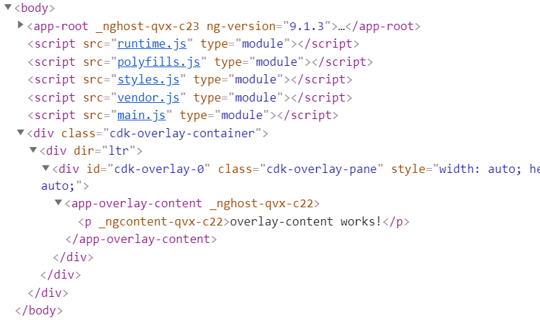 

- `overlay` 表示位置

  - 全局位置策略 `GlobalPositionStrategy`

    全局位置类似于 `fix` 布局，常用于页面的全局提示与反馈

    ```typescript
    // 创建位置策略 
    const positionStrategy = this.overlay.position().global().top(`200px`).centerHorizontally(); 
    // 创建Overlay实例 
    this.overlayRef = this.overlay.create({ positionStrategy }); 
    // 创建弹框组件portal 
    const portal = new ComponentPortal(ModalComponent, this.viewContainerRef);
    this.overlayRef.attach(portal);
    ```

  - 灵活连接点位置策略 `FlexibleConnectedPositionStrategy`

    常应用于下拉框等 popover 式组件

    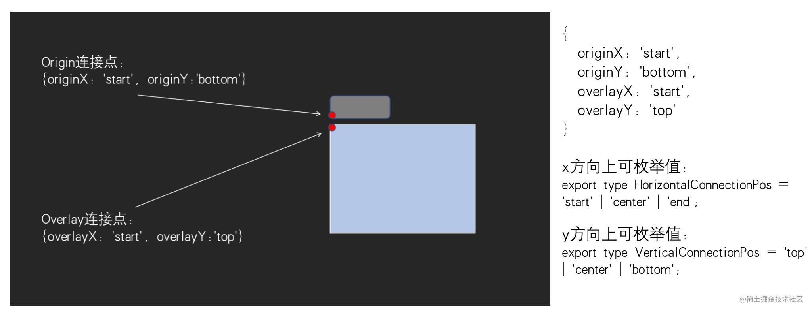 

    ```typescript
    const positionStrategy = this.overlay.position().flexibleConnectedTo(this.overlayOrigin.elementRef) 
    // 数组里越靠前的position优先级越高
    // 当优先级高的位置会导致元素放不下（如被浏览器遮挡）时，就会使用优先级低一些的position
    .withPositions([{
      originX: `start`, 
      originY: `bottom`, 
      overlayX: `start`, 
      overlayY: `top`
    },{ 
      originX: `start`, 
      originY: `top`,
      overlayX: `start`, 
      overlayY: `bottom`, 
      panelClass: `red` // 可以给动态创建的组件所在容器加类名 
    }]);
    ```


# 模板 Template 

## 数据绑定

- 使用**方括号 `[]` 是数据绑定**，如果带方括号，等号后面就是一个对象或表达式


- 不使用方括号是字符串，但如果此时在等号后使用 `{{}}` 就是和方括号等效的

  （如果绑定的数据有 `.` 如 `class.active` 则不能使用 `{{}}` ）

- 插值表达式

  ```html
  <h1>{{ title }}</h1>
  <h1>{{ 'Hello World' }}</h1>
  <h1>{{ getInfo() }}</h1>
  <h1>{{ a == b ? '相等' : '不等' }}</h1>
  ```

- html 绑定

  ```typescript
  this.h="<h2>这是一个h2 用[innerHTML]来解析</h2>"
  ```

  ```html
  <div [innerHTML]="h"></div>
  ```

- 数据绑定容错处理

  ```html
  <!-- 
  interface Task {
  	person?:{ name: string }
  }
  -->
  <span *ngIf="task.person">{{ task.person.name }}</span>
  <span>{{ task.person?.name }}</span>
  ```


## 属性绑定

- DOM 属性绑定

  ```html
  <div [id]="id" [title]="msg">我的属性</div>
  ```

- 标记属性绑定

  ```html
  <!-- [attr.属性名称] 标记属性或者自定义的HTML属性绑定-->
  <td [attr.colspan]="colSpan"></td>
  ```

- 单个样式绑定

  ```html
  <div class="title" [class.className]="条件表达式">
    对于单个样式的条件绑定最为合适
  </div>
  <a href="#" [class.active]="selectedIndex === i" (click)="selectedIndex = i">
    {{ menu.title }}
  </a>
  ```

- class 属性绑定

  ```html
  <div [ngClass]="{'active': true, 'error': true}"></div>
  ```

- style 属性绑定

  ```html
  <button [style.backgroundColor]="isActive ? 'blue' : 'red'">按钮</button>
  <button [ngStyle]="{'backgroundColor': 'red'}">按钮</button>
  ```


## 事件绑定

- **圆括号 `()` 用于事件绑定**，等号后可以接表达式也可以是一个定义在类中的函数

- **可以传入事件对象 `$event`**

```html
<button class="button" (click)="getData()">
  点击按钮触发事件
</button>
```

```html
<!-- (事件名)="模板语句"  事件对象：$event -->
<input type="text" (keyup)="keyUpFn($event)"/>
<input type="text" (keyup.enter)="keyUpFn($event)"/>
```

```typescript
// 事件对象 event
keyUpFn(event: Event){
  console.log(event)
}
```


## 双向数据绑定

### 双向绑定

`ngModel` 应用于表单

```html
<input [(ngModel)]="username"/>
```

- `FormsModule` 中提供的指令，注意引入：`FormsModule`

  ```typescript
  import { FormsModule } from '@angular/forms';
  @NgModule({
    declarations: [AppComponent],
    imports: [BrowserModule, FormsModule],
    providers: [],
    bootstrap: [AppComponent]
  })
  export class AppModule { }
  ```
  
- 使用 `[(ngModel)]="变量"`  形式进行双向绑定，其实是一个**语法糖**

  ```html
  <!-- 等同于 -->
  <input [ngModel]="username" (ngModelChange)="username = $event"/>
  ```

- 双向绑定就是**属性绑定加事件绑定**

  ```html
  <!-- 等同于 -->
  <input [value]="username" (input)="username = $event.target.value"/>
  ```

  - `[value]="username"` 绑定 `username` 值到 `<input>` 的 `value`
  - `(input)=“表达式”` 绑定表达式到 `<input>` 的 `input` 事件
  - `username = $event.traget.value` 在 `input` 事件触发时执行
  - `$event` 表达式，提供事件的数据

- ##### 其他表单标签

  ```html
  <input type="radio" value="1" name="sex" id="sex1" [(ngModel)]="usersex"/>
  <label for="sex1">男</label>
  <input type="radio" value="2" name="sex" id="sex2" [(ngModel)]="usersex"/>
  <label for="sex2">女</label>
  ```
  
  ```html
  <select name="city" id="city" [(ngModel)]="usercity">
  	<option [value]="item" *ngFor="let item of cityList">{{item}}</option>
  </select>
  ```
  
  ```html
  <span *ngFor="let item of hobbies;let key=index;">
  	<input type="checkbox" [id]="'check'+key" [(ngModel)]="item.checked"/> 
      <label [for]="'check'+key"> {{item.title}}</label>
  </span>
  ```
  
  ```html
  <textarea name="mark" id="mark" cols="30" rows="10" [(ngModel)]="usermark"></textarea>
  ```


### 自定义双向绑定

```typescript
export class HorizonGridComponent {
  
  @Output() usernameChange = new EventEmitter();

  private _username = '';   
  @Input()
  public get username (): string {
    return this._username;
  }
  public set username (value: string) {
    this._username = value;
    // 在完成属性绑定的同时，也进行了事件绑定
    this.usernameChange.emit(value);
  }
}
```

```html
<app-horizon-grid [(username)]="username"></app-horizon-grid>
<!-- 等同于 -->
<app-horizon-grid (username)="username" (usernameChange)="username = $event"></app-horizon-grid>
```


## 模板引用

### 模板引用变量

在模板中使用井号 `#` 来声明一个模板变量

- 对 DOM 元素的引用

  ```html
  <!-- #phone值为input元素的HTMLElement对象实例 -->
  <input #phone placeholder="phone number" />
  <!-- phone有HTMLElement对象的任何属性和方法 -->
  <!-- 避免了使用ngModel等数据绑定 -->
  <button type="button" (click)="callPhone(phone.value)">Call</button>
  ```

- 对组件的引用

  ```typescript
  @Component({
    selector: 'app-hello',
    template: `
      <div>
        <h2>Hello {{name}}</h2>
      </div>
    `
  })
  export class HelloComponent {
    name = 'Angular';
  }
  ```

  ```html
  <app-hello #helloComp></app-hello>
  {{ helloComp.name }}
  ```

- 对指令的引用

    如果用模版引用变量来指向这个指令，指令的名称就是 `exportAs` 选项指定的内容

  ```typescript
  @Directive({
    selector: 'form:not([ngNoForm]):not([formGroup]),ngForm,[ngForm]',
    exportAs: 'ngForm'
  })
  ```

  ```html
  <form (ngSubmit)="onSubmit(myForm)" #f="ngForm">
    <input name="first" ngModel required #first="ngModel">
  </form>
  <p>Form valid: {{ f.valid }}</p>
  <p>First name value: {{ first.value }}</p>
  ```


### 获取 DOM 节点 @ViewChild

`ViewChild` 用来在类中**引用模板中的视图节点**

- 可以是 Angular 组件，可以是 HTML 元素 `ElementRef`，也可以是 `TemplateRef` 和 `ViewContainerRef`
- **在 `AfterViewInit` 中可以安全的使用** `@ViewChild` 引用的元素
- 推荐**使用 `Renderer2` 操作 DOM 元素**，防止注入攻击
- 真正的 DOM 节点是 `nativeElement` 里

```html
<!-- #号后面是给模板或者DOM元素一个引用名字，以便可以在组件类或模板中进行引用 -->
<!-- #id是唯一标识，注意在ngfor循环中的使用 -->
<div #helloDiv>你好</div>
```

```typescript
import { Component, ViewChild, ElementRef } from '@angular/core';
export class AppComponent{
  // ViewChild是一个选择器，用来查找要引用的DOM元素或组件
  // ElementRef是DOM元素的一个包装类
  // 因为DOM元素不是Angular中的类，所以需要一个包装类以便在Angular中使用和标识其类型
  // ElementRef可以加泛型形式 例如 ElementRef<HTMLParagraphElement>
  @ViewChild('helloDiv') helloDivRef: ElementRef;
}
```

- 使用 `Renderer2` 操作 DOM 元素

  ```html
  
  ```

  ```typescript
  import { Renderer2 } from '@angular/core';
  
  export class ImageSliderComponent {
    @ViewChildren('img') imgs: QueryList <ElementRef>;
    constructor(private rd2: Renderer2) { }
    ngAfterViewInit() {
      this.imgs.forEach((ele) => {
        this.rd2.setStyle(ele.nativeElement, 'height', '200px');
      });
    }
  }
  ```

- 静态选项 `static`

  - 如果**元素没有在 `ngif` 或 `ngfor` 的包含之下 `static` 就是 `true`**，反之是 `false`

  - 为 `true` 则在变更检测运行之前解析查询结果，为 `false`，则在变更检测之后解析

  - 默认为 `false`

  ```typescript
  @ViewChild('imageSlider', { static: true }) imgSlider: ElementRef;
  ```

- 引用的视图节点使用其他格式解析 `read`

  视图节点元素都可以解析成 `ElementRef` 和 `ViewContainerRef`

  ```html
  <one></one>
  ```

  ```typescript
  // 这样获取只能获取到OneComponent组件实例
  @ViewChild(OneComponent) one: OneComponent;
  // 如果想要按照ElementRef来获取时，指定read为ElementRef
  @ViewChild(OneComponent, { read: ElementRef }) one: ElementRef;
  ```


### 获取多个 DOM 节点 @ViewChildren

`ViewChildren` 引用多个模板元素

```typescript
// 引用多个模板元素
@ViewChildren('img') imgs: QueryList<ElementRef>;
```

输出的 `QueryList` 对象

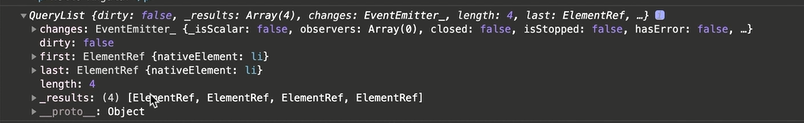 

```typescript
// 获取ElementRef集合，其中有nativeElement
this.imgs.toArray();
```

```typescript
// 可以直接操作DOM，但是不提倡，会造成注入攻击
this.imgs.ForEach(item => item.nativeElement.style.height = '100px');
// 提倡的方式是使用Renderer2
this.imgs.ForEach(item => {
  this.rd2.setStyle(item.nativeElement, 'height', '100px');
});
```


### 获取组件实例

- 父组件获取子组件实例，`viewChild` 可以使用引用名，也可以使用组件类型

  ```html
  <app-image-slider [sliders]="imageSliders"></app-image-slider>
  ```

  ```typescript
  // 引用模板中的Angular组件时，viewChild 可以使用引用名，也可以使用组件类型
  @ViewChild(ImageSliderComponent) imageSlider: ImageSliderComponent;
  ```

- 使用引用名获取

  ```html
  <app-footer #footerChild></app-footer>
  ```

  ```typescript
  @ViewChild('footerChild') footer;
  // 调用子组件方法
  run(){
    this.footer.footerRun();
  }
  ```


## 内容投影

### 单内容投影

- 子组件可以通过投影方式嵌入父组件，投影内容显示位置 `<ng-content></ng-content>`


- `<ng-content>` 元素是一个**占位符**，不会创建真正的 DOM 元素，等价于 `node.appendChild(el)`
  只是移动元素，节点不被克隆，被简单地移动到新位置
- 因为不会创建传入的模板，就算用 `ngFor` 套住 `<ng-content>` 中的组件也不会出现多个
- `<ng-content>` 中的组件**只会被实例化一次** ，从未被销毁和重新创建，即 `ngOnInit()` 只执行一次
- 投影内容的生命周期将被绑定到它被声明的地方，而不是显示在地方
- 使用场景：**动态内容、容器组件、有冗余的事件传递**

```typescript
// 父组件
@Component({
  selector: 'app-list',
  // 子组件，通过投影方式嵌入
  template: `<ng-content></ng-content>`
})
```

```html
<app-list>
  <!-- 子组件投影内容 -->
  <app-list-item></app-list-item>
</app-list>
```


### 多内容投影

- 使用 `<ng-content>` 的 `select` 属性，可以**选择投影的内容**，没有设置 `select` 属性则所有内容都可以投影

  `<ng-content select="样式类/HTML标签/指令"><ng-content>`

- `select` 添加约束，`select` 的值**不能设置为动态**的

- 约束作用在**直接子节点**上

```html
<!-- 只选取标签 -->
<ng-content select="span"></ng-content>
<!-- 只选取样式类 -->
<ng-content select=".special"></ng-content>
<!-- 只选取指令 -->
<ng-content select="[appGridItem]"></ng-content>
<!-- 只选取属性key="value" -->
<ng-content select="[name=test]"></ng-content>
<!-- 可以写多个ng-content，以及带有不同的约束 -->
```

- ##### 应用投影组件做容器

  `<ng-content>` 在浏览器中会被 `<div class="heading"></div>` 所替代，

  如果不想要这个额外的 `div`，可以使用 `<ng-container>` 替代这个`div`，`<ng-container>` 本身未在 DOM 树中渲染

  ```html
  <bootstrap-panel>
    <!-- <ng-container class="heading">Heading</ng-container> -->
    <div class="heading">Heading</div>
    <div class="body">Body</div>
  </bootstrap-panel>
  ```

  ```html
  <!-- panel.component.html -->
  <div class="panel panel-default">
    <div class="panel-heading">
      <!-- 显示类名为heading的部分 -->
      <ng-content select=".heading"></ng-content>
    </div>
    <div class="panel-body">
      <!-- 显示类名为body的部分 -->
      <ng-content select=".body"></ng-content>
    </div>
  </div>
  ```

- ##### ngProjectAs 指定别名

  `ngProjectAs` 指定的就是 `select` 所定义的选择器名

  ```html
  <!-- 父组件 app-content-section -->
  <div>
    <ng-content select="app-content-child"></ng-content>
  </div>
  ```

  ```html
  <!-- 下面中情况中，ng-content没有投射到对应的内容 -->
  <app-content-section>
    <ng-container>
      <app-content-child [title]="'测试'"></app-content-child>
    </ng-container>
  </app-content-section>
  
  <!-- 通过使用ngProjectAs设置别名让ng-content的内容能正确的投射过来 -->
  <app-content-section>
    <ng-container ngProjectAs="app-content-child">
      <app-content-child [title]="'测试'"></app-content-child>
    </ng-container>
  </app-content-section>
  ```

  

### 内嵌视图 NgTemplateOutlet

`*ngTemplateOutlet="templateRefExp; content: contentExp"`

`templateRefExp` 为 `<ng-template>` 元素的 `#ID`，`contentExp` 为传递的数据上下文

```html
<!-- ngTemplateOutlet指定了要实例化下面的名为name的ng-template -->
<!-- context指定了myContext作为实例化的数据上下文传入 -->
<ng-container *ngTemplateOutlet="name; context: myContext"></ng-container>
<!-- ng-template中使用let-key='value'的方式获取传输的数据上下文 -->
<ng-template #name let-name="data"><span>Hello {{name}}!</span></ng-template>
```

- `NgTemplateOutlet` 指令可以来在**模板的指定位置实例化一个 `TemplateRef` 对象**
- **同时在实例化的过程中可以传入一个数据对象**，每个对象可能有一个或多个值

- `TemplateRef`  可以通过 `<ng-template>` 标签来创建
- `<ng-template>` 元素可以让组件根据想要的任何条件显式渲染内容，并**可以进行多次渲染**
- 在**显示渲染之前**，**不会初始化**该元素的内容

- `content` 对象使用 `$implicit ` 会把对应的值设置为默认值

- 如果 `content` 对象只有一个值，就可以不指定名称

  `{ name: 'jack' }` 可以写成 `{ $implicit: 'jack' }`

  `<ng-template>` 获取的时候，`let-showName="name"` 可以写成 `let-showName`

  ```html
  <ng-container *ngTemplateOutlet="tplStu; context: { $implicit: 'jack' , age: '19'}"></ng-container>
  <ng-template #tplStu let-name let-ageHTML="age">
    hello {{ name }},your age is {{ ageHTML }}
  </ng-template>
  ```

- 模板由外界子内容传入

  使用 `<ng-content>` 可以更方便的控制传入的模板在 DOM 中的位置，使用 `ngTemplateOutlet` 可以**向传入的模板传递渲染数据**

  ```typescript
  @Component({
    selector: 'wrapper',
    template: `<ng-container *ngTemplateOutlet="name; context: myContext"></ng-container>`
  })
  class NgTemplateOutletExample {
    // 使用@ContentChild手动捕获模板
    @ContentChild(TemplateRef) name: TemplateRef<any>;
    myContext = { data: 'World' };
  }
  ```

  ```html
  <wrapper>
    <ng-template let-value="data">
      <span>Hello {{ value }}!</span>
    </ng-template>
  </wrapper>
  ```


### 内嵌视图 createEmbeddedView

通过 `ViewContainerRef` 的 `createEmbeddedView` 方法来实例化 `<template>` 元素，将创建出来的模板插入到 DOM 树中

- 使用依赖注入来获取 `ViewContainerRef` 容器服务，调用 `createEmbeddedView` 插入模板

  容器将指向宿主元素，模版将作为宿主元素的兄弟节点被插入

  ```html
  <div class="view-container">
    <button (click)="addTemplate()">click</button>
    <button (click)="closeTemplate()">close</button>
  </div>
  <ng-template #testTemplate>
    <div style="height:100px;background-color: red;">
      test template
    </div>
  </ng-template>
  ```

  ```typescript
  import { Component, ViewContainerRef, TemplateRef, ViewChild } from "@angular/core";
  export class ViewContainerComponent {
    @ViewChild("testTemplate") templateView: TemplateRef<any>;
    constructor (private viewContainerRef: ViewContainerRef) {}
    addTemplate() {
      // 使用 createEmbeddedView 将 templateView 插入到 viewContainer 容器
      this.viewContainerRef.createEmbeddedView(this.templateView);
    }
    closeTemplate() {
      // 清除 viewContainer 中添加的页面
      this.viewContainerRef.clear();
    }
  }
  ```

- 将模板插入到指定位置

  并不会把视图插入该元素的内部，而是**追加到该元素后面**，类似于 `router-outlet` 中插入组件的方式

  ```html
  <ng-template #templateRef>
    <ul>
      <li>List Item 1</li>
      <li>List Item 2</li>
    </ul>
  </ng-template>
  <div #viewContainerRef class="testing"></div>
  <button (click)="addTemplate()">click</button>
  <button (click)="clearTemplate()">clear</button>
  ```

  ```typescript
  import { Component, ViewContainerRef, TemplateRef, ViewChild } from "@angular/core";
  export class AppComponent implements OnInit {
    @ViewChild('viewContainerRef', { read: ViewContainerRef, static: true })
    viewContainerRef: ViewContainerRef;
  
    @ViewChild('templateRef', { read: TemplateRef, static: true })
    templateRef: TemplateRef<any>;
    
    ngOnInit() {
      //this.viewContainerRef.createEmbeddedView(this.templateRef);
    } 
    addTemplate() {
      this.viewContainerRef.createEmbeddedView(this.templateRef);
    }
    clearTemplate() {
      this.viewContainerRef.clear();
    }
  }
  ```

   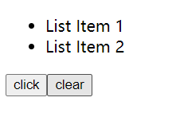 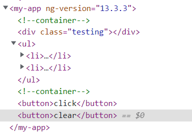 


### 条件内容投影

- 如果需要有条件地渲染内容或多次渲染内容，应配置该组件接受一个 `<ng-template>` 元素，其中包含要有条件渲染的内容


- 使用 `<ng-template>`，**在显示渲染之前，不会初始化该元素的内容**

  如果使用 `<ng-content>`，只要组件的使用者提供了内容，即使该组件从未定义 `<ng-content>` 元素，或者 `<ng-content>` 元素在`ngIf` 内部，该内容也总会被初始化

```html
<!-- app-persons -->
<!-- 假设现在有一个人员列表，当某个人的money大于200的时候，额外添加组件中模板定义的内容 -->
<div class="list-item" *ngFor="let person of persons;">
  <div>Name: {{ person.name }}</div>
  <div>Money: {{ person.money }}</div>
  <div *ngIf="person.money > 200">
    <ng-container *ngIf="childRef" [ngTemplateOutlet]="childRef.templateRef"></ng-container>
  </div>
</div>
```

```typescript
export class PersonsComponent {
  persons: { name: string; money: number; }[] = [
    { name: '杰克', money: 120 },
    { name: '李莉', money: 210 },
    { name: '张三', money: 170 },
  ];
  // 使用@ContentChild获得模板内容的引用TemplateRef
  // 通过appChildRef指令获取ng-template模板
  @ContentChild(ChildRefDirective, { static: true }) childRef!: ChildRefDirective;
}
```

```typescript
// 定义一个 appChildRef 指令来配合 ng-template 获取模板
@Directive({
  selector: '[appChildRef]'
})
export class ChildRefDirective {
  // 指示Angular实例化这个模板引用
  constructor(public templateRef: TemplateRef<any>) { }
}
```

```html
<!-- 使用 -->
<app-persons>
  <!-- 自定义组件将ng-template标记为组件内容，借助TemplateRef，组件可以使用ngTemplateOutlet去渲染-->
  <ng-template appChildRef>
    <!-- 满足条件显示的内容 -->
    <div style="font-size: 14px; color: red;">this is child ref content</div>
  </ng-template>
</app-persons>
```

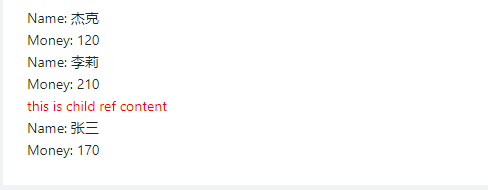 


### 多条件内容投影

```html
<!-- app-form-unit -->
<div class="list-item" *ngFor="let person of persons;let i=index;">
  <div>Name: {{ person.name }}</div>
  <div>Money: {{ person.money }}</div>
  <div *ngIf="person.render && tempRefs[person.render]">
    <!-- 配合 ngTemplateOutlet 指令给template传递当前person的数据 -->
    <ng-container *ngTemplateOutlet="tempRefs[person.render].templateRef; context: { $implicit: person, i: i }"></ng-container>
  </div>
</div>
```

```typescript
export class FormUnitComponent {
  persons: { name: string; money: number; render?: string; }[] = [
    { name: '杰克', money: 120, render: 'temp1' },
    { name: '李莉', money: 210, render: 'temp2' },
    { name: '张三', money: 170, render: 'temp3' },
  ];
  @ContentChildren(ChildRefDirective) childrenRef!: QueryList<ChildRefDirective>;
  get tempRefs() {
    const aObj: any = {};
    this.childrenRef.forEach(template => {
      const key: string = template.appChildRef;
      aObj[key] = template;
    })
    return aObj;
  }
}
```

```typescript
import { Directive, Input, TemplateRef } from '@angular/core';
@Directive({
  selector: '[appChildRef]'
})
export class ChildRefDirective {
  // 接受定义模板名称，通过这个名称和 persons 中的render字段对应进行显示对应的模板内容
  @Input() appChildRef!: string;
  constructor(public templateRef: TemplateRef<any>) { }
}
```

```html
<!-- 使用 -->
<app-persons>
  <ng-template appChildRef="temp1" let-person let-index="i">
    <div style="font-size: 14px; color: red;">{{index}}-{{person.name}}: this is temp1</div>
  </ng-template>
  <ng-template appChildRef="temp2" let-person let-index="i">
    <div style="font-size: 14px; color: green;">{{index}}-{{person.name}}: this is temp2</div>
  </ng-template>
  <ng-template appChildRef="temp3" let-person let-index="i">
    <div style="font-size: 14px; color: orange;">{{index}}-{{person.name}}: this is temp3</div>
  </ng-template>
</app-persons>
```

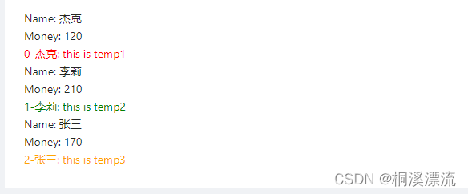 


### 获取投影内容 @ContentChild

- `@ContentChild` 获得从 DOM 视图中**通过选择器匹配到的第一个元素或者指令**

- 如果内容 DOM 发生变化，并且新的子项与选择器匹配，则属性将被更新


- `@ContentChild` 的获取发生在**生命周期 `ngAfterContentInit`**

- ##### `@ContentChild` 和 `@ViewChild` 的区别

  - `ViewChild` 与视图子节点有关，操作**自身的视图内容**。在组件的模板中定义的内容，是组件的一部分

    `ContentChild` 与内容子节点有关，操作**投影进来的内容**。在 `host` 元素 `<opening>` 和 `</closing>` 标签中的内容

  - `ViewChild` 在 `ngAfterViewInit` 中调用

    `ContentChild` 在 `ngAfterContentInit` 中调用

- ##### 获取投影里包含的组件

  ```html
  <!-- app-content-section -->
  <h1>ng content</h1> 
  <!--在这里确定这里会放ContentChildComponent组件，才能使用@ContentChild和@ContentChildren去获取该组件的投影 -->
  <ng-content></ng-content>
  ```

  ```typescript
  class contentSectionComponent {
    // 通过 #section_child_0 获取组件
    @ContentChild('section_child_0') childOne: ContentChildComponent;
    // 通过 ContentChildComponent 组件名获取组件
    @ContentChildren(ContentChildComponent) childrenList: QueryList<ContentChildComponent>;
    ngAfterContentInit(): void {
      console.log(this.childOne);
      this.childrenList.forEach((item) => {
        console.log(item);
      });
    }
  }
  ```

  ```html
  <!-- 使用 -->
  <app-content-section> 
    <app-content-child #section_child_0 [title]="title_0"></app-content-child>
    <app-content-child #section_child_1 [title]="title_1"></app-content-child> 
  </app-content-section>
  ```

- ##### 使用自定义指令获取投影内容

  参考【条件内容投影】和【多条件内容投影】


### 获取多个投影内容 @ContentChildren

- `@ContentChildren` 获取匹配的多个元素，返回结果是一个 `QueryList` 集合
  通过 `QueryList` 实例提供的 `forEach` 方法来遍历集合中的元素

- **每当添加、删除或移动子元素时，此查询列表都会更新**，并且其可观察对象 `changes` 都会发出新值

- 多个字符串选择器可以用逗号分隔 `@ContentChildren('cmp1, cmp2')`


- 参数 `descendants`：**包含所有后代时为 `true`，否则仅包括直接子代**


```typescript


@Component({
  selector: 'tab',
  template: `
    <div class="top-level">Top level panes: {{ serializedPanes }}</div>
    <div class="nested">Arbitrary nested panes: {{ serializedNestedPanes }}</div>
  `
})
export class TabComponent {
  @ContentChildren(Pane) topLevelPanes!: QueryList<Pane>;
  @ContentChildren(Pane, {descendants: true}) arbitraryNestedPanes!: QueryList<Pane>;

  get serializedPanes(): string {
    return this.topLevelPanes ? this.topLevelPanes.map(p => p.id).join(', ') : '';
  }
  get serializedNestedPanes(): string {
    return this.arbitraryNestedPanes ? this.arbitraryNestedPanes.map(p => p.id).join(', ') : '';
  }
}
```

```typescript
@Directive({selector: 'pane'})
export class Pane {
  @Input() id!: string;
}
```

```typescript
@Component({
  selector: 'example-app',
  template: `
    <tab>
      <pane id="1"></pane>
      <pane id="2"></pane>
      <pane id="3" *ngIf="shouldShow">
        <tab>
          <pane id="3_1"></pane>
          <pane id="3_2"></pane>
        </tab>
      </pane>
    </tab>
    <button (click)="show()">Show 3</button>
  `,
})
export class ContentChildrenComp {
  shouldShow = false;
  show() {
    this.shouldShow = true;
  }
}
```


## 表单

### 模板驱动

**表单的控制逻辑写在组件模板中**，适合简单的表单类型

引入 `FormsModule` 模块

```typescript
import { FormsModule } from '@angular/forms';
```

将 DOM 表单转换为 Angular 表单

Angular 表单提供了表单相关的很多信息，比如当前表单内容，当前表单是否操作过，当前表单有没有通过验证等

- 转换 Angular 表单

  ```html
  <!-- 添加模板变量用来代表DOM对象,为这个模板变量赋值为ngForm(固定).这样就变成了Angular的表单对象 -->
  <!-- 表单提交时，把表单对象作为参数传递到组件中 -->
  <form #f="ngForm" (submit)="onSubmit(f)">
    <!-- 绑定到表单 添加属性 ngModel -->
    <!-- 表单项需要name属性，获取表单对象时，name属性的值会作为对象的属性存在 -->
    <input type="text" name="username" ngModel />
    <button>提交</button>
  </form>
  ```

  ```typescript
  import { NgForm } from '@angular/forms';
  export class AppComponet {
    onSubmit(form: NgForm) {
      // 在表单填写的数据
      console.log(form.value);
      // NgForm 中有很多属性 valid(验证是否通过), invalid(验证是否没有通过)
    }
  }
  ```


- 表单分组

  ```html
  <form #f="ngForm" (submit)="OnSubmit(f)">
    <!-- 为表单项分组 赋值为分组的名字 -->
    <div ngModelGroup="user">
      <input type="text" name="username" ngModel />
    </div>
    <div ngModelGroup="contact">
      <input type="text" name="photo" ngModel />
    </div>
    <button>提交</button>
  </form>
  ```

- 表单验证

  ```html
  <!--
  required 必填字段
  minlength 字段最小长度
  maxlength 字段最大长度
  pattern 验证正则 pattern="\d" 匹配一个数值
  -->
  <form #f="ngForm" (submit)="OnSubmit(f)">
    <!-- 为表单项设置模板变量 赋值为ngModel(固定) -->
    <input #username="ngModel" type="text" name="username" ngModel required minlength="2" maxlength="6" />
    <!-- 验证错误信息 -->
    <!-- touched 用户是否获取焦点 -->
    <!-- 用户操作过表单项 && 没有通过验证 && 有验证错误 -->
    <div *ngIf="username.touched && !username.valid && username.errors">
      <div *ngIf="username.errors.required">请填写用户名</div>
      <div *ngIf="username.errors.minlength">
        用户名最少{{ username.errors.minlength.requiredLength }}个字符
      </div>
    </div>
    <!-- 表单整体未通过禁止提交表单 -->
    <button type="submit" [disabled]="f.invalid">提交</button>
  </form>
  ```

  ```typescript
  onSubmit(form: NgForm) {
    // 表单整体验证是否通过
    console.log(form.valid)
  }
  ```

  验证错误样式

  ```css
  /*
  .ng-touched 用户获取过焦点
  .ng-dirty 用户更改过表单值
  */
  input .ng-touched .ng-invalid {
    border: 2px solid red;
  }
  ```


### 模型驱动 / 响应式

#### 创建响应式表单

- **表单的逻辑控制写在组件类中**，对验证逻辑有更多的控制权，适合复杂的表单

- 在模型驱动表单中，**表单中每一个表单项，都必须是 `FormControl` 类的实例**，**实例对象可以验证表单字段**中的值是否被修改过等等


- **整个表单都是 `FormGroup` 类的实例**，可以对表单进行整体验证

- `AbstractControl` 是 `FormControl`、`FormGroup` 和 `FormArray` 的基类

- 在 v14 版本中添加了表单项的**泛型类型**指定，类型为 `Record<string, AbstractControl>`

  更简化的表单类型设计参考：https://github.com/browsepedia/ng-forms

  ```typescript
  type UserFormType = {
    firstName: FormControl<string>;
    lastName: FormControl<string>;
  }
  ```

  ```typescript
  const userForm = new FormGroup<UserFormType>({
    firstName: new FormControl('', { nonNullable: true }),
    lastName: new FormControl('', { nonNullable: true })
  })
  ```

- 表单控制以及配置验证规则

  1. （根）模块中注册响应式表单模块

     ```typescript
     import { ReactiveFormsModule } from '@angular/forms';
     ```

     ```typescript
     @NgModule({
       imports: [
         ReactiveFormsModule
       ],
     })
     ```
  
  2. 创建表单控制对象
  
     ```typescript
     import { FormControl, FromGroup, Validators } from '@angular/forms';
     export class AppComponet {
       contactForm: FormGroup = new FormGroup({
         // 参数1 设置默认值 参数2 验证规则
         name: new FormControl("", [Validators.required, Validators.minLength(2)]),
         phone: new FormControl()
       })
       onSubmit() {
         // 获取表单值
         console.log(this.contactForm.value);
         // 是否通过验证
         console.log(this.contactForm.valid);
       }
     }
     ```
  
  3. 关联模板表单
  
     ```html
     <form [fromGroup]="contactForm" (submit)="onSubmit()">
       <!-- formControlName 绑定的是字符串 -->
       <input type="text" formControlName="name" />
       <div *ngIf="name.touched && name.invalid && name.errors">
         <div *ngIf="name.errors.required">
           请填写姓名
         </div>
         <div *ngIf="name.errors.maxlength">
           姓名长度不能大于{{ name.errors.maxlength.reqiuredLength }}
           实际填写长度为{{ name.errors.maxlength.actualLength }}
         </div>
       </div>
       <input type="text" formControlName="phone" />
       <button [disabled]="contactForm.invalid">提交</button>
     </form>
     ```


#### 表单项 FormControl

`FormControl` 表单组中的一个表单项

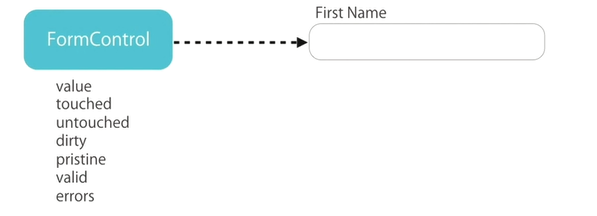 

- 直接在表单元素上使用 `formControl` 指令绑定表单项 `FormControl`，可以替代 `ngModel` 做到双向绑定的效果

  ```html
  <input type="text" [formControl]="myControl" />
  {{ myControl.value }
  ```

  ```typescript
  myControl = new FormControl('default value');
  ```

- 使用 `formControlName` 指令绑定 `FormGroup` 或 `FormArray` 中的表单控件 `FormControl` 到模板

  ```html
  <div [formGroup]="myForm">
    <input type="text" formControlName="name"/>
  </div>
  <!-- 等价于 -->
  <div>
    <input type="text" [formControl]="myForm.controls.name"/>
  </div>
  ```

- 无论使用模板驱动还是响应式表单都会创建 `FormControl`

  使用响应式表单时，显示的 `new FormControl()` 并使用 `formControlName` 指令绑定到原生表单元素上

  使用模板驱动表单时，`FormControl` 会隐式的通过 `ngModel` 创建

  ```typescript
  @Directive({
    selector: '[ngModel]'
  })
  export class NgModel {
    _control = new FormControl();
  }
  ```

- 初始化表单控件 `FormControl`

  ```typescript
  // 初始值初始化
  const control = new FormControl('value');
  // 初始值和disabled值初始化
  const control = new FormControl({ value: 'value', disabled: true });
  // 初始值和同步验证器初始化
  const control = new FormControl('value', Validators.required)
  const control = new FormControl('value', [Validators.required, Validators.maxLength(5)])
  // 初始值和options选项初始化
  const control = new FormControl('value', { validators: Validators.required, asyncValidators: myAsyncValidator });
  ```

  初始化选项

  ```typescript
  interface FormControlOptions extends AbstractControlOptions {
    // 为 true，则将将构造函数中的初始值视为默认值，重置的情况下则恢复为该默认值
    nonNullable?: boolean
    // 继承自 forms/AbstractControlOptions
    validators?: ValidatorFn | ValidatorFn[] | null
    asyncValidators?: AsyncValidatorFn | AsyncValidatorFn[] | null
    updateOn?: 'change' | 'blur' | 'submit'
  }
  ```

- `FormControl` 在指定 `event` 事件上进行更新

  默认情况下 `FormControl` 会在修改 HTML 元素值的任何时候更新值

  ```typescript
  const control = new FormControl('', { updateOn: 'blur' });
  const control = new FormControl('', { updateOn: 'submit' });
  const control = new FormControl('', { updateOn: 'change ' });	// 默认
  ```

- 泛型设置值的类型 `FormControl<T>`

  ```typescript
  let fc = new FormControl<string | null>(null);
  fc.setValue('foo')
  // 当 nonNullable: true 时，可以不设置 null 类型
  ```

- `setValue()`、`patchValue()` 为表单项设置新值 

- `reset()` 重置表单控件的值，将其标记为 `pristine` 和 `untouched` 

  ```typescript
  const control = new FormControl('Nancy');
  control.reset('Drew');
  ```

  ```typescript
  // 指定nonNullable为true时，重置后的值为最初设置的默认值
  const control = new FormControl('Nancy', { nonNullable: true });
  control.reset();
  ```

  ```typescript
  const control = new FormControl('Nancy');
  control.reset({ value: 'Drew', disabled: true });
  ```


#### 创建自定义表单项

实现 `ControlValueAccessor` 接口，创建自定义表单控件

`ControlValueAccessor` 充当 Angular 表单 API 和 DOM 中的原生元素之间的桥梁

 

```typescript
interface ControlValueAccessor {
  // formControl 设置值到原生表单
  writeValue(obj: any): void
  // formControl 注册一个响应原生表单变化的回调函数，回调函数传入最新的值，来更新angular表单
  registerOnChange(fn: any): void
  // 失焦时更新表单模型，传入回调函数
  registerOnTouched(fn: any): void
  // 启用或禁用时调用
  setDisabledState(isDisabled: boolean)?: void
}
```

> Angular 已经为标准表单元素实现了 value accessor
>
> - `input` / `textarea`：`DefaultValueAccessor`
>
> - `input[type=checkbox]`：`CheckboxControlValueAccessor`
>
> - `input[type=number]`：`NumberValueAccessor`
> - `input[type=radio]`：`RadioControlValueAccessor`
> - `input[type=range]`：`RangeValueAccessor`
> - `select`：`SelectControlValueAccessor`
> - `select[multiple]`：`SelectMultipleControlValueAccessor`

任何组件或者指令都可以实现 `ControlValueAccessor` 接口，注册为 `NG_VALUE_ACCESSOR`  的 `provider`

```typescript
@Component({
  selector: 'xxx',
  // 所有表单指令都使用 NG_VALUE_ACCESSOR 令牌注入值访问器
  providers: [{ provide: NG_VALUE_ACCESSOR, useExisting: CustomFromControlComponent, multi: true}]
})
class CustomFromControlComponent implements ControlValueAccessor {

  public _value: number;
  
  onChanged = () => {}
  onTouched = () => {}

  writeValue(value: any) {
    this._value = value;
  }
  registerOnChange(fn: any){
    this.onChanged = fn
  }
  registerOnTouched(fn: any){
    this.onTouched = fn
  }
  setDisabledState(isDisabled: boolean): void {
    this.disabled = isDisabled;
  }
}
```

使用 `ControlValueAccessor` 创建自定义表单控件

- 手机号格式化指令

  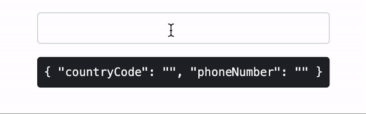 

  ```typescript
  class Telephone {
    countryCode: string;
    phoneNumber: string;
    // 提供一个toString方法
    toString() {
      return this.countryCode && this.phoneNumber 
        ? `${this.countryCode}-${this.phoneNumber}` : "";
    }
    isValid() {
      return !!(this.countryCode && this.phoneNumber);
    }
  }
  ```

  ```html
  <input type="tel" name="telephone" id="telephone" [formControl]="telephone" 
         [class.is-invalid]="(telephone?.touched || telephone?.dirty) && telephone?.invalid"/>
  <div>Value: {{ telephone.value | json }}</div>
  ```

  ```typescript
  telephone = new FormControl(new Telephone("", ""));
  ```

  针对 `input[type=tel]` 元素，提供一个实现 `ControlValueAccessor` 的指令，用来将输入的字符串格式化

  ```typescript
  @Directive({
    selector: 'input[type=tel]',
    providers: [ 
      { provide: NG_VALUE_ACCESSOR, useExisting: InputTelDirective, multi: true },
      { provide: NG_VALIDATORS, useExisting: InputTelDirective, multi: true },
    ]
  })
  export class InputTelDirective implements ControlValueAccessor, Validator {
    constructor(private _elementRef: ElementRef<HTMLInputElement>, private _renderer2: Renderer2) {}
  
    // 监听 input 事件
    @HostListener("input", ["$event.target.value"])
    onInput = (_: any) => {};
  
    // 数据验证
    validate(control: AbstractControl): ValidationErrors | null {
      const telephone = control.value as Telephone;
      return telephone.isValid() ? null : { telephone: true };
    }
  
    // 将 FormControl 的值转换为 input 显示的值
    writeValue(value: Telephone): void {
      const telephone = value || new Telephone("", "");
      this._renderer2.setAttribute(
        this._elementRef.nativeElement,
        "value",
        telephone.toString()
      );
    }
  
    // 将 input 输入的值转换为 FormControl 的值
    registerOnChange(fn: any): void {
      this.onInput = (value: string) => {
        let telephoneValues = value.split("-");
        const telephone = new Telephone(
          telephoneValues[0],
          telephoneValues[1] || ""
        );
        fn(telephone);
      }
    }
  
    registerOnTouched(fn: any): void {}
  
    // 将 disabled 属性写入原生 DOM 元素
    setDisabledState(isDisabled: boolean): void {
      this._renderer2.setProperty(this._elementRef.nativeElement, 'disabled', isDisabled);
    }
  }
  ```

- 自定义日期表单控件

  ```typescript
  @Component({
    selector: 'app-date-input',
    providers: [{ provide: NG_VALUE_ACCESSOR, useExisting: forwardRef(() => DateInputComponent), multi: true }]
  })
  export class DateInputComponent implements ControlValueAccessor { 
    public readonly dayControl = new FormControl();
    public readonly monthControl = new FormControl();
    public readonly yearControl = new FormControl();
  
    private _onChange = (value: Date | null) => undefined;
    public registerOnChange(fn: (value: Date | null) => void): void {
      this._onChange = fn;
    }
  
    private _onTouched = () => undefined;
    public registerOnTouched(fn: () => void): void {
      this._onTouched = fn;
    }
  
    public ngOnInit(): void {
      combineLatest([
        this.dayControl.valueChanges,
        this.monthControl.valueChanges, 
        this.yearControl.valueChanges])
        .subscribe(([day, month, year]) => {
        const fieldsAreValid = 
              this.yearControl.valid && this.monthControl.valid && this.dayControl.valid;
        const value = fieldsAreValid ? new Date(year, month - 1, day) : null;
        this._onChange(value);
        this._onTouched();
      });
    }
  
    // 接受 Date 格式数据
    public writeValue(value: Date | null): void {
      value = value ?? new Date();
  
      const day = value.getDate();
      const month = value.getMonth() + 1;
      const year = value.getFullYear();
  
      this.dayControl.setValue(day);
      this.monthControl.setValue(month);
      this.yearControl.setValue(year);
    }
  
    public setDisabledState(isDisabled: boolean): void {
      if (isDisabled) {
        this.dayControl.disable();
        this.monthControl.disable();
        this.yearControl.disable();
      } else {
        this.dayControl.enable();
        this.monthControl.enable();
        this.yearControl.enable();
      }
    }
  }
  ```


#### 表单组 FormGroup

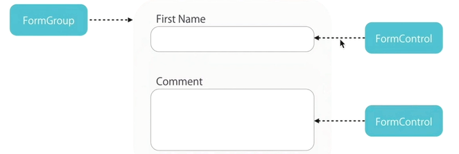 

- `FormGroup` 将每个子表单控件聚合到一个对象中，并使用每个控件名作为 key
- `FormGroup` 只能实现固定的表单，动态添加删除控件使用 `FormRecord`

- **根据子表单控件的状态来判定 `FormGroup` 的状态**，如果某个控件为 `invalid`，则整个表单组都为 `invalid`

- 初始化表单组 `FormGroup`

  ```typescript
  // v14可以指定泛型类型
  type UserFormType = {
    first: FormControl<string | null>
    middle?: FormControl<string | null>
    last: FormControl<string | null>
  }
  const userForm = new FormGroup<UserFormType>({
    first: new FormControl('Nancy'),
    last: new FormControl('Drew'),
  })
  ```

- 表单组 `FormGroup` **可以嵌套表单组**，使用 `formControlName` 指令绑定到模板

  ```html
  <form [fromGroup]="contactForm" (submit)="onSubmit()">
    <div fromGroupName="fullName">
      <input type="text" formControlName="firstName" />
      <input type="text" formControlName="lastName" />      
    </div>
    <input type="text" formControlName="phone" />
    <button>提交</button>
  </form>
  ```

  ```typescript
  contactForm: FormGroup = new FormGroup({
    fullName: new FormGroup({
      firstName: new FormControl(),
      lastName: new FormControl()
    }),
    phone: new FormControl()
  })
  ```

  ```typescript
  onSubmit() {
    console.log(this.contactForm.value.fullName.firstName);
    console.log(this.contactForm.get(["fullName", "firstName"])?.value)
  }
  ```

- 添加组级别的表单验证器

  ```typescript
  const form = new FormGroup(
    { 
      password: new FormControl('', Validators.minLength(2)),
      passwordConfirm: new FormControl('', Validators.minLength(2))
    }, 
    // 组级别表单验证器
    passwordMatchValidator);
  
  // 或者使用 options 参数传入验证器
  const form = new FormGroup(
    { password: new FormControl(''), passwordConfirm: new FormControl('') },
    { validators: passwordMatchValidator, asyncValidators: otherValidator });
  ```

  ```typescript
  function passwordMatchValidator(g: FormGroup) {
    return g.get('password').value === g.get('passwordConfirm').value
      ? null : {'mismatch': true};
  }
  ```

- 添加控件 `addControl()`

  `addControl(name: string, control: AbstractControl<any, any>, options?: { emitEvent?: boolean; }): void`

  - 参数 1：控件名称

  - 参数 2：控件对象

  - 参数 3：`emitEvent` 为 true 时，`statusChanges` 和 `valueChanges` 在添加控件时会 emit 最新状态和值

   `registerControl()` 也可以添加控件，但是不会更新其值和验证

- 删除控件 `removeControl()`

  `removeControl(name: string, options?: { emitEvent?: boolean; }): void`

- 替换控件 `setControl()`

  `setControl<K extends string & keyof TControl>(name: K, control: TControl[K], options?: { emitEvent?: boolean; }): void`

- 是否存在给定名称的控件 `contains(controlName)`

- **只更新指定**的控件值，不需要更新表单组所有的值 `patchValue()`

  ```typescript
  this.myFormGroup.patchValue({ name: 'Mocrosoft' });
  ```

- **更新表单组的所有**的值 `setValue()`，只能设置所有，不能排除任何一个

  ```typescript
  this.myFormGroup.setValue({ name: 'Mocrosoft', age: '25' });
  ```

- 重置表单组的值 `reset()`

  ```typescript
  const form = new FormGroup({
    first: new FormControl('first name'),
    last: new FormControl('last name')
  });
  form.reset({
    first: { value: 'name', disabled: true }, 
    last: 'last name' 
  });
  ```

  ```typescript
  // 直接清空
  form.reset()
  ```

- 注册控件 `registerControl()`，如果需要更新控件的值和状态使用 `addControl`

  ```typescript
  // 添加从后台获取到的值到表单
  store.select('skills').subscribe(skills => {
    const controls = skills.map(skill => {
      return new FormControl(skill, Validators.required);
    });
    this.user.registerControl('skills', new FormArray(controls));
  })
  ```

- 在组级别指定特定 `event` 事件进行更新，设置所有子控件的 `updateOn` 属性

  ```typescript
  const c = new FormGroup({ one: new FormControl() }, { updateOn: 'blur' });
  ```


#### 动态表单 FormArray

`FormArray` 用于复杂表单，可以**动态添加表单项或表单组**

```html
<form [fromGroup]="contactForm">
  <div formArrayName="contacts">
    <!-- 当前 FormArray 中的属性 controls 里绑定的是 FormGroup 的集合 -->
    <div *ngFor="let contact of contacts.controls; let i = index" [formGroupName]="i">
      <input type="text" formControlName="name" />
      <input type="text" formControlName="address" />
      <input type="text" formControlName="phone" />
      <button (click)="removeContact(i)">删除联系方式</button>
    </div>
  </div>
  <button (click)="addContact()">添加联系方式</button>
</form>
```

```typescript
contactForm: FormGroup = new FormGroup({
  // FormArray可以动态的向其中添加FormControl和FormGroup
  contacts: new FormArray([])
})
// 通常使用 getter 函数来简化表单控件的获取表达式
get contacts() {
  return this.contactForm.get("contacts") as FormArray
}
```

```typescript
// 动态添加联系方式
addContact() {
  // 创建联系方式组
  const myContact: FormGroup = new FormGroup({
    name: new FormControl(),
    address: new FormControl(),
    phone: new FormControl()
  })
  // 向联系方式数组添加联系方式
  this.contacts.push(myContact);
}
ngOnInit() {
  // 默认显示一组联系方式
  this.addContact();
}
// 删除联系方式
removeContact(index: number) {
  // 删除FormArray中的表单对象
  this.contacts.removeAt(index);
}
```

- **在表单验证时，`FormArray` 中有一项没有通过，整体就没通过**

- `FormArray` 可以添加 `FormGroup`、`FormControl` 甚至 `FormArray`

- `FormArray` 中的 `controls` 属性包含 `AbstractControl` 类型实例的数组

- 使用 `formArrayName` 指令来绑定 `FormGroup` 或 `FormArray` 中内部对应的 `FormArray` 表单控件到模板

- 末尾添加表单控件：`push(control: AbstractControl, options？: { emitEvent?: boolean })`

  参数 1：插入的表单控件

  参数 2：`emitEvent` 为 `true` 时，插入控件时`statusChanges` 和 `valueChanges` 会发出具有最新状态和值的事件

- 指定下标删除表单控件：`removeAt(index: number, options?: { emitEvent?: boolean })`

- 指定下标处插入表单控件：`insert(index: number, control: AbstractControl, options?: { emitEvent?: boolean })`

- 清空所有表单控件：`clear(options?: { emitEvent?: boolean })`

- 替换表单控件：`setControl(index: number, control: AbstractControl, options?: { emitEvent?: boolean })`

- 获取指定下标表单控件：`at(index: number))`，与 `Array.at(index)` 相同，负数为从后计算

- 添加 `FormArray` 级别的验证方法

  ```typescript
  user = new FormGroup({
    name: new FormControl(''),
    skills: new FormArray([], validateSize)
  });
  ```

  ```typescript
  function validateSize(arr: FormArray) {
    return arr.length > 3 ? { invalidSize: true } : null;
  }
  ```


#### 自定义表单验证器

自定义验证器类型是一个类、类中包含具体的验证方法，验证方法必须为静态方法

验证方法有一个类型为 `AbstractControl` 的参数，是 `FromControl` 类的实例对象的类型

如果验证成功，返回 `null`

如果验证失败，返回对象，对象中的属性即为验证标识，值为 `true`，标识该项验证失败

验证方法的返回值为 `ValidationErrors | null`

```typescript
export class MyValidators {
  // 参数 验证表单项的实例对象
  // 返回类型 ValidationErrors | null
  static cannotContainSpace(control: AbstractControl): ValidationErrors | null{
    if (/\s/.test(control.value)){
      return {
        cannotContainSpace: true
      }
    }
    return null;
  }

  // 异步的验证规则
  static shouldBeUnique(control: AbstractControl): Promise<ValidationErrors | null>{
    return new Promise((resolve) => {
      setTimeout(() => {
        if (control.value === 'admin') {
          resolve({shouldBeUnique: true})
        } else {
          resolve(null)
        }
      }, 2000);                
    });
  }
}
```

```typescript
contactForm: FormGroup = new FormGroup({
  name: new FormControl(
    // 参数1 默认值
    "",
    // 参数2 同步的验证规则
    [ 
      Validators.required,
      Validators.minLength(2),
      // 如果不需要传参，就不用调用方法
      MyValidators.cannotContainSpace
    ],
    // 参数3 异步的验证规则
    MyValidators.shouldBeUnique
  ),
  phone: new FormControl()
})
```

```html
<form [fromGroup]="contactForm" (submit)="onSubmit()">
  <!-- formControlName 绑定的是字符串 -->
  <input type="text" formControlName="name" />
  <div *ngIf="name.touched && name.invalid && name.errors">
    <div *ngIf="name.errors.cannotContainSpace">名字中不能包含空格</div>
    <div *ngIf="name.errors.shouldBeUnique">名字已经存在</div>
  </div>
  <!-- 异步方法验证 -->
  <div *ngIf="name.pending">正在验证...</div>
  <button [disabled]="contactForm.invalid">提交</button>
</form>
```


#### 表单项基类 AbstractControl

`AbstractControl` 是 `FormControl`、`FormGroup` 和 `FormArray` 的基类

`AbstractControl` 提供了所有控件的一些共享行为，例如运行验证器、计算状态和重置状态和  `value`、`valid` 和 `dirty` 等属性

- `get(path)` 根据控件名获取控件

  ```typescript
  // 非get方法获取
  this.form.control.name.value
  // 字符串获取控件
  this.form.get('name').value
  // 获取嵌套子控件
  this.form.get('person.name').value
  this.form.get(['person', 'name'] as const).value
  // 获取数组中控件
  this.form.get('items.0.price').value
  this.form.get(['items', 0, 'price']).value
  ```

- `value` 相关属性和方法

  - `value` 属性：获取控件当前值，只读

    ```typescript
    this.reactiveForm.get("firstname").value
    ```

  - `setValue()` 设置控件所有的值

  - `patchValue()` 修补控件部分的值

- `valid` 相关属性和方法

  `valid` / `invalid` 属性：控件是否为 `VALID` / `INVALID` 状态，只读

  ```typescript
  const control = this.reactiveForm.get('name')
  if (control && control.dirty && control.invalid) {
    // ....
  }
  ```

- `disabled` 相关属性和方法

  - `disabled` / `enabled` 属性：控件是否为 `DISABLED` 状态，只读

    控件被 `disabled`，被禁用的控件免于验证检查，并且不包含在其祖先控件的汇总值中

  - `disable()` / `enable()` 方法：禁用 / 启用控件方法

- `errors` 相关属性和方法

  - `errors` 属性：验证失败的错误对象，`ValidationErrors` 类型，只读

    ```typescript
    const controlErrors: ValidationErrors = this.productForm.get('name').errors;
    ```

  - `setErrors(errors)` 方法：手动设置控件错误

  - `getError(errorCode, path?)` 方法：获取错误数据
  - `hasError(errorCode, path?)` 方法：是否有指定错误

- `dirty ` 相关属性和方法
  - `dirty ` / `pristine` 属性：用户**是否更改 UI 中的值**，只读
  - `markAsDirty()` / `markAsPristine()` 方法：将控件标记为 `dirty` / `pristine`
- `touched` 相关属性和方法
  - `touched` / `untouched` 属性：控件**是否已触摸**，触发了 `blur` 事件后，控件则为 `touched`，只读
  - `markAsTouched()` / `markAsUntouched()` 方法：将控件标记为 `touched` / `untouched`
  - `markAllAsTouched()` 方法：将控件及其所有后代控件标记为 `touched`

- 验证器相关属性和方法
  - `setValidators(validators)` / `setAsyncValidators(validators)` 方法：设置并覆盖控件上的验证器
  - `addValidators()` / `addAsyncValidators()` 方法：控件上添加验证器
  - `removeValidators()` / `removeAsyncValidators()` 方法：控件中删除验证器
  - `clearValidators()` / `clearAsyncValidators()` 方法：清空验证器
  - `updateValueAndValidity()` 方法：重新计算控件的值和验证状态，添加删除覆盖验证器是需要调用更新生效
  - `hasValidator(validator)` / `hasAsyncValidator(validator)` 方法：是否包含指定验证器，引用比较

- 控件变更可观察对象 `valueChanges`、`statusChanges`

  - `valueChanges` 可观察对象：控件值变更（UI 中变更或编程式变更）
  - `statusChanges` 可观察对象：控件验证状态

  ```html
  <p>Value changes: {{ myControl.valueChanges | async }}</p>
  <p>Status changes: {{ myControl.statusChanges | async }}</p>
  ```


#### 快速创建表单 FormBuilder

`FormBuilder` 创建模型表单快捷方式，省去了使用 `FormControl`、`FormGroup`、`FormArray` 繁琐的创建的过程

```typescript
import { FormBuilder, FromGroup, Validators } from '@angular/forms';

export class AppComponet {
  contactForm: FormGroup;
  // 实现FormBulider的实例对象
  constructor(private formBuilder : FormBulider){ 
    // formBuilder.group 创建表单组
    this.contactForm = this.formBuilder.group({
      fullName: this.formBuilder.group({
        // 数组第一项 默认值， 第二项 验证
        firstName: ["", [Validators.required]],
        lastName: [""]
      }),
      phone: {},
      // formBuilder.array 创建FromArray
      products : this.formBuilder.array([])
    })
  }
  
  addProduct(name: string, desc: string) {
    let products = this.customerInfo.get('products') as FormArray;
    products.push(this.formBuilder.group({
      name : [name, [Validators.required]],
      description : [desc, [Validators.required]]
    }));
  }
}
```


#### 控件状态样式类

Angular 为控件的不同状态准备了相应的 CSS 样式类，可以使用这些类为表单添加表单控件的样式

- `.ng-valid` 验证成功的样式
- `.ng-invalid` 验证失败的样式
- `.ng-pending` 正在异步验证的样式
- `.ng-pristine` 未更改 UI 中值的样式
- `.ng-dirty` 更改了 UI 中值的样式
- `.ng-untouched` 控件为触摸的样式
- `.ng-touched` 控件以触摸的样式
- `.ng-submitted` 表单 `<form>` 已提交的样式

```css
.ng-valid[required], .ng-valid.required  {
  border-left: 5px solid #42A948; /* green */
}
.ng-invalid:not(form)  {
  border-left: 5px solid #a94442; /* red */
}
```


### 表单使用双向绑定

模型驱动表单也可以使用 `required`，`minlength` 等指令

**使用了双向绑定就不能使用 `formControlName`**

```html
<form>
    <input #username="ngModel" type="text" name="username" [(ngModel)]="value" required minlength="2" maxlength="6" />
</form>
```

```typescript
value: string = '';
```

使用表单项模板变量 `ngModel` 对象，修改 `FromControl` 对象

```typescript
// 表单项模板变量,通过#username="ngModel" 形式指定
@ViewChild('username') model: NgModel;
// FromControl对象
get fromControl (): FormControl {
    return this.model.control;
}
// 添加验证方法
ngAfterViewInit() {
    this.fromControl.addValidators([Validators.required]);
    // 清除验证 clearValidators
    // 更新验证 updateValueAndValidity
}
```


## 全局样式

```css
/* 方式一 在 style.css 文件中 */
@import "~bootstrap/dist/css/bootstrap.css";
/* ~ 相对于node_module文件夹 */
```

```html
<!-- 方式二 在 index.html 文件中-->
<link rel="stylesheet" href="https://stackpath.bootstrapcdn.com/bootstrap/4.3.1/css/bootstrap.min.css">
```

```json
// 方式三 在 angular.json 文件中
"style": [
    "./node_module/bootstrap/dist/css/bootstrap.min.css",
    "src/styles.css"
]
```


# 指令 Directive

**指令没有模板，指令要寄宿在一个宿主之上**。指令是提供操作 DOM 的途径

**结构性指令**：会改变宿主文档 DOM 结构

**属性型指令**：会改变宿主行为

组件就是带模板的指令

## 结构性指令 

增加，删除 DOM 节点以修改布局，使用 `*` 作为指令前缀

### *ngFor

- ##### 变量的应用范围

  ```html
  <!-- menu变量的作用范围是所在的标签的闭合区间之内 -->
  <ul>
    <li *ngFor="let menu of menus">
      <a href="#">{{ menu.title }}</a>
    </li>
  </ul> 
  ```

- ##### 索引的获取

  ```html
  <ul>
    <li *ngFor="let menu of menus; let i = index">
      <a href="#">{{ menu.title }}</a>
    </li>
  </ul> 
  ```

- ##### 是否是第一个元素，最后一个元素

  ```html
  <ul>
    <!-- 属性是bool类型 -->
    <li *ngFor="let menu of menus; let first = first; let last = last">
      <a href="#">{{ menu.title }}</a>
    </li>
  </ul> 
  ```

- ##### 奇和偶

  ```html
  <ul>
    <!-- 数组索引的奇偶 -->
    <li *ngFor="let menu of menus; let odd = odd; let even = even">
      <a href="#">{{ menu.title }}</a>
    </li>
  </ul> 
  ```

- ##### 提升性能

  ```html
  <ul>
    <!-- 使用数组中唯一能表达某个元素的值，利用这个值进行渲染排序 -->
    <!-- trackBy 后可以接函数名和表达式 -->
    <li *ngFor="let menu of menus; trackBy: trackElement">
      <a href="#">{{ menu.title }}</a>
    </li>
  </ul> 
  ```

  ```typescript
  // trackBy函数
  identity (index: number, item: List){
      return item.id
  }
  ```

- ##### template 写法

  ```html
  <ul>
  	<li template="ngFor let item of list">
  		{{item}}
  	</li>
  </ul>
  ```


### *ngIf

- ##### 条件表达式

  ```html
  <!-- 节点只有在条件表达式为真的时候才会显示出来 -->
  <div *ngIf="条件表达式">
      在条件为真的时候需要显示的内容
  </div>
  ```

- ##### If..else

  ```html
  <div *ngIf="条件表达式 else elseContent">
      在条件为真的时候需要显示的内容
  </div>
  <ng-template #elseContent>
  	在条件为假的时候需要显示的内容
  </ng-template>
  ```

  ```html
  <div *ngIf="条件表达式;then thenTemplate else elseTemplate">
  </div>
  <ng-template #thenTemplate>
  	在条件为真的时候需要显示的内容
  </ng-template>
  <ng-template #elseTemplate>
  	在条件为假的时候需要显示的内容
  </ng-template>
  ```

- ##### template 写法

  ```html
  <p template="ngIf list.length > 3">判断是否显示</p>
  ```


### *ngSwitch

```html
<ul [ngSwitch]="score">
	<li *ngSwitchCase="1">已支付</li>
	<li *ngSwitchCase="2">订单已经确认</li>
	<li *ngSwitchCase="3">已发货</li>
	<li *ngSwitchDefault>无效</li>
</ul>
```


## 属性型指令

修改现有元素的外观或行为，使用 `[]` 包裹

### ngClass

```html
<!-- flag是定义的布尔值 -->
<div [ngClass]="{'red': flag, 'blue': !flag}">
	这是一个div
</div>

<li *ngFor="let item of arr, let i = index">
	<span [ngClass]="{'red': i==0 }">{{ item }}</span>
</li>
```

- ##### 样式绑定

  ```html
   <div [class.className]="条件表达式">
       对于单个样式的条件绑定最为合适
   </div>
  ```


### ngStyle

```html
<div [ngStyle]="{'color':someColor, 'font-size':fontSize}">
    ngStyle由于是嵌入式样式，会覆盖掉其他样式，使用时要谨慎
</div>

<!-- 已定义 public attr='red'; -->
<div [ngStyle]="{'background-color':attr}">你好ngStyle</div>
```


### hidden

```html
<!-- 根据条件显示DOM节点或隐藏DOM节点（display）true隐藏，false隐藏 -->
<div [hidden]="data.length == 0">课程列表</div>
<div [hidden]="data.length > 0">没有更多数据</div>
```


## 指令结构

- 使用指令操作 DOM 元素

  ```typescript
  // 网格布局模版
  @Directive({
    // 推荐使用方括号[]指定Selector，可以当成宿主元素属性
    selector: '[appGridItem]'
  })
  export class GridItemDirective implements AfterViewInit {
    // 注入 ElementRef 获取宿主的实例对象
    constructor(private elr: ElementRef, private renderer: Renderer2) {}
    // 组件视图初始完成
    ngAfterViewInit() {
      this.setStyle('display', 'grid');
      this.setStyle('grid-template-areas', `'image' 'title'`);
      this.setStyle('place-items', 'center');
      this.setStyle('width', '4.3rem');
    }
    private setStyle(styleName: string, styleValue: string | number) {
      this.renderer.setStyle(this.elr.nativeElement, styleName, styleValue);
    }
  }
  ```

- 指令传入参数

  ```typescript
  // 模版image区块
  @Directive({
    selector: '[appGridItemImage]'
  })
  export class GridItemImageDirective implements AfterViewInit {
    @Input() appGridItemImage = '2rem';
    constructor(private elr: ElementRef, private renderer: Renderer2) {}
    ngAfterViewInit() {
      this.setStyle('grid-area', 'image');
      this.setStyle('width', this.appGridItemImage);
      this.setStyle('height', this.appGridItemImage);
      this.setStyle('object-fit', 'cover');
    }
    private setStyle(styleName: string, styleValue: string | number) {
      this.renderer.setStyle(this.elr.nativeElement, styleName, styleValue);
    }
  }
  ```

- 指令传入对象参数

  ```typescript
  interface Option {
    fontSize?: string;
  }
  
  // 模版title区块
  @Directive({
    selector: '[appGridItemTitle]'
  })
  export class GridItemTitleDirective implements AfterViewInit {
    @Input() appGridItemTitle: Option = {};
    constructor(private elr: ElementRef, private renderer: Renderer2) {}
    ngAfterViewInit(): void {
      this.setStyle('grid-area', 'title');
      this.setStyle('font-size', this.appGridItemTitle.fontSize || '0.5rem');
    }
    private setStyle(styleName: string, styleValue: string | number) {
      this.renderer.setStyle(this.elr.nativeElement, styleName, styleValue);
    }
  }
  ```

  模板引用

  ```html
  <!-- 指令所在的元素叫宿主 -->
  <span appGridItem *ngFor="let item of channels">
    
    <span [appGridItemTitle]="{fontSize: '0.6rem'}" class="title">{{ item.title }}</span>
  </span>
  ```


## 指令注解

### selector

类型: `string`

CSS 选择器名，用于在模板中标记出该指令，并触发其实例化

只允许指令使用那些不跨元素边界的 CSS 选择器

`element-name`：根据元素名选取

`.class`：根据类名选取

`[attribute]`：根据属性名选取

`[attribute=value]`：根据属性名和属性值选取

`:not(sub_selector)`：只有当元素不匹配子选择器 `sub_selector` 的时候才选取

`selector1, selector2`：无论 selector1 还是 selector2 匹配时都选取

```typescript
// <div highlight></div>
@Directive({
  // 按属性名称选择
  selector : '[highlight]'
})

// <child-directive></child-directive>
@Directive({
  selector : 'child-directive'
})

// <button counting></button>
@Directive({
    selector: 'button[counting]'
})

// <input type="text" [(ngModel)]="..." [number]="...">
@Directive({
  selector: 'input[type="text"][ngModel][number]'
})

/* <p appFirstDirective></p>
*  <appFirstDirective></appFirstDirective> 
*/
@Directive({
  selector: '[appFirstDirective],appFirstDirective'
})
```


### inputs

类型: `string[]`

指令的输入属性。等价于 `@Input` 属性装饰器

参考【组件注解】的【inputs】


### outputs

类型: `string[]`

指令的输出属性。等价于 `@Output` 属性装饰器

参考【组件注解】的【outputs】


### providers

类型: `Provider[]`

一组依赖注入令牌，它允许 DI 系统为这个指令提供依赖

参考【组件注解】的【providers】


### exportAs

类型: `string`

这个指令要以什么名称分享出去。

利用定义 `exportAs` 来调用指令内部的方法和属性

```typescript
// 如果想要让这个指令调用changeColor方法
@Directive({
  selector: '[appColorful]',
  exportAs: 'colorful'
})
export class ColorfulDirective {
  @Input() appColorful;
  @HostBinding('style.color') get color() {
    console.log(this.appColorful);
    return this.appColorful || 'red';
  }

  changeColor(color) {
    this.appColorful = color;
  }
}
```

```typescript
@Component({
  selector: 'my-app',
  template: `
  <!-- 使用 #color="colorful" 取得指令的对象 -->
  <p appColorful="blue" #color="colorful">Hello World</p>
  <button (click)="change()">Change Color</button>
  `,
  styleUrls: [ './app.component.css' ]
})
export class AppComponent  {
  @ViewChild('color') color: ColorfulDirective;
  change() {
    console.log(this.color);
    // 使用指令对象调用指令的方法
    this.color.changeColor('black');
  }
}
```

如果在组件上或者 html 标签上不使用别名获取不到指令的结果

```typescript
@Component({
  selector: 'my-app',
  template: `
  <p appColorful="blue" #color>Hello World</p>
  <button (click)="change()">Change Color</button>
`,
  styleUrls: [ './app.component.css' ]
})
export class AppComponent  {
  @ViewChild('color') color;
  change() {
    console.log(this.color);
  }
}
```

获取到的其实是 `ElementRef` 对象，而不是指令的对象

 

模板驱动表单中的 `#name="ngModel"`，其实就是 `ngModel` 指令添加了 `exportAs`

```html
<input id="name" name="name" [(ngModel)]="hero.name" #name="ngModel" >
```

```typescript
// 原始代码
@Directive({
  selector: '[ngModel]:not([formControlName]):not([formControl])',
  providers: [formControlBinding],
  exportAs: 'ngModel'
})
```


### queries

类型: `{[key: string]: any}`

将配置查询注入到当前指令中

参考【组件注解】的【queries】


### host

类型: `{[key:string]:string}`

配置宿主元素的事件、行为、特性（`attributes`）以及属性（`properties`）

参考【组件注解】的【host】

宿主事件监听

```typescript
@Directive({
  selector: '[input-trim]',
  host: {
    '(keyup)': 'keyUpFunc($event.target)',
    '(click)': 'onClick($event.target)',
    // 添加属性
    'test-data': 'hello world'
  }
})
export class InputTrimDirective {
  private _elementRef: ElementRef
  constructor(_elementRef: ElementRef) {
    console.log(_elementRef, "获取挂载属性的DOM")
    this._elementRef = _elementRef
  }
  // 等价于@HostListener('keyup', ['$event.target'])
  keyUpFunc(evt) {
    if(evt.value) {
      this._elementRef.nativeElement.value = evt.value.trim();
    }
  }
  onClick(evt) {
    if(evt.innerHTML) {
      this._elementRef.nativeElement.innerHTML = evt.innerHTML + '测试';
    }
  }
}

@Component({
  selector: 'app-input',
  template: `
<input type="text" input-trim>
<div input-trim>test</div>
`
})
```

宿主属性绑定

在变化检测时，Angular 会自动更新宿主的属性绑定，如果绑定发生变化，它将会更新指令的宿主的元素

DOM 属性 `Property` 

```typescript
@Directive({
  selector: '[ngModel]',
  host: {
    '[class.valid]': 'valid',
    '[class.invalid]': 'invalid'
  }
})
class NgModelStatus {
  constructor(public control:NgModel) {}
  get valid { return this.control.valid; }
  get invalid { return this.control.invalid; }
}

@Component({
  selector: 'app',
  template: `<input [(ngModel)]="prop">`
})
class App {
  prop;
}
```

静态属性 `Attribute`

```typescript
@Directive({
  selector: '[my-button]',
  host: {
    // 使用 my-button 指令时，确保该宿主元素获得"button"的role属性
    'role': 'button'
  }
})
class MyButton {
}
```


### jit

类型: `true`

如果存在，则该指令/组件将被 AOT 编译器忽略，只会被 JIT 编译

参考【组件注解】的【jit】


## 指令样式绑定 @HostBinding

`@HostBinding` **绑定宿主的属性或者样式**

```typescript
@Directive({
  selector: '[appGridItemTitle]'
})
export class GridItemTitleDirective {
  // 绑定宿主的样式
  // 多个注解可以修饰一个变量
  @HostBinding('style.font-size') @Input() appGridItemTitle = '0.5rem';
  @HostBinding('style.grid-area') area = 'title';
  @HostBinding('class') classes = 'class1 class2 class3';
  @HostBinding('attr.role') role = 'title';
  @HostBinding('class.foo') variableName = true;
}
```

- ##### `@HostBinding` 绑定 class 样式不生效的问题

  使用组件时，本质上是在模板上下文里加入了一个自定义元素进行包裹

  ```less
  /* HostBinding到like组件的样式 */
  .like {
  	background-color: #0066ff;
  	.dreamwalker {
  		display: block;
  	}
  }
  ```

  ```html
  <like>
    <div class="dreamwalker">
    </div>
  </like>
  ```

  但是由于 `<like>` 是自定义的元素，没有默认的样式，当然也没有 `display` 样式，所有会导致绑定的样式不生效

  ```less
  /* 要绑定display样式 */
  .like {
  	display: block;
  	background-color: #0066ff;
  	.dreamwalker {
  		display: block;
  	}
  }
  ```

组件的样式也可使用 `:host` 伪类选择器

`:host` 伪类所应用的样式不是模板中的样式，而是组件本身


## 指令事件绑定 @HostListener

`@HostListener` **绑定宿主的事件**

```typescript
@Directive({
  selector: '[appGridItemImage]'
})
export class GridItemImageDirective implements OnInit {
  // 参数1：事件名 参数2：事件发生时传递给处理方法的参数集
  // 监听宿主元素的点击事件
  // 类似JavaScript的addEventListener，传递了一个$event对象进去
  @HostListener('click', ['$event.target'])
  handleClick(ev) {
    console.log(ev);
  }
}
```

- 监听宿主事件，修改宿主 DOM 元素

  ```typescript
  @Directive({
      selector: '[appBackgroundExe]'
  })
  export class BackgroundExeDirective {
      @Input('appBackgroundExe') highLightColor!: string;
      constructor(private elementRef: ElementRef, private renderer: Renderer2) {
          this.initStyle();
      }
      @HostListener('mouseenter') onMouseEnter(): void {
          this.highLight(this.highLightColor);
      }
      @HostListener('mouseleave') onMouseLeave(): void {
          this.initStyle();
      }
      // 设置悬浮高亮的效果
      private highLight(color: string): void {
          this.renderer.setStyle(this.elementRef.nativeElement, 'background', color);
      }
      // 初始化宿主元素的样式
      private initStyle(): void {
          this.renderer.setStyle(this.elementRef.nativeElement, 'background', '#000');
          this.renderer.setStyle(this.elementRef.nativeElement, 'color', '#FFF');
      }
  }
  ```

- 也可以**监听宿主元素外**，其它对象产生的事件，如 `window` 或 `document` 对象

  ```typescript
  @HostListener('window:keydown', ['$event'])
  handleKeyDown(event: KeyboardEvent) {
    if (event.ctrlKey && event.key === 'Enter') {
      if (this.inputValue.trim() === '') {
        return;
      }
      this.inputValue  = '\n';
    } else if (event.key === 'Enter') {
      event.preventDefault();
      if (this.inputValue.trim() === '') {
        return;
      }
      this.inputValue = '';
      console.log('发送消息');
    }
    if (event.type === 'click') {
      this.inputValue = '';
      console.log('发送消息');
      return;
    }
  }
  ```

- 监听宿主元素外事件，过滤掉组件内事件

  ```typescript
  @Component({
  selector: "another",
  template: `
      <div style="border-style: solid;margin:5px;">
      <h1>Outside Component</h1>
      <h2>Click here for outer component trigger</h2>
      </div>
      <geeks></geeks>
  `
  })
  export class AnotherComponent {
  	constructor() {}
  }
  @Component({
  selector: "geeks",
  template: `
      <div style="border-style:solid;margin:5px;">
      <h1>Inner Component</h1>
      <h2>{{ some_text }}</h2>
      </div>
  `
  })
  export class GeeksComponent {
  	constructor() {}
  	some_text = "Click Here";
  	inside = false;
  	@HostListener("click")
  	clicked() {
  	    this.inside = true;
  	}
  	@HostListener("document:click")
  	clickedOut() {
  	    this.some_text = this.inside
  	    ? "Event Triggered"
  	    : "Event Triggered Outside Component";
  	    this.inside = false;
  	}
  }
  ```

  ```typescript
  // 或者使用ElementRef判断
  @HostListener('document:click',['$event'])
    onClick(e:any): void {
        // 判断是否点击了宿主元素
        if(this.elementRef.nativeElement.contains(e.target)){
            this.highLight('blue')
        }else{
            this.highLight('')
        }
    }
  ```


# 管道 Pipe

管道的作用就是在视图上提供便利的**值变换的方法**

在管道名后面添加一个冒号( `:` )再跟一个参数值，来为管道添加参数 `currency:'EUR'`

如果管道可以接受**多个参数**，就用**冒号来分隔**这些参数值 `slice：1:5`

`{{ 输入数据 | 管道 : 管道参数 }} ` '`|`' 是管道操作符

## 内置管道

### JSON 序列化

`{{ value | json }}`

输入值：`value`，类型：`any`

非纯管道

```html
{{ obj | json }}
<!-- 换行的格式 -->
<pre>{{ obj | json }}</pre>
```


### 日期格式化

`{{ value | date [ : format [ : timezone [ : locale ] ] ] }}`

输入值：`value`，类型：`string | number | Date`

格式化形式：`format`，类型：`string`，可选

时区：`timezone `，类型：`string`，可选

语言环境格式：`locale`，类型：`string`，可选

```html
{{ date | date: 'yyyy-MM-dd HH:mm:ss' }}
```

- ##### `formatDate` 方法

  `formatDate(value: string | number | Date, format: string, locale: string, timezone?: string): string`

  ```typescript
  // app.module.ts
  import { LOCALE_ID } from '@angular/core';
  ```

  ```typescript
  import { formatNumber } from '@angular/common';
  import { Component, Inject, LOCALE_ID } from '@angular/core';
  @Component({
    selector: 'app-date',
    template: `<p>Date is : {{date}}</p>`
  })
  export class DateComponent {
    constructor(@Inject(LOCALE_ID) public locale: string) {}
    date = formatDate(Date.now(), 'yyyy-MM-dd HH:mm:ss', this.locale);
  }
  ```


### 数字格式化

`{{ value | number [ : digitsInfo [ : locale ] ] }}`

输入值：`value`，类型：`string | number`

字符串格式：`digitsInfo`，类型：`string`，可选

`{整数部分保留最小的位数，默认值为1}.{小数部分保留最小的位数，默认值为0}-{小数部分保留最大的位数，默认值为3}`

语言环境格式：`locale`，类型：`string`，可选

```html
<!-- 4.0-2 (最小几位整数.小数部分最小几位-小数部分最大几位) -->
{{　number | number: '4.0-2'}}
```

- ##### `formatNumber` 方法

  `formatNumber(value, locale, digitsInfo)`

  ```typescript
  // app.module.ts
  import { LOCALE_ID } from '@angular/core';
  ```

  ```typescript
  import { formatNumber } from '@angular/common';
  import { Component, Inject, LOCALE_ID } from '@angular/core';
  @Component({
  	selector: 'app-number',
  	template: `<p>Number is : {{curr}}</p>`
  })
  export class NumberComponent {
      constructor(@Inject(LOCALE_ID) public locale: string) {}
      curr = formatNumber(1000, this.locale, '7.1-5');
  }
  ```


### 数组字符串截取

`{{ value | slice : start [ : end ] }}`

输入值：`value`，类型：`string | ReadonlyArray<T>`

开始下标：`start`，类型：`number`

结束下标：`end`，类型：`number`，可选

基于 `Array.prototype.slice()` 和 `String.prototype.slice()`

非纯管道

```html
<!-- 取集合索引1到3的元素 -->
{{ data | slice:1:3 }}
<!-- 截取字符串 结果：sem -->
{{ 'semlinker' | slice:0:3 }}
```


### 货币格式化

`{{ value | currency [ : currencyCode [ : display [ : digitsInfo [ : locale ] ] ] ] }}`

输入值：`value`，类型：`string | number`

货币代码：`currencyCode`，类型：`string`，可选

货币标志：`display`，类型：`string | boolean`，可选，货币标志格式：

- `code` ：显示货币代码（`USD`）
- `symbol`（默认）：显示货币符号（`$`）
- `symbol-narrow`：优先使用货币的窄符号（USD 窄符号 `$` ，宽符号 `US$`）
- 字符串：使用给定的字符串值
- 布尔值：`true` 为符号，`false` 为 `code`，弃用

字符串格式：`digitsInfo`，类型：`string`，可选

`{整数部分保留最小的位数，默认值为1}.{小数部分保留最小的位数，默认值为0}-{小数部分保留最大的位数，默认值为3}`

语言环境格式：`locale`，类型：`string`，可选

```html
<!-- 使用中文的钱单位 -->
<!-- 输出结果 CN¥123.32 -->
{{ price | currency:'CNY' }}
<!-- ¥123.32 -->
{{ price | currency:'¥' }}
<!-- 4.0-2 (最小几位整数.小数部分最小几位-小数部分最大几位) -->
{{ price | currency: 'CNY' : 'symbol' : '4.0-2' }}
```

- ##### `formatCurrency` 方法

  `formatCurrency(value: number, locale: string, currency: string, currencyCode?: string, digitsInfo?: string): string`
  
- 去掉 `CN` 的方法，注册中文相关的数据

  ```typescript
  import localzh from '@angular/common/locales/zh-Hans';
  import { registerLocaleData } from '@angular/common';
  
  @NgModule( {
    declarations: [ AppComponent ],
    imports: [ BrowserModule, FormsModule ],
    providers: [
      {
        provide: LOCALE_ID,
        useValue: 'zh-Hans'
      }
    ],
    bootstrap: [ AppComponent ]
  } )
  export class AppModule {
    constructor () {
      registerLocaleData( localzh, 'zh' );
    }
  }
  ```


### 大小写转换

```html
{{ title | uppercase }}
{{ title | lowercase }}
{{ title | titlecase }}
```


### 百分比转换

`{{ value_expression | percent [ : digitsInfo [ : locale ] ] }}`

输入值：`value`，类型：`string | number`

字符串格式：`digitsInfo`，类型：`string`，可选

`{整数部分保留最小的位数，默认值为1}.{小数部分保留最小的位数，默认值为0}-{小数部分保留最大的位数，默认值为3}`

语言环境格式：`locale`，类型：`string`，可选

```html
<!--output '26%'-->
<p>A: {{ 0.259 | percent }}</p>
<!--output '0,134.950%'-->
<p>B: {{ 1.3495 | percent:'4.3-5' }}</p>
```

- ##### `formatPercent` 方法

  `formatPercent(value: number, locale: string, digitsInfo?: string): string`


### 转换为键值对

`{{ input | keyvalue [ : compareFn ] }}`

输入值：`input`，类型：`{ [key: string]: V; [key: number]: V; } | ReadonlyMap<K, V>`

排序方法：`compareFn`，类型：`(a: KeyValue<K, V>, b: KeyValue<K, V>) => number`，可选

非纯管道

```html
<!-- object = {2: 'foo', 1: 'bar'} -->
<div *ngFor="let item of object | keyvalue">
  {{item.key}}:{{item.value}}
</div>

<!-- compareFn = (a: KeyValue<number, string>, b: KeyValue<number, string>) => a.key - b.key -->
<div *ngFor="let item of object | keyvalue:compareFn"></div>
```


### 异步处理

`{{ obj | async }}`

输入值：`obj `，类型：`Observable<T> | Subscribable<T> | Promise<T>`

非纯管道

**`Async` 异步管道会订阅一个 `Observable` 或 `Promise`，并返回它发出的最新值**。**当发出新值时，`Async` 管道会标记组件以进行更改**。当**组件被销毁时，`Async` 管道会自动取消订阅**，避免内存泄漏

当输入值的引用发生了变更，`Async` 管道也会自动取消订阅先前的绑定

对于 `Observable`，`Async` 管道**会自动调用 `subscribe` 和 `unsubscribe` 方法**

对于`Promise`，`Async` 管道会自动调用 `then` 方法

```typescript
@Component({
  selector: 'async-pipe',
  template: `
  <div>ObserTime: {{ timeO | async }}</div>
  <div>PromsTime: {{ timeP | async }}</div>
`
})
export class AsyncObservablePipeComponent {
  timeO = new Observable<string>((observer: Observer<string>) => {
    setInterval(() => observer.next(new Date().toString()), 1000);
  });
  timeP = new Promise<string>((resolve, reject) => {
      setInterval(() => resolve(new Date().toString()), 1000);
  });
}
```

- ##### `Async` 管道 和 `subscribe` 方法

  处理状态流 `observable` 最常见的两种方法

  1. 使用 `subscribe()` 方法获取状态对象并将其存储在组件实例之中

     ```typescript
     @Component({
       /* ... */
       template: `
         <ul *ngIf="todos.length > 0">
           <li *ngFor="let todo of todos">{{todo.name}}</li>
         </ul>   
       `
     })
     export class TodosComponent implements OnInit, OnDestroy {
       private unsubscribe$ = new Subject<void>();
     
       todos: Todo[];
     
       constructor(private store: Store<State>) {}
     
       ngOnInit() {
         // 解包获取 observable 中的 todos 对象并在模板中使用该属性来处理observable流
         this.store
           .pipe(select(selectTodos), takeUntil(this.unsubscribe$))
           .subscribe(todos => this.todos = todos);
       }
     
       ngOnDestroy(): void {
         this.unsubscribe$.next();
         this.unsubscribe$.complete();
       }
     }
     ```

  2. **使用 `| async` 管道直接在组件模版中解包**状态对象

     ```typescript
     @Component({
       /* ... */
       template: `
         <ul *ngIf="(todos$ | async).length">
           <li *ngFor="let todo of todos$ | async">{{todo.name}}</li>
         </ul>   
       `
     })
     export class TodosComponent implements OnInit {  
       todos$: Observable<Todo[]>;
     
       constructor(private store: Store<State>) {}
     
       ngOnInit() {
         // 在组件模板中使用async管道来处理observable流中todos对象
         this.todos$ = this.store.pipe(select(selectTodos))
       }
     }
     ```

  `subscribe` 方法的优点

  - 被解包出来的属性可以在模版的多处使用，无需依赖一些变通的方法
  - 被解包出来的属性可在组件的任意一处被获取，能够直接在组件的方法中使用，而不需要从模板中将其传递进来，所有的状态保留在组件之中

  `subscribe` 方法的缺点

  - 必须在**组件的生命周期结束时取消订阅来防止内存泄露**

  - **在变更检测策略 `OnPush` 时无法检测到变更，需要在订阅中手动调用 `this.cd.markForCheck()` 方法以令其重新生效**

    ```typescript
    constructor(private store: Store<State>, private cd: ChangeDetectorRef) {}
    ngOnInit() {
      this.store
        .pipe(select(selectTodos), takeUntil(this.unsubscribe$))
        .subscribe(todos => {
    		this.todos = todos;
    		this.cd.markForCheck();
      });
    }
    ```

  `async` 管道的优点

  - 会**自动处理所产生的订阅，无需手动取消订阅**

  - 能**配合变更检测策略 `OnPush` 的开箱即用的解决方案**，**会标记要检查的组件的 `ChangeDetectorRef`**，迅速告诉更改检测机制此组件可能要有更改

  `async` 管道的缺点

  - **单个对象必须在模板中使用解包 `*ngIf="something$ | async as something"`**

    **集合对象则可以使用 `*ngFor="let something of somethings$ | async"`**

    **模板中多次使用 `async` 管道会导致多次订阅**

    ```html
    <h1>{{ (something | async).title }}</h1>
    <p>{{ (something | asnyc).description }}</p>
    <ul>
        <li *ngFor="let item of (something | async).items">{{ item.name }}</li>
    </ul>
    ```

    **使用包装元素解包避免多次订阅**

    ```html
    <ng-container *ngIf="something$ | async as something">
        <h1>{{ something.title }}</h1>
    	<p>{{ something.description }}</p>
    	<ul>
    	    <li *ngFor="let item of something.items">{{ item.name }}</li>
    	</ul>
    </ng-container>
    ```

    **通过 `shareReplay` 操作符避免 `async` 多次订阅**

    ```typescript
    something$ = sourceOfSomething$.pipe(shareReplay(1));
    ```

    多个 `async` 管道 `resolved` 至一个变量之中

    ```html
    <ng-container *ngIf="{
    	something: something | async,
    	somethingElse: somethingElse | async } as data">
        {{ data.something }}
    </ng-container>
    ```

    **组件拆分成包装组件和哑视图组件**

    ```typescript
    // 包装组件
    @Component({
      /* ... */
      template: `<todo-list [todos]="todo$ | async"></todo-list>`
    })
    export class TodosComponent implements OnInit {  
      todos$: Observable<Todo[]>;
      constructor(private store: Store<State>) {}
      ngOnInit() {
        this.todos$ = this.store.pipe(select(selectTodos))
      }
    }
    
    // 哑组件
    @Component({
      /* ... */
      template: `
      <ul>
      	<li *ngFor="let todo of todos">{{ todo.name }}</li>
      </ul>
      `
    })
    export class TodoList {
        @Input() todos: Todo[];
    }
    ```
  
  - **使用 `*ngIf` 或 `*ngFor` 解包出来的属性无法在组件方法中获取**，必须**从模板中将这些属性做为方法参数传递到方法之中**


### 数据映射

`{{ value | i18nSelect : mapping }}`

输入值：`value`，类型：`string`

映射字典：`mapping`，类型：`object`

**如果和 `mapping` 中任何键都不匹配，`other` 键的内容如果存在则返回，否则返回空字符串**

```typescript
@Component({
    selector: 'i18n-select-pipe',
    template:`<div>{{gender | i18nSelect: inviteMap}} </div>`
})
export class I18nSelectPipeComponent {
  gender: string = 'male';
  inviteMap: any = {'male': 'Invite him.', 'female': 'Invite her.', 'other': 'Invite them.'};
}
```

`{{ value | i18nPlural : pluralMap [ : locale ] }}`

输入值：`value`，类型：`number`

映射字典：`pluralMap`，类型：`object`， ICU 格式对象

语言环境格式：`locale`，类型：`string`，可选

```typescript
@Component({
  selector: 'i18n-plural-pipe',
  template: `<div>{{ messages.length | i18nPlural: messageMapping }}</div>`
})
export class I18nPluralPipeComponent {
  messages: any[] = ['Message 1'];
  messageMapping:
      {[k: string]: string} = {'=0': 'No messages.', '=1': 'One message.', 'other': '# messages.'};
}
```


### 管道链

```html
{{ 'semlinker' | slice:0:3 | uppercase }}
```


### 组件内使用内置管道

```typescript
// 模块中添加依赖
import {CurrencyPipe} from '@angular/common'

providers: [CurrencyPipe]
```

```typescript
// 组件中依赖注入
import {CurrencyPipe} from '@angular/common'

constructor(private currencyPipe: CurrencyPipe) { ... }

this.value = this.currencyPipe.transform(this.value, 'USD': true: '1.0-0'); 
```


## 创建管道

```bash
ng g pipe 管道类名
```


## 管道注解

### name

类型：`string`

在模板中绑定时使用的**管道名**。习惯使用小驼峰写法


### pure

类型：`boolean`

为 `true` 时，该管道是**纯管道**。默认为纯管道

- 纯管道

  触发只会针对**基本类型的参数的变化**或者**引用类型引用的变化**

- 非纯管道

  不管是基本类型参数的改变还是引用类型**内部数据变化（而非引用变化）都可以触发管道**。会在每次变更检测中重新执行，会产生性能问题，不推荐使用。内置的非纯管道例如：`JsonPipe`，`SlicePipe`，`KeyValuePipe`，`AsyncPipe`

在**纯管道的情况下** `transform()` 方法**只有在其输入参数变化时才会被调用**

给定相同的输入，纯函数应该总是返回相同的输出

如果管道依赖参数内部的状态，就需要使用非纯管道，每个变更检测周期中都被调用一次

```typescript
@Component({
  /* ... */
  template: `
<ng-container *ngFor="let student of students | myFilter: filterObj">
	<div>{{ student.name }}</div>
	<div>{{ student.sex }}</div>
</ng-container>
<button (click)="constructFilterObj('Tom', 'male')"></button>
  `
})
export class I18nPluralPipeComponent {
  // 创建一个空对象并作为传给管道的参数
  filterObj = Object.create({});
	students = {
		{ name:'Tom', sex: 'male' },
		{ name:'Jerry', sex: 'male' },
		{ name:'Alice', sex: 'female' }
	};
  // 该方法用于构造传给管道的参数 filterObj
  constructFilterObj(name: string, sex: string) {
  	this.filterObj['name'] = name;
  	this.filterObj['sex'] = sex;
  }
}

@Pipe({
  name: 'myFilter',
  // filterObj初始化的时候是空对象，当点击按钮时才更改obj的内容，但是引用没有改变
  // 对于纯管道来说，检测不到输入的变化，因此数据不会被过滤
  // 使用非纯管道后，过滤会起作用
  //pure: true
  prue: false
})
export class MyFilterPipe implements PipeTransform {
  transform(value: any, filterKey: any) {
    if (!filterKey['name']) {
      return value;
    }
    return value.filter(item => item.name === filterKey.name && item.sex === filterKey.sex );
  }
}
```


## 自定义管道

使用 `@Pipe` 注解标记一个类为管道，实现 `PipeTransform` 接口

```typescript
import { Pipe, PipeTransform } from '@angular/core';
//引入Pipe模块, @Pipe 装饰器表示这个一个管道
@Pipe({
  name: 'multiple'
})
// 实现 PipeTransform 接口
export class MultiplePipe implements PipeTransform {
  // transform方法会使用绑定的值作为方法的第一个参数，其他任何参数都以列表的形式作为第二个参数，并返回转换后的值
  transform(value: any, args?: any): any {
    if(!args){
      args = 1;
    }	
    return value * args;
  }
}
```

模块中配置

```typescript
@NgModule({
  declarations: [
    MultiplePipe
  ]
})
```

模板中使用

```html
<p>{{pi | multiple:2}}</p>
```

管道传递参数

```typescript
// 参数1 要处理的数据 参数2 向管道传递的参数
transform(value: any, ...args: number[]): any { }
transform(value: any, num?: number): any { }
```

```html
<!-- 可以传递多个参数 -->
<div>{{ paragraph | summary: 100:200 }}</div>
<div>{{ paragraph | summary: 20 }}</div>
```

使用管道计算经历时间

```typescript
import { Pipe, PipeTransform } from '@angular/core';

@Pipe({ name: 'appAgo' })
export class AgoPipe implements PipeTransform {
  // 参数1 要处理的数据 参数2 向管道传递的参数
  transform(value: any): any {
    if (value) {
      const seconds = Math.floor((+new Date() - +new Date(value)) / 1000);
      if (seconds < 29) {
        // 小于 30 秒
        return '刚刚';
      }
      const intervals = {
        年: 3600 * 24 * 365,
        月: 3600 * 24 * 30,
        周: 3600 * 24 * 7,
        天: 3600 * 24,
        小时: 3600,
        分钟: 60,
        秒: 1
      };
      let counter = 0;
      for (const unitName in intervals) {
        if (intervals.hasOwnProperty(unitName)) {
          const unitValue = intervals[unitName];
          counter = Math.floor(seconds / unitValue);
          if (counter > 0) {
            return counter + ' ' + unitName + '前';
          }
        }
      }
    }
    return value;
  }
}
```


# 服务 Service

组件之间没法相互调用，可以把公共的方法放到服务中，实现**方法的跨组件共享**

服务是由 `Injectable` 装饰器装饰的类

## 配置服务

- ##### 创建服务

  ```bash
  ng g service 文件夹名/服务名
  ```


- ##### 模块配置

  ```typescript
  import { Injectable } from '@angular/core';
  
  // @Injectable()标记为可供注入的服务 
  @Injectable()
  export class StorageService {
  }
  ```

  ```typescript
  import { StorageService } from './services/storage.service';
  @NgModule({
    declarations: [AppComponent,SearchComponent,TodolistComponent   ],
    imports: [BrowserModule,FormsModule],
    providers: [StorageService],			//引入并且配置服务
    bootstrap: [AppComponent]
  })
  export class AppModule { }
  ```

  ```typescript
  import { StorageService } from '../../services/storage.service';
  export class TodolistComponent implements OnInit {
      // 构造函数中直接声明 Angular框架帮助完成依赖注入
  	constructor(public storage: StorageService) {}
  }
  ```

- `providedIn` 配置

  可以不在 `providers` 数组中声明，而是在服务上使用 `Injectable` 声明 

  优点：在 `Module` 中声明，`import Module` 的时候都需要导入，不管用还是没有，编译出来的 JS 大

  **在服务上面声明，直到真正注入了，才会编译到 JS 中**

  ```typescript
  import { Injectable } from '@angular/core';
  
  // @Injectable()标记为可供注入的服务 
  @Injectable({
    // 不需要再在模块中注册
    providedIn: 'root'				// 根目录注册
    // providedIn: HomeModule		// 注入到模块
  })
  export class StorageService { }
  ```

  

## 依赖注入

服务的实例对象由 Angular 框架中内置的依赖注入系统创建和维护。服务是依赖需要被注入到组件中。

**组件需要通过 `constructor` 构造函数的参数来获取服务的实例对象**

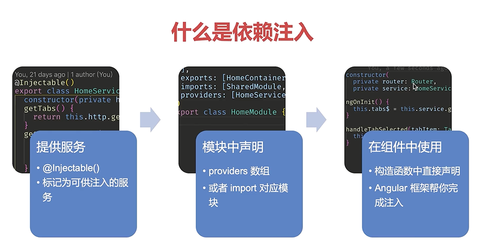 

注入器也是可以分级别的，应用级，模块级，组件级。应用范围不同。大部分只需要注册到应用级别

不同的注入器返回不同的实例对象

服务实例的查找类似函数作用域链，当前级别找到就用当前级别，找不到就去父级查找

服务**默认是单例模式**。这也是为什么**服务可以用来在组件之间共享数据和逻辑的原因**

- 模块中注入

  在需要注入的服务上标记 `@Injectable()`

  ```typescript
  // @Injectable()标记为可供注入的服务
  @Injectable()
  class Product {
    constructor(private name: string, private color: string) { }
  }
  @Injectable()
  class PurchaseOrder {
    constructor(private product: Product) { }
  }
  ```

  标识符中注入

  ```typescript
  // 直接通过标识符
  @NgModule( {
    providers: [
      // useClass模式的直接写入就可以
      PurchaseOrder
      // { provider: PurchaseOrder, useClass: PurchaseOrder }
    ],
  })
  ```
  
  工厂模式注入
  
  ```typescript
  // 工厂模式
  @NgModule( {
    providers: [ 
  	{
  		provide: Product,
  		useFactory: () => {
  		    return new Product( "大米手机" );
  		  },
  		deps: []
  	}
   ],
  })
  ```
  
  `Token` 注入
  
  ```typescript
  // 使用Token作为标识
  const token = new InjectionToken<string>('BaseUrl');
  @NgModule( {
    providers: [ 
      {
        provide: token,
        useValue:'http://localhost'
        // useValue 也可以是对象
        /*
          useValue: Object.freeze({
          	APIKEY: "API123456",
          	APISCRET: "100-222-333"
      	})
      	*/
      }
    ],
  } )
  
  // 使用Token依赖注入
  constructor(@Inject(token) private baseUrl:string){ }
  ```


- ##### 使用 `Injector` 手动注入

  ```typescript
  import { Injector } from '@angular/core';
  
  // @Injectable()标记为可供注入的服务
  @Injectable()
  class Product {
    constructor(private name: string, private color: string) { }
  }
  @Injectable()
  class PurchaseOrder {
    constructor(private product: Product) { }
  }
  
  export class HomeGrandComponent implements OnInit {
    ngOnInit() {
      // 使用Injector依赖注入
      // 默认是单例模式 所有的对象都已经创建好了
      const injector = Injector.create({
        // providers数组里去描述服务怎么去创建
        providers: [
          {
            // provide 设置标识符 需要依赖这个服务的时候用来匹配到这里
            provide: Product,
            // useClass 直接new这个类
            // useClass: Product,
            // useExisting 使用现存的已经实例化的
            // useValue 不想注入类，只想注入一个字符串等
            // useFactory 工厂模式
            useFactory: () => {
              return new Product('大米手机', '黑色');
            },
            // deps 描述要创建的这个对象的依赖性
            //（不是要完全实现对象的构造函数，而是如果还依赖providers里面的其他东西，则在这里去提供）
            deps: []
          },
          { 
            provide: PurchaseOrder,
            deps: [Product]
          }
        ]
      });
      console.log(injector.get(PurchaseOrder).getProduct);
    }
  }
  ```


## Http 数据交互

### HTTP 方法配置

app.module.ts 中导入 `HttpClientModule`

- **只在根模块中导入**
- 整个应用**只需导入一次**，不要再其他模块导入

```typescript
import { HttpClientModule } from '@angular/common/http';

imports: [
  HttpClientModule
]
```

**使用到的地方引入 `HttpClient`** 并在构造函数声明

```typescript
// 当做一个服务
import { HttpClient } from '@angular/common/http';

// 依赖注入
constructor(public http: HttpClient) { }
```


### 请求方法

`get` / `post` / `put` / `delete` 方法对应于 Http 方法

```typescript
this.http.get(url [, options]);
this.http.post(url, data [, options]);
this.http.delete(url [, options]);
this.http.put(url, data [, options]);
```

这些方法是**泛型**的，可以直接把返回的 JSON 转换成对应类型

不规范的请求，使用 `request` 方法

**返回的值是 `Observable`**

```typescript
this.http.get<Post[]>('/getAllPosts').subscribe(response => console.log(response))
```

**必须订阅，才会发生请求**，否则不会发送 

- ##### 数据请求

  ```typescript
  public list:any[]=[];
  getData() {
  	// 服务器必须允许跨域
  	let api="http://a.itying.com/api/productlist";
      // 使用rxjs
  	this.http.get<Product[]>(api, params: { category: '手机' })
      .subscribe((response:any)=>{
  	    console.log(response);
  	    this.list = response.result;
  	})
  }
  ```

- ##### 数据提交

  ```typescript
  import { HttpClient, HttpHeaders } from "@angular/common/http";
  
  constructor(public http:HttpClient) { }
  
  doLogin(){
    //手动设置请求的类型
    const httpOptions = {
      headers: new HttpHeaders({ 'Content-Type': 'application/json' })
    };
    var api = "http://127.0.0.1:3000/doLogin";
    this.http.post(api, {username:'张三', age:'20'}, httpOptions).subscribe(response => {
      console.log(response);
    });   
  }
  ```

- ##### `Jsonp` 请求数据

  `Jsonp` 配置：在 app.module.ts 中引入 `HttpClientModule`、`HttpClientJsonpModul` 并注入

  ```typescript
  import { HttpClientModule, HttpClientJsonpModule } from '@angular/common/http';
  ```
  
  ```typescript
  imports: [
  	BrowserModule,
  	HttpClientModule,
  	HttpClientJsonpModule
  ]
  ```
  
  `jsonp` 请求数据

  ```typescript
  import {HttpClient} from "@angular/common/http";
  
  constructor(public http:HttpClient) { }
  
  getJsonpData(){
  	//jsonp请求 服务器必须得支持jsonp
  	let api="http://a.itying.com/api/productlist";
  	this.http.jsonp(api,'callback').subscribe((response)=>{
  	  console.log(response);
  	})
  }
  ```
  
- ##### `axios` 请求数据

  安装 `axios`

  ```bash
  npm install axios --save
  ```

  ```typescript
  // 引入axios
  import axios from 'axios';
  
  axiosGet(api:string){
    return new Promise((resolve,reject)=>{
      axios.get(api).then(function (response:any) {
        resolve(response)
      });
    })
  }
  
  getAxiosData(){
    console.log('axios获取数据');
    let api="http://a.itying.com/api/productlist";
    this.httpService.axiosGet(api).then((data)=>{
      console.log(data)
    })
  }
  ```


### 请求参数

- ##### `HttpParams` 类

  ```typescript
  import { HttpParams } from '@angular/common/http';
  
  // 请求参数以对象的形式传递
  let params = new HttpParams({ fromObject: { name: "zhangsan", age: "20" } });
  // HttpParams内的append、set等方法的返回值都是HttpParams
  params = params.append("sex", "male");
  // 以查询参数的形式传递
  let params = new HttpParams({ fromString: "name=zhangsan&age=20" })
  
  this.http.get("/users", {
    // params: params 的简写
    params
  }).subscribe(console.log)
  ```


### 请求头

- ##### `HttpHeaders`

  ```typescript
  import { HttpHeaders } from '@angular/common/http';
  
  let headers = new HttpHeaders({
    test: "Hello"
  })
  
  this.http.get("/users", {
    // headers: headers 的简写
    headers
  }).subscribe(console.log)
  ```


### 响应内容

- ##### `HttpObserve`

  ```typescript
  // type HttpObserve = 'body' | 'response'
  // response 读取完整响应体
  // body 读取服务器端返回的数据
  
  this.http.get("/users", {
    // 默认是 body
    // observe: 'body'
    observe: 'response'
  }).subscribe(console.log)
  ```
  
   
  
  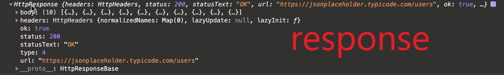 


## 拦截器

拦截器是 Angular 应用中**全局捕获和修改 HTTP 请求和响应的方式**（添加 Token，捕获 Error）

拦截器将只拦截 `HttpClientModule` 模块发出的请求

创建拦截器

```bash
ng g interceptor <name>
```

 

- ##### 对请求进行截断

  ```typescript
  import { Injectable } from '@angular/core';
  import { HttpInterceptor, HttpHandler, HttpRequest } from '@angular/common/http';
  
  @Injectable()
  export class ParamInterceptor implements HttpInterceptor {
    // 拦截方法 参数1: 请求(泛型指定的是请求体的类型) 参数2: 下一步的处理
    intercept(req: HttpRequest<any>, next: HttpHandler) {
      // 对请求消息进行处理
      // 请求不能直接修改 克隆去修改请求
      const modifiedReq = req.clone({
        // 统一添加请求路径前缀
        setParams: { icode: environment.icode },
        // 统一添加Token
        setHeaders: { Authorization: "Bearer XXXX" }
      });
      // 把修改后的请求回传给应用
      return next.handle(modifiedReq);
    }
  }
  ```

  根模块引入

  ```typescript
  import { HTTP_INTERCEPTORS } from '@angular/common/http';
  @NgModule({
    providers: [
      // 多个令牌 multi: true
      { provide: HTTP_INTERCEPTORS, useClass: ParamInterceptor, multi: true }
    ]
  })
  ```

- ##### 对响应进行截断

  ```typescript
  import { Injectable } from '@angular/core';
  import { HttpEvent, HttpInterceptor, HttpHandler, HttpRequest } from '@angular/common/http';
  import { tap } from 'rxjs/operators';
  
  @Injectable()
  export class ParamInterceptor implements HttpInterceptor {
    // 拦截方法 参数1: 请求 参数2: 下一步的处理
    intercept(req: HttpRequest<any>, next: HttpHandler) {
      // 对响应消息进行处理
      return next.handle(req).pipe(
        tap((event: HttpEvent<any>) => {
          if ( event instanceof HttpResponse && event.status >= 200 && event.status < 300 ) {
            console.log('[此处假装弹出消息] 请求成功！');
          }
        })
      );
    }
  }
  ```

  根模块引入

  ```typescript
  import { HTTP_INTERCEPTORS } from '@angular/common/http';
  @NgModule({
    providers: [
      // 多个令牌 multi: true
      { provide: HTTP_INTERCEPTORS, useClass: NotificationInterceptor, multi: true }
    ]
  })
  ```


## 代理

**解决跨域问题**

1. 在项目的根目录下创建 proxy.conf.json 文件并加入如下代码

   ```json
   {
     "/api/*": {
       "target": "http://localhost: 3070",
       "secure": false,
       "changeOrigin": true
     }
   }
   ```

   - `/api/*`：在应用中发出的以 `/api/` 开头的请求走此代理

     应用中的 `http` 请求 api 地址也不需要写前缀，直接以 `/api` 开头

     ```typescript
     // this.http.get("http://localhost:3005/api/hello")
     this.http.get("/api/hello")
     ```

   - `target`：服务器端 URL

   - `secure`：如果服务器端 URL 的协议是 `https`，此项需要为 `true`

   - `changeOrigin`：如果服务器端不是 `localhost`，此项需要为 `true`

2. 指定 `proxy` 配置文件

   方式一 package.json 指定

   ```json
   "scripts": {
     "start": "ng serve --proxy-config proxy.conf.json"
   }
   ```

   方式二 angular.json 指定

   ```json
   "serve": {
     "options": {
       "proxyConfig": "proxy.conf.json"
     }
   }
   ```


# 模块 Module

模块就是提供**相对独立功能的一组代码**。主要的作用就是让程序更有序，独立的功能放到独立的模块中去，让模块更好的维护。

模块的组成部分可以有：组件，服务，指令，管道等、从某种角度说，像一个小型应用

Angular 应用中至少需要一个根模块，用于启动

## 内置模块

- ##### 需要在**每个需要的模块中进行导入的模块**

  1. `CommonModule`：提供绑定。`*ngIf` 和 `*ngFor` 等基础指令，基本上每个模块都需要导入它。
  2. `FormsModule` / `ReactiveFormsModule`：表单模块需要在每个需要的模块导入
  3. 提供组件，指令，管道的模块

- ##### 只需要的在**根模块导入一次的模块**

  1. `HttpClientModule` / `BrowserAnimationsModule` / `NoopAnimationsModule` / `BrowserModule`

     (在**根模块不需要单独导入 `CommonModule`**，因为 `BrowserModule` 已经顺带导出了)

  2. **只提供服务的模块**

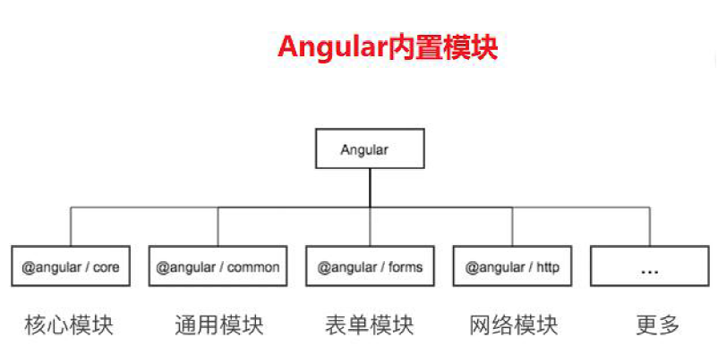 


## 创建模块

```bash
ng g module 文件夹名/模块名
# 同时创建路由
ng g module 模块 --routing
# 创建模块直接放到已有文件夹中，不新建文件夹
ng g module 模块 --flat=true
```


## 模块结构

```typescript
@NgModule({
  // 模块拥有的组件，指令或管道。注意每个组件，指令，管道只能在一个模块中声明
  // 如果想要导入的模块已经通过其所在的模块被导入了，就不需要单独再导入这个模块
  declarations: [UserComponent],
  // 导入本模块需要的依赖模块，只能是模块
  imports: [CommonModule],
  // 暴露给其他模块使用的模块，组件，指令，管道等。
  exports:[UserComponent],
  // 模块中需要使用的服务
  providers:[CommonService],
  // 引导组件 进入这个模块后需要显示的是什么 只有根组件有这个属性
  bootstrap: [AppComponent]
})
export class AppModule { }
```

- ##### 模块导入注意点

  - 如果是**组件**，那么需要在**每一个需要模块都进行导入**
  - 如果是**服务**，那么一般来说在**根模块中导入一次即可**


## 自定义模块

项目非常庞大的时候把所有的组件都挂载到根模块里面，会导致项目加载很慢。这个时候可以自定义模块来组织项目

- ##### 自定义模块文件结构

  ```bash
  #自定义user模块
  #整体结构和根模块类似
  /app
  - /module
  -- /user
  --- /components
  ---- /address
  ----- address.component.html
  ----- address.component.ts
  ---- /order
  ----- order.component.html
  ----- order.component.ts
  --- /services
  ---- common.service.ts
  --- user.component.html
  --- user.component.ts
  --- user.module.ts
  ```

- ##### 自定义模块例

  自定义模块 user.module.ts

  ```typescript
  import { NgModule } from '@angular/core';
  import { CommonModule } from '@angular/common';
  // 导入子组件
  import { CommonService } from './services/common.service';
  import { AddressComponent } from './components/address/address.component';
  import { OrderComponent } from './components/order/order.component';
  import { UserComponent } from './user.component';
  
  @NgModule({
    // 声明user模块里面的组件
    declarations: [ProfileComponent, AddressComponent, OrderComponent, UserComponent],
    // 暴露组件 让其他模块里面可以使用暴露的组件
    exports:[UserComponent],
    providers:[CommonService],
    imports: [CommonModule]
  })
  export class UserModule { }
  ```

  根模块 app.module.ts

  ```typescript
  //引入自定义模块
  import { UserModule } from './module/user/user.module';
  
  @NgModule({
    declarations: [AppComponent, HomeComponent, NewsComponent],
    imports: [
      BrowserModule,
      FormsModule,
      HttpClientModule,
      // 在根模块引入
      UserModule
    ],
    providers: [],
    bootstrap: [AppComponent]
  })
  export class AppModule { }
  ```

  其他模块调用

  ```html
  <app-user></app-user>
  ```

  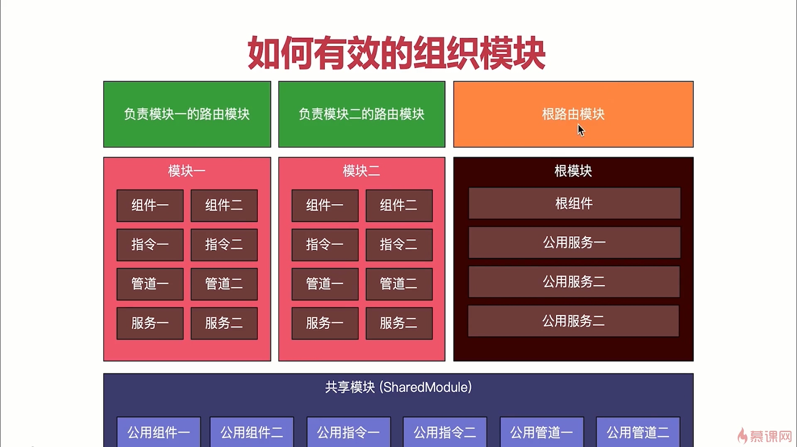 


## 动态模块

不使用路由懒加载的模式，动态加载模块

```typescript
// 定义需要动态加载的模块
import { NgModule } from '@angular/core';
import { CommonModule } from '@angular/common';
NgModule({
  declarations: [],
  exports: [],
  imports: [
    CommonModule
  ]
})
export class DynamicModule {}
```

```typescript
// 在根模块导入
@NgModule({ 
  declarations: [ AppComponent ],
  imports: [ BrowserModule, DynamicModule ],
  providers: [],
  bootstrap: [AppComponent]
})
export class AppModule {}
```

```html
<div>
  <button (click)="loadModule()">Load module</button>
  <button (click)="cLearComponent()">Clear</button>
</div>
<ng-template #container></ng-template>
```

```typescript
import { createNgModule } from '@angular/core'.

export class AppComponent {
  @ViewChild('container', { read: ViewContainerRef }) container!: ViewContainerRef;
  private componentRef!: ComponentRef<DynamicComponent>;
  constructor(private injector: Injector) {}
  
  async LoadModule() {
    // 动态加载模块
    const { DynamicModule } = await import("../components/components/dynamic/dynamic.module");
    // 返回模块实例
    const moduleRef = createNgModule(DynamicModule, this.injector);
    this.container.clear();
    // 动态加载组件到动态模块中
    this.componentRef = this.container.createComponent(DynamicComponent, { ngModuleRef: moduleRef });
  }
  
  clearComponent(){
    if (this.container){
      this.container.clear();
    }
  }
}
```


# 路由 Route


路由本质上是切换视图的一种机制

通过**路由插座** `<router-oulet></router-oulet>`

**切换页面的时候，路由显示的内容是插入到 `router-outlet` 的同级的下方节点**，而不是在 `router-outlet` 中包含

Angular 是单页程序，路由显示的路径不过是一种保存路由状态的机制，这个**路径在 web 服务器上不存在**，如果**刷新服务器可能会找不到，需要重定向对应**

**路由是以模块为单位**的，每个模块都可以有自己的路由

## 路由配置

根路由 app-routing.module.ts

```typescript
// 路由是按顺序执行的
const routes: Routes = [
  //{path: 'home', component: HomeComponent},
	{path: 'news', component: NewsComponent},
	{path: 'newscontent/:id', component: NewscontentComponent},
  // 重定向
  // pathMatch：prefix 以定义的path开头；full 定义的path完全匹配
	{path: '', redirectTo: 'home', pathMatch: 'full'},
  // 匹配任意的路由（以上都不存在的情况）
  {path:'**', redirectTo: 'home'}
];
@NgModule({
  // 根路由使用 RouterModule.forRoot(routes)
  // 启用路由的 debug 跟踪模式，需要在根模块中设置 `enableTracing: true`
  // 启用Hash路由  forRoot(routes, { useHash: true })
  imports: [RouterModule.forRoot(routes, { enableTracing: true })],
  // 要导出
  exports: [RouterModule]
})
export class AppRoutingModule {}
```

根组件 app.component.html

```html
<h1>
    <!-- routerLinkActive默认选中，参数是.active类选择器css -->
    <a routerLink="/home" routerLinkActive="active">首页</a>
		<a routerLink="/news" routerLinkActive="active">新闻</a>
</h1>

<!-- 配置router-outlet 显示动态加载的路由 匹配到的路由组件会显示在这个地方 -->
<router-outlet></router-outlet>
```

子路由

```typescript
/**
 * 在功能模块中定义子路由后，只要导入该模块，等同于在根路由中直接定义
 * 也就是说在 AppModule 中导入 HomeModule 的时候，
 * 由于 HomeModule 中导入了 HomeRoutingModule
 * 在 HomeRoutingModule 中定义的路由会合并到根路由表
 * 相当于直接在根模块中定义下面的数组。
 */
const routes: Routes = [
  { path: 'home', component: HomeContainerComponent}
];
@NgModule({
  // 子路由 forChild
  imports: [RouterModule.forChild(routes)],
  exports: [RouterModule]
})
export class HomeRoutingModule {}
```


## 路由跳转

### 无参数

**URL 结果：/home**

```typescript
{ path: 'home', component: HomeComponent },
```

```html
<a routerLink="/home">首页</a>
<a [routerLink]="['/home']">首页</a>
```

```typescript
// 引入
import { Router} from '@angular/router';
// 依赖注入
constructor(public router:Router) { }
// 以根路由跳转/home
this.router.navigate(['home']);
```


### 查询参数

**URL 结果：/home?name=val1**

```html
<a [routerLink]="['/home']" [queryParams]="{name: 'val1'}">...</a>
```

```typescript
// 引入
import { Router} from '@angular/router';
// 依赖注入
constructor(public router:Router) { }
// 传入查询参数
this.router.navigate(['home'], { queryParams: {name:'val1'} });
```

**查询参数读取**

```typescript
import { ActivatedRoute } from '@angular/router';

// 获取查询参数传值
this.route.queryParamMap.subscribe((data)=>{
	console.log(data);
  console.log(data.get('name');
}
```

可以使用 `NavigationExtras` 配置传参

```typescript
// 引入NavigationExtras
import { Router, NavigationExtras} from '@angular/router';
// 用NavigationExtras 配置传参
goNewsContent(){
	let navigationExtras: NavigationExtras = {
		queryParams: { 'session_id': '123' },
		fragment: 'anchor'
	};
	this.router.navigate(['/news'], navigationExtras);
}
```


### 路径参数(必选)

路径参数是以 `:` 开头的，作为 url 的一部分

**路径参数的变化在默认的路由策略之下，不会销毁这个组件，会重用这个组件，`ngOnInit` 只走一遍**

**URL 结果：/newscontent/123**

```typescript
{ path:'newscontent/:key',component:NewscontentComponent }
```

```html
<a [routerLink]="['/newscontent/', key ]">...</a>
```

```typescript
// 注意路径参数传值, 参数写在[]里面
this.router.navigate(['newscontent', key]);
```

```typescript
// 获取动态路由传值
this.route.paramMap.subscribe((data)=>{
  console.log(data);
  console.log(data.get('key');
});
```


### 路径参数(可选)

**URL 结果：/home/sports;name=val1**

```typescript
{ path: ':tabLink', component: HomeDetailComponent }
```

```html
<!-- 有必须参数，也有可选参数. 可选参数用{}包起来-->
<a [routerLink]="['/home', tab.link, {name: 'val1'}]">...</a>
<!-- 只有必须参数
<a [routerLink]="['/home', tab.link]">...</a>
-->
```

```typescript
// 可选参数用{}包起来
this.router.navigate(['home', tab.link, {name: 'val1'}]);
/* 只有必须参数
this.router.navigate(['home', tab.link]);
*/
```

```typescript
// 获取动态路由传值
this.route.paramMap.subscribe((data)=>{
  console.log(data);
  console.log(data.get('tabLink');
  console.log(data.get('name');
});
```


### 多种参数同时存在

**URL 结果：/home/mobile;name=zhangshan?productId=2&productImg=aaa.jpg**

```typescript
{ path: ':tabLink', component: HomeDetailComponent }
```

```html
<a [routerLink]="['/home', tab.link, {name: 'zhangshan'}]" [queryParams]="{productId: '2', productImg: 'aaa.jpg'}">...</a>
```

```typescript
this.router.navigate(['home', tab.link, {name: 'zhangshan'}], { queryParams: {productId:'2', productImg: 'aaa.jpg'} });
```

```typescript
// 路径参数和查询参数读取可以同时存在
this.route.paramsMap.subscribe(params => {
    console.log('路径参数', params);
});
this.route.queryParamMap.subscribe(params => {
    console.log('查询参数', params);
});
```


## 路由插座

**主要插座只能有一个，辅助插座可以有多个**

```html
<!-- 没有名字的只能有一个，带名字的可以有多个 -->
<!-- 没有名字的默认名是primary -->
<route-outlet></route-outlet>
<route-outlet name="second"></route-outlet>
```

主要插座

```html
<a [routerLink]="['grand']" routerLinkActive="active">Link to grand</a>
```

```typescript
{ path: 'grand', component: HomeGrandComponent }
```

辅助插座

```html
<!-- URL：/home/hot/(grand//second:aux) -->
<a [routerLink]="[{ outlets: { second: ['aux'] } }]">link to second</a>
```

```typescript
// outlet 定义匹配的路由插座名
{ path: 'aux', component: HomeAuxComponent, outlet: 'second' }
```

同时将两个链接结果都显示出来

```typescript
{
  path: 'news', component: NewsComponent, children:[
    { path: 'company', component: CompanyComponent, outlet: 'left' },
    { path: 'industry', component: IndustryComponent, outlet: 'right' }
  ]
}
```

```html
<a [routerLink]="['news', { outlets: { left: ['company'], right: ['industry'] } }]"></a>
```

```html
<route-outlet name="left"></route-outlet>
<route-outlet name="right"></route-outlet>
```


## 获取路由参数

- ##### 配置

  ```typescript
  // 引入
  import { ActivatedRoute } from '@angular/router';
  // 依赖注入
  constructor(public route:ActivatedRoute) { }
  ```

- ##### 路由快照

  **快照方式获取的参数不是 `Observable`**

  使用快照方式时要**保证 url 只会用一次**，即不会发生从当前 url 导航到当前 url 的情况。因为这种方式**获取的参数是不会变动**的

  因为组件的 `ngOnInit` 方法只会调用一次，而如果**检测到路由相同而参数不同时，是不会重新初始化组件**的

  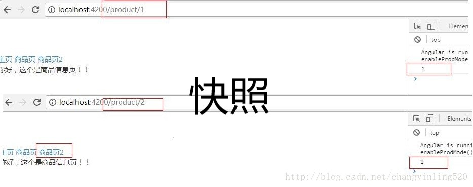 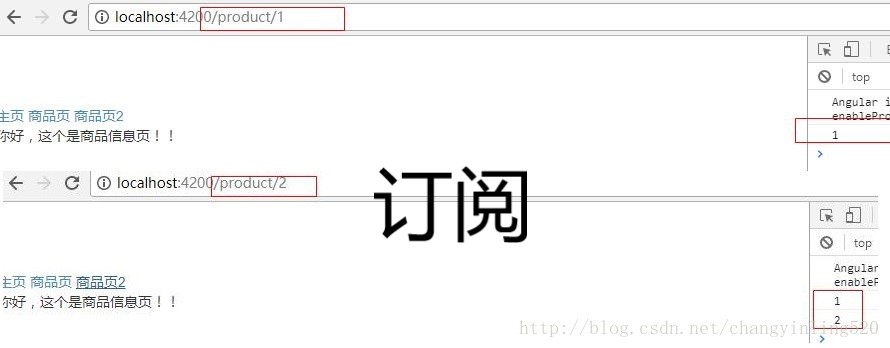

  ```typescript
  // 普通对象
  this.route.snapshot.params['title'];
  this.route.snapshot.queryParams['name'];
  
  // 有get,has,getAll 等方法
  this.route.snapshot.paramMap.get('title');
  this.route.snapshot.queryParamMap.get('name');
  ```

- ##### 参数订阅

  ```typescript
  this.route.params.subscribe((params)=>{
  	console.log(params.title)
  });
  this.route.queryParams.subscribe((params)=>{
  	console.log(params.name)
  });
  
  // 有get,has,getAll 等方法
  this.route.paramMap.subscribe((params)=>{
  	console.log(params.get('id')
  });
  this.route.queryParamMap((params)=>{
  	console.log(params.get('name'))
  });
  ```


## 父子路由

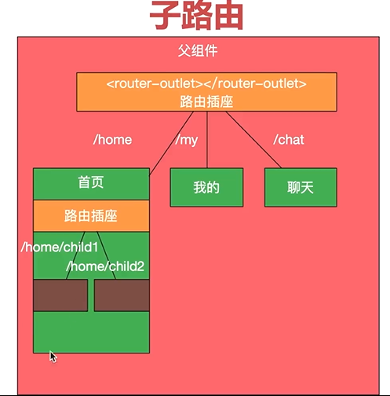 

- ##### 配置路由

  ```typescript
  {
    path:'home',component:HomeComponent,
      children:[
        {path:'welcome',component:WelcomeComponent},
        {path:'setting',component:SettingComponent},
        /* 动态路由
       	{path:':id',component:ChildComponent},
       */
        {path:'**',redirectTo:'welcome'}
      ]
  }
  ```
  
  父组件中定义 `router-outlet`
  
  ```html
  <div class="content">
    <div class="left">
        <a [routerLink]="[ '/home/welcome']" routerLinkActive="active">欢迎首页</a>
        <a [routerLink]="[ '/home/setting']" routerLinkActive="active">系统设置</a>
    </div>
    <div class="right">
      <!-- 显示对应子组件的内容 -->
      <router-outlet></router-outlet>
    </div>
  </div>
  ```
  
  ```typescript
  this.route.firstChild.paramsMap.subscribe(params => {
    console.log('路径参数', params);
  });
  ```


## 路由守卫

Angular 提供了一些钩子帮助**控制进入或离开路由**。这些钩子就是路由守卫

可以通过这些钩子，控制进入离开路由时的操作

路由守卫方法可以返回 `boolean` 或 `Observable<boolean>` 或 `Promise<boolean>`，它们在将来的某个时间点解析为布尔值

### 创建守卫

```bash
ng g guard service/login
```


### CanActivate

**导航到某路由时触发**

可以用来判断用户只有在满足一定的条件的情况下才能打开这个路径对应的页面

```typescript
import { CanActivate } from "@angular/router";
// 实现CanActivate 接口
export class LoginGuard implements CanActivate{
  constructor(private router: Router) {}
  // 返回true 或false
  canActivate(){
    var userinfo=this.storage.get('userinfo');
    if(!userinfo || !userinfo.username){
      // 跳转
      return this.router.createUrlTree(['/login']);
    } else{
      return true;
    } 
  }
}
```

`canActivate` 可以指定多个守卫路由，所有守卫方法都允许，路由才被允许访问

```typescript
{ path:"", component:DefaultComponent, canActivate:[LoginGuard], 
  children:[
    { path:"home", component:HomeComponent },
    { path:"report", component:ReportComponent, canActivate:[LoginGuard] }
  ]
}

@NgModule({
  providers: [LoginGuard]  
})
```


### CanActivateChild

**是否可访问子路由**

```typescript
export class AdminGuard implements CanActivateChild{
  canActivateChild(): boolean | UrlTree {
    return true;
  }
}
```

```typescript
{ path:"about", component:AboutComponent, canActivateChild:[AdminGuard], 
  children:[
    { path:"introduce", component:IntroduceComponent },
  ]
}
```


### CanDeactivate

**从当前路由离开时触发**

决定用户是否能够离开。比如用户输入的表单没有保存，用户离开路由时提示

```typescript
import { CanDeactivate } from "@angular/router";
import { ProductComponent } from "../product/product.component";
// CanDeactivate接口有一个范型，指定当前组件的类型
export class UnsaveGuard implements CanDeactivate<ProductComponent>{
  //第一个参数 范型类型的组件
  //根据当前要保护组件 的状态 判断当前用户是否能够离开
  canDeactivate(component: ProductComponent){
    if (component.canLeave()){
      return true; 
    } else {
      if(window.confirm('你还没有保存，确定要离开吗？')){
        return true;
      }else {
        return false;
      }
    }

  }
}
```

```typescript
{ path: 'product/:id', component: ProductComponent, children:[
  { path: '', component : ProductDescComponent },
  { path: 'seller/:id', component : SellerInfoComponent }
] ,canActivate: [LoginGuard], canDeactivate: [UnsaveGuard] }

@NgModule({
  providers: [LoginGuard,UnsaveGuard]
})
```


### Resolve

**路由激活之前触发**

http 请求数据返回有延迟，导致模版无法立刻显示

允许在**进入路由之前去服务器读数据**，把需要的数据都读好以后，**带着这些数据进到路由里**，立刻就把数据显示出来

```typescript
@Injectable()
// 实现Resolve接口
// Resolve要声明一个范型，范型就是resolve要解析出来的数据的类型
export class ProductResolve implements Resolve<Product>{
  resolve(route: ActivatedRouteSnapshot, state: RouterStateSnapshot): Observable<any> | Promise<any> | any {
    // 进入商品信息路由之前，准备好商品信息再进入路由
    // 拿不到信息，或者拿信息出问题了，直接跳到错误信息页面，不再进入目标路由
    let productId: number = route.params["id"];
    if (productId == 2) { 
      //正确id
      return new Product(1, "iPhone7");
    } else { 
      //id不是1导航回首页
      this.router.navigate(["/home"]);
      return undefined;
    }
  }
}
```

路由配置

```typescript
{ path: 'product/:id', component: ProductComponent, children:[
  { path: '', component : ProductDescComponent },
  { path: 'seller/:id', component : SellerInfoComponent }
],
  // canActivate: [LoginGuard],
  // canDeactivate: [UnsaveGuard],
  // resolve是一个对象
  resolve:{
    // 传入product
    // product由ProductResolve生成
    product : ProductResolve
  }
}
```

组件配置

```typescript
export class ProductComponent implements OnInit {
  private productId: number;
  private productName: string;
  constructor(private routeInfo: ActivatedRoute) { }
  ngOnInit() {
    // this.routeInfo.params.subscribe((params: Params)=> this.productId=params["id"]);
    this.routeInfo.data.subscribe((data:{product:Product}) => {
      this.productId=data.product.id;
      this.productName=data.product.name;
    });
  }
}
```


## 懒加载

**通过路由来动态挂载模块**，来实现模块的懒加载

子模块路由配置

```typescript
{
  path:'', component: ProductComponent,
    children: [
      // 子路由的组件 根模块访问不到，需要在父组件中设置router-outlet以显示子组件内容
      { path: 'cart', component: CartComponent },
      { path: 'pcontent', component: PcontentComponent }
    ]
},
  // 根组件可以直接访问到plist的组件内容
  { path: 'plist', component: PlistComponent }
```

子模块挂载路由

```typescript
@NgModule({
  declarations: [ProductComponent, PlistComponent, CartComponent, PcontentComponent],
  // 引入子模块路由
  imports: [ CommonModule, ProductRoutingModule]
})
export class ProductModule { }
```

根模块路由配置

```typescript
{
  path:'user',
  loadChildren: () => import('./module/user/user.module').then(m => m.UserModule)
},
{
  path:'article',
  loadChildren: () => import('./module/article/article.module').then(m => m.ArticleModule)
},
{
  path:'product',
  loadChildren: () => import('./module/product/product.module').then(m => m.ProductModule)
},
{
  path:'**',redirectTo:'user'
}

/* Angular10.x之前配置写法
{
  path:'user',
  loadChildren:'./module/user/user.module#UserModule'   
}
*/ 
```

根模块不需要再引入子模块和组件

```typescript
@NgModule({
  declarations: [
    AppComponent
  ],
  imports: [
    BrowserModule,
    AppRoutingModule
  ],
  providers: [],
  bootstrap: [AppComponent]
})
export class AppModule { }
```


# 动画

## 基础概念

- ##### 状态

  状态表示的是要进行运动的元素在运动的不同时期所呈现的样式

  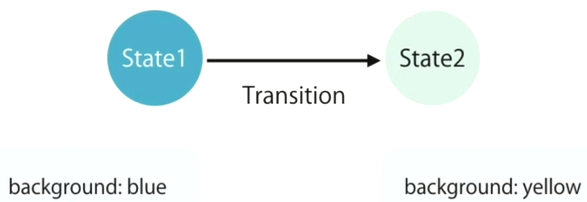 

- ##### 状态种类

  `void`：当元素在内存中创建好但**尚未被添加到 DOM 中**或将元素**从 DOM 中删除时**会发生此状态

  `*`：元素被**插入到 DOM 树之后的状态**，或者**已经是在 DOM 树中的元素的状态**，也叫默认状态

  `custom`：自定义状态，元素**默认就在页面之中**，从一个状态运动到另一个状态，比如面板的折叠和展开

   

- ##### 进出场动画

  **进场动画**是指元素被创建后以动画的形式出现在用户面前，进场动画的状态用 `void => * ` 表示，别名为 `:enter`

  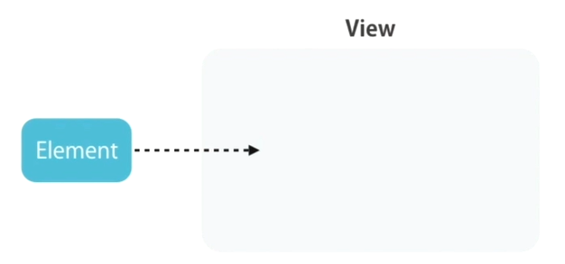 

  **出场动画**是指元素在被删除前执行的一段告别动画，出场动画的状态用 `* => void ` 表示，别名为 `:leave`

  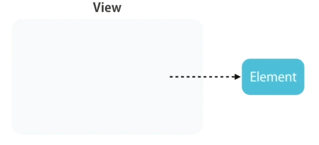 


## 创建动画

- ##### 动画模块 `BrowserAnimationsModule`

  ```typescript
  import { BrowserAnimationsModule } from '@angular/platform-browser/animations'
  
  @NgModule({
      imports: { BrowserAnimationsModule }
  })
  export class AppModule {}
  ```

- ##### 创建动画

  ```typescript
  @Component({
      animations: [
          // 创建动画，参数一：动画名称 参数二：数组 定义动画的运动状态、状态下的运动样式、动画运动的形式
          trigger("slider", [
              // 指定入场动画，注意字符串两边不能有空格，箭头两边可以有也可以没有空格
              // void => * 可以替换为 :enter
              transition("void => *", [
                  // 指定元素未入场前的样式 void状态的样式
                  style({ opacity: 0, transform: "translateY(40px)" }),
                  // 指定元素入场后的样式及运动参数
                  animate(250, style({ opacity: 1, transform: "translateY(0)" }))
              ]),
              // 指定出场动画
              // * => void 可以替换为 :leave
              transition("* => void", {
                  // *的样式就是页面中定义的样式，所以不用定义
                  // 指定元素出场后的样式和运动参数
                  animate(600, style({ opacity: 0, transform: "translateX(100%)" }))
              })
          ])
      ]
  })
  ```

  - `trigger` 用于**创建动画**，指定动画名称，用名称去调用运行

    参数1：动画名称，参数2：数组，定义动画的运动状态

  - `transition` 用于指定动画的**运动状态**，出场动画或者入场动画，或者自定义状态动画

    参数1：状态，参数2：数组，定义入场前样式、出入场动画

  - `style` 用于设置元素在**不同的状态下所对应的样式**

  - `animate` 用于设置**运动参数**，比如动画运动时间，延迟事件，运动形式

    参数1：是数字，就是动画时间；是字符串，就是运动参数，参数2：出入场后样式

    ```typescript
    // 字符串：动画运动参数 -> 动画执行总时间 延迟时间(可选) 运动形式(可选)
    animate("600ms 1s ease-out", style({ opacity: 0, transform: "translateX(100%)" }))
    // 数字：动画运行时间
    animate(600, style({ opacity: 0, transform: "translateX(100%)" }))
    ```

    入场动画中可以不指定元素的默认状态，Angular 会将 `void` 状态清空作为默认状态

    ```typescript
    trigger("slider", [
        translation(":enter", [
            style({ opacity: 0, transform: "translateY(40px)" }),
            // 可以不指定animate的第二参数
            animate(250)
        ]),
        translation(":leave", [
            animate(600, style({ opacity: 0, transform: "translateX(100%)" }))
        ])
    ])
    ```

- ##### 创建可重用动画

  动画的定义放置在单独的文件中，方便多组件调用

  抽取具体的动画定义，方便多动画调用。调用动画时传递运动总时间、延迟时间、运动形式参数

  ```typescript
  // 创建 animations.ts 文件
  import { animate, keyframes, style, transition, trigger, animation, useAnimation } from '@angular/animations'
  
  // 使用animation方法，定义动画形式
  let sliderAnimationEnter = animation([
      style({ opacity: 0, transform: "translateY(40px)" }),
      animate(250)
  ])
  
  // animation的参数2是一个固定对象，对象中有属性params，用来设置默认参数
  let sliderAnimationLeave = animation([
      animate(
          "{{ duration }} {{ delay }} {{ easing }}",
          keyframes([
              style({ offset: 0.3, transform: "translateX(-80px)" }),
          	style({ offset: 1, transform: "translateX(100%)" }),
      	]) 
      )
  ], {
      // 设置默认参数
      params: {
          duration: "1s",
          delay: "0s",
          easing: "ease-out"
      }
  })
  
  export const slideAnimation = trigger("slide", [
      // 入场动画
      transition(":enter", useAnimation(sliderAnimationEnter)),		    // useAnimation调用动画
      // 出场动画
      // useAnimation方法也可以设置参数 会覆盖默认参数
      translation(":leave", useAnimation(sliderAnimationLeave), { params: { delay: "1s" } })
  ])
  ```

  组件调用

  ```typescript
  import { slideAnimation } from './animations'
  
  @Component({
      animations: [ slideAnimation ]
  })
  ```

- ##### 调用动画

  ```html
  <div class="form-group">
      <input (keyup.enter)="addItem(input)" #input type="text" class="form-control" placeholder="add todos" />
  </div>
  <ul class="list-group">
      <!-- 指定动画 @动画名 -->
      <li @slide
          (click)="removeItem(i)" *ngFor="let item of todos; let i = index" class="list-group-item">
      	{{ item }}
      </li>
  </ul>
  ```

  入场动画 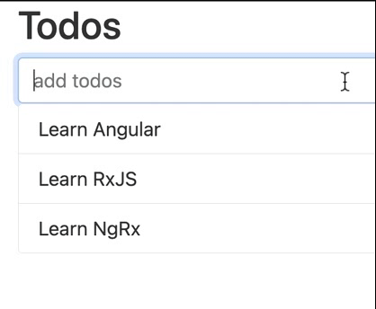 离场动画 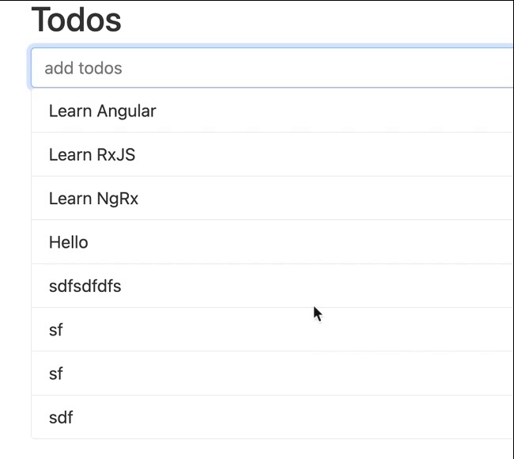 


## 关键帧动画

使用 `keyframes` 方法，传入 `style` 方法的数组，去定义帧位置以及样式

```typescript
transition(":leave", {
    animate(
    	600,
		// animate方法的第二个参数
        keyframes([
         	// style方法中，指定帧的位置，以及在这个帧的位置上元素的样式
         	// 先向左移动
			style({ offset: 0.3, transform: "translateX(-80px)" }),
    		// 再向右移动
    		style({ offset: 1, transform: "translateX(100%)" }),
        ])
    )
})
```

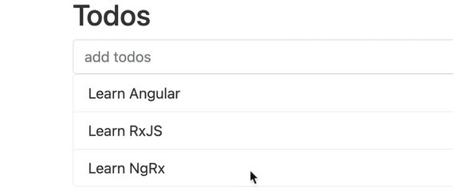 


## 回调动画

Angular 提供了和动画相关的两个回调函数，分别为**动画开始执行时**和**动画执行完成后**

```html
<!-- 动画开始时执行的回调函数 (@slide.start)  -->
<!-- 动画完成后执行的回调函数 (@slide.done)  -->
<li @slide (@slide.start)="start($event)" (@slide.done)="done($event)"></li>
```

```typescript
import { AnimationEvent } from '@angular/animations'

start(event: AnimationEvent) {
    console.log(event)
}
done(event: AnimationEvent) {
    console.log(event)
}
```

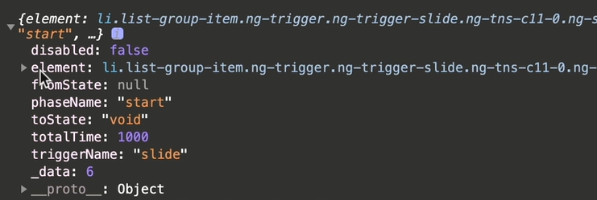 


## 查询元素执行动画

- ##### `query` 方法查找元素并为元素创建动画

  `query` 方法在查找元素获取元素时，**查找的是子元素**，所以要放到**父级进行动画调用**

  ```html
  <div class="container" @todoAnimations>
      <h2>Todos</h2>
      <ul class="list-group">
      	<li @slide
      	    (click)="removeItem(i)" *ngFor="let item of todos; let i = index" class="list-group-item">
      		{{ item }}
      	</li>
  	</ul>
  </div>
  ```

  ```typescript
  export let todoAnimations = trigger("todoAnimations", [
      transition(":enter", [
          // 查阅元素，然后执行动画
          query("h2", [
              // 运动之前的样式
              style({ transform: "translateY(-30)", opacity: 0 }),
              animate(300)
          ]),
          // 查询子级动画，使其执行
          query("@slide", animateChild())
      ])
  ])
  
  @Component({
      animations: [ slideAnimation, todoAnimations ]
  })
  ```

  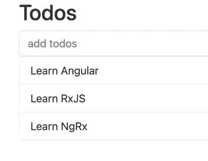 

- ##### `group` 对多个动画进行编组

  默认情况下，父级动画和子级动画按照顺序执行，先执行父级动画，再执行子级动画，可以使用 `group` 方法让其并行

  ```typescript
  transition(":enter", [
      group([
          query("h2", [
          	style({ transform: "translateY(-30)", opacity: 0 }),
          	animate(300)
      	]),
      	query("@slide", animateChild())  
      ])
  ])
  ```

- ##### `stagger` 交错动画

  在多个元素同时执行同一个动画时，让每个元素动画的执行依次延迟。

  `stagger` 方法只能在 `query` 方法内部使用。在 `query` 的第二个参数上，可以调用 `stagger` 方法

  ```typescript
  transition(":enter", [
      group([
          query("h2", [
              style({ transform: "translateY(-30)", opacity: 0 }),
              animate(300)
          ]),
          // stagger 参数1 延迟时间，参数2 动画的执行
          query("@slide", stagger(200, animateChild()))
      ])
  ])
  ```

  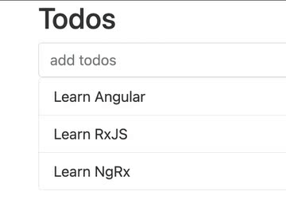 


## 自定义状态动画

`state` 方法定义元素的自定义状态，以及元素在这个状态下的样式

两个参数。参数1：状态名；参数2：在这个状态下元素的样式

```typescript
trigger("expandCollapse", [
    // 使用 state 方法定义折叠状态元素对应的样式
    state("collapsed", style({ height: 0, overflow: "hidden", paddingTop: 0, PaddingBottom: 0 })),
    // 使用 state 方法定义展开状态元素对应的样式
    state("expanded", style({ height: "*", overflow: "auto" })),
    // 定义运动轨迹
    // 定义展开动画
    transition("collapsed => expanded", animate("400ms ease-out")),
    // 定义折叠动画
    transition("expanded => collapsed", animate("400ms ease-in"))
])
```

```html
<div class="container">
    <div class="panel panel-defalut">
        <!-- 点击事件 改变状态 -->
        <div class="panel-heading" (click)="toggle()">
            标题
        </div>
        <!-- 调用动画 可以指定动画状态 -->
        <div class="panel-body" [@expandCollapse]="isExpanded ? 'expanded' : 'collapsed'">
            <p>段落1</p>
            <p>段落2</p>
            <p>段落3</p>
            <p>段落4</p>
        </div>
    </div>
</div>
```

```typescript
isExpanded = false;
toggle() {
   this.isExpanded = !this.isExpanded 
}
```

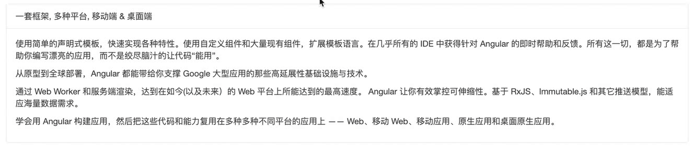 


## 路由动画

为路由添加自定义数据，用来表示该路由的动画状态

```typescript
const routes: Routes = [
    { path: "", component: HomeComponent, pathMatch: "full", data: { animation: "one" } },
    { path: "about", component: AboutComponent, data: { animation: "two" } },
    { path: "news", component: NewsComponent, data: { animation: "three" } }
]
```

根组件添加动画

```typescript
@Component({
    selector: "app-root",
    templateUrl: "./app.component.html",
    styles: [],
    animations: [trigger("routerAnimation", [
        // 从右向左
        transition("one => two, one => three, two => three", [
            // 查找进场的路由 设置进场前的样式
            query(":enter", style({ transform: "translateX(100%)", opacity: 0 })),
            // 进场和离场
            group([
                query(
                    ":enter", 
                    animate("0.4s ease-in", style({ transform: "translateX(0)", opacity: 1 }))
                ),
                query(
                    ":leave",
                    animate("0.4s ease-out", style: ({ transform: "translateX(-100%)", opacity: 0 }))
                )
            ])
        ]),
        // 从左往右
        transition("three => two, three => one, two => one", [
            query(":enter", style({ transform: "translateX(-100%)", opacity: 0 })),
            group([
                query(
                    ":enter", 
                    animate("0.4s ease-in", style({ transform: "translateX(0)", opacity: 1 }))
                ),
                query(
                    ":leave",
                    animate("0.4s ease-out", style: ({ transform: "translateX(-100%)", opacity: 0 }))
                )
            ])
        ])
    ])]
})
export class AppComponent {
    
    prepare (outlet: RouterOutlet) {
        if (outlet && outlet.activatedRouteData && outlet.activatedRouteData.animation) {
            return outlet.activatedRouteData.animation
        }
    }
}
```

在模板调用

```html
<!-- 添加到父级上 -->
<!-- 路由动画不能是文档流，要改成绝对定位 -->
<div [@routerAnimation]="prepare(outlet)" class="routerContainer">
    <!-- 通过路由的实例对象取得 -->
    <router-outlet #outlet></router-outlet>
</div>
```

```css
.routerContainer {
    position: relative;
}
/* 要找第一层子级 */
.routerContainer > * {
    position: absolute;
    left: 0;
    top: 0;
    width: 100%;
}
```


# 测试

## 测试环境

Angular 框架提供了三大工具，帮助编写和运行单元测试，使用 Angular CLI 创建项目的同时，也已经配置好了单元测试环境

- Jasmine：**测试框架**，是一种测试 javascript 代码的行为驱动（behavior-driven）框架

- Karma：单元测试**执行引擎**，本质是通过启动一个 Web 服务，运行测试代码和源代码，检查并显示测试结果

  - 初始化项目时，在项目 src 目录下默认生成 **karma.conf.js** 文件

    其中包含一些配置信息，如默认浏览器、根目录、端口号等等，可根据实际需要自行更改

    配置选项：https://github.com/karma-runner/karma/blob/master/docs/config/01-configuration-file.md

    ```javascript
    module.exports = function (config) {
      config.set({
        // 解析文件和运行的目录
        basePath: '',
        // 需要加载到浏览器的文件列表，相对于 basePath
        files: ['test/spec/**/*.js'],
        // 排除的文件列表，相对于 basePath
        exclude: [],
        // 使用的测试框架，如 jasmine、mocha、qunit 等
        frameworks: ['jasmine', '@angular-devkit/build-angular'],
        // 添加 karma 插件
        plugins: [
          require('karma-jasmine'),
          require('karma-chrome-launcher'),
          require('karma-jasmine-html-reporter'),
          require('karma-coverage'),
          require('@angular-devkit/build-angular/plugins/karma')
        ],
        client: {
          // 配置Jasmine选项，https://jasmine.github.io/api/edge/Configuration.html
          jasmine: { },
          // 运行测试完成后清除上下文窗口
          clearContext: false
        },
        // karma-jasmine-html-reporter 插件配置
        jasmineHtmlReporter: {
          suppressAll: true // removes the duplicated traces
        },
        // 设置测试结果报告配置
        coverageReporter: {
          dir: require('path').join(__dirname, './coverage/'),
          subdir: '.',
          reporters: [
            { type: 'html' },
            { type: 'text-summary' }
          ],
          // 设置单元测试的最小覆盖率，单位 %
          check: {
            // global：全文件，each：每个文件
            global: {
              statements: 80,
              branches: 80,
              functions: 80,
              lines: 80,
              // 排除文件
              excludes: [
                'foo/bar/**/*.js'
              ]
            }
          }
        },
        // 测试结果报告
        reporters: ['progress', 'kjhtml'],
        // 服务端口
        port: 9876,
        // 输出的日志和报告启用颜色标注
        colors: true,
        // 日志的级别，LOG_DISABLE || LOG_ERROR || LOG_WARN || LOG_INFO || LOG_DEBUG
        logLevel: config.LOG_INFO,
        // 是否启动热部署
        autoWatch: true,
        // 启动的浏览器
        browsers: ['Chrome'],
        // 运行一次后退出
        singleRun: false,
        restartOnFileChange: true
      });
    };
    ```

  - 在 `angular.json` 中，使用 `karmaConfig` 选项配置 Karma

    ```json
    "test": {
      "builder": "@angular-devkit/build-angular:karma",
      "options": {
        "karmaConfig": "karma.conf.js",
        "polyfills": ["zone.js", "zone.js/testing"],
        "tsConfig": "src/tsconfig.spec.json",
        "styles": ["src/styles.css"],
        "scripts": [],
        "codeCoverage": true,
      }
    }
    ```

  - 针对测试文件`.spec.ts` 的 tsconfig，其中设置了需要哪些测试的文件

    ```json
    {
      "extends": "../tsconfig.json",
      "compilerOptions": {
        "outDir": "../out-tsc/spec",
        "module": "commonjs",
        "target": "es5",
        "baseUrl": "",
        "types": [
          "jasmine",
          "node"
        ]
      },
      "files": [
        "test.ts",
        "polyfills.ts"
      ],
      "include": [
        "**/*.spec.ts",
        "**/*.d.ts"
      ]
    }
    ```

- Angular testing utilities：单元**测试工具类**

- 单元测试文件名称**约定以 `.spec.ts` 结尾**，并且**与被测试组件位于同一个路径中**

- 运行 `ng test` 命令在**监视模式**下构建应用，启动 karma 测试运行器

  ```bash
  ng test
  # 持续集成中测试
  ng test --no-watch --no-progress
  # 生成覆盖率文件
  ng test --no-watch --code-coverage
  ```

  常用参数

  ```bash
  # 代码覆盖率报告，简写 -cc，报告生成在 /coverage 文件夹下
  --code-coverage
  # 把测试的过程输出到控制台，默认开启
  --progress
  # 生成 sourcemaps，默认开启，简写 -sm
  --sourcemaps
  # 只执行测试, 不检测文件变化，简写 -sr
  --single-run
  # 运行测试一次，检测变化，简写 -w，默认开启
  -watch
  ```


## 创建测试用例

- `describe`：创建一个测试用例的集合，`describe` 可以嵌套，每个 `describe` 方法有其独立的作用域

  `describe(description: string, specDefinitions: () => void): void` 

  - `description`：测试集合的名字
  - `specDefinitions`：要执行的一组测试用例

- `describe` 测试集合中需要至少一个 `it` 方法，`it` 定义一个具体的测试用例

  `it(expectation: string, assertion?: ImplementationCallback, timeout?: number): void`

  - `expectation`：测试内容描述，会显示在测试结果报告中
  - `assertion`：测试内容
  - `timeout`：异步延迟时间

- 在 `it` 测试用例的回调函数中，应该包含一个或多个 `expect` 函数定义的期望表达式，所有期望成功才会通过，有一个失败就失败，函数 `expect` / `expectAsync` 接受实际值，返回匹配器

  ```typescript
  expect(actual).toEqual(3)
  await expectAsync(actualPromise).toBeResolved()
  ```

- 可以通过 `this` 关键字定义全局变量，可以在 `it` / `beforeEach` / `afterEach` 等方法中共享变量

  ```typescript
  /*
  export class Multiply {
    public static multiply(x: number, y:number){
      return x * y;
    }
  }
  **/
  describe('multiple util testing', () => {
    beforeAll(function() {
      this.value = 1;
    });
    it('Any number multiplied by 1 remians the same', function() {
      let result = Multiply.multiply(this.value, 3);
      expect(result).toEqual(3);
    });
  })
  ```

- 使用 `xdescribe` 、`xit` 暂时禁用一些测试用例，在输出结果中显示 skipped
- 使用 `fdescribe`、`fit` 将测试用例标记为重点关注，其余的用例不会被执行，相当于 `xdescribe` / `fit` 取反


## 匹配器

每个匹配器实现实际值和期望值之间的布尔比较，比较结果为该测试 pass or fail 的结果

- `toBe(expected)` 实际值 `===` 期望值

- `toEqual(expected)` 实际值 `==` 期望值

  ```typescript
  expect(bigObject).toEqual({ "foo": ['bar', 'baz'] })
  ```

- `toMatch(expected)` 正则表达式匹配

  ```typescript
  expect("my string").toMatch(/string$/)
  expect("other string").toMatch("her")
  ```

- `not` 否定断言

  ```typescript
  expect(something).not.toBe(true)
  ```

- `nothing()` 无期望值

- `toBeDefined()` / `toBeUndefined()` 是否已声明且赋值 / 未赋值

- `toBeNull()` 是否为 `null`

- `toBeCloseTo(expected, precision?)` 数值比较时定义精度，先四舍五入后再比较

  参数 1：比较数，参数 2：精度

  ```typescript
  expect(number).toBeCloseTo(42.2, 3)
  ```

  ```typescript
  expect(0.1 + 0.2).toBe(0.3); 				// fails becouse it's 0.30000000000000004
  expect(0.1 + 0.2).toBeCloseTo(0.3); // pass
  ```

- `toBeFalse()` / `toBeTrue()` 是否为 `false` / `true`

- `toBeFalsy()` / `toBeTruthy()` 转换为布尔值，是否为 `false` / `true`

- `toBeGreaterThan(expected)` / `toBeLessThan(expected)` 数值比较，大于 / 小于

  ```typescript
  expect(heroList.indexOf('Lee')).toBeGreaterThan(-1)
  ```

- `toBeGreaterThanOrEqual(expected)` / `toBeLessThanOrEqual(expected)` 数值比较，大于等于 / 小于等于

- `toBeInstanceOf(expected)` 是否是实例

  ```typescript
  expect(3).toBeInstanceOf(Number)
  expect('foo').toBeInstanceOf(String)
  expect(new Error()).toBeInstanceOf(Error)
  ```

- `toContain(expected)` 数组或字符串中是否包含指定值

- `toHaveSize(expected)` 数组、类数组、对象 key 的长度

- `toThrow(expected?)` 检验函数是否会抛出错误，可选参数：被 `throw` 期待内容

- `toThrowError(expected?, message?)` 检验函数是否会抛出 `Error`

  参数 1： 原生或者自定义 `Error` 扩展类，或抛出的错误信息，或匹配错误信息的正则表达式

  参数 2：抛出的错误信息，或匹配错误信息的正则表达式

  ```typescript
  expect(function() { return 'things'; }).toThrowError(MyCustomError, 'message');
  expect(function() { return 'things'; }).toThrowError(MyCustomError, /bar/);
  expect(function() { return 'stuff'; }).toThrowError(MyCustomError);
  expect(function() { return 'other'; }).toThrowError(/foo/);
  expect(function() { return 'other'; }).toThrowError();
  ```

- `toHaveClass(expected)` DOM 元素是否有指定的 class

  ```typescript
  const el = document.createElement('div');
  el.className = 'foo bar baz';
  expect(el).toHaveClass('bar');
  ```
  
- `toBeResolved()` 异步 `promise ` 是否被 `resolved`

  ```typescript
  await expectAsync(aPromise).toBeResolved()
  await expectAsync(aPromise).toBeResolved().then(() => {})
  ```

- `toBeResolvedTo(expected)` 与异步 `promise ` 的  `resolved` 值是否匹配

  ```typescript
  await expectAsync(aPromise).toBeResolvedTo({prop: 'value'})
  ```

- `toBeRejected()` 异步 `promise ` 是否被 `rejected`

  ```typescript
  await expectAsync(aPromise).toBeRejected()
  ```

- `toBeRejectedWith(expected)` 异步 `promise` 的  `rejected` 值是否匹配

  ```typescript
  await expectAsync(aPromise).toBeRejectedWith({prop: 'value'})
  ```

- `withContext(message)` 为 `expect` 添加说明注释

  ```typescript
  expect(isTrueOrFalse).withContext('true at first').toBe(true);
  ```


## 全局钩子函数

- `beforeEach`：在当前 `describe` 中，为**每个 `it` 测试**用例准备测试环境，先于每个 `it` 测试用例执行

  `beforeEach(action: ImplementationCallback, timeout?: number): void `

  - `ImplementationCallback`：同步或异步回调函数
  - `timeout`：异步延迟时间

- `beforeAll`：在当前 `describe` 中，**只准备一次**测试环境，先于每个 `it` 测试用例执行，每个用例不会重置数据

  `beforeAll(action: ImplementationCallback, timeout?: number): void `

  - `ImplementationCallback`：同步或异步回调函数
  - `timeout`：异步延迟时间

- `afterEach`：在当前 `describe` 中，**每个 `it` 测试用例执行后**，进行特定的变量的重置

  `afterEach(action: ImplementationCallback, timeout?: number): void `

  - `ImplementationCallback`：同步或异步回调函数
  - `timeout`：异步延迟时间

- `afterAll`：在当前 `describe` 中，**所有 `it` 测试用例执行后**，进行全局变量的重置

  `afterAll(action: ImplementationCallback, timeout?: number): void `

  - `ImplementationCallback`：同步或异步回调函数
  - `timeout`：异步延迟时间


## 测试台 TestBed

Angular 测试工具类帮助创建编写单元测试的环境，主要包括 `TestBed` 类和各种助手方法

```typescript
import { TestBed } from '@angular/core/testing';
```


### 构建测试模块

通过 `TestBed.configureTestingModule` 方法构建测试模块，模拟一个正常的 Angular 模块的行为

- `configureTestingModule` 如同 `@NgModule`，帮助建立依赖注入（DI）的单元测试，返回值为 `TestBed` 对象

  ```typescript
  @NgModule({
    declarations: [ ComponentToTest ],
    providers: [ MyService ]
  }) 
  class AppModule { }
  ```

  ```typescript
  beforeEach(() => {
    TestBed.configureTestingModule({
      declarations: [ ComponentToTest ],
      providers: [ MyService ]  
    });
  })
  ```

- 如果组件使用**内联模板和内联样式**，需要使用 `compileComponents()` 编译组件

  **`compileComponents` 是异步**的，需要包裹在 `waitForAsync` 函数中

  **注**：在 v13 中，如果使用 `ng test` cli 来测试，不需要使用 `compileComponents`

  ```typescript
  let component: BannerComponent;
  let fixture: ComponentFixture<BannerComponent>;
  
  beforeEach(waitForAsync(() => {
    TestBed.configureTestingModule({ declarations: [BannerComponent] }).compileComponents();
  }));
  
  beforeEach(() => {
    fixture = TestBed.createComponent(BannerComponent);
    component = fixture.componentInstance;
    fixture.detectChanges();
  });
  ```

  ```typescript
  let component: BannerComponent;
  let fixture: ComponentFixture<BannerComponent>;
  
  beforeEach(waitForAsync(() => {
    TestBed.configureTestingModule({ declarations: [BannerComponent] }).compileComponents()
      .then(() => {
      fixture = TestBed.createComponent(BannerComponent);
      component = fixture.componentInstance;
      fixture.detectChanges();
    });
  });
  ```


### 创建组件实例

通过 `TestBed.createComponent` 方法创建组件实例，该对象是 `ComponentFixture<T>` 的实例

```typescript
const fixture: ComponentFixture<BannerComponent> = TestBed.createComponent(BannerComponent)
```

调用 `createComponent` 后**不能再重新配置 `TestBed`**，以及调用 `TestBed` 方法


### 创建服务实例

通过 `TestBed.inject` 方法创建服务实例

```typescript
beforeEach(() => {
  TestBed.configureTestingModule({ providers: [ValueService] });  
})

it('should use ValueService', () => {
  service = TestBed.inject(ValueService);
  expect(service.getValue()).toBe('real value');
});
```

- `TestBed.inject` 是通过根注入器获取的，`fixture.debugElement.inject` 是通过组件注入器获取的


## 测试夹具 fixture

- `ComponentFixture<T>` 类专门用于组件的调试和测试，是访问测试组件的入口

- 使用 `TestBed.createComponent` 创建的测试组件返回的对象就是 `ComponentFixture` 类型

  ```typescript
  import { ComponentFixture } from "@angular/core/testing";
  ```

  ```typescript
  let fixture: ComponentFixture<BasicSelectComponent>;
  beforeEach(fakeAsync(() => {
    fixture = TestBed.createComponent(BasicTestComponent);
    fixture.detectChanges();
  }));
  // 后续就可以使用 fixture 对象进行测试验证
  ```


### 测试帮助属性 debugElement

`fixture.debugElement` 提供了 `query` 等查找 DOM 元素的实用方法，以及组件相关的各种引用和方法

通常用来**查找组件的 DOM 元素**

- 查询 DOM 元素方法

  `query()` 方法：子树中任何深度处与 `By` 方法匹配的第一个 `DebugElement`

  `queryAll()` 方法：子树中任何深度与 `By` 方法匹配的所有 `DebugElement`

  `queryAllNodes()` 方法：子树中任何深度与 `By` 方法匹配的所有 `DebugNode`

  - `query` 方法查询返回的 `DebugElement` 对象**使用其 `nativeElement` 属性获取原生 DOM 元素**

  - `By` 提供了三种匹配方法， **与 `DebugElement` 的查询功能一起使用**：`By.all`、`By.css`、`By.directive`

    ```typescript
    import { By } from "@angular/platform-browser";
    ```

    `static css(selector: string): Predicate<DebugElement>`

    可以传入 css 选择器，如标签名称、class name 等

    ```typescript
    const debugEl = fixture.debugElement.query(By.css('input')).nativeElement;
    ```

    `static directive(type: Type<any>): Predicate<DebugElement>`

    可以传入组件或者指令的类型

    ```typescript
    const debugEl = fixture.debugElement.query(By.directive(HighlightDirective));
    ```

- 触发事件 `triggerEventHandler`

  `triggerEventHandler(eventName: string, eventObj?: any)`

  参数：`eventName`：要触发的事件名称，`eventObj`：传递给处理程序的事件对象

  - 仅触发 **用 Angular 事件绑定、 `@Output` 或 `@HostListener()` 绑定的事件**

    原生事件

    ```html
    <h1 class="set-emoji" (click)="onClick()">{{ emoji }}</h1>
    ```

    ```typescript
    fixture.debugElement.query(By.css('.set-emoji')).triggerEventHandler('click', null);
    ```

    原生事件传递事件对象参数

    ```html
    <input (keydown.enter)="onEnter($event)">
    ```

    ```typescript
    const input = fixture.debugElement.query(By.css('input'));
    // 原生事件对象结构 event.target.value
    input.triggerEventHandler('keydown.enter', { target: { value: 'A' } });
    ```

    自定义事件

    ```html
    <my-component (data)="onData($event)"></my-component>
    ```

    ```typescript
    const myComponent = fixture.debugElement.query(By.directive(MyComponent));
    myComponent.triggerEventHandler('data', { emoji: '😜' });
    ```

  - `triggerEventHandler` **不会自动触发变更检测**，需要手动调用 `fixture.detectChanges()`

  - 非 Angular 绑定的事件使用原生触发

    ```typescript
    fromEvent(this.h1.nativeElement, 'click').subscribe(() => { this.emoji = '😜' });
    ```

    ```typescript
    it('should', async(() => {
      spyOn(component, 'onEditButtonClick');
      fixture.debugElement.query('button').nativeElement.click()
      // 异步事件处理，需要等待事件处理结束
      fixture.whenStable().then(() => {
        expect(component.onEditButtonClick).toHaveBeenCalled();
      });
    }));
    // 使用 fakeAsync 和 tick 替代 whenStable
    it('should', fakeAsync(() => {
      spyOn(component, 'onEditButtonClick');
      fixture.debugElement.nativeElement.querySelector('button').click();
      tick();
      expect(component.onEditButtonClick).toHaveBeenCalled();
    }));
    ```

     使用 `nativeElement.dispatchEvent` 触发

    ```typescript
    const h1 = fixture.debugElement.query(By.css('h1'))
    const mouseenter = new MouseEvent('mouseenter')
    h1.nativeElement.dispatchEvent(mouseenter)
    ```

  - 浏览器中的任何事件都是异步，但是使用 `triggerEventHandler` / `dispatchEvent` 不需要使用 `fakeAsync`

    **处理将会同步执行**

    > 和经由浏览器触发，并通过事件循环异步调用事件处理程序的“原生”事件不同，`dispatchEvent()` 会**同步**调用事件处理函数。在 `dispatchEvent()` 返回之前，所有监听该事件的事件处理程序将在代码继续前执行并返回。
    >
    > ----- 来自 MDN


### 组件实例 componentInstance

```typescript
let component: DeviceMapComponent;
let fixture: ComponentFixture<DeviceMapComponent>;

beforeEach(() => {
  fixture = TestBed.createComponent(DeviceMapComponent);
  component = fixture.componentInstance;
  fixture.detectChanges();
});

it('should create', () => {
  expect(component).toBeTruthy();
});
```

- `fixture.componentInstance` 和 `fixture.debugElement.componentInstance` 的区别：

  1. 如果在非浏览器平台运行测试，则必须使用 `fixture.debugElement.componentInstance`；除此以外二者一致

  2. `fixture.debugElement.componentInstance` 的类型是 `any`

     `fixture.componentInstance` 的类型是 `T`


### 组件 DOM 元素 nativeElement

- `fixture.nativeElement` 返回的是 DOM 树

- 如果确定应用程序只能在浏览器上运行，可以使用 `fixture.nativeElement`，否则使用 `fixture.debugElement.nativeElement`

- 查找 DOM 元素的方法

  ```typescript
  // 返回的是 DebugElement 对象
  fixture.debugElement.query(By.css(‘#hello’))
  ```

  ```typescript
  // 返回的是 <div _ngcontent-a-c0="" id="shan">Hey there</div>
  const el = fixture.debugElement.nativeElement.querySelector(‘#shan’)
  const el = fixture.nativeElement.querySelector(‘#shan’)
  ```


### 变化检测 detectChanges

`detectChanges(checkNoChanges: boolean = true): void`

- 强制执行一次测试的组件变化检测 `fixture.detectChanges()`，**一般会在组件创建完成后里面强制执行一次变化检测**

- 在测试中，可能会改变组件中的数据，但是模板中绑定的数据不会重新渲染，运行 `fixture.detectChanges()` 会**更新数据绑定**

  例如 `ng-if` 等，**重新渲染组件**

- 运行 `fixture.detectChanges()` 会**使 `ngOnInit` 运行一次**

- `ChangeDetectionStrategy.OnPush` 组件只允许 `detectChanges` 调用一次，后续调用无法执行任何操作

  - 解决方案 1：更新组件的输入 `fixture.componentRef.setInput()`，标记为脏组件

    `setInput(name: string, value: unknown)`

    ```typescript
    fixture.componentRef.setInput('titleInputEdit', false)
    fixture.detectChanges()
    ```

  - 解决方案 2：重写 `ChangeDetectionStrategy`

    ```typescript
    TestBed.configureTestingModule({
      imports: [],
      declarations: [TestComponent],
      providers: []
    }).overrideComponent(TestComponent, {
      set: { changeDetection: ChangeDetectionStrategy.Default }
    }).compileComponents()
    ```

  - 解决方案 3：调用组件的 `ChangeDetectorRef`

    ```typescript
    const cdr = fixture.debugElement.injector.get<ChangeDetectorRef>(ChangeDetectorRef as any)
    cdr.detectChanges()
    await fixture.whenStable()
    ```


### 异步结束检测 stable

- 是否稳定或具有尚未完成的异步任务 `isStable()`
- 当事件已触发异步活动或异步变更检测后，可用此方法继续执行测试 `whenStable(): Promise<any>`


## 异步测试

```typescript
import { fakeAsync, tick, flush } from '@angular/core/testing';
```

- 使用 `fakeAsync()` 能使其中的测试代码**以同步的方式编写**

  `fakeAsync` 将包裹的测试任务安排到一个特殊的 fakeAsync test zone 中执行

  - 异步时间定时器 `tick()` 可以设置一个等待时长的参数，模拟时间的流逝

    必须运行在 `fakeAsync` 中，功能等同于 `fixture.whenStable`

    ```typescript
    getIpInfo(): Observable<string> {
      return of('192.168.1.1').pipe(delay(1000));
    }
    ngOnInit() {
      this.getIpInfo().subscribe((value: string) => {
        this.ipInfo = value;
      });
    }
    ```

    ```typescript
    it('should show ip information', fakeAsync(() => {
      // 第一个 detectChanges 不能在 beforeEach 中，因为 1000 毫秒必须发生在测试函数中
      fixture.detectChanges();
      // 模拟1000毫秒延迟，如果没有延迟时间，可以省略毫秒数
      tick(1000);
      fixture.detectChanges();
      let ipAddressElement = fixture.nativeElement.querySelector('#ip-address').innerText;
      expect(ipAddressElement).toEqual('192.168.1.1');
    }));
    ```

    使用 `whenStable` 测试异步，但是需要真的等待 1000 毫秒才能验证

    ```typescript
    it('should show ip information - whenStable', () => {
      return fixture.whenStable().then(() => {
        fixture.detectChanges();
        const ipAddressElement = fixture.nativeElement.querySelector('#ip-address').innerText;
        expect(ipAddressElement).toEqual(mockIpInfoService.ipDataToReturn.ip);
      });
    });
    ```

    可以使用多个 `tick` 调用来确保任务按顺序发生

    ```typescript
    it('should show ip information', fakeAsync(() => {
      fixture.detectChanges();
      tick(999);
      fixture.detectChanges();
      let ipAddressElement = fixture.nativeElement.querySelector('#ip-address').innerText;
      expect(ipAddressElement).toEqual('');
    
      tick(1);
      fixture.detectChanges();
      ipAddressElement = fixture.nativeElement.querySelector('#ip-address').innerText;
      expect(ipAddressElement).toEqual(mockIpInfoService.ipDataToReturn.ip);
    }));
    ```

  - `flush()` 的结束条件不是一个时间值，而是直到宏任务队列为空（`setTimouts`、`setIntervals` 等）

    ```html
    <h1>{{ value }}</h1>
    <button (click)="increment()" class="increment">Increment</button>
    ```

    ```typescript
    value = 0;
    increment() {
      setTimeout(() => {
        this.value += 1;
      }, 5000);
    }
    ```

    ```typescript
    it('should increment in template', fakeAsync(() => {
      const fixture = TestBed.createComponent(AppComponent);
      fixture.debugElement
        .query(By.css('button.increment'))
        .triggerEventHandler('click', null);
      flush();
      fixture.detectChanges();
      const value = fixture.debugElement.query(By.css('h1')).nativeElement.innerText;
      expect(value).toEqual('1');
    }));
    ```

- `waitForAsync()` 允许所有的异步调用都已完成时，才能运行期望，和 `fixture.whenStable()` 搭配使用
  
  ```html
  <h1>{{ title }}</h1>
  <button (click)="setTitle()" class="set-title">Set Title</button>
  ```
  
  ```typescript
  title!: string;
  setTitle() {
    new Promise(resolve => {
      resolve('Async Title!');
    }).then((val: any) => {
      this.title = val;
    });
  }
  ```
  
  ```typescript
  it('should display title', waitForAsync(() => {
    const fixture = TestBed.createComponent(AppComponent);
    fixture.debugElement.query(By.css('.set-title')).triggerEventHandler('click', null);
    fixture.whenStable().then(() => {
      fixture.detectChanges();
      const value = fixture.debugElement.query(By.css('h1')).nativeElement.innerText;
      expect(value).toEqual('Async Title!');
    });
  }));
  ```
  
  

## 测试间谍

- spy 函数用来追踪函数的调用历史信息（是否被调用、调用参数列表、被请求次数等）

- 仅存在于定义它的 `describe` 和 `it` 方法块中，并且会在各个用例使用后销毁

- `spyOn`：在一个已经存在的对象上装载 spy，实现对函数执行的监控

  `spyOn(obj: Object, methodName: string) → {Spy}`

  参数 1：要安装 spy 的对象，参数 2：要监视的函数名

  ```html
  <autocomplete (closed)="onClosed()"></autocomplete>
  ```

  ```typescript
  // 给组件实例装载 spy
  // 当组件中的 onClosed 执行的时候，就会执行刚刚创建的 closedSpy()
  const closedSpy = spyOn(fixture.componentInstance, 'onClosed')
  expect(closedSpy).toHaveBeenCalled();
  // 也可以 expect(fixture.componentInstance.onClosed).toHaveBeenCalled();
  ```

- `spyOnProperty`：在属性上装载 spy，实现对属性的 getter 和 setter 监控

  `spyOnProperty(obj: Object, propertyName: string, accessType?: string) → {Spy}`

  参数 1：要安装 spy 的对象，参数 2：要监视的属性名，参数 3：属性访问类型  `get` / `set`，默认 `get`

  ```typescript
  const foo = {
    get value() {},
    set value(v) {}
  };
  ```

  ```typescript
  it('can spy on getters', () => {
    spyOnProperty(foo, 'value', 'get').and.returnValue(1);
    expect(foo.value).toBe(1);
  });
  
  it('can spy on setters', () => {
    const spiez = spyOnProperty(foo, 'value', 'set');
    foo.value = true;
    expect(spiez).toHaveBeenCalled();
  });
  ```

- `createSpy`：创建一个 spy，这个 spy 可以充当任何其它 spy 使用，例如跟踪调用、参数等

  `createSpy(name?: string, originalFn?: Function) → {Spy}`

  参数 1：spy 名称，参数 2：真正实现的函数

  ```typescript
  it('should close a dialog and get back a result', fakeAsync(() => {
    const dialogRef = dialog.open(DialogSimpleContentComponent, {
      viewContainerRef: testViewContainerRef
    });
    const afterClosedCallback = createSpy('afterClosed callback');
    dialogRef.afterClosed().subscribe(afterClosedCallback);
    dialogRef.close('close result');
    viewContainerFixture.detectChanges();
    flush();
    expect(afterClosedCallback).toHaveBeenCalledWith('close result');
  }));
  ```

- `createSpyObj`：创建一个具有多个 spy 的对象

  `createSpyObj(baseName?: string, methodNames: string[], propertyNames?: string[]) → {Object}`

  参数 1：对象中 spy 名，参数 2：方法名数组，参数 3：属性名数组

  ```typescript
  const logger = createSpyObj('LoggerService', ['log']);
  const calculator = new CalculatorService(logger);
  const result = calculator.add(2, 2);
  expect(result).toBe(4);
  expect(logger.log).toHaveBeenCalledTimes(1);
  ```

- spy  有自己的匹配器，分别是 `toHaveBeenCalled`、`toHaveBeenCalledTimes`、`toHaveBeenCalledWith` 等

  - `toHaveBeenCalled()` 函数是否调用，函数需要被 `spy` 跟踪

    ```typescript
    function foo() {
      // .....
      console.error('has error').
    }
    
    it('test spyon', () => {
      // spyOn console.err()
      const errorSpy = spyOn(console, 'error');
      expect(errorSpy).toHaveBeenCalled();
      expect(errorSpy).not.toHaveBeenCalled();
    })
    ```

  - `toHaveBeenCalledWith(...params: any[])`  函数被调用时的参数是否匹配，函数需要被 `spy` 跟踪

    ```typescript
    spyOn(hello, 'getSum');
    hello.getSum(5, 10);
    expect(hello.getSum).toHaveBeenCalledWith(5, 10)
    ```

  - `toHaveBeenCalledTimes(expected)` 函数被调用的次数，函数需要被 `spy` 跟踪


## 组件测试

- 单独测试没有依赖的组件类

  ```typescript
  // 可以直接 new 这个组件类进行测试
  const comp = new LightswitchComponent();
  expect(comp.isOn).toBe(false);
  ```

  ```typescript
  let fixture: ComponentFixture<BannerComponent>;
  // 使用 TestBed.configureTestingModule 声明组件，createComponent 创建组件
  beforeEach(() => {
    TestBed.configureTestingModule({ declarations: [BannerComponent] });
    fixture = TestBed.createComponent(BannerComponent);
  })
  it('should create', () => {
    const component = fixture.componentInstance;
    expect(component).toBeDefined();
  });
  ```

  ```typescript
  let component: BannerComponent;
  let fixture: ComponentFixture<BannerComponent>;
  // 内联模板、内联样式的组件需要进行编译
  beforeEach(waitForAsync(() => {
    TestBed.configureTestingModule({declarations: [BannerComponent]}).compileComponents();
  }));
  beforeEach(() => {
    fixture = TestBed.createComponent(BannerComponent);
    component = fixture.componentInstance;
    fixture.detectChanges();
  });
  it('should create', () => {
    expect(component).toBeDefined();
  });
  ```

- 单独测试有依赖的组件类

  ```typescript
  // TestBed.configureTestingModule 中注入依赖的组件和服务
  beforeEach(() => {
    TestBed.configureTestingModule({
      providers: [
        WelcomeComponent,
        { provide: UserService, useClass: MockUserService }
      ]
    });
    // inject both the component and the dependent service.
    comp = TestBed.inject(WelcomeComponent);
    userService = TestBed.inject(UserService);
  });
  ```


# TypeScript相关

## interface

- ##### 类型命名

  ```typescript
  interface Topinterface TopMenu {
    title: string;
    link: string;
  }
  ```

- ##### 可选属性，只读属性

  ```typescript
  interface Topinterface TopMenu {
    title: string;
    link?: string;
    readonly name: string;
  }
  ```

- ##### 函数类型，索引类型

  ```typescript
  interface AddFunc{
      (x: number, y: number): number
  }
  ```

  ```typescript
  interface Dict {
      [key: string]: string
  }
  ```


## 装饰品(注解)

装饰品/注解就是一个函数，但它是一个返回函数的函数

是 TypeScript 的一个特性，不是 Angular 的特性   

- ##### 应用于属性的注解

  ```typescript
  export function Emoji () {
      // target就是使用的类，key是类中的属性
      return ( target: object, key: string ) => {
          let val = target[ key ];
  
          // 新定义读写方法
          const getter = () => {
              return val;
          }
  
          const setter = ( value: string ) => {
              val = `@@ ${ value } @@`;
          }
  
          // 重新设置 替换读写
          Object.defineProperty( target, key, {
              get: getter,
              set: setter,
              enumerable: true,
              configurable: true
          } );
      }
  }
  
  export class HorizonGridComponent{
      @Emoji() result = 'Hello';
  }
  ```

  ```html
  {{ result }}
  <!-- 结果为 @@ Hello @@ -->
  ```


- ##### 应用于函数的注解

  ```typescript
  // 有参数的注解
  export function Confirmable ( message: string ) {
      return ( traget: object, key: string, descriptor: PropertyDescriptor ) => {
          const orginal = descriptor.value;
          descriptor.value = function ( ...args: any ) {
              const allow = window.confirm( message );
              if ( allow ) {
                  const result = orginal.apply( this, args );
                  return result;
              }
              return null;
          }
          return descriptor;
      }
  }
  export class HorizonGridComponent{
    @Confirmable( '您确认要执行吗?' )
    handleClick () {
      console.log( '点击已执行' );
    }
  }
  ```

  ```html
  <span (click)="handleClick()">点击</span>
  ```


# Rxjs 响应式编程

rxjs 要**把事件或数据看成一个流**

响应式编程就是随着事件流中的元素的变化随之做出相应的动作

流的种类：无限，有限，单个，空

所有的操作都是**异步**的

```typescript
import {Observable} from 'rxjs';
import {map,filter} from 'rxjs/operators';

let stream = new Observable<any>(observer => {
  let count = 0;
	setInterval(() => {
		observer.next(count++);
	}, 1000);
});

stream.pipe(
	filter(val => val%2==0)
).subscribe(value => console.log("filter>"+value));

stream.pipe(
	filter(val => val%2==0),
	map(value => {
		return value * value
	})
).subscribe(value => console.log("map>"+value));
```

- Angular6 以后使用以前的 rxjs 方法，必须安装 `rxjs-compat` 模块才可以使用 `map`、`filter` 方法


## 基本概念

- **可观察对象** `Observable` ：类比 `Promise` 对象，**内部可以用于执行异步代码**，通过调用**内部提供的方法将异步代码执行的结果传递到可观察对象外部**

- **观察者** `Observer`：类比 `then` 方法中的回调函数，用于**接收可观察对象中传递出来数据**
- **订阅** `Subscribe`：类比 `then` 方法，**通过订阅将可观察对象和观察者连接起来，当可观察对象发出数据时，订阅者可以接收到数据**

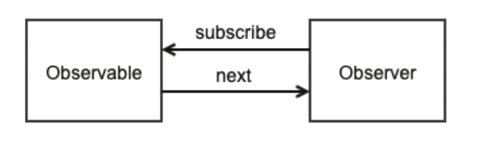 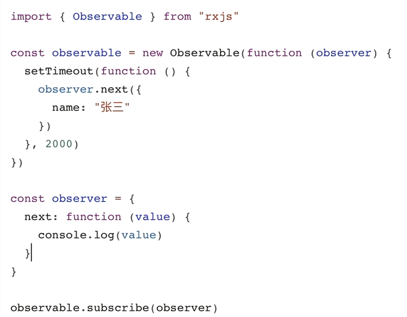


## 可观察对象

### Observable

**可观察对象是惰性的，只有被订阅后才会执行**

可观察对象**可以有 n 多订阅者**，**每次被订阅时都会得到执行**

```typescript
const observable = new Observable(() => {
  console.log("执行");
})
observable.subscribe();  // 执行
observable.subscribe();  // 执行
observable.subscribe();  // 执行
```

三种状态状态：`next`，`error`，`complete`

 

当调用了 `complete` 或 `error` 方法以后，就不能再次调用 `next`方法

```typescript
const observable = new Observable((observer) => {
  let index = 0;
  let timer = setInterval(() => {
    //  在Observable对象内部可以多次调用 next方法向外发送数据
    observer.next(index++);
    if(index === 3) {
      // 当所有数据发送完成以后，可以调用complete方法终止数据发送
      // observer.complete();
      // 当内部逻辑发送错误时，可以调用 error 方法将失败信息发送给订阅者，Observable 终止
      observer.error("error");
      clearInterval(timer);
    }
  }, 1000);
});

const observer = {
  next: (value) => {
    console.log(value)
  },
  complete: () => {
    console.log("complete")
  },
  error: (error) => {
    console.log(error)
  }
}

observable.subscribe(observer);
```


### Subject

用于**创建空的可观察对象**。在**订阅后不会立即执行**，`next` 方法可以在可观察对象外部调用

可当做**广播**去使用。**创建一个空的可观察对象，让很多的订阅者去订阅，当订阅的时候并不会立刻执行。当有数据要发出的时候，统一调用一次 `next` 方法，所有的订阅者可以同时接受到数据**

```typescript
import { Subject } from 'rxjs';

const demoSubject = new Subject();

demoSubject.subscribe(next: (value) => console.log(value));
demoSubject.subscribe(next: (value) => console.log(value));

setTimeout(() => {
    demoSubject.next("hahaha");
}, 3000)
```


### BehaviorSubject

拥有 `Subject` 全部功能，但是在**创建 `Observable` 对象时可以传入默认值**，**观察者订阅后可以直接拿到默认值**

```typescript
import { BehaviorSubject } from 'rxjs';

const demoBehavior = new BehaviorSubject("默认值");
demoBehavior.subscribe(next: (value) => console.log(value))
demoBehavior.next("Hello");
```


### ReplaySubject

功能类似 `Subject`，但有新订阅者时两者处理方式不同，**`Subject` 不会广播历史结果，而 `ReplaySubject` 会广播所有历史结果**

```typescript
import { ReplaySubject } from 'rxjs';

const rSubject = new ReplaySubject();

rSubject.subscribe(value => {
    console.log(value);
})

rSubject.next("Hello 1");	// Hello 1
rSubject.next("Hello 2");	// Hello 2

setTimeout(() => {
    rSubject.subscribe(value => {
    	console.log(value);
        // 输入
        // Hello 1
        // Hello 2
	})
}, 3000)
```


## 操作符

**数据流**：**从可观察对象内部输出的数据就是数据流**，可观察对象内部可以向外部源源不断的输出数据

**操作符**：用于**操作数据流**，可以将对象数据流进行转换，过滤等操作

### 创建操作符

负责创建一个 `Observable` 对象

#### from

**从数组等可迭代对象(如字符串)或 `Promise` 事件等创建一个 `Observable`**

```javascript
import { from } from 'rxjs'

from<T>(input: any, scheduler?: SchedulerLike): Observable<T>
/*
  input：输入值
  scheduler：调度器
*/
```

 

- ##### 数组转换为 `Observable`

  ```javascript
  const array = [10, 20, 30];
  const result = from(array);
  result.subscribe(x => console.log(x));
  
  // 10
  // 20
  // 30
  ```

- ##### `Promise` 转换为 `Observable`（也可以使用 `fromPromise` 操作符）

  ```javascript
  const result = from(
    new Promise((resolve, reject) => {
      setTimeout(() => {
        resolve('Hello RxJS!');
      },3000)
    }));
  result.subscribe(x => console.log(x));
  
  // Hello RxJS!
  ```

- ##### 无限迭代转换为 `Observable`

  ```javascript
  function* generateDoubles(seed) {
     let i = seed;
     while (true) {
       yield i;
       i = 2 * i; // double it
     }
  }
  
  const iterator = generateDoubles(3);
  const result = from(iterator).pipe(take(5));
  result.subscribe(x => console.log(x));
  
  // 3
  // 6
  // 12
  // 24
  // 48
  ```

- ##### 使用异步调度程序

  ```javascript
  console.log('start');
  const array = [10, 20, 30];
  const result = from(array, asyncScheduler);
  result.subscribe(x => console.log(x));
  console.log('end');
  
  // start
  // end
  // 10
  // 20
  // 30
  ```

  

#### fromEvent

将**事件**( DOM 事件 或 Node 的 `EventEmitter` 事件)**转换成 `Observable` 对象**

被订阅的时候事件处理函数会被添加，当取消订阅的时候会将事件处理函数移除

```javascript
import { fromEvent } from 'rxjs'

fromEvent<T>(target: FromEventTarget<T>, eventName: string, options?: EventListenerOptions | ((...args: any[]) => T), resultSelector?: (...args: any[]) => T): Observable<T>
/*
  target: DOM事件，EventEmitter事件等事件目标
  eventName: 要监听的事件名称
  options: 传递给addEventListener的参数
  resultSelector: 处理操作结果的回调函数 (不推荐使用，该方法建议移到pipe的map中)
*/
```

 

- ##### 鼠标点击事件转换为 `observable`

  ```javascript
  const source = fromEvent(document, 'click');
  const example = source.pipe(map(event => `Event time: ${event.timeStamp}`));
  const subscribe = example.subscribe(val => console.log(val));
  
  // Event time: 7276.390000000001
  ```


#### fromEventPattern

从一个基于 `addHandler` / `removeHandler` 方法的类事件创建 `Observable`

可以将注册监听 `addHandler` 及移除监听 `removeHandler` 两种方法依序传入 `fromEventPattern` 来建立 `Observable` 的事件实例

`addHandler` 方法在被订阅的时候调用，`removeHandler` 方法在取消订阅的时候被调用

```javascript
import { fromEventPattern } from 'rxjs'

fromEventPattern<T>(addHandler: (handler: NodeEventHandler) => any, removeHandler?: (handler: NodeEventHandler, signal?: any) => void, resultSelector?: (...args: any[]) => T): Observable<T | T[]>
/*
  addHandler: 注册监听函数
  removeHandler: 移除监听函数
  resultSelector: 处理操作结果的回调函数
*/
```

 

- ##### DOM 点击事件转换为 `observable`

  ```javascript
  function addClickHandler(handler) {
    document.addEventListener('click', handler);
  }
  function removeClickHandler(handler) {
    document.removeEventListener('click', handler);
  }
  const clicks = fromEventPattern(
    addClickHandler,
    removeClickHandler
  );
  clicks.subscribe(x => console.log(x));
  ```

- ##### 自定义类事件转换为 `observable`

  ```javascript
  const listeners = [];
  class Foo {
    registerListener(listener) {
      listeners.push(listener);
    }
    removeListener(listener) {
  	listeners.splice(listeners.indexOf(listener), 1)
    }
    emit(value) {
      listeners.forEach(listener => listener(value));
    }
  }
  const foo = new Foo();
  fromEventPattern(
      listener => foo.registerListener(listener)),
      listener => foo.removeListener(listener)
  ).subscribe();
  foo.emit(1);
  
  // 1
  ```

- ##### 结合可以通过回调进行通讯的 API

  ```javascript
  // WebWorker API
  const myWorker = new Worker('worker.js');
  
  fromEventPattern(
    handler => { myWorker.onmessage = handler },
    handler => { myWorker.onmessage = undefined }
  ).subscribe();
  
  // workerMessage
  ```

  

#### interval

创建一个 `Observable`，定期发出**自增的数字**

```javascript
import { interval } from 'rxjs'

interval(period: number = 0, scheduler: SchedulerLike = async): Observable<number>
/*
  period: 时间间隔ms，或者调度器的内部时钟决定的时间单位
  scheduler: 调度器
*/
```

 

- ##### 周期性处理数据

  ```javascript
  // 每 10 秒获取一次数据
  interval(10000).pipe(
    flatMap(i => fetch("https://server/stockTicker")
  ).subscribe(updateChart)
  ```


#### timer

创建一个 `Observable`，**在初始延迟时间后，开始定期发出自增的数字，或初始延迟时间后行为终止**

就像是 `interval`, 但是可以指定什么时候开始发送

```javascript
import { timer } from 'rxjs'

timer(dueTime: number | Date = 0, intervalOrScheduler?: number | SchedulerLike, scheduler: SchedulerLike = asyncScheduler): Observable<number>
/*
  dueTime: 初始延迟时间
  intervalOrScheduler: 时间间隔ms
  scheduler: 调度器
*/
```

 

- ##### 3 秒后开始一个新的 `observable`

  ```javascript
  const source = of(1, 2, 3);
  const result = timer(3000).pipe(
    concatMapTo(source)
  ).subscribe(console.log);
  ```

- ##### 1 分钟后终止流

  ```javascript
  const currentDate = new Date();
  const startOfNextMinute = new Date(
    currentDate.getFullYear(),
    currentDate.getMonth(),
    currentDate.getDate(),
    currentDate.getHours(),
    currentDate.getMinutes() + 1,
  )
  const source = interval(1000);
  const result = source.pipe(
    takeUntil(timer(startOfNextMinute))
  );
  result.subscribe(console.log);
  ```

- ##### 每隔 1 秒发出自增的数字，3 秒后开始发送

  ```javascript
  const numbers = timer(3000, 1000);
  numbers.subscribe(x => console.log(x));
  ```


#### of

创建一个 `Observable`，会**依次发出提供的参数，然后完成**

```javascript
import { of } from 'rxjs'

of<T>(...args: (SchedulerLike | T)[]): Observable<T>
/*
  args: next发出的值
*/
```

 

- ##### 同步传递值

```javascript
of("a", "b", [], {}, true, 20)
.subscribe(
  next => console.log(next),
  err => console.log(err),
  () => console.log('complete')
);

// a
// b
// []
// {}
// true
// 20
// complete
```


#### range

创建一个 `Observable`，**发出指定范围内的连续整数序列**

默认情况下，**不使用调度器仅仅同步的发送通知**

```javascript
import { range } from 'rxjs'

range(start: number, count?: number, scheduler?: SchedulerLike): Observable<number>
/*
  start: 序列中的第一个整数值
  count: 要生成序列的长度
  scheduler: 调度器
*/
```

 

- ##### 发出从 1 到 10 的数

  ```javascript
  const numbers = range(1, 10);
  numbers.subscribe(x => console.log(x));
  
  // 输出: 1,2,3,4,5,6,7,8,9,10
  ```


#### throwError

创建一个 `Observable`，不向观察者发出任何项目，**立马发出错误通知**

可以被用来**和其他 `Observables` 组合, 比如在 `mergeMap`，`concatMap` 中使用**

```javascript
import { throwError } from 'rxjs';

throwError(errorOrErrorFactory: any, scheduler?: SchedulerLike): Observable<never>
/*
  errorOrErrorFactory: 错误通知
  scheduler: 调度器
*/
```

 

- ##### 和其他 `Observables` 组合，抛出错误

  ```javascript
  // mergeMap:把二维的 observable 转成一维，并且能够同时处理所有的 observable
  interval(1000).pipe(
    mergeMap(x => x === 2
      ? throwError('Twos are bad')
      : of('a', 'b', 'c')
    ),
  ).subscribe(x => console.log(x), e => console.error(e));
  
  // a
  // b
  // c
  // a
  // b
  // c
  // Twos are bad
  ```

  ```javascript
  const result = concat(of(7), throwError(new Error('oops!')));
  result.subscribe(x => console.log(x), e => console.error(e));
  
  // 7
  // Error: oops!
  ```

  ```javascript
  const delays$ = of(1000, 2000, Infinity, 3000);
  delays$.pipe(
     concatMap(ms => {
       if (ms < 10000) {
         return timer(ms);
       } else {
         return throwError(() => new Error(`Invalid time ${ms}`));
         // 等价于：
         // throw new Error(`Invalid time ${ms}`);
       }
     })
  ).subscribe({
     next: console.log,
     error: console.error
  });
  
  // 0
  // 0
  // Error: Invalid time Infinity
  ```


#### 其他操作符

`ajax`

`bindCallback`

`bindNodeCallback`

`defer`

`generate`

`iif`


### 组合建立操作符

可将多个 `Observable` 对象组合成一个 `Observable` 对象

#### combineLatest

**组合多个 `Observables` 来创建一个 `Observable`**，**返回根据每个输入 `Observable` 的最新值计算得出的数组**

1. **顺序订阅**每个输入 `Observable`
2. **等待**每个输入都**至少发出一个值后**才会发出初始值
3. 每个输入所发出的值**只保留最新的**
4. 某个输入**不产生新数据**(包含完成情况)，就**反复使用最后一次产生的数据**
5. **任一输入发生错误**，会立马返回错误状态，所有的其他输入**都会被解除订阅**
6. 某个输入没有发出值就**完成**了，返回的 `Observable` 会立马完成

```javascript
import { combineLatest } from 'rxjs'

combineLatest<O extends ObservableInput<any>, R>(...args: any[]): Observable<R> | Observable<ObservedValueOf<O>[]>
/*
  args: 接受一个Observables数组
*/
    
combineLatest(sources: readonly any[], resultSelector: (...values: A) => R): Observable<R>
/*
  args: 接受一个Observables数组
  resultSelector: 处理操作结果的回调函数
*/
```

 

- ##### 计算多个因子的结果

  ```javascript
  const weight = of(70, 72, 76, 79, 75);
  const height = of(1.76, 1.77, 1.78);
  const bmi = combineLatest([weight, height]).pipe(
    map(([w, h]) => {
      console.log('weight:' + w + ",height:" + h);
      return w / (h * h);
    }),
  );
  // 使用回调函数的写法
  // const bmi = combineLatest([weight, height], (w, h) => w / (h * h));
  bmi.subscribe(x => console.log('BMI is ' + x));
  
  // weight值立即发出，没有延迟
  // weight:75,height:1.76
  // BMI is 24.212293388429753
  // weight:75,height:1.77
  // BMI is 23.93948099205209
  // weight:75,height:1.78
  // BMI is 23.671253629592222
  ```

- ##### 结合多个 `Observables`

  ```javascript
  const firstTimer = timer(0, 1000); // 从现在开始，每隔1秒发出0, 1, 2...
  const secondTimer = timer(500, 1000); // 0.5秒后，每隔1秒发出0, 1, 2...
  const combinedTimers = combineLatest([firstTimer, secondTimer]);
  combinedTimers.subscribe(value => console.log(value));
  
  // [0, 0] after 0.5s
  // [1, 0] after 1s
  // [1, 1] after 1.5s
  // [2, 1] after 2s
  ```

  ```javascript
  const observables = {
    a: of(1).pipe(delay(1000), startWith(0)),
    b: of(5).pipe(delay(5000), startWith(0)),
    c: of(10).pipe(delay(10000), startWith(0))
  };
  const combined = combineLatest(observables);
  combined.subscribe(value => console.log(value));
  
  // {a: 0, b: 0, c: 0} immediately
  // {a: 1, b: 0, c: 0} after 1s
  // {a: 1, b: 5, c: 0} after 5s
  // {a: 1, b: 5, c: 10} after 10s
  ```


#### forkJoin

将所有 `Observable` 对象最后**发出来的最后一个数据合并**成 `Observable`

`forkJoin` 操作符的作用类似于 `promise.all()`，等待每个输入 `Observable` **都完成后，合并返回**它们最后发出的值的列表

1. **所有输入都完成后，只会触发一次，然后立即完结**，合并发出每个流**最后一个值**

2. 返回数组的长度和输入的个数一致，**顺序和输入的顺序一致**，对象的结构和输入的结构一致

3. 任何输入**发生错误**，会立马返回错误状态，所有的其他输入**都会被解除订阅**
4. 任一输入没有发出值就**完成**了，返回的 `Observable` 会立马完成

**一般用在只发送一个元素的流的情况**，像 **HTTP 请求**或者**页面加载**，发起多个请求，让请求并行运行，在所有流收到响应时执行某些任务

不过**需要保证多个接口都能够成功返回结果**，使用 `forkJoin` 不好监听具体错误

```javascript
import { forkJoin } from 'rxjs';

forkJoin(...args: any[]): Observable<any>
/*
  args: 接受一个Observables数组
*/

forkJoin(sources: readonly any[], resultSelector: (...values: A) => R): Observable<R>
/*
  args: 接受一个Observables数组
  resultSelector: 处理操作结果的回调函数
*/
```

 

- ##### 同时进行 `http` 请求

  ```javascript
  user = [];
  account = [];
  getSomeInfo(users, account){
      // 执行某些任务
  }
  
  forkJoin(
    fetch("https://server/user/1"),
    fetch("https://server/account/1")
  ).subscribe((data) => {
      // 返回结果将被按顺序放在一个数组中
      if (data[0].code === ErrorCodeEnum.SUCCESS) {
          this.user = data[0].data;
      }
      if (data[1].code === ErrorCodeEnum.SUCCESS) {
          this.account = data[1].data.result;
      }
      this.getSomeInfo(this.user, this.account);
  });
  ```

- ##### 结合多个 `Observables`

  ```javascript
  // 字典对象
  const observable = forkJoin({
    foo: of(1, 2, 3, 4),
    bar: Promise.resolve(8),
    baz: timer(4000),
  });
  observable.subscribe({
   next: value => console.log(value),
   complete: () => console.log('This is how it ends!'),
  });
  
  // { foo: 4, bar: 8, baz: 0 } after 4 seconds
  // "This is how it ends!" immediately after
  ```

  ```javascript
  // 数组
  const observable = forkJoin([
    of(1, 2, 3, 4),
    Promise.resolve(8),
    timer(4000),
  ]);
  observable.subscribe({
   next: value => console.log(value),
   complete: () => console.log('This is how it ends!'),
  });
  
  // [4, 8, 0] after 4 seconds
  // "This is how it ends!" immediately after
  ```

- ##### 异常情况处理

  ```javascript
  // 在外部处理异常
  forkJoin(
    //emit 'Hello' immediately
    of('Hello'),
    //emit 'World' after 1 second
    of('World').pipe(delay(1000)),
    // throw error
    throwError('This will error')
  ).pipe(catchError(error => of(error)))
  .subscribe(val => console.log(val));
  
  // This will error
  ```

  ```javascript
  // 在输入内部处理异常，成功获得返回值
  forkJoin(
    //emit 'Hello' immediately
    of('Hello'),
    //emit 'World' after 1 second
    of('World').pipe(delay(1000)),
    // throw error
    throwError('This will error').pipe(catchError(error => of(error)))
  ).subscribe(val => console.log(val));
  
  // ["Hello", "World", "This will error"]
  ```


#### zip

将多个 `Observable` 组合以创建一个 `Observable`，


## 辅助方法

### range

`range(start, length)` , 调用方法后返回 `observable` 对象，被订阅后会发出指定范围的数据

方法内部并不是一次发出 `length` 个数值，而是发送了 `length` 次，每次发送一个数值。也就是内部调用了 `length` 次 `next` 方法

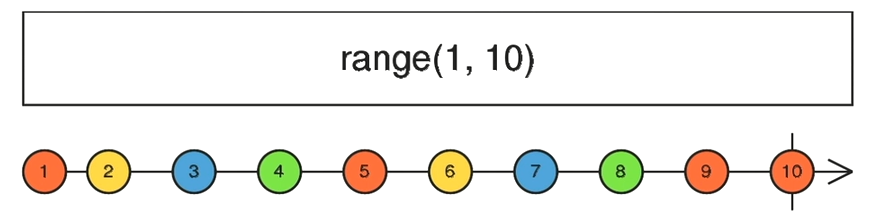 

```typescript
import { range } from 'rxjs'
range(0, 5).subscribe(n => console.log(n))

// 1
// 2
// 3
// 4
```


### forkjoin

是 Rx 版本的 `Promise.all()` ，即表示等到所有的 `Observable` 都完成后，才一次性返回值

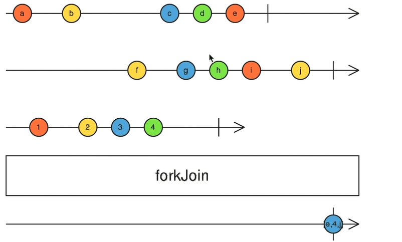 

```typescript
import axios from 'axios';
import { from, forkJoin } from 'rxjs';

axios.interceotor.response.use(response => response.data)

forkJoin({
    goods: from(axios.get("http://localhost:3005/goods")),
    category: from(axios.get("http://localhost:3005/category"))
}).subscribe(console.log)


```


### fromEvent

将事件转换为 `Observable`

```typescript
import { fromEvent } from 'rxjs'

const btn = document.getElementById("btn")
fromEvent(btn, 'clilck').subscribe(e => e.console.log(e))
// 获取事件元
fromEvent(btn, 'clilck')
    .pipe(map(event => event.traget))
    .subscribe(e => e.console.log(e))
```


### interval、timer

`interval`：每隔一段事件发出一个数值，数值递增

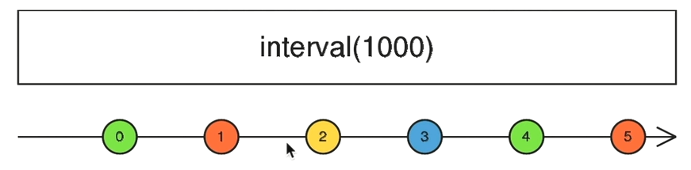 

```typescript
import { interval } from 'rxjs'

interval(1000).subscribe(n => console.log(n))
```

`timer`：间隔时间过去以后发出数值，行为终止，或间隔时间发出数值后，继续按第二个参数的时间间隔继续发出

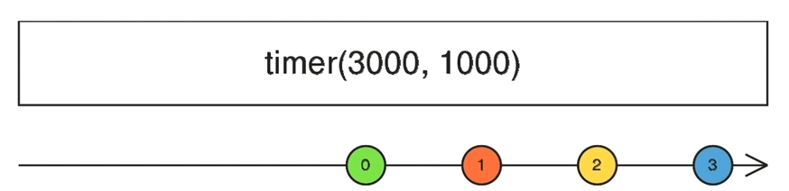 

```typescript
import { timer } from 'rxjs'

timer(2000).subscribe(n => console.log(n))
timer(0, 1000).subscribe(n => console.log(n))
```


### of

将参数列表作为数据流返回

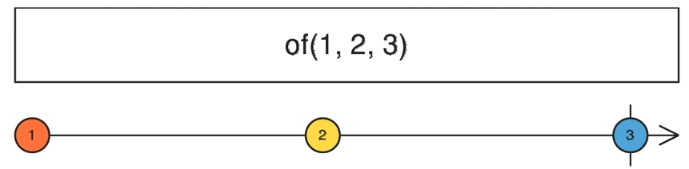 

```typescript
of("a", "b", [], {}, true, 20).subscribe(v => console.log(v))
```

 

### distinctUntilChanged

**检测数据源当前发出的数据流是否和上次发出的相同**，如相同，跳过，**不相同，发出**

 


```typescript
import { of } from 'rxjs'
import { distinctUntilChanged } from 'rxjs/operators'

of(1, 1, 2, 2, 1, 1, 2, 3, 3, 4)
.pipe(distinctUntilChanged())
.subscribe(x => console.log(x)) // 1, 2, 1, 2, 3, 4
```


## 操作符

数据流：从可观察对象内部输出的数据就是数据流，可观察对象内部可以向外部源源不断的输出数据

操作符：用于操作数据流，可以将对象数据流进行转换，过滤等操作


### map、mapTo

`map`： 对数据流进行转换，**基于原有值进行转换**

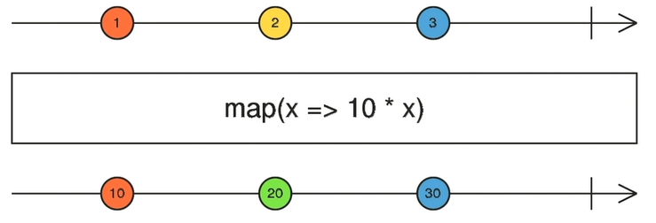 

```typescript
import { interval } from 'rxjs';
import { map } from 'rxjs/operators';

interval(1000)
.pipe(map(n => n * 2))
.subscribe(n => console.log(n));
```

`mapTo`：对数据流进行转换，不关心原有值，**可以直接传入要转换后的值**


### pluck

**获取数据流对象中的属性值**

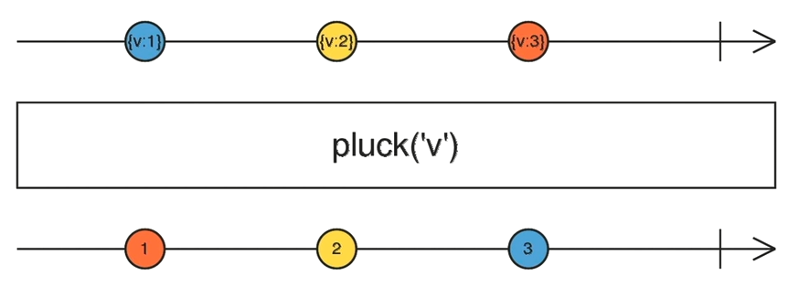 

```typescript
import { interval } from 'rxjs'
import { pluck, mapTo } from 'rxjs/operators'

interval(1000)
    .pipe(
    	mapTo({ name: '张三', a: { b: 'c' } }),
    	pluck("a", "b")
).subscribe(n => n.console.log(n))
```


### switchMap

**切换可观察对象**。

当外层的可观察对象重新发出数据流时，`switchMap` 会抛弃上一次发出的数据流，而重新进行数据流的发送

点击一个按钮发送一个请求，点击事件是一个` observable`, 发送请求也是一个 `observable`，默认情况下**用户订阅的是点击事件**，当**点击事件被触发时，需要把 `observable` 进行切换到发送请求的 `observable`**。订阅者就可以拿到发送请求的结果

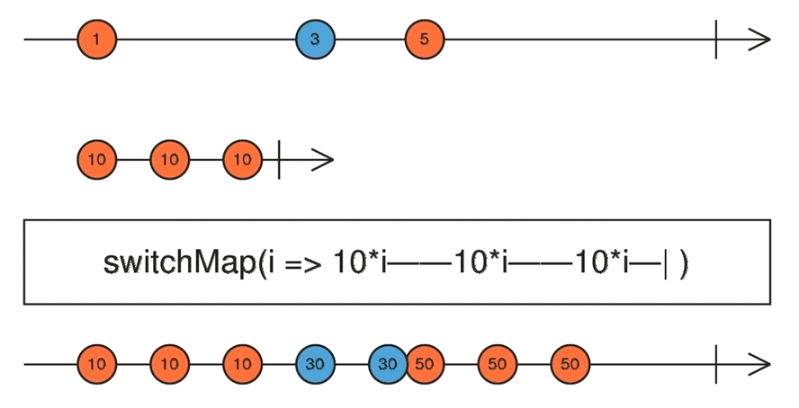 

```typescript
import { fromEvent } from 'rxjs'
import {}

const button = document.getElementById('btn')

fromEvent(button, 'click')
.pipe(switchMap(event => interval(1000)))
.subscribe(console.log)
```


### take、takeWhile、takeUtil

`take`：**获取数据流中前几个**

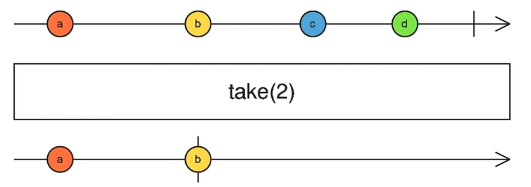 

```typescript
import { range } from 'rxjs'
import { take } from 'rxjs/operators'

range(1, 10).pipe(take(5)).subscribe(console.log)
```

`takeWhile`：**根据条件**从数据源前面开始获取

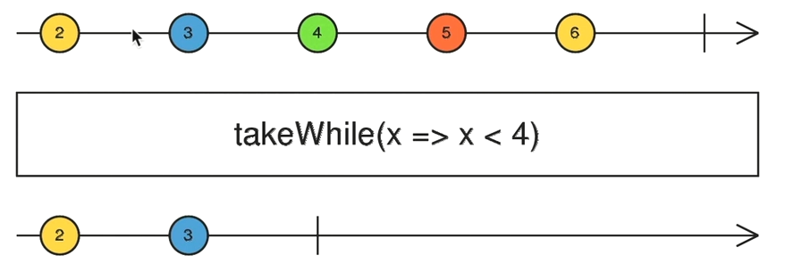 

```typescript
import { range } from 'rxjs'
import { takeWhile } from 'rxjs/operators'

range(1, 10)
.pipe(takeWhile(n => n < 8))
.subscribe(console.log)
```

`takeUntil`：接受可观察对象，**当可观察对象发出值时，终止主数据源**

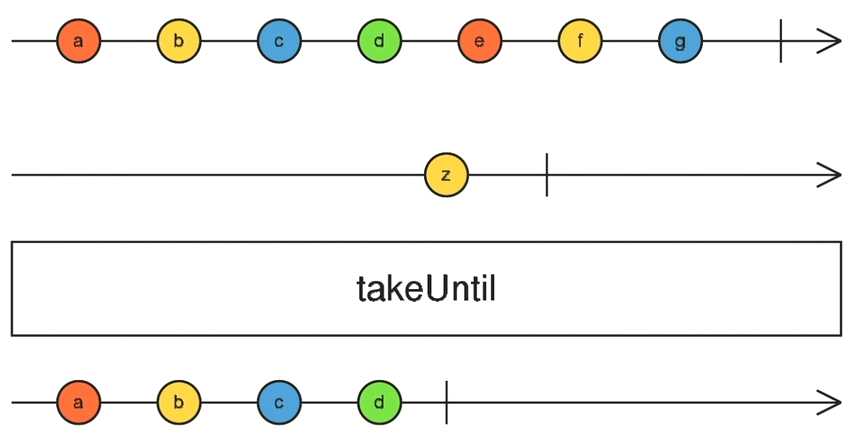 

```typescript
import { fromEvent } from 'rxjs'
import { takeUntil } from 'rxjs/operators'

const button = document.getElementById("btn")

fromEvent(document, "mousemove").pipe(
	takeUntil(fromEvent(button, "click"))
).subscribe(console.log)
```


### throttleTime

**节流**，可观察对象高频次向外部发出数据流，通过 `throttleTime` 限制在**规定时间内每次只向订阅者传递一次数据流**

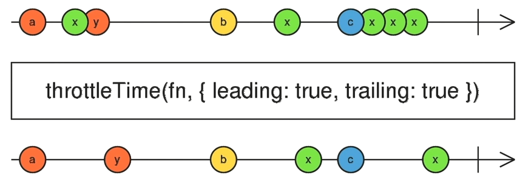 

```typescript
import { fromEvent } from 'rxjs'
import { throttleTime } from 'rxjs/operators'

fromEvent(document, 'click')
.pipe(throttleTime(2000))
.subscribe(x => console.log(x))
```


### debounceTime

**防抖**，触发高频事件，**只响应最后一次**

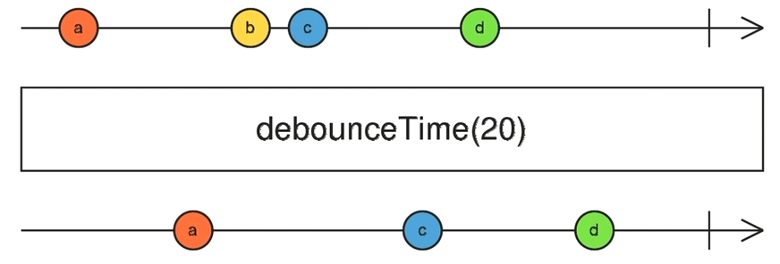 

```typescript
import { fromEvent } from 'rxjs'
import { debounceTime } from 'rxjs/operators'

fromEvent(document, 'click')
.pipe(debounceTime(1000))
.subscribe(x => console.log(x))
```


## 应用

- ##### 元素拖拽

  ```html
  <style>
      #box {
          width: 200px;
          height: 200px;
          background: skyblue;
          position: absolute;
          left: 0;
          top: 0;
      }
  </style>
  <div id="box"></div>
  ```

  ```typescript
  // 原生JavaScript
  box.onmousedown = function(evnet) {
      let distinctX = event.clientX - event.target.offsetLeft
      let distinctY = event.clientY - event.traget.offsetTop
      document.onmousemove = function(event) {
          let positionX = event.clientX - distinctX
          let positionY = event.clientY - distinctY
          box.style.left = positionX + 'px'
          box.style.top = positionY + 'px'
      }
      box.onmouseup = function(){
          document.onmousemove = null;
      }
  }
  
  // Rxjs
  import { fromEvent } from 'rxjs'
  import { map, switchMap, takeUntil } from 'rxjs/operators'
  
  const box = document.getElementById("box")
  fromEvent(box, 'onmousedown').pipe(
      // map 转化数据流为距离对象形式
  	map(event => ({
          distinctX: event.clientX - event.target.offsetLeft,
          distinctY: event.clientY - event.target.offsetTop
      })),
      // 切换数据流 切换到mousemove事件 参数为上一步处理出来的距离对象数据流
      switchMap(({ distinctX, distinctY }) => {
          fromEvent(document, "mousemove").pipe(
              // 转换为坐标对象数据流
          	map(event => ({
                  positionX: event.clientX - distinceX,
                  positionY: event.clientY - distinceY
              })),
              // 停止移动 停止数据流
              takeUntil(fromEvent(box, "mouseup"))
          )
      })
  ).subscribe(({ positionX, positionY }) => {
      // 接收最后的数据流
      box.style.left = positionX + "px"
      box.style.top = positionY + "px";
  })
  ```

- ##### 搜索

  ```html
  <input id="search" type="text" placeholder="请输入搜索内容..." />
  ```

  ```typescript
  import { fromEvent, from } from 'rxjs'
  import { map, switchMap, debounceTime, distinctUntilChanged, pluck, catchError } from 'rxjs/operators'
  import axios from 'axios'
  
  fromEvent(search, "keyup")
  .pipe(
      // 防抖
  	debounceTime(1000),
      // 用户输入的值
      map(event => event.target.value),
      // 检测当前是否和上一次输入的内容相同 在map之后调用，因为之前得到的是事件对象
      distinctUntilChanged(),
      // 服务器搜索，切换数据流
      switchMap(keyword => 
          from(
          	axios.get(`https://jsonplaceholder.typicode.com/posts?q=${keyword}`)
      	).pipe(
          	// 取过来的数据只要data属性内容
      		pluck("data"),
          	catchError(error => throwError(`发生了错误：${error.message}`))
      	)
      )
  ).subscribe({
  	next: value => {
          console.log(value)
      },
      error: error => {
          console.log(error)
      }
  })
  ```

- ##### 串联请求

  ```html
  <button id="btn">获取用户信息</button>
  ```

  ```typescript
  import axios from 'axios'
  import { from, fromEvent } from 'rxjs'
  import { pluck, contactMap } from 'rxjs/operators'
  
  const button = document.getElementById('btn')
  
  fromEvent(button, 'click')
  .pipe(
      // 先去获取token
      // concatMap 合并可观察对象
  	concatMap(event => 
                from(axios.get("http://localhost:3005/token"))
                .pipe(pluck("data", "token"))),
      // 再根据token去获取用户信息
      concatMap(token => from(axios.get("http://localhost:3005/userInfo"))
               .pipe(pluck("data")))
  )
  .subscribe()
  ```


# 待整理

## 编译

```bash
ng build --prod

## vendor-chunk 依赖的第三方类库单独打包
ng build --prod --aot --build-optimizer --vendor-chunk
```

可以将编译命令写到package.json文件的script中,使用npm run build 脚本调用这个命令


## Ivy 渲染引擎

```bash
ng new xxx -enable-ivy
```

#### 已有项目改造

angular.json

```json
"angularCompilerOptions": {
    "enableIvy": true,
    "allowEmptyCodegenFiles": true
}
```

编译

```bash
npm run ivy
```

