# 基础架构

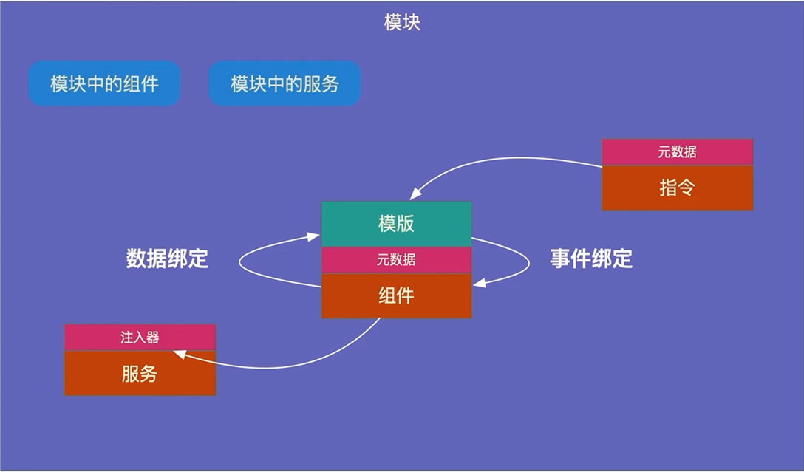 


# 环境搭建

## 脚手架

### 安装脚手架

- 安装 Node

- 安装脚手架

  CLI 的版本号和 Angular 是一致的

  ```bash
  # 安装脚手架
  npm install -g @angular/cli
  ```

  ```bash
  # 卸载脚手架
  npm uninstall -g angular-cli
  # 清除缓存 
  npm cache clean
  ```

  ```bash
  # 更新脚手架
  ng update @angular/cli @angular/core
  ```

- 安装依赖

  ```bash
  # 软件依赖
  npm i --save 包名
  # 开发依赖
  npm i --save-dev 包名
  ```


### 新建项目

```bash
# 新建项目
ng new newDemo

# 新建项目（添加参数：不要下载安装；样式表要css；不要路由支持）
ng new newDemo --skip-intall css --routing false

# 新建项目（不需要单元测试文件，保留html模板文件，不保留css文件）
ng new newDemo --minimal --inlineTemplate false
```

```bash
# 查询新建项目指令支持的参数
ng new --help

########## 主要参数 #############
# 精简的Angular项目 (没有单元测试关联文件)
--minimal=true
# 不需要初始化Git仓库
--skipGit=true
# 不需要安装项目依赖
--skip-install
# 样式选择
--style=css
# 不创建路由文件
--routing=false
# 内联模板
--inlineTemplate
# 行内样式
--inlineStyle
# 修改名称的前缀‘App‘
--prefix
# 不创建单元测试
-S
```


### 生成文件

根据 `schematic` 的设置生成或修改对应的文件

```bash
ng generate <schematic> [options]
ng g <schematic> [options]
```

#### 添加组件

```bash
ng generate component 组件名（驼峰形式）
ng g component 组件名（驼峰形式）
ng g component 文件夹名/组件名（驼峰形式）
ng g c 组件名（驼峰形式）
```

```bash
# 使用的检测策略
--changeDetection=Default|OnPush
# 入口组件
--entryComponent
# 模块中导出组件
--export
# 不生成子文件夹
--flat
# 内联模板，简写 -t
--inline-template
# 内联样式，简写 -s
--inlineStyle
# 选择器前缀，简写 -p
--prefix=prefix
# 不要测试文件
--spec=false
# 不导入模块中
--skip-import
# 声明模块，简写 -m
--module=module
# 视图封装策略
--viewEncapsulation=Emulated|Native|None|ShadowDom
# 样式文件
--style=css|scss|sass|less|styl
# 项目名称
--project=project
# 用于此组件的HTML选择器
--selector=selector	
```


#### 添加模块

```bash
ng generate module 模块名（驼峰形式）
ng g module 模块名（驼峰形式）
ng g module 文件夹名/模块名（驼峰形式）
ng g m 模块名（驼峰形式）
```

```bash
# 不生成子文件夹
--flat
# 不要测试文件
--spec=false
# 创建路由模块
--routing
# 路由模块的作用范围
--routing-scope=Child|Root
# 声明模块，简写 -m
--module=module
# 项目名称
--project=project
```


#### 添加指令

```bash
ng generate directive 指令名（驼峰形式）
ng g directive 指令名（驼峰形式）
ng g directive 文件夹名/指令名（驼峰形式）
ng g d 指令名（驼峰形式）
```

```bash
# 模块中导出组件
--export
# 不生成子文件夹
--flat
# 选择器前缀，简写 -p
--prefix=prefix
# 不要测试文件
--spec=false
# 不导入模块中
--skip-import
# 声明模块，简写 -m
--module=module
# 项目名称
--project=project
# 用于此组件的HTML选择器
--selector=selector	
```


#### 添加管道

```bash
ng generate pipe 管道名（驼峰形式）
ng g pipe 管道名（驼峰形式）
ng g pipe 文件夹名/管道名（驼峰形式）
ng g p 管道名（驼峰形式）
```

```bash
# 模块中导出组件
--export
# 不生成子文件夹
--flat
# 不要测试文件
--spec=false
# 不导入模块中
--skip-import
# 声明模块，简写 -m
--module=module
# 项目名称
--project=project
```


#### 添加服务

```bash
ng generate service 服务名（驼峰形式）
ng g service 服务名（驼峰形式）
ng g service 文件夹名/服务名（驼峰形式）
ng g s 服务名（驼峰形式）
```

```bash
# 不生成子文件夹
--flat
# 不要测试文件
--spec=false
# 声明模块，简写 -m
--module=module
```


#### 添加守卫

```bash
ng generate guard 守卫名（驼峰形式）
ng g guard 守卫名（驼峰形式）
ng g guard 文件夹名/守卫名（驼峰形式）
ng g g 守卫名（驼峰形式）
```

```bash
# 不生成子文件夹
--flat
# 不要测试文件
--spec=false
# 声明模块，简写 -m
--module=module
```


### 启动服务

```bash
# 启动开发服务器，项目编译
ng serve
# 编译后在浏览器打开
ng serve --open
```

```bash
# 开启热更新
--hmr
# 禁用热更新警告
hmrWarning=false
# 更改运行端口，默认4200
--port
# 指定构建目标，指定angular.json中的configuration，别名：-c
--configuration=configuration
# host对应的监听地址，默认localhost，允许本地ip访问 --host 0.0.0.0
--host=host
# 启用构建输出的优化
--optimization
# 构建配置设置为生产目标
--prod
# 代理配置文件
--proxyConfig=proxyConfig
# HTTPS服务
--ssl
# 有改变的时候重新构建
--watch
```


### 编译项目

```bash
# 将应用程序编译到给定输出路径中名为 dist 的输出目录中
# 开发环境编译
ng build
# 生产环境编译
ng build --prod
```

```bash
# 新输出目录的完整路径，默认dist
--outputPath=outputPath
# 相对于outputPath的样式资源的路径
--resourcesOutputPath=resourcesOutputPath
# 输出sourcemaps，默认true
--sourceMap
# 仅包含供应商库的单独捆绑包，默认true
--vendorChunk
# 指定构建目标，指定angular.json中的configuration，别名：-c
--configuration=configuration
# 构建配置设置为生产目标
--prod
# 使用AOT编译
--aot
# 使用'aot'选项时，启用'@angular-devkit/build-optimizer'优化
--buildOptimizer
# 启用构建输出的优化
--optimization
# 定义输出文件名缓存清除散列模式
--outputHashing=none|all|media|bundles
# polyfills文件的完整路径
--polyfills=polyfills
# 生成'stats.json'文件，可以使用'webpack-bundle-analyzer'等工具进行分析
--stats-json
# 本地化文件
--i18nFile=i18nFile
# 本地化文件的格式
--i18nFormat=i18nFormat
# 语言环境
--i18nLocale=i18nLocale
```


### 其他

- 代码规范扫描

  ```bash
  # 代码规范扫描
  ng lint
  # 自动修改部分代码规范问题
  ng lint -fix
  ```

- cli 命令查询

  ```bash
  # 查询ng命令的子命令
  ng help
  ```

- 手机真机调试

  1. 手机和电脑在同一网络
  2. `ng serve --host 0.0.0.0`
  3. 手机打开 http://电脑IP:4200


## 项目文件

### 项目目录

```bash
newDemo
    │
    ├─e2e																# end to end 自动化集成测试目录
    │  │  
    │  └─src
    │  │       app.e2e-spec.ts
    │  │       app.po.ts
    │  │
    │  │  protractor.conf.js
    │  │  tsconfig.json
    │          
    └─src 															# 源代码目录
    │    ├─app													# 工程源码目录
    │    │      app.component.css				# 根组件
    │    │      app.component.html      # 根组件
    │    │      app.component.spec.ts
    │    │      app.component.ts        # 根组件
    │    │      app.module.ts						# 根模块
    │    │      
    │    ├─assets												# 静态资源目录
    │    │      .gitkeep
    │    │      
    │    └─environments									# 环境配置
    │    │        environment.prod.ts		# 生产环境
    │    │        environment.ts				# 开发环境
    │    │  favicon.ico									# 收藏图标
    │    │  index.html									# 单页应用的宿主HTML
    │    │  main.ts											# 入口ts文件
    │    │  polyfills.ts								# 填充库 用于不同浏览器的兼容脚本加载
    │    │  styles.css									# 整个项目的全局CSS
    │    │  test.ts											# 测试入口
    │    
    │  .browserslistrc									# 浏览器兼容性
    │  .editorconfig										# 在不同的代码编辑器中统一编码风格
    │  .gitignore												# git中忽略文件列表
    │  angular.json											# angular配置文件
    │  karma.conf.js										# 自动化测试karma配置文件
    │  package-lock.json								# package.json中依赖的软件包所依赖的软件包
    │  package.json											# npm描述文件，包含脚本，项目依赖
    │  README.md												# 说明文档
    │  tsconfig.app.json								# typescritp配置 针对项目开发
    │  tsconfig.base.json								# typescritp配置 全局性
    │  tsconfig.json										# 项目引用的typescritp配置文件列表
    │  tsconfig.spec.json								# typescritp配置 针对测试
    │  tslint.json											# 静态代码扫描 定义编码规则
```


### main.ts

入口文件

```typescript
// enableProdMode 方法调用后会开启生产模式
import { enableProdMode } from '@angular/core';
// Angular 应用程序的启动在不同平台上是不一样的
// 在浏览器中启动时需要用到 platformBrowserDynamic 方法，返回平台实例对象
import { platformBrowserDynamic } from '@angular/platform-browser-dynamic';
// 根模块 用于启动应用程序
import { AppModule } from './app/app.module';
// 引入环境变量对象
import { environment } from './environments/environment';

// 如果是生产环境，开启生产模式
if (environment.production) {
  enableProdMode();
}
// 启动应用程序
platformBrowserDynamic()
  .bootstrapModule(AppModule)
  .catch(err => console.error(err));
```


### environment.ts

环境设置

```typescript
// 字典型的变量
export const environment = {
  production: false,
  // 可以定义api接口地址等
  baseUrl: 'https://yourcompany.apis',
};

// environment.prod.ts 是开发用环境设置
// ng build --prod 编译使用开发环境设置
```


### app.module.ts

Angular 根模块，告诉 Angular 如何组装应用

```typescript
// CommonModule 提供各种服务和指令，如ngif，ngfor
// BrowserModule 已经导入并导出了 CommonModule 模块
import { BrowserModule } from '@angular/platform-browser';  // 浏览器解析的模块
import { NgModule } from '@angular/core';					// Angular模块装饰器
import { AppComponent } from './app.component';				// 根组件
import { NewsComponent } from './components/news/news.component';
import { HomeComponent } from './components/home/home.component';
import { HeaderComponent } from './components/header/header.component';
/* @NgModule装饰器, @NgModule接受一个元数据对象，告诉 Angular 如何编译和启动应用 */
@NgModule({
  declarations: [    /* 配置当前项目运行的的组件 */
    AppComponent, NewsComponent, HomeComponent, HeaderComponent
  ],
  imports: [  /* 配置当前模块运行依赖的其他模块 */
    BrowserModule
  ],
  providers: [],  /* 配置项目所需要的服务，该服务只能在当前模块的组件中使用 */
  bootstrap: [AppComponent]  // 指定应用的主视图通过引导根AppModule来启动应用，一般写的是根组件
})
// 根模块不需要导出任何东西，因为其它组件不需要导入根模块
export class AppModule { }
```


### app.component.ts

```typescript
import { Component } from '@angular/core';		//引入核心模块里面的Component
@Component({
  /* 指定这个组件的使用方式
  	 app-home   ->  <app-home></app-home>
  	 [app-home] ->  <div app-home></div>
  	 .app-home  ->  <div class="app-home"></div>
  */
  // 根组件app-root在index.html中被调用
  selector: 'app-root',
  /* 关联组件的模板文件
  	 templateUrl: '组件模板文件路径'
  	 template: `组件模板字符串`
  */
  templateUrl: './app.component.html',
  /* 关联组件的样式文件
  	 styleUrls: ['组件样式文件路径']
  	 styles: [`组件样式`]
  */
  styleUrls: ['./app.component.scss']
})
export class AppComponent {
  title = 'angulardemo01';   //定义属性
  constructor(){ }  //构造函数
}
```


### angular.json

整个 angular 项目的定义文件，包含应用程序的所有配置

```json
{
  "$schema": "./node_modules/@angular/cli/lib/config/schema.json",
  "version": 1,
  // 使用 ng generate application/library 创建项目放入的目录
  "newProjectRoot": "projects",
  // projects中可以放多个项目，但主项目只能有一个
  // 使用 ng new projectName、ng generate application <name>、ng generate library <name> 创建项目会列在其中
  "projects": {
    // 项目名
    "mainApp": {
      "projectType": "application",
      // 定制 ng generate 子命令的默认选项
      "schematics": {},
      "root": "",								// 项目的根文件夹, "" 代表工作区的顶层
      "sourceRoot": "src",      // 源码目录
      "prefix": "app",					// 组件或指令的前缀
      "architect": {						// 构建器的配置选项
        // ng 命令的详细配置
        "build": {},
        "serve": {},
        "extract-i18n": {},
        "test": {},
        "lint": {},
        "e2e": {}
      }
    },
    // 使用 ng generate application/library 创建出来的多个项目
    "secondApp": {}
  },
  "defaultProject": "mainApp"		// 默认的项目
}
```

- `projects` 中可以放多个项目，但主项目只能有一个

  ```sh
  # 创建子项目
  ng generate application <name> [options]
  # 创建子类库
  ng generate library <name> [options]
  ```

- `schematics` 用于定制 `ng generate` 子命令的默认选项

  ```json
  "schematics": {
    // ng generate component 配置
    "@schematics/angular:component": {
      "style": "scss",
      // 默认OnPush
      "changeDetection": "OnPush"
    },
    // ng generate directive 配置
    "@schematics/angular:directive": {
      // 不创建 spec 文件
      "skipTests": true
    }
  }
  ```

- `architect` 每个构建目标的共有属性

  ```json
  "build": {
    // 构建工具的 npm 包
    // ng serve 为 @angular-devkit/build-angular:dev-server
    "builder": "@angular-devkit/build-angular:browser",
    // 针对当前builder所需要的配置项
    "options": {
      // 打包后输出文件路径，默认为dist
      "outputPath": "dist/projectName",	
      // 指定首页文件
      "index": "src/index.html",
      // 指定应用程序的入口
      "main": "src/main.ts",
      // 指定polyfill文件
      "polyfills": "src/polyfills.ts",
      // 指定tsconfig文件
      "tsConfig": "tsconfig.app.json",
      // 是否aot编译
      "aot": true,
      // 静态资源路径，构建时复制到`outDir`指定的目录
      "assets": [
        "src/favicon.ico",
        "src/assets",
        // 也可以包含一个对像
        {
          // 根目录为input
          "glob": "**/*", // 通配符以input路径作为基准
          // 相对于工作区根目录的路径
          // 指定"src/assets/"，意味着将"src/assets/"复制到dist/assets目录下
          // 也可以指定类似 "./node_modules/some-package/images" 路径
          "input": "src/assets/", 
          // 相对于outDir的路径，（默认为 dist/project-name）
          "output": "/assets/",
          // 要排除的 glob 列表
          "ignore": ["**/*.svg"],
        }
      ],
      // 添加到项目全局上下文中的样式文件
      // 引入的css路径，如果想引入bootstrap可以在这里引入css
      "styles": [
        "src/styles.scss",
        // 也可以是对象
        {
          "input": "src/external-module/styles.scss",
          "inject": false,  // 是否注入到index.html
          "bundleName": "external-module" // 命名捆绑包
        }
      ],
      // 引入的js路径，jquery可以这里引入, 和styles一样也可以包含一个对象
      "scripts": [],
      // 编译时引入全局通用样式文件
      // 可以从项目中的任何位置导入variables.scss，而无需相对路径：
      // 之前@import '../style-paths/variables'; 现在@import 'variables';
      "stylePreprocessorOptions": {
        "includePaths": [
          "src/style-paths/variables.scss"
        ]
      },
      // 默认bundle大小限制，超出限制报告警告或错误
      "budgets": [
        {
          "type": "initial",
          "maximumWarning": "4mb",
          "maximumError": "5mb"
        }
      ],
      // 扩展webpack脚本，现在可以在 webpack.config.js 中开发webpack
      "customWebpackConfig": {
        "path": "./webpack.config.js"
      },
      // Angular CLI 检测到浏览器端应用依赖了 CommonJS 模块，就会发出警告
      // 要禁用这些警告，可以把这些 CommonJS 模块的名字添加到allowedCommonJsDependencies
      "allowedCommonJsDependencies": ["lodash"]
    },
    // 针对不同目标环境的备用配置
    // production 和 development 构建配置
    // 默认情况下，ng build 命令使用 production 配置
    "configurations": {
      // ng build --prod --configuration=production
      "production": {
        // 文件编译替换
        "fileReplacements": [
          {
            "replace": "src/environments/environment.ts",
            "with": "src/environments/environment.prod.ts"
          }
        ],
        // 对构建输出进行各种优化
        // 脚本和样式的最小化、摇树优化、消除死代码、内联关键 CSS、字体内联
        "optimization": true,
        // 打包结果会带一串hash，破坏浏览器缓存
        "outputHashing": "all",
        // 映射文件
        "sourceMap": false,
        // 从全局样式中将css提取到css文件而不是js文件中，已弃用
        "extractCss": true,
        // 将文件名用于延迟加载的块
        "namedChunks": false,
        // aot预编译模式
        "aot": true,
        // 将所有许可证提取到一个单独的文件中
        "extractLicenses": true,
        // 使用仅包含供应商库的单独捆绑包。
        "vendorChunk": false,
        // 包含@angular-devkit/build-optimizer 包以在使用 AOT 选项时进行优化
        "buildOptimizer": true,
        "budgets": [
          {
            "type": "initial",
            "maximumWarning": "2mb",
            "maximumError": "5mb"
          }
        ]
      },
      // ng build --prod  --configuration=dev
      "dev": {
        "fileReplacements": [
          {
            "replace": "src/environments/environment.ts",
            "with": "src/environments/environment.dev.ts"
          }
        ]
      }
    }
  }
  ```


### package.json

```json
{
  "name": "pinduoduo",
  "version": "0.0.0",
  // scripts指定脚本任务
  // 使用定义的scripts脚本命令的好处是，可以使用自己定义的(这个文件里的)版本的CLI去运行
  "scripts": {
    "ng": "ng",           // npm run ng
    "start": "ng serve",
    "build": "ng build",
    "test": "ng test",
    "lint": "ng lint",
    "e2e": "ng e2e"
  },
  "private": true,
  // 依赖 项目里直接使用的依赖
  // 安装直接依赖 npm i --save @angular/form
  "dependencies": {
    "@angular/router": "~10.0.0",
    "rxjs": "~6.5.5",
  },
  // 开发阶段依赖 不跟随发布
  // 安装开发依赖 npm -i --save-dev typescript
  "devDependencies": {
    "typescript": "~3.9.5"
  }

  // 版本号："~3.9.5" 大版本号.小版本号.补丁版本号 major.minor.patch
  // ~代表着 前两个版本号一致，后面的补丁版本不锁定
  // ^代表着 锁定大版本号
  // 没有符号代表着 严格锁定某一个版本
}
```

- 启动脚本

  ```json
  "scripts": {
    "start": "ng serve -o --host 0.0.0.0 --proxy-config proxy.conf.json",
    "build:prod": "ng build --prod --build-optimizer --configuration=production",
    "build:dev": "ng build --prod  --configuration=dev",
    "analyze": "ng build --prod --build-optimizer --stats-json",
    "test-coverage": "ng test --code-coverage --watch=false"
  }
  ```


## 环境文件

> - 环境文件提供了一种根据部署环境配置应用程序设置的方式
> - Angular 默认提供了两个环境文件：**environment.ts 用于开发环境**，**environment.prod.ts 用于生产环境**
> - 文件包含了可以在整个应用程序中访问的变量
> - 使用多个环境文件可以提高可维护性，并避免在每次环境切换时手动更改代码库
> - 将敏感信息（如 API 密钥或数据库凭据）与代码库分开的优势
> - 简化了在部署过程中更新配置值的流程

- 环境文件

  ```typescript
  // src/environments/environment.staging.ts
  export const environment = {
    production: false,
    apiUrl: process.env.API_URL,
    debugMode: process.env.DEBUG_MODE === 'true',
  };
  ```

- 修改 angular.json 文件以包含新的环境配置，并利用不同的环境文件构建应用

  ```json
  "configurations": {
    "staging": {
      "fileReplacements": [
        {
          "replace": "src/environments/environment.ts",
          "with": "src/environments/environment.staging.ts"
        }
      ],
      "optimization": true,
      "outputHashing": "all",
      // 其他配置...
    },
    "production": {
      "fileReplacements": [
        {
          "replace": "src/environments/environment.ts",
          "with": "src/environments/environment.prod.ts"
        }
      ],
      "optimization": true,
      "outputHashing": "all",
      // 其他配置...
    }
  }
  
  ```

  ```bash
  ng build --configuration=staging
  ng build --configuration=production
  ng build --prod
  ```

- 利用 node 脚本自动化环境配置

  自动化环境配置可以确保一致性，并减少在不同环境之间切换时出错的可能性

  利用 Node.js 脚本读取 .env 文件并动态生成必要的 Angular 环境文件

  - 定义 `.env` 文件存储环境变量

    > - `.env` 文件是一个简单的文本文件，用于存储应用程序的环境变量
    > - 遵循 KEY=VALUE 的语法，允许设置配置值，而无需在代码库中硬编码

    ```env
    API_URL=https://api.example.com
    DEBUG_MODE=true
    releaseVersion=1
    ```

  - 创建 generate-env.js，来读取 .env 文件并生成 Angular 环境文件

    ```javascript
    const fs = require('fs');
    
    // 读取并按行拆分为一个数组
    const envConfig = fs.readFileSync('.env', 'utf8').split('\n');
    const configObject = {};
    envConfig.forEach((line) => {
      // 将每一行按照等号 (=) 拆分为 key 和 value
      const [key, value] = line.split('=');
      configObject[key.trim()] = value.trim();
    });
    const environmentFileContent = `export const environment = {
      production: ${configObject.PRODUCTION === 'true'},
      apiUrl: '${configObject.API_URL}',
      debugMode: ${configObject.DEBUG_MODE === 'true'},
    };
    `;
    fs.writeFileSync('src/environments/environment.custom.ts', environmentFileContent);
    ```

  - 与 npm 脚本集成，运行脚本将会生成自定义环境文件

    ```json
    "scripts": {
      "generate-env": "node generate-env.js",
      "build:staging": "npm run generate-env && ng build --configuration=staging"
    }
    ```


## 其他

### 缩短导入

```typescript
import { Offer } from '../../../offers/models/offer.model';
import { Receipt } from '../../../booking/models/receipt.model';
import { StoreUtil } from '../../../shared/utils/store.util';

import { Offer } from '@offer/models';
import { Receipt } from '@booking/models';
import { StoreUtil } from '@shared/utils';
```

```json
// tsconfig
// TypeScript 配置中的路径映射，允许使用简化的模块导入路径
"compilerOptions": {
  "paths": {
    "@offers/*": ["src/app/offers/*"],
    "@booking/*": ["src/app/booking/*"],
    "@basket/*": ["src/app/basket/*"],
    "@shared/*": ["src/app/shared/*"]
  }
}
```


# 组件 Component

## 创建组件

```bash
ng g component 文件夹名/组件名
```


## 组件结构

组件控制屏幕的一部分（视图）

```typescript
import { Component, OnInit } from '@angular/core';

// @Component注解标记一个Class为Angular Component
// 模板，样式和组件一起决定视图的外观和行为
@Component({
  selector: 'app-header',
  templateUrl: './header.component.html',		// templateUrl或者template将模板和组件联系起来
  /* 内联模板写法
  template: `<div></div>`, */
  styleUrls: ['./header.component.scss']		// styleUrl或者styles将样式和组件联系起来
})
// 组件的逻辑定义在class中，class通过属性和方法与视图进行交互
export class HeaderComponent implements OnInit {
  constructor() { }
  ngOnInit() {}
  // public 默认 可以在这个类里面使用、也可以在类外面使用
  // protected 只有在当前类和它的子类里面可以访问
  // private 只有在当前类才可以访问这个属性
  public title = "我是一个组件";
}
```

组件扩展 html 标签

```html
<!-- 当html标签使用 -->
<app-header></app-header>
```

组件本身的样式

```css
:host {
}
```

```css
/* 限定组件本身只能在哪个父级内才生效 */
:host-context(父级标签名) {
}
```


## 组件注解

`@Component` 注解

### selector

类型: `string`

css **选择器名**，用于在模板中标记出该组件，并触发其实例化

只允许指令使用那些不跨元素边界的 CSS 选择器

- `element-name`：根据元素名选取
- `.class`：根据类名选取
- `[attribute]`：根据属性名选取
- `[attribute=value]`：根据属性名和属性值选取
- `:not(sub_selector)`：只有当元素不匹配子选择器 `sub_selector` 的时候才选取
- `selector1, selector2`：无论 selector1 还是 selector2 匹配时都选取

```typescript
// <greet></greet>
@Component({    
  selector: 'greet', 
  template: 'Hello {{name}}!'
})

// <div class='greet'></div>
@Component({    
  selector: '.greet', 
  template: 'Hello {{name}}!'
})

// <div greet></div>
@Component({    
  selector: ['greet'],
  template: 'Hello {{name}}!'
})

// <input type="text">
@Component({    
  selector: 'input[type=text]'
})
```

继承自 `@Directive` 装饰器


### template

类型: `string`

组件的**内联模板**。如果提供了它，就不要再用 `templateUrl` 提供模板

使用 **``** 实现多行字符串


### templateUrl

类型: `string`

组件**模板文件的 URL**。如果提供了它，就不要再用 `template` 来提供内联模板


### styles

类型: `string[]`

组件用到的一个或多个**内联的 CSS 样式**


### styleUrls

类型: `string[]`

一个或多个 URL，指向组件 **CSS 样式表的文件**

- `styleUrls` 和 `styles` 容许同时指定

- 优先级：模板内联样式 > `styleUrls` > `styles`


### providers

类型: `Provider[]`

使用一个**令牌配置组件的注入器**

**注入的服务是按组件实例化**的，并且**可以在组件及其子树中的所有子组件中访问**

服务**不是单例**的，**每次都会获得**所提供服务的**新实例**，**服务实例将与组件一起销毁**

**子组件会逐级向上寻找 `provider`**，直到找到为止，否则就会抛出错误

- `@NgModule` 中的 `providers`

  服务将是**全局单例**的，即使重复声明，也不会重新创建实例，**最终都会注册到根级注入器**

  **懒加载模块中提供的服务实例会在子注入器（懒加载模块）上创建**

- `@Injectable` 的 `provideIn`

  服务的 `@Injectable` 装饰器的 `provideIn` 属性可以视为**以反向方式指定依赖关系**，**服务本身宣布它应该提供给哪些模块使用**

  申明的模块可以是 `root` 或其他任何可用模块。**`root` 实际上是 `AppModule` 的别名**

  如果服务仅被注入到懒加载模块，它将捆绑在懒加载包中

  如果服务又被注入到正常模块中，它将捆绑在主包中

继承自 `@Directive` 装饰器


### viewProviders

类型: `Provider[]`

注入的服务**只能在视图的各个子节点中可用**（投射的子组件不可用）

`viewProviders` 与 `providers` 的区别

```typescript
// 服务
@Injectable()
export class MyService {
  // 打印在哪里调用了该服务
  testIfGetService(where) {
    console.log('Got My Service in ' + where);
  }
}

// 投射用子组件
@Component({
  selector: 'vp-child',
  template: `<div>This is child!!!</div>`
})
export class VPChild {
  constructor(private service: MyService) {
    this.service.testIfGetService('child');
  }
}

// 模板调用子组件
@Component({
  selector: 'vp-viewchild',
  template: `<div>This is viewChild!!!</div>`
})
export class ViewVPChild {
  constructor(private service: MyService){
    this.service.testIfGetService('viewChild');
  }
}
```

`providers` 形式注册服务

```typescript
// 父组件
@Component({
  selector: 'vp-parent',
  template: `
  <div>This is parent!!!</div>
	<ng-content></ng-content>
	<vp-viewchild></vp-viewchild>
`,
  // providers形式注册服务
  providers: [MyService]
})
export class VPParent {
  constructor(private service: MyService) {
    this.service.testIfGetService('parent');
  }
}
```

**在父组件用使用 `providers` 注册的服务，对 `viewChildren` 和 `contentChildren` 都可见**

```html
<vp-parent>
  <vp-child></vp-child>
</vp-parent>

<!--
运行结果
Got My Service in parent
Got My Service in child
Got My Service in viewchild
-->
```

`viewProviders` 形式注册服务

```typescript
// 父组件
@Component({
  selector: 'vp-parent',
  template: `
  <div>This is parent!!!</div>
	<ng-content></ng-content>
	<vp-viewchild></vp-viewchild>
`,
  // viewProviders形式注册服务
  viewProviders: [MyService]
})
export class VPParent{
  constructor(private service: MyService){
    this.service.testIfGetService('parent');
  }
}
```

**在父组件用 `viewProviders` 注册的服务，对 `contentChildren` 是不可见的**

```html
<vp-parent>
  <vp-child></vp-child>
</vp-parent>
<!--
运行结果报错
Error: StaticInjectError[Myservice]
-->

<vp-parent>
  <vp-child></vp-child>
</vp-parent>
<!--
运行结果
Got My Service in parent
Got My Service in viewchild
-->
```


### exportAs

类型: `string`

定义一个名字，用于在模板中把该组件赋值给一个变量，即**给组件定义一个别名**

- 当一个**组件绑定于一个元素时**，那么声明的**模板引用变量**将**会被解析为当前元素上所绑定的组件**


- 当有多个名字时，使用逗号分隔


- 如果在 html 标签上不使用别名获取不到正确的结果的时候使用


```typescript
// 在table标签上上使用#id，取到的是ElementRef对象
// 正确取得 #table=matTable
@Component({
  selector: 'mat-table, table[mat-table]',
  exportAs: 'matTable',
})
```

继承自 `@Directive` 装饰器


### changeDetection

类型: `ChangeDetectionStrategy`

**变更检测策略**

当组件实例化之后，Angular 会创建一个变更检测器，它负责传播组件各个绑定值的变化

- `ChangeDetectionStrategy.OnPush` 组件的**变化监测只检查输入属性**（即 `@Input` 修饰的变量）的值是否发生变化，当这个值为引用类型（`Object`，`Array` 等）时，则**只对比该值的引用**

- `ChangeDetectionStrategy.Default` 组件的**每次变化监测都会检查其内部的全部数据**（引用对象也会**深度遍历**），以此获得先后的数据变化

- `OnPush` 策略提高了变化监测的性能，若**组件的更新只依赖输入属性的值，推荐使用 `OnPush`**


### encapsulation

类型: `ViewEncapsulation`

模板和 CSS 样式使用的**样式封装策略**

```typescript
@Component({
  template: `<h1>test</h1>`,
  styles: [`h1 { color: #f50; }`],
  encapsulation: ViewEncapsulation.XXX
})
```

- `ViewEncapsulation.ShadowDom`  Shadow DOM 模式

  使用原生的 `Shadow DOM` 封装样式，并为组件的宿主元素创建一个 `ShadowRoot`

  它只在原生支持 `Shadow DOM` 的平台上才能工作

  ```html
  #shadow-root (open)
  <style>h1 { color: #f50; }</style>
  <h1>test</h1>
  ```

- `ViewEncapsulation.Emulated` 仿真模式

  模拟类似 `Shadow DOM` 的行为，经过 Angular 提供的样式包装机制来模拟组件的独立性，使得**组件的样式不受外部影响**

  样式有范围封装，父组件不影响子组件的样式

  **默认设置**

  ```html
  <style>h1[_ngcontent-c0] { color: #f50; }</style>
  <h1 _ngcontent-c0>test</h1>
  ```

  如果非要让**父组件的样式覆盖子组件的样式**，使用 `::ng-deep`

- `ViewEncapsulation.None`

  无 `Shadow DOM`，而且也无样式包装

  使用**全局 CSS，不做任何封装**，样式直接应用到整个 `document`

  **向下影响自己的子组件，向上影响自己的父组件**

  ```html
  <style>h1 { color: #f50; }</style>
  <h1>test</h1>
  ```

- `ViewEncapsulation.Native`

  在 angular10.0 中已经去除

如果没有设置，该值就会从 `CompilerOptions` 中获取。默认的编译器选项是 `ViewEncapsulation.Emulated`

```typescript
// main.ts
// 为所有组件统一设定一种模式
platformBrowserDynamic().bootstrapModule(AppModule, {
  defaultEncapsulation: ViewEncapsulation.None
})
```

如果设置为 `ViewEncapsulation.Emulated`，并且该组件没有指定 `styles` 或 `styleUrls`，就会自动切换到`ViewEncapsulation.None`


### animations

类型: `any[]`

一个或多个动画 `trigger()` 调用，包含一些 `state()` 和 `transition()` 定义

- 参考[动画]目录


### preserveWhitespaces

类型: `boolean`

为 `true` 则保留，为 `false` 则从编译后的模板中**移除可能多余的空白字符**，默认为 `false`

空白字符就是指那些能在 JavaScript 正则表达式中匹配 `\s` 的字符


### interpolation

类型: `[string, string]`

改写默认的插值表达式起止分界符 `[ '{{', '}}']`

```typescript
interpolation: ['~~','~~']
```

```html
<div>~~title~~</div>
```


### entryComponents

已弃用

类型:` Array<Type | any[]>`

定义动态组件，和当前组件一起编译

这里列出的每个组件，Angular 都会创建一个 `ComponentFactory` 并保存进 `ComponentFactoryResolver` 中


### inputs

类型: `string[]`

组件的输入属性。**等价于 `@Input` 属性装饰器**

```typescript
@Component({
  selector: 'my-component',
  inputs: ['name']
})
class MyComponent {
  name: string;
  // 和@Input() name: string; 的作用一样
}
```

`directiveProperty: bindingProperty`（指令实例属性：标签元素属性）形式

如果没有设置 `bindingProperty`，就假设它和 `directiveProperty` 一样

```typescript
@Component({
  selector: 'bank-account',
  inputs: ['bankName', 'id: account-id'],
  template: `
    Bank Name: {{bankName}}
    Account Id: {{id}}
  `
})
class BankAccount {
  bankName: string;
  id: string;
}
```

继承自 `@Directive` 装饰器


### outputs

类型: `string[]`

组件的输出属性。**等价于 `@Output` 属性装饰器**

```typescript
@Component({
  selector: 'my-component',
  outputs: ['newEvent']
})
export class MyComponent {
  newEvent: EventEmitter<string>;
  // 和 @Output() newEvent: EventEmitter<string>; 的作用一样
}
```

继承自 `@Directive` 装饰器


### queries

类型: `{[key: string]: any}`

将配置查询注入到当前组件中

- ##### 内容查询

  内容查询会在 `ngAfterContentInit` 回调之前设置好。**等价于 `@ContentChild`**

  ```html
  <my-list>
    <li *ngFor="let item of items;">{{item}}</li>
  </my-list>
  ```

  ```typescript
  @Directive({
    selector: 'li'
  })
  export class ListItem {}
  
  @Component({
    selector: 'my-list',
    template: `
  	<ul>
  	    <ng-content></ng-content>
  	</ul>
  `,
    queries: {
      items: new ContentChild(ListItem)
    }
  })
  export class MyListComponent {
    items: QueryList<ListItem>;
    // 等价于:
    // @ContentChild(ListItem) items: QueryList<ListItem>;
  }
  ```

- ##### 视图查询

  视图查询会在调用 `ngAfterViewInit` 回调之前设置好。**等价于 `@ViewChild`**

  ```typescript
  @Component({
    selector: 'demo-component',
    template: `
  	<input #theInput type='text' />
  	<div>Demo Component</div>
  `,
    queries: {
      theInput: new ViewChild('theInput')
    }
  })
  export class DemoComponent {
    theInput: ElementRef;
    // 等价于:
    // @ViewChild('theInput') theInput: ElementRef;
  }
  ```

继承自 `@Directive` 装饰器


### host

类型: `{[key:string]:string}`

使用一组键值对，把类的**属性映射到宿主元素**的绑定（`Property`、`Attribute` 和事件）

比如给 `<app-about></app-about>` 添加动态样式

- 当 `key` 是宿主元素的 `Property` 时，这个 **`Property` 值就会传播到指定的 `DOM` 属性**


- 当 `key` 是 `DOM` 中的静态 `Attribute` 时，这个 **`Attribute` 值就会传播到宿主元素上指定的 `Property` 去**


- 对于事件处理， `key` 就是该指令**想要监听的 `DOM` 事件**

  全局事件要把监听目标 `window`、`document`、`body` 添加到事件名的前面； 

- `value` 就是当该事件发生时要执行的语句。如果该语句返回 `false`，那么就会调用这个 `DOM` 事件的 `preventDefault` 函数。 这个语句中可以引用局部变量 `$event` 来获取事件数据

```typescript
@Component({
  selector: 'demo-component',
  host: {
    // 属性的值默认为变量，变量直接在组件里定义即可
    // '[style.color]': "'red'" 设置字符串
    '(click)': 'onClick($event.target)', 	// 事件
    'role': 'nav', 												// 属性
    '[class.pressed]': 'isPressed', 		 // 类
    'class': 'mat-table'									// 类
  }
})
export class DemoComponent {
  isPressed: boolean = true;
  onClick(elem: HTMLElement) {
    console.log(elem);
  }
}

// 等价于
@Component({
  selector: 'demo-component'
})
export class DemoComponent {
  @HostBinding('attr.role') role = 'nav';
  @HostBinding('class.pressed') isPressed: boolean = true;
  @HostListener('click', ['$event.target'])
  onClick(elem: HTMLElement) {
    console.log(elem);
  }
}
```

继承自 `@Directive` 装饰器


### jit

类型: `true`

如果存在，则该指令/组件将被 `AOT` 编译器忽略，只会被 `JIT` 编译

应用程序必须导入 `@angular/compiler` 

继承自 `@Directive` 装饰器


## 组件样式

### 封装模式

参考【组件注解】的【`encapsulation`】

- `ShadowDom` 原先浏览器 `Shadow DOM` 行为
- `Emulated` 仿真模式，通过Angular来模拟类似 `Shadow DOM` 的行为
- `None` 无任何封装行为

`Shadow DOM` 作用是让组件的样式只进不出，**组件内的样式不会影响到外部组件**


### 样式隔离

默认的情况下( `encapsulation: ViewEncapsulation.Emulated` )，习惯把组件的样式写在对应的 css 文件中

例如在 A 组件中写了 `h1 { color: red }`，这个样式只会在 A 组件中生效，而不会影响到其他的组件

```typescript
@Component({
  selector: 'app-root',
  templateUrl: './app.component.html',
  styles: [` .red-button {  background: red;} `]
})
export class AppComponent {}
```

```typescript
@Component({
  selector: 'app-blue-button',
  template: `<button class="blue-button">Button</button>`,
  styles: [` .blue-button { background: blue; } `]
})
export class BlueButtonComponent {}
```

```html
<!-- app.component.html -->
<button class="red-button">Button</button>
<app-blue-button></app-blue-button>
```

 

- **每个组件的宿主元素都会被分配一个唯一的属性**，具体取决于组件的处理顺序，在例子中就是 `_nghost_xxx`

- **每个组件模板中的每个元素还会被分配一个该组件特有的属性**，在例子中就是 `_ngcontent_xxx`

- 每次运行属性字符串都是随机的

  这些属性可以和 CSS 结合起来，比如蓝色按钮的样式会是这样

  ```css
  .blue-button[_ngcontent-yke-c11] { background: blue; }
  ```

  通过这种方式使 `blue-button` 类只能应用于有这个属性的元素上，而不会影响到其他组件中的元素


### :host

`:host` 伪类选择器，用来**作用于组件(宿主元素)本身**

- 要把宿主样式作为条件，就要像函数一样把其它选择器放在 `:host` 后面的括号中
- 通过 `:host` 选择器设置的**样式优先级高**

为组件本身 `app-blue-button` 添加边框，在组件的样式文件中使用 `:host`

```less
:host {
  display: block;
  border: 1px solid red;

  .light-btn: {
    font-weight: normal;
  }
}
```

编译后的样式

```css
[_nghost-yke-c11] {
  display: block;
  border: 1px solid red;    
}
[_nghost-yke-c11] .light-btn[_ngcontent-yke-c11] {
  font-weight: normal;
}
```


### :host-context

`:host-context()` 以函数的形式，在**当前组件宿主元素的祖先节点中查找 CSS 类**， 直到文档的根节点为止

- 基于某些来自组件视图外部的条件应用样式很有用


- 在文档的元素上可能有一个用于表示样式主题 (theme) 的 CSS 类，基于它来决定组件的样式


```typescript
// 根据祖先元素的 CSS 类是 blue-theme 还是 red-theme 来决定哪个 CSS 会生效
@Component({  
selector: 'app-btn-theme',
  template: `<button class="btn-theme">Button</button>`,
  styles: [`
:host-context(.blue-theme) .btn-theme {
	background: blue;
 }
:host-context(.red-theme) .btn-theme {
	background: red;
} 
`]
})
export class BtnThemeComponent { }
```


### ::ng-deep

告知 angular **不要在 `::ng-deep` 之后的元素类型上添加属性修饰**

- 例如 `::ng-deep p span` 经过编译后就是 `p span`，但是这样样式就具有了全局性
- 所以最好**结合 `:host ` 使用**，例如 `:host ::ng-deep p span`

- 主要用来**改变第三方组件的一些样式**

  例如在 `app-header` 组件中，使用 `<nz-breadcrumb>`。默认情况下 `nz-breadcrumb` 会对最后一项加粗。

  ```html
  <nz-breadcrumb>
    <nz-breadcrumb-item>Home</nz-breadcrumb-item>
    <nz-breadcrumb-item>Detail</nz-breadcrumb-item>
  </nz-breadcrumb>
  ```

  编译后的 html

  ```html
  <nz-breadcrumb _ngcontent-c1="" class="ant-breadcrumb">
    <nz-breadcrumb-item _ngcontent-c1="">
      <span class="ant-breadcrumb-link">
        Home
      </span>
      <span class="ant-breadcrumb-separator">/</span></nz-breadcrumb-item>
    <nz-breadcrumb-item _ngcontent-c1="">
      <span class="ant-breadcrumb-link">
        Detail
      </span>
      <span class="ant-breadcrumb-separator">/</span></nz-breadcrumb-item>
  </nz-breadcrumb>
  ```

  对于第三方组件 `nz-breadcrumb` 组件而言，`.ant-breadcrumb-link` 是其组件内部某个 HTML 元素的 `class` 而已，且它有自己的一套组件封装规则。如果想要去掉加粗的样式，直接在 `app-header` 组件的 `styles` 中修改，可能不一定会有想要的结果

  ```css
  :host .ant-breadcrumb-link {
    font-weight: normal;
  }
  /* 编译后 */
  [_nghost-c1] .ant-breadcrumb-link[_ngcontent-c1] {
    font-weight: normal;
  }
  ```

  生成的 CSS 中有 `[_ngcontent-c1]` 属性修饰，导致 `app-header` 组件样式无法改变第三方组件 `nz-breadcrumb` 组件内容的样式

  使用 `::ng-deep` 来**强制样式允许侵入子组件**

  ```css
  :host ::ng-deep .ant-breadcrumb-link {
    font-weight: normal;
  }
  /* 编译后 */
  [_nghost-c1] .ant-breadcrumb-link {
    font-weight: normal;
  }
  ```


## 组件生命周期

### 生命周期执行流程

 

1. `constructor` 构造函数，主要进行依赖注入

2. `ngOnChanges` 输入属性变化时调用

3. `ngOnInit` 组件初始化时调用

4. `ngDoCheck` 脏值检测时调用
5. `ngAfterContentInit` 内容投影完成时调用
6. `ngAfterContentChecked` 检查投影内容时调用
7. `ngAfterViewInit` 组件及子组件视图初始化完成时调用
8. `ngAfterViewChecked` 检查视图变化时调用
9. `ngOnDestroy` 组件销毁时调用


### ngOnChanges

```typescript
ngOnChanges(changes: SimpleChanges) {
  console.log(changes)
}
```

 

- **组件的输入属性 `@Input` 变化时调用，可以被触发调用多次**，**第一次是在组件初始化之前**

  **没有 `@Input` 变量，不会触发 `ngOnChanges` 事件**

- 第一次 `ngOnChanges` 的调用是在接收到所有 `@Input` 属性之后触发（没接收到的 `@Input` 属性为 `undefined`）

- 对于**基本数据类型**来说，只要**值发生变化就可以被检测**

- 对于**引用类型**来说，可以**检测引用地址的变化**，但是检测不到对象内属性值得变化，但是不影响组件模板更新数据

- 参数 `SimpleChanges`，字典型的对象

  - 每一个 `key` 值是**输入的参数属性的名字**，`value` 值是 `simpleChange` 对象

  - `SimpleChanges` 参数**只存储发生变化的数据**，没发生变化的数据不存储

  - `SimpleChanges` 的子属性类型为 `SimpleChange`，**包含当前值，前一个值，是否是第一次改变**

- 主要**用在父子组件传值中**，父组件给子组件传值的时候，以及父组件改变传值的数据时调用

- 要注意父级改变传递值的情况，会导致 `ngOnChange` 在生命周期的任何时刻都可能被再次调用

- 尽量使用 `ngOnChanges` 去处理 `@Input` 属性变化，而不是使用 `@Input` 属性的 `setter` 函数

  - 使用 `setter` 会在**一次变化周期中调用两个回调函数**：当属性设置时，`setter` 被调用，`ngOnChanges` 被调用

  - 如果  `setter` 函数中**并非仅涉及一个属性的时候，需要严格注意 `@Input` 属性的输入顺序**

    而 `ngOnChanges` 会保证 `@Input` 属性都获取到了以后再执行

    ```typescript
    @Input() set menu(value: any[]) {
      this._menu = value;
    }
    @Input() set cate(value: any) {
      this._cate = value;
      this._menu.filter((m) => m.cate === this._cate)
    }
    ```

    ```html
    <!-- 这两种参数输入顺序的执行结果是完全不同的 -->
    <child [menu]="menu" [cate]="cate"></child>
    <child [cate]="cate" [menu]="menu"></child>	<!-- 错误 -->
    ```


### ngOninit

- **首次接收到输入属性值后执行**，在第一轮 `ngOnChanges` 完成之后调用

- 组件初始化完成，**在这个函数中可以安全的使用组件的属性和方法**
- 只装载一次

- 主要用来**处理请求数据**


### ngDoCheck

- **脏值检测时被调用**

- `ngOnChanges` 和 `ngDoCheck` 被认为**不应该在同一个组件之中，同时被订阅**

- `ngOnChanges` 是监听自己组件本身的变化，`ngDoCheck` 是 Angular 做整个框架性检查

- **只要输入属性发生变化**，**无论是基本类型还是引用类型，还是引用类型的属性发生变化，都会执行**

- 可以被调用多次


### ngAfterContentInit

- 组件内容初始化

- `ng-content` **投影内容完成时调用**
- 第一次 `ngDoCheck` 之后调用，只调用一次


### ngAfterContentChecked

- 组件内容的脏值检测

- 可以被调用多次，在 `ngAfterContentInit` 和每次 `ngDoCheck` 之后调用


### ngAfterViewInit

- 组件的视图初始化完成

- 一个**组件和它的子组件都初始化完成**之后调用
- 第一次 `ngAfterContentChecked` 之后调用，只调用一次

- **`DOM` 操作都应该在这里处理**


### ngAfterViewChecked

- 组件的视图的脏值检测
- 每次做完组件视图和子视图的变更检测之后调用

- 可以被调用多次，在 `ngAfterViewInit` 和每次 `ngAfterContentChecked` 之后调用


### ngOnDestory 

- 组件、指令、管道或服务被销毁时调用

- 实例被销毁时，做一些清理工作

  清理定时函数

  取消可观察对象

  可以用来在组件销毁时进行数据保存工作


### 父子组件生命周期

1. 父组件的 `constuctor`
2. 子组件的 `constuctor`
3. 父组件的 `ngOnChanges`、`ngOnInit`、`ngDoCheck`、`ngAfterContentInit`、`ngAfterContentChecked`
4. 父组件值传递到子组件，触发子组件的 `OnChanges`
5. 子组件的 `ngOnInit`、`ngDoCheck`、`ngAfterContentInit`、`ngAfterContentChecked`、`ngAfterViewInit`、`ngAfterViewChecked`
6. 父组件的 `ngAfterViewInit`， `ngAfterViewChecked`

注意：

- 父组件将绑定值传入到子组件是在：父组件执行到 `ngAfterContentChecked` 时触发
- 父组件的 `AfterViewInit` 会等到所有的子组件的生命周期执行完成才执行


## 组件输入输出

 

### 父组件给子组件传值 @Input 

```html
<!-- 父组件调用子组件的时候传入数据 -->
<app-header [msg]="msg" [run]='run' [home]='this'></app-header>
```

```typescript
// 子组件引入Input
import { Component, OnInit, Input } from '@angular/core';
// 子组件中@Input 接收父组件传过来的数据
export class HeaderComponent implements OnInit {
  // 如果变量要和属性名不一样，可以在@Input()内写属性的名字
  // @Input('msg') myMsg: string;
  @Input() msg: string;
  // 可以接受父组件的方法作为参数
  @Input() run: any;
  // 甚至可以直接把父组件传过来
  @Input() home: HomeComponent;
  constructor() {}
  ngOnInit() {}
}

// 父组件
export class HomeComponent implements OnInit {
  public msg: string = '我是父组件的msg';
  run() {
    alert('我是父组件的run方法');
  }
}
```


### 子组件触发父组件的方法 @Output 

```typescript
// 子组件
// 子组件引入Output 和EventEmitter
import { Component, OnInit ,Input, Output, EventEmitter } from '@angular/core';

// EventEmitter 事件发射器
// 子组件中实例化EventEmitter
@Output() private outer = new EventEmitter<string>();

// 子组件通过事件驱动EventEmitter对象outer 实例广播数据
sendParent(){
	this.outer.emit('msg from child')
}
```

```html
<!-- 父组件调用子组件时 定义接收广播事件 -->
<!-- outer就是子组件的EventEmitter对象outer -->
<!-- $event是事件所携带的数据 -->
<app-header (outer)="runParent($event)"></app-header>
```

```typescript
// 父组件接收子组件传递过来的数据
runParent(msg:string){
	alert(msg);
}
```


### 子组件获取父组件元素节点

```typescript
// 子组件
export class ChildComponent implements OnInit {
  constructor(private elRef: ElementRef) {}
  ngOnInit() {
    // 获取父元素节点名
    console.log(this.elRef.nativeElement.parentElement.nodeName);
    // 查找祖先节点 IE不支持
    console.log(this.elRef.nativeElement.closest('.parent-element-class'));
  }
}
```


### 子组件获取父组件实例

如果一个组件需要依赖另一个组件，可以在其构造函数中声明该依赖项，Angular 会在组件树中找到该依赖项的实例并注入

```typescript
@Component({
  selector: 'app-parent',
  template: `<app-child></app-child>`
})
export class ParentComponent {
  public value = 'Hello from Parent';
}

@Component({
  selector: 'app-child',
  template: `{{parent.value}}`
})
export class ChildComponent {
  constructor(public parent: ParentComponent) {}
}
```


### 父组件获取子组件实例

```typescript
@Component({
  selector: 'app-parent',
  template: `<app-child></app-child>`
})
export class ParentComponent {
  @ViewChild(ChildComponent) child!: ChildComponent;
  ngAfterViewInit() {
    // 访问子组件的方法
    this.child.someMethod();
  }
}
```


### 父组件调用子组件方法

```typescript
// 子组件
@Component({
  selector: 'app-child',
  template: `<p>child work</p>`
})
export class ChildComponent implements OnInit {
  childPrint() {
    alert("来自子组件的打印");
  }
}
```

```typescript
// 父组件
// 通过模板内部定义子组件变量,在父组件上可以直接调用子组件的方法
@Component({
  selector: 'app-parent',
  template: `
<app-child #child></app-child>
<button (click)="child.childPrint()"></button>`
})
export class ParentAndChildComponent implements OnInit { }
```


### 非父子组件之间的通信

- ##### 公共的服务

  做一个**全局单例的 `service`**，**多个组件共享这个实例**，就可以共享其中的成员，来进行通讯

   

- ##### Localstorage 或者 Cookie

  弊端：存储空间有限，只能存储字符串

   

  ```typescript
  setData(){
    window.localStorage.setItem("test", JSON.stringify({ key: 'test', value: 1 }));
  }
  
  getData() {
   var json = window.localStorage.getItem("test");
   var obj = JSON.parse(json);
   console.log(obj.key);
   console.log(obj.value);
  }
  ```

- ##### 路由传值


### 获取组件静态属性 @Attribute

- `@Attribute` 用于在组件构造函数中获取组件的**静态属性**

  > - 输入属性由 `@Input` 装饰器标记，通过组件标签的属性来进行数据绑定
  > - `@Attribute` 获取的是组件标签上的静态属性，不支持动态属性绑定

  ```html
  <app-protected-section role="admin">Admin-Only Content</app-protected-section>
  ```

  ```typescript
  import { Component, Attribute } from '@angular/core';
  
  @Component({
    selector: 'app-protected-section',
    template: '<div *ngIf="isAuthorized">{{ content }}</div>'
  })
  export class ProtectedSectionComponent {
    constructor(@Attribute('role') private requiredRole: string) {}
  
    content: string;
    isAuthorized: boolean = false;
  
    ngOnInit() {
      this.content = this.nativeElement.innerHTML;
      this.isAuthorized = this.requiredRole === 'admin';
    }
  }
  ```


## 脏值检测

### 脏值检测基本概念

- 什么是脏值检测：**当数据改变时更新视图** (`DOM`)

- 什么时候触发脏值检测

  1. **浏览器事件**(`click`, `mouseover`, `keyup` 等)
  2. **异步函数**(`setTimeout`, `setInterval` 等）
  3. **HTTP 请求**

- 如何进行脏值检测

  检查两个状态值，当前状态和新状态

- 脏值检测执行顺序

  检查的方向是**单向**的，会**从根组件开始，逐一检测每一个组件**

  检测基于组件树的单向数据流，组件树 + 单项数据流使 Angular 在检测每一个组件时**不需要考虑当前组件会修改父组件的数据**

  检查是同步的操作

    

- 开发模式下脏值检测会进行两遍

  在开发模式下，Angular 会有意的进行两次脏值检测，目的是提示开发者：开发的代码违背了单向数据流的策略

  在**脏值检测之后会进行 `AfterViewChecked` 和 `AfterViewInit` 生命周期方法**

  在**更新视图之后的生命周期方法里**，是**不能改变属性值(绑定的属性)**的，因为会再次引起新的一轮脏值检测，会带来无限循环问题

  这种做法是不符合单向数据流的，因为父组件已经被检测过，虽然界面也会正常的被修改，但是会打印出错误

  进行两次脏值检测是就为了防止无限检测的问题，第一遍脏值检测结束以后，会马上进行第二遍的检测，检测这次的值和上一次的值是否是一致，如果不一致会抛出异常

  ```typescript
  @Component({
    selector: 'app-child',
    template: `<span [textContent]="title"></span>`
  })
  export class ChildComponent implements OnInit {
    _title = 'hi';
    @Input()
    public get title(): string {
      console.log('脏值检测');
      return this._title;
      /* 执行结果：
  		 *	脏值检测
  		 *	脏值检测
  		 */
    }
    ngAfterViewChecked(): void {
      // 在此处会抛出异常，不要在 ngAfterViewChecked 或者 ngAfterViewInit 中去改变属性值
      // this.title = 'hello';
      // 异常为 ExpressionChangedAfterItHasBeenCheckedError
    }
  }
  ```
  
- 变更检测机制被设计为**在微任务队列清空后运行**，这确保视图仅在处理完所有微任务后才更新

- 使用 `NgZone` 改变属性值

  ```typescript
  import { NgZone } from '@angular/core';
  
  export class ChildComponent {
    _title;
    public get time(): number {
      /** 如果写成下面的代码就会出现异常
       * 这是由于脏值检测是一个单向的同步的检测过程，而且会进行两次检查
       * 这会导致下面的结果在两次检查中值是不一样的，所以会抛出异常 
       */
      // return Date.now();
      return this._time;
    }
    constructor(ngZone: NgZone) { }
    ngAfterViewChecked() {
      // zone.js 提供了在一个浏览器应用中使用不同的运行时上下文的能力
      ngZone.runOutsideAngular(() => {
        // 异步改变值
        setInterval(() => {
          this._time = Date.now();
        }, 1);
      });
    }
  }
  ```

- ##### 使用 DOM 避免脏值检测的无限循环

  ```html
  <!--
  <span [textContent]="time | date: 'HH:mm:ss:SSS'"></span>
  -->
  <span #timeRef></span>
  ```

  ```typescript
  export class ChildComponent {
    @ViewChild('timeRef') timeRef: ElementRef;
    constructor(rd: Renderer2) {
      /* 引发脏值检测的无限循环，当然如果不是性能出现很大的问题，这样做也可以
  		setInterval(() => {
  		  this.time = Date.now();
  		  cd.markForCheck();
  		}, 100);
     */
  
      // 如果不使用绑定，采用直接写 DOM 的形式可以解决脏值检测无限循环的带来的性能问题
      setInterval(() => {
        rd.setProperty(
          this.timeRef.nativeElement, 'innerText',
          // 管道使用的变换函数也可以直接在类中使用
          // 下面的 formatDate 就是 DatePipe 的变换函数
          formatDate(Date.now(), 'HH:mm:ss:SSS', 'zh-Hans')
        );
      }, 100);
    }
  }
  ```

- 使用异步更新属性的值

  变化监测是同步执行的，如果在代码中异步更新属性的值，那么在第二次验证循环运行时这些属性是不会被改变的

  ```typescript
  ngAfterViewInit() {
    setTimeout(() => {
      this.title = 'hello';
    });
  }
  ```


### NgZone

Angular 引入 Zone.js 以处理变更检测

具体来说，Zone.js 通过对所有常见的**异步 API 打上了补丁以追踪所有的异步操作**，进而使 Angular 可以决定何时刷新 UI

- 什么是 Zone

  Zone 是一种用于拦截和跟踪异步工作的机制。

- 什么是 NgZone

  Zone.js 将会对每一个异步操作创建一个 task，一个 task 运行于一个 Zone 中

  通常来说， 在 Angular 应用中，每个 task 都会在 Angular Zone 中运行，这个 Zone 被称为 NgZone

  一个 Angular 应用中只存在一个 Angular Zone，而变更检测只会由运行于这个 NgZone 中的异步操作触发。

- `runOutsideAngular`

  函数 `runOutsideAngular` 用于确保**代码于 NgZone 之外运行**，即保证 Angular 的**变更检测不会因为相关代码而触发**

  ```typescript
  // setInterval 定时器不会触发变更检测
  constructor(private ngZone: NgZone) {
    this.ngZone.runOutsideAngular(() => {
      setInterval(() => doSomething(), 100)
    });
  }
  ```

- `run`

  `run` 方法的目的与 `runOutsideAngular` 正好相反，任何写在 `run` 里的方法，都会进入 Angular Zone 的管辖范围

  ```typescript
  // 通过 run() 方法使得在 Zone 之外的操作重新又进入了 Zone 的管辖范围
  num = 0;
  constructor(private zone: NgZone) {
    this.zone.runOutsideAngular(() => {
      let i = 0;
      const token = setInterval(() => {
        this.zone.run(() => {
          this.num = ++i;
        })
  
        if (i == 10) {
          clearInterval(token);
        }
      }, 1000);
    })
  }
  ```

- ##### NgZone 和 rxjs 结合使用，在 Zone 外创建数据流、Zone 内订阅数据流

  ```typescript
  notify$ = new Subject();
  
  ngOnInit() {
    this.notify$.subscribe(() => {
      this.message = 'timeout';
    })
  }
  
  constructor(private zone: NgZone) {
    // 将过期时间保存在 localStorage 中
    localStorage.setItem('expiredDate', addMinutes(new Date(), 1).getTime().toString());
    // 一旦时间过期，runOutsideAngular 中的定时器便会通知 Zone 中的 message 更新并同时清除自己
    this.zone.runOutsideAngular(() => {
      const i = setInterval(() => {
        const expiredDate = +localStorage.getItem('expiredDate');
        if (new Date().getTime() - expiredDate > 0) {
          this.zone.run(() => {
            this.notify$.next();
          })
          clearInterval(i);
        };
      }, 1000)
      })
  }
  ```


###  变更检测策略

- 默认策略 `ChangeDetectionStrategy.Default`

  不管在任何一个地方发生了一个变化，脏值检测都会把整个树跑一遍。

  不会有遗漏，但是树过大，性能降低

- 变更检测策略 `ChangeDetectionStrategy.OnPush`

  只对组件当中的**有 `@Input` 注解的属性进行检测**

  这个属性发生了改变，就会引发一次脏值检测；不改变，不检测

  如果没有检测到组件的变化，那就没有必要检测其子组件树的变化了，因为开发者说了：如果我没变，我的子组件是不会变的

  检测也**只检查有脏值检测发生的节点和它的子组件**

  **有时需要手动通知框架进行脏值检测**

  如果子组件设置了 `OnPush` 策略，**子组件所有的状态的改变，都依赖于父组件的 `@Input`**

  > 只有在以下情况下才会**触发重新渲染**：
  >
  > - **输入引用发生变化**：当组件的输入属性（`@Input()`）的引用变化时
  > - **事件处理程序被触发**：当组件自身或其子组件的事件处理程序被触发时
  > - **手动触发变化检测**：使用 `ChangeDetectorRef` 手动触发变化检测
  > - **异步管道发出新值**：使用 `async` pipe 时，如果它发出了新值
  
  ```typescript
  @Component({
    selector: 'app-parent',
    templateUrl: './parent.component.html'
    // OnPush策略
    changeDetection: ChangeDetectionStrategy.Default
  })
  export class ParentComponent implements OnInit { }
  ```


### ChangeDetectorRef

#### 配置使用

- 引入 `ChangeDetectorRef` 模块

  ```typescript
  import { ChangeDetectorRef } from "angular";
  ```

- 声明

  ```typescript
  constructor(private cd: ChangeDetectorRef) 
  ```

- 使用

  ```typescript
  this.cd.detectChanges();
  ```

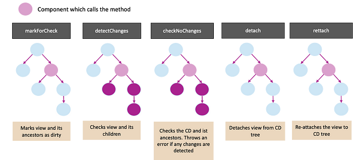 


#### markForCheck

**通知框架执行脏值检测**，忽视当前组件或是父组件中 `OnPush` 的影响

 

- ##### 手动通知框架进行脏值检测

  如果设置了 `OnPush` 策略，没有 `Input` 参数，但是**有其他（例如路径，http 获取数据等）参数会发生变化**

  这些**变化会被系统忽略掉**，**需要手动通知系统属性的变化**
  
  ```typescript
  @Component({
    changeDetection: ChangeDetectionStrategy.OnPush
  })
  export class HomeDetailComponent implements OnInit {
    constructor(private cd: ChangeDetectorRef) { }
    selectedTabLink;
    ngOnInit() {
      // 路径参数发生变化
      this.route.paramMap.subscribe(params => {
        console.log('路径参数: ', params);
        this.selectedTabLink = params.get('tabLink');
        // 发生变化，通知系统检查
        this.cd.markForCheck();
      });
    }
  }
  ```


#### detectChanges

该方法会从当前组件到各个子组件开始触发一次变化检测

与 `detach()` 结合，可以实现局部变更检测

 


#### checkNoChanges

该方法会从当前组件到各个子组件开始触发一次变化检测，如果有检测某个组件发生了变化，抛出异常并停止检测。

 


#### detach，reattach

手动将所在组件与其子组件分离或是重新连接

 


## 动态组件

### 宿主视图

宿主视图是在动态实例化组件时创建的，可以通过容器 `ViewContainerRef` 的 `createComponent` 方法，实例化并插入组件到容器

- 当需要添加新的 DOM 元素时（组件、模版），需要一个可以插入这个元素的位置，可以使用 `ViewContainerRef` 作为新组件的兄弟节点的 DOM 元素 / 容器，任何 DOM 元素都可以作为 `ViewContainerRef` 容器

- 创建出来的组件**在宿主元素外面**，**作为宿主元素兄弟节点**被插入  

- 使用 `ViewContainerRef` 对象的 `createComponent` 方法实例化一个组件，并将宿主视图插入到容器

  `createComponent(componentType, options?)`

- 通过 **`#` 模板变量标记插入点**，来插入动态组件

  ```html
  <button (click)='createComponent()'>创建组件</button>
  <ng-container #container>Container</ng-container>
  ```

  ```typescript
  export class SampleComponent {
    @Input() adComponent: AdComponent;
    // 通过 ViewChild 获取 ViewContainerRef
    @ViewChild('container', { read: ViewContainerRef }) container: ViewContainerRef; 
    // angular13 之前写法
    // constructor(private componentFactoryResolver: ComponentFactoryResolver) {} 
    createComponent() {
     	this.container.clear();
      /* angular13之前写法
      const factory = this.componentFactoryResolver.resolveComponentFactory(TimeComponent); 
  		this.componentRef = this.container.createComponent(factory);
      **/ 
      // 插入动态组件，返回 ComponentRef 的组件实例
      this.componentRef = this.container.createComponent(adComponent);
      // 为组件传参
      this.componentRef.instance.time = new Date();
    }
  }
  ```

- 通过**指令标记组件插入点**，来插入动态组件

  ```typescript
  // 使用指令来在模板中标记出有效的插入点
  @Directive({
    selector: '[adHost]',
  })
  export class AdDirective {
    // 依赖注入 ViewContainerRef 来获取对容器视图的访问权
    // 容器就是要动态加入的组件的宿主
    constructor(public viewContainerRef: ViewContainerRef) { }
  }
  ```
  
  ```html
  <div class="ad-banner-example">
    <h3>Advertisements</h3>
    <!-- 指示组件动态加载位置，使用 ng-template 不会渲染任何额外的输出 -->
    <ng-template adHost></ng-template>
  </div>
  ```
  
  ```typescript
  export class AdBannerComponent  {
    @Input() component;  	// 传入的组件
    @Input() params;			// 要插入的组件的参数
    @ViewChild(AdDirective, { static: true }) adHost!: AdDirective;  // 指令实例
    ngOnInit() {
      this.loadComponent();
    }
    loadComponent() {
      // 组件要插入到的位置：访问宿主的 viewContainerRef
      const viewContainerRef = this.adHost.viewContainerRef;
      viewContainerRef.clear();
      // 调用 ViewContainerRef 的 createComponent()，将组件添加到模板中
      // 返回组件实例
      const componentRef = viewContainerRef.createComponent<AdComponent>(this.component);
      // 向组件传参 
      componentRef.instance.data = this.params;
    }
  }
  ```

- 传递动态组件定义的 `Input` 和 `Output` 参数

  ```typescript
  // 动态组件定义
  export class LazyFormComponent {
    @Input() buttonTitle: string = "Submit";
    @Output() formSubmitted = new EventEmitter();
    submitForm() {
      this.formSubmitted.emit();
    }
  }
  ```

  ```typescript
  export class SampleComponent {
    formSubmittedSubscription = new Subscription();
    loadForm() {
      this.componentRef = this.container.createComponent(TimeComponent);
      // 为组件传递 buttonTitle 参数
      this.componentRef.instance.buttonTitle = "Contact Us";
      // 为组件传递 formSubmitted 事件函数
      this.formSubmittedSubscription = this.componentRef.instance.formSubmitted.subscribe(
        () => console.log("The Form Submit Event is captured!")
      );
    }
    ngOnDestroy(): void {
      this.formSubmittedSubscription.unsubscribe();
    }
  }
  ```

- 依赖服务的动态组件，需要

  ```
  
  ```

  


### 传送点 portal

Angular-cdk 的 `Portal` 包提供了一个灵活的布局体系，可以把动态内容渲染到应用中

- 安装 Angular-cdk，导入 `Portal` 模块

  ```bash
  npm i @angular/cdk
  ```

  ```typescript
  import { PortalModule } from '@angular/cdk/portal';
  ```

- `portal` 是要动态渲染到页面的内容，渲染到页面上的空白插槽（ `PortalOutlet` ）中
- `portal` 可以是组件（`ComponentPortal `），模板 `TemplateRef `（`TemplatePortal`），DOM 元素（`DomPortal`）
- `PortalOutlet` 相当于页面上的空白插槽，可以将 `portal` 放在 `PortalOutlet` 中渲染出来


#### 组件传送点 ComponentPortal

实例化组件作为传送点 `ComponentPortal`

底层的实现原理是 `ViewContainerRef.createComponent()`

```typescript
// 参数1：组件
// 参数2：视图容器，决定了该组件将附着到组件树的哪个位置，可选
// 参数3：用于实例化组件的注入器，可选
// 参数4：默认会使用outlet的componentFactoryResolver，可选
const componentPortal = new ComponentPortal(component); 
const componentPortal = new ComponentPortal(component, viewContainerRef, injector, componentFactoryResolver);
```

```typescript
// 注入令牌 
export class TimeToken {
  time: Date
}
// 要插入的组件
@Component({
  selector: 'component-portal-example',
  template: `要插入的组件 {{ time | date: 'HH:mm:ss' }}`,
})
export class ComponentPortalExample {
  time: Date;
  constructor(private timeToken: TimeToken) {
    // 获取注入器传入的参数 
    this.time = timeToken.time;
  }
}
```

```html
<div class="example-portal-outlet">
  <!-- 将selectedPortal挂载到PortalOutlet上 -->
  <ng-template [cdkPortalOutlet]="selectedPortal"></ng-template>
</div>
<button (click)="selectedPortal = componentPortal">Render component portal</button>
```

```typescript
import { Portal, ComponentPortal } from '@angular/cdk/portal';

export class CdkPortalOverviewExample implements AfterViewInit {
  selectedPortal: Portal<any>;
  componentPortal: ComponentPortal<ComponentPortalExample>;
  ngAfterViewInit() {
    // 通过注入器传参 
    const injector = Injector.create({ 
      providers: [{ provide: TimeToken, useValue: {time: new Date()}}]
    });
    // 创建portal
    this.componentPortal = new ComponentPortal(ComponentPortalExample, null, Injector);
  }
}
```


#### 模板传送点 TemplatePortal

实例化内嵌式视图模板作为传送点 `TemplatePortal`

底层的实现原理是 `ViewContainerRef.createEmbeddedView()` 来创建嵌入视图

```typescript
// 参数1：实例化宿主中内嵌视图的模板
// 参数2：对视图容器的引用，模板将被插入的哪个视图容器，可选
// 参数3：内嵌视图的上下文数据context，可选
// 参数4：内嵌视图的依赖注入器，可选
const templatePortal = new TemplatePortal(templateRef, viewContainerRef); 
const templatePortal = new TemplatePortal(templateRef, viewContainerRef, context, injector);
```

- 通过**依赖注入**，获取依赖组件的 `ViewContainerRef` 实例

  ```html
  <div class="example-portal-outlet">
    <ng-template [cdkPortalOutlet]="selectedPortal"></ng-template>
  </div>
  <button (click)="selectedPortal = templatePortal">Render template portal</button>
  <ng-template #templatePortalContent>Hello, this is a template portal</ng-template>
  ```

  ```typescript
  import { Portal, TemplatePortal } from '@angular/cdk/portal';
  
  export class CdkPortalOverviewExample implements AfterViewInit {
    @ViewChild('templatePortalContent') templatePortalContent: TemplateRef<unknown>;
    selectedPortal: Portal<any>;
    templatePortal: TemplatePortal<any>;
    // 依赖注入ViewContainerRef
    constructor(private _viewContainerRef: ViewContainerRef) {}
    ngAfterViewInit() {
      // 创建portal
      this.templatePortal = new TemplatePortal(this.templatePortalContent, this._viewContainerRef);
    }
  }
  ```

- 使用 **`CdkPortal` 指令**，便捷获取 `TemplatePortal` 的实例

  ```html
  <ng-template cdkPortal #myTemplate="cdkPortal">
    Hello, this is a template portal
  </ng-template>
  ```

  ```typescript
  import { Portal, TemplatePortal } from '@angular/cdk/portal';
  
  export class CdkPortalOverviewExample implements AfterViewInit {
    @ViewChild('myTemplate') myTemplate: TemplatePortal<any>;
    selectedPortal: Portal<any>;
  	ngAfterViewInit() {
  		this.selectedPortal = myTemplate;
    }
  }
  ```


#### DOM 传送点 DomPortal

通过 `DomPortal` 移动原生 DOM 元素，但是移动带有属性绑定或指令的 DOM 元素，可能不会再持续更新

```html
<div class="example-portal-outlet">
  <ng-template [cdkPortalOutlet]="selectedPortal"></ng-template>
</div>
<button (click)="selectedPortal = domPortal">Render DOM portal</button>
<div #domPortalContent>Hello, this is a DOM portal</div>
```

```typescript
import { Portal, DomPortal } from '@angular/cdk/portal';

export class CdkPortalOverviewExample implements AfterViewInit {
  // 获取ElementRef来创建DomPortal实例
  @ViewChild('domPortalContent') domPortalContent: ElementRef<HTMLElement>;
  selectedPortal: Portal<any>;
  domPortal: DomPortal<any>;
  ngAfterViewInit() {
    // 创建portal
    this.domPortal = new DomPortal(this.domPortalContent);
  }
}
```


#### 结构容器 DomPortalOutlet

在不能使用 `cdkPortalOutlet` 指令的场景下，例如浮层 `overlay`，不能通过在 `ng-template` 中去使用 `cdkPortalOutlet` 指令来让浮层渲染在页面中

- 创建 `OverlayRef` 实例，使用 `DomPortalOutlet` 来创建用于渲染内容的插槽

  ```typescript
  import { OverlayConfig, OverlayModule } from '@angular/cdk/overlay';
  export class AppComponent {
    private overlayRef?: OverlayRef
    constructor(private readonly overlay: Overlay) {}
    // 打开浮层
    showOverlay() {
      const config: OverlayConfig = { width: 'auto', height: 'auto' };
      // 创建Overlay实例,overlay实例上就是一个PortalOutlet 
      this.overlayRef = this.overlay.create(config);
      // 创建portal
      const componentPortal = new ComponentPortal(OverlayContentComponent, null, Injector);
      // 将portal挂载到Ovelay实例上
      overlayRef.attach(componentPortal); 
    }
    // 关闭浮层
    closeOverlay() {
      // 销毁
      this.overlayRef?.dispose();
      // 拆除
      // this.overlayRef?.detach();
      this.overlayRef = undefined;
    }
  }
  ```

   

- `overlay` 表示位置

  - 全局位置策略 `GlobalPositionStrategy`

    全局位置类似于 `fix` 布局，常用于页面的全局提示与反馈

    ```typescript
    // 创建位置策略 
    const positionStrategy = this.overlay.position().global().top(`200px`).centerHorizontally(); 
    // 创建Overlay实例 
    this.overlayRef = this.overlay.create({ positionStrategy }); 
    // 创建弹框组件portal 
    const portal = new ComponentPortal(ModalComponent, this.viewContainerRef);
    this.overlayRef.attach(portal);
    ```

  - 灵活连接点位置策略 `FlexibleConnectedPositionStrategy`

    常应用于下拉框等 popover 式组件

     

    ```typescript
    const positionStrategy = this.overlay.position().flexibleConnectedTo(this.overlayOrigin.elementRef) 
    // 数组里越靠前的position优先级越高
    // 当优先级高的位置会导致元素放不下（如被浏览器遮挡）时，就会使用优先级低一些的position
    .withPositions([{
      originX: `start`, 
      originY: `bottom`, 
      overlayX: `start`, 
      overlayY: `top`
    },{ 
      originX: `start`, 
      originY: `top`,
      overlayX: `start`, 
      overlayY: `bottom`, 
      panelClass: `red` // 可以给动态创建的组件所在容器加类名 
    }]);
    ```


# 模板 Template 

## 数据绑定

> - 使用**方括号 `[]` 是数据绑定**，如果带方括号，等号后面就是一个对象或表达式
>
>
> - **不使用方括号是字符串**，但如果此时**在等号后使用 `{{}}` 就是和方括号等效的**
>
>   （如果绑定的数据有 `.` 如 `class.active` 则不能使用 `{{}}` ）

### 插值表达式

```html
<h1>{{ title }}</h1>
<h1>{{ 'Hello World' }}</h1>
<h1>{{ getInfo() }}</h1>
<h1>{{ a == b ? '相等' : '不等' }}</h1>
```


### html 绑定

```typescript
this.h="<h2>这是一个h2 用[innerHTML]来解析</h2>"
```

```html
<div [innerHTML]="h"></div>
```

为了加强 **XSS 保护**，使用 `DomSanitizer` 服务来安全地处理 HTML 内容

```typescript
import { Component } from '@angular/core';
import { DomSanitizer } from '@angular/platform-browser';

@Component({
  selector: 'app-safe-html',
  template: `
    <div [innerHTML]="safeHtml"></div>
  `,
})
export class SafeHtmlComponent {
  safeHtml: any;
  constructor(private sanitizer: DomSanitizer) {
    this.safeHtml = this.sanitizer.bypassSecurityTrustHtml(`<p>Hello, <strong>Angular</strong> is awesome!</p>`);
  }
}
```


### 数据绑定容错处理

```html
<!-- 
interface Task {
	person?:{ name: string }
}
-->
<span *ngIf="task.person">{{ task.person.name }}</span>
<span>{{ task.person?.name }}</span>
```


### 模板绑定方法

> - 直接在**模板中调用方法可能会导致性能问题**
> - 通过使用**纯管道**和 **RxJS 的 Observable**，可以有效地优化变更检测，提高应用的响应速度和性能

- 在模板中直接调用一个方法，Angular **会在每次变更检测时调用该方法**，因为 Angular **不会跟踪这个方法的返回值**，导致每次变更检测都需要重新计算。这种做法可能会影响性能，尤其是在频繁触发变更检测的情况下

  如果方法**不是一个纯函数**，Angular 就必须在每次变更检测时调用它，即使输入没有变化，方法也会被重复调用

  ```html
  <p>{{getTotalCosts(journey.days)}}</p>
  ```

- 使用纯管道解决，纯管道只会在输入值发生变化时触发计算

  ```typescript
  @Pipe({ name: 'totalCosts', pure: true })
  export class TotalCostsPipe implements PipeTransform {
      transform(days: number, pricePerDay: number): number {
          return days * pricePerDay;
      }
  }
  ```

  ```html
  <p>{{ journey.days | totalCosts: pricePerDay }}</p>
  ```

- 使用 `async` 管道自动订阅并获取最新的值

  ```typescript
  totalCosts$ = this.journey$.pipe(
    map((journey) => journey.days),
    distinctUntilChanged(),
    map((days) => this.pricePerDay * days));
  ```

  ```html
  <p>{{totalCosts$ | async}}</p>
  ```


## 属性绑定

- DOM 属性绑定

  ```html
  <div [id]="id" [title]="msg">我的属性</div>
  ```

- 标记属性绑定

  ```html
  <!-- [attr.属性名称] 标记属性或者自定义的HTML属性绑定-->
  <td [attr.colspan]="colSpan"></td>
  ```

- 单个样式绑定

  ```html
  <div class="title" [class.className]="条件表达式">
    对于单个样式的条件绑定最为合适
  </div>
  <a href="#" [class.active]="selectedIndex === i" (click)="selectedIndex = i">
    {{ menu.title }}
  </a>
  ```

- class 属性绑定

  ```html
  <div [ngClass]="{'active': true, 'error': true}"></div>
  ```

- style 属性绑定

  ```html
  <button [style.backgroundColor]="isActive ? 'blue' : 'red'">按钮</button>
  <button [ngStyle]="{'backgroundColor': 'red'}">按钮</button>
  ```


## 事件绑定

- **圆括号 `()` 用于事件绑定**，等号后可以接表达式也可以是一个定义在类中的函数

- **可以传入事件对象 `$event`**

```html
<button class="button" (click)="getData()">
  点击按钮触发事件
</button>
```

```html
<!-- (事件名)="模板语句"  事件对象：$event -->
<input type="text" (keyup)="keyUpFn($event)"/>
<input type="text" (keyup.enter)="keyUpFn($event)"/>
```

```typescript
// 事件对象 event
keyUpFn(event: Event){
  console.log(event)
}
```


## 双向数据绑定

### 双向绑定

`ngModel` 应用于表单

```html
<input [(ngModel)]="username"/>
```

- `FormsModule` 中提供的指令，注意引入：`FormsModule`

  ```typescript
  import { FormsModule } from '@angular/forms';
  @NgModule({
    declarations: [AppComponent],
    imports: [BrowserModule, FormsModule],
    providers: [],
    bootstrap: [AppComponent]
  })
  export class AppModule { }
  ```
  
- 使用 `[(ngModel)]="变量"`  形式进行双向绑定，其实是一个**语法糖**

  ```html
  <!-- 等同于 -->
  <input [ngModel]="username" (ngModelChange)="username = $event"/>
  ```

- 双向绑定就是**属性绑定加事件绑定**

  ```html
  <!-- 等同于 -->
  <input [value]="username" (input)="username = $event.target.value"/>
  ```

  - `[value]="username"` 绑定 `username` 值到 `<input>` 的 `value`
  - `(input)=“表达式”` 绑定表达式到 `<input>` 的 `input` 事件
  - `username = $event.traget.value` 在 `input` 事件触发时执行
  - `$event` 表达式，提供事件的数据

- ##### 其他表单标签

  ```html
  <input type="radio" value="1" name="sex" id="sex1" [(ngModel)]="usersex"/>
  <label for="sex1">男</label>
  <input type="radio" value="2" name="sex" id="sex2" [(ngModel)]="usersex"/>
  <label for="sex2">女</label>
  ```
  
  ```html
  <select name="city" id="city" [(ngModel)]="usercity">
  	<option [value]="item" *ngFor="let item of cityList">{{item}}</option>
  </select>
  ```
  
  ```html
  <span *ngFor="let item of hobbies;let key=index;">
  	<input type="checkbox" [id]="'check'+key" [(ngModel)]="item.checked"/> 
      <label [for]="'check'+key"> {{item.title}}</label>
  </span>
  ```
  
  ```html
  <textarea name="mark" id="mark" cols="30" rows="10" [(ngModel)]="usermark"></textarea>
  ```


### 自定义双向绑定

```typescript
export class HorizonGridComponent {
  
  @Output() usernameChange = new EventEmitter();

  private _username = '';   
  @Input()
  public get username (): string {
    return this._username;
  }
  public set username (value: string) {
    this._username = value;
    // 在完成属性绑定的同时，也进行了事件绑定
    this.usernameChange.emit(value);
  }
}
```

```html
<app-horizon-grid [(username)]="username"></app-horizon-grid>
<!-- 等同于 -->
<app-horizon-grid (username)="username" (usernameChange)="username = $event"></app-horizon-grid>
```


## 模板引用

### 模板引用变量

在模板中使用井号 `#` 来声明一个模板变量

- 对 DOM 元素的引用

  ```html
  <!-- #phone值为input元素的HTMLElement对象实例 -->
  <input #phone placeholder="phone number" />
  <!-- phone有HTMLElement对象的任何属性和方法 -->
  <!-- 避免了使用ngModel等数据绑定 -->
  <button type="button" (click)="callPhone(phone.value)">Call</button>
  ```

- 对组件的引用

  ```typescript
  @Component({
    selector: 'app-hello',
    template: `
      <div>
        <h2>Hello {{name}}</h2>
      </div>
    `
  })
  export class HelloComponent {
    name = 'Angular';
  }
  ```

  ```html
  <app-hello #helloComp></app-hello>
  {{ helloComp.name }}
  ```

- 对指令的引用

    如果用模版引用变量来指向这个指令，指令的名称就是 `exportAs` 选项指定的内容

  ```typescript
  @Directive({
    selector: 'form:not([ngNoForm]):not([formGroup]),ngForm,[ngForm]',
    exportAs: 'ngForm'
  })
  ```

  ```html
  <form (ngSubmit)="onSubmit(myForm)" #f="ngForm">
    <input name="first" ngModel required #first="ngModel">
  </form>
  <p>Form valid: {{ f.valid }}</p>
  <p>First name value: {{ first.value }}</p>
  ```


### 获取 DOM 节点 @ViewChild

`ViewChild` 用来在类中**引用模板中的视图节点**

- 可以是 Angular 组件，可以是 HTML 元素 `ElementRef`，也可以是 `TemplateRef` 和 `ViewContainerRef`
- **在 `AfterViewInit` 中可以安全的使用** `@ViewChild` 引用的元素
- 推荐**使用 `Renderer2` 操作 DOM 元素**，防止注入攻击
- 真正的 DOM 节点是 `nativeElement` 里

```html
<!-- #号后面是给模板或者DOM元素一个引用名字，以便可以在组件类或模板中进行引用 -->
<!-- #id是唯一标识，注意在ngfor循环中的使用 -->
<div #helloDiv>你好</div>
```

```typescript
import { Component, ViewChild, ElementRef } from '@angular/core';
export class AppComponent{
  // ViewChild是一个选择器，用来查找要引用的DOM元素或组件
  // ElementRef是DOM元素的一个包装类
  // 因为DOM元素不是Angular中的类，所以需要一个包装类以便在Angular中使用和标识其类型
  // ElementRef可以加泛型形式 例如 ElementRef<HTMLParagraphElement>
  @ViewChild('helloDiv') helloDivRef: ElementRef;
}
```

- 使用 `Renderer2` 操作 DOM 元素

  ```html
  
  ```

  ```typescript
  import { Renderer2 } from '@angular/core';
  
  export class ImageSliderComponent {
    @ViewChildren('img') imgs: QueryList <ElementRef>;
    constructor(private rd2: Renderer2) { }
    ngAfterViewInit() {
      this.imgs.forEach((ele) => {
        this.rd2.setStyle(ele.nativeElement, 'height', '200px');
      });
    }
  }
  ```

- 静态选项 `static`

  - 如果**元素没有在 `ngif` 或 `ngfor` 的包含之下 `static` 就是 `true`**，反之是 `false`

  - 为 `true` 则在变更检测运行之前解析查询结果，为 `false`，则在变更检测之后解析

  - 默认为 `false`

  ```typescript
  @ViewChild('imageSlider', { static: true }) imgSlider: ElementRef;
  ```

- 引用的视图节点使用其他格式解析 `read`

  视图节点元素都可以解析成 `ElementRef` 和 `ViewContainerRef`

  ```html
  <one></one>
  ```

  ```typescript
  // 这样获取只能获取到OneComponent组件实例
  @ViewChild(OneComponent) one: OneComponent;
  // 如果想要按照ElementRef来获取时，指定read为ElementRef
  @ViewChild(OneComponent, { read: ElementRef }) one: ElementRef;
  ```


### 获取多个 DOM 节点 @ViewChildren

`ViewChildren` 引用多个模板元素

```typescript
// 引用多个模板元素
@ViewChildren('img') imgs: QueryList<ElementRef>;
```

输出的 `QueryList` 对象

 

```typescript
// 获取ElementRef集合，其中有nativeElement
this.imgs.toArray();
```

```typescript
// 可以直接操作DOM，但是不提倡，会造成注入攻击
this.imgs.ForEach(item => item.nativeElement.style.height = '100px');
// 提倡的方式是使用Renderer2
this.imgs.ForEach(item => {
  this.rd2.setStyle(item.nativeElement, 'height', '100px');
});
```


### 获取组件实例

- 父组件获取子组件实例，`viewChild` 可以使用引用名，也可以使用组件类型

  ```html
  <app-image-slider [sliders]="imageSliders"></app-image-slider>
  ```

  ```typescript
  // 引用模板中的Angular组件时，viewChild 可以使用引用名，也可以使用组件类型
  @ViewChild(ImageSliderComponent) imageSlider: ImageSliderComponent;
  ```

- 使用引用名获取

  ```html
  <app-footer #footerChild></app-footer>
  ```

  ```typescript
  @ViewChild('footerChild') footer;
  // 调用子组件方法
  run(){
    this.footer.footerRun();
  }
  ```


## 内容投影

### 单内容投影

- 子组件可以通过投影方式嵌入父组件，投影内容显示位置 `<ng-content></ng-content>`


- `<ng-content>` 元素是一个**占位符**，不会创建真正的 DOM 元素，等价于 `node.appendChild(el)`
  只是移动元素，节点不被克隆，被简单地移动到新位置
- 因为不会创建传入的模板，就算用 `ngFor` 套住 `<ng-content>` 中的组件也不会出现多个
- `<ng-content>` 中的组件**只会被实例化一次** ，从未被销毁和重新创建，即 `ngOnInit()` 只执行一次
- 投影内容的生命周期将被绑定到它被声明的地方，而不是显示在地方
- 使用场景：**动态内容、容器组件、有冗余的事件传递**

```typescript
// 父组件
@Component({
  selector: 'app-list',
  // 子组件，通过投影方式嵌入
  template: `<ng-content></ng-content>`
})
```

```html
<app-list>
  <!-- 子组件投影内容 -->
  <app-list-item></app-list-item>
</app-list>
```


### 多内容投影

- 使用 `<ng-content>` 的 `select` 属性，可以**选择投影的内容**，没有设置 `select` 属性则所有内容都可以投影

  `<ng-content select="样式类/HTML标签/指令"><ng-content>`

- `select` 添加约束，`select` 的值**不能设置为动态**的

- 约束作用在**直接子节点**上

```html
<!-- 只选取标签 -->
<ng-content select="span"></ng-content>
<!-- 只选取样式类 -->
<ng-content select=".special"></ng-content>
<!-- 只选取指令 -->
<ng-content select="[appGridItem]"></ng-content>
<!-- 只选取属性key="value" -->
<ng-content select="[name=test]"></ng-content>
<!-- 可以写多个ng-content，以及带有不同的约束 -->
```

- ##### 应用投影组件做容器

  `<ng-content>` 在浏览器中会被 `<div class="heading"></div>` 所替代，

  如果不想要这个额外的 `div`，可以使用 `<ng-container>` 替代这个`div`，`<ng-container>` 本身未在 DOM 树中渲染

  ```html
  <bootstrap-panel>
    <!-- <ng-container class="heading">Heading</ng-container> -->
    <div class="heading">Heading</div>
    <div class="body">Body</div>
  </bootstrap-panel>
  ```

  ```html
  <!-- panel.component.html -->
  <div class="panel panel-default">
    <div class="panel-heading">
      <!-- 显示类名为heading的部分 -->
      <ng-content select=".heading"></ng-content>
    </div>
    <div class="panel-body">
      <!-- 显示类名为body的部分 -->
      <ng-content select=".body"></ng-content>
    </div>
  </div>
  ```

- ##### ngProjectAs 指定别名

  `ngProjectAs` 指定的就是 `select` 所定义的选择器名

  ```html
  <!-- 父组件 app-content-section -->
  <div>
    <ng-content select="app-content-child"></ng-content>
  </div>
  ```

  ```html
  <!-- 下面中情况中，ng-content没有投射到对应的内容 -->
  <app-content-section>
    <ng-container>
      <app-content-child [title]="'测试'"></app-content-child>
    </ng-container>
  </app-content-section>
  
  <!-- 通过使用ngProjectAs设置别名让ng-content的内容能正确的投射过来 -->
  <app-content-section>
    <ng-container ngProjectAs="app-content-child">
      <app-content-child [title]="'测试'"></app-content-child>
    </ng-container>
  </app-content-section>
  ```

  

### 内嵌视图 NgTemplateOutlet

`*ngTemplateOutlet="templateRefExp; content: contentExp"`

`templateRefExp` 为 `<ng-template>` 元素的 `#ID`，`contentExp` 为传递的数据上下文

```html
<!-- ngTemplateOutlet指定了要实例化下面的名为name的ng-template -->
<!-- context指定了myContext作为实例化的数据上下文传入 -->
<ng-container *ngTemplateOutlet="name; context: myContext"></ng-container>
<!-- ng-template中使用let-key='value'的方式获取传输的数据上下文 -->
<ng-template #name let-name="data"><span>Hello {{name}}!</span></ng-template>
```

- `NgTemplateOutlet` 指令可以来在**模板的指定位置实例化一个 `TemplateRef` 对象**
- **同时在实例化的过程中可以传入一个数据对象**，每个对象可能有一个或多个值

- `TemplateRef`  可以通过 `<ng-template>` 标签来创建
- `<ng-template>` 元素可以让组件根据想要的任何条件显式渲染内容，并**可以进行多次渲染**
- 在**显示渲染之前**，**不会初始化**该元素的内容

- `content` 对象使用 `$implicit ` 会把对应的值设置为默认值

- 如果 `content` 对象只有一个值，就可以不指定名称

  `{ name: 'jack' }` 可以写成 `{ $implicit: 'jack' }`

  `<ng-template>` 获取的时候，`let-showName="name"` 可以写成 `let-showName`

  ```html
  <ng-container *ngTemplateOutlet="tplStu; context: { $implicit: 'jack' , age: '19'}"></ng-container>
  <ng-template #tplStu let-name let-ageHTML="age">
    hello {{ name }},your age is {{ ageHTML }}
  </ng-template>
  ```

- 模板由外界子内容传入

  使用 `<ng-content>` 可以更方便的控制传入的模板在 DOM 中的位置，使用 `ngTemplateOutlet` 可以**向传入的模板传递渲染数据**

  ```typescript
  @Component({
    selector: 'wrapper',
    template: `<ng-container *ngTemplateOutlet="name; context: myContext"></ng-container>`
  })
  class NgTemplateOutletExample {
    // 使用@ContentChild手动捕获模板
    @ContentChild(TemplateRef) name: TemplateRef<any>;
    myContext = { $implicit: 'World', name: 'Jack' };
  }
  ```

  ```html
  <wrapper>
    <ng-template let-value let-name=name>
      <span>Hello {{ value }}!</span>
      <span>Welcome {{ name }}!</span>
    </ng-template>
  </wrapper>
  ```


### 内嵌视图 createEmbeddedView

通过 `ViewContainerRef` 的 `createEmbeddedView` 方法来实例化 `<template>` 元素，将创建出来的模板插入到 DOM 树中

- 使用依赖注入来获取 `ViewContainerRef` 容器服务，调用 `createEmbeddedView` 插入模板

  容器将指向宿主元素，模版将作为宿主元素的兄弟节点被插入

  ```html
  <div class="view-container">
    <button (click)="addTemplate()">click</button>
    <button (click)="closeTemplate()">close</button>
  </div>
  <ng-template #testTemplate>
    <div style="height:100px;background-color: red;">
      test template
    </div>
  </ng-template>
  ```

  ```typescript
  import { Component, ViewContainerRef, TemplateRef, ViewChild } from "@angular/core";
  export class ViewContainerComponent {
    @ViewChild("testTemplate") templateView: TemplateRef<any>;
    constructor (private viewContainerRef: ViewContainerRef) {}
    addTemplate() {
      // 使用 createEmbeddedView 将 templateView 插入到 viewContainer 容器
      this.viewContainerRef.createEmbeddedView(this.templateView);
    }
    closeTemplate() {
      // 清除 viewContainer 中添加的页面
      this.viewContainerRef.clear();
    }
  }
  ```

- `createEmbeddedView` 的第二参数 `context` 为嵌入视图的数据绑定上下文对象

- 将模板插入到指定位置

  并不会把视图插入该元素的内部，而是**追加到该元素后面**，类似于 `router-outlet` 中插入组件的方式

  ```html
  <ng-template #templateRef>
    <ul>
      <li>List Item 1</li>
      <li>List Item 2</li>
    </ul>
  </ng-template>
  <div #viewContainerRef class="testing"></div>
  <button (click)="addTemplate()">click</button>
  <button (click)="clearTemplate()">clear</button>
  ```

  ```typescript
  import { Component, ViewContainerRef, TemplateRef, ViewChild } from "@angular/core";
  export class AppComponent implements OnInit {
    @ViewChild('viewContainerRef', { read: ViewContainerRef, static: true })
    viewContainerRef: ViewContainerRef;
  
    @ViewChild('templateRef', { read: TemplateRef, static: true })
    templateRef: TemplateRef<any>;
    
    ngOnInit() {
      //this.viewContainerRef.createEmbeddedView(this.templateRef);
    } 
    addTemplate() {
      this.viewContainerRef.createEmbeddedView(this.templateRef);
    }
    clearTemplate() {
      this.viewContainerRef.clear();
    }
  }
  ```

     


### 条件内容投影

- 如果需要有条件地渲染内容或多次渲染内容，应配置该组件接受一个 `<ng-template>` 元素，其中包含要有条件渲染的内容


- 使用 `<ng-template>`，**在显示渲染之前，不会初始化该元素的内容**

  如果使用 `<ng-content>`，只要组件的使用者提供了内容，即使该组件从未定义 `<ng-content>` 元素，或者 `<ng-content>` 元素在`ngIf` 内部，该内容也总会被初始化

```html
<!-- app-persons -->
<!-- 假设现在有一个人员列表，当某个人的money大于200的时候，额外添加组件中模板定义的内容 -->
<div class="list-item" *ngFor="let person of persons;">
  <div>Name: {{ person.name }}</div>
  <div>Money: {{ person.money }}</div>
  <div *ngIf="person.money > 200">
    <ng-container *ngIf="childRef" [ngTemplateOutlet]="childRef.templateRef"></ng-container>
  </div>
</div>
```

```typescript
export class PersonsComponent {
  persons: { name: string; money: number; }[] = [
    { name: '杰克', money: 120 },
    { name: '李莉', money: 210 },
    { name: '张三', money: 170 },
  ];
  // 使用@ContentChild获得模板内容的引用TemplateRef
  // 通过appChildRef指令获取ng-template模板
  @ContentChild(ChildRefDirective, { static: true }) childRef!: ChildRefDirective;
}
```

```typescript
// 定义一个 appChildRef 指令来配合 ng-template 获取模板
@Directive({
  selector: '[appChildRef]'
})
export class ChildRefDirective {
  // 指示Angular实例化这个模板引用
  constructor(public templateRef: TemplateRef<any>) { }
}
```

```html
<!-- 使用 -->
<app-persons>
  <!-- 自定义组件将ng-template标记为组件内容，借助TemplateRef，组件可以使用ngTemplateOutlet去渲染-->
  <ng-template appChildRef>
    <!-- 满足条件显示的内容 -->
    <div style="font-size: 14px; color: red;">this is child ref content</div>
  </ng-template>
</app-persons>
```

 


### 多条件内容投影

```html
<!-- app-form-unit -->
<div class="list-item" *ngFor="let person of persons;let i=index;">
  <div>Name: {{ person.name }}</div>
  <div>Money: {{ person.money }}</div>
  <div *ngIf="person.render && tempRefs[person.render]">
    <!-- 配合 ngTemplateOutlet 指令给template传递当前person的数据 -->
    <ng-container *ngTemplateOutlet="tempRefs[person.render].templateRef; context: { $implicit: person, i: i }"></ng-container>
  </div>
</div>
```

```typescript
export class FormUnitComponent {
  persons: { name: string; money: number; render?: string; }[] = [
    { name: '杰克', money: 120, render: 'temp1' },
    { name: '李莉', money: 210, render: 'temp2' },
    { name: '张三', money: 170, render: 'temp3' },
  ];
  @ContentChildren(ChildRefDirective) childrenRef!: QueryList<ChildRefDirective>;
  get tempRefs() {
    const aObj: any = {};
    this.childrenRef.forEach(template => {
      const key: string = template.appChildRef;
      aObj[key] = template;
    })
    return aObj;
  }
}
```

```typescript
import { Directive, Input, TemplateRef } from '@angular/core';
@Directive({
  selector: '[appChildRef]'
})
export class ChildRefDirective {
  // 接受定义模板名称，通过这个名称和 persons 中的render字段对应进行显示对应的模板内容
  @Input() appChildRef!: string;
  constructor(public templateRef: TemplateRef<any>) { }
}
```

```html
<!-- 使用 -->
<app-persons>
  <ng-template appChildRef="temp1" let-person let-index="i">
    <div style="font-size: 14px; color: red;">{{index}}-{{person.name}}: this is temp1</div>
  </ng-template>
  <ng-template appChildRef="temp2" let-person let-index="i">
    <div style="font-size: 14px; color: green;">{{index}}-{{person.name}}: this is temp2</div>
  </ng-template>
  <ng-template appChildRef="temp3" let-person let-index="i">
    <div style="font-size: 14px; color: orange;">{{index}}-{{person.name}}: this is temp3</div>
  </ng-template>
</app-persons>
```

 


### 获取投影内容 @ContentChild

- `@ContentChild` 获得从 DOM 视图中**通过选择器匹配到的第一个元素或者指令**

- 如果内容 DOM 发生变化，并且新的子项与选择器匹配，则属性将被更新


- `@ContentChild` 的获取发生在**生命周期 `ngAfterContentInit`**

- ##### `@ContentChild` 和 `@ViewChild` 的区别

  - `ViewChild` 与视图子节点有关，操作**自身的视图内容**。在组件的模板中定义的内容，是组件的一部分

    `ContentChild` 与内容子节点有关，操作**投影进来的内容**。在 `host` 元素 `<opening>` 和 `</closing>` 标签中的内容

  - `ViewChild` 在 `ngAfterViewInit` 中调用

    `ContentChild` 在 `ngAfterContentInit` 中调用

- ##### 获取投影里包含的组件

  ```html
  <!-- app-content-section -->
  <h1>ng content</h1> 
  <!--在这里确定这里会放ContentChildComponent组件，才能使用@ContentChild和@ContentChildren去获取该组件的投影 -->
  <ng-content></ng-content>
  ```

  ```typescript
  class contentSectionComponent {
    // 通过 #section_child_0 获取组件
    @ContentChild('section_child_0') childOne: ContentChildComponent;
    // 通过 ContentChildComponent 组件名获取组件
    @ContentChildren(ContentChildComponent) childrenList: QueryList<ContentChildComponent>;
    ngAfterContentInit(): void {
      console.log(this.childOne);
      this.childrenList.forEach((item) => {
        console.log(item);
      });
    }
  }
  ```

  ```html
  <!-- 使用 -->
  <app-content-section> 
    <app-content-child #section_child_0 [title]="title_0"></app-content-child>
    <app-content-child #section_child_1 [title]="title_1"></app-content-child> 
  </app-content-section>
  ```

- ##### 使用自定义指令获取投影内容

  参考【条件内容投影】和【多条件内容投影】


### 获取多个投影内容 @ContentChildren

- `@ContentChildren` 获取匹配的多个元素，返回结果是一个 `QueryList` 集合
  通过 `QueryList` 实例提供的 `forEach` 方法来遍历集合中的元素

- **每当添加、删除或移动子元素时，此查询列表都会更新**，并且其可观察对象 `changes` 都会发出新值

- 多个字符串选择器可以用逗号分隔 `@ContentChildren('cmp1, cmp2')`


- 参数 `descendants`：**包含所有后代时为 `true`，否则仅包括直接子代**


```typescript


@Component({
  selector: 'tab',
  template: `
    <div class="top-level">Top level panes: {{ serializedPanes }}</div>
    <div class="nested">Arbitrary nested panes: {{ serializedNestedPanes }}</div>
  `
})
export class TabComponent {
  @ContentChildren(Pane) topLevelPanes!: QueryList<Pane>;
  @ContentChildren(Pane, {descendants: true}) arbitraryNestedPanes!: QueryList<Pane>;

  get serializedPanes(): string {
    return this.topLevelPanes ? this.topLevelPanes.map(p => p.id).join(', ') : '';
  }
  get serializedNestedPanes(): string {
    return this.arbitraryNestedPanes ? this.arbitraryNestedPanes.map(p => p.id).join(', ') : '';
  }
}
```

```typescript
@Directive({selector: 'pane'})
export class Pane {
  @Input() id!: string;
}
```

```typescript
@Component({
  selector: 'example-app',
  template: `
    <tab>
      <pane id="1"></pane>
      <pane id="2"></pane>
      <pane id="3" *ngIf="shouldShow">
        <tab>
          <pane id="3_1"></pane>
          <pane id="3_2"></pane>
        </tab>
      </pane>
    </tab>
    <button (click)="show()">Show 3</button>
  `,
})
export class ContentChildrenComp {
  shouldShow = false;
  show() {
    this.shouldShow = true;
  }
}
```


## 表单

### 模板驱动

**表单的控制逻辑写在组件模板中**，适合简单的表单类型

引入 `FormsModule` 模块

```typescript
import { FormsModule } from '@angular/forms';
```

将 DOM 表单转换为 Angular 表单

Angular 表单提供了表单相关的很多信息，比如当前表单内容，当前表单是否操作过，当前表单有没有通过验证等

- 转换 Angular 表单

  ```html
  <!-- 添加模板变量用来代表DOM对象,为这个模板变量赋值为ngForm(固定).这样就变成了Angular的表单对象 -->
  <!-- 表单提交时，把表单对象作为参数传递到组件中 -->
  <form #f="ngForm" (submit)="onSubmit(f)">
    <!-- 绑定到表单 添加属性 ngModel -->
    <!-- 表单项需要name属性，获取表单对象时，name属性的值会作为对象的属性存在 -->
    <input type="text" name="username" ngModel />
    <button>提交</button>
  </form>
  ```

  ```typescript
  import { NgForm } from '@angular/forms';
  export class AppComponet {
    onSubmit(form: NgForm) {
      // 在表单填写的数据
      console.log(form.value);
      // NgForm 中有很多属性 valid(验证是否通过), invalid(验证是否没有通过)
    }
  }
  ```


- 表单分组

  ```html
  <form #f="ngForm" (submit)="OnSubmit(f)">
    <!-- 为表单项分组 赋值为分组的名字 -->
    <div ngModelGroup="user">
      <input type="text" name="username" ngModel />
    </div>
    <div ngModelGroup="contact">
      <input type="text" name="photo" ngModel />
    </div>
    <button>提交</button>
  </form>
  ```

- 表单验证

  ```html
  <!--
  required 必填字段
  minlength 字段最小长度
  maxlength 字段最大长度
  pattern 验证正则 pattern="\d" 匹配一个数值
  -->
  <form #f="ngForm" (submit)="OnSubmit(f)">
    <!-- 为表单项设置模板变量 赋值为ngModel(固定) -->
    <input #username="ngModel" type="text" name="username" ngModel required minlength="2" maxlength="6" />
    <!-- 验证错误信息 -->
    <!-- touched 用户是否获取焦点 -->
    <!-- 用户操作过表单项 && 没有通过验证 && 有验证错误 -->
    <div *ngIf="username.touched && !username.valid && username.errors">
      <div *ngIf="username.errors.required">请填写用户名</div>
      <div *ngIf="username.errors.minlength">
        用户名最少{{ username.errors.minlength.requiredLength }}个字符
      </div>
    </div>
    <!-- 表单整体未通过禁止提交表单 -->
    <button type="submit" [disabled]="f.invalid">提交</button>
  </form>
  ```

  ```typescript
  onSubmit(form: NgForm) {
    // 表单整体验证是否通过
    console.log(form.valid)
  }
  ```

  验证错误样式

  ```css
  /*
  .ng-touched 用户获取过焦点
  .ng-dirty 用户更改过表单值
  */
  input .ng-touched .ng-invalid {
    border: 2px solid red;
  }
  ```


### 模型驱动 / 响应式

#### 创建响应式表单

- **表单的逻辑控制写在组件类中**，对验证逻辑有更多的控制权，适合复杂的表单

- 在模型驱动表单中，**表单中每一个表单项，都必须是 `FormControl` 类的实例**，**实例对象可以验证表单字段**中的值是否被修改过等等


- **整个表单都是 `FormGroup` 类的实例**，可以对表单进行整体验证

- `AbstractControl` 是 `FormControl`、`FormGroup` 和 `FormArray` 的基类

- 在 v14 版本中添加了表单项的**泛型类型**指定，类型为 `Record<string, AbstractControl>`

  更简化的表单类型设计参考：https://github.com/browsepedia/ng-forms

  ```typescript
  type UserFormType = {
    firstName: FormControl<string>;
    lastName: FormControl<string>;
  }
  ```

  ```typescript
  const userForm = new FormGroup<UserFormType>({
    firstName: new FormControl('', { nonNullable: true }),
    lastName: new FormControl('', { nonNullable: true })
  })
  ```

- 表单控制以及配置验证规则

  1. （根）模块中注册响应式表单模块

     ```typescript
     import { ReactiveFormsModule } from '@angular/forms';
     ```

     ```typescript
     @NgModule({
       imports: [
         ReactiveFormsModule
       ],
     })
     ```
  
  2. 创建表单控制对象
  
     ```typescript
     import { FormControl, FromGroup, Validators } from '@angular/forms';
     export class AppComponet {
       contactForm: FormGroup = new FormGroup({
         // 参数1 设置默认值 参数2 验证规则
         name: new FormControl("", [Validators.required, Validators.minLength(2)]),
         phone: new FormControl()
       })
       onSubmit() {
         // 获取表单值
         console.log(this.contactForm.value);
         // 是否通过验证
         console.log(this.contactForm.valid);
       }
     }
     ```
  
  3. 关联模板表单
  
     ```html
     <form [fromGroup]="contactForm" (submit)="onSubmit()">
       <!-- formControlName 绑定的是字符串 -->
       <input type="text" formControlName="name" />
       <div *ngIf="name.touched && name.invalid && name.errors">
         <div *ngIf="name.errors.required">
           请填写姓名
         </div>
         <div *ngIf="name.errors.maxlength">
           姓名长度不能大于{{ name.errors.maxlength.reqiuredLength }}
           实际填写长度为{{ name.errors.maxlength.actualLength }}
         </div>
       </div>
       <input type="text" formControlName="phone" />
       <button [disabled]="contactForm.invalid">提交</button>
     </form>
     ```


#### 表单项 FormControl

`FormControl` 表单组中的一个表单项

 

- 直接在表单元素上使用 `formControl` 指令绑定表单项 `FormControl`，可以替代 `ngModel` 做到双向绑定的效果

  ```html
  <input type="text" [formControl]="myControl" />
  {{ myControl.value }
  ```

  ```typescript
  myControl = new FormControl('default value');
  ```

- 使用 `formControlName` 指令绑定 `FormGroup` 或 `FormArray` 中的表单控件 `FormControl` 到模板

  ```html
  <div [formGroup]="myForm">
    <input type="text" formControlName="name"/>
  </div>
  <!-- 等价于 -->
  <div>
    <input type="text" [formControl]="myForm.controls.name"/>
  </div>
  ```

- 无论使用模板驱动还是响应式表单都会创建 `FormControl`

  使用响应式表单时，显示的 `new FormControl()` 并使用 `formControlName` 指令绑定到原生表单元素上

  使用模板驱动表单时，`FormControl` 会隐式的通过 `ngModel` 创建

  ```typescript
  @Directive({
    selector: '[ngModel]'
  })
  export class NgModel {
    _control = new FormControl();
  }
  ```

- 初始化表单控件 `FormControl`

  ```typescript
  // 初始值初始化
  const control = new FormControl('value');
  // 初始值和disabled值初始化
  const control = new FormControl({ value: 'value', disabled: true });
  // 初始值和同步验证器初始化
  const control = new FormControl('value', Validators.required)
  const control = new FormControl('value', [Validators.required, Validators.maxLength(5)])
  // 初始值和options选项初始化
  const control = new FormControl('value', { validators: Validators.required, asyncValidators: myAsyncValidator });
  ```

  初始化选项

  ```typescript
  interface FormControlOptions extends AbstractControlOptions {
    // 为 true，则将将构造函数中的初始值视为默认值，重置的情况下则恢复为该默认值
    nonNullable?: boolean
    // 继承自 forms/AbstractControlOptions
    validators?: ValidatorFn | ValidatorFn[] | null
    asyncValidators?: AsyncValidatorFn | AsyncValidatorFn[] | null
    updateOn?: 'change' | 'blur' | 'submit'
  }
  ```

- `FormControl` 在指定 `event` 事件上进行更新

  默认情况下 `FormControl` 会在修改 HTML 元素值的任何时候更新值

  ```typescript
  const control = new FormControl('', { updateOn: 'blur' });
  const control = new FormControl('', { updateOn: 'submit' });
  const control = new FormControl('', { updateOn: 'change ' });	// 默认
  ```

- 泛型设置值的类型 `FormControl<T>`

  ```typescript
  let fc = new FormControl<string | null>(null);
  fc.setValue('foo')
  // 当 nonNullable: true 时，可以不设置 null 类型
  ```

- `setValue()`、`patchValue()` 为表单项设置新值 

- `reset()` 重置表单控件的值，将其标记为 `pristine` 和 `untouched` 

  ```typescript
  const control = new FormControl('Nancy');
  control.reset('Drew');
  ```

  ```typescript
  // 指定nonNullable为true时，重置后的值为最初设置的默认值
  const control = new FormControl('Nancy', { nonNullable: true });
  control.reset();
  ```

  ```typescript
  const control = new FormControl('Nancy');
  control.reset({ value: 'Drew', disabled: true });
  ```


#### 创建自定义表单项

实现 `ControlValueAccessor` 接口，创建自定义表单控件

`ControlValueAccessor` 充当 Angular 表单 API 和 DOM 中的原生元素之间的桥梁

 

```typescript
interface ControlValueAccessor {
  // formControl 设置值到原生表单
  writeValue(obj: any): void
  // formControl 注册一个响应原生表单变化的回调函数，回调函数传入最新的值，来更新angular表单
  registerOnChange(fn: any): void
  // 失焦时更新表单模型，传入回调函数
  registerOnTouched(fn: any): void
  // 启用或禁用时调用
  setDisabledState(isDisabled: boolean)?: void
}
```

> Angular 已经为标准表单元素实现了 value accessor
>
> - `input` / `textarea`：`DefaultValueAccessor`
>
> - `input[type=checkbox]`：`CheckboxControlValueAccessor`
>
> - `input[type=number]`：`NumberValueAccessor`
> - `input[type=radio]`：`RadioControlValueAccessor`
> - `input[type=range]`：`RangeValueAccessor`
> - `select`：`SelectControlValueAccessor`
> - `select[multiple]`：`SelectMultipleControlValueAccessor`

任何组件或者指令都可以实现 `ControlValueAccessor` 接口，注册为 `NG_VALUE_ACCESSOR`  的 `provider`

```typescript
@Component({
  selector: 'xxx',
  // 所有表单指令都使用 NG_VALUE_ACCESSOR 令牌注入值访问器
  providers: [{ provide: NG_VALUE_ACCESSOR, useExisting: CustomFromControlComponent, multi: true}]
})
class CustomFromControlComponent implements ControlValueAccessor {

  public _value: number;
  
  onChanged = () => {}
  onTouched = () => {}

  writeValue(value: any) {
    this._value = value;
  }
  registerOnChange(fn: any){
    this.onChanged = fn
  }
  registerOnTouched(fn: any){
    this.onTouched = fn
  }
  setDisabledState(isDisabled: boolean): void {
    this.disabled = isDisabled;
  }
}
```

使用 `ControlValueAccessor` 创建自定义表单控件

- 手机号格式化指令

   

  ```typescript
  class Telephone {
    countryCode: string;
    phoneNumber: string;
    // 提供一个toString方法
    toString() {
      return this.countryCode && this.phoneNumber 
        ? `${this.countryCode}-${this.phoneNumber}` : "";
    }
    isValid() {
      return !!(this.countryCode && this.phoneNumber);
    }
  }
  ```

  ```html
  <input type="tel" name="telephone" id="telephone" [formControl]="telephone" 
         [class.is-invalid]="(telephone?.touched || telephone?.dirty) && telephone?.invalid"/>
  <div>Value: {{ telephone.value | json }}</div>
  ```

  ```typescript
  telephone = new FormControl(new Telephone("", ""));
  ```

  针对 `input[type=tel]` 元素，提供一个实现 `ControlValueAccessor` 的指令，用来将输入的字符串格式化

  ```typescript
  @Directive({
    selector: 'input[type=tel]',
    providers: [ 
      { provide: NG_VALUE_ACCESSOR, useExisting: InputTelDirective, multi: true },
      { provide: NG_VALIDATORS, useExisting: InputTelDirective, multi: true },
    ]
  })
  export class InputTelDirective implements ControlValueAccessor, Validator {
    constructor(private _elementRef: ElementRef<HTMLInputElement>, private _renderer2: Renderer2) {}
  
    // 监听 input 事件
    @HostListener("input", ["$event.target.value"])
    onInput = (_: any) => {};
  
    // 数据验证
    validate(control: AbstractControl): ValidationErrors | null {
      const telephone = control.value as Telephone;
      return telephone.isValid() ? null : { telephone: true };
    }
  
    // 将 FormControl 的值转换为 input 显示的值
    writeValue(value: Telephone): void {
      const telephone = value || new Telephone("", "");
      this._renderer2.setAttribute(
        this._elementRef.nativeElement,
        "value",
        telephone.toString()
      );
    }
  
    // 将 input 输入的值转换为 FormControl 的值
    registerOnChange(fn: any): void {
      this.onInput = (value: string) => {
        let telephoneValues = value.split("-");
        const telephone = new Telephone(
          telephoneValues[0],
          telephoneValues[1] || ""
        );
        fn(telephone);
      }
    }
  
    registerOnTouched(fn: any): void {}
  
    // 将 disabled 属性写入原生 DOM 元素
    setDisabledState(isDisabled: boolean): void {
      this._renderer2.setProperty(this._elementRef.nativeElement, 'disabled', isDisabled);
    }
  }
  ```

- 自定义日期表单控件

  ```typescript
  @Component({
    selector: 'app-date-input',
    providers: [{ provide: NG_VALUE_ACCESSOR, useExisting: forwardRef(() => DateInputComponent), multi: true }]
  })
  export class DateInputComponent implements ControlValueAccessor { 
    public readonly dayControl = new FormControl();
    public readonly monthControl = new FormControl();
    public readonly yearControl = new FormControl();
  
    private _onChange = (value: Date | null) => undefined;
    public registerOnChange(fn: (value: Date | null) => void): void {
      this._onChange = fn;
    }
  
    private _onTouched = () => undefined;
    public registerOnTouched(fn: () => void): void {
      this._onTouched = fn;
    }
  
    public ngOnInit(): void {
      combineLatest([
        this.dayControl.valueChanges,
        this.monthControl.valueChanges, 
        this.yearControl.valueChanges])
        .subscribe(([day, month, year]) => {
        const fieldsAreValid = 
              this.yearControl.valid && this.monthControl.valid && this.dayControl.valid;
        const value = fieldsAreValid ? new Date(year, month - 1, day) : null;
        this._onChange(value);
        this._onTouched();
      });
    }
  
    // 接受 Date 格式数据
    public writeValue(value: Date | null): void {
      value = value ?? new Date();
  
      const day = value.getDate();
      const month = value.getMonth() + 1;
      const year = value.getFullYear();
  
      this.dayControl.setValue(day);
      this.monthControl.setValue(month);
      this.yearControl.setValue(year);
    }
  
    public setDisabledState(isDisabled: boolean): void {
      if (isDisabled) {
        this.dayControl.disable();
        this.monthControl.disable();
        this.yearControl.disable();
      } else {
        this.dayControl.enable();
        this.monthControl.enable();
        this.yearControl.enable();
      }
    }
  }
  ```


#### 表单组 FormGroup

 

- `FormGroup` 将每个子表单控件聚合到一个对象中，并使用每个控件名作为 key
- `FormGroup` 只能实现固定的表单，动态添加删除控件使用 `FormRecord`

- **根据子表单控件的状态来判定 `FormGroup` 的状态**，如果某个控件为 `invalid`，则整个表单组都为 `invalid`

- 初始化表单组 `FormGroup`

  ```typescript
  // v14可以指定泛型类型
  type UserFormType = {
    first: FormControl<string | null>
    middle?: FormControl<string | null>
    last: FormControl<string | null>
  }
  const userForm = new FormGroup<UserFormType>({
    first: new FormControl('Nancy'),
    last: new FormControl('Drew'),
  })
  ```

- 表单组 `FormGroup` **可以嵌套表单组**，使用 `formControlName` 指令绑定到模板

  ```html
  <form [fromGroup]="contactForm" (submit)="onSubmit()">
    <div fromGroupName="fullName">
      <input type="text" formControlName="firstName" />
      <input type="text" formControlName="lastName" />      
    </div>
    <input type="text" formControlName="phone" />
    <button>提交</button>
  </form>
  ```

  ```typescript
  contactForm: FormGroup = new FormGroup({
    fullName: new FormGroup({
      firstName: new FormControl(),
      lastName: new FormControl()
    }),
    phone: new FormControl()
  })
  ```

  ```typescript
  onSubmit() {
    console.log(this.contactForm.value.fullName.firstName);
    console.log(this.contactForm.get(["fullName", "firstName"])?.value)
  }
  ```

- 添加组级别的表单验证器

  ```typescript
  const form = new FormGroup(
    { 
      password: new FormControl('', Validators.minLength(2)),
      passwordConfirm: new FormControl('', Validators.minLength(2))
    }, 
    // 组级别表单验证器
    passwordMatchValidator);
  
  // 或者使用 options 参数传入验证器
  const form = new FormGroup(
    { password: new FormControl(''), passwordConfirm: new FormControl('') },
    { validators: passwordMatchValidator, asyncValidators: otherValidator });
  ```

  ```typescript
  function passwordMatchValidator(g: FormGroup) {
    return g.get('password').value === g.get('passwordConfirm').value
      ? null : {'mismatch': true};
  }
  ```

- 添加控件 `addControl()`

  `addControl(name: string, control: AbstractControl<any, any>, options?: { emitEvent?: boolean; }): void`

  - 参数 1：控件名称

  - 参数 2：控件对象

  - 参数 3：`emitEvent` 为 true 时，`statusChanges` 和 `valueChanges` 在添加控件时会 emit 最新状态和值

   `registerControl()` 也可以添加控件，但是不会更新其值和验证

- 删除控件 `removeControl()`

  `removeControl(name: string, options?: { emitEvent?: boolean; }): void`

- 替换控件 `setControl()`

  `setControl<K extends string & keyof TControl>(name: K, control: TControl[K], options?: { emitEvent?: boolean; }): void`

- 是否存在给定名称的控件 `contains(controlName)`

- **只更新指定**的控件值，不需要更新表单组所有的值 `patchValue()`

  ```typescript
  this.myFormGroup.patchValue({ name: 'Mocrosoft' });
  ```

- **更新表单组的所有**的值 `setValue()`，只能设置所有，不能排除任何一个

  ```typescript
  this.myFormGroup.setValue({ name: 'Mocrosoft', age: '25' });
  ```

- 重置表单组的值 `reset()`

  ```typescript
  const form = new FormGroup({
    first: new FormControl('first name'),
    last: new FormControl('last name')
  });
  form.reset({
    first: { value: 'name', disabled: true }, 
    last: 'last name' 
  });
  ```

  ```typescript
  // 直接清空
  form.reset()
  ```

- 注册控件 `registerControl()`，如果需要更新控件的值和状态使用 `addControl`

  ```typescript
  // 添加从后台获取到的值到表单
  store.select('skills').subscribe(skills => {
    const controls = skills.map(skill => {
      return new FormControl(skill, Validators.required);
    });
    this.user.registerControl('skills', new FormArray(controls));
  })
  ```

- 在组级别指定特定 `event` 事件进行更新，设置所有子控件的 `updateOn` 属性

  ```typescript
  const c = new FormGroup({ one: new FormControl() }, { updateOn: 'blur' });
  ```


#### 动态表单 FormArray

`FormArray` 用于复杂表单，可以**动态添加表单项或表单组**

```html
<form [fromGroup]="contactForm">
  <div formArrayName="contacts">
    <!-- 当前 FormArray 中的属性 controls 里绑定的是 FormGroup 的集合 -->
    <div *ngFor="let contact of contacts.controls; let i = index" [formGroupName]="i">
      <input type="text" formControlName="name" />
      <input type="text" formControlName="address" />
      <input type="text" formControlName="phone" />
      <button (click)="removeContact(i)">删除联系方式</button>
    </div>
  </div>
  <button (click)="addContact()">添加联系方式</button>
</form>
```

```typescript
contactForm: FormGroup = new FormGroup({
  // FormArray可以动态的向其中添加FormControl和FormGroup
  contacts: new FormArray([])
})
// 通常使用 getter 函数来简化表单控件的获取表达式
get contacts() {
  return this.contactForm.get("contacts") as FormArray
}
```

```typescript
// 动态添加联系方式
addContact() {
  // 创建联系方式组
  const myContact: FormGroup = new FormGroup({
    name: new FormControl(),
    address: new FormControl(),
    phone: new FormControl()
  })
  // 向联系方式数组添加联系方式
  this.contacts.push(myContact);
}
ngOnInit() {
  // 默认显示一组联系方式
  this.addContact();
}
// 删除联系方式
removeContact(index: number) {
  // 删除FormArray中的表单对象
  this.contacts.removeAt(index);
}
```

- **在表单验证时，`FormArray` 中有一项没有通过，整体就没通过**

- `FormArray` 可以添加 `FormGroup`、`FormControl` 甚至 `FormArray`

- `FormArray` 中的 `controls` 属性包含 `AbstractControl` 类型实例的数组

- 使用 `formArrayName` 指令来绑定 `FormGroup` 或 `FormArray` 中内部对应的 `FormArray` 表单控件到模板

- 末尾添加表单控件：`push(control: AbstractControl, options？: { emitEvent?: boolean })`

  参数 1：插入的表单控件

  参数 2：`emitEvent` 为 `true` 时，插入控件时`statusChanges` 和 `valueChanges` 会发出具有最新状态和值的事件

- 指定下标删除表单控件：`removeAt(index: number, options?: { emitEvent?: boolean })`

- 指定下标处插入表单控件：`insert(index: number, control: AbstractControl, options?: { emitEvent?: boolean })`

- 清空所有表单控件：`clear(options?: { emitEvent?: boolean })`

- 替换表单控件：`setControl(index: number, control: AbstractControl, options?: { emitEvent?: boolean })`

- 获取指定下标表单控件：`at(index: number))`，与 `Array.at(index)` 相同，负数为从后计算

- 添加 `FormArray` 级别的验证方法

  ```typescript
  user = new FormGroup({
    name: new FormControl(''),
    skills: new FormArray([], validateSize)
  });
  ```

  ```typescript
  function validateSize(arr: FormArray) {
    return arr.length > 3 ? { invalidSize: true } : null;
  }
  ```


#### 自定义表单验证器

自定义验证器类型是一个类、类中包含具体的验证方法，验证方法必须为静态方法

验证方法有一个类型为 `AbstractControl` 的参数，是 `FromControl` 类的实例对象的类型

如果验证成功，返回 `null`

如果验证失败，返回对象，对象中的属性即为验证标识，值为 `true`，标识该项验证失败

验证方法的返回值为 `ValidationErrors | null`

```typescript
export class MyValidators {
  // 参数 验证表单项的实例对象
  // 返回类型 ValidationErrors | null
  static cannotContainSpace(control: AbstractControl): ValidationErrors | null{
    if (/\s/.test(control.value)){
      return {
        cannotContainSpace: true
      }
    }
    return null;
  }

  // 异步的验证规则
  static shouldBeUnique(control: AbstractControl): Promise<ValidationErrors | null>{
    return new Promise((resolve) => {
      setTimeout(() => {
        if (control.value === 'admin') {
          resolve({shouldBeUnique: true})
        } else {
          resolve(null)
        }
      }, 2000);                
    });
  }
}
```

```typescript
contactForm: FormGroup = new FormGroup({
  name: new FormControl(
    // 参数1 默认值
    "",
    // 参数2 同步的验证规则
    [ 
      Validators.required,
      Validators.minLength(2),
      // 如果不需要传参，就不用调用方法
      MyValidators.cannotContainSpace
    ],
    // 参数3 异步的验证规则
    MyValidators.shouldBeUnique
  ),
  phone: new FormControl()
})
```

```html
<form [fromGroup]="contactForm" (submit)="onSubmit()">
  <!-- formControlName 绑定的是字符串 -->
  <input type="text" formControlName="name" />
  <div *ngIf="name.touched && name.invalid && name.errors">
    <div *ngIf="name.errors.cannotContainSpace">名字中不能包含空格</div>
    <div *ngIf="name.errors.shouldBeUnique">名字已经存在</div>
  </div>
  <!-- 异步方法验证 -->
  <div *ngIf="name.pending">正在验证...</div>
  <button [disabled]="contactForm.invalid">提交</button>
</form>
```


#### 表单项基类 AbstractControl

`AbstractControl` 是 `FormControl`、`FormGroup` 和 `FormArray` 的基类

`AbstractControl` 提供了所有控件的一些共享行为，例如运行验证器、计算状态和重置状态和  `value`、`valid` 和 `dirty` 等属性

- `get(path)` 根据控件名获取控件

  ```typescript
  // 非get方法获取
  this.form.control.name.value
  // 字符串获取控件
  this.form.get('name').value
  // 获取嵌套子控件
  this.form.get('person.name').value
  this.form.get(['person', 'name'] as const).value
  // 获取数组中控件
  this.form.get('items.0.price').value
  this.form.get(['items', 0, 'price']).value
  ```

- `value` 相关属性和方法

  - `value` 属性：获取控件当前值，只读

    ```typescript
    this.reactiveForm.get("firstname").value
    ```

  - `setValue()` 设置控件所有的值

  - `patchValue()` 修补控件部分的值

- `valid` 相关属性和方法

  `valid` / `invalid` 属性：控件是否为 `VALID` / `INVALID` 状态，只读

  ```typescript
  const control = this.reactiveForm.get('name')
  if (control && control.dirty && control.invalid) {
    // ....
  }
  ```

- `disabled` 相关属性和方法

  - `disabled` / `enabled` 属性：控件是否为 `DISABLED` 状态，只读

    控件被 `disabled`，被禁用的控件免于验证检查，并且不包含在其祖先控件的汇总值中

  - `disable()` / `enable()` 方法：禁用 / 启用控件方法

- `errors` 相关属性和方法

  - `errors` 属性：验证失败的错误对象，`ValidationErrors` 类型，只读

    ```typescript
    const controlErrors: ValidationErrors = this.productForm.get('name').errors;
    ```

  - `setErrors(errors)` 方法：手动设置控件错误

  - `getError(errorCode, path?)` 方法：获取错误数据
  - `hasError(errorCode, path?)` 方法：是否有指定错误

- `dirty ` 相关属性和方法
  - `dirty ` / `pristine` 属性：用户**是否更改 UI 中的值**，只读
  - `markAsDirty()` / `markAsPristine()` 方法：将控件标记为 `dirty` / `pristine`
- `touched` 相关属性和方法
  - `touched` / `untouched` 属性：控件**是否已触摸**，触发了 `blur` 事件后，控件则为 `touched`，只读
  - `markAsTouched()` / `markAsUntouched()` 方法：将控件标记为 `touched` / `untouched`
  - `markAllAsTouched()` 方法：将控件及其所有后代控件标记为 `touched`

- 验证器相关属性和方法
  - `setValidators(validators)` / `setAsyncValidators(validators)` 方法：设置并覆盖控件上的验证器
  - `addValidators()` / `addAsyncValidators()` 方法：控件上添加验证器
  - `removeValidators()` / `removeAsyncValidators()` 方法：控件中删除验证器
  - `clearValidators()` / `clearAsyncValidators()` 方法：清空验证器
  - `updateValueAndValidity()` 方法：重新计算控件的值和验证状态，添加删除覆盖验证器是需要调用更新生效
  - `hasValidator(validator)` / `hasAsyncValidator(validator)` 方法：是否包含指定验证器，引用比较

- 控件变更可观察对象 `valueChanges`、`statusChanges`

  - `valueChanges` 可观察对象：控件值变更（UI 中变更或编程式变更）
  - `statusChanges` 可观察对象：控件验证状态

  ```html
  <p>Value changes: {{ myControl.valueChanges | async }}</p>
  <p>Status changes: {{ myControl.statusChanges | async }}</p>
  ```


#### 快速创建表单 FormBuilder

`FormBuilder` 创建模型表单快捷方式，省去了使用 `FormControl`、`FormGroup`、`FormArray` 繁琐的创建的过程

```typescript
import { FormBuilder, FromGroup, Validators } from '@angular/forms';

export class AppComponet {
  contactForm: FormGroup;
  // 实现FormBulider的实例对象
  constructor(private formBuilder : FormBulider){ 
    // formBuilder.group 创建表单组
    this.contactForm = this.formBuilder.group({
      fullName: this.formBuilder.group({
        // 数组第一项 默认值， 第二项 验证
        firstName: ["", [Validators.required]],
        lastName: [""]
      }),
      phone: {},
      // formBuilder.array 创建FromArray
      products : this.formBuilder.array([])
    })
  }
  
  addProduct(name: string, desc: string) {
    let products = this.customerInfo.get('products') as FormArray;
    products.push(this.formBuilder.group({
      name : [name, [Validators.required]],
      description : [desc, [Validators.required]]
    }));
  }
}
```


#### 表单组件嵌套

> 在单个父组件中，表单逻辑被包含在同一个组件中，但是如果想要**将其中一些逻辑分离到一个子组件中**怎么办呢
>
> ```typescript
> export class FormGroupParentComponent {
>   public form: FormGroup<IUserForm>;
>   constructor() {
>     this.form = new FormGroup<IUserForm>({
>       name: new FormControl('Max'),
>       age: new FormControl(20),
>       address: new FormGroup<IAddress>({
>         country: new FormControl('Poland'),
>         city: new FormControl('Wroclaw'),
>         contacts: new FormGroup<IContacts>({
>           phone: new FormControl('123456789'),
>           email: new FormControl('test@test.com'),
>         }),
>       })
>     });
>   }
> }
> ```
>
> 拆分前组件 html 模板
>
> ```html
> <form [formGroup]="form">
>   <span>User info</span>
>   <div>
>     <label for="name">Name:</label>
>     <input type="text" formControlName="name" id="name">
>   </div>
>   <div formGroupName="address">
>     <span>Address info</span>
>     <div>
>       <label for="country">Country:</label>
>       <input type="text" formControlName="country" id="country">
>     </div>
>     <div>
>       <label for="city">City:</label>
>       <input type="text" formControlName="city" id="city">
>     </div>
>     <br/>
>     <div formGroupName="contacts">
>       <span>Contacts info</span>
>       <div>
>         <label for="phone">Phone:</label>
>         <input type="text" formControlName="phone" id="phone">
>       </div>
>       <div>
>         <label for="email">Email:</label>
>         <input type="text" formControlName="email" id="email">
>       </div>
>     </div>
>   </div>
> </form>
> ```

- 如果使用子组件来封装部分表单逻辑，需要在 `@Component` 装饰器中添加 `viewProviders` 配置，该配置用于为组件提供 `FormGroupDirective` 访问权限

  `FormGroupDirective` 在使用响应式表单时是必需的

  `provide` 属性指示应提供的令牌或服务，`useExisting` 指定应使用现有的 `FormGroupDirective` 实例

  ```typescript
  @Component({
    selector: 'app-child-form-group',
    standalone: true,
    imports: [CommonModule, ReactiveFormsModule, ChildInChildFormGroupComponent],
    templateUrl: './child-form-group.component.html',
    styleUrls: ['./child-form-group.component.scss'],
    viewProviders: [{ provide: ControlContainer, useExisting: FormGroupDirective }]
  })
  export class ChildFormGroupComponent {}
  ```

  ```html
  <div formGroupName="address">
    <span>Address info</span>
    <div>
      <label for="country">Country:</label>
      <input type="text" formControlName="country" id="country">
    </div>
    <div>
      <label for="city">City:</label>
      <input type="text" formControlName="city" id="city">
    </div>
    <br/>
    <div formGroupName="contacts">
      <span>Contacts info</span>
      <div>
        <label for="phone">Phone:</label>
        <input type="text" formControlName="phone" id="phone">
      </div>
      <div>
        <label for="email">Email:</label>
        <input type="text" formControlName="email" id="email">
      </div>
    </div>
  </div>
  ```

- 子组件依赖注入 `FormGroupDirective` 获得父组件表单的引用

  ```typescript
  @Component({
    selector: 'app-child-in-child-form-group',
    standalone: true,
    imports: [CommonModule, ReactiveFormsModule],
    templateUrl: './child-in-child-form-group.component.html',
    styleUrls: ['./child-in-child-form-group.component.scss'],
    viewProviders: [{ provide: ControlContainer, useExisting: FormGroupDirective }]
  })
  export class ChildInChildFormGroupComponent implements OnInit{
    private formGroupDirective = inject(FormGroupDirective);
    public parentForm!: FormGroup;
    public contactsForm!: FormGroup;
  
    ngOnInit(): void {
      this.parentForm = this.formGroupDirective.form;
      // 使用 get 方法获取了名为 "contacts" 的嵌套 FormGroup
      this.contactsForm = this.parentForm.get('address')?.get('contacts') as FormGroup;
    }
  }
  ```

  ```html
  <div [formGroup]="contactsForm" >
    <span>Contacts info</span>
    <div>
      <label for="phone">Phone:</label>
      <input type="text" formControlName="phone" id="phone">
    </div>
    <div>
      <label for="email">Email:</label>
      <input type="text" formControlName="email" id="email">
    </div>
  
  </div>
  ```


#### 控件状态样式类

Angular 为控件的不同状态准备了相应的 CSS 样式类，可以使用这些类为表单添加表单控件的样式

- `.ng-valid` 验证成功的样式
- `.ng-invalid` 验证失败的样式
- `.ng-pending` 正在异步验证的样式
- `.ng-pristine` 未更改 UI 中值的样式
- `.ng-dirty` 更改了 UI 中值的样式
- `.ng-untouched` 控件为触摸的样式
- `.ng-touched` 控件以触摸的样式
- `.ng-submitted` 表单 `<form>` 已提交的样式

```css
.ng-valid[required], .ng-valid.required  {
  border-left: 5px solid #42A948; /* green */
}
.ng-invalid:not(form)  {
  border-left: 5px solid #a94442; /* red */
}
```


### 表单使用双向绑定

模型驱动表单也可以使用 `required`，`minlength` 等指令

**使用了双向绑定就不能使用 `formControlName`**

```html
<form>
    <input #username="ngModel" type="text" name="username" [(ngModel)]="value" required minlength="2" maxlength="6" />
</form>
```

```typescript
value: string = '';
```

使用表单项模板变量 `ngModel` 对象，修改 `FromControl` 对象

```typescript
// 表单项模板变量,通过#username="ngModel" 形式指定
@ViewChild('username') model: NgModel;
// FromControl对象
get fromControl (): FormControl {
    return this.model.control;
}
// 添加验证方法
ngAfterViewInit() {
    this.fromControl.addValidators([Validators.required]);
    // 清除验证 clearValidators
    // 更新验证 updateValueAndValidity
}
```


## 全局样式

```css
/* 方式一 在 style.css 文件中 */
@import "~bootstrap/dist/css/bootstrap.css";
/* ~ 相对于node_module文件夹 */
```

```html
<!-- 方式二 在 index.html 文件中-->
<link rel="stylesheet" href="https://stackpath.bootstrapcdn.com/bootstrap/4.3.1/css/bootstrap.min.css">
```

```json
// 方式三 在 angular.json 文件中
"style": [
    "./node_module/bootstrap/dist/css/bootstrap.min.css",
    "src/styles.css"
]
```


# 指令 Directive

**指令没有模板，指令要寄宿在一个宿主之上**。指令是提供操作 DOM 的途径

**结构性指令**：会改变宿主文档 DOM 结构

**属性型指令**：会改变宿主行为

组件就是带模板的指令

## 结构性指令 

增加，删除 DOM 节点以修改布局，使用 `*` 作为指令前缀

### *ngFor

- ##### 变量的应用范围

  ```html
  <!-- menu变量的作用范围是所在的标签的闭合区间之内 -->
  <ul>
    <li *ngFor="let menu of menus">
      <a href="#">{{ menu.title }}</a>
    </li>
  </ul> 
  ```

- ##### 索引的获取

  ```html
  <ul>
    <li *ngFor="let menu of menus; let i = index">
      <a href="#">{{ menu.title }}</a>
    </li>
  </ul> 
  ```

- ##### 是否是第一个元素，最后一个元素

  ```html
  <ul>
    <!-- 属性是bool类型 -->
    <li *ngFor="let menu of menus; let first = first; let last = last">
      <a href="#">{{ menu.title }}</a>
    </li>
  </ul> 
  ```

- ##### 奇和偶

  ```html
  <ul>
    <!-- 数组索引的奇偶 -->
    <li *ngFor="let menu of menus; let odd = odd; let even = even">
      <a href="#">{{ menu.title }}</a>
    </li>
  </ul> 
  ```

- ##### 提升性能

  ```html
  <ul>
    <!-- 使用数组中唯一能表达某个元素的值，利用这个值进行渲染排序 -->
    <!-- trackBy 后可以接函数名和表达式 -->
    <li *ngFor="let menu of menus; trackBy: trackElement">
      <a href="#">{{ menu.title }}</a>
    </li>
  </ul> 
  ```

  ```typescript
  // trackBy函数
  identity (index: number, item: List){
      return item.id
  }
  ```

- ##### template 写法

  ```html
  <ul>
  	<li template="ngFor let item of list">
  		{{item}}
  	</li>
  </ul>
  ```


### *ngIf

- ##### 条件表达式

  ```html
  <!-- 节点只有在条件表达式为真的时候才会显示出来 -->
  <div *ngIf="条件表达式">
      在条件为真的时候需要显示的内容
  </div>
  ```

- ##### If..else

  ```html
  <div *ngIf="条件表达式 else elseContent">
      在条件为真的时候需要显示的内容
  </div>
  <ng-template #elseContent>
  	在条件为假的时候需要显示的内容
  </ng-template>
  ```

  ```html
  <div *ngIf="条件表达式;then thenTemplate else elseTemplate">
  </div>
  <ng-template #thenTemplate>
  	在条件为真的时候需要显示的内容
  </ng-template>
  <ng-template #elseTemplate>
  	在条件为假的时候需要显示的内容
  </ng-template>
  ```

- ##### template 写法

  ```html
  <p template="ngIf list.length > 3">判断是否显示</p>
  ```


### *ngSwitch

```html
<ul [ngSwitch]="score">
	<li *ngSwitchCase="1">已支付</li>
	<li *ngSwitchCase="2">订单已经确认</li>
	<li *ngSwitchCase="3">已发货</li>
	<li *ngSwitchDefault>无效</li>
</ul>
```


## 属性型指令

修改现有元素的外观或行为，使用 `[]` 包裹

### ngClass

```html
<!-- flag是定义的布尔值 -->
<div [ngClass]="{'red': flag, 'blue': !flag}">
	这是一个div
</div>

<li *ngFor="let item of arr, let i = index">
	<span [ngClass]="{'red': i==0 }">{{ item }}</span>
</li>
```

- ##### 样式绑定

  ```html
   <div [class.className]="条件表达式">
       对于单个样式的条件绑定最为合适
   </div>
  ```


### ngStyle

```html
<div [ngStyle]="{'color':someColor, 'font-size':fontSize}">
    ngStyle由于是嵌入式样式，会覆盖掉其他样式，使用时要谨慎
</div>

<!-- 已定义 public attr='red'; -->
<div [ngStyle]="{'background-color':attr}">你好ngStyle</div>
```


### hidden

```html
<!-- 根据条件显示DOM节点或隐藏DOM节点（display）true隐藏，false隐藏 -->
<div [hidden]="data.length == 0">课程列表</div>
<div [hidden]="data.length > 0">没有更多数据</div>
```


## 指令结构

- 使用指令操作 DOM 元素

  ```typescript
  // 网格布局模版
  @Directive({
    // 推荐使用方括号[]指定Selector，可以当成宿主元素属性
    selector: '[appGridItem]'
  })
  export class GridItemDirective implements AfterViewInit {
    // 注入 ElementRef 获取宿主的实例对象
    constructor(private elr: ElementRef, private renderer: Renderer2) {}
    // 组件视图初始完成
    ngAfterViewInit() {
      this.setStyle('display', 'grid');
      this.setStyle('grid-template-areas', `'image' 'title'`);
      this.setStyle('place-items', 'center');
      this.setStyle('width', '4.3rem');
    }
    private setStyle(styleName: string, styleValue: string | number) {
      this.renderer.setStyle(this.elr.nativeElement, styleName, styleValue);
    }
  }
  ```

- 指令传入参数

  ```typescript
  // 模版image区块
  @Directive({
    selector: '[appGridItemImage]'
  })
  export class GridItemImageDirective implements AfterViewInit {
    @Input() appGridItemImage = '2rem';
    constructor(private elr: ElementRef, private renderer: Renderer2) {}
    ngAfterViewInit() {
      this.setStyle('grid-area', 'image');
      this.setStyle('width', this.appGridItemImage);
      this.setStyle('height', this.appGridItemImage);
      this.setStyle('object-fit', 'cover');
    }
    private setStyle(styleName: string, styleValue: string | number) {
      this.renderer.setStyle(this.elr.nativeElement, styleName, styleValue);
    }
  }
  ```

- 指令传入对象参数

  ```typescript
  interface Option {
    fontSize?: string;
  }
  
  // 模版title区块
  @Directive({
    selector: '[appGridItemTitle]'
  })
  export class GridItemTitleDirective implements AfterViewInit {
    @Input() appGridItemTitle: Option = {};
    constructor(private elr: ElementRef, private renderer: Renderer2) {}
    ngAfterViewInit(): void {
      this.setStyle('grid-area', 'title');
      this.setStyle('font-size', this.appGridItemTitle.fontSize || '0.5rem');
    }
    private setStyle(styleName: string, styleValue: string | number) {
      this.renderer.setStyle(this.elr.nativeElement, styleName, styleValue);
    }
  }
  ```

  模板引用

  ```html
  <!-- 指令所在的元素叫宿主 -->
  <span appGridItem *ngFor="let item of channels">
    
    <span [appGridItemTitle]="{fontSize: '0.6rem'}" class="title">{{ item.title }}</span>
  </span>
  ```


## 指令注解

### selector

类型: `string`

CSS 选择器名，用于在模板中标记出该指令，并触发其实例化

只允许指令使用那些不跨元素边界的 CSS 选择器

`element-name`：根据元素名选取

`.class`：根据类名选取

`[attribute]`：根据属性名选取

`[attribute=value]`：根据属性名和属性值选取

`:not(sub_selector)`：只有当元素不匹配子选择器 `sub_selector` 的时候才选取

`selector1, selector2`：无论 selector1 还是 selector2 匹配时都选取

```typescript
// <div highlight></div>
@Directive({
  // 按属性名称选择
  selector : '[highlight]'
})

// <child-directive></child-directive>
@Directive({
  selector : 'child-directive'
})

// <button counting></button>
@Directive({
    selector: 'button[counting]'
})

// <input type="text" [(ngModel)]="..." [number]="...">
@Directive({
  selector: 'input[type="text"][ngModel][number]'
})

/* <p appFirstDirective></p>
*  <appFirstDirective></appFirstDirective> 
*/
@Directive({
  selector: '[appFirstDirective],appFirstDirective'
})
```


### inputs

类型: `string[]`

指令的输入属性。等价于 `@Input` 属性装饰器

参考【组件注解】的【inputs】


### outputs

类型: `string[]`

指令的输出属性。等价于 `@Output` 属性装饰器

参考【组件注解】的【outputs】


### providers

类型: `Provider[]`

一组依赖注入令牌，它允许 DI 系统为这个指令提供依赖

参考【组件注解】的【providers】


### exportAs

类型: `string`

这个指令要以什么名称分享出去。

利用定义 `exportAs` 来调用指令内部的方法和属性

```typescript
// 如果想要让这个指令调用changeColor方法
@Directive({
  selector: '[appColorful]',
  exportAs: 'colorful'
})
export class ColorfulDirective {
  @Input() appColorful;
  @HostBinding('style.color') get color() {
    console.log(this.appColorful);
    return this.appColorful || 'red';
  }

  changeColor(color) {
    this.appColorful = color;
  }
}
```

```typescript
@Component({
  selector: 'my-app',
  template: `
  <!-- 使用 #color="colorful" 取得指令的对象 -->
  <p appColorful="blue" #color="colorful">Hello World</p>
  <button (click)="change()">Change Color</button>
  `,
  styleUrls: [ './app.component.css' ]
})
export class AppComponent  {
  @ViewChild('color') color: ColorfulDirective;
  change() {
    console.log(this.color);
    // 使用指令对象调用指令的方法
    this.color.changeColor('black');
  }
}
```

如果在组件上或者 html 标签上不使用别名获取不到指令的结果

```typescript
@Component({
  selector: 'my-app',
  template: `
  <p appColorful="blue" #color>Hello World</p>
  <button (click)="change()">Change Color</button>
`,
  styleUrls: [ './app.component.css' ]
})
export class AppComponent  {
  @ViewChild('color') color;
  change() {
    console.log(this.color);
  }
}
```

获取到的其实是 `ElementRef` 对象，而不是指令的对象

 

模板驱动表单中的 `#name="ngModel"`，其实就是 `ngModel` 指令添加了 `exportAs`

```html
<input id="name" name="name" [(ngModel)]="hero.name" #name="ngModel" >
```

```typescript
// 原始代码
@Directive({
  selector: '[ngModel]:not([formControlName]):not([formControl])',
  providers: [formControlBinding],
  exportAs: 'ngModel'
})
```


### queries

类型: `{[key: string]: any}`

将配置查询注入到当前指令中

参考【组件注解】的【queries】


### host

类型: `{[key:string]:string}`

配置宿主元素的事件、行为、特性（`attributes`）以及属性（`properties`）

参考【组件注解】的【host】

宿主事件监听

```typescript
@Directive({
  selector: '[input-trim]',
  host: {
    '(keyup)': 'keyUpFunc($event.target)',
    '(click)': 'onClick($event.target)',
    // 添加属性
    'test-data': 'hello world'
  }
})
export class InputTrimDirective {
  private _elementRef: ElementRef
  constructor(_elementRef: ElementRef) {
    console.log(_elementRef, "获取挂载属性的DOM")
    this._elementRef = _elementRef
  }
  // 等价于@HostListener('keyup', ['$event.target'])
  keyUpFunc(evt) {
    if(evt.value) {
      this._elementRef.nativeElement.value = evt.value.trim();
    }
  }
  onClick(evt) {
    if(evt.innerHTML) {
      this._elementRef.nativeElement.innerHTML = evt.innerHTML + '测试';
    }
  }
}

@Component({
  selector: 'app-input',
  template: `
<input type="text" input-trim>
<div input-trim>test</div>
`
})
```

宿主属性绑定

在变化检测时，Angular 会自动更新宿主的属性绑定，如果绑定发生变化，它将会更新指令的宿主的元素

DOM 属性 `Property` 

```typescript
@Directive({
  selector: '[ngModel]',
  host: {
    '[class.valid]': 'valid',
    '[class.invalid]': 'invalid'
  }
})
class NgModelStatus {
  constructor(public control:NgModel) {}
  get valid { return this.control.valid; }
  get invalid { return this.control.invalid; }
}

@Component({
  selector: 'app',
  template: `<input [(ngModel)]="prop">`
})
class App {
  prop;
}
```

静态属性 `Attribute`

```typescript
@Directive({
  selector: '[my-button]',
  host: {
    // 使用 my-button 指令时，确保该宿主元素获得"button"的role属性
    'role': 'button'
  }
})
class MyButton {
}
```


### jit

类型: `true`

如果存在，则该指令/组件将被 AOT 编译器忽略，只会被 JIT 编译

参考【组件注解】的【jit】


## 指令样式绑定 @HostBinding

`@HostBinding` **绑定宿主的属性或者样式**

```typescript
@Directive({
  selector: '[appGridItemTitle]'
})
export class GridItemTitleDirective {
  // 绑定宿主的样式
  // 多个注解可以修饰一个变量
  @HostBinding('style.font-size') @Input() appGridItemTitle = '0.5rem';
  @HostBinding('style.grid-area') area = 'title';
  @HostBinding('class') classes = 'class1 class2 class3';
  @HostBinding('attr.role') role = 'title';
  @HostBinding('class.foo') variableName = true;
}
```

- ##### `@HostBinding` 绑定 class 样式不生效的问题

  使用组件时，本质上是在模板上下文里加入了一个自定义元素进行包裹

  ```less
  /* HostBinding到like组件的样式 */
  .like {
  	background-color: #0066ff;
  	.dreamwalker {
  		display: block;
  	}
  }
  ```

  ```html
  <like>
    <div class="dreamwalker">
    </div>
  </like>
  ```

  但是由于 `<like>` 是自定义的元素，没有默认的样式，当然也没有 `display` 样式，所有会导致绑定的样式不生效

  ```less
  /* 要绑定display样式 */
  .like {
  	display: block;
  	background-color: #0066ff;
  	.dreamwalker {
  		display: block;
  	}
  }
  ```

组件的样式也可使用 `:host` 伪类选择器

`:host` 伪类所应用的样式不是模板中的样式，而是组件本身


## 指令事件绑定 @HostListener

`@HostListener` **绑定宿主的事件**

```typescript
@Directive({
  selector: '[appGridItemImage]'
})
export class GridItemImageDirective implements OnInit {
  // 参数1：事件名 参数2：事件发生时传递给处理方法的参数集
  // 监听宿主元素的点击事件
  // 类似JavaScript的addEventListener，传递了一个$event对象进去
  @HostListener('click', ['$event.target'])
  handleClick(ev) {
    console.log(ev);
  }
}
```

- 监听宿主事件，修改宿主 DOM 元素

  ```typescript
  @Directive({
      selector: '[appBackgroundExe]'
  })
  export class BackgroundExeDirective {
      @Input('appBackgroundExe') highLightColor!: string;
      constructor(private elementRef: ElementRef, private renderer: Renderer2) {
          this.initStyle();
      }
      @HostListener('mouseenter') onMouseEnter(): void {
          this.highLight(this.highLightColor);
      }
      @HostListener('mouseleave') onMouseLeave(): void {
          this.initStyle();
      }
      // 设置悬浮高亮的效果
      private highLight(color: string): void {
          this.renderer.setStyle(this.elementRef.nativeElement, 'background', color);
      }
      // 初始化宿主元素的样式
      private initStyle(): void {
          this.renderer.setStyle(this.elementRef.nativeElement, 'background', '#000');
          this.renderer.setStyle(this.elementRef.nativeElement, 'color', '#FFF');
      }
  }
  ```

- 也可以**监听宿主元素外**，其它对象产生的事件，如 `window` 或 `document` 对象

  ```typescript
  @HostListener('window:keydown', ['$event'])
  handleKeyDown(event: KeyboardEvent) {
    if (event.ctrlKey && event.key === 'Enter') {
      if (this.inputValue.trim() === '') {
        return;
      }
      this.inputValue  = '\n';
    } else if (event.key === 'Enter') {
      event.preventDefault();
      if (this.inputValue.trim() === '') {
        return;
      }
      this.inputValue = '';
      console.log('发送消息');
    }
    if (event.type === 'click') {
      this.inputValue = '';
      console.log('发送消息');
      return;
    }
  }
  ```

- 监听宿主元素外事件，过滤掉组件内事件

  ```typescript
  @Component({
  selector: "another",
  template: `
      <div style="border-style: solid;margin:5px;">
      <h1>Outside Component</h1>
      <h2>Click here for outer component trigger</h2>
      </div>
      <geeks></geeks>
  `
  })
  export class AnotherComponent {
  	constructor() {}
  }
  @Component({
  selector: "geeks",
  template: `
      <div style="border-style:solid;margin:5px;">
      <h1>Inner Component</h1>
      <h2>{{ some_text }}</h2>
      </div>
  `
  })
  export class GeeksComponent {
  	constructor() {}
  	some_text = "Click Here";
  	inside = false;
  	@HostListener("click")
  	clicked() {
  	    this.inside = true;
  	}
  	@HostListener("document:click")
  	clickedOut() {
  	    this.some_text = this.inside
  	    ? "Event Triggered"
  	    : "Event Triggered Outside Component";
  	    this.inside = false;
  	}
  }
  ```

  ```typescript
  // 或者使用ElementRef判断
  @HostListener('document:click',['$event'])
    onClick(e:any): void {
        // 判断是否点击了宿主元素
        if(this.elementRef.nativeElement.contains(e.target)){
            this.highLight('blue')
        }else{
            this.highLight('')
        }
    }
  ```


## 常见自定义指令

### 自定义表单验证

```typescript
@Directive({
  selector: '[appPasswordValidator]',
  providers: [
    { provide: NG_VALIDATORS, useExisting: PasswordValidatorDirective, multi: true },
  ],
})
export class PasswordValidatorDirective implements Validator {
  @Input('appPasswordValidator') requiredPattern: string;
  validate(control: AbstractControl): ValidationErrors | null {
    if (control.value) {
      const pattern = new RegExp(this.requiredPattern);
      const isValid = pattern.test(control.value);
      if (!isValid) {
        return { passwordPattern: true };
      }
    }
    return null;
  }
}
```

```html
<input type="password" name="password" [(ngModel)]="user.password" appPasswordValidator="[A-Za-z]+[0-9]+"/>
```


### 自动对焦

```typescript
@Directive({
  selector: '[appAutofocus]'
})
export class AutofocusDirective implements AfterViewInit {
  constructor(private el: ElementRef) {}
  ngAfterViewInit() {
    this.el.nativeElement.focus();
  }
}
```

```html
<input type="text" placeholder="Auto-focused input" appAutofocus />
```


### 图片懒加载

仅在图片出现在视口中时加载图片

```typescript
@Directive({
  selector: '[appLazyLoad]'
})
export class LazyLoadDirective {
  constructor(private el: ElementRef, private renderer: Renderer2) {}

  @HostListener('window:scroll', ['$event'])
  onScroll() {
    // 当元素位于视口中时，将 data-src 属性替换为 src 属性来加载图像
    if (this.isElementInViewport()) {
      this.loadImage();
    }
  }

  private isElementInViewport(): boolean {
    const rect = this.el.nativeElement.getBoundingClientRect();
    return (
      rect.top >= 0 &&
      rect.left >= 0 &&
      rect.bottom <= (window.innerHeight || document.documentElement.clientHeight) &&
      rect.right <= (window.innerWidth || document.documentElement.clientWidth)
    );
  }

  private loadImage() {
    const dataSrc = this.el.nativeElement.getAttribute('data-src');
    if (dataSrc) {
      this.renderer.setAttribute(this.el.nativeElement, 'src', dataSrc);
      this.el.nativeElement.removeAttribute('data-src');
    }
  }
}
```

```html
<!-- 使用 data-src 属性指定要延迟加载的图像源 -->

```


### 元素拖拽

```typescript
@Directive({
  selector: '[appDraggable]'
})
export class DraggableDirective {
  private isDragging = false;

  constructor(private el: ElementRef, private renderer: Renderer2) {
    this.renderer.setStyle(this.el.nativeElement, 'cursor', 'grab');
    this.renderer.setStyle(this.el.nativeElement, 'user-drag', 'none');
  }

  @HostListener('mousedown', ['$event'])
  onMouseDown(event: MouseEvent) {
    this.isDragging = true;
    this.renderer.setStyle(this.el.nativeElement, 'cursor', 'grabbing');
    event.preventDefault();
  }

  @HostListener('document:mouseup')
  onMouseUp() {
    if (this.isDragging) {
      this.isDragging = false;
      this.renderer.setStyle(this.el.nativeElement, 'cursor', 'grab');
    }
  }

  @HostListener('document:mousemove', ['$event'])
  onMouseMove(event: MouseEvent) {
    if (this.isDragging) {
      const offsetX = event.clientX - this.el.nativeElement.getBoundingClientRect().left;
      const offsetY = event.clientY - this.el.nativeElement.getBoundingClientRect().top;
      this.renderer.setStyle(this.el.nativeElement, 'position', 'absolute');
      this.renderer.setStyle(this.el.nativeElement, 'left', `${offsetX}px`);
      this.renderer.setStyle(this.el.nativeElement, 'top', `${offsetY}px`);
    }
  }
}
```

```html
<div appDraggable>Drag me around!</div>
```


### 外部点击

处理点击特定元素外部的操作，比如下拉菜单或模态框，通过与页面的其他部分交互来关闭这些元素

```typescript
@Directive({
  selector: '[appClickOutside]'
})
export class ClickOutsideDirective {
  @Output() appClickOutside = new EventEmitter<void>();
  constructor(private el: ElementRef) {}
  @HostListener('document:click', ['$event'])
  onClick(event: Event): void {
    if (!this.el.nativeElement.contains(event.target)) {
      this.appClickOutside.emit();
    }
  }
}
```

```html
<div appClickOutside (appClickOutside)="closeDropdown()">
  <button (click)="toggleDropdown()">Toggle Dropdown</button>
  <div *ngIf="dropdownOpen" class="dropdown">
    Dropdown content
  </div>
</div>
```


### 确认对话框

```typescript
import { Directive, Input, TemplateRef, ViewContainerRef, HostListener } from '@angular/core';
import { MatDialog } from '@angular/material/dialog';
import { ConfirmDialogComponent } from './confirm-dialog/confirm-dialog.component';

@Directive({
  selector: '[appConfirmDialog]'
})
export class ConfirmDialogDirective {
  @Input() confirmMessage: string;

  constructor(
    private dialog: MatDialog,
    private templateRef: TemplateRef<any>,
    private viewContainer: ViewContainerRef
  ) {}

  @HostListener('click', ['$event'])
  onClick(event: Event): void {
    event.preventDefault();
    const dialogRef = this.dialog.open(ConfirmDialogComponent, {
      data: { message: this.confirmMessage }
    });

    dialogRef.afterClosed().subscribe((result) => {
      if (result) {
        this.viewContainer.createEmbeddedView(this.templateRef);
      }
    });
  }
}
```

```html
<button [appConfirmDialog]="'Are you sure you want to perform this action?'">Delete</button>
```


### 无限滚动

在处理大量数据列表时，向下滚动页面时加载内容

```typescript
@Directive({
  selector: '[appInfiniteScroll]'
})
export class InfiniteScrollDirective {
  @Input() scrollThreshold = 100;
  @Output() scrolled = new EventEmitter<void>();
  constructor(private el: ElementRef) {}
  @HostListener('scroll', ['$event'])
  onScroll(event: Event): void {
    const element = event.target as HTMLElement;
    const atBottom = element.scrollHeight - element.scrollTop <= element.clientHeight + this.scrollThreshold;
    if (atBottom) {
      this.scrolled.emit();
    }
  }
}
```

```html
<div class="scrollable-content" appInfiniteScroll (scrolled)="loadMoreData()">
  <!-- Your list of items -->
</div>
```


### 突出显示

```typescript
@Directive({
  selector: '[appHighlightSearch]'
})
export class HighlightSearchDirective implements OnChanges {
  @Input() searchQuery: string;
  constructor(private el: ElementRef) {}
  ngOnChanges() {
    if (this.searchQuery && this.searchQuery.length > 0) {
      const text = this.el.nativeElement.innerText;
      const regex = new RegExp(`(${this.escapeRegExp(this.searchQuery)})`, 'gi');
      const highlightedText = text.replace(regex, '<mark>$1</mark>');
      this.el.nativeElement.innerHTML = highlightedText;
    }
  }
  private escapeRegExp(query: string): string {
    return query.replace(/[-[\]{}()*+?.,\\^$|#\s]/g, '\\$&');
  }
}
```

```html
<p [appHighlightSearch]="searchQuery">
  Lorem ipsum dolor sit amet, consectetur adipiscing elit. Sed quisquam iste, qui ex ea voluptate velit
</p>
```


### 响应式

根据屏幕尺寸控制元素的可见性

```typescript
@Directive({
  selector: '[appResponsive]'
})
export class ResponsiveDirective implements OnInit {
  @Input() appResponsive: string; // Comma-separated screen size breakpoints (e.g., 'md, lg')
  private currentScreenWidth: string = 'md'; // Default screen size

  constructor(
    private templateRef: TemplateRef<any>,
    private viewContainer: ViewContainerRef
  ) {}

  ngOnInit() {
    this.detectScreenSize();
  }

  private detectScreenSize() {
    const screenWidth = this.getScreenWidth();
    if (this.appResponsive.includes(screenWidth)) {
      this.viewContainer.createEmbeddedView(this.templateRef);
    } else {
      this.viewContainer.clear();
    }
  }

  private getScreenWidth(): string {
    const width = window.innerWidth;
    if (width >= 1200) {
      return 'lg';
    } else if (width >= 992) {
      return 'md';
    } else if (width >= 768) {
      return 'sm';
    } else {
      return 'xs';
    }
  }
}
```

```html
<div [appResponsive]="'md, lg'">
  This content is visible on medium and large screens.
</div>
```


### 悬停提示

```typescript
@Directive({
  selector: '[appTooltip]'
})
export class TooltipDirective implements OnInit {
  @Input() appTooltip: string;

  private tooltipElement: HTMLDivElement;
  private isVisible: boolean = false;

  constructor(private el: ElementRef, private renderer: Renderer2) {}

  ngOnInit() {
    this.createTooltipElement();
  }

  @HostListener('mouseenter')
  onMouseEnter() {
    this.showTooltip();
  }

  @HostListener('mouseleave')
  onMouseLeave() {
    this.hideTooltip();
  }

  private createTooltipElement() {
    this.tooltipElement = this.renderer.createElement('div');
    this.renderer.addClass(this.tooltipElement, 'tooltip');
    this.tooltipElement.innerHTML = this.appTooltip;
    this.renderer.setStyle(this.tooltipElement, 'display', 'none');
    this.renderer.appendChild(this.el.nativeElement, this.tooltipElement);
  }

  private showTooltip() {
    const rect = this.el.nativeElement.getBoundingClientRect();
    const top = rect.top - this.tooltipElement.clientHeight - 10;
    const left = rect.left + rect.width / 2 - this.tooltipElement.clientWidth / 2;

    this.renderer.setStyle(this.tooltipElement, 'top', `${top}px`);
    this.renderer.setStyle(this.tooltipElement, 'left', `${left}px`);
    this.renderer.setStyle(this.tooltipElement, 'display', 'block');
    this.isVisible = true;
  }

  private hideTooltip() {
    this.renderer.setStyle(this.tooltipElement, 'display', 'none');
    this.isVisible = false;
  }
}
```

```html
<button [appTooltip]="'Click me to learn more'">Learn More</button>
```


### 禁用右键

```typescript

@Directive({
  selector: '[appDisableRightClick]'
})
export class DisableRightClickDirective {
  constructor() {}
  @HostListener('contextmenu', ['$event'])
  onRightClick(event: Event): void {
    event.preventDefault();
  }
}
```

```html
<div appDisableRightClick>
  Right-clicking is disabled on this element.
</div>
```


###  复制到剪贴板

```typescript
@Directive({
  selector: '[appCopyToClipboard]'
})
export class CopyToClipboardDirective {
  @Input() appCopyToClipboard: string;
  constructor(private el: ElementRef) {}
  @HostListener('click')
  onClick() {
    if (this.appCopyToClipboard) {
      const textarea = document.createElement('textarea');
      textarea.value = this.appCopyToClipboard;
      document.body.appendChild(textarea);
      textarea.select();
      document.execCommand('copy');
      document.body.removeChild(textarea);
    }
  }
}
```

```html
<button [appCopyToClipboard]="'Text to copy'">Copy to Clipboard</button>
```


### 经过时间

显示经过的时间（相对时间）

```typescript
@Directive({
  selector: '[appTimeAgo]'
})
export class TimeAgoDirective implements OnChanges {
  @Input() appTimeAgo: Date;

  constructor(private el: ElementRef, private renderer: Renderer2) {}

  ngOnChanges(changes: SimpleChanges): void {
    if (changes.appTimeAgo) {
      this.updateTimeAgo();
    }
  }

  private updateTimeAgo(): void {
    if (this.appTimeAgo instanceof Date) {
      const timeDifference = Date.now() - this.appTimeAgo.getTime();
      const secondsAgo = Math.floor(timeDifference / 1000);
      let text: string;
      if (secondsAgo < 60) {
        text = 'just now';
      } else if (secondsAgo < 3600) {
        const minutes = Math.floor(secondsAgo / 60);
        text = `${minutes} minute${minutes > 1 ? 's' : ''} ago`;
      } else if (secondsAgo < 86400) {
        const hours = Math.floor(secondsAgo / 3600);
        text = `${hours} hour${hours > 1 ? 's' : ''} ago`;
      } else {
        const days = Math.floor(secondsAgo / 86400);
        text = `${days} day${days > 1 ? 's' : ''} ago`;
      }
      this.renderer.setProperty(this.el.nativeElement, 'textContent', text);
    }
  }
}
```

```html
<p [appTimeAgo]="postDate"></p>
```


### 输入格式

确保以特定格式输入数据

```typescript
@Directive({
  selector: '[appInputMask]'
})
export class InputMaskDirective {
  @Input() appInputMask: string = '';
  constructor(private el: ElementRef) {}
  @HostListener('input', ['$event']) onInput(event: InputEvent) {
    const input = event.target as HTMLInputElement;
    const originalValue = input.value.replace(/\D/g, '');
    let maskedValue = '';
    let valueIndex = 0;
    for (let maskIndex = 0; maskIndex < this.appInputMask.length; maskIndex++) {
      if (/\d/.test(this.appInputMask[maskIndex])) {
        if (originalValue[valueIndex]) {
          maskedValue += originalValue[valueIndex++];
        } else {
          break;
        }
      } else {
        maskedValue += this.appInputMask[maskIndex];
      }
    }
    input.value = maskedValue;
  }
}
```

```html
<input type="text" [appInputMask]="'(999) 999-9999'">
```


# 管道 Pipe

管道的作用就是在视图上提供便利的**值变换的方法**

在管道名后面添加一个冒号( `:` )再跟一个参数值，来为管道添加参数 `currency:'EUR'`

如果管道可以接受**多个参数**，就用**冒号来分隔**这些参数值 `slice：1:5`

`{{ 输入数据 | 管道 : 管道参数 }} ` '`|`' 是管道操作符

## 内置管道

### JSON 序列化

`{{ value | json }}`

输入值：`value`，类型：`any`

非纯管道

```html
{{ obj | json }}
<!-- 换行的格式 -->
<pre>{{ obj | json }}</pre>
```


### 日期格式化

`{{ value | date [ : format [ : timezone [ : locale ] ] ] }}`

输入值：`value`，类型：`string | number | Date`

格式化形式：`format`，类型：`string`，可选

时区：`timezone `，类型：`string`，可选

语言环境格式：`locale`，类型：`string`，可选

```html
{{ date | date: 'yyyy-MM-dd HH:mm:ss' }}
```

- ##### `formatDate` 方法

  `formatDate(value: string | number | Date, format: string, locale: string, timezone?: string): string`

  ```typescript
  // app.module.ts
  import { LOCALE_ID } from '@angular/core';
  ```

  ```typescript
  import { formatNumber } from '@angular/common';
  import { Component, Inject, LOCALE_ID } from '@angular/core';
  @Component({
    selector: 'app-date',
    template: `<p>Date is : {{date}}</p>`
  })
  export class DateComponent {
    constructor(@Inject(LOCALE_ID) public locale: string) {}
    date = formatDate(Date.now(), 'yyyy-MM-dd HH:mm:ss', this.locale);
  }
  ```


### 数字格式化

`{{ value | number [ : digitsInfo [ : locale ] ] }}`

输入值：`value`，类型：`string | number`

字符串格式：`digitsInfo`，类型：`string`，可选

`{整数部分保留最小的位数，默认值为1}.{小数部分保留最小的位数，默认值为0}-{小数部分保留最大的位数，默认值为3}`

语言环境格式：`locale`，类型：`string`，可选

```html
<!-- 4.0-2 (最小几位整数.小数部分最小几位-小数部分最大几位) -->
{{　number | number: '4.0-2'}}
```

- ##### `formatNumber` 方法

  `formatNumber(value, locale, digitsInfo)`

  ```typescript
  // app.module.ts
  import { LOCALE_ID } from '@angular/core';
  ```

  ```typescript
  import { formatNumber } from '@angular/common';
  import { Component, Inject, LOCALE_ID } from '@angular/core';
  @Component({
  	selector: 'app-number',
  	template: `<p>Number is : {{curr}}</p>`
  })
  export class NumberComponent {
      constructor(@Inject(LOCALE_ID) public locale: string) {}
      curr = formatNumber(1000, this.locale, '7.1-5');
  }
  ```


### 数组字符串截取

`{{ value | slice : start [ : end ] }}`

输入值：`value`，类型：`string | ReadonlyArray<T>`

开始下标：`start`，类型：`number`

结束下标：`end`，类型：`number`，可选

基于 `Array.prototype.slice()` 和 `String.prototype.slice()`

非纯管道

```html
<!-- 取集合索引1到3的元素 -->
{{ data | slice:1:3 }}
<!-- 截取字符串 结果：sem -->
{{ 'semlinker' | slice:0:3 }}
```


### 货币格式化

`{{ value | currency [ : currencyCode [ : display [ : digitsInfo [ : locale ] ] ] ] }}`

输入值：`value`，类型：`string | number`

货币代码：`currencyCode`，类型：`string`，可选

货币标志：`display`，类型：`string | boolean`，可选，货币标志格式：

- `code` ：显示货币代码（`USD`）
- `symbol`（默认）：显示货币符号（`$`）
- `symbol-narrow`：优先使用货币的窄符号（USD 窄符号 `$` ，宽符号 `US$`）
- 字符串：使用给定的字符串值
- 布尔值：`true` 为符号，`false` 为 `code`，弃用

字符串格式：`digitsInfo`，类型：`string`，可选

`{整数部分保留最小的位数，默认值为1}.{小数部分保留最小的位数，默认值为0}-{小数部分保留最大的位数，默认值为3}`

语言环境格式：`locale`，类型：`string`，可选

```html
<!-- 使用中文的钱单位 -->
<!-- 输出结果 CN¥123.32 -->
{{ price | currency:'CNY' }}
<!-- ¥123.32 -->
{{ price | currency:'¥' }}
<!-- 4.0-2 (最小几位整数.小数部分最小几位-小数部分最大几位) -->
{{ price | currency: 'CNY' : 'symbol' : '4.0-2' }}
```

- ##### `formatCurrency` 方法

  `formatCurrency(value: number, locale: string, currency: string, currencyCode?: string, digitsInfo?: string): string`
  
- 去掉 `CN` 的方法，注册中文相关的数据

  ```typescript
  import localzh from '@angular/common/locales/zh-Hans';
  import { registerLocaleData } from '@angular/common';
  
  @NgModule( {
    declarations: [ AppComponent ],
    imports: [ BrowserModule, FormsModule ],
    providers: [
      {
        provide: LOCALE_ID,
        useValue: 'zh-Hans'
      }
    ],
    bootstrap: [ AppComponent ]
  } )
  export class AppModule {
    constructor () {
      registerLocaleData( localzh, 'zh' );
    }
  }
  ```


### 大小写转换

```html
{{ title | uppercase }}
{{ title | lowercase }}
{{ title | titlecase }}
```


### 百分比转换

`{{ value_expression | percent [ : digitsInfo [ : locale ] ] }}`

输入值：`value`，类型：`string | number`

字符串格式：`digitsInfo`，类型：`string`，可选

`{整数部分保留最小的位数，默认值为1}.{小数部分保留最小的位数，默认值为0}-{小数部分保留最大的位数，默认值为3}`

语言环境格式：`locale`，类型：`string`，可选

```html
<!--output '26%'-->
<p>A: {{ 0.259 | percent }}</p>
<!--output '0,134.950%'-->
<p>B: {{ 1.3495 | percent:'4.3-5' }}</p>
```

- ##### `formatPercent` 方法

  `formatPercent(value: number, locale: string, digitsInfo?: string): string`


### 转换为键值对

`{{ input | keyvalue [ : compareFn ] }}`

输入值：`input`，类型：`{ [key: string]: V; [key: number]: V; } | ReadonlyMap<K, V>`

排序方法：`compareFn`，类型：`(a: KeyValue<K, V>, b: KeyValue<K, V>) => number`，可选

非纯管道

```html
<!-- object = {2: 'foo', 1: 'bar'} -->
<div *ngFor="let item of object | keyvalue">
  {{item.key}}:{{item.value}}
</div>

<!-- compareFn = (a: KeyValue<number, string>, b: KeyValue<number, string>) => a.key - b.key -->
<div *ngFor="let item of object | keyvalue:compareFn"></div>
```


### 异步处理

`{{ obj | async }}`

输入值：`obj `，类型：`Observable<T> | Subscribable<T> | Promise<T>`

非纯管道

**`Async` 异步管道会订阅一个 `Observable` 或 `Promise`，并返回它发出的最新值**。**当发出新值时，`Async` 管道会标记组件以进行更改**。当**组件被销毁时，`Async` 管道会自动取消订阅**，避免内存泄漏

当输入值的引用发生了变更，`Async` 管道也会自动取消订阅先前的绑定

对于 `Observable`，`Async` 管道**会自动调用 `subscribe` 和 `unsubscribe` 方法**

对于`Promise`，`Async` 管道会自动调用 `then` 方法

```typescript
@Component({
  selector: 'async-pipe',
  template: `
  <div>ObserTime: {{ timeO | async }}</div>
  <div>PromsTime: {{ timeP | async }}</div>
`
})
export class AsyncObservablePipeComponent {
  timeO = new Observable<string>((observer: Observer<string>) => {
    setInterval(() => observer.next(new Date().toString()), 1000);
  });
  timeP = new Promise<string>((resolve, reject) => {
      setInterval(() => resolve(new Date().toString()), 1000);
  });
}
```

- ##### `Async` 管道 和 `subscribe` 方法

  处理状态流 `observable` 最常见的两种方法

  1. 使用 `subscribe()` 方法获取状态对象并将其存储在组件实例之中

     ```typescript
     @Component({
       /* ... */
       template: `
         <ul *ngIf="todos.length > 0">
           <li *ngFor="let todo of todos">{{todo.name}}</li>
         </ul>   
       `
     })
     export class TodosComponent implements OnInit, OnDestroy {
       private unsubscribe$ = new Subject<void>();
     
       todos: Todo[];
     
       constructor(private store: Store<State>) {}
     
       ngOnInit() {
         // 解包获取 observable 中的 todos 对象并在模板中使用该属性来处理observable流
         this.store
           .pipe(select(selectTodos), takeUntil(this.unsubscribe$))
           .subscribe(todos => this.todos = todos);
       }
     
       ngOnDestroy(): void {
         this.unsubscribe$.next();
         this.unsubscribe$.complete();
       }
     }
     ```

  2. **使用 `| async` 管道直接在组件模版中解包**状态对象

     ```typescript
     @Component({
       /* ... */
       template: `
         <ul *ngIf="(todos$ | async).length">
           <li *ngFor="let todo of todos$ | async">{{todo.name}}</li>
         </ul>   
       `
     })
     export class TodosComponent implements OnInit {  
       todos$: Observable<Todo[]>;
     
       constructor(private store: Store<State>) {}
     
       ngOnInit() {
         // 在组件模板中使用async管道来处理observable流中todos对象
         this.todos$ = this.store.pipe(select(selectTodos))
       }
     }
     ```

  `subscribe` 方法的优点

  - 被解包出来的属性可以在模版的多处使用，无需依赖一些变通的方法
  - 被解包出来的属性可在组件的任意一处被获取，能够直接在组件的方法中使用，而不需要从模板中将其传递进来，所有的状态保留在组件之中

  `subscribe` 方法的缺点

  - 必须在**组件的生命周期结束时取消订阅来防止内存泄露**

  - **在变更检测策略 `OnPush` 时无法检测到变更，需要在订阅中手动调用 `this.cd.markForCheck()` 方法以令其重新生效**

    ```typescript
    constructor(private store: Store<State>, private cd: ChangeDetectorRef) {}
    ngOnInit() {
      this.store
        .pipe(select(selectTodos), takeUntil(this.unsubscribe$))
        .subscribe(todos => {
    		this.todos = todos;
    		this.cd.markForCheck();
      });
    }
    ```

  `async` 管道的优点

  - 会**自动处理所产生的订阅，无需手动取消订阅**

  - 能**配合变更检测策略 `OnPush` 的开箱即用的解决方案**，**会标记要检查的组件的 `ChangeDetectorRef`**，迅速告诉更改检测机制此组件可能要有更改

  `async` 管道的缺点

  - **单个对象必须在模板中使用解包 `*ngIf="something$ | async as something"`**

    **集合对象则可以使用 `*ngFor="let something of somethings$ | async"`**

    **模板中多次使用 `async` 管道会导致多次订阅**

    ```html
    <h1>{{ (something | async).title }}</h1>
    <p>{{ (something | asnyc).description }}</p>
    <ul>
        <li *ngFor="let item of (something | async).items">{{ item.name }}</li>
    </ul>
    ```

    **使用包装元素解包避免多次订阅**

    ```html
    <ng-container *ngIf="something$ | async as something">
        <h1>{{ something.title }}</h1>
    	<p>{{ something.description }}</p>
    	<ul>
    	    <li *ngFor="let item of something.items">{{ item.name }}</li>
    	</ul>
    </ng-container>
    ```

    **通过 `shareReplay` 操作符避免 `async` 多次订阅**

    ```typescript
    something$ = sourceOfSomething$.pipe(shareReplay(1));
    ```

    多个 `async` 管道 `resolved` 至一个变量之中

    ```html
    <ng-container *ngIf="{
    	something: something | async,
    	somethingElse: somethingElse | async } as data">
        {{ data.something }}
    </ng-container>
    ```

    **组件拆分成包装组件和哑视图组件**

    ```typescript
    // 包装组件
    @Component({
      /* ... */
      template: `<todo-list [todos]="todo$ | async"></todo-list>`
    })
    export class TodosComponent implements OnInit {  
      todos$: Observable<Todo[]>;
      constructor(private store: Store<State>) {}
      ngOnInit() {
        this.todos$ = this.store.pipe(select(selectTodos))
      }
    }
    
    // 哑组件
    @Component({
      /* ... */
      template: `
      <ul>
      	<li *ngFor="let todo of todos">{{ todo.name }}</li>
      </ul>
      `
    })
    export class TodoList {
        @Input() todos: Todo[];
    }
    ```
  
  - **使用 `*ngIf` 或 `*ngFor` 解包出来的属性无法在组件方法中获取**，必须**从模板中将这些属性做为方法参数传递到方法之中**


### 数据映射

`{{ value | i18nSelect : mapping }}`

输入值：`value`，类型：`string`

映射字典：`mapping`，类型：`object`

**如果和 `mapping` 中任何键都不匹配，`other` 键的内容如果存在则返回，否则返回空字符串**

```typescript
@Component({
    selector: 'i18n-select-pipe',
    template:`<div>{{gender | i18nSelect: inviteMap}} </div>`
})
export class I18nSelectPipeComponent {
  gender: string = 'male';
  inviteMap: any = {'male': 'Invite him.', 'female': 'Invite her.', 'other': 'Invite them.'};
}
```

`{{ value | i18nPlural : pluralMap [ : locale ] }}`

输入值：`value`，类型：`number`

映射字典：`pluralMap`，类型：`object`， ICU 格式对象

语言环境格式：`locale`，类型：`string`，可选

```typescript
@Component({
  selector: 'i18n-plural-pipe',
  template: `<div>{{ messages.length | i18nPlural: messageMapping }}</div>`
})
export class I18nPluralPipeComponent {
  messages: any[] = ['Message 1'];
  messageMapping:
      {[k: string]: string} = {'=0': 'No messages.', '=1': 'One message.', 'other': '# messages.'};
}
```


### 管道链

```html
{{ 'semlinker' | slice:0:3 | uppercase }}
```


### 组件内使用内置管道

```typescript
// 模块中添加依赖
import {CurrencyPipe} from '@angular/common'

providers: [CurrencyPipe]
```

```typescript
// 组件中依赖注入
import {CurrencyPipe} from '@angular/common'

constructor(private currencyPipe: CurrencyPipe) { ... }

this.value = this.currencyPipe.transform(this.value, 'USD': true: '1.0-0'); 
```


## 创建管道

```bash
ng g pipe 管道类名
```


## 管道注解

### name

类型：`string`

在模板中绑定时使用的**管道名**。习惯使用小驼峰写法


### pure

类型：`boolean`

为 `true` 时，该管道是**纯管道**。默认为纯管道

- 纯管道

  触发只会针对**基本类型的参数的变化**或者**引用类型引用的变化**

- 非纯管道

  不管是基本类型参数的改变还是引用类型**内部数据变化（而非引用变化）都可以触发管道**。会在每次变更检测中重新执行，会产生性能问题，不推荐使用。内置的非纯管道例如：`JsonPipe`，`SlicePipe`，`KeyValuePipe`，`AsyncPipe`

在**纯管道的情况下** `transform()` 方法**只有在其输入参数变化时才会被调用**

给定相同的输入，纯函数应该总是返回相同的输出

如果管道依赖参数内部的状态，就需要使用非纯管道，每个变更检测周期中都被调用一次

```typescript
@Component({
  /* ... */
  template: `
<ng-container *ngFor="let student of students | myFilter: filterObj">
	<div>{{ student.name }}</div>
	<div>{{ student.sex }}</div>
</ng-container>
<button (click)="constructFilterObj('Tom', 'male')"></button>
  `
})
export class I18nPluralPipeComponent {
  // 创建一个空对象并作为传给管道的参数
  filterObj = Object.create({});
	students = {
		{ name:'Tom', sex: 'male' },
		{ name:'Jerry', sex: 'male' },
		{ name:'Alice', sex: 'female' }
	};
  // 该方法用于构造传给管道的参数 filterObj
  constructFilterObj(name: string, sex: string) {
  	this.filterObj['name'] = name;
  	this.filterObj['sex'] = sex;
  }
}

@Pipe({
  name: 'myFilter',
  // filterObj初始化的时候是空对象，当点击按钮时才更改obj的内容，但是引用没有改变
  // 对于纯管道来说，检测不到输入的变化，因此数据不会被过滤
  // 使用非纯管道后，过滤会起作用
  //pure: true
  prue: false
})
export class MyFilterPipe implements PipeTransform {
  transform(value: any, filterKey: any) {
    if (!filterKey['name']) {
      return value;
    }
    return value.filter(item => item.name === filterKey.name && item.sex === filterKey.sex );
  }
}
```


## 实现自定义管道

使用 `@Pipe` 注解标记一个类为管道，实现 `PipeTransform` 接口

```typescript
import { Pipe, PipeTransform } from '@angular/core';
//引入Pipe模块, @Pipe 装饰器表示这个一个管道
@Pipe({
  name: 'multiple'
})
// 实现 PipeTransform 接口
export class MultiplePipe implements PipeTransform {
  // transform方法会使用绑定的值作为方法的第一个参数，其他任何参数都以列表的形式作为第二个参数，并返回转换后的值
  transform(value: any, args?: any): any {
    if(!args){
      args = 1;
    }	
    return value * args;
  }
}
```

模块中配置

```typescript
@NgModule({
  declarations: [
    MultiplePipe
  ]
})
```

模板中使用

```html
<p>{{pi | multiple:2}}</p>
```

管道传递参数

```typescript
// 参数1 要处理的数据 参数2 向管道传递的参数
transform(value: any, ...args: number[]): any { }
transform(value: any, num?: number): any { }
```

```html
<!-- 可以传递多个参数 -->
<div>{{ paragraph | summary: 100:200 }}</div>
<div>{{ paragraph | summary: 20 }}</div>
```


## 常见自定义管道

### 数组过滤

根据给定属性和值筛选数组

```typescript
@Pipe({ name: 'filterArray' })
export class FilterArrayPipe implements PipeTransform {
  transform(items: any[], property: string, filterValue: any): any[] {
    if (!items) return [];
    return items.filter(item => item[property] === filterValue);
  }
}
```

```html
<ul>
  <li *ngFor="let item of items | filterArray:'category':'Electronics'">{{ item.name }}</li>
</ul>
```


### 文本截断

文本截断为指定的长度，截断后添加省略号

```typescript
@Pipe({ name: 'truncateText' })
export class TruncateTextPipe implements PipeTransform {
  transform(text: string, limit: number): string {
    if (text.length <= limit) return text;
    return text.slice(0, limit) + '...';
  }
}
```

```html
<p>{{ 'This is a long text that should be truncated' | truncateText:20 }}</p>
<!-- Output: "This is a long text..." -->
```


### 数组排序

按升序或降序对数组进行排序

```typescript
@Pipe({ name: 'sortArray' })
export class SortArrayPipe implements PipeTransform {
  transform(array: any[], property: string, order: 'asc' | 'desc' = 'asc'): any[] {
    if (!array) return [];
    return array.sort((a, b) => {
      if (order === 'asc') {
        return a[property] < b[property] ? -1 : 1;
      } else {
        return b[property] < a[property] ? -1 : 1;
      }
    });
  }
}
```

```html
<ul>
  <li *ngFor="let item of items | sortArray:'price':'asc'">{{ item.name }} - {{ item.price }}</li>
</ul>
```


### 数组乱序

对数组的元素进行洗牌，创建一个随机顺序

```typescript
@Pipe({ name: 'arrayShuffle' })
export class ArrayShufflePipe implements PipeTransform {
  transform(array: any[]): any[] {
    if (!array) return array.slice();
    let currentIndex = array.length, randomIndex, temporaryValue;
    while (currentIndex !== 0) {
      randomIndex = Math.floor(Math.random() * currentIndex);
      currentIndex--;
      temporaryValue = array[currentIndex];
      array[currentIndex] = array[randomIndex];
      array[randomIndex] = temporaryValue;
    }
    return array;
  }
}
```

```html
<ul>
  <li *ngFor="let item of items | arrayShuffle">{{ item }}</li>
</ul>
```


### 首字母大写

```typescript
@Pipe({ name: 'uppercaseFirst' })
export class UppercaseFirstPipe implements PipeTransform {
  transform(value: string): string {
    if (!value) return value;
    return value.charAt(0).toUpperCase() + value.slice(1).toLowerCase();
  }
}
```

```html
<p>{{ 'hello world' | uppercaseFirst }}</p>
<!-- Output: "Hello world" -->
```


### 句子首字母大写

```typescript
@Pipe({ name: 'sentenceCase' })
export class SentenceCasePipe implements PipeTransform {
  transform(text: string): string {
    if (!text) return '';
    return text.replace(/(^\s*|\.\s*)([a-z])/g, (_, separator, letter) => separator + letter.toUpperCase());
  }
}
```

```html
<p>{{ 'this is a sentence. this is another. the third.' | sentenceCase }}</p>
<!-- Output: "This is a sentence. This is another. The third." -->
```


### 汇率转换

```typescript
@Pipe({ name: 'currencyConverter' })
export class CurrencyConverterPipe implements PipeTransform {
  transform(value: number, exchangeRate: number): number {
    if (isNaN(value) || isNaN(exchangeRate)) return value;
    return value * exchangeRate;
  }
}
```

```html
<p>{{ 100 | currencyConverter:1.2 }}</p>
<!-- Output: 120 -->
```


### 电话号码

```typescript
@Pipe({ name: 'phoneNumberFormatter' })
export class PhoneNumberFormatterPipe implements PipeTransform {
  transform(value: string): string {
    if (!value || value.length !== 10) return value;
    return `(${value.slice(0, 3)}) ${value.slice(3, 6)}-${value.slice(6)}`;
  }
}
```

```html
<p>{{ '1234567890' | phoneNumberFormatter }}</p>
<!-- Output: "(123) 456-7890" -->
```


### 隐私掩码

添加分隔符和掩码字符，对电话号码进行格式化以保护隐私

```typescript
@Pipe({ name: 'phoneNumberMask' })
export class PhoneNumberMaskPipe implements PipeTransform {
  transform(phoneNumber: string): string {
    if (!phoneNumber) return '';
    // Add your custom logic for phone number masking and formatting
    // Example: (123) ***-****
  }
}
```

```html
<p>{{ '1234567890' | phoneNumberMask }}</p>
<!-- Output: "(123) ***-****" -->
```


### 罗马数字

```typescript
@Pipe({ name: 'romanNumeral' })
export class RomanNumeralPipe implements PipeTransform {
  transform(arabicNumber: number): string {
    if (isNaN(arabicNumber) || arabicNumber < 1 || arabicNumber > 3999) return '';
    const romanNumerals = [
      'M', 'CM', 'D', 'CD', 'C', 'XC', 'L', 'XL', 'X', 'IX', 'V', 'IV', 'I'
    ];
    const values = [1000, 900, 500, 400, 100, 90, 50, 40, 10, 9, 5, 4, 1];
    let roman = '';
    for (let i = 0; i < romanNumerals.length; i++) {
      while (arabicNumber >= values[i]) {
        roman += romanNumerals[i];
        arabicNumber -= values[i];
      }
    }
    return roman;
  }
}
```

```html
<p>{{ 1984 | romanNumeral }}</p>
<!-- Output: "MCMLXXXIV" -->
```


### 文件大小

```typescript
@Pipe({ name: 'fileSize' })
export class FileSizePipe implements PipeTransform {
  transform(bytes: number): string {
    if (isNaN(bytes) || bytes === 0) return '0 Bytes';
    const sizes = ['Bytes', 'KB', 'MB', 'GB', 'TB'];
    const i = Math.floor(Math.log(bytes) / Math.log(1024));
    return `${parseFloat((bytes / Math.pow(1024, i)).toFixed(2))} ${sizes[i]}`;
  }
}
```

```html
<p>{{ 1024 | fileSize }}</p>
<!-- Output: "1 KB" -->
```


### 屏蔽输入

实时监视和操作用户输入，对用户输入的不符合格式的内容进行屏蔽

```typescript
@Pipe({ name: 'maskedInput' })
export class MaskedInputPipe implements PipeTransform {
  transform(input: string, mask: string): string {
    if (!input || !mask) return input;
    let result = '';
    let inputIndex = 0;
    for (let i = 0; i < mask.length; i++) {
      if (mask[i] === '*') {
        result += input[inputIndex] || '';
        inputIndex++;
      } else {
        result += mask[i];
      }
    }
    return result;
  }
}
```

```html
<input [ngModel]="'1234567890'" [ngModelOptions]="{ updateOn: 'blur' }" [value]="'(***) ***-****' | maskedInput">
<!-- As you type in the input field, it will be formatted like (123) 456-7890 -->
```


### 经过时间

显示发生前时间（例如：3 小时前，昨天）

```bash
npm install date-fns
```

```typescript
import { formatDistanceToNow } from 'date-fns';

@Pipe({ name: 'timeAgo' })
export class TimeAgoPipe implements PipeTransform {
  transform(timestamp: number | Date): string {
    if (!timestamp) return '';
    return formatDistanceToNow(timestamp) + ' ago';
  }
}
```

```html
<p>{{ someTimestamp | timeAgo }}</p>
<!-- Example: "3 hours ago" or "yesterday" -->
```

不使用库实现

```typescript
@Pipe({ name: 'timeAgo' })
export class TimeAgoPipe implements PipeTransform {
  // 参数1 要处理的数据 参数2 向管道传递的参数
  transform(value: any): any {
    if (value) {
      const seconds = Math.floor((+new Date() - +new Date(value)) / 1000);
      if (seconds < 29) {
        // 小于 30 秒
        return '刚刚';
      }
      const intervals = {
        年: 3600 * 24 * 365,
        月: 3600 * 24 * 30,
        周: 3600 * 24 * 7,
        天: 3600 * 24,
        小时: 3600,
        分钟: 60,
        秒: 1
      };
      let counter = 0;
      for (const unitName in intervals) {
        if (intervals.hasOwnProperty(unitName)) {
          const unitValue = intervals[unitName];
          counter = Math.floor(seconds / unitValue);
          if (counter > 0) {
            return counter + ' ' + unitName + '前';
          }
        }
      }
    }
    return value;
  }
}
```


### 相对时间

```bash
npm install date-fns
```

```typescript
import { formatDistanceToNow } from 'date-fns';

@Pipe({ name: 'relativeTime' })
export class RelativeTimePipe implements PipeTransform {
  transform(timestamp: number | Date): string {
    if (!timestamp) return '';
    return formatDistanceToNow(timestamp, { addSuffix: true });
  }
}
```

```html
<p>{{ someTimestamp | relativeTime }}</p>
<!-- Example: "just now," "a few minutes ago," "yesterday," etc. -->
```


### 百分比变化

计算两个值之间的百分比变化

```typescript
@Pipe({ name: 'percentChange' })
export class PercentChangePipe implements PipeTransform {
  transform(currentValue: number, previousValue: number): string {
    if (isNaN(currentValue) || isNaN(previousValue)) return '';
    const change = ((currentValue - previousValue) / Math.abs(previousValue)) * 100;
    const sign = change >= 0 ? '+' : '-';
    return `${sign}${change.toFixed(2)}%`;
  }
}
```

```html
<p>{{ 85 | percentChange:100 }}</p>
<!-- Output: "-15.00%" -->
```


### 提取首字母

从全名中提取并显示首字母缩写，可以用于用户配置文件显示

```typescript
@Pipe({ name: 'initials' })
export class InitialsPipe implements PipeTransform {
  transform(fullName: string): string {
    if (!fullName) return '';
    const nameParts = fullName.split(' ');
    return nameParts
      .map(part => part.charAt(0).toUpperCase())
      .join('');
  }
}
```

```html
<p>{{ 'John Doe' | initials }}</p>
<!-- Output: "JD" -->
```


### 显示纯文本

从给定字符串中删除所有 HTML 标记，确保仅显示纯文本

```typescript
@Pipe({ name: 'stripHtmlTags' })
export class StripHTMLTagsPipe implements PipeTransform {
  transform(html: string): string {
    if (!html) return '';
    return html.replace(/<[^>]*>/g, '');
  }
}
```

```html
<p>{{ '<p>This is <b>HTML</b> text</p>' | stripHtmlTags }}</p>
<!-- Output: "This is HTML text" -->
```


### 驼峰转为空格

将驼峰式（camelCase）或帕斯卡式（PascalCase）字符串转换为带有空格的可读句子

```typescript
@Pipe({ name: 'camelCaseToSpaces' })
export class CamelCaseToSpacesPipe implements PipeTransform {
  transform(camelCaseText: string): string {
    if (!camelCaseText) return '';
    return camelCaseText.replace(/([a-z])([A-Z])/g, '$1 $2');
  }
}
```

```html
<p>{{ 'camelCaseExample' | camelCaseToSpaces }}</p>
<!-- Output: "camel Case Example" -->
```


### 标题大小写

将字符串转换为标题大小写，其中每个单词的第一个字母大写，其余字母为小写

```typescript
@Pipe({ name: 'titleCase' })
export class TitleCasePipe implements PipeTransform {
  transform(value: string): string {
    if (!value) return '';
    return value
      .toLowerCase()
      .split(' ')
      .map(word => word.charAt(0).toUpperCase() + word.slice(1))
      .join(' ');
  }
}
```

```html
<p>{{ 'this is a title case example' | titleCase }}</p>
<!-- Output: "This Is A Title Case Example" -->
```


### 单复数计数单位

当计数大于 1 时，它可以将 item 更改为 items

```typescript
@Pipe({ name: 'pluralize' })
export class PluralizePipe implements PipeTransform {
  transform(word: string, count: number): string {
    if (!word) return '';
    if (count === 1) {
      return word;
    } else {
      // Simple rule for adding "s" to make it plural
      return word + 's';
    }
  }
}
```

```html
<p>{{ 1 | pluralize:'item' }}</p>
<!-- Output: "item" -->

<p>{{ 5 | pluralize:'item' }}</p>
<!-- Output: "items" -->
```


### 持续时间

将持续时间（以秒为单位）转换为更易于阅读的格式，例如 2 小时 30 分钟

```typescript
@Pipe({ name: 'humanizeDuration' })
export class HumanizeDurationPipe implements PipeTransform {
  transform(durationInSeconds: number): string {
    if (isNaN(durationInSeconds)) return '';
    const hours = Math.floor(durationInSeconds / 3600);
    const minutes = Math.floor((durationInSeconds % 3600) / 60);
    let result = '';
    if (hours > 0) {
      result += `${hours} ${hours === 1 ? 'hour' : 'hours'}`;
    }
    if (minutes > 0) {
      if (result) result += ' and ';
      result += `${minutes} ${minutes === 1 ? 'minute' : 'minutes'}`;
    }
    return result || '0 minutes';
  }
}
```

```html
<p>{{ 7200 | humanizeDuration }}</p>
<!-- Output: "2 hours" -->
<p>{{ 150 | humanizeDuration }}</p>
<!-- Output: "2 hours and 30 minutes" -->
<p>{{ 30 | humanizeDuration }}</p>
<!-- Output: "30 minutes" -->
<p>{{ 0 | humanizeDuration }}</p>
<!-- Output: "0 minutes" -->
```


### Json 打印

获取 JSON 对象并对其进行整形打印，使其在调试时更具可读性，将 `JSON.stringify` 方法与 `spacing` 参数一起使用

```typescript
@Pipe({ name: 'jsonPrettyPrint' })
export class JSONPrettyPrintPipe implements PipeTransform {
  transform(jsonObject: any): string {
    if (!jsonObject) return '';
    return JSON.stringify(jsonObject, null, 2); // 2 spaces for indentation
  }
}
```

```html
<pre>{{ someJsonObject | jsonPrettyPrint }}</pre>
```


### 密码强度

检查密码的强度，并提供有关其复杂性的反馈：弱、中、强

```typescript
@Pipe({ name: 'passwordStrength' })
export class PasswordStrengthPipe implements PipeTransform {
  transform(password: string): string {
    if (!password) return '';
    if (password.length < 6) {
      return 'Weak';
    } else if (password.length < 10) {
      return 'Medium';
    } else {
      // You can add more criteria for a "Strong" password
      return 'Strong';
    }
  }
}
```

```html
<p>{{ 'Pass123' | passwordStrength }}</p>
<!-- Output: "Medium" -->
<p>{{ 'StrongPassword123' | passwordStrength }}</p>
<!-- Output: "Strong" -->
```


### 英语序数

将数字转换为相应的序数表示（例如，1st、2nd、3rd、4th 等）

```typescript
@Pipe({ name: 'ordinalNumber' })
export class OrdinalNumberPipe implements PipeTransform {
  transform(number: number): string {
    if (isNaN(number)) return '';
    const lastDigit = number % 10;
    if (lastDigit === 1 && number !== 11) {
      return number + 'st';
    } else if (lastDigit === 2 && number !== 12) {
      return number + 'nd';
    } else if (lastDigit === 3 && number !== 13) {
      return number + 'rd';
    } else {
      return number + 'th';
    }
  }
}
```

```html
<p>{{ 1 | ordinalNumber }}</p>
<!-- Output: "1st" -->
<p>{{ 22 | ordinalNumber }}</p>
<!-- Output: "22nd" -->
<p>{{ 13 | ordinalNumber }}</p>
<!-- Output: "13th" -->
<p>{{ 7 | ordinalNumber }}</p>
<!-- Output: "7th" -->
```


### Markdown 转换

将 Markdown 文本转换为 HTML

```bash
npm install marked
```

```typescript
import * as marked from 'marked';

@Pipe({ name: 'markdownToHtml' })
export class MarkdownToHTMLPipe implements PipeTransform {
  transform(markdown: string): string {
    if (!markdown) return '';
    return marked(markdown);
  }
}
```

```html
<div [innerHtml]="markdownText | markdownToHtml"></div>
<!-- Assuming markdownText contains Markdown content -->
```


### 最佳文本颜色

确定最佳的文本颜色（黑色或白色），以确保与背景颜色有良好的对比

下方管道假设背景颜色以十六进制格式提供

```typescript
@Pipe({ name: 'colorContrast' })
export class ColorContrastPipe implements PipeTransform {
  transform(backgroundColor: string): string {
    if (!backgroundColor) return '';
    // Calculate the brightness of the background color
    const r = parseInt(backgroundColor.slice(1, 3), 16);
    const g = parseInt(backgroundColor.slice(3, 5), 16);
    const b = parseInt(backgroundColor.slice(5, 7), 16);
    const brightness = (r * 299 + g * 587 + b * 114) / 1000;
    // Determine the text color for good contrast
    return brightness > 128 ? 'black' : 'white';
  }
}
```

```html
<div [style.background-color]="'#3498db'" [style.color]="'#3498db' | colorContrast">
  Text with contrast
</div>
```


### CSV 解析为数组

将 CSV（逗号分隔值）字符串解析为数组

```typescript
@Pipe({ name: 'csvToArray' })
export class CSVToArrayPipe implements PipeTransform {
  transform(csvData: string): string[] {
    if (!csvData) return [];
    // Split the CSV string into an array
    return csvData.split(',');
  }
}
```

```html
<ul>
  <li *ngFor="let item of 'apple,banana,cherry' | csvToArray">{{ item }}</li>
</ul>
```


### 随机占位图

生成具有不同颜色和图案的随机占位图像，适用于测试

```typescript
@Pipe({ name: 'randomPlaceholderImage' })
export class RandomPlaceholderImagePipe implements PipeTransform {
  transform(width: number = 200, height: number = 150): string {
    const colors = ['333333', '666666', '999999', 'CCCCCC'];
    const patterns = ['abstract', 'animals', 'business', 'food', 'nature', 'people', 'sports', 'technics', 'transport'];
    const randomColor = colors[Math.floor(Math.random() * colors.length)];
    const randomPattern = patterns[Math.floor(Math.random() * patterns.length)];
    return `https://via.placeholder.com/${width}x${height}/${randomColor}/${randomPattern}`;
  }
}
```

```html

```


# 服务 Service

> ##### 服务的核心特点，以及为什么需要服务
>
> - 服务是指一个可以被多个组件、指令或其他服务**共享和复用的类**，避免重复代码
>
> - 服务的主要目的是封装那些与应用业务逻辑、数据处理、网络请求等有关的功能，通常用于实现**可复用**、模块化的逻辑，而不与用户界面直接相关
>
> - 通过服务实现 **关注点分离**，组件专注于视图和交互，而服务专注于数据和业务逻辑，这样代码更加模块化，职责分明，便于维护
>
> - 通过服务可以实现代码复用、**状态共享、模块化管理**等，提升应用的可维护性和可扩展性
>
> - 使用依赖注入（DI）系统来创建和管理服务的实例，**服务通过 DI 系统注入到组件或其他服务中**
>
>   **依赖注入的核心概念是将对象的创建与其使用解耦**，使得组件不需要自己去创建服务的实例，而是通过 Angular 自动提供所需的服务实例
>
> - 服务逻辑可以独立于组件进行测试，简化了单元测试


## 创建服务

**服务是由 `@Injectable` 装饰器装饰的类**

创建服务

```bash
ng g service 文件夹名/服务名
```

`@Injectable` 装饰器告诉 Angular 依赖注入系统该类可以被注入到其他组件或服务中

```typescript
import { Injectable } from '@angular/core';
@Injectable({
  providedIn: 'root',  // 通过根注入器提供服务
})
export class DataService {
  private data: string[] = ['Item1', 'Item2', 'Item3'];
  getData() {
    return this.data;
  }
  addItem(item: string) {
    this.data.push(item);
  }
}
```

在组件中**通过依赖注入**将其注入进来，并使用其方法和属性

在组件中通过构造函数注入一个服务时，Angular DI 系统会自动找到相应的服务实例并注入它

```typescript
import { Component } from '@angular/core';
import { DataService } from './data.service';
@Component({
  selector: 'app-data-display',
  template: `
    <ul>
      <li *ngFor="let item of items">{{ item }}</li>
    </ul>
  `,
})
export class DataDisplayComponent {
  items: string[] = [];
  constructor(private dataService: DataService) { }
  ngOnInit() {
    this.items = this.dataService.getData();
  }
}
```


## 服务生命周期

服务的生命周期事件集中在服务的创建和销毁阶段

> - 组件级服务的生命周期
>
>   在组件创建时生成，并且在组件销毁时销毁，该组件及其子组件共享这个服务实例
>
> - 模块级服务的生命周期
>
>   在模块加载时创建，并且在模块卸载或销毁时销毁，该模块及其子模块共享这个服务实例
>
> - 全局服务的生命周期
>
>   在应用启动时创建，通常会在整个应用程序的生命周期中保持活跃，整个应用程序共享这个服务实例

- 创建阶段：可以在服务的构造函数中执行一些初始化工作

  ```typescript
  export class MyService {
    constructor() {
      console.log('Service created');
      // 执行初始化操作
    }
  }
  ```

- 销毁阶段：`ngOnDestroy()` 是服务生命周期中的唯一钩子函数，适用于在服务销毁时执行清理操作

  如果服务的**作用范围是某个组件或懒加载模块**，当这些**组件或模块销毁时，对应的服务也会销毁**，触发 `ngOnDestroy()`

  ```typescript
  export class DataService implements OnDestroy {
    private dataSubscription: Subscription;
    constructor() {
      this.dataSubscription = someObservable.subscribe(data => {
        console.log('Received data:', data);
      });
    }
    ngOnDestroy() {
      console.log('Service is being destroyed');
      if (this.dataSubscription) {
        this.dataSubscription.unsubscribe();
      }
    }
  }
  ```


## 分层注入器


## 配置服务

模块配置

```typescript
import { Injectable } from '@angular/core';

// @Injectable()标记为可供注入的服务 
@Injectable()
export class StorageService {
}
```

```typescript
import { StorageService } from './services/storage.service';
@NgModule({
  declarations: [AppComponent,SearchComponent, TodolistComponent],
  imports: [BrowserModule,FormsModule],
  providers: [StorageService],			//引入并且配置服务
  bootstrap: [AppComponent]
})
export class AppModule { }
```

```typescript
import { StorageService } from '../../services/storage.service';
export class TodolistComponent implements OnInit {
    // 构造函数中直接声明 Angular框架帮助完成依赖注入
	constructor(public storage: StorageService) {}
}
```


## 提供商

`providedIn` 允许**在服务类本身而不是模块  `providers` 数组中提供依赖项**

在 `Module` 中声明，`import Module` 的时候都需要导入，不管有没有使用

在服务上面声明，**直到真正注入了才会编译到 JS 中**，如果不使用该服务会最终从捆绑包中删除，有助于**摇树**

```typescript
import { Injectable } from '@angular/core';

// @Injectable() 标记为可供注入的服务 
@Injectable({
  // 不需要再在模块中注册
  providedIn: 'root'				// 根目录注册
  // providedIn: HomeModule		// 注入到模块
})
export class StorageService { }
```


`providedIn` 接受 `'root'`，`'any'`，`'platform'` 预定义的选项

> 无法通过 `providedIn` 来限定服务只在某个特定模块或组件中提供
>
> 如果希望将服务限定在某个特定模块或组件中使用，需要通过模块内的 `providers` 数组或者组件的 `providers` 数组来手动声明


==`'root'`：默认值，服务在整个应用范围内可用==

`root` 选项会将服务注册到模块注入器树中的**根模块注入器**（Root Module Injector）

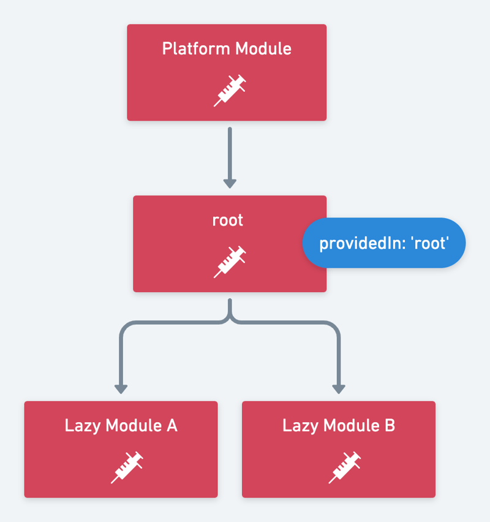 

这使得该服务**对整个应用可用，不论该服务是通过延迟加载还是直接加载**

如果**服务从未被使用，它将不会被添加到最终的构建中**（摇树优化）

```typescript
@Injectable({
  providedIn: 'root'
})
export class MyService {}
```


==`'any'`：每个懒加载模块都会有服务的一个新实例==

希望**每个延迟加载（懒加载）的模块拥有服务的独立实例**时，可以使用 `providedIn: 'any'`

不同模块需要不同的状态或隔离的逻辑，彼此独立使用

```typescript
@Injectable({  
   providedIn: 'any'
})
export class SomeService {}
```

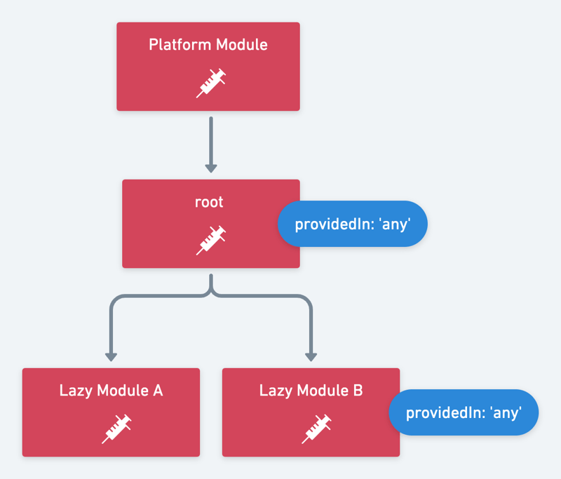 

所有**预先加载的模块共享一个单例实例**（由根模块 injector 提供），但是**每个延迟加载的模块都有自己唯一的实例**

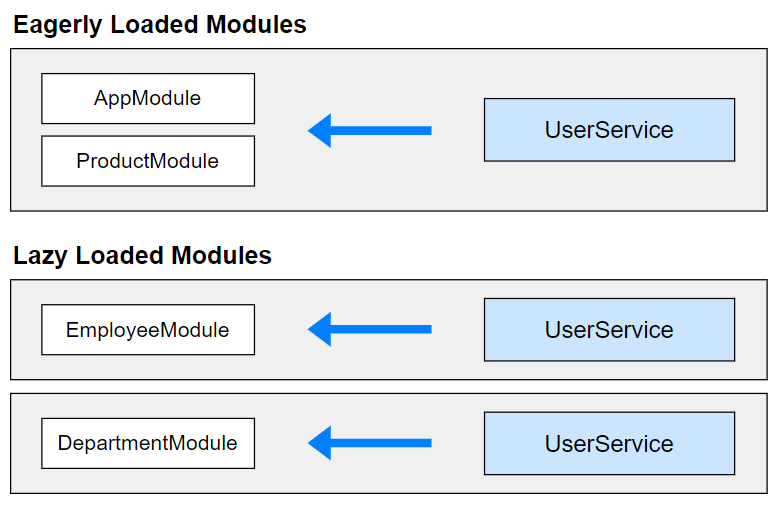 


==`'platform'`：在整个平台上提供服务，包括所有模块和懒加载模块也可以共享同一个服务实例==

服务**在平台级别共享**，即服务在应用生命周期内只有一个实例，**跨应用和模块共享一个实例**

当有多个应用或模块需要共享状态时，比 `'root'` 的作用范围更大，适合非常广泛的场景

```typescript
@Injectable({
  providedIn: 'platform'
})
export class MyService {}
```

需要加载多个 Angular 平台实例，可能需要一个服务在整个平台（包括所有子应用和懒加载模块）中共享

比如全局的配置服务、全局缓存服务等

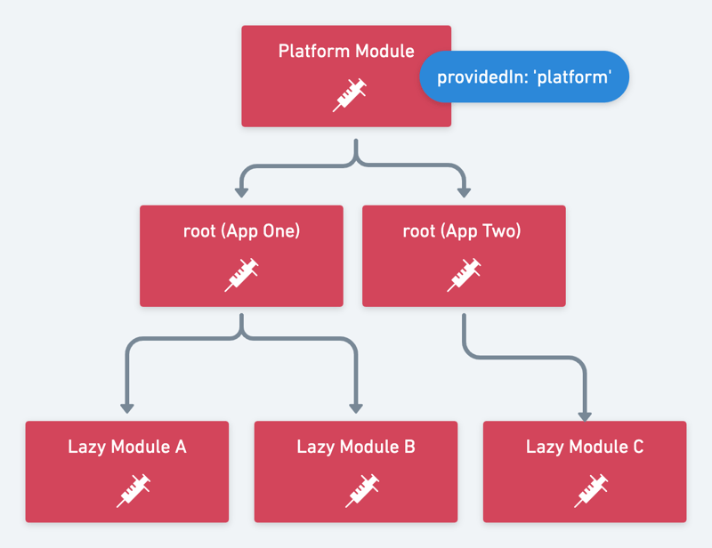 


## 依赖注入

服务的实例对象由 Angular 框架中内置的依赖注入系统创建和维护。服务是依赖需要被注入到组件中。

**组件需要通过 `constructor` 构造函数的参数来获取服务的实例对象**

 

注入器也是可以分级别的，应用级，模块级，组件级。应用范围不同。大部分只需要注册到应用级别

不同的注入器返回不同的实例对象

服务实例的查找类似函数作用域链，当前级别找到就用当前级别，找不到就去父级查找

服务**默认是单例模式**。这也是为什么**服务可以用来在组件之间共享数据和逻辑的原因**

模块中注入

在需要注入的服务上标记 `@Injectable()`

```typescript
// @Injectable()标记为可供注入的服务
@Injectable()
class Product {
  constructor(private name: string, private color: string) { }
}
@Injectable()
class PurchaseOrder {
  constructor(private product: Product) { }
}
```

标识符中注入

```typescript
// 直接通过标识符
@NgModule( {
  providers: [
    // useClass模式的直接写入就可以
    PurchaseOrder
    // { provider: PurchaseOrder, useClass: PurchaseOrder }
  ],
})
```

工厂模式注入

```typescript
// 工厂模式
@NgModule( {
  providers: [ 
	{
		provide: Product,
		useFactory: () => {
		    return new Product( "大米手机" );
		  },
		deps: []
	}
 ],
})
```

`Token` 注入

```typescript
// 使用Token作为标识
const token = new InjectionToken<string>('BaseUrl');
@NgModule( {
  providers: [ 
    {
      provide: token,
      useValue:'http://localhost'
      // useValue 也可以是对象
      /*
        useValue: Object.freeze({
        	APIKEY: "API123456",
        	APISCRET: "100-222-333"
    	})
    	*/
    }
  ],
} )

// 使用Token依赖注入
constructor(@Inject(token) private baseUrl:string){ }
```

使用 `Injector` 手动注入

```typescript
import { Injector } from '@angular/core';

// @Injectable()标记为可供注入的服务
@Injectable()
class Product {
  constructor(private name: string, private color: string) { }
}
@Injectable()
class PurchaseOrder {
  constructor(private product: Product) { }
}

export class HomeGrandComponent implements OnInit {
  ngOnInit() {
    // 使用Injector依赖注入
    // 默认是单例模式 所有的对象都已经创建好了
    const injector = Injector.create({
      // providers数组里去描述服务怎么去创建
      providers: [
        {
          // provide 设置标识符 需要依赖这个服务的时候用来匹配到这里
          provide: Product,
          // useClass 直接new这个类
          // useClass: Product,
          // useExisting 使用现存的已经实例化的
          // useValue 不想注入类，只想注入一个字符串等
          // useFactory 工厂模式
          useFactory: () => {
            return new Product('大米手机', '黑色');
          },
          // deps 描述要创建的这个对象的依赖性
          //（不是要完全实现对象的构造函数，而是如果还依赖providers里面的其他东西，则在这里去提供）
          deps: []
        },
        { 
          provide: PurchaseOrder,
          deps: [Product]
        }
      ]
    });
    console.log(injector.get(PurchaseOrder).getProduct);
  }
}
```


### inject 函数注入

`inject()` 函数是在**运行时**动态获取依赖的工具，它**只能在注入上下文中使用**

```typescript
// 在类的构造函数中调用 `inject()` 是有效的
export class MyService {
  private readonly httpClient = inject(HttpClient);  // 这是有效的注入上下文
  constructor() {
    // 也可以在构造函数内使用 inject()
  }
}
```


如果在没有注入上下文的地方使用 `inject()`，会抛出错误

```typescript
export class MyComponent implements OnInit {
  ngOnInit() {
    const service = inject(SomeService);  // 错误：注入上下文不可用
  }
}
```

> 使用 `inject()` 赋值属性的优点：**减少构造函数参数的复杂性**
>
> 直接在类的属性中使用 `inject()` 可以避免构造函数中大量的参数声明，代码看起来更简洁，特别是在**继承导致的依赖问题**
>
> 通过 `inject()`，可以绕过构造函数注入，直接在类的属性上注入依赖
>
> 无需仅仅为了依赖注入而显式定义构造函数
>
> **继承关系中的子类不需要通过构造函数传递父类的依赖**，这让代码更简洁并避免了可能的错误
>
> ```typescript
> export class BaseCarsComponent {
> private readonly store = inject(StoreService);
> public readonly luckyNumbers$ = this.store.luckyNumbers$;
> }
> ```
>
> ```typescript
> // 无需将任何参数传递给 super 调用
> export class CarsComponent extends BaseCarsComponent implements OnInit {
> ngOnInit() {
>  this.luckyNumbers$.subscribe(console.log);
> }
> }
> ```


使用 `inject()` 函数可以正确推断依赖项的类型

```typescript
export class AppComponent {
  constructor(
  @Inject(SECRET) private readonly secret, // inferred type: any
  ) {}
}
export class AppComponent {
  private readonly secret = inject(SECRET); // inferred type: string
}
```


在**工厂模式注入中使用 `inject()`** 获取依赖项是有效的，这使得在提供服务时，可以轻松注入其他依赖

```typescript
export const SECRET = new InjectionToken<string>('SECRET');
// 当 deps 数组中有多个条目时, 依赖的顺序要对应于工厂函数的参数列表，冗长、容易出错
export function provideSecret(): FactoryProvider {
  return {
    provide: SECRET,
    useFactory: ({ secret }: StoreService) => secret,
    deps: [StoreService],
  };
}
// 使用 inject 函数来获取给定注入令牌的值
export function provideSecret(): FactoryProvider {
  return {
    provide: SECRET,
    useFactory: () => inject(StoreService).secret,
  };
}
```

在**创建 `InjectionToken` 时使用 `inject()`** 来获取依赖

```typescript
export const SECRET = new InjectionToken<string>('SECRET', {
  factory: () => inject(StoreService).secret,
});
```


使用 `inject()` 函数的常规 JavaScript 函数可以称为 **DI 函数**，DI 函数可以封装一个需要访问**依赖注入机制的可重用逻辑**

```typescript
export function useMaskedSecret(): string {
  const { secret } = inject(StoreService);
  return secret.slice(0, secret.length / 2).padEnd(secret.length, '*');
}
export function useLuckyNumbers$(): Observable<string> {
  return inject(StoreService).luckyNumbers$.pipe(
    reduce((acc, next) => [...acc, next], [] as number[]),
    map((luckyNumbers) => luckyNumbers.join(', ')),
    takeUntilDestroyed()		// 允许注册 DestroyRef 服务，可以识别封闭上下文何时被销毁
  );
}
export class AppComponent {
  public readonly maskedSecret = useMaskedSecret();
  public readonly luckyNumbers$ = useLuckyNumbers$();
}
```

```typescript
export const SECRET = new InjectionToken('SECRET', {
  factory: () => 'root secret',
});
export function secretLogger() {
  const secret = inject(SECRET);
  console.log({ secret });
}
// 在子组件级别提供令牌也可以正确解析其依赖项
@Component({
  providers: [{ provide: SECRET, useValue: 'HomeComponent secret' }],
})
export class HomeComponent implements OnInit {
  constructor() {
    secretLogger();
    // {secret: 'HomeComponent secret'}
  }
}
```

DI 函数同样也必须在注入上下文中调用，如果**需要在其他上下文中调用**它，可以**使用 `runInInjectionContext` 辅助函数**

```typescript
export class AppComponent implements OnInit {
  private readonly injector = inject(Injector);
  ngOnInit() {
    // inject() must be called from an injection context
    // const maskedSecret = useMaskedSecret();
    const maskedSecret = runInInjectionContext(this.injector, useMaskedSecret);
  }
}
```


`inject()` 函数接受两个参数：注入的服务或依赖项的令牌，和解析修饰符配置对象

```typescript
export class AppComponent {
  private readonly secret = inject(SECRET, {
    host: false,
    optional: false,
    self: false,
    skipSelf: false,
  });
}
```

> - `optional`：表示依赖项是可选的，如果无法找到这个服务，不会抛出错误，而是将该依赖解析为 `null`
> - `self`：限定仅在当前的 `ElementInjector` 中查找依赖，如果当前注入器中没有该服务，不会继续向上查找父注入器
> - `skipSelf`：跳过当前的 `ElementInjector`，从父注入器开始查找依赖，适用于希望避免当前级别注入器提供的服务
> - `host`：将依赖查找限制在宿主元素的注入器中，如果在宿主元素的注入器中找不到，不会继续向上查找


为了增强调试，提供了 `assertInInjectionContext(debugFn: Function)` 辅助函数，用来检查代码是否处于一个可以使用依赖注入的环境中

```typescript
// 有助于开发者更容易定位在非 DI 上下文中意外使用依赖注入时的错误
export function useMaskedSecret(): string {
  assertInInjectionContext(useMaskedSecret);
  // without: inject() must be called from an injection context
  // with: useMaskedSecret() can only be used within an injection context
  const { secret } = inject(StoreService);
  return secret.slice(0, secret.length / 2).padEnd(secret.length, '*');
}
```


`TestBed` 提供了 `TestBed.runInInjectionContext` 方法，用于为  DI 函数模拟依赖注入上下文

在某些情况下，测试代码可能不在 Angular 的依赖注入上下文中直接运行，因此无法使用 `inject()` 函数

`TestBed.runInInjectionContext` 提供了一种方式来手动创建这个上下文，使得可以在测试中使用依赖注入

```typescript
// 确保调用的 DI 函数运行在 Angular 的依赖注入上下文中
it('should return masked secret', () => {
  TestBed.runInInjectionContext(() => {
    const maskedSecret = useMaskedSecret();
    expect(maskedSecret).toBe('****');
  });
});
```


## Http 数据交互

### HTTP 方法配置

app.module.ts 中导入 `HttpClientModule`

- **只在根模块中导入**
- 整个应用**只需导入一次**，不要再其他模块导入

```typescript
import { HttpClientModule } from '@angular/common/http';

imports: [
  HttpClientModule
]
```

**使用到的地方引入 `HttpClient`** 并在构造函数声明

```typescript
// 当做一个服务
import { HttpClient } from '@angular/common/http';

// 依赖注入
constructor(public http: HttpClient) { }
```


### 请求方法

`get` / `post` / `put` / `delete` 方法对应于 Http 方法

```typescript
this.http.get(url [, options]);
this.http.post(url, data [, options]);
this.http.delete(url [, options]);
this.http.put(url, data [, options]);
```

这些方法是**泛型**的，可以直接把返回的 JSON 转换成对应类型

不规范的请求，使用 `request` 方法

**返回的值是 `Observable`**

```typescript
this.http.get<Post[]>('/getAllPosts').subscribe(response => console.log(response))
```

**必须订阅，才会发生请求**，否则不会发送 

- ##### 数据请求

  ```typescript
  public list:any[]=[];
  getData() {
  	// 服务器必须允许跨域
  	let api="http://a.itying.com/api/productlist";
      // 使用rxjs
  	this.http.get<Product[]>(api, params: { category: '手机' })
      .subscribe((response:any)=>{
  	    console.log(response);
  	    this.list = response.result;
  	})
  }
  ```

- ##### 数据提交

  ```typescript
  import { HttpClient, HttpHeaders } from "@angular/common/http";
  
  constructor(public http:HttpClient) { }
  
  doLogin(){
    //手动设置请求的类型
    const httpOptions = {
      headers: new HttpHeaders({ 'Content-Type': 'application/json' })
    };
    var api = "http://127.0.0.1:3000/doLogin";
    this.http.post(api, {username:'张三', age:'20'}, httpOptions).subscribe(response => {
      console.log(response);
    });   
  }
  ```

- ##### `Jsonp` 请求数据

  `Jsonp` 配置：在 app.module.ts 中引入 `HttpClientModule`、`HttpClientJsonpModul` 并注入

  ```typescript
  import { HttpClientModule, HttpClientJsonpModule } from '@angular/common/http';
  ```
  
  ```typescript
  imports: [
  	BrowserModule,
  	HttpClientModule,
  	HttpClientJsonpModule
  ]
  ```
  
  `jsonp` 请求数据

  ```typescript
  import {HttpClient} from "@angular/common/http";
  
  constructor(public http:HttpClient) { }
  
  getJsonpData(){
  	//jsonp请求 服务器必须得支持jsonp
  	let api="http://a.itying.com/api/productlist";
  	this.http.jsonp(api,'callback').subscribe((response)=>{
  	  console.log(response);
  	})
  }
  ```
  
- ##### `axios` 请求数据

  安装 `axios`

  ```bash
  npm install axios --save
  ```

  ```typescript
  // 引入axios
  import axios from 'axios';
  
  axiosGet(api:string){
    return new Promise((resolve,reject)=>{
      axios.get(api).then(function (response:any) {
        resolve(response)
      });
    })
  }
  
  getAxiosData(){
    console.log('axios获取数据');
    let api="http://a.itying.com/api/productlist";
    this.httpService.axiosGet(api).then((data)=>{
      console.log(data)
    })
  }
  ```


### 请求参数

- ##### `HttpParams` 类

  ```typescript
  import { HttpParams } from '@angular/common/http';
  
  // 请求参数以对象的形式传递
  let params = new HttpParams({ fromObject: { name: "zhangsan", age: "20" } });
  // HttpParams内的append、set等方法的返回值都是HttpParams
  params = params.append("sex", "male");
  // 以查询参数的形式传递
  let params = new HttpParams({ fromString: "name=zhangsan&age=20" })
  
  this.http.get("/users", {
    // params: params 的简写
    params
  }).subscribe(console.log)
  ```


### 请求头

- ##### `HttpHeaders`

  ```typescript
  import { HttpHeaders } from '@angular/common/http';
  
  let headers = new HttpHeaders({
    test: "Hello"
  })
  
  this.http.get("/users", {
    // headers: headers 的简写
    headers
  }).subscribe(console.log)
  ```


### 响应内容

- ##### `HttpObserve`

  ```typescript
  // type HttpObserve = 'body' | 'response'
  // response 读取完整响应体
  // body 读取服务器端返回的数据
  
  this.http.get("/users", {
    // 默认是 body
    // observe: 'body'
    observe: 'response'
  }).subscribe(console.log)
  ```
  
   
  
   


## 拦截器

 

- 拦截器是 Angular 应用中**全局捕获和修改 HTTP 请求和响应的方式**（添加 Token，捕获 Error）


- 拦截器将只拦截 `HttpClientModule` 模块发出的请求


- 创建拦截器

  ```bash
  ng g interceptor <name> 
  ```


### 请求拦截

```typescript
import { Injectable } from '@angular/core';
import { HttpInterceptor, HttpHandler, HttpRequest } from '@angular/common/http';

@Injectable()
export class ParamInterceptor implements HttpInterceptor {
  // 拦截方法 参数1: 请求(泛型指定的是请求体的类型) 参数2: 下一步的处理
  intercept(req: HttpRequest<any>, next: HttpHandler) {
    // 对请求消息进行处理
    // 请求不能直接修改 克隆去修改请求
    const modifiedReq = req.clone({
      // 统一添加请求路径前缀
      setParams: { icode: environment.icode },
      // 统一添加Token
      setHeaders: { Authorization: "Bearer XXXX" }
    });
    // 把修改后的请求回传给应用
    return next.handle(modifiedReq);
  }
}
```

根模块引入

```typescript
import { HTTP_INTERCEPTORS } from '@angular/common/http';
@NgModule({
  providers: [
    // 多个令牌 multi: true
    { provide: HTTP_INTERCEPTORS, useClass: ParamInterceptor, multi: true }
  ]
})
```


### JWT 身份验证

利用 HTTP 拦截器向 API 请求添加身份验证标头

```typescript
import { Injectable } from '@angular/core';
import { HttpInterceptor, HttpRequest, HttpHandler, HttpEvent } from '@angular/common/http';
import { Observable, throwError } from 'rxjs';
import { catchError } from 'rxjs/operators';
import { Router } from '@angular/router';

@Injectable()
export class AuthInterceptor implements HttpInterceptor {
  constructor(private router: Router) {}

  intercept(request: HttpRequest<any>, next: HttpHandler): Observable<HttpEvent<any>> {
    // 获取存储在本地存储中的认证令牌
    const authToken = localStorage.getItem('authToken');

    // 如果认证令牌存在，则向请求标头中添加认证标头
    if (authToken) {
      request = request.clone({
        setHeaders: {
          Authorization: `Bearer ${authToken}`
        }
      });
    } else {
      // 如果没有认证令牌，则重定向到登录页
      this.router.navigate(['/login']);
      // 停止发送请求
      return throwError('No authentication token found.');
    }

    // 继续处理请求
    return next.handle(request).pipe(
      catchError(error => {
        // 在请求发生错误时执行适当的处理
        // 这里可以进行错误日志记录等操作
        return throwError(error);
      })
    );
  }
}

```

```typescript
@NgModule({
  imports: [HttpClientModule],
  providers: [
    { provide: HTTP_INTERCEPTORS, useClass: AuthInterceptor, multi: true }
  ]
})
export class AppModule { }
```


### 跨站点请求伪造保护 CSRF

实现 CSRF 令牌并确保它们包含在每个 HTTP 请求中，以验证用户操作，后端服务器应生成并提供 CSRF 令牌，前端在后续请求中发送该令牌

```typescript
import { Injectable } from '@angular/core';
import { HttpInterceptor, HttpHandler, HttpRequest } from '@angular/common/http';

@Injectable()
export class CsrfInterceptor implements HttpInterceptor {

  intercept(request: HttpRequest<any>, next: HttpHandler) {
    // Get the CSRF token from a secure source, e.g., cookie or server response
    const csrfToken = 'your-csrf-token';

    // Append CSRF token to the request headers
    request = request.clone({
      setHeaders: { 
        'X-CSRF-TOKEN': csrfToken,
      },
    });

    return next.handle(request);
  }
}
```

```typescript
@NgModule({
  imports: [HttpClientModule],
  providers: [
    { provide: HTTP_INTERCEPTORS, useClass: CsrfInterceptor, multi: true },
  ],
})
export class MyModule {}
```


### 响应拦截

```typescript
import { Injectable } from '@angular/core';
import { HttpEvent, HttpInterceptor, HttpHandler, HttpRequest } from '@angular/common/http';
import { tap } from 'rxjs/operators';

@Injectable()
export class ParamInterceptor implements HttpInterceptor {
  // 拦截方法 参数1: 请求 参数2: 下一步的处理
  intercept(req: HttpRequest<any>, next: HttpHandler) {
    // 对响应消息进行处理
    return next.handle(req).pipe(
      tap((event: HttpEvent<any>) => {
        if ( event instanceof HttpResponse && event.status >= 200 && event.status < 300 ) {
          console.log('[此处假装弹出消息] 请求成功！');
        }
      })
    );
  }
}
```

根模块引入

```typescript
import { HTTP_INTERCEPTORS } from '@angular/common/http';
@NgModule({
  providers: [
    // 多个令牌 multi: true
    { provide: HTTP_INTERCEPTORS, useClass: NotificationInterceptor, multi: true }
  ]
})
```


## 应用程序初始化器

> - 应用程序初始化器 (App Initializer) 是在**应用程序启动前执行的函数**，使用名为 `APP_INITIALIZER` 的依赖标记来提供这些函数
> - 可以提供多个函数，**在根应用程序模块的提供程序中提供**，这些函数将在启动应用程序前执行
> - 函数返回一个 `Promise` / `Observable`，并且仅当此 `Promise` 被解析时，应用程序才会引导
>
> 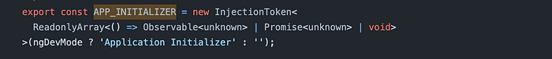 
>
> - 应用程序初始化器可用于许多功能：
>   - 加载配置设置： 从服务器获取某些配置设置。例如，API 端点、语言设置或任何其他运行时配置
>   - 初始化服务： 在应用程序准备就绪前执行初始化逻辑。例如，初始化日志记录器服务
>   - 身份验证和授权：检查用户是否通过身份验证并获得应用程序的授权

-  创建工厂函数

  ```typescript
  import { ConfigService } from './config.service';
  
  export function initializeApp(configService: ConfigService): () => Promise<any> {
    return () => configService.loadConfig();
  }
  ```

- 使用 `APP_INITIALIZER` Token 在根模块上注册创建的函数

  ```typescript
  @NgModule({
    providers: [
      ConfigService,
      {
        provide: APP_INITIALIZER,
        useFactory: initializeApp,
        deps: [ConfigService],
        multi: true
      }
    ],
    bootstrap: [AppComponent]
  })
  export class AppModule { }
  ```

> 注意：`APP_INITIALIZER` 不会阻止 `AppModule` 的初始化
>
> 当 `imports` 数组中有一个具有 `forRoot()` 方法的模块，并且想要向其中传递一些在 `APP_INITIALIZER` 中加载的数据时，
>
> 例如：`APP_INITIALIZER` 中提供用于加载 API 端点函数，导入的其他模块又需要 `APP_INITIALIZER` 提供的当前环境的 API URL
>
> **在 `APP_INITIALIZER` 结束之前， `AppModule` 中导入模块的实例化不会被阻止**。所以无法为这些模块提供依赖于环境的变量
>
> 解决方案：
>
> - main.ts 文件中使用 `platformBrowserDynamic` 函数传递额外的 `provider`
>
>   ```typescript
>   import { enableProdMode } from '@angular/core';
>   import { platformBrowserDynamic } from '@angular/platform-browser-dynamic';
>   import { environment } from './environments/environment';
>   import { AppConfig, APP_CONFIG } from '...';
>   import { AppModule } from './app/app.module';
>   
>   fetch('<your-config-json-or-url>')
>     .then((res) => res.json())
>     .then((config) => {
>     if (environment.production) {
>       enableProdMode();
>     }
>     platformBrowserDynamic([{ provide: APP_CONFIG, useValue: config }])
>       .bootstrapModule(AppModule)
>       .catch((err) => console.error(err));
>   });
>   ```
>
>   ```typescript
>   export const APP_CONFIG = new InjectionToken<AppConfig>('app.config');
>   ```
>
> - 放弃使用 `forRoot()` 方法来处理应用启动解析的数据，通过提供 `InjectionToken`，在需要的地方依赖注入获取使用
>
>   ```typescript
>   constructor(@Inject(APP_CONFIG) config: AppConfig) {
>     // use your config
>   }
>   ```
>
>   ```typescript
>   @NgModule({
>     providers: [
>       {
>         provide: APP_INSIGHTS_CONFIG,
>         useFactory: (config: AppConfig) => config.applicationInsights,
>         deps: [APP_CONFIG],
>       },
>     ],
>     bootstrap: [AppComponent],
>   })
>   export class AppModule {}
>   ```


## 代理

**解决跨域问题**

1. 在项目的根目录下创建 proxy.conf.json 文件并加入如下代码

   ```json
   {
     "/api/*": {
       "target": "http://localhost: 3070",
       "secure": false,
       "changeOrigin": true
     }
   }
   ```

   - `/api/*`：在应用中发出的以 `/api/` 开头的请求走此代理

     应用中的 `http` 请求 api 地址也不需要写前缀，直接以 `/api` 开头

     ```typescript
     // this.http.get("http://localhost:3005/api/hello")
     this.http.get("/api/hello")
     ```

   - `target`：服务器端 URL

   - `secure`：如果服务器端 URL 的协议是 `https`，此项需要为 `true`

   - `changeOrigin`：如果服务器端不是 `localhost`，此项需要为 `true`

2. 指定 `proxy` 配置文件

   方式一 package.json 指定

   ```json
   "scripts": {
     "start": "ng serve --proxy-config proxy.conf.json"
   }
   ```

   方式二 angular.json 指定

   ```json
   "serve": {
     "options": {
       "proxyConfig": "proxy.conf.json"
     }
   }
   ```


## 事件服务

> **Angular是如何管理事件**：
>
> 当使用以下方法之一添加事件时：
>
> 1. 通过使用 Angular 事件绑定将其注册到模板中
> 2. 使用 `HostListener()` 装饰器
>
> Angular 会调用 `Renderer` 的 `listen()` 方法
>
> ```typescript
> listen(target, event, callback) {
>   if (typeof target === 'string') {
>     return this.eventManager.addGlobalEventListener(
>       target, event, decoratePreventDefault(callback));
>   }
>   return this.eventManager.addEventListener(
>     target, event, decoratePreventDefault(callback));
> }
> ```
>
> 实际上是将事件注册委托给了一个称为 `eventManager` 的服务
>
> `EventManager` 是一个可注入的服务，通过浏览器插件为 Angular **提供事件管理**


## 浏览器 API

### DOM 交互

- `ElementRef` 允许在组件类中直接访问组件模板中的 DOM 元素，使用 `ElementRef`，需要注入到组件的构造函数中

  ```typescript
  import { Component, ElementRef } from '@angular/core';
  
  export class MyComponent {
    constructor(private elementRef: ElementRef) {} 
  }
  ```

- `nativeElement` 属性允许直接访问组件模板中与组件本身相对应的主 DOM 元素的引用

- `Renderer2` 抽象出直接的 DOM 操作，以确保应用程序与平台无关

  ```typescript
  @Component({
    selector: 'app-my-component',
    template: '<div #myDiv>My Div</div>',
  })
  export class MyComponent implements AfterViewInit {
    constructor(private elementRef: ElementRef, private renderer: Renderer2) {}
    ngAfterViewInit() {
      this.renderer.setStyle(this.el.nativeElement, 'color', 'blue');
    }
  }
  ```


### 地理位置

> 必须确保网站通过 HTTPS 提供服务，因为大多数浏览器只允许在安全的源上访问地理位置 API

1. 更新 Angular 应用权限：在 src/polyfills.ts 文件中添加以下内容

   ```typescript
   /** Geolocation API **/
   navigator.geolocation;
   ```

2. 创建服务来封装地理定位功能，地理位置 API 是异步的，取决于用户是否授予权限

   > 用户可能拒绝访问位置，需要适当处理错误

   > 可以考虑使用 @angular/google-maps 等库实现高级功能

   ```typescript
   @Injectable({
     providedIn: 'root'
   })
   export class GeolocationService {
     constructor() { }
     getCurrentPosition(): Observable<GeolocationPosition> {
       return new Observable((observer) => {
         if (navigator.geolocation) {
           navigator.geolocation.getCurrentPosition(
             (position) => {
               observer.next(position);
               observer.complete();
             },
             (error) => {
               observer.error(error);
             }
           );
         } else {
           observer.error('Geolocation not supported.');
         }
       });
     }
   }
   ```

   ```typescript
   @Component({
     selector: 'app-location',
     template: `
       <div>
         <p>Latitude: {{ latitude }}</p>
         <p>Longitude: {{ longitude }}</p>
       </div>
     `
   })
   export class LocationComponent implements OnInit {
     public latitude: number;
     public longitude: number;
     public constructor(private geolocationService: GeolocationService) {}
     public ngOnInit(): void {
       this.geolocationService.getCurrentPosition().subscribe(
         (position) => {
           this.latitude = position.coords.latitude;
           this.longitude = position.coords.longitude;
         },
         (error) => {
           console.error('Error obtaining geolocation', error);
         }
       );
     }
   }
   ```


### 浏览器通知

- 封装浏览器通知服务

  ```typescript
  @Injectable({
    providedIn: 'root'
  })
  export class NotificationService {
    public notify(title: string, options?: NotificationOptions): void {
  
      // 检查浏览器是否支持
      if (!('Notification' in window)) {
        console.log('This browser does not support desktop notification');
        return;
      }
  
      // 要显示通知，必须向用户申请并获得许可
      // 通知权限有三种可能的状态：默认`default`、授予`granted`和 拒绝`denied`
      if (Notification.permission === 'granted') {
        new Notification(title, options);
      } else if (Notification.permission !== 'denied') {
        Notification.requestPermission().then(permission => {
          if (permission === 'granted') {
            new Notification(title, options);
          }
        });
      }
    }
  }
  ```

  ```typescript
  export class YourComponent {
    constructor(private notificationService: NotificationService) {}
    someMethod() {
      this.notificationService.notify('Test Notification', { body: 'This is a test message' });
    }
  }
  ```


### 是否为浏览器环境

- 可以使用 `isPlatformBrowser` 函数有条件地运行特定于浏览器的代码

  ```typescript
  import { isPlatformBrowser } from '@angular/common';
  import { PLATFORM_ID } from '@angular/core';
  export class YourComponent {
    constructor(@Inject(PLATFORM_ID) private platformId: object) {
      if (isPlatformBrowser(this.platformId)) {
        // Browser-specific code
      }
    }
  }
  ```


### Web Worker

> - Web workers 被用于在后台线程中运行任何脚本，而不会干扰用户界面
>
> - 如果在用户端有繁重的计算任务，可以使用 web workers 来执行这些繁重的任务，以避免阻塞主线程，从而提高用户界面的响应性
>
> - Web Worker 可以通过与主线程之间的消息传递机制进行通信，以便传递数据和执行任务，但是不能直接访问页面的 DOM 元素或全局变量

1. 使用 CLI 创建 Web worker

   ```bash
   ng generate web-worker <location>
   ```

2. 自动创建 tsconfig.worker.json

   ```json
   /* To learn more about this file see: https://angular.io/config/tsconfig. */
   {
     "extends": "./tsconfig.json",
     "compilerOptions": {
       "outDir": "./out-tsc/worker",
       "lib": [
         "es2018",
         "webworker"
       ],
       "types": []
     },
     "include": [
       "src/**/*.worker.ts"
     ]
   }
   ```

3. 自动创建 app.worker.ts，从 Web Worker 获取响应

   ```typescript
   /// <reference lib="webworker" />
   addEventListener('message', ({ data }) => {
     const response = `worker response to ${data}`;
     postMessage(response);
   });
   ```

4. 在 angular.json 中，将 `"webWorkerTsConfig": "tsconfig.worker.json"` 添加到 `build` > `options` 中，为 Web Worker 注册生成的 tsconfig 文件

5. 使用 Web Worker

   ```typescript
   // app.worker.ts
   /// <reference lib="webworker" />
   
   addEventListener('message', ({ data }) => {
     const response = factorialCalculator(data);
     // worker.postMessage(factorialInput) 向 Web worker 发送数据
     postMessage(response);
   });
   
   function factorialCalculator(num: number): number {
     if (num < 0) {
       return -1;
     } else if (num == 0) {
       return 1;
     } else {
       return (num * factorialCalculator(num - 1));
     }
   }
   ```

   ```typescript
   @Component({
     selector: 'app-root',
     template: `
       <input type="number" [(ngModel)]="factorialInput" (change)="calculateFactorial()"/>
       <div>The response is {{ factorialResult }}</div>
   	`,
   })
   export class AppComponent {
     factorialResult!: number;
     factorialInput: number = 1;
   
     constructor() {
       this.calculateFactorial();
     }
   
     calculateFactorial() {
       if (typeof Worker !== 'undefined') {
         // Create a new
         const worker = new Worker(new URL('./app.worker', import.meta.url));
         // worker.onmessage 属性中接收来自 worker 的响应
         worker.onmessage = ({ data }) => {
           this.factorialResult = data;
         };
         worker.postMessage(this.factorialInput);
       } else {
         // Web Workers are not supported in this environment.
         // You should add a fallback so that your program still executes correctly.
       }
     }
   }
   ```


### Service Worker

> - Service Worker 是一种特殊的 JavaScript 脚本，运行在浏览器的后台，并在页面关闭后仍然保持活动状态
> - 主要用于实现离线缓存、推送通知、网络代理等功能
> - Service Worker 可以拦截页面发出的网络请求，并决定是否从缓存中获取响应，从而实现离线访问和提高网站性能
> - Service Worker 通常用于构建渐进式网络应用程序 （PWA）

#### 配置注册

1. 安装 service-worker 和 pwa 依赖包

   ```bash
   npm install @angular/service-worker
   ng add @angular/pwa
   ```

2. 在 main.ts 文件中注册 Service Worker

   ```typescript
   import { enableProdMode } from '@angular/core';
   import { platformBrowserDynamic } from '@angular/platform-browser-dynamic';
   import { AppModule } from './app/app.module';
   import { environment } from './environments/environment';
   
   if (environment.production) {
     enableProdMode();
   }
   
   // Register the Service Worker
   if ('serviceWorker' in navigator) {
     navigator.serviceWorker.register('/ngsw-worker.js')
       .then(() => {
       console.log('Service Worker registered successfully!');
     })
       .catch((error) => {
       console.error('Error registering Service Worker:', error);
     });
   }
   
   platformBrowserDynamic().bootstrapModule(AppModule)
     .catch((err) => console.error(err));
   ```

3. 在 ngsw-config.json 文件中，定义 `assetGroups` 指定应缓存哪些文件

   >  Service Worker 可以在用户的设备上缓存静态资产，通过缓存 HTML、CSS、JavaScript 和图像等基本文件，可以确保的应用程序快速加载

   ```json
   {
     "index": "/index.html",
     "assetGroups": [
       {
         "name": "app",
         "installMode": "prefetch",		// 采用预取模式确保尽快缓存
         "resources": {
           "files": [
             "/favicon.ico",
             "/index.html",
             "/*.css",
             "/*.js"
           ]
         }
       },
       {
         "name": "images",
         "installMode": "lazy",		// 采用lazy模式仅在请求时缓存
         "updateMode": "prefetch",
         "resources": {
           "files": [
             "/assets/**",
             "/*.(png|jpg|jpeg|gif)"
           ]
         }
       }
     ]
   }
   ```


#### 缓存控制

Service Worker 允许在用户首次访问时缓存必要的资源，然后在用户脱机时从缓存中提供这些资源，启动离线功能

- 缓存优先策略

  将拦截应用发出的所有提取请求，首先检查缓存中是否已经存在请求的资源，如果存在，从缓存中提供。否则，从网络获取

  ```typescript
  // In your Service Worker script
  self.addEventListener('fetch', (event) => {
    event.respondWith(
      caches.match(event.request).then((response) => {
        return response || fetch(event.request);
      })
    );
  });
  ```

- 网络优先策略

  首先尝试从网络获取资源，如果网络请求成功，响应将返回到应用，如果网络请求失败，则从缓存中提供资源

  ```typescript
  // In your Service Worker script
  self.addEventListener('fetch', (event) => {
    event.respondWith(
      fetch(event.request).catch(() => {
        return caches.match(event.request);
      })
    );
  });
  ```

- 缓存到期的控制（Stale-While-Revalidate 策略）

  请求资源时，Service Worker 首先提供缓存的版本（如果可用），同时发起网络请求以获取最新版本

  缓存版本会立即显示给用户，提供快速响应，网络响应会在后台更新缓存以备将来请求

  ```typescript
  // In your Service Worker script
  self.addEventListener('fetch', (event) => {
    event.respondWith(
      caches.open('my-cache').then((cache) => {
        return cache.match(event.request).then((response) => {
          const fetchPromise = fetch(event.request).then((networkResponse) => {
            cache.put(event.request, networkResponse.clone());
            return networkResponse;
          });
          return response || fetchPromise;
        });
      })
    );
  });
  
  ```


#### 推送通知

Service Workers 能够处理推送通知并将其传送到用户的设备，即使应用未主动运行也是如此

- 请求用户权限

  在发送推送通知之前，需要请求用户的权限

  ```typescript
  // In your Angular component
  if ('Notification' in window) {
    Notification.requestPermission().then((permission) => {
      if (permission === 'granted') {
        // User has granted permission
        // You can now subscribe to push notifications
      }
    });
  }
  ```

- 订阅推送通知

  一旦用户授予了权限，就可以订阅推送通知并获取一个唯一的订阅端点，然后，将此端点发送到服务器，以开始向用户发送推送通知

  ```typescript
  // In your Angular component
  if ('serviceWorker' in navigator && 'PushManager' in window) {
    navigator.serviceWorker.ready.then((registration) => {
      registration.pushManager.subscribe({ userVisibleOnly: true })
        .then((subscription) => {
          // Send the subscription endpoint to your server
        })
        .catch((error) => {
          console.error('Error subscribing to push notifications:', error);
        });
    });
  }
  ```

- 处理传入的推送通知

  当收到推送通知时，Service Worker 会拦截该通知并触发推送事件，可以侦听此事件并处理传入的推送通知

  ```typescript
  // In your Service Worker script
  self.addEventListener('push', (event) => {
    const title = 'New Notification';
    const options = {
      body: event.data.text(),
      icon: 'path/to/icon.png',
    };
  
    event.waitUntil(
      self.registration.showNotification(title, options)
    );
  });
  ```


#### 强制更新

- 监听 `controllerchange` 事件，当安装了新版本的 Service Worker 并成为活动工作线程时，将触发此事件

  ```typescript
  // In your Angular component
  if ('serviceWorker' in navigator) {
    navigator.serviceWorker.addEventListener('controllerchange', () => {
      // A new version of the Service Worker is available
      // You can display a notification to the user or refresh the app
    });
  }
  ```

- 取消注册当前 Service Worker 并重新加载页面来强制更新最新版本

  ```typescript
  // In your Angular component
  if ('serviceWorker' in navigator) {
    navigator.serviceWorker.getRegistration().then((registration) => {
      if (registration) {
        registration.unregister().then(() => {
          window.location.reload();
        });
      }
    });
  }
  ```


#### 后台同步

用户在离线时在应用中执行操作（例如提交表单），用在网络连接恢复后立即与服务器同步数据

- 在 Service Worker 脚本中注册同步事件

  ```typescript
  // In your Service Worker script
  self.addEventListener('sync', (event) => {
    if (event.tag === 'syncData') {
      event.waitUntil(syncData());
    }
  });
  ```

- 在 Angular 应用程序中调用 `registerSync` 触发后台同步

  例如，当用户在离线时提交表单时，可以注册同步事件

  ```typescript
  // In your Angular component
  if ('serviceWorker' in navigator && 'SyncManager' in window) {
    navigator.serviceWorker.ready.then((registration) => {
      return registration.sync.register('syncData');
    });
  }
  ```

  网络连接恢复后，Service Worker 将收到 `sync` 事件并调用相应的 `sync` 函数

  在此函数中可以处理与服务器的数据同步

  ```typescript
  // In your Service Worker script
  function syncData() {
   // Perform data synchronization with the server
  }
  ```

  

#### 渐进式 Web 应用 （PWA）

- 提示用户将应用添加到主屏幕

  ```html
  <!-- In your index.html -->
  <link rel="manifest" href="/manifest.json">
  ```

- 允许在后台提取数据，即使应用程序未运行，这对于预加载内容或同步数据非常有用

  ```typescript
  // In your Service Worker script
  self.addEventListener('fetch', (event) => {
    event.respondWith(
      fetch(event.request).then((response) => {
        // Cache the response for future use
        return response;
      })
    );
  });
  ```

  ```typescript
  // In your Angular component
  if ('backgroundFetch' in self.registration) {
    self.registration.backgroundFetch.fetch('myData', ['/api/data']);
  }
  ```


## 模拟响应


# 模块 Module

模块就是提供**相对独立功能的一组代码**。主要的作用就是让程序更有序，独立的功能放到独立的模块中去，让模块更好的维护。

模块的组成部分可以有：组件，服务，指令，管道等、从某种角度说，像一个小型应用

Angular 应用中至少需要一个根模块，用于启动

## 内置模块

- 需要在**每个需要的模块中进行导入的模块**

  1. `CommonModule`：提供绑定。`*ngIf` 和 `*ngFor` 等基础指令，基本上每个模块都需要导入它。
  2. `FormsModule` / `ReactiveFormsModule`：表单模块需要在每个需要的模块导入
  3. 提供组件，指令，管道的模块

- 只需要的在**根模块导入一次的模块**

  1. `HttpClientModule` / `BrowserAnimationsModule` / `NoopAnimationsModule` / `BrowserModule`

     (在**根模块不需要单独导入 `CommonModule`**，因为 `BrowserModule` 已经顺带导出了)

  2. **只提供服务的模块**

 


## 创建模块

```bash
ng g module 文件夹名/模块名
# 同时创建路由
ng g module 模块 --routing
# 创建模块直接放到已有文件夹中，不新建文件夹
ng g module 模块 --flat=true
```


## 模块结构

```typescript
@NgModule({
  // 模块拥有的组件，指令或管道。注意每个组件，指令，管道只能在一个模块中声明
  // 如果想要导入的模块已经通过其所在的模块被导入了，就不需要单独再导入这个模块
  declarations: [UserComponent],
  // 导入本模块需要的依赖模块，只能是模块
  imports: [CommonModule],
  // 暴露给其他模块使用的模块，组件，指令，管道等。
  exports:[UserComponent],
  // 模块中需要使用的服务
  providers:[CommonService],
  // 引导组件 进入这个模块后需要显示的是什么 只有根组件有这个属性
  bootstrap: [AppComponent]
})
export class AppModule { }
```

- ##### 模块导入注意点

  - 如果是**组件**，那么需要在**每一个需要模块都进行导入**
  - 如果是**服务**，那么一般来说在**根模块中导入一次即可**


## 自定义模块

项目非常庞大的时候把所有的组件都挂载到根模块里面，会导致项目加载很慢。这个时候可以自定义模块来组织项目

- ##### 自定义模块文件结构

  ```bash
  #自定义user模块
  #整体结构和根模块类似
  /app
  - /module
  -- /user
  --- /components
  ---- /address
  ----- address.component.html
  ----- address.component.ts
  ---- /order
  ----- order.component.html
  ----- order.component.ts
  --- /services
  ---- common.service.ts
  --- user.component.html
  --- user.component.ts
  --- user.module.ts
  ```

- ##### 自定义模块例

  自定义模块 user.module.ts

  ```typescript
  import { NgModule } from '@angular/core';
  import { CommonModule } from '@angular/common';
  // 导入子组件
  import { CommonService } from './services/common.service';
  import { AddressComponent } from './components/address/address.component';
  import { OrderComponent } from './components/order/order.component';
  import { UserComponent } from './user.component';
  
  @NgModule({
    // 声明user模块里面的组件
    declarations: [ProfileComponent, AddressComponent, OrderComponent, UserComponent],
    // 暴露组件 让其他模块里面可以使用暴露的组件
    exports:[UserComponent],
    providers:[CommonService],
    imports: [CommonModule]
  })
  export class UserModule { }
  ```

  根模块 app.module.ts

  ```typescript
  //引入自定义模块
  import { UserModule } from './module/user/user.module';
  
  @NgModule({
    declarations: [AppComponent, HomeComponent, NewsComponent],
    imports: [
      BrowserModule,
      FormsModule,
      HttpClientModule,
      // 在根模块引入
      UserModule
    ],
    providers: [],
    bootstrap: [AppComponent]
  })
  export class AppModule { }
  ```

  其他模块调用

  ```html
  <app-user></app-user>
  ```

   


## 动态模块

不使用路由懒加载的模式，动态加载模块

```typescript
// 定义需要动态加载的模块
import { NgModule } from '@angular/core';
import { CommonModule } from '@angular/common';
NgModule({
  declarations: [],
  exports: [],
  imports: [
    CommonModule
  ]
})
export class DynamicModule {}
```

```typescript
// 在根模块导入
@NgModule({ 
  declarations: [ AppComponent ],
  imports: [ BrowserModule, DynamicModule ],
  providers: [],
  bootstrap: [AppComponent]
})
export class AppModule {}
```

```html
<div>
  <button (click)="loadModule()">Load module</button>
  <button (click)="cLearComponent()">Clear</button>
</div>
<ng-template #container></ng-template>
```

```typescript
import { createNgModule } from '@angular/core'.

export class AppComponent {
  @ViewChild('container', { read: ViewContainerRef }) container!: ViewContainerRef;
  private componentRef!: ComponentRef<DynamicComponent>;
  constructor(private injector: Injector) {}
  
  async LoadModule() {
    // 动态加载模块
    const { DynamicModule } = await import("../components/components/dynamic/dynamic.module");
    // 返回模块实例
    const moduleRef = createNgModule(DynamicModule, this.injector);
    this.container.clear();
    // 动态加载组件到动态模块中
    this.componentRef = this.container.createComponent(DynamicComponent, { ngModuleRef: moduleRef });
  }
  
  clearComponent(){
    if (this.container){
      this.container.clear();
    }
  }
}
```


# 库 library

## 创建库

- 在现有 Angular 应用程序中生成库项目

  ```bash
  ## 创建一个名为 my-library 的新 Angular 库项目，并带有前缀 mylib
  ## my-library 项目将在应用程序的 projects/ 目录中创建
  ng generate library my-library --prefix=mylib
  ```

- 创建单独库项目

  ```bash
  ## 创建一个库，而不是一个应用程序
  ng new project-lib --no-create-application 
  cd project-lib
  ## 生成实际库项目
  ng generate library shared-lib
  ```

  ```bash
  ## 库中生成虚拟 Angular 应用程序来测试库
  ng g application testing
  ```

- 在 Angular 库中，`public-api.ts` 文件作为库的入口，**用于导出库的公共 API，确保外部应用能够访问所需的功能**

  ```typescript
  // public-api.ts
  export * from './module-name.module';
  export * from './component-name.component';
  export * from './service-name.service';
  ```

- 构建并打包库

  ```bash
  ## 构建库并在 dist/my-library 目录中创建可分发包
  ng build my-library
  ```


## 引用库

- 添加应用程序 `package.json` 文件的依赖项，在应用程序中导入并使用库

  ```json
  "my-library": "file:dist/my-library",
  ```

- 应该只在项目的根目录中有一个 `node_modules` 目录，而不是在库的目录中，如果库需要第 3 方包，应该将它们添加到根 `package.json` 的依赖项中
- 在库的 `package.json` 中，应该只添加 `peerDependencies`，这些依赖项告诉库的用户如果想要安装则需要哪些软件包


# 路由 Route

> 路由本质上是切换视图的一种机制
>
> 通过**路由插座** `<router-oulet></router-oulet>`
>
> **切换页面的时候，路由显示的内容是插入到 `router-outlet` 的同级的下方节点**，而不是在 `router-outlet` 中包含
>
> Angular 是单页程序，路由显示的路径不过是一种保存路由状态的机制，这个**路径在 web 服务器上不存在**，如果**刷新服务器可能会找不到，需要重定向对应**
>
> **路由是以模块为单位**的，每个模块都可以有自己的路由

## 路由配置

根路由 app-routing.module.ts

```typescript
// 路由是按顺序执行的
const routes: Routes = [
  //{path: 'home', component: HomeComponent},
	{path: 'news', component: NewsComponent},
	{path: 'newscontent/:id', component: NewscontentComponent},
  // 重定向
  // pathMatch：prefix 以定义的path开头；full 定义的path完全匹配
	{path: '', redirectTo: 'home', pathMatch: 'full'},
  // 匹配任意的路由（以上都不存在的情况）
  {path:'**', redirectTo: 'home'}
];
@NgModule({
  // 根路由使用 RouterModule.forRoot(routes)
  // 启用路由的 debug 跟踪模式，需要在根模块中设置 `enableTracing: true`
  // 启用Hash路由  forRoot(routes, { useHash: true })
  imports: [RouterModule.forRoot(routes, { enableTracing: true })],
  // 要导出
  exports: [RouterModule]
})
export class AppRoutingModule {}
```

根组件 app.component.html

```html
<h1>
    <!-- routerLinkActive默认选中，参数是.active类选择器css -->
    <a routerLink="/home" routerLinkActive="active">首页</a>
		<a routerLink="/news" routerLinkActive="active">新闻</a>
</h1>

<!-- 配置router-outlet 显示动态加载的路由 匹配到的路由组件会显示在这个地方 -->
<router-outlet></router-outlet>
```

子路由

```typescript
/**
 * 在功能模块中定义子路由后，只要导入该模块，等同于在根路由中直接定义
 * 也就是说在 AppModule 中导入 HomeModule 的时候，
 * 由于 HomeModule 中导入了 HomeRoutingModule
 * 在 HomeRoutingModule 中定义的路由会合并到根路由表
 * 相当于直接在根模块中定义下面的数组。
 */
const routes: Routes = [
  { path: 'home', component: HomeContainerComponent}
];
@NgModule({
  // 子路由 forChild
  imports: [RouterModule.forChild(routes)],
  exports: [RouterModule]
})
export class HomeRoutingModule {}
```


## 路由跳转

### 无参数

**URL 结果：/home**

```typescript
{ path: 'home', component: HomeComponent },
```

```html
<a routerLink="/home">首页</a>
<a [routerLink]="['/home']">首页</a>
```

```typescript
// 引入
import { Router} from '@angular/router';
// 依赖注入
constructor(public router:Router) { }
// 以根路由跳转/home
this.router.navigate(['home']);
```


### 查询参数

**URL 结果：/home?name=val1**

```html
<a [routerLink]="['/home']" [queryParams]="{name: 'val1'}">...</a>
```

```typescript
// 引入
import { Router} from '@angular/router';
// 依赖注入
constructor(public router:Router) { }
// 传入查询参数
this.router.navigate(['home'], { queryParams: {name:'val1'} });
```

**查询参数读取**

```typescript
import { ActivatedRoute } from '@angular/router';

// 获取查询参数传值
this.route.queryParamMap.subscribe((data)=>{
	console.log(data);
  console.log(data.get('name');
}
```

可以使用 `NavigationExtras` 配置传参

```typescript
// 引入NavigationExtras
import { Router, NavigationExtras} from '@angular/router';
// 用NavigationExtras 配置传参
goNewsContent(){
	let navigationExtras: NavigationExtras = {
		queryParams: { 'session_id': '123' },
		fragment: 'anchor'
	};
	this.router.navigate(['/news'], navigationExtras);
}
```


### 路径参数(必选)

路径参数是以 `:` 开头的，作为 url 的一部分

**路径参数的变化在默认的路由策略之下，不会销毁这个组件，会重用这个组件，`ngOnInit` 只走一遍**

**URL 结果：/newscontent/123**

```typescript
{ path:'newscontent/:key',component:NewscontentComponent }
```

```html
<a [routerLink]="['/newscontent/', key ]">...</a>
```

```typescript
// 注意路径参数传值, 参数写在[]里面
this.router.navigate(['newscontent', key]);
```

```typescript
// 获取动态路由传值
this.route.paramMap.subscribe((data)=>{
  console.log(data);
  console.log(data.get('key');
});
```


### 路径参数(可选)

**URL 结果：/home/sports;name=val1**

```typescript
{ path: ':tabLink', component: HomeDetailComponent }
```

```html
<!-- 有必须参数，也有可选参数. 可选参数用{}包起来-->
<a [routerLink]="['/home', tab.link, {name: 'val1'}]">...</a>
<!-- 只有必须参数
<a [routerLink]="['/home', tab.link]">...</a>
-->
```

```typescript
// 可选参数用{}包起来
this.router.navigate(['home', tab.link, {name: 'val1'}]);
/* 只有必须参数
this.router.navigate(['home', tab.link]);
*/
```

```typescript
// 获取动态路由传值
this.route.paramMap.subscribe((data)=>{
  console.log(data);
  console.log(data.get('tabLink');
  console.log(data.get('name');
});
```


### 多种参数同时存在

**URL 结果：/home/mobile;name=zhangshan?productId=2&productImg=aaa.jpg**

```typescript
{ path: ':tabLink', component: HomeDetailComponent }
```

```html
<a [routerLink]="['/home', tab.link, {name: 'zhangshan'}]" [queryParams]="{productId: '2', productImg: 'aaa.jpg'}">...</a>
```

```typescript
this.router.navigate(['home', tab.link, {name: 'zhangshan'}], { queryParams: {productId:'2', productImg: 'aaa.jpg'} });
```

```typescript
// 路径参数和查询参数读取可以同时存在
this.route.paramsMap.subscribe(params => {
    console.log('路径参数', params);
});
this.route.queryParamMap.subscribe(params => {
    console.log('查询参数', params);
});
```


## 路由插座

**主要插座只能有一个，辅助插座可以有多个**

```html
<!-- 没有名字的只能有一个，带名字的可以有多个 -->
<!-- 没有名字的默认名是primary -->
<route-outlet></route-outlet>
<route-outlet name="second"></route-outlet>
```

主要插座

```html
<a [routerLink]="['grand']" routerLinkActive="active">Link to grand</a>
```

```typescript
{ path: 'grand', component: HomeGrandComponent }
```

辅助插座

```html
<!-- URL：/home/hot/(grand//second:aux) -->
<a [routerLink]="[{ outlets: { second: ['aux'] } }]">link to second</a>
```

```typescript
// outlet 定义匹配的路由插座名
{ path: 'aux', component: HomeAuxComponent, outlet: 'second' }
```

同时将两个链接结果都显示出来

```typescript
{
  path: 'news', component: NewsComponent, children:[
    { path: 'company', component: CompanyComponent, outlet: 'left' },
    { path: 'industry', component: IndustryComponent, outlet: 'right' }
  ]
}
```

```html
<a [routerLink]="['news', { outlets: { left: ['company'], right: ['industry'] } }]"></a>
```

```html
<route-outlet name="left"></route-outlet>
<route-outlet name="right"></route-outlet>
```


## 获取路由参数

- ##### 配置

  ```typescript
  // 引入
  import { ActivatedRoute } from '@angular/router';
  // 依赖注入
  constructor(public route:ActivatedRoute) { }
  ```

- ##### 路由快照

  **快照方式获取的参数不是 `Observable`**

  使用快照方式时要**保证 url 只会用一次**，即不会发生从当前 url 导航到当前 url 的情况。因为这种方式**获取的参数是不会变动**的

  因为组件的 `ngOnInit` 方法只会调用一次，而如果**检测到路由相同而参数不同时，是不会重新初始化组件**的

   

  ```typescript
  // 普通对象
  this.route.snapshot.params['title'];
  this.route.snapshot.queryParams['name'];
  
  // 有get,has,getAll 等方法
  this.route.snapshot.paramMap.get('title');
  this.route.snapshot.queryParamMap.get('name');
  ```

- ##### 参数订阅

  ```typescript
  this.route.params.subscribe((params)=>{
  	console.log(params.title)
  });
  this.route.queryParams.subscribe((params)=>{
  	console.log(params.name)
  });
  
  // 有get,has,getAll 等方法
  this.route.paramMap.subscribe((params)=>{
  	console.log(params.get('id')
  });
  this.route.queryParamMap((params)=>{
  	console.log(params.get('name'))
  });
  ```


## 父子路由

 

- ##### 配置路由

  ```typescript
  {
    path:'home',component:HomeComponent,
      children:[
        {path:'welcome',component:WelcomeComponent},
        {path:'setting',component:SettingComponent},
        /* 动态路由
       	{path:':id',component:ChildComponent},
       */
        {path:'**',redirectTo:'welcome'}
      ]
  }
  ```
  
  父组件中定义 `router-outlet`
  
  ```html
  <div class="content">
    <div class="left">
        <a [routerLink]="[ '/home/welcome']" routerLinkActive="active">欢迎首页</a>
        <a [routerLink]="[ '/home/setting']" routerLinkActive="active">系统设置</a>
    </div>
    <div class="right">
      <!-- 显示对应子组件的内容 -->
      <router-outlet></router-outlet>
    </div>
  </div>
  ```
  
  ```typescript
  this.route.firstChild.paramsMap.subscribe(params => {
    console.log('路径参数', params);
  });
  ```


## 路由守卫

Angular 提供了一些钩子帮助**控制进入或离开路由**。这些钩子就是路由守卫

可以通过这些钩子，控制进入离开路由时的操作

路由守卫方法可以返回 `boolean` 或 `Observable<boolean>` 或 `Promise<boolean>`，它们在将来的某个时间点解析为布尔值

### 创建守卫

```bash
ng g guard service/login
```


### CanActivate

**导航到某路由时触发**

可以用来判断用户只有在满足一定的条件的情况下才能打开这个路径对应的页面

```typescript
import { CanActivate } from "@angular/router";
// 实现CanActivate 接口
export class LoginGuard implements CanActivate{
  constructor(private router: Router) {}
  // 返回true 或false
  canActivate(){
    var userinfo=this.storage.get('userinfo');
    if(!userinfo || !userinfo.username){
      // 跳转
      return this.router.createUrlTree(['/login']);
    } else{
      return true;
    } 
  }
}
```

`canActivate` 可以指定多个守卫路由，所有守卫方法都允许，路由才被允许访问

```typescript
{ path:"", component:DefaultComponent, canActivate:[LoginGuard], 
  children:[
    { path:"home", component:HomeComponent },
    { path:"report", component:ReportComponent, canActivate:[LoginGuard] }
  ]
}

@NgModule({
  providers: [LoginGuard]  
})
```


### CanActivateChild

**是否可访问子路由**

```typescript
export class AdminGuard implements CanActivateChild{
  canActivateChild(): boolean | UrlTree {
    return true;
  }
}
```

```typescript
{ path:"about", component:AboutComponent, canActivateChild:[AdminGuard], 
  children:[
    { path:"introduce", component:IntroduceComponent },
  ]
}
```


### CanDeactivate

**从当前路由离开时触发**

决定用户是否能够离开。比如用户输入的表单没有保存，用户离开路由时提示

```typescript
import { CanDeactivate } from "@angular/router";
import { ProductComponent } from "../product/product.component";
// CanDeactivate接口有一个范型，指定当前组件的类型
export class UnsaveGuard implements CanDeactivate<ProductComponent>{
  //第一个参数 范型类型的组件
  //根据当前要保护组件 的状态 判断当前用户是否能够离开
  canDeactivate(component: ProductComponent){
    if (component.canLeave()){
      return true; 
    } else {
      if(window.confirm('你还没有保存，确定要离开吗？')){
        return true;
      }else {
        return false;
      }
    }

  }
}
```

```typescript
{ path: 'product/:id', component: ProductComponent, children:[
  { path: '', component : ProductDescComponent },
  { path: 'seller/:id', component : SellerInfoComponent }
] ,canActivate: [LoginGuard], canDeactivate: [UnsaveGuard] }

@NgModule({
  providers: [LoginGuard,UnsaveGuard]
})
```


### Resolve

**路由激活之前触发**

http 请求数据返回有延迟，导致模版无法立刻显示

允许在**进入路由之前去服务器读数据**，把需要的数据都读好以后，**带着这些数据进到路由里**，立刻就把数据显示出来

```typescript
@Injectable()
// 实现Resolve接口
// Resolve要声明一个范型，范型就是resolve要解析出来的数据的类型
export class ProductResolve implements Resolve<Product>{
  resolve(route: ActivatedRouteSnapshot, state: RouterStateSnapshot): Observable<any> | Promise<any> | any {
    // 进入商品信息路由之前，准备好商品信息再进入路由
    // 拿不到信息，或者拿信息出问题了，直接跳到错误信息页面，不再进入目标路由
    let productId: number = route.params["id"];
    if (productId == 2) { 
      //正确id
      return new Product(1, "iPhone7");
    } else { 
      //id不是1导航回首页
      this.router.navigate(["/home"]);
      return undefined;
    }
  }
}
```

路由配置

```typescript
{ path: 'product/:id', component: ProductComponent, children:[
  { path: '', component : ProductDescComponent },
  { path: 'seller/:id', component : SellerInfoComponent }
],
  // canActivate: [LoginGuard],
  // canDeactivate: [UnsaveGuard],
  // resolve是一个对象
  resolve:{
    // 传入product
    // product由ProductResolve生成
    product : ProductResolve
  }
}
```

组件配置

```typescript
export class ProductComponent implements OnInit {
  private productId: number;
  private productName: string;
  constructor(private routeInfo: ActivatedRoute) { }
  ngOnInit() {
    // this.routeInfo.params.subscribe((params: Params)=> this.productId=params["id"]);
    this.routeInfo.data.subscribe((data:{product:Product}) => {
      this.productId=data.product.id;
      this.productName=data.product.name;
    });
  }
}
```


## 懒加载

**通过路由来动态挂载模块**，来实现模块的懒加载

子模块路由配置

```typescript
{
  path:'', component: ProductComponent,
    children: [
      // 子路由的组件 根模块访问不到，需要在父组件中设置router-outlet以显示子组件内容
      { path: 'cart', component: CartComponent },
      { path: 'pcontent', component: PcontentComponent }
    ]
},
  // 根组件可以直接访问到plist的组件内容
  { path: 'plist', component: PlistComponent }
```

子模块挂载路由

```typescript
@NgModule({
  declarations: [ProductComponent, PlistComponent, CartComponent, PcontentComponent],
  // 引入子模块路由
  imports: [ CommonModule, ProductRoutingModule]
})
export class ProductModule { }
```

根模块路由配置

```typescript
{
  path:'user',
  loadChildren: () => import('./module/user/user.module').then(m => m.UserModule)
},
{
  path:'article',
  loadChildren: () => import('./module/article/article.module').then(m => m.ArticleModule)
},
{
  path:'product',
  loadChildren: () => import('./module/product/product.module').then(m => m.ProductModule)
},
{
  path:'**',redirectTo:'user'
}

/* Angular10.x之前配置写法
{
  path:'user',
  loadChildren:'./module/user/user.module#UserModule'   
}
*/ 
```

根模块不需要再引入子模块和组件

```typescript
@NgModule({
  declarations: [
    AppComponent
  ],
  imports: [
    BrowserModule,
    AppRoutingModule
  ],
  providers: [],
  bootstrap: [AppComponent]
})
export class AppModule { }
```


# 动画

## 基础概念

- ##### 状态

  状态表示的是要进行运动的元素在运动的不同时期所呈现的样式

   

- ##### 状态种类

  `void`：当元素在内存中创建好但**尚未被添加到 DOM 中**或将元素**从 DOM 中删除时**会发生此状态

  `*`：元素被**插入到 DOM 树之后的状态**，或者**已经是在 DOM 树中的元素的状态**，也叫默认状态

  `custom`：自定义状态，元素**默认就在页面之中**，从一个状态运动到另一个状态，比如面板的折叠和展开

   

- ##### 进出场动画

  **进场动画**是指元素被创建后以动画的形式出现在用户面前，进场动画的状态用 `void => * ` 表示，别名为 `:enter`

   

  **出场动画**是指元素在被删除前执行的一段告别动画，出场动画的状态用 `* => void ` 表示，别名为 `:leave`

   


## 创建动画

- 动画模块 `BrowserAnimationsModule`

  ```typescript
  import { BrowserAnimationsModule } from '@angular/platform-browser/animations'
  
  @NgModule({
      imports: { BrowserAnimationsModule }
  })
  export class AppModule {}
  ```

- 创建动画

  ```typescript
  @Component({
      animations: [
          // 创建动画，参数一：动画名称 参数二：数组 定义动画的运动状态、状态下的运动样式、动画运动的形式
          trigger("slider", [
              // 指定入场动画，注意字符串两边不能有空格，箭头两边可以有也可以没有空格
              // void => * 可以替换为 :enter
              transition("void => *", [
                  // 指定元素未入场前的样式 void状态的样式
                  style({ opacity: 0, transform: "translateY(40px)" }),
                  // 指定元素入场后的样式及运动参数
                  animate(250, style({ opacity: 1, transform: "translateY(0)" }))
              ]),
              // 指定出场动画
              // * => void 可以替换为 :leave
              transition("* => void", {
                  // *的样式就是页面中定义的样式，所以不用定义
                  // 指定元素出场后的样式和运动参数
                  animate(600, style({ opacity: 0, transform: "translateX(100%)" }))
              })
          ])
      ]
  })
  ```

  - `trigger` 用于**创建动画**，指定动画名称，用名称去调用运行

    参数1：动画名称，参数2：数组，定义动画的运动状态

  - `transition` 用于指定动画的**运动状态**，出场动画或者入场动画，或者自定义状态动画

    参数1：状态，参数2：数组，定义入场前样式、出入场动画

  - `style` 用于设置元素在**不同的状态下所对应的样式**

  - `animate` 用于设置**运动参数**，比如动画运动时间，延迟事件，运动形式

    参数1：是数字，就是动画时间；是字符串，就是运动参数，参数2：出入场后样式

    ```typescript
    // 字符串：动画运动参数 -> 动画执行总时间 延迟时间(可选) 运动形式(可选)
    animate("600ms 1s ease-out", style({ opacity: 0, transform: "translateX(100%)" }))
    // 数字：动画运行时间
    animate(600, style({ opacity: 0, transform: "translateX(100%)" }))
    ```

    入场动画中可以不指定元素的默认状态，Angular 会将 `void` 状态清空作为默认状态

    ```typescript
    trigger("slider", [
        translation(":enter", [
            style({ opacity: 0, transform: "translateY(40px)" }),
            // 可以不指定animate的第二参数
            animate(250)
        ]),
        translation(":leave", [
            animate(600, style({ opacity: 0, transform: "translateX(100%)" }))
        ])
    ])
    ```

- 创建可重用动画

  动画的定义放置在单独的文件中，方便多组件调用

  抽取具体的动画定义，方便多动画调用。调用动画时传递运动总时间、延迟时间、运动形式参数

  ```typescript
  // 创建 animations.ts 文件
  import { animate, keyframes, style, transition, trigger, animation, useAnimation } from '@angular/animations'
  
  // 使用animation方法，定义动画形式
  let sliderAnimationEnter = animation([
      style({ opacity: 0, transform: "translateY(40px)" }),
      animate(250)
  ])
  
  // animation的参数2是一个固定对象，对象中有属性params，用来设置默认参数
  let sliderAnimationLeave = animation([
      animate(
          "{{ duration }} {{ delay }} {{ easing }}",
          keyframes([
              style({ offset: 0.3, transform: "translateX(-80px)" }),
          	style({ offset: 1, transform: "translateX(100%)" }),
      	]) 
      )
  ], {
      // 设置默认参数
      params: {
          duration: "1s",
          delay: "0s",
          easing: "ease-out"
      }
  })
  
  export const slideAnimation = trigger("slide", [
      // 入场动画
      transition(":enter", useAnimation(sliderAnimationEnter)),		    // useAnimation调用动画
      // 出场动画
      // useAnimation方法也可以设置参数 会覆盖默认参数
      translation(":leave", useAnimation(sliderAnimationLeave), { params: { delay: "1s" } })
  ])
  ```

  组件调用

  ```typescript
  import { slideAnimation } from './animations'
  
  @Component({
      animations: [ slideAnimation ]
  })
  ```

- 调用动画

  ```html
  <div class="form-group">
      <input (keyup.enter)="addItem(input)" #input type="text" class="form-control" placeholder="add todos" />
  </div>
  <ul class="list-group">
      <!-- 指定动画 @动画名 -->
      <li @slide
          (click)="removeItem(i)" *ngFor="let item of todos; let i = index" class="list-group-item">
      	{{ item }}
      </li>
  </ul>
  ```

  入场动画  离场动画  


## 关键帧动画

使用 `keyframes` 方法，传入 `style` 方法的数组，去定义帧位置以及样式

```typescript
transition(":leave", {
    animate(
    	600,
		// animate方法的第二个参数
        keyframes([
         	// style方法中，指定帧的位置，以及在这个帧的位置上元素的样式
         	// 先向左移动
			style({ offset: 0.3, transform: "translateX(-80px)" }),
    		// 再向右移动
    		style({ offset: 1, transform: "translateX(100%)" }),
        ])
    )
})
```

 


## 回调动画

Angular 提供了和动画相关的两个回调函数，分别为**动画开始执行时**和**动画执行完成后**

```html
<!-- 动画开始时执行的回调函数 (@slide.start)  -->
<!-- 动画完成后执行的回调函数 (@slide.done)  -->
<li @slide (@slide.start)="start($event)" (@slide.done)="done($event)"></li>
```

```typescript
import { AnimationEvent } from '@angular/animations'

start(event: AnimationEvent) {
    console.log(event)
}
done(event: AnimationEvent) {
    console.log(event)
}
```

 


## 查询元素执行动画

- ##### `query` 方法查找元素并为元素创建动画

  `query` 方法在查找元素获取元素时，**查找的是子元素**，所以要放到**父级进行动画调用**

  ```html
  <div class="container" @todoAnimations>
      <h2>Todos</h2>
      <ul class="list-group">
      	<li @slide
      	    (click)="removeItem(i)" *ngFor="let item of todos; let i = index" class="list-group-item">
      		{{ item }}
      	</li>
  	</ul>
  </div>
  ```

  ```typescript
  export let todoAnimations = trigger("todoAnimations", [
      transition(":enter", [
          // 查阅元素，然后执行动画
          query("h2", [
              // 运动之前的样式
              style({ transform: "translateY(-30)", opacity: 0 }),
              animate(300)
          ]),
          // 查询子级动画，使其执行
          query("@slide", animateChild())
      ])
  ])
  
  @Component({
      animations: [ slideAnimation, todoAnimations ]
  })
  ```

   

- ##### `group` 对多个动画进行编组

  默认情况下，父级动画和子级动画按照顺序执行，先执行父级动画，再执行子级动画，可以使用 `group` 方法让其并行

  ```typescript
  transition(":enter", [
      group([
          query("h2", [
          	style({ transform: "translateY(-30)", opacity: 0 }),
          	animate(300)
      	]),
      	query("@slide", animateChild())  
      ])
  ])
  ```

- ##### `stagger` 交错动画

  在多个元素同时执行同一个动画时，让每个元素动画的执行依次延迟。

  `stagger` 方法只能在 `query` 方法内部使用。在 `query` 的第二个参数上，可以调用 `stagger` 方法

  ```typescript
  transition(":enter", [
      group([
          query("h2", [
              style({ transform: "translateY(-30)", opacity: 0 }),
              animate(300)
          ]),
          // stagger 参数1 延迟时间，参数2 动画的执行
          query("@slide", stagger(200, animateChild()))
      ])
  ])
  ```

   


## 自定义状态动画

`state` 方法定义元素的自定义状态，以及元素在这个状态下的样式

两个参数。参数1：状态名；参数2：在这个状态下元素的样式

```typescript
trigger("expandCollapse", [
    // 使用 state 方法定义折叠状态元素对应的样式
    state("collapsed", style({ height: 0, overflow: "hidden", paddingTop: 0, PaddingBottom: 0 })),
    // 使用 state 方法定义展开状态元素对应的样式
    state("expanded", style({ height: "*", overflow: "auto" })),
    // 定义运动轨迹
    // 定义展开动画
    transition("collapsed => expanded", animate("400ms ease-out")),
    // 定义折叠动画
    transition("expanded => collapsed", animate("400ms ease-in"))
])
```

```html
<div class="container">
    <div class="panel panel-defalut">
        <!-- 点击事件 改变状态 -->
        <div class="panel-heading" (click)="toggle()">
            标题
        </div>
        <!-- 调用动画 可以指定动画状态 -->
        <div class="panel-body" [@expandCollapse]="isExpanded ? 'expanded' : 'collapsed'">
            <p>段落1</p>
            <p>段落2</p>
            <p>段落3</p>
            <p>段落4</p>
        </div>
    </div>
</div>
```

```typescript
isExpanded = false;
toggle() {
   this.isExpanded = !this.isExpanded 
}
```

 


## 路由动画

为路由添加自定义数据，用来表示该路由的动画状态

```typescript
const routes: Routes = [
    { path: "", component: HomeComponent, pathMatch: "full", data: { animation: "one" } },
    { path: "about", component: AboutComponent, data: { animation: "two" } },
    { path: "news", component: NewsComponent, data: { animation: "three" } }
]
```

根组件添加动画

```typescript
@Component({
    selector: "app-root",
    templateUrl: "./app.component.html",
    styles: [],
    animations: [trigger("routerAnimation", [
        // 从右向左
        transition("one => two, one => three, two => three", [
            // 查找进场的路由 设置进场前的样式
            query(":enter", style({ transform: "translateX(100%)", opacity: 0 })),
            // 进场和离场
            group([
                query(
                    ":enter", 
                    animate("0.4s ease-in", style({ transform: "translateX(0)", opacity: 1 }))
                ),
                query(
                    ":leave",
                    animate("0.4s ease-out", style: ({ transform: "translateX(-100%)", opacity: 0 }))
                )
            ])
        ]),
        // 从左往右
        transition("three => two, three => one, two => one", [
            query(":enter", style({ transform: "translateX(-100%)", opacity: 0 })),
            group([
                query(
                    ":enter", 
                    animate("0.4s ease-in", style({ transform: "translateX(0)", opacity: 1 }))
                ),
                query(
                    ":leave",
                    animate("0.4s ease-out", style: ({ transform: "translateX(-100%)", opacity: 0 }))
                )
            ])
        ])
    ])]
})
export class AppComponent {
    
    prepare (outlet: RouterOutlet) {
        if (outlet && outlet.activatedRouteData && outlet.activatedRouteData.animation) {
            return outlet.activatedRouteData.animation
        }
    }
}
```

在模板调用

```html
<!-- 添加到父级上 -->
<!-- 路由动画不能是文档流，要改成绝对定位 -->
<div [@routerAnimation]="prepare(outlet)" class="routerContainer">
    <!-- 通过路由的实例对象取得 -->
    <router-outlet #outlet></router-outlet>
</div>
```

```css
.routerContainer {
    position: relative;
}
/* 要找第一层子级 */
.routerContainer > * {
    position: absolute;
    left: 0;
    top: 0;
    width: 100%;
}
```


# 单元测试

## 测试环境

Angular 框架提供了三大工具，帮助编写和运行单元测试，使用 Angular CLI 创建项目的同时，也已经配置好了单元测试环境

- Jasmine：**测试框架**，是一种测试 javascript 代码的行为驱动（behavior-driven）框架

- Karma：单元测试**执行引擎**，本质是通过启动一个 Web 服务，运行测试代码和源代码，检查并显示测试结果

  Karma 在 http://localhost:9876/ 上启动了一个开发服务器，用于提供 Webpack 编译的 JavaScript 包

  - 初始化项目时，在项目 src 目录下默认生成 **karma.conf.js** 文件

    其中包含一些配置信息，如默认浏览器、根目录、端口号等等，可根据实际需要自行更改

    配置选项：https://github.com/karma-runner/karma/blob/master/docs/config/01-configuration-file.md

    ```javascript
    module.exports = function (config) {
      config.set({
        // 解析文件和运行的目录
        basePath: '',
        // 需要加载到浏览器的文件列表，相对于 basePath
        files: ['test/spec/**/*.js'],
        // 排除的文件列表，相对于 basePath
        exclude: [],
        // 使用的测试框架，如 jasmine、mocha、qunit 等
        frameworks: ['jasmine', '@angular-devkit/build-angular'],
        // 添加 karma 插件
        // 在不同的浏览器中运行，需要加载不同浏览器的插件，同时在 browsers 选项中添加浏览器列表
        // 安装 firefox 浏览器插件 npm install --save-dev karma-firefox-launcher
        plugins: [
          require('karma-jasmine'),
          require('karma-chrome-launcher'),
          require('karma-firefox-launcher'),
          require('karma-jasmine-html-reporter'),
          require('karma-coverage'),
          require('@angular-devkit/build-angular/plugins/karma')
        ],
        client: {
          // 配置Jasmine选项，https://jasmine.github.io/api/edge/Configuration.html
          jasmine: { 
          	// 如果没有任何一个测试期望，测试会失败
            failSpecWithNoExpectations: true
          },
          // 运行测试完成后清除上下文窗口
          clearContext: false
        },
        // karma-jasmine-html-reporter 插件配置
        jasmineHtmlReporter: {
          suppressAll: true // removes the duplicated traces
        },
        // 设置测试结果报告配置
        coverageReporter: {
          dir: require('path').join(__dirname, './coverage/'),
          subdir: '.',
          reporters: [
            { type: 'html' },
            { type: 'text-summary' }
          ],
          // 设置单元测试的最小覆盖率，单位 %
          check: {
            // global：全文件，each：每个文件
            global: {
              statements: 80,
              branches: 80,
              functions: 80,
              lines: 80,
              // 排除文件
              excludes: [
                'foo/bar/**/*.js'
              ]
            }
          }
        },
        // 输出的测试结果报告
        // JUnit 结果报告：npm install --save-dev karma-junit-reporter，并添加到插件选项中和报告选项中
        reporters: ['progress', 'kjhtml'],
        // 服务端口
        port: 9876,
        // 输出的日志和报告启用颜色标注
        colors: true,
        // 日志的级别，LOG_DISABLE || LOG_ERROR || LOG_WARN || LOG_INFO || LOG_DEBUG
        logLevel: config.LOG_INFO,
        // 是否启动热部署
        autoWatch: true,
        // 启动的浏览器，对应的浏览器需要安装 karma 插件的支持
        // karma 会平行的对这两个浏览器进行测试
        browsers: ['Chrome', 'Firefox'],
        // 运行一次后退出
        singleRun: false,
        restartOnFileChange: true
      });
    };
    ```

  - 在 `angular.json` 中，使用 `karmaConfig` 选项配置 Karma

    ```json
    "test": {
      "builder": "@angular-devkit/build-angular:karma",
      "options": {
        "karmaConfig": "karma.conf.js",
        "polyfills": ["zone.js", "zone.js/testing"],
        "tsConfig": "src/tsconfig.spec.json",
        "styles": ["src/styles.css"],
        "scripts": [],
        "codeCoverage": true,
      }
    }
    ```

  - 针对测试文件`.spec.ts` 的 tsconfig，其中设置了需要哪些测试的文件

    ```json
    {
      "extends": "../tsconfig.json",
      "compilerOptions": {
        "outDir": "../out-tsc/spec",
        "module": "commonjs",
        "target": "es5",
        "baseUrl": "",
        "types": [
          "jasmine",
          "node"
        ]
      },
      "files": [
        "test.ts",
        "polyfills.ts"
      ],
      "include": [
        "**/*.spec.ts",
        "**/*.d.ts"
      ]
    }
    ```

- Angular testing utilities：单元**测试工具类**

- 单元测试文件名称**约定以 `.spec.ts` 结尾**，并且**与被测试组件位于同一个路径中**

- 运行 `ng test` 命令在**监视模式**下构建应用，启动 karma 测试运行器

  ```bash
  ng test
  # 持续集成中测试
  ng test --no-watch --no-progress
  # 生成覆盖率文件
  ng test --no-watch --code-coverage
  # 运行仅包括指定的测试
  ng test --include **/counter.component.spec.ts
  ```

  常用参数
  
  ```bash
  # 代码覆盖率报告，简写 -cc，报告生成在 /coverage 文件夹下
  --code-coverage
  # 把测试的过程输出到控制台，默认开启
  --progress
  # 生成 sourcemaps，默认开启，简写 -sm
  --sourcemaps
  # 只执行测试, 不检测文件变化，简写 -sr
  --single-run
  # 运行测试一次，检测变化，简写 -w，默认开启
  -watch
  ```
  
  通过设置 karma 配置文件的 `reporters` 选项，选择输出的测试报告
  
  - 内置的 progress reporter 在 shell 上输出文本
  
    ```bash
    # 输出进度
    Chrome 84.0.4147.135 (Mac OS 10.15.6): Executed 9 of 46 SUCCESS (0.278 secs / 0.219 secs)
    # 输出结果
    Chrome 84.0.4147.135 (Mac OS 10.15.6): Executed 46 of 46 SUCCESS (0.394 secs / 0.329 secs)
    TOTAL: 46 SUCCESS
    ```
  
  - HTML reporter kjhtml 浏览器结果（`karma-jasmine-html-reporter`）
  
     
  
  - 覆盖率结果（`karma-coverage`）
  
- 测试代码调试

  - 使用 `fdescribe`、`fit` 缩小测试范围，Jasmine 仅会测试此测试套件并跳过所有其他测试

  - 使用 `ng test --include <file pattern>` 来指定特定的测试文件，只会编译和运行指定的文件

    ```bash
    # 只执行任意目录下的 example.spec.ts 文件
    ng test --include **/example.spec.ts
    ```

  - Karma 调试测试运行器 http://localhost:9876/debug.html 

    非调试运行器 http://localhost:9876/context.html


## 测试法则

- 使用 AAA（Arrange, Act & Assert）模式构造测试内容

  准备（Arrange）- 执行（Act）- 断言（Assert）

- 使用声明的方式写代码，尽量使用类似人类语言的形式描述如 `expect` 或 `should` 而不是自己写代码

- 坚持黑盒测试：只测 `public` 方法

- 使用正确的测试替身，避免总用 `spy`，否则任何代码重构都要求搜索代码中的所有 mock 并相应地进行更新

  例如测试应用程序在支付服务宕机时的合理表现，可以 mock 支付服务并触发一些无响应返回

  反过来，如果 mock 正确支付服务，那么测试重点是内部的逻辑，它与应用的功能关系不大

- 不要 foo，使用真实数据

- 向测试单元传入所有可能的输入组合，以增加发现 bug 的可能

  使用 fast-check 、JSVerify 、TestCheck.js 等测试库

- 不要写全局的 fixtures 和 seeds，而是放在每个测试中

  为了减轻复杂度，可以在每个测试中只初始化自己需要的数据，除非性能问非常显著

  仅在全局放不会改变的数据，防止多个测试同时改变了同一个 seed 数据

- 不要 `catch` 错误，`expect` 错误

- 为测试用例打标签，这样就可以在测试时仅测试想要的子集

  jasmine 将执行正则表达式，来选择要运行的测试用例

  ```javascript
  it('should travel forward #future', () => { 
    expect(travelForward({now: 2016}, 15)).toEqual({now: 2031}) 
  })
  ```

  ```bash
  karma start --grep '#future'
  ```

  ```javascript
  // karma.conf.js
  client: { args: ['--grep', config.grep] }
  ```

- 


## 创建测试用例

- `describe`：创建一个测试用例的集合，`describe` 可以嵌套，每个 `describe` 方法有其独立的作用域

  `describe(description: string, specDefinitions: () => void): void` 

  - `description`：测试集合的名字
  - `specDefinitions`：要执行的一组测试用例

  ```typescript
  describe('Suite description', () => {
    describe('One aspect', () => {
      it('One Spec description', () => {
        /* … */
      });
      /* … more specs …  */
    });
    describe('Another aspect', () => {
      it('Another Spec description', () => {
        /* … */
      });
      /* … more specs …  */
    });
  });
  ```

- `describe` 测试集合中需要至少一个 `it` 方法，`it` 定义一个具体的测试用例

  `it(expectation: string, assertion?: ImplementationCallback, timeout?: number): void`

  - `expectation`：测试内容描述，会显示在测试结果报告中
  - `assertion`：测试内容
  - `timeout`：异步延迟时间

- 在 `it` 测试用例的回调函数中，应该包含一个或多个 `expect` 函数定义的期望表达式，所有期望成功才会通过，有一个失败就失败，函数 `expect` / `expectAsync` 接受实际值，返回匹配器

  ```typescript
  expect(actual).toEqual(3)
  await expectAsync(actualPromise).toBeResolved()
  ```

- 可以通过 `this` 关键字定义全局变量，可以在 `it` / `beforeEach` / `afterEach` 等方法中共享变量

  ```typescript
  /*
  export class Multiply {
    public static multiply(x: number, y:number){
      return x * y;
    }
  }
  **/
  describe('multiple util testing', () => {
    beforeAll(function() {
      this.value = 1;
    });
    it('Any number multiplied by 1 remians the same', function() {
      let result = Multiply.multiply(this.value, 3);
      expect(result).toEqual(3);
    });
  })
  ```

- 使用 `xdescribe` 、`xit` 暂时禁用一些测试用例，在输出结果中显示 skipped

- 使用 `fdescribe`、`fit` 将测试用例标记为重点关注，其余的用例不会被执行，相当于 `xdescribe` / `fit` 取反


## 匹配器

每个匹配器实现实际值和期望值之间的布尔比较，比较结果为该测试 pass or fail 的结果

- `toBe(expected)` 实际值 `===` 期望值

- `toEqual(expected)` 实际值 `==` 期望值

  ```typescript
  expect(bigObject).toEqual({ "foo": ['bar', 'baz'] })
  ```

- `toMatch(expected)` 正则表达式匹配

  ```typescript
  expect("my string").toMatch(/string$/)
  expect("other string").toMatch("her")
  ```

- `not` 否定断言

  ```typescript
  expect(something).not.toBe(true)
  ```

- `nothing()` 无期望值

- `toBeDefined()` / `toBeUndefined()` 是否已声明且赋值 / 未赋值

- `toBeNull()` 是否为 `null`

- `toBeCloseTo(expected, precision?)` 数值比较时定义精度，先四舍五入后再比较

  参数 1：比较数，参数 2：精度

  ```typescript
  expect(number).toBeCloseTo(42.2, 3)
  ```

  ```typescript
  expect(0.1 + 0.2).toBe(0.3); 				// fails becouse it's 0.30000000000000004
  expect(0.1 + 0.2).toBeCloseTo(0.3); // pass
  ```

- `toBeFalse()` / `toBeTrue()` 是否为 `false` / `true`

- `toBeFalsy()` / `toBeTruthy()` 转换为布尔值，是否为 `false` / `true`

- `toBeGreaterThan(expected)` / `toBeLessThan(expected)` 数值比较，大于 / 小于

  ```typescript
  expect(heroList.indexOf('Lee')).toBeGreaterThan(-1)
  ```

- `toBeGreaterThanOrEqual(expected)` / `toBeLessThanOrEqual(expected)` 数值比较，大于等于 / 小于等于

- `toBeInstanceOf(expected)` 是否是实例

  ```typescript
  expect(3).toBeInstanceOf(Number)
  expect('foo').toBeInstanceOf(String)
  expect(new Error()).toBeInstanceOf(Error)
  ```

- `toContain(expected)` 数组或字符串中是否包含指定值

- `toHaveSize(expected)` 数组、类数组、对象 key 的长度

- `toThrow(expected?)` 检验函数是否会抛出错误，可选参数：被 `throw` 期待内容

- `toThrowError(expected?, message?)` 检验函数是否会抛出 `Error`

  参数 1： 原生或者自定义 `Error` 扩展类，或抛出的错误信息，或匹配错误信息的正则表达式

  参数 2：抛出的错误信息，或匹配错误信息的正则表达式

  ```typescript
  expect(function() { return 'things'; }).toThrowError(MyCustomError, 'message');
  expect(function() { return 'things'; }).toThrowError(MyCustomError, /bar/);
  expect(function() { return 'stuff'; }).toThrowError(MyCustomError);
  expect(function() { return 'other'; }).toThrowError(/foo/);
  expect(function() { return 'other'; }).toThrowError();
  ```

- `toHaveClass(expected)` DOM 元素是否有指定的 class

  ```typescript
  const el = document.createElement('div');
  el.className = 'foo bar baz';
  expect(el).toHaveClass('bar');
  ```
  
- `toBeResolved()` 异步 `promise ` 是否被 `resolved`

  ```typescript
  await expectAsync(aPromise).toBeResolved()
  await expectAsync(aPromise).toBeResolved().then(() => {})
  ```

- `toBeResolvedTo(expected)` 与异步 `promise ` 的  `resolved` 值是否匹配

  ```typescript
  await expectAsync(aPromise).toBeResolvedTo({prop: 'value'})
  ```

- `toBeRejected()` 异步 `promise ` 是否被 `rejected`

  ```typescript
  await expectAsync(aPromise).toBeRejected()
  ```

- `toBeRejectedWith(expected)` 异步 `promise` 的  `rejected` 值是否匹配

  ```typescript
  await expectAsync(aPromise).toBeRejectedWith({prop: 'value'})
  ```

- `withContext(message)` 为 `expect` 添加说明注释

  ```typescript
  expect(isTrueOrFalse).withContext('true at first').toBe(true);
  ```


## 全局钩子函数

### beforeEach

- 在当前 `describe` 中，为**每个 `it` 测试**用例准备测试环境，先于每个 `it` 测试用例执行

  `beforeEach(action: ImplementationCallback, timeout?: number): void `

  - `ImplementationCallback`：同步或异步回调函数
  - `timeout`：异步延迟时间

- 如果调用 `.compileComponents` ，无论当前是否有外部模板或样式表，都将其包装在异步 `beforeEach` 块内

  当为测试的 `NgModule` 编译带有 `templateUrl` 的组件，获取 URL 是异步的

  ```typescript
  describe('MyComponent', () => {
    let component: MyComponent;
    let fixture: ComponentFixture<MyComponent>;
  
    beforeEach(async(() => {
      TestBed.configureTestingModule({
        declarations: [MyComponent]
      })
        .compileComponents();
    }));
  
    beforeEach(() => {
      fixture = TestBed.createComponent(MyComponent);
      component = fixture.componentInstance;
      fixture.detectChanges();
    });
  });
  ```


### beforeAll

- 在当前 `describe` 中，**只准备一次**测试环境，先于每个 `it` 测试用例执行，每个用例不会重置数据

  `beforeAll(action: ImplementationCallback, timeout?: number): void `

  - `ImplementationCallback`：同步或异步回调函数
  - `timeout`：异步延迟时间


### afterEach

- 在当前 `describe` 中，**每个 `it` 测试用例执行后**，进行特定的变量的重置

  `afterEach(action: ImplementationCallback, timeout?: number): void `

  - `ImplementationCallback`：同步或异步回调函数
  - `timeout`：异步延迟时间


### afterAll

- 在当前 `describe` 中，**所有 `it` 测试用例执行后**，进行全局变量的重置

  `afterAll(action: ImplementationCallback, timeout?: number): void `

  - `ImplementationCallback`：同步或异步回调函数
  - `timeout`：异步延迟时间


## 测试台 TestBed

Angular 测试工具类帮助创建编写单元测试的环境，主要包括 `TestBed` 类和各种助手方法

```typescript
import { TestBed } from '@angular/core/testing';
```


### 构建测试模块

通过 `TestBed.configureTestingModule` 方法构建测试模块，模拟一个正常的 Angular 模块的行为

- `configureTestingModule` 如同 `@NgModule`，帮助建立依赖注入（DI）的单元测试，返回值为 `TestBed` 对象

  将要测试的代码的必需的依赖项和伪装项添加到模块中

  ```typescript
  @NgModule({
    declarations: [ ComponentToTest ],
    providers: [ MyService ]
  }) 
  class AppModule { }
  ```

  ```typescript
  beforeEach(() => {
    TestBed.configureTestingModule({
      declarations: [ ComponentToTest ],
      providers: [ MyService ]  
    });
  })
  ```

- 需要使用 `compileComponents()` 编译组件的模板

  **`compileComponents` 是异步**的，需要包裹在 `waitForAsync` 函数中

  **注**：在 v13 中，如果使用 `ng test` CLI 来测试，不需要使用 `compileComponents`

  ```typescript
  let component: BannerComponent;
  let fixture: ComponentFixture<BannerComponent>;
  
  beforeEach(waitForAsync(() => {
    TestBed
      .configureTestingModule({ declarations: [BannerComponent] })
      .compileComponents();
  }));
  
  beforeEach(() => {
    fixture = TestBed.createComponent(BannerComponent);
    component = fixture.componentInstance;
    fixture.detectChanges();
  });
  ```
  
  ```typescript
  let component: BannerComponent;
  let fixture: ComponentFixture<BannerComponent>;
  
  beforeEach(waitForAsync(() => {
    TestBed
      .configureTestingModule({ declarations: [BannerComponent] })
      .compileComponents()
      .then(() => {
      fixture = TestBed.createComponent(BannerComponent);
      component = fixture.componentInstance;
      fixture.detectChanges();
    });
  });
  ```


### 创建组件实例

通过 `TestBed.createComponent` 方法创建组件实例，返回值是 `ComponentFixture<T>` 的实例

```typescript
const fixture: ComponentFixture<BannerComponent> = TestBed.createComponent(BannerComponent)
```

- 使用 `createComponent` 创建组件后，静态的 HTML 模板存在，而动态的例如 `{{ count }}` 这种动态模板不会生成成功

- 在测试环境中没有自动更改检测，组件不会自动在更新时呈现和重新呈现，**创建组件后必须手动触发更改检测**

  ```typescript
  fixture.detectChanges();
  ```

- 调用 `createComponent` 后**不能再重新配置 `TestBed`**，以及调用 `TestBed` 方法

### 创建服务实例

通过 `TestBed.inject` 方法创建服务实例

```typescript
beforeEach(() => {
  TestBed.configureTestingModule({ providers: [ValueService] });  
})

it('should use ValueService', () => {
  service = TestBed.inject(ValueService);
  expect(service.getValue()).toBe('real value');
});
```

- `TestBed.inject` 是通过根注入器获取的，`fixture.debugElement.inject` 是通过组件注入器获取的


## 测试夹具 fixture

- `ComponentFixture<T>` 类专门用于组件的调试和测试，是访问测试组件的入口

- 使用 `TestBed.createComponent` 创建的测试组件返回的对象就是 `ComponentFixture` 类型

  ```typescript
  import { ComponentFixture } from "@angular/core/testing";
  ```

  ```typescript
  let fixture: ComponentFixture<BasicSelectComponent>;
  beforeEach(fakeAsync(() => {
    fixture = TestBed.createComponent(BasicTestComponent);
    fixture.detectChanges();
  }));
  // 后续就可以使用 fixture 对象进行测试验证
  ```


### 测试帮助属性 debugElement

`fixture.debugElement` 返回组件的**宿主元素**，提供了 `query` 等查找 DOM 元素的实用方法，以及组件相关的各种引用和方法

- 查询 DOM 元素方法

  `query()` 方法：子树中任何深度处与 `By` 方法匹配的第一个 `DebugElement`

  `queryAll()` 方法：子树中任何深度与 `By` 方法匹配的所有 `DebugElement`

  `queryAllNodes()` 方法：子树中任何深度与 `By` 方法匹配的所有 `DebugNode`

  - `query` 方法查询返回的 `DebugElement` 对象**使用其 `nativeElement` 属性获取原生 DOM 元素**

  - `By` 提供了三种匹配方法， **与 `DebugElement` 的查询功能一起使用**：`By.all`、`By.css`、`By.directive`

    ```typescript
    import { By } from "@angular/platform-browser";
    ```

    `static css(selector: string): Predicate<DebugElement>`

    可以传入 css 选择器，如标签名称、class name 等

    ```typescript
    const debugEl = fixture.debugElement.query(By.css('input')).nativeElement;
    ```

    `static directive(type: Type<any>): Predicate<DebugElement>`

    可以传入组件或者指令的类型

    ```typescript
    const debugEl = fixture.debugElement.query(By.directive(HighlightDirective));
    ```
    
  - 查询 DOM 元素的可重用函数

    ```typescript
    function findEl<T>(fixture: ComponentFixture<T>, testId: string): DebugElement {
      return fixture.debugElement.query(
        By.css(`[data-testid="${testId}"]`)
      );
    }
    ```

- 触发事件 `triggerEventHandler`

  `triggerEventHandler(eventName: string, eventObj?: any)`

  参数：`eventName`：要触发的事件名称，`eventObj`：传递给处理程序的事件对象

  - 仅触发 **用 Angular 事件绑定、 `@Output` 或 `@HostListener()` 绑定的事件**

    `triggerEventHandler ` 不会触及原生 DOM，效果保留在 DebugElement 抽象级别上

    `triggerEventHandler` 不会模拟事件冒泡或任何其他真实事件可能具有的效果
  
    - 原生事件

      ```html
      <h1 class="set-emoji" (click)="onClick()">{{ emoji }}</h1>
      ```

      ```typescript
      fixture.debugElement.query(By.css('.set-emoji')).triggerEventHandler('click', null);
      ```
  
    - 原生事件传递事件对象参数

      ```html
      <input (keydown.enter)="onEnter($event)">
      ```
  
      ```typescript
      const input = fixture.debugElement.query(By.css('input'));
      // 原生事件对象结构 event.target.value
      input.triggerEventHandler('keydown.enter', { target: { value: 'A' } });
      ```
  
    - 自定义事件

      ```html
      <my-component (data)="onData($event)"></my-component>
      ```
  
      ```typescript
      const myComponent = fixture.debugElement.query(By.directive(MyComponent));
      myComponent.triggerEventHandler('data', { emoji: '😜' });
      ```

  - `triggerEventHandler` **不会自动触发变更检测**，需要手动调用 `fixture.detectChanges()` 以更新 DOM
  
  - **非 Angular 绑定的事件使用原生触发**

    ```typescript
    fromEvent(this.h1.nativeElement, 'click').subscribe(() => { this.emoji = '😜' });
    ```
  
    ```typescript
    it('should', async(() => {
      spyOn(component, 'onEditButtonClick');
      fixture.debugElement.query('button').nativeElement.click()
      // 异步事件处理，需要等待事件处理结束
      fixture.whenStable().then(() => {
        expect(component.onEditButtonClick).toHaveBeenCalled();
      });
    }));
    // 使用 fakeAsync 和 tick 替代 whenStable
    it('should', fakeAsync(() => {
      spyOn(component, 'onEditButtonClick');
      fixture.debugElement.nativeElement.querySelector('button').click();
      tick();
      expect(component.onEditButtonClick).toHaveBeenCalled();
    }));
    ```
  
     使用 `nativeElement.dispatchEvent` 触发
  
    ```typescript
    const h1 = fixture.debugElement.query(By.css('h1'))
    const mouseenter = new MouseEvent('mouseenter')
    h1.nativeElement.dispatchEvent(mouseenter)
    ```

    ```typescript
    const input = fixture.debugElement.query(By.css('input'))
    const inputElement = input.nativeElement
    inputElement.value = '123'
    inputElement.dispatchEvent(new Event('input'))
    fixture.detectChanges();
    ```
  
  - 浏览器中的任何事件都是异步，但是**使用 `triggerEventHandler` / `dispatchEvent` 不需要使用 `fakeAsync`**
  
    **处理将会同步执行**
  
    > 和经由浏览器触发，并通过事件循环异步调用事件处理程序的“原生”事件不同，`dispatchEvent()` 会**同步**调用事件处理函数。在 `dispatchEvent()` 返回之前，所有监听该事件的事件处理程序将在代码继续前执行并返回。
    >
    > ----- 来自 MDN


### 组件实例 componentInstance

```typescript
let component: DeviceMapComponent;
let fixture: ComponentFixture<DeviceMapComponent>;

beforeEach(() => {
  fixture = TestBed.createComponent(DeviceMapComponent);
  component = fixture.componentInstance;
  fixture.detectChanges();
});

it('should create', () => {
  expect(component).toBeTruthy();
});
```

- 使用组件实例设置输入并订阅输出

  ```typescript
  const component = fixture.componentInstance;
  // Set Input
  component.startCount = 10;
  // Subscribe to Output
  component.countChange.subscribe((count) => {
    /* … */
  });
  ```
  
- `fixture.componentInstance` 和 `fixture.debugElement.componentInstance` 的区别：

  1. 如果在非浏览器平台运行测试，则必须使用 `fixture.debugElement.componentInstance`；除此以外二者一致

  2. `fixture.debugElement.componentInstance` 的类型是 `any`

     `fixture.componentInstance` 的类型是 `T`


### 原生 DOM 元素 nativeElement

- `fixture.nativeElement` 返回的是 DOM 树

- 如果确定应用程序只能在浏览器上运行，可以使用 `fixture.nativeElement`，否则使用 `fixture.debugElement.nativeElement`

- 查找 DOM 元素的方法

  ```typescript
  // 返回的是 DebugElement 对象
  fixture.debugElement.query(By.css(‘#hello’))
  ```

  ```typescript
  // 返回的是 <div _ngcontent-a-c0="" id="shan">Hey there</div>
  const el = fixture.debugElement.nativeElement.querySelector(‘#shan’)
  const el = fixture.nativeElement.querySelector(‘#shan’)
  ```

- `nativeElement ` 类型为 `any`，可以 `as` 为 `HTMLElement ` 或者其子类


### 变化检测 detectChanges

`detectChanges(checkNoChanges: boolean = true): void`

- 强制执行一次测试的组件变化检测 `fixture.detectChanges()`，**一般会在组件创建完成后里面强制执行一次变化检测**

- 在测试中，可能会改变组件中的数据，但是模板中绑定的数据不会重新渲染，运行 `fixture.detectChanges()` 会**更新数据绑定**

  例如 `ng-if` 等，**重新渲染组件**

- 运行 `fixture.detectChanges()` 会**使 `ngOnInit` 运行一次**

- **`ChangeDetectionStrategy.OnPush` 组件只允许 `detectChanges` 调用一次**，后续调用无法执行任何操作

  - 解决方案 1：**更新组件的输入 `fixture.componentRef.setInput()`，标记为脏组件**

    `setInput(name: string, value: unknown)`

    ```typescript
    fixture.componentRef.setInput('titleInputEdit', false)
    fixture.detectChanges()
    ```

  - 解决方案 2：重写 `ChangeDetectionStrategy`

    ```typescript
    TestBed.configureTestingModule({
      imports: [],
      declarations: [TestComponent],
      providers: []
    }).overrideComponent(TestComponent, {
      set: { changeDetection: ChangeDetectionStrategy.Default }
    }).compileComponents()
    ```

  - 解决方案 3：调用组件的 `ChangeDetectorRef`

    ```typescript
    const cdr = fixture.debugElement.injector.get<ChangeDetectorRef>(ChangeDetectorRef as any)
    cdr.detectChanges()
    await fixture.whenStable()
    ```


### 异步结束检测 stable

- 是否稳定或具有尚未完成的异步任务 `isStable()`
- 当事件已触发异步活动或异步变更检测后，可用此方法继续执行测试 `whenStable(): Promise<any>`


### 共通方法封装

- 查找元素的 `DebugElement`

  ```typescript
  // 通过 css 选择器查找元素
  export function findEl<T>(fixture: ComponentFixture<T>, selector: string): DebugElement {
    const debugElement = fixture.debugElement.query(By.css(selector));
    if (!debugElement) {
      throw new Error(`queryByCss: Element with ${selector} not found`);
    }
    return debugElement;
  }
  
  // 查找所有满足条件的元素
  export function findEls<T>(fixture: ComponentFixture<T>, selector: string): DebugElement[] {
    return fixture.debugElement.queryAll(By.css(selector));
  }
  ```

- 获取 DOM 元素的 `attribute`

  ```typescript
  // 获取指定 DOM 元素的 textContent 属性
  export function getText<T>(fixture: ComponentFixture<T>, selector: string): string {
    return findEl(fixture, selector).nativeElement.textContent;
  }
  // 期望具有给定的文本内容
  export function expectText<T>(fixture: ComponentFixture<T>, selector: string, text: string): void {
    expect(getText(fixture, selector)).toBe(text);
  }
  ```

- 触发事件

  ```typescript
  // DOM 元素触发事件
  export function dispatchFakeEvent(element: EventTarget, type: string, bubbles: boolean = false)
  : void {
    const event = document.createEvent('Event');
    // type：事件名 例如 'input'
    event.initEvent(type, bubbles, false);
    element.dispatchEvent(event);
  }
  ```

  ```typescript
  // debugElement 触发事件
  export function click<T>(fixture: ComponentFixture<T>, selector: string): void {
    const element = findEl(fixture, selector);
    const event = makeClickEvent(element.nativeElement);
    element.triggerEventHandler('click', event);
  }
  // 虚拟 click 事件参数
  export function makeClickEvent(target: EventTarget): Partial<MouseEvent> {
    return {
      preventDefault(): void {},
      stopPropagation(): void {},
      stopImmediatePropagation(): void {},
      type: 'click',
      target,
      currentTarget: target,
      bubbles: true,
      cancelable: true,
      button: 0,
    };
  }
  ```

- 文本输入表单字段

  ```typescript
  export function setFieldElementValue(
   element: HTMLInputElement | HTMLTextAreaElement | HTMLSelectElement,
   value: string,
  ): void {
    element.value = value;
    const isSelect = element instanceof HTMLSelectElement;
    // 触发相关事件以便让 Angular 察觉到变化
    // 如果在 input 或 textarea 上监听了 change 事件，需要手动触发
    dispatchFakeEvent(element, isSelect ? 'change' : 'input', isSelect ? false : true);
  }
  
  export function setFieldValue<T>(fixture: ComponentFixture<T>, selector: string, value: string)
  : void {
    setFieldElementValue(findEl(fixture, selector).nativeElement, value);
  }
  
  export function checkField<T>(fixture: ComponentFixture<T>, selector: string, checked: boolean)
  : void {
    const { nativeElement } = findEl(fixture, testId);
    nativeElement.checked = checked;
    // Dispatch a `change` fake event so Angular form bindings take notice of the change.
    dispatchFakeEvent(nativeElement, 'change');
  }
  ```


## 异步测试

### done 回调函数

- 传递给 `it` 的匿名函数的参数一个 `done` 回调，测试将在调用 `done` 回调时完成

  如果回调从未被调用，测试将一直运行，直到超过 Jasmine 的超时时间间隔并失败

  ```typescript
  it('should demonstrate Jasmine:done', ((done) => {
    const start = performance.now();
    setTimeout(() => {
      expect(1).toBe(1);
      const end = performance.now() - start;
      console.log(end); // expect ~3000ms
      done();
    }, 3000);
  }));
  ```


### async 函数

- `async` 函数用于**标记测试函数中包含异步操作**的情况
- 使得测试函数能够被 Angular 测试框架正确地识别为包含异步操作，从而**等待异步操作完成后再继续执行下一个测试**

- `it` 匿名函数包裹在 `async` 函数中，与回调 `done` 类似

  在内部，`async` 函数控制着它自己的 `done` 回调，一旦所有预定的工作完成，它就会执行

  ```typescript
  import { async } from '@angular/core/testing';
  ```

  ```typescript
  it('should demonstrate Angular:async', async(() => {
    const start = performance.now();
    setTimeout(() => {
      expect(1).toBe(1);
      const end = performance.now() - start;
      console.log(end) // ~expect 3000ms
    }, 3000);
  }));
  ```


### waitForAsync 函数

- **确保所有异步任务完成后**，**再运行测试期望**，和 `fixture.whenStable()` 搭配使用

  ```html
  <h1>{{ title }}</h1>
  <button (click)="setTitle()" class="set-title">Set Title</button>
  ```

  ```typescript
  title!: string;
  setTitle() {
    new Promise(resolve => {
      resolve('Async Title!');
    }).then((val: any) => {
      this.title = val;
    });
  }
  ```

  ```typescript
  it('should display title', waitForAsync(() => {
    const fixture = TestBed.createComponent(AppComponent);
    fixture.debugElement.query(By.css('.set-title')).triggerEventHandler('click', null);
    fixture.whenStable().then(() => {
      fixture.detectChanges();
      const value = fixture.debugElement.query(By.css('h1')).nativeElement.innerText;
      expect(value).toEqual('Async Title!');
    });
  }));
  ```


> - 当测试场景仅包含一个异步操作时，可以使用 `async` 函数
> - 当测试场景涉及多个异步操作或需要等待整个测试块中的异步任务完成时，应该使用 `waitForAsync` 函数


### fakeAsync 函数

- `fakeAsync` 使用的是**模拟时间**，而 `done` 和 `async` 使用的是真实时间

  `fakeAsync` 将包裹的测试任务安排到一个特殊的 *fakeAsync test zone* 中执行，会覆盖 Angular 内部用于控制变更管理的对象和行为

- 运行在 `fakeAsync` 中的流程控制函数 `tick` 、`flush`

  > `tick(milliseconds: number)`
  >
  > - **模拟时间的流逝，将时间流逝的控制权交给测试者**
  >
  > - 指定 `tick` 推进的时间，会**触发在指定时间之前计划的宏任务**
  >
  >   ```typescript
  >   import { fakeAsync, tick } from '@angular/core/testing';
  >   ```
  >
  >   ```typescript
  >   it('should demonstrate Angular: fakeAsync', fakeAsync(() => {
  >     const start = performance.now();
  >     setTimeout(() => {
  >       const end  = performance.now() - start;
  >       console.log(end) // ~expect ~1ms
  >     }, 3000);
  >     // 模拟3000毫秒延迟，如果没有延迟时间，可以省略毫秒数
  >     tick(3000);
  >     expect(1).toBe(1);
  >   }));
  >   ```
  >
  > - 可以使用 `tick(0)` 触发当前时间点所有的宏任务
  >
  > - 可以使用**多个 `tick` 调用来确保任务按顺序发生**
  >
  >   ```typescript
  >   class UserComponent { 
  >     public userName: string;
  >     public order: number;
  >                                                                         
  >     public getUserName(): Promise<string> {
  >       return new Promise((resolve) => {
  >         setTimeout(() => {
  >           resolve('jack');
  >         }, 1000);
  >       });
  >     }
  >                                                                         
  >     public getUserOrders(userName: string): Promise<number> {
  >       return new Promise<number>((resolve) => {
  >         setTimeout(() => {
  >           resolve(3);
  >         }, 2000);
  >       });
  >     }
  >                                                                         
  >     public getData(): void {
  >       this.getUserName().then((name) => {
  >         this.userName = name;
  >         this.getUserOrders(name).then((order) => {
  >           this.order = order;
  >         });
  >       });
  >     }
  >   }  
  >   ```
  >
  >   ```typescript
  >   it('should get data', fakeAsync(() => {
  >     component.getData();
  >                                                                         
  >     tick(1000);
  >     expect(component.userName).toBe('jack');
  >     expect(component.order).toBe(undefined);
  >                                                                         
  >     tick(2000);
  >     expect(component.order).toBe(3);
  >   }));
  >   ```

  > `flush()`
  >
  > - 结束条件不是一个时间值，而是**直到宏任务队列为空**（`setTimouts`、`setIntervals` 等）
  >
  >   ```typescript
  >   import { fakeAsync, flush } from '@angular/core/testing';
  >   ```
  >
  >   ```typescript
  >   value = 0;
  >   increment() {
  >     setTimeout(() => {
  >       this.value += 1;
  >     }, 5000);
  >   }
  >   ```
  >
  >   ```typescript
  >   it('should increase', fakeAsync(() => {
  >     component.increment();
  >     component.increment();
  >     component.increment();
  >     component.increment();
  >     component.increment();
  >     component.increment();
  >     flush();
  >     expect(comp.value).toBe(6);
  >   }));
  >   ```

  > `flushMicrotasks()`
  >
  > - 与 `flush` 相似，但是是**立即执行微任务队列中的所有任务，并清空微任务队列**（例如 `Promise` 的 `then` 回调和 `MutationObserver`）


### whenStable 函数

- `fixture` 的 `whenStable` 方法用于获取一个 `Promise`，在 `fixture` 稳定时解析

  ```typescript
  it('should show quote after getQuote (async)', async(() => {
    fixture.detectChanges(); // ngOnInit()
    expect(quoteEl.textContent).toBe('should show placeholder');
    // // wait for async getQuote
    fixture.whenStable().then(() => {
      // // update view with quote
      fixture.detectChanges();
      expect(quoteEl.textContent).toBe(testQuote);
    });
  }));
  ```

- 在进行异步测试时，允许在**事件触发异步活动**或**异步变更检测**后恢复测试，确保在所有异步操作完成后再继续执行

- `whenStable` **只对 `fixture` 级别的破坏性异步事件做出反应**

  ```typescript
  it('should be stable for component OnInit', async(() => {
    const fixture = TestBed.createComponent(DemoComponent);
    // 调用组件的 ngOnInit 方法
    fixture.componentInstance.ngOnInit();
    // 返回稳定状态
    // 因此组件级别的异步事件可能不会触发 whenStable 方法的回调
    expect(fixture.isStable()).toBe(true);
  }));
  
  it('should be unstable for fixture OnInit', async(() => {
    const fixture = TestBed.createComponent(DemoComponent);
    // 调用 fixture 的 detectChanges 方法（fixture 级别）
    fixture.detectChanges();
    // 返回不稳定状态
    // 因为 detectChanges 方法可能会触发组件的其他异步事件，导致 fixture 的不稳定性
    expect(fixture.isStable()).toBe(false);
  }));
  
  ```

- 使用 `whenStable` 测试异步，需要等待真实的等待时长


## 测试间谍

### 函数监控

- 仅存在于定义它的 `describe` 和 `it` 方法块中，并且会在各个用例使用后销毁

- `spyOn`：在一个已经存在的对象上装载 spy，实现对函数执行、调用参数列表、被请求次数等监控

  `spyOn(obj: Object, methodName: string) → {Spy}`

  参数 1：要安装 spy 的对象，参数 2：要监视的函数名

  ```html
  <autocomplete (closed)="onClosed()"></autocomplete>
  ```

  ```typescript
  // 给组件实例装载 spy
  // 当组件中的 onClosed 执行的时候，就会执行刚刚创建的 closedSpy()
  const closedSpy = spyOn(fixture.componentInstance, 'onClosed')
  expect(closedSpy).toHaveBeenCalled();
  // 也可以 expect(fixture.componentInstance.onClosed).toHaveBeenCalled();
  ```

  **覆盖替代现有方法**，并设置固定返回值

  ```typescript
  class TodoService {
    public async getTodos(): Promise<string[]> {
      const response = await fetch('/todos');
      if (!response.ok) throw new Error(`HTTP error: ${response.status} ${response.statusText}`);
      return await response.json();
    }
  }
  ```

  ```typescript
  it('gets the to-dos', async () => {
    const todos = ['shop groceries', 'mow the lawn', 'take the cat to the vet'];
    const okResponse = new Response(JSON.stringify(todos), { status: 200, statusText: 'OK' });
    // 使用 spyOn 来捕获并覆盖 fetch 方法
    spyOn(window, 'fetch').and.returnValue(okResponse);
    const todoService = new TodoService();
    const actualTodos = await todoService.getTodos();
    expect(actualTodos).toEqual(todos);
    expect(window.fetch).toHaveBeenCalledWith('/todos');
  });
  ```

- `spyOnProperty`：在属性上装载 spy，实现对属性的 getter 和 setter 监控

  `spyOnProperty(obj: Object, propertyName: string, accessType?: string) → {Spy}`

  参数 1：要安装 spy 的对象，参数 2：要监视的属性名，参数 3：属性访问类型  `get` / `set`，默认 `get`

  ```typescript
  const foo = {
    get value() {},
    set value(v) {}
  };
  ```

  ```typescript
  it('can spy on getters', () => {
    spyOnProperty(foo, 'value', 'get').and.returnValue(1);
    expect(foo.value).toBe(1);
  });
  
  it('can spy on setters', () => {
    const spiez = spyOnProperty(foo, 'value', 'set');
    foo.value = true;
    expect(spiez).toHaveBeenCalled();
  });
  ```


### 函数伪造

- 使用 `createSpy` 和 `createSpyObj` 来伪造函数和方法，使用其作为**虚拟依赖项替换真实依赖项**

  - 原始依赖代码可能会产生副作用，需要在测试过程中抑制这些副作用，伪造可以防止原始代码的执行

  - 虚拟依赖项不需要完全替代真实依赖性，只需要在被测试的代码方面与真实依赖项等效

  - 使用虚拟依赖项的最大危险在于，当原始依赖项发生更改时，虚拟依赖项的代码也需要调整

    为了确保虚拟依赖与原始依赖保持同步，可以强制要求虚拟依赖项是严格类型的，其类型需要是原始依赖项类型的子集

- `createSpy`：创建一个 spy，可以用来伪造函数，同时也可以跟踪调用、参数等

  `createSpy(name?: string, originalFn?: Function) → {Spy}`

  参数 1：spy 名称，建议为描述原始值的名称，参数 2：真正实现的函数

  - 使用 `createSpy` 伪造函数，替换依赖

    ```typescript
    // 原依赖函数
    class TodoService {
      constructor(private fetch = window.fetch.bind(window)) {}
      public async getTodos(): Promise<string[]> {
        const response = await this.fetch('/todos');
        if (!response.ok) throw new Error(`HTTP error: ${response.status} ${response.statusText}`);
        return await response.json();
      }
    }
    ```

    ```typescript
    // 测试时不希望进行HTTP调用，可以伪造函数测试
    describe('TodoService', () => {
      it('should get the Todos', async () => {
        // 假响应数据
        const todos = ['shop groceries', 'mow the lawn', 'take the cat to the vet'];
        const okResponse = new Response(JSON.stringify(todos), { status: 200, statusText: 'OK' });
        // createSpy 函数伪造 fetch，固定返回值为响应对象
        const fetchSpy = jasmine.createSpy('fetch').and.returnValue(okResponse);
        // 手动依赖注入
        const todoService = new TodoService(fetchSpy);
        const actualTodos = await todoService.getTodos();
        expect(actualTodos).toEqual(todos);
        // 是否用 '/todos' 调用了间谍
        expect(fetchSpy).toHaveBeenCalledWith('/todos');
      });
      
      it('handles an HTTP error when getting the to-dos', async () => {
        // 模拟错误响应
        const errorResponse = new Response('Not Found', { status: 404, statusText: 'Not Found' });
        const fetchSpy = jasmine.createSpy('fetch').and.returnValue(errorResponse);
        const todoService = new TodoService(fetchSpy);
        // 捕获并保存错误
        let error;
        try {
          await todoService.getTodos();
        } catch (e) {
          error = e;
        }
        expect(error).toEqual(new Error('HTTP error: 404 Not Found'));
        expect(fetchSpy).toHaveBeenCalledWith('/todos');
      });
    })
    ```

  - 使用 `createSpy` 跟踪调用

    ```typescript
    it('should close a dialog and get back a result', fakeAsync(() => {
      const dialogRef = dialog.open(DialogSimpleContentComponent, {
        viewContainerRef: testViewContainerRef
      });
      const afterClosedCallback = createSpy('afterClosed callback');
      dialogRef.afterClosed().subscribe(afterClosedCallback);
      dialogRef.close('close result');
      viewContainerFixture.detectChanges();
      flush();
      expect(afterClosedCallback).toHaveBeenCalledWith('close result');
    }));
    ```

- `createSpyObj`：创建一个具有多个 spy 的对象

  `createSpyObj(baseName?: string, methodNames: string[], propertyNames?: string[]) → {Object}`

  参数 1：对象中 spy 名，参数 2：方法名数组，参数 3：属性名数组

  ```typescript
  const logger = createSpyObj('LoggerService', ['log']);
  const calculator = new CalculatorService(logger);
  const result = calculator.add(2, 2);
  expect(result).toBe(4);
  expect(logger.log).toHaveBeenCalledTimes(1);
  ```


### 匹配器

`spy`  有自己的匹配器，分别是 `toHaveBeenCalled`、`toHaveBeenCalledTimes`、`toHaveBeenCalledWith` 等

- `toHaveBeenCalled()` 函数是否调用，函数需要被 `spy` 跟踪

  ```typescript
  function foo() {
    // .....
    console.error('has error').
  }
  
  it('test spyon', () => {
    // spyOn console.err()
    const errorSpy = spyOn(console, 'error');
    expect(errorSpy).toHaveBeenCalled();
    expect(errorSpy).not.toHaveBeenCalled();
  })
  ```

- `toHaveBeenCalledWith(...params: any[])`  函数被调用时的参数是否匹配，函数需要被 `spy` 跟踪

  ```typescript
  spyOn(hello, 'getSum');
  hello.getSum(5, 10);
  expect(hello.getSum).toHaveBeenCalledWith(5, 10)
  ```

- `toHaveBeenCalledTimes(expected)` 函数被调用的次数，函数需要被 `spy` 跟踪


## 组件测试

### 组件测试准则

组件测试意义在于它们能够紧密**模拟用户与组件的交互**

应该采用**黑盒测试**的原则，例如直接使用 DOM 来读取文本、点击按钮和填写表单字段

例如组件中定义了累加 increment 方法，更推荐通过 DOM 点击事件来触发这个方法，而不是白盒测试的直接调用这个方法

- 按照黑盒测试准则，对于组件的测试应该访问的和不应该访问的属性和方法：
  - `Input`、`Output` 属性：可以访问
  - 生命周期函数除了 `ngOnChanges` 外，避免使用
  - 公共方法，避免使用
  - 私有方法，不可使用


### 组件烟雾测试

只检查组件实例的存在，不断言有关组件行为的任何特定内容，**仅仅证明组件可以正常呈现，没有错误**

如果烟雾测试失败，则知道测试设置存在问题

```typescript
describe('HomeComponent', () => {
  let fixture: ComponentFixture<HomeComponent>;
  let component: HomeComponent;
  beforeEach(async () => {
    await TestBed.configureTestingModule({
      declarations: [HomeComponent],
      schemas: [NO_ERRORS_SCHEMA]
    }).compileComponents();
    fixture = TestBed.createComponent(HomeComponent);
    component = fixture.componentInstance;
    fixture.detectChanges();
  });
  it('renders without errors', () => {
    expect(component).toBeTruthy();
  });
});
```

- 导入 `NO_ERRORS_SCHEMA` 忽略未知元素，使测试成为一个单元测试

  > 如果出现以下警告例如：
  >
  > `'app-counter' is not a known element:`
  >
  > `1. If 'app-counter' is an Angular component, then verify that it is part of this module.`
  >
  > `2. If 'app-counter' is a Web Component then add 'CUSTOM_ELEMENTS_SCHEMA' to the '@NgModule.schemas' of this component to suppress this message.`
  >
  > `Can't bind to 'startCount' since it isn't a known property of 'app-counter'.`
  >
  > 这是因为 Angular 无法识别自定义元素 app-counter ，因为没有声明与这些选择器匹配的组件
  >
  > 对于警告的解决方案：
  >
  > 1. 测试模块中声明子组件，使测试成为一个集成测试
  > 2. 告诉 Angular 忽略这些未知元素，使测试成为一个单元测试

  忽略未知元素，需要在测试模块中导入 `NO_ERRORS_SCHEMA`，这个模式会告诉 Angular 忽略未知元素和属性

  ```typescript
  import { NO_ERRORS_SCHEMA } from '@angular/core';
  ```

  ```typescript
  beforeEach(async () => {
    await TestBed.configureTestingModule({
      declarations: [HomeComponent],
      schemas: [NO_ERRORS_SCHEMA],
    }).compileComponents();
    fixture = TestBed.createComponent(HomeComponent);
    component = fixture.componentInstance;
    fixture.detectChanges();
  });
  ```


- 模拟子组件，虚拟组件和真实组件拥有有相同的选择器、输入和输出，但没有依赖项，也不需要渲染任何东西

  在测试具有子组件的组件时，可以将子组件替换为虚拟组件，要确保虚拟组件是原始组件的子集

  假子组件是渲染的，但是模板可能是空的，测试仍然是快速而短小的单元测试

  ```typescript
  // 虚拟组件不需要模板和逻辑，需要相同的选择器和输入输出
  @Component({
    selector: 'app-counter',
    template: '',
  })
  class FakeCounterComponent implements Partial<CounterComponent> {
    @Input() public startCount = 0;
    @Output() public countChange = new EventEmitter<number>();
  }
  ```

  ```typescript
  describe('HomeComponent (faking a child Component)', () => {
    let fixture: ComponentFixture<HomeComponent>;
    let component: HomeComponent;
    let counter: FakeCounterComponent;
    beforeEach(async () => {
      await TestBed.configureTestingModule({
        declarations: [HomeComponent, FakeCounterComponent],
        schemas: [NO_ERRORS_SCHEMA],
      }).compileComponents();
      fixture = TestBed.createComponent(HomeComponent);
      component = fixture.componentInstance;
      fixture.detectChanges();
      // 通过 By.directive 查找虚拟组件
      const counterEl = fixture.debugElement.query(By.directive(FakeCounterComponent));
      counter = counterEl.componentInstance;
    });
    it('renders an independent counter', () => {
      // 组件已经被渲染到了元素中
      expect(counter).toBeTruthy();
    });
    it('passes a start count', () => {
      // 测试 Input
      expect(counter.startCount).toBe(5);
    });
    it('listens for count changes', () => {
      // 测试 Output
      spyOn(console, 'log');
      const count = 5;
      // 直接访问 Output 并调用其 emit 方法，就像子组件中的代码一样
      counter.countChange.emit(5);
      expect(console.log).toHaveBeenCalledWith('countChange event from CounterComponent', count);
    });
  
  });
  ```

- ng-mocks 可以帮助创建虚假组件来替代子组件

  ng-mocks 是一个功能丰富的库，用于使用虚假依赖项测试组件

  `MockComponent` 函数接收原始组件并返回一个类似于原始组件的虚假组件

  ```typescript
  import { MockComponent } from 'ng-mocks';
  ```

  ```typescript
  let fixture: ComponentFixture<HomeComponent>;
  let component: HomeComponent;
  // 原始组件
  let counter: CounterComponent;
  beforeEach(async () => {
    await TestBed.configureTestingModule({
      declarations: [HomeComponent, MockComponent(CounterComponent)],
      schemas: [NO_ERRORS_SCHEMA],
    }).compileComponents();
    fixture = TestBed.createComponent(HomeComponent);
    component = fixture.componentInstance;
    fixture.detectChanges();
    // 使用原始组件查找
    // 虚拟组件是符合 CounterComponent 类型
    const counterEl = fixture.debugElement.query(By.directive(CounterComponent));
    counter = counterEl.componentInstance;
  });
  ```


### 无依赖组件测试

```typescript
// 可以直接 new 这个组件类进行测试
const comp = new LightswitchComponent();
expect(comp.isOn).toBe(false);
```

```typescript
let fixture: ComponentFixture<BannerComponent>;
// 使用 TestBed.configureTestingModule 声明组件，createComponent 创建组件
beforeEach(() => {
  TestBed.configureTestingModule({ declarations: [BannerComponent] });
  fixture = TestBed.createComponent(BannerComponent);
})
it('should create', () => {
  const component = fixture.componentInstance;
  expect(component).toBeDefined();
});
```

```typescript
let component: BannerComponent;
let fixture: ComponentFixture<BannerComponent>;
// 内联模板、内联样式的组件需要进行编译
beforeEach(waitForAsync(() => {
  TestBed.configureTestingModule({declarations: [BannerComponent]}).compileComponents();
}));
beforeEach(() => {
  fixture = TestBed.createComponent(BannerComponent);
  component = fixture.componentInstance;
  fixture.detectChanges();
});
it('should create', () => {
  expect(component).toBeDefined();
});
```


### 有依赖组件测试

- 集成测试写法：将依赖的服务添加到模块

  ```typescript
  beforeEach(async () => {
    await TestBed.configureTestingModule({
      declarations: [ServiceCounterComponent],
      providers: [CounterService],
    }).compileComponents();
    fixture = TestBed.createComponent(ServiceCounterComponent);
    component = fixture.componentInstance;
    fixture.detectChanges();
  });
  ```

- 单体测试写法：伪造服务依赖

  伪造服务的基本要求：

  1. 伪造和原始服务的等效性：伪造服务必须有一个从原始服务派生的类型
  2. 有效伪造：原始服务不受影响

- 使用 `createSpyObj` 伪造服务依赖项

  如果被测试的代码没有使用整个 API，那么伪造的代码也不需要复制整个 API，只需声明代码实际使用的方法和属性即可

  `createSpyObj` 用于创建具有多个间谍方法的对象

  ```typescript
  describe('ServiceCounterComponent: unit test', () => {
    const currentCount = 123;
    let component: ServiceCounterComponent;
    let fixture: ComponentFixture<ServiceCounterComponent>;
    let fakeCounterService: CounterService;
    beforeEach(async () => {
      // createSpyObj<T> 创建伪造服务，提供泛型变量，检测伪造服务是否符合真实服务
      fakeCounterService = jasmine.createSpyObj<CounterService>(
        'CounterService',
        {
          getCount: of(currentCount),
          increment: undefined,
          decrement: undefined,
          reset: undefined,
        }
      );
      await TestBed.configureTestingModule({
        declarations: [ServiceCounterComponent],
        // { provide: …, useValue: … } 伪造服务替代真实服务
        providers: [{ provide: CounterService, useValue: fakeCounterService }],
      }).compileComponents();
      fixture = TestBed.createComponent(ServiceCounterComponent);
      component = fixture.componentInstance;
      fixture.detectChanges();
    });
  });
  ```

- 使用 `spyOn` 实现具有逻辑的伪造服务

  因为 `createSpyObj` 不允许虚假方法实现，可以使用 `spyOn` 对伪造服务的方法上安装间谍

  ```typescript
  describe('ServiceCounterComponent: unit test with minimal Service logic', () => {
    const newCount = 456;
    let component: ServiceCounterComponent;
    let fixture: ComponentFixture<ServiceCounterComponent>;
    let fakeCount$: BehaviorSubject<number>;
    let fakeCounterService: Pick<CounterService, keyof CounterService>;
    beforeEach(async () => {
      fakeCount$ = new BehaviorSubject(0);
      // 使用字面量对象定义虚假服务
      // createSpyObj 不允许虚假服务中方法的实现
      fakeCounterService = {
        getCount(): Observable<number> {
          return fakeCount$;
        },
        increment(): void {
          fakeCount$.next(1);
        },
        decrement(): void {
          fakeCount$.next(-1);
        },
        reset(): void {
          fakeCount$.next(Number(newCount));
        },
      };
      // 使用 spyOn 在所有方法上安装间谍，添加 .and.callThrough() 以调用底层的虚假方法
      spyOn(fakeCounterService, 'getCount').and.callThrough();
      spyOn(fakeCounterService, 'increment').and.callThrough();
      spyOn(fakeCounterService, 'decrement').and.callThrough();
      spyOn(fakeCounterService, 'reset').and.callThrough();
      await TestBed.configureTestingModule({
        declarations: [ServiceCounterComponent],
        providers: [{ provide: CounterService, useValue: fakeCounterService }],
      }).compileComponents();
      fixture = TestBed.createComponent(ServiceCounterComponent);
      component = fixture.componentInstance;
      fixture.detectChanges();
    });
    it('shows the start count', () => {
      const textContent = fixture.debugElement.query(By.css('.count')).nativeElement.textContent;
      expect(textContent).toBe('0');
      expect(fakeCounterService.getCount).toHaveBeenCalled();
    });
    it('increments the count', () => {
      const element = fixture.debugElement.query(By.css('.increment-button'));
      element.triggerEventHandler('click', null);
      fakeCount$.next(1);
      fixture.detectChanges();
      expect(textContent).toBe('1');
      expect(fakeCounterService.increment).toHaveBeenCalled();
    });
  });
  ```

- 获取组件依赖的服务实例

  ```typescript
  // TestBed.configureTestingModule 中注入依赖的组件和服务
  beforeEach(() => {
    TestBed.configureTestingModule({
      providers: [
        WelcomeComponent,
        { provide: UserService, useClass: MockUserService }
      ]
    });
    // inject both the component and the dependent service.
    comp = TestBed.inject(WelcomeComponent);
    userService = TestBed.inject(UserService);
  });
  ```


### 组件输入输出属性

设置组件的 `Input`、`Output` 属性

```typescript
// 组件定义
export class CounterComponent implements OnChanges {
  @Input() public startCount = 0;
  @Output() public countChange = new EventEmitter<number>();
  public count = 0;
  public ngOnChanges(): void {
    this.count = this.startCount;
  }
  private notify(): void {
    this.countChange.emit(this.count);
  }
  public increment(): void {
    this.count++;
    this.notify();
  }
  public decrement(): void {
    this.count--;
    this.notify();
  }
}
```

```typescript
describe('CounterComponent', () => {
  let component: CounterComponent;
  let fixture: ComponentFixture<CounterComponent>;
  const startCount = 123;

  beforeEach(async () => {
    await TestBed.configureTestingModule({
      declarations: [CounterComponent],
    }).compileComponents();
    fixture = TestBed.createComponent(CounterComponent);
    component = fixture.componentInstance;
    // 设置 Input 属性
    component.startCount = startCount;
    // 调用 ngOnChanges，然后重新渲染
    // 将 Input 的 startCount 值设置到 count
    component.ngOnChanges();
    fixture.detectChanges();
  });

  it('shows the start count', () => {
    const element = fixture.debugElement.query(By.css(`.count`));
    const textContent = element.nativeElement.textContent;
    expect(textContent).toBe(startCount);
  });

  it('emits countChange events on increment', () => {
    let actualCount: number | undefined;
    // 订阅 Output
    component.countChange.subscribe((count: number) => {
      actualCount = count;
    });
    const element = fixture.debugElement.query(By.css(`.increment-button`));
    // 单击按钮会同步地发出计数并调用观察者函数
		element.triggerEventHandler('click');
    expect(actualCount).toBe(1);
  });
});

```


### 动态样式测试

```html
<div [ngClass]="{ 'alert': isAlert, 'success': !isAlert }"></div>
```

```typescript
it('should have the .success class if isAlert is set to false', () => {
  component.isAlert = false;
  fixture.detectChanges();
  let classes: any = fixture.debugElement.query(By.css('div')).classes;
  expect(classes.success).toBeTruthy();
  expect(classes.alert).toBeFalsy();
});
```


## 表单测试

### 响应式表单测试准备

模块配置

```typescript
describe('SignupFormComponent', () => {
  let fixture: ComponentFixture<SignupFormComponent>; 
  let signupService: jasmine.SpyObj<SignupService>;
  await TestBed.configureTestingModule({
    // 导入响应式表单模块
    imports: [ReactiveFormsModule],
    // 继承测试，需要导入组件及子组件等
    declarations: [SignupFormComponent, ControlErrorsComponent, ErrorMessageDirective],
    // 替换为伪造服务
    providers: [{ provide: SignupService, useValue: signupService }]
  }).compileComponents();
  fixture = TestBed.createComponent(SignupFormComponent);
  fixture.detectChanges();
});
```

构造伪造服务函数

```typescript
// 构造伪造 SignupService 函数，参数可以重新 SignupService 中方法的默认返回值
const setup = async (signupServiceReturnValues?: jasmine.SpyObjMethodNames<SignupService>) => {
  signupService = jasmine.createSpyObj<SignupService>('SignupService', {
    // Successful responses per default
    isUsernameTaken: of(false),
    isEmailTaken: of(false),
    getPasswordStrength: of(strongPassword),
    signup: of({ success: true }),
    // Overwrite with given return values
    ...signupServiceReturnValues,
  });
};
```


### 表单输入验证

填写表单项函数

```typescript
// 填写表单项函数，在 describe 作用域中定义
const fillForm = () => {
  setFieldValue(fixture, 'username', 'quickBrownFox');
  setFieldValue(fixture, 'email', 'quick.brown.fox@example.org');
  setFieldValue(fixture, 'password', 'asdqwe123');
  setFieldValue(fixture, 'name', 'Mr. Fox');
  setFieldValue(fixture, 'addressLine1', '');
  setFieldValue(fixture, 'addressLine2', 'Under the Tree 1');
  setFieldValue(fixture, 'city', 'Farmtown');
  setFieldValue(fixture, 'postcode', '123456');
  setFieldValue(fixture, 'region', 'Upper South');
  setFieldValue(fixture, 'country', 'Luggnagg');
  checkField(fixture, 'tos', true);
};
```

```typescript
// 共通函数
export function setFieldValue<T>(fixture: ComponentFixture<T>, testId: string, value: string): void {
  const { nativeElement } = findEl(fixture, testId);
  nativeElement.value = value;
  const isSelect = nativeElement instanceof HTMLSelectElement;
  dispatchFakeEvent(nativeElement, isSelect ? 'change' : 'input', isSelect ? false : true);
}
export function checkField<T>(fixture: ComponentFixture<T>, testId: string, checked: boolean): void {
  const { nativeElement } = findEl(fixture, testId);
  nativeElement.checked = checked;
  dispatchFakeEvent(nativeElement, 'change');
}
export function findEl<T>(fixture: ComponentFixture<T>, testId: string): DebugElement {
  return fixture.debugElement.query(By.css(`#${testId}`));
}
export function dispatchFakeEvent(element: EventTarget, type: string, bubbles: boolean = false): void {
  const event = document.createEvent('Event');
  event.initEvent(type, bubbles, false);
  element.dispatchEvent(event);
}
```

编写测试用例

```typescript
// 正确验证
it('submits the form successfully', fakeAsync(async () => {
  await setup();
  fillForm();
  // 刷新 DOM
  fixture.detectChanges();
  expect(findEl(fixture, 'submit').properties.disabled).toBe(true);
  // 等待表单进行的异步验证器（username, email, password 等异步验证）
  tick(1000);
  // 刷新 DOM
  fixture.detectChanges();
  findEl(fixture, 'form').triggerEventHandler('submit', {});
  expectText(fixture, 'status', 'Sign-up successful!');
  // 验证函数等被调用
  expect(signupService.isUsernameTaken).toHaveBeenCalledWith(username);
  expect(signupService.isEmailTaken).toHaveBeenCalledWith(email);
  expect(signupService.getPasswordStrength).toHaveBeenCalledWith(password);
  expect(signupService.signup).toHaveBeenCalledWith(signupData);
}));
// 未输入验证
it('does not submit an invalid form', fakeAsync(async () => {
  await setup();
  tick(1000);
  findEl(fixture, 'form').triggerEventHandler('submit', {});
  expect(signupService.isUsernameTaken).not.toHaveBeenCalled();
  expect(signupService.isEmailTaken).not.toHaveBeenCalled();
  expect(signupService.getPasswordStrength).not.toHaveBeenCalled();
  expect(signupService.signup).not.toHaveBeenCalled();
}));
// 异步验证错误
it('handles signup failure', fakeAsync(async () => {
  await setup({
    signup: throwError(new Error('Validation failed')),
  });
  fillForm();
  tick(1000);
  findEl(fixture, 'form').triggerEventHandler('submit', {});
  fixture.detectChanges();
  expectText(fixture, 'status', 'Sign-up error');
  expect(signupService.isUsernameTaken).toHaveBeenCalledWith(username);
  expect(signupService.getPasswordStrength).toHaveBeenCalledWith(password);
  expect(signupService.signup).toHaveBeenCalledWith(signupData);
}));
```


### 必需项验证

对于必需项的验证，需要将表单控件**标记为已触摸**（被聚焦并再次失去焦点），需要监听 `onblur` 事件

```typescript
// 定义必需项的 id 集合
const requiredFields = 
      ['username', 'email', 'name', 'addressLine2', 'city', 'postcode', 'country', 'tos'];
```

```typescript
// 触发 blur 事件函数
const markFieldAsTouched = (element: DebugElement) => {
  dispatchFakeEvent(element.nativeElement, 'blur');
};
```

```typescript
it('marks fields as required', async () => {
  await setup();
  // 循环标记必需项为 touched
  requiredFields.forEach((testId) => {
    markFieldAsTouched(findEl(fixture, testId));
  });
  fixture.detectChanges();
  // 循环必需项，检测是否包含错误信息
  requiredFields.forEach((testId) => {
    const el = findEl(fixture, testId);
    expect(el.attributes['aria-required']).toBe('true', `${testId} must be marked as aria-required`);
    const errormessageId = el.attributes['aria-errormessage'];
    const errormessageEl = document.getElementById(errormessageId);
    expect(errormessageEl.textContent).toContain('must be given');
  });
});
```


### 关联字段验证

> 例如以下案例：
>
> ```typescript
> this.plan.valueChanges.subscribe((plan: Plan) => {
>   if (plan !== this.PERSONAL) {
>     // 如果选择的是 'Business'，字段为必需且 lable 显示为 Company
>     this.addressLine1.setValidators(required);
>   } else {
>     // 如果选择的是 'Personal'，字段为可选且 lable 显示为 Address line 1
>     // 如果选择的是 'Education & Non-profit'，字段为可选且 lable 显示为 Organization
>     this.addressLine1.setValidators(null);
>   }
>   // 验证器已改变，重新验证字段值
>   this.addressLine1.updateValueAndValidity();
> });
> ```

```typescript
it('requires address line 1 for business and non-profit plans', async () => {
  await setup();

  // 检查初始为 Personal
  const addressLine1El = findEl(fixture, 'addressLine1');
  expect('ng-invalid' in addressLine1El.classes).toBe(false);
  expect('aria-required' in addressLine1El.attributes).toBe(false);

  // 选择 Business，更新页面并检查
  checkField(fixture, 'plan-business', true);
  fixture.detectChanges();
  expect(addressLine1El.attributes['aria-required']).toBe('true');
  expect(addressLine1El.classes['ng-invalid']).toBe(true);

  // 选择 Education & Non-profit，更新页面并检查
  checkField(fixture, 'plan-non-profit', true);
  fixture.detectChanges();
  expect(addressLine1El.attributes['aria-required']).toBe('true');
  expect(addressLine1El.classes['ng-invalid']).toBe(true);
});
```


## 服务测试

### HTTP 请求测试

Angular 提供了用于测试 `HttpClient` 的测试模块 `HttpClientTestingModule`

- `HttpClientTestingModule` 提供了 `HttpClient` 的虚假实现，实际上不会发送 HTTP 请求，会在内部拦截和记录

- 使用 `HttpTestingController` 获取未决请求，使用 `TestBed.inject(HttpTestingController)` 获取实例

  ```typescript
  let flickrService: FlickrService;
  let controller: HttpTestingController;
  beforeEach(() => {
    TestBed.configureTestingModule({
      imports: [HttpClientTestingModule],
      providers: [FlickrService],
    });
    flickrService = TestBed.inject(FlickrService);
    // 获取未决请求
    controller = TestBed.inject(HttpTestingController);
  });
  ```

- 正常响应测试

  ```typescript
  const searchTerm = 'dragonfly';
  const expectedUrl = `https://www.flickr.com/services/rest/?tags=${searchTerm}`;
  it('searches for public photos', () => {
    // 初期值为 undefined 来判断是否获取到值
    let actualPhotos: Photo[] | undefined;
    flickrService.searchPublicPhotos(searchTerm).subscribe(
      (otherPhotos) => {
        actualPhotos = otherPhotos;
        // 以下写法会导致问题：如果代码有故障，Observable 永远也发不出来值，期望函数也不会校验，Jasmine 也不会报错
        // expect(actualPhotos).toEqual(photos);
      }
    );
    // 使用 expectOne 期望发出一个与给定 URL 匹配的单个请求
    // 未找到，抛出异常
    const request: TestRequest = controller.expectOne(expectedUrl);
    // 响应请求：使用 flush 响应假数据
    // 模拟了 200 OK 成功响应
    request.flush({ photos: { photo: photos } });
    // 验证没有其他请求正在等待响应
    // verify 保证被测试的代码不会发出多余的请求
    controller.verify();
    // 验证数据，如果数据为 undefined 或者不相同，则失败
    expect(actualPhotos).toEqual(photos);
  });
  ```

- 异常响应测试

  ```typescript
  // 异常情况验证
  it('passes through search errors', () => {
    const status = 500;
    const statusText = 'Server error';
    const errorEvent = new ErrorEvent('API error');
    let actualError: HttpErrorResponse | undefined;
    flickrService.searchPublicPhotos(searchTerm).subscribe(
      // 使用 jasmine 的 fail 方法
      // 错误的情况 next 方法不能被调用
      () => {
        fail('next handler must not be called');
      },
      // error 方法必须被调用
      // 错误的情况接受 HttpErrorResponse 对象
      (error) => {
        actualError = error;
      },
      // 错误的情况 complete 方法不能被调用
      () => {
        fail('complete handler must not be called');
      },
    );
    const request = controller.expectOne(expectedUrl);
    // 使用 error 响应错误，需要一个 ErrorEvent 参数，和一个可选对象参数
    // new ErrorEvent 构造函数参数为错误信息的描述
    // 可选对象可以为：HTTP 状态码，状态文本（例如 Internal Server Error ）和相应头
    request.error(errorEvent, { status, statusText });
    if (!actualError) {
      throw new Error('Error needs to be defined');
    }
    // HttpErrorResponse 响应对象需要与提供的伪造错误响应一致
    expect(actualError.error).toBe(errorEvent);
    expect(actualError.status).toBe(status);
    expect(actualError.statusText).toBe(statusText);
  });
  ```

- 匹配请求方法及请求 body

  - 匹配请求路径

    ```typescript
    controller.expectOne('https://www.example.org')
    ```

  - 匹配请求方法

    ```typescript
    controller.expectOne({method: 'GET', url: 'https://www.example.org'})
    ```

  - 回调函数详细匹配，回调函数是 `HttpRequest` 实例，有 `method`, `url`, `headers`, `body`, `params` 等属性

    如果不匹配则抛出异常测试失败

    ```typescript
    controller.expectOne(
      (requestCandidate) =>
      requestCandidate.method === 'GET' &&
      requestCandidate.url === 'https://www.example.org' &&
      requestCandidate.headers.get('Accept') === 'application/json',
    );
    // 等价于
    controller.expectOne({method: 'GET', url: 'https://www.example.org'})
    const httpRequest = request.request;
    expect(httpRequest.headers.get('Accept')).toBe('application/json');
    request.flush({ success: true });
    ```

- 测试多个请求

  ```typescript
  // 请求 API
  // public postTwoComments(firstComment: string, secondComment: string) {
  //   return combineLatest([
  //     this.http.post('/comments/new', { comment: firstComment }),
  //     this.http.post('/comments/new', { comment: secondComment }),
  //   ]);
  // }
  const firstComment = 'First comment!';
  const secondComment = 'Second comment!';
  commentService.postTwoComments(firstComment, secondComment).subscribe();
  const requests = controller.match({method: 'POST', url: '/comments/new'});
  expect(requests.length).toBe(2);
  expect(requests[0].request.body).toEqual({ comment: firstComment });
  expect(requests[1].request.body).toEqual({ comment: secondComment });
  requests[0].flush({ success: true });
  requests[1].flush({ success: true });
  ```


### 自动 Mock 服务

实现一个通用的 `autoMock` 方法，接受服务并返回 mock 填充的服务

```typescript
export function autoMock<T>(obj: new (...args: any[]) => T): T {
  const res = {} as any;

  const keys = Object.getOwnPropertyNames(obj.prototype);

  const allMethods = keys.filter((key) => {
    try {
      return typeof obj.prototype[key] === 'function';
    } catch (error) {
      return false;
    }
  });

  const allProperties = keys.filter((x) => !allMethods.includes(x));

  allMethods.forEach((method) => (res[method] = jasmine.createSpy(`mock_${method}`)));

  allProperties.forEach((property) => {
    Object.defineProperty(res, property, {
      get: function () {
        return '';
      },
      configurable: true,
    });
  });

  return res;
}
```

```typescript
export function provideMock<T>(type: new (...args: any[]) => T): Provider {
  const mock = autoMock(type);
  return { provide: type, useValue: mock };
}
```

```typescript
describe('XyzService with service mock', () => {
  let service: MyService;

  beforeEach(() => {
    TestBed.configureTestingModule({
      providers: [ provideMock(MyService)]
    });

    service = TestBed.inject(MyService);
  });
});
```


## 管道测试


# TypeScript 相关


## tsconfig.ts 配置

### 根属性

```json
{
  // 编译器选项
  "compilerOptions": {},
  // 
  "include": {},
  //
  "exclude": {},
  // 继承父配置选项
  "extends": ""
}
```


### 编译器选项 compilerOptions

- 库选项

  提供全局库

  ```json
  // esnext 寻找最新版本
  "lib": ["esnext", "DOM"] 
  ```

- 目标选项

  会按照哪种 js 版本去编译 ts 代码

  ```json
  "target": "ESNext"
  ```

- 模块选项

  ts 编译成 js 使用的规范

  ```json
  "module": "CommonJS"
  ```

- 编译文件目录

  ```json
  // 要编译的目录
  "rootDir": "./app/src",
  // 编译后存放的目录
  "outDir": "./app/dist"
  ```

- 编译器用何种方式来确定导入所指内容

  - `node`：采用 `node` 模块解析的方式查找文件，从内层到最高目录的外层查找 `import` 引入的文件
  - `classic`：采用 `classic` 模块解析的方式查找文件，从外层到内层方式查找 查找 `import` 引入的文

  ```json
  "moduleResolution": "node"
  ```

- 是否支持导入 json 文件

  ```json
  "resolveJsonModule": true
  ```

  ```json
  // test.json
  {
    'name': 'jack',
    'age': '18'
  }
  ```

  ```typescript
  import test from './test.json'
  console.log(test)
  ```

- 允许导入 js，且编译后目录包含源 js 文件

  ```json
  "allowJs": true
  ```

  ```typescript
  import { price } from './product.js'
  ```

- 是否按照 ts 标准检测 js 文件

  ```json
  "checkJs": false
  ```

- 是否生成声明文件 d.ts

  ```json
  "declaration": true
  ```

- 是否生成 js.map 文件，帮助在浏览器运行编译后 js 时自动匹配源 ts 文件

  ```json
  "sourceMap": true
  ```

- 是否按照严格模式检测 `strict`

  ```json
  "strict": true
  ```

  `"strict": true` 等于以下子项之和

  ```json
  "noImplicitAny": true
  "strictNullChecks": true
  "strictFunctionTypes": true
  "strictPropertyInitialization": true
  "noImplicitReturns": true
  "removeComments": true
  "noUnusedlocals": true
  "noUnusedParameters" true
  ```

- 不允许隐式 `any`

  ```json
  "noImplicitAny": true 
  ```

- 空或 `undefined` 检查

  ```json
  "strictNullChecks": true
  ```

- 函数参数只支持逆变

  - 逆变：父可以赋值给子类型，子赋值给父类型会报错
  - 双向协变：父可以赋值给子类型，子可以赋值给父类型，既逆变又协变

  ```json
  // true 为只支持逆变， false 为双向协变
  "strictFunctionTypes": true
  ```

  - 属性要求有初始值

    ```json
    // 两个选择需要同时打开
    "strictNullChecks": true
    "strictPropertyInitialization": true
    ```

  - '不是函数的所有路径都有返回值' 的错误

    ```json
    "noImplicitReturns": true
    ```

    ```typescript
    // noImplicitReturns 为 true 时报错
    function fn(num: number) {
      if (num > 3) return 3
      else if (num > 3 && num < 100) return 10
    }
    ```

  - 编译后删除所有的注释

    ```json
    "removeComments": true
    ```

  - 声明的变量必须使用

    ```json
    "noUnusedlocals": true
    ```

  - 函数声明的参数必须使用

    ```json
    "noUnusedParameters" true
    ```

  - 对 d.ts 声明文件是否跳过类型检查

    ```json
    "skipLibCheck": true
    ```

  - 查找第三方包的声明文件的目录

    ```json
    "typeRoots": ["node_module/@types"]
    ```

    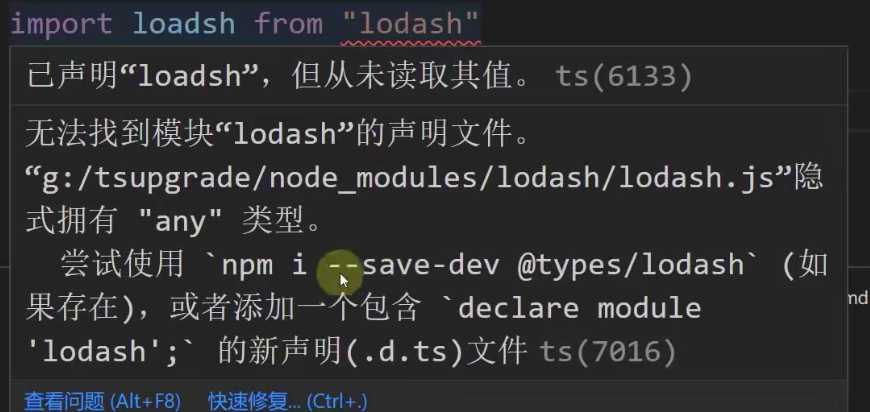 

    ```json
    // 和 node 相关的包都被支持
    "types": ["node"]
    ```

     

  - 支持 jsx 语法格式

    ```json
    // react 模式 react-native
    "jsx": "preserve"
    ```

  - 支持 ts 装饰器开启

    ```json
    "experimentalDecorators": true
    "emitDecoratorMetadata": true
    ```

  - 设置导入路径别名

    ```json
    "baseUrl": "."
    "paths": {
      "@user/*": ["src/user/*"]
    }
    ```

    ```typescript
    import { account } from '@user'
    ```

    

## 数据类型

### 基本数据类型

`number`、`string `、`boolean`、`symbol`、`null`、`undefined`

- `null` 表示一个空对象的引用

  ```typescript
  typeof null	// object
  ```

  ```typescript
  // 可以接受 null 的类型
  let data: null = null
  let data: any = null
  let data: known = null
  ```

- `undefined` 表示一个空对象的引用声明一个变量但没有赋值，该变量值为 `undefined`

  ```typescript
  typeof undefined // undefined
  ```

  ```typescript
  // 给了变量具体类型，但是不想赋值
  let str: string | nudefined
  console.log('str', str)
  ```

  ```typescript
  // 会将参数变为可选类型，同时参数类型为 string | undefined
  function fn(data?: string) {}
  // 此时参数并不是可选类型
  function fn(data: string | undefined) {}
  ```

  ```typescript
  // 可以接受 undefined 的类型
  let date: undefined = undefined
  let data: any = undefined
  let data: unknown = undefined 
  ```


### 根类型

`Object`、`{}`

- 根类型是其他类型的父类，只有 `null` 和 `undefined` 类型不可以赋值给 `Object` 和 `{}` 类型

  ```typescript
  let data: Object = 3
  let data: Object = [11, 22]
  let data: Object = { value: 'hello' }
  let data: Object = new Set<string>()
  ```

- `{}` 是 `Object` 的简写


### 对象类型

 `Array`、`object`、`function`

- `object` 是约束对象的数据类型

- `object`  类型的常见对象取值错误

  ```typescript
  let obj = { username: 'jack', age: 23 }
  let username = 'username'
  // const username = 'username'
  let name = obj[username]	// 报错，如果 let 改为 const 可以正常取值
  ```

  ```typescript
  let obj: object = { username: 'jack', age: 23 }
  const username = 'username'
  let name = obj[username]	// 报错：类型 {} 上不存在属性 username
  ```

- 函数类型

  ```typescript
  type fnType = (name: string, age: number) => number
  const info: fnType = function (name: string, age: number) {
    return 1
  }
  ```

- 剩余参数

  ```typescript
  // 可以是 any，或者某个类型的数组
  function info(name: string, age: number, ...rest: any) {}
  function info(name: string, age: number, ...rest: string[]) {}
  ```

### 枚举

 `enum`

- 枚举是用来存放一组固定常量的序列

- 枚举既是一个类型，也是一个变量

- 字符串枚举

  ```typescript
  enum Week {
    Monday = 'Monday',
    Tueeday = 'Tueeday',
    Wensday = 'Wensday',
    Thirsday = 'Thirsday',
    Firday = 'Firday',
  	Saturday = 'Saturday',
    Sunday = 'Sunday'
  }
  ```

  获取枚举值方式

  ```typescript
  const data1 = Week.Monday
  const data2 = Week['Monday']
  const data3 = Week[1]
  ```

- 数值枚举

  ```typescript
  enum Week {
    // 赋值第一项，后面的项默认递增
    Monday = 1,
    Tueeday,
    Wensday,
    Thirsday,
    Firday,
  	Saturday,
    Sunday
  }
  ```

  获取枚举值方式

  ```typescript
  const data1 = Week.Monday
  const data2 = Week['Monday']
  // 不可以使用下标获取
  ```

- 枚举调用

  ```typescript
  function getAduitState(status: EnumAduitStatus): void {
    if (status === EnumAduitStatus.NO_ADUIT) {
    } else if (status === EnumAduitStatus.MANAGER_ADUIT_SUCCESS) {
    } else if (status === EnumAduitStatus.FINAL_ADUIT_SUCCESS) {
    }
  }
  ```


### 其他特殊类型

`any`、`unknown`、`never`、`void`、元组 ( `tuple`) 、可变元组

- `never` 类型是穷尽了所有可能的类型，也没有对应的类型

  函数抛异常的时候，返回值就是 `never`

  ```typescript
  function dataFlowAnalysisWithNever(data: number | string) {
    if (typeof data === 'string') {
      console.log('字符串类型', data.length)
    } else if (typeof data === 'number') {
      console.log('数值类型', data.toFixed(2))
    } else {
      // 没有对应的
      let _data: never = data;
    }
  }
  ```

- `any` 和 `unknown` 可以是任何类的父类，所以任何类型的变量都可以赋值给 `any` 或 `unknown` 类型的变量（左父右子）（除了 `never`）

  ```typescript
  let num: number = 2
  let data: any = num
  ```

- `any` 也可以是任何类的子类，但 `unknown` 不可以，所以 `any` 类型的变量都可以赋值给其他类型的变量，但是 `unknown` 不可以赋值给别的类型

  ```typescript
  let array: any = ['a', 'b']
  let data: number = array
  ```

  ```typescript
  let array: unknown = ['a', 'b']
  let data: number = array	// 报错：不能将 unknown 赋值给 number
  ```

- 不能使用 `unknown` 类型的变量来获取任何属性和方法，但 `any` 类型的变量可以获取任意名称的属性和方法

  ```typescript
  function getName(data: any) {
    return data.name
  }
  function getName(data: unknown) {
    return data.name	// 报错
    // data[0]	报错
  }
  ```

  `unknown` 用作函数参数，目的是在函数内部只用于再次传递或输出结果，不获取属性

  ```typescript
  function ref(value: unknow) {
    // 函数内部只用于再次传递值，不获取属性
    return createRef(value)
  }
  ```

- `void` 代表空，可以是 `undefined` 或 `never`

- 元祖条件：在定义时每个元素的类型都确定，元素值的数据类型必须是当前元素定义的类型，元素值的个数必须和定义时个数相同

  元素个数和类型固定的数组类型

  ```typescript
  let salary = [string, number, number] = ['jack', 2000, 1]
  ```

  ```typescript
  // 元祖取值
  console.log(salary[0])
  ```

- 可变元祖

  ```typescript
  let customers: [string, number, string, ...any[]] = ['jack', 23, '北京', '海淀区', '中关村']
  // 解构
  let { name, age, address, ...rest }: [string, number, string, ...any[]] = 
    ['jack', 23, '北京', '海淀区', '中关村']
  ```

  可变元祖标签，像对象一样命名

  ```typescript
  // 元祖标签名称和解构出来的变量名无关
  let { name, age, address, ...rest }: [name_: string, age: number, address: string, ...rest: any[]]
  ```


### 合成类型

联合类型，交叉类型

- 联合类型表示取值可以为多种类型的一种，联合类型在给出具体值以后，类型会确定为其中的一种类型

  ```typescript
  // 联合类型
  let data: string | number = 'hello'
  ```

- 联合类型只会取两个类型中相同的属性组成类型

  ```typescript
  type MouseEvent = {
  	eventType: 'click'
    x: number
    y: number
  }
  type KeyEvent = {
    eventType: 'keyUp'
    key: number
  }
  type Event = MouseEvent | KeyEvent
  // 类型结果：{ eventType: string }
  ```

- 交叉类型是将多个类型合并成一个类型

  ```typescript
  // 交叉类型
  let obj: { username: string } & { age: number } = { username: 'jack', age: 23 }
  ```

- 同一类型可以合并，不同的类型没法合并

  ```typescript
  type res = 'aaa' & 222;
  // type res = never
  ```
  
- 通用交叉方法

  ```typescript
  function cross<T extends object, U extends object>(obj1: T, obj2: U): T & U {
    const combine = {} as T & U
    for (let k in obj1) (combine as any)[k] = obj1[k]
    for (let k in obj2) (combine as any)[k] = obj2[k]
    return combine
  }
  ```


### 字面量类型

字符串的字面量类型有两种，一种是普通的字符串字面量，比如 `'aaa'`

另一种是模版字面量，比如 `aaa${string}`，它的意思是以 aaa 开头，后面是任意 string 的字符串字面量类型

```typescript
let num: 1 | 2 | 3 = 1
```

```typescript
function func(str: `#${string}`) {}
```


## 接口 interface


### 接口定义

**接口可以用来描述函数、构造器、索引类型（对象、class、数组）等复合类型**

接口中定义的**方法只有声明没有具体实现**

==对象==

```typescript
interface IPerson {
  name: string;
  age: number;
}
class Person implements IPerson {
  name: string;
  age: number;
}
const obj: IPerson = {
  name: 'xx',
  age: 18
}
```

==函数==

```typescript
interface SayHello {
  (name: string): string;
}
const func: SayHello = (name: string) => {
  return 'hello,' + name
}
```

==构造器==

```typescript
interface PersonConstructor {
  new (name: string, age: number): IPerson;
}
function createPerson(ctor: PersonConstructor): IPerson {
  return new ctor('xx', 18);
}
```


### 接口继承

```typescript
interface Pet {
  name: string,
  love: string[],
  health: string,
  eat(): void
}

// 新的接口在原来接口继承之上增加了一些属性或方法
interface Dog extends Pet {
  strain: string,
  guradHome(): void
}
```

`interface` 可以 `extends` 一个或多个接口或类，也可以继承 `type`

```typescript
interface TextNode extends Node, TemplateNode {}
```


### 接口实现

为多个同类别的类提供统一的方法和属性声明

```typescript
interface List {
  add (): void,
  remove (): void
}
class ArrayList implements List {
  add (): void {
    console.log('add')
  }
  remove (): void {
    console.log('remove')
  }
}
```


### 接口合并

```typescript
// 接口可以合并
interface Product {
  name: string;
  price: number;
  account: number;
  buy(): void;
}
interface Product {
  describe: string;
}
```


### 索引签名

> 对象类型、class 类型在 TypeScript 里也叫做索引类型，也就是索引了多个元素的类型的意思
>
> 对象可以动态添加属性，如果不知道会有什么属性，可以用可索引签名

索引签名定义

```typescript
interface Product {
  name: string;
  price: number;
  account: number;
  [x: string]: any;
  // [x: string]: string; 与其他属性重合不可以
}
```

```typescript
const product: Product = {
  name: 'phone',
  price: 1000,
  account: 1,
  color: 'red',
  // 指定 string 的情况，属性名不仅限于 string，其他类型也可以
  [Symbol('stockNo')]: 10,
  100: 'ok'
}
```


索引签名访问

```typescript
const symbolId = new Symbol('productNo')
interface Product {
  [symbolId]: string | number;
  name: string;
  price: number;
  account: number;
  buy(): void;
}
```

```typescript
type Buy = Product['buy']
type NameOrPrice = Product['name' | 'price']
type No = Product[typeof symbolId]

// 获取接口中属性的所有类型
type PKeys = keyof Product // 等同于 'name' | 'price' | 'account' | 'buy' | typeof symbolId

// 将所有的类型迭代出来，获取的类型为 'name' | 'price' | 'account' | 'buy' | typeof symbolId
type AllKeys<T> = T extends any ? T : any
type PKeys2 = AllKeys<keyof Product>	// ‘name' | 'price' | 'account' | 'buy' | typeof symbolId
```


## type 类型

- `type` 可以定义任何类型，包括基础类型、联合类型、交叉类型、元祖
  `interfaxce` 只可以定义对象类型或接口当名字的函数类型

  ```typescript
  // 定义基础类型
  type num = number
  // 定义联合类型
  type baseType = string | number | symbol
  // 定义联合类型（联合接口）
  interface Car { brandNo: string }
  interface Plane { No: string; brandNo: string }
  type TypVechile = Carl | Plane
  // 定义元组
  interface car { brandNo: string }
  interface Plane { No: string; brandNo: string }
  type TypVechile = [car, Plane]
  ```

- `type` 没有继承功能
  `interface` 可以 `extends` 一个或多个接口或类，也可以继承 `type`

- `type` 使用交叉类型 `&` 可以让类型中的成员合并成一个新的 `type` 类型

  `interface` 不能合并

  ```typescript
  type Group = { groupName: string, memberNum: number }
  type GroupInfoLag = { info: string, happen: string }
  type GroupMemeber = Group & GroupInfoLog
  
  let data: GroupMemeber = {
    groupName: '01',
    memberNum: 10,
    info: '集体爬山',
    happen: '中途有组员恐高，有惊无险'
  }
  ```

- 相同名称的 `interface` 可以合并声明，同名 `type` 会出现编译错误

  ```typescript
  interface Error { name: string }
  interface Error { message: string; stack?: string }
  // 接口合并
  let error: Error = { message: '空指针', name: 'NullPointException' }
  ```


## 类型断言和转换

- 类型断言：绕过 ts 编译检查，告诉编译器就是这个类型，无需检查

  `A 数据类型的变量 as B 数据类型`

  类型断言是有条件的，两种无相关的类型是不能断言的

  ```typescript
  let num: number = 3
  let str: num as string	// 报错
  // 父类转换子类
  let car = vechile as Car
  ```

- 类型转换：编译器强制一个类型转换成另外一个类型

  ```typescript
  let car: Car = <Car>vechile
  ```


## 类型守卫

- 类型守卫：在语句的块级作用域（`if` 语句内或条目运算符表达式内）**缩小变量类型**的一种推断的行为
- 类型守卫可以帮助在块级作用域中获得需要的更为精确变量类型


### 实例判断 instanceof

```typescript
function pay(payMethod: BankPay | MobilePay) {
  if (payMethod instanceof MobilePay) {
    // MobilePay 的方法调用
  } else if (payMethod instanceof BankPay) {
    // BankPay 的方法调用
  }
}
```


### 属性判断 in

```typescript
function pay(payMethod: BankPay | MobilePay) {
  // 类型包含指定属性
  if ('appId' in payMethod) {
    // 只能调用 MobilePay 内的属性方法
  } else if ('bankId' in payMethod) {
    // 只能调用 BankPay 内的属性方法
  }
}
```


### 类型判断 typeof

```typescript
function cal(num: string | number) {
  if (typeof num === 'number') {
    num + 3
  }
}
```


### 字面量判断

字面量相等判断 `==`、`===`、`!=`、`!==`


### 自定义类型守卫

```typescript
// 固定写法
function 函数名(形参: 参数类型 多为 any): 形参 is A类型 {
  return true or false
}
```

```typescript
function isMobilePay(payMethod: Pay): payMethod is MobilePay {
  return payMethod instanceof MobilePay
}

function pay(payMethod: BankPay | MobilePay) {
  if (isMobilePay(payMethod)) {
    // MobilePay 的方法调用
  }
}
```

```typescript
function isNum(num: any): num is number {
  return typeof num === 'number'; 
}
function cal(num: string | number) {
  if (isNum(num)) {
    num + 3
  }
}
```

```typescript
function isPromiseLike<T>(it: unknown): it is PromiseLike<T> {
  return it instanceof Promise || typeof (it as any)?.then === "function";
}
```

```typescript
function isRef(r: any): r is Ref {
  return Boolean(r && r.__v_isRef === true)
}
```


## 条件类型

TypeScript 里的条件判断是 `extends ? :`，叫做条件类型，是 TypeScript 类型系统里的 `if else`

```typescript
type res = 1 extends 2 ? true : false;
```

类型运算逻辑都是用来做一些动态的类型的运算的，也就是对类型参数的运算，这种类型也叫做**高级类型**

**高级类型的特点是传入类型参数，经过一系列类型运算逻辑后，返回新的类型**

```typescript
type isTwo<T> = T extends 2 ? true: false;
type res = isTwo<1>;
type res2 = isTwo<2>;
```

==使用条件类型简化泛型约束代码==

```typescript
// 原始写法
function cross<T extends object, U extends object>(obj1: T, obj2: U): T & U
// 简化写法，且便于维护
type CrossType<T> = T extends object ? T : never
function cross<T, U>(obj1: CrossType<T>, obj2: CrossType<U>): T & U
// Extract 写法
type ExtractType<T> = Extract<T, object>
function cross<T, U>(obj1: ExtractType<T>, obj2: ExtractType<U>): T & U
```

==泛型为联合类型时的条件类型比较==

```typescript
// 一次性比较，string | number | boolean 当成整体去比较
type Test = string | number | boolean extends string | number ? string : never
// 类型结果为 never
```

```typescript
// 泛型比较是迭代比较，逐个类型去匹配
type CondType<T> = T extends string | number ? T : never
type TestCondType = CondType<string | number | boolean>
// 类型结果为 string | number
```


## 索引查询 keyof

- `keyof` 获取对象中的所有 key

  ```typescript
  interface User {
    name: string
    age: number
    phone: string
  }
  type UserKeysType = keyof User
  // 类型结果：'name' | 'age' | 'phone'
  ```

- `in keyof` 遍历对象中的 key

  ```typescript
  interface User {
    name: string
    age: number
    phone: string
  }
  type CopyUser = {
    // K 为 User 循环中的每个 key，循环结果 K 可以在其他地方使用
    // 相当于 K in 'name' | 'age' | 'phone'
    // 联合类型逐个迭代出结果
    [K in keyof User]: User[K]
  }
  // CopyUser 结果等于 User
  ```

- `in keyof` 结合条件类型扩展现有类型

  ```typescript
  // 现有类型
  interface User {
    name: string
    age: number
    phone: string
  }
  // 基于现有类型添加属性后的扩展类型
  // T 为现有类型，K 为新添加的属性，V 为新添加的属性的数据类型
  type AddAttrToObj<T, K extends string, V> = {
    // in keyof 迭代现有类型，包含住现有类型内的属性
    // 不存在于现有类型的新属性，新属性的数据类型为 V
    [P in keyof T | K]: P extends keyof T ? T[P] : V
  }
  type UserPlus = AddAttrToObj<User, 'weixin', string>
  // 类型结果为
  // {
  //   name: string
  //   age: number
  //   phone: string
  //   weixin: string
  // }
  ```

- `keyof` 结果显示联合类型

  ```typescript
  interface User {
    name: string
    age: number
    phone: string
  }
  // 在IDE中鼠标放到类型上面，显示的类型是 keyof User，并没有直观的显示key的联合类型
  type Keys = keyof User
  // 展现key的联合类型，需要使用通用的格式
  // 利用了泛型的依次比较的特点
  type DirectKeys<T> = T extends any ? T : never
  type UserKeys = DirectKeys<keyof User>	// 'name' | 'age' | 'phone'
  ```

- 扁平化模块属性名

  ```typescript
  type MethodsType = {
    menu: {
      setActiveIndex: (index: string) => string
      setCollapse: (index: string) => string
    }
    tabs: {
      seteditableTabsValue: (editValue: string) => void
      setTabs: (index: string) => void
      setTabsList: (index: string) => void
    }
  }
  ```

  ```typescript
  // 模板字符串类型
  // 泛型写到模板时，固定写法 T & string
  type TemplateString<T, U> = `${T & string}/${U & string}`
  // 测试模板字符串类型
  // 类型结果为：'menu/setActiveIndex' | 'menu/setCollapse'
  type TestTempStr = TemplateString<'menu', 'setActiveIndex' | 'setCollapse'>
  ```

  ```typescript
  type SpliceObjKey<T> = {
     // 父和子联合起来
     [key in keyof T]: TemplateString<Key, keyof T[Key]>
   } [keyof T]
  // 对象类型后面写 [keyof T] 意味着舍弃 key 直接取后面的部分
  // { name:string, age: number }['name' | 'age']
  ```

  ```typescript
  type ModuleSpliceObjKey = SpliceObjKey<MethodsType>
  // 结果：'menu/setActiveIndex' | 'menu/setCollapse' | 'tabs/seteditableTabsValue' | 'tabs/setTabs' | 'tabs/setTabsList'
  ```


## 类型映射 in

- 在类型映射中，`in` 只能接 `string`、`number`、`symbol` 三种基本类型

  > 索引类型（对象、class 等）可以用 `string`、`number` 和 `symbol` 作为 key
  >
  > 这里 `keyof T` 取出的索引就是 `string | number | symbol` 的联合类型

  ```typescript
  type Copy<T extends Record<string, any>> = {
    [K in keyof T]: T[K]
  }
  // 结果为可索引签名形式
  // {
  //   [x: string]: any
  // }  
  ```

  映射类型就相当于把一个集合映射到另一个集合

  ```typescript
  type MapType<T> = {
      [Key in keyof T]: [T[Key], T[Key], T[Key]]
  }
  type res = MapType<{a: 1, b: 2}>;
  // 结果为 type res = {
  //    a: [1, 1, 1];
  //    b: [2, 2, 2];
  // }
  ```

- 除了值可以变化，索引也可以做变化，用 `as` 运算符，叫做**重映射**

  ```typescript
  // 用 as 把索引做了修改
  type MapType<T> = {
      [Key in keyof T as `${Key & string}${Key & string}${Key & string}`]: [T[Key], T[Key], T[Key]]
  }
  ```

  ```typescript
  type res = MapType<{a: 1, b: 2}>;
  // 结果为 type res = {
  //    aaa: [1, 1, 1];
  //    bbb: [2, 2, 2];
  // }
  ```

  > `Key & string` 的意思是和 `string` 取交叉部分
  >
  > 由于 Key 只能是 `string`、`number`、`symbol` 三种基本类型，**交叉类型会把同一类型做合并，不同类型舍弃**
  >
  > 最终交叉部分就只剩下 `string`

- 使用 `in ... as` 来剔除属性

  ```typescript
  type Omit<T, K extends keyof T> = {
    // 剔除的 key 转为 never 类型
    // [P in keyof T as P extends K ? never : P]: T[P]
    // 最终形式
    [P in keyof T as Exclude<P, K>]: T[P]
  }
  ```

- 使用 `in ... as` 来提取类型

  实现抓取类型中的方法

  ```typescript
  interface Todo {
    title: string
    completed: boolean
    description: string
    add(): number
    delete(): number
    update(): number
  }
  ```

  ```typescript
  // 排除 Array 类型
  type ExcludeArray<T> = Exclude<T, Array<any>>
  // 提取函数类型
  type TodoMethod<T extends Record<string, any>> = {
    // 是函数的返回，不是的返回never
    // as 重映射
    [P in keyof ExcludeArray<T> as ExcludeArray<T>[P] extends Function ? P : never]: T[P]
  }
  ```

  ```typescript
  type MyMethod = TodoMethod<Todo>
  // 结果类型
  // {
  //   add: () => number
  //   delete: () => number
  //   update: () => number
  // }
  ```

  ```typescript
  type MethodName<T> = `do${Capitalize<T & string>}`
  // 映射修改方法名
  type TodoMethod<T extends Record<string, any>> = {
    [P in keyof ExcludeArray<T> as ExcludeArray<T>[P] extends Function ? MethodName<P> : never]: T[P]
  }
  // 结果类型
  // {
  //   doAdd: () => number
  //   doDelete: () => number
  //   doUpdate: () => number
  // }
  ```

- 使用 `in ... as` 将对象的属性数据类型转换为 key 的值

  ```typescript
  type MouseEvent = {
    eventType: 'click'
    x: number
    y: number
  }
  type KeyEvent = { 
    eventType: 'keyUp'
    key: number
  }
  ```

  ```typescript
  type EventMethod = EventFunctions<MouseEvent | KeyEvent, 'eventType'>
  // 结果
  // {
  //   click: (event: MouseEvent) => any
  //   keyup: (event: KeyEvent) => any
  // }
  ```

  ```typescript
  // 泛型 Events 为事件对象类型
  // 泛型 EventKey 为要事件对象中要把值转为key的属性
  type EventFunctions<Events extends Record<string, any>, EventKey extends keyof Events> {
  	// MouseEvent | KeyEvent 的联合类型为 `eventType: 'click' | 'keyup'`
  	// 如果写成 [Event in Events]，编译器不识别，因为 in 后面只能接 string、number、symbol 类型
  	// 解决思路是 [Event in Events as string]
  	// in as 映射为将指定属性 EventKey 在旧类型中的指定属性的类型，作为新类型的 key
  	[Event in Events as Event extends Events ? Event[EventKey] : never ]: (event: Event) => any
  	// 简写模式
  	// [Event in Events as Event[EventKey]]: (event: Event) => any
  }
  ```


## 推断类型 infer

`infer` 表示**在 `extends` 条件语句中，以占位符出现**的，等到**使用时才推断出来的数据类型**


**`infer` 关键字只允许存在于 `extends` 语句中**

> Typescript 类型的模式匹配是**通过 `extends` 对类型参数做匹配**，**结果保存到通过 `infer` 声明的局部类型变量里**
>
> 如果匹配就能从该局部变量里拿到提取出的类型

```typescript
// 提取数组的第一个元素类型
// 类型体操中经常用 unknown 接受和匹配任何类型
// 对 Arr 做模式匹配，把要提取的第一个元素的类型放到通过 infer 声明的 First 局部变量里，后面的元素可以是任何类型，用 unknown 接收
// 然后把局部变量 First 返回
type GetFirst<Arr extends unknown[]> = Arr extends [infer First, ...unknown[]] ? First : never;
type res = GetFirst<[1,2,3]>;
// 结果为 1
```


==字符串类型模式匹配==

```typescript
// 判断字符串是否以某个前缀开头
type StartsWith<Str extends string, Prefix extends string> = Str extends `${Prefix}${string}` ? true : false;
```

```typescript
// 字符串匹配一个模式类型，提取想要的部分，用这些再构成一个新的类型
// 声明要替换的字符串 Str、待替换的字符串 From、替换成的字符串 To 3 个类型参数
// 用 Str 去匹配模式串，模式串由 From 和之前之后的字符串构成，把之前之后的字符串放到通过 infer 声明的局部变量 Prefix、Suffix 里
// 用 Prefix、Suffix 加上替换到的字符串 To 构造成新的字符串类型返回
type ReplaceStr<Str extends string, From extends string, To extends string> 
	= Str extends `${infer Prefix}${From}${infer Suffix}` ? `${Prefix}${To}${Suffix}` : Str;
type ReplaceResult = ReplaceStr<"my best friend is ?", "?", "dog">
// 结果为 type ReplaceResult = "my best friend is dog"
```

```typescript
// Trim 去掉空白字符
// 需要递归，因为不知道有多少个空白字符，所以只能一个个匹配和去掉
// TrimRight
type TrimStrRight<Str extends string> = Str extends `${infer Rest}${' ' | '\n' | '\t'}` ? TrimStrRight<Rest> : Str;
// TrimLeft
type TrimStrLeft<Str extends string> = Str extends `${' ' | '\n' | '\t'}${infer Rest}` ? TrimStrLeft<Rest> : Str;
// Trim
type TrimStr<Str extends string> =TrimStrRight<TrimStrLeft<Str>>;
type trimType = TrimStr<'   dog   '>;
```


==获取函数参数类型==

**`infer` 出现在 `extends` 条件语句后的函数类型中的参数类型位置上**

```typescript
type FuncType = (params: User) => string
// Func 和模式类型做匹配，参数类型放到用 infer 声明的局部变量 Args 里
type GetParameters<Func extends Function> = Func extends (...args: infer Args) => unknown ? Args : never;
// 获取到类型结果为 User
type ParaType = GetParameters<FuncType>	// User
```


==获取函数返回值类型==

`infer` 出现在 `extends` 条件语句后的函数类型中的返回值类型上

```typescript
type FuncType = (params: User) => string
// Func 和模式类型做匹配，提取返回值到通过 infer 声明的局部变量 ReturnType 里返回
// 参数类型可以是任意类型，也就是 any[]，但是这里不能用 unknown，这里涉及到参数的逆变性质
type GetReturnType<Func extends Function> = Func extends (...args: any[]) => infer ReturnType ? ReturnType : never;
type RtnType = GetReturnType<FuncType>	// string
```


==获取构造器返回值类型==

```typescript
interface Person {
  name: string;
}
interface PersonConstructor {
  new(name: string): Person;
}
```


==获取泛型的类型==

**`infer` 出现在类型的泛型具体化类型上**

```typescript
// 通过 extends 对传入的类型参数 T 做模式匹配
// 通过 infer 声明一个局部变量 P 来保存
// 如果匹配，就返回匹配到的 P，否则就返回 never 代表没匹配到
type ElementOfArray<T> = T extends Array<infer P> ? P : never
```

```typescript
type ArrayItemType = ElementOfArray<Array<{ name: string, age: number }>>
// 类型输出为 { name: string, age: number }
```


==函数中使用==

```typescript
function unref<T>(ref: T): T extends Ref<infer V> ? V : T {
  // 参数可以是 Ref 对象，也可以是其他对象
  return isRef(ref) ? (ref.value as any) : ref
}
```

```typescript
unref(ref(3))									//返回值类型为 number
unref(ref('jack'))						// 返回值类型为 string
unref(ref({ name: 'jack' }))	// 返回值类型为 { name: string }
unref({ age: 29 })						// 返回值类型为 { age: number }
```


`infer` 构建带参数的工厂实例方法

- `infer` 获取构造器参数
- `infer` 获取构造


## 高级类型

### Extract 类型

- `Extract` 类型就是条件类型的简写
- 底层实现 `type Extract<T, U> = T extends U ? T : never`

```typescript
type TestExtract = Extract<string, string | number>
// 类型结果为 string | number，由此可知是循环比较的
type TestExtract = Extract<string | number | boolean, string | number>
```


### Exclude 类型

- 与 `Extract ` 正好相反，满足条件不显示，不满足条件显示

- 底层实现 `type Exclude<T, U> = T extends U ? never : T`

```typescript
// 类型结果为 boolean，只把不匹配的内容筛选出来
type TestExclude = Exclude<string | number | boolean, string | number>
```

```typescript
// 排除数组和基本类型，只有以外的数据类型可以使用
type ExcludeBaseAndArrayType<T> = Exclude<T, string | number | boolean | Array[any]>
```


### Record 类型

- 使用 `object` 的地方，`Record` 都可以替代

- `Record` 的 key 只支持 `string`、`number`、`symbol` 三种类型 `Record<string | number | symbol, string>`

  ```typescript
  // key支持 number 类型，因此也支持数组
  const record: Record<string, any> = [3, 4, 5]
  ```

- 底层实现

  ```typescript
  type Record<K extends keyof any, T> = {
    [P in K]: T;
  }
  ```

  ```typescript
  type MyRecord = Record<string, string| number>
  // MyRecord 的结果为
  // { [x: string]: string | number }
  // 索引签名格式，以下形式都可以
  const record: MyRecord = {
    name: 'jack'
    [Symobl('no')]: 100,
    100: 101,
    true: 100
  }
  ```

- `Record` 既可以接受对象，也可以接受数组

  ```typescript
  // 是否为纯对象
  // 参数为对象或数组都可以
  function isPlainObject(data: Record<string, any>) {
    // true 为对象，false 为数组
    return Object.prototype.toString.call(data) === '[object Object]'
  }
  type BaseType = string | number | boolean
  // 既可以为对象也可以为数组
  function deepCopy(data: Record<string, any> | BaseType) { }
  ```


### Pick 类型

- `Pick` 用来抓取 type 类型、接口、类中的属性组成一个新的对象类型

- `Pick<T, K extends keyof T>`：`T` 为要抓取的类型，`K` 为类型当中要抓取的属性

  ```typescript
  interface Book {
    ISBN: string
    bookName: boolean
    bookPrice: string
    storeCount: number
    publish: string
  }
  type SubBook = Pick<Book, 'ISBN' | 'bookName' | 'bookPrice'>
  ```

- 底层实现

  ```typescript
  type Pick<T, K extends keyof T> = {
    [P in K]: T[P]
  }
  ```


### Omit 类型

- `Omit` 用来剔除一个类型的某些属性，返回一个新属性

- 底层实现

  ```typescript
  type Omit<T, K extends keyof any> = Pick<T, Exclude<keyof T, K>>;
  ```

- 使用 `in` 来实现

  ```typescript
  type Omit<T, K extends keyof T> = {
    // 剔除的 key 转为 never 类型
    // [P in keyof T as P extends K ? never : P]: T[P]
    // 最终形式
    [P in keyof T as Exclude<P, K>]: T[P]
  }
  ```


### Required 类型

-  `Required<T>` 将类型中的可选类型转为必选类型，去除所有 `?`
-  源码实现 `type Required<T> = {[K in keyof T]-?: T[K]}`

```typescript
interface Todo {
  title: string
  completed: boolean
  date?: Date
  publisher?: string
}
type MustTodo = Required<Todo>
// 结果
// {
//   title: string
//   completed: boolean
//   date: Date
//   publisher: string
// }
```


### Partial 类型

- `Partial<T>` 将类型中的所有必选属性转为可选属性，加上 `?`
- 源码实现 `type Partial<T> = {[K in keyof T]?: T[K]}`，等同于 `type Partial<T> = {[K in keyof T]+?: T[K]}`

```typescript
interface Todo {
  title: string
  completed: boolean
  date: Date
  publisher: string
}
type ChooseTodo = Partial<Todo>
// 结果
// {
//   title?: string
//   completed?: boolean
//   date?: Date
//   publisher?: string
// }
```


### Readonly  类型

- `readonly` 标记一个属性是只读，不可再赋值修改的

- `Readonly<T>` 将类型中的所有属性转为只读属性

- 源码实现 `type Readonly<T> = { readyonly [K in keyof T]: T[K] }`

- 去除只读类型

  ```typescript
  type Writable<T> = {
  	-readonly [K in keyof T]: T[K]
  }
  ```

  ```typescript
  // 又不只读，又可选
  type PartialAndWritable<T> = {
    -readonly [K in keyof T]+?: T[K]
  }
  ```


### Capitalize 类型

首字母大写

```typescript
type ToCapitalize = 'test'
type TestCapitalize = Capitalize<ToCapitalize>		// 类型结果：Test
```


## 类

### 静态成员

- 类在执行的时候，首先会先执行全部静态属性

  ```typescript
  class Util {
    static obj = new Util()
    private constructor() {
      console.log('创建对象')
    }
  }
  console.log('外部执行')
  // 创建对象
  // 外部执行了
  ```

- 静态方法属性的应用场景：当类是作为工具类，并且没必要多次实例化的场合

  ```typescript
  class DataUtil {
    static formatData() {}
    static timeConversion() {}
    static diffDataByHour() {}
  }
  DataUtil.formatData()
  ```

- 静态方法和单例模式的区别，以及单例模式实现：一个类只允许外部获取到它的唯一实例对象

  ```typescript
  // 方式一：立即创建单件模式
  // 方法一的缺点是自动默认创建实例对象，即使没使用
  // 使用静态属性指向唯一实例对象
  class DataUtil {
    static dataUtil = new DataUtil()
    // 创建类的实例对象的权限放在类的内部
    // 私有构造函数只能在类的内部调用
    private constructor() {}
    formatData() {}
  }
  export default DataUtil.dataUtil
  ```

  ```typescript
  // 方式二：想使用的时候，才去创建实例对象
  class DataUtil {
    static dataUtil: DataUtil
    static getInstance() {
      if (this.dataUtil) {
        this.dataUtil = new DataUtil()
      }
      return this.dataUtil
    }
    private constructor() {}
    formatData() {}
  }
  ```

  - 静态成员调用因为是类的调用，会有其他原型链上无关的属性和方法

     

  - 单例模式是对象的调用，调用起来更简洁一些

     


### Getter / Setter 属性

```typescript
class Person {
	_age: number = 0
  set age(vaule: number) {
    if (value > 10 && value < 128) {
      this._age = value
    } else {
      throw new Error('年龄不在范围内')
    }
  }
  get age() {
    return this._age;
  }
}
```


## 泛型

具有以下特点的数据类型叫做泛型

1. 定义时不明确，使用时必须明确成某种具体数据类型的数据类型
2. 编译期间进行数据类型检查的数据类型

 

### 泛型约束

```typescript
type InstancePropKeys<T extends object> = keyof T
```

```typescript
class Order {
  id: number
  name: string
  count: number
  print() {}
}
type OrderPropKeys = InstancePropKeys<Order>
```

```typescript
type KeysType<T, K> = K extends keyof T ? K : never
```

```typescript
type User = { name: string, age: number }
type TestKeysType = KeysType<User, 'name'>
```


## 函数

### 函数重载

一组具有相同名字，不同参数列表的和返回值无关并且具有一个实现签名和一个或多个重载签名的函数

```typescript
// 重载签名
function searchMsg(condition: MessageType): Message[]
function searchMsg(condition: number): Message | undefined
// 实现签名
function searchMsg(condition: MessageType | number): Message | undefined | Message[] {
  if (typeof condition === 'number') {
    return messages.find((msg) => condition === msg.id)
  } else {
    return messages.filter((msg) => condition === msg.type)
  }
}
```


### 泛型工厂函数

构造函数的函数类型

```typescript
type ConstructorType = new (...args: any) => any
// 接口形式
interface ConstructorInterface {
  new (...args: any): any
}
```

```typescript
// 为所有的类提供一个构造器
function createFactoryConstructor(constructorType: new (...args: any) => any) {
  // 创建对象拦截部分
  console.log(constructorType.name + '被创建..')
  new constructorType()
}

class User {
  name: string
  age: number
  constructor(name: string, age: number) {
    this.name = name
    this.age = age
  }
}
createFactoryConstructor(User)
```


## 声明文件

- 关键字 `declare` 表示声明

  声明全局变量：`declare let`、`declare const`

  声明全局方法：`declare function`

  声明全局类：`declare class`

  声明全局枚举类型：`declare enum`

  声明全局对象：`declare namespace`

  声明模块：`declare module`

  声明全局类型：`interface` / `type`，不需要 `declare`

- 凡是 js 能识别的都需要加 `declare`，js 不支持的例如 `interface`、`type` 则不需要加 `declare`

- d.ts 文件的作用范围为 tsconfig.json 文件的 `include` 选项指定的路径范围

- 命名空间 `namespace` 是为了防止重名，可以当成对象看待，`namespace` 添加 `declare` 了，内部的内容就无需 `declare` 了

  ```typescript
  declare namespace JQuery {
    type cssSelector = {
      css: (key: string, value: string) => cssSelector
    }
    export function $(ready: () => void): void
    // 嵌套命名空间
    namespace $ {
      function ajax(url: string): void
    }
  }
  ```

  ```typescript
  // 使用
  JQuery.$(function() => {})
  ```

- 使用 `module` 替代 `namespace`

  ```typescript
  declare module "JQueryModule" {
    type cssSelector = {
      css: (key: string, value: string) => cssSelector
    }
    export function $(ready: () => void): void
    export = $
  }
  ```


## 装饰品

装饰品 / 注解就是一个函数，但它是一个返回函数的函数

是 TypeScript 的一个特性，不是 Angular 的特性   

- ##### 应用于属性的注解

  ```typescript
  export function Emoji () {
      // target就是使用的类，key是类中的属性
      return ( target: object, key: string ) => {
          let val = target[ key ];
  
          // 新定义读写方法
          const getter = () => {
              return val;
          }
  
          const setter = ( value: string ) => {
              val = `@@ ${ value } @@`;
          }
  
          // 重新设置 替换读写
          Object.defineProperty( target, key, {
              get: getter,
              set: setter,
              enumerable: true,
              configurable: true
          } );
      }
  }
  
  export class HorizonGridComponent{
      @Emoji() result = 'Hello';
  }
  ```

  ```html
  {{ result }}
  <!-- 结果为 @@ Hello @@ -->
  ```


- ##### 应用于函数的注解

  ```typescript
  // 有参数的注解
  export function Confirmable ( message: string ) {
      return ( traget: object, key: string, descriptor: PropertyDescriptor ) => {
          const orginal = descriptor.value;
          descriptor.value = function ( ...args: any ) {
              const allow = window.confirm( message );
              if ( allow ) {
                  const result = orginal.apply( this, args );
                  return result;
              }
              return null;
          }
          return descriptor;
      }
  }
  export class HorizonGridComponent{
    @Confirmable( '您确认要执行吗?' )
    handleClick () {
      console.log( '点击已执行' );
    }
  }
  ```

  ```html
  <span (click)="handleClick()">点击</span>
  ```


# Rxjs

## 基本概念

### 函数响应式编程

- rxjs 要**把事件或数据看成一个流**，DOM 事件、WebSocket、AJAX、网页动画都可以看作是一个数据流
- **响应式编程就是随着事件流中的元素的变化随之做出相应的动作**
- 用数据流抽象现实问题，把复杂问题分解成简单问题的组合
- 擅长处理异步操作，对数据采用 **推（push）** 的处理，被推送给对应的处理函数不用关心数据是同步产生的还是异步产生的
- rxjs 结合了观察者模式和迭代者模式，rxjs 实现的是**推**式的迭代器实现


### 观察者模式

> - 观察者模式要解决的问题，就是在一个持续产生事件的系统中，分割功能，让不同模块只处理一部分逻辑
>
> - 观察者模式将逻辑分为 **发布者** 和 **观察者**，发布者只负责产生事件，会通知所有注册的观察者，观察者只接收事件后处理，不关心数据是怎样产生的
>
>   > - 发布者维护一个订阅者的列表，并在每次有更新时通知他们或传播更改
>   > - 订阅者每收到发布者的通知时都会执行更新或执行副作用
>
> - Rsjs 中 `Observable` 对象就是一个发布者，通过 `subscribe` 函数把发布者和观察者连接起来
>
> - Rxjs 中 `subscribe` 的参数就是一个观察者

- 可观察对象 `Observable`

  类比 `Promise` 对象，**内部可以用于执行异步代码**，通过调用**内部提供的方法将异步代码执行的结果传递到可观察对象外部**

- 观察者 `Observer`

  类比 `then` 方法中的回调函数，用于**接收可观察对象中传递出来数据**

- 订阅 `Subscribe`

  类比 `then` 方法，**通过订阅将可观察对象和观察者连接起来，当可观察对象发出数据时，订阅者可以接收到数据**

 

```javascript
import { Observable } from 'rxjs'

const observable = new Observable(observer => {
  setTimeout(() => {
    observer.next({ name: '张三' })
  }, 2000)
})

const observer = {
  next: value => {
    console.log(value)
  }
}

observable.subscribe(observer)
```


## 可观察对象

### Observable

#### 创建 Observable

- `Observable` 对象是一个特殊的类，接受一个处理 `observer` 的函数，`observer` 对象只要求必须包含一个 `next` 函数属性，用于接收被推过来的数据

  ```javascript
  // 作为参数传递给 Observable 构造函数，这个函数参数完全决定了 Observable 对象的行为
  // 函数接受一个 observer 参数，在函数体内，调用参数 observer 的 next 函数，把数据「推」给 observer
  const onSubscribe = observer => {
    observer.next(1)
    observer.next(2)
    observer.next(3)
  }
  ```

  ```javascript
  // 调用 Observable 构造函数，产生一个名为 source$ 的数据流对象
  const source$ = new Observable(onSubscribe)
  ```

  ```javascript
  // 创造观察者 theObserver
  const theObserver = {
    next: item => console.log(item)
  }
  ```

  ```javascript
  // 通过 subscribe 函数将 theObserver 和 source$ 关联起来
  // 在 subscribe 函数被调用的过程中，onSubscribe 被调用
  source$.subscribe(theObserver)
  
  // 产生了连续的三个正整数输出
  // 1
  // 2
  // 3
  ```

- **可观察对象是惰性的，只有被订阅后才会执行**

- 可观察对象**可以有 n 多订阅者**，**每次被订阅时都会得到执行**

  ```javascript
  const observable = new Observable(() => {
    console.log("执行");
  })
  observable.subscribe();  // 执行
  observable.subscribe();  // 执行
  observable.subscribe();  // 执行
  ```


#### 异步 Observable

推送数据可以有时间间隔，对于观察者 `Observer`，只需要被动接受推送数据来处理，而不用关心数据何时产生

```javascript
const onSubscribe = observer => {
  let number = 1;
  const handle = setInterval(() => {
    observer.next(number++);
    if (number > 3) {
      clearInterval(handle);
      observer.complete();
    }
  }, 1000);
};

const source$ = new Observable(onSubscribe)

const theObserver = {
  next: item => console.log(item)
}

source$.subscribe(theObserver)
```

`Observable` 可以**产生不会结束的数据**

```javascript
const onSubscribe = observer => {
  let number = 1;
  const handle = setInterval(() => {
    observer.next(number++);
  }, 1000);
};
```


#### Observable 三种状态

- 三种状态：`next`，`error`，`complete`

  ```javascript
  // Observable 的行为，决定观察者对象的函数如何被调用
  new Observable(observer => {
    // 调用 观察者 的 next 函数
    observer.next(1);
    // 调用 观察者 的 complete 函数
    observer.complete();
  }).subscribe({
    next: item => console.log(item),
    error: err => console.log(err),
    complete: () => console.log('No More Data'),
  })
  // 1
  // No More Data
  ```

  ```javascript
  new Observable(observer => {
    // 调用 观察者 的 next 函数
    observer.next(1);
    // 调用 观察者 的 error 函数
    observer.error('Someting Wrong');
    // 无效
    observer.complete();
  }).subscribe({
    next: item => console.log(item),
    error: err => console.log(err),
    complete: () => console.log('No More Data'),
  })
  // 1
  // Someting Wrong
  ```

- 当调用了 `complete` 或 `error` 方法以后，就不能再次调用 `next`、`complete` 或 `error` 任意方法

  > `Observable` 对象**只有一种终结状态**，要么是**完结** `complete`，要么是**出错** `error`
  >
  > 进入出错状态， `Observable` 对象就终结了，不会调用对应 `Observer` 的 `next` 和 `complete `
  >
  > 进入完结状态，也不能再调用 `Observer` 的 `next` 和 `error`

  ```typescript
  const observable = new Observable((observer) => {
    let index = 0;
    let timer = setInterval(() => {
      //  在Observable对象内部可以多次调用 next方法向外发送数据
      observer.next(index++);
      if(index === 3) {
        // 当所有数据发送完成以后，可以调用complete方法终止数据发送
        // observer.complete();
        // 当内部逻辑发送错误时，可以调用 error 方法将失败信息发送给订阅者，Observable 终止
        observer.error("error");
        clearInterval(timer);
      }
    }, 1000);
  });
  
  observable.subscribe({
    next: (value) => console.log(value),
    complete: () => console.log("complete"),
    error: (error) => console.log(error)
  });
  ```

  > `Observable` 构造函数参数中的 `observer` 并不是传给 `subscribe` 的参数 ，而是对  `subscribe` 的参数的包装
  >
  > 即使在 `observer.error` 被调用之后强行调用 `observer.complete`，也不会真正调用到 `subscribe` 的 `complete` 函数

- `subscribe` 可以接受一个 `Observer` 对象作为参数，也可以接受函数作为参数

  - 接受 `Observer` 对象

    ```javascript
    source$.subscribe({
      next: (value) => console.log(value),
      error: (error) => console.log(error),
      complete: () => console.log("complete")
    });
    ```

  - 接受函数：第一个参数如果是函数类型，就被认为是 `next`，第二个函数参数被认为是 `error`，第三个函数参数被认为是 `complete`

    ```javascript
    source$.subscribe(
      item => console.log(item),
      err => console.log(err),
      () => console.log('No More Data')
    );
    ```

    不需要的处理可以用 `null` 占位置

    ```javascript
    source$.subscribe(
      item => console.log(item),
      null,
      complete: () => console.log('No More Data')
    );
    ```


#### 退订 Observable

- `Observable` 对象接受的处理 `observer` 的函数，可以返回一个对象，对象上可以有一个 `unsubscribe` 函数

  ```javascript
  const onSubscribe = observer => {
    let number = 1;
    const handle = setInterval(() => {
      observer.next(number++);
    }, 1000);
    return {
      unsubscribe: () => {
        clearInterval(handle);
      }
    };
  };
  const source$ = new Observable(onSubscribe);
  const subscription = source$.subscribe(item => console.log(item));
  // 在 3.5 秒之后做退订的动作
  setTimeout(() => {
    subscription.unsubscribe();
  }, 3500);
  // 1
  // 2
  // 3
  ```

- 调用 `unsubscribe` 函数，只是**当前订阅不再接受到被推送的数据**，`Observable` 并没有终结，因为始终没有调用 `complete`


#### Hot 和 Cold Observable

> 一个 `Observable` 对象有两个 `Observer` 对象来订阅，而且这两个 `Observer` 对象并不是同时订阅，
>
> 第一个 `Observer` 对象订阅 N 秒钟之后，第二个 `Observer` 对象才订阅同一个 `Observable` 对象，
>
> 而且，在这 N 秒钟之内，`Observable` 对象已经吐出了一些数据
>
> 针对于后订阅上的 `Observer`，如何处理错过的数据？
>
> 1. **Hot Observable**：允许错过，**只接受从订阅那一刻开始 `Observable` 产生的数据**
> 2. **Cold Observable**：不能错过，**需要获取 `Observable ` 之前产生的数据**

- Cold Observable：每次订阅都要产生一个新的生产者

  每一次 `subscribe` 都产生一个生产者，生产者产生的数据通过 `next` 函数传递给订阅的 `Observer`

- Hot Observable：每次订阅的时候，已经有一个热的生产者准备好了

  生产者的创建和 `subscribe` 调用没有关系，`subscribe` 调用只是让 `Observer` 连接上生产者而已


### Subject

用于**创建空的可观察对象**。在**订阅后不会立即执行**，`next` 方法可以在可观察对象外部调用

可当做**广播**去使用。**创建一个空的可观察对象，让很多的订阅者去订阅，当订阅的时候并不会立刻执行。当有数据要发出的时候，统一调用一次 `next` 方法，所有的订阅者可以同时接受到数据**

```typescript
import { Subject } from 'rxjs';

const demoSubject = new Subject();

demoSubject.subscribe(next: (value) => console.log(value));
demoSubject.subscribe(next: (value) => console.log(value));

setTimeout(() => {
    demoSubject.next("hahaha");
}, 3000)
```


### BehaviorSubject

拥有 `Subject` 全部功能，但是在**创建 `Observable` 对象时可以传入默认值**，**观察者订阅后可以直接拿到默认值**

```typescript
import { BehaviorSubject } from 'rxjs';

const demoBehavior = new BehaviorSubject("默认值");
demoBehavior.subscribe(next: (value) => console.log(value))
demoBehavior.next("Hello");
```


### ReplaySubject

功能类似 `Subject`，但有新订阅者时两者处理方式不同，**`Subject` 不会广播历史结果，而 `ReplaySubject` 会广播所有历史结果**

```typescript
import { ReplaySubject } from 'rxjs';

const rSubject = new ReplaySubject();

rSubject.subscribe(value => {
    console.log(value);
})

rSubject.next("Hello 1");	// Hello 1
rSubject.next("Hello 2");	// Hello 2

setTimeout(() => {
    rSubject.subscribe(value => {
    	console.log(value);
        // 输入
        // Hello 1
        // Hello 2
	})
}, 3000)
```


## 操作符

### 操作符简介

> 现实中复杂的问题，并不会创造一个数据流之后就直接通过 `subscribe` 接上一个 `Observer`
>
> 往往需要对这个数据流做一系列处理，然后才交给 `Observer`
>
> 像一个管道，数据从管道的一段流入，途径管道各个环节，当数据到达 `Observer` 的时候，已经被管道操作过
>
> 有的数据已经被中途过滤抛弃掉了，有的数据已经被改变了原来的形态，而且最后的数据可能来自多个数据源
>
> 最后 `Observer` 只需要处理能够走到终点的数据

==数据流==

从可观察对象内部输出的数据就是数据流，可观察对象内部可以向外部源源不断的输出数据

==操作符==

用于**操作数据流**，可以**将对象数据流进行转换，过滤等操作**，对于每一个操作符，连接的就是上游和下游

**操作符是返回一个 `Observable` 对象的函数**

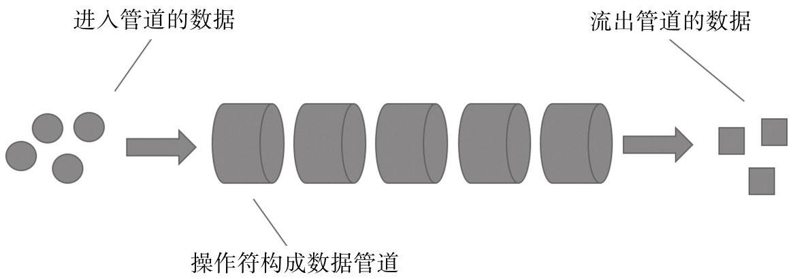 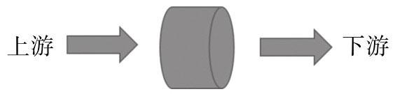

==弹珠图==

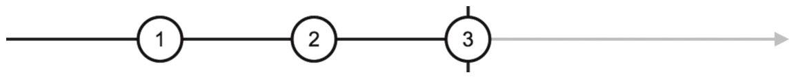 

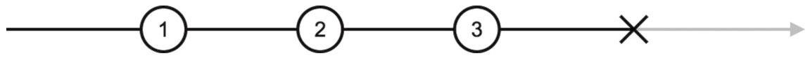 

- 符号 `|` 代表的是数据流的完结，对应调用 `complete` 函数

- 符号 `×` 代表数据流中的异常，对应于调用 `error` 函数

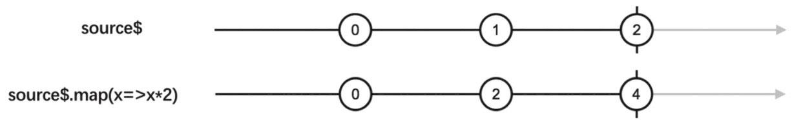 

- 多条时间轴代表上下游的数据流，根据上游数据流产生下游数据流

主要的操作符的弹珠图：https://rxmarbles.com/

产生弹珠图：[https://rxviz.com/](http://rxviz.com/)


### 创建操作符

负责创建一个 `Observable` 对象

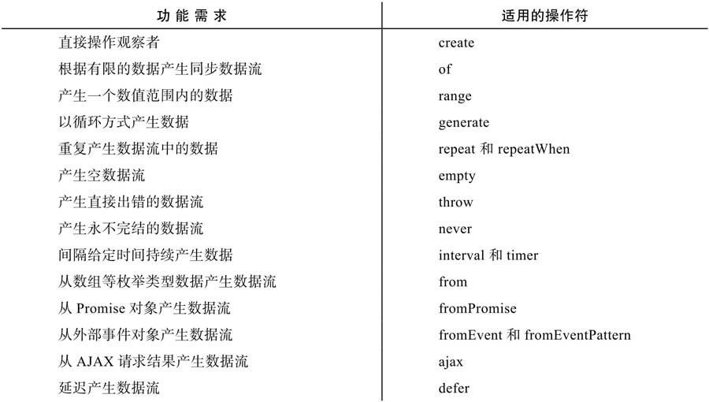 


#### from 转化 Promise 或可迭代对象

 

- 从数组等**可迭代对象**（如字符串）或 `Promise` 事件等创建一个 `Observable`

- 当 `from` 转化的数据完成的时候（`promise` 也只有一个结果）， `Observable` 会立即完成

- 数组转换为 `Observable`

  ```javascript
  const array = [10, 20, 30];
  const result = from(array);
  result.subscribe(x => console.log(x));
  
  // 10
  // 20
  // 30
  ```

- `Promise` 转换为 `Observable`

  ```javascript
  const result = from(
    new Promise((resolve, reject) => {
      setTimeout(() => {
        resolve('Hello RxJS!');
      }, 3000)
    }));
  result.subscribe(x => console.log(x));
  
  // Hello RxJS!
  ```

- `Promise` 失败的时候， `Observable` 对象也会立即失败

  ```typescript
  const result = from(Promise.reject('oops'));
  result.subscribe({
    error: data => console.log(data),
  });
  ```
  
- 生成器 `generator` 转换为 `Observable`

  ```javascript
  function* generateDoubles(seed) {
     let i = seed;
     while (true) {
       yield i;
       i = 2 * i; // double it
     }
  }
  const iterator = generateDoubles(3);
  const result = from(iterator).pipe(take(5));
  result.subscribe(x => console.log(x));
  
  // 3
  // 6
  // 12
  // 24
  // 48
  ```

- `arguments` 转换为 `Observable`

  ```typescript
  function toObservable() {
    return from(arguments);
  }
  const source$ = toObservable(1, 2, 3)
  ```


#### fromEvent 转化DOM事件

 

- 将事件（ DOM 事件 或 Node 的 `EventEmitter` 事件）转换成 `Observable` 对象
- 被**订阅的时候事件处理函数会被添加**，当**取消订阅的时候会将事件处理函数移除**
- 第一个参数是事件源，即特定的 DOM 元素，第二个参数是 DOM 事件名字符串
- `fromEvent` 产生的是 Hot Observable，数据的产生和订阅是无关的

- 鼠标点击事件转换为 `observable`

  ```javascript
  const source = fromEvent(document, 'click');
  const example = source.pipe(map(event => `Event time: ${event.timeStamp}`));
  const subscribe = example.subscribe(val => console.log(val));
  
  // Event time: 7276.390000000001
  ```

- 添加 `addEventListener` 选项

  ```typescript
  const clicksInDocument = fromEvent(document, 'click', { capture: true });
  clicksInDocument.subscribe(() => console.log('document'));
  ```

- Node `EventEmitter` 事件转换为  `observable`

  ```typescript
  const emitter = new EventEmitter();
  // 事件名称为 msg
  const source$ = fromEvent(emitter, 'msg');
  source$.subscribe(value => console.log(value));
  
  emitter.emit('msg', 1);
  emitter.emit('msg', 2);
  emitter.emit('another-msg', 'oops');
  emitter.emit('msg', 3);
  
  // 1
  // 2
  // 3
  ```


#### fromEventPattern 转化任意事件

 

- 从一个基于 `addHandler` / `removeHandler` 方法的类事件创建 `Observable`
- 可以将注册监听 `addHandler` 及移除监听 `removeHandler` 两种方法依序传入 `fromEventPattern` 来建立 `Observable` 的事件实例
- `addHandler` 方法在被订阅的时候调用，`removeHandler` 方法在取消订阅的时候被调用
- `addHandler` 和 `removeHandler`  两个参数都是函数，具体动作可以任意定义，所以可以非常灵活

- DOM 点击事件转换为 `observable`

  ```javascript
  const addClickHandler = (handler) => {
    document.addEventListener('click', handler);
  }
  const removeClickHandler = (handler) => {
    document.removeEventListener('click', handler);
  }
  const clicks = fromEventPattern(
    addClickHandler,
    removeClickHandler
  );
  clicks.subscribe(x => console.log(x));
  ```

- 取消订阅时执行清理操作

  ```typescript
  fromEventPattern(
    handler => {
      const intervalId = setInterval(() => { this.timerValue++ }, 1000); // 1秒间隔
      handler(intervalId);
    },
    (_, intervalId) => {
      clearInterval(intervalId);
      // 在取消订阅时手动执行清理工作
      console.log('Cleaning up...');
    }
  )
  ```
  
  ```typescript
  // 传入文件地址，然后返回一个流，流中的数据就是每行数据的结果
  const fs = require('fs')
  const readline = require('readline')
  
  function getLines(filePath) {
    const stream = fs.createReadStream(filePath)
    const rl = readline.createInterface({ input: stream });
    return fromEventPattern(
      handler => {
        rl.on('line', (...args) => {
          console.log('read line')
          handler(...args)
        });
      },
      handler => {
        // 在流结束的时候关闭流和取消事件监听
        rl.on('close', (...args) => {
          console.log('close', ...args)
          handler(...args)
        });
      }
    ).pipe(
      finalize(() => {
        console.log('finalize')
        stream.close()
        rl.removeAllListeners()
        rl.close()
      }));
  }
  getLines('./t.txt').pipe(
    take(3)
  ).subscribe(line => {
    console.log('line', line)
  })
  ```
  
- 自定义类事件转换为 `observable`

  ```javascript
  const listeners = [];
  class Foo {
    registerListener(listener) {
      listeners.push(listener);
    }
    removeListener(listener) {
      listeners.splice(listeners.indexOf(listener), 1)
    }
    emit(value) {
      listeners.forEach(listener => listener(value));
    }
  }
  const foo = new Foo();
  fromEventPattern(
    listener => foo.registerListener(listener),
    listener => foo.removeListener(listener)
  ).subscribe();
  foo.emit(1);
  
  // 1
  ```

- 结合可以通过回调进行通讯的 API

  ```javascript
  // WebWorker API
  const myWorker = new Worker('worker.js');
  
  fromEventPattern(
    handler => { myWorker.onmessage = handler },
    handler => { myWorker.onmessage = undefined }
  ).subscribe();
  
  // workerMessage
  ```


#### interval 时间间隔序列

 

- 创建一个 `Observable`，定期发出**自增的数字**

- **参数为产生数据的间隔毫秒数**，返回的 `Observable` 就按照这个时间间隔输出递增的整数序列，从 `0` 开始

  ```typescript
  interval(1000).subscribe(console.log)
  // 1 秒时吐出数据 0
  // 2 秒时吐出数据 1
  // 3 秒时吐出数据 2
  // ...
  ```
  
- `interval` 产生的数据流不会完结，要想停止这个数据序列，就必须要做退订的动作

- 可以用于模拟定时器、轮询请求、定期执行任务等

  ```javascript
  // 每 10 秒获取一次数据
  interval(10000).pipe(
    switchMap(i => fetch("https://server/stockTicker")
  ).subscribe(updateChart)
  ```

- 借助 `interval` 和 `map` 的组合，对发出的整数进行转换

  ```typescript
  interval(1000).pipe(
    map(value => value * 10) // 将值乘以10
  );
  ```

- `interval` 和 `startWith` 组合，默认时间计数前运行一次，与 `timer(0, 60000)` 相同

  ```typescript
  // Poll every 1 min
  interval(60000).pipe(
    startWith(0),
    switchMap(() =>  this.service.longPollingData$(params)),
    map(res => res.data)
  );
  ```


#### timer 延迟数据

 

- 创建一个 `Observable`，在给定的**持续时间之后**，**每隔指定的时间发射一个递增的数字**序列，**或持续时间之后发出一个值并完成**

- 第一个参数指定一个**毫秒数**，产生的 `Observable` 对象**在指定毫秒之后会吐出一个数据 `0`，然后立刻完结**

  ```typescript
  const source = of(1, 2, 3);
  // 3 秒后发出一个值，然后完成
  const result = timer(3000).pipe(
    concatMapTo(source)
  ).subscribe(console.log);
  ```

- 如果明确延时产生数据的时间间隔，那就应该用数值作为参数，如果明确的是一个时间点，那用 `Date` 对象是最佳选择

  ```typescript
  // 接受一个`Date`
  const currentDate = new Date();
  const startOfNextMinute = new Date(
    currentDate.getFullYear(),
    currentDate.getMonth(),
    currentDate.getDate(),
    currentDate.getHours(),
    currentDate.getMinutes() + 1,
  )
  // 1 分钟后终止流
  const result = interval(1000).pipe(
    takeUntil(timer(startOfNextMinute))
  );
  result.subscribe(console.log);
  ```

  ```typescript
  const now = new Date();
  const later = new Data(now.getTime() + 1000)
  timer(later).subscribe(console.log);
  ```

- 第二个参数指定**各数据之间的时间间隔**，如果使用第二个参数，会产生一个持续吐出数据的 `Observable` 对象

  类似 `interval`，但是可以指定什么时候开始发送

  从被订阅到产生第一个数据 `0` 的时间间隔，依然由第一个参数决定

  ```typescript
  // 每隔 1 秒发出自增的数字，3 秒后开始发送
  const numbers = timer(3000, 1000);
  numbers.subscribe(x => console.log(x));
  ```

- 如果 timer 的第一个参数和第二个参数一样，和 `interval` 的功能完全一样

  `interval` 是间隔时间参数相同时 `timer` 的一种简写的方法

  ```typescript
  const source1$ = interval(1000);
  const source2$ = timer(1000, 1000);
  ```

- `timer`  创建的数据是异步的，即使是 `timer(0)`


#### of 列举数据

 

- 创建一个 `Observable`，会**依次发出提供的参数，然后完成**


- `of` 操作符是**同步**的，适用于在创建 `Observable` 时立即提供值
- `of` 产生的是 Cold Observable，对于每一个 `Observer` **都会重复吐出同样的一组数据，可以反复使用**

- 如果需要在异步操作中发射值，可以考虑使用 `defer` 


```typescript
of("a", "b", [], {}, true, 20).subscribe(
  next => console.log(next),
  err => console.log(err),
  () => console.log('complete')
);

// a
// b
// []
// {}
// true
// 20
// complete
```


#### defer

接受一个**返回 `Observable` 的函数**，`defer` 中的代码仅在**订阅时执行**，而不是在创建时执行

每次订阅都产生新的 `Observable` 实例

 

```typescript
const s1 = of(new Date()); // will capture current date time
const s2 = defer(() => of(new Date())); // will capture date time at the moment of subscription
```

```typescript
const source = Observable.defer(() => Observable.of(
  Math.floor(Math.random() * 100)
));
```


#### iif

根据条件订阅两个 `Observable` 中的其中一个


#### range 指定范围

 

- 创建一个 `Observable`，**发出指定范围内的连续整数序列**，可以选择范围的起始值和长度，每次递增 `1`

  第一个参数还可以是任何数字

  ```javascript
  const source$ = range(1.5, 3);
  // 1.5、2.5、3.5
  ```

  不支持递增序列的定制，只可以递增 `1`

- 默认情况下，不使用调度器仅仅**同步**的发送通知 

- 方法内部并不是一次发出 `length` 个数值，而是发送了 `length` 次，每次发送一个数值。也就是内部调用了 `length` 次 `next` 方法

> 发出从 1 到 10 的数
>
> ```javascript
> const numbers = range(1, 10);
> numbers.subscribe(x => console.log(x));
> 
> // 输出: 1,2,3,4,5,6,7,8,9,10
> ```


#### EMPTY 完成空数据流

 

- `EMPTY` 是一个 `Observable` 对象，它会**立即发出 `complete` 通知**，而**不发出任何 `next` 通知**

- 创建立即完成的 `Observable`

  ```typescript
  EMPTY.subscribe({
    next: () => console.log('Next'),
    complete: () => console.log('Complete!')
  });
  // Complete!
  ```
  
- 条件触发 `Observable` 完成

  ```typescript
  fromEvent(document, 'click').pipe(
    switchMap(() => {
      // 在条件满足时，返回一个立即完成的 Observable
      return someCondition ? EMPTY : of('Clicked!');
    })
  );
  ```


#### NEVER 永不完成空数据流

 

- 创建一个永远不会发出任何值，也不完成，也不产生错误的 `Observable`

  ```typescript
  NEVER.subscribe({
    next: () => console.log('This will never be called'),
    complete: () => console.log('This will never be called either'),
  });
  // 永远不会结束或产生任何值
  ```

- 某些场合，例如编写测试用例时，可能需要模拟一个永远不会结束的流，即不产生任何值，也不会完成时，可以使用`NEVER`


#### throwError 抛出错误

 

- 创建一个 `Observable`，不向观察者发出任何项目，**订阅时立马发出错误通知**

- 可以被用来**和其他 `Observables` 组合, 比如在 `mergeMap`，`concatMap` 内部中抛出错误**

  ```javascript
  // mergeMap:把二维的 observable 转成一维，并且能够同时处理所有的 observable
  interval(1000).pipe(
    mergeMap(x => x === 2
      ? throwError(() => 'Twos are bad')
      : of('a', 'b', 'c')
    ),
  ).subscribe(x => console.log(x), e => console.error(e));
  // a
  // b
  // c
  // a
  // b
  // c
  // Twos are bad
  ```
  
  ```javascript
  concat(
    of(7),
    throwError(() => new Error('oops!'))
  ).subscribe(x => {
    console.log(x), e => console.error(e)
  });
  // 7
  // Error: oops!
  ```
  
  ```javascript
  of(1000, 2000, Infinity, 3000).pipe(
    concatMap(ms => {
      if (ms < 10000) {
        return timer(ms);
      } else {
        // 等价于：
        // throw new Error(`Invalid time ${ms}`);
        return throwError(() => new Error(`Invalid time ${ms}`));
      }
    })
  ).subscribe({
    next: console.log,
    error: console.error
  });
  // 0
  // 0
  // Error: Invalid time Infinity
  ```


#### generate 循环创建

 

- `generate` 创建一个类似 `for` 循环的流，**设定一个初始值，每次递增这个值，直到满足某个条件的时候才中止循环**，**在每次循环迭代时发出一个值**

  ```javascript
  // 产生一个比 10 小的所有偶数的平方
  const result = [];
  for (let i = 2; i < 10; i += 2) {
    result.push(i＊i);
  }
  ```

  ```javascript
  // 使用 generate
  const source$ = generate(
    2,											 // 初始值，相当于 for 循环中的 i=2
    value => value < 10,		// 继续的条件，相当于 for 中的条件判断 
    value => value + 2,			// 每次值的递增 
    value => value * value // 产生的结果 
  );
  ```

- `generate` 操作符通过运行一个基于状态的循环生成 `Observable` 序列的元素，使用指定的调度程序发送观察者消息

  ```typescript
  const observable = generate(
    initialState,       // 初始状态，表示循环的起始值
    condition,          // 条件函数，每次迭代都会调用，接受值并测试条件是否成立，返回 false 时停止生成
    iterate,            // 迭代函数，每次迭代都会调用，用于更新状态
    resultSelector,     // 结果选择器函数，每次迭代都会调用，返回生成的元素
    scheduler           // 可选的调度程序，用于控制观察者的消息发送
  );
  ```

  - 初始状态、条件函数、迭代函数，这三个参数直接**对应于传统 `for` 循环中的三个表达式**

    第一个表达式初始化某个状态；第二个测试循环是否可以执行下一次迭代；第三个说明定义的值将如何在每一步中被修改

  - 首先条件函数被执行，如果返回 `true`，那么 `Observable` 发出当前存储的值，在第一次迭代时为初始值

    最后用 `iterate` 函数更新该值

  - 如果在某一点上条件返回 `false`，那么 `Observable` 在那一刻完成

  - 第四个参数可以传递一个映射函数，映射由 `Observable` 发出的值

  - 调度器决定循环的下一次迭代何时发生，决定 `Observable` 何时发出下一个值

    当默认没有传递调度器时，值会同步发出

- 使用对象参数

  ```typescript
  const result = generate({
    initialState: 0,
    condition(value) { return value < 3; },
    iterate(value) { return value + 1; },
    resultSelector(value) { return value * 1000; }
  });
  ```

> 使用 `generate` 产生不限于数值序列的数据流
>
> ```javascript
> const range = (start, count, step) => {
>   const max = start + count;
>   return generate({
>     initialState: start,
>     condition: value => value < max,
>     iterate: value => value + step,
>     resultSelector: value => value,
>   });
> };
> range(1, 10, 2).subscribe(console.log)
> // 1 3 5 7 9
> ```


#### 其他操作符

`ajax`

`bindCallback`

`bindNodeCallback`


### 合并操作符

> - 可将多个 `Observable` 对象组合成一个 `Observable` 对象
>
> - 不少合并类操作符都有两种形式，既提供静态操作符，又提供实例操作符
>
>   两个平等关系的数据流合并在一起，适合用静态操作符
>
>   拥有主次关系，例如 source2$ 汇入了 source1$，适合用实例操作符

 


#### combineLatest 合并最新

 

- 组合多个 `Observables` 来创建一个 `Observable`，返回根据**每个输入 `Observable` 的最新值**计算得出的**数组**

  > 1. **顺序订阅**每个输入 `Observable`，**等待每个输入都至少发出一个值后才会发出初始值**，凑不齐完整的数据集合，只能等待
  > 2. 当**上游任何 `Observable` 发出值时**，从**每个输入 `Observable` 中拿最后一次产生的数据**，把这些**数据组合起来传给下游**
  > 3. 每个输入所发出的值**只保留最新的**，如果某个上游 `Observable` **不产生新数据**（包含完成情况），就**反复使用这个上游最后一次产生的数据**
  > 4. 返回数组的长度和输入的个数一致，**顺序和输入的顺序一致**，对象的**结构和输入的结构一致**
  > 5. **任一输入发生错误**，会立马返回错误状态，所有的其他输入**都会被解除订阅**
  > 6. 单独某个输入的完成不会让返回的 `Observable` 完成，**所有上游都完成之后，才会给下游 `complete` 信号**
  > 7. 但是如果某个输入**没有发出值就完成**了，返回的 `Observable` 会立马完成

- `combineLatest` 主要应用于**处理多个长期存在的可观察对象**，彼此相互依赖进行某种计算等

  ```typescript
  const redTotal = document.getElementById('red-total');
  const blackTotal = document.getElementById('black-total');
  const total = document.getElementById('total');
  const addOneClick$ = id => fromEvent(document.getElementById(id), 'click').pipe(
    // map every click to 1
    mapTo(1),
    // keep a running total
    scan((acc, curr) => acc + curr, 0),
    startWith(0)
  );
  combineLatest([addOneClick$('red'), addOneClick$('black')]).subscribe(
    ([red, black]: any) => {
      redTotal.innerHTML = red;
      blackTotal.innerHTML = black;
      total.innerHTML = red + black;
    }
  );
  ```

- 如果可观察对象只会发出一个值，或者只需要在完成之前获取每个可观察对象的最后一个值，最好使用 `forkJoin`

- `combineLatest` 产生的流依赖于上游多个流，同时上游多个流又共同依赖于另一个流，这时可能会产生**多重依赖问题**

  > 如果**输入 `Observable` 对象之间有依赖关系**，就会发生**多个输入 `Observable` 对象同时产生数据**的情况，就会出现 **glitch 现象**
  >
  >  箭头方向代表的是 `Observable` 对象的依赖方向，和数据的流向正好相反
  >
  > ```typescript
  > const original$ = timer(0, 1000);	// 每隔 1000 毫秒产生一个递增数值序列
  > const source1$ = original$.pipe(map(x => x + 'a'));	// 会产生 0a、1a、2a 这样的序列
  > const source2$ = original$.pipe(map(x => x + 'b')); // 会产生 0b、1b、2b 这样的序列
  > const result$ = combineLatest([source1$, source2$]);
  > result$.subscribe(console.log)
  > 
  > // ["0a", "0b"]
  > // ...1s 后
  > // ["1a", "0b"]
  > // ["1a", "1b"]
  > // ...1s 后
  > // ["2a", "1b"]
  > // ["2a", "2b"]
  > // ...1s 后
  > // ["3a", "2b"]
  > // ["3a", "3b"]
  > // ...
  > ```
  >
  > original$ 每一秒钟只产生一个数据，但是在 `combineLatest` 之后却产生了两个数据
  >
  > 直观上来说，当 original$ 吐出数据 1 的时候，输出应该是  [ '1a', '1b' ]，但是却得到了两个输出
  >
  > - 这种现象称为 **glitch**，glitch 发生是因为**多个上游 `Observable` 同时吐出一个数据**
  >
  >   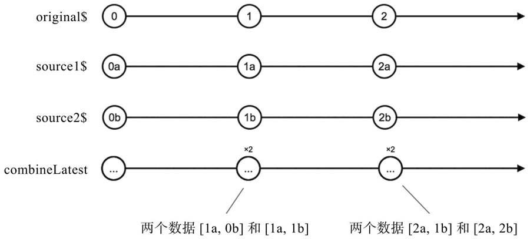 
  >
  > - 如果需要**解决 glitch 问题，需要使用 `withLatestFrom` 操作符**
  >
  > - glitch 现象虽然存在，但是并不一定会造成 bug，从用户感知角度，可能完全注意不到，不过可能引起太多不必要的渲染，从而影响性能
  >
  >   ```typescript
  >   const event$ = fromEvent(document.body, 'click');
  >   const x$ = event$.pipe(map(e => e.x));
  >   const y$ = event$.pipe(map(e => e.y));
  >   // 获得鼠标事件的 x 和 y 坐标值
  >   const result$ = combineLatest([x$, y$], (x, y) => `x: ${x}, y: ${y}`);
  >   result$.subscribe((location) => {
  >     console.log('#render', location);
  >     document.querySelector('#text').innerText = location;
  >   });
  >   // 由于 event$ 被 x$ 和 y$ 共同依赖，点击三次，出现 5 条日志
  >   // #render x: 191, y: 119
  >   // #render x: 135, y: 119
  >   // #render x: 135, y: 165 
  >   // #render x: 137, y: 165
  >   // #render x: 137, y: 82
  >   ```
  >
  >   使用 `withLatestFrom` 操作符修复
  >
  >   ```typescript
  >   const result$ = x$.pipe(withLatestFrom(y$, (x, y) => `x: ${x}, y: ${y}`));
  >   ```

- `combineLatest` 合并同步数据流现象

  > 1. 先开始订阅 source1$，因为是同步数据流，在被订阅时就会吐出所有数据，最后一个吐出的数据是 c
  > 2. 订阅 source2$，当 source2$ 开始吐出数据时，和 source1$ 的最后一个数据 c 组合传给下游
  > 3. source2$ 虽然依然是同步数据流，但它每产生一个数据，都会有准备好的 source1$ 的最新数据
  > 4. 因此，source2$ 产生的每个数据都会引发下游一个数据的产生

  ```typescript
  const source1$ = of('a', 'b', 'c');
  const source2$ = of(1, 2, 3);
  combineLatest([source1$, source2$]).subscribe(console.log)
  // 结果：
  // ["c", 1]
  // ["c", 2]
  // ["c", 3]
  ```

  ```typescript
  const source1$ = of('a', 'b', 'c');
  const source2$ = of(1, 2, 3);
  const source3$ = of('x', 'y');
  combineLatest([source1$, source2$, source3$]).subscribe(console.log)
  // 结果：
  // [ 'c', 3, 'x' ]
  // [ 'c', 3, 'y' ]
  // source1$ 和 source2$ 被订阅得早，它们吐出最后一个数据之前 combineLatest 都凑不齐所有参与 Observable 对象的最新数据
  ```

- 结合多个可观察对象

  ```javascript
  const weight = of(70, 72, 76, 79, 75);
  const height = of(1.76, 1.77, 1.78);
  // 使用回调函数的写法
  // const bmi = combineLatest([weight, height], (w, h) => w / (h * h));
  // 使用管道写法
  combineLatest([weight, height]).pipe(
    map(([w, h]) => {
      console.log('weight:' + w + ",height:" + h);
      return w / (h * h);
    }),
  ).subscribe(x => console.log('BMI is ' + x));
  
  // weight 值立即发出，没有延迟：
  // weight:75,height:1.76
  // BMI is 24.212293388429753
  // weight:75,height:1.77
  // BMI is 23.93948099205209
  // weight:75,height:1.78
  // BMI is 23.671253629592222
  ```

  ```typescript
  // 使用回调函数的写法
  const weight = of(70, 72, 76, 79, 75);
  const height = of(1.76, 1.77, 1.78);
  const bmi = combineLatest([weight, height], (w, h) => w / (h * h));
  ```

- 结合多个**长期存在的可观察对象**

  ```javascript
  const firstTimer = timer(0, 1000); // 从现在开始，每隔1秒发出0, 1, 2...
  const secondTimer = timer(500, 1000); // 0.5秒后，每隔1秒发出0, 1, 2...
  const combinedTimers = combineLatest([firstTimer, secondTimer]);
  combinedTimers.subscribe(value => console.log(value));
  
  // [0, 0] after 0.5s
  // [1, 0] after 1s
  // [1, 1] after 1.5s
  // [2, 1] after 2s
  ```


- 结合可观察对象字典

  ```typescript
  const observables = {
    a: of(1).pipe(delay(1000), startWith(0)),
    b: of(5).pipe(delay(5000), startWith(0)),
    c: of(10).pipe(delay(10000), startWith(0))
  };
  const combined = combineLatest(observables);
  combined.subscribe(value => console.log(value));
  
  // 输出结果为对象
  // {a: 0, b: 0, c: 0} immediately
  // {a: 1, b: 0, c: 0} after 1s
  // {a: 1, b: 5, c: 0} after 5s
  // {a: 1, b: 5, c: 10} after 10s
  ```


#### withLatestFrom 上游驱动合并最新

 

- 调用 `withLatestFrom` 的**源 `Observable` 起到主导数据产生节奏的作用**，作为**参数的 `Observable` 只能贡献数据**，不能控制产生数据的时机

- 当源 `Observable` 发出新值时，`withLatestFrom` 会获取参数 `Observable` 的最新值，并将与源 `Observable` 的值组合成一个新的值

  ```typescript
  // 每隔 2 秒钟产生 0、100、200……
  const source1$ = timer(0, 2000).pipe(map(x => 100 * x));
  // 每隔 1 秒钟产生一个从 0 开始的递增数字
  const source2$ = timer(500, 1000);、
  // 输出的百位数由 source1$ 贡献，个位数由 source2$ 贡献
  const result$ = source1$.pipe(withLatestFrom(source2$, (a, b) => a + b));
  result$.subscribe(console.log)
  // 结果
  // ...2s later
  // 101
  // ...2s later
  // 203
  // ...2s later
  // 305
  // ...2s later
  // 407
  ```

  > 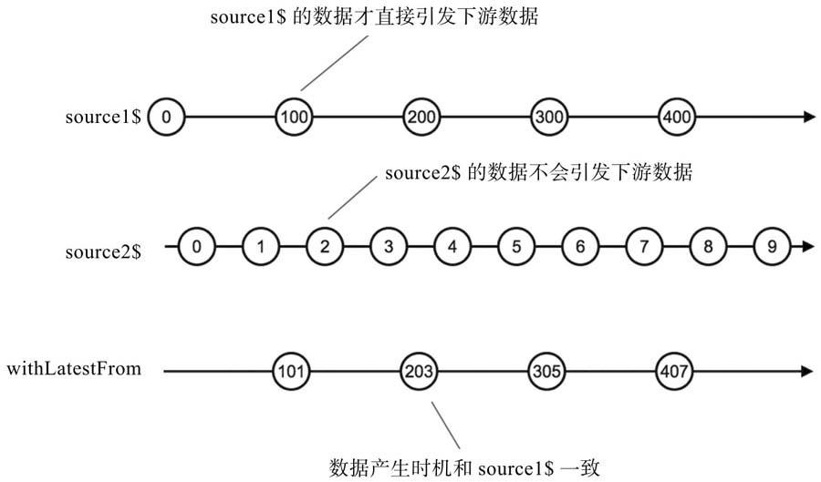 
  >
  > 1. 0 毫秒，source1$ 吐出数据 100，source2$ 没有吐出数据，不会给下游产生数据
  > 2. 500 毫秒，source2$ 吐出数据 0，但是 source2$ 不触发给下游传递数据，不会给下游产生数据
  > 3. 1500 毫秒，source2$ 吐出数据 1，同样不会给下游产生数据
  > 4. 2000 毫秒，source1$ 吐出数据 100，加上 source2$ 吐出的最后一个数据 1，传给下游的数据 101
  > 5. 2500 毫秒，source2$ 吐出数据 2，不会给下游产生数据
  > 6. 3500 毫秒，source2$ 吐出数据 3，不会给下游产生数据
  > 7. 4000 毫秒，source1$ 吐出数据 200，加上 source2$ 吐出的最后一个数据 3，传给下游的的数据 203

- `withLatestFrom` 只会取参数 `Observable` 的最新值，如果参数 `Observable` 在源 `Observable` 发出值之前没有发出任何值，那么将不会产生组合

- `combineLatest` 和 `withLatestFrom` 的选择

  - 如果要合并完全独立的 `Observable` 对象，使用 `combineLatest`
  - 如何要把一个 `Observable` 对象映射成新的数据流，同时要从其他 `Observable` 对象获取最新数据，用 `withLatestFrom`

- 使用 `withLatestFrom` 解决 `combineLatest` 的 glitch 问题

  ```typescript
  const original$ = timer(0, 1000);
  const source1$ = original$.map(x => x + 'a');
  const source2$ = original$.map(x => x + 'b');
  const result$ = source1$.pipe(withLatestFrom(source2$));
  result$.subscribe(console.log)
  // [ '0a', '0b' ]
  // [ '1a', '1b' ]
  // [ '2a', '2b' ]
  // [ '3a', '3b' ] 
  ```


#### forkJoin 等待完成合并

 

- 将所有 `Observable` 对象最后**发出来的最后一个数据合并**成 `Observable`

- `forkJoin` 操作符的**作用类似于 `promise.all()`**，等待每个输入 `Observable` **都完成后，合并返回**它们最后发出的值的列表

  > 1. **所有输入都完成后，只会触发一次，然后立即完结**，合并发出每个流**最后一个值**
  >
  > 2. 返回数组的长度和输入的个数一致，**顺序和输入的顺序一致**，对象的**结构和输入的结构一致**
  >
  > 3. 任何输入**发生错误**，会立马返回错误状态，所有的其他输入**都会被解除订阅**
  > 4. 任一输入没有发出值就**完成**了，返回的 `Observable` 会立马完成
  
- **一般用在只发送一个元素的流的情况**，只关心每个可观察对象最后发出的值时

  像 **HTTP 请求**或者**页面加载**，发起多个请求，让请求并行运行，在所有流收到响应时执行某些任务
  
  ```typescript
  forkJoin(
    fetch("https://server/user/1"),
    fetch("https://server/account/1")
  ).subscribe(([user, account]) => console.log(user, account));
  ```
  
  ```typescript
  // 如果会发送多个数据，只会完结之后把最后一个数据合并
  const source1$ = interval(1000).pipe(map(x => x + 'a'), take(1));
  const source2$ = interval(1000).pipe(map(x => x + 'b'), take(3));
  const concated$ = forkJoin([source1$, source2$]);
  concated$.subscribe({
    next: console.log,
    complete: () => console.log('complete')
  })
  // ["0a", "2b"]
  // complete
  ```
  
  **需要保证多个接口都能够成功返回结果**，使用 `forkJoin` 不好监听具体错误
  
  ```javascript
  // 在外部处理异常
  fokJoin(
    //emit 'Hello' immediately
    of('Hello'),
    //emit 'World' after 1 second
    of('World').pipe(delay(1000)),
    // throw error
    throwError('This will error')
  ).pipe(catchError(error => of(error)))
  .subscribe(val => console.log(val));
  
  // This will error
  ```
  
  ```javascript
  // 在输入内部处理异常，成功获得返回值
  forkJoin(
    //emit 'Hello' immediately
    of('Hello'),
    //emit 'World' after 1 second
    of('World').pipe(delay(1000)),
    // throw error
    throwError('This will error').pipe(catchError(error => of(error)))
  ).subscribe(val => console.log(val));
  
  // ["Hello", "World", "This will error"]
  ```
  
- 结合多个 `Observables`

  ```javascript
  // 字典对象
  const observable = forkJoin({
    foo: of(1, 2, 3, 4),
    bar: Promise.resolve(8),
    baz: timer(4000),
  });
  observable.subscribe({
   next: value => console.log(value),
   complete: () => console.log('This is how it ends!'),
  });
  
  // { foo: 4, bar: 8, baz: 0 } after 4 seconds
  // "This is how it ends!" immediately after
  ```

  ```javascript
  // 数组
  const observable = forkJoin([
    of(1, 2, 3, 4),
    Promise.resolve(8),
    timer(4000),
  ]);
  observable.subscribe({
   next: value => console.log(value),
   complete: () => console.log('This is how it ends!'),
  });
  
  // [4, 8, 0] after 4 seconds
  // "This is how it ends!" immediately after
  ```


#### zip 一对一合并

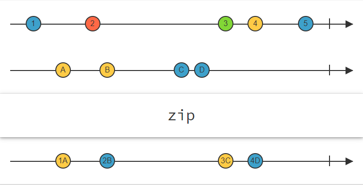 

- 将多个 `Observable` 组合以创建一个 `Observable`，在所有可观察对象发出值后，以**数组形式**发出这些值

- 像拉链一样，以**成对的方式**组合来自多个可观察对象的值

  > 1. `zip` 会立即订阅所有上游 `Observable` 
  >
  > 2. `zip` 只会在**所有输入可观察对象都发出**相应值时**才会发出一个值**，像拉链一样做到**一对一咬合**
  >
  > 3. 如果一个可观察对象发出的值比另一个多，**未匹配的值将被暂时保留，等待另一个可观察对象发出其下一个值**
  >
  > 4. **当任何一个 `Observable` 完成时**，`zip` **只要给这个完结的 `Observable` 对象吐出的所有数据找到配对的数据**，那么 `zip` **就会完成**
  >
  >    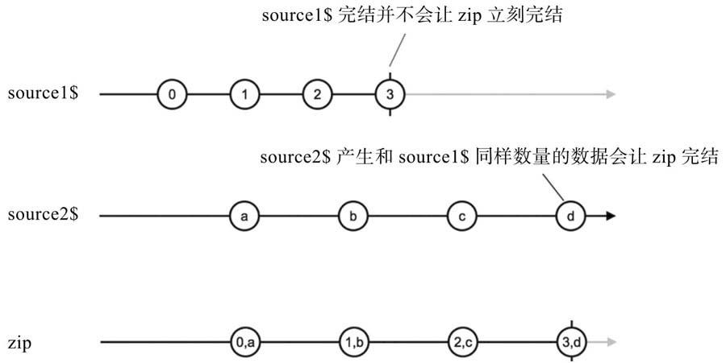 
  >
  > 5. `zip` 在完结的时候，会退订所有的上游数据

- 吐出数据最少的上游 `Observable` 决定了 `zip` 产生的数据个数

  > 例如有三个上游分别为 source1$、source2$、source3$
  >
  > 1. source1$ 吐出 3 个数据后完结，source2$ 吐出 4 个数据后完结，source3$ 永不完结
  >
  >    通过 `zip` 合并三者产生的 `Observable` 对象只产生 3 个数据
  >
  > 2. 假如 source2$ 在时间上要比 source1$ 早完结
  >
  >    `zip` 会等待 source1$ 吐出数据，但最终 source1$ 没有产生数据而是完结
  >
  >    `zip` 会白等，最后会丢弃 source2$ 产生的最后一个数据

- `zip` 支持多个上游 `Observable` 对象，并不仅仅是两个上游数据

- `zip` 可能会造成数据积压，对于超大量的数据流，使用 `zip` 需要考虑潜在的**内存压力**问题

  > 如果某个上游 source1$ 吐出数据的速度很快，而另一个上游 source2$ 吐出数据的速度很慢
  >
  > 那 `zip` 就不得不**先存储** source1$ **吐出的数据**，等着和 source2$ 未来吐出的数据配对
  >
  > 假如 source2$ 迟迟不吐出数据，那么 `zip` 就会一直保存 source1$ 没有配对的数据
  >
  > 最后 `zip` 积压的数据就会越来越多，占用的内存也就越来越多

- `zip` 和 `combineLatest` 的区别

  - `zip` 等待所有输入流都发出它们的第 n 个值，一旦满足这个条件，它就会将所有这些第 n 个值进行组合，并发出第 n 个组合值

  - `combineLatest` 每当任何输入流发出一个值时，它会组合每个输入流发出的最新值

- 组合按照顺序的多个流

  ```typescript
  const documentEvent = eventName =>
    fromEvent(document, eventName).pipe(
      map((e: MouseEvent) => ({ x: e.clientX, y: e.clientY }))
    );
  zip(documentEvent('mousedown'), documentEvent('mouseup')).subscribe(e =>
    console.log(JSON.stringify(e))
  );
  ```
  
  ```typescript
  const sourceObservable1 = interval(1000); // 1秒发出一个值
  const sourceObservable2 = interval(2000); // 2秒发出一个值
  
  zip(sourceObservable1, sourceObservable2).subscribe(([value1, value2]) => {
    console.log(`Combined values: ${value1}, ${value2}`);
  });
  
  // Combined values: 0, 0
  // Combined values: 1, 1
  // Combined values: 2, 2
  // ...
  ```


#### concat 首尾相连

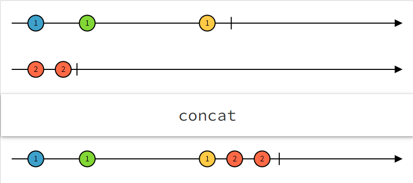 

- 合并数据流，**按顺序一个接一个发出值**：先让第一个数据流发出值，**完成后**再让第二个数据流发出值，进行**整体合并**

  > 1. **前一个** `Observable` 发出的所有项都**会在后一个** `Observable` 发出的任何项**之前被发出**
  > 2. **等待订阅**每个的 `Observable`，**直到前一个 `Observable` 完成**
  > 3. 如果**前一个 `Observable` 永远不完成**，**后续的 `Observable` 将永远不会发出任何值**
  > 4. 前一个完成的时候，`concat` 会调用 `unsubscribe`，然后调用下一个的 `subscribe`

- `concat` 和 `merge` 的区别

  - `concat` 会**按照顺序订阅**，适用于需要按**照特定顺序连接 `Observables`** 的场景
  - `merge` **按照实际发射顺序**，可以在**任何时刻接收到任何 `Observable` 的值，不考虑顺序**

- 按顺序执行多个异步操作

  ```typescript
  const task1 = of('Task 1 Completed').pipe(delay(2000));
  const task2 = of('Task 2 Completed').pipe(delay(1000));
  const task3 = of('Task 3 Completed');
  
  concat(task1, task2, task3).subscribe(result => console.log(result));
  // Task 1 Completed
  // Task 2 Completed
  // Task 3 Completed
  ```

  ```typescript
  // 模拟检查用户名的异步任务
  const checkUsername = of('Username checked').pipe(delay(2000));
  // 模拟检查密码的异步任务
  const checkPassword = of('Password checked').pipe(delay(1000));
  
  concat(checkUsername, checkPassword).subscribe(result => console.log(result));
  ```

- 确保连接的 `Observable` 最终会完成，以避免潜在的无限等待

  ```typescript
  concat(interval(1000), of('This', 'Never', 'Runs')).subscribe(console.log);
  // 0 1 2 3 ...
  // 第二个流永远不会被连接
  ```


#### merge 数据汇流

 

- **交错合并**多个 `Observable`，输出**合并为一个单一的流**

  > 1. `merge` 会在第一时间订阅所有上游 `Observable`，采用**先到先得策略**，**任何 `Observable` 发出值时立即发出值**
  > 2. `merge` **不关心 `Observable` 的发射顺序**，输出 `Observable` 中的值的顺序可能与输入 `Observable` 的订阅顺序不同
  > 3. 如果任何一个输入**发出错误**，**合并的流将立即发出错误通知**，不会等待其他 `Observable` 发出值
  > 4. 如果任何一个 `Observable` **完成**，`merge` 将**继续订阅和合并其他** `Observable` 的值
  > 5. 只有在**上游所有 `Observable` 都完成时，才会完成**

- `merge` 只对异步产生的数据流有意义

  合并的如果是同步的数据，产生的效果和 `concat` 一样

  ```typescript
  const source1 = of(1, 2, 3);
  const source2 = of(4, 5, 6);
  const merged$ = merge(source1, source2);
  // 1 2 3 4 5 6
  ```

- `concat` 和 `merge` 的区别

  - `merge`：更关心观察者尽快接收到值，而不是按照顺序接收值
  - `concat`：更关心顺序
  
- 合并为一个 `Observable`

  ```typescript
  // 模拟多个用户的消息流
  const user1Messages$ = fromEvent(document.getElementById('user1'), 'input').pipe(
    map(message => ({ user: 'User 1', message }))
  );
  const user2Messages$ = fromEvent(document.getElementById('user2'), 'input').pipe(
    map(message => ({ user: 'User 2', message }))
  );
  const user3Messages$ = fromEvent(document.getElementById('user3'), 'input').pipe(
    map(message => ({ user: 'User 3', message }))
  );
  // 合并多个用户的消息流
  const mergedMessages$ = merge(user1Messages$, user2Messages$, user3Messages$);
  
  // 订阅合并后的消息流
  mergedMessages$.subscribe(message => console.log(message));
  ```

- 不等待前一个 `Observable` 完成

  ```typescript
  const observable1 = of('Observable 1 completed').pipe(delay(2000));
  const observable2 = interval(1000);
  
  merge(observable1, observable2).subscribe(
    value => console.log(value),
    null,
    () => console.log('Merge completed')
  );
  // 0
  // Observable 1 completed
  // 1
  // 2
  // ...
  ```


- `merge` 有一个可选参数 `concurrent`，用于指定可**以同时合并的 `Observable` 对象个数**

  有多个 `Observables` 需要同时订阅，但希望限制同时订阅的数量，可以使用 `concurrent` 参数来实现

  如果当前订阅的 `Observable` **数量已达到了 `concurrent` 参数指定的值，会等待其中的一个完成**（或取消订阅）后，**才会订阅下一个**

  ```typescript
  const source1$ = timer(0, 1000).map(x => x + 'A');
  const source2$ = timer(500, 1000).map(x => x + 'B');
  const source3$ = timer(1000, 1000).map(x => x + 'C');
  const merged$ = source1$.merge(source2$, source3$, 2);
  // source1$ 和 source2$ 不会完结，source3$ 中的数据永远不会获得进入 merged$ 的机会
  ```


#### race 赢者通吃

 

- 接收并**同时执行**多个可观察对象，只将**最快**发出的数据流传递给订阅者

- `race` 适用于**只关心第一个发出值的场景**

  > 1. 订阅时，**立即订阅所有**源 `Observable`，一旦**其中一个源发出值**，将**取消订阅其他源**
  > 2. 生成的 `Observable` 将**转发获胜源的所有通知**，包括错误和完成通知
  > 3. 其中一个源在发出第一个通知之前抛出错误，`race` 返回的 `Observable` 也会立即抛出错误，不再等待其他源

```typescript
const example = race(
  interval(1500),
  interval(1000).pipe(mapTo('1s won!')),
  interval(2000),
  interval(2500)
);
const subscribe = example.subscribe(val => console.log(val));
// 1s won!
// 1s won! ....
```


#### startWith 初始值

 

- 订阅的 `Observable` 发出任何其他项之前发出一个特定的初始项，这个初始值会成为 `Observable` 的**第一个发出的值**

  ```typescript
  const original$ = timer(0, 1000);
  const result$ = original$.pipe(startWith('start'));
  result$.subscribe(console.log)
  // start
  // 0
  // 1
  ```

- `startWith` 发出的数据是**同步**的

- `startWith` 支持多个参数

- `startWith ` 的功能可以通过 `concat` 来实现，如果需要异步发送初始值只能利用 `concat`

  ```typescript
  const original$ = timer(0, 1000);
  const result$ = concat([of('start'), original$]);
  ```

  endWith 的功能也可以使用  `concat` 来实现


### 高阶合并操作符

> - 高阶 `Observable`，指的是**产生的数据依然是 `Observable` 的 `Observable`**
>
>   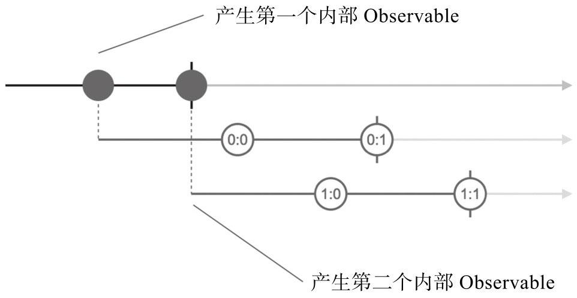 
>
>   ```typescript
>   // 高阶 Observable 对象
>   const ho$ = interval(1000).pipe(
>     take(2),
>     map(x => interval(1500).pipe(
>       map(y => x + ':' + y),
>       take(2))
>     ),
>   )
>   ```
>
> - 相对于高阶 `Observable`，普通的 `Observable`，称为**一阶 `Observable`**
>
> - 高阶 `Observable` 产生的数据，一般称为**内部 `Observable`**
>
> - 高阶 `Observable` 完结，不代表内部 `Observable` 完结，**内部 `Observable` 有自己的生命周期**
>
> - 高阶 `Observable` 的本质是用管理数据的方式来管理多个 `Observable` 对象
>
> - 高阶合并就是把**一个高阶 `Observable` 的所有内部 `Observable` 都组合起来**

> - `concat` 对于 `concatAll`，`merge` 对于 `mergeAll`，`zip` 对于 `zipAll`，`combineLatest` 对于 `combineLatestAll`
> - **后缀为 All** 的操作符，所有的**内部 `Observable` 对象的地位都是平等**的
> - 带 All 的操作符输入 `Observable` 对象是以上游高阶 `Observable` 对象产生的内部 `Observable` 对象形式出现


#### concatAll 串联内部流

 

- `concatAll` 会把高阶 `Observable` 中的内部 `Observable` 做 `concat` 的操作

  > 1. `concatAll` 会**按顺序订阅**高阶 `Observable` 中的每个内部 `Observable`
  > 2. 确保在前一个内部 `Observable` **完成**后**再订阅下一个**内部 `Observable`
  > 3. 如果任一内部 `Observable` 发生了**异常**，会**停止订阅后续**的内部 `Observable`
  > 4. 当**所有内部 `Observable` 都完成后**，`concatAll` **发出完成通知**

- 将高阶 `Observable` 中的内部 `Observable` 进行串联，一个完成后再连接下一个

  ```typescript
  const source$ = of(
    of('Task 1').pipe(delay(1000)),
    of('Task 2').pipe(delay(500)),
    of('Task 3').pipe(delay(1500))
  );
  const result$ = source$.pipe(concatAll());
  result$.subscribe(console.log)
  // Task 1
  // Task 2
  // Task 3
  ```

- 只有当前一个内部 `Observable` 完结的时候，才会去订阅下一个内部 `Observable`

  ```typescript
  const ho$ = interval(1000).pipe(
    take(2),
    map(x => interval(1500).pipe(
      map(y => x + ':' + y),
      take(2))
    ),
    concatAll(),
  )
  ho$.subscribe(console.log)
  // 0:0
  // 0:1
  // 1:0
  // 1:1
  ```

  > 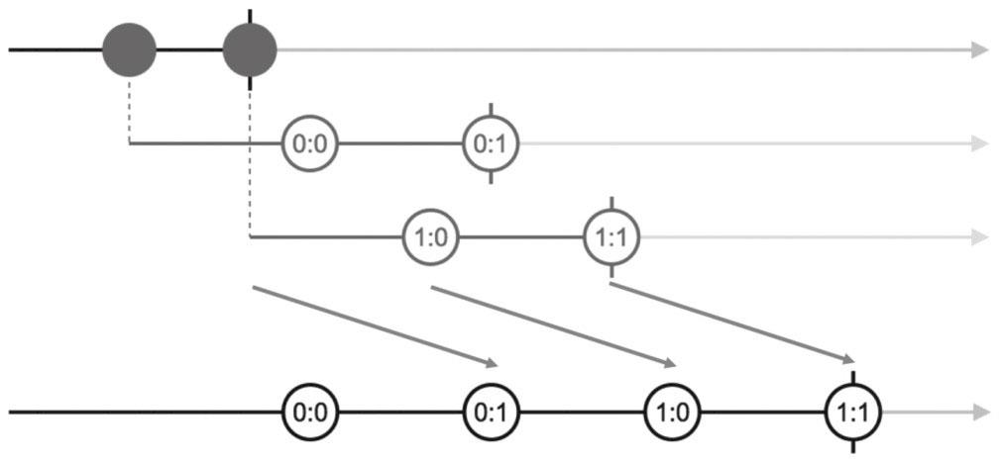 
  >
  > - 1:0 数据在第一个内部 `Observable` 的 0:1 之前就产生了，但在经过 `concatAll` 之后 1:0 出现在 0:1 之后
  > - 这是因为 `concatAll` 首先会等待第一个内部 `Observable` 完结的时候，才会去订阅第二个内部 `Observable`
  > - 虽然高阶 `Observable` 已经产生了第二个内部 `Observable`，不代表 `concatAll` 会立刻去订阅，因为这个 `Observable` 是懒执行

- ` concatAll` 合并的速度赶不上新产生的内部 `Observable` 的速度，会造成内部 `Observable` 的积压

  > 如果高阶 `Observable` 持续不断产生内部 `Observable`，但是内部 `Observable` 又异步产生数据
  >
  > 当 `concatAll` 消耗内部 `Observable` 的速度永远追不上产生内部 `Observable` 对象的速度时
  >
  > 会造成内部 `Observable` 对象的积压，最终这样的积压就是内存泄露

- 使用 `concatAll` 顺序处理多个 HTTP 请求

  ```typescript
  const endpoints = ['api1', 'api2', 'api3'];
  const requests$ = from(endpoints).pipe(
    map(endpoint => ajax.getJSON(endpoint)),
    concatAll()
  );
  ```


#### mergeAll 并行内部流

 

- `mergeAll` 会把高阶 `Observable` 中的多个内部 `Observable` 做 `merge` 的操作

  > 1. `mergeAll` 会**同时订阅**并处理高阶 `Observable` 中的所有内部 `Observable`
  > 2. 当任何一个内部 `Observable` **发出值时**，`mergeAll` 将这个值**传递给下游观察者**
  > 3. 如果任何一个内部 `Observable` **完成**，**不会影响订阅其他**内部 `Observable`
  > 4. 如果任何一个内部 `Observable` **抛出错误**，`mergeAll` 将**立即停止处理其他**内部 `Observable`，并将异常传递给下游观察者

- `mergeAll` **不会等待内部 `Observable` 完成后再订阅下一个**，而是**同时订阅所有**内部 `Observable`，将**值并行合并成一个流**

  ```typescript
  const ho$ = interval(1000).pipe(
    take(2),
    map(x => interval(1500).pipe(
      map(y => x + ':' + y),
      take(2))
    ),
    mergeAll(),
  )
  ho$.subscribe(console.log)
  // 0:0
  // 1:0
  // 0:1
  // 1:1
  ```

  > 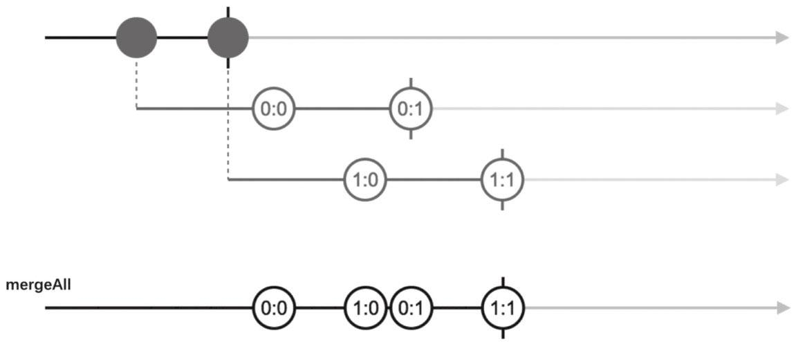 
  >
  > `mergeAll` 只要发现上游产生一个内部 `Observable` 就会立刻订阅，并从中抽取收据
  >
  > 所以第二个内部 `Observable` 产生的数据 1:0 会出现在第一个内部 `Observable` 产生的数据 0:1 之前

- 使用 `mergeAll` 并发处理多个 HTTP 请求

  ```typescript
  const endpoints = ['api1', 'api2', 'api3'];
  const requests$ = from(endpoints).pipe(
    map(endpoint => ajax.getJSON(endpoint)),
    mergeAll()
  );
  ```


#### zipAll 配对内部流

> ```lua
> 内部 Observable 1:  --a--b--c----d--|
> 内部 Observable 2:  ----1----2----3----|
> 内部 Observable 3:  ----x----y----z----|
> 
> zipAll 结果: --------------[a,1,x]--[b,2,y]--[c,3,z]--|
> ```

- `zipAll` 会把高阶 `Observable` 中的每个内部 `Observable` 进行一对一的配对

  > 1. `zipAll` 会订阅高阶 `Observable` 中的每个内部 `Observable`
  > 2. `zipAll` 会等待每个内部 `Observable` 发出一个值，然后将这些值进行配对
  > 3. 如果任何一个内部 `Observable` 完成，其他内部 `Observable` 还没有发出值时，将等待其他 `Observable` 发出值或完成
  > 4. 如果任何一个内部 `Observable` 发生错误，`zipAll` 将立即停止处理其他内部 `Observable`，并将异常传递给下游观察者

- 如果上游高阶 `Observable` 永不完结，`zipAll` 只能等待上游完结，这样才能确定内部 `Observable` 对象的数量


#### combineLatestAll 合并最新内部流

> ```lua
> 内部 Observable 1:  --a--b--c----d------|
> 内部 Observable 2:  ----1----2---3------|
> 内部 Observable 3:  ----x---y----z------|
> 
> combineLatestAll 结果: --[a,1,x]--[b,1,x]--[c,1,x]--[c,2,x]--[c,3,x]--[d,3,x]--[d,3,y]--[d,3,z]--|
> ```

- `combineLatest` 会等待高阶 `Observable` 中的每个内部 `Observable` 发出值后，将这些值进行合并，发出组合后的结果

  > 1. `combineLatestAll` 会订阅高阶 `Observable` 中的每个内部 `Observable`
  > 2. 会等待每个内部 `Observable` 发出至少一个值，然后将这些值进行组合
  > 3. 一旦所有内部 `Observable` 都发出了值，会将最新值进行组合成一个新的 `Observable` 发出
  > 4. 内部 `Observable` 发出新值时，立即将所有内部 `Observables` 的最新值进行组合并发出
  > 5. 所有内部 `Observable` 都完成后，才会完成
  > 6. 如果任何一个内部 `Observable` 发生了错误，立即解除订阅其他内部 `Observable`

- 上游高阶 `Observable` 完结之后才能开始给下游产生数据，因为只有确定了内部 `Observable` 的个数，才能拼凑出第一个传给下游的数据

- 使用 `combineLatestAll` 处理多个 HTTP 请求

  ```typescript
  // 发出一个请求，这个请求会返回一个数组；然后再根据这个数组中的每个 item 再发出一个异步请求，返回一个值；最后整理成一个数组返回
  const fetch1 = () => {
    return timer(1000).pipe(switchMap(() => of([1, 2, 3, 4])));
  };
  const fetch2 = (num) => {
    return timer(1000).pipe(switchMap(() => of(num * num)));
  };
  fetch1().pipe(
    map(fetch2),
    combineLatestAll()
  ).subscribe(console.log);
  ```


#### switchAll 切换最新内部流

 

- `switchAll` 总是**切换到最新的内部 `Observable` 对象获取数据**

  > 1. 每当上游高阶 `Observable` **产生一个内部 `Observable` 对象**，`switchAll` **都会立刻订阅最新的内部 `Observable` 对象**
  > 2. 如果已经订阅了之前的内部 `Observable` 对象，就会**退订过时的内部 `Observable` 对象**，开始**订阅最新的内部 `Observable` 对象**
  > 3. `switchAll` 产生的 `Observable` **完结**必须满足：**上游高阶 `Observable` 已经完结，当前内部 `Observable` 已经完结**
  > 4. 内部 `Observable` 发生错误时，整个高阶 `Observable` 都会结束

- `switchAll` 像是抢山头的游戏，谁抢到了山头，就一直占着山头，直到山头被其他对手抢占，可以确保**始终只有一个内部 `Observable` 被订阅**


#### exhaustAll 等待内部流完成后切换

 

- 在耗尽当前内部 `Observable` 的数据之前不会切换到下一个内部 `Observable` 对象 

  > 1. 每当上游高阶 `Observable` 产生一个内部 `Observable` 对象，`exhaustAll` 都会立即订阅该内部 `Observable` 对象
  > 2. 如果**当前内部 `Observable` 正在进行中，`exhaustAll` 将忽略所有后续的内部 `Observable` 对象，直到当前内部 `Observable` 完结**
  > 3. `exhaustAll` 产生的 `Observable` 完结条件为：上游高阶 `Observable` 已经完结，并且当前内部 `Observable` 已经完结
  > 4. 如果任何内部 `Observable` 发生错误，整个高阶 `Observable` 都会结束

- 当前一个内部 `Observable` 还没有完结，而新的 `Observable` 又已经产生时，**`exhaustAll` 的策略和 `switchAll` 相反**

  - `switchAll` 选择新产生的内部 `Observable` 对象
  - `exhaustAll` 则选择前一个内部 `Observable` 对象

- 始终只接收最新的数据

  ```typescript
  const clicks$ = fromEvent(document, "click");
  const higherOrder$ = clicks$.pipe(
      map(() => interval(1000).pipe(take(4))),
  );
  // 触发点击事件，内部流将订阅并触发定时器并且在4秒后完成
  // 如果在4秒内再次点击，将会忽略第二个内部流
  // 第一个内部流完成后，再次点击，新的内部流会被订阅
  const result$ = higherOrder$.pipe(exhaustAll());
  result$.subscribe((x) => console.log(x));
  ```


### 聚合操作符

> 聚合操作符必定**会遍历上游 `Observable` 对象中吐出的所有数据才给下游传递数据**
>
> 也就是说，**只有在上游完结的时候，才给下游传递唯一数据**


#### count 统计数据个数

 

- `count` 操作符用于**统计上游 `Observable` 对象吐出的所有数据个数**

  > 1. 在**上游 `Observable` 完结后，会发出**一个单一的值的新 `Observable`，表示**上游 `Observable` 发出的值的数量**
  > 2. 如果上游 `Observable` 以错误终止，`count` 将传递此错误通知，而不会首先发出一个值
  > 3. 如果上游 `Observable` 不终止，`count` 不会发出值，也不会终止

  ```typescript
  // 计算第一次点击发生之前经过了多少秒
  const clicks = fromEvent(document, 'click');
  const result = interval(1000).pipe(
    takeUntil(clicks),
    count(),
  );
  result.subscribe(x => console.log(x));
  ```

- `count` 操作符可以传递一个谓词函数 `predicate` 作为可选参数，用于**筛选要计数的值**，只有符合谓词函数条件的值才会被计数

  ```typescript
  const numbers = range(1, 7);
  const result = numbers.pipe(count(i => i % 2 === 1));
  result.subscribe(x => console.log(x));
  // 4
  ```


#### max / min 统计最大最小值

 

- `max` 操作符是取得上游 `Observable` 吐出所有数据的最大值，而 `min` 操作符是取得最小值

  ```typescript
  of(5, 4, 7, 2, 8)
    .pipe(max())
    .subscribe(x => console.log(x));
  // 8
  ```

- `max` 和 `min` 也**只有等到上游的 `Observable` 对象完结才能产生结果**

- 如果上游 `Observable` 吐出的是**复杂类型**，`max` 和 `min` 操作符必须**指定一个比较函数作为参数**

  `function（a, b）{}` 如果 **`a` 和 `b` 相同返回 `0`**；如果 **`a > b` 返回正数**；如果 **`a < b` 返回负数**

  ```typescript
  of(
    { age: 7, name: 'Foo' },
    { age: 5, name: 'Bar' },
    { age: 9, name: 'Beer' }
  ).pipe(
    min((a, b) => a.age < b.age ? -1 : 1)
  ).subscribe(x => console.log(x.name));
  ```


#### reduce 规约统计

 

- `reduce` 操作符接受一个**累加器函数作为参数**，**对上游发出的值进行累加操作**，并得到一个最终的累加结果，这个结果可以**根据累加器函数的定义进行定制**

  > 1. 对**上游 `Observable` 发出的每个值依次调用这个规约函数**，并将当前的累加结果与当前值结合，产生一个新的累加结果
  > 2. 这个新的累加结果又会作为下一次调用累加器函数的参数之一，与下一个值结合
  > 3. 以此类推，遍历上游推送的所有的元素，**将上游 `Observable` 发出的所有值组合在一起**

  ```typescript
  products$.pipe(
    map((product: Product) => product.price),
    reduce((accumulator: number, nextPrice: number) => accumulator + nextPrice)
  ).subscribe((sum: number) => console.log(sum));
  ```

- `reduce` **只会在源 `Observable` 完成时发出一个值**，相当于应用了操作符 `scan`，然后是操作符 `last`

- `reduce` 还有一个可选参数种子值 `seed`，如果**指定了种子值，则该值将用作累加器的初始值**，如果**未指定，则上游的第一个数据将用作种子**

  ```typescript
  // 计算 5 秒内发生的点击事件次数
  fromEvent(document, 'click').pipe(
    takeUntil(interval(5000)),
    map(() => 1),
    reduce((acc, one) => acc + one, 0)
  ).subscribe(x => console.log(x));
  ```


### 条件布尔操作符

> 条件布尔类操作符会根据上游 `Observable` 对象的某些条件产生一个新的**布尔值的 `Observable` 对象**
>
> 操作符会应用一个**判定函数**，返回一个布尔类型的结果
>
> 判定函数有**三个参数，分别为被判定的数据，序号和上游 `Observable`**


#### every 满足所有

 

- 返回一个上游 `Observable` 中的每个项是否满足指定条件的布尔值 `Observable`

  > 1. `every` 要求一个判定函数作为参数，上**游 `Observable` 吐出的每一个数据都会被这个判定函数检验**
  > 2. 如果所有数据的判定结果都是 `true`，在**上游 `Observable` 对象完结的时候**，`every` 产生的新 `Observable` 对象**会吐出一个唯一的布尔值 `true`**
  > 3. 只要上游吐出的数据中**有一个数据检验为 `false`**，不用等到上游 `Observable` 完结，`every` 产生的 `Observable` 对象就**会立刻吐出 `false`**
  > 4. 对一个永不完结的 `Observable` 对象使用 `every` 操作符，产生的新 `Observable` 对象也是永不完结的

  ```typescript
  concat(
    fakeRequest(1),
    fakeRequest('invalid payload'),
    fakeRequest(2)
  ).pipe(
    every(e => e.code === 200),
    tap(e => log(`all request successful: ${e}`))
  ).subscribe();
  ```


#### find 满足条件首值

 

- 在上游 `Observable` 中查找满足指定条件的第一个值，并将其发出

  > 1. 找到上游 `Observable` 对象中**满足判定条件的第一个数据**，产生的 `Observable` 对象在**吐出数据之后会立刻完结**
  > 2. 上游 `Observable` 中始终**没有出现满足判定条件的数据**，`find` 会**吐出 `undefined` 后完结**
  > 3. 上游 `Observable` 始终**不完结**，而且**没有吐出满足判定条件的数据**，那么 `find` 产生的 `Observable` 对象**永远不会完结**

  ```typescript
  from([
    { id: 1, name: 'Alice', age: 25 },
    { id: 2, name: 'Bob', age: 17 },
    { id: 3, name: 'Charlie', age: 20 },
    { id: 4, name: 'David', age: 16 },
    { id: 5, name: 'Eva', age: 22 }
  ]).pipe(
    find(user => user.age > 18)
  )
  ```

- `find`、 `filter`、 `first` 的区别

  > - `find` 只会发射源 `Observable` 中满足条件的第一个值，然后立即完成，未找到任何匹配项，会在完成时发出 `undefined`
  > - `filter` 会发射源 `Observable` 中满足条件的所有值，直到源 `Observable` 完成或发生错误
  > - `first` 只会发射源 `Observable` 中满足条件的第一个值，然后立即完成，未找到任何匹配项，会发出错误通知


#### findIndex 满足条件首个索引

 

- `findIndex` 操作符与 `find` 操作符类似，不同之处在于发出的是**满足条件的值在上游 `Observable` 中的索引**，而不是值本身

  ```typescript
  const clicks = fromEvent(document, 'click');
  const result = clicks.pipe(findIndex(ev => (<HTMLElement>ev.target).tagName === 'DIV'));
  result.subscribe(x => console.log(x));
  ```

- 如果没有找到满足条件的数据，会在完成时发出 `-1`


#### isEmpty 是否为空流

 

- `isEmpty` 用于检查一个上游 `Observable` 对象是不是空 `Observable`

  ```typescript
  const source = new Subject<string>();
  const result = source.pipe(isEmpty());
  source.subscribe(x => console.log(x));
  result.subscribe(x => console.log(x));
  source.next('a');
  source.next('b');
  source.next('c');
  source.complete();
  // Outputs
  // 'a'
  // false
  // 'b'
  // 'c'
  ```

- 空 `Observable` 是指**没有吐出任何数据就完结的 `Observable` 对象**

  > 如果源 `Observable` 发出了任何值，它会发出 `false`，表示源 `Observable` 不为空
  >
  > 如果源 `Observable` 在完成时没有发出任何值，它会发出 `true`，表示源 `Observable` 是空的

- 使用 `count` 操作符也可以达到类似的效果，但是 `isEmpty` 可以更快地发出 `false` 值


#### defaultIfEmpty 空流默认值

 

- 如果源 `Observable` 是空的，`defaultIfEmpty` 操作符会发出指定的默认值，否则会发出源 `Observable` 发出的值

  ```typescript
  const clicks = fromEvent(document, 'click');
  const clicksBeforeFive = clicks.pipe(takeUntil(interval(5000)));
  const result = clicksBeforeFive.pipe(defaultIfEmpty('no clicks'));
  result.subscribe(x => console.log(x));
  ```

- 如果 `defaultIfEmpty` 不提供任何参数，遇到上游为空的情况，会吐出 `null`


### 过滤操作符

> - 过滤类操作符会产生一个新的 `Observable` 对象，新产生的 `Observable` 对象中数据源自上游 `Observable`
> - 几乎所有的过滤类操作符都有判定函数参数，判定函数返回 `true` 代表可以进入下游，否则就抛弃掉
> - 有的过滤类操作符还可以接受一个结果选择器函数，用来定制传给下游的数据


#### filter 过滤上游数据

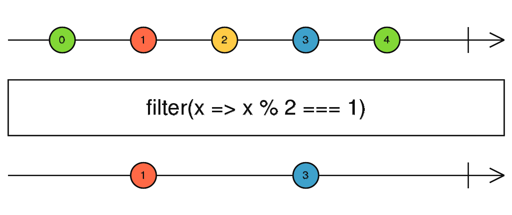 

- `filter` 操作符用于根据指定的条件**过滤源 `Observable` 中的值，并仅发出满足条件的值**

  ```typescript
  from([
    { name: 'Joe', age: 31 },
    { name: 'Bob', age: 25 }
  ]).pipe(filter(person => person.age >= 30))
    .subscribe(val => console.log(`Over 30: ${val.name}`));
  ```

- `filter` 产生的 `Observable` 对象，产生数据的时机和上游是一致的


#### first 获取首值

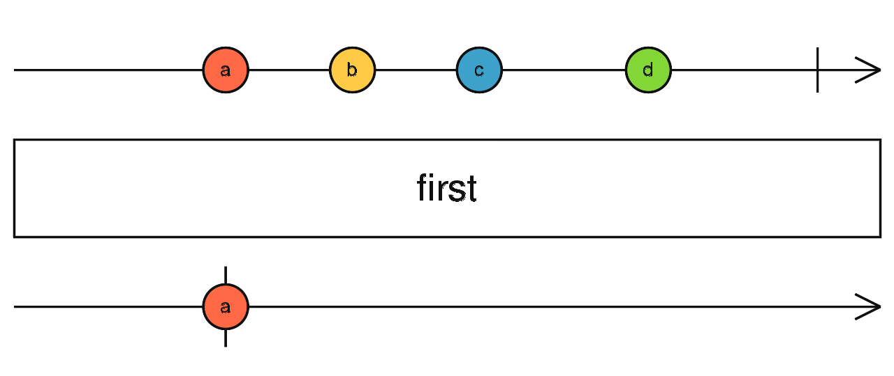 

- 获取数据流中的**第一个值或者查找数据流中第一个符合条件的值**，**获取到值后终止流**

- `first` 可以**没有判定函数**，没有判定函数时相当于**只获取上游 `Observable` 吐出的第一个数据**

  ```typescript
  interval(1000).pipe(first())
    .subscribe(n => console.log(n))
  ```

  ```typescript
  interval(1000).pipe(first(n => n === 3))
    .subscribe(n => console.log(n))
  ```

- 如果 `first` 的上游 `Observable` 到**完结时依然没有满足判定条件的数据**，那么 `first` 会**向下游抛出一个 `error`**

  ```typescript
  of(3, 1, 4, 1, 5, 9).pipe(first(x => x < 0))
    .subscribe(data => console.log())
  // EmptyError: no elements in sequence
  ```

- `first` 允许指定一个**默认值**，作为第二个参数传入，在源 `Observable` 不发出任何值时发出

  ```typescript
  const source = from([1, 2, 3, 4, 5]);
  const example = source.pipe(first(val => val > 5, 'Nothing'));
  const subscribe = example.subscribe(val => console.log(val));
  ```


#### last 获取末值

 

- `last` 操作符用于从上游 `Observable` 中找到**最后一个满足给定条件的值**，并将其发出

  ```typescript
  from([1, 2, 3, 4, 5]).pipe(last()).subscribe(console.log)
  ```

  ```typescript
  interval(1000).pipe(
    take(5),
    last(num => num % 2 === 0)
  ).subscribe(console.log)
  // 尽管第3秒钟出现了符合条件的2，但是last要第4秒钟才能推出数据2，因为last只有在完结的时候才能确定
  ```

- `last` 无论如何都要**等到上游 `Observable` 完结的时候才吐出数据**

- 如果**没有找到匹配项**， `last` 操作符会在上游 `Observable` **完成时发出错误通知**

  ```typescript
  of(3, 1, 4, 1, 5, 9).pipe(last(x => x < 0))
    .subscribe(data => console.log())
  // EmptyError: no elements in sequence
  ```

- `last` 操作符可以提供一个**默认值参数**，如果没有找到匹配项，则会发出此默认值而不是发出错误

  ```typescript
  const source = from([1, 2, 3, 4, 5]);
  const exampleTwo = source.pipe(last(v => v > 5, 'Nothing!'));
  const subscribeTwo = exampleTwo.subscribe(val => console.log(val));
  ```


#### take 获取指定数量首值

 

- `take` 操作符从上游 `Observable` 中**仅取出指定数量的值，然后完成**

- `take` 只支持一个参数 `count`，也就是限定拿上游 `Observable` 的数据数量

  ```typescript
  fromEvent(document, 'click').pipe(
    take(1),
    tap(v => {
      document.getElementById('locationDisplay').innerHTML = `Your first click was on location ${v.screenX}:${v.screenY}`;
    })
  ).subscribe();
  ```

- 如果 `take` 指定的数量超过了上游 `Observable` 发出的值的数量，并不会等待更多的值，而是在已经收到的值后立即完成

- `take` 操作符通常用于限制 `Observable` 流中的数据量，可以**控制订阅的生命周期**

- 使用 `take` 和 `filter` 的组合来获得上游 `Observable` 满足条件的前 N 个数据

  ```typescript
  // 自定义管道
  const takeCountWhile = (count, predicate) => pipe(
    filter(predicate),
    take(count)
  );
  // // 只取前两个偶数
  of(1, 2, 3, 4, 5).pipe(
    takeCountWhile(2, x => x % 2 === 0)
  ).subscribe(console.log);
  ```


#### takeLast 获取指定数量末值

 

- `takeLast` 操作符从上游 `Observable` 中**仅发出最后指定数量的值**，并**在源 `Observable` 完成时发出**

-  `takeLast` 操作符只接收一个参数 `count`，指定要发出的最后值的数量

  ```typescript
  interval(1000).pipe(
    take(5),
    takeLast(3)
  ).subscribe(console.log)
  // 2, 3, 4
  ```

- `takeLast` 只有**在上游数据完结的时候才能决定最后的数据是哪些**，而且是**一次性产生所有数据**

- 如果上游 `Observable` 不会完成，`takeLast` 将永远不会发出任何值


#### takeWhile 获取值直至条件不满足

 

- `takeWhile` 接受一个**判定函数作为参数**，`takeWhile` 会**持续吐出上游数据，直到判定函数返回 `false`**

  ```typescript
  of(1, 2, 3, 4, 5).pipe(
    takeWhile(val => val <= 4)
  ).subscribe(console.log)
  // 1, 2, 3, 4
  ```

- 如果判定函数返回 `true`，`takeWhile` 会继续发射，一旦遇到**第一个使判定函数返回 `false`** 的数据，`takeWhile` 生成的 `Observable` 就**会立即完成**

- 判定函数有两个参数，分别代表上游的数据和对应的序号

- 第二个可选参数 `inclusive`，当设置为 `true` 时，导致判定函数返回 `false` 的那个值也会被发射出去，然后立即完成

  ```typescript
  of(1, 2, 3, 4, 5).pipe(
    takeWhile(value => value <= 3, true)
  ).subscribe(console.log)
  // 1, 2, 3, 4
  ```

- `takeWhile` 更适用于需要根据特定条件获取 `Observable` 值的情况，并在不满足条件时立即停止获取的场景

- `takeWhile` 和 `filter` 操作符都可以根据指定条件筛选源 `Observable` 中的值，但是之间有关键性区别

  > - `filter` 仅仅过滤源 `Observable` 中的值，不会影响 `Observable` 的完成状态
  > - `takeWhile` 当遇到第一个不满足条件的值时，会立即完成，不再发射任何值


#### takeUtil 停止获取当接到通知

 

- `takeUntil` 操作符是**用一个 `Observable` 对象  `notifier` 来控制另一个 `Observable` 对象的数据产生**

  > 1. 参数是另一个 `Observable` 对象 `notifier`，**由这个 `notifier` 来控制什么时候结束从上游 `Observable` 拿数据**
  > 2. 使用 `takeUntil`，上游的数据直接转手给下游，**直到参数 `notifier` 吐出一个数据或者完结**，就会**停止订阅上游 `Observable`**
  > 3. `notifier` 对象**吐出数据或者完结可以是异步**的，可以利用 `takeUntil` **灵活操控上下游通道的关闭时机**
  > 4. `notifier` 参数如果在吐出数据或者完结之前抛出了错误，那 `takeUntil` 也会把这个错误抛给下游

  ```typescript
  fromEvent(document, "mousemove").pipe(
  	takeUntil(fromEvent(document.getElementById("btn"), "click"))
  ).subscribe(console.log)
  ```

- `takeUntil` 操作符常用于处理取消订阅的场景，有效管理资源和避免内存泄漏

  ```typescript
  export class ExampleComponent {
  
    private destroy$ = new Subject<void>();
  
    ngOnInit() {
      this.service.getData()
        .pipe(takeUntil(this.destroy$))
        .subscribe(data => console.log(data));
    }
  
    ngOnDestroy() {
      this.destroy$.next();
      this.destroy$.complete();
    }
  }
  ```


#### skip 

 


### 辅助操作符

#### repeat 重复订阅

在上游 `Observable` **结束时重新订阅**上游 `Observable` 

> - **接收到 `complete` 事件时，才会做退订并重新订阅的动作**
> - ` repeat` 的**重复功能依赖于上游的完结时机**，要**保证上游 `Observable` 对象最终一定会完结**
> - ` repeat` 返回的是全新的 `Observable` 对象，上游 `Observable` 实际上被订阅了 `repeat(n)` 次
> - 无参数 `repeat()` 代表无限次的重复

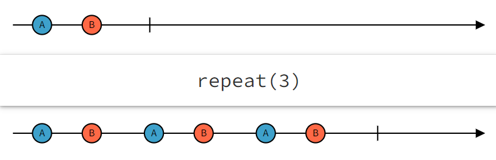 

> `repeat` 和 `retry` 的区别
>
> - `retry` 操作符用于在**发生错误时重新订阅源** `Observable`
>
>   当源 `Observable` 发生错误时，`retry` 会重新订阅，而不会重新执行错误的部分
>
>   用于在 `Observable` 流发生错误时进行重试，比如网络请求失败后的重试操作
>
> - `repeat` 会在源 `Observable` 完成时，重新订阅并重新执行源 `Observable`
>
>   适用于对一个 `Observable` 流进行重复执行的情况，比如周期性任务或循环操作

- 定期轮询

  ```typescript
  const pollData = ajax('/api/data').pipe(
    repeat(), // 无限重复
    delay(5000) // 5秒延迟
  );
  pollData.subscribe(response => console.log(response));
  ```

- 检测鼠标事件

  ```typescript
  const mouseDown$ = fromEvent(document, 'mousedown');
  const mouseUp$ = fromEvent(document, "mouseup");
  const mouseMove$ = fromEvent(document, "mousemove");
  const mouseHold$ = mouseDown$.pipe(
    switchMap(downEvent => {
      // 维持鼠标按下两秒，视为 mouse hold
      return timer(2000).pipe(
        switchMap(time => of('HOLD'))
      );
    }),
    takeUntil(merge(mouseUp$, mouseMove$)),	// 鼠标抬起或移动完成 mouse hold 事件
    repeat()
  );
  const mouseMove$ = mouseDown$.pipe(
  	switchMap()
  )
  ```

- 利用  `scan` 和 `repeat` 实现秒表计时器

  `scan` 将保持递增计数，`repeat` 将以 1 秒的延迟重复订阅

  ```html
  <button #start>Start/Restart Timer</button>
  <button #resume [disabled]="!(stop$ | async)">Resume Timer</button>
  <button (click)="stoptimer()">Stop Timer</button>
  <div>Timer Count: {{ timer$ | async }}</div>
  ```

  ```typescript
  class AppComponent {
    @ViewChild('start', { static: false }) start: ElementRef;
    @ViewChild('resume', { static: false }) resume: ElementRef;
  
    stop$ = new Subject<boolean>();
    timer$: Observable<number>;
    current: number = 0;
  
    ngAfterViewInit() {
      merge(
        fromEvent(this.resume.nativeElement, 'click').pipe(
          map(() => this.current)
        ),
        fromEvent(this.start.nativeElement, 'click').pipe(map(() => 0))
      ).subscribe((beginCount: number) => {
        this.current = beginCount;
        this.startTimer();
      });
    }
  
    startTimer() {
      this.timer$ = of(true).pipe(
        scan(
          (acc, curr) => ((acc = acc + this.current), this.current++),
          this.current
        ),
        repeat({ delay: 1000 }),
        takeUntil(this.stop$)
      );
    }
  
    stoptimer() {
      this.stop$.next(true);
    }
  }
  ```


## 辅助方法

### distinctUntilChanged

**检测数据源当前发出的数据流是否和上次发出的相同**，如相同，跳过，**不相同，发出**

 

```typescript
import { of } from 'rxjs'
import { distinctUntilChanged } from 'rxjs/operators'

of(1, 1, 2, 2, 1, 1, 2, 3, 3, 4)
.pipe(distinctUntilChanged())
.subscribe(x => console.log(x)) // 1, 2, 1, 2, 3, 4
```


## 操作符

数据流：从可观察对象内部输出的数据就是数据流，可观察对象内部可以向外部源源不断的输出数据

操作符：用于操作数据流，可以将对象数据流进行转换，过滤等操作


### map、mapTo

`map`： 对数据流进行转换，**基于原有值进行转换**

 

```typescript
import { interval } from 'rxjs';
import { map } from 'rxjs/operators';

interval(1000)
.pipe(map(n => n * 2))
.subscribe(n => console.log(n));
```

`mapTo`：对数据流进行转换，不关心原有值，**可以直接传入要转换后的值**


### pluck

**获取数据流对象中的属性值**

 

```typescript
import { interval } from 'rxjs'
import { pluck, mapTo } from 'rxjs/operators'

interval(1000)
    .pipe(
    	mapTo({ name: '张三', a: { b: 'c' } }),
    	pluck("a", "b")
).subscribe(n => n.console.log(n))
```


### switchMap

**切换可观察对象**。

当外层的可观察对象重新发出数据流时，`switchMap` 会抛弃上一次发出的数据流，而重新进行数据流的发送

点击一个按钮发送一个请求，点击事件是一个` observable`, 发送请求也是一个 `observable`，默认情况下**用户订阅的是点击事件**，当**点击事件被触发时，需要把 `observable` 进行切换到发送请求的 `observable`**。订阅者就可以拿到发送请求的结果

 

```typescript
import { fromEvent } from 'rxjs'
import {}

const button = document.getElementById('btn')

fromEvent(button, 'click')
.pipe(switchMap(event => interval(1000)))
.subscribe(console.log)
```


### delay、delayWhen

`delay`：对上一环节的操作整体进行延迟，只执行一次。

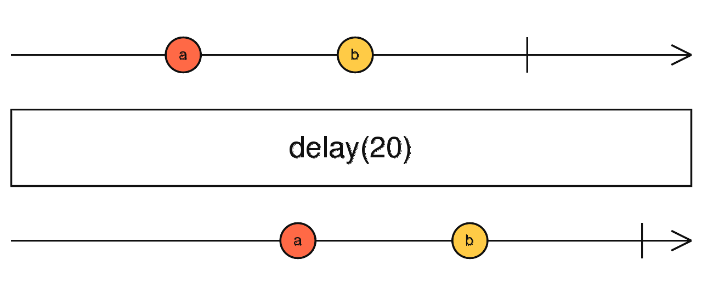 

```typescript
import { from } from "rxjs"
import { delay, map, tap } from "rxjs/operators"

from([1, 2, 3])
  .pipe(
    delay(1000),
    tap(n => console.log("已经延迟 1s", n)),
    map(n => n * 2),
    delay(1000),
    tap(() => console.log("又延迟了 1s"))
  )
  .subscribe(console.log)
```

`delayWhen`：对上一环节的操作进行延迟，上一环节发出多少数据流，传入的回调函数就会执行多次


### throttleTime

**节流**，可观察对象高频次向外部发出数据流，通过 `throttleTime` 限制在**规定时间内每次只向订阅者传递一次数据流**

 

```typescript
import { fromEvent } from 'rxjs'
import { throttleTime } from 'rxjs/operators'

fromEvent(document, 'click')
.pipe(throttleTime(2000))
.subscribe(x => console.log(x))
```


### debounceTime

**防抖**，触发高频事件，**只响应最后一次**

 

```typescript
import { fromEvent } from 'rxjs'
import { debounceTime } from 'rxjs/operators'

fromEvent(document, 'click')
.pipe(debounceTime(1000))
.subscribe(x => console.log(x))
```


### distinctUntilChanged

检测数据源当前发出的数据流是否和上次发出的相同，如相同，跳过，不相同，发出

 **默认使用 `===` 进行比较**

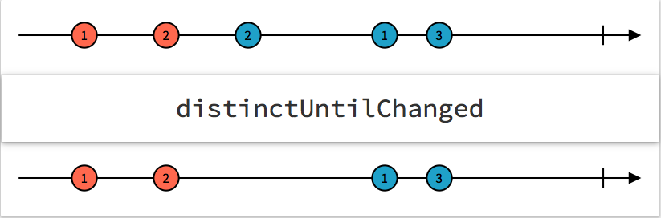 

```typescript
import { of } from "rxjs"
import { distinctUntilChanged } from "rxjs/operators"

of(1, 1, 2, 2, 2, 1, 1, 2, 3, 3, 4)
  .pipe(distinctUntilChanged())
  .subscribe(x => console.log(x))
// 1, 2, 1, 2, 3, 4
```

可以传入**比较函数**

```typescript
import { of } from 'rxjs';
import { distinctUntilChanged } from 'rxjs/operators';
of(
  { number: 2, name: 'zhangsan'},
  { number: 3, name: 'lisi'},
  { number: 5, name: 'lisi'},
  { number: 3, name: 'zhaoliu'},
)
  .pipe(distinctUntilChanged((p: any, q: any) => p.name === q.name))
  .subscribe(x => console.log(x))
//  { number: 2, name: 'zhangsan'}, { number: 3, name: 'lisi'},{ number: 3, name: 'zhaoliu'},
```


## 异常处理

### Observable 错误处理

- RxJS 中，**任何给定的流只能出错一次**，需要注意的是，流的完成和错误是互斥的，两种情况只能发生一种，不能同时发生

  一个流完成意味着：流已结束其生命周期，没有报任何错误，完成后，流将不再发出任何其他值

  一个流报错意味着：流带着错误结束了生命周期，当错误抛出后，流将不再发出任何其他值

  如果一个流已经完成了，它不可能在之后报错；如果一个流报错了，它不可能在之后完成

- 错误回调函数

  ```typescript
  const http$ = this.http.get<Course[]>('/api/courses'); 
  http$.subscribe(
    res => console.log('HTTP response', res),
    err => console.log('HTTP Error', err),	// 只有在发生错误时才调用该函数，此处理函数本身接收一个错误
    () => console.log('HTTP request completed.')
  );
  ```


### catchError 操作符

接收错误并将其传递给错误处理函数，错误处理函数将返回一个 `Observable`，替代刚刚出错的流并返回给下游

这个替换的 `Observable` 随后将被订阅，它的值将被用来代替出错的输入 `Observable`

 

- 捕获和**替换策略**

  ```typescript
  const http$ = this.http.get<Course[]>('/api/courses');
  http$
    .pipe(catchError(err => of([])))	// 出现错误时，才会调用错误处理函数，返回新构建的 Observable 对象
    .subscribe(
      res => console.log('HTTP response', res),	// 如果出错，替换的 Observable 被用来为 http$ 的订阅者提供一个默认的回退值[]
      err => console.log('HTTP Error', err),	// 将不再报错
      () => console.log('HTTP request completed.')
  ); 
  ```

- 捕获和**再抛出策略**

  ```typescript
  const http$ = this.http.get<Course[]>('/api/courses');
  http$
    .pipe(
      catchError(error => {
        // 可以添加任何想要的错误处理逻辑，比如向用户展示错误信息
        console.log('Handling error locally and rethrowing it...', error);
        // 返回一个替换的 Observable，使用 throwError 创建
        return throwError(error);		// 在本地处理错误后重新抛出 catchError 捕获的错误
      })
  	)
    .subscribe(
      res => console.log('HTTP response', res),
      error => console.log('HTTP Error', error),	// 处理后的错误
      () => console.log('HTTP request completed.')
  );
  ```

- 多次使用 `catchError`

  ```typescript
  const http$ = this.http.get<Course[]>('/api/courses');
  http$
    .pipe(
      map(res => res['payload']),
      catchError(err => {
        // 捕捉到一个错误，在本地处理并重新抛出
        console.log('caught mapping error and rethrowing', err);
        return throwError(err);
      }
      ),
      catchError(err => {
        // 再次捕获相同的错误，这一次提供一个回退值
        console.log('caught rethrown error, providing fallback value');
        return of([]);
      })
  )
    .subscribe(
      res => console.log('HTTP response', res),	// 回退值 [] 按预期发出
      err => console.log('HTTP Error', err),	// 未到达 subscribe 错误处理
      () => console.log('HTTP request completed.')
  );
  ```

  错误会抛出，同时发出默认值

  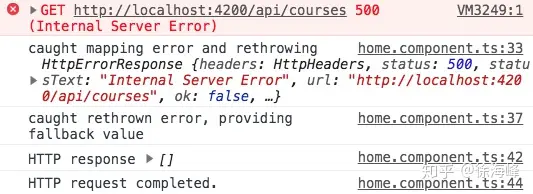 


### finalize 操作符

当源在 `complete` 或 `error` 上终止时将调用指定的函数

```typescript
const http$ = this.http.get<Course[]>('/api/courses');
http$
  .pipe(
    map(res => res['payload']),
    catchError(err => {
      console.log('caught mapping error and rethrowing', err);
      return throwError(err);
    }),
    finalize(() => console.log("first finalize() block executed")),		// 处理异常
    catchError(err => {
      console.log('caught rethrown error, providing fallback value');
      return of([]);
    }),
    finalize(() => console.log("second finalize() block executed"))		// 处理完成
)
  .subscribe(
    res => console.log('HTTP response', res),
    err => console.log('HTTP Error', err),
    () => console.log('HTTP request completed.')
);
```

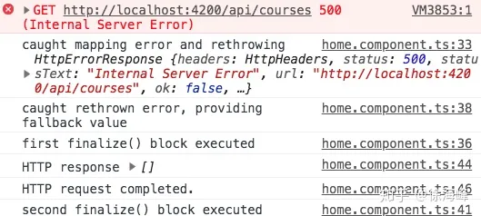 


### retryWhen 操作符

`retryWhen` 直接创建一个通知流，通知流决定何时重试，将一个可观察的错误作为输入参数，它将发出可观察输入的错误作为值

`retryWhen` 在**每次通知流发出一个值时都会重试输入流**

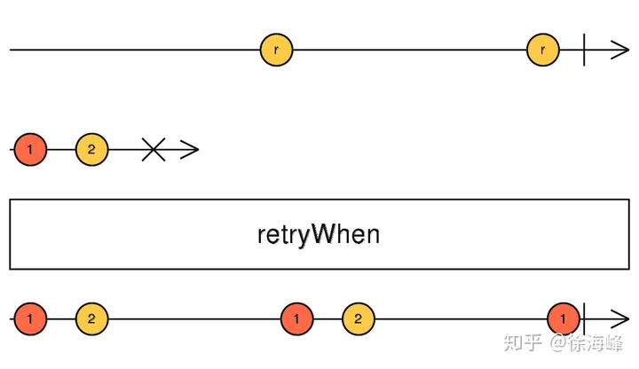 

> - `Observable` 1-2 流被订阅，它的值立即反应在 `retryWhen` 返回流的输出
> - 即使 `Observable` 1-2 流已经完成，但是它仍然可以被重试
> - 通知流在 `Observable` 1-2 流完成后发出 r 值
> - 通知流可以发出任何值，在此示例中发出了 r
> - 重要的是 r 值发出的时刻，将触发 1-2 `Observable` 重试
> - `Observable` 1-2 将会被 `retryWhen` 再次订阅，它的值反应在 `retryWhen` 的输出 `Observable` 中
> - 通知 `Observable` 继续发出另一个 r 值，同样会触发 1-2 `Observable` 重试
> - 但是此时通知 `Observable` 完成了
> - 此时，1-2 `Observable` 正在进行的重试尝试也提前完成，所以只发出了值1，值 2 还未发出

- 立即重试策略： `retryWhen ` 发出值时将触发重试尝试

  ```typescript
  // HTTP 请求最初失败，但随后尝试重试，第二次请求成功通过
  const http$ = this.http.get<Course[]>('/api/courses');
  http$.pipe(
    tap(() => console.log("HTTP request executed")),
    map(res => Object.values(res["payload"]) ),
    shareReplay(),
    retryWhen(errors => {
      return errors
        .pipe(
        	tap(() => console.log('retrying...'))
      );
    })
  ).subscribe(
    res => console.log('HTTP response', res),
    err => console.log('HTTP Error', err),
    () => console.log('HTTP request completed.')
  );
  ```

  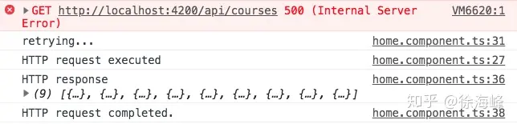 


### delayWhen 操作符

**延迟发出值，延迟时间由提供的持续时间选择器函数决定**，持续时间选择器函数将**返回一个流**，这个流**决定每个输入值的延迟何时结束**

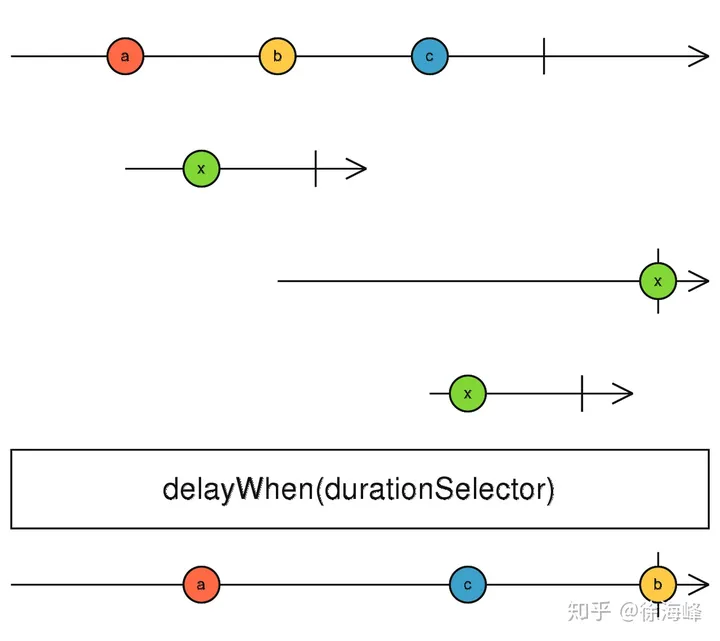 

> 假设源 `Observable` a-b-c 是发出错误的流，它会随着时间的推移发出失败的 HTTP 错误
>
> 每一个输入错误的流都会被延迟，最后出现在输出的 `Observable` 中，把错误的 `Observable` 的值传递给 `delayWhen`  的时间选择器函数
>
> 持续时间选择器函数将返回一个 `Observable`，这个 `Observable` 决定每个输入值的延迟何时结束
>
> a-b-c 都有其的持续时间选择器 `Observable`，当这些持续时间选择器中的每一个都发出值时，相应的输入值 a-b-c 将出现在 `delayWhen` 的输出中
>
> c 在 b 之前出现是因为 b 持续时间选择器 `Observable` 是在 c 的持续时间选择器 `Observable` 之后发出它的值

- 延迟重试策略：在短时间延迟后重试同一个请求，例如由于服务器高流量而导致失败的网络请求

  `retryWhen` 定义的通知 `Observable` 的函数只被调用一次，在该函数中返回一个 `Observable`，它将在需要重试时发出值

  当有错误发生 `delayWhen` 操作符将会通过调用 `timer` 函数创建一个持续时间选择器的 `Observable`

  持续时间选择器 `Observable` 将会在一定延迟时间后发出值，发出后并完成

  这时 `retryWhen ` 的通知 `Observable` 将会发出一个值，将执行一次重试尝试

  ```typescript
  // 每次错误发生2秒后连续重试失败的 HTTP 请求
  const http$ = this.http.get<Course[]>('/api/courses');
  http$.pipe(
    tap(() => console.log("HTTP request executed")),
    map(res => Object.values(res["payload"]) ),
    shareReplay(),
    retryWhen(errors => {
      return errors
        .pipe(
          delayWhen(() => timer(2000)),
          tap(() => console.log('retrying...'))
      );
    })
  ).subscribe(
    res => console.log('HTTP response', res),
    err => console.log('HTTP Error', err),
    () => console.log('HTTP request completed.')
  );
  ```

  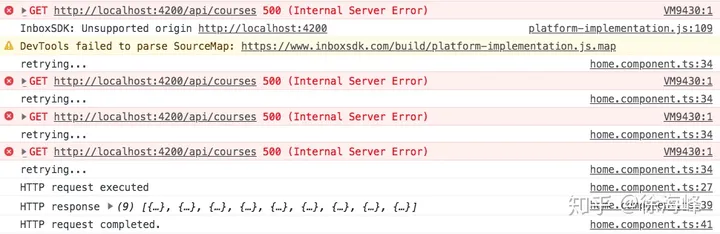 


### delay 操作符


## 自定义操作符

- 一个管道的操作符是一个**以 `Observable` 作为输入并返回另一个 `Observable` 的纯函数**，之前的 `Observable` 保持不变

  ```typescript
  function log<T>(source$: Observable<T>): Observable<T> {
    return source$.pipe(tap(v => console.log(`log: ${v}`)));
  }
  const results$ = source$.pipe(log);
  ```

- 使用 `MonoTypeOperatorFunction`  或 `OperatorFunction`**来简化返回类型声明**

  - `MonoTypeOperatorFunction` 接受一个类型为 `T` 的 `Observable` 并返回另一个相同类型的 `Observable `

    ```typescript
    interface MonoTypeOperatorFunction<T> {
      (source: Observable<T>): Observable<T>;
    }
    ```

  - `OperatorFunction` 接受类型为 `T` 的 `Observable` 并返回类型为 `R` 的 `Observable`

    ```typescript
    interface OperatorFunction<T, R> {
      (source: Observable<T>): Observable<R>;
    }
    ```

- 可以定义一个**返回操作符的工厂函数**，为自定义操作符提供上下文

  ```typescript
  function logWithTag<T>(tag: string): (source$: Observable<T>) => Observable<T> {
    return source$ => source$.pipe(tap(v => console.log(`logWithTag(${tag}): ${v}`)));
  }
  ```

  利用**静态 `pipe` 函数**的方式定义操作符

  ```typescript
  import { MonoTypeOperatorFunction, pipe } from "rxjs";
  ```

  ```typescript
  function logWithTag<T>(tag: string): MonoTypeOperatorFunction<T> {
    return pipe(tap(v => console.log(`logWithTag(${tag}): ${v}`)));
  }
  ```

  ```typescript
  interval(1000).pipe(
    take(3),
    logWithTag("RxJS"),
  ).subscribe(console.log);
  ```

- 操作符的**工厂函数仅在流定义的时刻被调用一次**，因此，**所有观察者之间存在共享的词法作用域**

  如果**需要每个观察者获取独立的词法作用域**，可以**使用 `defer` 函数**

  ```typescript
  function tapOnce<T>(job: Function): MonoTypeOperatorFunction<T> {
    let isFirst = true;
    return pipe(
      tap(v => {
        if (!isFirst) return;
        job(v);
        isFirst = false;
      })
    );
  }
  function tapOnceUnique<T>(job: Function): MonoTypeOperatorFunction<T> {
    return source$ => defer(() => {
      let isFirst = true;
      return source$.pipe(
        tap(v => {
          if (!isFirst) return;
          job(v);
          isFirst = false;
        })
      );
    });
  }
  ```

  ```typescript
  const source$ = interval(1000).pipe(take(3));
  const results$ = source$.pipe(tapOnce(() => console.log("First value emitted")));
  results$.subscribe(console.log);
  results$.subscribe(console.log);
  // console output: First value emitted, 0, 0, 1, 1, 2, 2
  ```

  ```typescript
  const source$ = interval(1000).pipe(take(3));
  const results$ = source$.pipe(tapOnceUnique(() => console.log("First value emitted")));
  results$.subscribe(console.log);
  results$.subscribe(console.log);
  // console output: First value emitted, 0, First value emitted, 0, 1, 1, 2, 2
  ```

- 常见的操作符组合可以被提取到自定义操作符中

  ```typescript
  function liveSearch<R>(time: number, dataProducer: (q: string) => ObservableInput<T>): OperatorFunction<string, R> {
    return pipe(
      debounceTime(time),
      distinctUntilChanged(),
      switchMap(dataProducer)
    );
  }
  ```

  ```typescript
  const source3$ = of("politics", "sport");
  const result3$ = source3$.pipe(liveSearch(500, (q: string) => of(`Data fetched for ${q}`).pipe(delay(2000))));
  result3$.subscribe(console.log);
  // console output: Data fetched for sport
  ```

- 常用自定义操作符封装

  > ##### 过滤  `null` 和 `undefined `
  >
  > ```typescript
  > function filterNil<T>(): OperatorFunction<T, NonNullable<T>> {
  >     return filter((v): v is NonNullable<T> => v !== undefined && v !== null)
  > }
  > ```

  > ##### 缓存 HTTP 请求
  >
  > ```typescript
  > function cache<T>(ttl: number = Infinity): MonoTypeOperatorFunction<T> {
  >   return share({
  >     connector: () => new ReplaySubject(1),
  >     resetOnComplete: () => timer(ttl)
  >   })
  > }
  > ```
  >
  > ```typescript
  > const response$ = defer(() => {
  >   console.log('response$ subscribed')
  >   return timer(1000).pipe(map() => 'mock response'))
  > })
  > const result$ = response$.pipe(cache(7000))
  > 
  > result$.subscribe({
  >   next: v => console.log(`[result1]: ${v}]`),
  >   complete: () => console.log(`[result1]: completed`)
  > })
  > // response$ subscribed
  > // [result1]: mock response
  > // [result1]: completed
  > 
  > setTimeout(() => {
  >   result$.subscribe({
  >     next: v => console.log(`[result2]: ${v}]`),
  >     complete: () => console.log(`[result2]: completed`)
  >   })
  > }, 5000)
  > // [result2]: mock response
  > // [result2]: completed
  > 
  > setTimeout(() => {
  >   result$.subscribe({
  >     next: v => console.log(`[result3]: ${v}]`),
  >     complete: () => console.log(`[result3]: completed`)
  >   })
  > }, 10000)
  > // response$ subscribed
  > // [result3]: mock response
  > // [result3]: completed
  > ```


## 应用

- ##### 元素拖拽

  ```html
  <style>
      #box {
          width: 200px;
          height: 200px;
          background: skyblue;
          position: absolute;
          left: 0;
          top: 0;
      }
  </style>
  <div id="box"></div>
  ```

  ```typescript
  // 原生JavaScript
  box.onmousedown = function(evnet) {
      let distinctX = event.clientX - event.target.offsetLeft
      let distinctY = event.clientY - event.traget.offsetTop
      document.onmousemove = function(event) {
          let positionX = event.clientX - distinctX
          let positionY = event.clientY - distinctY
          box.style.left = positionX + 'px'
          box.style.top = positionY + 'px'
      }
      box.onmouseup = function(){
          document.onmousemove = null;
      }
  }
  
  // Rxjs
  import { fromEvent } from 'rxjs'
  import { map, switchMap, takeUntil } from 'rxjs/operators'
  
  const box = document.getElementById("box")
  fromEvent(box, 'onmousedown').pipe(
      // map 转化数据流为距离对象形式
  	map(event => ({
          distinctX: event.clientX - event.target.offsetLeft,
          distinctY: event.clientY - event.target.offsetTop
      })),
      // 切换数据流 切换到mousemove事件 参数为上一步处理出来的距离对象数据流
      switchMap(({ distinctX, distinctY }) => {
          fromEvent(document, "mousemove").pipe(
              // 转换为坐标对象数据流
          	map(event => ({
                  positionX: event.clientX - distinceX,
                  positionY: event.clientY - distinceY
              })),
              // 停止移动 停止数据流
              takeUntil(fromEvent(box, "mouseup"))
          )
      })
  ).subscribe(({ positionX, positionY }) => {
      // 接收最后的数据流
      box.style.left = positionX + "px"
      box.style.top = positionY + "px";
  })
  ```

- ##### 搜索

  ```html
  <input id="search" type="text" placeholder="请输入搜索内容..." />
  ```

  ```typescript
  import { fromEvent, from } from 'rxjs'
  import { map, switchMap, debounceTime, distinctUntilChanged, pluck, catchError } from 'rxjs/operators'
  import axios from 'axios'
  
  fromEvent(search, "keyup")
  .pipe(
      // 防抖
  	debounceTime(1000),
      // 用户输入的值
      map(event => event.target.value),
      // 检测当前是否和上一次输入的内容相同 在map之后调用，因为之前得到的是事件对象
      distinctUntilChanged(),
      // 服务器搜索，切换数据流
      switchMap(keyword => 
          from(
          	axios.get(`https://jsonplaceholder.typicode.com/posts?q=${keyword}`)
      	).pipe(
          	// 取过来的数据只要data属性内容
      		pluck("data"),
          	catchError(error => throwError(`发生了错误：${error.message}`))
      	)
      )
  ).subscribe({
  	next: value => {
          console.log(value)
      },
      error: error => {
          console.log(error)
      }
  })
  ```

- ##### 串联请求

  ```html
  <button id="btn">获取用户信息</button>
  ```

  ```typescript
  import axios from 'axios'
  import { from, fromEvent } from 'rxjs'
  import { pluck, contactMap } from 'rxjs/operators'
  
  const button = document.getElementById('btn')
  
  fromEvent(button, 'click')
    .pipe(
    // 先去获取token
    // concatMap 合并可观察对象
    concatMap(event => 
              from(axios.get("http://localhost:3005/token"))
              .pipe(pluck("data", "token"))),
    // 再根据token去获取用户信息
    concatMap(token => from(axios.get("http://localhost:3005/userInfo"))
              .pipe(pluck("data")))
  )
    .subscribe()
  ```


# 待整理

## 编译

```bash
ng build --prod

## vendor-chunk 依赖的第三方类库单独打包
ng build --prod --aot --build-optimizer --vendor-chunk
```

可以将编译命令写到package.json文件的script中,使用npm run build 脚本调用这个命令


## Ivy 渲染引擎

```bash
ng new xxx -enable-ivy
```

#### 已有项目改造

angular.json

```json
"angularCompilerOptions": {
    "enableIvy": true,
    "allowEmptyCodegenFiles": true
}
```

编译

```bash
npm run ivy
```


## 类型体操

> TypeScript 是支持类型编程的类型系统
>
> 对传入的类型参数（泛型）做各种逻辑运算，产生新的类型，这就是类型编程
>
> **TypeScript 的类型系统是**图灵完备的，也就是能描述各种可计算逻辑。简单点来理解就是循环、条件等各种 JS 里面有的语法它都有，JS 能写的逻辑它都能写。
