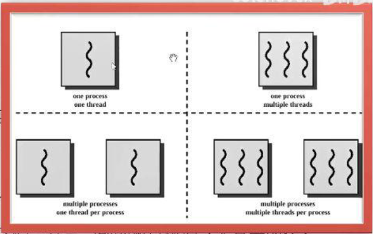
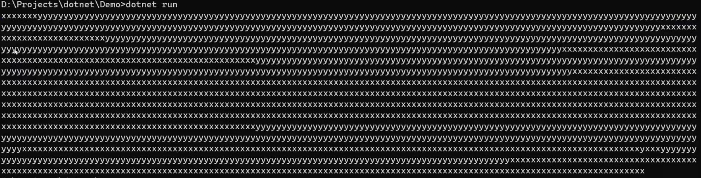

# 装箱和拆箱

- 装箱：栈 >> 堆
- 拆箱：堆 >> 栈
- 性能问题
- 类型安全问题


# 多线程和异步

## 线程

- 线程 Thread 是一个可执行路径，它可以独立于其他线程执行

- 每个线程都在操作系统的进程 Process 内执行，而操作系统进程提供了程序运行的独立环境

- 单线程应用： 在进程的独立环境里只跑一个线程，所以该线程拥有独占权

- 多线程应用：单个进程中会跑多个线程，它们会共享当前的执行环境（尤其是内存）

  例如，一个线程在后台读取数据，另一个线程在数据到达后进行展示

  这个数据就被称作是共享的状态

 

```c#
class Program {
  static void Main() {
    Thread t = new Thread(WriteY); // 开辟一个新的线程
    t.Name = "Y Thread ...";
    t.Start();	// 运行新的线程
    // 主线程也在执行
    for (int i = 0; i< 1000; i++)
    {
      Console.Write("x");
    }
  }
  static void WriteY()
  {
    for (int i = 0; i< 1000; i++)
    {
      Console.Write("y");
    }
  }
}
```

 

> - 在单核计算机上，操作系统必须为每个线程分配时间片（Windows 系统通常为 20 ms）来模拟并发，从而导致重复的 x 和 y 块
>
> - 在多核或多处理器的计算机上，这个两个线程可以真正的并行执行（可能受到计算机上其他活动进程的竞争）
>
>   在上例中，由于控制台处理并发请求的机制的微妙性，仍然会得到重复的 x 和 y 块

