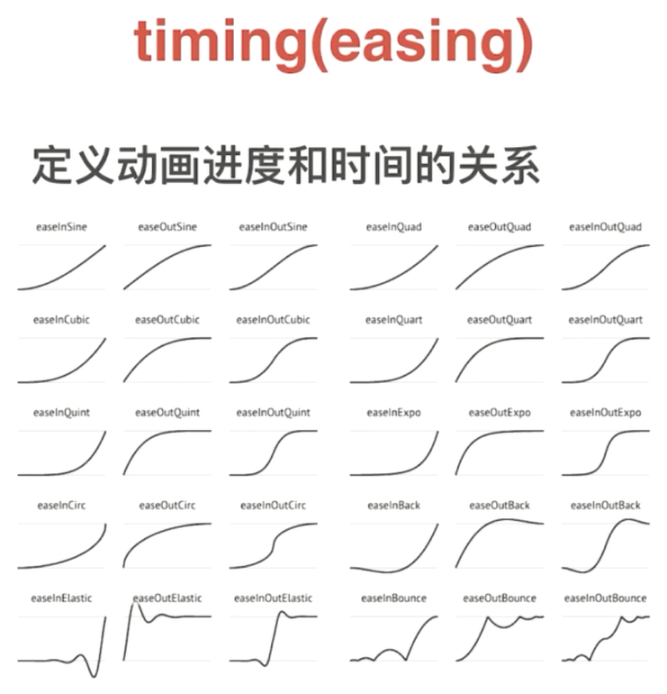

# 过渡

## 过渡`transition`

- `transition: 要过渡的属性 花费的时间 运动曲线 何时开始;`

- 要过渡的属性： 想要变化的css属性，宽度，高度，背景颜色，内外边距都可以。如果要所有属性都变化过渡，可以设置`all`

- 花费时间：单位是 秒 `0.5s`

- 运动曲线：默认是ease（可以省略）,线性变化是 linear

   

- 何时开始：单位是 秒。 可以设置延迟触发时间 默认是0s （可以省略）

- 过渡写在哪里：谁做过渡给谁加

- 多个过渡属性，中间用，连接。或者用`all`

```html
<style>
    .container {
        width: 100px;
        height: 100px;
        background: red;
        transition: width 1s, background 3s;
        /* transition: all 1s */
    }
    .container: hover {
        width: 800px;
        background: green;
    }
</style>
<div class="container"></div>
```

 

# 2D转换

## 移动`translate`

- 定义2D转换中的移动，沿着X和Y轴移动元素

- `transform: translate(x, y);`

  `transform: translateX(n); `

  `transform: translateY(n); `

- 优点：不会影响到其他元素的位置

- 参数可以是%，%是参照盒子自身的高度或宽度来计算的

- 通过`translate`让盒子水平垂直居中

  ```css
  div {
      position: relative;
      background-color: pink;
  }
  p {
      position: absolute;
      top: 50%;
      left: 50%;
      width: 200px;
      height: 200px;
      background-color: purple;
      tranform: translate(-50%,-50%);
      /*
      margin-top: -100px;
      margin-left: -100px;
      */
  }
  ```

  ```html
  <div>
  	<p></p>
  </div>
  ```

- 对行内元素是没有效果的

## 旋转`rotate`

- `transform: rotate(度数)`

- 度数单位是`deg`，比如45度就是`45deg`

- 角度为正是顺时针，负为逆时针

- 默认旋转的中心点是元素的中心点

- 设置旋转中心点

  `transform-origin: x y;`

  - x y默认中心点是50% 50 %
  - 可以给xy设置像素或者方位名词(top bottom left right center)

## 缩放`scale`

- `transform: scale(x,y);`

- `transform: scale(1,1);` 宽和高都放大一倍，相当于没有放大

  `transform: scale(2,2);`宽和高都放大两倍

  `transform: scale(0.5,0.5);`缩小

  `transform: scale(2);`相当于`scale(2,2)`

- 可以设置`transform-origin`中心点缩放，默认以中心点缩放。

- 不影响其他盒子

## 复合写法

- `transform: translate() rotate() scale()...`
- 顺序会影响转换效果(先旋转会改变坐标轴的方向)
- 同时有位移和其他属性的时候，要把位移放到最前


# 3D转换

x轴：水平向右 。x右边是正值，左边是负值

y轴：垂直向下。 y下面是正值，上面是负值

z轴：垂直屏幕。往外是正值，往里面是负值

## 移动`translate3d`

- `transform: translateX(n);`

  `transform: translateY(n);`

  `transform: translateZ(n);` 一般用px单位

  `transform: translate3d(x,y,z);` xyz不能省略，没有写0

## 透视`perspective`

- 透视写在被观察元素的父盒子上面
- z轴越大，看到的物体越大
- 单位是像素

## 旋转`rotate3d`

- `transform: rotateX(度数)`

  `transform: rotateY(度数)`

  `transform: rotateZ(度数)`

  `transform: rotate3d(x,y,z,度数)` 沿着自定义轴旋转。`rotate3d(1,1,0,度数)` 沿对角线旋转

- 旋转方向： 左手准则。

  左手的大拇指指向轴的正方向(x轴向右，y轴向下)。

  其余手指的弯曲方向就是该元素沿着x轴旋转的方向

## 3D呈现`transform-style`

- 控制子元素是否开启三维立体

  `transform-style: flat`子元素不开启3d立体空间。 默认

  `transform-style: preserve-3d;`子元素开启立体空间

- 代码写给父级，但是影响的是子盒子


# 动画

## 关键帧动画

- 先定义动画，再使用动画

- 先用关键帧`keyframes`定义动画(类似定义类选择器)，再`animation-name`调用动画

  ```css
  @keyframes 动画名称 {
      0%{
          transform: translate(0,0);
      }
      25%{
          transform: translate(1000px, 0);
      }
      50%{
          transform: translate(1000px, 500px);
      }
      72%{
          transform: translate(0,500px);
      }
      100%{
          transform: translate(0,0);
      }
  }
  
  div {
      animation-name: 动画名称;
      animation-duration: 持续时间;
  }
  ```

- 动画序列：使用百分比来规定变化发生的时间，0%是动画的开始，100%是动画的完成。或者用关键字`from`和`to` 。

  ​					可以做多个状态的变化。

- `animation-name` `@keyframes`动画的名称。必须

- `animation-duration` 动画完成一个周期花费的秒或微秒。默认是0。必须

- `animation-timing-function` 动画的速度曲线，默认是`ease`

  `linear` 匀速

  `ease` 低速开始，然后加快，在结束前变慢

  `ease-in` 低速开始

  `ease-out` 低速结束

  `ease-in-out` 低速开始和结束

  `steps()` 分几步完成动画；关键帧之间有几个画面

- `animation-delay` 动画何时开始。默认是0

- `animation-iteration-count` 动画播放次数，默认是1、无限是`infinite`

- `animation-direction` 动画是否在下一周期逆向播放。默认`normal`。逆播放`alternate`

- `animation-play-state` 动画运行或暂停。默认`running`。暂停`paused`。经常和`hover`配合使用

- `animation-fill-mode` 动画结束后状态。停留在结束`forward`。回到起始`backward`

- 简写属性 `animation: 动画名称 持续时间 运动曲线 何时开始 播放次数 是否反方向 动画起始或结束状态`

  简写属性里不包含`animation-play-state`

  可以添加多个动画，用逗号分隔

