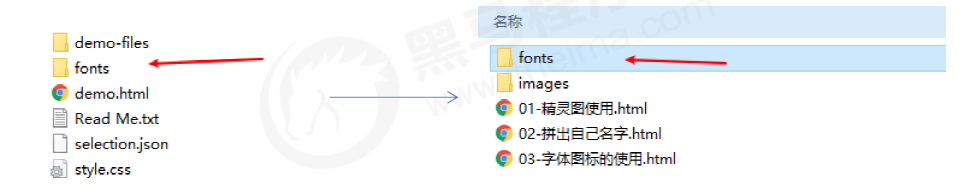
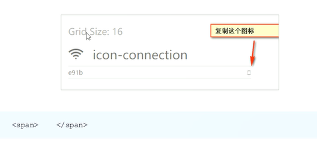
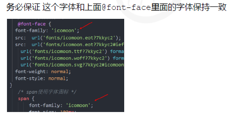
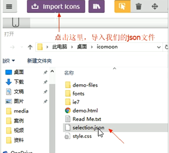

# 字体属性

## 文本字体`font-family`

```css
p { font-family:"微软雅黑";}
div {font-family: Arial,"Microsoft Yahei", "微软雅黑";}
```

- 最常见的字体`Mircosoft YaHei`,`tahoma`,`arial`,`Hiragino Sans GB`

- 多个字体之间逗号隔开

- 指定多个字体的时候，会从头依次查看字体是否存在，存在就使用，不存在再往下查看

- 中文字体名称可以用Unicode代码代替，避免乱码

  - 黑体  \9ED1\4F53
  - 宋体 \5B8B\4F53
  - 微软雅黑 \5FAE\8F6F\96C5\9ED1

- serif 衬线字体(字体周围有装饰性，宋体就是衬线字体)

  sans-serif 非衬线字体(笔画起和收都非常规则)

  monospace 等宽字体

  cursive 手写体

  fantasy 花体

  ```css
  .chinese {
      /* 字体族不能使用引号 */
      font-family: "Microsoft Yahei", serif;
  }
  ```

- 多字体fallback机制

  只有一个平台有的字体写在前面，共有的写在后面

  ```css
  .chinese {
      /* 先找苹果字体，再找微软字体，最后都找不到随便用个等宽字体 */
      font-family: "PingFang SC", "Microsoft Yahei", monospace;
  }
  ```

- 自定义字体

  如果是远程字体，需要注意跨域的问题。如果已经导入了带有字体的远程css样式，就无需再定义字体，直接font-family指定即可

  ```css
  @font-face {
      font-family: "IF";
      src: url("./IndieFlower.ttf");
  }
  .custom-font {
      font-family: IF;
  }
  ```


## 字体大小`font-size`

```css
p {
	font-size: 20px;
}
```

- 谷歌浏览器默认的文字大小为16px

- 不同浏览器可能默认显示的字号大小不一致，我们尽量给一个明确值大小，不要默认大小

- 可以在使用标签选择器设置整个`body`的字体,但是标题比较特殊，需要单独指定

  ```css
  body {
      font-size: 16px;
  }
  ```

  

## 字体粗细`font-weight`

```css
p {
	font-weight: bold;
}
```

- 参数: `normal`,`bold`(加粗)，`bolder`，`lighter`, `number`

- 参数使用数字时，700是加粗bold，400是正常normal。范围是100~900


## 文字样式`font-style`

```css
p {
	font-style: normal;
}
```

- 属性：`normal`(标准)， `italic`(斜体)


## 复合属性

```css
body {
	font: font-style font-weight font-size/line-height font-family;
}
```

- 必须按上面语法格式中的顺序书写，不能更换顺序，并且各个属性间以空格隔开
- 使用`font`不需要的属性可以省略(取默认值)，但是必须保留有`font-size`,`font-famliy`


# 文本属性

## 文本颜色`color`

```css
div {
	color: red;
}
```

- 预定义颜色,十六进制，RGB代码

  rgb(red, green, blue) 每个最大值255


## 文本水平对齐`text-align`

```css
div {
	text-align: center;
}
```

- 属性：`left`, `right`, `center`
- 可应用于行内元素和行内块元素


## 装饰文本`text-decoration`

```css
div {
	text-decoration: underline；
}
```

- 属性：`none`, `underline`, `overline`, `line-through`

- 取消`<a>`默认的下划线`text-decoration: none;`


## 文本缩进`text-indent`

```css
div {
	text-indent: 10px;
}
```

- 文本第一行缩进
- 可以是负值
- 参数按照父元素的 1 个文字大小。


## 行间距`line-height`

```css
p {
	line-height: 26px;
}
```

 

- 设置行高，控制文字与行之间的距离
- 如果行间距是数字或者百分比，等于字体大小的倍数： 行高 = 字体大小 * 行间距
- 行间距 = 上间距 + 文本高度 + 下间距
- 在设置字体`font`中`font: 12px/1.5 'Mircrosoft YaHei'`中的1.5就是行间距，是字体大小的1.5倍


## 垂直居中

让文字的行高等于盒子的高度 `height` = `line-height`

```css
div {
	width: 200px;
	height: 40px;
	line-height: 40px
}
```

- 行高小于盒子高度，文字会偏上
- 行高大于盒子高度，文字会偏下
- 如果盒子模型是`box-sizing:border-box`，行高应该设置小于高度一些，如果有设置`margin` `padding`等的情况。


## 垂直对齐`vertical-align`

`vertical-align : baseline | top | middle | bottom`

- 只针对行内元素或者行内块元素，例如图片或者表单，和文字垂直对齐

- 属性

  - `baseline` 父元素的基线

  - `top` 元素顶端与行中最高元素的顶端对齐

  -  `middle` 元素放置在父元素的中部

  -  `bottom` 元素的顶端与行中最低元素的顶端对齐

     

- 图片、表单和文字对齐

  图片、表单都属于行内块元素，默认的 vertical-align 是基线对齐。

  给图片、表单这些行内块元素的 vertical-align 属性设置为 middle 就可以让文字和图片垂直居中对齐了。
  
- 可以接受像素作为参数，表示相对baseline移动多少 

- 图片底部默认会有空白缝隙，因为行内块元素会和文字的基线对齐

   

  解决办法：
  
  - 给图片添加 vertical-align:middle | top| bottom 等，不要和基线对齐
  - 把图片转换为块级元素 display: block; 但是会独占一行


## 文字阴影`text-shadow`

`text-shadow: h-shadow vuj-shadow blur color;`

- 属性
  - `h-shadow` 必需。水平阴影的位置。允许负值。
  - `v-shadow` 必需。垂直阴影的位置。允许负值。
  - `blur` 可选。模糊的距离
  - `color` 可选。阴影的颜色
- 添加一点阴影会让文字有种印刷品的质感


## 文字折行

- 通用换行控制`overflow-wrap`

  `normal `保留单词，`break-word`打断单词(尽量保持单词完整性)

- 多字节文字换行`word-break`

  `normal`单词作为一个整体，`break-all` 单词不再是一个整体，`keep-all` 所有单词都保持完整，中文的句子也保持完整

-  空白处是否断行`white-space`

  `nowrap`不换行


# 字体图标

字体图标 iconfont，展示的是图标，本质属于字体。

- 本质是文字，可以改变颜色、产生阴影、透明效果、旋转等

- 字体图标的下载

  icomoon 字库 http://icomoon.io

  阿里 iconfont 字库 http://www.iconfont.cn/

- 字体文件格式

  .ttf字体：支持浏览器IE9+、Firefox3.5+、Chrome4+、Safari3+、Opera10+、iOS Mobile、Safari4.2+

  .woff字体：支持浏览器IE9+、Firefox3.5+、Chrome6+、Safari3.6+、Opera11.1+

  .eot字体：支持浏览器IE4+

  .svg字体：支持浏览器Chrome4+、Safari3.1+、Opera10.0+、iOS Mobile Safari3.2+

- 字体图标的引入

  1. 下载字体文件，下载包里面的 fonts 文件夹放入页面根目录下

      

  2. 在 CSS 样式中全局声明字体

     注意字体文件路径的问题

     ```css
     @font-face {
     	font-family: 'icomoon';
     	src: url('fonts/icomoon.eot?7kkyc2');
     	src: url('fonts/icomoon.eot?7kkyc2#iefix') format('embedded-opentype'),
     	url('fonts/icomoon.ttf?7kkyc2') format('truetype'),
     	url('fonts/icomoon.woff?7kkyc2') format('woff'),
     	url('fonts/icomoon.svg?7kkyc2#icomoon') format('svg');
     	font-weight: normal;
     	font-style: normal;
     }
     ```

  3. html 标签内添加小图标

      

  4. 声明是字体图标

     ```css
     span {
         font-family: 'icommon';
         font-size: 100px;
         color: pink;
     }
     ```

      

  5. 字体图标的追加

     如果原来的字体图标不够用，需要添加新的字体图标到原来的字体文件中

     把压缩包里面的 selection.json 重新上传，然后选中想要新的图标，重新下载压缩包，并替换原来的文件即可

      