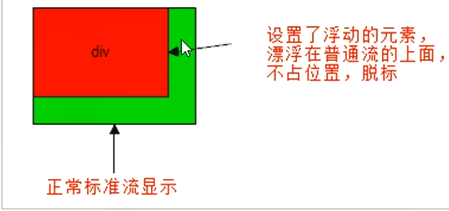

# 标准流

- 块级元素会独占一行，从上向下顺序排列

  常用元素：div、hr、p、h1~h6、ul、ol、dl、form、table

- 行内元素会按照顺序，从左到右顺序排列，碰到父元素边缘则自动换行。、

  常用元素：span、a、i、em 等


# 浮动

可以让多个块级元素一行内排列显示。

## float 属性

用于创建浮动框，将其移动到一边，直到左边缘或右边缘触及包含块或另一个浮动框的边缘

- 属性 `none` `left` `right`

- 浮动的元素会脱离标准流，移动到指定位置（脱标）

  - 浮动的盒子不再保留原先的位置

     

- 如果多个盒子都设置了浮动，浮动的元素会一行内显示并且元素顶部对齐排列

  - 一个元素浮动了，理论上其余的兄弟元素也需要一起设置浮动
  - 浮动的元素会互相贴靠在一起，不会有缝隙
  - 如果父级宽度装不下这些浮动盒子，多出的盒子会另起一行对齐

- 浮动的元素会具有**行内块元素**的特性

  - 任何元素都可以浮动，添加浮动就具有行内块元素相似的特性
  - 如果行内元素有了浮动，就不需要转换块级/行内块元素，就可以自己给元素赋值高度和宽度
  - 如果块级盒子没有设置宽度，默认宽度和父级一样宽，但是添加浮动后，它的大小根据内容决定

- 为了约束浮动元素位置，先用标准流的父元素排列上下位置，之后内部子元素采取浮动排列左右位置

- 浮动的盒子只会影响浮动的盒子后面的标准流，而不会影响其前面的标准流

  浮动的盒子会贴在前面的标准流下面显示

- 浮动的盒子不会有外边距合并的问题

- 浮动的盒子不会压住文字。因为浮动最初就是为了文字环绕图片而设计的


## 清除浮动

由于浮动元素不再占用原文档流的位置，所以它会对后面的元素排版产生影响。

如果不给父盒子指定高度，父盒子根据子盒子的内容而变化高度的时候，如果子盒子浮动，父盒子的高度会变成0。

 

- ##### 清除浮动属性

  `选择器 {clear:属性值;}`

  属性: `left` `right` `both`。实际使用中只用`clear: both;`

  清除浮动的策略是: 闭合浮动。只让浮动在父盒子内部影响,不影响父盒子外面的其他盒子。

- ##### 清除浮动方法

  - 额外标签法

    在浮动元素末尾添加一个空的标签

    添加的空标签必须是块级元素

    ```html
    <div style="clear: both"></div>
    ```

  - 父级添加`overflow`属性

    给父级添加`overflow: hidden`或者`auto` `scroll`

    缺点是无法显示溢出的部分

  - 父级添加`after`伪元素

    ```css
    .clearfix:after { 
        content: "";
        display: block;
        height: 0;
        clear: both;
        visibility: hidden;
    }
    /* IE6,7专有 */
    .clearfix {
        *zoom: 1
    }
    ```

  - 父级添加双伪元素

    ```css
    .clearfix:before,
    .clearfix:after {
        content: "";
        display: table;
    }
    .clearfix:after {
        clear: both;
    }
    .clearfix {
        *zoom: 1;
    }
    ```

  - IE6,7不支持`:after`，有兼容性问题


# 定位

定位可以让盒子自由的在某个盒子内移动位置或者固定屏幕中某个位置，并且可以压住其他盒子。

而浮动可以让多个块级盒子一行没有缝隙排列显示， 经常用于横向排列盒子。

## position属性

定位 = 定位模式 + 边偏移。

定位模式用于指定一个元素在文档中的定位方式。边偏移则决定了该元素的最终位置。

- ##### 定位模式

  定位模式决定元素的定位方式。通过 CSS 的 position 属性来设置

  - 静态定位`{ position: static; }` 

    - 默认的定位方式，无定位

  - 相对定位`{ position: relative; }`

    - 相对于自己原来的位置来移动的（移动位置的时候参照点是自己原来的位置）

    - 原来在标准流的位置继续占有，后面的盒子仍然以标准流的方式对待它（不脱标，继续保留原来的位置）

  - 绝对定位`{ position: absolute; }`

    - 绝对定位是元素在移动位置的时候，相对于它的祖先元素来说的

    - 如果没有祖先元素或者祖先元素没有定位，则以浏览器为准定位(Document文档)

    - 如果祖先元素有定位（相对，绝对，固定定位），则以最近一级的有定位祖先元素为参考点移动位置

    - 绝对定位不再占有原先的位置(脱标)

    - 加了绝对定位的盒子不能通过`margin:0 auto`水平居中

      1. `left:50%` 父容器宽度的一半
      2. `margin-left: 负值（自己盒子宽度的一半）`  (负值是往左边走)

      垂直居中

      1. `top: 50%`
      2. `margin-top: 负值`

  - 固定定位`{ position: fixed; }`

    - 固定于浏览器可视区的位置。以浏览器的可视窗口为参照点
    - 跟父元素没有任何关系。需要自己定义宽度
    - 不能随滚动条滚动
    - 固定定位不再占有原先的位置
    - 盒子固定在版心右侧位置算法：
      1. 让固定定位盒子`left: 50%`，进入浏览器的可视区（也可以看做版心）的一半位置
      2. 让固定定位的盒子`margin-left`版心宽度一半的距离，多走版心宽度的一半位置

  - 粘性定位`{ position: sticky; top: 10px; }`

    - 以浏览器的可视窗口为参照点移动元素（固定定位特点）
    - 粘性定位占有原先的位置（相对定位特点）
    - 可以看成是相对定位和固定定位的混合
    - 必须添加`top` `left` `right` `bottom`其中一个才有效
    - 跟页面滚动搭配使用。 兼容性较差，IE 不支持。

  - 总结

    | 定位模式            | 是否脱标       | 移动位置           |
    | ------------------- | -------------- | ------------------ |
    | `static`静态定位    | 否             | 不能使用边偏移     |
    | `relative`相对定位  | 否(占有位置)   | 相对于自身位置移动 |
    | `absoluate`绝对定位 | 是(不占有位置) | 带有定位的父级     |
    | `fixed`固定定位     | 是(不占有位置) | 浏览器可视区       |
    | `sticky`粘性定位    | 否(占有位置)   |                    |
    
    - 行内元素添加绝对或者固定定位，可以直接设置高度和宽度
    
    - 块级元素添加绝对或者固定定位，如果不给宽度或者高度，默认大小是内容的大小
    
    - 脱标的盒子不会触发外边距合并的问题
    
    - 浮动元素，只会压住它下面标准流的盒子，但是不会压住下面标准流盒子里面的文字、图片
    
      但是绝对定位，固定定位会压住下面标准流所有的内容

- ##### 边偏移

  - 顶端`top` 相对于其父元素上边线的距离
  - 底部`bottom` 相对于其父元素下边线的距离
  - 左侧`left` 相对于其父元素左边线的距离
  - 右侧`right`相对于其父元素右边线的距离

- ##### 叠放次序

  出现盒子重叠的情况，可以使用 `z-index `来控制盒子的前后次序 (z轴)

  - ` z-index: 数值;`
    - 数值可以是正整数，负整数，或0。默认是auto，数值越大，盒子越靠上
    - 如果属性值相同，按照书写顺序，后来居上
    - 数值后面不能加单位
    - 只有定位的盒子才有`z-index`属性


## 子绝父相

  子级是绝对定位的话，父级要用相对定位

- 子级绝对定位，不会占有位置，可以放到父盒子里面的任何一个地方，不会影响其他的兄弟盒子。
- 父盒子需要加定位限制子盒子在父盒子内显示
- 父盒子布局时，需要占有位置，因此父亲只能是相对定位

