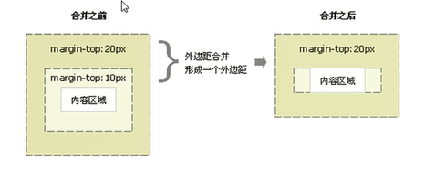

盒子模型包括：边框，外边距，内边距，实际内容

 

# 边框

- ##### 边框`border : border-width || border-style || border-color;`

  - 边框 `border-style`：实线`solid`，虚线`dashed`, 点线`dotted`

  - 复合写法： `border: 1px solid red;` 没有顺序

  - 边框分开写法 例如只设置上边框 `border-top: 1px solid red;`

  - 边框会影响盒子的大小

  - 三角形

    ```css
    div {
        width: 0;
        height: 0;
        line-height: 0;
        font-size: 0;
        border: 50px solid transparent;
        border-left-color: pink;
    }
    ```

  - 直角三角形

    ```css
    div {
    	width: 0;
        height: 0; 
        /* 只保留右边的边框有颜色 */
        border-color: transparent red transparent transparent;
        border-style: solid;
        /* 上边框宽度要大，右边框宽度稍小，其余边框为0 */
        border-width: 22px 8px 0 0;
    }
    ```

- ##### 边框合并`border-collapse:collapse;`

  - 相邻边框合并在一起

- ##### 圆角边框`border-radius: length;`

  - `length` 参数值可以是数值或百分比

  - 如果是正方形，想要设置为一个**圆**，把数值修改为高度或者宽度的一半，或者直接写为 50%

    `border-radius: 50%`

  - 圆角矩形：设置为高度的一半 。例如`height: 100px` 时，`border-radius:50px`

  - 简写：`border-radius: 左上角、右上角、右下角、左下角` 顺时针

  - 分开写：`border-top-left-radius`、`border-top-right-radius`、`border-bottom-right-radius` 和 `border-bottom-left-radius`
  
- ##### 边框背景图片 `border-image`

  - `border-image: url(xx.jpg) 剪裁位置 重复性`

  - 剪裁位置可以是像素也可以是百分比

     

  - 重复性：repeat（重复），round（平铺），stretch（拉伸）。默认是拉伸

  - 九宫格图片

    ```css
    c {
        /* 指定边框宽度 */
        border-width: 30px;
        border-image: url(./border.png) 30;
    }
    ```

          =>    


# 内边距，外边距

- ##### 内边距`padding`

  - `padding-left` ,`padding-right`,`padding-top`,`padding-bottom`

  - `padding:5px;` 上下左右都5px内边距

    `padding:5px 10px;` 上下5px内边距，左右10px内边距

    `padding:5px 10px 20px` 上5px，左右10px， 下20px

    `pdding:5px 10px 20px 30px` 上5px 右10px 下20px 左30px (顺时针)

  - 已经指定了盒子的大小的时候，`padding`会影响盒子的实际大小

  - 盒子本身没有指定`height`或者`width`属性，此时`padding`不会撑开盒子大小

- ##### 外边距`margin`

  - `margin-left` ,`margin-right`,`margin-top`,`margin-bottom`

  - `margin`简写和`padding`完全一致

  - 让块级盒子水平居中

    盒子必须指定了宽度 并且 盒子的左右外边距都设置为auto

    `.header{ width:960px; margin:0 auto;}`

    (行内元素或者行内块元素水平居中给其父元素添加 text-align:center 即可)

  - 外边距合并

    - 相邻块元素垂直外边距的合并(兄弟关系)

      上面元素的下外边距，下面元素的上外边距，取两个值中较大者，合并成一个外边距

    - 嵌套块元素垂直外边距的塌陷(父子关系)

      两个嵌套关系的块元素，父元素有上外边距同时子元素也有上外边距，此时父元素会塌陷父子当中较大的那个外边距值

       

      - 解决方案:
        - 可以为父元素定义上边框
        - 可以为父元素定义上内边距
        - 可以为父元素添加`overflow:hidden`

  - 清除内外边距

    - 网页元素很多带有默认的内外边距
    - `* { padding: 0; margin: 0; }`
    - 行内元素为了照顾兼容性，尽量只设置左右内外边距，不要设置上下内外边距，但是转换为块级和行内块元素就可以了


# 盒子阴影

- `box-shadow: h-shadow v-shadow blur spread color inset;`
- 属性
  - `h-shadow` 必需。水平阴影的位置。允许负值。正值阴影往右走，负值往左走
  - `v-shadow` 必需。垂直阴影的位置。允许负值。正值阴影往下走，负值往上走
  - `blur` 可选。模糊距离
  - `spread` 可选。阴影的尺寸
  - `color` 可选。阴影的颜色
  - `inset` 可选。将外部阴影(outset)改为内部阴影
- 盒子阴影不占空间，不会影响其他盒子排列


# 盒子模型

- `box-sizing:content-box;`盒子大小为`width + padding + border`以前默认的
- `box-sizing:border-box`盒子大小为`width`宽度


# 滚动

当容器装不下内容时，会出现滚动

 
