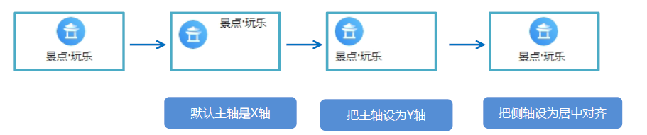
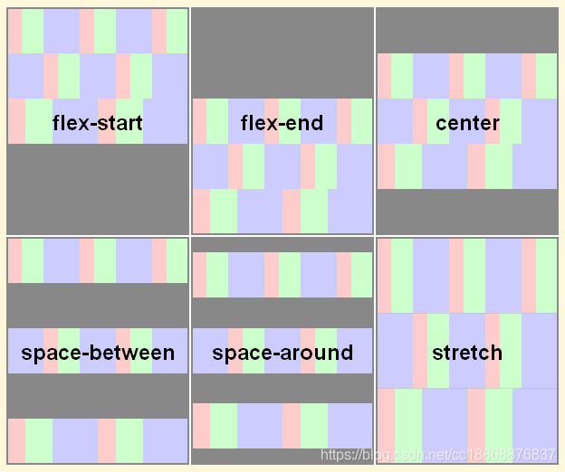

# 移动端布局基础

## 视口

- ##### meta视口标签

  ```html
  <meta name="viewport" content="width=device-width, user-scalable=no,
  initial-scale=1.0, maximum-scale=1.0, minimum-scale=1.0">
  ```

  | 属性          | 说明                                                 | 设置                   |
  | ------------- | ---------------------------------------------------- | ---------------------- |
  | width         | 宽度设置的是viewport宽度，可以设置device-width特殊值 | 视口宽度和设备保持一致 |
  | initial-scale | 初始缩放比，大于0的数字                              | 视口的默认缩放比例1.0  |
  | maximum-scale | 最大缩放比，大于0的数字                              | 最大允许的缩放比例1.0  |
  | minimum-scale | 最小缩放比，大于0的数字                              | 最小允许的缩放比例1.0  |
  | user-scalable | 用户是否可以缩放，yes或no（1或0）                    | 不允许用户自行缩放     |


## 二倍图

- ##### 物理像素和物理像素比

  - 物理像素，就是分辨率。

  - PC页面中，1px等于一个物理像素，但是在移动端1px不一定等于1个物理像素。

    视网膜屏幕可以将把更多的物理像素点压缩至一块屏幕里

  - 一个px能显示的物理像素点的个数，就是物理像素比。

     

- ##### 二倍图

  - 一张50px × 50px的图片，在手机视网膜屏中打开，按照物理像素比放大倍数，会造成图片模糊

    需要放一个100px × 100px的图片，然后手动把放图片的容器给缩小为50px × 50px

    准备的图片比实际需要的大小大两倍，就是两倍图

    通常使用二倍图， 因为iPhone 6\7\8 的影响,但是现在还存在3倍图4倍图的情况

  - 背景缩放 `background-size`

    ```css
    background-size: 背景图片宽度 背景图片高度;
    ```

    - 只写一个参数，肯定是宽度，告诉省略了，会等比例缩放
    - 参数可以使用% ，%是相对于父盒子
    - 参数`cover`: 把背景图像等比例扩展到足够大，使背景图像完全覆盖背景区域，可能有部分图片显示不全
    - 参数`contain`: 把图像扩展至最大尺寸，使其宽度和高度完全适应内容区域，当宽度或者高度铺满盒子就不再进行拉伸了，可能有部分空白区域

  - 多倍图切图插件 cutterman
  
  - 二倍精灵图做法
  
    - 在firework里面把精灵图等比例缩放为原来的一半
    - 根据大小 测量坐标
    - 面background-size也要写： 精灵图原来宽度的一半
  
  - 图片格式
  
    webp，DPG


## 移动端技术解决方案

- ##### 移动端浏览器

  移动端浏览器基本以 webkit 内核为主，因此只需要考虑webkit兼容性问题

  可以放心使用 H5 标签和 CSS3 样式。例如盒子模型

  ```css
  /* 传统盒子模型 */
  box-sizing: content-box;
  
  /* CSS3盒子模型 */
  box-sizing: border-box;
  -webkit-box-sizing: border-box;
  ```

  浏览器的私有前缀我们只需要考虑添加 webkit 即可

- ##### 移动端 CSS 初始化

  - normalize.css

  - 常用初始化样式

    ```css
    body {
    	margin: 0 auto;
    	min-width: 320px;
    	max-width: 640px;
    	background: #fff;
    	font-size: 14px;
    	font-family: -apple-system, Helvetica, sans-serif;
    	line-height: 1.5;
    	color: #666;
    }
    ```

    

- ##### 特殊样式

  ```css
  /* 点击高亮我们需要清除清除 设置为transparent 完成透明 */
  -webkit-tap-highlight-color: transparent;
  /* 在移动端浏览器默认的外观在iOS上加上这个属性才能给按钮和输入框自定义样式 */
  -webkit-appearance: none;
  /* 禁用长按页面时的弹出菜单 */
  img,a { -webkit-touch-callout: none; }
  ```


# 流式布局（百分比布局）

## 布局原理

流式布局，就是百分比布局，也称非固定像素布局。

通过把盒子宽度设置成百分比来根据屏幕宽度进行伸缩，内容向两侧填充。

- ##### 最大宽度/高度`max-width`/`max-height`

- ##### 最小宽度/高度`min-width` /`min-height`

  ```css
  div {
      width: 100%;
      max-width: 980px;
      min-width: 320px;
      margin: 0 auto;
  }
  ```


# 弹性布局（Flex布局）

## 布局原理

- 采用 Flex 布局的元素，称为 Flex 容器（flex container）。它的所有子元素称为 Flex 项目（flex item）

- 任何一个容器都可以指定为flex布局。

- 通过给父盒子添加flex属性，来控制子盒子的位置和排列方式

- 当我们为父盒子设为 flex 布局以后，子元素的 float、clear 和 vertical-align 属性将失效。

   

- ##### 弹性布局`display: flex`

   

  - span 直接给宽度和高度，背景颜色，还有蓝色边框
  - 给 div 只需要添加 “display：flex” 即可
  - div 就是 flex父容器。span 就是 子容器 flex项目


## 父项属性

- ##### 主轴的方向`flex-direction` 

  主轴侧轴相当于行和列，x和y。

  默认主轴方向就是 x 轴方向，水平向右。

  默认侧轴方向就是 y 轴方向，水平向下。

  `flex-direction`设置的是主轴，剩下的就是侧轴。子元素跟着主轴方向来排列。

  - `row` 从左到右 （默认）
  - `row-reverse `从右到左
  - `column` 从上到下
  - `column-reverse `从下到上

- ##### 主轴上的子元素排序方式`justify-content`

  justify-content 属性定义了项目在主轴上的对齐方式。

  这个属性之前一定要确定好主轴是哪个。

  - `flex-start` 从头开始。如果主轴是x轴，就是从左到右。（默认）

  - `flex-end` 从尾部开始

  - `center` 在主轴居中对齐

  - `space-around` 平分剩余空间

    每个item 左右方向的margin相等。两个item中间的间距会比较大。

  - `space-between` 先两边贴边，再平分剩余空间

    最左、最右item贴合左侧或右侧边框，item与item之间间距相等。

     

  常见flex布局思路

   

- ##### 子元素是否换行`flex-wrap` 

  - `nowrap` 不换行。 默认。如果装不开，会缩小子元素的宽度，再到父元素里面
  - `wrap` 换行

- ##### 侧轴上的子元素的排列方式 (单行)`align-items` 

  控制子项在侧轴（默认是y轴）上的排列方式。 在子项为单项（单行）的时候使用

  - `flex-start` 从上到下
  - `flex-end` 从下到上
  - `center` 挤在一起居中(垂直居中)
  - `stretch` 拉伸以适应容器 但是不要给子盒子高度 （默认）

- ##### 侧轴上的子元素的排列方式 (多行)`align-content`

  子项在侧轴上的排列方式。 只能用于子项出现了换行的情况(多行)。单行下是没有效果的

  - `flex-start` 侧轴的头部开始排列

  - `flex-end` 侧轴的尾部开始排列

  - `center` 侧轴中间显示

  - `space-around` 子项在侧轴平分剩余空间

  - `space-between` 子项在侧轴先分布两头，再平分剩余空间

  - `stretch` 子项元素高度平分父元素高度

      

- ##### 复合属性`flex-flow`

  同时设置`flex-direction`和`flex-wrap`

  `flex-flow:row wrap;`


## 子项属性

- ##### 子项目分配剩余空间`flex` 

  子项目分配剩余空间，定义占多数份数。可以写数字，也可以写百分比

  `flex: <number>;`

  左边固定数值，右边占剩余空间

  ```css
  .left {
      display: flex;
      width: 200px;
  }
  .right {
      display: flex;
      flex: 1;
  }
  ```

- ##### 子项自己在侧轴的排列方式`align-self` 

  允许单个项目有与其他项目不一样的对齐方式。可覆盖`align-items`属性。

  默认为`auto`。表示继承父元素的`align-items`属性，如果没有父元素，则等同于 stretch。

- ##### 项目的排列顺序`order`

  数值越小，排列越靠前，默认是0。可以负数。


# rem适配布局

## 布局原理

- 相对单位rem是相对于`html`元素的字体大小，类似于em，em是相对于父元素的字体大小。

- rem布局就是可以通过修改`html`的文字大小来改变页面中元素的大小

  ```css
  /* 根html 为 12px */
  html {
  	font-size: 12px;
  }
  /* 此时 div 的字体大小就是 24px */
  div {
  	font-size: 2rem;
  }
  ```

- 流式布局和flex布局主要针对于宽度布局，rem布局可以使元素高度和宽度等比例缩放。

## 媒体查询

- ##### `@media `查询

  使用 @media 查询，可以针对不同屏幕尺寸设置不同样式

  ```css
  @media mediatype and|not|only (media feature) {
      CSS-Code;
  }
  ```

  - `@media`开头
  - `mediatype`媒体类型
    - `all`所有设备
    - `print`打印机和打印预览
    - `screen`电脑屏幕，手机等
  - 关键字 `and` `not` `only`
    - `and` 多个媒体特性连接在一起
    - `not` 排除某个媒体类型 可以省略
    - `only` 指定某个特定的媒体类型 可以省略
  - `media feature`媒体特征 必须有小括号包含 
    
    - `width`输出设备中页面可见区域的宽度
    - `min-width`输出设备中页面最小可见区域宽度 包含等于
    - `max-width`输出设备中页面最大可见区域宽度 包含等于
    
  - 媒体查询最后从小到大写，这样写更简洁

    利用代码的重叠性

     

  -  重置浏览器大小，页面也会根据浏览器的宽度和高度重新渲染页面
  - 针对PC端访问的默认字体大小，要写在所有媒体查询的最上面

- ##### 判断设备尺寸引入资源

  针对不同的媒体使用不同的样式表

  ```html
  <link ref="stylesheet" media="mediatype and|not|only (media feature)" href="mystylesheet.css">
  ```

  ```html
  <link rel="stylesheet" href="styleA.css" media="screen and (min-width: 400px)">
  ```


## 适配方案

- ##### rem + 媒体查询

  - 常见尺寸

    iphone 4,5     : 640px;

    iphone 6,7,8  : 750px;

    android          : 320px, 360px, 375px, 384px, 400px, 414px , 500px, 720px 大部分4.7~5寸的设备为720px

    现在基本以750为准

  - 动态设置 html 标签 font-size 大小

    按照划分标准把屏幕划分为一定等分，每一等份就是`html`的字体大小

    划分标准不一定 可以是10， 15，20等分

    - 假设设计稿是750px，把整个屏幕划分为15等份，每一份作为html字体大小，就是50px。

      在320px设备的时候，字体大小为320/15 就是 21.33px

    html 的 `font-size `=  (屏幕宽度 / 屏幕划分的份数)，或者，页面元素的rem值 = 页面元素值(px) / `html `的 `font-size `

  - VSCode px 转换rem 插件 cssrem

- ##### flexible.js

  - 不需要做媒体查询，js已经做了处理

    js把当前的设备划分了10等份，不同设备，比例保持一致

    需要做的是，确定当前设备的html文字大小

    比如当前设计稿是750px，HTML文字大小就设置为75px（750px / 10）

    页面元素rem的值就是 ： 页面元素px值 / 75

  - flexible是根据当前屏幕划分10等份，如果设计稿最大750px的话，需要让页面不要超过750px

    ```css
    @media screen and (min-width: 750px) {
        html {
            font-size: 75px!important;
        }
    } 
    ```


# 响应式布局

## 布局原理

- 通过媒体查询针对不同宽度的设备进行布局和样式的设置

  响应式需要一个父级作为布局容器，来配合子级元素来实现变化的效果。

  在不同屏幕下，通过媒体查询改变布局容器的大小，再改变子元素的排列方式和大小。

  从而实现在不同屏幕下，看到不同的布局和样式

  | 设备                  | 尺寸                | 设置宽度 |
  | --------------------- | ------------------- | -------- |
  | 超小屏幕 手机         | < 768px             | 100%     |
  | 小屏设备 平板         | >= 768px ~ < 992px  | 750px    |
  | 中等屏幕 桌面显示器   | >= 992px ~ < 1200px | 970px    |
  | 宽屏设备 大桌面显示器 | >= 1200px           | 1170px   |


## Bootstrap使用

- ##### 创建文件夹结构

   

  复制下载的Bootstrap相关文件夹到项目文件夹

- ##### html骨架结构

  ```html
  <!--要求当前网页使用IE浏览器最高版本的内核来渲染-->
  <meta http-equiv="X-UA-Compatible" content="IE=edge">
  <!--视口的设置：视口的宽度和设备一致，默认的缩放比例和PC端一致，用户不能自行缩放-->
  <meta name="viewport" content="width=device-width, initial-scale=1, user-scalable=0">
  <!--[if lt IE 9]>
  <!--解决ie9以下浏览器对html5新增标签的不识别，并导致CSS不起作用的问题-->
  <script src="https://oss.maxcdn.com/html5shiv/3.7.2/html5shiv.min.js"></script>
  <!--解决ie9以下浏览器对 css3 Media Query 的不识别 -->
  <script src="https://oss.maxcdn.com/respond/1.4.2/respond.min.js"></script>
  <![endif]-->
  ```

  - 引入相关样式文件

    ```html
    <!-- Bootstrap 核心样式-->
    <link rel="stylesheet" href="bootstrap/css/bootstrap.min.css">
    ```

  - container 宽度修改

    如果设计稿采取 1280的宽度， 而Bootstrap 里面 container宽度 最大为 1170px，因此我们需要手动改下container宽度

    ```css
    /* 利用媒体查询修改 container宽度适合效果图宽度 */
    @media (min-width: 1280px) {
    	.container {
    		width: 1280px;
    	}
    }
    ```

    

## Bootstrap栅格系统

- ##### 栅格选项参数

   

  - 按照不同屏幕划分为1~12 等份
  - 行（row） 可以去除父容器作用15px的边距
  - 每一列默认有左右15像素的 padding
  - 可以同时为一列指定多个设备的类名，以便划分不同份数 例如 class="col-md-4 col-sm-6"

- ##### 响应式工具

   
  
  相反`visible-xs` `visible-sm` `visible-md` `visible-lg`是显示内容


# vw/vh自适应

## 视口单位

- ##### 相对单位vw/vh

  vw是 viewport width 视口宽度单位

  vh是 viewport height 视口高度单位

- ##### 相对视口的尺寸计算

  1vw = 1/100 视口宽度

  1vh = 1/100 视口高度

  例如：当前屏幕视口是375像素，1vw就是3.75像素

  注意：和百分比是有区别的，百分比是相对于父元素来说的，而vw和vh总是针对于当前屏幕视口来说的

  50px 转换为 vw单位 ： 50 / (视口宽度 / 100)


## 布局原理

- 相对单位vw/vh能够根据窗口大小来自动调节字体大小

  视口单位有缺点就是它没有最小或者最大限制,建议是rem结合vw来开发

- ##### 模仿bootstrap的栅栏布局

  column实例只要在一行中所有的列加起来等于100vw就实现响应式布局

  ```css
  .col-2 { 
    float: left; 
    width: 50vw; 
  } 
  .col-4 { 
    float: left; 
    width: 25vw; 
  } 
  .col-5 { 
    float: left; 
    width: 20vw; 
  } 
  .col-8 { 
    float: left; 
    width: 12.5vw; 
  }
  ```

  
