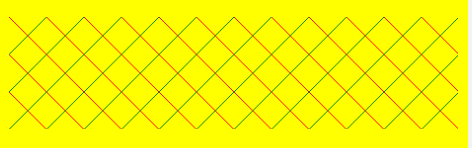

#  CSS背景

## 背景颜色`background-color`

`background-color:颜色值;` 

- 默认透明`background-color:transparent;`

- 背景色半透明

  `background: rgba(0, 0, 0, 0.5);`

  - 最后一个参数是透明度，取值范围在0~1之间
  - 最后一个参数的写法，0.3等同于.3

- 背景线性渐变

  `background: linear-gradient(起始方向,颜色1,颜色2,.....);`

  - 必须添加浏览器私有前缀 `-webkit-linear-gradient(left, red, blue);`
  
  - 从左到右，可以写成`linear-gradient(left, red, blue)` 或者 `linear-gradient(to right, red, blue)`
  
  - 起始方向可以是 方位名词，度数，如果省略就是top 
  
    `linear-gradient(0deg, red, blue)` 从下到上
  
    `linear-gradient(45deg, red, blue)` 从左下角到右下角
  
    `linear-gradient(90deg, red, blue)` 从左到右
  
    `linear-gradient(180deg, red, blue)` 从上到下
  
  - 可以指定颜色的位置
  
    0-10% 红到绿，10%-50% 绿到黄，50%-100% 黄到蓝
  
    `linear-gradient(135deg, red 0, green 10%, yellow 50%, blue 100%)`
  
    0-49.5% 空白，49.5%-50.5% 绿，50.5%-100% 空白
  
    `linear-gradient(135deg, transparent 0, transparent 49.5%, green 49.5%, green 50.5%, transparent 50.5%, transparent 100%)`
  
  - 背景颜色可以重叠
  
    ```html
    <style>
    	body {
            background:yellow;
        }
        c {
            background: 
                linear-gradient(135deg, transparent 0, transparent 49.5%, green 49.5%, green 50.5%, transparent 50.5%, transparent 100%),
                linear-gradient(45deg, transparent 0, transparent 49.5%, red 49.5%, red 50.5%, transparent 50.5%, transparent 100%);
            background-size: 30px 30px;
        }
    </style>
    
    <div> class="c"</div>
    ```
  
     
  
  


## 背景图片`background-image`

`background-image : none | url (url);`

- 常见于 logo 或者一些装饰性的小图片或者是超大的背景图片, 非常便于控制位置

- 既可以添加背景图片也可以添加背景颜色，背景图片会压住背景颜色

- 使用base64引用图片

  图片转化成base64时体积会增大三分之一

  base64会减少http的传输数

  `background:red url(data:image/png;base64,iVBORw0KGgoAAAANSUhEUgAAAHoAAAA2CAYA........);`


## 背景平铺`background-repeat`

`background-repeat: repeat | no-repeat | repeat-x | repeat-y`

- 默认是在纵向和横向上平铺`repeat`


## 背景图片位置`background-position`

`background-position: x y;`

参数x坐标，y坐标。可以使用方位名称或精确单位

- 方位名称：top | center | bottom | left |right
  - x,y都是方位名称的话，前后顺序无关，left top 等于 top left
  - 如果只指定一个方位名称，省略的值默认为居中
- 参数是精确单位
  - 参数都是精确单位，那么第一个一定是x坐标，第二个一定是y坐标
  - 如果只指定一个数值，该数值一定是 x 坐标，另一个默认垂直居中

- 参数是混合单位
  - 一个是精确单位，一个是方位名称，那么第一个值是x坐标，第二个是y坐标


## 背景附着`background-attachment`

`background-attachment : scroll | fixed;`

- 属性`scroll`随对象内容滚动，  `fixed`背景图像固定
- 可以制作视差滚动效果


## 背景复合属性`background`

`background: 背景颜色 背景图片地址 背景平铺 背景图像滚动 背景图片位置;`

`background: transparent url(image.jpg) repeat-y fixed top ;`


## 背景缩放`background-size`

`background-size: 背景图片宽度 背景图片高度;`

单位： 长度|百分比|cover|contain;

- 只写一个参数，肯定是宽度，告诉省略了，会等比例缩放
- 参数的百分比是相对于父盒子
- 参数cover把背景图像等比例扩展到足够大，使背景图像完全覆盖背景区域，可能有部分图片显示不全
- 参数contain 把图像扩展至最大尺寸，使其宽度和高度完全适应内容区域，当宽度或者高度铺满盒子就不再进行拉伸了，可能有部分空白区域


## 剪裁`clip-path`

`clip-path: url(image.jpg) 形状函数 `

- 容器的原本大小和站位是不变的


# 精灵图

- 精灵技术主要针对于背景图片的使用，把多个小背景图片整合到一张大图片中。大图片被称为sprites精灵图
- 移动背景图片位置，使用`background-position`
- 移动的距离就是这个目标图片的x和y坐标
- 往上往左移动都是负值
- 图片想要缩小的时候，`background-size`和 `background-position` 都要等比例缩小

