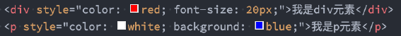
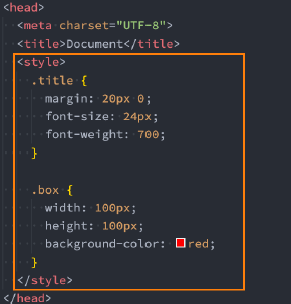
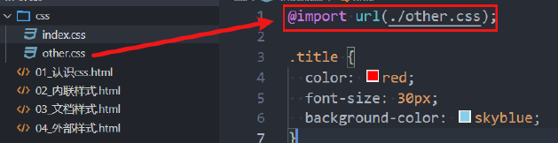

# CSS 引入方式

## 行内样式

存在于 HTML元素的 **style 属性**之中，样式之间用分号 `;` 隔开（建议每条 CSS 样式后面都加上分号 `;`）

 

## 内部样式

将 CSS 放在 HTML 文件 `<head>` 元素里的 `<style>` 元素之中

 

## 外部样式

将 css 编写一个独立的文件中，并且通过 `<link>` 元素引入进来

 

## @import 引入

在 style 元素或者 CSS 文件中使用 `@import` 导入其他的 CSS 文件

 

# 字体文本样式

# 盒子样式

# 背景样式

# 定位样式