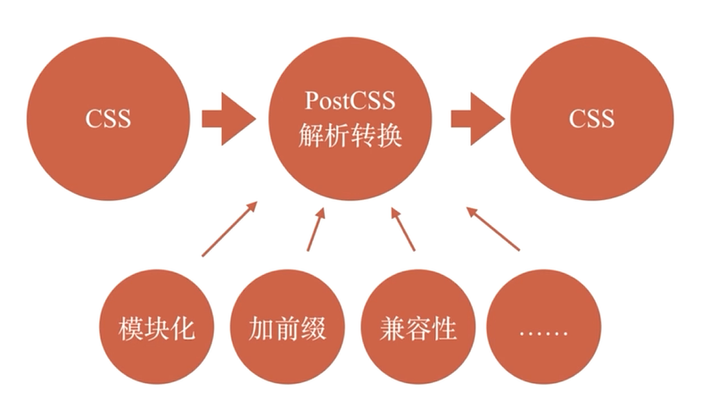
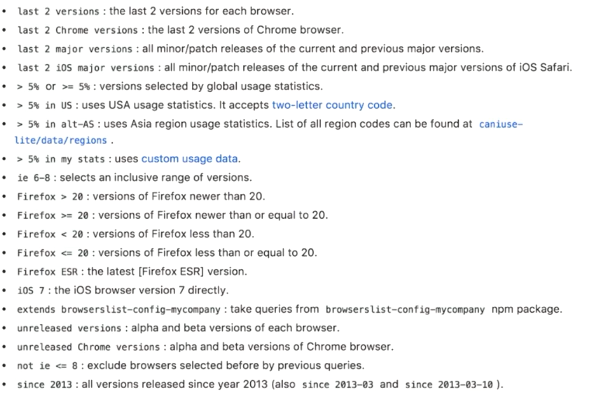

 

PostCSS本身只有解析能力，各种处理CSS的特性来自于插件

- import 模块合并
- autoprefixer 自动加前缀
- cssnano 压缩代码
- cssnext 使用CSS新特性
- press 变量、mixin、循环等


安装

`npm install postcss-cli`

编译

`./node_modules/.bin/postcss src/01.css -o build/01.css `

安装插件

- `npm install autoprefixer`

- 配置config

  ```javascript
  const autoprefixer = require('autoprefixer');
  const cssnano = require('cssnano');
  const atImport = require('postcss-import');
  const cssnext = require('postcss-next');
  const press = require('precss');
  
  module.exports = {
      plugins: [
          atImport,
          cssnext,
          press,
          autoprefixer({
              // 可以手动指定浏览器版本
              browsers: ['last 2 version']
              // browsers: ['>10%']
              // browsers: ['>0%']
          }),
          // 压缩应该放在最后
          cssnano
      ]
  }
  
  ```

- 浏览器版本的指定

   