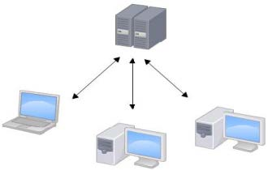
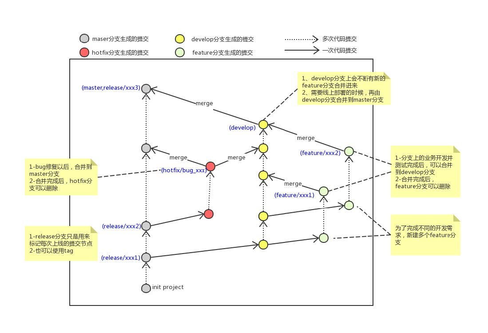
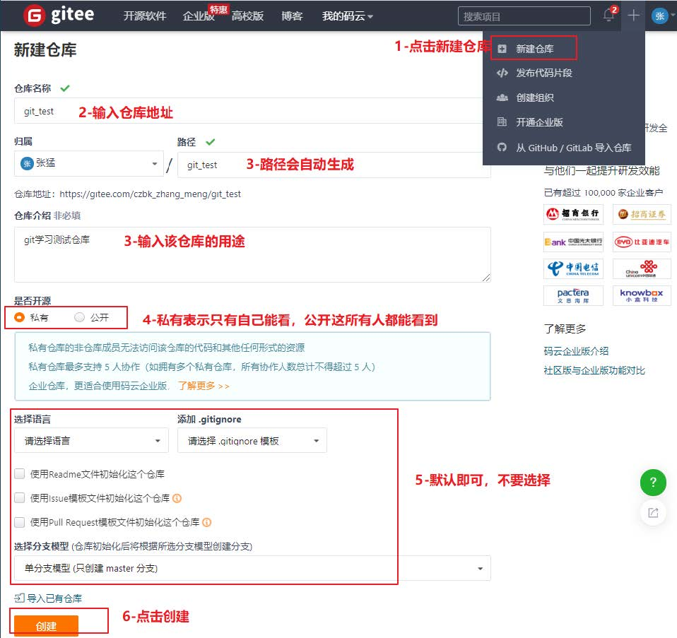
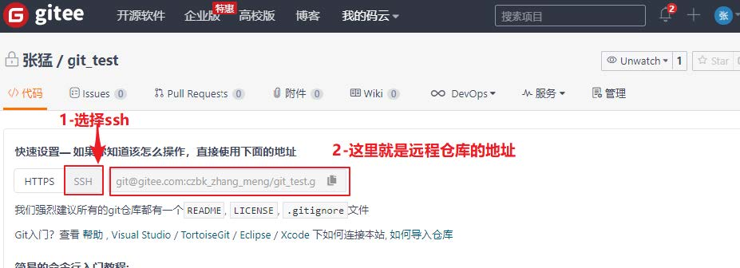
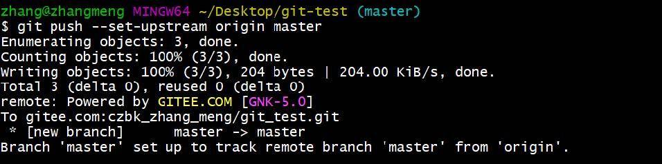
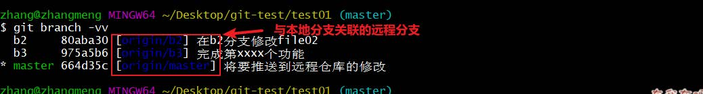
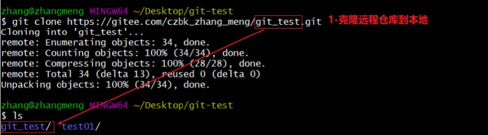

# 主要版本控制

1. **集中式**版本控制工具

   版本库是集中存放在中央服务器的，团队里每个人从中央服务器下载代码，是必须联网才能工作，个人修改后然后提交到中央版本库

   例如：SVN

    

2. **分布式**版本控制工具

   分布式版本控制系统没有中央服务器，每个人的电脑上都是一个完整的版本库，无需联网，因为版本库就在自己的电脑上，多人协作只需要各自的修改推送给对方，就能互相看到对方的修改

   例如：Git

    


# 工作流程

 

1. `clone`：**克隆**，从远程仓库中克隆代码到本地仓库
2. `checkout`：**检出**，从本地仓库中检出一个仓库分支然后进行修订
3. `add`：**添加**，在提交前先将代码提交到暂存区
4. `commit`：**提交**，提交到本地仓库，本地仓库中保存修改的各个历史版本
5. `fetch`：**抓取**，从远程库，抓取到本地仓库，不进行任何的合并动作，一般操作比较少
6. `pull`：**拉取**，从远程库拉到本地库，自动进行合并，然后放到到工作区，相当于 `fetch `+ `merge`
7. `push`：**推送**，修改完成后，需要和团队成员共享代码时，将代码推送到远程仓库


# 环境配置

- 菜单右键目录

  - Git GUI：Git 提供的图形界面工具

  - Git Bash：Git 提供的命令行工具

- 设置用户名称和 email 地址

  打开 Git Bash

  ```bash
  # 设置用户信息
  git config --global user.name "xxx"
  git config --global user.email "hello@qq.com"
  ```

  ```bash
  # 查看配置信息
  git config --global user.name
  git config --global user.email
  ```

- 为常用指令配置别名

  ```bash
  # 打开用户目录，创建.bashrc 文件
  touch ~/.bashrc
  ```

  在 .bashrc 文件中输入如下

  ```bash
  # .bashrc 
  # 用于输出git提交日志
  alias git-log='git log --pretty=oneline --all --graph --abbrev-commit'
  # 用于输出当前目录所有文件及基本信息
  alias ll='ls -al'
  ```

  Git Bash 中执行

  ```bash
  source ~/.bashrc
  ```

- 解决 Git Bash 乱码

  ```bash
  git config --global core.quotepath false
  ```

  在 `${git_home}/etc/bash.bashrc` 文件最后加入下面两行

  ```bash
  export LANG="zh_CN.UTF-8"
  export LC_ALL="zh_CN.UTF-8"
  ```

- 创建本地仓库

  1. 进入工作目录，打开 Git Bash 窗口
  2. 执行 `git init`
  3. 创建成功后生成隐藏的 .git 目录

- 文件忽略列表

  如果有些文件无需纳入 Git 的管理，也不希望出现在未跟踪文件列表，可以在工作目录中创建一个名为 `.gitignore` 的文件，列出要忽略的文件模式

  ```shell
  # no .a files
  *.a
  # but do track lib.a, even though you're ignoring .a files above
  !lib.a
  # only ignore the TODO file in the current directory, not subdir/TODO
  /TODO
  # ignore all files in the build/ directory
  build/
  # ignore doc/notes.txt, but not doc/server/arch.txt
  doc/*.txt
  # ignore all .pdf files in the doc/ directory
  doc/**/*.pdf
  ```


# 基础指令

Git 工作目录下对于文件的修改（增加、删除、更新）会存在几个状态，这些修改的状态会随着执行 Git 命令而发生变化

 

- 查看修改的状态 `git status`

  查看的修改的状态（暂存区、工作区）

- 添加工作区到暂存区 `git add`

  `git add 单个文件名 | 通配符`

  添加工作区一个或多个文件的修改到暂存区

  - 将**所有修改加入暂存区**：`git add .`

- 提交暂存区到本地仓库 `git commit`

  `git commit -m '注释内容'`

  提交暂存区内容到本地仓库的当前分支

- 查看提交日志 `git log`

  `git log [option]`

  `git log --pretty=oneline --all --graph --abbrev-commit`

  - `--all` 显示所有分支
  - `--pretty=oneline` 将提交信息显示为一行
  - `--abbrev-commit` 输出的 commitId 更简短
  - `--graph` 以图的形式显示

- 版本回退

  `git reset --hard commitID`

  - commitID 可以使用 `git log` 指令查看

  - 查看已经删除的记录 `git reflog`


# 分支操作

分支意味着可以把工作从开发主线上分离，来进行重大的 Bug 修改、开发新的功能，以免影响开发主线

- 常见分支规则

   

  - 生产分支 `master`：主分支，作为线上运行的应用对应的分支
  - 开发分支 `develop`：从 `master` 创建的分支，开发的主要分支，阶段开发完成后，合并到 `master` 分支
  - `feature/xxxx` 分支：从 `develop` 创建的分支，一般是同期并行开发，但不同期上线时创建的分支，开发完成后合并到 `develop` 分支
  - `hotfix/xxxx` 分支：从 `master` 派生的分支，作为线上 bug 修复使用，修复完成后合并到 `master`、`test`、`develop` 分支
  - 代码测试分支 `test`
  - 预上线分支 `pre`

- 查看本地分支 `git branch`

- 创建本地分支 `git branch 分支名`

- 切换分支 `git checkout 分支名`

  创建并切换 `git checkout -b 分支名`

- 合并分支 `git merge 另一个分支名`

- 删除分支

  - 删除分支时，需要做各种检查 `git branch -d 分支名`
  - 强制删除 `git branch -D 分支名`

- 解决冲突

  1. 处理文件中冲突的地方
  2. 将解决完冲突的文件加入暂存区 `add`
  3. 提交到仓库 `commit`

   


# 远程仓库

- 常用的托管服务：GitHub、码云 gitee、GitLab

- 配置 gitee

  1. 创建远程仓库

       

  2. 查看仓库地址

      

  3. 生成 SSH 公钥 `ssh-keygen -t rsa`

     不断回车，如果公钥已经存在，则自动覆盖

  4. gitee 中设置账户公钥

     获取公钥 `cat ~/.ssh/id_rsa.pub`

      

  5. 验证是否配置成功 `ssh -T git@gitee.com`

- 添加远程仓库

  先初始化本地库，然后与已创建的远程库进行对接

  `git remote add <远端名称> <仓库路径>`

  例如：`git remote add origin git@gitee.com/**/**.git`

  - 远端名称，默认是 `origin`，取决于远端服务器设置
  - 仓库路径，从远端服务器获取此 URL

- 查看远程仓库 `git remote`

   

- 推送到远程仓库 `git push`

  `git push [-f] [--set-upstream] [远端名称 [本地分支名][:远端分支名] ]`

  - 如果远程分支名和本地分支名称相同，可以只写本地分支

    `git push origin master`

  - `-f` 强制覆盖

  - 推送到远端的同时并且建立起和远端分支的关联关系 `--set-upstream`

    `git push --set-upstream origin master`

     

  - 如果当前分支已经和远端分支关联，可以省略分支名和远端名

    将 master 分支推送到已关联的远端分支：`git push` 

- 查看本地分支与远程分支的关联关系 `git branch -vv`

   

- 从远程仓库克隆到本地 `git clone`

  `git clone <仓库路径> [本地目录]`

  本地目录可以省略，会自动生成一个目录

   
  
- 从远程仓库中抓取 `git fetch`

  `git fetch [remote name] [branch name]`

  **将远端仓库里的更新都抓取到本地，不会进行合并**，如果不指定远端名称和分支名，则抓取所有分支

- 从远程仓库中拉取 `git pull`

  `git pull [remote name] [branch name]`

  **将远端仓库的修改拉到本地并自动进行合并，等同于 `fetch` + `merge`**，如果不指定远端名称和分支名，则抓取所有并更新当前分支

```bash
#### 将本地仓库推送到远程仓库
# [test01]添加远程仓库
git remote add origin git@gitee.com/**/**.git
# [test01]将 master 分支推送到远程仓库，并与远程仓库的 master 分支绑定关联关系
git push --set-upstream origin master
```

```bash
#### 将远程仓库克隆到本地
# 将远程仓库克隆到本地 test01 目录下
git clone git@gitee.com/**/**.git test02
# [test02]以精简的方式显示提交记录
git log --pretty=oneline --all --graph --abbrev-commit
```

```bash
#### 将本地修改推送到远程仓库
# [test01]将修改加入暂存区并提交到仓库
git add .
git commit -m 'add file'
# [test01]将 master 分支的修改推送到远程仓库
git push origin master
```

```bash
#### 将远程仓库的修改更新到本地
# [test02]将远程仓库修改再拉取到本地
git pull
# 以精简的方式显示提交记录
git log --pretty=oneline --all --graph --abbrev-commit
```

