# 结构标签

完整的 HTML 结构包括

	文档声明

	html 元素

​			head 元素

​			body 元素

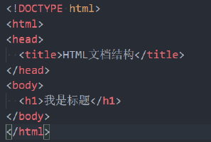 


## 文档类型

告诉浏览器使用**什么版本的 HTML**，处于 `<html>` 标签之前

必须放在 HTML 文档的**最前面**，**不能省略**，省略了会出现兼容性问题

```html
<!-- 当前页面是HTML5页面，让浏览器用HTML5的标准去解析识别内容 -->
<!DOCTYPE html>
```

HTML4，XHTML 的文档声明

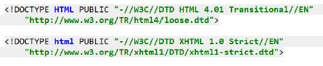 


## html 标签

HTML 文档中最大的标签，称为**根标签**，所有其他元素必须是此元素的后代


### 页面语言

指定 `lang` 字符集属性例如：`en`，`zh-CN`，作用于浏览器和搜索引擎，帮助翻译工具翻译等

```html
<html lang="zh-CN">
  ...
</html>
```


### 离线缓存

HTML5 新特性，离线缓存

可以通过把需要离线存储在本地的文件列在一个 manifest 配置文件中，这样即使在离线的情况下，用户也可以正常看见网页

1. 在需要离线缓存存储的页面 加上 `manifest = "cache.manifest"`

   ```html
   <!DOCTYPE HTML>
   <html manifest="cache.manifest">
       ...
   </html>
   ```

2. 在根目录 新建文件 **cache.manifest**

   ```
   CACHE MANIFEST
   #v0.11
   
   CACHE:
   
   js/app.js
   css/style.css
   
   NETWORK:
   resource/logo.png
   
   FALLBACK:
   / /offine.html
   ```

   离线存储的 manifest 一般由三部分组成

   1. CACHE

      表示需要离线存储的资源列表，由于包含 manifest 文件的页面将被**自动离线存储**，所以不需要吧页面自身也列出来

      会把需要离线存储的资源存在当前浏览器上

   2. NETWORK

      表示在它下面列出来的资源只有在在线的情况下才能访问，**不会被离线存储**，离线情况下无法使用这些资源

      不过如果 CACHE 和 NETWORK 同时都有，CACHE 的优先级更高

   3. FALLBACK

      表示如果访问第一个资源失败，那么就使用第二个资源来替换

      `/ /offline.html` 意味着，如果根目录任一资源失败，就去访问 offline.html

   在浏览器的 application 的 application cache 中可以查看被离线存储的资源


## head 标签

head 元素规定**文档相关的配置信息**（也称之为元数据），包括文档的标题，引用的文档样式和脚本等

一般会至少包含 title 标签，meta 标签


### title 标签

**网页的标题**

```html
<head>
  <title>网页的标题</title>
</head>
```


### meta 标签

#### 网页编码

设置网页的字符编码，不设置或者设置错误会导致乱码，一般使用 utf-8 编码，几乎涵盖所有文字

```html
<meta charset="UFT-8">
```


#### 视口

移动设备的屏幕上能够显示网页的区域，可以定义缩放功能

```html
<meta name="viewport" content="width=device-width, user-scalable=no, initial-scale=1.0, maximum-scale=1.0, minimum-scale=1.0">
```

content 属性中设置功能

- width：设置视口宽度 px，可以设置特殊值 `device-width`（当前设备宽度）
- heigh：视口高度，很少使用
- initial-scale：初始缩放比，大于0的数字
- maximum-scale：最大缩放比，大于0的数字
- minimum-scale：最小缩放比，大于0的数字
- user-scalable：用户是否可以缩放，yes 或 no (1 或 0)


#### http 响应头

http-equiv 属性可用于模拟一个 HTTP 响应头，向浏览器传回一些有用的信息

- 页面自动跳转

  ```html
  <!-- 停留10秒钟后自动刷新到URL网址 -->
  <meta http-equiv="refresh" content="10;URL=http://www.baidu.cn">
  ```

- 页面描述

  ```html
  <meta http-equiv="description" content="This is my page">
  ```

- 清除缓存

  ```html
  <meta http-equiv="cache-control" content="no-cache">
  ```

- 关键字

  ```html
  <meta http-equiv="keywords" content="keyword1,keyword2,keyword3">
  ```

- 禁止缓存

  ```html
  <meta http-equiv="Pragma" content="No-cach" />
  ```

- IE 兼容性

  ```html
  <!-- 当前网页使用IE浏览器最高版本的内核来渲染 -->
  <meta http-equiv="X-UA-Compatible" content="IE=edge">
  ```


### link 标签

link 是外部资源链接元素，规范了文档与外部资源的关系

- CSS 样式表

  ```html
  <link rel="stylesheet" href="./css/style.css">
  ```

- 站点图标

  ```html
  <link rel="icon" href="favicon.ico"/>
  ```

`href` 指定的 URL 地址，可以是绝对的，也可以是相对的


## body 标签


# 主要标签

## 标题标签

标题标签 `<h1>` - `<h6>`

- 文字加粗，字号依次加大，`<h1>` 级别最高，`<h6>` 级别最低

- 一个标题独占一行

```html
<h1>我是h1标题</h1>
<h2>我是h2标题</h2>
<h3>我是h3标题</h3>
<h4>我是h4标题</h4>
<h5>我是h5标题</h5>
<h6>我是h6标题</h6>
```

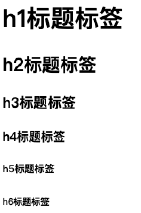 


## 段落标签

段落标签 `<p>`

-  可以把 HTML 文档分割为若干段落
-  文本在一个段落中会根据浏览器的窗口的大小自动换行
-  多个段落之间会有一定的间距

```html
<p>我是段落元素</p>
```


## 盒子标签

`div` 和 `span` 都是纯粹的容器，用来包裹内容

- div：多个 `div` 元素包裹的内容会在不同的行显示

  一般作为其他元素的父容器，包裹其他元素，代表一个整体，把网页分割为多个独立的部分

  ```html
  <div class="area">
    <h2>学习HTML+CSS</h2>
    <p>先学习HTML, 再学习CSS</p>
  </div>
  ```

- span：多个 `span` 元素包裹的内容会在同一行显示

  默认情况下，跟普通文本几乎没差别，用于区分特殊文本和普通文本

  ```html
  <p>
    学习<span class="keyword">JavaScript</span>的基本语法
  </p>
  ```


## 图像标签

图像标签 ``，将一份图像嵌入文档

```html
<!-- 当前文件夹(.可以省略) -->

<!-- 上级文件夹 -->

```

常见属性：`src`，`alt`，`title`

- src： 必须属性，用于指定图像文件的路径和文件名
- alt：可选，当图片加载不成功时，会显示这段文本，屏幕阅读器会将文本读给使用者听
- title：可选，鼠标移动到元素上的提示或者说明

某些其他属性目前已经不再使用：`width` `height` `border`

支持的图片格式

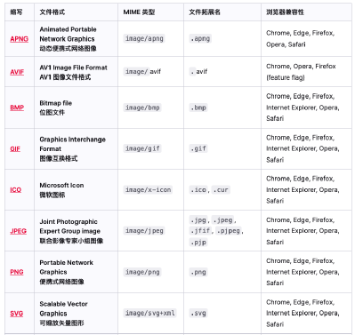 、


## 超链接标签

超链接标签 `<a>`，定义超链接，用于打开新的URL

常见属性：`href`，`target`

- href：跳转目标

  `href` 的地址可以是**外部链接，内部链接，空链接 `#`，锚点链接 `#name`**

  ```html
  <a href="http://www.qq.com">腾讯网</a>
  ```

  `href` 指向对应要跳到的元素上的 `id`

  ```html
  <a href="#title01">跳转到标题一</a>
  <h2 id="title01">标题一</h2>
  ```

  如果地址是**文件或者压缩包**，会下载这个文件

  ```html
  <a href="https://nodejs.org/dist/v16.15.1/node-v16.15.1-x64.msi">下载文件</a>
  ```

  如果地址是**邮箱地址**，会打开默认的邮件工具填入写入的地址

  ```html
  <a href="mailto:12345@qq.com">发送邮件</a>
  ```

- target：链接页面的打开方式

  - `_self `：默认值，在当前窗口打开 URL

    ```html
    <a href="http://www.baidu.com" target="_self">百度一下</a>
    ```

  - `_blank`：在新窗口打开 URL

    ```html
    <a href="http://www.taobao.com" target="_blank">淘宝网</a>
    ```

各种网页元素，如文本，图像，表格，音频，视频都可以添加超链接

```html
<a href="http://www.mi.com">
  
</a>
```

阻止链接跳转，`href` 指定为 `javascript:void(0);` 或者 ` javascript:;`


## 列表标签

### 有序列表

`<ol>` `<li>`

```html
<h1>喜欢的电影排名</h1>
<ol>
  <li>星际穿越</li>
  <li>大话西游</li>
  <li>盗梦空间</li>
</ol>
```

- `<ol>` 的直接子元素只能是 `<li>`

- 会带有默认的样式

  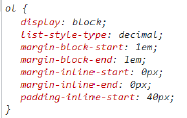 

- 清除默认的样式

  ```css
  ol {
    padding: 0;
    margin: 0;
    list-style: none;
  }
  ```


### 无序列表

`<ul>` `<li>`

```html
<h1>常见的编程语言</h1>
<ul>
  <li>JavaScript</li>
  <li>Java</li>
  <li>C++</li>
  <li>Python</li>
</ul>
```

- `<ul>` 的直接子元素只能是 `<li>`

- 会带有默认的样式

   

- 清除默认的样式

  ```css
  ul, body, h1, p {
    padding: 0;
    margin: 0;
    list-style: none;
  }
  ```


### 定义列表

`<dl>` `<dt>` `<dd>`

```html
<dl>
  <dt>关注我们</dt>
  <dd>新浪微博</dd>
  <dd>官方微信</dd>
  <dd>联系我们</dd>
</dl>
```

- `<dl>` 的直接子元素只能是 `<dt>` 和 `<dd>`

- `<dt>` 定义列表中每一项的项目名，一个 `<dt>` 可以对应多个 `<dd>`

- `<dd>` 是列表中每一项的具体描述，是对 `<dt>` 的补充描述解释

- 会带有默认的样式

  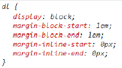 

- 清除默认的样式

  ```css
  dl, dt, dd {
    padding: 0;
    margin: 0;
  }
  ```


## 表格标签

```html
<table>
  <caption>热门股票</caption>
  <thead>
    <tr>
      <th>股票名称</th>
      <th>股票代码</th>
      <th>股票价格</th>
    </tr>
  </thead>
  <tbody>
    <tr>
      <td>贵州茅台</td>
      <td>600519</td>
      <td>1800</td>
    </tr>
    <tr>
      <td>腾讯控股</td>
      <td>00700</td>
      <td>400</td>
    </tr>
    <tr>
      <td>五粮液</td>
      <td>000858</td>
      <td>160</td>
    </tr>
  </tbody>
  <tfoot>
    <tr>
      <td>其他</td>
      <td>其他</td>
      <td>其他</td>
    </tr>
  </tfoot>
</table>
```

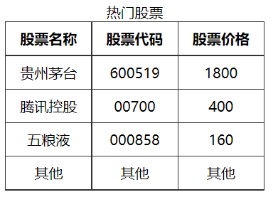 

- 表格 `<table>`

  不赞成使用 `<table>` 的相关属性，例如 `align`，`border`，`cellpadding`，`cellspacing`，`width` ，应该**使用 CSS 制定样式**

  边框合并 `border-collapse`

  ```css
  table {
    border-collapse: collapse;
  }
  ```

  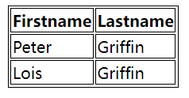 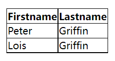

- 表格标题 `<caption>`

- 表头 `<thead>`

- 表格主体 `<tbody>`

- 页脚 `<tfoot>`

- 表格中的行 `<tr>`

  必须嵌套在 `<table>` 中

- 单元格 `<td>`

  必须嵌套在 `<tr>` 中

- 表头单元格 `<th>`

  必须嵌套在 `<tr>` 中，文本内容会加粗居中显示

  **单元格合并**

  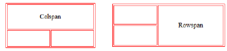 

  - 跨行合并 `rowspan`，最上侧的单元格为目标单元格，省略掉后面 `<tr>` 中要被合并的单元格 `<td>`

    ```html
    <table>
      <tr>
        <td rowspan="2">1-1</td>
        <td>1-2</td>
      </tr>
      <tr>
        <td>2-2</td>
      </tr>
    </table>
    ```

    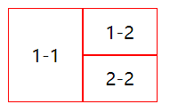 

  - 跨列合并 `colspan`，最左侧的单元格为目标单元格，省略掉右侧要被合并的单元格 `<td>`

    ```html
    <table>
      <tr>
        <td colspan="2">1-1</td>
      </tr>
      <tr>
        <td>2-1</td>
        <td>2-2</td>
      </tr>
    </table>
    ```

    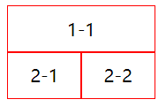 


## 表单标签

### 文本框

```html
<label for="username">
  用户: <input id="username" type="text">
</label>
<label for="password">
  密码: <input id="password" type="password">
</label>
```

- 只读 `readonly`，布尔属性

  ```html
  <input type="text" readonly>
  <!-- 等价于 -->
  <input type="text" readonly="readonly">
  ```

- 禁用 `disabled`，布尔属性

  ```html
  <input type="text" disabled>
  ```

- 当页面加载时，自动获得焦点 `autofocus`，布尔属性

  ```html
  <input type="text" autofocus>
  ```

- 占位符 `placeholder`

  ```html
  <input type="text" placeholder="请输入姓名">
  ```

- 元素名 `name`

  ```html
  <input type="text" name="username">
  ```

- 输入字段的初始值 `value`

  ```html
  <input type="text" value="John">
  ```

- 去除默认轮廓线

  ```css
  input {
    outline: none;
  }
  ```


### 多行文本框

```html
<label for="info">
  个人描述:<textarea name="info" id="info" cols="10" rows="6"></textarea>
</label>
```

- 文本域的宽度（列数）`cols`，默认值是 20

- 文本域的高度（行数）`rows`，默认值是 2

- 其他属性参照文本框

- 修改缩放的 CSS 设置

  ```css
  textarea {
    /* 禁止缩放 */
    resize: none;
  }
  ```

  水平缩放：`resize: horizontal`
  垂直缩放：`resize: vertical`
  水平垂直缩放：`resize: both`


### 单选框

```html
<label for="male">
  <input id="male" type="radio" name="sex" checked value="male">男
</label>
<label for="female">
  <input id="female" type="radio" name="sex" value="female">女
</label>
```

- `name` 值相同的一组 radio 才具备单选功能

- `value` 是必须的，将会把选中的 radio 的 `value` 值提交到表单

- 禁用 `disabled`，布尔属性

  ```html
  <input type="radio" disabled>
  ```

- 默认选中 `checked`，布尔属性

  ```html
  <input type="radio" checked>
  ```
  
- 当页面加载时，自动获得焦点 `autofocus`，布尔属性

  ```html
  <input type="radio" autofocus>
  ```


### 复选框

```html
<label for="basketball">
  <input id="basketball" type="checkbox" name="hobby" checked value="basketball">篮球
</label>
<label for="football">
  <input id="football" type="checkbox" name="hobby" value="football">足球
</label>
```

- 属于同一种类型的 checkbox，`name` 值要保持一致

- `value` 是必须的，将会把选中的 checkbox 的 `value` 值提交到表单

- 禁用 `disabled`，布尔属性

  ```html
  <input type="checkbox" disabled>
  ```

- 默认选中 `checked`，布尔属性

  ```html
  <input type="checkbox" checked>
  ```

- 当页面加载时，自动获得焦点 `autofocus`，布尔属性

  ```html
  <input type="checkbox" autofocus>
  ```


### 文件上传

```html
<input type="file" name="image" accept="image/*">
```

- `accept` 规定上传的文件类型

  ```html
  <input type="file" accept="image/*">
  <input type="file" accept="video/*">
  <input type="file" accept=".pdf" />
  <input type="file" accept="image/gif, image/jpeg, .pdf" />
  ```

- 禁用 `disabled`，布尔属性

  ```html
  <input type="file" disabled>
  ```

- 当页面加载时，自动获得焦点 `autofocus`，布尔属性

  ```html
  <input type="file" autofocus>
  ```

- 元素名 `name`

  ```html
  <input type="file" name="image">
  ```


### 选择列表

```html
<select name="fruits">
  <option value="apple" selected>苹果</option>
  <option value="banana">香蕉</option>
  <option value="orange">橘子</option>
</select>
```

`<select>` 属性

- `multiple` 多选，按住 ctrl 多选

  ```html
  <select multiple></select>
  ```
  
- `size` 显示多少项

  ```html
  <select size="2"></select>
  ```
  
- 禁用 `disabled`，布尔属性

  ```html
  <select disabled></select>
  ```

- 当页面加载时，自动获得焦点 `autofocus`，布尔属性

  ```html
  <select autofocus></select>
  ```

`<option>` 属性

- `selected` 默认被选中，布尔属性

  ```html
  <option value="apple" selected>北京</option>
  ```


### label 标签

```html
<label for="username">
  用户: <input id="username" type="text">
</label>
```

- 一般配合表单元素来使用，用来表示表单元素的标题
- 属性 `for` 可以绑定一个表单元素的 `id` 属性，点击 `<label>` 光标跳转到表单元素


### 按钮

```html
<button>按钮</button>
<input type="button" value="按钮">
```

- 普通按钮 `type="button"` ，使用 `value` 属性设置按钮文字

  ```html
  <button>普通按钮</button>
  <button type="button">普通按钮</button>
  <input type="button" value="普通按钮">
  ```

- 重置按钮 `type="reset"` ，可以对 `<form>` 中的其他表单元素进行重置

  ```html
  <input type="reset" value="重置按钮">
  <button type="reset">重置按钮</button>
  ```

- 提交按钮 `type="submit"`，可以对 `<form>` 中的其他表单元素进行提交

  ```html
  <input type="submit" value="提交按钮">
  <button type="submit">提交按钮</button>
  ```

- 禁用 `disabled`，布尔属性

  ```html
  <button disabled>点我</button>
  <input type="button" value="点我" disabled>
  ```

- 当页面加载时，自动获得焦点 `autofocus`，布尔属性

  ```html
  <button autofocus>点我</button>
  <input type="button" value="点我" autofocus>
  ```

- 元素名 `name`

  ```html
  <button type="submit" name="subject">点我</button>
  <input type="submit" name="subject" value="点我">
  ```


### 表单域

```html
<form method="GET" action="http://www.qq.com">
  <div>
    <label for="username">
      用户: <input id="username" type="text" name="username">
    </label>
  </div>
  <div>
    <label for="password">
      密码: <input id="password" type="password" name="password">
    </label>
  </div>
  <button type="reset">重置内容</button>
  <button type="submit">提交内容</button>
</form>
```

- `<form>` 通常作为表单元素的父元素，`<form>` 可以将整个表单作为一个整体来进行操作
- `action` 属性，用于提交表单数据的请求 URL
- `method` 属性，请求方法（ `get` 和 `post` ），默认是 `get`

- `targe` 属性，在什么地方打开 URL（参考 `<a>` 元素的 `target`）


## 格式化标签

- 加粗：`<strong>`，`<b>`

  推荐使用 `<strong>`  语义更强烈

- 倾斜：`<em>`，`<i>`

  推荐使用 `<em>` 语义更强烈，HTML5中 `<i>` 主要用来做图标

- 删除线：`<del>`，`<s>`

  推荐使用 `<del>` 语义更强烈

- 下划线：`<ins>`，`<u>`

  推荐使用 `<ins>` 语义更强烈

- 代码：`<code>`

  用于显示代码，偶尔用来显示等宽字体

- 换行：`<br />`

  只是简单的开始新的一行，而段落标签会在段落之间插入一些垂直间距

  开发中已经不使用


## 嵌套标签

利用 `<iframe>` 可以在一个 HTML 文档中嵌入其他 HTML 文档

属性 `frameborder`：用于规定是否显示边框，0 为不显示，1 为显示

```html
<iframe src="https://www.taobao.com"  frameborder="1"></iframe>
```

`<iframe>`  中嵌套网页中的 `<a>` 标签

- `<a>` 标签设置为 `target="_parent"`：在父窗口中打开URL

  ```html
  <!-- 外层 -->
  <iframe src="./other/inner.html" frameborder="1"></iframe>
  ```

  ```html
  <!-- 内层 inner.html -->
  <iframe src="./a.html" frameborder="1"></iframe>
  ```

  ```html
  <!-- 最内层 a.html -->
  <a href="http://www.taobao.com" target="_parent">打开淘宝</a>
  ```

  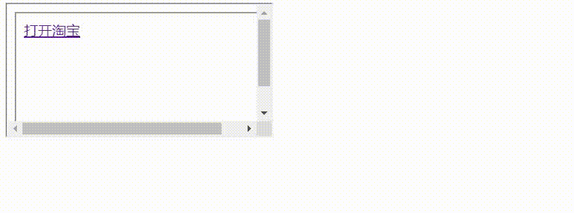 

- `<a>` 标签设置为 `target="_top"`：在顶层窗口中打开URL

  ```html
  <!-- 外层 -->
  <iframe src="./other/inner.html" frameborder="1"></iframe>
  ```

  ```html
  <!-- 内层 inner.html -->
  <iframe src="./a.html" frameborder="1"></iframe>
  ```

  ```html
  <!-- 最内层 a.html -->
  <a href="http://www.taobao.com" target="_top">打开淘宝</a>
  ```

   


# 全局属性

全局属性（Global Attributes）是所有 HTML 元素都可以设置和拥有


## 元素唯一标识 id

`id` 属性定义唯一标识符，该标识符在整个文档中必须是唯一的，在使用样式，脚本，链接时标识元素

```html
<h1 id="myHeader">Hello World!</h1>
```


## 样式类 class

`class` 属性定义了元素的类名，是以空格分隔的元素的类名列表

```html
<p class="important">注意</p>
```


## 内联样式 style

`style` 属性为元素添加内联样式

```html
<h1 style="color:blue;text-align:center">这是一个标题</h1>
```


## 标题 title

`title` 属性表示与其所属元素相关信息的文本，信息通常可以作为提示呈现给用户

```html
<abbr title="世界卫生组织">WHO</abbr>
```


## 自定义数据 data-

自定义属性以 `data-` 开头做为属性名并且赋值，HTML5 新增

```html
<div data-index=“1”></div>
```

或者使用 JS 设置

```javascript
element.setAttribute(‘data-index’, 2)
```


# 特殊字符

| 特殊字符 | 描述     | 代码       |
| -------- | -------- | ---------- |
|          | 空格     | `&nbsp;`   |
| <        | 小于     | `&lt;`     |
| >        | 大于     | `&gtl;`    |
| &        | 和       | `&amp;`    |
| ￥       | 人民币   | `&yen;`    |
| ©        | 版权     | `&copy;`   |
| ®        | 注册商标 | `&reg;`    |
| ±        | 正负     | `&plusmn;` |
| ×        | 乘       | `&times;`  |
| ÷        | 除       | `&divide;` |
| ²        | 平方     | `&sup2;`   |
| ³        | 立方     | `&sup3;`   |
| °        | 度       | `&deg;`    |


# CSS 引入方式

## 行内样式

存在于 HTML元素的 **style 属性**之中，样式之间用分号 `;` 隔开（建议每条 CSS 样式后面都加上分号 `;`）

 


## 内部样式

将 CSS 放在 HTML 文件 `<head>` 元素里的 `<style>` 元素之中

 


## 外部样式

将 css 编写一个独立的文件中，并且通过 `<link>` 元素引入进来

 


## @import 引入

在 style 元素或者 CSS 文件中使用 `@import` 导入其他的 CSS 文件

 


# 选择器

## 基础选择器

### 标签选择器

`标签名 {}` 

```css
div {
  background-color: #f00;
}
```

- HTML 标签名称作为选择器，为页面中某一类标签指定统一的 CSS 样式。
- 标签选择器可以把某一类标签全部选择出来，能快速为页面中同类型的标签统一设置样式
- 不能设计差异化样式，只能选择全部的当前标签。


### 类选择器

`.类名 {}`

```css
.box {
  color: blue;
}
```

- `.类名` 形式，HTML 中需要用 `class` 属性来调用
- 标签使用多个类名时，空格隔开


### id 选择器

`#id {}`

```css
#home {
  color: green;
}
```

- `#id名` 形式
- 标签使用 `id` 调用，只能调用一次


### 通配符选择器

`* {} `

```css
* {
  font-size: 30px;
  background-color: #f00;
}
```

- `*` 选取页面中所有的元素

- 不需要调用，自动就会给所有元素使用样式

- 效率比较低，尽量不要使用 

  ```css
  /* 推荐的做法 */
  body, p, div, h2, span {
    margin: 0;
    padding: 0;
  }
  ```


### 属性选择器

`[att] {}`，`[att=val] {}`

```html
<div title="box">我是div元素</div>
```

```css
[title] {
  color: red;
}
[title=box] {
  background-color: blue;
}
```

- 根据元素特定属性来选择元素

  | 选择符       | 选择内容                                                     |
  | ------------ | ------------------------------------------------------------ |
  | E[att]       | 选择具有 att 属性的 E 元素                                   |
  | E[att=val]   | 选择具有 att 属性，且属性值等于 val 的 E 元素                |
  | E[att^=val]  | 匹配具有 att 属性，且值以 val 开头的 E 元素                  |
  | E[att$=val]  | 匹配具有 att 属性，且值以 val 结尾的 E 元素                  |
  | E[att*=val]  | 匹配具有 att 属性，且值中含有 val 的 E 元素                  |
  | E[att~=val]  | 匹配具有 att 属性，且值中含有 val，或者有其他值（必须以空格和 val 分割）的 E 元素 |
  | E[att\|=val] | 匹配具有 att 属性，且值中含有 val，或者以 val 开头后面紧跟 - 的 E 元素 |


## 复合选择器

### 后代选择器

`父选择器 子选择器 {}`

```css
.home span {
  color: red;
}
```

- 选择父元素里面子元素，把外层标签写在前面，内层标签写在后面，中间用空格分隔，内层标签是外层标签的后代
- 父元素和子元素可以是任意基础选择器


### 子选择器

`父选择器 > 子选择器 {}`

```css
.home > span {
  background-color: green;
}
```

- 只能选择作为某元素的最近一级子元素，只能选亲儿子，孙子重孙子都不要
- 选择父元素里面的所有直接后代(子元素) 


### 并集选择器

`选择器1, 选择器2 {}`

```css
p, .box {
  color: red;
}
```

- 并集选择器可以同时选择多组标签，同时为它们定义相同的样式
- 符合一个选择器条件即可


### 交集选择器

`选择器1选择器2 {}`

```css
div.box {
  color: red;
  font-size: 30px;
}
```

```html
<div class="box">我是div元素</div>
```

-  两个选择器紧密连接，需要同时符合两个选择器条件，精准的选择某一个元素


### 相邻兄弟选择器

`选择器1 + 选择器2 {}`

```css
.box + .content {
  color: red;
}
```

- 可选择紧接在另一元素后的元素(两个元素为相邻兄弟)，且二者有相同父元素

- 选择的是后一个标签


### 通用兄弟选择器

`选择器1 ~ 选择器2 {}`

```css
.box ~ div {
  font-size: 30px;
}
```

- 在同一个父元素下，位置无须紧邻，A~B 选择 A 元素之后所有同层级 B 元素

- 选择的是后一个标签


### 伪类选择器

`:hover {}`

用冒号 `:` 表示，比如 `:hover` 、` :first-child` 

#### 动态伪类

- `:link` 选择所有未被访问的链接

  ```css
  a:link {
    color: red;
  }
  ```

- `:visited` 选择所有已经被访问的链接

  ```css
  a:visited {
    color: green;
  }
  ```

- `:focus` 选取获得焦点的元素（能够拥有输入焦点的元素、可以被键盘 Tab 键选中的元素）

  ```css
  a:focus {
  	background-color:yellow;
  }
  ```

- `:hover` 选择鼠标指针位于其上的元素（除了`<a>` 元素，也可以用在其他元素上）

  ```css
  a:hover {
    color: blue;
  }
  ```

- `:active` 选择激活的链接（鼠标按下还未弹起时的链接）（除了`<a>` 元素，也可以用在其他元素上）

  ```css
  a:active {
    color: purple;
  }
  ```

一定按照 **LVFHA 的顺序声明** ：`:link`－`:visited`－`:focus`－`:hover`－`:active`

直接给 `<a>` 元素设置样式，相当于给  `<a>`  元素的所有动态伪类都设置了

```css
/* 相当于a:link、a:visited、a:hover、a:active、a:focus的color都是red */
a {
  color: red;
}
```


#### 结构伪类

根据文档结构来选择元素

##### 匹配子元素

| 选择符              | 选择内容                                                     |
| ------------------- | ------------------------------------------------------------ |
| E:first-child       | 匹配父元素中的第一个子元素 E                                 |
| E:last-child        | 匹配父元素中最后一个子元素 E                                 |
| E:nth-child(n)      | 匹配父元素中的第 n 个子元素 E <br />（n 可以是数字，关键字，公式，可以匹配一个或多个） |
| E:nth-last-child(n) | 匹配父元素中的倒数第 n 个子元素 E <br />（n 可以是数字，关键字，公式，可以匹配一个或多个） |
| E:only-child        | 匹配父元素中的唯一子元素 E（没有兄弟元素）                   |

- `E:first-child` 匹配父元素中的**第一个**子元素 E

  ```css
  /* 选择ul中的第一个子元素li */
  ul li:first-child {
    color: red;
  }
  ```

- `E:last-child` 匹配父元素中**最后一个**子元素 E

  ```css
  /* 选择ul中的最后一个子元素li */
  ul li:last-child {
    color: red;
  }
  ```

- `E:nth-child(n)` 匹配父元素中的**第 n 个**子元素 E

  ```css
  /* 选择ul中的第二个子元素li */
  ul li:nth-child(2) {
    color: red;
  }
  ```

  会把所有的子元素都排列序号，**先筛出子元素，再标号，后查找**

  ```css
  /* 执行的时候会首先找到section的第一个子元素，然后再看是不是div，如果第一个不是div，就匹配不上 */
  section div:nth-child(1) {
    color: red;
  }
  ```


- `E:nth-last-child(n)` 匹配父元素中的**倒数第 n 个**子元素 E

  ```css
  ul li:nth-last-child(2){
    color: red;
  }
  ```

- `E:only-child` 匹配父元素中的**唯一**子元素 E

  ```css
  ul li:only-child {
    color: red;
  }
  ```


##### 匹配特定类型子元素

| 选择符                | 选择内容                                            |
| --------------------- | --------------------------------------------------- |
| E:first-of-type       | 匹配父元素中指定类型 E 的第一个                     |
| E:last-of-type        | 匹配父元素中指定类型 E 的最后一个                   |
| E:nth-of-type(n)      | 匹配父元素中指定类型 E 的第 n 个                    |
| E:nth-last-of-type(n) | 匹配父元素中指定类型 E 的倒数第 n 个                |
| E:only-of-type        | 匹配父元素中指定类型 E 的唯一子元素（没有兄弟元素） |

- 匹配特定类型与匹配子元素 `nth-child` 的区别

  ```html
  <div class="box">
    <div>我是列表1</div>
    <p>我是p元素</p>
    <span>我是span1</span>
    <span>我是span2</span>
    <div>我是列表2</div>
    <div>我是列表3</div>
  </div>
  ```

  ```css
  /* 选择box中的第三个div元素(排除所有的干扰项) */
  .box > div:nth-of-type(3) {
    color: blue;
  }
  ```

- `E:first-of-type` 匹配指定类型为 E 的**第一个**元素

  ```css
  p:first-of-type {
    color: red;
  }
  ```

- `E:last-of-type` 匹配指定类型为 E 的**最后一个**元素

  ```css
  p:last-of-type {
    color: red;
  }
  ```

- `E:nth-of-type(n) ` 匹配指定类型为 E 的**第 n 个**元素

  ```css
  p:nth-of-type(2) {
    color: red;
  }
  ```

  会把**指定的元素先排列序号，再去查找**

  ```css
  /* 执行的时候会首先找到section的div所有子元素，再去匹配其中的第一个 */
  section div:nth-of-type(1) {
    color: red;
  }
  ```

- `E:nth-last-of-type(n)` 匹配指定类型 E 的**倒数第 n 个**元素

  ```css
  p:nth-last-of-type(2) {
    color: red;
  }
  ```

- `E:only-of-type` 匹配指定类型 E 的**唯一**子元素

  ```css
  p:only-of-type {
    color: red;
  }
  ```


##### 匹配公式

- `nth-child(even)` 选择所有**偶数**的子元素

  ```css
  ul li:nth-child(even) {
    color: red;
  }
  ```

- `nth-child(odd)` 选择所有**奇数**的子元素

  ```css
  ul li:nth-child(odd) {
    color: red;
  }
  ```

- `nth-child(n)` 选择**所有**的子元素（只能固定写 `n`，`n` 代表任意正整数和 0）

  ```css
  ul li:nth-child(n) {
    color: red;
  }
  ```

- `nth-child(2n)` 选择所有**偶数**的子元素，等同于 `even`

  ```css
  ul li:nth-child(2n) {
    color: green;
  }
  ```

- `nth-child(2n+1)` 选择所有**奇数**的子元素，等同于 `odd`

  ```css
  ul li:nth-child(2n + 1) {
    color: blue;
  }
  ```

- `nth-child(5n)` 选择所有位置是 5 的**倍数**的子元素（5 10 15）

  ```css
  ul li:nth-child(5n) {
    color: orange;
  }
  ```

  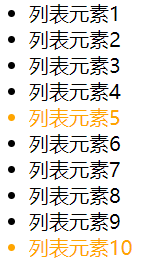 

- `nth-child(5n+1)` 选择**从 1 开始**，**每间隔 5 个**的子元素（1 6 11）

  ```css
  ul li:nth-child(5n + 1) {
    color: orange;
  }
  ```

  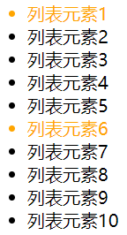 

  选择从 2 开始，每间隔5个的子元素（2 7 12）

  ```css
  ul li:nth-child(5n + 2) {
    color: orange;
  }
  ```

- `nth-child(n+5)` 选择从**第 5 个开始**的子元素（包含第5个）

  ```css
  ul li:nth-child(n + 5) {
    color: orange;
  }
  ```

  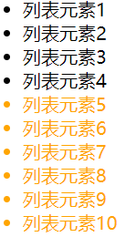 

- `nth-child(-n+5)` 选择**前 5 个**子元素（包含第5个）

  ```css
  ul li:nth-child(-n + 5) {
    color: orange;
  }
  ```

  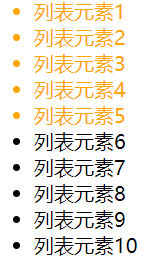 


##### 其他结构伪类

- `:root` 匹配文档的根元素，就是 `<HTML>` 元素

  ```css
  /* 声明CSS全局变量使用 */
  :root {
    --main-color: hotpink;
    --pane-padding: 5px 42px;
  }
  ```

- `:empty` 匹配没有任何子级的元素（包括文本节点）

  ```css
  div {
    width:200px;
    height:20px;
  }
  div:empty {
    background: red;
  }
  ```


#### 否定伪类

`:not(x)` 表示除 x 以外的元素，x 是一个简单选择器

```css
.box :not(.desc) {
  color: blue;
}
```

```html
<div class="box">
  <div class="item">列表内容1</div>
  <div class="desc">列表内容2</div>
  <div>列表内容3</div>
</div>
```


#### 目标伪类

`:target`

选择 `id` 匹配当前 `URL` 路径的元素

```css
:target {
  background: red;
}
p:target {
  background: blue;
}
```

```html
<!-- 链接 -->
<a href="#one">go one</a>
<a href="#two">go two</a>
<a href="#three">go three</a>
<a href="#four">go four</a>
<!-- 内容 -->
<div id="one">one</div>
<div id="two">two</div>
<div id="three">three</div>
<p id="four">four</div>
```

 

#### 元素状态伪类

- `:checked` 匹配处于选中状态的单选或者复选框元素

  ```css
  /* 单选框 */
  input[type="radio"]:checked {
    box-shadow: 0 0 0 3px red;
  }
  /* 复选框 */
  input[type="checkbox"]:checked {
    box-shadow: 0 0 0 3px red;
  }
  /* 下拉列表选项 */
  option:checked {
    color: red;
  }
  ```

  ```html
  <div>
    <input type="radio" name="my-input" id="yes">
    <label for="yes">Yes</label>
    <input type="radio" name="my-input" id="no">
    <label for="no">No</label>
  </div>
  <div>
    <input type="checkbox" name="my-checkbox" id="opt-in">
    <label for="opt-in">Check me!</label>
  </div>
  <select name="my-select" id="num">
    <option value="opt1">one</option>
    <option value="opt2">two</option>
    <option value="opt3">three</option>
  </select>
  ```

   

- `:enabled` 匹配处于可用状态的表单元素

  如果一个元素能够被激活（可选择、可点击、可输入）或获取焦点，则该元素是处于可用状态

  一般用于 `<input>`、`<select>`、`<button>` 元素中

  ```css
  input:enabled {
    background-color: #ac0;
  }
  ```

  ```html
  <div>
    <input type='text' placeholder="可用状态"/>
  </div>
  ```

- `:disabled` 匹配处于禁用状态的表单元素

  ```css
  input:disabled{
    background-color: #996;
  }
  ```

  ```html
  <div>
    <input type='text' placeholder="禁用状态" disabled />
  </div>
  ```

  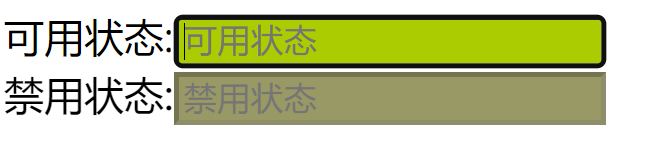 


### 伪元素选择器

- `:before {}`、`::before {}`、`:after {}`、`::after {}`

  `::before` **在元素内部的前面插入内容**

  `::after` **在元素内部的后面插入内容**

  利用 CSS 创建新标签元素，而不需要 HTML 标签，新创建的元素**在 DOM 文档树中是找不到**的，但是属于**行内元素**

  ```css
  .item::before {
    content: "✨";
    font-size: 20px;
  }
  .item::after {
    content: url("../images/hot_icon.svg");
    font-size: 20px;
    position: relative;
    left: 5px;
    top: 2px;
  }
  ```

  ```html
  <div class="box1 item">我是box1</div>
  <div class="box2 item">我是box2</div>
  ```

  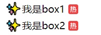 

  `::before` 和 `::after` **必须要有 `content` 属性**，不能省略，可设为 `content: "";`

  ```css
  /* 默认是行内级元素 */
  .box::after {
    content: "";
    display: inline-block;
    width: 8px;
    height: 8px;
    background-color: #f00;
  }
  ```

  ```html
  <div class="box">我是box</div>
  ```

  `:before` / `:after` 是 CSS2 的写法，`::before`/  `::after`是 CSS3 的写法

  推荐使用 `::`，`:: ` 符号用来表示伪元素，`:` 符号表示伪类

- `:first-line {}`、`::first-line {}`、`:first-letter {}`、`::first-letter {}`

  `:first-line {}`、`::first-line {}`：可以针对首行文本设置属性

  `:first-letter {}`、`::first-letter {}`：可以针对首字母设置属性

  ```css
  .box::first-line {
    font-size: 30px;
    color: orange;
  }
  .box::first-letter {
    font-size: 50px;
    color: blue;
  }
  ```

  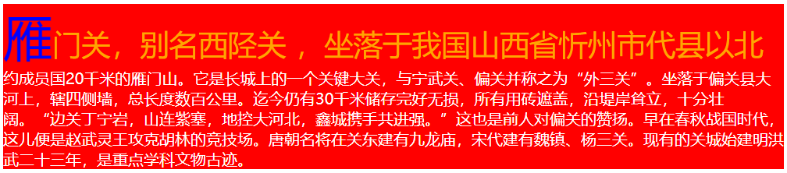 


## 权重优先级

选择器相同，则执行层叠性，选择器不同，根据选择器权重执行

| 选择器                           | 选择器权重 |        |
| -------------------------------- | ---------- | ------ |
| 继承 或者 `*`                    | 0,0,0,0    | + 0    |
| 标签选择器，伪元素选择器         | 0,0,0,1    | + 1    |
| 类选择器，伪类选择器，属性选择器 | 0,0,1,0    | + 10   |
| ID 选择器                        | 0,1,0,0    | + 100  |
| 行内样式 `style`                 | 1,0,0,0    | + 1000 |
| 强制最大权重 `!impirtant`        | 无穷大     |        |

- 权重由4组数字组成，权重会叠加，**不会有进位**
- 等级从左到右判断，如果某一位数值相同，则判断下一位数值
- 复合选择器，会有权重叠加，需要计算权重
- 相同权重，后写的生效

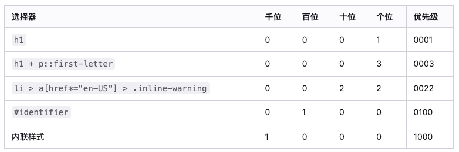 


# 字体样式

## 文本字体 font-family

设置文字的字体名称

```css
p { font-family:"微软雅黑";}
div {font-family: Arial,"Microsoft Yahei", "微软雅黑";}
```

- 可以设置1个或者多个字体名称，指定多个字体的时候，会从头依次查看字体是否存在（安装过），存在就使用，不存在再往下查看

- 多个字体之间逗号隔开

- 字体族不能使用引号

  ```css
  .chinese {
      font-family: "Microsoft Yahei", serif;
  }
  ```

  - 衬线字体 `serif`：字体周围有装饰性，宋体就是衬线字体
  - 非衬线字体 `sans-serif`：笔画起和收都非常规则
  - 等宽字体 `monospace`
  - 手写体 `cursive`
  - 花体 `fantasy`

- 最常见的字体 `Mircosoft YaHei`，`tahoma`，`arial`，`Hiragino Sans GB`

- 中文字体名称可以用 Unicode 代码代替，避免乱码

  - 黑体  `\9ED1\4F53`
  - 宋体 `\5B8B\4F53`
  - 微软雅黑 `\5FAE\8F6F\96C5\9ED1`

- 多字体 fallback 机制

  只有一个平台有的字体写在前面，共有的写在后面

  ```css
  .chinese {
      /* 先找苹果字体，再找微软字体，最后都找不到随便用个等宽字体 */
      font-family: "PingFang SC", "Microsoft Yahei", monospace;
  }
  ```


## 字体大小 font-size

```css
font-size: 20px;
font-size: 2em;
font-size: 200%;
```

- 值的单位可以是 `px`、`em`，也可以是 `%`，百分比是基于父元素的 `font-size` 计算

- 谷歌浏览器默认的文字大小为 16px，不同浏览器可能默认显示的字号大小不一致

- 可以在使用标签选择器设置整个 `body` 的字体，但是标题比较特殊，需要单独指定

  ```css
  body {
      font-size: 16px;
  }
  ```


## 字体粗细 font-weight

```css
p {
	font-weight: bold;
}
```

- 参数：`normal`（正常），`bold`（加粗），`bolder`，`lighter`， `number`

- 参数使用数字时，700 是加粗 `bold`，400 是正常 `normal`，常用的范围是 100~900


## 文字样式 font-style

```css
p {
	font-style: normal;
}
```

- 参数：`normal`(标准)， `italic`(斜体)，`oblique`(倾斜)
- `italic` 是字体本身支持斜体时, 显示的斜体
- `oblique` 是单纯让文本进行倾斜
- `em`、`i`、`cite`、`address`、`var`、`dfn` 等元素的 f`ont-style` 默认就是 `italic`


## 缩小大写字母 font-variant

设置小写字母的显示形式

```css
.box {
  font-variant: small-caps;
}
```

- 参数：`normal`（常规显示），`small-caps`（将小写字母替换为缩小过的大写字母）

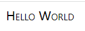 


## 字体简写属性 font

```css
body {
	font: font-style font-variant font-weight font-size/line-height font-family;
}
```

- 各个属性间以空格隔开
- `font-style`、`font-variant`、`font-weight` 可以随意调换顺序，也可以省略
- `/line-height` 可以省略，如果不省略，必须跟在 `font-size` 后面
- `font-size`，`font-famliy` 不可以调换顺序，不可以省略


## 自定义字体和图标

通过 `@font-face` 引入字体

```css
@font-face {
    font-family: IF
    src: url(./IndieFlower.ttf);
}
.custom-font {
    font-family: IF;
}
```

- 字体图标本质是文字，可以改变颜色、产生阴影、透明效果、旋转等

  - 字体图标的下载：

    icomoon 字库 http://icomoon.io

    阿里 iconfont 字库 http://www.iconfont.cn/

  - 字体图标的追加

    如果原来的字体图标不够用，需要添加新的字体图标到原来的字体文件中

    把压缩包里面的 selection.json 重新上传，然后选中想要新的图标，重新下载压缩包，并替换原来的文件即可

     

- 字体图标使用

  通过对应字体图标的 Unicode 来显示

  ```css
  @font-face {
    font-family: "iconfont";
    src: url("./iconfont.ttf");
  }
  .iconfont {
    font-family: "iconfont";
    font-style: normal;
  }
  .music::before {
    content: "\e664";
  }
  ```

  ```html
  <i class="iconfont music"></i>
  ```

- 字体文件兼容性

  字体常见格式：.ttf、.otf、.eot、.svg、.woff、.woff2

  生成兼容字体网站：https://font.qqe2.com/

  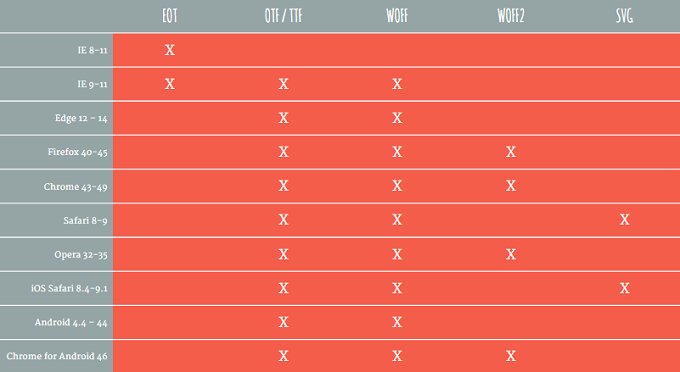 

- 字体兼容性写法（bulletproof @font-face syntax）

  - `url` 指定资源的路径
  - `format` 用于帮助浏览器快速识别字体的格式

  ```css
  @font-face {
    font-family: "YuanTi";
    src: url("./fonts02/AaQingHuanYuanTi.eot"); /* IE9 */
    src: url("./fonts02/AaQingHuanYuanTi.eot?#iefix") format("embedded-opentype"), /* IE6-IE8 */
      url("./fonts02/AaQingHuanYuanTi.woff") format("woff"), /* chrome、firefox */
      url("./fonts02/AaQingHuanYuanTi.ttf") format("truetype"), /* chrome、firefox、opera、Safari, Android, iOS 4.2+ */
      url("./fonts02/AaQingHuanYuanTi.svg#uxfonteditor") format("svg"); /* iOS 4.1- */
    font-style: normal;
    font-weight: normal;
  }
  body {
    font-family: "YuanTi";
  }
  ```

- 如果是远程字体，需要注意跨域的问题

- 如果已经导入了带有字体的远程 css 样式，就无需再定义字体，直接 `font-family` 指定即可


# 文本样式

## 前景颜色 color

设置**文本内容的前景色，包括文字、装饰线、边框、外轮廓等**的颜色

```css
div {
	color: red;
}
```

设置颜色的方法

- 颜色关键字

  https://developer.mozilla.org/zh-CN/docs/Web/CSS/color_value#%E8%AF%AD%E6%B3%95

  ```css
  color: chocolate;
  /* 透明 */
  color: transparent;
  ```

- RGB 函数

  `rgb[a](R, G, B[, A])`

  R（红）、G（绿）、B（蓝）**可以是数字**，每个值取值范围是 **0~255**，**也可以是百分比**，255 相当于 100%

  A（透明度）可以是 **0 到 1 之间的数字**，**或者百分比**，数字 1 相当于 100%（完全不透明），数字 0.x 可以缩写为 .x

  ```css
  /* 黑色 */
  background-color: rgb(0, 0, 0);
  /* 白色 */
  background-color: rgb(255, 255, 255);
  /* 颜色透明 */
  background: rgba(0, 0, 0, 0.5);
  ```

- 十六进制符号

  `#RRGGBB[AA]`

  R（红）、G（绿）、B（蓝） 和 A（透明度）是**十六进制字符（0–9、A–F）**

  A 是可选的，`#ff0000` 等价于 `#ff0000ff`

  ```css
  /* rgb(100, 100, 100) 等价于 */
  background-color: #646464;
  /* rgb(0, 0, 0) 等价于 */
  background-color: #000000;
  /* rgb(255, 255, 255) 等价于 */
  background-color: #FFFFFF;
  ```

  `#RGB[A]`

  `#RGB` 和 `#RGBA` 分别是 `#RRGGBB` 和 `#RRGGBBAA` 的缩减版

  ```css
  /* #000000 等价于 */
  background-color: #000;
  /* #FFFFFF 等价于 */
  background-color: #FFF;
  /* #ff0099 等价于 */
  background-color: #f09;
  /* #00ff3388 等价于 */
  background-color: #0f38;
  ```


## 水平对齐 text-align

定义**行内元素和行内块元素**相对于块父元素的对齐

```css
div {
	text-align: center;
}
```

- 行内元素 `` 设置水平对齐

  ```html
  <div class="box">
    
  </div>
  ```

  ```css
  .box {
    height: 300px;
    /* 设置到父元素上 */
    text-align: center;
  }
  img {
    width: 200px;
  }
  ```

- 行内块元素 `<input>` 设置水平对齐

  ```html
  <div class="box">
    <input type="text">
  </div>
  ```

  ```css
  .box {
    height: 300px;
    text-align: center;
  }
  input {
    width: 200px;
  }
  ```

- 参数：`left`（左对齐），`right`（右对齐），`center`（居中对齐），`justify`（两端对齐）

- 两端对齐 `justify` 对只有一行，或者多行的最后一行无效，如果希望有效可以使用 `text-align-last: justify;`

  两端对齐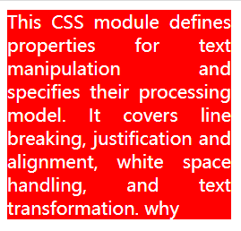 设置最后一行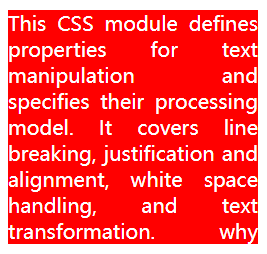


## 装饰文本 text-decoration

设置文字的装饰线

```css
div {
	text-decoration: underline；
}
```

- 参数：`none`（无装饰线），`underline`（下划线），`overline`（上划线），`line-through`（删除线）

- 取消 `<a>` 默认的下划线 `text-decoration: none;`


## 文本缩进 text-indent

设置第一行内容的缩进

```css
div {
	text-indent: 10px;
}
```

- 设置为相对于字体大小（父元素的字体大小可以继承）

  ```css
  p {
    font-size: 40px;
    text-indent: 2em;
  }
  ```

- 可以是负值


## 行间距 line-height

设置一行文字所占据的高度

```css
p {
	line-height: 26px;
}
```

- 行间距的严格定义是，两行文字基线（baseline）之间的间距，基线是与小写字母最底部对齐的线

  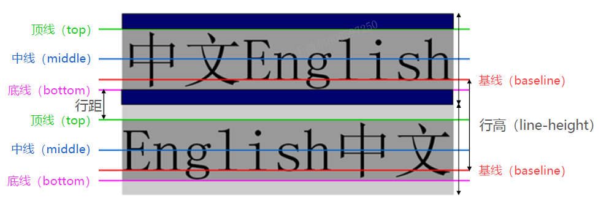 

- 两行文字基线的距离 / 行间距 = 上间距 + 文本高度 + 下间距

  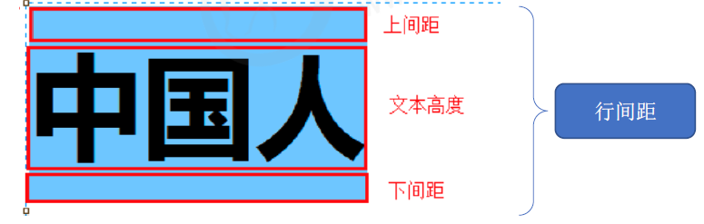　

- 如果行间距是数字或者百分比，等于字体大小的倍数： 行高 = 字体大小 * 行间距

- 在设置字体 `font` 中 `font: 12px/1.5 'Mircrosoft YaHei'` 中的 1.5 就是行间距，是字体大小的 1.5 倍


## 垂直居中

让**文字的行高等于盒子的高度** `height` = `line-height`

```css
div {
	width: 200px;
	height: 40px;
	line-height: 40px
}
```

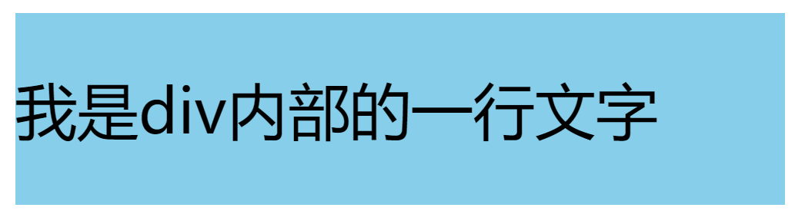 

- 行高小于盒子高度，文字会偏上
- 行高大于盒子高度，文字会偏下
- 如果盒子模型是 `box-sizing:border-box`，有设置 `margin` `padding` 等的情况，行高应该设置小于高度一些


## 垂直对齐 vertical-align

`vertical-align : baseline | top | middle | bottom`

- 只针对**行内元素或者行内块元素**，例如图片或者表单，和文字垂直对齐

- 属性

  - `baseline` 父元素的基线

  - `top` 元素顶端与行中最高元素的顶端对齐

  - `middle` 元素放置在父元素的中部

  - `bottom` 元素的顶端与行中最低元素的顶端对齐

    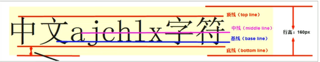 

- 图片、表单和文字对齐

  图片、表单都属于行内块元素，默认的 `vertical-align` 是基线对齐。

  给图片、表单这些行内块元素的 `vertical-align` 属性设置为 `middle` 就可以让文字和图片垂直居中对齐了。

- 可以接受像素作为参数，表示相对 baseline 移动多少 

- 图片底部默认会有空白缝隙，因为行内块元素会和文字的基线对齐

  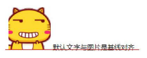 

  解决办法：

  - 给图片添加 `vertical-align:middle | top| bottom` 等，不要和基线对齐
  - 把图片转换为块级元素 `display: block;` 但是会独占一行


## 文字阴影 text-shadow

文字添加阴影效果，添加一点阴影会让文字有种印刷品的质感

`text-shadow: h-shadow vuj-shadow blur color`

```css
.box {
  text-shadow: 5px 5px 5px orange;
}
```

- 属性
  
  `h-shadow` 水平阴影的位置，允许负值，必需
  
  `v-shadow` 垂直阴影的位置，允许负值，必需
  
  `blur` 模糊的距离，可选
  
  `color` 阴影的颜色，可选
  
- 可以设置一个或者多个阴影，多个阴影之间用逗号隔开，从前到后叠加

  ```css
  .box {
    font-size: 50px;
    font-weight: 700;
    text-shadow: 5px 5px 5px orange, 10px 10px 5px blue, 15px 15px 5px green;
  }
  ```

  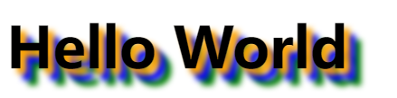 

- 在线测试文字阴影网站

  https://html-css-js.com/css/generator/text-shadow/


## 大小写转换 text-transform

```css
.info {
  /* text-transform: capitalize; */
  /* text-transform: uppercase; */
  text-transform: lowercase;
}
```

- 参数：`capitalize`（首字母大写），`uppercase`（变为大写），`lowercase`（变为小写），`none`（无变化）


## 字母单词间距

- 设置字母之间的间距 `letter-spacing` 

  默认是0，可以设置为负数

  ```css
  .box {
    letter-spacing: 10px;
  }
  ```

  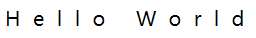 

- 设置单词之间的间距 `word-spacing`

  默认是0，可以设置为负数

  ```css
  .box {
    word-spacing: 30px;
  }
  ```

  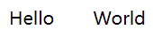 


## 文字折行

固定宽度的盒子容器中的默认文字排列

- 行内如果最后一个单词无法完整放下，这个单词会放到下一行去
- 行内如果只有一个单词，且该单词的长度已经超过容器的长度，单词末尾部分的字母会溢出容器，而不会放到下一行

```css
.box {
  font-size: 24px;
  width: 200px;
  border: 1px solid #000;
}
```

```html
<div class="box">
  Hi&nbsp;&nbsp;,
  This is a incomprehensibilities long word.
  </br>
  你好&nbsp;&nbsp;，
  这 是一个不可思议的长单词
</div>
```

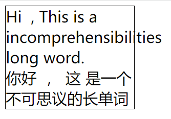 

- 内容换行 `overflow-wrap` 、`word-wrap`

  - 两者效果相同，`overflow-wrap` 是在 CSS3 中用来替换 `word-wrap` 的，为了兼容性应该都写上两者

  - `normal` 默认值

  - `break-word` **只有当单词在完整一行都显示不下时，才会拆分换行该单词**

    ```css
    .box {
      overflow-wrap: break-word;
      word-wrap: break-word;
    }
    ```

    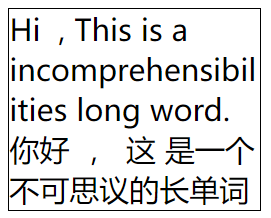 

- 词内换行 `word-break`

  - `normal` 默认值，单词作为一个整体

  - `break-all` **单词不再是一个整体，所有单词碰到边界一律拆分换行**

    ```css
    .box {
      word-break: break-all;
    }
    ```

    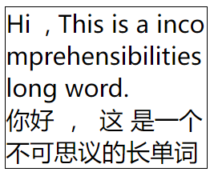 

  - `keep-all` 所有单词都保持完整，中文的句子也保持完整，而且只能在半角空格或连字符处换行

    ```css
    .box {
      word-break: keep-all;
    }
    ```

    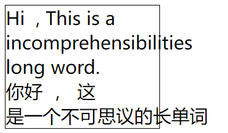 

  - `break-word` 等同于 `overflow-wrap: break-word`，但是有兼容性问题

  - `word-break` 的优先级大于 `overflow-wrap`

    ```css
    .box {
      overflow-wrap: break-word;
      word-break: break-all;
    }
    /* 最后生效的是 word-break: break-all */
    ```

- 空白处是否断行 `white-space`

  - `nowrap` **文本不会换行，文本会在在同一行上继续**，直到遇到 `</br>` 才能换行

    ```css
    .box {
      white-space: nowrap;
    }
    ```

    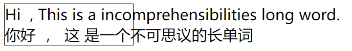 


## 书写模式 writing-mode

设置文本在水平或垂直方向上如何排布

- `vertical-lr`：垂直排布，从上到下，从左到右；`vertical-rl`：垂直排布，从上到下，从右到左

  ```css
  .text {
    writing-mode: vertical-lr;
  }
  ```

   

- `horizontal-tb`：水平排布，从左到右，自上而下


# 盒子样式

盒子模型包括：边框 `border`，外边距 `margin`，内边距 `padding`，内容 `width / height`

 


## 宽度和高度

### 宽度 width

```css
.box {
  width: 200px;
}
```

- 对于行内级非替换元素来说, 设置宽度无效

- 宽度 `width` 的默认值是 `auto`，交给浏览器来决定

  块级元素的默认值 `auto` 是独占父元素一行，行内级元素的默认值 `auto` 是包裹内容
  
- 百分比单位是基于父元素宽度的百分比


### 高度 height

```css
.box {
  height: 200px;
}
```

- 对于行内级非替换元素来说, 设置高度无效
- 百分比单位是基于父元素高度的百分比


### 最小和最大宽度

最小宽度 `min-width`

- 无论有多少内容，宽度都大于或等于 `min-width`

最大宽度 `max-width`

- 无论有多少内容，宽度都小于或等于 `max-width`

移动端适配时，可以设置最大宽度和最小宽度

```css
.home {
  max-width: 750px;
  min-width: 600px;
}
```


### 最小和最大高度

最小高度 `min-height`

- 无论有多少内容，高度都大于或等于 `min-height`

最大高度 `max-height`

- 无论有多少内容，高度都小于或等于 `max-height`

不常用这两个属性，一般高度是由内容决定

```css
.home {
  max-height: 2000px;
  min-height: 1000px;
}
```


## 边框

### 边框宽度 border-width

上边框 `border-top-width`、右边框  `border-right-width`、下边框 `border-bottom-width`、左边框 `border-left-width`

```css
.box {
  border-top-width: 10px;
  border-right-width: 20px;
  border-bottom-width: 30px;
  border-left-width: 40px;
}
```

`border-width` 是边框宽度的简写，顺时针方向依次赋值，可以省略个数赋值

```css
.box {
  border-width: 10px 20px 30px 40px;
}
```


### 边框颜色 border-color

上边框 `border-top-color`、右边框  `border-right-color`、下边框 `border-bottom-color`、左边框 `border-left-color`

```css
.box {
  border-top-color: red;
  border-right-color: blue;
  border-bottom-color: green;
  border-left-color: orange;
}
```

`border-color` 是边框颜色的简写，顺时针方向依次赋值，可以省略个数赋值

```css
.box {
  border-color: red blue green orange;
}
```


### 边框样式 border-style

上边框 `border-top-style`、右边框 `border-right-style`、下边框 `border-bottom-style`、左边框 `border-left-style`

```css
.box {
  border-top-style: solid;
  border-right-style: dashed;
  border-bottom-style: groove;
  border-left-style: ridge;
}
```

`border-style` 是边框样式的简写，顺时针方向依次赋值，可以省略个数赋值

```css
.box {
  border-style: solid dashed groove ridge;
}
```

- 参数：实线 `solid`，虚线 `dashed`，点线 `dotted`，双线 `double`，凹槽 `groove`，凸状 `ridge`，嵌入 `inset`，突出 `outset`

  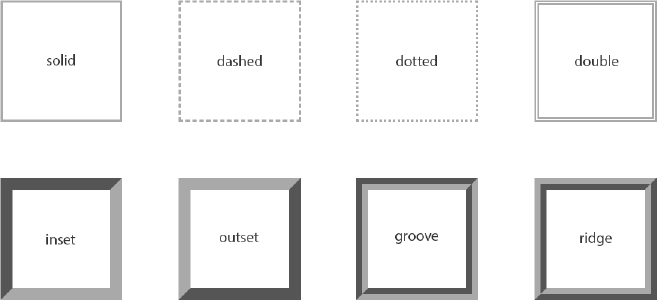 


### 边框简写属性 border

同时设置宽度、样式、颜色

上边框 `border-top`、右边框 `border-right`、下边框 `border-bottom`、左边框 `border-left`

```css
.box {
  border-top: 10px solid red;
  border-right: 20px dashed blue;
  border-bottom: 30px groove green;
  border-left: 40px ridge orange;
}
```

统一四个边框 `border`

```css
.box {
  border: 10px solid red;
}
```

- `border` 边框颜色、宽度、样式的编写顺序任意，可以省略边框颜色和宽度，但只能为四个边框做统一设置

- 使用 `border`  统一设置时，如果个别需要特殊设置可以利用层叠性覆盖

  ```css
  .box {
    border: 10px solid red;
    border-left-color: pink;
  }
  ```

- 边框会影响盒子的大小，使用盒子模型 `box-sizing:content-box`，盒子大小会包含边框宽度


### 圆角边框 border-radius

设置盒子的圆角 `border-radius`

```css
.box {
  border-radius: 20px;
}
```

- 参数：数值或百分比，数值是圆角的半径长度，百分比是相当于盒子的宽度和高度的百分比

  `border-radius: 20px` 相当于每个圆角的半径都是 20px

  `border-top-left-radius：50%` 相当于左边高的 50% 和上边宽的 50%

- 可以分别为四个角设置不同的值，顺时针方向依次赋值，可以省略个数赋值

   `border-radius: 左上角 右上角 右下角 左下角` 

  左上角 `border-top-left-radius`

  右上角 `border-top-right-radius`

  右下角 `border-bottom-right-radius`

  左下角`border-bottom-left-radius`

- 可以分别设置圆角的水平和垂直半径

   `border-radius: 左上水平 右上水平 右下水平 左下水平 / 左上垂直 右上垂直 右下垂直 左下垂直 ` 

  ```css
  border-radius: 2em 1em 4em / 0.5em 3em;
  /* 等价于 */
  border-top-left-radius: 2em 0.5em;
  border-top-right-radius: 1em 3em;
  border-bottom-right-radius: 4em 0.5em;
  border-bottom-left-radius: 1em 3em;
  
  /* 每个圆角的水平半径时30px,垂直半径为20px */
  border-radius: 30px / 20px;
  
  border-radius: 30px;
  /* 等价于 */
  border-radius: 30px 30px 30px 30px/30px 30px 30px 30px；
  ```

- 设置圆形：正方形，数字修改为高度或者宽度的一半，或者直接写为 50%

  ```css
  .box {
    width: 100px;
    height: 100px;
    border-radius: 50%;
  }
  ```

- 圆角矩形：设置为高度的一半

  ```css
  .box { 
    width: 300px;
    height: 200px;
    border-radius: 100px;
    background-color: #0f0;
  }
  ```

  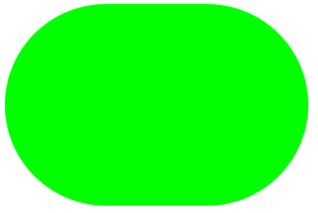 

  

### 边框背景图片 border-image

`border-image: url(xx.jpg) 剪裁位置 重复性`

```css
.box {
  border-image: url(border.png) 30 round;
}
```

- 剪裁位置可以是像素也可以是百分比

  剪裁出来的四个角根据边框的大小自动缩放，显示到边框对应的四个角的位置

  剪裁剩下的中心切片会被舍去，其他切片（上中，右中间，下中，左中间）会根据配置的重复性操作显示到对应的四个边

  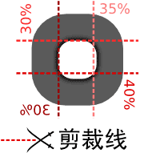 

- 重复性：`repeat`（重复），`round`（平铺），`stretch`（拉伸），默认是拉伸

- 九宫格图片转化为边框

  ```css
  .box {
    /* 指定边框宽度 */
    border-width: 30px;
    /* 拉伸 */
    border-image: url(./border.png) 30 stretch;
    /* 平铺 */
    /* border-image: url(./border.png) 30 round; */
  }
  ```

  原始图片 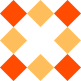 拉伸 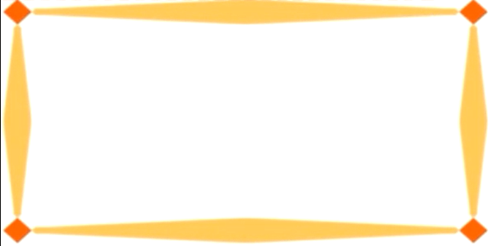 平铺 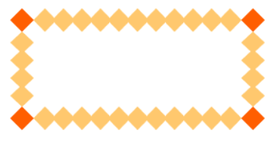 


### 边框三角形


## 内边距

设置盒子的内边距，通常用于设置边框和内容之间的间距（父子嵌套关系）

```css
.box {
  padding: 10px 20px 30px 40px;
}
```

- `padding` 包括四个方向，可以分别赋值

  `padding-left`，`padding-right`，`padding-top`，`padding-bottom`

  ```css
  padding-top: 10px;
  padding-right: 20px;
  padding-bottom: 30px;
  padding-left: 40px;
  /* 等价于 */
  padding: 10px 20px 30px 40px;
  ```

- 使用 `padding` 统一赋值时，按照顺时针方向依次赋值，可以省略个数赋值

  `padding:5px` 上下左右都 5px

  `padding:5px 10px` 上下 5px，左右 10px

  `padding:5px 10px 20px` 上 5px，左右 10px，下 20px

  `pdding:5px 10px 20px 30px` 上 5px，右 10px，下 20px，左 30px （顺时针）

- 指定了盒子的大小的时候，`padding` 会影响盒子的实际大小

  使用盒子模型 `box-sizing:content-box`，盒子大小会包含边框宽度

  ```css
  .box {
    width: 300px;
    height: 300px;
    padding-top: 100px;
    box-sizing: border-box;
    background-color: #f00;
  }
  ```

- 盒子本身没有指定 `height` 或者 `width` 属性，此时 `padding` 不会撑开盒子大小


## 外边距

### 外边距 margin

设置盒子的外边距，通常用于元素和元素之间的间距（兄弟元素关系）

```css
.box {
  margin: 10px 20px 30px 40px;
}
```

- `margin` 包括四个方向，可以分别赋值

  `margin-left`，`margin-right`，`margin-top`，`margin-bottom`

  ```css
  margin-top: 10px;
  margin-right: 20px;
  margin-bottom: 30px;
  margin-left: 40px;
  /* 等价于 */
  margin: 10px 20px 30px 40px;
  ```

- 使用 `margin` 统一赋值时，按照顺时针方向依次赋值，可以省略个数赋值

  `margin:5px` 上下左右都 5px

  `margin:5px 10px` 上下 5px，左右 10px

  `margin:5px 10px 20px` 上 5px，左右 10px，下 20px

  `margin:5px 10px 20px 30px` 上 5px，右 10px，下 20px，外 30px （顺时针）

- 外边距和内边距的使用场景
  - `margin` 一般是用来设置**兄弟元素之间的间距**
  - `padding` 一般是用来设置**父子元素之间的间距**


### 上下 margin 传递

`margin-top` 传递

- 如果**块级元素的顶部线和父元素的顶部线重叠**，这个**块级元素的 `margin-top` 值会传递给父元素**

  ```css
  .outer {
    width: 300px;
    height: 300px;
    background-color: #f00;
  }
  .inner {
    width: 100px;
    height: 100px;
    background-color: #0f0;
    /* 左右是不会传递 */
    /* margin-left: 30px; */
    margin-top: 100px;
  }
  ```

  ```html
  <div class="outer">
    <div class="inner"></div>
  </div>
  ```

  实际效果 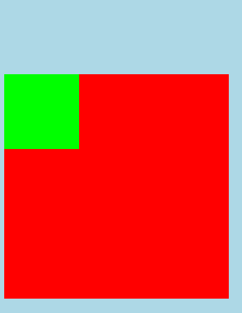   预期效果 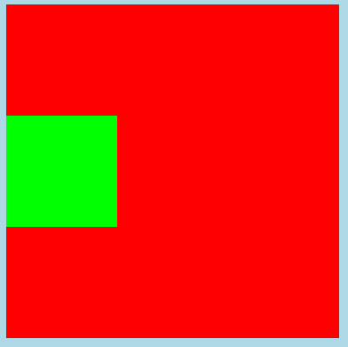 

`margin-bottom` 传递

- 如果**块级元素的底部线和父元素的底部线重叠**，并且**父元素的高度是 `auto`**，这个**块级元素的 `margin-bottom` 值会传递给父元素**

  ```css
  .outer {
    width: 300px;
    /* height: auto; */
    background-color: #f00;
  }
  .inner {
    width: 100px;
    height: 100px;
    background-color: #0f0;
    margin-bottom: 100px;
  }
  ```

  ```html
  <div class="outer">
    <div class="inner"></div>
  </div>
  <div>哈哈哈哈哈</div>
  ```

  实际效果 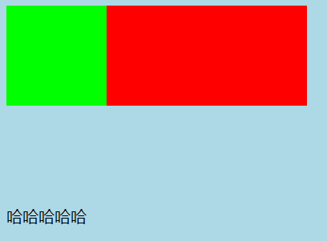    预期效果 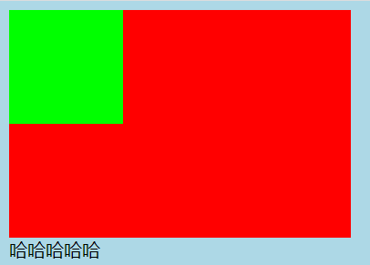

**解决传递问题**

- 父元素设置 `padding-top` \ `padding-bottom` 来代替使用子元素使用外边距

  ```css
  .outer {
    width: 300px;
    height: 300px;
    background-color: #f00;
    padding-top: 100px;
    box-sizing: border-box;
  }
  .inner {
    width: 100px;
    height: 100px;
    background-color: #0f0;
  }
  ```

- 触发 BFC，父元素添加 `overflow: auto`

  ```css
  .outer {
    width: 300px;
    height: 300px;
    background-color: #f00;
    overflow: auto;
  }
  .inner {
    width: 100px;
    height: 100px;
    background-color: #0f0;
    margin-top: 100px;
  }
  ```

- 父元素设置 `border`，但是由于 `border` 占据空间，不推荐

  ```css
  .outer {
    width: 300px;
    height: 300px;
    background-color: #f00;
    border: 1px solid transparent;
  }
  .inner {
    width: 100px;
    height: 100px;
    background-color: #0f0;
    margin-top: 100px;
  }
  ```


### 上下 margin 折叠

垂直方向上相邻的2个外边距（`margin-top`、`margin-bottom`）有可能会合并为1个外边距

上下 `margin` 折叠分为两种情况

- 两个**兄弟块级元素**之间**上下 `margin` 的折叠**，折叠后**取较大的值**作为最终的外边距

  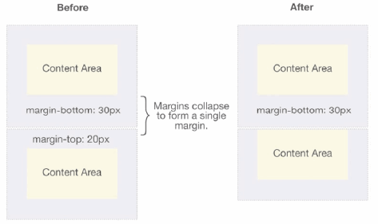 

  ```css
  .top {
    height: 100px;
    background-color: #f00;
    margin-bottom: 30px;
  }
  .bottom {
    height: 100px;
    background-color: #0f0;
    margin-top: 50px;
  }
  ```

  ```html
  <div class="top"></div>
  <div class="bottom"></div>
  ```

  **解决办法**

  - 只设置其中一个元素的 `margin-top` 或 `margin-bottom`

    ```css
    .box1 {
      height: 100px;
      width: 100px;
      background-color: #f00;
      margin-bottom: 80px;
    }
    .box2 {
      height: 100px;
      width: 100px;
      background-color: #0f0;
    }
    ```

  - 下方的元素设置浮动 `float: left`，浮动元素的下方要清除浮动 `clear: both`

    ```css
    .top {
      height: 100px;
      width: 100px;
      background-color: #f00;
      margin-bottom: 30px;
    }
    .bottom {
      height: 100px;
      width: 100px;
      background-color: #0f0;
      margin-top: 50px;
      float: left;
    }
    ```

- 父子块级元素之间 `margin` 的折叠，折叠后取较大的值作为最终的外边距

  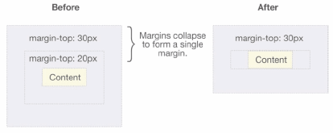 

  ```css
  .outer {
    height: 300px;
    width: 300px;
    background-color: #f00;
    margin-top: 30px;
  }
  .inner {
    height: 100px;
    width: 100px;
    background-color: #0f0;
    margin-top: 20px;
  }
  ```

  ```html
  <div class="outer">
    <div class="inner"></div>
  </div>
  ```

  **解决办法**

  - 父元素设置 `padding-top` \ `padding-bottom` 来代替使用子元素使用外边距

    ```css
    .outer {
      height: 300px;
      width: 300px;
      background-color: #f00;
      margin-top: 30px;
      padding-top: 20px;
      box-sizing: border-box;
    }
    .inner {
      height: 100px;
      width: 100px;
      background-color: #0f0;
    }
    ```

  - 触发 BFC，父元素添加 `overflow: auto`

    ```css
    .outer {
      height: 300px;
      width: 300px;
      background-color: #f00;
      margin-top: 30px;
      overflow: auto;
    }
    .inner {
      height: 100px;
      width: 100px;
      background-color: #0f0;
      margin-top: 20px;
    }
    ```

  - 父元素设置 `border`，但是由于 `border` 占据空间，不推荐

    ```css
    .outer {
      height: 300px;
      width: 300px;
      background-color: #f00;
      margin-top: 30px;
      border: 1px solid transparent;
    }
    .inner {
      height: 100px;
      width: 100px;
      background-color: #0f0;
      margin-top: 20px;
    }
    ```


## 外轮廓

```css
.box {
  outline: 30px solid #0f0;
}
```

- 外轮廓不占用空间，默认显示在 `border` 的外面

- 使用方法和 `border` 一样

  相关属性有：`outline-width`，`outline-style`，`outline-color`

  `outline` 是简写属性

- 去除元素默认的外轮廓

  去除 `<a>` 的默认外轮廓（在 `focus` 状态下显示）

   修改后   

  ```css
  a {
    outline: none;
  }
  ```

  去除 `<input>` 的默认外轮廓（元素在 `focus` 状态下显示）

   修改后    

  ```css
  input {
    outline: none;
  }
  ```


## 盒子阴影

添加一个或多个下拉阴影框

`box-shadow: h-shadow v-shadow blur spread color inset`

```css
.box {
  width: 100px;
  height: 100px;
  box-shadow: 5px 5px 10px gray;
}
```

- 参数：

  `h-shadow` 水平阴影的位置，允许负值，正值阴影往右走，负值往左走，必需

  `v-shadow` 垂直阴影的位置，允许负值，正值阴影往下走，负值往上走，必需

  `blur` 模糊距离，可选

  `spread` 阴影的尺寸，可选

  `color` 阴影的颜色，可选，默认的颜色是前景色 `color`

  `inset` 将外部阴影 `outset` 改为内部阴影，可选

- 可以设置一个或者多个阴影，多个阴影之间用逗号隔开，从前到后叠加

  ```css
  .box {
    width: 100px;
    height: 100px;
    background-color: #f00;
    box-shadow: 5px 5px 10px orange, 10px 10px 10px green;
  }
  ```

   

- 盒子阴影不占空间，不会影响其他盒子排列

- 在线测试盒子阴影网站

  https://html-css-js.com/css/generator/box-shadow/


## 盒子模型

定义如何计算一个元素的总宽度和总高度，高宽是否需要加上内边距和边框等

- `box-sizing: content-box` ：默认值，`padding`、`border` 都布置在 `width`、`height` 之外

  盒子大小为 `width / height + padding + border`

   

- `box-sizing: border-box`  ：`padding`、`border` 都布置在 `width`、`height` 之内（不包含 `margin`）

  盒子大小为 `width`  的宽度和 `height` 高度

   

  ```css
  .box {
    width: 300px;
    height: 300px;
    border: 1px solid red;
    padding: 100px;
    box-sizing: border-box;
  } 
  ```


## 盒子水平居中

**块级元素**在父元素中水平居中显示

盒子**必须指定宽度**，盒子的**左右外边距**都设置为 `auto`，让浏览器自动分配

*父盒子的宽度 = 块级元素宽度 + margin-left + margin-right*

```css
.box {
  width: 100px;
  margin: 0 auto;
}
```

行内元素或者行内块元素水平居中给其父元素添加 `text-align:center` 即可


# 背景样式

## 背景颜色 background-color

设置元素的背景颜色，背景是元素的总大小，包含内边距

`background-color: 颜色值`

```css
.box {
  background-color: pink;
}
```


## 背景图片 background-image

`background-image : none | url (url)`

```css
.box {
  width: 600px;
  height: 600px;
  background-image: url(../images/kobe01.jpg);
}
```

- 既可以添加背景图片也可以添加背景颜色，背景图片会压住背景颜色

- 元素没有具体的宽高，背景图片不会显示

- 可以设置多张背景图片，多个背景图片之间用逗号隔开，按顺序后添加的层叠在下面

  ```css
  background-image: url(../images/kobe01.jpg), url(../images/kobe02.png);
  ```

- `background-image` 和 `` 对比

   

   `` ：作为网页内容的重要组成部分，比如广告图片、LOGO图片、文章配图、产品图片

  `background-image`：不影响用户获取完整的网页内容信息的内容，装饰性的小图片或者是超大的背景图片

- 使用背景线性渐变 `background-image: linear-gradient(direction,color1,color2,.....)`

  - 起始方向 `direction` ，起始方向可以是方位名词，度数，如果省略就是 `top` 

    ```css
    /* 从上到下 */
    linear-gradient(red, yellow, blue);
    /* 从左到右 */
    linear-gradient(left, red, yellow, blue)
    /* 从左到右 */
    linear-gradient(to right, red, yellow, blue)
    /* 从右下到左上 */
    linear-gradient(to left top, red, yellow, blue)
    /* 从下到上 */
    linear-gradient(0deg, red, yellow, blue)
    /* 从左下到右上 */
    linear-gradient(45deg, red, yellow, blue)
    /* 从左到右 */
    linear-gradient(90deg, red, yellow, blue)
    /* 从上到下 */
    linear-gradient(180deg, red, yellow, blue)
    ```

  - 渐变的起止颜色 `color1,color2,.....`，至少两个颜色，可以指定颜色的位置

    ```css
    /* 0-10% 红到绿，10%-50% 绿到黄，50%-100% 黄到蓝 */
    linear-gradient(135deg, red 0, green 10%, yellow 50%, blue 100%)
    ```

    制作斜线

    ```css
    /* 0-49.5% 空白，49.5%-50.5% 绿，50.5%-100% 空白 */
    linear-gradient(135deg, transparent 0, transparent 49.5%, green 49.5%, green 50.5%, transparent 50.5%, transparent 100%)
    ```

     

    利用背景颜色重叠，制作交叉线

    ```css
    .box {
      background: 
        linear-gradient(135deg,
          transparent 0, transparent 49.5%,
          green 49.5%, green 50.5%,
          transparent 50.5%, transparent 100%),
        linear-gradient(45deg, 
          transparent 0, transparent 49.5%,
          red 49.5%, red 50.5%,
          transparent 50.5%, transparent 100%);
      background-size: 30px 30px;
    }
    ```

    ```html
    <div class="box"></div>
    ```

     


## 背景平铺 background-repeat

设置背景图片是否要平铺

```css
.box {
  width: 600px;
  height: 600px;
  background-image: url(../images/kobe01.jpg);
  background-repeat: no-repeat;
}
```

- 参数

  `repeat`：水平和垂直方向平铺，默认
  `no-repeat`：不平铺
  `repeat-x`：只在水平方向平铺
  `repeat-y`：只在垂直平方向平铺

- 利用背景平铺制作背景墙

  背景图片： 

  ```css
  .box {
    width: 600px;
    height: 600px;
    background-image: url(../images/wall.png);
  }
  ```

   


## 背景缩放 background-size

设置背景图片的大小

`background-size: length|percentage|cover|contain`

- `auto` ：以背景图本身大小显示，默认值

  ```css
  background-repeat: no-repeat;
  background-size: auto;
  /* 等价于 */
  /* background-size: auto auto; */
  ```

   高度和宽度按照图片的原始尺寸

- `length`：第一个值宽度，第二个值高度，如果只设置一个值，肯定是宽度，高度会等比例缩放

  ```css
  background-repeat: no-repeat;
  background-size: 100px 100px;
  ```

   宽度 100px，高度 100px

  ```css
  background-repeat: no-repeat;
  background-size: 100px;
  /* 等价于 */
  /* background-size: 100px auto; */
  ```

   宽度 100px，高度等比例缩放

- `percentage`：第一个值宽度，第二个值高度，如果只设置一个值，肯定是宽度，高度会等比例缩放，两个百分比分别是相对于父盒子的宽度和高度

  ```css
  background-repeat: no-repeat;
  background-size: 100% 100%;
  ```

   图片宽度和高度等于被拉伸，覆盖整个盒子

  ```css
  background-repeat: no-repeat;
  background-size: 100%;
  /* 等价于 */
  /* background-size: 100% auto; */
  ```

   宽度等于盒子的宽度，高度等比例缩放

  ```css
  background-repeat: no-repeat;
  background-size: 100% 100px;
  ```

   宽度等于盒子的宽度，高度 100px

- `cover`：背景图像等比例扩展到足够大，使背景图像完全覆盖背景区域，可能有部分图片显示不全

  ```css
  background-repeat: no-repeat;
  background-size: cover;
  ```

   图片等比例缩放，直到填满盒子

- `contain`：把图像扩展至最大尺寸，使其宽度和高度完全适应内容区域，当宽度或者高度铺满盒子就不再进行拉伸了，可能有部分空白区域

  ```css
  background-repeat: no-repeat;
  background-size: contain;
  ```

   图片等比例缩放，直到图片的宽或高等于盒子的宽或高

- 多个背景图片，多个图片缩放之间用逗号隔开


## 背景图片位置 background-position

设置背景图片在水平、垂直方向上的具体位置

`background-position: x y;`

- 参数： x 坐标，y 坐标，可以使用方位名称、精确单位或百分比

   

- 方位名称：`top` | `center` | `bottom` | `left` | `right`
  - x 坐标 和 y 坐标都是方位名称的话，前后顺序无关
  
    ```css
    /* 右上 */
    background-position: right top;
    /* 等价于 */
    background-position: top right;
    ```
  
  - 如果只指定一个方位名称，省略的值默认为居中 `center`
  
    ```css
    /* 上中 */ 
    background-position: top;
    /* 等价于 */
    background-position: top center;
    ```
  
  - 方位名称后可设置长度或百分比的偏移量
  
    ```css
    /* 下方向上偏移50px，右侧向左偏移200px */
    background-position: bottom 50px right 200px;
    /* 上方，右侧向左偏移10px */
    background-position: top right 10px;
    ```
  
- 参数是精确单位或百分比
  
  - 第一个值 x 坐标，第二个值 y 坐标，可以指定负数

    ```css
    background-position: 50px 100px;
    background-position: -50px -100px;
    background-position: 20% 30%;
    background-position: 20% 100px;
    ```
  
  - 如果只指定一个数值，该数值一定是 x 坐标，另一个默认垂直居中
  
    ```css
    background-position: 50px;
    /* 等价于 */
    background-position: 50px 50%;
    ```

- `background-position: center` 让图片在浏览器大小改变时依然保持居中显示

  ```css
  .box {
    height: 489px;
    background-image: url(../images/mhxy.jpg);
    background-position: center;
  }
  ```

   


## 背景附着 background-attachment

决定背景图像的位置是在视口内固定，或者随着包含它的区块滚动

`background-attachment : scroll | fixed | local`

- `scroll`：背景相对于元素本身固定， 而不是随着它的内容滚动

  ```css
  .box {
    width: 800px;
    height: 700px;
    overflow: scroll;
    background-image: url(../images/kobe01.jpg);
    background-attachment: scroll;
  }
  ```

   

  

- `local`：背景相对于元素的内容固定，如果一个元素拥有滚动机制，背景将会随着元素的内容滚动

  ```css
  .box {
    width: 800px;
    height: 700px;
    overflow: scroll;
    background-image: url(../images/kobe01.jpg);
    background-attachment: local;
  }
  ```

   

- `fixed`：背景相对于视口固定，即使一个元素拥有滚动机制，背景也不会随着元素的内容滚动

  ```css
  .box {
    width: 800px;
    height: 700px;
    overflow: scroll;
    background-image: url(../images/kobe01.jpg);
    background-attachment: fixed;
  }
  ```

   

- 可以制作视差滚动效果


## 背景简写属性 background

`background: 背景颜色 背景图片地址 背景图片位置/背景图片缩放 背景平铺 背景图像滚动`

```css
.box {
  width: 600px;
  height: 600px;
  background: transparent url("image.png") center/80% no-repeat fixed;
}
```

- 属性可以省略，顺序任意
- `/background-size` 必须紧跟在 `background-position` 的后面


## 剪裁 clip-path

`clip-path: url(image.jpg) 形状函数 `

- 容器的原本大小和站位是不变的


## 精灵图

精灵主要利用背景图片的使用，把多个小背景图片整合到一张大图片中，大图片被称为 sprites 精灵图

精灵图可以减小图片总大小，减少网页的 http 请求数量，加快网页响应速度，减轻服务器压力

- 制作精灵图

  生成精灵图网站 https://www.toptal.com/developers/css/sprite-generator

- 使用精灵图

  

  1. 设置对应元素的宽度和高度

  2. 设置精灵图作为背景图片 

  3. 使用 `background-position` 移动背景图片位置来展示

     移动的距离就是这个目标图片的 x 和 y 坐标

     往上往左移动都是负值

     图片想要缩小的时候，`background-size` 和 `background-position` 都要等比例缩小 

  ```css
  .box {
    background: #333;
  }
  .topbar {
    background-image: url(../images/topbar_sprite.png);
    background-repeat: no-repeat;
    display: inline-block;
  }
  i.hot-icon {
    background-position: -192px 0;
    width: 26px;
    height: 13px;
  }
  i.logo-icon {
    background-position: 0 -19px;
    width: 157px;
    height: 33px;
  }
  ```

  ```html
  <div class="box">
    <i class="topbar hot-icon"></i>
    <i class="topbar logo-icon"></i>
  </div>
  ```

   


# 定位样式

## 标准流

默认情况下元素都是按照标准流进行排布，从左到右、从上到下按顺序摆放好，互相之间不存在层叠现象

 

- 在标准流中，可以使用 `margin`、`padding` 对元素进行定位，但是通常会影响到标准流中其他元素的位置，而且无法实现层叠效果

- 静态定位 `position: static`，默认的定位方式，元素安装标准流布局，`left`、`right`、`top`、`bottom` 没有任何作用


## 相对定位

`position: relative`

```css
.text {
  position: relative;
  left: 30px;
  top: 50px;
}
```

```html
<span>我是span元素1</span>
<span class="text">我是span元素2</span>
<span>我是span元素3</span>
```

 

- 元素**按照标准流布局**

- `left`、`right`、`top`、`bottom` 用来设置元素的具体位置

- 相对于自己原来的位置来移动的（**移动位置的时候参照点是自己原来的位置**）

- 原来在标准流的位置继续占有，后面的盒子仍然以标准流的方式对待它（**不脱标，继续保留原来的位置**）

- 相对定位的应用场景：在**不影响其他元素位置**的前提下，**对当前元素位置进行微调**

- 使用相对定位实现 `background-position: center` 效果

  ```css
  .box {
    height: 489px;
    background-color: #f00;
    overflow: hidden;
  }
  .box img {
    position: relative;
    left: -960px;
    margin-left: 50%;
  }
  ```

  ```html
  <div class="box">
    
  </div>
  ```

  1. 图片使用相对定位

      

  2. 图片向左 `left` 移动图片尺寸的一半长度

      

  3. 图片再向右移动盒子尺寸的一半长度 `margin-left: 50%`（由于响应式的需要，盒子宽度不固定，必须使用百分比来移动）

      

  > 这种情况仍然需要计算图片向左移动的具体尺寸，还是有缺陷
  >
  > 使用 `transform: translate(-50%)` 相对于自己元素的宽度进行移动
  >
  > ```css
  > .box img {
  >   /* translate中的百分比是相对于自己 */
  >   transform: translate(-50%);
  >   margin-left: 50%;
  > }
  > ```


## 固定定位

`position: fixed`

```css
.text {
  position: fixed;
  right: 30px;
  bottom: 30px;
}
```

```html
<span>我是span元素1</span>
<span class="text">我是span元素2</span>
<span>我是span元素3</span>
```

 

- 元素**脱离标准流布局**

- `left`、`right`、`top`、`bottom` 用来设置元素的具体位置

- 固定于浏览器可视区的位置，以浏览器的**可视窗口为参照点**

  > 视口（Viewport）和画布（Canvas）
  >
  > - 视口：文档的可视区域
  > - 画布：用于渲染文档的区域，文档内容超出视口范围，可以通过滚动查看
  >
  >  红框：视口；黑框：画布

- 固定定位不再占有原先的位置（**脱标，不保留原来的位置**）

- 参考**绝对定位元素特点**

- 使用固定定位让盒子固定到版心右侧

  ```css
  .w {
    width: 800px;
    height: 1400px;
    background-color: pink;
    margin: 0 auto;
  }
  .fixed {
    position: fixed;
    /* 1. 走浏览器宽度的一半 */
    left: 50%;
    /* 2. 利用margin 走版心盒子宽度的一半距离 */
    margin-left: 405px;
    width: 50px;
    height: 150px;
    background-color: skyblue;
  }
  ```
  
  ```html
  <div class="fixed"></div>
  <div class="w">版心盒子 800像素</div>
  ```
  
    


## 绝对定位

`position: absolute`

```css
.box {
  position: relative;
  width: 600px;
  height: 200px;
}
.text {
  position: absolute;
  right: 0;
  top: 0;
}
```

```html
<div class="box">
  <span>我是span元素1</span>
  <strong class="text">我是绝对定位元素</strong>
  <span>我是span元素3</span>
</div>
```

 

- 元素**脱离标准流布局**

- `left`、`right`、`top`、`bottom` 用来设置元素的具体位置

- 定位**参照对象是最邻近的定位祖先元素**，如果**找不到**定位祖先元素，参照对象是**视口**

- 大多数情况下，子元素的绝对定位都是相对于父元素进行定位（**子绝父相**）

  如果希望**子元素相对于父元素进行定位**，又**不希望父元素脱标**，父元素只能是相对定位

- 参考**绝对定位元素特点**


## 粘性定位

`position: sticky`

```css
.nav {
  background-color: #f00;
  color: #fff;
  position: sticky;
  top: 0;
}
```

```html
<h1>我是标题</h1>
<div class="nav">
  <span>电脑</span>
  <span>手机</span>
  <span>衣服</span>
  <span>鞋子</span>
</div>
<ul>
  <li>电脑列表1</li>
  <li>电脑列表2</li>
  <li>电脑列表3</li>
  ...
</ul>
```

 

- 可以看做是相对定位和固定(绝对)定位的结合体
- 被定位的元素表现得像相对定位一样，**直到它滚动到某个阈值点**，达到这个阈值点时，就会**变成固定(绝对)定位**
- 粘性定位**占有原先的位置**（相对定位特点）
- 以浏览器的**可视区为参照点**设置阈值点（固定定位特点）
- 必须添加 `top` `left` `right` `bottom` 其中一个才有效

- 一般和页面滚动搭配使用
- 兼容性较差，IE 不支持


## 绝对定位元素特点

绝对定位元素（absolutely positioned element）是**位置属性为 `absolute` 或 `fixed` 的元素**

- 不再受标准流的约束，**不再区分块级、行内级、行内块级**，可以**随意设置宽高**，**宽高默认由内容决定**

  ```css
  .box {
    position: relative;
    width: 400px;
    height: 200px;
  }
  strong {
    position: absolute;
    left: 0;
    bottom: 0;
    width: 200px;
    height: 60px;
  }
  ```

  ```html
  <div class="box">
    <span>我是span元素1</span>
    <strong>我是绝对定位元素</strong>
    <span>我是span元素2</span>
  </div>
  ```

   

- 不再给父元素汇报宽高数据

  ```css
  .box {
    display: inline-block;
    position: relative;
  }
  strong {
    position: absolute;
    left: 50px;
    top: 30px;
    width: 200px;
    height: 60px;
  }
  ```

   

- **脱标元素内部**默认还是按照**标准流布局**

- 设置绝对定位元素的**宽高相等**于定位参照对象

  - **宽度相等**：`left: 0`，`right: 0`，宽度省略

    ```css
    .relative {
      width: 800px;
      height: 300px;
      background-color: red;
      position: relative;
    }
    .absolute {
      height: 100px;
      background-color: green;
      position: absolute;
      left: 0;
      right: 0;
    }
    ```

     

    > 原理：
    >
    > *定位参照对象的宽度 = left + right + margin-left + margin-right + 绝对定位元素的实际占用宽度*
    >
    > 依此得出：参照对象宽度: 800px = left: 0 + right: 0 + margin-left: 0 + margin-right: 0 + 绝对定位宽度
    >
    > 交给浏览器计算后，得到绝对定位宽度等于参照对象宽度

  - **高度相等**：`top: 0`，`bottom: 0`，高度省略

    ```css
    .relative {
      width: 800px;
      height: 300px;
      background-color: red;
      position: relative;
    }
    .absolute {
      width: 200px;
      background-color: green;
      position: absolute;
      top: 0;
      bottom: 0;
    }
    ```

     

    > 原理：
    >
    > *定位参照对象的高度 = top + bottom + margin-top + margin-bottom + 绝对定位元素的实际占用高度*
    >
    > 依此得出：参照对象高度: 300px = top: 0 + bottom: 0 + margin-top: 0 + margin-bottom: 0 + 绝对定位高度
    >
    > 交给浏览器计算后，得到绝对定位高度等于参照对象高度

  - **宽高相等**：`left: 0`，`right: 0`，`top: 0`，`bottom: 0`，宽高省略

- 设置绝对定位元素在定位参照对象中**居中显示**

  加了绝对定位的盒子不能通过 `margin:0 auto` 水平居中

  - **水平垂直居中方法一**：`left: 0`，`right: 0`，`top: 0`，`bottom: 0`，`margin: auto`，定义宽高值

    ```css
    .relative {
      width: 800px;
      height: 300px;
      background-color: red;
      position: relative;
    }
    .absolute {
      width: 200px;
      height: 100px;
      background-color: green;
      position: absolute;
      left: 0;
      right: 0;
      top: 0;
      bottom: 0;
      margin: auto;
    }
    ```

     

    > 原理：
    >
    > *定位参照对象的宽度 = left + right + margin-left + margin-right + 绝对定位元素的实际占用宽度*
    >
    > *定位参照对象的高度 = top + bottom + margin-top + margin-bottom + 绝对定位元素的实际占用高度*
    >
    > 依此得出：参照对象宽度: 800px = left: 0 + right: 0 + margin-left: auto + margin-right: auto + 绝对定位宽度 200px
    >
    > ​                   参照对象高度: 300px = top: 0 + bottom: 0 + margin-top: auto  + margin-bottom: auto + 绝对定位高度 100px
    >
    > 交给浏览器计算后，四个 margin 自动平均分配了长度

  - **水平垂直居中方法二**：

    向右移动父盒子宽度一半，再向左移动自己盒子宽度的一半：`left:50%`，`margin-left: -自己盒子宽度的一半`

    向下移动父盒子高度的一半，再向上移动自己盒子高度的一半：`top: 50%`，`margin-top: -自己盒子高度的一半`

    ```css
    .relative {
      width: 800px;
      height: 300px;
      background-color: red;
      position: relative;
    }
    .absolute {
      width: 200px;
      height: 100px;
      background-color: green;
      position: absolute;
      left: 50%;
      margin-left: -100px;
      top: 50%;
      margin-top: -50px;
    }
    ```


## 定位总结

| 定位模式            | 是否脱标 | 定位参照对象                             |
| ------------------- | -------- | ---------------------------------------- |
| `static` 静态定位   | 否       |                                          |
| `relative` 相对定位 | 否       | 元素自己原来的位置                       |
| `absolute` 绝对定位 | 是       | 最邻近的定位祖先元素（没找到，参照视口） |
| `fixed` 固定定位    | 是       | 视口                                     |
| `sticky` 粘性定位   | 否       | 视口                                     |

- 脱标的元素可以直接设置高度和宽度，宽高默认由内容决定
- 脱标的盒子不会触发外边距合并的问题
- 绝对定位、固定定位、滚动到阈值点的粘性定位，会压住下面标准流所有的内容；浮动元素，只会压住下面标准流的盒子，不会压住下面标准流盒子内的文字、图片


## 叠放次序 z-index

设置定位元素的层叠顺序

- 只有定位的盒子才有 `z-index` 属性

- 数值可以是正整数，负整数，或 0，默认是 auto

- **兄弟关系**的比较原则

  `z-index` 越大，层叠在越上面，如果 `z-index` 相等，写在后面的那个元素层叠在上面

  ```css
  .item {
    position: absolute;
    width: 100px;
    height: 100px;
  }
  .box1 {
    left: 0;
    top: 0;
    background-color: #f00;
  }
  .box2 {
    left: 20px;
    top: 20px;
    background-color: #0f0;
    z-index: -1;
  }
  .box3 {
    left: 40px;
    top: 40px;
    background-color: #00f;
  }
  ```

  ```html
  <!-- 未设置 --->
  <div class="item box1">1</div>
  <!-- z-index: -1 -->
  <div class="item box2">2</div>
  <!-- 未设置 --->
  <div class="item box3">3</div>
  ```

   

- **不是兄弟关系**的比较原则

  1. 从元素自己以及祖先元素中，找出**与对方平级的祖先定位元素**进行比较，这个定位元素必须有设置 `z-index`
  2. 如果找出的祖先定位元素没有设置 `z-index`，则使用元素自己的 `z-index` 进行比较
  3. 如果元素自己没有设置 `z-index`，则按照先后顺序决定叠放次序

  ```css
  .item {
    position: absolute;
    width: 100px;
    height: 100px;
  }
  .box1 {
    left: 0;
    top: 0;
    background-color: #f00;
    z-index: 1;
  }
  .box2 {
    left: 20px;
    top: 20px;
    background-color: #0f0;
    z-index: -1;
  }
  .box3 {
    left: 40px;
    top: 40px;
    background-color: #00f;
  }
  .sub-item {
    position: absolute;
    width: 80px;
    height: 80px;
  }
  .sub-box2 {
    position: absolute;
    z-index: 999;
    background-color: yellow;
  }
  .sub-box3 {
    position: absolute;
    background-color: pink;
    z-index: 99;
  }
  ```

  ```html
  <!-- z-index: 1 -->
  <div class="item box1">1</div>
  <!-- z-index: -1 -->
  <div class="item box2">
    <!-- z-index: 999 -->
    <div class="sub-item sub-box2">2</div>
  </div>
  <!-- 未设置 --->
  <div class="item box3">
    <!-- z-index: 99 -->
    <div class="sub-item sub-box3">3</div>
  </div>
  <!-- sub-box2会找到box2，来和box1与box3进行比较  -->
  <!-- sub-box3会找到box3，但是box3没有设置z-index，所以sub-box3来和box1与box2进行比较  -->
  ```

   


# 浮动样式

## 浮动

`float` 属性可以指定一个元素应**沿其容器的左侧或右侧放置**，允许**文本和内联元素环绕**它

通过 `float` 属性让元素产生浮动效果：`none` 不浮动（默认）， `left` 向左浮动， `right` 向右浮动

- 浮动的元素会**脱离标准流**，**向左或向右方向移动**，直到自己的**边界紧贴着包含块**（父元素）**或者其他浮动元素的边界**为止

  浮动元素的左（右）边界不能超出包含块的左（右）边界

  ```css
  .box {
    width: 200px;
    height: 200px;
    background-color: orange;
  }
  .item1, .item2 {
    width: 40px;
    height: 40px;
  }
  .item1 {
    float: left;
    background-color: #0f0;
  }
  .item2 {
    float: right;
    background-color: #f00;
  }
  ```

  ```html
  <div class="box">
    <div class="item1">1</div>
    <div class="item2">2</div>
  </div>
  ```

   

  浮动的盒子不再保留原先的位置，定位元素会层叠在浮动元素上面

   

- **浮动元素之间不能层叠**

  如果一个元素浮动，另一个浮动元素已经在那个位置了，**后浮动的元素将紧贴着前一个浮动元素**（左浮找左浮，右浮找右浮）

  如果**水平方向剩余的空间不够**显示浮动元素，浮动元素**将另起一行**，直到有充足的空间为止

  浮动的元素会**互相贴靠在一起，不会有缝隙**

  ```css
  .container {
    width: 390px;
    height: 250px;
    background-color: orange;
  }
  .item {
    width: 100px;
    float: left;
  }
  .box1 {
    background-color: red;
    height: 50px;
  }
  .box2 {
    background-color: green;
    height: 60px;
  }
  .box3 {
    background-color: blue;
    height: 70px;
  }
  .box4 {
    background-color: yellow;
    height: 80px;
  }
  ```

  ```html
  <div class="container">
    <div class="item box1">1</div>
    <div class="item box2">2</div>
    <div class="item box3">3</div>
    <div class="item box4">4</div>
  </div>
  ```

   

- 浮动元素**不能与行内级内容层叠**，行内级内容将会被浮动元素推出

   浮动元素不会压住：行内级元素、inline-block 元素、块级元素的文字内容

- 


# 其他样式

## 鼠标指针 cusor

设置鼠标指针（光标）在元素上面时的显示样式

```css
div {
  cursor: pointer;
}
```

- `auto`：默认，浏览器根据上下文决定的光标
- `none`：没有任何指针显示在元素上面
- `default`：系统默认光标（箭头）
- `pointer`：一只小手，链接默认样式 
- `text`：一条竖线，文本输入框默认样式 
- `crosshair`：十字，通常指示位图中的框选 
- 移动指针：`move` 移动 ，`grab` 抓取 ，`grabbing` 抓取中 
- 拉伸指针：`col-resize` 重设宽度 ，`ns-resize` 上下拉伸 ，`ew-resize` 左右拉伸  ，`nesw-resize` 角度拉伸 ，`nwse-resize` 角度拉伸 
- 缩放指针：`zoom-in` 放大 ，`zoom-out` 缩小 
- `not-allowed`：禁止，


# 元素显示模式

## 块级元素

常见的**块级元素**有 `<h1>`~`<h6>`、`<p>`、`<div>`、`<ul>`、`<ol>`、`<li>` 等

其他元素类型**转换为块级元素**

```css
.box {
  display: block; 
}
```

- 块级元素独占父元素一行

- 可以**随意设置高度，宽度，外边距，内边距**

- **宽度默认是容器（父级宽度）的 100%**，**高度默认由内容决定**

- 块级元素里面可以放行内元素或者块级元素

- 但是，文字类块级元素内不能放块级元素，例如 `<p>` 、`<h1>`~`<h6>` 等，之中不能放置块级元素

  ```html
  <p>
    123
  	<div>我是div元素</div>
  	abc
  </p>
  ```

   浏览器会解析失败

- 之所以是块级元素，是因为浏览器默认设置了 `display` 属性

   


## 行内元素

常见的**行内元素**有 ` <a>`、`<strong>`、`<b>`、`<em>`、`<i>`、`<del>`、`<s>`、`<ins>`、`<u>`、`<span>` 等

其他元素类型**转换为行内元素**

```css
.box {
  display: inline;
}
```

- 跟其他相邻的行内元素在一行上显示，一行可以显示多个

- 直接**设置宽高是无效**的，宽高由内容决定

  ```css
  img {
    height: 200px;
    width: 150px;
  }
  input {
    height: 60px;
  }
  ```

  ```html
  
  <input type="text">
  ```

- 设置**垂直方向外边距** `margin-top` 、`margin-bottom` 是**无效**的

- 设置**垂直方向内边距**有效，但是**不占据空间**，背景可以向元素上下延伸

  ```css
  .div1 {
    background-color: lightpink;
    width: 200px;
    height: 32px;
  }
  .text1 {
    background-color: lightgreen;
    padding: 20px;
  }
  .text2 {
    background-color: lightblue;
  }
  .div2 {
    background-color: lightcoral;
    width: 200px;
    height: 30px;
  }
  ```

  ```html
  <div class="div1">我是div元素1</div>
  <span class="text1">我是span元素1</span>
  <span class="text2">我是span元素2</span>
  <div class="div2">我是div元素2</div>
  ```

   

- 设置**上下边框**有效，但是**不占据空间**，背景可以向元素上下延伸

  ```css
  .div1 {
    background-color: lightpink;
    width: 200px;
    height: 32px;
  }
  .text1 {
    background-color: lightgreen;
    border: 20px solid orange;
  }
  .text2 {
    background-color: lightblue;
  }
  .div2 {
    background-color: lightcoral;
    width: 200px;
    height: 30px;
  }
  ```

  ```html
  <div class="div1">我是div元素1</div>
  <span class="text1">我是span元素1</span>
  <span class="text2">我是span元素2</span>
  <div class="div2">我是div元素2</div>
  ```

   

- 行内元素只能容纳文本或其他行内元素

  链接 `<a>` 里不能再放链接  `<a>` 

  `<a>` 里面可以放块级元素，但是给 `<a>` 转换成块级模式最安全

  `<a>` 如果包含有宽度的盒子，`<a>` 需要转为块级元素


## 行内块元素

常见的**行内块元素**有 `<input>`、`<textarea>`、`<select>` 、`<td>` 等

特殊的**可替换元素**有 ``、`<video>`、`<iframe>` 等

其他元素类型**转换为行内块元素**

```css
.box {
  display: inline-block;
}
```

- 替换元素就是浏览器根据元素的标签和属性，来决定元素的具体显示内容

  例如 `` 根据 `src` 属性的值来决定显示的图片信息

- 与行内元素相同，跟其他相邻的行内元素在一行上显示，一行可以显示多个

- 与块级元素相同，可以**随意设置高度，宽度，外边距，内边距**，**默认宽高由内容决定**

-  在一行的**相邻行内元素或行内块元素**，它们之间会有**空白缝隙**

  ```html
  <span>我是span元素1</span>
  <span>我是span元素2</span>
  ```
  
   
  
  空白缝隙产生的原因是**代码之间的换行符**
  
  ```html
  <span>我是span元素1</span><span>我是span元素2</span>
  ```
  
   
  
  - 使用**字体方式清除空白缝隙**：父元素字体设为 0，子元素再重新设置字体
  
    ```css
    .container {
      width: 500px;
      height: 200px;
      font-size: 0;
    }
    .left {
      background-color: lightgreen;
      font-size: 14px;
    }
    .right {
      background-color: lightblue;
      font-size: 14px;
    }
    ```
  
    ```html
    <div class="container">
      <span class="left">我是span元素1</span>
      <span class="right">我是span元素2</span>
    </div>
    ```
  
     
  
  - 使用**浮动清除空白缝隙**
  
    ```css
    span {
      float: left;
    }
    ```
  
  - 使用 **flex 布局清除空白缝隙**
  
    ```css
    .container {
      display: flex;
    }
    ```


## 显示和隐藏

- 显示和隐藏 `display`

  - 元素隐藏 `display: none`

    隐藏元素后，元素不显示出来，并且不再占有原来的位置

  - 元素显示 `display: block`

    除了转换为块级元素之外，还有显示元素的意思

- 可见性 `visibility`

  - 元素隐藏 `visibility: hidden`

    虽然元素不可见，但是会继续占有原来的位置

  - 元素可视 `visibility: visible`

- 透明 `opacity`

  元素透明 `opacity: 0`

  设置整个元素的透明度，会影响所有的子元素

  ```css
  .box {
    opacity: 0;
  }
  ```

  ```html
  <div class="box">
    我是box
    
  </div>
  ```

- 溢出 `overflow`

   

  - 溢出内容可视 `overflow: visible`

  - 超出对象尺寸的内容隐藏 `overflow: hidden`

    有定位的盒子，慎用 `overflow: hidden`，因为会隐藏多余的部分

  - 无论溢出与否都显示滚动条 `overflow: scroll`

    滚动条区域占用的空间属于 `width`、`height`

  - 只有溢出的时候显示滚动条 `overflow: auto`

  - 溢出显示省略号

    单行文本溢出
  
    ```css
    .container {
      width: 400px;
    
      /* 强制一行内显示文本 （默认是normal自动换行）*/
      white-space: nowrap;
      /* 超出的部分隐藏 */
      overflow: hidden;
      /* 文字用省略号替代超出的部分 */
      text-overflow: ellipsis;
    }
    ```

     

    多行文本溢出
  
    ```css
    .container {
      width: 400px;
      
      overflow: hidden;
      text-overflow: ellipsis;
      /* 弹性伸缩盒子模型显示 */
      display: -webkit-box;
      /* 限制在一个块元素内显示的文本的行数 */
      -webkit-line-clamp: 2;
      /* 设置或检索伸缩盒对象的子元素的排列方式 */
      -webkit-box-orient: vertical;
    }
    ```
  
     


# 继承和层叠性

## 继承性

CSS 的某些属性具有继承性

- 如果一个属性具备继承性，在该元素上设置后，其后代元素都可以继承这个属性

- 如果后代元素自己有设置该属性，优先使用后代元素自己的属性，不管继承过来的属性权重多高

  ```css
  .box {
    color: red !important;
  }
  .container {
    color: #0f0;
  }
  ```

  ```html
  <div class="box">
    我是box的内容
    <div class="container">我是container的内容</div>
  </div>
  ```

   

常见的具有继承性属性：

- `font-size`、`font-family`、`font-weight`、`line-height`、`color`、`text-align` 等

   

  ```css
  div.box {
    color: red;
  }
  ```

  ```html
  <div class="box">
    <h1>我是h1元素</h1>
    <p>
      我是p元素
      <span>哈哈哈</span>
      <strong>呵呵呵</strong>
    </p>
    <span>我是span元素</span>
  </div>
  ```

   

- 对于没有继承性的属性，可使用 `inherit` 进行强制继承

  ```css
  .box {
    color: red;
    border: 2px solid purple;
    width: 200px;
  }
  .box p {
    border: inherit;
  }
  ```

  ```html
  <div class="box">
    <p>我是p元素</p>
    <h1>我是h1元素</h1>
  </div>
  ```

   

**继承过来的是计算值**，而不是设置值

```css
.box {
  /* 浏览器 16px */
  font-size: 2em;  /* 32px */
}
```

```html
<div class="box">
  box本身的内容
  <p>我是p元素</p>
</div>
```

 


## 层叠性

对于一个元素来说，相同一个属性可以通过不同的选择器给它进行多次设置

多个样式属性覆盖规则：

1. 根据选择器的权重，权重大的生效，根据权重判断优先级
2. 根据先后顺序，权重相同时，后面设置的生效


# Emmet 语法

## 生成子标签 >

*div>ul>li*

 


## 生成兄弟标签 +

*div+div>p>span+i*

 

*div+p+ul>li*

 


## 生成多个标签 *

*ul>li\*5*

 


## 生成上一级标签 ^

*div+div>p>span^h1*

 

*div+div>p>span^^^^h1*

 


## 分组 ()

*div>(header>ul>li\*2>a)+footer>p* 

 


## id #、class .、属性 []、内容 {}

*div#header+div#main>.container>a[href]*

 

*a[href="http://www.baidu.com"]{百度一下}*

 


## 自增排序 $

*ul>li.item$\*5* 

 


## 隐式标签

*.box+.container*

 

*ul>.item\*3*

 


## 生成CSS 样式

- *tac* => `text-align: center`

- *w100* => `width: 100px`

- *h200* => `height: 200px`

- *ti2em* => `text-indent: 2em `

- *lh26* => `line-height: 26px`

- *tdn* => `text-decoration: none`

- *dib* => `display: inline-block`

- *w20+h30+m40+p50*

   

- *m20-30-40-50* => `margin: 20px 30px 40px 50px`

- *bd1#cs* => `border: 1px solid #000`


