# 结构标签

完整的 HTML 结构包括

	文档声明

	html 元素

​			head 元素

​			body 元素

 


## 文档类型

告诉浏览器使用**什么版本的 HTML**，处于 `<html>` 标签之前，告诉浏览器以何种方式来渲染页面

必须放在 HTML 文档的**最前面**，**不能省略**，省略了会出现兼容性问题

```html
<!-- 当前页面是HTML5页面，让浏览器用HTML5的标准去解析识别内容 -->
<!DOCTYPE html>
```

HTML4，XHTML 的文档声明

 


## html 标签

HTML 文档中最大的标签，称为**根标签**，所有其他元素必须是此元素的后代


### 页面语言

指定 `lang` 字符集属性例如：`en`，`zh-CN`，作用于浏览器和搜索引擎，帮助翻译工具翻译等

```html
<html lang="zh-CN">
  ...
</html>
```


### 离线缓存

HTML5 新特性，离线缓存

可以通过把需要离线存储在本地的文件列在一个 `manifest` 配置文件中，这样即使在离线的情况下，用户也可以正常看见网页

1. 在需要离线缓存存储的页面 加上 `manifest = "cache.manifest"`

   ```html
   <!DOCTYPE HTML>
   <html manifest="cache.manifest">
       ...
   </html>
   ```

2. 在根目录 新建文件 **cache.manifest**

   ```
   CACHE MANIFEST
   #v0.11
   
   CACHE:
   
   js/app.js
   css/style.css
   
   NETWORK:
   resource/logo.png
   
   FALLBACK:
   / /offine.html
   ```

   离线存储的 `manifest` 一般由三部分组成

   1. `CACHE`

      表示需要离线存储的资源列表，由于包含 `manifest` 文件的页面将被**自动离线存储**，所以不需要吧页面自身也列出来

      会把需要离线存储的资源存在当前浏览器上

   2. `NETWORK`

      表示在它下面列出来的资源只有在在线的情况下才能访问，**不会被离线存储**，离线情况下无法使用这些资源

      不过如果 `CACHE` 和 `NETWORK` 同时都有，`CACHE` 的优先级更高

   3. `FALLBACK`

      表示如果访问第一个资源失败，那么就使用第二个资源来替换

      `/ /offline.html` 意味着，如果根目录任一资源失败，就去访问 offline.html

   在浏览器的 application 的 application cache 中可以查看被离线存储的资源


## head 标签

`head` 元素规定**文档相关的配置信息**（也称之为元数据），包括文档的标题，引用的文档样式和脚本等

一般会至少包含 `title` 标签，`meta` 标签


### title 标签

**网页的标题**

```html
<head>
  <title>网页的标题</title>
</head>
```


### meta 标签

`meta` 元素用于定义元数据

#### 网页编码 charset

设置网页的字符编码，不设置或者设置错误会导致乱码，一般使用 utf-8 编码，几乎涵盖所有文字

```html
<meta charset="UFT-8">
```


#### 视口 viewport

**移动设备**的屏幕上能够**显示网页的区域**，可以定义**缩放功能**

```html
<meta name="viewport" content="width=device-width, user-scalable=no, initial-scale=1.0, maximum-scale=1.0, minimum-scale=1.0">
```

`content` 属性中设置功能

- `width`：设置视口宽度 px，可以设置特殊值 `device-width`（当前设备宽度）
- `heigh`：视口高度，很少使用
- `initial-scale`：初始缩放比，大于 0 的数字
- `maximum-scale`：最大缩放比，大于 0 的数字
- `minimum-scale`：最小缩放比，大于 0 的数字
- `user-scalable`：用户是否可以缩放，`yes` 或 `no` (1 或 0)


#### 响应头 http-equiv

`http-equiv` 属性可用于模拟一个 HTTP 响应头，向浏览器传回一些有用的信息

- 页面自动跳转

  ```html
  <!-- 停留10秒钟后自动刷新到URL网址 -->
  <meta http-equiv="refresh" content="10;URL=http://www.baidu.cn">
  ```

- 页面描述

  ```html
  <meta http-equiv="description" content="This is my page">
  ```

- 清除缓存

  ```html
  <meta http-equiv="cache-control" content="no-cache">
  ```

- 关键字

  ```html
  <meta http-equiv="keywords" content="keyword1,keyword2,keyword3">
  ```

- 禁止缓存

  ```html
  <meta http-equiv="Pragma" content="No-cach" />
  ```

- IE 兼容性

  ```html
  <!-- 告知IE浏览器，当前网页使用IE浏览器最高版本的内核来渲染 -->
  <meta http-equiv="X-UA-Compatible" content="IE=edge">
  ```


#### 文档元数据 name

- `robots` 爬虫对此页面的处理行为和应当遵守的规则

  ```html
  <meta name="robots" content="all">
  ```

- `author` 文档作者名称

  ```html
  <meta name="author" content="tx">
  ```

- `Copyright` 版权声明

  ```html
  <meta name="Copyright" content="tx">
  ```

- `description` 简短而精确的对页面内容的描述

  ```html
  <meta name="description" content="全球领先的中文搜索引擎、致力于让网民更便捷地获取信息，找到所求。百度超过千亿的中文网页数据库，可以瞬间找到相关的搜索结果。">
  ```

- `keywords` 与页面内容相关的关键词，使用逗号分隔，某些搜索引擎会进行收录

  ```html
  <meta name="keywords" content="王者荣耀,王者荣耀下载,王者荣耀官网">
  ```


### link 标签

`link` 是外部资源链接元素，规范了文档与外部资源的关系

`href` 指定的 URL 地址，可以是绝对的，也可以是相对的

- CSS 样式表

  ```html
  <link rel="stylesheet" href="./css/style.css">
  ```

- 站点图标

  ```html
  <link rel="icon" href="favicon.ico"/>
  ```

  其他兼容写法

  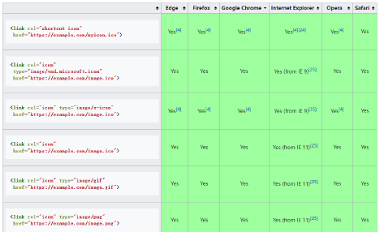 

  favicon.ico 文件如果放到根目录下，不设置 `<link>`，大多是浏览器也会自动检查并加载使用

- 媒体查询

  ```html
  <link rel="stylesheet" media="screen and (max-width: 800px)" href="./css/style.css">
  ```

- 可替换网址

  ```html
  <link rel="alternate" href="https://pvp.qq.com/m/"/>
  ```


## body 标签


# 主要标签

## 标题标签

标题标签 `<h1>` - `<h6>`

```html
<h1>我是h1标题</h1>
<h2>我是h2标题</h2>
<h3>我是h3标题</h3>
<h4>我是h4标题</h4>
<h5>我是h5标题</h5>
<h6>我是h6标题</h6>
```

 

- 文字加粗，字号依次加大，`<h1>` 级别最高，`<h6>` 级别最低

- 一个标题独占一行

- 为了搜索引擎提权，一般网站的 logo 会在外套一个 `<h1>` 标签

  `<h1>` 标签内再放一个链接 `<a>`，logo 图片加到链接的背景图片上

  为了让搜索引擎收录，**链接里面要放文字**（网站名称，**文字不要显示出来**），加上 `title` 属性

  ```html
  <h1 class="logo">
    <a href="#" title="网易云音乐">网易云音乐</a>
  </h1>
  ```

  ```css
  .logo {
    background-image: url(./images/logo.png);
  }
  .logo a {
    display: block;
    width: 157px;
    padding-right: 20px;
    /* 不让文字显示出来 */
    text-indent: -9999px;
    overflow:hidden;
  }
  ```


## 段落标签

段落标签 `<p>`

-  可以把 HTML 文档分割为若干段落
-  文本在一个段落中会根据浏览器的窗口的大小自动换行
-  多个段落之间会有一定的间距

```html
<p>我是段落元素</p>
```


## 盒子标签

`div` 和 `span` 都是纯粹的容器，用来包裹内容

- `div`：多个 `div` 元素包裹的内容会在不同的行显示

  一般作为其他元素的父容器，包裹其他元素，代表一个整体，把网页分割为多个独立的部分

  ```html
  <div class="area">
    <h2>学习HTML+CSS</h2>
    <p>先学习HTML, 再学习CSS</p>
  </div>
  ```

- `span`：多个 `span` 元素包裹的内容会在同一行显示

  默认情况下，跟普通文本几乎没差别，用于区分特殊文本和普通文本

  ```html
  <p>
    学习<span class="keyword">JavaScript</span>的基本语法
  </p>
  ```


## 图像标签

图像标签 ``，将一份图像嵌入文档

```html
<!-- 当前文件夹(.可以省略) -->

<!-- 上级文件夹 -->

```

常见属性：`src`，`alt`，`title`

- `src`： 必须属性，用于指定图像文件的路径和文件名
- `alt`：可选，当图片加载不成功时，会显示这段文本，屏幕阅读器会将文本读给使用者听
- `title`：可选，鼠标移动到元素上的提示或者说明

某些其他属性目前已经不再使用：`width` `height` `border`

支持的图片格式

 、


## 超链接标签

超链接标签 `<a>`，定义超链接，用于打开新的 URL

常见属性：`href`，`target`

- `href`：跳转目标

  `href` 的地址可以是**外部链接，内部链接，空链接 `#`，锚点链接 `#name`**

  ```html
  <a href="http://www.qq.com">腾讯网</a>
  ```

  `href` 指向对应要跳到的元素上的 `id`

  ```html
  <a href="#title01">跳转到标题一</a>
  <h2 id="title01">标题一</h2>
  ```

  如果地址是**文件或者压缩包**，会下载这个文件

  ```html
  <a href="https://nodejs.org/dist/v16.15.1/node-v16.15.1-x64.msi">下载文件</a>
  ```

  如果地址是**邮箱地址**，会打开默认的邮件工具填入写入的地址

  ```html
  <a href="mailto:12345@qq.com">发送邮件</a>
  ```

- `target`：链接页面的打开方式

  - `_self `：默认值，在当前窗口打开 URL

    ```html
    <a href="http://www.baidu.com" target="_self">百度一下</a>
    ```

  - `_blank`：在新窗口打开 URL

    ```html
    <a href="http://www.taobao.com" target="_blank">淘宝网</a>
    ```

各种网页元素，如文本，图像，表格，音频，视频都可以添加超链接

```html
<a href="http://www.mi.com">
  
</a>
```

阻止链接跳转，`href` 指定为 `javascript:void(0);` 或者 ` javascript:;`


## 列表标签

### 有序列表

`<ol>` `<li>`

```html
<h1>喜欢的电影排名</h1>
<ol>
  <li>星际穿越</li>
  <li>大话西游</li>
  <li>盗梦空间</li>
</ol>
```

- `<ol>` 的直接子元素只能是 `<li>`

- 会带有默认的样式

   

- 清除默认的样式

  ```css
  ol {
    padding: 0;
    margin: 0;
    list-style: none;
  }
  ```


### 无序列表

`<ul>` `<li>`

```html
<h1>常见的编程语言</h1>
<ul>
  <li>JavaScript</li>
  <li>Java</li>
  <li>C++</li>
  <li>Python</li>
</ul>
```

- `<ul>` 的直接子元素只能是 `<li>`

- 会带有默认的样式

   

- 清除默认的样式

  ```css
  ul, body, h1, p {
    padding: 0;
    margin: 0;
    list-style: none;
  }
  ```


### 定义列表

`<dl>` `<dt>` `<dd>`

```html
<dl>
  <dt>关注我们</dt>
  <dd>新浪微博</dd>
  <dd>官方微信</dd>
  <dd>联系我们</dd>
</dl>
```

- `<dl>` 的直接子元素只能是 `<dt>` 和 `<dd>`

- `<dt>` 定义列表中每一项的项目名，一个 `<dt>` 可以对应多个 `<dd>`

- `<dd>` 是列表中每一项的具体描述，是对 `<dt>` 的补充描述解释

- 会带有默认的样式

   

- 清除默认的样式

  ```css
  dl, dt, dd {
    padding: 0;
    margin: 0;
  }
  ```


## 表格标签

```html
<table>
  <caption>热门股票</caption>
  <thead>
    <tr>
      <th>股票名称</th>
      <th>股票代码</th>
      <th>股票价格</th>
    </tr>
  </thead>
  <tbody>
    <tr>
      <td>贵州茅台</td>
      <td>600519</td>
      <td>1800</td>
    </tr>
    <tr>
      <td>腾讯控股</td>
      <td>00700</td>
      <td>400</td>
    </tr>
    <tr>
      <td>五粮液</td>
      <td>000858</td>
      <td>160</td>
    </tr>
  </tbody>
  <tfoot>
    <tr>
      <td>其他</td>
      <td>其他</td>
      <td>其他</td>
    </tr>
  </tfoot>
</table>
```

 

- 表格 `<table>`

  不赞成使用 `<table>` 的相关属性，例如 `align`，`border`，`cellpadding`，`cellspacing`，`width` ，应该**使用 CSS 制定样式**

  边框合并 `border-collapse`

  ```css
  table {
    border-collapse: collapse;
  }
  ```

   

- 表格标题 `<caption>`

- 表头 `<thead>`

- 表格主体 `<tbody>`

- 页脚 `<tfoot>`

- 表格中的行 `<tr>`

  必须嵌套在 `<table>` 中

- 单元格 `<td>`

  必须嵌套在 `<tr>` 中

- 表头单元格 `<th>`

  必须嵌套在 `<tr>` 中，文本内容会加粗居中显示

  **单元格合并**

   

  - 跨行合并 `rowspan`，最上侧的单元格为目标单元格，省略掉后面 `<tr>` 中要被合并的单元格 `<td>`

    ```html
    <table>
      <tr>
        <td rowspan="2">1-1</td>
        <td>1-2</td>
      </tr>
      <tr>
        <td>2-2</td>
      </tr>
    </table>
    ```

     

  - 跨列合并 `colspan`，最左侧的单元格为目标单元格，省略掉右侧要被合并的单元格 `<td>`

    ```html
    <table>
      <tr>
        <td colspan="2">1-1</td>
      </tr>
      <tr>
        <td>2-1</td>
        <td>2-2</td>
      </tr>
    </table>
    ```

     


## 表单标签

### 文本框

```html
<label for="username">
  用户: <input id="username" type="text">
</label>
<label for="password">
  密码: <input id="password" type="password">
</label>
```

- 只读 `readonly`，布尔属性

  ```html
  <input type="text" readonly>
  <!-- 等价于 -->
  <input type="text" readonly="readonly">
  ```

- 禁用 `disabled`，布尔属性

  ```html
  <input type="text" disabled>
  ```

- 当页面加载时，自动获得焦点 `autofocus`，布尔属性

  ```html
  <input type="text" autofocus>
  ```

- 占位符 `placeholder`

  ```html
  <input type="text" placeholder="请输入姓名">
  ```

- 元素名 `name`

  ```html
  <input type="text" name="username">
  ```

- 输入字段的初始值 `value`

  ```html
  <input type="text" value="John">
  ```

- 去除默认轮廓线

  ```css
  input {
    outline: none;
  }
  ```


### 多行文本框

```html
<label for="info">
  个人描述:<textarea name="info" id="info" cols="10" rows="6"></textarea>
</label>
```

- 文本域的宽度（列数）`cols`，默认值是 20

- 文本域的高度（行数）`rows`，默认值是 2

- 其他属性参照文本框

- 修改缩放的 CSS 设置

  ```css
  textarea {
    /* 禁止缩放 */
    resize: none;
  }
  ```

  水平缩放：`resize: horizontal`
  垂直缩放：`resize: vertical`
  水平垂直缩放：`resize: both`


### 单选框

```html
<label for="male">
  <input id="male" type="radio" name="sex" checked value="male">男
</label>
<label for="female">
  <input id="female" type="radio" name="sex" value="female">女
</label>
```

- `name` 值相同的一组单选框才具备单选功能

- `value` 是必须的，将会把选中的单选框的 `value` 值提交到表单

- 禁用 `disabled`，布尔属性

  ```html
  <input type="radio" disabled>
  ```

- 默认选中 `checked`，布尔属性

  ```html
  <input type="radio" checked>
  ```
  
- 当页面加载时，自动获得焦点 `autofocus`，布尔属性

  ```html
  <input type="radio" autofocus>
  ```


### 复选框

```html
<label for="basketball">
  <input id="basketball" type="checkbox" name="hobby" checked value="basketball">篮球
</label>
<label for="football">
  <input id="football" type="checkbox" name="hobby" value="football">足球
</label>
```

- 属于同一种类型的 `checkbox`，`name` 值要保持一致

- `value` 是必须的，将会把选中的 `checkbox` 的 `value` 值提交到表单

- 禁用 `disabled`，布尔属性

  ```html
  <input type="checkbox" disabled>
  ```

- 默认选中 `checked`，布尔属性

  ```html
  <input type="checkbox" checked>
  ```

- 当页面加载时，自动获得焦点 `autofocus`，布尔属性

  ```html
  <input type="checkbox" autofocus>
  ```


### 文件上传

```html
<input type="file" name="image" accept="image/*">
```

- `accept` 规定上传的文件类型

  ```html
  <input type="file" accept="image/*">
  <input type="file" accept="video/*">
  <input type="file" accept=".pdf" />
  <input type="file" accept="image/gif, image/jpeg, .pdf" />
  ```

- 禁用 `disabled`，布尔属性

  ```html
  <input type="file" disabled>
  ```

- 当页面加载时，自动获得焦点 `autofocus`，布尔属性

  ```html
  <input type="file" autofocus>
  ```

- 元素名 `name`

  ```html
  <input type="file" name="image">
  ```


### 选择列表

```html
<select name="fruits">
  <option value="apple" selected>苹果</option>
  <option value="banana">香蕉</option>
  <option value="orange">橘子</option>
</select>
```

`<select>` 属性

- `multiple` 多选，按住 ctrl 多选

  ```html
  <select multiple></select>
  ```
  
- `size` 显示多少项

  ```html
  <select size="2"></select>
  ```
  
- 禁用 `disabled`，布尔属性

  ```html
  <select disabled></select>
  ```

- 当页面加载时，自动获得焦点 `autofocus`，布尔属性

  ```html
  <select autofocus></select>
  ```

`<option>` 属性

- `selected` 默认被选中，布尔属性

  ```html
  <option value="apple" selected>北京</option>
  ```


### label 标签

```html
<label for="username">
  用户: <input id="username" type="text">
</label>
```

- 一般配合表单元素来使用，用来表示表单元素的标题
- 属性 `for` 可以绑定一个表单元素的 `id` 属性，点击 `<label>` 光标跳转到表单元素


### 按钮

```html
<button>按钮</button>
<input type="button" value="按钮">
```

- 普通按钮 `type="button"` ，使用 `value` 属性设置按钮文字

  ```html
  <button>普通按钮</button>
  <button type="button">普通按钮</button>
  <input type="button" value="普通按钮">
  ```

- 重置按钮 `type="reset"` ，可以对 `<form>` 中的其他表单元素进行重置

  ```html
  <input type="reset" value="重置按钮">
  <button type="reset">重置按钮</button>
  ```

- 提交按钮 `type="submit"`，可以对 `<form>` 中的其他表单元素进行提交

  ```html
  <input type="submit" value="提交按钮">
  <button type="submit">提交按钮</button>
  ```

- 禁用 `disabled`，布尔属性

  ```html
  <button disabled>点我</button>
  <input type="button" value="点我" disabled>
  ```

- 当页面加载时，自动获得焦点 `autofocus`，布尔属性

  ```html
  <button autofocus>点我</button>
  <input type="button" value="点我" autofocus>
  ```

- 元素名 `name`

  ```html
  <button type="submit" name="subject">点我</button>
  <input type="submit" name="subject" value="点我">
  ```


### 表单域

```html
<form method="GET" action="http://www.qq.com">
  <div>
    <label for="username">
      用户: <input id="username" type="text" name="username">
    </label>
  </div>
  <div>
    <label for="password">
      密码: <input id="password" type="password" name="password">
    </label>
  </div>
  <button type="reset">重置内容</button>
  <button type="submit">提交内容</button>
</form>
```

- `<form>` 通常作为表单元素的父元素，`<form>` 可以将整个表单作为一个整体来进行操作
- `action` 属性，用于提交表单数据的请求 URL
- `method` 属性，请求方法（ `get` 和 `post` ），默认是 `get`

- `targe` 属性，在什么地方打开 URL（参考 `<a>` 元素的 `target`）


## 格式化标签

- 加粗：`<strong>`，`<b>`

  推荐使用 `<strong>`  语义更强烈

- 倾斜：`<em>`，`<i>`

  推荐使用 `<em>` 语义更强烈，HTML5 中 `<i>` 主要用来做图标

- 删除线：`<del>`，`<s>`

  推荐使用 `<del>` 语义更强烈

- 下划线：`<ins>`，`<u>`

  推荐使用 `<ins>` 语义更强烈

- 代码：`<code>`

  用于显示代码，偶尔用来显示等宽字体

- 换行：`<br />`

  只是简单的开始新的一行，而段落标签会在段落之间插入一些垂直间距

  开发中已经不使用


## 嵌套标签

利用 `<iframe>` 可以在一个 HTML 文档中嵌入其他 HTML 文档

属性 `frameborder`：用于规定是否显示边框，`0` 为不显示，`1` 为显示

可以将提示文字放在 `<iframe></iframe>` 之间，来提示某些不支持 `<iframe>` 的浏览器

```html
<iframe src="https://www.taobao.com"  frameborder="1"></iframe>
```

`<iframe>` 中嵌套网页中的 `<a>` 标签

- `<a>` 标签设置为 `target="_parent"`：在父窗口中打开 URL

  ```html
  <!-- 外层 -->
  <iframe src="./other/inner.html" frameborder="1"></iframe>
  ```

  ```html
  <!-- 内层 inner.html -->
  <iframe src="./a.html" frameborder="1"></iframe>
  ```

  ```html
  <!-- 最内层 a.html -->
  <a href="http://www.taobao.com" target="_parent">打开淘宝</a>
  ```

   

- `<a>` 标签设置为 `target="_top"`：在顶层窗口中打开 URL

  ```html
  <!-- 外层 -->
  <iframe src="./other/inner.html" frameborder="1"></iframe>
  ```

  ```html
  <!-- 内层 inner.html -->
  <iframe src="./a.html" frameborder="1"></iframe>
  ```

  ```html
  <!-- 最内层 a.html -->
  <a href="http://www.taobao.com" target="_top">打开淘宝</a>
  ```

   

- `<iframe>` 的缺点

  1. 会阻塞主页面的 `onload` 事件

  2. 搜索引擎无法解读这种页面，不利于 SEO
  3. `iframe` 和主页面共享连接池，而浏览器对相同区域有限制所以会影响性能


## 语义化标签

HTML5 新增了语义化的元素，增强了语义化，利于 SEO 的优化

在 IE9 中需要将这些元素转换为块级元素

- `<header>`：头部元素
- `<nav>`：导航元素
- `<section>`：定义文档某个区域的元素
- `<article>`：内容元素
- `<aside>`：侧边栏元素
- `<footer>`：尾部元素

 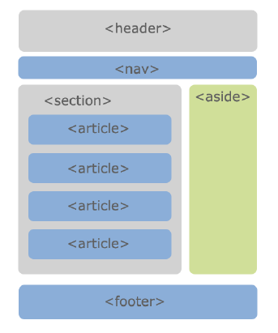


## 多媒体标签

### 视频标签 video

`<video>` 标签用于在 HTML 中嵌入媒体播放器，用于支持文档内的视频播放

```html
<video src="./assets/video.mp4" width="600" controls muted></video>
```

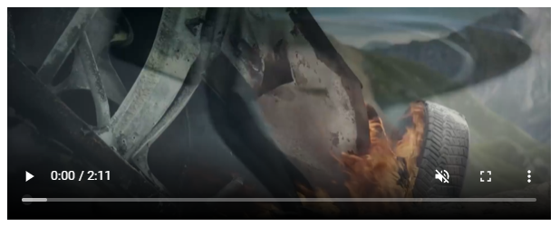 

常见属性：

- `src`：视频播放的 URL 地址
- `width`、`height`：播放器的宽度和高度
- `controls`：是否**显示控制栏**，包括音量，跨帧，暂停/恢复播放；布尔属性
- `autoplay`：是否**视频自动播放**，某些浏览器需要添加 `muted`，才可以生效，比如 Chrome；布尔属性
- `muted`：是否静音播放；布尔属性
- `preload`：是否需要预加载视频，关键字 `none`、`auto` 浏览器决定、`metadata` 预加载元数据(比如视频时长等)
- `poster`：视频封面，URL 地址

兼容性写法

- 通过 `<source>` 元素指定更多视频格式的源
- 通过 `<p>`、`<div>` 等元素指定在浏览器不支持 `<video>` 元素的情况时显示的内容

```html
<video src="./assets/video.mp4" width="600" controls muted>
  <source src="./asset/video.ogg">
  <source src="./asset/video.webm">
  <p>当前您的浏览不支持视频的播放, 请更换其他的浏览器</p>
</video>
```

支持 MP4、WebM、Ogg 等格式文件，大部分浏览器都支持 MP4，建议使用 MP4


### 音频标签 audio

`<audio>` 标签用于在 HTML 中嵌入音频播放器，与 `<video>` 的用法类似

```html
<audio src="./assets/audio.mp3" controls autoplay muted></audio>
```

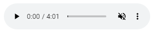 

常见属性：

- `src`：音频播放的 URL 地址
- `controls`：是否**显示控制栏**，包括音量，进度，暂停/恢复播放；布尔属性
- `autoplay`：是否**音频自动播放**，某些浏览器需要添加 `muted`，才可以生效，比如 Chrome；布尔属性
- `muted`：是否静音播放；布尔属性
- `preload`：是否需要预加载音频，关键字 `none`、`auto` 浏览器决定、`metadata` 预加载元数据(比如音频时长等)
- `loop`：是否循环播放；布尔属性

兼容性写法

- 通过 `<source>` 元素指定更多音频格式的源
- 通过 `<p>`、`<div>` 等元素指定在浏览器不支持 `<audio>` 元素的情况时显示的内容

```html
<audio src="./assets/audio.mp3" controls autoplay muted>
  <source src="./asset/audio.ogg">
  <p>当前您的浏览不支持音频的播放, 请更换其他的浏览器</p>
</audio>
```

支持 MP3、Wav、Ogg 格式文件，大部分浏览器都支持 MP3，建议使用 MP3


# 全局属性

全局属性（Global Attributes）是所有 HTML 元素都可以设置和拥有


## 元素唯一标识 id

`id` 属性定义唯一标识符，该标识符在整个文档中必须是唯一的，在使用样式，脚本，链接时标识元素

```html
<h1 id="myHeader">Hello World!</h1>
```


## 样式类 class

`class` 属性定义了元素的类名，是以空格分隔的元素的类名列表

```html
<p class="important">注意</p>
```


## 内联样式 style

`style` 属性为元素添加内联样式

```html
<h1 style="color:blue;text-align:center">这是一个标题</h1>
```


## 标题 title

`title` 属性表示与其所属元素相关信息的文本，信息通常可以作为提示呈现给用户

```html
<abbr title="世界卫生组织">WHO</abbr>
```


## 自定义数据 data-

自定义属性以 `data-` 开头做为属性名并且赋值，HTML5 新增

```html
<div data-index="1"></div>
```

或者使用 JS 设置

```javascript
element.setAttribute('data-index', 2)
```

`data-` 设置的属性可以在 JavaScript 中通过 `dataset` 获取到

```javascript
const boxEl = document.querySelector(".box")
console.log(boxEl.dataset)
```


# 特殊字符

| 特殊字符 | 描述     | 代码       |
| -------- | -------- | ---------- |
|          | 空格     | `&nbsp;`   |
| <        | 小于     | `&lt;`     |
| >        | 大于     | `&gtl;`    |
| &        | 和       | `&amp;`    |
| ￥       | 人民币   | `&yen;`    |
| ©        | 版权     | `&copy;`   |
| ®        | 注册商标 | `&reg;`    |
| ±        | 正负     | `&plusmn;` |
| ×        | 乘       | `&times;`  |
| ÷        | 除       | `&divide;` |
| ²        | 平方     | `&sup2;`   |
| ³        | 立方     | `&sup3;`   |
| °        | 度       | `&deg;`    |


# CSS 引入方式

## 行内样式

存在于 HTML元素的 `style` 属性之中，样式之间用分号 `;` 隔开（建议每条 CSS 样式后面都加上分号 `;`）

 


## 内部样式

将 CSS 放在 HTML 文件 `<head>` 元素里的 `<style>` 元素之中

 


## 外部样式

将 css 编写一个独立的文件中，并且通过 `<link>` 元素引入进来

 


## @import 引入

在 style 元素或者 CSS 文件中使用 `@import` 导入其他的 CSS 文件

 


# 选择器

## 基础选择器

### 标签选择器

`标签名 {}` 

```css
div {
  background-color: #f00;
}
```

- HTML 标签名称作为选择器，为页面中某一类标签指定统一的 CSS 样式。
- 标签选择器可以把某一类标签全部选择出来，能快速为页面中同类型的标签统一设置样式
- 不能设计差异化样式，只能选择全部的当前标签。


### 类选择器

`.类名 {}`

```css
.box {
  color: blue;
}
```

- `.类名` 形式，HTML 中需要用 `class` 属性来调用
- 标签使用多个类名时，空格隔开


### id 选择器

`#id {}`

```css
#home {
  color: green;
}
```

- `#id名` 形式
- 标签使用 `id` 调用，只能调用一次


### 通配符选择器

`* {} `

```css
* {
  font-size: 30px;
  background-color: #f00;
}
```

- `*` 选取页面中所有的元素

- 不需要调用，自动就会给所有元素使用样式

- 效率比较低，尽量不要使用 

  ```css
  /* 推荐的做法 */
  body, p, div, h2, span {
    margin: 0;
    padding: 0;
  }
  ```


### 属性选择器

`[att] {}`，`[att=val] {}`

```html
<div title="box">我是div元素</div>
```

```css
[title] {
  color: red;
}
[title=box] {
  background-color: blue;
}
```

- 根据元素特定属性来选择元素

  | 选择符         | 选择内容                                                     |
  | -------------- | ------------------------------------------------------------ |
  | `E[att]`       | 选择具有 att 属性的 E 元素                                   |
  | `E[att=val]`   | 选择具有 att 属性，且属性值等于 val 的 E 元素                |
  | `E[att^=val]`  | 匹配具有 att 属性，且值以 val 开头的 E 元素                  |
  | `E[att$=val]`  | 匹配具有 att 属性，且值以 val 结尾的 E 元素                  |
  | `E[att*=val]`  | 匹配具有 att 属性，且值中含有 val 的 E 元素                  |
  | `E[att~=val]`  | 匹配具有 att 属性，且值中含有 val，或者有其他值（必须以空格和 val 分割）的 E 元素 |
  | `E[att\|=val]` | 匹配具有 att 属性，且值中含有 val，或者以 val 开头后面紧跟 - 的 E 元素 |


## 复合选择器

### 后代选择器

`父选择器 子选择器 {}`

```css
.home span {
  color: red;
}
```

- 选择父元素里面子元素，把外层标签写在前面，内层标签写在后面，中间用空格分隔，内层标签是外层标签的后代
- 父元素和子元素可以是任意基础选择器


### 子选择器

`父选择器 > 子选择器 {}`

```css
.home > span {
  background-color: green;
}
```

- 只能选择作为某元素的最近一级子元素，**只能选亲儿子**，孙子重孙子都不要
- 选择父元素里面的所有直接后代(子元素) 


### 并集选择器

`选择器1, 选择器2 {}`

```css
p, .box {
  color: red;
}
```

- 并集选择器可以同时选择多组标签，同时为它们定义相同的样式
- 符合一个选择器条件即可


### 交集选择器

`选择器1选择器2 {}`

```css
div.box {
  color: red;
  font-size: 30px;
}
```

```html
<div class="box">我是div元素</div>
```

-  两个选择器紧密连接，需要同时符合两个选择器条件，精准的选择某一个元素


### 相邻兄弟选择器

`选择器1 + 选择器2 {}`

```css
.box + .content {
  color: red;
}
```

- 可选择紧接在另一元素后的元素(两个元素为相邻兄弟)，且二者有相同父元素

- 选择的是后一个标签


### 通用兄弟选择器

`选择器1 ~ 选择器2 {}`

```css
.box ~ div {
  font-size: 30px;
}
```

- 在同一个父元素下，位置无须紧邻，**A~B 选择 A 元素之后所有同层级 B 元素**

- 选择的是后一个标签


### 伪类选择器

选择 DOM 树之外的信息，不能够被普通选择器选择的⽂档之外的元素，⽤来添加⼀些选择器的特殊效果，**伪类不出现在 DOM 树中**

状态的变化是⾮静态的，元素达到⼀个特定状态时，它可能得到⼀个伪类的样式；当状态改变时，它⼜会失去这个样式

**用冒号 `:` 表示**，比如 `:hover` 、` :first-child` 

#### 动态伪类

- `:link` 选择所有未被访问的链接

  ```css
  a:link {
    color: red;
  }
  ```

- `:visited` 选择所有已经被访问的链接

  ```css
  a:visited {
    color: green;
  }
  ```

- `:focus` 选取获得焦点的元素（能够拥有输入焦点的元素、可以被键盘 Tab 键选中的元素）

  ```css
  a:focus {
  	background-color:yellow;
  }
  ```

- `:hover` 选择鼠标指针位于其上的元素（除了`<a>` 元素，也可以用在其他元素上）

  ```css
  a:hover {
    color: blue;
  }
  ```

- `:active` 选择激活的链接（鼠标按下还未弹起时的链接）（除了`<a>` 元素，也可以用在其他元素上）

  ```css
  a:active {
    color: purple;
  }
  ```

一定按照 **LVFHA 的顺序声明** ：`:link`－`:visited`－`:focus`－`:hover`－`:active`

直接给 `<a>` 元素设置样式，相当于给  `<a>`  元素的所有动态伪类都设置了

```css
/* 相当于a:link、a:visited、a:hover、a:active、a:focus的color都是red */
a {
  color: red;
}
```


#### 结构伪类

根据文档结构来选择元素

##### 匹配子元素

| 选择符                | 选择内容                                                     |
| --------------------- | ------------------------------------------------------------ |
| `E:first-child`       | 匹配父元素中的第一个子元素 E                                 |
| `E:last-child`        | 匹配父元素中最后一个子元素 E                                 |
| `E:nth-child(n)`      | 匹配父元素中的第 n 个子元素 E <br />（n 可以是数字，关键字，公式，可以匹配一个或多个） |
| `E:nth-last-child(n)` | 匹配父元素中的倒数第 n 个子元素 E <br />（n 可以是数字，关键字，公式，可以匹配一个或多个） |
| `E:only-child`        | 匹配父元素中的唯一子元素 E（没有兄弟元素）                   |

- `E:first-child` 匹配父元素中的**第一个**子元素 E

  ```css
  /* 选择ul中的第一个子元素li */
  ul li:first-child {
    color: red;
  }
  ```

- `E:last-child` 匹配父元素中**最后一个**子元素 E

  ```css
  /* 选择ul中的最后一个子元素li */
  ul li:last-child {
    color: red;
  }
  ```

- `E:nth-child(n)` 匹配父元素中的**第 n 个**子元素 E

  ```css
  /* 选择ul中的第二个子元素li */
  ul li:nth-child(2) {
    color: red;
  }
  ```

  会把所有的子元素都排列序号，**先筛出子元素，再标号，后查找**

  ```css
  /* 执行的时候会首先找到section的第一个子元素，然后再看是不是div，如果第一个不是div，就匹配不上 */
  section div:nth-child(1) {
    color: red;
  }
  ```


- `E:nth-last-child(n)` 匹配父元素中的**倒数第 n 个**子元素 E

  ```css
  ul li:nth-last-child(2){
    color: red;
  }
  ```

- `E:only-child` 匹配父元素中的**唯一**子元素 E

  ```css
  ul li:only-child {
    color: red;
  }
  ```


##### 匹配特定类型子元素

| 选择符                  | 选择内容                                            |
| ----------------------- | --------------------------------------------------- |
| `E:first-of-type`       | 匹配父元素中指定类型 E 的第一个                     |
| `E:last-of-type`        | 匹配父元素中指定类型 E 的最后一个                   |
| `E:nth-of-type(n)`      | 匹配父元素中指定类型 E 的第 n 个                    |
| `E:nth-last-of-type(n)` | 匹配父元素中指定类型 E 的倒数第 n 个                |
| `E:only-of-type`        | 匹配父元素中指定类型 E 的唯一子元素（没有兄弟元素） |

- 匹配特定类型与匹配子元素 `nth-child` 的区别

  ```html
  <div class="box">
    <div>我是列表1</div>
    <p>我是p元素</p>
    <span>我是span1</span>
    <span>我是span2</span>
    <div>我是列表2</div>
    <div>我是列表3</div>
  </div>
  ```

  ```css
  /* 选择box中的第三个div元素(排除所有的干扰项) */
  .box > div:nth-of-type(3) {
    color: blue;
  }
  ```

- `E:first-of-type` 匹配指定类型为 E 的**第一个**元素

  ```css
  p:first-of-type {
    color: red;
  }
  ```

- `E:last-of-type` 匹配指定类型为 E 的**最后一个**元素

  ```css
  p:last-of-type {
    color: red;
  }
  ```

- `E:nth-of-type(n) ` 匹配指定类型为 E 的**第 n 个**元素

  ```css
  p:nth-of-type(2) {
    color: red;
  }
  ```

  会把**指定的元素先排列序号，再去查找**

  ```css
  /* 执行的时候会首先找到section的div所有子元素，再去匹配其中的第一个 */
  section div:nth-of-type(1) {
    color: red;
  }
  ```

- `E:nth-last-of-type(n)` 匹配指定类型 E 的**倒数第 n 个**元素

  ```css
  p:nth-last-of-type(2) {
    color: red;
  }
  ```

- `E:only-of-type` 匹配指定类型 E 的**唯一**子元素

  ```css
  p:only-of-type {
    color: red;
  }
  ```


##### 匹配公式

- `nth-child(even)` 选择所有**偶数**的子元素

  ```css
  ul li:nth-child(even) {
    color: red;
  }
  ```

- `nth-child(odd)` 选择所有**奇数**的子元素

  ```css
  ul li:nth-child(odd) {
    color: red;
  }
  ```

- `nth-child(n)` 选择**所有**的子元素（只能固定写 `n`，`n` 代表任意正整数和 0）

  ```css
  ul li:nth-child(n) {
    color: red;
  }
  ```

- `nth-child(2n)` 选择所有**偶数**的子元素，等同于 `even`

  ```css
  ul li:nth-child(2n) {
    color: green;
  }
  ```

- `nth-child(2n+1)` 选择所有**奇数**的子元素，等同于 `odd`

  ```css
  ul li:nth-child(2n + 1) {
    color: blue;
  }
  ```

- `nth-child(5n)` 选择所有位置是 5 的**倍数**的子元素（5 10 15）

  ```css
  ul li:nth-child(5n) {
    color: orange;
  }
  ```

   

- `nth-child(5n+1)` 选择**从 1 开始**，**每间隔 5 个**的子元素（1 6 11）

  ```css
  ul li:nth-child(5n + 1) {
    color: orange;
  }
  ```

   

  选择从 2 开始，每间隔5个的子元素（2 7 12）

  ```css
  ul li:nth-child(5n + 2) {
    color: orange;
  }
  ```

- `nth-child(n+5)` 选择从**第 5 个开始**的子元素（包含第5个）

  ```css
  ul li:nth-child(n + 5) {
    color: orange;
  }
  ```

   

- `nth-child(-n+5)` 选择**前 5 个**子元素（包含第5个）

  ```css
  ul li:nth-child(-n + 5) {
    color: orange;
  }
  ```

   


##### 其他结构伪类

- `:root` 匹配文档的根元素，就是 `<HTML>` 元素

  ```css
  /* 声明CSS全局变量使用 */
  :root {
    --main-color: hotpink;
    --pane-padding: 5px 42px;
  }
  ```

- `:empty` 匹配没有任何子级的元素（包括文本节点）

  ```css
  div {
    width:200px;
    height:20px;
  }
  div:empty {
    background: red;
  }
  ```


#### 否定伪类

`:not(x)` 表示除 x 以外的元素，x 是一个简单选择器

```css
.box :not(.desc) {
  color: blue;
}
```

```html
<div class="box">
  <div class="item">列表内容1</div>
  <div class="desc">列表内容2</div>
  <div>列表内容3</div>
</div>
```


#### 目标伪类

`:target`

选择 `id` 匹配当前 `URL` 路径的元素

```css
:target {
  background: red;
}
p:target {
  background: blue;
}
```

```html
<!-- 链接 -->
<a href="#one">go one</a>
<a href="#two">go two</a>
<a href="#three">go three</a>
<a href="#four">go four</a>
<!-- 内容 -->
<div id="one">one</div>
<div id="two">two</div>
<div id="three">three</div>
<p id="four">four</div>
```

 

#### 元素状态伪类

- `:checked` 匹配处于选中状态的单选或者复选框元素

  ```css
  /* 单选框 */
  input[type="radio"]:checked {
    box-shadow: 0 0 0 3px red;
  }
  /* 复选框 */
  input[type="checkbox"]:checked {
    box-shadow: 0 0 0 3px red;
  }
  /* 下拉列表选项 */
  option:checked {
    color: red;
  }
  ```

  ```html
  <div>
    <input type="radio" name="my-input" id="yes">
    <label for="yes">Yes</label>
    <input type="radio" name="my-input" id="no">
    <label for="no">No</label>
  </div>
  <div>
    <input type="checkbox" name="my-checkbox" id="opt-in">
    <label for="opt-in">Check me!</label>
  </div>
  <select name="my-select" id="num">
    <option value="opt1">one</option>
    <option value="opt2">two</option>
    <option value="opt3">three</option>
  </select>
  ```

   

- `:enabled` 匹配处于可用状态的表单元素

  如果一个元素能够被激活（可选择、可点击、可输入）或获取焦点，则该元素是处于可用状态

  一般用于 `<input>`、`<select>`、`<button>` 元素中

  ```css
  input:enabled {
    background-color: #ac0;
  }
  ```

  ```html
  <div>
    <input type='text' placeholder="可用状态"/>
  </div>
  ```

- `:disabled` 匹配处于禁用状态的表单元素

  ```css
  input:disabled{
    background-color: #996;
  }
  ```

  ```html
  <div>
    <input type='text' placeholder="禁用状态" disabled />
  </div>
  ```

   


### 伪元素选择器

伪元素⽤**双冒号 `::` 表示**

- `:before {}`、`::before {}`、`:after {}`、`::after {}`

  `::before` **在元素内部的前面插入内容**

  `::after` **在元素内部的后面插入内容**

  利用 CSS 创建新标签元素，而不需要 HTML 标签，新创建的元素**在 DOM 树中是找不到的虚拟元素**，但是属于**行内元素**

  ```css
  .item::before {
    content: "✨";
    font-size: 20px;
  }
  .item::after {
    content: url("../images/hot_icon.svg");
    font-size: 20px;
    position: relative;
    left: 5px;
    top: 2px;
  }
  ```

  ```html
  <div class="box1 item">我是box1</div>
  <div class="box2 item">我是box2</div>
  ```

   

  `::before` 和 `::after` **必须要有 `content` 属性**，不能省略，可设为 `content: "";`

  ```css
  /* 默认是行内级元素 */
  .box::after {
    content: "";
    display: inline-block;
    width: 8px;
    height: 8px;
    background-color: #f00;
  }
  ```

  ```html
  <div class="box">我是box</div>
  ```

  `:before` / `:after` 是 CSS2 的写法，`::before`/  `::after` 是 CSS3 的写法

  推荐使用 `::`，`:: ` 符号用来表示伪元素，`:` 符号表示伪类

- `:first-line {}`、`::first-line {}`、`:first-letter {}`、`::first-letter {}`

  `:first-line {}`、`::first-line {}`：可以针对首行文本设置属性

  `:first-letter {}`、`::first-letter {}`：可以针对首字母设置属性

  ```css
  .box::first-line {
    font-size: 30px;
    color: orange;
  }
  .box::first-letter {
    font-size: 50px;
    color: blue;
  }
  ```

   
  
- `::placeholder ` 表单占位符

  ```css
  input::placeholder {
    color: red;
    font-size: 1.5em;
    font-style: italic;
  }
  ```


## 权重优先级

选择器相同，则执行层叠性，选择器不同，根据选择器权重执行

| 选择器                           | 选择器权重 |        |
| -------------------------------- | ---------- | ------ |
| 继承 或者 `*`                    | 0,0,0,0    | + 0    |
| 标签选择器，伪元素选择器         | 0,0,0,1    | + 1    |
| 类选择器，伪类选择器，属性选择器 | 0,0,1,0    | + 10   |
| ID 选择器                        | 0,1,0,0    | + 100  |
| 行内样式 `style`                 | 1,0,0,0    | + 1000 |
| 强制最大权重 `!impirtant`        | 无穷大     |        |

- 权重由 4 组数字组成，权重会叠加，**不会有进位**
- 等级从左到右判断，如果某一位数值相同，则判断下一位数值
- 复合选择器，会有权重叠加，需要计算权重
- 相同权重，后写的生效

 


# 字体样式

## 文本字体 font-family

设置文字的字体名称

```css
p { font-family:"微软雅黑";}
div { font-family: Arial, "Microsoft Yahei", "微软雅黑"; }
```

- 可以设置 1 个或者多个字体名称，指定多个字体的时候，会**从头依次查看字体是否存在**（安装过），存在就使用，不存在再往下查看

- 多个字体之间逗号隔开

- 字体族不能使用引号

  ```css
  .chinese {
    font-family: "Microsoft Yahei", serif;
  }
  ```

  - 衬线字体 `serif`：字体周围有装饰性，宋体就是衬线字体
  - 非衬线字体 `sans-serif`：笔画起和收都非常规则
  - 等宽字体 `monospace`
  - 手写体 `cursive`
  - 花体 `fantasy`

- 最常见的字体 `Mircosoft YaHei`，`tahoma`，`arial`，`Hiragino Sans GB`

- 中文字体名称可以用 Unicode 代码代替，避免乱码

  - 黑体  `\9ED1\4F53`
  - 宋体 `\5B8B\4F53`
  - 微软雅黑 `\5FAE\8F6F\96C5\9ED1`

- 多字体 fallback 机制

  只有一个平台有的字体写在前面，共有的写在后面

  ```css
  .chinese {
    /* 先找苹果字体，再找微软字体，最后都找不到随便用个等宽字体 */
    font-family: "PingFang SC", "Microsoft Yahei", monospace;
  }
  ```


## 字体大小 font-size

```css
font-size: 20px;
font-size: 2em;
font-size: 200%;
```

- 值的单位可以是 `px`、`em`，也可以是 `%`，百分比是基于父元素的 `font-size` 计算

- 谷歌浏览器默认的文字大小为 `16px`，不同浏览器可能默认显示的字号大小不一致

- 单位 `rem` 是相对于 `<html>` 的字体大小，`em` 是相对于父元素的字体大小

- 可以在使用标签选择器设置整个 `body` 的字体，但是标题比较特殊，需要单独指定

  ```css
  body {
    font-size: 16px;
  }
  ```


## 字体粗细 font-weight

```css
p {
	font-weight: bold;
}
```

- 参数：`normal`（正常），`bold`（加粗），`bolder`，`lighter`， `number`

- 参数使用数字时，700 是加粗 `bold`，400 是正常 `normal`，常用的范围是 100~900


## 文字样式 font-style

```css
p {
	font-style: normal;
}
```

- 参数：`normal` (标准)， `italic` (斜体)，`oblique` (倾斜)
- `italic` 是字体本身支持斜体时, 显示的斜体
- `oblique` 是单纯让文本进行倾斜
- `em`、`i`、`cite`、`address`、`var`、`dfn` 等元素的 f`ont-style` 默认就是 `italic`


## 缩小大写字母 font-variant

设置小写字母的显示形式

```css
.box {
  font-variant: small-caps;
}
```

- 参数：`normal`（常规显示），`small-caps`（将小写字母替换为缩小过的大写字母）

 


## 字体简写属性 font

```css
body {
	font: font-style font-variant font-weight font-size/line-height font-family;
}
```

- 各个属性间以空格隔开
- `font-style`、`font-variant`、`font-weight` 可以随意调换顺序，也可以省略
- `/line-height` 可以省略，如果不省略，必须跟在 `font-size` 后面
- `font-size`，`font-famliy` 不可以调换顺序，不可以省略


## 自定义字体和图标

通过 `@font-face` 引入字体

```css
@font-face {
  font-family: IF;
  src: url(./IndieFlower.ttf);
}
.custom-font {
  font-family: IF;
}
```

- 字体图标本质是文字，可以改变颜色、产生阴影、透明效果、旋转等

  - 字体图标的下载：

    icomoon 字库 http://icomoon.io

    阿里 iconfont 字库 http://www.iconfont.cn/

  - 字体图标的追加

    如果原来的字体图标不够用，需要添加新的字体图标到原来的字体文件中

    把压缩包里面的 selection.json 重新上传，然后选中想要新的图标，重新下载压缩包，并替换原来的文件即可

     

- 字体图标使用

  通过对应字体图标的 Unicode 来显示

  ```css
  @font-face {
    font-family: "iconfont";
    src: url("./iconfont.ttf");
  }
  .iconfont {
    font-family: "iconfont";
    font-style: normal;
  }
  .music::before {
    content: "\e664";
  }
  ```

  ```html
  <i class="iconfont music"></i>
  ```

- 字体文件兼容性

  字体常见格式：.ttf、.otf、.eot、.svg、.woff、.woff2

  生成兼容字体网站：https://font.qqe2.com/

   

- 字体兼容性写法（bulletproof @font-face syntax）

  - `url` 指定资源的路径
  - `format` 用于帮助浏览器快速识别字体的格式

  ```css
  @font-face {
    font-family: "YuanTi";
    src: url("./fonts02/AaQingHuanYuanTi.eot"); /* IE9 */
    src: url("./fonts02/AaQingHuanYuanTi.eot?#iefix") format("embedded-opentype"), /* IE6-IE8 */
      url("./fonts02/AaQingHuanYuanTi.woff") format("woff"), /* chrome、firefox */
      url("./fonts02/AaQingHuanYuanTi.ttf") format("truetype"), /* chrome、firefox、opera、Safari, Android, iOS 4.2+ */
      url("./fonts02/AaQingHuanYuanTi.svg#uxfonteditor") format("svg"); /* iOS 4.1- */
    font-style: normal;
    font-weight: normal;
  }
  body {
    font-family: "YuanTi";
  }
  ```

- 如果是远程字体，需要注意跨域的问题

- 如果已经导入了带有字体的远程 css 样式，就无需再定义字体，直接 `font-family` 指定即可


# 文本样式

## 前景颜色 color

设置**文本内容的前景色，包括文字、装饰线、边框、外轮廓等**的颜色

```css
div {
  color: red;
}
```

设置颜色的方法

- 颜色关键字

  https://developer.mozilla.org/zh-CN/docs/Web/CSS/color_value#%E8%AF%AD%E6%B3%95

  ```css
  color: chocolate;
  /* 透明 */
  color: transparent;
  ```

- RGB 函数

  `rgb[a](R, G, B[, A])`

  R（红）、G（绿）、B（蓝）**可以是数字**，每个值取值范围是 **`0` ~ `255`**，**也可以是百分比**，`255` 相当于 `100%`

  A（透明度）可以是 **`0` 到 `1` 之间的数字**，**或者百分比**，数字 `1` 相当于 `100%`（完全不透明），数字 `0.x `可以缩写为 `.x`

  ```css
  /* 黑色 */
  background-color: rgb(0, 0, 0);
  /* 白色 */
  background-color: rgb(255, 255, 255);
  /* 颜色透明 */
  background: rgba(0, 0, 0, 0.5);
  ```

- 十六进制符号

  `#RRGGBB[AA]`

  R（红）、G（绿）、B（蓝） 和 A（透明度）是**十六进制字符（0–9、A–F）**

  A 是可选的，`#ff0000` 等价于 `#ff0000ff`

  ```css
  /* rgb(100, 100, 100) 等价于 */
  background-color: #646464;
  /* rgb(0, 0, 0) 等价于 */
  background-color: #000000;
  /* rgb(255, 255, 255) 等价于 */
  background-color: #FFFFFF;
  ```

  `#RGB[A]`

  `#RGB` 和 `#RGBA` 分别是 `#RRGGBB` 和 `#RRGGBBAA` 的缩减版

  ```css
  /* #000000 等价于 */
  background-color: #000;
  /* #FFFFFF 等价于 */
  background-color: #FFF;
  /* #ff0099 等价于 */
  background-color: #f09;
  /* #00ff3388 等价于 */
  background-color: #0f38;
  ```


## 水平对齐 text-align

定义**行内元素和行内块元素**相对于块父元素的对齐

```css
div {
	text-align: center;
}
```

- 行内元素 `` 设置水平对齐

  ```html
  <div class="box">
    
  </div>
  ```

  ```css
  .box {
    height: 300px;
    /* 设置到父元素上 */
    text-align: center;
  }
  img {
    width: 200px;
  }
  ```

- 行内块元素 `<input>` 设置水平对齐

  ```html
  <div class="box">
    <input type="text">
  </div>
  ```

  ```css
  .box {
    height: 300px;
    text-align: center;
  }
  input {
    width: 200px;
  }
  ```

- 参数：`left`（左对齐），`right`（右对齐），`center`（居中对齐），`justify`（两端对齐）

- 两端对齐 `justify` 对只有一行，或者多行的最后一行无效，如果希望有效可以使用 `text-align-last: justify;`

  两端对齐 设置最后一行


## 装饰文本 text-decoration

设置文字的装饰线

```css
div {
	text-decoration: underline；
}
```

- 参数：`none`（无装饰线），`underline`（下划线），`overline`（上划线），`line-through`（删除线）

- 取消 `<a>` 默认的下划线 `text-decoration: none;`


## 文本缩进 text-indent

设置**块级元素**首行文本内容的缩进

```css
div {
	text-indent: 10px;
}
```

- 设置为相对于字体大小（父元素的字体大小可以继承）

  ```css
  p {
    font-size: 40px;
    text-indent: 2em;
  }
  ```

- 可以是负值


## 行间距 line-height

设置一行文字所占据的高度

```css
p {
	line-height: 26px;
}
```

- 没有高度，由内容的撑起来容器，本质上是由内容的行高撑起来

- 行间距的严格定义是，**两行文字基线（baseline）之间的间距**，**基线是与小写字母最底部对齐的线**

   

- 两行文字基线的距离 / 行间距 = 上间距 + 文本高度 + 下间距

  　

- 如果行间距是**数字或者百分比**，等于**字体大小的倍数**： 行高 = 字体大小 * 行间距

- 在设置字体 `font` 中 `font: 12px/1.5 'Mircrosoft YaHei'` 中的 `1.5` 就是行间距，是字体大小的 1.5 倍

- 如果块级元素中没有内容，`line-height` 不会生效

- `line-height` 可以被继承


## 垂直对齐 vertical-align

`vertical-align` 会影响**行内元素 / 行内块**元素在一个**行盒**中**垂直方向的位置**

`vertical-align : baseline | top | middle | bottom`

- 只针对**行内元素或者行内块元素**，例如图片或者表单，和文字垂直对齐

- 参数：

  `baseline` 父元素的基线，默认

  `top` 元素顶端与行中最高元素的顶端对齐

  `middle` 元素放置在父元素的中部

  `bottom` 元素的顶端与行中最低元素的顶端对齐 

  像素和百分比可以作为参数，表示相对 baseline 移动多少距离

- **行内块元素相对于文本垂直居中对齐**：行内块元素的 `vertical-align` 属性设置为 `middle` 

- **图片底部默认会有空白缝隙**，因为**行内块元素会和文字的基线对齐**

  行内块元素的**底部是基线**

   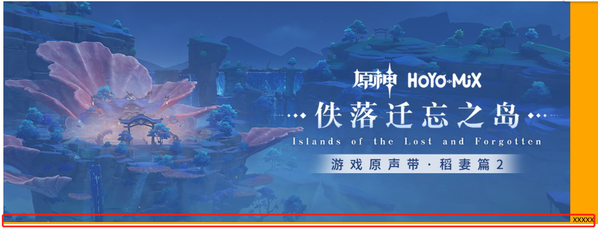 

  解决办法：
  
  1. 给图片添加 `vertical-align: middle | top | bottom` 等，**不要和基线对齐**
  
     ```html
     <div class="box">
       
       xxxxx
     </div>
     ```
  
     ```css
     img {
       vertical-align: top;
     }
     ```
  
     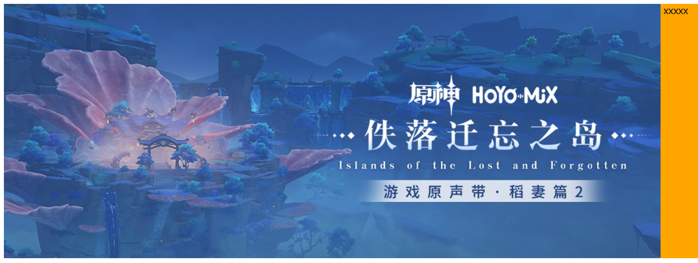 
  
  2. 把图片转换为块级元素 `display: block;` 但是会独占一行
  
     ```css
     img {
       display: block;
     }
     ```
  
     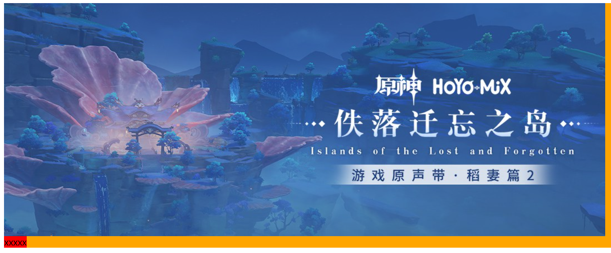 
  
- 当行内块元素中有文本时，基线就不再是元素的底部，而是最后一行文本的基线

  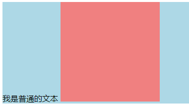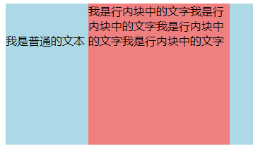

- **行盒 line boxes** 的理解

  行盒 line boxes 实际是**看不到**的，实际工作是**包裹每行的行内元素**，一行会有一个行盒

  行盒**一定会包裹住当前行中所有的内容**

  **行盒的高**会**收集所有行内元素的高度**，高度可以是 `font-size` 、`line-height`、 `height`、内边距、外边距、`vertical-align` 的对齐方式，最后生成可以**包裹所有元素的高度**

  行盒内只有文字

  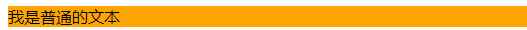 

  行盒内有图片和文字

  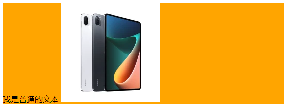 

  行盒内有图片、文字、行内块元素

   

  行盒内有图片、文字、行内块元素（设置 `margin-bottom`）

  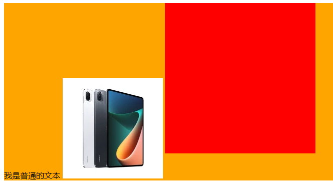 

  行盒内有图片、文字、行内块元素（设置 `margin-bottom`），行内块中有文字（受 `vertical-align: baseline` 影响）

  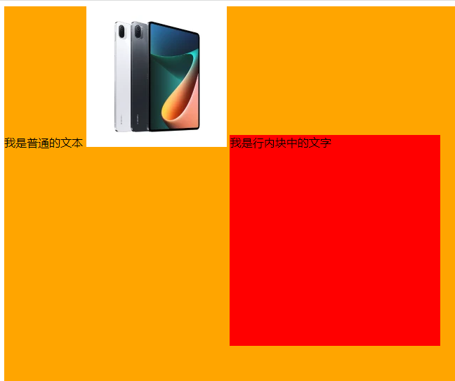 


## 文本垂直居中

**行高 `line-height` 等于盒子的高度**，浏览器会平均分布剩余的行距，让文本垂直居中

```css
div {
	width: 200px;
	height: 40px;
	line-height: 40px
}
```

 

- 行高小于盒子高度，文字会偏上；行高大于盒子高度，文字会偏下

  要注意 **`line-height` 的继承问题**

  ```css
  .container {
    height: 300px;
    line-height: 300px;
    background-color: orange;
  }
  
  .container .box {
    display: inline-block;
    background-color: #f00;
    height: 80px;
    /* 继承到了 line-height: 300px; */
  }
  ```

  ```html
  <div class="container">
    我是外面的文本
    <div class="box">我是行内块的文本</div>
  </div>
  ```

  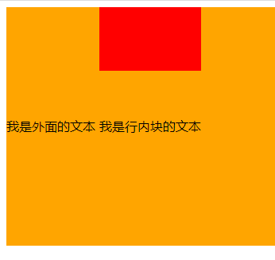 文字依然保持基线对齐，但是继承来的 `line-height` 大于了行内块定义的高度

- 如果盒子模型是 `box-sizing:border-box`，有设置 `margin` `padding` 等的情况，行高应该设置小于高度一些

- 使用  `height`  等于 `line-height` 来让**行内块元素**垂直居中，是会有一些偏差的，**不是绝对的垂直居中**

  ```css
  .container {
    background-color: orange;
    height: 300px;
    line-height: 300px;
  }
  .small {
    display: inline-block;
    width: 100px;
    height: 100px;
    background-color: #f00;
    vertical-align: middle;
  }
  ```

  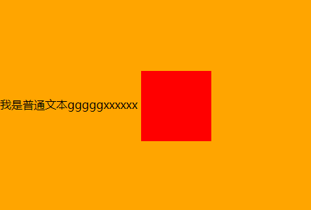  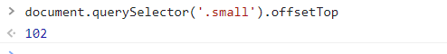

  实际的结果是，**上方的距离要比下方的距离长一点**

  原因的大部分字体都会进行**文本下沉**的，**实际上的中线** `middle` 是**在 `x` 字母的交叉点的下面**


## 文字折行

固定宽度的盒子容器中的默认文字排列

- 行内如果最后一个单词无法完整放下，这个单词会放到下一行去
- 行内如果只有一个单词，且该单词的长度已经超过容器的长度，单词末尾部分的字母会溢出容器，而不会放到下一行

```css
.box {
  font-size: 24px;
  width: 200px;
  border: 1px solid #000;
}
```

```html
<div class="box">
  Hi&nbsp;&nbsp;,
  This is a incomprehensibilities long word.
  </br>
  你好&nbsp;&nbsp;，
  这 是一个不可思议的长单词
</div>
```

 


### 内容换行 overflow-wrap

`word-wrap` 和 `overflow-wrap` 效果相同，`overflow-wrap` 是在 CSS3 中用来替换 `word-wrap` 的，为了兼容性应该都写上两者

- `normal` 默认值

- `break-word` **只有当单词在完整一行都显示不下时，才会拆分换行该单词**

  ```css
  .box {
    overflow-wrap: break-word;
    word-wrap: break-word;
  }
  ```

   


### 词内换行 word-break

 `word-break` 指定了怎样在单词内断行

基本参数：

- `normal` 默认值，单词作为一个整体

- `break-all` **单词不再是一个整体，所有单词碰到边界一律拆分换行**

  ```css
  .box {
    word-break: break-all;
  }
  ```

   

- `keep-all` 所有单词都保持完整，中文的句子也保持完整，而且只能在半角空格或连字符处换行

  ```css
  .box {
    word-break: keep-all;
  }
  ```

   

- `break-word` 等同于 `overflow-wrap: break-word`，但是有兼容性问题

- 词内换行 `word-break` 的优先级大于内容换行 `overflow-wrap`

  ```css
  .box {
    overflow-wrap: break-word;
    word-break: break-all;
  }
  /* 最后生效的是 word-break: break-all */
  ```


### 空白保留和换行 white-space

`white-space` 设置空白处理和换行规则

 

- `normal` 合并连续空白，忽略换行符，允许自动换行

- `nowrap` 合并连续空白，忽略换行符，**不允许自动换行**，直到遇到 `</br>` 才能换行

  ```css
  .box {
    white-space: nowrap;
  }
  ```

  ```html
  <div class="box">
    Hi  ,
    This is a incomprehensibilities long word.
    </br>
  	你好  ，
  	这 是一个不可思议的长单词
  </div>
  ```
  
   
  
- `pre` 保留连续空白，保留换行符，不允许自动换行

  ```css
  .box {
    white-space: pre;
  }
  ```

  ```html
  <div class="box">
    Hi  ,
    This is a incomprehensibilities long word.
    你好  ，
    这 是一个不可思议的长单词
  </div>
  ```

  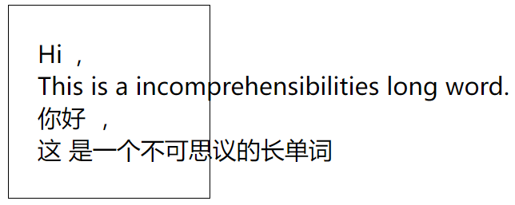 

- `pre-wrap` 保留连续空白，保留换行符，允许自动换行

  ```css
  .box {
    white-space: pre-wrap;
  }
  ```

  ```html
  <div class="box">
    Hi  ,
    This is a incomprehensibilities long word.
    你好  ，
    这 是一个不可思议的长单词
  </div>
  ```

  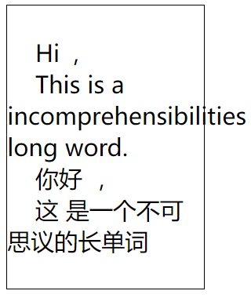 

- `pre-line` 合并连续空白，保留换行符，允许自动换行

  ```css
  .box {
    white-space: pre-wrap;
  }
  ```

  ```html
  <div class="box">
    Hi  ,
    This is a incomprehensibilities long word.
    你好  ，
    这 是一个不可思议的长单词
  </div>
  ```

  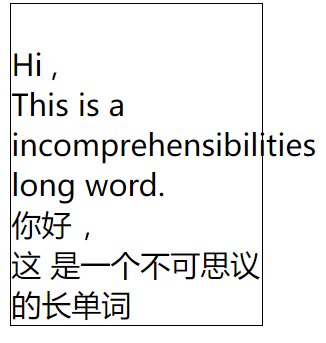 

- 空格字符实体 `&nbsp;` 不会被合并


## 文本溢出 text-overflow

`text-overflow` 设置文字溢出时的行为

- `ellipsis` 溢出行的结尾处用省略号表示

  ```css
  .box {
    width: 200px;
    overflow: hidden;
    white-space: nowrap;
    text-overflow: ellipsis;
  }
  ```

  ```html
  <div class="box">
    my name is Jack, age is 18, I am a student
  </div>
  ```

  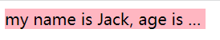 

- `clip` 溢出的内容直接裁剪掉，字符可能会显示不完整

  ```css
  .box {
    width: 200px;
    overflow: hidden;
    white-space: nowrap;
    text-overflow: clip;
  }
  ```

  ```html
  <div class="box">
    my name is Jack, age is 18, I am a student
  </div>
  ```

  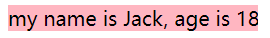 


## 文字阴影 text-shadow

文字添加阴影效果，添加一点阴影会让文字有种印刷品的质感

`text-shadow: h-shadow vuj-shadow blur color`

```css
.box {
  text-shadow: 5px 5px 5px orange;
}
```

- 属性

  `h-shadow` 水平阴影的位置，允许负值，必需

  `v-shadow` 垂直阴影的位置，允许负值，必需

  `blur` 模糊的距离，可选

  `color` 阴影的颜色，可选

- 可以设置一个或者多个阴影，多个阴影之间用逗号隔开，从前到后叠加

  ```css
  .box {
    font-size: 50px;
    font-weight: 700;
    text-shadow: 5px 5px 5px orange, 10px 10px 5px blue, 15px 15px 5px green;
  }
  ```

   

- 在线测试文字阴影网站

  https://html-css-js.com/css/generator/text-shadow/


## 大小写转换 text-transform

```css
.info {
  /* text-transform: capitalize; */
  /* text-transform: uppercase; */
  text-transform: lowercase;
}
```

- 参数：`capitalize`（首字母大写），`uppercase`（变为大写），`lowercase`（变为小写），`none`（无变化）


## 字母单词间距

- 设置字母之间的间距 `letter-spacing` 

  默认是0，可以设置为负数

  ```css
  .box {
    letter-spacing: 10px;
  }
  ```

   

- 设置单词之间的间距 `word-spacing`

  默认是0，可以设置为负数

  ```css
  .box {
    word-spacing: 30px;
  }
  ```

   


## 书写模式 writing-mode

设置文本在水平或垂直方向上如何排布

- `vertical-lr`：垂直排布，从上到下，从左到右；`vertical-rl`：垂直排布，从上到下，从右到左

  ```css
  .text {
    writing-mode: vertical-lr;
  }
  ```

   

- `horizontal-tb`：水平排布，从左到右，自上而下


## 文本描边 text-stroke

为文本添加描边效果，其实就是给文字添加边框

```css
div {
  text-stroke:1px red;
  -webkit-text-stroke:1px red;
}
```

- `text-stroke` 是一个简写属性，由 `text-stroke-width` 和 `text-stroke-color` 两个属性组成

  `text-stroke-width`：定义边框的宽度

  `text-stroke-color`：定义边框的颜色

  ```css
  div {
    font-size: 50px;
    font-weight: bold;
    color: transparent;
    text-stroke: 2px silver;
    -webkit-text-stroke: 2px silver;
  }
  ```

  ```html
  <div>HELLO WORLD</div>
  ```

  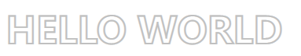 

- Chrome 和 Firefox 需要添加前缀 `-webkit-`


## 文本选择 user-select

是否允许用户选中文本

```css
.select-none {
  user-select: none;
}
```

- `auto`：默认

- `none`：元素及其子元素的文本**不可选中**

  ```css
  user-select: none;
  ```

  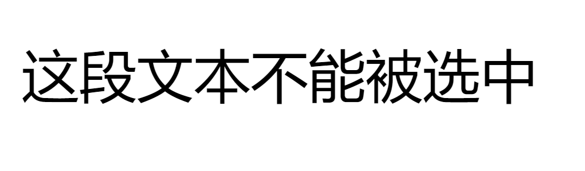 

- `text`：可以选择文本

  ```css
  user-select: text;
  ```

  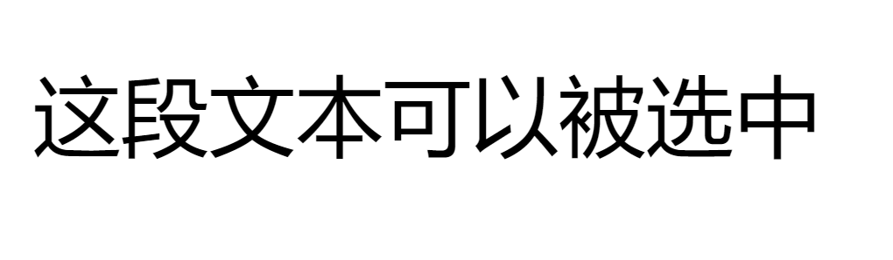 

- `all`：点击子元素或者上下文时，元素及其子元素的文本被选中

  ```css
  user-select: all;
  ```

   

- 在低版本浏览器可以使用标签属性 `onselectstart="return false;"`


# 盒子样式

盒子模型包括：边框 `border`，外边距 `margin`，内边距 `padding`，内容 `width / height`

 


## 宽度和高度

### 宽度 width

```css
.box {
  width: 200px;
}
```

- 对于行内级非替换元素来说, 设置宽度无效

- 宽度 `width` 的默认值是 `auto`，交给浏览器来决定

  块级元素的默认值 `auto` 是独占父元素一行，行内级元素的默认值 `auto` 是包裹内容
  
- 百分比单位是基于父元素宽度的百分比


### 高度 height

```css
.box {
  height: 200px;
}
```

- 对于行内级非替换元素来说, 设置高度无效
- 百分比单位是基于父元素高度的百分比


### 最小和最大宽度

最小宽度 `min-width`

- 无论有多少内容，宽度都大于或等于 `min-width`

最大宽度 `max-width`

- 无论有多少内容，宽度都小于或等于 `max-width`

移动端适配时，可以设置最大宽度和最小宽度

```css
.home {
  max-width: 750px;
  min-width: 600px;
}
```


### 最小和最大高度

最小高度 `min-height`

- 无论有多少内容，高度都大于或等于 `min-height`

最大高度 `max-height`

- 无论有多少内容，高度都小于或等于 `max-height`

不常用这两个属性，一般高度是由内容决定

```css
.home {
  max-height: 2000px;
  min-height: 1000px;
}
```


## 边框 border

### 边框宽度 border-width

上边框 `border-top-width`、右边框  `border-right-width`、下边框 `border-bottom-width`、左边框 `border-left-width`

```css
.box {
  border-top-width: 10px;
  border-right-width: 20px;
  border-bottom-width: 30px;
  border-left-width: 40px;
}
```

`border-width` 是边框宽度的简写，顺时针方向依次赋值，可以省略个数赋值

```css
.box {
  border-width: 10px 20px 30px 40px;
}
```

> 如何画 `0.5px` 的边框线
>
> - 直接设置 `0.5px` 的边框，边框大小会**向上取整**
>
> - `box-shadow` 阴影实现，阴影属性允许小数值
>
>   ```html
>   <div></div>
>   ```
>
>   ```css
>   div {
>     box-sizing: border-box;
>     background-color: blueviolet;
>     width: 200px;
>     height: 200px;
>     margin: 100px auto;
>     /* border: 1px solid red; */
>     box-shadow: 0px 0px 0px 0.5px green;
>   }
>   ```
>
> - `::after` 伪类元素指定高度
>
>   ```css
>   div {
>     position: relative;
>     box-sizing: border-box;
>     background-color: blueviolet;
>     width: 200px;
>     height: 200px;
>     margin-top: 10px;
>     /* box-shadow: 0px 0px 0px 0.5px green; */
>   }
>   ```
>


### 边框颜色 border-color

上边框 `border-top-color`、右边框  `border-right-color`、下边框 `border-bottom-color`、左边框 `border-left-color`

```css
.box {
  border-top-color: red;
  border-right-color: blue;
  border-bottom-color: green;
  border-left-color: orange;
}
```

`border-color` 是边框颜色的简写，顺时针方向依次赋值，可以省略个数赋值

```css
.box {
  border-color: red blue green orange;
}
```


### 边框样式 border-style

上边框 `border-top-style`、右边框 `border-right-style`、下边框 `border-bottom-style`、左边框 `border-left-style`

```css
.box {
  border-top-style: solid;
  border-right-style: dashed;
  border-bottom-style: groove;
  border-left-style: ridge;
}
```

`border-style` 是边框样式的简写，顺时针方向依次赋值，可以省略个数赋值

```css
.box {
  border-style: solid dashed groove ridge;
}
```

- 参数：实线 `solid`，虚线 `dashed`，点线 `dotted`，双线 `double`，凹槽 `groove`，凸状 `ridge`，嵌入 `inset`，突出 `outset`

   


### 边框简写属性 border

同时设置宽度、样式、颜色

上边框 `border-top`、右边框 `border-right`、下边框 `border-bottom`、左边框 `border-left`

```css
.box {
  border-top: 10px solid red;
  border-right: 20px dashed blue;
  border-bottom: 30px groove green;
  border-left: 40px ridge orange;
}
```

统一四个边框 `border`

```css
.box {
  border: 10px solid red;
}
```

- `border` 边框颜色、宽度、样式的编写顺序任意，可以省略边框颜色和宽度，但只能为四个边框做统一设置

- 使用 `border`  统一设置时，如果个别需要特殊设置可以利用层叠性覆盖

  ```css
  .box {
    border: 10px solid red;
    border-left-color: pink;
  }
  ```

- 边框会影响盒子的大小，使用盒子模型 `box-sizing:content-box`，盒子大小会包含边框宽度


### 圆角边框 border-radius

设置盒子的圆角 `border-radius`

```css
.box {
  border-radius: 20px;
}
```

- 参数：数值或百分比，数值是圆角的半径长度，百分比是相当于盒子的宽度和高度的百分比

  `border-radius: 20px` 相当于每个圆角的半径都是 `20px`

  `border-top-left-radius：50%` 相当于左边高的 `50%` 和上边宽的 `50%`

- 可以分别为四个角设置不同的值，顺时针方向依次赋值，可以省略个数赋值

  `border-radius: 左上角 右上角 右下角 左下角` 

  左上角 `border-top-left-radius`

  右上角 `border-top-right-radius`

  右下角 `border-bottom-right-radius`

  左下角`border-bottom-left-radius`

  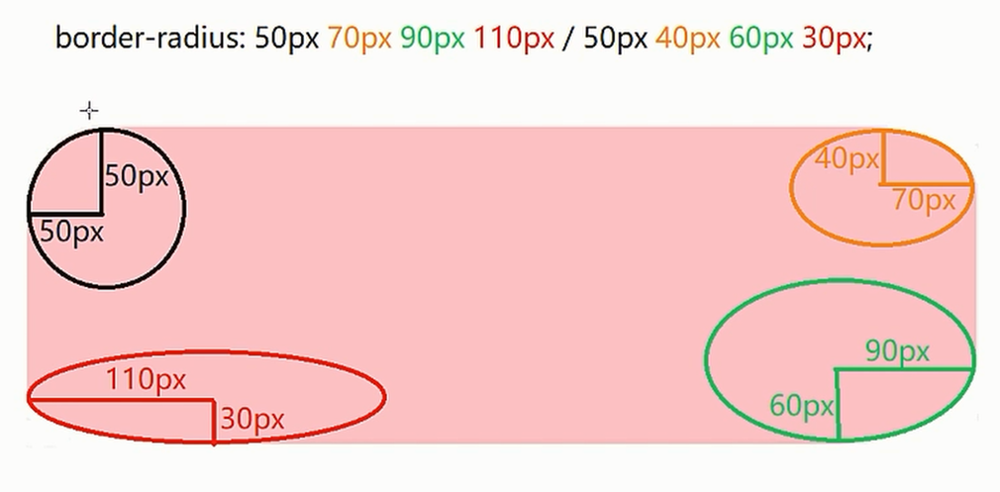 

- 可以分别设置圆角的水平和垂直半径

   `border-radius: 左上水平 右上水平 右下水平 左下水平 / 左上垂直 右上垂直 右下垂直 左下垂直 ` 

  ```css
  border-radius: 2em 1em 4em / 0.5em 3em;
  /* 等价于 */
  border-top-left-radius: 2em 0.5em;
  border-top-right-radius: 1em 3em;
  border-bottom-right-radius: 4em 0.5em;
  border-bottom-left-radius: 1em 3em;
  
  /* 每个圆角的水平半径时30px,垂直半径为20px */
  border-radius: 30px / 20px;
  
  border-radius: 30px;
  /* 等价于 */
  border-radius: 30px 30px 30px 30px/30px 30px 30px 30px；
  ```

- 设置圆形：正方形，数字修改为高度或者宽度的一半，或者直接写为 50%

  ```css
  .box {
    width: 100px;
    height: 100px;
    border-radius: 50%;
  }
  ```

- 圆角矩形：设置为高度的一半

  ```css
  .box { 
    width: 300px;
    height: 200px;
    border-radius: 100px;
    background-color: #0f0;
  }
  ```

   

  

### 边框背景图片 border-image

`border-image: url(xx.jpg) 剪裁位置 重复性`

```css
.box {
  border-image: url(border.png) 30 round;
}
```

- 剪裁位置可以是像素也可以是百分比

  剪裁出来的四个角根据边框的大小自动缩放，显示到边框对应的四个角的位置

  剪裁剩下的中心切片会被舍去，其他切片（上中，右中间，下中，左中间）会根据配置的重复性操作显示到对应的四个边

   

- 重复性：`repeat`（重复），`round`（平铺），`stretch`（拉伸），默认是拉伸

- 九宫格图片转化为边框

  ```css
  .box {
    /* 指定边框宽度 */
    border-width: 30px;
    /* 拉伸 */
    border-image: url(./border.png) 30 stretch;
    /* 平铺 */
    /* border-image: url(./border.png) 30 round; */
  }
  ```

  原始图片  拉伸  平铺  


### 边框图形(三角形)

也可以利用边框的特性来实现一些形状

- 边框三角形的原理

  ```css
  .box {
    width: 0;
    height: 0;
    border: 50px solid transparent;
    border-right-color: blue;
    border-bottom-color: aqua;
    border-left-color: blueviolet;
    border-top-color: orange;
  }
  ```

  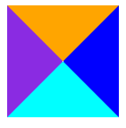 

- 常用三角形

  ```css
  /* 左右透明，下有色，无上 */
  .triangle-top1 {
    width: 0;
    height: 0;
    border-bottom: 50px solid lightblue;
    border-left: 50px solid transparent;
    border-right: 50px solid transparent;
  }
  /* 上左右透明，下有色 */
  .triangle-top2 {
    width: 0;
    height: 0;
    border: 50px solid transparent;
    border-bottom-color: lightcoral;
  
  }
  ```

  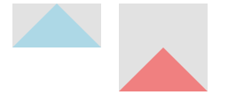 

  ```css
  /* 上下透明，左有色，无右 */
  .triangle-right1 {
    width: 0;
    height: 0;
    border-left: 50px solid lightblue;
    border-top: 50px solid transparent;
    border-bottom: 50px solid transparent;
  }
  /* 上下右透明，左有色 */
  .triangle-right2 {
    width: 0;
    height: 0;
    border: 50px solid transparent;
    border-left-color: lightcoral;
  }
  ```

  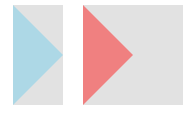 

  ```css
  /* 左右透明，上有色，无下 */
  .triangle-bottom1 {
    width: 0;
    height: 0;
    border-top: 50px solid lightblue;
    border-left: 50px solid transparent;
    border-right: 50px solid transparent;
  }
  /* 左右下透明，上有色 */
  .triangle-bottom2 {
    width: 0;
    height: 0;
    border: 50px solid transparent;
    border-top-color: lightcoral;
  }
  ```

  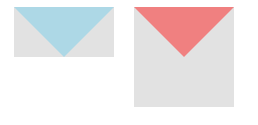 

  ```css
  /* 上下透明，右有色，无左 */
  .triangle-left1 {
    width: 0;
    height: 0;
    border-right: 50px solid lightblue;
    border-top: 50px solid transparent;
    border-bottom: 50px solid transparent;
  }
  /* 上下左透明，右有色 */
  .triangle-left2 {
    width: 0;
    height: 0;
    border: 50px solid transparent;
    border-right-color: lightcoral;
  }
  ```

  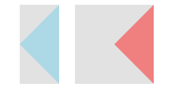 

- 通过使用 `transform` 属性调整边框图形方向

  ```css
  .box {
    width: 0;
    height: 0;
    border: 50px solid transparent;
    border-top-color: orange;
    /* 三角形的中心旋转 */
    transform-origin: center 25%;
    /* 旋转 */
    transform: rotate(180deg);
  }
  ```

- 常用箭头

  ```css
  /* 边框加上旋转 */
  .arrow-top1 {
    position: absolute;
    width: 75px;
    height: 75px;
    border-top: 1px solid #666;
    border-left: 1px solid #666;
    transform: rotate(45deg);
  }
  /* 白色三角形覆盖蓝色三角形，并且错开1px */
  .arrow-top2 {
    position: absolute;
  }
  .arrow-top2:before,
  .arrow-top2:after {
    position: absolute;
    content: '';
    border-left: 50px solid transparent;
    border-right: 50px solid transparent;
  }
  .arrow-top2:before {
    border-bottom: 50px solid lightcoral;
  }
  .arrow-top2:after {
    top: 1px;
    /*覆盖并错开1px*/
    border-bottom: 50px solid #fff;
  }
  ```

  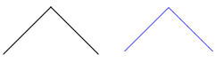 

  ```css
  /* 边框加上旋转 */
  .arrow-right1 {
    position: absolute;
    width: 75px;
    height: 75px;
    border-top: 1px solid #000;
    border-right: 1px solid #000;
    transform: rotate(45deg);
  }
  /* 白色三角形覆盖蓝色三角形，并且错开1px */
  .arrow-right2 {
    position: absolute;
  }
  .arrow-right2:before,
  .arrow-right2:after {
    position: absolute;
    content: '';
    border-top: 50px solid transparent;
    border-bottom: 50px solid transparent;
  }
  .arrow-right2:before {
    border-left: 50px blue solid;
  }
  .arrow-right2:after {
    left: -1px;
    /*覆盖并错开1px*/
    border-left: 50px #fff solid;
  }
  ```

  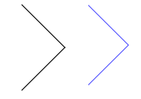 

  ```css
  /* 边框加上旋转 */
  .arrow-bottom1 {
    position: absolute;
    width: 75px;
    height: 75px;
    border-bottom: 1px solid #666;
    border-right: 1px solid #666;
    transform: rotate(45deg);
  }
  /* 白色三角形覆盖蓝色三角形，并且错开1px */
  .arrow-bottom2 {
    position: absolute;
  }
  .arrow-bottom2:before,
  .arrow-bottom2:after {
    position: absolute;
    content: '';
    border-left: 50px solid transparent;
    border-right: 50px solid transparent;
  }
  .arrow-bottom2:before {
    border-top: 50px blue solid;
  }
  .arrow-bottom2:after {
    top: -1px;
    /*覆盖并错开1px*/
    border-top: 50px #fff solid;
  }
  ```

  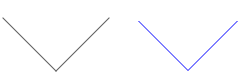 

  ```css
  /* 边框加上旋转 */
  .arrow-left1 {
    position: absolute;
    width: 75px;
    height: 75px;
    border-bottom: 1px solid #666;
    border-left: 1px solid #666;
    transform: rotate(45deg);
  }
  /* 白色三角形覆盖蓝色三角形，并且错开1px */
  .arrow-left2 {
    position: absolute;
  }
  .arrow-left2:before,
  .arrow-left2:after {
    position: absolute;
    content: '';
    border-top: 50px solid transparent;
    border-bottom: 50px solid transparent;
  }
  .arrow-left2:before {
    border-right: 50px blue solid;
  }
  .arrow-left2:after {
    left: 1px;
    /*覆盖并错开1px*/
    border-right: 50px #fff solid;
  }
  ```

  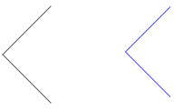 

- 三角形吹出框

  ```css
  .border-triangle-bottom {
    width: 100px;
    height: 30px;
    border: 1px solid #1d9cd6;
    position: relative;
    border-radius: 4px;
  }
  .border-triangle-bottom:after,
  .border-triangle-bottom:before {
    content: "";
    position: absolute;
    width: 0;
    height: 0;
    border: 4px solid transparent;
    border-top-color: lightblue;
    left: 50%;
    margin-left: -4px;
    bottom: -8px;
  }
  .border-triangle-bottom:after {
    border-top-color: #fff;
    bottom: -7px;
  }
  ```

  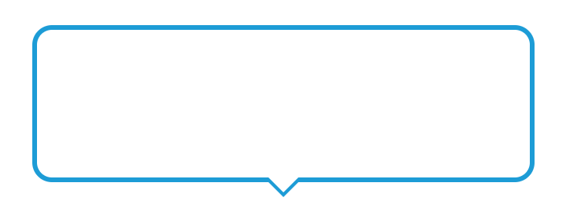 

- 其他边框图形

  https://css-tricks.com/the-shapes-of-css/#top-of-site


## 内边距 padding

设置盒子的内边距，通常用于设置边框和内容之间的间距（父子嵌套关系）

```css
.box {
  padding: 10px 20px 30px 40px;
}
```

- `padding` 包括四个方向，可以分别赋值

  `padding-left`，`padding-right`，`padding-top`，`padding-bottom`

  ```css
  padding-top: 10px;
  padding-right: 20px;
  padding-bottom: 30px;
  padding-left: 40px;
  /* 等价于 */
  padding: 10px 20px 30px 40px;
  ```

- 使用 `padding` 统一赋值时，按照顺时针方向依次赋值，可以省略个数赋值

  `padding:5px` 上下左右都 5px

  `padding:5px 10px` 上下 5px，左右 10px

  `padding:5px 10px 20px` 上 5px，左右 10px，下 20px

  `pdding:5px 10px 20px 30px` 上 5px，右 10px，下 20px，左 30px （顺时针）

- 指定了盒子的大小的时候，`padding` 会影响盒子的实际大小

  使用盒子模型 `box-sizing:content-box`，盒子大小会包含边框宽度

  ```css
  .box {
    width: 300px;
    height: 300px;
    padding-top: 100px;
    box-sizing: border-box;
    background-color: #f00;
  }
  ```

- 盒子本身**没有指定 `height` 或者 `width` 属性，此时 `padding` 不会撑开盒子大小**

- `padding` 值的**百分比是参照父元素的宽度**


## 外边距 margin

### 外边距 margin

设置盒子的外边距，通常用于元素和元素之间的间距（兄弟元素关系）

```css
.box {
  margin: 10px 20px 30px 40px;
}
```

- `margin` 包括四个方向，可以分别赋值

  `margin-left`，`margin-right`，`margin-top`，`margin-bottom`

  ```css
  margin-top: 10px;
  margin-right: 20px;
  margin-bottom: 30px;
  margin-left: 40px;
  /* 等价于 */
  margin: 10px 20px 30px 40px;
  ```

- 使用 `margin` 统一赋值时，按照顺时针方向依次赋值，可以省略个数赋值

  `margin:5px` 上下左右都 5px

  `margin:5px 10px` 上下 5px，左右 10px

  `margin:5px 10px 20px` 上 5px，左右 10px，下 20px

  `margin:5px 10px 20px 30px` 上 5px，右 10px，下 20px，外 30px （顺时针）

- 外边距和内边距的使用场景
  - `margin` 一般是用来设置**兄弟元素之间的间距**
  - `padding` 一般是用来设置**父子元素之间的间距**
  
- `margin` 值的百分比是参照父元素的宽度


### 上下 margin 传递

`margin-top` 传递

- 如果**块级元素的顶部线和父元素的顶部线重叠**，这个**块级元素的 `margin-top` 值会传递给父元素**

  ```css
  .outer {
    width: 300px;
    height: 300px;
    background-color: #f00;
  }
  .inner {
    width: 100px;
    height: 100px;
    background-color: #0f0;
    /* 左右是不会传递 */
    /* margin-left: 30px; */
    margin-top: 100px;
  }
  ```

  ```html
  <div class="outer">
    <div class="inner"></div>
  </div>
  ```

  实际效果    预期效果  

`margin-bottom` 传递

- 如果**块级元素的底部线和父元素的底部线重叠**，并且**父元素的高度是 `auto`**，这个**块级元素的 `margin-bottom` 值会传递给父元素**

  ```css
  .outer {
    width: 300px;
    /* height: auto; */
    background-color: #f00;
  }
  .inner {
    width: 100px;
    height: 100px;
    background-color: #0f0;
    margin-bottom: 100px;
  }
  ```

  ```html
  <div class="outer">
    <div class="inner"></div>
  </div>
  <div>哈哈哈哈哈</div>
  ```

  实际效果     预期效果 

**解决传递问题**

- 父元素设置 `padding-top` \ `padding-bottom` 来代替使用子元素使用外边距

  ```css
  .outer {
    width: 300px;
    height: 300px;
    background-color: #f00;
    padding-top: 100px;
    box-sizing: border-box;
  }
  .inner {
    width: 100px;
    height: 100px;
    background-color: #0f0;
  }
  ```

- 触发 BFC，父元素添加 `overflow: auto`

  ```css
  .outer {
    width: 300px;
    height: 300px;
    background-color: #f00;
    overflow: auto;
  }
  .inner {
    width: 100px;
    height: 100px;
    background-color: #0f0;
    margin-top: 100px;
  }
  ```

- 父元素设置 `border`，但是由于 `border` 占据空间，不推荐

  ```css
  .outer {
    width: 300px;
    height: 300px;
    background-color: #f00;
    border: 1px solid transparent;
  }
  .inner {
    width: 100px;
    height: 100px;
    background-color: #0f0;
    margin-top: 100px;
  }
  ```


### 上下 margin 折叠

垂直方向上相邻的2个外边距（`margin-top`、`margin-bottom`）有可能会合并为1个外边距

上下 `margin` 折叠分为两种情况

- 两个**兄弟块级元素**之间**上下 `margin` 的折叠**，折叠后**取较大的值**作为最终的外边距

   

  ```css
  .top {
    height: 100px;
    background-color: #f00;
    margin-bottom: 30px;
  }
  .bottom {
    height: 100px;
    background-color: #0f0;
    margin-top: 50px;
  }
  ```

  ```html
  <div class="top"></div>
  <div class="bottom"></div>
  ```

  **解决办法**

  - 只设置其中一个元素的 `margin-top` 或 `margin-bottom`

    ```css
    .box1 {
      height: 100px;
      width: 100px;
      background-color: #f00;
      margin-bottom: 80px;
    }
    .box2 {
      height: 100px;
      width: 100px;
      background-color: #0f0;
    }
    ```

  - 下方的元素设置浮动 `float: left`，浮动元素的下方要清除浮动 `clear: both`

    ```css
    .top {
      height: 100px;
      width: 100px;
      background-color: #f00;
      margin-bottom: 30px;
    }
    .bottom {
      height: 100px;
      width: 100px;
      background-color: #0f0;
      margin-top: 50px;
      float: left;
    }
    ```

- 父子块级元素之间 `margin` 的折叠，折叠后取较大的值作为最终的外边距

   

  ```css
  .outer {
    height: 300px;
    width: 300px;
    background-color: #f00;
    margin-top: 30px;
  }
  .inner {
    height: 100px;
    width: 100px;
    background-color: #0f0;
    margin-top: 20px;
  }
  ```

  ```html
  <div class="outer">
    <div class="inner"></div>
  </div>
  ```

  **解决办法**

  - 父元素设置 `padding-top` \ `padding-bottom` 来代替使用子元素使用外边距

    ```css
    .outer {
      height: 300px;
      width: 300px;
      background-color: #f00;
      margin-top: 30px;
      padding-top: 20px;
      box-sizing: border-box;
    }
    .inner {
      height: 100px;
      width: 100px;
      background-color: #0f0;
    }
    ```

  - 触发 BFC，父元素添加 `overflow: auto`

    ```css
    .outer {
      height: 300px;
      width: 300px;
      background-color: #f00;
      margin-top: 30px;
      overflow: auto;
    }
    .inner {
      height: 100px;
      width: 100px;
      background-color: #0f0;
      margin-top: 20px;
    }
    ```

  - 父元素设置 `border`，但是由于 `border` 占据空间，不推荐

    ```css
    .outer {
      height: 300px;
      width: 300px;
      background-color: #f00;
      margin-top: 30px;
      border: 1px solid transparent;
    }
    .inner {
      height: 100px;
      width: 100px;
      background-color: #0f0;
      margin-top: 20px;
    }
    ```


## 外轮廓 outline

```css
.box {
  outline: 30px solid #0f0;
}
```

- 外轮廓不占用空间，默认显示在 `border` 的外面

- 使用方法和 `border` 一样

  相关属性有：`outline-width`，`outline-style`，`outline-color`

  `outline` 是简写属性

- 去除元素默认的外轮廓

  去除 `<a>` 的默认外轮廓（在 `focus` 状态下显示）

   修改后   

  ```css
  a {
    outline: none;
  }
  ```

  去除 `<input>` 的默认外轮廓（元素在 `focus` 状态下显示）

   修改后    

  ```css
  input {
    outline: none;
  }
  ```


## 盒子阴影 box-shadow

添加一个或多个下拉阴影框

`box-shadow: h-shadow v-shadow blur spread color inset`

```css
.box {
  width: 100px;
  height: 100px;
  box-shadow: 5px 5px 10px gray;
}
```

- 参数：

  `h-shadow` 水平阴影的位置，允许负值，正值阴影往右走，负值往左走，必需

  `v-shadow` 垂直阴影的位置，允许负值，正值阴影往下走，负值往上走，必需

  `blur` 模糊距离，可选

  `spread` 阴影的尺寸，可选

  `color` 阴影的颜色，可选，默认的颜色是前景色 `color`

  `inset` 将外部阴影 `outset` 改为内部阴影，可选

- 可以设置一个或者多个阴影，多个阴影之间用逗号隔开，从前到后叠加

  ```css
  .box {
    width: 100px;
    height: 100px;
    background-color: #f00;
    box-shadow: 5px 5px 10px orange, 10px 10px 10px green;
  }
  ```

   

- 盒子阴影不占空间，不会影响其他盒子排列

- 在线测试盒子阴影网站

  https://html-css-js.com/css/generator/box-shadow/


## 盒子模型 box-sizing

定义如何计算一个元素的总宽度和总高度，高宽是否需要加上内边距和边框等

- `box-sizing: content-box` ：默认值，`padding`、`border` 都布置在 `width`、`height` 之外

  盒子大小为 `width / height + padding + border`

   

- `box-sizing: border-box`  ：`padding`、`border` 都布置在 `width`、`height` 之内（不包含 `margin`）

  盒子大小为 `width`  的宽度和 `height` 高度

   

  ```css
  .box {
    width: 300px;
    height: 300px;
    border: 1px solid red;
    padding: 100px;
    box-sizing: border-box;
  } 
  ```


## 盒子水平居中

**块级元素**在父元素中水平居中显示

> **行内元素或者行内块元素**水平居中给其父元素添加 `text-align:center` 即可

- 使用 `margin: 0 auto`

  盒子**必须指定宽度**，盒子的**左右外边距**都设置为 `auto`，让浏览器自动分配

  > *父盒子的宽度 = 块级元素宽度 + margin-left + margin-right*

  ```css
  .box {
    width: 100px;
    margin: 0 auto;
  }
  ```


- 绝对定位盒子

  绝对定位的盒子不能通过 `margin:0 auto` 水平居中

  盒子**必须指定宽度**，`left: 0`、`right: 0`、`margin: 0 auto`

  ```css
  .container {
    width: 800px;
    height: 300px;
    position: relative;
  }
  .box {
    width: 200px;
    height: 100px;
    position: absolute;
    left: 0;
    right: 0;
    margin: 0 auto;
  }
  ```

  ```html
  <div class="container">
    <div class="box"></div>
  </div>
  ```

  > *定位参照对象的宽度 = left + right + margin-left + margin-right + 绝对定位元素的实际占用宽度*
  > 参照对象宽度: 800px = left: 0 + right: 0 + margin-left: auto + margin-right: auto + 绝对定位宽度 200px
  > 交给浏览器计算后，左右 margin 自动平均分配了剩余长度

  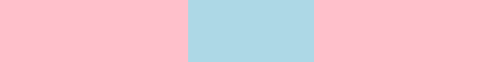 

- 使用弹性布局 `justify-content: center`

  ```css
  .container {
    width: 600px;
    height: 100px;
    display: flex;
    justify-content: center;
  }
  ```

  ```html
  <div class="container">
    <div class="box">水平居中</div>
  </div>
  ```

  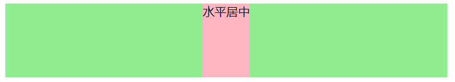 

- 使用定位和位移 

  向右移动父盒子宽度一半 `left:50%`，再向左移动自己盒子宽度的一半 `transform: translate(-50%, 0)`

  可以使用 `margin-left: -自己盒子宽度的一半`，但是宽度的一半需要手动计算

  ```css
  .container {
    width: 800px;
    height: 300px;
  }
  .box {
    width: 200px;
    height: 100px;
    position: relative;
    left: 50%;
    transform: translate(-50%, 0);
  }
  ```

  ```html
  <div class="container">
    <div class="box"></div>
  </div>
  ```

  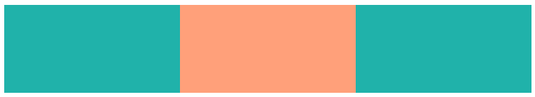 


## 盒子垂直居中

**块级元素**在父元素中垂直居中显示

- 绝对定位盒子

  盒子**必须指定高度**，必须使用定位（脱离标准流），`top: 0`、`bottom: 0`、`margin: auto 0`

  ```css
  .container {
    width: 300px;
    height: 300px;
    position: relative;
  }
  .box {
    width: 200px;
    height: 100px;
    position: absolute;
    top: 0;
    bottom: 0;
    margin: auto 0;
  }
  ```

  ```html
  <div class="container">
    <div class="box"></div>
  </div>
  ```

  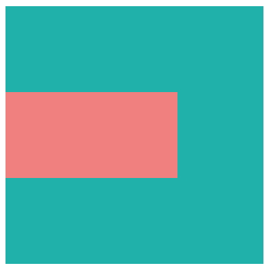 

- 使用弹性布局 `align-items: center`

  ```css
  .container {
    width: 300px;
    height: 300px;
    display: flex;
    /* 侧轴都设置成垂直居中 */
    /* align-items: center; */
  }
  .box {
    width: 200px;
    height: 100px;
    /* 单个弹性项设置成垂直居中 */
    align-self: center;
  }
  ```

  ```html
  <div class="container">
    <div class="box"></div>
    <span>其他内容</span>
  </div>
  ```

  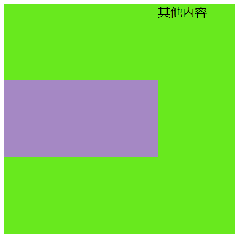 

- 使用定位和位移

  向下移动父盒子高度的一半 `top: 50%`，再向上移动自己盒子高度的一半 `transform: translate(0, -50%)`

  可以使用 `margin-top: -自己盒子高度的一半`，但是高度的一半需要手动计算

  ```css
  .container {
    width: 300px;
    height: 300px;
  }
  .box {
    width: 200px;
    height: 100px;
    position: relative;
    top: 50%;
    transform: translate(0, -50%);
  }
  ```

  ```html
  <div class="container">
    <div class="box"></div>
  </div>
  ```

  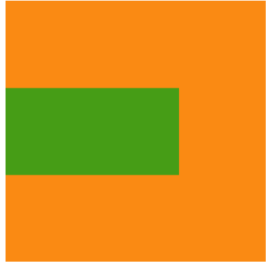 


## 盒子水平垂直居中

**块级元素**在父元素中水平垂直居中显示

- 绝对定位盒子

  盒子**必须指定宽高**，必须使用定位（脱离标准流）

  ```css
  .container {
    width: 300px;
    height: 300px;
    position: relative;
  }
  .box {
    width: 200px;
    height: 100px;
    position: absolute;
    top: 0;
    bottom: 0;
    left: 0;
    right: 0;
    margin: auto;
  }
  ```

  ```html
  <div class="container">
    <div class="box"></div>
  </div>
  ```

  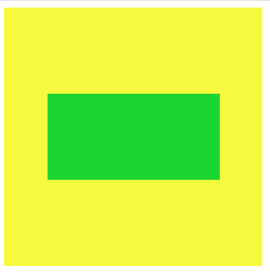 

- 使用弹性布局

  ```css
  .container {
    width: 400px;
    height: 300px;
    display: flex;
    justify-content: center;
    align-items: center;
  }
  .box {
    width: 200px;
    height: 100px;
    /* 单个弹性项设置成垂直居中 */
    /* align-self: center; */
  }
  ```

  ```html
  <div class="container">
    <div class="box"></div>
  </div>
  ```

   

- 使用定位和位移

  向右移动父盒子宽度一半 `left:50%`，向下移动父盒子高度的一半 `top: 50%`

  再向左移动自己盒子宽度的一半，再向上移动自己盒子高度的一半  `transform: translate(-50%, -50%)`

  可以使用 `margin-top/left: -自己盒子高度/宽度的一半`，但是需要手动计算具体长度

  ```css
  .container {
    width: 400px;
    height: 300px;
  }
  
  .box {
    width: 200px;
    height: 100px;
    position: relative;
    top: 50%;
    left: 50%;
    transform: translate(-50%, -50%);
  }
  ```

  ```html
  <div class="container">
    <div class="box"></div>
  </div>
  ```

   


## 获取盒模型对应的宽高

- 获取内联样式的宽高 `dome.style.width/height`
- 浏览器渲染后的结果宽高（仅 IE） `dom.currentStyle.width/height`
- 浏览器渲染后的结果宽高（都支持）`window.getComputedStyle(dom).width/height`
- 浏览器渲染后根据元素相对于视窗的绝对位置 `dom.getBoundingClientRect().width/height`


# 背景样式

## 背景颜色 background-color

设置元素的背景颜色，背景是元素的总大小，包含内边距

`background-color: 颜色值`

```css
.box {
  background-color: pink;
}
```


## 背景图片 background-image

`background-image : none | url (url)`

```css
.box {
  width: 600px;
  height: 600px;
  background-image: url(../images/kobe01.jpg);
}
```

- 既可以添加背景图片也可以添加背景颜色，背景图片会压住背景颜色

- 元素没有具体的宽高，背景图片不会显示

- 可以设置多张背景图片，多个背景图片之间用逗号隔开，按顺序后添加的层叠在下面

  ```css
  background-image: url(../images/kobe01.jpg), url(../images/kobe02.png);
  ```

- `background-image` 和 `` 对比

   

   `` ：作为网页内容的重要组成部分，比如广告图片、LOGO图片、文章配图、产品图片

  `background-image`：不影响用户获取完整的网页内容信息的内容，装饰性的小图片或者是超大的背景图片

- 可以使用背景线性渐变 `background-image: linear-gradient(direction,color1,color2,.....)` 作为图片

  ```css
  .box {
    width: 200px;
    height: 100px;
    background-image: linear-gradient(-45deg, red, blue);
  }
  ```


## 背景平铺 background-repeat

设置背景图片是否要平铺

```css
.box {
  width: 600px;
  height: 600px;
  background-image: url(../images/kobe01.jpg);
  background-repeat: no-repeat;
}
```

- 参数

  `repeat`：水平和垂直方向平铺，默认
  `no-repeat`：不平铺
  `repeat-x`：只在水平方向平铺
  `repeat-y`：只在垂直平方向平铺

- 利用背景平铺制作背景墙

  背景图片： 

  ```css
  .box {
    width: 600px;
    height: 600px;
    background-image: url(../images/wall.png);
  }
  ```

   


## 背景缩放 background-size

设置背景图片的大小

`background-size: length|percentage|cover|contain`

- `auto` ：以背景图本身大小显示，默认值

  ```css
  background-repeat: no-repeat;
  background-size: auto;
  /* 等价于 */
  /* background-size: auto auto; */
  ```

   高度和宽度按照图片的原始尺寸

- `length`：第一个值宽度，第二个值高度，如果只设置一个值，肯定是宽度，高度会等比例缩放

  ```css
  background-repeat: no-repeat;
  background-size: 100px 100px;
  ```

   宽度 100px，高度 100px

  ```css
  background-repeat: no-repeat;
  background-size: 100px;
  /* 等价于 */
  /* background-size: 100px auto; */
  ```

   宽度 100px，高度等比例缩放

- `percentage`：第一个值宽度，第二个值高度，如果只设置一个值，肯定是宽度，高度会等比例缩放，两个百分比分别是相对于父盒子的宽度和高度

  ```css
  background-repeat: no-repeat;
  background-size: 100% 100%;
  ```

   图片宽度和高度等于被拉伸，覆盖整个盒子

  ```css
  background-repeat: no-repeat;
  background-size: 100%;
  /* 等价于 */
  /* background-size: 100% auto; */
  ```

   宽度等于盒子的宽度，高度等比例缩放

  ```css
  background-repeat: no-repeat;
  background-size: 100% 100px;
  ```

   宽度等于盒子的宽度，高度 100px

- `cover`：背景图像等比例扩展到足够大，使背景图像完全覆盖背景区域，可能有部分图片显示不全

  ```css
  background-repeat: no-repeat;
  background-size: cover;
  ```

   图片等比例缩放，直到填满盒子

- `contain`：把图像扩展至最大尺寸，使其宽度和高度完全适应内容区域，当宽度或者高度铺满盒子就不再进行拉伸了，可能有部分空白区域

  ```css
  background-repeat: no-repeat;
  background-size: contain;
  ```

   图片等比例缩放，直到图片的宽或高等于盒子的宽或高

- 多个背景图片，多个图片缩放之间用逗号隔开


## 背景图片位置 background-position

设置背景图片在水平、垂直方向上的具体位置

`background-position: x y;`

- 参数： x 坐标，y 坐标，可以使用方位名称、精确单位或百分比

   

- 方位名称：`top` | `center` | `bottom` | `left` | `right`
  - x 坐标 和 y 坐标都是方位名称的话，前后顺序无关
  
    ```css
    /* 右上 */
    background-position: right top;
    /* 等价于 */
    background-position: top right;
    ```
  
  - 如果只指定一个方位名称，省略的值默认为居中 `center`
  
    ```css
    /* 上中 */ 
    background-position: top;
    /* 等价于 */
    background-position: top center;
    ```
  
  - 方位名称后可设置长度或百分比的偏移量
  
    ```css
    /* 下方向上偏移50px，右侧向左偏移200px */
    background-position: bottom 50px right 200px;
    /* 上方，右侧向左偏移10px */
    background-position: top right 10px;
    ```
  
- 参数是精确单位或百分比
  
  - 第一个值 x 坐标，第二个值 y 坐标，可以指定负数

    ```css
    background-position: 50px 100px;
    background-position: -50px -100px;
    background-position: 20% 30%;
    background-position: 20% 100px;
    ```
  
  - 如果只指定一个数值，该数值一定是 x 坐标，另一个默认垂直居中
  
    ```css
    background-position: 50px;
    /* 等价于 */
    background-position: 50px 50%;
    ```

- `background-position: center` 让图片在浏览器大小改变时依然保持居中显示

  ```css
  .box {
    height: 489px;
    background-image: url(../images/mhxy.jpg);
    background-position: center;
  }
  ```

   


## 背景定位区域 background-origin

定义背景图片是从什么地方开始平铺，定义 `background-position` 相对于什么位置来定位

`background-origin: padding-box | border-box | content-box`

 

- `padding-box`：从内边距开始平铺，默认 

  ```css
  .box {
    width: 600px;
    padding: 15px;
    font-size: 24px;
    border: 15px dashed silver;
    background-image: url(./images/gouwujie01.jpg);
    background-repeat: no-repeat;
    background-origin: padding-box;
  }
  ```

  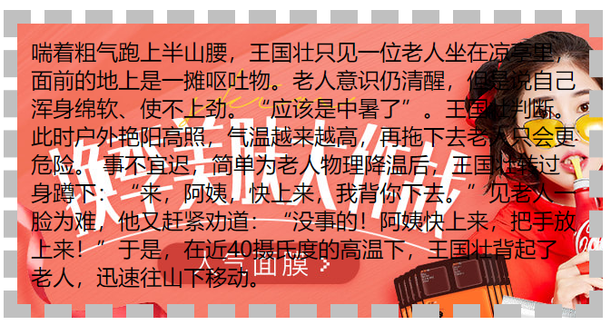 

- `border-box`：从边框开始平铺

  ```css
  .box {
    width: 600px;
    padding: 15px;
    font-size: 24px;
    border: 15px dashed silver;
    background-image: url(./images/gouwujie01.jpg);
    background-repeat: no-repeat;
    background-origin: border-box;
  }
  ```

  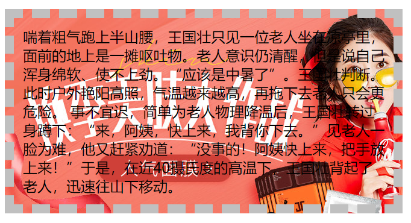 

- `content-box`：从内容区开始平铺

  ```css
  .box {
    width: 600px;
    padding: 15px;
    font-size: 24px;
    border: 15px dashed silver;
    background-image: url(./images/gouwujie01.jpg);
    background-repeat: no-repeat;
    background-origin: content-box;
  }
  ```

  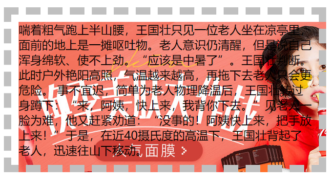 

- `background-origin` 往往都是配合 `background-position` 来使用，`background-origin` 定义了**相对于什么位置来定位**

  ```css
  .box {
  	border: 1px solid black;
    width: 400px;
  	padding: 35px;
  	background-image: url('album.png');
  	background-repeat: no-repeat;
  	background-position: left;
    background-origin: content-box;
  }
  ```

  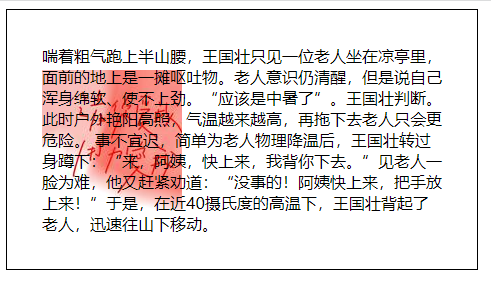 

- `background-attachment` 为 `fixed` 时，该属性将被忽略不起作用


## 背景附着 background-attachment

决定背景图像的位置是在视口内固定，或者随着包含它的区块滚动

`background-attachment : scroll | fixed | local`

- `scroll`：背景相对于元素本身固定， 而不是随着它的内容滚动

  ```css
  .box {
    width: 800px;
    height: 700px;
    overflow: scroll;
    background-image: url(../images/kobe01.jpg);
    background-attachment: scroll;
  }
  ```

   

  

- `local`：背景相对于元素的内容固定，如果一个元素拥有滚动机制，背景将会随着元素的内容滚动

  ```css
  .box {
    width: 800px;
    height: 700px;
    overflow: scroll;
    background-image: url(../images/kobe01.jpg);
    background-attachment: local;
  }
  ```

   

- `fixed`：背景相对于视口固定，即使一个元素拥有滚动机制，背景也不会随着元素的内容滚动

  ```css
  .box {
    width: 800px;
    height: 700px;
    overflow: scroll;
    background-image: url(../images/kobe01.jpg);
    background-attachment: fixed;
  }
  ```

   

- 可以制作视差滚动效果


## 背景裁剪 background-clip

设置背景图片或背景颜色是否延伸到边框、内边距盒子、内容盒子下面

`background-clip: border-box | padding-box | content-box | text`

 

- `border-box`：从边框开始裁剪，保留边框内部的背景，默认

  ```css
  .box {
    width: 600px;
    padding: 15px;
    font-size: 24px;
    border: 15px dashed silver;
    background-image: url(./images/gouwujie01.jpg);
    background-repeat: no-repeat;
    background-origin: border-box;
    background-clip: border-box;
  }
  ```

  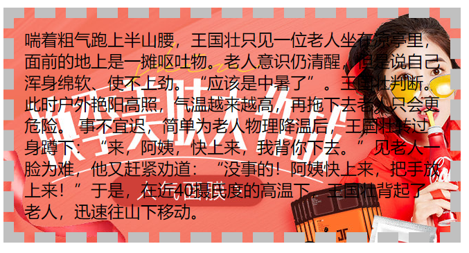 

- `padding-box`：从内边距开始裁剪，保留内边距内部的背景

  ```css
  .box {
    width: 600px;
    padding: 15px;
    font-size: 24px;
    border: 15px dashed silver;
    background-image: url(./images/gouwujie01.jpg);
    background-repeat: no-repeat;
    background-origin: border-box;
    background-clip: padding-box;
  }
  ```

  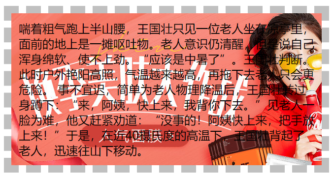 

- `content-box`：从内容区开始裁剪，保留内容区内部的背景

  ```css
  .box {
    width: 600px;
    padding: 15px;
    font-size: 24px;
    border: 15px dashed silver;
    background-image: url(./images/gouwujie01.jpg);
    background-repeat: no-repeat;
    background-origin: border-box;
    background-clip: content-box;
  }
  ```

  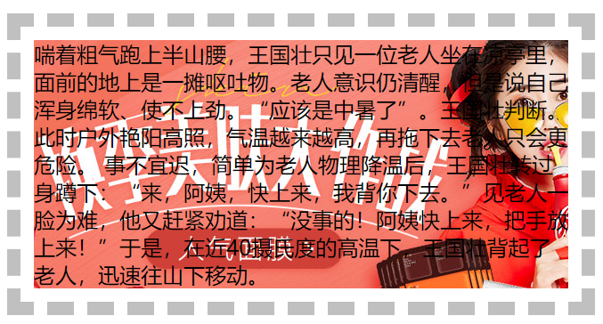 

- `text`：背景被裁剪成文字的前景色

  ```css
  .box {
    width: 300px;
    height: 300px;
    font-size: 70px;
    font-weight: 900;
    text-align: center;
    background-image: url(./images/Rotating_earth.gif);
    background-clip: text;
    -webkit-background-clip: text;
    color: transparent;
  }
  ```

  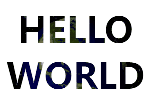 


## 背景简写属性 background

`background: 背景颜色 背景图片 背景图片位置/背景图片缩放 背景平铺 背景图像滚动 背景区域 背景裁剪`

```css
.box {
  width: 600px;
  height: 600px;
  background: transparent url("image.png") center/80% no-repeat fixed;
}
```

- 属性可以省略，顺序任意
- `/background-size` 必须紧跟在 `background-position` 的后面
- 关键字 `border-box`、`padding-box`、`content-box` 出现 1 次，代表同时设定了 `background-origin` 和 `background-clip`；如果出现两次，第一个代表 `background-origin`，第二个代表 `background-clip`


## 剪裁 clip-path

`clip-path: url(image.jpg) 形状函数 `

- 容器的原本大小和站位是不变的


## 精灵图

精灵主要利用背景图片的使用，把**多个小背景图片整合到一张大图片中**，大图片被称为 sprites 精灵图

精灵图可以**减小图片总大小**，**减少网页的 http 请求数量**，加快网页响应速度，减轻服务器压力

- 制作精灵图

  生成精灵图网站 https://www.toptal.com/developers/css/sprite-generator

- 获取精灵图位置

  http://www.spritecow.com/

- 使用精灵图

  1. **设置对应元素的宽度和高度**

  2. 设置精灵图作为**背景图片** 

  3. 使用 `background-position` **移动背景图片位置**来展示

     移动的距离就是这个目标图片的 x 和 y 坐标

     往上往左移动都是负值

     图片想要缩小的时候，`background-size` 和 `background-position` 都要等比例缩小 

  ```css
  .box {
    background: #333;
  }
  .topbar {
    background-image: url(../images/topbar_sprite.png);
    background-repeat: no-repeat;
    display: inline-block;
  }
  i.hot-icon {
    background-position: -192px 0;
    width: 26px;
    height: 13px;
  }
  i.logo-icon {
    background-position: 0 -19px;
    width: 157px;
    height: 33px;
  }
  ```
  
  ```html
  <div class="box">
    <i class="topbar hot-icon"></i>
    <i class="topbar logo-icon"></i>
  </div>
  ```
  
   

- 使用精灵图制作组合按钮

    

  按钮背景图片开始有圆角，结尾没有圆角，结尾的圆角被单独切出来 

  两者组合在一起才是一个完整的按钮背景

  这样去做的目的在于，按钮的长度是不固定的

  ```html
  <a class="btn btn-sprite btn-end" href="#">
    <span class="btn-sprite btn-start">我是按钮</span>
  </a>
  ```

  ```css
  .btn {
    width: 100px;
  }
  .btn-sprite {
    display: inline-block;
    background: url(../images/btn_sprite.png) no-repeat;
    height: 31px;
    line-height: 31px;
    text-align: center;
  }
  .btn-end {
    background-position: right -100px;
    /* 把右侧圆角边框挤出来 */
    padding-right: 5px;
  }
  .btn-start {
    /* 转换为块级元素占据全部空间 */
    display: block;
    background-position: 0 -59px;
    /* 右侧多了一块圆角边框，需要把文字也往右侧推，做到看起来居中 */
    padding-left: 3px;
  }
  ```

    


# 定位样式

## 标准流

默认情况下元素都是按照标准流进行排布，从左到右、从上到下按顺序摆放好，互相之间不存在层叠现象

 

- 在标准流中，可以使用 `margin`、`padding` 对元素进行定位，但是通常会影响到标准流中其他元素的位置，而且无法实现层叠效果

- 静态定位 `position: static`，默认的定位方式，元素安装标准流布局，`left`、`right`、`top`、`bottom` 没有任何作用


## 相对定位

`position: relative`

```css
.text {
  position: relative;
  left: 30px;
  top: 50px;
}
```

```html
<span>我是span元素1</span>
<span class="text">我是span元素2</span>
<span>我是span元素3</span>
```

 

- 元素**按照标准流布局**

- `left`、`right`、`top`、`bottom` 用来设置元素的具体位置

- 相对于自己原来的位置来移动的（**移动位置的时候参照点是自己原来的位置**）

- 原来在标准流的位置继续占有，后面的盒子仍然以标准流的方式对待它（**不脱标，继续保留原来的位置**）

- 相对定位的应用场景：在**不影响其他元素位置**的前提下，**对当前元素位置进行微调**

- 使用相对定位实现 `background-position: center` 效果

  ```css
  .box {
    height: 489px;
    background-color: #f00;
    overflow: hidden;
  }
  .box img {
    position: relative;
    left: -960px;
    margin-left: 50%;
  }
  ```

  ```html
  <div class="box">
    
  </div>
  ```

  1. 图片使用相对定位

      

  2. 图片向左 `left` 移动图片尺寸的一半长度

      

  3. 图片再向右移动盒子尺寸的一半长度 `margin-left: 50%`（由于响应式的需要，盒子宽度不固定，必须使用百分比来移动）

      

  > 这种情况仍然需要计算图片向左移动的具体尺寸，还是有缺陷
  >
  > 使用 `transform: translate(-50%)` 相对于自己元素的宽度进行移动
  >
  > ```css
  > .box img {
  >   /* translate中的百分比是相对于自己 */
  >   transform: translate(-50%);
  >   margin-left: 50%;
  > }
  > ```


## 固定定位

`position: fixed`

```css
.text {
  position: fixed;
  right: 30px;
  bottom: 30px;
}
```

```html
<span>我是span元素1</span>
<span class="text">我是span元素2</span>
<span>我是span元素3</span>
```

 

- 元素**脱离标准流布局**

- `left`、`right`、`top`、`bottom` 用来设置元素的具体位置

- 固定于浏览器可视区的位置，以浏览器的**可视窗口为参照点**

  > 视口（Viewport）和画布（Canvas）
  >
  > - 视口：文档的可视区域
  > - 画布：用于渲染文档的区域，文档内容超出视口范围，可以通过滚动查看
  >
  >  红框：视口；黑框：画布

- 固定定位不再占有原先的位置（**脱标，不保留原来的位置**）

- 参考**绝对定位元素特点**

- 使用固定定位让盒子固定到版心右侧

  ```css
  .w {
    width: 800px;
    height: 1400px;
    background-color: pink;
    margin: 0 auto;
  }
  .fixed {
    position: fixed;
    /* 1. 走浏览器宽度的一半 */
    left: 50%;
    /* 2. 利用margin 走版心盒子宽度的一半距离 */
    margin-left: 405px;
    width: 50px;
    height: 150px;
    background-color: skyblue;
  }
  ```
  
  ```html
  <div class="fixed"></div>
  <div class="w">版心盒子 800像素</div>
  ```
  
    


## 绝对定位

`position: absolute`

```css
.box {
  position: relative;
  width: 600px;
  height: 200px;
}
.text {
  position: absolute;
  right: 0;
  top: 0;
}
```

```html
<div class="box">
  <span>我是span元素1</span>
  <strong class="text">我是绝对定位元素</strong>
  <span>我是span元素3</span>
</div>
```

 

- 元素**脱离标准流布局**

- `left`、`right`、`top`、`bottom` 用来设置元素的具体位置

- 定位**参照对象是最邻近的定位祖先元素**，如果**找不到**定位祖先元素，参照对象是**视口**

- 大多数情况下，子元素的绝对定位都是相对于父元素进行定位（**子绝父相**）

  如果希望**子元素相对于父元素进行定位**，又**不希望父元素脱标**，父元素只能是相对定位

- 参考**绝对定位元素特点**


## 粘性定位

`position: sticky`

```css
.nav {
  background-color: #f00;
  color: #fff;
  position: sticky;
  top: 0;
}
```

```html
<h1>我是标题</h1>
<div class="nav">
  <span>电脑</span>
  <span>手机</span>
  <span>衣服</span>
  <span>鞋子</span>
</div>
<ul>
  <li>电脑列表1</li>
  <li>电脑列表2</li>
  <li>电脑列表3</li>
  ...
</ul>
```

 

- 可以看做是相对定位和固定(绝对)定位的结合体
- 被定位的元素表现得像相对定位一样，**直到它滚动到某个阈值点**，达到这个阈值点时，就会**变成固定(绝对)定位**
- 粘性定位**占有原先的位置**（相对定位特点）
- 以浏览器的**可视区为参照点**设置阈值点（固定定位特点）
- 必须添加 `top` `left` `right` `bottom` 其中一个才有效

- 一般和页面滚动搭配使用
- 兼容性较差，IE 不支持


## 绝对定位元素特点

绝对定位元素（absolutely positioned element）是**位置属性为 `absolute` 或 `fixed` 的元素**

- 不再受标准流的约束，**不再区分块级、行内级、行内块级**，可以**随意设置宽高**，**宽高默认由内容决定**

  ```css
  .box {
    position: relative;
    width: 400px;
    height: 200px;
  }
  strong {
    position: absolute;
    left: 0;
    bottom: 0;
    width: 200px;
    height: 60px;
  }
  ```

  ```html
  <div class="box">
    <span>我是span元素1</span>
    <strong>我是绝对定位元素</strong>
    <span>我是span元素2</span>
  </div>
  ```

   

- 不再给父元素汇报宽高数据

  ```css
  .box {
    display: inline-block;
    position: relative;
  }
  strong {
    position: absolute;
    left: 50px;
    top: 30px;
    width: 200px;
    height: 60px;
  }
  ```

   

- **脱标元素内部**默认还是按照**标准流布局**

- 设置绝对定位元素的**宽高相等**于定位参照对象

  - **宽度相等**：`left: 0`，`right: 0`，宽度省略

    ```css
    .relative {
      width: 800px;
      height: 300px;
      background-color: red;
      position: relative;
    }
    .absolute {
      height: 100px;
      background-color: green;
      position: absolute;
      left: 0;
      right: 0;
    }
    ```

     

    > 原理：
    >
    > *定位参照对象的宽度 = left + right + margin-left + margin-right + 绝对定位元素的实际占用宽度*
    >
    > 依此得出：参照对象宽度: 800px = left: 0 + right: 0 + margin-left: 0 + margin-right: 0 + 绝对定位宽度
    >
    > 交给浏览器计算后，得到绝对定位宽度等于参照对象宽度

  - **高度相等**：`top: 0`，`bottom: 0`，高度省略

    ```css
    .relative {
      width: 800px;
      height: 300px;
      background-color: red;
      position: relative;
    }
    .absolute {
      width: 200px;
      background-color: green;
      position: absolute;
      top: 0;
      bottom: 0;
    }
    ```

     

    > 原理：
    >
    > *定位参照对象的高度 = top + bottom + margin-top + margin-bottom + 绝对定位元素的实际占用高度*
    >
    > 依此得出：参照对象高度: 300px = top: 0 + bottom: 0 + margin-top: 0 + margin-bottom: 0 + 绝对定位高度
    >
    > 交给浏览器计算后，得到绝对定位高度等于参照对象高度

  - **宽高相等**：`left: 0`，`right: 0`，`top: 0`，`bottom: 0`，宽高省略

- 设置绝对定位元素在定位参照对象中**居中显示**

  加了绝对定位的盒子不能通过 `margin:0 auto` 水平居中

  **水平垂直居中方法**：`left: 0`，`right: 0`，`top: 0`，`bottom: 0`，`margin: auto`，定义宽高值

  ```css
  .relative {
    width: 800px;
    height: 300px;
    background-color: red;
    position: relative;
  }
  .absolute {
    width: 200px;
    height: 100px;
    background-color: green;
    position: absolute;
    left: 0;
    right: 0;
    top: 0;
    bottom: 0;
    margin: auto;
  }
  ```

   

  > 原理：
  >
  > *定位参照对象的宽度 = left + right + margin-left + margin-right + 绝对定位元素的实际占用宽度*
  >
  > *定位参照对象的高度 = top + bottom + margin-top + margin-bottom + 绝对定位元素的实际占用高度*
  >
  > 依此得出：参照对象宽度: 800px = left: 0 + right: 0 + margin-left: auto + margin-right: auto + 绝对定位宽度 200px
  >
  > ​                   参照对象高度: 300px = top: 0 + bottom: 0 + margin-top: auto  + margin-bottom: auto + 绝对定位高度 100px
  >
  > 交给浏览器计算后，四个 margin 自动平均分配了剩余长度


## 定位总结

| 定位模式            | 是否脱标 | 定位参照对象                             |
| ------------------- | -------- | ---------------------------------------- |
| `static` 静态定位   | 否       |                                          |
| `relative` 相对定位 | 否       | 元素自己原来的位置                       |
| `absolute` 绝对定位 | 是       | 最邻近的定位祖先元素（没找到，参照视口） |
| `fixed` 固定定位    | 是       | 视口                                     |
| `sticky` 粘性定位   | 否       | 视口                                     |

- 脱标的元素可以直接设置高度和宽度，宽高默认由内容决定
- 脱标的盒子不会触发外边距合并的问题
- 绝对定位、固定定位、滚动到阈值点的粘性定位，会压住下面标准流所有的内容；浮动元素，只会压住下面标准流的盒子，不会压住下面标准流盒子内的文字、图片


## 叠放次序 z-index

设置定位元素的层叠顺序

- 只有定位的盒子才有 `z-index` 属性

- 数值可以是正整数，负整数，或 0，默认是 auto

- **兄弟关系**的比较原则

  `z-index` 越大，层叠在越上面，如果 `z-index` 相等，写在后面的那个元素层叠在上面

  ```css
  .item {
    position: absolute;
    width: 100px;
    height: 100px;
  }
  .box1 {
    left: 0;
    top: 0;
    background-color: #f00;
  }
  .box2 {
    left: 20px;
    top: 20px;
    background-color: #0f0;
    z-index: -1;
  }
  .box3 {
    left: 40px;
    top: 40px;
    background-color: #00f;
  }
  ```

  ```html
  <!-- 未设置 --->
  <div class="item box1">1</div>
  <!-- z-index: -1 -->
  <div class="item box2">2</div>
  <!-- 未设置 --->
  <div class="item box3">3</div>
  ```

   

- **不是兄弟关系**的比较原则

  1. 从元素自己以及祖先元素中，找出**与对方平级的祖先定位元素**进行比较，这个定位元素必须有设置 `z-index`
  2. 如果找出的祖先定位元素没有设置 `z-index`，则使用元素自己的 `z-index` 进行比较
  3. 如果元素自己没有设置 `z-index`，则按照先后顺序决定叠放次序

  ```css
  .item {
    position: absolute;
    width: 100px;
    height: 100px;
  }
  .box1 {
    left: 0;
    top: 0;
    background-color: #f00;
    z-index: 1;
  }
  .box2 {
    left: 20px;
    top: 20px;
    background-color: #0f0;
    z-index: -1;
  }
  .box3 {
    left: 40px;
    top: 40px;
    background-color: #00f;
  }
  .sub-item {
    position: absolute;
    width: 80px;
    height: 80px;
  }
  .sub-box2 {
    position: absolute;
    z-index: 999;
    background-color: yellow;
  }
  .sub-box3 {
    position: absolute;
    background-color: pink;
    z-index: 99;
  }
  ```

  ```html
  <!-- z-index: 1 -->
  <div class="item box1">1</div>
  <!-- z-index: -1 -->
  <div class="item box2">
    <!-- z-index: 999 -->
    <div class="sub-item sub-box2">2</div>
  </div>
  <!-- 未设置 --->
  <div class="item box3">
    <!-- z-index: 99 -->
    <div class="sub-item sub-box3">3</div>
  </div>
  <!-- sub-box2会找到box2，来和box1与box3进行比较  -->
  <!-- sub-box3会找到box3，但是box3没有设置z-index，所以sub-box3来和box1与box2进行比较  -->
  ```

   


# 浮动样式

## 浮动

`float` 属性可以指定一个元素应**沿其容器的左侧或右侧放置**，允许**文本和内联元素环绕**它

通过 `float` 属性让元素产生浮动效果：`none` 不浮动（默认）， `left` 向左浮动， `right` 向右浮动

- 浮动的元素会**脱离标准流**，**向左或向右方向移动**，直到自己的**边界紧贴着包含块**（父元素）**或者其他浮动元素的边界**为止

  浮动元素的左（右）**边界不能超出包含块**的左（右）边界

  ```css
  .box {
    width: 200px;
    height: 200px;
    background-color: orange;
  }
  .item1, .item2 {
    width: 40px;
    height: 40px;
  }
  .item1 {
    float: left;
    background-color: #0f0;
  }
  .item2 {
    float: right;
    background-color: #f00;
  }
  ```

  ```html
  <div class="box">
    <div class="item1">1</div>
    <div class="item2">2</div>
  </div>
  ```

   

  浮动的盒子不**再保留原先的位置**，**定位元素会层叠在浮动元素上面**

   

- **浮动元素之间不能层叠**

  如果一个元素浮动，另一个浮动元素已经在那个位置了，**后浮动的元素将紧贴着前一个浮动元素**（左浮找左浮，右浮找右浮）

  如果**水平方向剩余的空间不够**显示浮动元素，浮动元素**将另起一行**，直到有充足的空间为止

  浮动的元素会**互相贴靠在一起，不会有缝隙**，并且元素顶部对齐排列

  ```css
  .container {
    width: 390px;
    height: 250px;
    background-color: orange;
  }
  .item {
    width: 100px;
    float: left;
  }
  .box1 {
    background-color: red;
    height: 50px;
  }
  .box2 {
    background-color: green;
    height: 60px;
  }
  .box3 {
    background-color: blue;
    height: 70px;
  }
  .box4 {
    background-color: yellow;
    height: 80px;
  }
  ```

  ```html
  <div class="container">
    <div class="item box1">1</div>
    <div class="item box2">2</div>
    <div class="item box3">3</div>
    <div class="item box4">4</div>
  </div>
  ```

   

- 浮动元素**不能与行内级内容层叠**，行内级内容将会被浮动元素推出

   浮动元素不会压住：行内级元素、inline-block 元素、块级元素的文字内容

- 浮动的元素会具有**行内块元素**的特性

  如果**行内元素有了浮动**，就**不需要转换块级/行内块元素**，可以给元素**赋值高度和宽度**，宽高默认根据内容决定

  浮动的盒子不会有外边距合并的问题


## 浮动布局

- **固定宽度的版心**中，浮动盒子**添加间距布局**案例

  > 版心固定宽度 1190px 
  >
  > 每个浮动盒子宽度 230px
  >
  > 盒子之间间距 10px
  >
  > 每行展示 5 个盒子
  >
  >  
  >
  > 如果每个盒子后都添加 `margin-right: 10px` 的话
  >
  > 总长度将超过 1190px
  >
  > (230px + 10px) * 5  = 1200px
  >
  >  
  >
  > 因此，除了第 5 个盒子以外
  >
  > 其他每个盒子需要添加 `margin-right: 10px`
  >
  > 1190px = 230px * 5 + 10px *4
  >
  >  
  >
  >  
  >
  > 去除第 5 个盒子外边距的方法：
  >
  > 1. 使用结构伪类 `nth-child` 来取消第 5 个盒子的外边距，但是**有兼容性问题**
  > 2. 给第 5 个盒子添加消除外边距的个别样式类，比较麻烦
  >
  > 3. **再添加一个容器包裹盒子，为新添加的容器盒子添加 `margin-right` 为负的布局盒子的外边距长度**
  >
  >    在这里就是 `margin-right: -10px`
  >
  >    原理：*父盒子宽度 = 子盒子宽度 + margin-left + margin-right*
  >
  >    父宽度: 1190px = 子宽度: auto + ml: 0 + mr: -10 ，浏览器计算得出，新添加的盒子容器宽度为 1200px

  ```html
  <!-- 内容显示固定 1190px -->
  <div class="content">
    <div class="box">
      <div class="item item1">1</div>
      <div class="item item2">2</div>
      <div class="item item3">3</div>
      <div class="item item4">4</div>
      <div class="item item5">5</div>
    </div>
  </div>
  ```

  ```css
  .content {
    width: 1190px;
    margin: 0 auto;
    background-color: orange;
    height: 800px;
  }
  .box {
    margin-right: -10px;
    /* margin: 0 -5px; */
  }
  .item {
    width: 230px;
    height: 322px;
    background-color: purple;
    color: #fff;
    float: left;
    margin-right: 10px;
    /* margin: 0 5px; */
  }
  ```

     


## 清除浮动

由于浮动元素脱离了标准流，变成了**脱标**元素，所以**不再向父元素汇报高度**

父元素计算总高度时，就**不会计算浮动子元素的高度**，导致了高度坍塌的问题

 

清除浮动就是让**父元素计算总高度的时候，把浮动子元素的高度算进去**

使用 `clear` 属性清除浮动

```css
.line {
  clear: both;
}
```

- `clear` 属性可以指定一个元素是否必须移动到在它之前的浮动元素下面

- 常用取值：`left`、`right`、`both`、`none`

  实际上只使用 `both`：要求**元素的顶部低于之前生成的所有浮动元素的底部**

**清除浮动方法**

1. 父元素设置固定高度，不推荐

2. 在父元素最后增加一个空的块级子元素，并且让它设置 `clear: both`，会增加无意义空标签

3. 父元素添加 `overflow: hidden | auto | scroll`，缺点是无法显示溢出的部分

4. **父元素添加  `clear: both` 清除浮动的伪元素**

   ```html
   <div class="wrapper clear-fix">
     <div class="item left"></div>
     <div class="item left"></div>
     <div class="item right"></div>
     <div class="item right"></div>
   </div>
   ```

   ```css
   .clear-fix::after {
     content: "";
     clear: both;
     display: block;
     /* 浏览器兼容 */
     visibility: hidden;
     height: 0;
   }
   .clear_fix {
     /* IE6/7兼容 */
     *zoom: 1;
   }
   ```

   父级添加双伪元素清除浮动的写法

   ```css
   .clear-fix::before,
   .clear-fix::after {
     content: "";
     display: table;
   }
   .clear-fix::after {
     clear: both;
   }
   .clear-fix {
     *zoom: 1;
   }
   ```

   


# 弹性布局

弹性布局是一种用于**按行或按列布局元素**的**一维布局**方法

采用弹性布局的元素称为**弹性容器**（flex container），其中所有直接子元素称为**弹性项**（flex item）

  

任何一个容器都可以指定为弹性布局


## 弹性容器

### 开启弹性布局

- 块级盒子的弹性容器 `display: flex`

  ```css
  .box {
    display: flex;
    background-color: red;
  }
  ```

   

- 行内级盒子的弹性容器 `display: inline-flex`

  ```css
  .box {
    display: inline-flex;
    background-color: red;
  }
  ```

   


### 主轴方向 flex-direction

弹性项默认都是沿着主轴 （main axis）从 main start 开始往 main end 方向排布

 主轴侧轴（交叉轴）相当于行和列，x 和 y

 默认主轴方向就是 x 轴方向，水平向右

 默认侧轴（交叉轴）方向就是 y 轴方向，水平向下


`flex-direction` 设置的是主轴，**另一个就是交叉轴**（侧轴）

`flex-direction` 决定了**主轴的方向**，弹性项跟着主轴方向来排列

- `row` ：从左到右，默认

  ```css
  .container {
    display: flex;
  }
  ```

   

- `row-reverse ` ：从右到左

  ```css
  .container {
    display: flex;
    flex-direction: row-reverse;
  }
  ```

   

- `column`：从上到下

  ```css
  .container {
    display: flex;
    flex-direction: column;
  }
  ```

   

- `column-reverse`：从下到上

  ```css
  .container {
    display: flex;
    flex-direction: column-reverse;
  }
  ```

   


### 容器换行 flex-wrap

`flex-wrap` 决定了弹性容器是单行还是多行

- `nowrap`：默认，单行显示；如果**装不开**，会**缩小子元素的宽度**，再到父元素里面

  ```css
  .container {
    display: flex;
  }
  ```

   

- `wrap`：多行显示

  ```css
  .container {
    display: flex;
    flex-wrap: wrap;
  }
  ```

   

- `wrap-reverse`：多行显示，相反的顺序

  ```css
  .container {
    display: flex;
    flex-wrap: wrap-reverse;
  }
  ```

   


### 排布方式简写属性 flex-flow

``flex-flow`` 属性是 `flex-direction` 和 `flex-wrap` 的简写

顺序任意，并且都可以省略

```css
.container {
  display: flex;
  /* flex-direction: row-reverse; */
  /* flex-wrap: wrap-reverse; */
  flex-flow: row-reverse wrap-reverse;
}
```


### 主轴对齐 justify-content 

`justify-content` 定义了弹性项在**主轴**上的对齐方式

- `flex-start`：与主轴头部对齐，默认

  ```css
  .container {
    display: flex;
    /* justify-content: flex-start; */
  }
  ```

   

- `flex-end`：与主轴尾部对齐

  ```css
  .container {
    display: flex;
    justify-content: flex-end;
  }
  ```

   

- `center`：居中对齐

  ```css
  .container {
    display: flex;
    justify-content: center;
  }
  ```

   

- `space-between`：先两头贴边，再平分剩余空间，弹性项之间的间距相等

  ```css
  .container {
    display: flex;
    justify-content: space-between;
  }
  ```

   

- `space-around`：平分剩余空间，弹性项之间的间距相等，两端的间距是弹性项之间的间距一半

  ```css
  .container {
    display: flex;
    justify-content: space-around;
  }
  ```

   

- `space-evenly`：平分剩余空间，弹性项之间的间距相等，两端的间距与弹性项之间的间距也相等

  ```css
  .container {
    display: flex;
    justify-content: space-around;
  }
  ```

   

**解决多行弹性项布局不对齐问题**

  

解决办法：**在弹性项后添加**与弹性项**相同宽度的空白元素**，添加的**个数是列数减 2**（不要设置高度，多余添加的不会显示）

```html
<div class="container">
  <div class="item">1</div>
  <div class="item">2</div>
  <div class="item">3</div>
  <div class="item">4</div>
  <div class="item">5</div>
  <div class="item">6</div>
  <div class="item">7</div>
  <div class="item">8</div>
  <div class="item">9</div>
  <div class="item">10</div>
  <div class="item">11</div>
  <!-- 添加span的个数是列数减-2 -->
  <span></span>
  <span></span>
</div>
```

```css
.container {
  width: 500px;
  display: flex;
  flex-wrap: wrap;
  justify-content: space-between;
}
.item {
  width: 110px;
  height: 140px;
}
/* 宽度和弹性项相同，高度不设置 */
.container > span {
  width: 110px;
}
```

  


### 侧轴单行对齐 align-item

`align-items` 设置弹性项在侧轴上的排列方式

- `normal`：在弹性布局中，**效果和 `stretch` 一样，默认**

- `stretch`：拉伸填满剩余空间，**弹性项在侧轴方向的 size 需要为 `auto`** 

   

  ```css
  .container {
    width: 500px;
    height: 500px;
    display: flex;
    align-items: stretch;
  }
  .item {
    width: 120px;
  }
  .item1 {
    height: 80px;
  }
  .item2 {
    height: 150px;
  }
  .item3 {
    height: 60px;
  }
  ```

  ```html
  <div class="container">
    <div class="item item1">1</div>
    <div class="item item2">2</div>
    <div class="item item3">3</div>
    <!-- 没有设置固定高度 -->
    <div class="item item4">4</div>
  </div>
  ```

   

- `flex-start`：与侧轴头部对齐

  ```css
  .container {
    display: flex;
    align-items: flex-start;
  }
  ```

   

- `flex-end`：与侧轴尾部对齐

  ```css
  .container {
    display: flex;
    align-items: flex-end;
  }
  ```

   

- `center`：居中对齐

  ```css
  .container {
    display: flex;
    align-items: center;
  }
  ```

   

- `baseline`：与基准线对齐

  ```css
  .container {
    display: flex;
    align-items: baseline;
  }
  ```

   


### 侧轴多行对齐 align-content

`align-content` 设置**多行**弹性项在侧轴上的对齐方式

只能用于子项出现了换行的情况（多行），单行下是没有效果的

- `stretch`：**拉伸所有行**来填满剩余空间，剩余空间平均分配给每一行，**弹性项在侧轴方向的 size 需要为 `auto`**，默认

  ```css
  .container {
    display: flex;
    align-content: stretch;
  }
  ```

   

- `flex-start`：与侧轴的头部对齐

  ```css
  .container {
    display: flex;
    align-content: flex-start;
  }
  ```

   

- `flex-end`：与侧轴的尾部对齐

  ```css
  .container {
    display: flex;
    align-content: flex-end;
  }
  ```

   

- `center`：居中对齐

  ```css
  .container {
    display: flex;
    align-content: center;
  }
  ```

   

- `space-between`：先两头贴边，再平分侧轴剩余空间，弹性项之间的间距相等

  ```css
  .container {
    display: flex;
    align-content: space-between;
  }
  ```

   

- `space-around`：平分侧轴剩余空间，弹性项之间的间距相等，两端的间距是弹性项之间的间距一半

  ```css
  .container {
    display: flex;
    align-content: space-around;
  }
  ```

   

- `space-evenly`：平分侧轴剩余空间，弹性项之间的间距相等，两端的间距与弹性项之间的间距也相等

  ```css
  .container {
    display: flex;
    align-content: space-evenly;
  }
  ```

   


## 弹性项

### 弹性项特点

- 弹性项的布局**将受弹性容器属性的设置来进行控制和布局**
- 弹性项**不再严格区分块级元素和行内级元素**
- 弹性项**可以设置宽度和高度**，**默认**情况下是**包裹内容**的


### 个别项侧轴对齐 align-self

弹性项可以通过 `align-self` **覆盖弹性容器设置的 `align-items`**，允许**单个项目有与其他项目不一样的对齐方式**

```css
.container {
  display: flex;
  align-items: flex-start;
}
.item3 {
  align-self: flex-end;
}
```

 

- 默认为 `auto`，继承父元素的 `align-items` 属性
- `stretch`、`flex-start`、`flex-end`、`center`、`baseline`，效果跟 `align-items` 中一致


### 排布顺序 order

`order` 决定了弹性项的排布顺序

可以设置任意整数（正整数、负整数、0），值越小就越排在前面，默认值是 0

```css
.container {
  width: 500px;
  height: 500px;
  display: flex;
}
.item {
  width: 120px;
  height: 120px;
}
.item1 {
  order: 5;
}
.item2 {
  order: 3;
}
.item3 {
  order: 9;
}
```

```html
<div class="container">
  <div class="item item1">1</div>
  <div class="item item2">2</div>
  <div class="item item3">3</div>
</div>
```

 


### 扩展剩余空间 flex-grow

`flex-grow` 决定了弹性项扩展剩余空间的系数

- 可以设置任意非负数字（正小数、正整数、0），默认值是 0

- 当弹性容器在**主轴方向上有剩余长度时**，`flex-grow` 属性**才会有效**

- 弹性项扩展后的最终长度不能超过 `max-width` \ `max-height`

- 如果所有弹性项的 `flex-grow` 总和超过 1，每个弹性项扩展的长度为：

  ```html
  <div class="container">
    <div class="item item1">1</div>
    <div class="item item2">2</div>
    <div class="item item3">3</div>
  </div>
  ```

  ```css
  .container {
    width: 500px;
    height: 500px;
    display: flex;
  }
  .item {
    width: 120px;
    height: 120px;
    flex-grow: 0;
  }
  .item1 {
    flex-grow: 1;
  }
  .item2 {
    flex-grow: 1.5;
  }
  ```

  > ***弹性项扩展的长度 = 弹性容器的剩余长度  \* 当前弹性项的 flex-grow / 所有弹性项 flex-grow总和***
  >
  > item1 的扩展长度 = 容器剩余长度: 140px * 1 / (1 + 1.5) = 56px
  >
  > item2 的扩展长度 = 容器剩余长度: 140px * 1.5 / (1 + 1.5) = 84px
  >
  > item1最终长度：120px + 56px = 176px
  >
  > item2 最终长度：120px + 84px = 204px

   
  
- `flex-grow` 和 `white-space: nowrap` 存在冲突

  ```html
  <div class="item">
    <div class="album">
      
    </div>
    <div class="info">
      <div class="desc">登录网易云音乐，可以享受无限收藏的乐趣，并且无限同步到手机</div>
    </div>
  </div>
  ```

  ```css
  .item {
    display: flex;
    width: 350px;
    height: 140px;
    line-height: 140px;
    background-color: lightblue;
  }
  .info {
    flex-grow: 1;
  }
  .desc {
    font-size: 20px;
    /* 文本超出后显示... */
    white-space: nowrap;
    text-overflow: ellipsis;
    overflow: hidden;
  }
  ```

   

  为设置 `flex-grow` 的属性，设置 `overflow: hidden`

  ```css
  .info {
    flex-grow: 1;
    overflow: hidden;
  }
  ```

   


### 弹性项收缩 flex-shrink

`flex-shrink` 指定了弹性项的收缩系数

- 可以设置任意非负数字（正小数、正整数、0），默认值是 1，0 是不收缩

- 当弹性项在**主轴方向上超过了弹性容器的长度**，`flex-shrink` 属性才会有效

- 弹性项收缩后的最终长度不能小于 `min-width` \ `min-height`

- 如果所有弹性项的 `flex-shrink` 总和超过 1，每个弹性项收缩的长度为：

  ```html
  <div class="container">
    <div class="item item1">1</div>
    <div class="item item2">2</div>
    <div class="item item3">3</div>
    <div class="item item4">4</div>
    <div class="item item5">5</div>
  </div>
  ```

  ```css
  .container {
    width: 500px;
    height: 500px;
    display: flex;
  }
  .item {
    width: 120px;
    height: 120px;
    flex-shrink: 0;
  }
  .item1 {
    flex-shrink: 1;
  }
  .item2 {
    flex-shrink: 1.5;
  }
  ```

  > ***弹性项收缩的长度 = 超出弹性容器长度  \* 当前弹性项的 flex-shrink/ 所有弹性项 flex-shrink总和***
  >
  > item1 的收缩长度 = 超出容器长度: 100px * 1 / (1 + 1.5) = 40px
  >
  > item2 的收缩长度 = 超出容器长度: 100px * 1.5 / (1 + 1.5) = 60px
  >
  > item1最终长度：120px - 40px = 80px
  >
  > item2 最终长度：120px - 60px = 60px

   


### 基础尺寸 flex-basis

`flex-basis` 用来设置弹性项在主轴方向上的基础尺寸

- 取值：`auto`（默认值）、具体的宽度数值（100px）
- 决定弹性项最终基础尺寸的因素，从优先级高到低
  - `max-width` \ `max-height` \ `min-width` \ `min-height`
  - `flex-basis`
  - `width` \ `height`
  - 内容本身的尺寸

```html
<div class="container">
  <div class="item item1">1</div>
  <div class="item item2">2_Hello_world_hahahaha</div>
  <div class="item item3">3</div>
</div>
```

```css
.container {
  width: 500px;
  height: 500px;
  display: flex;
}
.item {
  /* width: 120px; */
  flex-basis: 120px;
  height: 120px;
}
```

设置 `flex-basis: 120px` 的结果，会根据内容自动扩展

 

设置 `width: 120px` 的结果

 


### 简写属性 flex

`flex` 是 `flex-grow` || `flex-shrink` || `flex-basis` 的简写，`flex` 属性可以指定 1 个，2 个或 3 个值

- 单值语法：值必须为以下其中之一

  - `flex-grow`，一个无单位数

    ```css
    /* flex-grow: 1; */
    flex: 1;
    ```

  - `flex-basis`，一个有效的宽度值

    ```css
    /* flex: 10px; */
    flex: 10px;
    ```

  - 关键字 `none`，`auto` 或 `initial`

- 双值语法

  - 第一个值必须为 `flex-grow` ，一个无单位数

  - 第二个值必须为以下之一

    - `flex-shrink`，一个无单位数

      ```css
      /* flex-grow: 1; */
      /* flex-shrink: 2; */
      flex: 1 2;
      ```

    - `flex-basis`，一个有效的宽度值

      ```css
      /* flex-grow: 1; */
      /* flex-basis: 30px; */
      flex: 1 30px;
      ```

- 三值语法

  - 第一个值必须为 `flex-grow`，一个无单位数
  - 第二个值必须为 `flex-shrink`，一个无单位数
  - 第三个值必须为 `flex-basis`， 一个有效的宽度值

  ```css
  /* flex-grow: 1; */
  /* flex-shrink: 2; */
  /* flex-basis: 10px; */
  flex: 1 2 10px;
  ```


# 形变样式

## 形变 transform

`transform` 属性允许对某一个元素进行某些形变，包括旋转，缩放，倾斜或平移等

- `transform` 对于**行内级非替换元素是无效的**，例如 `<span>`、`<a>` 等

- 可以给 `transform` **设置多个形变的函数**

  ```css
  transform: translate(50px) scale(1.2) rotate(45deg);
  ```

- 顺序会影响转换效果（先旋转会改变坐标轴的方向）

- 同时有位移和其他函数的时候，要把位移放到最前


## 位移函数 translate

`translate(x, y)` 用于移动元素在平面上的位置

```css
.container {
  display: inline-block;
  border: 5px solid #f00;
}
.box {
  width: 200px;
  height: 200px;
  transform: translate(100px, 100px);
  background-color: orange;
}
```

```html
<div class="container">
  <div class="box"></div>
</div>
```

 

- 一个参数时，设置 x 轴上的位移

  ```css
  /* transform: translateX(100px); */
  transform: translate(100px);
  ```

- 二个参数时，设置 x 轴和 y 轴上的位移

  ```css
  /* transform: translateX(100px) translateY(100px); */
  transform: translate(100px, 100px);
  ```

- 参数类型：数字（100px），**百分比（参照元素本身的宽度或高度）**

- 优点：**不会影响到其他元素的位置**

- `translate` 是 `translateX` 和 `translateY` 函数的简写

- 使用 `translate` 让盒子水平垂直居中

  - **垂直居中**：
    1. 元素向下位移父元素的 50% `top: 50%`
    2. 元素向上位移自身的 50% `tranform: translate(0, -50%)`
  - **水平居中**：
    1. 元素向右位移父元素的 50% `left: 50%`
    2. 元素向左位移自身的 50% `tranform: translate(-50%, 0)`

  ```html
  <div>
  	<p></p>
  </div>
  ```

  ```css
  div {
    width: 400px;
    height: 400px;
    background-color: pink;
  }
  p {
    position: relative;
    top: 50%;
    left: 50%;
    width: 200px;
    height: 200px;
    background-color: purple;
    tranform: translate(-50%, -50%);
  }
  ```

    


## 缩放函数 scale

`scale(x, y)` 函数可改变元素的大小

```css
.container {
  display: inline-block;
  border: 20px solid lightblue;
}
.box1 {
  width: 200px;
  height: 200px;
  background-color: purple;
}
.box1:hover {
  transform: scale(1.1, 1.1);
}
```

```html
<div class="container">
  <div class="box1"></div>
</div>
```

 

- 一个参数时，设置 x 轴上的缩放

  ```css
  /* transform: scaleX(1.1) */
  transform: scale(1.1);
  ```

- 二个参数时，设置 x 轴和 y 轴上的缩放

  ```css
  /* transform: scaleX(1.1) scaleY(1.1) */
  transform: scale(1.1, 1.1);
  ```

- 参数类型：数字（0~1：缩小、1：保持不变、大于1：放大）、百分比

  ```css
  transform: scale(0.5, 0.5);
  transform: scale(60%, 60%);
  ```

   

- 优点：**不会影响到其他元素的位置**

- `scale` 是 `scaleX` 和 `scaleY` 函数的简写

- 默认以中心点缩放，可以设置 `transform-origin` 修改缩放的中心点


## 旋转函数 rotate

`rotate(a)` 函数可将元素围绕一个定点旋转

- 参数：旋转的角度，单位 `deg`，正数为顺时针，负数为逆时针

  ```css
  .container {
    display: inline-block;
    border: 10px solid #f00;
  }
  .box {
    width: 200px;
    height: 100px;
    background-color: orange;
  }
  .box:hover {
    transform: rotate(45deg);
    /* transform: rotate(-45deg); */
  }
  ```

  ```html
  <div class="container">
    <div class="box"></div>
  </div>
  ```

     

- `rotate` 函数是` rotateZ` 函数的简写

- 默认旋转的中心点是元素的中心点，可以设置 `transform-origin` 修改旋转的中心点


## 倾斜函数 skew

`skew(x, y)` 函数定义了一个元素在二维平面上的倾斜转换

- 一个参数时，表示 x 轴上的倾斜

- 两个参数时，表示 x 轴和 y 轴上的倾斜

- 参数类型：倾斜的角度，单位 `deg`，正数为顺时针，负数为逆时针

  ```css
  .box {
    width: 200px;
    height: 100px;
  }
  .box:hover {
    transform: skew(10deg, 10deg);
  }
  ```

  ```html
  <div class="box"></div>
  ```

   

- 默认倾斜的中心点是元素的中心点，可以设置 `transform-origin` 修改倾斜的中心点


## 形变原点 transform-origin

`transform-origin` 属性可以更改一个元素变形的原点，例如 `scale` 缩放、 `rotate` 旋转的原点

- 一个参数时，设置 x 轴的原点

- 两个参数时，设置 x 轴和 y 轴的原点

- 参数值必须是：数值长度，百分比，或 `left`、`center`、`right`、`top`、`bottom` 关键字中的一个

  **数值长度：从元素本身的左上角开始计算**

  **百分比：参考元素本身大小**，默认中心点是 `50% 50%`

  ```css
  /* 默认中心点 */
  /* 等价于 transform-origin: center */
  transform-origin: 50% 50%;
  
  /* 等价于 transform-origin: right bottom */
  transform-origin: 100% 100%;
  
  /* 等价于 transform-origin: 0 0 */
  transform-origin: left top;
  
  /* 等价于 transform-origin: 50% 0 */
  transform-origin: center top;
  
  transform-origin: 40px 40px;
  ```

   


# 过渡动画

## 过渡 transition

`transitions` 提供了一种在**更改 CSS 属性时**控制**动画速度**的方法

- 可以让 CSS 属性变化成为一个**持续一段时间的过程**，而**不是立即生效**

  比如将一个元素从一个位置移动到另外一个位置，默认在修改完 CSS 属性后会立即生效

  但是可以通过 `transitions` 让这个过程加上一定的动画效果，包括一定的曲线速率变化

- `transition` 是 `transition-property`、`transition-duration`、`transition-timing-function`、`transition-delay` 的简写属性
  
  `transition: property duration timing-function delay`
  
  默认值：`transition: all 0 ease 0`
  
  - 哪些属性发生动画效果：`transition-property` 
  - 持续多久：`transition-duration`
  - 如何动画：`transition-timing-function`
  - 何时开始：`transition-delay`
  
  ```css
  .box {
    margin: 100px auto;
    width: 100px;
    height: 100px;
    background-color: skyblue;
    transition: all 2s ease .5s;
  }
  .box:hover {
    background-color: lightpink;
    width: 200px;
    height: 200px;
    transform: rotate(180deg);
  }
  ```
  
  ```html
  <div class="box"></div>
  ```
  
   
  
- 可以同时设置多个过渡动画，用逗号分隔

  ```css
  transition: width 2s ease, height 2s liner, background-color 2s, transform 2s;
  ```


## 过渡属性 transition-property

`transition-property` 指定应用过渡属性的名称

- 参数：执行动画的属性名称（如 `width`、`left`、`transform` 等），`all` 所有属性都执行动画、`none` 所有属性都不执行动画

  默认值 `all`，也可以同时设置多个属性名称，用逗号分隔

  可执行动画的 CSS 属性：https://developer.mozilla.org/zh-CN/docs/Web/CSS/CSS_animated_properties

   

  ```css
  .container {
    background-color: #f00;
  }
  .box {
    position: relative;
    left: 0;
    width: 200px;
    height: 100px;
    background-color: orange;
    /* 简写属性 */
    /* transition: all 1s ease-in; */
    /* all 代表的就是所有变化的属性 left、transform、width */
    /* 等价于 transition-property: left, transform, width */
    transition-property: all;
    transition-duration: 1s;
    transition-timing-function: ease-in;
  }
  .container:hover .box {
    left: 100px;
    transform: translate(100px);
    width: 500px;
  }
  ```

  ```html
  <div class="container">
    <div class="box"></div>
  </div>
  ```

   


## 过渡时间 transition-duration

`transition-duration` 指定过渡动画所需的时间

- 参数：时间，单位可以是秒（s）或毫秒（ms）；默认值是 0，表示没有效果

  ```css
  transition-duration: 6s;
  transition-duration: .5s;
  transition-duration: 120ms;
  ```

- 对应 `transition-property` 设置的属性列表，可以同时设置多个属性的过渡时间，用逗号分隔

  ```css
  transition-property: left, transform, width;
  transition-duration: 1s, 2s, 3s;
  ```


## 变化曲线 transition-timing-function

`transition-timing-function` 指定动画的变化曲线

- 参数：变化曲线函数

  `linear`：匀速

  ```css
  transition-timing-function: linear;
  ```

  `ease`：低速开始，然后加快，在结束前变慢，默认值

  ```css
  transition-timing-function: ease;
  ```

  `ease-in`：低速开始

  ```css
  transition-timing-function: ease-in;
  ```

  `ease-out`：低速结束

  ```css
  transition-timing-function: ease-out;
  ```

  `ease-in-out`：低速开始和结束

  ```css
  transition-timing-function: ease-in-out;
  ```

   

- 对应 `transition-property` 设置的属性列表，可以同时设置多个属性的变化曲线，用逗号分隔


## 延迟时间 transition-delay

`transition-delay` 指定过渡动画执行之前的等待时间

- 参数：时间，单位可以是秒（s）或毫秒（ms）；默认值是 0，表示没有延迟

  ```css
  transition-delay: 3s;
  transition-delay: 2s, 4ms;
  ```

- 对应 `transition-property` 设置的属性列表，可以同时设置多个属性的延迟时间，用逗号分隔


# 关键帧动画

## 动画 animation

`animation` 可以让动画有更多状态的变化

- 和 `animation` 相比 `transition` 的缺点

  `transition` 只能定义开始状态和结束状态，不能定义中间状态

  ``transition`` 不能重复执行，除非再触发动画

  `transition` 需要在特定状态下会触发才能执行，比如某个属性被修改了

- 使用 `animation` 定义动画的步骤

  1. 使用 `keyframes` 定义动画序列
  2. 配置动画执行的名称、持续时间、动画曲线、延迟、执行次数、方向等等

- `animation` 是简写属性，包含下列 6 个属性

  `animation: 动画名称 持续时间 变化曲线 延迟时间 播放次数 动画方向;`

  `animation: name duration timing-function delay iteration-count direction`

  ```css
  animation: moveAnim 3s linear 1s 2 normal forwards;
  ```


## 关键帧 @keyframes

`@keyframes` 用来定义多个变化状态，并且使用 `animation-name` 来声明匹配

- 关键帧使用**百分比**来指定**动画发生的时间点**

  `0%` 表示动画的**开始时刻**，`100%` 表示动画的**最终时刻**，或关键字 `from`（相当于 0%） 和 `to`（相当于 100%）

  ```css
  /* 定义动画 */
  @keyframes moveAnim {
    /* 动画开始时 */
    0% {
      transform: translate(0, 0) scale(0.5, 0.5);
    }
    /* 动画完成33％时 */
    33% {
      transform: translate(0, 200px) scale(1.2, 1.2);
    }
    /* 动画完成66％时 */
    66% {
      transform: translate(400px, 200px) scale(1, 1);
    }
    /* 动画结束时 */
    100% {
      transform: translate(400px, 0) scale(0.5, 0.5);
    }
  }
  ```

  ```css
  .box {
    width: 200px;
    height: 100px;
    background-color: orange;
    /* 指定.box要执行的动画名称 moveAnim */
    animation-name: moveAnim;
    animation-duration: 3s;
    animation-timing-function: ease-in-out;
    animation-fill-mode: forwards;
  }
  ```

  ```html
  <div class="box"></div>
  ```

   

- 在动画过程中，可以更改 CSS 样式的设定，逐步改变从一个 CSS 样式设定到另一个

  可以为动画过程设置为**空的 CSS 样式**，代表回到了**最初的状态**

  ```css
  @keyframes moveAnim {
    0% {}
    50% {
      transform: translateX(160px);
    }
    100% {}
  }
  ```

  ```css
  .container {
    display: inline-block;
    width: 200px;
    border: 1px solid silver;
  }
  .ball {
    width: 40px;
    height: 40px;
    border-radius: 50%;
    background-color: red;
    animation-name: moveAnim;
    animation-timing-function: linear;
    animation-duration: 2s;
  }
  ```

  ```html
  <div class="container">
    <div class="ball"></div>
  </div>
  ```

   

- 动画过程中的 CSS 属性都是相对于动画运行之前的元素的状态

  ```css
  @keyframes moveAnim {
    0% {}
    50% {
      /* left: 160px; */
      transform: translateX(160px);
    }
    100% {
      /* left: 160px; */
      transform: translateX(160px);
    }
  }
  ```

  0% 到 100% 之间没有动画，固定不动


## 动画名称 animation-name

`animation-name` 指定应用的动画名称，名称代表了 `@keyframes` 定义的动画

```css
animation-name: moveAnim;
```

- 参数：动画名，需要和 `@keyframes` 规定的动画名完全一致；默认值是 `none`，表示无关键帧，可以使动画失效


## 持续时间 animation-duration

`animation-duration` 指定一个**动画周期的时长**

```css
animation-duration: 4s
```

- 参数：时间，单位可以是秒（s）或毫秒（ms）
- 默认值是 0s，如果未指定 `animation-duration`，动画不会发生


## 变化曲线 animation-timing-function

`animation-timing-function` 定义动画在动画周期中执行的节奏

- 参数：变化曲线函数

  `linear`：匀速

  ```css
  transition-timing-function: linear;
  ```

  `ease`：低速开始，然后加快，在结束前变慢，默认值

  ```css
  transition-timing-function: ease;
  ```

  `ease-in`：低速开始

  ```css
  transition-timing-function: ease-in;
  ```

  `ease-out`：低速结束

  ```css
  transition-timing-function: ease-out;
  ```

  `ease-in-out`：低速开始和结束

  ```css
  transition-timing-function: ease-in-out;
  ```

   


## 延迟时间 animation-delay

`animation-delay` 定义动画延迟多久开始

- 参数：时间，单位可以是秒（s）或毫秒（ms）；默认值是 0，表示没有延迟

  ```css
  animation-delay: 2s;
  ```


## 播放次数 animation-iteration-count

`animation-iteration-count` 定义动画的播放次数

- 参数：数字 n，表示动画播放 n 次；关键字 `infinite`，表示动画**循环播放**

  ```css
  animation-iteration-count: 2;
  animation-iteration-count: 0.5;
  animation-iteration-count: infinite;
  ```


## 动画方向 animation-direction

`animation-direction` 定义动画的播放方向

- 常用参数关键词：

  `normal`：正方向播放，默认

  `reverse`：反方向播放

  ```css
  animation-direction: reverse; 
  ```

  `alternate`：先正方向播放，然后反方向播放（动画播放次数要大于1次）

  ```css
  animation-iteration-count: 2;
  animation-direction: alternate; 
  ```

  `alternate-reverse`：先反方向播放，然后正方向播放（动画播放次数要大于1次）

  ```css
  animation-iteration-count: 2;
  animation-direction: alternate-reverse; 
  ```

   


## 填充模式 animation-fill-mode

**`animation-fill-mode`** 设置执行动画最后保留哪一个值

- 参数：

  `none`：动画开始前和结束后都是初始状态，默认值

  ```css
  animation-fill-mode: none;
  ```

  `forwards`：动画结束后，保留动画最后一帧的状态

  ```css
  animation-fill-mode: forwards;
  ```

  `backwards`：动画开始前，获得动画第一帧的状态（在动画延迟期间）

  ```css
  animation-delay: 1s;
  animation-fill-mode: backwards;
  ```

  `both`：动画开始前获得第一帧的状态，动画结束后保留最后一帧的状态

  ```css
  animation-delay: 1s;
  animation-fill-mode: both;
  ```

   


## 播放状态 animation-play-state

`animation-play-state` 定义动画是否运行或者暂停

- 参数：`running` 播放，默认；`paused`：暂停

- 在 JavaScript 中使用，用于暂停动画

  ```javascript
  window.onload = function(){
    var oBall = document.getElementById("ball");
    var oBtnPause = document.getElementById("btn_pause");            
    var oBtnRun = document.getElementById("btn_run");
    //暂停
    oBtnPause.onclick = function(){
      oBall.style.animationPlayState = "paused";
    };
    //播放
    oBtnRun.onclick = function(){
      oBall.style.animationPlayState = "running";
    };
  }
  ```

   

- 恢复已暂停的动画，将从暂停的位置开始


# 其他样式

## 鼠标指针 cusor

设置鼠标指针（光标）在元素上面时的显示样式

```css
div {
  cursor: pointer;
}
```

- `auto`：默认，浏览器根据上下文决定的光标
- `none`：没有任何指针显示在元素上面
- `default`：系统默认光标（箭头）
- `pointer`：一只小手，链接默认样式 
- `text`：一条竖线，文本输入框默认样式 
- `crosshair`：十字，通常指示位图中的框选 
- 移动指针：`move` 移动 ，`grab` 抓取 ，`grabbing` 抓取中 
- 拉伸指针：`col-resize` 重设宽度 ，`ns-resize` 上下拉伸 ，`ew-resize` 左右拉伸  ，`nesw-resize` 角度拉伸 ，`nwse-resize` 角度拉伸 
- 缩放指针：`zoom-in` 放大 ，`zoom-out` 缩小 
- `not-allowed`：禁止，


## 指针事件目标 pointer-events

控制在什么条件下特定的图形元素可以成为指针事件的目标

- 适用于 HTML 元素的属性

  `auto` | `none` | `inherit`

- 适用于 SVG 元素的属性

  `visiblePainted` | `visibleFill` | `visibleStroke` | `visible` | `painted` | `fill` | `stroke` | `all` 

- `pointer-events: none` 该元素永远不会成为鼠标事件的目标，点击事件、`:hover`、`:active` 都会失效

  `pointer-events: none` 和 `cursor: not-allowed` 设置在同一个元素上，`cursor` 会失效，因为鼠标事件已经失效了

  同时使用两者可行的方案：

  ```css
  .wrapper {
    cursor: not-allowed;
  }
  .wrapper button {
    pointer-events: none;
  }
  ```

  ```html
  <div class="wrapper">
    <button>提交</button> 
  </div>
  ```


## 滚动捕捉

在**可滚动容器中**，容器对内部元素的**滚动位置进行捕捉**，规定了如何**处理滚动结束状态**

```css
ul {
  overflow: auto;
  white-space: nowrap;
  scroll-snap-type: x mandatory;
}
li {
  display: inline-block;
  width: 100%;
  height: 200px;
  scroll-snap-align: center;
  scroll-snap-stop: always;
}
```

 

- `scroll-snap-type` 将一个滚动容器转变为一个滚动捕捉容器，并且可以控制捕捉的严格度

  每次滚动之后，子元素最终的停留位置不是被分割，而是完整的呈现在容器内

  `scroll-snap-type: 捕捉轴向 捕捉严格度`

  - 捕捉轴向：`x` x 轴方向上的滚动、`y` y 轴方向上的滚动

  - 捕捉严格度：`none` 不捕捉、`mandatory` 精确捕捉、`proximity` 非精确捕捉

    `mandatory` 表示强制将滚动结束后的元素的停留到规定的位置，位置则由 `scroll-snap-align` 属性定义

- `scroll-snap-align` 指定了子元素相对于滚动容器的对其方式

  `scroll-snap-align: 对齐位置 `

  - 对齐位置：`none` 未定义、`start` 开始位置、`end` 结束位置、`center` 中心位置

      

- `scroll-snap-stop` 是否允许滚动容器忽略捕获位置

  参数：`normal` 忽略捕获位置，默认；`always` 不能忽略捕获位置，且定位到捕获元素的位置

  可以保证每次只能滚动一屏，或者一个指定元素，而不会一下子滚多屏或多个元素


## 特性查询 @supports

`@supports` 指令用来检测浏览器是否支持 css 的某个属性，通常可以用来处理浏览器兼容性问题

如果支持的话，css 样式就会起作用

```css
@supports (display: flex) {
  .flexbox {
    display: flex;
  }
}
```

`@supports` 同时支持逻辑操作符 `and`、`or`、`not`

```css
page{
  padding-bottom: calc( constant(safe-area-inset-bottom) + 150rpx);
  padding-bottom: calc( env(safe-area-inset-bottom) + 150rpx);
}
@supports not(constant(safe-area-inset-bottom)){
  page{
    padding-bottom: 150rpx;
  }
}
```


## 移动端特殊样式

- `-webkit-tap-highlight-color` 清除点击高亮

  IOS 点击按钮链接时，会出现一个半透明的灰色背景，可以通过 `-webkit-tap-highlight-color` 重设颜色

   

  ```css
  html {
    -webkit-tap-highlight-color: transparent;
  }
  ```

- `-webkit-appearance: none` 消除输入框和按钮的原生外观

  在 iOS 上加上这个属性才能给按钮和输入框添加自定义样式

   

  ```css
  input, button, select, textarea {
    -webkit-appearance: none;
  }
  ```

- `-webkit-touch-callout: none` 禁用长按页面时的弹出菜单

  禁止在 IOS 上长按弹出 IOS 系统菜单

  ```css
  img, a {
    -webkit-touch-callout: none; 
  }
  ```

- `pointer-event: none` 禁止图片点击放大

  禁止部分安卓手机点击图片会放大的效果

  注意这也会让 `` 标签的点击事件失效，如果要添加点击事件，只能添加到在上面一层

  ```css
  img {
      pointer-event: none;
  }
  ```

- 禁止 IOS 识别长串数字为电话

  ```html
  <meta name="format-detecation" content="telephone=no">
  ```

- `-webkit-overflow-scrolling` 属性控制元素在移动设备上是否使用滚动回弹效果

  `auto` ：普通滚动, 当手指从触摸屏上移开，滚动会立即停止

  `touch`：回弹效果的滚动, 当手指从触摸屏上移开，内容会继续保持一段时间的滚动效果

  ```css
  main {
    overflow-y: scroll;
    -webkit-overflow-scrolling: touch;
  }
  ```

  有时会有卡住不动的 bug，解决方法就是在 `webkit-overflow-scrolling:touch`属性的下一层子元素上，将 `height` 加 1% 或1px，从而主动触发 scrollbar

  ```css
  main-inner {
    min-height: calc(100% + 1px)
  }
  /* 或者使用伪元素 */
  main:after {
    min-height: calc(100% + 1px)
  }
  ```

  在 iOS 13 之后，不需再设置 `-webkit-overflow-scrolling:touch`，`overflow` 滚动的元素默认都是弹性效果

  也可以使用 iScroll 组件库

- 安卓不会自动播放视频

  ```javascript
  // 安卓autoplay没效果，需要手动触发
  window.addEventListener('touchstart', function(){
      audio.play();
  }, false);
  ```

- 移动端安全区域

  IOS11 新增 Webkit 的 css 函数，`env()` 和 `constant()`，用于设定**安全区域与边界的距离**

  新增 `viweport-fit` 属性，使得**页面内容完全覆盖整个窗口**

  只有**设置了 `viewport-fit=cover`，才能使用 `env()` 函数**

  ```html
  <meta name="viewport" content="width=device-width, viewport-fit=cover" />
  ```

  `env()` 和 `constant()` 有四个预定义的变量：

  - `safe-area-inset-left`：安全区域距离左边边界的距离
  - `safe-area-inset-right`：安全区域距离右边边界的距离
  - `safe-area-inset-top`：安全区域距离顶部边界的距离，对应的就是 iphoneX 的**顶部的刘海**
  - `safe-area-inset-bottom`：安全区域距离底部边界的距离，对应的就是 iphoneX 的**小黑条的高度**

   

  ```css
  body {
    /* 为导航栏+状态栏的高度 88px */
    padding-top: constant(safe-area-inset-top);				/* 兼容 iOS < 11.2 */
    padding-top: env(safe-area-inset-top);						/* 兼容 iOS >= 11.2 */
    /* 如果未竖屏时为0 */
    padding-left: constant(safe-area-inset-left);			/* 兼容 iOS < 11.2 */
    padding-left: env(safe-area-inset-left);					/* 兼容 iOS >= 11.2 */
    /* 如果未竖屏时为0 */
    padding-right: constant(safe-area-inset-right);		/* 兼容 iOS < 11.2 */
    padding-right: env(safe-area-inset-right);				/* 兼容 iOS >= 11.2 */
    /* 为底下圆弧的高度 34px */
    padding-bottom: constant(safe-area-inset-bottom);	/* 兼容 iOS < 11.2 */
    padding-bottom: env(safe-area-inset-bottom);			/* 兼容 iOS >= 11.2 */
  }
  /* 先使用 constant 再使用 env，需要同时存在，而且顺序不能换 */ 
  ```

  适配底部小黑条

  适配前  适配后

  ```css
  .nav {
    height: calc(50px + constant(safe-area-inset-bottom));
    height: calc(50px + env(safe-area-inset-bottom));
    padding-bottom: constant(safe-area-inset-bottom);
    padding-bottom: env(safe-area-inset-bottom);
  }
  ```


# 元素显示模式

## 块级元素

常见的**块级元素**有 `<h1>`~`<h6>`、`<p>`、`<div>`、`<ul>`、`<ol>`、`<li>` 等

其他元素类型**转换为块级元素**

```css
.box {
  display: block; 
}
```

- 块级元素独占父元素一行

- 可以**随意设置高度，宽度，外边距，内边距**

- **宽度默认是容器（父级宽度）的 100%**，**高度默认由内容决定**

- 块级元素里面可以放行内元素或者块级元素

- 但是，文字类块级元素内不能放块级元素，例如 `<p>` 、`<h1>`~`<h6>` 等，之中不能放置块级元素

  ```html
  <p>
    123
  	<div>我是div元素</div>
  	abc
  </p>
  ```

   浏览器会解析失败

- 之所以是块级元素，是因为浏览器默认设置了 `display` 属性

   


## 行内元素

常见的**行内元素**有 ` <a>`、`<strong>`、`<b>`、`<em>`、`<i>`、`<del>`、`<s>`、`<ins>`、`<u>`、`<span>` 等

其他元素类型**转换为行内元素**

```css
.box {
  display: inline;
}
```

- 跟其他相邻的行内元素在一行上显示，一行可以显示多个

- 直接**设置宽高是无效**的，宽高由内容决定

  ```css
  img {
    height: 200px;
    width: 150px;
  }
  input {
    height: 60px;
  }
  ```

  ```html
  
  <input type="text">
  ```

- 设置**垂直方向外边距** `margin-top` 、`margin-bottom` 是**无效**的

- 设置**垂直方向内边距**有效，但是**不占据空间**，背景可以向元素上下延伸

  ```css
  .div1 {
    background-color: lightpink;
    width: 200px;
    height: 32px;
  }
  .text1 {
    background-color: lightgreen;
    padding: 20px;
  }
  .text2 {
    background-color: lightblue;
  }
  .div2 {
    background-color: lightcoral;
    width: 200px;
    height: 30px;
  }
  ```

  ```html
  <div class="div1">我是div元素1</div>
  <span class="text1">我是span元素1</span>
  <span class="text2">我是span元素2</span>
  <div class="div2">我是div元素2</div>
  ```

   

- 设置**上下边框**有效，但是**不占据空间**，背景可以向元素上下延伸

  ```css
  .div1 {
    background-color: lightpink;
    width: 200px;
    height: 32px;
  }
  .text1 {
    background-color: lightgreen;
    border: 20px solid orange;
  }
  .text2 {
    background-color: lightblue;
  }
  .div2 {
    background-color: lightcoral;
    width: 200px;
    height: 30px;
  }
  ```

  ```html
  <div class="div1">我是div元素1</div>
  <span class="text1">我是span元素1</span>
  <span class="text2">我是span元素2</span>
  <div class="div2">我是div元素2</div>
  ```

   

- **行内元素只能容纳文本或其他行内元素**

  链接 `<a>` 里不能再放链接  `<a>` 

  **`<a>` 里面可以放块级元素，但是给 `<a>` 转换成块级和行内块级模式最安全**

  ```html
  <a href="#">
    <div>我是div元素</div>
    <p>我是p元素</p>
  </a>
  ```
  
  ```css
  a {
    /* display: inline-block; */
    width: 100px;
    height: 100px;
    background-color: #f00;
  }
  ```
  
   没有转换成块级或行内级元素 转换成块级或行内级元素  


## 行内块元素

常见的**行内块元素**有 `<input>`、`<textarea>`、`<select>` 、`<td>` 等

特殊的**可替换元素**有 ``、`<video>`、`<iframe>` 等

其他元素类型**转换为行内块元素**

```css
.box {
  display: inline-block;
}
```

- 替换元素就是浏览器根据元素的标签和属性，来决定元素的具体显示内容

  例如 `` 根据 `src` 属性的值来决定显示的图片信息

- 与行内元素相同，跟其他相邻的行内元素在一行上显示，一行可以显示多个

- 与块级元素相同，可以**随意设置高度，宽度，外边距，内边距**，**默认宽高由内容决定**

-  在一行的**相邻行内元素或行内块元素**，它们之间会有**空白缝隙**

  ```html
  <span>我是span元素1</span>
  <span>我是span元素2</span>
  ```
  
   
  
  空白缝隙产生的原因是**代码之间的换行符**
  
  ```html
  <span>我是span元素1</span><span>我是span元素2</span>
  ```
  
   
  
  - 使用**字体方式清除空白缝隙**：父元素字体设为 0，子元素再重新设置字体
  
    ```css
    .container {
      width: 500px;
      height: 200px;
      font-size: 0;
    }
    .left {
      background-color: lightgreen;
      font-size: 14px;
    }
    .right {
      background-color: lightblue;
      font-size: 14px;
    }
    ```
  
    ```html
    <div class="container">
      <span class="left">我是span元素1</span>
      <span class="right">我是span元素2</span>
    </div>
    ```
  
     
  
  - 使用**浮动清除空白缝隙**
  
    ```css
    span {
      float: left;
    }
    ```
  
  - 使用 **flex 布局清除空白缝隙**
  
    ```css
    .container {
      display: flex;
    }
    ```


## 显示和隐藏

- 显示和隐藏 `display`

  - 元素隐藏 `display: none`

    隐藏元素后，元素不显示出来，并且不再占有原来的位置

  - 元素显示 `display: block`

    除了转换为块级元素之外，还有显示元素的意思

- 可见性 `visibility`

  - 元素隐藏 `visibility: hidden`

    虽然元素不可见，但是会继续占有原来的位置

  - 元素可视 `visibility: visible`

- 透明 `opacity`

  元素透明 `opacity: 0`

  设置整个元素的透明度，会影响所有的子元素

  ```css
  .box {
    opacity: 0;
  }
  ```

  ```html
  <div class="box">
    我是box
    
  </div>
  ```

- 溢出 `overflow`

   

  - 溢出内容可视 `overflow: visible`

  - 超出对象尺寸的内容隐藏 `overflow: hidden`

    有定位的盒子，慎用 `overflow: hidden`，因为会隐藏多余的部分

  - 无论溢出与否都显示滚动条 `overflow: scroll`

    滚动条区域占用的空间属于 `width`、`height`

  - 只有溢出的时候显示滚动条 `overflow: auto`

  - 溢出显示省略号

    单行文本溢出
  
    ```css
    .container {
      width: 400px;
    
      /* 强制一行内显示文本 （默认是normal自动换行）*/
      white-space: nowrap;
      /* 超出的部分隐藏 */
      overflow: hidden;
      /* 文字用省略号替代超出的部分 */
      text-overflow: ellipsis;
    }
    ```

     

    多行文本溢出
  
    ```css
    .container {
      width: 400px;
      
      overflow: hidden;
      text-overflow: ellipsis;
      /* 弹性伸缩盒子模型显示 */
      display: -webkit-box;
      /* 限制在一个块元素内显示的文本的行数 */
      -webkit-line-clamp: 2;
      /* 设置或检索伸缩盒对象的子元素的排列方式 */
      -webkit-box-orient: vertical;
    }
    ```
  
     


## 块格式化上下文 BFC

块级元素的布局属于Block Formatting Context（BFC），也就是**块级元素都是在 BFC 中布局**的

- 会创建 BFC 的场景

  

- BFC 的作用

  - 在 BFC 中，盒子会在**垂直方向上一个挨着一个的排布**
  - 垂直方向的间距由 `margin` 属性决定
  - 在**同一个 BFC 中**，**相邻两个盒子之间的垂直 `margin` 会折叠**
  - 在 BFC 中，每个**元素的左边缘是紧挨着包含块的左边缘的**

- BFC 解决上下 `margin` 折叠

  在同一个 BFC 中，相邻两个盒子之间的垂直 `margin` 会折叠

  如果让两个盒子分属不同的 BFC，就可以解决折叠问题

  ```html
  <div class="container">
    <div class="box1"></div>
  </div>
  <div class="box2"></div>
  ```

  ```css
  .container {
    /* 创建BFC */
    overflow: auto;
  }
  .box1 {
    height: 200px;
    width: 400px;
    background-color: orange;
    margin-bottom: 30px;
  }
  .box2 {
    height: 150px;
    background-color: purple;
    margin-top: 50px;
  }
  ```

- BFC 解决浮动高度塌陷

  BFC 解决高度塌陷需要满足两个条件

  1. 浮动元素的父元素触发 BFC，形成独立的块级格式化上下文
  2. 浮动元素的父元素的高度是 `auto`

  BFC 的高度是 `auto` 时，计算高度的方法

  - 如果只有行内级元素，是行高的顶部和底部的距离
  - 如果有块级元素，是由最顶层的块盒子上边缘和最底层块盒子的下边缘之间的距离
  - 如果有绝对定位元素，将被忽略计算
  - 如果有**浮动元素**，那么会**增加高度以包括这些浮动元素的下边缘**

  ```html
  <div class="container">
    <div class="item"></div>
    <div class="item"></div>
    <div class="item"></div>
    <div class="item"></div>
  </div>
  ```

  ```css
  .container {
    background-color: orange;
    position: relative;
    /* 创建BFC */
    overflow: auto;
  }
  .item {
    width: 400px;
    height: 200px;
    box-sizing: border-box;
    border: 1px solid #000;
    float: left;
    background-color: #f00;
  }
  ```


# CSS 函数

## 自定义属性和 var 函数

**自定义属性**

- 属性名需要以**两个减号**（`--`）开始
- 属性值则可以是任何有效的 CSS 值

```css
div {
  --my-color: #f00;
}
```

使用 **`var` 函数来使用自定义属性**

- 自定义属性的可见作用域：自定义属性受级联规则的约束，并从其父级继承其值
- 推荐将自定义属性定义在 `<html>` 标签中，使用 `:root` 选择器

```css
:root {
  /* 定义了一个变量(CSS属性) */
  /* 只有后代元素可以使用 */
  --main-color: #f00;
}
.box {
  color: var(--main-color);
}
```


## 计算函数 calc

`calc()` 函数允许在声明 CSS 属性值时执行一些计算

```css
width: calc(100% - 60px);
```

- 计算支持加减乘除的运算，`+` 和 `-` 运算符的两边必须要有空白字符

- 乘数中至少有一个是数字；除法中除数必须是数字，除数不能为 0

  ```css
  width: calc(100% / 6);
  ```

- 百分比是相对于父元素的宽度

  ```css
  input {
    padding: 2px;
    display: block;
    /* width的百分比相对于包含块(父元素) */
    width: calc(100% - 1em);
  }
  ```


## 滤镜和高斯模糊 blur

`blur()` 函数将高斯模糊应用于输出图片或者元素

通常会和 `filter` 和 `backdrop-filter` 属性一起使用

```css
filter: blur(4px);
```

- `blur(radius)` 函数参数：模糊的半径，定义高斯函数的偏差值，偏差值越大，图片越模糊

- `filter` 滤镜会将模糊或颜色偏移等图形效果应用于元素，`filter` 会影响到后代元素

  ```css
  .box {
    filter: blur(5px);
  }
  /* img {
  	filter: blur(5px);
  } */
  ```

  ```html
  <div class="box">
    
  </div>
  ```

   

- `backdrop-filter` 滤镜会为**元素后面的区域**添加模糊或者其他效果

  ```css
  .box {
    display: inline-block;
    position: relative;
    /* filter: blur(5px); */
  }
  .cover {
    position: absolute;
    left: 0;
    right: 0;
    top: 0;
    bottom: 0;
    /* 可以添加半透明颜色滤镜 */
    background-color: rgba(255, 255, 255, 0.2);
    backdrop-filter: blur(5px);
  }
  ```

  ```html
  <div class="box">
    
    <div class="cover"></div>
  </div>
  ```

   

- `filter` 是让当前元素自身模糊，`backdrop-filter` 是让当前元素所在区域后面的内容模糊

- `backdrop-filter` 可以应用在弹窗的背景模糊等

   


## 其他滤镜函数

下列滤镜函数都可以使用在 `filter` 和 `backdrop-filter` 属性中

- 亮度 `brightness`

  ```css
  .box {
    filter: brightness(200%);
  }
  ```

    

- 对比度 `contrast`

  ```css
  .box {
    filter: brightness(200%);
  }
  ```

   

- 投影 `drop-shadow`

  ```css
  .box {
    filter: drop-shadow(4px 4px 10px blue);
  }
  ```

   

- 灰度 `grayscale`

  ```css
  .box {
    filter: grayscale(100%);
  }
  ```

   

- 色调变化 `hue-rotate`

  ```css
  .box {
    filter: hue-rotate(120deg);
  }
  ```

   

- 反相 `invert`

  ```css
  .box {
    filter: invert(70%);
  }
  ```

   

- 透明度 `opacity`

  ```css
  .box {
    filter: opacity(20%);
  }
  ```

   

- 饱和度 `saturate`

  ```css
  .box {
    filter: saturate(200%);
  }
  ```

   

- 褐色 `sepia`

  ```css
  .box {
    filter: sepia(90%);
  }
  ```

   


## 线性渐变 linear-gradient

`linear-gradient` 可以创建一个表示两种或多种颜色线性渐变的图片

`background-image: linear-gradient(direction,color1,color2,.....)`

- 起始方向 `direction` ：起始方向可以是方位名词，度数，如果省略就是 `top` 

  ```css
  /* 从上到下 */
  linear-gradient(red, yellow, blue);
  /* 从左到右 */
  linear-gradient(left, red, yellow, blue)
  /* 从左到右 */
  linear-gradient(to right, red, yellow, blue)
  /* 从右下到左上 */
  linear-gradient(to left top, red, yellow, blue)
  /* 从下到上 */
  linear-gradient(0deg, red, yellow, blue)
  /* 从左下到右上 */
  linear-gradient(45deg, red, yellow, blue)
  /* 从左到右 */
  linear-gradient(90deg, red, yellow, blue)
  /* 从上到下 */
  linear-gradient(180deg, red, yellow, blue)
  ```

- 渐变的起止颜色 `color1,color2,.....`：至少两个颜色，可以指定颜色的位置

  ```css
  /* 0-10% 红到绿，10%-50% 绿到黄，50%-100% 黄到蓝 */
  linear-gradient(135deg, red 0, green 10%, yellow 50%, blue 100%)
  ```

  制作斜线

  ```css
  /* 0-49.5% 空白，49.5%-50.5% 绿，50.5%-100% 空白 */
  linear-gradient(135deg, transparent 0, transparent 49.5%, green 49.5%, green 50.5%, transparent 50.5%, transparent 100%)
  ```

   

  利用背景颜色重叠，制作交叉线

  ```css
  .box {
    background: 
      linear-gradient(135deg,
        transparent 0, transparent 49.5%,
        green 49.5%, green 50.5%,
        transparent 50.5%, transparent 100%),
      linear-gradient(45deg, 
        transparent 0, transparent 49.5%,
        red 49.5%, red 50.5%,
        transparent 50.5%, transparent 100%);
    background-size: 30px 30px;
  }
  ```

  ```html
  <div class="box"></div>
  ```

   


## 径向渐变 radial-gradient

`radial-gradient` 创建了一个图像，该图像是由从原点发出的两种或者多种颜色之间的逐步过渡组成

`background-image: radial-gradient(渐变形状 终止位置 at 起始点,color1,color2,.....)`

- 通过 `at` 来指定起始点（中心点）位置

  ```css
  /* 中心:center */ 
  background-image: radial-gradient(red, blue);
  /* x:0%, y:50% */
  background-image: radial-gradient(at 0% 50%, red, blue);
  /*  等价于0% 50% */
  background-image: radial-gradient(at left center, red, blue);
  ```

- 渐变的起止颜色 `color1,color2,.....`：至少两个颜色，可以指定颜色的位置

  ```css
  .box {
    width: 200px;
    height: 200px;
    background: radial-gradient(closest-side, yellow, orange 33.33%, red 66.666%, white);
  }
  ```

   

- 渐变终止点位置：

  `closest-side` 渐变中心距离容器最近的边作为终止位置

  `closest-corner` 渐变中心距离容器最近的角作为终止位置

  `farthest-side` 渐变中心距离容器最远的边作为终止位置

  `farthest-corner` 渐变中心距离容器最远的角作为终止位置


# 继承和层叠性

## 继承性

CSS 的某些属性具有继承性

- 如果一个属性具备继承性，在该元素上设置后，其后代元素都可以继承这个属性

- 如果后代元素自己有设置该属性，优先使用后代元素自己的属性，不管继承过来的属性权重多高

  ```css
  .box {
    color: red !important;
  }
  .container {
    color: #0f0;
  }
  ```

  ```html
  <div class="box">
    我是box的内容
    <div class="container">我是container的内容</div>
  </div>
  ```

   

常见的具有继承性属性：

- `font-size`、`font-family`、`font-weight`、`line-height`、`color`、`text-align` 等

   

  ```css
  div.box {
    color: red;
  }
  ```

  ```html
  <div class="box">
    <h1>我是h1元素</h1>
    <p>
      我是p元素
      <span>哈哈哈</span>
      <strong>呵呵呵</strong>
    </p>
    <span>我是span元素</span>
  </div>
  ```

   

- 对于没有继承性的属性，可使用 `inherit` 进行强制继承

  ```css
  .box {
    color: red;
    border: 2px solid purple;
    width: 200px;
  }
  .box p {
    border: inherit;
  }
  ```

  ```html
  <div class="box">
    <p>我是p元素</p>
    <h1>我是h1元素</h1>
  </div>
  ```

   

**继承过来的是计算值**，而不是设置值

```css
.box {
  /* 浏览器 16px */
  font-size: 2em;  /* 32px */
}
```

```html
<div class="box">
  box本身的内容
  <p>我是p元素</p>
</div>
```

 


## 层叠性

对于一个元素来说，相同一个属性可以通过不同的选择器给它进行多次设置

多个样式属性覆盖规则：

1. 根据选择器的权重，权重大的生效，根据权重判断优先级
2. 根据先后顺序，权重相同时，后面设置的生效


# 媒体查询

媒体查询是一种提供给开发者**针对不同设备需求**进行**定制化开发**的一个接口

可以根据设备的类型（比如屏幕设备、打印机设备）或者特定的特性（比如屏幕的宽度）来修改页面


## 媒体查询语法

`mediatype and|not|only (media feature)`

- 媒体类型

  可选，默认隐式应用 `all` 类型

  `all` 所有设备，`print` 打印预览模式，`screen` 屏幕，`speech` 语音合成器

- 媒体特性

  描述了浏览器、输出设备或者预览环境的具体特征

  每条媒体特性表达式都必须**用括号括起来**，表达式最终会获得一个 Boolean 值，结果为真，则生效

  | 媒体特性           | 描述                        | 参数类型              | 最小 / 最大                                                  |
  | ------------------ | --------------------------- | --------------------- | ------------------------------------------------------------ |
  | width              | 视口宽度                    | 长度                  | min-width / max-width                                        |
  | height             | 视口高度                    | 长度                  | min-height / max-height                                      |
  | color              | 设备每个颜色(rbg)分量的位数 | 整数                  | min-color / max-color                                        |
  | orientation        | 视口的旋转方向              | portrait 或 landscape |                                                              |
  | resolution         | 设备分辨率                  | 分辨率(dpi,dpcm,dppx) | min-resolution / max-resolution                              |
  | device-pixel-ratio | 设备 dpr                    | 数字                  | -webkit-min-device-pixel-ratio /<br /> -webkit-max-device-pixel-ratio |

  ```css
  /* 精确宽度 */
  (width: 360px)
  /* 最小宽度 */
  (max-width: 35rem)
  /* 最大宽度 */
  (max-width: 992px)
  /* 横向 */
  (orientation: landscape)
  /* 纵向 */
  (orientation: portrait)
  ```

  ```css
  /* 设备 dpr */
  (-webkit-min-device-pixel-ratio: 2)
  (-webkit-max-device-pixel-ratio: 3)
  /* 等价于resolution，但是兼容性不好 */
  (min-resolution: 2dppx)
  (max-resolution: 2dppx)
  ```

- 逻辑操作符

  - `and`、`or`： 将多个媒体查询规则组合成单条媒体查询

    ```css
    /* 宽度小于等于600px的屏幕 */
    screen and (max-width: 600px)
    /* 宽度在600px到900px之间的屏幕 */
    screen and (max-width: 900px) and (min-width: 600px)
    /* 宽度在800px到1200px之间的屏幕且为纵向方向 */
    screen and (min-width: 800px) and (max-width: 1200px) and (orientation: portrait)
    ```

    ```css
    /* 宽度大于800px 或者 屏幕为纵向*/
    (min-width: 800px) or (orientation: portrait)
    ```

  - `not` 否定媒体查询，取反

    ```css
    /* 除打印设备并且宽度小于1200px */
    not print and (max-width: 1200px)
    ```

  - `only` 仅在整个查询匹配时才用于应用样式

    `only` 一般用来**让不支持媒体查询的旧浏览器不应用媒体查询样式**

    ```html
    <!-- 不使用only时，在就浏览器访问 -->
    <link rel="stylesheet" media="screen and (max-width:1000px)" href="style.css" />
    <!-- 在旧版本浏览器中，只认识媒体类型，不认识媒体特性条件，会被解读为 -->
    <!-- 查询条件丢失导致了，无论多大的屏幕，都会去加载样式 -->
    <link rel="stylesheet" media="screen" href="style.css" />
    ```

    ```html
    <!-- 使用only来限制旧浏览器 -->
    <link rel="stylesheet" media="only screen and (max-width:1000px)" href="style.css"/>
    <!-- 旧版本浏览器中则会被解读为 -->
    <!-- 由于并不存在 only 的媒体类型，所以不会去加载后面的样式 -->
    <link rel="stylesheet" media="only" href="style.css" />
    ```

  - 逗号 `,` 将多个媒体查询合并为一个规则

    ```css
    /* 宽度在 600px 到 900px 之间，或者宽度大于 1100px */
    @media screen and (max-width: 900px) and (min-width: 600px), (min-width: 1100px)
    ```

    

## 媒体查询使用

- 媒体查询使用方式

  - 使用 `media` 属性为 `<style>`、`<link>`、`<source>` 和其他 HTML 元素指定特定的媒体类型

    `<link ref="stylesheet" media="mediatype and|not|only (media feature)" href="style.css">`

    ```html
    <link rel="stylesheet" media="screen and (max-width: 800px)" href="./css/style.css">
    <link rel="stylesheet" media="screen and (min-width: 600px) and (max-width: 900px)" href="./css/style.css">
    ```

  - `@media` 可以针对不同屏幕的尺寸设置不同的 css 样式

    `@media mediatype and|not|only (media feature) { CSS-Code; }`

    ```css
    @media (max-width: 800px) {
      body {
        background-color: orange;
      }
    }
    ```

  - `@import` 结合媒体查询引用 css 文件

    ```css
    @import url(./css/style.css) (max-width: 800px);
    ```

  - 使用 `Window.matchMedia()` 和 `MediaQueryList.addListener()` 来测试和监控媒体状态

- 判断设备尺寸进行适配

  利用代码的重叠性，媒体查询**从小到大写**，这样写更简洁

  重置浏览器大小，页面也会根据浏览器的宽度和高度重新渲染页面

  ```css
  /*  ~ 319px */
  @media (max-width: 319px) {
    .box { font-size: 12px; }
  }
  /* 320px ~ 375px */
  /* 等价于：@media (min-width: 320px) and (max-width: 375px) */
  @media (min-width: 320px) {
    .box { font-size: 15px; }
  }
  /* 375px ~ 414px */
  /* 等价于：@media (min-width: 375px) and (max-width: 414px) */
  @media (min-width: 375px) {
    .box { font-size: 18px; }
  }
  /* 414px ~ 480px */
  /* 等价于：@media (min-width: 414px) and (max-width: 480px) */
  @media (min-width: 414px) {
    .box { font-size: 21px; }
  }
  /* 480px ~ */
  @media (min-width: 480px) {
    .box { font-size: 24px; }
  }
  ```

    


# 移动端布局适配

## 视口 viewport

在 PC 页面中浏览器可视区域就是视口，布局视口和视觉视口是同一个，但是在移动端布局视口和可见视口不一样

移动端的网页窗口往往比较小，希望一个**大的网页在移动端可以完整的显示**，所以在默认情况下，**移动端的布局视口是大于视觉视口的**

在移动端，可以将视口划分为三种情况

- 布局视口（layout viewport）

  布局视口的**默认宽度是 980px**，默认情况下网页在移动端会按照宽度为 980px 来布局一个页面的盒子和内容

  为了显示可以完整的显示在页面中，**对整个页面进行缩小**

   

- 视觉视口（visual layout）

  按照 980px 显示内容，在用户可见区域的视口就是视觉视口

   

- 理想视口（ideal layout）

  设置 `<meta>` 元素中的 `viewport` 来**修改默认的视口宽度**

  ```html
  <!-- 视口标签 -->
  <meta name="viewport" content="width=device-width, user-scalable=no,
  initial-scale=1.0, maximum-scale=1.0, minimum-scale=1.0">
  ```

  | 属性          | 说明                                             | 设置                   |
  | ------------- | ------------------------------------------------ | ---------------------- |
  | width         | 视口宽度，可以设置特殊值 `device-width` 设备宽度 | 视口宽度和设备保持一致 |
  | initial-scale | 初始缩放比， 0-10 的数字                         | 视口缩放比例1.0        |
  | maximum-scale | 最大缩放比，0-10 的数字                          | 最大允许的缩放比例1.0  |
  | minimum-scale | 最小缩放比，0-10 的数字                          | 最小允许的缩放比例1.0  |
  | user-scalable | 用户是否可以缩放，yes 或 no（1 或 0）            | 不允许用户自行缩放     |


## 移动端常见尺寸

 

安卓手机：大部分 4.7~5寸 的设备为 720px，基本以750为准

```javascript
// 查询设备宽度
const width = document.documentElement.clientWidth
// 查询设备dpr
const dpr = window.devicePixelRatio
```

判断安卓和 ios

```javascript
// 获取浏览器的userAgent，转化为小写
var ua = navigator.userAgent.toLowerCase();
// 判断是否是苹果
var isIos = (ua.indexOf('iphone') != -1) || (ua.indexOf('ipad') != -1);
if(isIos){
  // 做苹果手机兼容
}else{
  // 做安卓手机兼容
}
```


## 多倍图

一张 50px × 50px 的图片，在视网膜屏下打开，图片会按照 dpr 放大倍数，会造成图片模糊 

需要放一个 100px × 100px 的图片（**按照 dpr 倍数放大**），然后**手动把放图片的容器给缩小**为 50px × 50px

也就是说**准备的图片要比实际需要的大小大 n 倍**（n 为 dpr 倍数），就是多倍图

 

- 媒体查询选择合适的图片，再使用 `background-size` 背景缩放

  ```scss
  // 常见多倍屏幕最小dpr是1.3
  @mixin retina-image($image, $width, $height) {
    @media (min--moz-device-pixel-ratio: 1.3),
      (-o-min-device-pixel-ratio: 2.6/2),
      (-webkit-min-device-pixel-ratio: 1.3),
      (min-device-pixel-ratio: 1.3),
      (min-resolution: 1.3dppx) {
        background-image: url($image);
        background-size: $width $height;
    }
  }
  .image {
    background: url("my-image.png") no-repeat;
    @include retina-image("my-image2x.png", 1000px, 500px);
  }
  ```

- 对于不适合用 `background-image` 的图片，可以使用 `srcset` 属性的响应式图片

  `srcset` 属性可以提供一个或多个图像候选地址，以逗号分隔

  `srcset` 属性的每个图像候选地址由**图片 URL** 和**实际宽度**(例如：640w)或**像素密度**(例如：2x)**描述符**组成，只能添加一个描述符

  实际宽度是 `screen.width` * `window.devicePixelRatio` 计算出来的结果

  ```html
  <!-- 根据dpr会选择对应的图片 -->
  
  <!-- 根据实际宽度会选择对应的图片 -->
  
  <!--
  	例如，加载一个全屏图片
  	iPhone11 (逻辑分辨率:414 x 896, DPR:2) 会选择 image_M.jpg
  	Macbook Pro (逻辑分辨率:1440 x 900, DPR:2) 会选择 imageXL.jpg
  -->
  ```

- 多倍精灵图的做法
  1. 通过软件把精灵图等比例缩放为原来的一半
  2. 根据大小 测量坐标
  3. `background-size` 设置为精灵图原来宽度的一半
- 多倍图切图插件 cutterman


## viewport 缩放适配布局

固定布局视口，**宽度设置固定的值**，根据**不同屏幕尺寸**的设备时采用**等比缩放**的方案

对设计稿进行还原时不关注屏幕尺寸的差异，而是直接按设计稿来开发，网页宽度始终设置为设计稿的宽度

```html
<meta name="viewport" content="width={设计稿宽度}, initial-scale={屏幕逻辑像素宽度/设计稿宽度}" > 
```

```javascript
const WIDTH = 750
const mobileAdapter = () => {
  let scale = screen.width/WIDTH
  let content = `width=${WIDTH}, initial-scale=${scale}, maximum-scale=${scale}, minimum-scale=${scale}`
  let meta = document.querySelector('meta[name=viewport]')
  if (!meta) {
    meta = document.createElement('meta')
    meta.setAttribute('name', 'viewport')
    document.head.appendChild(meta)
  } 
  meta.setAttribute('content', content)
}
mobileAdapter()
window.onorientationchange = mobileAdapter
```


## 百分比布局

百分比布局，就是流式布局，也称非固定像素布局

通过把**盒子宽度设置成百分比**来根据屏幕宽度进行伸缩

- 最大宽度 / 高度 `max-width` / `max-height`

- 最小宽度 / 高度 `min-width` / `min-height`

```css
div {
    width: 100%;
    max-width: 980px;
    min-width: 320px;
    margin: 0 auto;
}
```

因为**不同属性的百分比值，相对的可能是不同参照物**，所以**百分比往往很难统一**，比较少使用


## rem 适配布局

相对单位 `rem` 是相对于 `<html>` 元素的字体大小，`rem` 布局就是通过**修改 `<html>` 元素的 `font-size` 尺寸来改变页面中元素的大小**

```css
/* 根html 为 12px */
html {
	font-size: 12px;
}
/* 此时 div 的字体大小就是 24px */
div {
	font-size: 2rem;
}
```

- `font-size` 大小和视口宽度的关系

  **font-size = 100 * 屏幕宽度 / 设计稿宽度**

  按照划分标准把屏幕**划分为一定等份**，每一等份就是  `<html>`  的字体大小

  划分标准可以是 10、15、20 等分，一般情况下是 10 等份

- 针对不同的屏幕，设置 `<html>` 不同的 `font-size`

  - 通过**媒体查询**来设置不同尺寸范围内的屏幕  `<html>`   的  `font-size` 尺寸

    如果**动态改变尺寸，不会实时的进行更新**

    ```css
    @media screen and (min-width: 320px) {
      html {
        font-size: 20px;
      }
    }
    @media screen and (min-width: 375px) {
      html {
        font-size: 24px;
      }
    }
    @media screen and (min-width: 414px) {
      html {
        font-size: 28px;
      }
    }
    @media screen and (min-width: 480px) {
      html {
        font-size: 32px;
      }
    }
    ```

  - 通过 **javascript 实时检测屏幕尺寸的改变**，实时更改 `font-size`

    ```javascript
    // 1.获取html的元素
    const htmlEl = document.documentElement
    function setRemUnit() {
      // 2.获取html的宽度(视口的宽度)
      const htmlWidth = htmlEl.clientWidth
      // 3.根据宽度计算一个html的font-size的大小
      const htmlFontSize = htmlWidth / 10
      // 4.将font-size设置到html上
      htmlEl.style.fontSize = htmlFontSize + "px"
    }
    // 保证第一次进来时, 可以设置一次font-size
    setRemUnit()
    // 当屏幕尺寸发生变化时, 实时来修改html的font-size
    window.addEventListener("resize", setRemUnit)
    ```

  - **直接引入 lib-flexible 库**

    不需要做媒体查询，flexible 已经处理了

    flexible 将当前的设备视口划分了 10 等份，不同设备，比例保持一致

- 将原来要设置的尺寸，转化成 `rem` 单位

  - 手动换算

    375 px 屏幕上，100px 宽度的盒子：100px / font-size: 37.5px = 2.6667rem

  - less / scss 的**换算函数**

    ```less
    .pxToRem(@px) {
      result: 1rem * (@px / @htmlFontSize);
    }
    .box {
      width: .pxToRem(100)[result];
      height: .pxToRem(18)[result];
    }
    ```

  - webpack 工具 **postcss-pxtorem** 自动的转化

  - **VSCode 插件** px to rem

     


## rem + viewport 缩放适配布局

在**多倍屏下 1px** 可能会被**显示的很粗**，如果使用 **rem 适配**，宽度可能会被换算到小于 0.5px，部分浏览器会直接**当成 0px 来处理**

 

- 可以选择的解决办法：

  - 针对 1px 的大小不进行 rem 单位转换

  - 根据 dpr 进行媒体查询，用伪元素 + `transform` 的方法重画边框，并对边框进行缩放

    ```css
    @media screen and (-webkit-min-device-pixel-ratio: 2) {
      .border-1px:before {
        content: " ";
        position: absolute;
        left: 0;
        top: 0;
        width: 100%;
        height: 1px;
        border-top: 1px solid #D9D9D9;
        color: #D9D9D9;
        transform-origin: 0 0;
        transform: scaleY(0.5);
      }
    }
    ```

- 使用 rem 和 viewport 缩放

  根据屏幕尺寸和 dpr，设置不同屏幕所应有的 rem 基准值和 `initial-scale` 缩放值

  ```javascript
  const docEl = document.documentElement;
  const fontEl = document.createElement('style');
  const metaEl = document.querySelector('meta[name="viewport"]');
  const dpr = window.devicePixelRatio || 1;
  // 设计稿是750,采用1：100的比例,
  const rem = 100 * (docEl.clientWidth * dpr / 750);
  // 缩放比例
  const scale = 1 / dpr;
  // 设置viewport，进行缩放，达到高清效果
  metaEl.setAttribute('content', 'width=' + dpr * docEl.clientWidth + ',initial-scale=' + scale + ',maximum-scale=' + scale + ', minimum-scale=' + scale + ',user-scalable=no');
  // 动态写入样式
  docEl.firstElementChild.appendChild(fontEl);
  fontEl.innerHTML = 'html{font-size:' + rem + 'px!important;}';
  ```

    

  

## vw 自适应布局

相对单位 `vw`/  `vh` 能够根据窗口大小来自动调节字体大小

- `vw` ：viewport width 视口宽度单位，1vw = 1/100 视口宽度

  例如：当前屏幕视口是 375 像素，1vw 就是 3.75 像素

- `vh`：viewport height 视口高度单位，1vh = 1/100 视口高度

- `vw` 和 `vh` 总是针对于当前屏幕视口，而百分比是相对于父元素来说的

- vw 自适应布局不需要去计算 html 的 `font-size` 大小，缺点就是它没有最小或者最大限制

- vw 单位换算

  - 手动换算

    50px 转换为 `vw` 单位 ：50 / (视口宽度 / 100)

  - less / scss 的**换算函数**

    ```less
    @vwUnit = 3.75;
    .pxToVw(@px) {
      result: (@px / @vwUnit) * 1vw;
    }
    .box {
      width: .pxToVw(100)[result];
      height: .pxToVw(100)[result];
    }
    ```

  - webpack 工具 **postcss-px-to-viewport-8-plugin** 自动的转化

  - **VSCode 插件** px to vw

     


- 使用 vw 模仿 bootstrap 的栅栏布局

  ```css
  /* 只要在一行中所有的列加起来等于100vw就实现响应式布局 */
  .col-2 { 
    float: left; 
    width: 50vw; 
  } 
  .col-4 { 
    float: left; 
    width: 25vw; 
  } 
  .col-5 { 
    float: left; 
    width: 20vw; 
  } 
  .col-8 { 
    float: left; 
    width: 12.5vw; 
  }
  ```


# Emmet 语法

## 生成子标签 >

*div>ul>li*

 


## 生成兄弟标签 +

*div+div>p>span+i*

 

*div+p+ul>li*

 


## 生成多个标签 *

*ul>li\*5*

 


## 生成上一级标签 ^

*div+div>p>span^h1*

 

*div+div>p>span^^^^h1*

 


## 分组 ()

*div>(header>ul>li\*2>a)+footer>p* 

 


## id #、class .、属性 []、内容 {}

*div#header+div#main>.container>a[href]*

 

*a[href="http://www.baidu.com"]{百度一下}*

 


## 自增排序 $

*ul>li.item$\*5* 

 


## 隐式标签

*.box+.container*

 

*ul>.item\*3*

 


## 生成CSS 样式

- *tac* => `text-align: center`

- *w100* => `width: 100px`

- *h200* => `height: 200px`

- *ti2em* => `text-indent: 2em `

- *lh26* => `line-height: 26px`

- *tdn* => `text-decoration: none`

- *dib* => `display: inline-block`

- *w20+h30+m40+p50*

   

- *m20-30-40-50* => `margin: 20px 30px 40px 50px`

- *bd1#cs* => `border: 1px solid #000`


# CSS 其他补充

## CSS 字符编码

CSS 的开头编写 `@charset` 指定编码

```css
@charset "UTF-8";
body {
  ...
}
```


## CSS 初始化

消除不同浏览器对 HTML 文本呈现的差异

- normalize.css
- yui css reset


## 浏览器前缀

CSS 属性刚开始并没有成为标准，浏览器为了防止后续会修改名字给新的属性添加了浏览器前缀

```css
-o-transform: translate(100px);
-ms-transform: translate(100px);
-webkit-transform: translate(100px);
-moz-transform: translate(100px);
transform: translate(100px);
```

- 浏览器私有前缀，只有对应的浏览器才能解析使用

  `-o-`、`-xv-`：Opera等
  `-ms-`、`mso-`：IE等
  `-moz-`：Firefox等
  `webkit-`：Safari、Chrome等


## CSS 像素

- 设备像素 / 物理像素

  设备像素指的是**显示器上的真实像素**，每个像素的大小是屏幕固有的属性

  设备分辨率就是设备像素的大小，比如 iPhone X 的分辨率 1125x2436，指的就是设备像素

- 独立像素 / 逻辑像素

  如果开发者使用设备像素显示一个 100px 的宽度，那么在不同的屏幕上显示的效果也不同，难以对不同屏幕进行适配

  所以在设备像素之上，**操作系统为开发者进行抽象**，**提供了逻辑像素**的概念

  一台显示器在**操作系统上是以 1920x1080 设置的显示分辨率，无论是 2k 还是 4k 显示器，对开发者来说，都是 1920x1080 大小**

- CSS 像素

  CSS 像素单位默认情况下**等同于独立像素 / 逻辑像素**

  通过 `screen.width` 和 `screen.height` 获取到电脑的逻辑分辨率
  
   

- 设备像素比 DPR 

  Retina 屏幕翻译为视网膜显示屏，在 Retina 屏幕中，一**个逻辑像素**在长度上**对应两个物理像素**，这个比例称之为**设备像素比**

  可以通过 `window.devicePixelRatio` 获取到当前屏幕上的 DPR 值

   


## CSS 单位

**绝对单位**

除了像素 `px` 以外，大多数都用于打印，通常不会在屏幕上使用

 

**相对单位**

相对单位的好处是，可以使文本或其他元素的大小与页面上的其他内容相对应

- `%`：相对于父元素的宽度的比例

  ```css
  .container {
    with: 200px;
    height: 200px;
    position: relative;
  }
  /* 居中显示时，设置 left: 50% */
  .box {
    with: 100px;
    height: 100px;
    position: absolute;
    left: 50%;
    top: 50%;
  }
  ```

- `em`： 在 `font-size` 中使用是**相对于父元素的字体大小**，在其他属性中使用是**相对于自身的字体大小**，如 `width`

  ```css
  body {
    font-size: 15px;
  }
  .box {
    /* 如果自己没有设置font-size，那么会继承父元素的font-size */
    /* 如果font-size中有写em单位，可以理解成相对于父元素，但是更准确的理解依然是相对于自己的 */
    font-size: 2em;
    /* 相对自己的font-size */
    width: 10em;
    height: 5em;
    background-color: orange;
  }
  ```

   

  ```css
  /* 首行缩进 */
  text-indent: 2em;
  ```

- `rem`：相对于**根元素的字体大小**

  ```css
  html {
    font-size: 1.5px;
  }
  .box {
    width: 100rem;
    height: 100rem;
    font-size: 20rem;
    background-color: orange;
  }
  ```

   

  媒体查询，设置根元素的 `font-size` ，实现移动端适配

  ```css
  @media only screen and (max-width: 374px) {
    /* iphone5 或者更小的尺寸，以 iphone5 的宽度（320px）比例设置 font-size */
    html {
      font-size: 86px;
    }
  }
  @media only screen and (min-width: 375px) and (max-width: 413px) {
    /* iphone6/7/8 和 iphone x */
    html {
      font-size: 100px;
    }
  }
  @media only screen and (min-width: 414px) {
    /* iphone6p 或者更大的尺寸，以 iphone6p 的宽度（414px）比例设置 font-size */
    html {
      font-size: 110px;
    }
  }
  ```

- `vw`：相对于**视窗宽度的 1%**
  `vh`：相对于**视窗高度的 1%**

   

  - 例如：当前屏幕视口是 375 像素，`1vw` 就是 3.75 像素

  - 注意：和百分比是有区别的，百分比是相对于父元素来说的，而 `vw` 和 `vh` 总是针对于当前屏幕视口来说的
  - **`px` 转换为 `vw` 单位：`50px` 转换为 `vw` 单位 = `50 / (视口宽度 / 100)`**

  ```css
  .box {
    width: 10vw;
    height: 10vh;
    background-color: orange;
  }
  ```

   

- `vmin`：当前 `vw` 和 `vh` 中较小的一个值
  `vmax`：当前 `vw` 和 `vh` 中较大的一个值

- `ex`：字符 `“x”` 的高度

- `ch`：数字 `“0”` 的宽度

- `lh`：元素的 `line-height` 长度


# 预处理器 LESS

Less 是一门 CSS 扩展语言, 并且兼容 CSS，增加了很多相比于 CSS 更好用的特性，比如定义变量、混入、嵌套、计算等等

Less 最终**需要被编译成 CSS 运行**


## 变量

**定义变量格式**：`@变量名: 变量值;`

必须有 `@` 前缀，不能包含特殊字符，不能数字开头，大小写敏感


### 属性值变量

```less
@mainColor: #a40011;
@smallFontSize: 12px;
@normalFontSize: 14px;
.pel {
  color: @mainColor;
  font-size: @normalFontSize;
}
```


### 选择器变量

```less
@info: warn;
.@{info} {
  background-color: @color;
}
@head: h;
.@{head}2 {
  font-size: 16px;
}
```

```html
<button class="warn">按钮</button>
```


### 字符串变量

```less
@images:"./assets/img/";
#d1 {
  background-image: url("@{images}picture.jpg");
}
```

```less
@host: "http://www.waibo.wang/";
@import "@{host}/reset.less";
```

```less
@min768: ~"(min-width: 768px)";
.element {
  @media @min768 {
    font-size: 1.2rem;
  }
}
```

> `~` 转义符号，后面的值是不会被编译的


### 样式对象变量

声明变量：`@变量名: { 属性: 值 };`

使用变量：`@变量名();`

```less
@smallBtn: {
  width: 100px;
  height: 50px;
  color: @color;
  background-color: orangered;
}
.small-success-btn {
  @smallBtn();
  background-color: green;
}
```


### 变量作用域

查找一个变量，首先**查找当前作用域**内有没有，如果有就**使用当前作用域的最终值**

如果**没有就去上级作用域查找**，找到**上级作用域内的最终值**（就近原则）

与 CSS 自定义属性一样，变量的定义不必在引用之前事先定义

```less
@var: red;
#page {
  #header {
    color: @var; // white
  }
  @var: white;
}
```

```less
@var: @a;
@a: 15px;
.myclass {
  font-size: @var; // 20px
  @a:20px;
  color: green;
}
```


## 嵌套

Less 提供了选择器的嵌套

```less
/* CSS */
#header .logo {
  width: 300px;
}
/* LESS */
#header {
  .logo {
    width: 300px;
  }
}
```

`&` 表示**当前选择器的父级**

- 使用 `&` 符号，就会被解析为父元素自身或父元素的伪类
- 内层选择器前面**没有 `&` 符号**，则会被解析为**父选择器的后代**

```less
// 交集，伪类，伪元素选择器 使用&符号
a {
  color: red;
  // 伪类：等于 a:hover
  &:hover {
    color: blue;
    // 等于 a:hover::before
    &::before {
      content: "";
      color: blue;
    }
  }
  // 伪元素：等于 a::before
  &::before {
    content: "";
    color: red;
  }
  // 交集：等于 a.active
  &.active {
    color: orange;
  }
}
```

**套用现有样式**

```less
.card {
  width: 400px;
  height: 300px;
  border-raduis: 20px;
  background-color: salmon;
}
.card-yellow {
  // 等价于.card();
  // 如果需要提升权重 .card !important
  .card;
  background-color: yellow;
}
```

```html
<div class="card"></div>
<div class="card-yellow"></div>
```


## 运算

算术运算符 `+`、`-`、`*`、`/` 可以对任何数字、颜色或变量进行运算

- 两个数运算，只有一个数有单位，最后结果就按该单位
- 两个数运算，都有单位，结果是第一个单位

- 运算符两侧必须用一个空格隔开

```less
.box {
  font-size: 20px - 10;
  width: 10% + 50px;
  height: 200px * 2;
  background-color: #ff0000 + #00ff00;
}
```

```less
@height: 30px;
@width: @height * 15;
.input {
  width: @width;
  heigh: @height;
  background-color: @color - #378;
}
```


## 混合

less 中提供了混入（Mixins）来将**相同的代码进行抽取**到一个独立的地方，任何选择器都可以进行**复用**

### 混合基本

混入在没有参数的情况下，小括号可以省略，但是不建议

```less
.nowrap-ellipsis {
  white-space: nowrap;
  text-overflow: ellipsis;
  overflow: hidden;
}
.box {
  width: 150px;
  background-color: #0f0;
  .nowrap-ellipsis();
}
```

- 混入不仅能够包含属性，还能够包含选择器

  ```less
  .btn-hover() {
    &:hover {
      color: red;
      font-size: 30px;
      border: 1px solid green;
    }
  }
  button {
    .btn-hover();
  }
  ```

- 可以对整个混入追加 `!important` 关键字，`!important` 会应用在混入中的所有属性

  ```less
  .foo () {
    background: #f5f5f5;;
    color: #900;
  }
  .important {
    .foo() !important;
  }
  ```


### 混合参数

- 可以定义默认参数，如果没有传参数，那么使用默认参数

  ```less
  .box-border(@borderWidth: 5px, @borderColor: purple) {
    border: @borderWidth solid @borderColor;
  }
  .box1 {
    width: 150px;
    background-color: #f00;
    .box-border();
  }
  .box2 {
    width: 150px;
    background-color: #0f0;
    .box-border(10px, orange);
  }
  ```

- 可以定义不定参数，`@arguments` 包含传入的所有参数

  ```less
  .box-shadow(...){
    box-shadow:@arguments;
  }
  .box {
    .box-shadow(0, 0, 10px, #333);
  }
  ```

  ```less
  .box-shadow(@x: 0, @y: 0, @blur: 3px, @spread: 3px, @color: #333) {
    box-shadow: @arguments;
  }
  .box {
    .box-shadow(2px, 2px);
  }
  ```

  ```less
  .box-shadow(@x: 0, @y: 0, ...) {
    box-shadow: @arguments;
  }
  .box {
    .box-shadow(2px, 2px, 10px, 8px, #333);
  }
  ```

- 方法匹配模式

  与面向对象的多态很相似

  ```less
  // 制作三角形
  .triangle(top,@width:20px,@color:#000){
    border-color:transparent transparent @color transparent;
  }
  .triangle(right,@width:20px,@color:#000){
    border-color:  @color transparent transparent;
  }
  .triangle(bottom,@width:20px,@color:#000){
    border-color:@color transparent transparent;
  }
  .triangle(left,@width:20px,@color:#000){
    border-color:transparent transparent transparent @color;
  }
  .triangle(@_,@width,@color){
    border-style:solid;
    border-width:@width;
  }
  .top-triangle{
    .triangle(top,20px,pink);
    width:0;
    height:0;
  }
  ```

  ```html
  <div class="top-triangle"></div>
  ```

   


### 条件语句

less 具有 `when`、`and`、`not `、`,` 语法

```less
#card{
  // and 运算符，相当于 与运算 &&
  .border(@width,@color,@style) when (@width > 100px) and (@color = #999){
    border:@width @style @color;
  }
  // not 运算符，相当于 非运算 !
  .bg(@color,@width) when not (@width > 100px){
    background-color:@color;
    width:@width;
  }
  // 或运算，用逗号分隔，相当于 或运算 ||
  .font(@size) when (@size < 50px) , (@size > 100px){
    font-size: @size;
  }
}
#main{
  #card > .border(200px,#999,solid);
  #card > .bg(green,200px);
  #card > .font(120px);
  width: 200px;
  height: 200px;
}
```

 编译后 CSS 结果


### 递归混入

混入也能调用它自身，形成递归混入

结合循环条件或匹配模板，能生成一个循环调用的结构

```less
.generate-columns(4);

.generate-columns(@n, @i: 1) when (@i <= @n){
  .column-@{i}{
    width: (@i * 100% / @n);
  }
  .generate-columns(@n, (@i + 1));
}
```

```html
<div class="columns-1 box"></div>
<div class="columns-2 box"></div>
<div class="columns-3 box"></div>
<div class="columns-4 box"></div>
```

 编译后 CSS 结果


### mixin 库

- LessHat
- EST


## 命名空间

出于组织架构或者封装的目的，**对混合进行分组**，以便后期重用或维护，也可以避免名称冲突

- 必须先引入命名空间，使用 `>` 符号或者空格来选择命名空间中的样式，选择式中**父元素不能加括号**
- `>` 符号或者空格也是可选的

```less
// 命名空间加()默认不输出
#namespace() {
  .box(@height: 200px) {
    width: 200px;
    height: @height;
    .box-border1(@borderWidth: 5px, @borderColor: purple) {
      border: @borderWidth solid @borderColor;
    }
    .box-border2 {
      border: 1px solid #000;
      &:hover {
        color: blue;
      }
    }
  }
  .bg-color(@color: red) {
    background: @color;
  }
}
```

```less
.class1 {
  // 等价于
  // #namespace > .box;
  // #namespace box();
  // #namespace.box();
  #namespace > .box();
}
.class2 {
  // 父元素不能加括号
  #namespace > .box > .box-border1(20px, green);
}
.class3 {
  #namespace > .box > .box-border2();
}
.class4 {
  #namespace > .bg-color();
}
```

   编译后 CSS 结果

命名空间的条件语句与混合的条件语句一致

```less
#namespace when (@mode=huge) {
  .mixin() { /* */ }
}
// 等价于
#namespace {
  .mixin() when (@mode=huge) { /* */ }
}
```


## 映射

可以将混合和规则集作为一组值的映射使用

```less
#colors() {
  primary: blue;
  secondary: green;
}
.button {
  color: #colors[primary];
  border: 1px solid #colors()[secondary];
}
```

混入和映射结合，作为**自定义函数**来使用

```less
.pxToRem(@px) {
  result: (@px / @htmlFontSize) * 1rem;
}
.box {
  width: .pxToRem(100)[result];
  font-size: .pxToRem(18)[result];
}
```


## 继承

`:extend` 是 less 的一个伪类，可以继承所匹配声明中的样式，`all` 继承所有样式

```less
#animation {
  transition: all 0.3s ease-out;
  .hide {
    transform: scale(0);
  }
}
.animation1 {
  // 只继承父选择器
  &:extend(#animation);
}
.animation2 {
  // 继承嵌套的选择器
  &:extend(#animation .hide);
}
// 继承全部样式
.animation3:extend(#animation all) {
  transition-delay: 3s;
}
.animation4 {
// 继承全部样式
  &:extend(#animation all);
}
```

  编译后 CSS 结果

- 和 mixins 相比，继承代码最终会**转化成并集选择器**

  ```less
  .box-border {
    border: 5px solid #f00;
  }
  // 继承
  .box1 {
    width: 100px;
    background-color: orange;
    &:extend(.box-border);
  }
  // 混入
  .box2 {
    width: 100px;
    background-color: orange;
    .box-border();
  }
  ```

    编译后 CSS 结果


## 内置函数

Less 内置了多种函数用于转换颜色、处理字符串、算术运算等

内置函数手册：https://less.bootcss.com/functions/

- 数学函数

  `ceil` 向上取整

  ```less
  ceil(2.1); // => 3
  ```

  `floor` 向下取整

  ```less
  floor(2.1); // => 2
  ```

  `percentage` 转百分比

  ```less
  percentage(.3); // => 30%
  ```

  `round` 四舍五入

  ```less
  round(1.67); // => 2
  round(1.67, 1); // => 1.7 保留一位小数点
  ```

  `sqrt` 平方根

  ```less
  sqrt(25cm); // => 5cm
  ```

  `pow` 乘方

  ```less
  pow(2, 3); // => 8 2的3次方
  ```

  `abs` 绝对值

  ```less
  abs(-5cm); // => 5cm
  ```

  `mod` 取余数

  ```less
  mod(9,2) // => 1
  ```

  `min` 最小值

  ```less
  min(3px, 42px, 1px, 16px); // => 1px
  ```

  `max` 最大值

  ```less
  max(3px, 42px, 1px, 16px); // => 42px
  ```

  `pi` 圆周率π

  ```less
  pi(); // => 3.141592653589793
  ```

- 字符串函数

  `replace` 替换字符串

  ```less
  replace("Hi Tom?", "Tom", "Jack"); // => "Hi Jack"
  ```


## 导入

- 导入文件

  导入的方式和 CSS 的用法是一致的，导入一个 .less 文件，此文件中的**所有变量就可以全部使用**

  如果导入的是 .css 扩展，`@import` 声明导入保持 css，如果是其他扩展，都会被视为 LESS

  如果导入的文件是 .less 扩展名，则可以将扩展名省略掉

  ```less
  @import "style";
  @import "style.less";
  ```

- 导入选项

  Less 提供了CSS `@import` 规则的几个扩展，以提供更多的灵活性来处理外部文件

  `@import 导入选项 导入文件;`

  **可选项**

  - `reference` 引入但是不编译，导入的文件不会编译到最终输出中

    ```less
    @import (reference) "common.less"; 
    ```

  - `once` 相同的文件只会被导入一次，`@import` 语句的默认行为

    ```less
    @import (once) "common.less";
    ```

  - `multiple` 允许导入多个同名文件

  - `inline` 在输出中包含源文件，但不对其进行处理

  - `less` 无论文件扩展名是什么，都将其视为 less 文件

  - `css` 无论文件扩展名是什么，都将其视为 css 文件

  - `optional` 找不到文件时继续编译

  允许使用多个关键字

  ```less
  @import (less, optional) "custom.css";
  ```

  

## 编译

- 使用 less 本地工具

  ```bash
  lessc style.less > style.css
  ```

- 在线编译

  https://lesscss.org/less-preview/

- VSCode 插件 easy less 

- 引入 CDN 的 less 编译代码

  ```html
  <script src="https://cdn.jsdelivr.net/npm/less@4" ></script>
  ```


# 预处理器 Scss

## 变量

### 变量定义

**定义变量格式**：`$变量名: 变量值;`

变量以美元符号开头，不能以数字，可包含字母、数字、下划线、横线

变量一定要先定义，后使用

```scss
$width: 1600px;
$font_size:16px;
```

- 通过连接符与下划线定义的同名变量为同一变量

  ```scss
  $font-size:14px;
  $font_size:16px;
  .container{font-size: $font-size;}
  ```

- 可以在变量的结尾添加 `!default`，如果该变量没有在其他地方定义或即便定义了但值为 null，那此处设置的默认值才生效，否则使用其他地方设置的那个值

  ```scss
  $content: "First content";
  $content: "Second content?" !default;
  $new_content: "First time reference" !default;
  #main {
    content: $content;
    new-content: $new_content;
  }
  ```

    编译后的 css

  


### 变量作用域

- 局部变量

  在选择器内容定义的变量，只能在选择器范围内使用

  ```scss
  .container {
    $font-size: 14px;
    font-size: $font-size;
  }
  ```

- 全局变量

  全局定义的变量，定义后可以全局使用

  ```scss
  $font-size:16px;
  .container {
    font-size: $font-size;
  }
  ```

- 局部变量转换为全局变量：添加  `!global` 声明

  ```scss
  .container {
    $font-size: 16px !global;
    font-size: $font-size;
  }
  .footer {
    font-size: $font-size;
  }
  ```


### 数据类型

支持 7 种主要的数据类型

#### 数字

支持带单位数字、不带单位数字，单位会和数字当做一个整体，进行算数运算

```scss
$layer-index:10;
$height: 120px;
.container {
  height: $font-size;
}
```


#### 字符串

有引号字符串、无引号字符串

通常在编译 CSS 文件时不会改变其类型，只有使用 **`#{}` 差值语法**时，有引号字符串将被编译为无引号字符串

```scss
$container: "top bottom";
$what: heart;
```


#### 布尔值

只有自身是 false 和 null 才会返回 false，其他一切都将返回 true

```scss
$blank-mode:true;
.container {
  @if $blank-mode {
    background-color: #000;
  }
  @else {
    background-color: #fff;
  }
}
```


#### 数组

用空格或逗号作分隔符

```scss
$block-base-padding: 6px 10px 6px 10px;
$font-base-family: 'Open Sans', Helvetica, Sans-Serif;
```

 数组中可以包含子数组

```scss
$list1: 1px 2px, 5px 6px;
$list2: (1px 2px) (5px 6px);
```


#### 映射

相当于 JavaScript 的 object，必须被圆括号包围，可以映射任何类型键值对

```scss
$color-map: (color1: #fa0000, color2: #fbe200, color3: #95d7eb);
$fonts: (serif: "Helvetica Neue",monospace: "Consolas");
```

- `map-get(map, key` 返回 Map 中 key 所对应的 value，找不到返回 null

  ```scss
  $font-sizes: ("small": 12px, "normal": 18px, "large": 24px)
  .container {
    font-size: map-get($font-sizes, "small");
  }
  ```

- `map-has-key(map, key)` 判断 map 是否有对应的 key

  ```scss
  map-has-key($font-sizes, "big")	// 结果: false
  ```

- `map-keys(map)` 返回 map 中所有的 key 组成的队列

  ```scss
  map-keys($font-sizes)	// 结果: "small", "normal, "large"
  ```

- `map-merge(map1, map2)` 合并两个 map 形成一个新的 map 类型，即将 map2 添加到 map1的尾部

  ```scss
  map-merge($font-sizes, $font-sizes2)
  ```

- `map-remove(map, keys...)` 移除 map 中的 keys，多个 key 使用逗号隔开

  ```scss
  map-remove($font-sizes, "small", "large")
  ```

- `map-values(map)` 返回 map 中所有的 value 并生成一个队列

  ```scss
  map-values($font-sizes)	// 结果: 12px, 18px, 24px
  ```


#### 颜色

```scss
$top-bg-color:rgba(255,147,29,0.6);
$color0: green;
// 调亮
$color1: lighten($color, 15%);
// 调暗
$color2: darken($color, 15%);
// 增加饱和度
$color3: saturate($color, 15%);
// 减少饱和度
$color4: desaturate($color, 15%);
// 颜色进行算数运算
$color5: (green + red);
```


#### 空值

不能使用与任何类型进行运算，主要用于逻辑判断和函数返回以指示缺少结果

```scss
// 值null是其类型的唯一值
$var:null;
```


### 插值语法

通过 `#{}` 插值语句可以在选择器、属性名、属性值、注释中使用变量

使用 `#{}` 可以**避免运行运算表达式**，直接编译 css

```scss
$class-name: danger;
$attr: color;
a.#{$class-name} {
    border-#{$attr}: #F00;
}
```

```scss
p {
  $font-size: 12px;
  $line-height: 30px;
  font: #{$font-size}/#{$line-height} Helvetica,sans-serif;
}
```


## 运算

算术运算符 `+`、`-`、`*`、`/`、`%`，关系运算符 `==`、`!=`，`<`，`>`，`<=`，`>=`，逻辑运行符 `and`、`or`、`not`

### 算术运算符

- 加法运算

  数字相加：只要有单位，结果必有单位；都有单位，**单位跟随第一个字符**；**相对单位和绝对单位不能相加**

  ```scss
  .container {
    width: 1 + 2;				// 3
    width: 1 + 2px;			// 3px
    width: 50 + 20%;		// 70%
    width: 1px + 2;			// 3px
    width: 1px + 2px;		// 3px
    width: 50% + 20%;		// 70%
    width: 10pt + 20px;	// 25pt
    width: 10% + 20px;	// 编译不通过
  }
  ```

  字符串相加：第一个字符串有无引号决定结果是否有引号

  ```scss
  .container {
    width: "a" + "b"; 	// "ab"
    width: "a" + b;	  	// "ab"
    width: a + "b";	  	// ab
    width: a + b;	  		// ab
  }
  ```

  数字和字符串相加：第一位有引号，结果必有引号；第一位是数字，最后一位有引号，结果必有引号

  ```scss
  .container {
    width: 1 + px;			// 1px
    width: "1" + px; 		// "1px"
    width: 1 + "px"; 		// "1px"
    width: a + 1;				// a1
    width: "a" + 1; 		// "a1"
    width: a + "1"; 		// a1
  }
  ```

- 减法运算

  数字相减：只要有单位，结果必有单位；都有单位，**单位跟随第一个字符**；**相对单位和绝对单位不能相减**

  ```scss
  .container {
    width: 1 - 2;				// -1
    width: 1 - 2px;			// -1px
    width: 10 - 30%;		// -20%
    width: 1px - 2;			// -1px
    width: 100% - 30;		// 70%
    width: 1px - 2px;		// -1px
    width: 50pt - 20px;	// 35pt
    width: 50% - 20px;	// 编译不通过
  }
  ```

  字符串相减：单纯拼接

  ```scss
  .container {
    width: a - 1;  			// a-1
    width: 1 - a;  			// 1-a
    width: "a" - 1;			// "a"-1
    width: a - "1";			// a-"1"
  }
  ```

- 乘法运算

  **只能有一个字段有单位**，结果会跟随单位

  ```scss
  .container {
    width: 50 * 30;				// 1500
    width: 10 * 30%;			// 300%
    width: 60% * 30%;			// 编译不通过
    width: 50px * 20px;		// 编译不通过
    width: 50 * 2px;			// 100px
    width: 50pt * 4;			// 200pt
  }
  ```

- 除法运算

  只有以下三种情况 `/` 才被视为除法运算符号，除此之外结果只是按照顺序去除空格后拼接

  1. 如果值或值的一部分，是**变量或者函数的返回值**
  2. 如果值被**圆括号包裹**
  3. 如果值是算数表达式的一部分

  ```scss
  .container {
    width: 10 / 5;				// 10/5
    width: 10px / 5px;		// 10px/5px
  }
  ```

  ```scss
  .container {
    $width: 100px;
    // 使用变量
    width: $width / 2;			// 50px
    // 使用了其他算数表达式
    width: 10px / 10 * 2;		// 2px
    width: 20px / 2px * 5%;	// 50%
    // 使用括号
    width: (500px / 2);			// 250px
    width: (100% / 12);			// 8.3333333333%	不会四舍五入，精确到小数点后5位
    // 使用函数
    z-index: round(10) / 2;	// 5
    // 不运算
    font: 16px/30px Arial, Helvetica, sans-serif;
  }
  ```

  都有单位，结果会舍弃单位；**相对单位和绝对单位不能相除**

  ```scss
  .container {
    width: (10px / 20px);		// 0.5
    width: (100px / 20pt);	// 3.75
    width: (100% / 20px);		// 编译不通过
  }
  ```

- 取余运算

  `%` 两侧必须要有空格

  只要有单位，结果必有单位；都有单位，**单位跟随第一个字符**；**相对单位和绝对单位不能互相取余**

  ```scss
  .container {
    width: 10 % 3;						// 1
    width: 50 % 3px;					// 2px
    width: 50px % 4px;				// 2px
    width: 50px % 7;					// 1px
    width: 50% % 7;						// 1%
    width: 50% % 9%;					// 5%
    width: 50px % 13.33333px;	// 10.00001px
    width: 50px % 10pt;				// 10px
    width: 50px % 5%;					// 编译不通过
  }
  ```

  

### 关系运算符

`==` 等于，`!=` 不等于，`<` 小于、`>` 大于、`<=` 小于等于、`>=` 大于等于

```scss
$theme:1;
.container {
  @if $theme == 1 {
    background-color: red;
  }
  @else {
    background-color: blue;
  }
}
```

```scss
$theme:"blue";
.container {
  @if $theme != "blue" {
    background-color: red;
  }
  @else {
    background-color: blue;
  }
}
```

```scss
$theme:3;
.container {
  @if $theme >= 5 {
    background-color: red;
  }
  @else {
    background-color: blue;
  }
}
```


### 逻辑运行符

`and` 逻辑与，`or` 逻辑或，`not` 逻辑非

```scss
$width:100;
$height:200;
$last:false;
div {
  @if $width > 50 and $height < 300 {
    font-size: 16px;
  }
  @else {
    font-size: 14px;
  }
  @if not $last {
    border-color: red;
  }
  @else {
    border-color: blue;
  }
}
```


## 嵌套

### 选择器嵌套

更方便与直观的查看与管理选择器的父子级关系

```scss
.container {
  width: 1200px;
  margin: 0 auto;
  .header {
    height: 90px;
    line-height: 90px;
    .log {
      width: 100px;
      height: 60px;
    }
  }
  .center {
    height: 600px;
    background-color: #F00;
  }
  .footer {
    font-size: 16px;
    text-align: center;
  }
}
```


### 父选择器 &

`&` 代表嵌套规则外层的父选择器

```scss
.container {
  width: 1200px;
  margin: 0 auto;
  a {
    color: #333;
    &:hover {
      text-decoration: underline;
      color: #F00;
    }
  }
  .top {
    border: 1px #f2f2f2 solid;
    &-left {
      float: left;
      width: 200px;
    }
  }
}
```


### 属性嵌套

有些 CSS 属性遵循相同的命名空间 ，比如 `font-family`，`font-size`，`font-weight` 都以 font 作为属性的命名空间

为了便于管理这样的属性，同时也为了避免了重复输入，scss 允许**将属性嵌套在命名空间中**

```scss
.container {
  a {
    color: #333;
    font: {
      size: 14px;
      family: sans-serif;
      weight: bold;
    }
  }
}
```

  编译后的 css


## 混合

混合指令用于定义可重复使用的样式，有助于减少重复代码，只需声明一次，就可在文件中引用


### 基础混合

使用 `@mixin` 定义混合指令以及使用 `@include` 进行调用

```scss
// 定义混合
@mixin block {
  width: 96%;
  margin-left: 2%;
  border-radius: 8px;
  border: 1px #f6f6f6 solid;
}
// 使用混合
.container {
  .block {
    @include block;
    background-color: red;
  }
}
```

  编译后的 css

- 混合嵌入选择器

  ```scss
  @mixin warning-text {
    .warn-text {
      font-size: 12px;
      color: rgb(255, 253, 123);
      line-height: 180%;
    }
  }
  .container {
    @include warning-text;
  }
  ```

     编译后的 css


### 参数混合

按照变量的格式，通过逗号分隔，将参数写进 Mixin 名称后的圆括号里

```scss
// 定义flex布局元素纵轴的排列方式
@mixin flex-align($aitem) {
  -webkit-box-align: $aitem;
  -webkit-align-items: $aitem;
  -ms-flex-align: $aitem;
  align-items: $aitem;
}
.container {
  @include flex-align(center);
}
.footer {
  @include flex-align($aitem: center);
}
```

- 位置传参

  ```scss
  @mixin block-padding($top, $right, $bottom, $left) {
    padding-top: $top;
    padding-right: $right;
    padding-bottom: $bottom;
    padding-left: $left;
  }
  .container {
    @include block-padding(10px, 20px, 30px, 40px);
  }
  ```

- 关键词传参

  ```scss
  @mixin block-padding($top, $right, $bottom, $left) {
    padding-top: $top;
    padding-right: $right;
    padding-bottom: $bottom;
    padding-left: $left;
  }
  .container {
    @include block-padding($left: 20px, $top: 10px, $bottom: 10px, $right: 30px);
  }
  ```

- 默认参数

  ```scss
  @mixin block-padding($top:0, $right:0, $bottom:0, $left:0) {
    padding-top: $top;
    padding-right: $right;
    padding-bottom: $bottom;
    padding-left: $left;
  }
  // 不传参数
  .container1 {
    @include block-padding;
  }
  // 位置传参
  .container2 {
    @include block-padding(10px,20px);
  }
  // 关键词指定传参
  .container3 {
    @include block-padding($left: 10px, $top: 20px);
  }
  ```

- 可变参数

  ```scss
  /** 
  	*定义线性渐变
  	*@param $direction  方向
  	*@param $gradients  颜色过度的值列表
  */
  @mixin linear-gradient($direction, $gradients...) {
    background-color: nth($gradients, 1);
    background-image: linear-gradient($direction, $gradients);
  }
  .table-data {
    @include linear-gradient(to right, #F00, orange, yellow);
  }
  ```

  

### 混合中导入内容

当定义 `@mixin` 时，并且在 `@mixin` 里设置了 `@content`，`@include` 的时候可以将导入的内容插入到  `@content` 标志的地方

可以看作参数的升级版

```scss
$color: white;
@mixin colors($color: blue) {
  background-color: $color;
  @content;
  border-color: $color;
}
.colors {
  @include colors { color: $color; }
}
```

  编译后的 css

```scss
@mixin example {
  html {
    @content;
  }
}
@include example {
  background-color: red;
  .logo {
    width: 600px;
  }
}
```

  编译后的 css

```scss
$breakpoints: (small: 320px, medium: 600px, large: 768px);
@mixin respond-to($breakpoint) {
  @if map-has-key($breakpoints, $breakpoint) {
    $value: map-get($breakpoints, $breakpoint);
    @media screen and (min-width: $value) {
      @content;
    }
  } @else {
    @warning "Unknown `#{$breakpoint}` in $breakpoints";
  }
}
.m-tabs {
  background-color: #f2f2f2;
  @include respond-to(medium) {
    background-color: #666;
  }
}
```

 


## 继承

### 继承基础

继承 `@extend` 的作用是将重复使用的样式，延伸给需要包含这个样式的其他样式

```scss
.alert {
  padding: 15px;
  margin-bottom: 20px;
  border: 1px solid transparent;
  border-radius: 4px;
  font-size: 12px;
}
.alert-info {
  @extend .alert;
  color: #31708f;
  background-color: #d9edf7;
  border-color: #bce8f1;
}
.alert-success {
  @extend .alert;
  color: #3c763d;
  background-color: #dff0d8;
  border-color: #d6e9c6;
}
.alert-warning {
  @extend .alert;
  color: #8a6d3b;
  background-color: #fcf8e3;
  border-color: #faebcc;
}
.alert-danger {
  @extend .alert;
  color: #a94442;
  background-color: #f2dede;
  border-color: #ebccd1;
}
```

   编译后会转换成并集选择器

- 多个继承

  ```scss
  .alert {
    padding: 15px;
    margin-bottom: 20px;
    border: 1px solid transparent;
    border-radius: 4px;
    font-size: 12px;
  }
  .important {
    font-weight: bold;
    font-size: 14px;
  }
  .alert-danger {
    @extend .alert;
    @extend .important;
    color: #a94442;
    background-color: #f2dede;
    border-color: #ebccd1;
  }
  ```

- 多层继承

  ```scss
  .alert {
    padding: 15px;
    margin-bottom: 20px;
    border: 1px solid transparent;
    border-radius: 4px;
    font-size: 12px;
  }
  .important {
    @extend .alert;
    font-weight: bold;
    font-size: 14px;
  }
  .alert-danger {
    @extend .important;
    color: #a94442;
    background-color: #f2dede;
    border-color: #ebccd1;
  }
  ```

    编译后的 css

  

### 占位符 %

使用占位符 `%` 会让被继承的选择器**不会被编译**输出到最终的 css 文件中，占位符选择器以百分号 `%` 开头

```scss
%alert {
  padding: 15px;
  margin-bottom: 20px;
  border: 1px solid transparent;
  border-radius: 4px;
  font-size: 12px;
}
.alert-info {
  @extend %alert;
  color: #31708f;
  background-color: #d9edf7;
  border-color: #bce8f1;
}
.alert-success {
  @extend %alert;
  color: #3c763d;
  background-color: #dff0d8;
  border-color: #d6e9c6;
}
```

 编译后的 css


### 混合和继承的选择

`@mixin` 在网络传输中比 `@extend`  拥有更好的性能，尽管有些文件未压缩时更大，但使用 gzip 压缩后，依然可以保证拥有更好的性能

所以尽量不要使用 `@extend`

 


## 流程控制

### @if 指令

语法方式同 js 的 if....else、 if....else if....else

```scss
$theme:"green";
.container {
  @if $theme=="red" {
    color: red;
  }
  @else if $theme=="blue" {
    color: blue;
  }
  @else if $theme=="green" {
    color: green;
  }
  @else {
    color: darkgray;
  }
}
```

```scss
// css的三角形@mixin声明
@mixin triangle($direction:top, $size:30px, $border-color:black) {
  width: 0px;
  height: 0px;
  display: inline-block;
  border-width: $size;
  border-#{$direction}-width: 0;
	@if ($direction == top) {
	  border-color: transparent transparent $border-color transparent;
	  border-style: dashed dashed solid dashed;
	}
	@else if($direction == right) {
	  border-color: transparent transparent transparent $border-color;
	  border-style: dashed dashed dashed solid;
	}
	@else if($direction == bottom) {
	  border-color: $border-color transparent transparent transparent;
	  border-style: solid dashed dashed dashed;
	}
	@else if($direction == left) {
	  border-color: transparent $border-color transparent transparent;
	  border-style: dashed solid dashed dashed;
	}
}
.p0 {
  @include triangle();
}
.p1 {
  @include triangle(right, 50px, red);
}
.p2 {
  @include triangle(bottom, 50px, blue);
}
.p3 {
  @include triangle(left, 50px, green);
}
```


### @for 指令

`@for` 指令可以在限制的范围内重复输出格式，每次按要求（变量的值）对输出结果做出变动

包含两种格式

- `@for $var from n through m`：循环 n 到 m，条件范围包含 m，$var 必须是正整数

  ```scss
  @for $i from 1 through 3 {
    .p#{$i} {
      width: 10px * $i;
      height: 30px;
      background-color: red;
    }
  }
  ```

   编译后的 css

- `@for $var from n to m`：循环 n 到 m，条件范围不包含 m，$var 必须是正整数

  ```scss
  @for $i from 1 to 4 {
    .p#{$i} {
      width: 10px * $i;
      height: 30px;
      background-color: red;
    }
  }
  ```

   编译后的 css


### @each 指令

`$var in $list` 

循环列表

```scss
$color-list: red green blue turquoise darkmagenta;
@each $color in $color-list {
  $index: index($color-list, $color);
  .p#{$index - 1} {
    background-color: $color;
  }
}
```

 编译后的 css

循环 Map

```scss
$btn-sizes: ( sm: 20px, md: 30px, lg: 40px );
@each $modifier, $size in $btn-sizes {
  .btn-#{$modifier} {
    width: $size;
    height: $size;
  }
}
```

 编译后的 css


### @while 指令

`@while` 指令重复输出格式直到表达式返回结果为 false

```scss
$column:12;
@while $column>0 {
  .col-sm-#{$column} {
    width: $column / 12 * 100%;
    // width: $column / 12 * 100 + %; 会编译失败
    width: $column / 12 * 100#{"%"};
    width: unquote($string: $column / 12 * 100 + "%");
  }
  $column:$column - 1;
}
```

  编译后的 css


## 函数

### 自定义函数

函数由 `@function` 定义，返回值用 `@retrurn` 来指示，每个 `@function` 都必须要 `@return`

函数只能作为一个属性的值，因为它返回的就只能是一个 css 值，而不能是样式块

函数的参数传递与 Mixin 一致

```scss
@function column-width($col, $total) {
  @return percentage($col/$total);
}
.col-3 {
  width: column-width(3, 8);
}
```

- 关键词传参

  ```scss
  @function column-width($col, $total) {
    @return percentage($col/$total);
  }
  .col-3 {
    width: column-width($col:3, $total:8);
  }
  ```

- 默认参数

  ```scss
  @function column-width($col:3, $total:8) {
    @return percentage($col/$total);
  }
  .col-3 {
    width: column-width();
  }
  ```

- 可变参数

  ```scss
  @function sum($numbers...) {
    $sum: 0;
    @each $number in $numbers {
      $sum: $sum + $number;
    }
    @return $sum;
  }
  .div1 {
    width: sum(10px, 20px, 30px, 40px);
  }
  ```

  


### 内置函数

#### 字符串函数

- 添加引号 `quote($string)`

  ```scss
  p :after {
    content: quote(这是里面的内容);
  }
  ```

- 除去引号 `unquote($string)`

  ```scss
  p {
    background-color: unquote($string: "#F00");
  }
  ```

- 内容插入字符串给定位置 `str-insert($string, $insert, $index)`

  ```scss
  p :after {
    content: str-insert("Hello world!", " my", 6);
  }
  ```

- 截取字符串 `str-slice($string, $start, $end)`

  ```scss
  p :after {
    content: str-slice("hello", 2, 3);
  }
  ```


#### 数学函数

- 不带单位的数值转成百分比 `percentage($number)`

  ```scss
  .box2 { 
    width: percentage(.1rem / .3rem);	// 33.3333333333%;
  }
  ```

- 四舍五入为整数 `round($number)`

  ```scss
  .xs-row { 
    width: round(33.33333333333333px);	// 33px
  }
  ```

- 向上取整 `ceil($number)`

  ```scss
  .fs14 { 
    font-size: ceil(13.1px);	// 14px
  }
  ```

- 向下取整 `floor($number)`

  ```scss
  .fs16 {
    font-size: floor(16.9px);	// 16px
  }
  ```

- 绝对值 `abs($number)`

  ```scss
  .fs16 { 
    font-size: abs(-1.6rem);	// 1.6rem
  }
  ```

- 随机数 `random($number?:number)`

  ```scss
  div {
    height: random();		// 0-1 区间
    width: random(666); // 0-n 区间
  }
  ```

- 最大值 `max($numbers…)`、最小值 `min($numbers…)`

  ```scss
  div { 
    width: min(2rem, 10rem);	// 2rem
    height: max(2rem, 10rem);	// 10rem
    height: max(2px, 10rem);	// 单位不相同，报错
  }
  ```


#### 列表函数

- 返回列表长度 `length($list)`、返回指定索引值 `nth($list, $n)`

  ```scss
  $list: google, baidu, sogo;
  @for $i from 1 through length($list){
    .icon-#{nth($list, $i)}{
      content: '#{nth($list, $i)}'
    }
  }
  ```

- 拼接两个列表 `join($list1, $list2, [$separator])`，``$separator` 值是 `auto`（默认）、`comma`、`space`

  ```scss
  $list1: google, baidu, sogo;
  $list2: facebook, instagram, twitter;
  $list3: join($list1, $list2, comma);
  ```


#### Map 函数

- 返回 Map 中 key 所对应的 value `map-get($map, $key)`，如果没有对应的 key，则返回 null 值

  ```scss
  $font-sizes: ("small": 12px, "normal": 18px, "large": 24px);
  span {
    font-size: map-get($font-sizes, "small");
  }
  ```

- 判断 map 是否有对应的 key `map-has-key($map, $key)`

  ```scss
  $layer: ( offcanvas: 1, lightbox: 500, dropdown: 10, tooltip: 15);
  @function layer($name) {
    @if map-has-key($layer, $name) {
      @return map-get($layer, $name);
    }
    @warn "The key #{$name} is not in the map '$layer'";
    @return null;
  };
  .m-lightbox {
    z-index: layer(lightbox);
  }
  ```

- 合并两个 map 形成一个新的 map 类型 `map-merge($map1,$map2)`

  ```scss
  $btn-default: (
    padding: 10px,
    background: #000,
  );
  $btn-primary: (
    color: #000,
    background: #fff,
  );
  .div {
    @each $key, $value in map-merge($btn-default, $btn-primary) {
      #{$key}: $value;
    }
  }
  ```

   


#### 颜色函数

- 颜色变亮，亮度值（0% - 100%）`lighten($color, $amount)`
- 颜色变暗，亮度值（0% - 100%）`darken(color, amount)`
- 提高色彩饱和度 `saturate($color, $amount)`
- 调低色彩饱和度 `desaturate($color, $amount)`
- 降低颜色透明度 `opacify($color, $amount)` `fade-in($color, $amount)`
- 提升颜色透明度 `transparentize($color, $amount)` `fade-out($color, $amount)`


#### 自检函数

- 返回数据类型 `type-of($value)`
- 返回单位 `unit($number)`
- 判断是否带单位 `unitless($number)`
- 判断两个值是否可以进行做加、减和合并运算 `comparable($number1, $number2)`


#### 三元条件函数

- 判断 $condition，如果条件成立，则返回 $if-true 的结果，如果条件不成立，则返回 $if-false 的结果

  `if($condition,$if-true,$if-false)`

  ```scss
  div {
    width: if(true,8em,20em)
  }
  ```


## 导入

### 导入 @import

sass 拓展了 `@import` 的功能，被导入的文件将合并编译到同一个 CSS 文件中，**被导入的文件中的变量和混合可以在导入的文件中使用**

```scss
// public.scss
$font-base-color:#333;
```

```scss
@import "public";
$color:#666;
.container {
  border-color: $color;
  color: $font-base-color;
}
```

- 如果没有指示扩展名，将会试着寻找文件名相同并且扩展名为 .scss 或 .sass 的文件并将其导入

  ```scss
  @import "foo";
  @import "foo.scss";
  ```

- 以下情况下， `@import` 仅作为普通的 CSS 语句，不会导入任何 Sass 文件

  ```scss
  // 文件拓展名是 .css
  @import "public.css";
  // 文件名以 http:// 开头
  @import url(public);
  // 文件名是 url() 
  @import "http://xxx.com/xxx";
  // @import 包含 media queries
  @import 'landscape' screen and (orientation:landscape);
  ```

- 可以将 `@import` 嵌套进 CSS 样式或者 `@media` 中，这样导入的样式只能出现在嵌套的层中，不能使用在控制指令或混入中

  ```scss
  // _base.scss
  .main-color {
    color: #F00;
  }
  ```

  ```scss
  .container {
    @import "base";
  }
  ```

- 允许同时导入多个文件

  ```scss
  @import "rounded-corners", "text-shadow";
  ```

- `url()` 导入方式可以使用 `#{ }` 插值语句

  ```scss
  $family: unquote("Droid+Sans");
  @import url("http://fonts.googleapis.com/css?family=\#{$family}");
  ```

- 局部文件：如果不希望被导入的文件被编译，文件名可以以下划线  `_` 开头

  ```scss
  // _theme.scss
  $border-color:#999;
  $background-color:#f2f2f2;
  ```

  ```scss
  @import "theme";
  .container {
    border-color: $border-color;
    background-color: $background-color;
  }
  ```

- 目录下创建 _index.scss 并 `@import` 导入目录下的其他文件，可以将目录下多个 scss 文件组成一个包来被导入

  ```scss
  // mylib/_index.scss
  @import "sub1";
  @import "sub2";
  @import "sub3";
  ```

  ```scss
  @import "mylib"
  ```

   


### 模块导入 @use

由 `@use` 加载的样式表被称为模块，通过 `@use` 加载的模块不管被引用了多少次，都只会在编译后输出一次到 css 中，使用 `@import` 多次引入同一模块，会反复输出到 css 中

```scss
@use '_styles.scss';
```

- 也支持省略 .scss 后缀名，省略开头 `_`，省略 _index.scss 导入

- `@use` 引入一个模块，默认会形成一个以模块文件名命名的命名空间，模块中的所有**成员都通过这个命名空间来访问**

  ```scss
  // a.scss
  @mixin flex {
    display: flex;
  }
  ```

  ```scss
  @use './a.scss';
  .flex {
    @include a.flex;
  }
  ```

- 使用 `@use ... as ...` 自定义命名空间名称

  ```scss
  @use "variable" as var;
  .hoge {
    color: var.$color-main;
  }
  ```

- 去除命名空间

  ```scss
  @use './a.scss' as *;
  .flex {
    @include flex;
  }
  ```

- 私有成员：如果不想将模块中的成员暴露给其他文件访问，将模块成员以 `-` 或 `_` 开头即可

  ```scss
  // a.scss
  @mixin _flex {
    display: flex;
  }
  ```

  ```scss
  @use './a.scss';
  .flex {
    @include a._flex;  // 报错：模块的私有成员无法在模块外部使用
  }
  ```

- 如果模块中的变量使用 `!default` 设置了默认值，使用 `@use` 引入时，使用 `@use ... with ...` 来覆盖默认值

  ```scss
  // a.scss
  $red: #f00 !default;
  $size: 16px !default;
  $bg: #fff;
  @mixin base {
    color: $red;
    font-size: $size;
    background: $bg;
  }
  ```

  ```scss
  @use './a.scss' with( $red: #a55, $size: 14px);
  .button {
    @include a.base;
  }
  ```

- 内置函数归类到了内置模块中

  `sass:math`、`sass:math`、`sass:color`、`sass:string`、`sass:list`、`sass:map`、`sass:selector`、`sass:meta`

  ```scss
  @use "sass:color";
  .box {
    border: 1px solid color.scale($primary-color, $lightness: 20%);
  }
  ```


### 模块转发 @forward

`@forward` 语句可以引入另一个模块的所有变量、混合和函数，将它们**直接作为当前模块的API暴露出去**，而不会在当前模块增加代码

```scss
// bootstrap.scss
@forward "functions";
@forward "variables";
@forward "mixins";
/*
	此时生成的bootstrap.css文件中，是不包含"functions"、“variables”、"mixins"代码的
	也不能在bootstrap.scss文件中使用这些模块
	另一个文件中@import或者@use导入bootstrap模块，再去使用这些方法
	bootstrap.scss文件类似于一个传输中转站
*/
```

- 使用 `show`、`hide` 控制成员在下游文件中是否可见

  ```scss
  // 禁止转发某些成员
  @forward "functions" show $var, color-mix;
  // 只转发某些成员
  @forward "functions" hide assert-ascending;
  ```

- 给子模块添加前缀

  ```scss
  /* material/_index.scss */
  @forward "theme" as theme-*;
  ```

  ```scss
  @use 'material' as *;
  p {
    color: $theme-white;
  }
  ```


## 其他

### 媒体查询 @media

如果 `@media` 嵌套在 CSS 规则内，编译时 `@media` 将被编译到文件的最外层，包含嵌套的父选择器

```scss
.sidebar {
  width: 300px;
  @media screen and (orientation: landscape) {
    width: 500px;
  }
}
```

 

`@media` 的查询语句允许互相嵌套使用，编译时 Sass 会自动添加 `and`

```scss
@media screen {
  .sidebar {
    @media (orientation: landscape) {
      width: 500px;
    }
  }
}
```

 

`@media` 结合混合的 `@content` 使用

```scss
$breakpoints: (
  "sm": "screen and (min-width: 400px)",
  "md": "screen and (min-width: 768px)",
  "lg": "screen and (min-width: 1000px)",
  "xl": "screen and (min-width: 1200px)",
);
@mixin mq($breakpoint) {
  @media #{map-get($breakpoints, $breakpoint)} {
    @content;
  }
}
.test {
  color: blue;
  @include mq(sm) {
    color: yellow;
  }
  @include mq(lg) {
    color: red;
  }
} 
```

  


### 调试和报错

- `@debug` 用于调试，按标准错误输出流输出
- `@warn` 用于警告，按标准错误输出流输出
- `@error` 用于报错，按标准错误输出流输出


## 第三方库

- compass
- SassMagic
- Bourbon


# CSS 设计模式

## OOCSS

面向对象的 CSS

**原则一：容器与内容分离**

- 不要在 CSS 中模仿 HTML 的结构，避免使用后代选择器

- 禁止使用和位置相关的样式还有标签选择器、ID选择器，应该让容器和内容有各自的样式，应用描述相关标签使用的类

  ```html
  <div class="menu">
    <h2 class="menu-title"></h2>
  </div>
  ```

  ```css
  .menu {
    width: 200px;
    height: 200px;
  }
  .menu-title {
    font-size: 20px;
  }
  ```

**原则二：结构（基础对象）与皮肤分离**

- 在基础类中保留结构和位置；在扩展类中保留视觉特征，创建可重用的皮肤

- 皮肤是视觉属性，例如：颜色、字体、阴影、渐变、背景等
- 结构是不可见的视觉属性，例如：高度、宽度、位置、内边距、外边距、隐藏等

```html
<div class="box-border box-1">Learn OOP</div>
<div class="box-border box-2">Learn CSS</div>
```

```css
.box-border{
  border: 1px solid #CCC;
  border-radius: 10px;
}
.box-1 {
  width: 200px;
  height: 200px;
}
.box-2 {
  width: 120px;
  height: 120px;
}
```

```css
/* 不好的方式 
.box-1 {
  border: 1px solid #ccc;
  width: 200px;
  height: 200px;
  border-radius: 10px;
}
.box-2 {
  border: 1px solid #ccc;
  width: 120px;
  height: 120px
  border-radius: 10px;
}
*/
```

核心就是**编写可复用和可维护的样式**


## BEM

BEM 是一个分层系统，将网站分为三层：**块层 Block、元素层 Element、修饰符层 Modifier** 

**BEM 的优点**：保持块的独立性，可以将整个块添加、移动、删除而不影响整体页面

**命名规则**：

 

- 块名称为其元素和修饰符定义了命名空间

  ```css
  .block {}
  ```

  `.block` 代表了更高级别的抽象或组件，每个块的**块名必须是唯一**的，要**明确描述**出是哪个块，例如 `.head`

  在使用块时，块不应影响其环境，**不应设置块的外部几何形状或位置**

  ```html
  <div class="top">
    <form class="search-form">搜索</form>
  </div>
  <div class="bottom">底部</div>
  ```

  块**应该是独立的**，当在页面中添加，删除，或者是移动某个块时，不需要对块进行修改

  ```css
  /* 错误写法 */
  /* 
  	.top .search-form {}
  */
  /* 正确写法 */
  .top {}
  .search-form {}
  ```

- 块名称与元素名称之间用双下划线  `__` 分隔

  ```css
  .block__element {}
  ```

  **`.block__element` 代表 `.block` 的后代**

  **元素是块的组成部分**，是依赖上下文的，元素之间可以彼此嵌套，元素的**名称用于描述它是什么**，而不是它的状态

  元素在所属的**块中指定位置**时，**才能表现出应有的功能**

  ```html
  <div class="top">
    <form class="search-form">
      <input class="search-form__input"> 
      <button class="search-form__button">搜索按钮</button>
    </form>
  </div>
  ```

  ```css
  /* css代码中，元素可以放到块中 */
  .search-form .search-form__input {}
  .search-form .search-form__button {}
  ```

- 块名称与修饰符或元素与修饰符之间用双连字符 `-- `分隔

  ```css
  .block--modifier {}
  .block--modifier-value {}
  .block__element--modifier {}
  .block__element--modifier-value {}
  ```

  **`.block--modifier` 和 `.block__element--modifier` 代表  `.block`  和 `.block__element` 的不同状态或不同版本**

  修饰符与块、元素一起工作，**不能单独使用**，而且必须绑定在对应的块或元素上，不能混搭

  通常是已定义的**块或者元素上的外观或行为**要有些许改变，这时使用修饰符来处理

  ```html
  <div class="banner__btn">
    <button class=".button .banner__btn--red"></button>  
    <button class=".button .banner__btn--green"></button>
    <button class=".button .banner__btn--blue"></button>   
    <button class=".button .banner__btn--yellow"></button>       
  </div>
  ```

- 命名一般使用小写字母
- 单词之间可以使用 `-` 分隔

通过混合的方式**把位置样式从块中剥离**，**适时拆分元素为独立的块**，解耦样式并形成新的命名空间

```html
<!-- top 块 -->
<div class="top">
  <!-- search-form块混合top块的search-form元素 -->
  <!-- 在top__search-form元素中设置位置浮动等样式，保持了search-form块的样式独立 -->
  <form class="search-form top__search-form">搜索</form>
</div>
```

在 SCSS 中使用 `@at-root` 获得非嵌套的 CSS，编写时保持嵌套格式

```scss
.block {
  @at-root #{&}__element { }
  @at-root #{&}--modifier { }
}
/* 编译后
.block {}
.block__element {}
.block--modifier {}
*/
```


## SMACSS

SMACSS 的核心是分类，具体把项目的样式分为了五类：Base 、Layout 、Module 、State 、Theme 

- Base 基础

  基础（Base）规则里一般**放置默认样式**，基础样式定义了元素在页面的任何位置应该是怎么样的

  一般都是使用 Normalize.css 来实现的

  ```css
  html, body, form { 
    margin: 0;
    padding: 0; 
  }
  ```

- Layout 布局

  **类名都是 `.l-` 开头**

  布局（Layout）定义网站的骨架、**布局样式**

  ```css
  .l-header {}
  .l-primary-nav {}
  .l-main-content {}
  ```

  项目开发一般用的**布局组件**可以当成 Layout ，例如 `<Header />` 

- Module 模块

  **类名使用模块本身的名字即可**

  模块（Module）定义**可重用、可模块化**的部分，例如插图、列表等。（等同于 component  的理解）

  ```html
  <div class="l-container-12">
    <div class="l-grid-06">
      <div class="box">box</div>
    </div>
  </div>
  ```

- State 状态

  **类名以 `.is-` 开头**

  state（状态）用来操作**动态变化的部分**，例如禁用 disable、激活 active、展开 expand 等

  ```css
  .is-collapsed {}
  .is-expanded {}
  .is-error {}
  .is-success {}
  ```

- Theme 主题

  类名以 `.theme-` 开头

  theme 定义**公共类名**部分，例如颜色、形状、边框、阴影等


## ITCSS

ITCSS 的分层分的更细，分为七层：Settings、Tools、Generic、Elements、Objects、Components、Trumps

 

从倒三角形的平顶到底部尖端的定向流动象征着特异性的增加，即**后面的样式可以影响前面的**

三角形的每层都可以被视为一个单独的文件或一组文件，**每层都是可选的**

- Settings ：包含字体、颜色定义等，通常定义可以**自定义模板的变量**

  主要定义字体以及将在整个主题中使用的颜色变量，以及自定义的所有变量

   

- Tools：定义预处理器的 mixin、function

  主要定义工具

   

- Generic：重置或标准化样式、例如 normalize.css

- Elements：定义网站 HTML 元素的样式，也可写为 Base

   

- Objects：结构布局骨架样式，不包括任何装饰性

   

- Components：UI 组件样式

   

- Trumps：辅助类，唯一可以添加 `important!` 的地方，也可写为 Utilities

   


## ACSS

原子化 CSS 是一种 CSS 的架构方式，它倾向于**小巧且用途单一的 class**，并且会以视觉效果进行命名

**一个样式属性一个类**

```css
.m-0 {
  margin: 0;
}
.text-red {
  color: red;
}
```

**常用框架**：tailwindcss、windicss


## 参考架构模式

整体采用 ITCSS 架构思想，分为 Tools 层、Base 层、Settings 层、Theme 层、Object 层、Components 层

 

- Base 层：融合了 ITCSS 的 Generic 层和 Base 层

  引入 normalize.css，重置浏览器样式

  对元素基础样式进行补充

- Object 层：融合了 Accs，单一属性样式**采用属性选择器**

  ```css
  [circle] {
    border-radius: 100rem;
  }
  ```

  ```html
  <avatar circle></avatar>
  ```

- Settings 层：定义公共变量

- Theme 层：主题样式

- Components 层：项目的组件就是 Components 层


# 代码规范

## 代码规范

参考凹凸实验室代码规范

https://guide.aotu.io/


## CSS 编写顺序

1. 定位和布局

   `position` 相关，`display` 布局相关，`float` 相关，`flex` 相关

2. 展示（display）和可见（visibility）

   `display`，`opacity`，`visibility`

3. 盒子模型

   `margin`，`padding`，`border` 相关，`width`，`height`

4. 字体和文本

   `font` 相关，`line-height`，`text` 相关，`color`

5. 背景

   `background` 相关

6. 其他属性

   `overflow`，`clip`，`cursor`，`transform`，`animation`，`transition`，`white-space`


