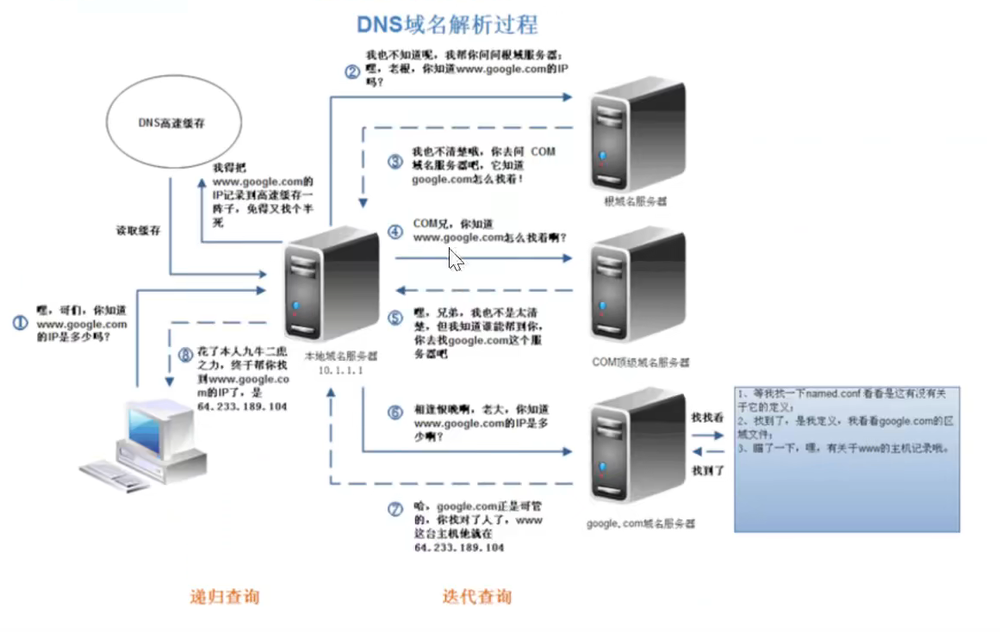
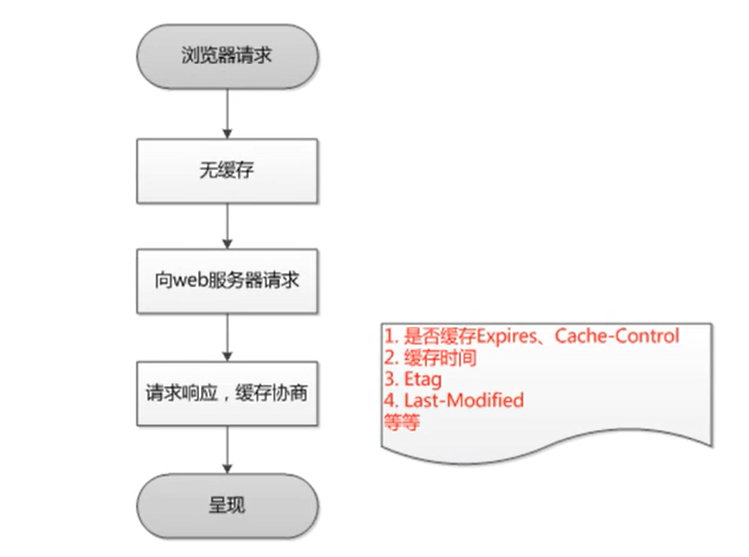
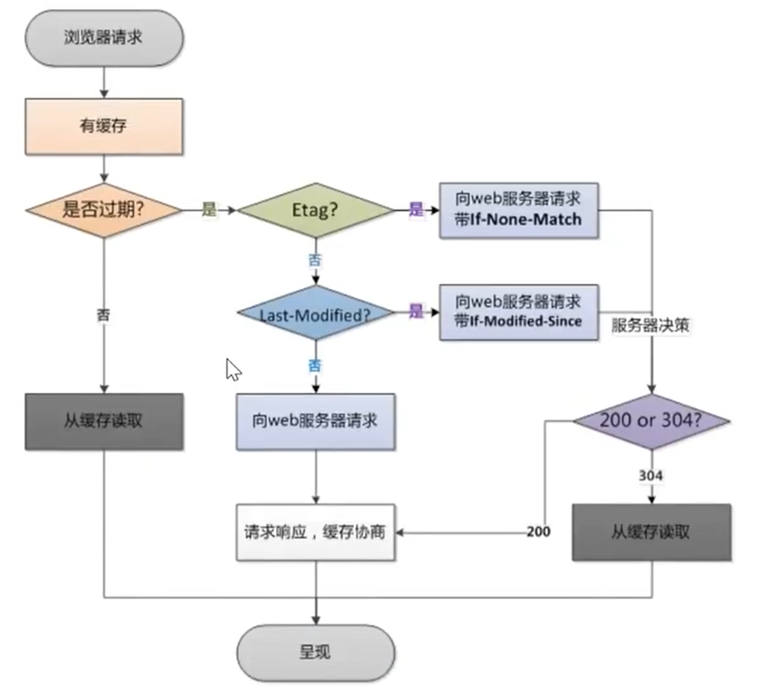
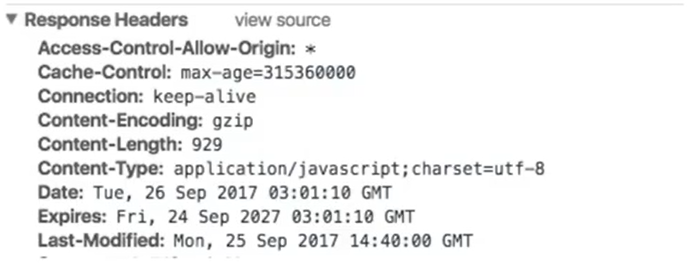
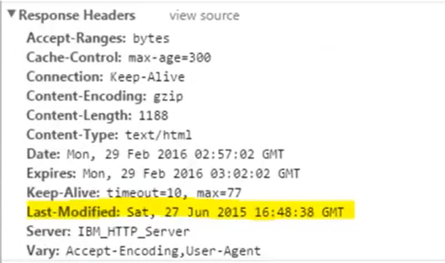
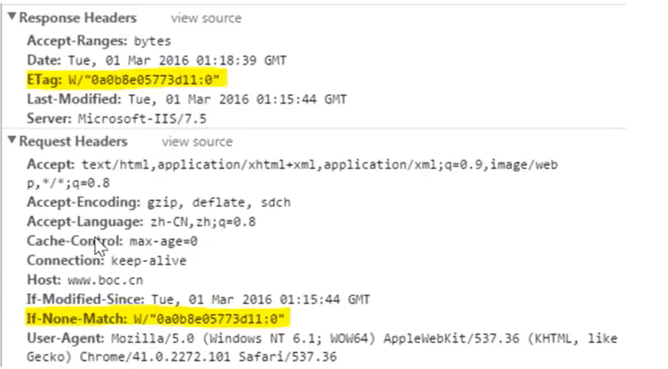

# HTTP服务过程

## 一次完整的HTTP服务过程

当我们在web浏览器中输入`www.baidu.com`时，具体发生了什么

1. 对`www.baidu.com`这个网址**进行DNS域名解析，得到对应的IP地址**

2. 根据这个IP，**找到对应的服务器，发起TCP的三次握手**

3. 建立TCP连接后**发起HTTP请求**

4. 服务器**响应HTTP请求，浏览器得到html代码**

5. 浏览器**解析html代码**，并**请求html代码中的资源**（如js，css，图片等）

   （先得到html代码，才去找这些资源）

6. 浏览器对**页面进行渲染**呈现给用户

7. 服务器**关闭TCP连接**


## DNS是如何找到域名的

DNS域名解析采用的是递归查询的方式。

1. 先去搜索**浏览器自身的DNS缓存**

   (缓存时间比较短，大概只有1分钟，且只能容纳1000条缓存)

2. 如果浏览器自身的缓存找不到，浏览器会搜索**操作系统自身的DNS缓存**

3. 如果还没找到，那么尝试从**hosts文件里面去找**（只有这步可以人为进行干预）

4. 如果还没找到，就递归去**域名服务器查找**

    

这样递归查找后，找到了，给我们的web浏览器

DNS优化两个方面：DNS缓存、DNS负载均衡


## 为什么HTTP协议要基于TCP来实现

TCP是一个端到端的可靠的面向连接的协议，**HTTP基于传输层TCP协议**不用担心数据传输的各种问题

(当发生错误时，会重传)


## 浏览器是如何对页面进行渲染的

1. 解析html文件构成**DOM树**

2. 解析css文件构成**渲染树**

3. **边解析，边渲染**

4. JS单线程运行，**JS有可能修改DOM结构**

   意味着JS执行完成前，后续所有资源的下载是没有必要的

   所以JS是单线程，会阻塞后续资源下载

- ##### 浏览器解析HTML代码，并请求代码中的资源

  1. 浏览器拿到html文件后，就开始解析其中的html代码

  2. 遇到静态资源(js/css/image)会向服务器去请求下载（会使用多线程下载，每个浏览器的线程数不一样）

     这时用上keep-alive特性，建立一次http连接，可以请求多个资源，下载的顺序就是按照代码的顺序，

     但是由于每个资源的大小不同，浏览器又是多线程请求资源，所有最后显示的顺序不一定是代码的顺序

- ##### 浏览器对页面进行渲染呈现给用户

  浏览器把请求的静态资源和html代码进行渲染。浏览器是一个边解析边渲染的过程

  浏览器解析html文件构建DOM树

  解析CSS文件构建渲染树

  渲染树构建完成后，浏览器开始布局渲染树并将其绘制到屏幕上

  其中涉及**回流(reflow)**和**重绘(repain)**

  - DOM节点的各个元素都是以盒模型的形式存在，这些都需要浏览器去计算其位置和大小等，这个过程称为reflow
  - 当盒模型的位置，大小以及其他属性，如字体，颜色等都确定下来之后，浏览器便开始绘制内容，这个过程称为repain
  - 页面首次加载时，必然会经济reflow和repain
  - 回流和重绘过程非常消耗性能，尤其在移动设备上，会破坏用户体验，造成页面卡顿，应该尽可能减少回流和重绘

  js的解析是由浏览器中的JS解析引擎完成的

  js是单线程运行，js有可能修改DOM结构，意味着js执行完成之前，后续所有资源的下载是没有必要的，所有JS是单线程，会阻塞后续资源下载


## 服务器关闭TCP连接

一般情况下，一旦web服务器向浏览器发送了请求数据，它就要关闭TCP连接

如果浏览器或者服务器在其头部信息加入了如下代码，TCP连接在发送后仍然保持打开状态

```
Connection:keep-alive
```

于是，浏览器可以继续通过相同的连接发送请求

保持连接节省了为每个请求建立新连接所需的时间，还节约了网络带宽

自此一次完整的HTTP事务宣告完成


## TCP的三次握手与四次挥手

### 三次握手

 

- ##### 第一次握手

  建立连接时，客户端发送syn包（syn=x）到服务器，并进入SYN_SENT状态，等待服务器确认（SYN：同步序列编号）

- ##### 第二次握手

  服务器收到syn包，必须确认客户的SYN（ack=x+1），同时自己也发送一个SYN包（syn=y），即SYN+ACK包，此时服务器进入SYN_RECV状态

- ##### 第三次握手

  客户端收到服务器的SYN+ACK包，向服务器发送确认包ACK(ack=y+1），此包发送完毕，客户端和服务器进入ESTABLISHED（TCP连接成功）状态，完成三次握手

### 四次挥手

 

1. 客户端进程发出连接释放报文，并且停止发送数据

2. 服务器收到连接释放报文，发出确认报文。此时，服务端就进入了CLOSE-WAIT（关闭等待）状态。

   TCP服务器通知高层的应用进程，客户端向服务器的方向释放了，这时候处于半关闭状态，即客户端已经没有数据要发送了，但是服务器若发送数据，客户端依然要接受。这个状态还要持续一段时间，也就是整个CLOSE-WAIT状态持续的时间。

3. 客户端收到服务器的确认请求后，此时，客户端就进入FIN-WAIT-2（终止等待2）状态，等待服务器发送连接释放报文

   （在这之前还需要接受服务器发送的最后的数据）

4. 服务器将最后的数据发送完毕后，就向客户端发送连接释放报文。

   由于在半关闭状态，服务器很可能又发送了一些数据。此时，服务器就进入了LAST-ACK（最后确认）状态，等待客户端的确认

5. 客户端收到服务器的连接释放报文后，必须发出确认。此时，客户端就进入了TIME-WAIT（时间等待）状态

   注意此时TCP连接还没有释放，必须经过2∗∗MSL（最长报文段寿命）的时间后，当客户端撤销相应的TCB后，才进入CLOSED状态。

6. 服务器只要收到了客户端发出的确认，立即进入CLOSED状态

   同样，撤销TCB后，就结束了这次的TCP连接。可以看到，服务器结束TCP连接的时间要比客户端早一些


### 常见问题

- ##### 为什么连接的时候是三次握手，关闭的时候却是四次挥手？

  因为当Server端收到Client端的SYN连接请求报文后，可以直接发送SYN+ACK报文。其中ACK报文是用来应答的，SYN报文是用来同步的。

  但是关闭连接时，当Server端收到FIN报文时，很可能并不会立即关闭SOCKET，所以只能先回复一个ACK报文，告诉Client端，"你发的FIN报文我收到了"。

  只有等到我Server端所有的报文都发送完了，我才能发送FIN报文，因此不能一起发送。故需要四步握手。

- ##### 为什么TIME_WAIT状态需要经过2MSL(最大报文段生存时间)才能返回到CLOSE状态？

  虽然按道理，四个报文都发送完毕，我们可以直接进入CLOSE状态了，但是我们必须假象网络是不可靠的，有可以最后一个ACK丢失。所以TIME_WAIT状态就是用来重发可能丢失的ACK报文。在Client发送出最后的ACK回复，但该ACK可能丢失。Server如果没有收到ACK，将不断重复发送FIN片段。所以Client不能立即关闭，它必须确认Server接收到了该ACK。Client会在发送出ACK之后进入到TIME_WAIT状态。Client会设置一个计时器，等待2MSL的时间。如果在该时间内再次收到FIN，那么Client会重发ACK并再次等待2MSL。所谓的2MSL是两倍的MSL(Maximum Segment Lifetime)。MSL指一个片段在网络中最大的存活时间，2MSL就是一个发送和一个回复所需的最大时间。如果直到2MSL，Client都没有再次收到FIN，那么Client推断ACK已经被成功接收，则结束TCP连接。

- ##### 为什么不能用两次握手进行连接？

  3次握手完成两个重要的功能，既要双方做好发送数据的准备工作(双方都知道彼此已准备好)，也要允许双方就初始序列号进行协商，这个序列号在握手过程中被发送和确认。

  现在把三次握手改成仅需要两次握手，死锁是可能发生的。作为例子，考虑计算机S和C之间的通信，假定C给S发送一个连接请求分组，S收到了这个分组，并发 送了确认应答分组。按照两次握手的协定，S认为连接已经成功地建立了，可以开始发送数据分组。可是，C在S的应答分组在传输中被丢失的情况下，将不知道S 是否已准备好，不知道S建立什么样的序列号，C甚至怀疑S是否收到自己的连接请求分组。在这种情况下，C认为连接还未建立成功，将忽略S发来的任何数据分 组，只等待连接确认应答分组。而S在发出的分组超时后，重复发送同样的分组。这样就形成了死锁。

- ##### 如果已经建立了连接，但是客户端突然出现故障了怎么办？

  TCP还设有一个保活计时器，显然，客户端如果出现故障，服务器不能一直等下去，白白浪费资源。服务器每收到一次客户端的请求后都会重新复位这个计时器，时间通常是设置为2小时，若两小时还没有收到客户端的任何数据，服务器就会发送一个探测报文段，以后每隔75秒钟发送一次。若一连发送10个探测报文仍然没反应，服务器就认为客户端出了故障，接着就关闭连接


# HTTP缓存控制

## WEB缓存

web缓存大致可分为：数据库缓存，服务器端缓存（代理服务器缓存、CDN缓存），浏览器缓存

浏览器缓存大致包含：HTTP缓存，indexDB，cookie，localStorage等等

HTTP缓存能够帮助服务器提高并发性能，很多资源不需要重复请求直接从浏览器中拿缓存

常用术语

- ##### 缓存命中率

  从缓存中得到数据的请求数与所有请求数的比率。理想状态是越高越好

- ##### 过期内容

  超过设置的有效时间，被标记为陈旧的内容。

  通常过期内容不能用于回复客户端的请求，必须重新向源服务器请求新的内容或者验证缓存的内容是否仍然准备

- ##### 验证

  验证缓存中的过期内容是否仍然有效，验证通过的话刷新过期时间

- ##### 失效

  失效就是把内容从缓存中移除。当内容发生改变时就必须移除失效的内容

浏览器缓存主要是HTTP协议定义的缓存机制。

HTML meta标签：

```html
<META HTTP-EQUIV="Pragma" CONTENT="no-store">
```

让浏览器不缓存当前页面。但是代理服务器不解析HTML内容，一般应用广泛的是用HTTP头信息控制缓存


## HTML缓存分类

浏览器缓存分为强缓存和协商缓存，浏览器加载一个页面的简单流程如下

1. 浏览器先根据这个资源的http头信息来判断是否命中强缓存

   如果命中则直接加载缓存中的资源，并不会将请求发送到服务器

2. 如果未命中强缓存，则浏览器会将资源加载请求发送到服务器

   服务器来判断浏览器本地缓存是否失效

   若可以使用，则服务器并不会返回资源信息，浏览器继续从缓存加载资源

3. 如果未命中协商缓存，则服务器会将完整的资源返回给浏览器，浏览器加载新资源，并更新缓存

浏览器第一次请求

 

浏览器第二次请求

 


### 强缓存

命中强缓存时，浏览器并不会将请求发送给服务器。

http的返回码是200，但是在size列会显示为from cache

 

强缓存是利用http的返回头中的Expires或者Cache-Control两个字段来控制的，用来表示资源的缓存时间

#### Expires

缓存过期的时间，用来指定资源到期的时间，是服务器端的具体的时间点。也就是说，Expires=max-age+请求时间，需要和Last-modified结合使用。但在上面我们提到过，cache-control的优先级更高。Expires是Web服务器响应消息头字段，在响应http请求时告诉浏览器在过期时间前浏览器可以直接从浏览器缓存取数据，而无需再次请求

 

Expires字段会返回一个时间，这个时间代表着这个资源的失效时间

由于失效时间是一个**绝对时间**，当客户端本地的时间被修改以后，**服务器和客户端时间不同步，会导致缓存混乱**

#### Cache-Control

Cache-Control是一个**相对时间**，例如Cache-Control:3600，代表着资源的有效期是3600秒。

由于是相对时间，并且都是与客户端时间比较，所以服务器与客户端有时间偏差也不会导致问题

Cahce-Control与Expires可以在服务器配置同时启用或者启用任意一个，同时启用的时候**Cache-Control优先级高**

Cache-Control可以由多个字段组合而成

1. ##### max-age

   指定一个时间长度，在这个时间段内缓存是有效的，单位是s

   `Cache-Control:max-age=31536000`，缓存有效期为(31536000/24/60*60)天，第一次访问这个资源时，服务器端也返回了Expires字段，并且过期时间是一年后

    

2. ##### s-maxage

   同max-age，覆盖max-age、Expires，但仅适用于共享缓存，在私有缓存中被忽略

3. ##### public

   表明响应可以被任何对象（发送请求的客户端、代理服务器等）缓存

4. ##### private

   表明响应只能被单个用户（可能是操作系统用户、浏览器用户）缓存，是非共享的，不能被代理服务器缓存

5. ##### no-cache

   强制所有缓存了该响应的用户，在使用已缓存的数据前，发送带验证器的请求到服务器。不是字面意思上的不缓存

6. ##### no-store

   禁止缓存，每次请求都要向服务器重新获取数据

7. ##### must-revalidate

   指定如果页面是过期的，则去服务器进行获取。不常用

#### Nginx强缓存配置

```nginx
# nginx.conf
location / {
    
    # add_header    Cache-Control  max-age=100;
    add_header    Cache-Control  max-age=6048000;
    # add_header    Cache-Control  no-cache;
    # add_header    Cache-Control  private;
    # add_header    Cache-Control  max-age=315360000;
    # add_header    Cache-Control  no-cache;
    # expires 30d;
    # add_header    Cache-Control  max-age=3600;
    
    if ($request_filename ~* ^.*?\.(gif|jpg|jepg|png|bmp|swf)$){
        # add_header    Cache-Control  no-cache;
        add_header    Cache-Control  max-age=3600;
        # expires 30d;
    }
    index  index.html index.htm;
}
```


### 协商缓存

若未命中强缓存，则浏览器会将请求发送至服务器。

服务器根据http头信息中的Last-Modify/If-Modify-Since或Etag/If-None-Match来判断是否命中协商缓存

如果命中，则**http返回码为304**，浏览器从缓存中加载资源

协商缓存中，浏览器会询问服务器浏览器中缓存的文件有没有更新，如果没有更新就使用缓存文件返回状态码304，如果更新了，就从服务器取新的文件返回状态码200

#### Last-Modify/If-Modify-Since

浏览器第一次请求一个资源的时候，服务器返回的header中会加上Last-Modify

Last-Modify是一个时间标识该资源的最后修改时间，例如`Last-Modify: Thu,31 Dec 2037 23:59:59 GMT`

第一次请求 

当浏览器再次请求该资源时，发送的请求头中会包含If-Modify-Since，该值为缓存之前返回的Last-Modify

服务器收到If-Modify-Since后，根据资源的最后修改时间判断是否命中缓存

第二次请求 

如果命中缓存，则返回304，并且不会返回资源内容，并且不会返回Last-Modify

由于对比的服务端时间，所有客户端与服务器时间差距不会导致问题

但是有时候通过**最后修改时间来判断资源是否修改还是不太准确**（资源变化了最后修改时间也可以一致），于是出现了ETag/If-None-Match

#### Etag/If-None-Match

与Last-Modify/If-Modify-Since不同的是，Etag/If-None-Match返回的是一个**校验码**（Etag:entity tag）

Etag可以保证每一个资源是唯一的，资源变化都会导致Etag变化

Etag值的变更则说明资源状态已经被修改。服务器根据浏览器上发送的If-None-Match值来判断是否命中缓存

 

Last-Modified可以和Etag一起使用，服务器会**优先验证Etag**，一致的情况下才会继续对比Last-Modified

 
