#   JavaScript的组成

- ECMAScript JavaScript语法

  ECMAScript 规定了JS的编程语法和基础核心知识，是所有浏览器厂商共同遵守的一套JS语法工业标准

- DOM 页面文档对象模型

  是处理可扩展标记语言的标准编程接口。通过 DOM 提供的接口可以对页面上的各种元素进行操作（大小、位置、颜色等）

- BOM 浏览器对象模型 

  提供了独立于内容的、可以与浏览器窗口进行互动的对象结构。通过BOM可以操作浏览器窗口，比如弹出框、控制浏览器跳转、获取分辨率等。


# 数据类型和运算符

## 值类型

简单类型又叫做基本数据类型或者值类型

在存储时变量中存储的是值本身，因此叫做值类型

number，boolean，string，undefined，null

- 简单数据类型存放到栈里面，存放的是值

- 简单类型传参

  值类型变量作为参数传给函数的形参时，其实是把变量在栈空间里的值复制了一份给形参，

  方法内部对形参做任何修改，都不会影响到的外部变量

- 数字型特殊值

  - 最大值：Number.MAX_VALUE：1.7976931348623157e+308
  - 最小值：Number.MIN_VALUE：5e-32
  - 无穷大，大于任何数值 Infinity
  - 无穷小，小于任何数值 -Infinity
  - 非数值 NaN

- `isNaN()`来判断一个变量是否为非数字的类型，是数字返回 true， 不是数字返回 false

- undefined 和 number或boolean 相加，最后结果是NaN

- 浮点数最高精度是17位小数，在算术计算时其精度远远不如整数

  `var result = 0.1 + 0.2; // 结果不是 0.3，而是：0.30000000000000004
  console.log(0.07 * 100); // 结果不是 7， 而是：7.000000000000001`

  不要直接判断两个浮点数是否相等 
  
- 值类型null，返回的是一个空对象object

  ```javascript
  var timer = null;
  console.log(typeof timer);		// object
  ```


## 引用类型

复杂类型又叫做引用类型

在存储时变量中存储的仅仅是地址（引用），因此叫做引用数据类型

通过 new 关键字创建的对象（系统对象、自定义对象），如 Object、Array、Date等

- 复杂数据类型栈里存放的是地址，真正的对象实例存放在堆空间中

- 复杂类型传参

  把引用类型变量传给形参时，其实是把变量在栈空间里保存的堆地址复制给了形参，

  形参和实参其实保存的是同一个堆地址，所以操作的是同一个对象


## 数据类型转换

### 转换为字符串

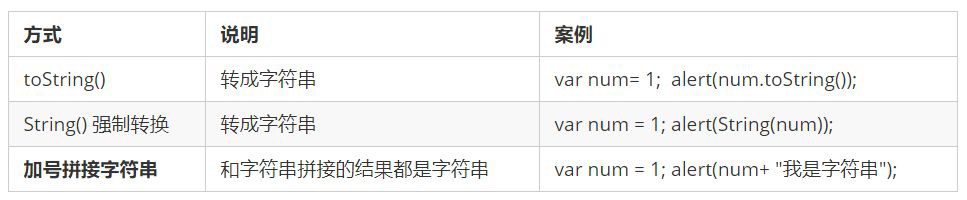 


### 转换为数字

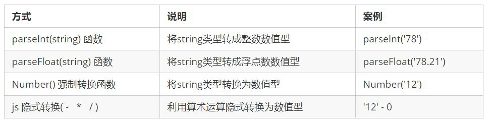 

- 隐式转换`var a = + '11'; // 11  `
- `parseInt('120px'); // 120`


### 转换为布尔值

- 一个感叹号

  代表空、否定的值会被转换为 false ，如 ''、0、NaN、null、undefined。其余值都会被转换为 true

- 两个感叹号

  `!!`常常用来做类型判断。

  - `undefined`和`null`为false
  - 任意数组，对象，函数都转化为true，即使是空数组，空对象。
  - 空字符串为false，非空字符串为true。
  - 数值`0`，不确定值`NaN`为false，其它为true，无穷大也是true。

  如果值为真:

  - 可以排除`undefined`和`null`

  - 数值：表示不是0，且有确定含义的值（包括无穷大）
  - 字符串：表示长度大于0的字符串
  - 数组，对象，函数：只能表示不是`undefined`或`null`,并不能判断是否有元素和内容。

  下面两个用法其实是完全等价的

  ```javascript
  let a; // null、undefined、''、0
  if (a !== null && typeof(a) !== "undefined" && a !== undefined && a !== '' && a !== 0) {
  }
  
  let a;
  if(!!a){
  }
  ```

- javascript中类型转换不具有传递性。字符串`”0″`和数值`0`可以相互转换，但它们转换为不同的布尔值，即0可转换为”0″，”0″可转换为true,但0却转换为false


### 检测数据类型

- `typeof `主要用于检测基本类型

   

  ```javascript
  typeof {};				//=> object
  typeof [];				//=> object
  typeof function() {};	//=> function
  ```

- `instanceof` 主要用于检测引用类型

  ```javascript
  // 根据对象的原形链往上找,如果原形链上有右边函数.prototype,返回true;
  var obj = {}; obj instanceof Object; 			//=> true; 
  var arr = []; arr instanceof Array; 			//=> true;
  var fn = function() {}; fn instanceof Function; //=> true;
  ```

- `Object.prototype.toString.call(sth)` 原形链的检测有漏洞(原型是可以改变的)。所以会造成检测结果不准确，所以可以采用此种形式。

  ```javascript
  var toString = Object.prototype.toString;
  toString.call(undefined);					//=> [object Undefined]
  toString.call(1);							//=> [object, Number]
  toString.call(NaN);							//=> [object, Number]
  toString.call('a');							//=> [object, String]
  toString.call(true);						//=> [object, Boolean]
  toString.call({});							//=> [object, Object]
  toString.call(function() {});				//=> [object, Function]
  toString.call([]);							//=> [object, Array]
  toString.call(null);						//=> [object, Null]
  ```


## 拷贝

### 浅拷贝

只拷贝一层, 更深层次对象级别的只拷贝引用

```javascript
var obj = {
    id: 1,
    name: 'andy',
    msg: {
        age: 18
    }
};
var o = {};
for (var k in obj) {
    // k 是属性名   obj[k] 属性值
    o[k] = obj[k];
}
```

es6 新增浅拷贝方法

`Object.assign(target, ...sources) `


### 深拷贝

拷贝多层, 每一级别的数据都会拷贝

```javascript
var obj = {
    id: 1,
    name: 'andy',
    msg: {
        age: 18
    },
    color: ['pink', 'red']
};
var o = {};

function deepCopy(newobj, oldobj) {
    for (var k in oldobj) {
    	// 判断属性值属于那种数据类型
    	// 1. 获取属性值  oldobj[k]
    	var item = oldobj[k];
    	// 2. 判断这个值是否是数组
        // 数组也是对象，所以要放到对象判断前面
    	if (item instanceof Array) {
    	    newobj[k] = [];
    	    deepCopy(newobj[k], item)
    	} else if (item instanceof Object) {
    	    // 3. 判断这个值是否是对象
    	    newobj[k] = {};
    	    deepCopy(newobj[k], item)
    	} else {
    	    // 4. 属于简单数据类型
    	    newobj[k] = item;
    	}
	}
}

deepCopy(o, obj);
```


## 递增和递减运算符

递增（++）和递减（ -- ）既可以放在变量前面，也可以放在变量后面

- ##### 前置递增运算符

  `++num` 前置递增，就是自加1， `num = num + 1`

  先自加，后返回值

  `var num = 10;
  alert(++num + 10); // 21`

- ##### 后置递增运算符

  `num++` 后置递增，就是自加1， `num = num + 1`

  先返回原值，后自加

  `var num = 10;
  alert(10 + num++); // 20`


## 运算符优先级

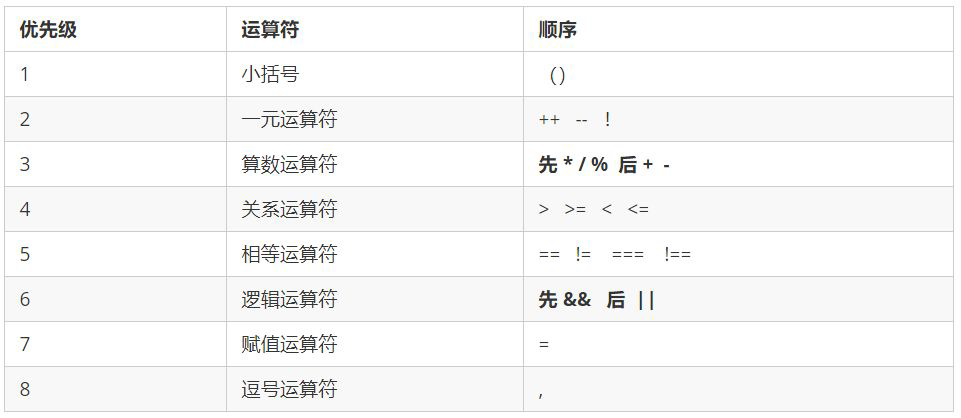 

- 一元运算符里面的[逻辑非]优先级很高
- [逻辑与]比[逻辑或]优先级高


# 语法

## let/const

ES6开始新增了两个关键字可以声明变量：let、const

**const关键字**保存的数据一旦被赋值，就**不能被修改**，但是如果赋值的是引用类型，那么可以通过引用找到对应的对象，修改对象内容

```javascript
const obj = {
  foo: "foo"
}
obj.foo = "aaa";
```

```javascript
const names = ["abc", "cba", "nba"];
// const 定义的常量不能做++操作
for (const i = 0; i < names.length; i++) {	// TypeError: Assignment to constant variable
  console.log(names[i])
}
for (const item of names) {
  console.log(item)
}
```

let、const**不允许重复声明变量**

```javascript
var bar = "abc";
var bar = "cba";
let foo = "abc"
// SyntaxError: Identifier 'foo' has already been declared
let foo = "cba"
```

let/const是**没有作用域提升**的

但是会在执行上下文创建阶段被创建出来，但是是不可以访问它们的，直到词法绑定被求值

```java
console.log(foo);
var foo = "foo";
console.log(bar);
// ReferenceError: Cannot access 'bar' before initialization
let bar = 'bar';
```

let和const声明的变量具有**块级作用域**，var定义的变量可以跨块作用域访问

```javascript
var arr = [];
for (var i = 0; i < 2; i++) {
    arr[i] = function () {
        console.log(i); 
    }
}
// 变量i是全局的，函数执行时输出的都是全局作用域下的i值
arr[0](); // 2
arr[1](); // 2
```

```javascript
let arr = [];
for (let i = 0; i < 2; i++) {
    arr[i] = function () {
        console.log(i); 
    }
}
// 每次循环都会产生一个块级作用域，每个块级作用域中的变量都是不同的
// 函数执行时输出的是自己上一级（循环产生的块级作用域）作用域下的i值
arr[0](); // 0
arr[1](); // 1
```

使用let、const声明的变量，在声明之前，变量都是不可以访问的，这种现象称之为**暂时性死区**

```javascript
var foo = "foo"
if (true) {
  console.log(foo);	// ReferenceError: Cannot access 'foo' before initialization
  let foo = "abc";
}
```


## 字面量增强

ES6中对对象字面量进行了增强，称之为Enhanced object literals（增强对象字面量）

### 属性的简写

```javascript
var name = 'jack';
var age = 18;
var obj = {
    // name: name,
    // age: age
    name,
    age
}
```

### 方法的简写

```javascript
var obj = {
    // foo: function() { }
    foo(){
        
    }
}
```

### 计算属性名

```javascript
var name = 'jack';
var obj = {
    [name + '123']: 'haha'
}
```


## 解构

ES6中新增了从数组或对象中方便获取数据的方法

### 数组解构

```javascript
var names = ['abc', 'cba', 'nba'];
// var item1 = names[0];
// var item2 = names[1];
// var item3 = names[2];
var [item1, item2, item3] = names;
```

默认从头开始获取

```javascript
var names = ['abc', 'cba', 'nba'];
var [itema, itemb] = names;
// itema: 'abc'
// itemb: 'cba'
```

解构后面的元素

```javascript
var names = ['abc', 'cba', 'nba'];
var [, , itemc] = names;
// itemc: 'nba'
```

解构出一个元素,后面的元素放到一个新数组中

```javascript
var names = ['abc', 'cba', 'nba'];
var [itemx, ...newNames] = names;
// itemx: 'abc'
// newNames: ['cba', 'nba']
```

 如果解构不成功，变量的值为undefined

```javascript
var names = ['abc', 'cba', 'nba'];
var [item1, item2, item3, item4] = names;
// item4: undefined
```

没有解构出来设置默认值

```javascript
var names = ['abc', 'cba', 'nba'];
var [itema, itemb, itemc, itemd = 'aaa'] = names;
// itemd: 'aaa'
```

### 对象解构

```javascript
var obj = {
  name: "jack",
  age: 18,
  height: 1.88
}
var { name, age, height } = obj;
// name: 'jack'
// age: 18
// height: 1.88
```

不会根据顺序赋值

```javascript
var obj = {
  name: "jack",
  age: 18,
  height: 1.88
}
var { height, age, name } = obj;
// height: 1.88
// age: 18
// name: 'jack'
```

只解构其中某个值

```javascript
var obj = {
  name: "jack",
  age: 18,
  height: 1.88
}
var { age } = obj;
// age: 18
```

自定义变量名

```javascript
var obj = {
  name: "jack",
  age: 18,
  height: 1.88
}
var { name: newName } = obj;
// newName: 'jack'
```

没有解构出来设置默认值

```javascript
var obj = {
  name: "jack",
  age: 18,
  height: 1.88
}
var { address: newAddress = "广州市" } = obj;
// newAddress: '广州市'
```

方法参数解构

```javascript
var obj = {
  name: "jack",
  age: 18,
  height: 1.88
}
function foo(info) {
    console.log(info.name, info.age);
}
foo(obj);
function bar({ name, age }) {
    console.log(name, age);
}
bar(obj);
// 'jack', 18
```


## 展开运算符

展开运算符可以将数组或者字符串拆分成以逗号分隔的参数序列

还可以在构造字面量对象时, 将对象表达式按key-value的方式展开

```javascript
const ary = ["a", "b", "c"];
// ...ary =>> "a", "b", "c"
console.log(...ary); // a b c

function foo(x, y, z) {
    console.log(x, y, z);
}
foo(...ary);
```

```javascript
const name = 'tom';
function foo(x, y, z) {
    console.log(x, y, z);
}
foo(...name);
```

数组合并

```javascript
let ary1 = [1, 2, 3];
let ary2 = [4, 5, 6];
let ary3 = [...ary1, ...ary2];
```

```javascript
let ary1 = [1, 2, 3];
let ary2 = [4, 5, 6];
ary1.push(...ary2);
```

- 伪数组转换为真正的数组

  ```javascript
  var oDivs = document.getElementsByTagName('div');
  var ary = [...oDivs];
  ```

- 剩余参数和解构配合

  ```javascript
  let students = ['wangwu', 'zhangsan', 'lisi'];
  let [s1, ...s2] = students;
  console.log(s1);  // 'wangwu'
  console.log(s2);  // ['zhangsan', 'lisi']
  ```


# 函数

## 函数的定义

- 命名函数 `function `关键字 

- 匿名函数

- `new Function('参数1','参数2'..., '函数体')`

  函数也属于对象

- 箭头函数` () => {}` 

- 函数也是一种数据类型，可以作为参数和返回值


## 函数参数

### 不定参数arguments

- arguments 是当前函数的一个内置对象

  所有函数都内置了一个 arguments 对象，arguments 对象中存储了传递的所有实参

  ```javascript
  function foo(num1, num2, num3) {
      // 会去AO中寻找arguments
      console.log(arguments);			// Arguments(5) [10, 20, 30, 40, 50]
      console.log(num1, num2, num3);
  }
  foo(10, 20, 30, 40, 50);
  
  // AO对象
  // var ao = {
  //     num1: undefined,
  //     num2: undefined,
  //     num3: undefined,
  //     arguments: {}
  // }
  ```

- arguments展示形式是一个**伪数组**，可以进行遍历
  - 具有 length 属性
  - 按索引方式储存数据
  - 不具有数组的 push , pop ,forEach,map等方法
  
- arguments常见操作

  1. 获取参数的长度：arguments.length
  2. 根据索引值获取某一个参数：arguments[2]
  3. 获取当前arguments所在的函数：arguments.callee

- 箭头函数没有arguments，如果想要获取arguments只能去上层作用域找

  ```javascript
  function foo() {
      var bar = () => {
          console.log(arguments)
      };
      return bar;
  }
  var fn = foo(123);
  fn();	// {'0': 123}
  ```

- arguments转array类型

  `var newArray = Array.prototype.slice.call(arguments)`

  `var newArray = [].slice.call(arguments)`

  `var newArray = Array.from(arguments)` 

  `var newArray = [...arguments]`

  如果不使用call调用，获取的this是原型对象prototype，但是需要获取的是可遍历对象

  ```javascript
  var names = ['jack', 'tom', 'john', 'jerry'];
  names.slice(1, 3);
  
  // 模拟Array中的slice实现
  Array.prototype.slice  = function(start, end) {
      var arr = this;
      start = start || 0;
      end = end || arr.length;
      var newArray = [];
      for (var i = start; i < end; i++) {
          newArray.push(arr[i]);
      } 
      return newArray;
  }
  var newArray = Array.prototype.slice.call(['a', 'b', 'c']);
  ```


### 剩余参数

将一个不定数量的参数表示为一个数组（ES6新增）

如果最后一个参数是... 为前缀的，那么它会将剩余的参数放到该参数中，并且作为一个数组

剩余参数必须放到最后一个位置，否则会报错

```javascript
function sum (first, ...args) {
    console.log(first); // 10
    console.log(args); // [20, 30] 
}
sum(10, 20, 30)
```

剩余参数和arguments的区别

1. 剩余参数只包含那些没有对应形参的实参，而arguments 对象包含了传给函数的所有实参
2. arguments对象不是一个真正的数组，剩余参数是一个真正的数组，可以进行数组操作


### 默认参数

在ES6中，允许给函数参数默认值

```javascript
function foo(x = 20, y = 30) {
    console.log(x, y);
}
foo(50, 100);	// 50, 100
foo();			// 20, 30
```

默认值可以和解构一起使用

```javascript
// 写法一
function foo({ name, age } = { name: 'jack', age: 18 }) {
    console.log(name, age);
}
// 写法二
function foo({ name = 'jack', age = 18 } = {}) {
    console.log(name, age);
}
```

有默认值的形参最好放最后

```javascript
function foo(x, y, z = 30) {
    console.log(x, y, z);
}
foo(10, 20);
function bar(x = 30, y, z) {
    console.log(x, y, z);
}
foo(undefined, 10, 20);
```

默认值会改变函数的length的个数，默认值以及后面的参数都不计算在length之内

```javascript
function bar(x, y, z, m, n) {
    console.log(x, y, z, m, n);
}
console.log(bar.length);			// 5

function foo(x, y, z = 30, m, n) {
    console.log(x, y, z, m, n);
}
console.log(foo.length);			// 2
```


### 标签模板字符串

使用标签模板字符串，并且在调用函数的时候插入其他的变量（ES6新增）

1. 第一个元素是数组，是被模板字符串拆分的字符串组合
2. 后面的元素是每个模板字符串传入的内容

```javascript
function foo(...args) {
    console.log(args);
}
foo('Hello World');

const name = 'jack';
const age = 18;
// [ ['Hello ', ' World ', ''], 'jack', 18 ]
foo`Hello ${name} World ${age}`;
```


## 高阶函数

一个函数如果接受另外一个**函数作为参数**，或者该函数会返回另外一个**函数作为返回值**，那么这个函数就称为高阶函数

**函数作为参数**

```javascript
function calc(num1, num2, calcFn) {
    console.log(calcFn(num1, num2));
}
function add(num1, num2) {
    return num1 + num2;
}
function sub(num1, num2) {
    return num1 - num2;
}
function mul(num1, num2) {
    return num1 * num2;
}

var m = 20;
var n = 30;
calc(20, 30, mul);
```

**函数作为返回值**

```javascript
function makeAdder(count) {
    function add(num) {
        return count + num;
    }
    return add;
}
var add5 = makeAdder(5);
console.log(add5(6));
console.log(add5(10));
```


## 箭头函数

箭头函数**不绑定this、arguments**属性

箭头函数中的this，指向的是**函数定义位置的上下文this**

箭头函数是**没有显式原型**的，**不能作为构造函数**来使用，**不能使用new**来创建对象

```javascript
// 普通函数
function foo() {}
var f = new foo();			// f.__proto__ = foo.prototype
// 箭头函数
var bar = () => {}
console.log(bar.prototype);	// undedined
var b = new bar();			// TypeError: bar is not a constructor
```

箭头函数的简写

1. 参数只有一个，()可以省略

   ```javascript
   var nums = [10, 20, 30, 40];
   // 一个可以省略
   nums.foreach(item => {
      console.log(item); 
   });
   // 多个不可省略
   nums.foreach((item, index) => {
      console.log(item, index); 
   });
   ```

2. 函数执行体只有一行代码，{}可以省略

   并且会默认将这一行代码的执行结果作为返回值

   ```javascript
   var nums = [10, 20, 30, 40];
   nums.foreach(item => console.log(item));
   nums.filter(item => item % 2 === 0);
   ```

3. 如果只有一行代码，并且返回一个对象，在返回对象外加()

   ```javascript
   var bar = () => ({ name: 'jack', age: 18 });
   ```

   


## 立即执行函数

- `(function() {})()` 或 `(function(){}())`
- 会创建一个独立的作用域。 避免了命名冲突问题


## 纯函数

纯函数需要符合以下条件

1. 确定的输入，一定会产生确定的输出

2. 函数在执行过程中，不能产生副作用

   副作用表示在执行一个函数时，除了返回函数值之外，还对调用函数产生了附加影响，比如修改了全局变量，修改参数或者改变外部存储

纯函数的优势：只需要关心函数的参数和返回值就可以，单纯实现业务逻辑即可

```javascript
// 纯函数
function foo(num1, num2) {
    return num1 * 2 + num2 * num2;
}
// 不是纯函数
var name = 'abc'
function bar() {
    name = 'cba';
}

// 不是纯函数
function baz(info) {
    info.age = 100;
}
var obj = { name: 'jack', age: 18 }
baz(obj);
```

```javascript
var names = ['abc', 'cba', 'nba', 'dna'];

// slice方法只要给它传入一个start/end，对于同一个数组来说，它会返回确定的值
// slice方法本身是不会修改原来的数组
// slice本身就是纯函数
var newNames1 = names.slice(0, 3);
console,log(newNames1);			// ['abc', 'cba', 'nba']
console.log(names);				// ['abc', 'cba', 'nba', 'dna'];

// splice在执行时，有修改调用的数组对象本身，修改这个操作就是产生的副作用
// splice不是一个纯函数
var newNames2 = names.splice(2);
console.log(newNames2);			// ['nba', 'dna']
console.log(names);				// ['nba', 'dna']
```


## 函数柯里化

函数柯里化：只传递给函数一部分参数来调用它，让它返回一个函数去处理剩余的参数

```javascript
function add(x, y, z) {
    return x + y + z;
}
var result1 = foo(10, 20, 30);

// 柯里化
function sum(x) {
    return function(y) {
        return function(z) {
			return x + y + z;
        }
    }
}
var result2 = sum(10)(20)(30);

// 简化柯里化
var sum2 = x => y => z => x + y + z;
var result2 = sum2(10)(20)(30);
```

柯里化优势：**单一职责**，希望一个函数处理的问题尽可能的单一，而不是将一大堆的处理过程交给一个函数来处理

可以将每次传入的参数在单一函数中进行处理，处理完后在下一个函数中再使用处理后的结果

```javascript
function add(x, y, z) {
    x = x + 2；
    y = y + 2;
    z = z * z;
    return x + y + z;
}
// 柯里化
function sum(x) {
    x = x + 2;
    return function(y) {
        y = y * 2;
        return function(z) {
            z = z * z;
            return x + y + z;
        }
    }
}
```

函数的柯里化可以使逻辑充分的复用

```javascript
function makeAdder(count) {
    count = count * count;
    return function(num) {
        return count + num;
    }
}
var adder5 = makeAdder(5);
adder5(10);
adder5(14);
```

```javascript
function log(data, type, message) {
    console.log(`[${data.getHours()}:${date.getMinutes}][${type}]:[${message}]`);
}
log(new Date(), 'DEBUG', '轮播图出现BUG');
log(new Date(), 'DEBUG', '查询菜单出现BUG');
log(new Date(), 'DEBUG', '查询数据出现BUG');

// 柯里化
var log => data => type => message => {
    console.log(`[${data.getHours()}:${date.getMinutes}][${type}]:[${message}]`);
}
// 打印相同的时间
var nowLog = log(new Date());
nowLog('DEBUG')('轮播图出现BUG');
nowLog('FUTURE')('新增了添加用户的功能');

// 打印相同时间的DEBUG
var nowLogAndDebug = log(new Date())('Debug');
nowLogAndDebug('轮播图出现BUG');
nowLogAndDebug('查询菜单出现BUG');
```

自动柯里化函数的实现

```javascript
function hyCurrying(fn) {
    function curried(..args) {
        // 判断当前已经接收的参数的个数，可以参数本身需要接受的参数是否已经一致了
        // 1. 当已经传入的参数 大于等于 需要的参数时，就执行函数
        if (args.length >= fn.length) {
            return fn.apply(this, args);
        } else {
           // 没有参数达到个数时，需要返回一个新的函数，继续接收参数
            function curried2(...args2) {
                return curried.apply(this, args2.concat(args2));
            }
            return curried2;
        }
    }
    return curried;
}

function add(x, y, z) {
    return x + y + z;
}
var curryAdd = hyCurrying(add1);
console.log(curryAdd(10, 20, 30));
console.log(curryAdd(10, 20)(30));
console.log(curryAdd(10)(20)(30));
```


## 组合函数

如果需要对某一个数据进行函数调用，需要依次执行两个函数fn1和fn2，那么每次都需要进行两个函数的调用操作，就会显得重复

将这两个函数组合起来，自动依次调用的过程就是对函数的组合，称之为组合函数

```javascript
function double(num) {
    return num * 2;
}
function square(num) {
    return num ** 2;
}
var count = 10;
var result = square(double(count));
console.log(result);

// 组合函数
function composeFn(m, n) {
    return function (count) {
        return n(m(count));
    }
}
var newFn = composeFn(double, square);
console.log(newFn(10))
```

通用组合函数

```javascript
// 通用组合函数
function hyCompose(...fns) {
    var length = fns.length;
    for (var i = 0; i < length; i++) {
        if (typeof fns[i] !== 'function') {
            throw new TypeError('Expected arguments are functions');
        }
    }
    function compose(...args) {
        var index = 0;
        var result = length ? fns[index].apply(this, args) : args;
        while (++i < length) {
            result = fns[index].call(this, result);
        }
        return result;
    }
    return compose;
}

function double(num) {
    return num * 2;
}
function square(num) {
    return num ** 2;
}
var newFn = hyCompose(double, square);
console.log(newFn(10));
```


## eval函数

将传入的字符串当做javaScript代码来运行

```javascript
var jsString = 'var message = "Hello World"; console.log(message);'
eval(jsString);
```

不建议在开发中使用：可读性差，有攻击风险，必须经过jS解释器，不能被JS引擎优化


# 对象

## 创建对象

### 字面量创建对象

```javascript
var star = {
	name : 'pink',
	age : 18,
	sex : '男',
	sayHi : function(){
		alert('大家好啊~');
	}
};
```


### new Object创建对象

```javascript
var andy = new Obect();
andy.name = 'pink';
andy.age = 18;
andy.sex = '男';
andy.sayHi = function(){
	alert('大家好啊~');
}
```


### 构造函数创建对象

1. 构造函数约定首字母大写

2. 函数内的属性和方法前面需要添加 this ，表示当前对象的属性和方法

3. 构造函数中不需要 return 返回结果

4. 当我们创建对象的时候，必须用 new 来调用构造函数

new关键字执行的操作：

1. 在内存中创建一个新的空对象
2. 这个对象内部的[[prototype]]属性会被赋值为该构造函数的prototype属性
3. 让 this 指向这个新的对象
4. 执行构造函数里面的代码，给这个新对象添加属性和方法
5. 返回这个新对象（所以构造函数里面不需要return）

```javascript
function Person(name, age, sex) {
	this.name = name;
	this.age = age;
	this.sex = sex;
	this.sayHi = function() {
		alert('我的名字叫：' + this.name + '，年龄：' + this.age + '，性别：' + this.sex);
	}
}
var bigbai = new Person('大白', 100, '男');
var smallbai = new Person('小白', 21, '男');
console.log(bigbai.name);
console.log(smallbai.name);
```


## 对象属性操作

### 获取/修改/删除对象属性

```javascript
var obj = {
    name: 'jack';
    age: 18;
}
// 获取属性
console.log(obj.name);
// 给属性赋值
obj.name = 'kobe';
// 删除属性
delete obj.name;
```


### 遍历对象属性

```javascript
for (var k in obj) {
    console.log(k); // 这里的 k 是属性名
	console.log(obj[k]); // 这里的 obj[k] 是属性值
}
```

`Object.keys(obj)`返回一个由属性名组成的数组


### 属性操作控制

#### 属性描述符

对一个属性进行比较精准的操作控制，可以使用**属性描述符**

属性描述符可以精准的添加或修改对象的属性

属性描述符类型：

1. **数据属性描述符**  `value`、`writable`、`enumerable`、`configurable`

2. **存取属性描述符** `enumerable`、`configurable`、`get`、`set`
   1. 隐藏某个私有属性，不希望直接被外界使用和赋值
   2. 希望截取某个属性的访问和设置值的过程

数据属性描述符和存取属性描述符不可以混着写

- `value`: 设置属性的值 

  默认为undefined

- `writable`: 值是否可以重写(修改)

  直接在一个对象上定义某个属性时，默认值为true

  通过属性描述符定义某个属性时，默认值为false

- `enumerable`: 目标属性是否可以被枚举(通过for-in或者Object.key()返回该属性)

  直接在一个对象上定义某个属性时，默认值为true

  通过属性描述符定义某个属性时，默认值为false

- `configurable`: 目标属性是否可以被delete删除，是否可以重新定义属性描述符，或者是否可以修改为存储属性描述符

  直接在一个对象上定义某个属性时，默认值为true

  通过属性描述符定义某个属性时，默认值为false

- `get`: 获取属性时会执行的函数

  默认为undefined

- `set`: 设置属性时会执行的函数

  默认为undefined


#### 定义属性描述符

属性描述符需要使用**Object.defineProperty**来对属性进行添加或者修改，可以直接在对象上定义新属性或修改原有属性，并返回此对象

`Object.defineProperty(obj, prop, descriptor)`

1. 参数 `obj`：必需。目标对象 

2. 参数 `prop`：必需。需定义或修改的属性的名称或Symbol

3. 参数 `descriptor`：必需。需定义或修改的属性描述符。以对象形式 { } 书写

`Object.defineProperties(obj, props)`

1. 参数 `obj`：必需。目标对象 
2. 参数 `props`：必需。需定义或修改的属性的名称和属性描述符的对象

- ##### 定义数据属性描述符

  ```javascript
  // 数据属性描述符
  var obj = {
      id: 1,
      pname: '小米',
      price: 1999
  };
  // 新添加的属性如果是不可枚举的，打印对象时是看不到的
  Object.defineProperty(obj, 'size', {
      value: 12,
      // enumerable: true
  });
  console.log(obj);		// { id: 1, pname: '小米', price: 1999 }
  console.log(obj.size);	// 12
  
  // 以前的对象添加和修改属性的方式
  Object.defineProperty(obj, 'num', {
      value: 1000,
      enumerable: true
  });
  
  Object.defineProperty(obj, 'id', {
      // 如果值为false 不允许修改这个属性值 默认值也是false
      writable: false,
  });
  
  // 数据属性描述符
  Object.defineProperty(obj, 'address', {
      value: '中国山东蓝翔技校xx单元',
      // 如果只为false 不允许修改这个属性值 默认值也是false
      writable: false,
      // enumerable 如果值为false 则不允许遍历, 默认的值是 false
      enumerable: false,
      // configurable 如果为false 则不允许删除这个属性 不允许在修改第三个参数里面的特性 默认为false
      configurable: false
  });
  ```

- ##### 定义存储属性描述符

  ```javascript
  // 存取属性描述符
  var obj = {
      id: 1,
      pname: '小米',
      _address: '北京市'
  };
  
  Object.defineProperty(obj, 'address', {
      enumerable: true,
      configurable: true,
      get: function() {
          console.log('获取了address的值');
          return this._address;
      },
      set: function(value) {
          console.log('设置了address的值');
          this._address = value;
      }
  });
  console.log(obj.address);
  obj.address = '上海市';
  ```

- ##### 定义多个属性描述符

  ```javascript
  var obj = {
      _age: 18
  };
  Object.definedProperties(obj, {
      name: {
          configurable: true,
          enumerable: true,
          writable: true,
          value: 'jack'
      },
      age: {
  		configurable: true,
          enumerable: true,
          get: function() {
              return this._age;
          },
          set: function(value) {
              this._age = value;
          }
      }
  })
  ```


#### 获取属性描述符

获取某个属性的属性描述符： `Object.getOwnPropertyDescriper(obj, prop)`

获取对象所有属性描述符： `Object.getOwnPropertyDescripers(obj)`

```javascript
var obj = { };
Object.defineProperty(obj, 'name', {
    value: 'jack',
    writable: true,
    enumerable: true,
    configurable: true
});
console.log(Object.getOwnPropertyDescriper(obj, 'name'));
// { value: 'jack', writable: true, enumerable: true, configurable: true }
console.log(Object.getOwnPropertyDescripers(obj));
```


### 对象限制方法

- 禁止对象继续添加新的属性：`Object.preventExtensions(obj)`

  ```javascript
  var obj = {
      name: 'jack',
      age: 18
  }
  Object.preventExtensions(obj);
  
  obj.height = 1.8;
  obj.address = '北京';
  console.log(obj);	// { name: 'jack', age: 18 }
  ```

- 禁止对象配置/删除属性：`Object.seal(obj)`

  ```java
  var obj = {
      name: 'jack',
      age: 18
  }
  Object.seal(obj);
  delete obj.name;
  console.log(obj.name);		// jack
  ```

- 使属性不可修改（writable: false）：`Object.freeze(obj)`

  ```javascript
  var obj = {
      name: 'jack',
      age: 18
  }
  Object.freeze(obj);
  obj.name = 'kobe';
  console.log(obj.name);		// jack
  ```

  


## 构造函数

构造函数主要用来初始化对象，为对象成员变量赋初始值。总与 new 一起使用

但是存在浪费内存的问题

- ##### 静态成员

  在构造函数本身上添加的成员称为静态成员，只能由构造函数本身来访问

  ```javascript
  function Star(uname, age) {
      .....
  }
  // 静态成员
  Star.sex = '男';
  ```

- ##### 实例成员

  在构造函数内部创建的对象成员称为实例成员，只能由实例化的对象来访问

  构造函数内部通过this添加的成员


## 原型对象

### 函数原型/显示原型

**所有的函数(构造函数)都有一个prototype对象**，称之为**显示原型**，这个对象的所有属性和方法，都会被函数(构造函数)所拥有

可以为prototype对象添加新的属性

- 直接添加属性

  ```javascript
  function foo() {}
  foo.prototype.name = 'jack';
  foo.prototype.age = 18;
  foo.proto.eating = function() {};
  var f = new foo();
  console.log(f.name, f.age);	// 'jack', 18
  ```

- 重写整个prototype对象

  ```javascript
  function foo() {}
  foo.prototype = {
      name: 'jack',
      age: 18,
      height: 1.8
  }
  // 一般通过Object.defineProperty方式添加constructor
  Object.defineProperty(foo.prototype, 'constructor', {
      enumerable: false,
  	configurable: true,
      writable: true,
      value: foo
  })
  var f = new foo();
  console.log(f.name, f.age, f1.height);	// 'jack', 18, 1.8
  ```

函数(构造函数)通过**原型分配的函数是所有对象所共享**的

- 可以把那些不变的公共方法直接定义在 prototype 对象上，公共属性定义到构造函数里面

- 原型对象函数里面的this指向的是 这个方法的调用者, 也就是实例对象

  ```javascript
  function Person(name, age, height, address) {
      this.name = name;
      this.age = age;
      this.height = height;
      this.address = address;
  }
  Person.prototype.eating = function() {
      console.log(this.name + 'is eating');
  }
  Person.prototype.running = function() {
      console.log(this.name + 'is running');
  }
  var p1 = new Person('jack', 18, 1.8, '北京');
  var p2 = new Person('tom', 18, 1.8, '上海');
  
  p1.eating();
  p2.eating();
  ```

- 可以通过原型对象，对原来的内置对象进行扩展自定义的方法。

  ```javascript
  // 数组增加自定义求和的功能
  Array.prototype.sum = function() {
      var sum = 0;
      for (var i = 0; i < this.length; i++) {
          sum += this[i];
      }
      return sum;
  };
  var arr = [1, 2, 3];
  console.log(arr.sum());
  ```

  数组和字符串内置对象不能给原型对象覆盖操作 `Array.prototype = {}` 

  只能是 `Array.prototype.xxx = function(){}` 的方式


###  对象原型/隐式原型

**每个对象（函数也是对象）都有一个特殊的内置属性[[prototype]] ，称为隐式原型**

**[[prototype]]属性是无法查看的**，但是浏览器给对象提供了一个属性**\_\_proto\_\_**

ES5也提供了获取对象原型的方法`Object.getPrototypeOf(obj)`

它是一个**非标准属性**，因此实际开发中，不可以使用这个属性

- ##### 隐式原型的作用：\_\_proto\_\_对象原型的意义就在于为对象的查找机制提供一个方向

  当从一个对象中获取某个属性时，它会触发[[get]]操作

  1. 从当前对象中去查找对应的属性，如果找到就直接使用
  2. 如果没有找到，就会沿着它的原型（原型链）去查找，也就是去 \_\_proto\_\_ 中去查找

  ```javascript
  var obj = { name: 'jack' };
  console.log(obj.name);	// undefined
  
  // 找不到去原型链中查找
  obj.__proto__.age = 18;
  console.log(obj.name);	// 18
  ```

- ##### 字面量直接创建的对象也有内置属性[[prototype]] 

- ##### 函数既有显示原型也有隐式原型

  ```javascript
  // 显示原型:
  // Foo是一个函数，在创建函数时，显示原型赋值Foo.prototype = { constructor: Foo }
  // 隐式原型:
  // Foo也是一个对象，function Foo() {} 其实就是 var Foo = new Function()
  // new Function()时，隐式原型赋值Foo.__proto__ = Function.prototype
  // Function.prototype = { constructor: Function }
  function Foo() { }
  console.log(Foo.prototype === Foo.__proto__);	// false
  console.log(Foo.prototype.constructor);			// [Function: Foo]
  console.log(Foo.__proto__.constructor);			// [Function: Function]
  ```

  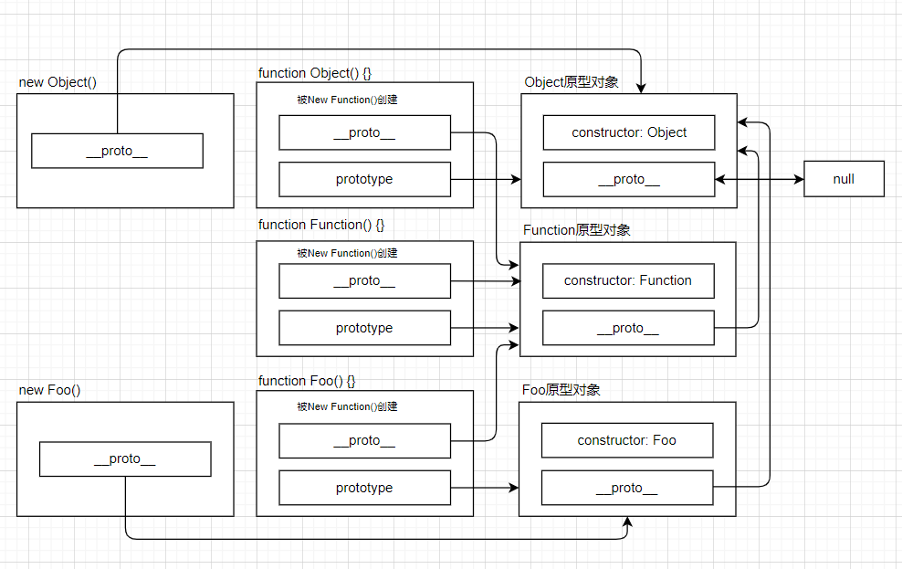 

- ##### 对象可以使用函数原型对象prototype的属性和方法，就是因为对象有\_\_proto\_\_ 原型的存在

  **new关键字创建对象**的时候，会在内存中创建一个新的对象，这个**对象内部的\_\_proto\_\_属性会被赋值为该构造函数的prototype属性**（**显示原型赋值给隐式原型**）

  也就是，函数对象的\_\_proto\_\_指向函数原型对象prototype

  ```javascript
  function foo() { }
  var fn = new foo();
  console.log(fn.__proto__ === foo.prototype);	// true
  ```

    

- 对象原型对象里面的 \_\_proto\_\_ 原型指向的是 Object.prototype，Object.prototype原型对象里面的 \_\_proto\_\_ 原型  指向为 null


### 构造函数 constructor

对象原型\_\_proto\_\_和函数原型prototype里面都有一个 constructor 属性 

constructor 称为构造函数，因为它指回构造函数本身

- constructor 主要用于记录该对象引用于哪个构造函数，可以让原型对象重新指向原来的构造函数

- 很多情况下,需要手动的利用constructor 这个属性指回 原来的构造函数

  ```javascript
  function Star(uname, age) {
      this.uname = uname;
      this.age = age;
  }
  Star.prototype = {
  	// 如果修改了原来的原型对象,给原型对象赋值的是一个对象,则必须手动的利用constructor指回原来的构造函数
      constructor: Star,
      sing: function() {
          console.log('我会唱歌');
      },
      movie: function() {
          console.log('我会演电影');
      }
  }
  ```

- ##### 构造函数、实例、原型对象三者之间的关系

  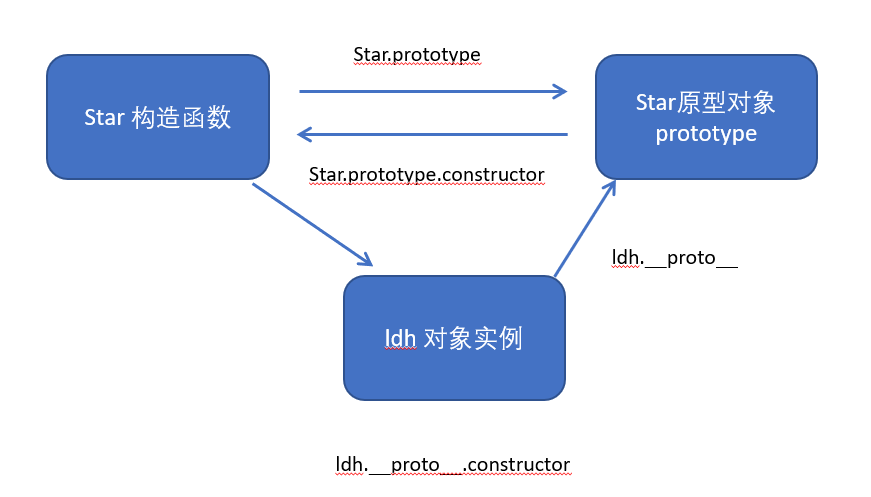 


### 原型链

对象的查找机制：

\_\_proto\_\_对象原型的意义就在于为对象成员查找机制提供一个方向

1. 当访问一个对象的属性（包括方法）时，首先查找这个对象自身有没有该属性
2. 如果没有就查找它的原型（也就是 \_\_proto\_\_，指向的 prototype 原型对象）
3. 如果还没有就查找原型对象的原型（Object的原型对象）
4. 依此类推一直找到 Object 为止（null）

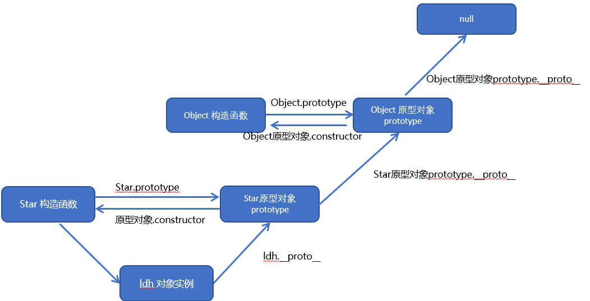 

**原型链最顶层的原型对象就是Object的原型对象**

- 从Object直接创建出来的对象的原型都是[Object: null prototype] {}
- 该原型不再继续有原型属性了，也就是顶层原型，该对象上有很多默认的属性和方法


### 原型检测方法

#### Object.create()

创建一个新对象，**使用现有的对象来提供新创建的对象的\_\_proto\_\_**

`Object.create(proto，[propertiesObject])`

- 参数1：原型对象
- 参数2：可选。为新创建的对象添加指定的属性值和属性描述符

```javascript
var obj = {
    name: 'jack',
    age: 18
};
var info = Object.create(obj, {
    address: {
        value: '北京',
        enumerable: true
    }
});
console.log(info);				// { address: '北京' }
console.log(info.__proto__);	// { name: 'jack', age: 18 }
```


#### hasOwnProperty()

判断对象自身属性中是否具有指定的属性（不是原型上的属性）

`obj.hasOwnProperty(prop)`

```javascript
var obj = {
    name: 'jack',
    age: 18
};
var info = Object.create(obj, {
    address: {
        value: '北京',
        enumerable: true
    }
});
// 当前对象存在才返回true
console.log(info.hasOwnProperty('address'));	// true
console.log(info.hasOwnProperty('name'));		// false
```


#### in 操作符

判断某个属性是否在某个对象或者对象原型上

```javascript
var obj = {
    name: 'jack',
    age: 18
};
var info = Object.create(obj, {
    address: {
        value: '北京',
        enumerable: true
    }
});
// in操作符：不管在当前对象还是原型中存在，都返回true
console.log('address' in info);					// true
console.log('name' in info);					// true
```


#### instanceof

用于**检测构造函数的prototype**，是否出现在**某个实例对象的原型链上**

```javascript
function Person() {}
function Student() {}
// Student 继承 Person
inheritPrototype(Student, Person);
var stu = new Student();

// 判断Student.prototype是否出现在stu的原型链中，如果找到就是true
console.log(stu instanceof Student);	// true
console.log(stu instanceof Person);		// true
console.log(stu instanceof Object);		// true

function inheritPrototype(SubType, SuperType) {
    SubType.prototype = Object.create(SuperType.prototype);
    Object.defineProperty(SubType.prototype, 'constructor', {
        enumerable: false,
        configurable: true,
        writable: true,
        value: SubType
    });
}
```


#### isPrototypeOf

用于**检测某个对象**，是否出现在**某个实例对象的原型链**上

```javascript
function Person() {}
var p = new Person();
console.log(p instanceof Person);				// true
console.log(Person.prototype.isPrototypeOf(p));	// true
```

```javascript
var obj = {
    name: 'jack',
    age: 18
};
var info = Object.create(obj);
// instanceof 只能检测构造函数
console.log(obj.isPrototypeOf(info))
```


## 继承

通过构造函数+原型对象模拟实现继承，被称为组合继承

### 构造函数继承父类属性

通过 call() 把父类型的 this 指向子类型的 this ，这样就可以实现子类型继承父类型的属性

```javascript
// 父类
function Person(name, age, sex) {
  // this 指向父构造函数的对象实例
  this.name = name;
  this.age = age;
  this.sex = sex;
}
// 子类
function Student(name, age, sex, score) {
  // this 指向子构造函数的对象实例
  Person.call(this, name, age, sex);  // 此时父类的 this 指向子类的 this，同时调用这个函数
  this.score = score;
}
var s1 = new Student('zs', 18, '男', 100);
console.dir(s1); 
```


### 原型对象继承父类方法

一般对象的方法都在构造函数的原型对象中设置，通过构造函数无法继承父类方法

#### 组合继承

使用组合继承

1. 将子类所共享的方法提取出来，让**子类的 prototype 原型对象 = new 父类()** 

   子类原型对象等于是实例化父类，因为父类实例化之后另外开辟空间，就不会影响原来父类原型对象

2. 将子类的 constructor 重新指向子类的构造函数

组合继承存在的问题

1. 无论在什么情况下，**都会调用两次父类构造函数**

   一次在创建子类原型的时候，另一次在创建子类实例的时候

2. 所有的子类实例上事实上会**拥有两份父类的属性**

   一份在当前的实例里面，另一份在子类对应的原型对象中（son. \_\_proto\_\_里面）

```javascript
// 父构造函数
function Father(uname, age) {
    // this 指向父构造函数的对象实例
    this.uname = uname;
    this.age = age;
}
Father.prototype.money = function() {
	console.log(100000);
};
// 子构造函数
function Son(uname, age, score) {
	// this 指向子构造函数的对象实例
    Father.call(this, uname, age);
    this.score = score;
}
// Son.prototype = Father.prototype;  这样直接赋值会有问题,如果修改了子原型对象,父原型对象也会跟着一起变化
Son.prototype = new Father();
// 利用constructor 指回原来的构造函数
Son.prototype.constructor = Son;
// 子构造函数专门的方法
Son.prototype.exam = function() {
    console.log('考试');
}
var son = new Son('刘', 18, 100);
```


#### 寄生组合继承

创建一个封装继承过程的函数，该函数在内部以某种方式来增强对象，最后再将这个对象返回

```javascript
function Person(name, age, friends) {
    this.name = name;
    this.age = age;
    this.friends = friends;
}
Person.prototype.running = function() {
    console.log('runnning');
}
Person.prototype.eating = function() {
    console.log('eating');
}

function Student(name, age, friends, sno, scroe) {
    Person.call(this, name, age, friends);
    this.sno = sno;
    this.score = score;
}
// 使用工具函数，继承父类原型
inheritPrototype(Student, Person);
Student.prototype.studying = function() {
    console.log('studying');
}
var stu = new Student('jack', 18, ['kobe'], 111, 100);

// 工具函数：原型式继承
function inheritPrototype(SubType, SuperType) {
    // 最新ECMA提供的方法，使用现有的对象来提供新创建的对象的__proto__
    SubType.prototype = Object.create(SuperType.prototype);
    // 旧原型式继承方法
    // SubType.prototype = createObject1(SuperType);
    // SubType.prototype = createObject2(SuperType);
    Object.defineProperty(SubType.prototype, 'constructor', {
        enumerable: false,
        configurable: true,
        writable: true,
        value: SubType
    });
}
// 旧原型式继承
function createObject1(obj) {
    function Func() {};
    Func.prototype = obj;
    return new Func();
}
function createObject2(obj) {
    var newObj = {};
    Object.setPrototypeOf(newObj, obj);
    return newObjl
}
```

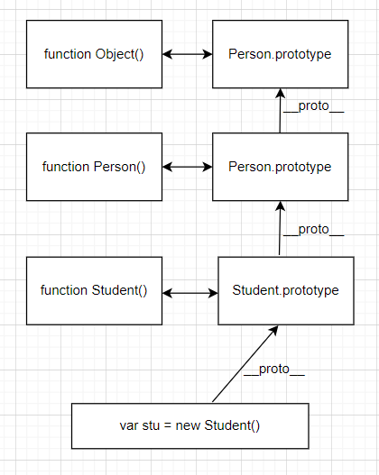 


## 类

### 创建类

在 ES6 中新增加了类的概念，可以使用 class 关键字声明一个类，之后以这个类来实例化对象

类其实就是语法糖

- class本质还是function

- **类的所有方法都定义在类的prototype属性上**，里面有constructor指向类本身

  类可以通过原型对象添加方法

- 类创建的实例,里面也有\_\_proto\_\_指向类的prototype原型对象

类必须使用 new 实例化对象

类声明

```javascript
class Person {
    constructor(name, age) {
        this.name = name;
        this.age = age;
    }
    eating() {
        console.log(this.name + ' eating');
    }
    running() {
        console.log(this.name + ' running');
    }
}
```

类表达式

```javascript
var Animal = class {
    constructor(name, age) {
        this.name = name;
        this.age = age;
    }
    eating() {
        console.log(this.name + ' eating');
    }
    running() {
        console.log(this.name + ' running');
    }
}
```

类的访问器定义

```javascript
class Person {
    constructor(address) {
        this._address = '北京';
    }
    get address() {
        return this._address;
    }
    set address(newAddress) {
        this._address = newAddress;
    }
}
```

类的静态方法

```JavaScript
class Person {
    constructor(name, age) {
        this.name = name;
        this.age = age;
    }
    // 实例方法：通过创建出来的对象进行访问
    eating() {
        console.log(this.name + ' eating');
    }
    // 静态方法：直接通过类调用
    static randomPerson() {
        var names = ['jack', 'tom', 'jerry', 'lucy'];
        var nameIndex = Math.floor(Math.random() * names.length);
        var name = names[nameIndex];
        var age = Math.floor(Math.random() * 100);
        return new Person(name, age);
    }
}
var p = Person.randomPerson();
```


### 构造函数

constructor() 方法是类的构造函数，用于传递参数，返回实例对象

如果没有显示定义, 类内部会自动给我们创建一个constructor()，一个类只能有一个构造函数

通过 new 命令生成对象实例时，自动调用该方法

构造函数执行过程

1. 在内存中创建一个对象
2. 将类的原型prototype赋值给创建出来的对象的\_\_proto\_\_
3. 构造函数内部的this，指向创建出来的新对象
4. 执行函数体中的代码
5. 自动返回创建出来的对象

```javascript
class Person {
  constructor(name,age) {   // constructor 构造方法或者构造函数
      this.name = name;
      this.age = age;
    }
}
var p = new Person('name', 18); 
```

- 不存在变量提升，必须先定义类，才能实例化

- 类里面的公有属性和方法一定要加this使用

  constructor里面的this执行的是创建的实例对象，方法里面的this还是指向方法的调用者

  如果方法想用创建的实例对象，可以定义全局变量，把constructor里面的this赋值给这个全局变量


### 继承

子类可以继承父类的一些属性和方法。

```javascript
// 父类
class Father {
	constructor(surname) {
        this.surname= surname;
	}
	say() {
		console.log('你的姓是' + this.surname);
	}
}
// 子类继承父类
class Son extends Father {
}
var s = new Son('刘');
s.say();
```

**super 关键字**用于访问和调用对象父类上的函数。可以**调用父类的构造函数**，也可以**调用父类的普通函数**

子类在构造函数中使用super, 必须放到 this 前面 (必须**先调用父类的构造方法,再使用子类构造方法**)

```javascript
class Father {
    constructor(x, y) {
        this.x = x;
        this.y = y;
    }
    sum() {
        console.log(this.x + this.y);
    }
    multi() {
        console.log(this.x * this.y);
    }
    print() {
        console.log(this.x);
        console.log(this.y);
    }
    static staticMethod() {
        console.log('FatherStaticMedthod');
    }
}
// 子类继承父类加法方法 同时 扩展减法方法
class Son extends Father {
    constructor(x, y, z) {
        // 利用super 调用父类的构造函数
        // super 必须在子类this之前调用
        super(x, y);
        this.z = z;
    }
    subtract() {
        console.log(this.x - this.y);
    }
    // 子类对父类的方法的重写
    multi() {
        console.log(this.x * this.y * this.z);
    }
    // 子类对父类的方法的重写
    print() {
        // 调用父类方法
        super.print();
        console.log(this.z);
    }
    // 重写静态方法
    static staticMethod() {
        // 调用父类静态方法
        super.staticMethod();
        console.log('SonStaticMedthod');
    }
}
var son = new Son(5, 3);
son.subtract();
son.sum();
```

继承中的属性或者方法查找原则: 就近原则

- 输出一个方法,先看子类有没有这个方法,如果有就先执行子类的
- 如果子类里面没有,就去查找父类有没有这个方法,如果有,就执行父类的这个方法(就近原则)


### 继承内置类

```javascript
class MyArray extends Array {
    firstItem() {
        return this[0];
    }
    lastItem() {
        return this[this.lenght - 1];
    }
}
var arr = new MyArray(1, 2, 3);
console.log(arr.firstItem());
console.log(arr.lastItem());
```


### 类的混入

javascript的类只支持单继承，当需要在一个类中添加更多相似的功能是，可以使用混入mixin

```javascript
class Person { }
// js中只可以单继承
class Student extends Person { }

function mixinRunner(BaseClass) {
    return class extents BaseClass {
        running() {
            console.log('running');
        }
    };
}
function mixinEater(BaseClass) {
    return class extents BaseClass {
        eating() {
            console.log('eating');
        }
    };
}

var NewStudent = mixinEater(mixinRunner(Student));
var ns = new NewStudent();
ns.running();
ns.eating();
```


## 内置对象

### 数学对象Math

Math 对象不是构造函数，具有数学常数和函数的属性和方法。直接使用里面的属性和方法即可

- ##### 圆周率 `Math.PI `

- ##### 向下取整 `Math.floor() `

  往小了取值

- ##### 向上取整 `Math.ceil() ` 

  往大了取值

- ##### 四舍五入 `Math.round()`

   注意 -3.5 结果是 -3 。

  .5特殊，往大了取值

- ##### 绝对值`Math.abs()`

- ##### 求最大和最小值`Math.max()` `Math.min()`

- ##### 随机数`random()`

  取值范围0 <= x < 1

  两个数之间的随机整数，并且包含这两个整数
  
  `Math.floor(Math.random() * (max - min + 1)) + min;`


### 日期对象Date

Date是一个构造函数，需要实例化后才能使用

- Date()不写参数，就返回当前时间

- Date()里面写参数，就返回括号里面输入的时间

- Date 对象是基于1970年1月1日（世界标准时间）起的毫秒数

  获取毫秒数`var now = + new Date();` `Date.now();`


### 数组对象Array

- ##### 检测是否为数组

  `Array.isArray();`(ie9以上版本) 或`xx instanceof Array`

- ##### 末尾添加一个或多个元素 `push(参数1..)`

  修改原数组，返回新的长度

- ##### 删除最后一个元素 `pop()`

  修改原数组，返回删除的元素的值

- ##### 开头添加一个或多个元素 `unshift(参数1..)` 

  修改原数组，返回新的长度

- ##### 删除第一个元素 `shift()` 

  修改原数组，返回第一个元素的值

- ##### 颠倒元素的顺序 `reverse()`

  修改原数组，返回新数组

- ##### 元素进行排序 `sort()` 

  修改原数组，返回新数组

- ##### 查找元素的第一个索引 `indexOf(数组元素)` 

  如果存在返回索引号，不存在返回-1 只返回第一个满足条件的索引号

- ##### 查找元素的最后一个索引 `lastIndexOf(数组元素)` 

  如果存在返回索引号，不存在返回-1

- ##### 数组转换字符串，逗号分隔 `toString()` 

  返回字符串

- ##### 把数组中的所有元素转换为一个字符串 `join('分隔符')` 

  返回字符串

- ##### 连接两个或多个数组 `concat()` 

  不影响原数组，返回新数组

- ##### 数组截取 `slice(begin,end)`

  返回被截取项目的新数组

- ##### 数组删除 `splice(第几个开始，要删除个数)` 

  修改原数组，返回被删除项目的新数组

- ##### 遍历数组`forEach()`

  `array.forEach(function(currentValue, index, arr))`

  `currentValue`：数组当前项的值

  `index`：数组当前项的索引

  `arr`：数组对象本身

- ##### 筛选数组 `filter()`

  `array.filter(function(currentValue, index, arr))`

  返回一个新的数组，把所有满足条件的元素返回回来

- ##### 数组元素是否满足指定条件`some()`

  `array.some(function(currentValue, index, arr))`

  返回值是布尔值

  如果查找到第一个满足条件的元素就终止循环

- ##### 数组元素是否全部满足指定条件`every()`

  `array.every(function(currentValue, index, arr))`

  返回值是布尔值

  如果检测到有一个元素不满足，则整个表达式返回 false ，且剩余的元素不会再进行检测

- ##### 返回新数组 `map() `

  `array.map(function(currentValue, index, arr))`

  返回一个新数组，数组中的元素为原始数组元素调用函数处理后的值

- ##### 伪数组转换为真正数组`from()`

  `Array.from(arrayLike[, mapFn[, thisArg]])`

  对一个类似数组或可迭代对象创建一个新的，浅拷贝的数组实例

  ```javascript
  let arrayLike = {
      '0': 'a',
      '1': 'b',
      '2': 'c',
      length: 3
  }; 
  let arr2 = Array.from(arrayLike); // ['a', 'b', 'c']
  ```

  第二个参数作用类似于数组的`map`方法

  `let newAry = Array.from(aryLike, item => item *2)`

- ##### 返回第一个满足指定条件的数组成员`find()`

  `array.find(function(currentValue, index, arr))`

  没有找到返回undefined

- ##### 回第一个满足指定条件的数组成员位置`findIndex()`

  `array.findIndex(function(currentValue, index, arr))`

  没有找到返回-1

- ##### 是否包含一个指定的值`includes()`

  `arr.includes(searchElement)`

  `arr.includes(searchElement, fromIndex)`

  返回值是布尔值


### 字符串对象

- ##### 基本包装类型

  基本包装类型就是把简单数据类型包装成为复杂数据类型，这样基本数据类型就有了属性和方法

  提供了三个特殊的引用类型：String、Number和 Boolean

  ```javascript
  var str = 'andy';
  console.log(str.length);
  
  // 包装过程
  // 1. 生成临时变量，把简单类型包装为复杂数据类型
  var temp = new String('andy');
  // 2. 赋值给我们声明的字符变量
  str = temp;
  // 3. 销毁临时变量
  temp = null;
  ```

- ##### 字符串的不可变

  里面的值不可变，虽然看上去可以改变内容，但其实是地址变了，内存中新开辟了一个内存空间

- ##### 指定内容的索引`indexOf('要查找的字符',开始的位置)`

  如果存在返回索引号，不存在返回-1

- ##### 指定内容的最后索引`lastIndexOf('要查找的字符')` 

  如果存在返回索引号，不存在返回-1

- ##### 返回指定位置的字符`charAt(index)` 

  `str[index]` H5新增

- ##### 获取指定位置处字符的ASCII码`charCodeAt(index)`

- ##### 连接两个或多个字符串`concat()`

- ##### 截取字符串

  `substr('截取的起始位置','截取几个字符')`

  `slice(start, end)` 从start位置开始，截取到end位置，end取不到 （start和end都是索引）

  `substring(start, end)`从start位置开始，截取到end位置，end取不到 (start和end都是索引）不接受负值

- ##### 替换字符`replace(被替换的字符串/正则表达式 ， 要替换为的字符串) `

  只会替换第一个字符（正则表达式可以通过修饰符来修改匹配机制）

  返回值是一个替换完毕的新字符串

- ##### 切分字符串`split('分隔符')`

- ##### 删除两端空白字符 `trim()`

  不影响原字符串本身，返回新字符串	
  
- ##### 模板字符串

  使用字符串模板来嵌入JS的变量或者表达式来进行拼接（ES6新增）

  ```javascript
  let name = '张三';
  let age = 18;
  function nextAge() {
      return age + 1;
  }
  
  let sayHello = `hello,my name is ${name}`;
  let ageDouble = `double age is ${age * 2}`;
  let ageNext = `next year age is ${nextAge()}`;
  ```

  - 模板字符串中可以换行

- ##### 是否以指定的子字符串开始/结束 `startsWith()`/`endsWith()`

  `startsWith()`：表示参数字符串是否在原字符串的头部，返回布尔值

  `endsWith()`：表示参数字符串是否在原字符串的尾部，返回布尔值

  大小写敏感

- ##### 重复字符串 `repeat()`

  `string.repeat(count)`

  返回新字符串


### 正则对象RegExp

- ##### 创建正则表达式

  `var 变量名 = new RegExp(/表达式/); `

  或通过字面量创建 `var 变量名 = /表达式/;`

- ##### 测试正则表达式 `test()`

  `regexObj.test(str) `

  - `regexObj `正则表达式
  - `str` 测试文本


### 唯一值集合Set

`Set `是唯一值的集合。不能提供索引。

- ##### 创建`Set`数据结构

  `const s = new Set();`

  可以接受一个可遍历数据作为参数，用来初始化

  `const set = new Set([1, 2, 3, 4, 4]);`

- ##### 元素个数 `set.size`

- ##### 添加元素 `set.add(value)`

  如果已有重复，则不产生效果

  返回集合本身

- ##### 删除元素 `set.delete(value)`

  如果并不存在，则不产生效果

  返回集合本身

- ##### 是否含有指定元素 `set.has(value)`

  返回布尔值

- ##### 清空集合`set.clear()`

  没有返回值

- ##### 遍历 `forEach`

  `set.forEach(callback)`

- ##### 数组去重

  ```javascript
  function do(array) {
    return Array.from(new Set(array));
  }
  do([1, 1, 2, 3]) // [1, 2, 3]
  ```

  ```javascript
  let arr = [3, 5, 2, 2, 5, 5];
  let unique = [...new Set(arr)]; // [3, 5, 2]
  ```


# 预解析和作用域

## 预解析

**js引擎运行js分为两步：1. 预解析 2. 代码执行**

1. js引擎会把js里面所有的var 还有 function 提升到当前作用域的最前面。
2. 之后按照书写的顺序代码从上往下执行

### 变量提升

把所有的**变量声明提升到当前的作用域最前面**

只提升变量声明，**不提升赋值操作**

```javascript
console.log(num); // 输出undefined
var num = 10;

fun();			  // 报错
var fun = function() {
    console.log(22);
}
```

**块极变量`let`和`const`声明的变量只能在作用域内访问，不存在变量提升**

**暂时性死区**：在当前同级作用域内在达到声明处之前都是无法访问的

- let、const关键字声明的变量会产生块级作用域，会先在作用域中被创建出来，但是如果此时还未完成语法绑定，如果访问就会抛出错误

  ```javascript
  console.log(a);
  let a = 1;
  ```

  ```javascript
  var tmp = 123;
  if (true) { 
  	tmp = 'abc';
  	let tmp; 
  }
  ```


### 函数提升

把所有的函数声明提升到当前作用域的最前面

只声明函数，不调用函数


## 作用域

### 全局作用域和全局变量

**全局作用域**：整个script标签或者整个js文件

**全局变量**：在全局作用域下的变量

- 在全局作用域下声明的变量是全局变量

  在函数内部，**没有声明而直接赋值的变量**也是全局变量局部变量

  ```javascript
  function fun() {
      var num1 = 10; // 局部
      num2 = 20;	   // 全局
  }
  ```

  ```javascript
  function foo() {
      var a = b = 10;
      // 转化为 var a = 10; b = 10;
  }
  foo();
  console.log(a);	// 报错
  console.log(b);	// 10
  ```

- 浏览器关闭才会销毁。占内存


### 局部作用域和局部变量

**局部作用域/函数作用域**：只在函数内部起效果

**局部变量：**在局部作用域下的变量

- 在函数内部的声明变量就是局部变量
- 代码块执行才会初始化，代码结束就会销毁，节省内存


### 块级作用域和块级变量

**块级作用域：**ES6中新增，在{ } 内，通过let、const、function、class声明的标识符是具备块级作用域的限制

有的浏览器会对函数的声明进行特殊的处理（兼容以前的代码），允许像var那样进行提升

```javascript
{
    var name = 'jack';
    let foo = 'foo';
    function bar() {
        console.log('bar');
    }
    class Person {}
}
console.log(name);		// 'jack'
console.log(foo);		// ReferenceError: foo is not defined
bar();					// 可以访问
var p = new Person();	// ReferenceError: Person is not defined
```

**if-switch-for都是块级作用域**

```javascript
if (true) {
  var foo = "foo";
  let bar = "bar";
}
console.log(foo);	// foo
console.log(bar);	// ReferenceError: bar is not defined
```

```javascript
switch (color) {
  case "red":
    var foo = "foo";
    let bar = "bar";
}
console.log(foo);	// foo
console.log(bar);	// ReferenceError: bar is not defined
```

```javascript
for (var i = 0; i < 10; i++) {
    console.log("Hello World" + i);
}
console.log(i);		// 10

for (let j = 0; j < 10; j++) {
    console.log("Hello World" + j);
}
console.log(j);		// ReferenceError: j is not defined
```

获取多个按钮监听点击

```javascript
const btns = document.getElementsByTagName('button');
// 上层作用域的i已经是最后的结果了
// for (var i = 0; i < btns.length; i++) {
// 	btns[i].onclick = function() {
//         console.log("第" + i + "个按钮被点击")
//     }
// }

for (var i = 0; i < btns.length; i++) {
  (function(n) {
    btns[i].onclick = function() {
        console.log("第" + n + "个按钮被点击")
    }
  })(i)
}

for (let j = 0; j < btns.length; j++) {
  btns[j].onclick = function() {
    console.log("第" + j + "个按钮被点击")
  }
}
```


### 作用域链

内部函数查找外部函数的变量，采取**链式查找**的方式来决定取哪个值，就称为作用域链

就近原则，从目标出发，**一层一层往外查找**


### with语句

with语句扩展一个语句的作用域链，可以形成自己的作用域

不建议使用，在严格模式下不能使用

```javascript
var obj = { name: 'jack', age: 18, message: 'hello world' };
function foo() {
    function bar() {
        with(obj) {
            // 变量在查找时，不会直接到函数的AO去查找，会先去with的函数对象中去查找，如果没有找到再去上一层找
            console.log(message);
        }
    }
    bar();
}
foo();
```


## JS引擎解析运行

### 全局对象

引擎会在执行代码之前，会在堆内存中创建**全局对象**（**GlobalObject** -> GO）

- 该对象所有的作用域（scope）都可以访问
- 里面会包含Date、Array、String、Number、setTimeout、setInterval等
- 包含一个**window**属性，指向自己

```javascript
var name = 'why';
var num1 = 20;
var num2 = 30;
var result = num1 + num2;
function foo {
    console.log('foo');
}

// 解析后的 GlobalObject -> go 对象
var globalObject = {
    String: '类',
    Date: '类',
    setTimeout: '函数',
    window: globalObject,
    name: undefined,
    num1: undefined,
    num2: undefined,
    result: undefined,
    foo: 0xa00
}
```


### 执行上下文栈

引擎内部会有一个执行上下文栈（Execution Context Stack -> ECStack 函数调用栈），用于执行代码的调用栈

代码如果要执行，需要放入执行上下文栈中去运行（**入栈**）

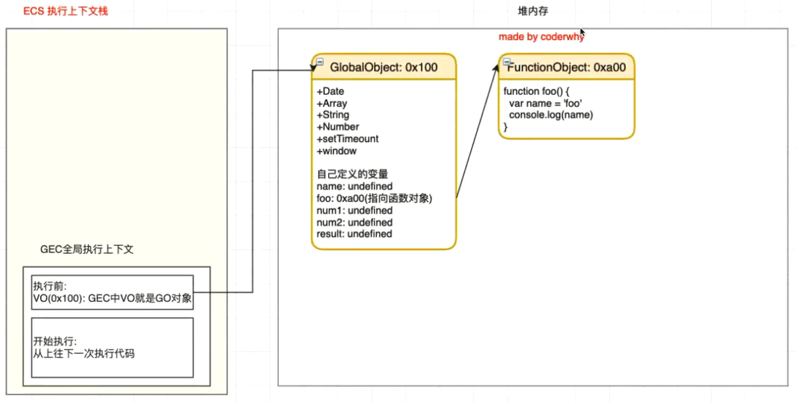 


### 全局执行上下文

全局代码为了执行，会创建全局执行上下文（Global Execution Context），会被放到ECStack中执行

全局执行上下文（GEC）被放入到执行上下文栈（ECS）中，里面包含两个部分

1. 代码在执行前，在解析器（parser）转成抽象语法树（AST）的过程中，会将**全局定义的变量、函数等加入到GlobalObject中**，但是并**不会赋值**。这个过程也称为**变量的作用域提升**（hoisting）

   **编译函数**时，会在内存中开辟一块空间去存储函数，其中包括**父级作用域**（parent scope）和**函数的执行体**（代码块）

   在全局对象（GO）中的函数定义**保存函数存储空间的内存地址**

2. 在代码执行中，按照顺序**从上往下执行代码**，对变量赋值，或者执行其他的函数


### 函数执行上下文

函数执行时，会根据函数体创建一个函数执行上下文（Functional Execution Content -> FEC）,并且加入到执行上下文栈（EC Stack）中

一旦函数执行结束，函数执行上下文会移出栈，并销毁掉

函数执行上下文（FEC）中包含三部分内容

1. 在解析函数成为抽象语法树（AST）结构时，会创建一个**函数活跃对象**（Activation Object -> **AO**）

   AO中包含形参、arguments、函数定义和指向函数对象、定义的变量

   AO对象在函数执行结束后，如果没有引用指向它，就会被销毁掉

2. **作用域链**：由变量对象（Variable Object -> VO）（在函数中就是AO对象）和父级VO组成，查找时会一层层查找

   - 当**查找一个变量**时，查找路径是**沿着作用域链一层一层往上查找**

     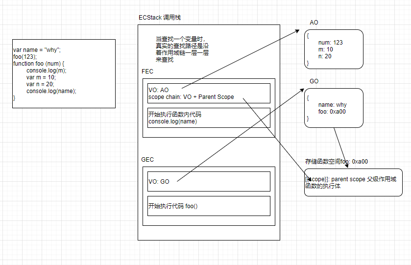 

   - 在函数被编译的时候，父级作用域已经确定了

     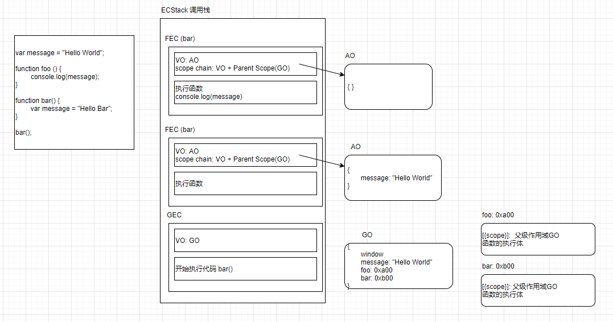 

    

3. **this绑定的值**：**动态绑定**，不是在编译时而是在执行时绑定

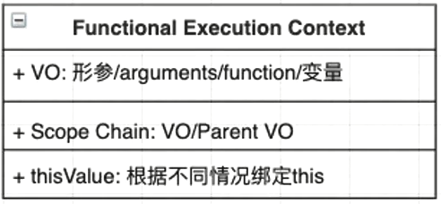  


### 变量对象 

**早期ECMA版本规范**：每一个执行上下文会被关联到一个**变量对象**（Variable Object -> VO），在源代码中的变量和函数声明会被作为属性添加到VO中。对于函数来说，参数也会被添加到VO中

**最新ECMA版本规范**：每一个执行上下文会关联到一个**变量环境**（Variable  Environment）中，在执行代码中变量和函数的声明会作为环境记录（Environment Record）添加带变量环境中。对于函数来说，参数也会被作为环境记录添加到变量环境中。环境记录不一定是对象形式。


## 内存管理

### 栈内存和堆内存

javaScript会在**定义变量时分配内存**

**基本数据类型**内存的分配会在执行时，直接在**栈空间**进行分配

**复杂数据类型**内存的分配会在**堆内存**中开辟一块空间，并且将这块空间的**指针**返回值变量引用

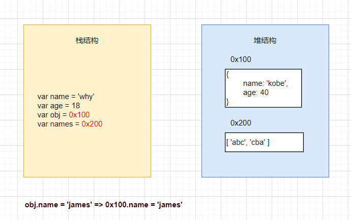 


### 垃圾回收

内存的大小是有限的，所有当内存不再需要的时候，需要对其进行释放，以便腾出更多内存空间

#### GC算法：引用计数

当一个对象有一个**引用指向**它时，那么这个对象的引用就**+1**，当一个对象的**引用为0**时，这个对象就可以被**销毁**

 

这个算法有很大的弊端，就是会产生**循环引用**

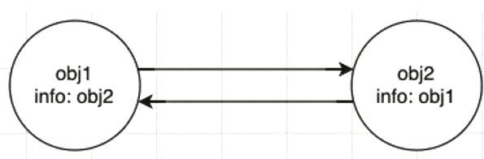 

如果忘记清除引用`obj.info = null`的时候，内存永远也不会释放，会造成内存泄漏


#### GC算法：标记清除

设置一个**根对象**（root object），垃圾回收器会定期从这个根开始，找所有**从根开始有引用到的对象**，对于哪些没有引用到的对象，就认为是不可用的对象

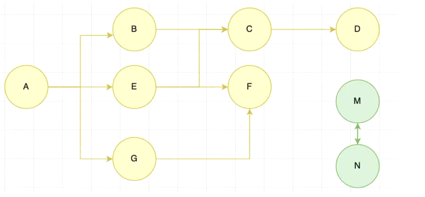 

这个算法可以很好解决循环引用的问题

JS引擎比较广泛的采用标记清除算法，V8引擎为了更好的优化，也在算法的实现细节上结合一些其他的算法


### 函数执行内存变化

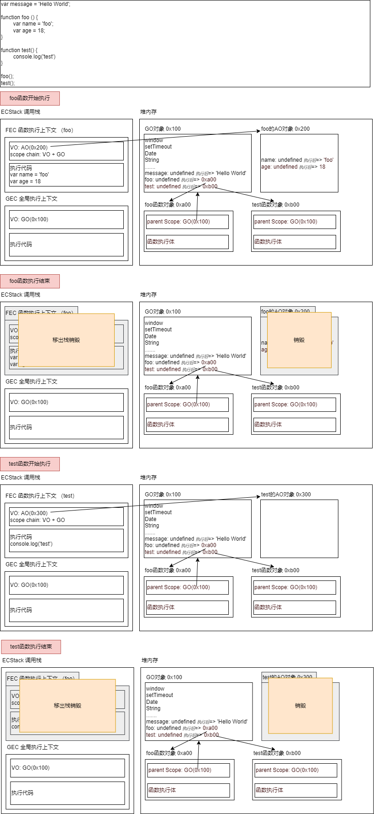 


## 闭包

闭包（closure）指**有权访问另一个函数作用域中变量的函数**。

也就是说，闭包可以让：**在一个作用域（内层函数）可以访问到另外一个函数内部（其外层函数）的局部变量（作用域）**

闭包是两部分组成的：**函数+可以访问的自由变量**

闭包的作用是延伸变量的作用范围

```javascript
function fn() {
	var num = 10;
    return function {
        console.log(num); // 10
    }
}
var f = fn();
// 访问了另外一个函数 fn 里面的局部变量 num
f();
```

- 利用闭包循环注册点击事件

  ```javascript
  var lis = document.querySelector('.nav').querySelectorAll('li');
  // 利用闭包的方式得到当前小li 的索引号
  for (var i = 0; i < lis.length; i++) {
      // 利用for循环创建了4个立即执行函数
      // 立即执行函数也成为小闭包因为立即执行函数里面的任何一个函数都可以使用它的i这变量
      (function(i) {
      	lis[i].onclick = function() {
          	console.log(i);
      	}
  	})(i);
  }
  ```

- 定时器中的闭包

  ```javascript
  // 3秒钟之后,打印所有li元素的内容
  var lis = document.querySelector('.nav').querySelectorAll('li');
  for (var i = 0; i < lis.length; i++) {
      (function(i) {
          setTimeout(function() {
              console.log(lis[i].innerHTML);
          }, 3000)
      })(i);
  }
  ```

- 闭包思考题

  ```javascript
  var name = "The Window";
  var object = {
      name: "My Object",
      getNameFunc: function() {
          return function() {
  			return this.name;
  		};
      }
  }
  console.log(object.getNameFunc()());
  
  // var f = object.getNameFunc(); 类似于
  var f = function() {
      // this指向是window
      return this.name;
  }
  f();
  ```

**每当创建一个函数，闭包就会在函数创建的同时被创建出来**

```javascript
// 创建函数，形成闭包
var name = 'demo';		// 可以访问的外层作用域
function demo() {		// 函数
    console.log(name)
}
```

函数执行过程解释闭包原理以及**闭包的内存泄漏**

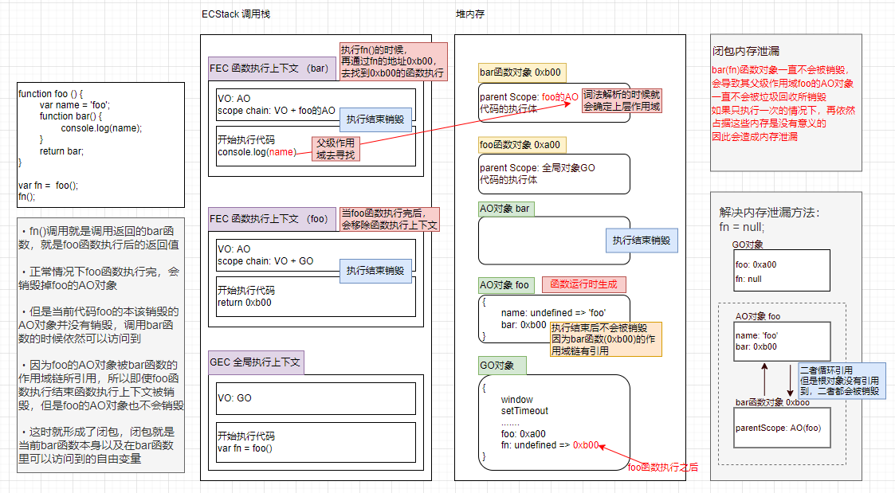

AO对象不会被销毁时，不被使用的属性会被释放

 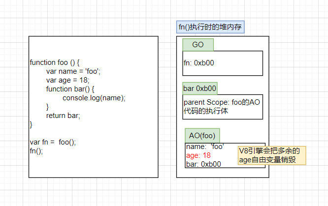


## this指向

### this指向的绑定

this的指向的**跟函数所处的位置没有关系**，**跟函数被调用的方式有关系**

this是在**运行时被绑定**的

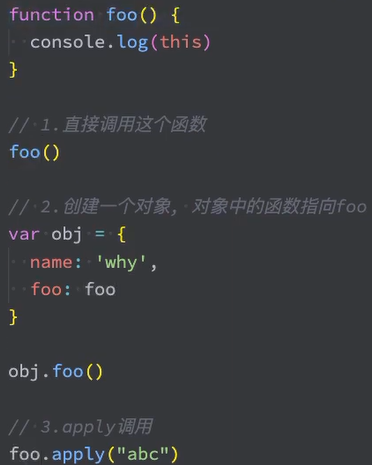 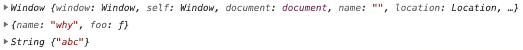

如果没有this，很多问题也是有解决方案的，但是编写代码会非常不方便

```javascript
// this 的写法
var obj1 = {
    name: 'jack',
    eating: function() {
        console.log(this.name + 'is eating');
    }
    running: function() {
        console.log(this.name + 'is running');
    }
    studying: function() {
        console.log(this.name + 'is studying');
    }
}
var obj2 = {
    name: 'john',
    eating: function() {
        console.log(this.name + 'is eating');
    }
    running: function() {
        console.log(this.name + 'is running');
    }
    studying: function() {
        console.log(this.name + 'is studying');
    }
}
// 不使用this
var obj1 = {
    name: 'jack',
    eating: function() {
        console.log(obj1.name + 'is eating');
    }
    running: function() {
        console.log(obj1.name + 'is running');
    }
    studying: function() {
        console.log(obj1.name + 'is studying');
    }
}
var obj2 = {
    name: 'john',
    eating: function() {
        console.log(obj2.name + 'is eating');
    }
    running: function() {
        console.log(obj2.name + 'is running');
    }
    studying: function() {
        console.log(obj2.name + 'is studying');
    }
}
```


### 全局作用域的指向

- **浏览器**：**window**（globalObject）

  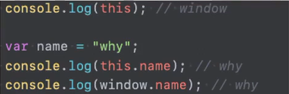 

- **Node**： **{}** 空对象 

  （Node的执行机制决定的：把js文件当成模块module -> 加载 -> 编译 -> 所有代码放到一个函数中 -> 执行这个函数.apply({})）

开发中很少全局作用域下使用this，通常都是在函数中使用

1. 所有的函数在调用时，都会创建一个执行上下文

2. 这个上下文对象中记录着函数的调用栈、AO对象等

3. this也是其中的一条记录


### 内置函数的指向

#### setTimeout

```javascript
setTimeout(function() {
    console.log(this);
}, 1000);
// 结果 window
```

```javascript
// setTimeout内部直接独立调用传入的方法，所以默认绑定window
function hySetTimeout(fn, duration) {
    fn();
}
hySetTimeout(function() {
    console.log(this);	// window
}, 3000)
```


#### 监听事件

```javascript
const boxDiv = document.querySelector('.box')
boxDiv.onclick = function() {
    console.log(this);
}
// 结果 .box的BOM对象
// 浏览器内部使用boxDiv.click()调用该事件，隐式绑定到该BOM对象上
```

```javascript
const boxDiv = document.querySelector('.box')
boxDiv.addEventLinstener('click', function() {
    console.log(this);
})
// 结果 .box的BOM对象
// 浏览器内部使用fn.call(boxDiv)调用该事件，显式绑定到该BOM对象上
```


#### 数组方法

```javascript
var names = ['abc', 'cba', 'nba'];
names.forEach(function(item) {
    console.log(this);
})
// 结果 循环打印window
```

数组的.forEach/map/filter/find.. 方法的第二个参数可以绑定this的指向

`forEach(callbackfn: (value: string, index: number, array: string[]) => void, thisArg?: any): void`

```javascript
var obj = { name: 'jack' };
var names = ['abc', 'cba', 'nba'];
names.forEach(function(item) {
    console.log(this);
}, obj);
// 结果 循环打印obj对象
```


### 默认绑定

**独立函数调用**的情况下使用默认绑定

独立函数调用可以理解成函数没有被绑定到某个对象上进行调用

```javascript
// 案例1
function foo() {
    console.log(this);
}
foo();
// 结果：window

// 案例2
function test1() {
    console.log(this);
    test2();
}
function test2() {
    console.log(this);
    test3();
}
function test3() {
    console.log(this);
}
test1();
// 结果：window window window

// 案例3
function foo(func) {
    func();
}
var obj = {
    name: 'why',
    bar: function() {
        console.log(this);
    }
}
foo(obj.bar);
```


### 隐式绑定

函数**通过某个对象进行调用**，是通过某个对象发起的函数调用

object.fn()此时object对象会被js引擎绑定到fn函数中的this里

隐式绑定有前提条件

1. 必须在调用的对象内部有一个对函数的引用（比如一个属性）
2. 如果没有这样的引用，在进行调用时，会报找不到该函数的错误
3. 正是通过这个引用，间接的将this绑定到了这个对象上

```javascript
// 案例1
function foo() {
    console.log(this);
}
var obj = {
    name: 'obj',
    foo: foo
}
obj.foo();
// 结果：obj

// 案例2
function foo() {
    console.log(this);
}
var obj1 = {
    name: 'obj1',
    foo: foo
}
var obj2 = {
    name: 'obj2',
    obj1: obj1
}
obj2.obj1.foo();
// 结果：obj1

// 案例3
function foo() {
    console.log(this);
}
var obj = {
    name: 'obj',
    foo: foo
}
var bar = obj.foo;
bar();
// 结果：window
// 此时执行bar已经获取不到obj的name
```


### 显式绑定

如果不希望在对象内部包含这个函数的引用，同时又希望在这个对象上进行强制调用

#### call

调用这个函数, 并且修改函数运行时的 `this `指向  

`fun.call(thisArg, arg1, arg2, ...)`

- `thisArg `：当前调用函数 `this `的指向对象
- `arg1`，`arg2`：传递的其他参数

```javascript
function fn(x, y) {
	console.log(this);
	console.log(x + y);	
}
var o = {
	name: 'andy'
};
// call() 可以改变这个函数的this指向 此时这个函数的this 就指向了o这个对象
fn.call(o, 1, 2);
```

#### apply

调用这个函数, 并且修改函数运行时的 `this `指向 

`fun.apply(thisArg, [argsArray])`

- `thisArg `：当前调用函数 `this `的指向对象
- `argsArray`：传递的值参数必须是数组

利用 `apply() `借助于数学内置对象求数组最大值

```javascript
var arr = [1, 66, 3, 99, 4];
var max = Math.max.apply(Math, arr);
```

#### bind

不会调用函数。但是能改变函数内部this 指向 

`fun.bind(thisArg, arg1, arg2, ...) `

- `thisArg `：在 fun 函数运行时指定的 this 值
- `arg1`，`arg2`：传递的其他参数
- 返回的是原函数改变this之后产生的新函数

如果有的函数不需要立即调用,但是又想改变这个函数内部的`this`指向此时用`bind()`

```javascript
// 点击按钮,禁用按钮3秒钟
var btns = document.querySelectorAll('button');
for (var i = 0; i < btns.length; i++) {
	btns[i].onclick = function() {
    	this.disabled = true;
        setTimeout(function() {
            this.disabled = false;
        }.bind(this), 2000);
    }
}
```


### new 绑定

函数可以当做一个类的构造函数来使用，也就是使用new关键字

使用new关键字来调用函数会执行如下操作

1. 创建一个全新的对象
2. 这个新对象会被执行prototype连接
3. 这个新对象会绑定到函数调用的this上（this 绑定在这个步骤完成）
4. 如果函数没有返回其他对象，表达式会返回这个新对象

```javascript
function Person(name, age) {
    this.name = 'name';
    this.age = 'age';
}
var p1 = new Person('why', 18);
```


### 绑定优先级 

**new绑定 > 显示绑定 > 隐式绑定 > 默认绑定**

- ##### 默认绑定优先级最低

  默认绑定优先级最低，存在其他规则时，就会通过其他规则的方式来绑定this

- ##### 显示绑定 > 隐式绑定

  ```javascript
  var obj = {
      name: 'obj',
      foo: function() {
          console.log(this);
      }
  }
  obj.foo();						// obj
  obj.foo.call('abc');			// abc
  obj.foo.apply('abc');			// abc
  var bar = obj.foo.bind('cba');
  bar();							// cba
  ```

  ```javascript
  function foo() {
      console.log(this);
  }
  var obj = {
      name: 'obj',
      foo: foo.bind('aaa')
  }
  obj.foo();
  // aaa
  ```

- ##### new绑定 > 隐式绑定

  ```javascript
  var obj = {
      name: 'obj',
      foo: function() {
          console.log(this);
      }
  }
  var f = new obj.foo();
  // foo {}
  ```

- ##### new绑定 > 显式绑定

  new关键字不能和apply / call 一起来使用

  new关键字只能和bind一起使用

  ```javascript
  function foo() {
      console.log(this);
  }
  var bar = foo.bind('aaa');
  var obj = new bar();
  // foo {}
  ```


### 特殊绑定

- ##### 忽略显示绑定

  apply / call / bind ： 当传入 null / undefined 时，自动将this绑定成全局对象

  ```javascript
  function foo() {
      console.log(this);
  }
  foo.apply('abc');		// abc
  foo.apply({});			// {}
  
  foo.apply(null);		// window
  foo.apply(undefined);	// window
  var bar = foo.bind(null);
  bar();					// window
  ```

- ##### 间接函数引用

  创建一个函数的间接引用，使用默认绑定规则

  ```javascript
  var obj1 = {
      name: 'obj1',
      foo: function() {
          console.log(this);
      }
  }
  var obj2 = {
      name: 'obj2'
  }
  obj2.bar = obj1.foo
  obj2.bar();
  // 结果 obj2
  
  // 加上小括号相当于将这个看成一个整体
  // 会当成独立的函数调用
  (obj2.bar = obj1.foo)();
  // 结果 window
  ```

  

### 箭头函数的this

箭头函数不使用this的四种标准规则（默认、隐式、显示、new），而是根据**外层作用域来决定this**（也就是**不绑定this**）

不断的从上层作用域找对应的this

```javascript
var foo = () => {
    console.log(this);
}
foo();					// window
var obj = { foo: foo };
obj.foo();				// window
foo.call('abc');		// window
```

```javascript
// 不使用箭头函数的解决方案
var obj = {
    data: [],
    // 发送请求，将结果添加到data属性中
    getData: function() {
        var _this = this;
        setTimeout(function) {
            var result = ['abc', 'cba', 'nba'];
            _this.data = result;
        }, 2000);
    }
}

// 使用箭头函数的解决方案
var obj = {
    data: [],
    // 发送请求，将结果添加到data属性中
    getData: function() {
        setTimeout(() => {
            var result = ['abc', 'cba', 'nba'];
            // 从上层作用域寻找属性
            this.data = result;
        }, 2000);
    }
}

obj.getData();
```

```javascript
const obj = { name: '张三'} 
function fn () {
    console.log(this);
    return () => {
        console.log(this)
    } 
} 
const resFn = fn.call(obj);
resFn();
// { name: '张三'}
```

```javascript
var age = 100;
var obj = {
	age: 20, // 定义对象不会产生作用域
	say: () => {
		alert(this.age)
	}
}
obj.say(); // 100
```


### 面试题练习

```javascript
var name = "window";
var person = {
  name: "person",
  sayName: function () {
    console.log(this.name);
  }
};
function sayName() {
  var sss = person.sayName;
  sss(); 					// window 独立函数调用
  person.sayName(); 		// person 隐式调用
  (person.sayName)(); 		// person 隐式调用
  (b = person.sayName)(); 	// window 有赋值表达式，间接函数引用，独立函数调用
}
sayName();
```

```javascript
var name = 'window'
var person1 = {
  name: 'person1',
  foo1: function () {
    console.log(this.name)
  },
  foo2: () => console.log(this.name),
  foo3: function () {
    return function () {
      console.log(this.name)
    }
  },
  foo4: function () {
    return () => {
      console.log(this.name)
    }
  }
}

var person2 = { name: 'person2' }

person1.foo1(); 				// person1 隐式绑定
person1.foo1.call(person2); 	// person2 显式绑定

person1.foo2();					// window 箭头函数，找上层作用域
person1.foo2.call(person2);		// window 箭头函数，找上层作用域，4种绑定都无效

person1.foo3()();				// window 独立函数调用，第二遍调用的时候没有绑定
person1.foo3.call(person2)();	// window 独立函数调用，第二遍调用的时候没有绑定
person1.foo3().call(person2);	// person2 显式绑定，最终的调用是显式绑定

person1.foo4()();				// person1 箭头函数，上层作用域是foo4，foo4作用域中的this是person1
person1.foo4.call(person2)();	// person2 箭头函数，上层作用域被显式绑定了person2
person1.foo4().call(person2);	// person1 箭头函数，上层foo4作用域中的this是person1，箭头函数显式绑定无效
```

```javascript
var name = 'window'
function Person (name) {
  this.name = name
  this.foo1 = function () {
    console.log(this.name)
  },
  this.foo2 = () => console.log(this.name),
  this.foo3 = function () {
    return function () {
      console.log(this.name)
    }
  },
  this.foo4 = function () {
    return () => {
      console.log(this.name)
    }
  }
}
var person1 = new Person('person1')
var person2 = new Person('person2')

person1.foo1() 					// person1 隐式绑定
person1.foo1.call(person2)		// person2 显式绑定

person1.foo2()					// person1 箭头函数，上层作用域是Person，也就是person1
person1.foo2.call(person2)		// person1 箭头函数，绑定无效，上层作用域是Person，也就是person1

person1.foo3()()				// window 独立函数调用
person1.foo3.call(person2)()	// window 最终的调用是独立函数调用
person1.foo3().call(person2)	// person2 显式绑定

person1.foo4()()				// person1 箭头函数，上层作用域是Person，也就是person1
person1.foo4.call(person2)()	// person2 上层作用域的foo4绑定到person2
person1.foo4().call(person2)	// person1 箭头函数，绑定无效，上层作用域是Person，也就是person1
```

```javascript
var name = 'window'
function Person (name) {
  this.name = name
  this.obj = {
    name: 'obj',
    foo1: function () {
      return function () {
        console.log(this.name)
      }
    },
    foo2: function () {
      return () => {
        console.log(this.name)
      }
    }
  }
}
var person1 = new Person('person1')
var person2 = new Person('person2')

person1.obj.foo1()()				// window 独立函数调用
person1.obj.foo1.call(person2)()	// window 最终的调用是独立函数调用
person1.obj.foo1().call(person2)	// person2 显式绑定

person1.obj.foo2()()				// obj 箭头函数，上层作用域是foo2，foo2是被obj调用的，this是obj
person1.obj.foo2.call(person2)()	// person2 箭头函数，上层作用域foo2被绑定到person2
person1.obj.foo2().call(person2)	// obj 箭头函数，显式绑定无效，上层作用域是foo2，foo2是被obj调用的，this是obj
```


# 同步和异步

## 同步任务和异步任务

- ##### 同步任务

  同步任务都在**主线程上执行**，形成一个**执行栈**

- ##### 异步任务

  异步是通过回调函数实现的

  异步任务有以下三种类型:

  1. 普通**事件**，如 click、resize 等
  2. **资源加载**，如 load、error 等
  3. **定时器**，包括 setInterval、setTimeout 等
  4. **Ajax**等

  **异步任务相关回调函数添加到任务队列中**（任务队列也称为消息队列）

   

  

## 宏任务和微任务

- ##### 宏任务

  **setTimeout**，**setInterval**，requestAnimationFrame，I/O

- ##### 微任务

  process，nextTick，**Promise**，Object，observe，MutationObserver

- ##### 执行优先级

  1. 同步的代码
  2. 微任务的异步代码
  3. 宏任务的异步代码

**异步中先执行微任务再执行宏任务。**

**如果宏任务中有微任务，会执行完当前宏任务中的所有微任务以后，再执行下一个宏任务**

  ```javascript
console.log(1);
setTimeout(function(){					// 宏任务 进入事件队列
    console.log(2);
    new Promise(function(resovle){
        console.log(3);
        resolve();
    }).then(function(){					// 在宏任务中有微任务，先执行完所有微任务，再去执行下一个宏任务
        console.log(4);
    })
}, 0)
new Promise(function(resolve){			// 微任务 进入事件队列
    console.log(5);
    resolve();
}).then(function(){
    console.log(6);
})
setTimeout(function(){					// 宏任务 进入事件队列
    console.log(7);
    new Promise(function(resolve){
        console.log(8);
        resolve();
    }).then(function(){
        console.log(9);
    })
    console.log(10);
}, 0)
console.log(11);
// 执行顺序
// 1 5 11 6 2 3 4 7 8 10 9
  ```


##  执行机制

1. **先执行执行栈中的同步任务**

2. **异步任务**（回调函数）放入**任务队列中**

3. 一旦执行栈中的所有**同步任务执行完毕**，系统就会**按次序读取任务队列中的异步任务**

   被读取的异步任务结束等待状态，进入执行栈，开始执行

   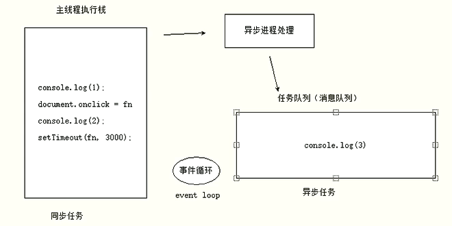 

   **异步函数会先提交给异步进程进行处理，异步进程处理决定是否放入到任务队列中**

   例如`onclick`的异步任务，**只有在点击了，才会进入任务队列**。**定时器时间到了，回调函数才会放入任务队列**中去

   由于主线程不断的重复获得任务、执行任务、再获取任务、再执行，所以这种机制被称为**事件循环**（ event loop）


## 回调函数

**正常方式是不能获取异步函数内的返回值**，只能返回undefined

```javascript
getCallbackData(){
    setTimeOut(()=>{
		var username = "张三";
		return username; 
    }, 1000);
}
```

使用回调函数获取异步函数返回值

```javascript
getCallbackData(callbackFunc){
    setTimeOut(()=>{
		var username = "张三";
		callbackFunc(username); 
    }, 1000);
}

let callbackData = getCallbackData((data)=>{
    console.log(data);
});
```

但是回调函数会引发**地狱回调**的问题

```javascript
// 两个异步函数无法确定哪个谁先执行完
&.ajax({
    url:"php/ok.php",
    sucess: function(res) {
        console.log('结果111', res);
    }
})
&.ajax({
    url:"php/ok.php",
    sucess: function(res) {
        console.log('结果22', res);
    }
})

// 利用回调函数嵌套规定执行顺序，但是如果一直嵌套会造成地狱回调问题
&.ajax({
    url:"php/ok.php",
    sucess: function(res) {
        console.log('结果111', res);
		&.ajax({
    		url:"php/ok.php",
    		sucess: function(res) {
        		console.log('结果22', res);
                &.ajax({
		    		url:"php/ok.php",
		    		sucess: function(res) {
	        		console.log('结果33', res);
			    	}
				})
	    	}
		})
    } 
})
```


## Promise

### 理解Promise

 Promise对象用于表示一个异步操作的最终完成（或失败），以及其结果值

```javascript
let p = new promise(function(resolve, reject){
    // 处理异步操作
    setTimeout(function(){
        // 生成1-10的随机数
        var num = Math.ceil(Math.random() * 10);
        if(num<=5){
            // resolve 成功的函数
            resolve(num);
        }
        else{
            // reject 失败的函数
            reject('数字太大了');
        }
    }, 2000);
})
// p.then(成功的函数resolve, 失败的函数reject(可以省略))
p.then(function(data){
    // 成功函数
    console.log('resolved');
    console.log(data);
}, function(reason, data){
    // 失败函数
    console.log('rejected');
    console.log(reason);
})
```

解决地狱回调，使用链式编程

```javascript
let p = new promise(function(resolve, reject){
	&.ajax({
	    url:"php/ok.php",
	    sucess: function(res) {
	        console.log('结果111', res);
	    }
	})
})
p.then(function(res){
    console.log('成功的结果',res);
    let p2 = new promise(function(resolve, reject){
		&.ajax({
		    url:"php/ok.php",
		    sucess: function(res) {
		        console.log('结果222', res);
		    }
		})
	})
}).then(function(res){
    console.log('成功的结果2',res);
})
```


### 执行顺序

**new Promise会立即执行，then的需要异步的**

```javascript
console.log(1);
let p = new Promise(function(resolve, reject){
    console.log(2)
    resovle();
})
p.then(function(){
    console.log(3);
})
console.log(4);
// 执行结果
// 1 2 4 3
```

先微后宏

在异步处理中then的回调比setTimeout先执行

```javascript
const first = () => (new Promise(resolve, reject) => {
    console.log(3);
    let p = new Promise((resolve, reject) => {
        console.log(7);
        setTimeout(() => {
            console.log(5);
            resolve(6);
        }, 0);
        resolve(1);
    });
    resolve(2);
    p.then((arg) => {
       console.log(arg); 
    });
}));
first().then((arg) => {
   console.log(arg); 
});
console.log(4);
// 执行结果
// 3 7 4 1 2 5
// 一个promise的resolve只能调用一次
// 6 不执行 
```

理解then的第二回调函数和catch

```javascript
asyncThing1()
    .then(function(){ 
    	return asyncThing2();
	})
	.then(function(){
    	return asyncThing3();
	})
	.catch(function(){
    	return asyncRecovery1();
	})
	.then(
		function(){
            return asyncThing4();
        },
    	function(err){
            return asyncRecovery2();
        }
	)
	.catch(function(err){
    	console.log("Dont't worry about it");
	})
	.then(function(){
    	console.log("All done!");
	})
```

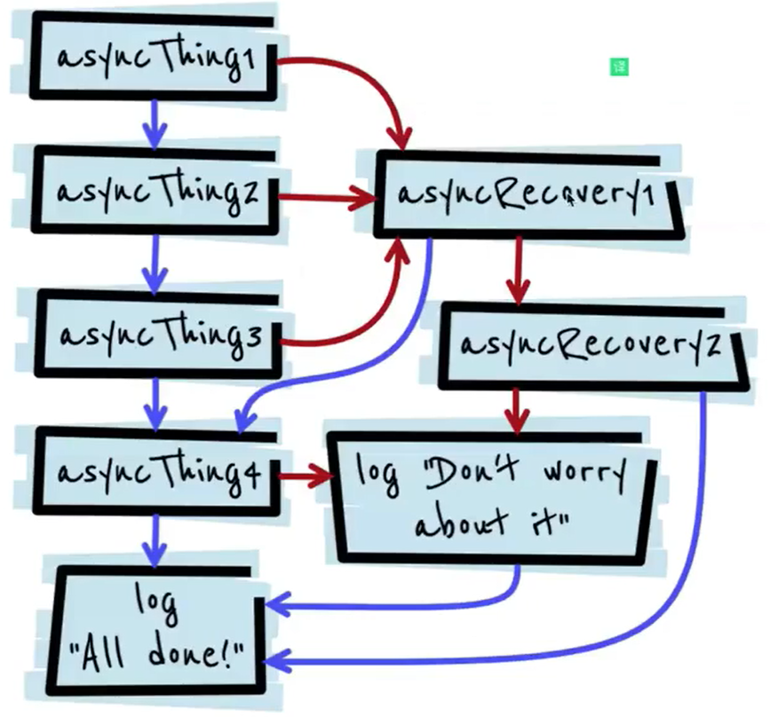 


### async和await

使用async和await省略then，代码清晰易读

```javascript
document.getElementById('btn').onclick = async () => {
    // 使用await省略then
    let res = await axios();
    console.log('结果', res);
}
```

- async函数就是generator函数加yield的语法糖

  ```javascript
  // function关键字与函数名之间有一个星号，函数内部使用yield表达式
  function* hellowWorldGenerator {
      yield 'hello';	// yield类似暂停标记，分段执行，看到yield就分一段
      yield 'world';
      return 'ending';
  }
  var hw = hellowWorldGenerator();
  console.log(hw);		// 返回的是一个暂停标记，指向的是hello结果
  console.log(hw.next());	// next拿出暂停的值
  console.log(hw.next());	// world
  console.log(hw.next());	// ending
  console.log(hw.next());	// undefined
  ```

### Promise方法

- ##### Promise.all

  必须所有的Promise都结束，才执行

  ```javascript
  Promise.all([p1, p2, p3], function)
  ```

- ##### Promise.race

  只要有一个Promise成功，就会执行

  ```javascript
  Promise.race([p1, p2, p3], fuction)
  ```


## RxJs

```javascript
getRxjsData(){
    return new Observable((observer) => {
    	setTimeOut(()=>{
			var username = "张三";
			observer.next(username); 
            // observer.error();
    	}, 1000);
    });
}

let rxjsData = getRxjsData();
rxjsData.subscribe((data) => {
   console.log(data); 
});
```


# 其他

## 严格模式

严格模式是一种具有限制性的JavaScript模式，是代码隐式的脱离了懒散模式

支持严格模式的浏览器在检测到代码中有严格模式时，会以更加严格的方式对代码进行检测和执行

严格模式的限制

1. 抛出错误来消除一些原有的静默(silent)错误
2. JS引擎在执行代码时可以进行更多的优化（不需要对一些特殊的语法进行处理）
3. 禁用了再ECMAScript为了版本中可能会定义的一些语法（保留字，关键字）

开启严格模式进行解析

1. js文件开启严格模式

   ```javascript
   'use strict';
   
   message = 'Hello World';
   console.log(message);
   ```

2. 某一函数开启严格模式

   ```javascript
   function foo() {
       'use strict';
       true.foo = 'abc';
   }
   ```

严格模式常见限制

1. 无法意外的创建全局变量

2. 严格模式会使引起静默失败（不报错也没有任何效果）的赋值操作抛出异常

3. 严格模式下试图删除不可删除的属性

4. 不允许函数参数有相同的名称

5. 不允许0的八进制语法

6. 不允许使用with

7. eval不再为上层引用变量

   ```javascript
   var jsString = 'var message = "Hello World"; console.log(message);'
   eval(jsString);
   
   // 不开启严格模式
   console.log(message);		// Hello World
   // 开启严格模式
   console.log(message);		// 报错 message is not define
   ```

8. this绑定不会默认转成对象

   ```javascript
   function foo() {
       console.log(this);
   }
   foo();
   // 不开启严格模式：window
   // 开启严格模式：undefined
   
   var obj = {
       name: 'jack',
       foo: foo
   };
   var bar = obj.foo;
   bar();
   // 不开启严格模式：window
   // 开启严格模式：undefined
   ```

   ```javascript
   setTimeout(function() {
       console.log(this)
   }, 1000)
   // 无论是不是严格模式 都是 window
   // 内部函数fn.apply(this) this就是window
   ```

   


