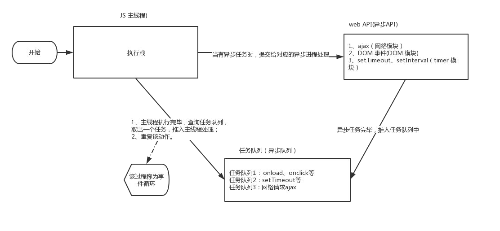

# JavaScript的组成

- ECMAScript JavaScript语法

  ECMAScript 规定了JS的编程语法和基础核心知识，是所有浏览器厂商共同遵守的一套JS语法工业标准

- DOM 页面文档对象模型

  是处理可扩展标记语言的标准编程接口。通过 DOM 提供的接口可以对页面上的各种元素进行操作（大小、位置、颜色等）

- BOM 浏览器对象模型 

  提供了独立于内容的、可以与浏览器窗口进行互动的对象结构。通过BOM可以操作浏览器窗口，比如弹出框、控制浏览器跳转、获取分辨率等。


# 数据类型

## 值类型

简单类型又叫做基本数据类型或者值类型

在存储时变量中存储的是值本身，因此叫做值类型

number，boolean，string，undefined，null

- 简单数据类型存放到栈里面，存放的是值

- 简单类型传参

  值类型变量作为参数传给函数的形参时，其实是把变量在栈空间里的值复制了一份给形参，

  方法内部对形参做任何修改，都不会影响到的外部变量

- 数字型特殊值

  - 最大值：Number.MAX_VALUE：1.7976931348623157e+308
  - 最小值：Number.MIN_VALUE：5e-32
  - 无穷大，大于任何数值 Infinity
  - 无穷小，小于任何数值 -Infinity
  - 非数值 NaN

- `isNaN()`来判断一个变量是否为非数字的类型，是数字返回 true， 不是数字返回 false

- undefined 和 number或boolean 相加，最后结果是NaN

- 浮点数最高精度是17位小数，在算术计算时其精度远远不如整数

  `var result = 0.1 + 0.2; // 结果不是 0.3，而是：0.30000000000000004
  console.log(0.07 * 100); // 结果不是 7， 而是：7.000000000000001`

  不要直接判断两个浮点数是否相等 
  
- 值类型null，返回的是一个空对象object

  ```javascript
  var timer = null;
  console.log(typeof timer);		// object
  ```


## 引用类型

复杂类型又叫做引用类型

在存储时变量中存储的仅仅是地址（引用），因此叫做引用数据类型

通过 new 关键字创建的对象（系统对象、自定义对象），如 Object、Array、Date等

- 复杂数据类型栈里存放的是地址，真正的对象实例存放在堆空间中

- 复杂类型传参

  把引用类型变量传给形参时，其实是把变量在栈空间里保存的堆地址复制给了形参，

  形参和实参其实保存的是同一个堆地址，所以操作的是同一个对象


## 数据类型转换

- ##### 转换为字符串

   

- ##### 转换为数字

   

  - 隐式转换`var a = + '11'; // 11  `
  - `parseInt('120px'); // 120`

- ##### 转换为布尔值

  - 一个感叹号
  
    代表空、否定的值会被转换为 false ，如 ''、0、NaN、null、undefined。其余值都会被转换为 true
  
  - 两个感叹号
  
    `!!`常常用来做类型判断。
  
    - `undefined`和`null`为false
    - 任意数组，对象，函数都转化为true，即使是空数组，空对象。
    - 空字符串为false，非空字符串为true。
    - 数值`0`，不确定值`NaN`为false，其它为true，无穷大也是true。
  
    如果值为真:
  
    - 可以排除`undefined`和`null`
  
    - 数值：表示不是0，且有确定含义的值（包括无穷大）
    - 字符串：表示长度大于0的字符串
    - 数组，对象，函数：只能表示不是`undefined`或`null`,并不能判断是否有元素和内容。
  
    下面两个用法其实是完全等价的
  
    ```javascript
    let a; // null、undefined、''、0
    if (a !== null && typeof(a) !== "undefined" && a !== undefined && a !== '' && a !== 0) {
    }
    
    let a;
    if(!!a){
    }
    ```
  
  - javascript中类型转换不具有传递性。字符串`”0″`和数值`0`可以相互转换，但它们转换为不同的布尔值，即0可转换为”0″，”0″可转换为true,但0却转换为false
  
- ##### 检测数据类型

  - `typeof `主要用于检测基本类型
  
     
  
    ```javascript
    typeof {};				//=> object
    typeof [];				//=> object
    typeof function() {};	//=> function
    ```
  
  - `instanceof` 主要用于检测引用类型
  
    ```javascript
    // 根据对象的原形链往上找,如果原形链上有右边函数.prototype,返回true;
    var obj = {}; obj instanceof Object; 			//=> true; 
    var arr = []; arr instanceof Array; 			//=> true;
    var fn = function() {}; fn instanceof Function; //=> true;
    ```
  
  - `Object.prototype.toString.call(sth)` 原形链的检测有漏洞(原型是可以改变的)。所以会造成检测结果不准确，所以可以采用此种形式。
  
    ```javascript
    var toString = Object.prototype.toString;
    toString.call(undefined);					//=> [object Undefined]
    toString.call(1);							//=> [object, Number]
    toString.call(NaN);							//=> [object, Number]
    toString.call('a');							//=> [object, String]
    toString.call(true);						//=> [object, Boolean]
    toString.call({});							//=> [object, Object]
    toString.call(function() {});				//=> [object, Function]
    toString.call([]);							//=> [object, Array]
    toString.call(null);						//=> [object, Null]
    ```


## 拷贝

- ##### 浅拷贝

  只拷贝一层, 更深层次对象级别的只拷贝引用

  ```javascript
  var obj = {
      id: 1,
      name: 'andy',
      msg: {
          age: 18
      }
  };
  var o = {};
  for (var k in obj) {
      // k 是属性名   obj[k] 属性值
      o[k] = obj[k];
  }
  ```

  es6 新增浅拷贝方法

  `Object.assign(target, ...sources) `

- ##### 深拷贝

  拷贝多层, 每一级别的数据都会拷贝

  ```javascript
  var obj = {
      id: 1,
      name: 'andy',
      msg: {
          age: 18
      },
      color: ['pink', 'red']
  };
  var o = {};
  
  function deepCopy(newobj, oldobj) {
      for (var k in oldobj) {
      	// 判断属性值属于那种数据类型
      	// 1. 获取属性值  oldobj[k]
      	var item = oldobj[k];
      	// 2. 判断这个值是否是数组
          // 数组也是对象，所以要放到对象判断前面
      	if (item instanceof Array) {
      	    newobj[k] = [];
      	    deepCopy(newobj[k], item)
      	} else if (item instanceof Object) {
      	    // 3. 判断这个值是否是对象
      	    newobj[k] = {};
      	    deepCopy(newobj[k], item)
      	} else {
      	    // 4. 属于简单数据类型
      	    newobj[k] = item;
      	}
  	}
  }
  
  deepCopy(o, obj);
  ```


# 运算符

## 递增和递减运算符

递增（++）和递减（ -- ）既可以放在变量前面，也可以放在变量后面

- ##### 前置递增运算符

  `++num` 前置递增，就是自加1， `num = num + 1`

  先自加，后返回值

  `var num = 10;
  alert(++num + 10); // 21`

- ##### 后置递增运算符

  `num++` 后置递增，就是自加1， `num = num + 1`

  先返回原值，后自加

  `var num = 10;
  alert(10 + num++); // 20`


## 运算符优先级

 

- 一元运算符里面的[逻辑非]优先级很高
- [逻辑与]比[逻辑或]优先级高


## 扩展运算符

扩展运算符可以将数组拆分成以逗号分隔的参数序列

```javascript
let ary = ["a", "b", "c"];
...ary // "a", "b", "c"
console.log(...ary); // a b c
```

- 数组合并

  ```javascript
  let ary1 = [1, 2, 3];
  let ary2 = [4, 5, 6];
  let ary3 = [...ary1, ...ary2];
  ```

  ```javascript
  let ary1 = [1, 2, 3];
  let ary2 = [4, 5, 6];
  ary1.push(...ary2);
  ```

- 伪数组转换为真正的数组

  ```javascript
  var oDivs = document.getElementsByTagName('div');
  var ary = [...oDivs];
  ```

- 剩余参数和解构配合

  ```javascript
  let students = ['wangwu', 'zhangsan', 'lisi'];
  let [s1, ...s2] = students;
  console.log(s1);  // 'wangwu'
  console.log(s2);  // ['zhangsan', 'lisi']
  ```


## 解构赋值

- ##### 数组解构

  `let [a, b, c] = [1, 2, 3];`

  如果解构不成功，变量的值为undefined

- ##### 对象解构

  ```javascript
  let person = { name: 'zhangsan', age: 20 };
  let { name, age } = person;
  let {name: myName, age: myAge} = person; // myName myAge 属于别名
  ```


# 函数

## 函数的定义

- 命名函数 `function `关键字 

- 匿名函数

- `new Function('参数1','参数2'..., '函数体')`

  函数也属于对象

- 箭头函数` () => {}` 

- 函数也是一种数据类型，可以作为参数和返回值


## 函数参数

- ##### 不定参数

  - arguments 是当前函数的一个内置对象。
  - 所有函数都内置了一个 arguments 对象，arguments 对象中存储了传递的所有实参
  - arguments展示形式是一个伪数组，可以进行遍历
    - 具有 length 属性
    - 按索引方式储存数据
    - 不具有数组的 push , pop 等方法


- ##### 剩余参数

  将一个不定数量的参数表示为一个数组

  ```javascript
  function sum (first, ...args) {
      console.log(first); // 10
      console.log(args); // [20, 30] 
  }
  sum(10, 20, 30)
  ```


## 立即执行函数

- `(function() {})()` 或 `(function(){}())`
- 会创建一个独立的作用域。 避免了命名冲突问题


## 特定作用域中调用函数

- ##### `call()`

  - 调用这个函数, 并且修改函数运行时的 `this `指向  

    `fun.call(thisArg, arg1, arg2, ...)`

    - `thisArg `：当前调用函数 `this `的指向对象
    - `arg1`，`arg2`：传递的其他参数

    ```javascript
    function fn(x, y) {
    	console.log(this);
    	console.log(x + y);	
    }
    var o = {
    	name: 'andy'
    };
    // call() 可以改变这个函数的this指向 此时这个函数的this 就指向了o这个对象
    fn.call(o, 1, 2);
    ```


- ##### `apply()` 

  - 调用这个函数, 并且修改函数运行时的 `this `指向 

    `fun.apply(thisArg, [argsArray])`

    - `thisArg `：当前调用函数 `this `的指向对象
    - `argsArray`：传递的值参数必须是数组

  - 利用 `apply() `借助于数学内置对象求数组最大值

    ```javascript
    var arr = [1, 66, 3, 99, 4];
    var max = Math.max.apply(Math, arr);
    ```

- ##### `bind()`

  - 不会调用函数。但是能改变函数内部this 指向 

    `fun.bind(thisArg, arg1, arg2, ...) `

    - `thisArg `：在 fun 函数运行时指定的 this 值
    - `arg1`，`arg2`：传递的其他参数
    - 返回的是原函数改变this之后产生的新函数

  - 如果有的函数不需要立即调用,但是又想改变这个函数内部的`this`指向此时用`bind()`

    ```javascript
    // 点击按钮,禁用按钮3秒钟
    var btns = document.querySelectorAll('button');
    for (var i = 0; i < btns.length; i++) {
    	btns[i].onclick = function() {
        	this.disabled = true;
            setTimeout(function() {
                this.disabled = false;
            }.bind(this), 2000);
        }
    }
    ```


## 箭头函数

- 箭头函数不绑定`this`关键字，箭头函数中的`this`，指向的是函数定义位置的上下文`this`

  ```javascript
  const obj = { name: '张三'} 
  function fn () {
      console.log(this);
      return () => {
          console.log(this)
      } 
  } 
  const resFn = fn.call(obj);
  resFn();
  ```

  ```javascript
  var age = 100;
  var obj = {
  	age: 20,
  	say: () => {
  		alert(this.age)
  	}
  }
  obj.say(); // 100
  ```
  
  

## 闭包

- 闭包（closure）指有权访问另一个函数作用域中变量的函数。

  闭包是一个函数（一个作用域可以访问另外一个函数内部的局部变量）

  闭包的作用是延伸变量的作用范围

  ```javascript
  function fn() {
  	var num = 10;
      return function {
          console.log(num); // 10
      }
  }
  var f = fn();
  // 访问了另外一个函数 fn 里面的局部变量 num
  f();
  ```

- 利用闭包循环注册点击事件

  ```javascript
  var lis = document.querySelector('.nav').querySelectorAll('li');
  // 利用闭包的方式得到当前小li 的索引号
  for (var i = 0; i < lis.length; i++) {
      // 利用for循环创建了4个立即执行函数
      // 立即执行函数也成为小闭包因为立即执行函数里面的任何一个函数都可以使用它的i这变量
      (function(i) {
      	lis[i].onclick = function() {
          	console.log(i);
      	}
  	})(i);
  }
  ```

- 定时器中的闭包

  ```javascript
  // 3秒钟之后,打印所有li元素的内容
  var lis = document.querySelector('.nav').querySelectorAll('li');
  for (var i = 0; i < lis.length; i++) {
      (function(i) {
          setTimeout(function() {
              console.log(lis[i].innerHTML);
          }, 3000)
      })(i);
  }
  ```

- 闭包思考题

  ```javascript
  var name = "The Window";
  var object = {
      name: "My Object",
      getNameFunc: function() {
          return function() {
  			return this.name;
  		};
      }
  }
  console.log(object.getNameFunc()());
  
  // var f = object.getNameFunc(); 类似于
  var f = function() {
      // this指向是window
      return this.name;
  }
  f();
  ```


# 作用域

## 作用域

- ##### 全局作用域

  整个script标签或者整个js文件

- ##### 局部作用域/函数作用域

  只在函数内部起效果
  
- ##### 块级作用域

  { } 内，例如if语句和for语句里面的{ }

  ES6新增


## 变量声明

- ##### 全局变量

  - 在全局作用域下的变量。

    在全局作用域下声明的变量是全局变量。

    在函数内部，没有声明而直接赋值的变量也是全局变量局部变量

    ```javascript
    function fun() {
        var num1 = 10; // 局部
        num2 = 20;	   // 全局
    }
    ```

  - 浏览器关闭才会销毁。占内存

- ##### 局部变量

  - 在局部作用域下的变量。

    在函数内部的声明变量就是局部变量

  - 代码块执行才会初始化，代码结束就会销毁，节省内存
  
- ##### 块级变量

  - 在块级作用域下的变量

  - `var`定义的变量可以跨块作用域访问

    `let`和`const`声明的变量才具有块级作用域

  - ##### `let`变量声明

    ```javascript
    var arr = [];
    for (var i = 0; i < 2; i++) {
        arr[i] = function () {
            console.log(i); 
        }
    }
    // 变量i是全局的，函数执行时输出的都是全局作用域下的i值
    arr[0](); // 2
    arr[1](); // 2
    ```

    ```javascript
    let arr = [];
    for (let i = 0; i < 2; i++) {
        arr[i] = function () {
            console.log(i); 
        }
    }
    // 每次循环都会产生一个块级作用域，每个块级作用域中的变量都是不同的
    // 函数执行时输出的是自己上一级（循环产生的块级作用域）作用域下的i值
    arr[0](); // 0
    arr[1](); // 1
    ```

  - ##### `const`变量声明

    声明常量时必须赋值，常量赋值后，值（内存地址）不能修改

    ```javascript
    const ary = [100, 200];
    ary[0] = 'a';
    ary[1] = 'b';
    console.log(ary); // ['a', 'b']; 
    // 内存地址不能修改
    ary = ['a', 'b']; // Assignment to constant variable.
    ```


## 作用域链

- 内部函数查找外部函数的变量，采取链式查找的方式来决定取哪个值，就称为作用域链
- 就近原则。从目标出发，一层一层往外查找


# 预解析

- ##### js引擎运行js分为两步：1. 预解析 2. 代码执行

  1. js引擎会把js里面所有的var 还有 function 提升到当前作用域的最前面。

  2. 之后按照书写的顺序代码从上往下执行

- ##### 变量预解析（变量提升）

  把所有的变量声明提升到当前的作用域最前面

  只提升变量声明，不提升赋值操作

  ```javascript
  console.log(num); // 输出undefined
  var num = 10;
  
  fun();			  // 报错
  var fun = function() {
      console.log(22);
  }
  ```

- ##### 函数预解析（函数提升）

  把所有的函数声明提升到当前作用域的最前面

  只声明函数，不调用函数
  
- ##### 块极变量`let`和`const`声明的变量只能在作用域内访问，不存在变量提升

  - 暂时性死区：在当前同级作用域内在达到声明处之前都是无法访问的

    ```javascript
    var tmp = 123;
    if (true) { 
    	tmp = 'abc';
    	let tmp; 
    }
    ```


# 对象和构造函数

## 对象

- ##### 字面量创建对象

  ```javascript
  var star = {
  	name : 'pink',
  	age : 18,
  	sex : '男',
  	sayHi : function(){
  		alert('大家好啊~');
  	}
  };
  ```

- ##### new Object创建对象

  ```javascript
  var andy = new Obect();
  andy.name = 'pink';
  andy.age = 18;
  andy.sex = '男';
  andy.sayHi = function(){
  	alert('大家好啊~');
  }
  ```

- ##### 构造函数创建对象

  ```javascript
  function Person(name, age, sex) {
  	this.name = name;
  	this.age = age;
  	this.sex = sex;
  	this.sayHi = function() {
  		alert('我的名字叫：' + this.name + '，年龄：' + this.age + '，性别：' + this.sex);
  	}
  }
  var bigbai = new Person('大白', 100, '男');
  var smallbai = new Person('小白', 21, '男');
  console.log(bigbai.name);
  console.log(smallbai.name);
  ```

  - 构造函数约定首字母大写
  
  - 函数内的属性和方法前面需要添加 this ，表示当前对象的属性和方法
  
  - 构造函数中不需要 return 返回结果
  
  - 当我们创建对象的时候，必须用 new 来调用构造函数
  
  - ##### new关键字执行
  
    1. 在内存中创建一个新的空对象
    2. 让 this 指向这个新的对象
    3. 执行构造函数里面的代码，给这个新对象添加属性和方法
    4. 返回这个新对象（所以构造函数里面不需要return）

- ##### 遍历对象属性

  - ```javascript
    for (var k in obj) {
        console.log(k); // 这里的 k 是属性名
    	console.log(obj[k]); // 这里的 obj[k] 是属性值
    }
    ```
  
  - `Object.keys(obj)`返回一个由属性名组成的数组
  
- ##### 定义或修改属性方法

  定义新属性或修改原有的属性

  `Object.defineProperty(obj, prop, descriptor)`

  - 参数：
    - `obj`：必需。目标对象 
    - `prop`：必需。需定义或修改的属性的名字
    - `descriptor`：必需。目标属性所拥有的特性

  - `descriptor`参数，以对象形式 { } 书写。对象属性： `value`、`writable`、`enumerable`、`configurable`
    - `value`: 设置属性的值 默认为undefined
    - `writable`: 值是否可以重写。true | false 默认为false
    - `enumerable`: 目标属性是否可以被枚举(遍历)。true | false 默认为 false
    - `configurable`: 目标属性是否可以被删除或是否可以再次修改特性 true | false 默认为false

  ```javascript
  var obj = {
      id: 1,
      pname: '小米',
      price: 1999
  };
  // 以前的对象添加和修改属性的方式
  Object.defineProperty(obj, 'num', {
      value: 1000,
      enumerable: true
  });
  Object.defineProperty(obj, 'id', {
      // 如果值为false 不允许修改这个属性值 默认值也是false
      writable: false,
  });
  Object.defineProperty(obj, 'address', {
      value: '中国山东蓝翔技校xx单元',
      // 如果只为false 不允许修改这个属性值 默认值也是false
      writable: false,
      // enumerable 如果值为false 则不允许遍历, 默认的值是 false
      enumerable: false,
      // configurable 如果为false 则不允许删除这个属性 不允许在修改第三个参数里面的特性 默认为false
      configurable: false
  });
  ```


## 构造函数

构造函数主要用来初始化对象，为对象成员变量赋初始值。总与 new 一起使用

但是存在浪费内存的问题

- ##### 静态成员

  在构造函数本身上添加的成员称为静态成员，只能由构造函数本身来访问

  ```javascript
  function Star(uname, age) {
      .....
  }
  // 静态成员
  Star.sex = '男';
  ```

- ##### 实例成员

  在构造函数内部创建的对象成员称为实例成员，只能由实例化的对象来访问

  构造函数内部通过this添加的成员


## 原型对象

- ##### 构造函数原型 `prototype`

  每一个构造函数都有一个 `prototype`对象，这个对象的所有属性和方法，都会被构造函数所拥有

  构造函数通过原型分配的函数是所有对象所共享的

  - 可以把那些不变的公共方法直接定义在 `prototype `对象上，公共属性定义到构造函数里面
  
  - 可以通过原型对象，对原来的内置对象进行扩展自定义的方法。
  
    ```javascript
    // 数组增加自定义求和的功能
    Array.prototype.sum = function() {
        var sum = 0;
        for (var i = 0; i < this.length; i++) {
            sum += this[i];
        }
        return sum;
    };
    var arr = [1, 2, 3];
    console.log(arr.sum());
    ```
  
    数组和字符串内置对象不能给原型对象覆盖操作 `Array.prototype = {}` 
  
    只能是 `Array.prototype.xxx = function(){}` 的方式

- #####  对象原型 `__proto__`

  - 只要是对象就有`__proto__ `原型, `__proto__`指向原型对象`prototype`

    之所以对象可以使用构造函数 `prototype `原型对象的属性和方法，就是因为对象有 `__proto__ `原型的存在

    `__proto__`对象原型和原型对象 `prototype `是等价的

  - 对象原型对象里面的`__proto__`原型指向的是 `Object.prototype`

  - `Object.prototype`原型对象里面的`__proto__`原型  指向为 null

  - `__proto__`对象原型的意义就在于为对象的查找机制提供一个方向。

    它是一个非标准属性，因此实际开发中，不可以使用这个属性。

- ##### 构造函数`constructor`

  对象原型（ `__proto__`）和构造函数原型（`prototype`）里面都有一个 `constructor `属性 

  `constructor `称为构造函数，因为它指回构造函数本身

  - `constructor `主要用于记录该对象引用于哪个构造函数，可以让原型对象重新指向原来的构造函数

  - 很多情况下,需要手动的利用`constructor `这个属性指回 原来的构造函数

    ```javascript
    function Star(uname, age) {
        this.uname = uname;
        this.age = age;
    }
    Star.prototype = {
    	// 如果修改了原来的原型对象,给原型对象赋值的是一个对象,则必须手动的利用constructor指回原来的构造函数
        constructor: Star,
        sing: function() {
            console.log('我会唱歌');
        },
        movie: function() {
            console.log('我会演电影');
        }
    }
    ```

- ##### 构造函数、实例、原型对象三者之间的关系

   

- ##### 原型链

   

  - 方法的查找机制

    `__proto__`对象原型的意义就在于为对象成员查找机制提供一个方向

    1. 当访问一个对象的属性（包括方法）时，首先查找这个对象自身有没有该属性
    2. 如果没有就查找它的原型（也就是 `__proto__`，指向的 `prototype `原型对象）
    3. 如果还没有就查找原型对象的原型（`Object`的原型对象）
    4. 依此类推一直找到 `Object `为止（`null`）

- ##### 原型对象`this`指向

  - 构造函数中的`this `指向实例对象
  - 原型对象函数里面的`this `指向的是 这个方法的调用者, 也是实例对象


## 组合继承

通过构造函数+原型对象模拟实现继承，被称为组合继承

- ##### 借用构造函数继承父类型属性

  通过 `call() `把父类型的 `this `指向子类型的 `this `，这样就可以实现子类型继承父类型的属性

  ```javascript
  // 父类
  function Person(name, age, sex) {
    // this 指向父构造函数的对象实例
    this.name = name;
    this.age = age;
    this.sex = sex;
  }
  // 子类
  function Student(name, age, sex, score) {
    // this 指向子构造函数的对象实例
    Person.call(this, name, age, sex);  // 此时父类的 this 指向子类的 this，同时调用这个函数
    this.score = score;
  }
  var s1 = new Student('zs', 18, '男', 100);
  console.dir(s1); 
  ```

- ##### 借用原型对象继承父类型方法

  一般对象的方法都在构造函数的原型对象中设置，通过构造函数无法继承父类方法

  1. 将子类所共享的方法提取出来，让子类的 `prototype `原型对象 = `new 父类() `

     子类原型对象等于是实例化父类，因为父类实例化之后另外开辟空间，就不会影响原来父类原型对象

  2. 将子类的 `constructor `重新指向子类的构造函数

  ```javascript
  // 父构造函数
  function Father(uname, age) {
      // this 指向父构造函数的对象实例
      this.uname = uname;
      this.age = age;
  }
  Father.prototype.money = function() {
  	console.log(100000);
  };
  // 子构造函数
  function Son(uname, age, score) {
  	// this 指向子构造函数的对象实例
      Father.call(this, uname, age);
      this.score = score;
  }
  // Son.prototype = Father.prototype;  这样直接赋值会有问题,如果修改了子原型对象,父原型对象也会跟着一起变化
  Son.prototype = new Father();
  // 利用constructor 指回原来的构造函数
  Son.prototype.constructor = Son;
  // 子构造函数专门的方法
  Son.prototype.exam = function() {
      console.log('考试');
  }
  var son = new Son('刘', 18, 100);
  ```


## 类

在 ES6 中新增加了类的概念，可以使用 `class `关键字声明一个类，之后以这个类来实例化对象

- ##### 类其实就是语法糖

  - `class`本质还是`function`

  - 类的所有方法都定义在类的`prototype`属性上，里面有`constructor `指向类本身

    类可以通过原型对象添加方法

  - 类创建的实例,里面也有`__proto__ `指向类的`prototype`原型对象

- ##### 创建类

  类必须使用 new 实例化对象

  ```JavaScript
  class name {
    // class body
  }
  var xx = new name();
  ```

- ##### 构造函数

  `constructor()` 方法是类的构造函数(默认方法)，用于传递参数,返回实例对象

  通过 new 命令生成对象实例时，自动调用该方法。

  如果没有显示定义, 类内部会自动给我们创建一个`constructor()`

  ```javascript
  class Person {
    constructor(name,age) {   // constructor 构造方法或者构造函数
        this.name = name;
        this.age = age;
      }
  }
  var p = new Person('name', 18); 
  ```

  - 不存在变量提升，必须先定义类，才能实例化

  - 类里面的公有属性和方法一定要加`this`使用

    `constructor`里面的`this`执行的是创建的实例对象，方法里面的`this`还是指向方法的调用者

    如果方法想用创建的实例对象，可以定义全局变量，把`constructor`里面的`this`赋值给这个全局变量

- ##### 继承

  子类可以继承父类的一些属性和方法。

  ```javascript
  // 父类
  class Father {
  	constructor(surname) {
          this.surname= surname;
  	}
  	say() {
  		console.log('你的姓是' + this.surname);
  	}
  }
  // 子类继承父类
  class Son extends Father {
  }
  var s = new Son('刘');
  s.say();
  ```

- ##### `super `关键字

  `super `关键字用于访问和调用对象父类上的函数。可以调用父类的构造函数，也可以调用父类的普通函数

  子类在构造函数中使用`super`, 必须放到 `this `前面 (必须先调用父类的构造方法,在使用子类构造方法)

  ```javascript
  class Father {
      constructor(x, y) {
          this.x = x;
          this.y = y;
      }
      sum() {
          console.log(this.x + this.y);
      }
  }
  // 子类继承父类加法方法 同时 扩展减法方法
  class Son extends Father {
      constructor(x, y) {
          // 利用super 调用父类的构造函数
          // super 必须在子类this之前调用
          super(x, y);
          this.x = x;
          this.y = y;
      }
      subtract() {
          console.log(this.x - this.y);
      }
  }
  var son = new Son(5, 3);
  son.subtract();
  son.sum();
  ```

  继承中的属性或者方法查找原则: 就近原则

  - 输出一个方法,先看子类有没有这个方法,如果有就先执行子类的
  - 如果子类里面没有,就去查找父类有没有这个方法,如果有,就执行父类的这个方法(就近原则)


# 内置对象

## 数学对象Math

Math 对象不是构造函数，具有数学常数和函数的属性和方法。直接使用里面的属性和方法即可

- ##### 圆周率 `Math.PI `

- ##### 向下取整 `Math.floor() `

  往小了取值

- ##### 向上取整 `Math.ceil() ` 

  往大了取值

- ##### 四舍五入 `Math.round()`

   注意 -3.5 结果是 -3 。

  .5特殊，往大了取值

- ##### 绝对值`Math.abs()`

- ##### 求最大和最小值`Math.max()` `Math.min()`

- ##### 随机数`random()`

  取值范围0 <= x < 1

  两个数之间的随机整数，并且包含这两个整数
  
  `Math.floor(Math.random() * (max - min + 1)) + min;`


## 日期对象Date

Date是一个构造函数，需要实例化后才能使用

- Date()不写参数，就返回当前时间

- Date()里面写参数，就返回括号里面输入的时间

- Date 对象是基于1970年1月1日（世界标准时间）起的毫秒数

  获取毫秒数`var now = + new Date();` `Date.now();`


## 数组对象Array

- ##### 检测是否为数组

  `Array.isArray();`(ie9以上版本) 或`xx instanceof Array`

- ##### 末尾添加一个或多个元素 `push(参数1..)`

  修改原数组，返回新的长度

- ##### 删除最后一个元素 `pop()`

  修改原数组，返回删除的元素的值

- ##### 开头添加一个或多个元素 `unshift(参数1..)` 

  修改原数组，返回新的长度

- ##### 删除第一个元素 `shift()` 

  修改原数组，返回第一个元素的值

- ##### 颠倒元素的顺序 `reverse()`

  修改原数组，返回新数组

- ##### 元素进行排序 `sort()` 

  修改原数组，返回新数组

- ##### 查找元素的第一个索引 `indexOf(数组元素)` 

  如果存在返回索引号，不存在返回-1 只返回第一个满足条件的索引号

- ##### 查找元素的最后一个索引 `lastIndexOf(数组元素)` 

  如果存在返回索引号，不存在返回-1

- ##### 数组转换字符串，逗号分隔 `toString()` 

  返回字符串

- ##### 把数组中的所有元素转换为一个字符串 `join('分隔符')` 

  返回字符串

- ##### 连接两个或多个数组 `concat()` 

  不影响原数组，返回新数组

- ##### 数组截取 `slice(begin,end)`

  返回被截取项目的新数组

- ##### 数组删除 `splice(第几个开始，要删除个数)` 

  修改原数组，返回被删除项目的新数组

- ##### 遍历数组`forEach()`

  `array.forEach(function(currentValue, index, arr))`

  `currentValue`：数组当前项的值

  `index`：数组当前项的索引

  `arr`：数组对象本身

- ##### 筛选数组 `filter()`

  `array.filter(function(currentValue, index, arr))`

  返回一个新的数组，把所有满足条件的元素返回回来

- ##### 数组元素是否满足指定条件`some()`

  `array.some(function(currentValue, index, arr))`

  返回值是布尔值

  如果查找到第一个满足条件的元素就终止循环

- ##### 数组元素是否全部满足指定条件`every()`

  `array.every(function(currentValue, index, arr))`

  返回值是布尔值

  如果检测到有一个元素不满足，则整个表达式返回 false ，且剩余的元素不会再进行检测

- ##### 返回新数组 `map() `

  `array.map(function(currentValue, index, arr))`

  返回一个新数组，数组中的元素为原始数组元素调用函数处理后的值

- ##### 伪数组转换为真正数组`from()`

  `Array.from(arrayLike[, mapFn[, thisArg]])`

  对一个类似数组或可迭代对象创建一个新的，浅拷贝的数组实例

  ```javascript
  let arrayLike = {
      '0': 'a',
      '1': 'b',
      '2': 'c',
      length: 3
  }; 
  let arr2 = Array.from(arrayLike); // ['a', 'b', 'c']
  ```

  第二个参数作用类似于数组的`map`方法

  `let newAry = Array.from(aryLike, item => item *2)`

- ##### 返回第一个满足指定条件的数组成员`find()`

  `array.find(function(currentValue, index, arr))`

  没有找到返回undefined

- ##### 回第一个满足指定条件的数组成员位置`findIndex()`

  `array.findIndex(function(currentValue, index, arr))`

  没有找到返回-1

- ##### 是否包含一个指定的值`includes()`

  `arr.includes(searchElement)`

  `arr.includes(searchElement, fromIndex)`

  返回值是布尔值


## 字符串对象

- ##### 基本包装类型

  基本包装类型就是把简单数据类型包装成为复杂数据类型，这样基本数据类型就有了属性和方法

  提供了三个特殊的引用类型：String、Number和 Boolean

  ```javascript
  var str = 'andy';
  console.log(str.length);
  
  // 包装过程
  // 1. 生成临时变量，把简单类型包装为复杂数据类型
  var temp = new String('andy');
  // 2. 赋值给我们声明的字符变量
  str = temp;
  // 3. 销毁临时变量
  temp = null;
  ```

- ##### 字符串的不可变

  里面的值不可变，虽然看上去可以改变内容，但其实是地址变了，内存中新开辟了一个内存空间

- ##### 指定内容的索引`indexOf('要查找的字符',开始的位置)`

  如果存在返回索引号，不存在返回-1

- ##### 指定内容的最后索引`lastIndexOf('要查找的字符')` 

  如果存在返回索引号，不存在返回-1

- ##### 返回指定位置的字符`charAt(index)` 

  `str[index]` H5新增

- ##### 获取指定位置处字符的ASCII码`charCodeAt(index)`

- ##### 连接两个或多个字符串`concat()`

- ##### 截取字符串

  `substr('截取的起始位置','截取几个字符')`

  `slice(start, end)` 从start位置开始，截取到end位置，end取不到 （start和end都是索引）

  `substring(start, end)`从start位置开始，截取到end位置，end取不到 (start和end都是索引）不接受负值

- ##### 替换字符`replace(被替换的字符串/正则表达式 ， 要替换为的字符串) `

  只会替换第一个字符（正则表达式可以通过修饰符来修改匹配机制）

  返回值是一个替换完毕的新字符串

- ##### 切分字符串`split('分隔符')`

- ##### 删除两端空白字符 `trim()`

  不影响原字符串本身，返回新字符串	
  
- ##### 模板字符串

  ```javascript
  let name = '张三';
  let sayHello = `hello,my name is ${name}`
  ```

  - 模板字符串中可以换行

- ##### 是否以指定的子字符串开始/结束 `startsWith()`/`endsWith()`

  `startsWith()`：表示参数字符串是否在原字符串的头部，返回布尔值

  `endsWith()`：表示参数字符串是否在原字符串的尾部，返回布尔值

  大小写敏感

- ##### 重复字符串 `repeat()`

  `string.repeat(count)`

  返回新字符串


## 正则对象RegExp

- ##### 创建正则表达式

  `var 变量名 = new RegExp(/表达式/); `

  或通过字面量创建 `var 变量名 = /表达式/;`

- ##### 测试正则表达式 `test()`

  `regexObj.test(str) `

  - `regexObj `正则表达式
  - `str` 测试文本


## 唯一值集合Set

`Set `是唯一值的集合。不能提供索引。

- ##### 创建`Set`数据结构

  `const s = new Set();`

  可以接受一个可遍历数据作为参数，用来初始化

  `const set = new Set([1, 2, 3, 4, 4]);`

- ##### 元素个数 `set.size`

- ##### 添加元素 `set.add(value)`

  如果已有重复，则不产生效果

  返回集合本身

- ##### 删除元素 `set.delete(value)`

  如果并不存在，则不产生效果

  返回集合本身

- ##### 是否含有指定元素 `set.has(value)`

  返回布尔值

- ##### 清空集合`set.clear()`

  没有返回值

- ##### 遍历 `forEach`

  `set.forEach(callback)`

- ##### 数组去重

  ```javascript
  function do(array) {
    return Array.from(new Set(array));
  }
  do([1, 1, 2, 3]) // [1, 2, 3]
  ```

  ```javascript
  let arr = [3, 5, 2, 2, 5, 5];
  let unique = [...new Set(arr)]; // [3, 5, 2]
  ```

  


# 执行机制

## 同步和异步

- ##### 同步任务

  同步任务都在主线程上执行，形成一个执行栈

- ##### 异步任务

  JS 的异步是通过回调函数实现的

  异步任务有以下三种类型:

  1. 普通事件，如 click、resize 等
  2. 资源加载，如 load、error 等
  3. 定时器，包括 setInterval、setTimeout 等

  异步任务相关回调函数添加到任务队列中（任务队列也称为消息队列）

 


## 执行机制

- ##### 执行机制

  1. 先执行执行栈中的同步任务

  2. 异步任务（回调函数）放入任务队列中。

  3. 一旦执行栈中的所有同步任务执行完毕，系统就会按次序读取任务队列中的异步任务

     被读取的异步任务结束等待状态，进入执行栈，开始执行

  -  

    异步函数会先提交给异步进程进行处理，异步进程处理决定是否放入到任务队列中

    例如`onclick`的异步任务，只有在点击了，才会进入任务队列。定时器时间到了，回调函数才会放入任务队列中去

  - 由于主线程不断的重复获得任务、执行任务、再获取任务、再执行，所以这种机制被称为事件循环（ event loop）

     

## 常见异步编程方法

正常方式是不能获取异步函数内的返回值，只能返回undefined

```javascript
getCallbackData(){
    setTimeOut(()=>{
		var username = "张三";
		return username; 
    }, 1000);
}
```

- ##### 回调函数

  ```javascript
  getCallbackData(callbackFunc){
      setTimeOut(()=>{
  		var username = "张三";
  		callbackFunc(username); 
      }, 1000);
  }
  
  let callbackData = getCallbackData((data)=>{
      console.log(data);
  });
  ```

- ##### Promise

  ```javascript
  getPromiseData(){
      return new Promise((resolve,reject) => {
      	setTimeOut(()=>{
  			var username = "张三";
  			resolve(username); 
      	}, 1000);
      });
  }
  
  let promiseData = getPromiseData();
  promiseData.then((data) => {
     console.log(data); 
  });
  ```

- ##### RxJs

  ```javascript
  getRxjsData(){
      return new Observable((observer) => {
      	setTimeOut(()=>{
  			var username = "张三";
  			observer.next(username); 
              // observer.error();
      	}, 1000);
      });
  }
  
  let rxjsData = getRxjsData();
  rxjsData.subscribe((data) => {
     console.log(data); 
  });
  ```

  

