#   基本概念

## JavaScript 的组成

- ECMAScript JS 语法

  ECMAScript 规定了 JS 的编程语法和基础核心知识，是所有浏览器厂商共同遵守的一套 JS 语法工业标准

- **DOM 页面文档对象模型**

  是处理可扩展标记语言的标准编程接口。通过 DOM 提供的接口可以对页面上的各种元素进行操作（大小、位置、颜色等）

- **BOM 浏览器对象模型** 

  提供了独立于内容的、可以与浏览器窗口进行互动的对象结构
  
  通过 BOM 可以操作浏览器窗口，比如弹出框、控制浏览器跳转、获取分辨率等
  
  BOM 比 DOM 更大，它包含 DOM


## 编写方式

- HTML 代码行内式

  ```html
  <a href="#" onclick="alert('百度一下')">百度一下</a>
  ```

- `<script>` 标签

  JavaScript 默认遵循 HTML 文档的加载顺序，即自上而下的加载顺序，**推荐代码位置放在 `<body>` 子元素的最后一行**

  ```html
  <body>
    <script>
      var googleAEl = document.querySelector(".google")
      googleAEl.onclick = function() {
        alert("Google一下")
      }
    </script>
  </body>
  ```

- 外部的 script 文件

  ```html
  <body>
    <script src="./js/bing.js"></script>
  </body>
  ```

- 如果运行的浏览器不支持 JavaScript，可以使用 `<noscript>` 标签提示，浏览器将显示 `<noscript>` 标签中的内容

  ```html
  <body>
    <noscript>
      <h1>您的浏览器不支持JavaScript, 请打开或者更换浏览器~</h1>
    </noscript>
  </body>
  ```

- JavaScript 代码放在 `<head>` 标签内部和放在 `<body>` 标签内部的区别
  - 加载顺序：放在 `<head>` 里会在页面加载之前执行 JavaScript 代码，而放在 `<body>` 里会在页面加载后执行
  - 页面渲染：如果 JavaScript 代码影响了页面的布局或样式，放在 `<head>` 里可能会导致页面渲染延迟，而放在 `<body>` 里可以减少这种影响
  - 代码依赖：如果 JavaScript 代码依赖其他元素，放在 `<body>` 里可以确保这些元素已经加载。
  - 全局变量和函数：放在 `<head>` 里的 JavaScript 代码中的全局变量和函数在整个页面生命周期内都可用


# 数据类型

JavaScript 一共有 8 种数据类型

`number`，`boolean`，`string`，`undefined`，`null`，`symbol`，`bigInt`, `object`


## 值类型

**值类型**又叫做**基本数据类型**或者简单类型

在存储时变量中**存储的是值本身**，因此叫做值类型

`number`，`boolean`，`string`，`undefined`，`null`，`symbol`，`bigInt`

- 值类型**存放到栈**里面，**存放的是值**

- 值类型参数传参

  值类型变量**作为参数传给函数的形参**时，其实是**把变量在栈空间里的值复制了一份给形参**

  方法内部对形参做任何修改，都**不会影响到的外部变量**


### Number 类型

`number` 类型代表整数和浮点数

- 最大正数值：`Number.MAX_VALUE`：`1.7976931348623157e+308`


  - 最小正数值：`Number.MIN_VALUE`：`5e-32`，小于这个的数字会被转化为 `0`


  - 无穷大，大于任何数值：`Infinity`


  - 无穷小，小于任何数值：`-Infinity`


  - 非数值，代表一个计算错误：`NaN`

- 二进制、八进制、十六进制写法

  ```javascript
  const num1 = 100;	// 十进制
  // b -> binary
  const num2 = 0b100;	// 二进制
  // o -> octonary
  const num3 = 0o100;	// 八进制
  // x -> hexadecimal
  const num4 = 0x100;	// 十六进制
  console.log(num1, num2, num3, num4);
  // 100 4 64 256
  ```

- `isNaN()` 用来判断一个变量**是否不是一个数字**的类型，不是数字返回 `true`，是数字返回 `false`

- 浮点数**最高精度是 17 位小数**，在算术计算时其精度远远不如整数

  > ##### 不要直接判断两个浮点数是否相等 
  >
  > - 计算机用二进制存储数据，整数用二进制没有误差，如 `9` 表示为 `1001` 
  >
  > - 而**有的小数无法用二进制表示**，如 `0.2` 用二进制表示就是 `1.10011001100...`
  >
  >
  > 所以，累加小数时会出现误差
  >
  > ```javascript
  > var result = 0.1 + 0.2; // 结果不是 0.3，而是：0.30000000000000004
  > console.log(0.07 * 100); // 结果不是 7， 而是：7.000000000000001
  > ```

- 比较浮点数是否相等

  ```javascript
  function floatEqual(num1, num2) {
    return Math.abs(num1 - num2) < Number.EPSILON;
  }
  ```
  
  ```javascript
  // 定义精度精确到0.00001
  var delta = 1e-5;
  var a = 0.1;
  var b = 0.2;
  var sum = 0.3;
  if (a + b - sum < delta) {
  	console.log('a + b == sum');
  }
  ```
  
  ```javascript
  // 重写 toFix() 方法，四舍五入为指定小数的数字，再进行比较
  Number.prototype.toFixed = function (s) {
    var times = Math.pow(10, s);
    // 如果是正数，则 +0.5，是负数，则 -0.5
    const adjust = this >= 0 ? 0.5 : -0.5;
    var des = this * times + adjust;
    des = parseInt(des, 10) / times;
    return des;
  }
  console.log(1.335.toFixed(2)); // 1.34
  ```
  
- 大数值连接符：数字过长时，可以使用 `_` 作为连接符

  ```javascript
  const num = 100_000_000;
  console.log(num);	// 100000000
  ```

- 数字的计算的第三方库 https://www.npmjs.com/package/mathjs


### String 类型

- 除了普通的可打印字符以外，一些有特殊功能的字符可以通过转义字符的形式放入字符串中

  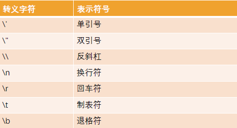 


### Boolean 类型

- `Boolean` 类型仅包含两个值：`true` 和 `false`


### Undefined 类型

- 声明一个变量，但是**没有对其进行初始化**时，默认就是 `undefined`
- `undefined` 和 `number` 或 `boolean` 相加，最后结果是 `NaN`


### Null 类型

- 值类型 `null`，返回的是一个空对象 `object`

  ```javascript
  var timer = null;
  console.log(typeof timer);		// object
  ```


### BigInt 类型

`BigInt` 大整数类型

ES11 之前可以表示的最大整数是 `Number.MAX_SAFE_INTEGER`，大于 `MAX_SAFE_INTEGER` 的数值，表示的可能是不正确的

ES11 中，引入了新的数据类型 `BigInt`，用于表示大的整数，表示方法是在**数值的后面加上 `n`**

```javascript
const maxInt = Number.MAX_SAFE_INTEGER
console.log(maxInt) 					// 9007199254740991
console.log(maxInt + 1)				// 9007199254740992
console.log(maxInt + 2)				// 9007199254740992

const bigInt = 900719925474099100n
console.log(bigInt + 10n)			// 900719925474099110n

const num = 100
console.log(bigInt + BigInt(num))	// 900719925474099200n

// 大数字转小数字
const smallNum = Number(bigInt)
console.log(smallNum)				// 900719925474099100
```

> 可以使用第三方的 JavaScript 库，如 **big.js 或 bignumber.js** ，处理任意精度的数值
>
> ```javascript
> // 使用 big.js 库可以将两个超过 Number.MAX_VALUE 的数相加
> const big = require('big.js');
> const x = new big('9007199254740993'); 
> const y = new big('100000000000000000');
> const result = x.plus(y);
> console.log(result.toString()); // 输出：100009007194925474093
> ```


### Symbol 数据类型

`Symbol` 是 ES6 中新增的一个基本数据类型

对象的属性名都是字符串形式，那么很容易造成属性名的冲突，从而覆盖掉它内部的某个属性

`Symbol` 可以用来**生成一个独一无二的值**

- `Symbol` 值是通过 `Symbol()` 函数来生成的，生成后可以作为属性名

  ```javascript
  const s1 = Symbol();
  const s2 = Symbol();
  console.log(s1 === s2);	// false
  ```

- **对象的属性名**可以使用字符串，也可以**使用 `Symbol` 值**（ES6）

  ```javascript
  const s1 = Symbol();
  const s2 = Symbol();
  const obj = { [s1]: "abc", [s2]: "cba" };
  
  // 新增属性
  const s3 = Symbol();
  obj[s3] = "nba";
  
  // Object.defineProperty方式
  const s4 = Symbol();
  Object.defineProperty(obj, s4, {
    enumerable: true,
    configurable: true,
    writable: true,
    value: "mba"
  });
  
  // 不能通过 . 语法获取
  console.log(obj[s1], obj[s2], obj[s3], obj[s4]);
  ```

- 可以在创建 `Symbol` 值的时候传入一个描述（description）

  ```javascript
  const s = Symbol("name");
  console.log(s.description);
  ```

- 通过 `Object.getOwnPropertySymbols` 来获取  `Symbol` 作为的属性名

  使用 `Symbol` 作为 `key` 的属性名，在遍历 `Object.keys` 和获取属性名 `Object.getOwnPropertyNames` 中是获取不到属性名的

  ```java
  const s1 = Symbol();
  const s2 = Symbol();
  const obj = { [s1]: "abc", [s2]: "cba" };
  console.log(Object.keys(obj)); // []
  console.log(Object.getOwnPropertyNames(obj));	// []
  
  // 需要 Object.getOwnPropertySymbols 来获取所有 Symbol 的 key
  console.log(Object.getOwnPropertySymbols(obj));	// [ Symbol(), Symbol() ]
  
  // 获取并遍历
  const sKeys = Object.getOwnPropertySymbols(obj)
  for (const sKey of sKeys) {
    console.log(obj[sKey]);
  }
  // 'abc'
  // 'cba'
  ```

- 使用 `Symbol.for(key)` 创建相同的值，通过 `Symbol.keyFor()` 方法来获取对应的 `key`

  ```javascript
  const sa = Symbol.for("aaa");
  const sb = Symbol.for("aaa");
  console.log(sa === sb);			// true
  // 通过key获取值
  const key = Symbol.keyFor(sa);	// 'aaa'
  ```


## 引用类型

引用类型又叫做复杂类型

在存储时变量中**存储的仅仅是地址**（引用），因此叫做引用数据类型

**通过 `new` 关键字创建的对象**（系统对象、自定义对象），如 `Object`、`Array`、`Date` 等

- 引用类型**栈里存放的是地址**，真正的**对象实例存放在堆空间中**

- 引用类型传参

  把引用类型变量传给形参时，其实是把变量在栈空间里保存的**堆地址复制给了形参**，

  形参和实参其实保存的是同一个堆地址，所以**操作的是同一个对象**


### Set 集合

`Set` 是 ES6 中新增的数据结构，可以用来保存数据，类似于数组，但是和数组的区别是**元素不能重复**

`Set` 是**无序结构**，数组是有序结构

创建 `Set` 需要通过 **`Set` 构造函数**

```javascript
const set = new Set();
set.add(10);
set.add(20);
set.add(40);
set.add(333);
set.add(10);
console.log(set);	// { 10, 20, 40, 333 }
```

添加对象时需要特别注意，**添加的对象的内存地址是不同的，会影响 `Set` 的去重**

```javascript
const set1 = new Set();
set1.add(10);
set1.add({});
set1.add({});
console.log(set1);	// { 10，{}，{} }

const obj = {};
const set2 = new Set();
set2.add(10);
set2.add(obj);
set2.add(obj);
console.log(set);	// { 10，{} }
```

**数组去重**

- 数组转化为 `Set`：`new Set(array)`

  ```javascript
  const arr = [33, 10, 26, 30, 33, 26];
  const arrSet = new Set(arr);
  console.log(arrSet);	// { 33, 10, 26, 30 }
  ```

- `Set` 转换成数组：`Array.from(set)` 或展开运算符 `[...set]`

  ```javascript
  const arrSet = new Set(arr);
  const newArr = Array.from(arrSet);
  // const newArr = [...arrSet];
  console.log(newArr);	// [33, 10, 26, 30]
  ```

**常见方法**

- `size`：返回 `Set` 中元素的个数

  ```javascript
  const arr = [33, 10, 26, 30, 33, 26];
  const arrSet = new Set(arr);
  console.log(arrSet.size);	// 4
  ```

- `add(value)`：添加某个元素，返回 `Set` 对象本身

  ```javascript
  const arr = [33, 10, 26, 30, 33, 26];
  const arrSet = new Set(arr);
  arrSet.add(100);
  console.log(arrSet);	// { 33, 10, 26, 30, 100 }
  ```

  ```javascript
  const s = new Set();
  s.add(1).add(2).add(2);
  ```

- `delete(value)`：从 `set` 中删除和这个值相等的元素，返回 `boolean` 类型，不支持索引，只能传入元素

  ```javascript
  const arr = [33, 10, 26, 30];
  const arrSet = new Set(arr);
  arrSet.delete(33);
  console.log(arrSet);	// { 10, 26, 30 }
  ```

- `has(value)`：判断 `set` 中是否存在某个元素，返回 `boolean` 类型

  ```javascript
  const arr = [33, 10, 26, 30];
  const arrSet = new Set(arr);
  console.log(arrSet.has(33));	// true
  ```

- `clear()`：清空 `set` 中所有的元素，没有返回值

  ```javascript
  const arr = [33, 10, 26, 30];
  const arrSet = new Set(arr);
  arrSet.clear();
  console.log(arrSet);	// {}
  ```

- `forEach(callback, [, thisArg])`：通过 `forEach` 遍历 `set`

  ```javascript
  const arr = [33, 10, 26, 30];
  const arrSet = new Set(arr);
  arrSet.forEach(item => {
    console.log(item)
  })
  for (const item of arrSet) {
    console.log(item)
  }
  // keys()和values()返回结果一致, 只有键值, 没有键名
  ```


### WeakSet 集合

`WeakSet` 是和 `Set` 类似的另外一个数据结构，也是内部元素**不能重复**的数据结构

`WeakSet` 主要用于内存中临时存储对象，无法持久化或同步存储其内容

> ##### `WeakSet` 和 `Set` 的区别
>
> 1. `WeakSet` 中**只能存放对象类型**，不能存放基本数据类型
> 2. `WeakSet` 对元素的**引用是弱引用**，如果没有其他引用对某个对象进行引用，那么 **GC 可以对该对象进行回收**
> 3. `WeakSet` 不支持迭代，因此不能使用 `for...of` 循环或其他迭代方法
> 4. `WeakSet` 仅提供 `add`、`delete` 和 `has` 方法，不支持 `get` 等方法
>
> ```javascript
> let obj = { 
>   name: "jack"
> }
> const set = new Set();
> // 建立的是强引用
> set.add(obj);
> ```
>
> ```javascript
> let obj = { 
>   name: "jack"
> }
> const weakSet = new WeakSet();
> // 建立的是弱引用
> weakSet.add(obj);
> ```
>
> 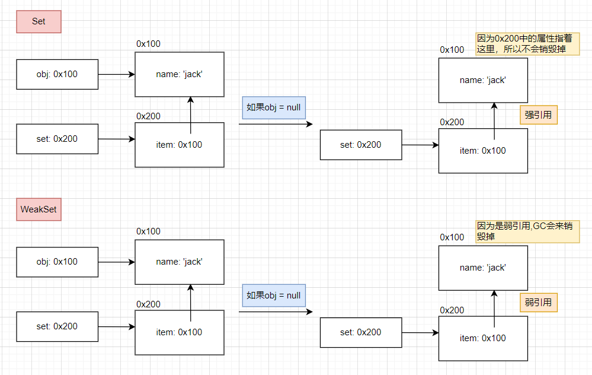 

> ##### `WeakSet` 的方法
>
> - `add(value)`：添加某个元素，返回 `WeakSet` 对象本身
> - `delete(value)`：从 `WeakSet` 中删除和这个值相等的元素，返回 `boolean` 类型
> - `has(value)`：判断 `WeakSet` 中是否存在某个元素，返回 `boolean` 类型

> ##### `WeakSet` 不能遍历
>
> - 因为 `WeakSet` 只是对对象的弱引用，如果遍历获取到其中的元素，那么有可能造成对象不能正常的销毁
> - 所以**存储到 `WeakSet` 中的对象是没办法获取的**，不支持通过键获取值，因此**没有 `get` 方法**

> ##### `WeakSet` 的应用场景
>
> ```javascript
> // 如果使用 Set，创建出来的对象会被强引用，即使 p = null，Set 中的对象 p 也不会销毁
> const personSet = new WeakSet();
> class Person {
>   constructor() {
>     // 构造器中每次创建出来的对象都添加到 Set
>     personSet.add(this);
>   }
>   running() {
>     // 在每次调用方法的时候，去判断当前的调用是不是通过构造器创建出来的
>     if (!personSet.has(this)) {
>       throw new Error("不能通过非构造方法创建出来的对象调用running方法");
>     }
>     console.log('running', this);
>   }
> }
> const p = new Person();
> p.running();
> p = null;
> 
> // 不允许通过其他的对象对方法调用
> p.running.call({name: "jack"});		// Error: 不能通过非构造方法创建出来的对象调用running方法
> ```
>


### Map 集合

ES6 中新增的数据结构 `Map`，用于**存储映射关系**

对象存储映射关系只能用字符串或 `Symbol` 作为属性名 `key` ，某些情况下可能希望通过其他类型作为 `key`，比如对象

`Map` 是有序结构，对象是无序结构

```javascript
// 对象中是不能使用对象来作为key的
const obj1 = { name: "kobe" };
const info = {
  [obj1]: "aaa"
}
// 会自动将对象转成字符串来作为key
console.log(info);	// { "[object Object]": "aaa" }
```

`Map` 允许**对象类型来作为 `key`**，使用构造方法创建 `Map`

```javascript
const obj1 = { name: "jack" };
const obj2 = { name: "kobe" };
const map = new Map();
// set 方法添加 key，value
map.set(obj1, "aaa");
map.set(obj2, "bbb");
map.set(1, "ccc");
console.log(map);		// { { name: 'jack' }: 'aaa', { name: 'kobe' }: 'bbb', 1: 'ccc' }

const map2 = new Map([[obj1, "aaa"], [obj2, "bbb"], [2, "ddd"]]);
console.log(map2);		// { { name: 'jack' }: 'aaa', { name: 'kobe' }: 'bbb', 2: 'ddd' }
```

常见方法

- `size`：返回 `Map` 中元素的个数

  ```javascript
  const map = new Map([[obj1, "aaa"], [obj2, "bbb"], [2, "ddd"]]);
  console.log(map.size);	// 3
  ```

- `set(key, value)`：在 `Map` 中添加 `key`、`value`，并且返回整个 `Map` 对象

  ```javascript
  const map = new Map([[obj1, "aaa"], [obj2, "bbb"], [2, "ddd"]]);
  map2.set("name", "eee");
  console.log(map2);
  ```

- `get(key)`：根据 `key` 获取 `Map` 中的 `value`

  ```javascript
  const map = new Map([['name', 'jack'], ['address', '北京']]);
  console.log(map.get("name"));	// jack
  ```

- `has(key)`：判断是否包括某一个 `key`，返回 `Boolean` 类型

  ```javascript
  const map = new Map([['name', 'jack'], ['address', '北京']]);
  console.log(map.has("name"));	// true
  ```

- `delete(key)`：根据 `key` 删除一个键值对，返回 `Boolean` 类型

  ```javascript
  const map = new Map([['name', 'jack'], ['address', '北京']]);
  map.delete("name");
  console.log(map);
  ```

- `clear()`：清空所有的元素

  ```javascript
  const map = new Map([['name', 'jack'], ['address', '北京']]);
  map.clear();
  console.log(map);
  ```

- `forEach(callback, [, thisArg])`：通过 `forEach` 遍历 `Map`

  ```javascript
  const map = new Map([['name', 'jack'], ['address', '北京']]);
  map.forEach((item, key) => {
    console.log(item, key);
  })
  // jack name
  // 北京 address
  for (const item of map) {
    console.log(item);
  }
  // ['name', 'jack']
  // ['address', '北京']
  for (const [key, value] of map) {
    console.log(key, value)
  }
  // name jack
  // address 北京
  ```


### WeakMap 集合

`WeakMap` 数据结构和 `Map` 类型相似，也是以键值对的形式存在的

`WeakMap` 和 `Map` 的区别

1. `WeakMap` 的 **`key` 只能使用对象**，不接受其他的类型作为 `key`
2. `WeakMap` 的 `key` 对对象的引用是**弱引用**，如果没有其他引用引用这个对象，那么 **GC 可以回收该对象**

```javascript
const obj = { name: "obj1" };
const map = new Map();
// 强引用：obj = null,由于强引用，obj对象的内存不会销毁
map.set(obj, "aaa");
const weakMap = new WeakMap();
// 弱引用：obj = null,由于弱引用，obj对象的内存会被销毁
weakMap.set(obj, "aaa");
```

常见方法

- `set(key, value)`：在 `Map` 中添加 `key`、`value`，并且返回整个 `Map` 对象
- `get(key)`：根据 `key` 获取 `Map` 中的 `value`
- `has(key)`：判断是否包括某一个 `key`，返回 `Boolean` 类型
- `delete(key)`：根据 `key` 删除一个键值对，返回 `Boolean` 类型

`WeakMap` 是**不能遍历**的，没有 `forEach` 方法，也不支持通过 `for..of..` 的方式进行遍历

`WeakMap` 的应用场景

```javascript
// 应用场景(vue3响应式原理)
const obj1 = {
  name: "why",
  age: 18
}
// 与obj1.name绑定，obj1.name改变时执行
function obj1NameFn1() {
  console.log("obj1NameFn1被执行");
}
function obj1NameFn2() {
  console.log("obj1NameFn2被执行");
}
// 与obj1.age绑定，obj1.age改变时执行
function obj1AgeFn1() {
  console.log("obj1AgeFn1");
}
function obj1AgeFn2() {
  console.log("obj1AgeFn2");
}

const obj2 = {
  name: "kobe",
  height: 1.88,
  address: "广州市"
}
// 与obj2.name绑定，obj2.name改变时执行
function obj2NameFn1() {
  console.log("obj1NameFn1被执行");
}
function obj2NameFn2() {
  console.log("obj1NameFn2被执行");
}

// 1.创建WeakMap
const weakMap = new WeakMap();

// 2.收集依赖结构
// 2.1.对obj1收集的数据结构
const obj1Map = new Map();
obj1Map.set("name", [obj1NameFn1, obj1NameFn2]);
obj1Map.set("age", [obj1AgeFn1, obj1AgeFn2]);
weakMap.set(obj1, obj1Map);

// 2.2.对obj2收集的数据结构
const obj2Map = new Map();
obj2Map.set("name", [obj2NameFn1, obj2NameFn2]);
weakMap.set(obj2, obj2Map);

// 3.如果obj1.name发生了改变
// Proxy/Object.defineProperty
obj1.name = "james";
const targetMap = weakMap.get(obj1);
const fns = targetMap.get("name");
fns.forEach(item => item());

// 使用weakMap，假如obj1 = null，由于是弱引用，obj1的内存会被销毁，同时obj1对应的value的对象的内存也会被销毁
```


## 数据类型转换

### 转换为字符串

- `toString()` 转成字符串

  每个 JavaScript 对象都有内置的 `toString()` 方法

  ```javascript
  let num = 1
  console.log(num.toString())	// '1'
  ```

- `String()` 转成字符串

  ```javascript
  let num = 1
  console.log(String(num))	// '1'
  ```

- 隐式转换，字符串拼接

  ```javascript
  let num = 1
  console.log(num + '我是字符串')	// '1我是字符串' 
  ```


### 转换为数字

- `parseInt(string)` 将 `String` 类型转成整数

  ```javascript
  console.log(parseInt('78')) // 78
  console.log(parseInt('120px')) // 120
  ```

- `parseFloat(string)` 将 `String` 类型转成浮点数

  ```javascript
  console.log(parseFloat('78.21')) // 78.21
  ```

- `Number()` 转成数值型

  ```javascript
  console.log(Number('12'))	// 12
  ```

- 隐式转换

  ```javascript
  let a = + '11'
  console.log(a) // 11
  ```


### 转换为布尔值

- 一个感叹号

  **代表空、否定的值会被转换为 `false`** ，如 `''`、`0`、`NaN`、`null`、`undefined`，其余值都会被转换为 `true`

- 两个感叹号

  `!!` 常常**用来做类型判断**

  - `undefined` 和 `null` 为 `false`
  - **任意数组，对象，函数**都转化为 `true`，即使是空数组，空对象
  - **空字符串** `''` 为 `false`，非空字符串为 `true`
  - **数值 `0`，不确定值 `NaN`** 为 `false`，其它为 `true`，无穷大也是 `true`

  **如果值为真的情况**：

  - 可以排除 `undefined` 和 `null`

  - 数值：表示不是 `0`，且有确定含义的值（包括无穷大）
  - 字符串：表示长度大于 `0` 的字符串
  - 数组，对象，函数：只能表示不是 `undefined` 或 `null`，并不能判断是否有元素和内容

  下面两个用法其实是完全等价的

  ```javascript
  let a; // null、undefined、''、0
  if (a !== null && typeof(a) !== "undefined" && a !== undefined && a !== '' && a !== 0) {
  }
  // 等价于
  let a;
  if(!!a){
  }
  ```

- 类型转换不具有传递性

  字符串 `”0″` 和数值 `0` 可以相互转换，但它们会转换为不同的布尔值，即 `0` 可转换为 `”0″`，`”0″` 可转换为 `true`，但 `0` 却转换为 `false`
  
- 出现在 `if` 条件中时，会被隐式转换成布尔值

- 引用类型都是通过调用自身的 `valueOf`、`toString` 来进行隐式转换（先 `valueOf` 后 `toString` ）

  ```javascript
  var a = [0];
  // 出现在if条件中时，会被转成布尔值
  if (a) {
    // [0].toString()  => '0'
    // '0' === true
    console.log(a == true);		// false
  } else {
    console.log(a);
  }
  ```


### 类型转换表

 


## 检测数据类型

### typeof 运算符

- `typeof` 主要用于**检测基本类型**

  ```javascript
  typeof '小白';          // string
  typeof 18;             // number
  typeof true;           // boolean
  typeof undefined;      // undefined
  typeof null;           // object
  typeof {};				     // object
  typeof [];				     // object
  typeof function() {};	 // function
  ```

- 返回结果为**变量类型名称的小写字符串形式**

  `string`, `number`, `boolean`, `undefined`, `object`, `bigint`, `symbol`, `function`

- 返回的类型没有 `null`，`null` 返回字符串 `object`

- 与 JavaScript 数据类型相比多了一个 `function` 类型，不过函数是一种特殊的对象

- `typeof` 运算符存在一定的欠缺，如果不是字面量字符串而是字符串包装类 `String` 对象，会存在误判

  ```javascript
  const str = new String('test');
  typeof str === 'string'			// => false
  // 返回的会是 `object`
  ```

  顾及 `String` 包装类对象的写法

  ```javascript
  typeof str === 'string' | String.prototype.isPrototypeOf(str) // => true
  ```


### instanceof 运算符

- `instanceof` 主要用于**检测引用类型**

  根据**对象的原形链往上找**，如果原形链上有 `右边类型.prototype`，返回 `true`

  ```javascript
  var obj = {}; obj instanceof Object; 						// true
  var arr = []; arr instanceof Array; 						// true
  var fn = function() {}; fn instanceof Function; // true
  ```


### 原型链检测

- `Object.prototype.toString.call(sth)` 原形链的检测有漏洞（原型是可以改变的）

  所以会造成检测结果不准确，所以可以采用此种形式

  ```javascript
  var toString = Object.prototype.toString;
  toString.call(undefined);         // [object Undefined]
  toString.call(1);                 // [object, Number]
  toString.call(NaN);               // [object, Number]
  toString.call('a');							  // [object, String]
  toString.call(true);						  // [object, Boolean]
  toString.call({});							  // [object, Object]
  toString.call(function() {});    // [object, Function]
  toString.call([]);							 // [object, Array]
  toString.call(null);						 // [object, Null]
  ```


## 基本包装类型

基本包装类型就是**把简单数据类型包装成为复杂数据类型**，这样**基本数据类型就有了属性和方法**

提供了三个特殊的引用类型：`String`、`Number` 和 `Boolean`

```javascript
var str = 'andy';
console.log(str.length);

// 包装过程
// 1. 生成临时变量，把简单类型包装为复杂数据类型
var temp = new String('andy');
// 2. 赋值给我们声明的字符变量
str = temp;
// 3. 销毁临时变量
temp = null;
```


### 字符串包装类 String

- 字符串的不可变

  里面的值不可变，虽然看上去可以改变内容，但其实是地址变了，内存中新开辟了一个内存空间

- ##### 指定内容的索引 `indexOf('要查找的字符',开始的位置)`

  如果存在返回索引号，不存在返回 `-1`

- ##### 指定内容的最后索引 `lastIndexOf('要查找的字符')` 

  如果存在返回索引号，不存在返回 `-1`

- ##### 返回指定位置的字符 `charAt(index)` 

  `str[index]` H5新增

- ##### 获取指定位置处字符的ASCII码 `charCodeAt(index)`

- ##### 连接两个或多个字符串 `concat()`

- ##### 截取字符串

  `substr('截取的起始位置','截取几个字符')`

  `slice(start, end)` 从start位置开始，截取到end位置，end取不到 （start和end都是索引）

  `substring(start, end)`从start位置开始，截取到end位置，end取不到 (start和end都是索引）不接受负值

- ##### 替换字符`replace(被替换的字符串/正则表达式 ， 要替换为的字符串) `

  只会替换第一个字符（正则表达式可以通过修饰符来修改匹配机制）

  返回值是一个替换完毕的新字符串

- ##### 切分字符串 `split('分隔符')`

- ##### 删除两端空白字符 `trim()`

  不影响原字符串本身，返回新字符串	

- ##### 单独去除前面或者后面空白字符 trimStart / trimEnd（ES10）

  ```javascript
  const message = "    Hello World    ";
  console.log(message.trim());			// Hello World
  console.log(message.trimStart());		// Hello World    
  console.log(message.trimEnd());			//     Hello World
  ```

- ##### 模板字符串

  使用字符串模板来嵌入JS的变量或者表达式来进行拼接（ES6新增）

  ```javascript
  let name = '张三';
  let age = 18;
  function nextAge() {
      return age + 1;
  }
  
  let sayHello = `hello,my name is ${name}`;
  let ageDouble = `double age is ${age * 2}`;
  let ageNext = `next year age is ${nextAge()}`;
  ```

  - 模板字符串中可以换行

- ##### 是否以指定的子字符串开始/结束 `startsWith()`/`endsWith()`

  `startsWith()`：表示参数字符串是否在原字符串的头部，返回布尔值

  `endsWith()`：表示参数字符串是否在原字符串的尾部，返回布尔值

  大小写敏感

- ##### 重复字符串 `repeat()`

  `string.repeat(count)`

  返回新字符串

- ##### 字符串前后填充 padStart()/padEnd()

  `padStart(targetLength [, padString])`

  `padEnd(targetLength [, padString])`

  1. targetLength  字符串需要填充到的目标长度
  2. padString 填充字符串 默认" "

  ```javascript
  const message = "Hello World"
  const newMessage = message.padStart(15, "*").padEnd(20, "-")
  console.log(newMessage)
  // ****Hello World-----
  ```

  ```javascript
  const cardNumber = "321324234242342342341312"
  const lastFourCard = cardNumber.slice(-4)
  const finalCard = lastFourCard.padStart(cardNumber.length, "*")
  console.log(finalCard)
  // ********************1312
  ```


### 数字包装类 Number

- `toFixed()`：转换为**小数点后保留几位数字**的字符串，必要时**四舍五入**

  ```javascript
  const num = 1242.0055;
  const fixedString = num.toFixed(2);
  // => '1242.01'
  ```

- `toExponential()`：转换为指定小数点后保留几位的数字科学计数法字符串，必要时四舍五入

  ```javascript
  const num = 1242.0055;
  const sciString = num.toExponential(2);
  // => '1.24e+3'
  ```

- `toPrecision()`：转换为**保留几位有效数字**的字符串，必要时**四舍五入**

  ```javascript
  const num = 13.3714;
  const preString = num.toPrecision(2);
  // => '13'
  ```
  
  ```javascript
  const num = 1242.0055;
  const sciString = num.toPrecision(2);
  // => '1.2e+3'
  ```


## 拷贝

### 浅拷贝

- **只拷贝一层**，更**深层次对象**级别的**只拷贝引用**

  ```javascript
  var obj = {
    id: 1,
    name: 'andy',
    msg: { age: 18 }
  };
  
  var o = {};
  for (var k in obj) {
    // k 是属性名   obj[k] 属性值
    o[k] = obj[k];
  }
  ```

- 浅拷贝方法 `Object.assign(target, ...sources) `（ES6）


### 深拷贝

- 拷贝多层，**每一级别的数据都会拷贝**

  ```javascript
  var obj = {
    id: 1,
    name: 'andy',
    msg: { age: 18 },
    color: ['pink', 'red']
  };
  
  var o = {};
  
  function deepCopy(newobj, oldobj) {
    for (var k in oldobj) {
      // 判断属性值属于哪种数据类型
      // 1. 获取属性值 oldobj[k]
      var item = oldobj[k];
      // 2. 判断这个值是否是数组
      // 数组也是对象，所以要放到对象判断前面
      if (item instanceof Array) {
        newobj[k] = [];
        deepCopy(newobj[k], item)
      } else if (item instanceof Object) {
        // 3. 判断这个值是否是对象
        newobj[k] = {};
        deepCopy(newobj[k], item)
      } else {
        // 4. 属于简单数据类型
        newobj[k] = item;
      }
    }
  }
  
  deepCopy(o, obj);
  ```


# 运算符

## 递增和递减运算符

递增（`++`）和递减（ `--` ）既可以放在变量前面，也可以放在变量后面

- ##### 前置递增运算符

  `++num` 前置递增，就是自加 1， 等于 `num = num + 1`

  **先自加，后返回值**

  ```javascript
  var num = 10;
  alert(++num + 10); // 21
  ```

- ##### 后置递增运算符

  `num++` 后置递增，就是自加 1， 等于 `num = num + 1`

  **先返回原值，后自加**

  ```javascript
  var num = 10;
  alert(10 + num++); // 20
  ```


## 指数运算符

- `**` 运算符，可以对数字来计算乘方，等同于  `Math.pow` 方法 (ES7)

  ```javascript
  // 计算 3 的 3 次方
  const result1 = Math.pow(3, 3)
  const result2 = 3 ** 3
  console.log(result1, result2)
  ```


## 空值合并运算符

- 空值合并操作符（`??`），当左侧的操作数为 `null` 或者 `undefined` 时，返回其右侧操作数，否则返回左侧操作数（ES11）

  ```javascript
  // 用逻辑或来设置默认值有弊端
  const foo = 0;
  const bar = foo || 'defualt value';
  console.log(bar);
  // 'defualt value'
  
  const foo = '';
  const bar = foo || 'defualt value';
  console.log(bar);
  // 'defualt value'
  
  // 使用空值合并运算符??
  // 只判断是不是 null 和 undefined
  const foo = undefined;
  const bar = foo ?? "defualt value";
  console.log(bar);
  // 'defualt value'
  ```

- `??` 比 `||` 更严格

  `||` 运算符在左边是空字符串、`false` 或 `null`、`undefined`、`0` 等假值，都会返回后侧的值

  `??` 必须运算符左侧的值为 `null` 或 `undefined` 时，才会返回右侧的值

  ```javascript
  const bar = 0 || 1
  // => 1
  const foo = 0 ?? 1
  // => 0
  ```


## 逻辑赋值运算符

- 逻辑或赋值运算 `||=` （ES12）

  ```javascript
  let message = "hello world;
  // message = message || "default value";
  message ||= "default value";
  ```

- 逻辑与赋值运算 `&&=`（ES12）

  ```javascript
  let info = { name: "aa" };
  // info = info && info.name;
  info &&= info.name;
  ```

- 逻辑空赋值运算 `??=`（ES12）

  ```javascript
  let message = undefined;
  // message = message ?? "default value";
  message ??= "default value";
  ```


## 删除运算符

`delete` 操作符用于删除对象的某个属性或者数组元素

- `delete` 删除不存在的属性时，严格模式下抛出异常，非严格模式下返回 `false`

- `delete` 能删除的

  - 可配置**对象**的属性

  - **隐式声明**的全局变量（全局变量其实是 `window` 的属性）

- `delete` 不能删除的

  - 显式声明的变量
  - 内置对象的内置属性
  - 对象从原型继承而来的属性

- `delete` 删除数组元素

  - 删除数组元素时，数组的 `length` 属性并不会变小，数组元素变成 `undefined`

  - 被删除的元素已经完全不属于该数组

  - 如果想让一个数组元素的值变为 `undefined` 而不是删除它，使用 `undefined` 给其赋值而不是使用 `delete` 操作符

    此时数组元素是在数组中的

- `delete` 操作符与直接释放内存（只能通过解除引用来间接释放）没有关系


## 运算符优先级

 

**按照优先级从高到低排序**

1. `.` 字段访问，`[]` 数组下标
2. `()` 小括号（函数调用，表达式分组）、`new`
3. 一元运算符（只有一个参数）
   `++`、`--`、`-`（负数）、`+`（转为数字）
   `!` （ `!` 优先级高）、`~`
   `delete` 、`typeof`、`void`
4. 算术运算符，先 `*`, `/`, `%`，后 `+`, `-`
5. 移位运算符 `<<`、`>>`、`>>>`
6. 关系运算符 `>`、`>=`、`<`、`<=`、`in`、`instanceof`
7. 相等运算符 `==`、`!=`、`===`、`!==`
8. 按位运算符，优先级顺序依次为 `&`、`^`、`|`
9. 逻辑运算符，先 `&&`，后 `||`，`??` 不能与前两者组合使用
10. 三元运算符 `?:`
11. 赋值运算符 `=`、`+=`、`-=`、`*=`、`/=`、`%=`、`<<=`、`>>=`、`>>>=`、`&=`、`^=`、`|=`
12. 逗号运算符 `,`

> 前增量 `++i` / 前减量 `--i`
>
> **前缀式运算符都发生在计算表达式之前**

```javascript
var i = 10;
++i;
// 等价于
i = i + 1;	// 11
```

```javascript
var i = 10;
--i;
// 等价于
i = i - 1;	// 9
```

```javascript
var i = 10;
alert(--i);	// 9
```

> 后增量 `i++` / 后减量 `i--`
>
> **后缀式运算符是在执行表达式后才进行增量或减量运算的**

```javascript
var i = 10;
i++;
// 等价于
i = i + 1;	// 11
```

```javascript
var i = 10;
i--;
// 等价于
i = i - 1;	//9
```

```javascript
var i = 10;
alert(i--);	// 10
```


# 语法

## let / const

ES6 开始新增了两个关键字可以声明变量：`let`、`const`

**`const` 关键字**保存的数据一旦被赋值，就**不能被修改**，但是如果赋值的是引用类型，那么可以通过引用找到对应的对象，修改对象内容

```javascript
const obj = { foo: "foo" }
obj.foo = "aaa"
```

```javascript
const names = ["abc", "cba", "nba"];
// const 定义的常量不能做 ++ 操作
for (const i = 0; i < names.length; i++) {	// TypeError: Assignment to constant variable
  console.log(names[i])
}
for (const item of names) {
  console.log(item)
}
```

`let`、`const` **不允许重复声明变量**

```javascript
var bar = "abc";
var bar = "cba";
let foo = "abc"
// SyntaxError: Identifier 'foo' has already been declared
let foo = "cba"
```

`let` / `const` 是**没有作用域提升**的

但是会在执行上下文创建阶段被创建出来，但是是不可以访问它们的，直到词法绑定被求值

```java
console.log(foo);
var foo = "foo";
console.log(bar);
// ReferenceError: Cannot access 'bar' before initialization
let bar = 'bar';
```

`let` 和 `const` 声明的变量具有**块级作用域**，`var` 定义的变量可以跨块作用域访问

```javascript
var arr = [];
for (var i = 0; i < 2; i++) {
  arr[i] = function () {
    console.log(i); 
  }
}
// 变量i是全局的，函数执行时输出的都是全局作用域下的i值
arr[0](); // 2
arr[1](); // 2
```

```javascript
let arr = [];
for (let i = 0; i < 2; i++) {
    arr[i] = function () {
        console.log(i); 
    }
}
// 每次循环都会产生一个块级作用域，每个块级作用域中的变量都是不同的
// 函数执行时输出的是自己上一级（循环产生的块级作用域）作用域下的i值
arr[0](); // 0
arr[1](); // 1
```

使用 `let`、`const` 声明的变量，在声明之前，变量都是不可以访问的，这种现象称之为**暂时性死区**

```javascript
var foo = "foo"
if (true) {
  console.log(foo);	// ReferenceError: Cannot access 'foo' before initialization
  let foo = "abc";
}
```


## for...in / for...of

- `for...in` 遍历 `key`

  ```javascript
  const arr = [10, 20, 30]
  for (let n in arr) {
    console.log(n)
  }
  // 0	// 1	// 2
  ```

- `for...of` 遍历 `value`

  ```javascript
  const arr = [10, 20, 30]
  for (let n of arr) {
    console.log(n)
  }
  // 10 // 20	// 30
  ```

  ```javascript
  const str = 'abc'
  for (let s of str) {
    console.log(s)
  }
  // a	// b	// c
  ```

  ```javascript
  function fn() {
    for (let argument of arguments) {
      console.log(argument)
    }
  }
  fn(10, 20, 30)
  ```

  ```javascript
  const pList = document.querySelectorAll('p')
  for (let p of pList) {
    console.log(p) // for...of 可以获取 value ，而 for...in 获取 key
  }
  ```

- `for...in` 遍历一个对象的**可枚举属性**，如对象、数组、字符串；针对属性，所以获得 `key`

  > `Object.getOwnPropertyDescriptors(obj)` 获取对象的所有属性描述，通过 ` enumerable: true` 判断该属性是否可枚举

  - `for...in` 遍历对象

    ```javascript
    const obj = { name: '双越', city: '北京' }
    for (let val in obj) {
      console.log(val)
    }
    ```

- `for...of` 遍历一个**可迭代对象**，如数组、字符串、`Map` / `Set` ；针对一个迭代对象，所以获得 `value`

  > 其实就是迭代器模式，通过一个 `next` 方法返回下一个元素，该对象要实现一个 `[Symbol.iterator]` 方法，其中返回一个 `next` 函数，用于返回下一个 `value`，可以执行 `arr[Symbol.iterator]()` 看一下
  >
  > 内置迭代器的类型有 `String` `Array` `arguments` `NodeList` `Map` `Set` `generator` 等

  - `for...of` 遍历 `Map` / `Set`

    ```javascript
    const set1 = new Set([10, 20, 30])
    for (let n of set1) {
      console.log(n)
    }
    ```

    ```javascript
    let map1 = new Map([['x', 10], ['y', 20], ['z', 3]])
    for (let n of map1) {
      console.log(n)
    }
    ```

  - `for...of` 遍历 `generator`

    ```javascript
    function* foo(){
      yield 10
      yield 20
      yield 30
    }
    for (let o of foo()) {
      console.log(o)
    }
    ```

- `for await...of` 遍历异步请求的可迭代对象，`Promise.all` 的替代

  ```javascript
  function createTimeoutPromise(val) {
    return new Promise(resolve => {
      setTimeout(() => {
        resolve(val)
      }, 1000)
    })
  }
  ```

  ```javascript
  const list = [createTimeoutPromise(10), createTimeoutPromise(20)]
  // 使用 Promise.all 执行
  Promise.all(list).then(res => console.log(res))
  // 使用 for await ... of 遍历执行
  // 如果用 for...of 只能遍历出各个 promise 对象，而不能触发 await 执行
  for await (let p of list) {
    console.log(p)
  }
  ```

  ```javascript
  // 如果需要按顺序依次出结果
  const v1 = await createTimeoutPromise(10);
  console.log(v1)
  const v2 = await createTimeoutPromise(20);
  console.log(v2)
  // 或使用for...of
  for (let n of [10, 20]) {
    const v = await createTimeoutPromise(n)
    console.log(v)
  }
  ```


## 字面量增强

ES6 中对对象字面量进行了增强，称之为 Enhanced object literals（增强对象字面量）

- 属性的简写

  ```javascript
  const name = 'jack';
  const age = 18;
  // const obj = { name: name, age: age }
  const obj = { name, age }
  ```

- 方法的简写

  ```javascript
  const obj = {
    // foo: function() { }
    foo () { }
  }
  ```
  
- 计算属性名

  ```javascript
  const name = 'jack';
  const obj = {
    [name + '123']: 'haha'
  }
  ```


## 标签模板

标签模板可以作为函数调用的参数

```javascript
function foo(param) {
  console.log(param)
}
foo('hello')		// hello
// 参数被数组包裹
foo`hello`			// ['hello']
// 可以传入复杂参数
foo`
<div>hello</div>
<div>world</div>
`
```


## 解构

ES6 中新增了从数组或对象中方便获取数据的方法

### 数组解构

- 解构出所有项目

  ```javascript
  const names = ['abc', 'cba', 'nba'];
  // const item1 = names[0];
  // const item2 = names[1];
  // const item3 = names[2];
  const [item1, item2, item3] = names;
  ```

- 默认从头开始获取

  ```javascript
  const names = ['abc', 'cba', 'nba'];
  const [itema, itemb] = names;
  // itema: 'abc'
  // itemb: 'cba'
  ```

- 解构后面的元素

  ```javascript
  const names = ['abc', 'cba', 'nba'];
  const [, , itemc] = names;
  // itemc: 'nba'
  ```

- 解构出一个元素，后面的元素放到一个新数组中

  ```javascript
  const names = ['abc', 'cba', 'nba'];
  const [itemx, ...newNames] = names;
  // itemx: 'abc'
  // newNames: ['cba', 'nba']
  ```

- 如果解构不成功，变量的值为 `undefined`

  ```javascript
  const names = ['abc', 'cba', 'nba'];
  const [item1, item2, item3, item4] = names;
  // item4: undefined
  ```

- 如果没有解构出来，设置默认值

  ```javascript
  const names = ['abc', 'cba', 'nba'];
  const [itema, itemb, itemc, itemd = 'aaa'] = names;
  // itemd: 'aaa'
  ```


### 对象解构

- 解构出所有项目

  ```javascript
  const obj = { name: "jack", age: 18, height: 1.88 }
  const { name, age, height } = obj;
  // name: 'jack'
  // age: 18
  // height: 1.88
  ```

  不会根据顺序赋值

  ```javascript
  const obj = { name: "jack", age: 18, height: 1.88 }
  const { height, age, name } = obj;
  // height: 1.88
  // age: 18
  // name: 'jack'
  ```

- 只解构其中某个值

  ```javascript
  const obj = { name: "jack", age: 18, height: 1.88 }
  const { age } = obj;
  // age: 18
  ```

- 自定义变量名

  ```javascript
  const obj = { name: "jack", age: 18, height: 1.88 }
  const { name: newName } = obj;
  // newName: 'jack'
  ```

- 如果没有解构出来，设置默认值

  ```javascript
  const obj = { name: "jack", age: 18, height: 1.88 }
  const { address: newAddress = "广州市" } = obj;
  // newAddress: '广州市'
  ```

- 方法参数解构

  ```javascript
  const obj = { name: "jack", age: 18, height: 1.88 }
  function foo(info) {
    console.log(info.name, info.age);
  }
  foo(obj);
  function bar({ name, age }) {
    console.log(name, age);
  }
  bar(obj);
  // 'jack', 18
  ```


## 展开运算符

展开运算符可以将**数组或者字符串拆分成以逗号分隔的参数序列**（ES6）

还可以在构造**字面量对象**时，将对象表达式**按 `key-value` 的方式展开**（ES9）

- 数组展开

  ```javascript
  const ary = ["a", "b", "c"];
  // ...ary =>> "a", "b", "c"
  console.log(...ary); // a b c
  
  function foo(x, y, z) {
    console.log(x, y, z);
  }
  foo(...ary);
  ```

- 字符串拆分

  ```javascript
  const name = 'tom';
  function foo(x, y, z) {
    console.log(x, y, z);
  }
  foo(...name);
  ```

- 数组合并

  ```javascript
  let ary1 = [1, 2, 3];
  let ary2 = [4, 5, 6];
  let ary3 = [...ary1, ...ary2];
  ```

  ```javascript
  let ary1 = [1, 2, 3];
  let ary2 = [4, 5, 6];
  ary1.push(...ary2);
  ```

- 伪数组转换为真正的数组

  ```javascript
  let oDivs = document.getElementsByTagName('div');
  let ary = [...oDivs];
  ```

- 剩余参数和解构配合

  ```javascript
  let students = ['wangwu', 'zhangsan', 'lisi'];
  let [s1, ...s2] = students;
  console.log(s1);  // 'wangwu'
  console.log(s2);  // ['zhangsan', 'lisi']
  ```

- 展开字面量对象

  ```javascript
  const info = { name: 'jack', age: 18 };
  const obj = { ...info, address: '北京市' };
  console.log(obj);	// { name: 'jack', age: 18, address: '北京市' }
  ```


- 展开运算符其实是一种**浅拷贝**

  ```javascript
  const info = { name: "jack", friend: { name: "kobe" } };
  const obj = { ...info, name: "tom" };
  console.log(obj);
  // { name: 'tom', friend: { name: 'kobe' } }
  obj.friend.name = "james";
  console.log(info.friend.name);
  // james
  ```


## 可选链

`?.` 前的对象是 `null` 或 `undefined` ，表达式就会短路，返回 `undefined` （ES11）

```javascript
const obj = { friend: { girlFriend: { name: 'lucy' } } }
// 旧 && 判断形式
if (obj.friend && obj.friend.girlFriend) {
  console.log(obj.friend.girlFriend.name);
}
// 可选链形式
console.log(obj.friend?.girlFriend?.name);
```


## 严格模式

严格模式是一种具有限制性的 JavaScript 模式，是代码隐式的脱离了懒散模式

支持严格模式的浏览器在检测到代码中有严格模式时，会以更加严格的方式对代码进行检测和执行

严格模式的限制

1. 抛出错误来消除一些原有的静默（silent）错误
2. JS 引擎在执行代码时可以进行更多的优化（不需要对一些特殊的语法进行处理）
3. 禁用了在 ECMAScript 为了版本中可能会定义的一些语法（保留字，关键字）

**开启严格模式**进行解析

1. js 文件开启严格模式

   ```javascript
   'use strict';
   
   message = 'Hello World';
   console.log(message);
   ```

2. 某一函数开启严格模式

   ```javascript
   function foo() {
     'use strict';
     true.foo = 'abc';
   }
   ```

严格模式常见限制

1. 无法意外的创建全局变量

2. 严格模式会使引起静默失败（不报错也没有任何效果）的赋值操作抛出异常

3. 严格模式下试图删除不可删除的属性

4. 不允许函数参数有相同的名称

5. 不允许 0 的八进制语法

6. 不允许使用 `with`

7. `eval` 不再为上层引用变量

   ```javascript
   var jsString = 'var message = "Hello World"; console.log(message);'
   eval(jsString);
   
   // 不开启严格模式
   console.log(message);		// Hello World
   // 开启严格模式
   console.log(message);		// 报错 message is not define
   ```

8. `this` 绑定不会默认转成对象

   ```javascript
   function foo() {
     console.log(this);
   }
   foo();
   // 不开启严格模式：window
   // 开启严格模式：undefined
   
   var obj = { name: 'jack', foo: foo };
   var bar = obj.foo;
   bar();
   // 不开启严格模式：window
   // 开启严格模式：undefined
   ```
   
   ```javascript
   setTimeout(function() {
     console.log(this)
   }, 1000)
   // 无论是不是严格模式 都是 window
   // 内部函数fn.apply(this) this就是window
   ```


# 函数

## 函数的定义

- 命名函数 `function` 关键字 

- 匿名函数

- 函数也属于对象

  `new Function('参数1','参数2'..., '函数体')`

- 箭头函数 `() => {}` 

- 函数也是一种数据类型，可以作为参数和返回值


## 函数参数

### 不定参数 arguments

- `arguments` 是当前函数的一个**内置对象**

  **所有函数都内置了一个 `arguments` 对象**，`arguments` 对象中**存储了传递的所有实参**

  ```javascript
  function foo(num1, num2, num3) {
    // 会去 AO 中寻找 arguments
    console.log(arguments);			// Arguments(5) [10, 20, 30, 40, 50]
    console.log(num1, num2, num3);
  }
  foo(10, 20, 30, 40, 50);
  
  // AO对象
  // var ao = {
  //     num1: undefined,
  //     num2: undefined,
  //     num3: undefined,
  //     arguments: {}
  // }
  ```

- `arguments` 展示形式是一个**伪数组**，可以进行遍历
  
  - 具有 `length` 属性
  - 按索引方式储存数据
  - 不具有数组的 `push`、`pop`、`forEach`、`map` 等方法
  
- `arguments` 常见操作

  - 获取参数的长度：`arguments.length`

  - 根据索引值获取某一个参数：`arguments[2]`

  - 获取当前 `arguments` 所在的函数：`arguments.callee`

- 箭头函数没有 `arguments`，如果想要获取 `arguments` 只能去上层作用域找

  ```javascript
  function foo() {
    var bar = () => {
      console.log(arguments)
    };
    return bar;
  }
  var fn = foo(123);
  fn();	// {'0': 123}
  ```

- `arguments` 转 `array` 类型

  ```javascript
  var newArray = Array.prototype.slice.call(arguments)
  var newArray = [].slice.call(arguments)
  var newArray = Array.from(arguments)
  var newArray = [...arguments]
  ```
  
  > 关于 `slice.call(arguments)`
  >
  > 如果不使用 `call` 调用，获取的 `this` 是原型对象 `prototype`，但是需要获取的是可遍历对象
  >
  > ```javascript
  > var names = ['jack', 'tom', 'john', 'jerry'];
  > names.slice(1, 3);
  > 
  > // 模拟Array中的slice实现
  > Array.prototype.slice  = function(start, end) {
  >   var arr = this;
  >   start = start || 0;
  >   end = end || arr.length;
  >   var newArray = [];
  >   for (var i = start; i < end; i++) {
  >     newArray.push(arr[i]);
  >   } 
  >   return newArray;
  > }
  > var newArray = Array.prototype.slice.call(['a', 'b', 'c']);
  > ```

- 在**非严格模式**下，函数的 `arguments` 和当前函数定义的**形参存在映射关系**，一个变另外一个也变

- 在**严格模式**下，函数的 `arguments` 和当前函数定义的**形参是没有映射关系**，并且禁止使用 `arguments.callee` 和`arguments.callee.caller`

  ```javascript
  function side(arr) {
    arr[0] = arr[2];
  }
  // 函数加了默认值，则转为严格模式
  function a(a, b, c = 3) {
    c = 10;
    console.log(arguments);
    side(arguments);  // 这里a,c的值不管怎么改变都是不会改变的
    return a + b + c;
  }
  a(1, 1, 1);  //12
  ```

  ```javascript
  function side(arr) {
    arr[0] = arr[2];
  }
  // 非严格模式
  function a(a, b, c) {
    c = 10;
    console.log(arguments);
    side(arguments);  // 这里 a，c的值不管怎么改变都是不会改变的
    return a + b + c;
  }
  a(1, 1, 1);  // 21
  ```


### 剩余参数

将一个**不定数量的参数表示为一个数组**（ES6）

如果最后一个参数是 `...` 为前缀的，那么它会将剩余的参数放到该参数中，并且作为一个数组

剩余参数必须放到最后一个位置，否则会报错

```javascript
function sum (first, ...args) {
  console.log(first); // 10
  console.log(args); // [20, 30] 
}
sum(10, 20, 30)
```

剩余参数和 `arguments` 的区别

1. 剩余参数只包含那些没有对应形参的实参，而 `arguments` 对象包含了传给函数的所有实参
2. `arguments` 对象不是一个真正的数组，剩余参数是一个真正的数组，可以进行数组操作


### 默认参数

允许给函数参数默认值（ES6）

```javascript
function foo(x = 20, y = 30) {
  console.log(x, y);
}
foo(50, 100);	// 50, 100
foo();			  // 20, 30
```

- 默认值可以和解构一起使用

  ```javascript
  // 写法一
  function foo({ name, age } = { name: 'jack', age: 18 }) {
    console.log(name, age);
  }
  // 写法二
  function foo({ name = 'jack', age = 18 } = {}) {
    console.log(name, age);
  }
  ```

- 有默认值的形参最好放最后

  ```javascript
  function foo(x, y, z = 30) {
    console.log(x, y, z);
  }
  foo(10, 20);
  function bar(x = 30, y, z) {
    console.log(x, y, z);
  }
  foo(undefined, 10, 20);
  ```

- 默认值会改变函数的 `length` 的个数，默认值以及后面的参数都不计算在 `length` 之内

  ```javascript
  function bar(x, y, z, m, n) {
    console.log(x, y, z, m, n);
  }
  console.log(bar.length);			// 5
  
  function foo(x, y, z = 30, m, n) {
    console.log(x, y, z, m, n);
  }
  console.log(foo.length);			// 2
  ```

- 默认参数可以使用三目运算符

  ```javascript
  function foo(a, b = a === 1 ? 2 : 3) {
    console.log(b)
  }
  console.log(foo(1));
  // => 2
  ```

- 默认参数可以传递函数执行结果

  ```javascript
  function getNowDate() {
    return Date.now();
  }
  function foo(a = getNowDate()) {
    console.log(a);
  }
  ```


### 标签模板字符串

使用标签模板字符串，并且在调用函数的时候插入其他的变量（ES6）

1. 第一个元素是数组，是被模板字符串拆分的字符串组合
2. 后面的元素是每个模板字符串传入的内容

```javascript
function foo(...args) {
  console.log(args);
}
foo('Hello World');

const name = 'jack';
const age = 18;
// [ ['Hello ', ' World ', ''], 'jack', 18 ]
foo`Hello ${name} World ${age}`;
```


### 函数参数暂时性死区

```javascript
// 如果没有定义第一个参数，则会使用第二个参数作为第一个实参
// 但是当第一个参数为默认值时，指向 arg1 = arg2 会触发暂时性死区
function foo(arg1 = arg2, arg2) {
  console.log(`${arg1} ${arg2}`);
}
foo(undefined, 'arg2');
// Uncaught ReferenceError: arg2 is not defined
foo(null, 'arg2'); // null arg2
// null 不会认为第一个参数为默认值，会接受null作为参数
```


### 函数参数作用域

```javascript
function foo(arg1) {
	let arg1;		// let 声明报错
}
foo('arg1');	// Uncaught SyntaxError: Indentifier 'arg1' has already been declared
```


## 高阶函数

一个函数如果接受另外一个**函数作为参数**，或者该函数会返回另外一个**函数作为返回值**，那么这个函数就称为高阶函数

- 函数作为参数

  ```javascript
  function calc(num1, num2, calcFn) {
    console.log(calcFn(num1, num2));
  }
  function add(num1, num2) {
    return num1 + num2;
  }
  function sub(num1, num2) {
    return num1 - num2;
  }
  function mul(num1, num2) {
    return num1 * num2;
  }
  
  calc(20, 30, mul);
  ```

- 函数作为返回值

  ```javascript
  function makeAdder(count) {
    function add(num) {
      return count + num;
    }
    return add;
  }
  const add5 = makeAdder(5);
  console.log(add5(6));
  console.log(add5(10));
  ```


## 箭头函数

- 箭头函数**不绑定 `this`、`arguments` 属性**


- 箭头函数中的 `this`，指向的是**函数定义位置的上下文 `this`**


- 箭头函数是**没有显式原型**的，**不能作为构造函数**来使用，**不能使用 `new`**来创建对象

  ```javascript
  // 普通函数
  function foo() {}
  var f = new foo();					// f.__proto__ = foo.prototype
  
  // 箭头函数
  var bar = () => {}
  console.log(bar.prototype);	// undedined
  var b = new bar();					// TypeError: bar is not a constructor
  ```

- 箭头函数的缺点

  1. 没有 `arguments`

     ```javascript
     const fn1 = () => {
       console.log('this', arguments) // 报错，arguments is not defined
     }
     fn1(100, 200)
     ```

  2. **无法通过 `call`，`apply`，`bind` 等改变 `this`**

     ```javascript
     const fn1 = () => {
       console.log('this', this) // window
     }
     fn1.call({ x: 100 })
     ```

- 不适用箭头函数的场景

  - 对象方法

    ```javascript
    const obj = {
      name: '双越',
      getName: () => {
        return this.name
      }
    }
    console.log(obj.getName())	// window
    ```

  - 对象原型

    ```javascript
    const obj = {
      name: '双越'
    }
    obj.__proto__.getName = () => {
      return this.name
    }
    console.log(obj.getName())
    ```

  - 构造函数

    ```javascript
    const Foo = (name, age) => {
      this.name = name
      this.age = age
    }
    const f = new Foo('张三', 20) // 报错 Foo is not a constructor
    ```

  - 动态上下文中的回调函数

    ```javascript
    const btn1 = document.getElementById('btn1')
    btn1.addEventListener('click', () => {  
      // console.log(this === window)
      this.innerHTML = 'clicked'
    })
    ```

  - Vue 生命周期和方法

    Vue 组件是一个对象，而 React 组件是一个 `class`

  - `class` 中使用箭头函数则**没问题**

    ```javascript
    class Foo {
      constructor(name, age) {
        this.name = name
        this.age = age
      }
      getName = () => {
        return this.name
      }
    }
    const f = new Foo('张三', 20)
    console.log('getName', f.getName())
    ```

- 箭头函数的简写

  1. 参数只有一个，`()` 可以省略

     ```javascript
     const nums = [10, 20, 30, 40];
     // 一个可以省略
     nums.foreach(item => {
       console.log(item); 
     });
     // 多个不可省略
     nums.foreach((item, index) => {
       console.log(item, index); 
     });
     ```

  2. 函数执行体只有一行代码，`{}` 可以省略，并且会默认将这一行代码的执行结果作为返回值

     ```javascript
     const nums = [10, 20, 30, 40];
     nums.foreach(item => console.log(item));
     nums.filter(item => item % 2 === 0);
     ```

  3. 如果只有一行代码，并且返回一个对象，在返回对象外加 `()`

     ```javascript
     const bar = () => ({ name: 'jack', age: 18 });
     ```


## 立即执行函数

会创建一个独立的作用域，避免了命名冲突问题

`(function() {})()` 或 `(function() {} ())`


## 纯函数

纯函数需要符合以下条件

1. 确定的输入，一定会产生确定的输出

2. 函数在执行过程中，不能产生副作用

   > 副作用：
   >
   > 在执行一个函数时，除了返回函数值之外，还对调用函数产生了附加影响，比如修改了全局变量，修改参数或者改变外部存储

纯函数的优势：**只需要关心函数的参数和返回值**就可以，单纯实现业务逻辑即可

```javascript
// 纯函数
function foo(num1, num2) {
  return num1 * 2 + num2 * num2;
}
// 不是纯函数
let name = 'abc'
function bar() {
  name = 'cba';
}
// 不是纯函数
const obj = { name: 'jack', age: 18 }
function baz(info) {
  info.age = 100;
}
baz(obj);
```

```javascript
const names = ['abc', 'cba', 'nba', 'dna'];

// slice 是一个纯函数
// slice 方法本身是不会修改原来的数组
// slice 方法只要给它传入一个 start / end，对于同一个数组来说，它会返回确定的值
var newNames1 = names.slice(0, 3);
console.log(newNames1);			// ['abc', 'cba', 'nba']
console.log(names);					// ['abc', 'cba', 'nba', 'dna'];

// splice 不是一个纯函数
// splice 在执行时，有修改调用的数组对象本身，修改这个操作就是产生的副作用
var newNames2 = names.splice(2);
console.log(newNames2);			// ['nba', 'dna']
console.log(names);					// ['nba', 'dna']
```


## 柯里化函数

函数柯里化：**只传递给函数一部分参数**来调用它，让它**返回一个函数去处理剩余的参数**

```javascript
function add(x, y, z) {
  return x + y + z;
}
var result1 = foo(10, 20, 30);

// 柯里化
function sum(x) {
  return function(y) {
    return function(z) {
      return x + y + z;
    }
  }
}
var result2 = sum(10)(20)(30);

// 简化柯里化
var sum2 = x => y => z => x + y + z;
var result2 = sum2(10)(20)(30);
```

柯里化优势：**单一职责**，希望一个函数处理的问题尽可能的单一，而不是将一大堆的处理过程交给一个函数来处理

- 可以将每次传入的参数在单一函数中进行处理，处理完后在下一个函数中再使用处理后的结果

  ```javascript
  function add(x, y, z) {
    x = x + 2；
    y = y + 2;
    z = z * z;
    return x + y + z;
  }
  // 柯里化
  function sum(x) {
    x = x + 2;
    return function(y) {
      y = y * 2;
      return function(z) {
        z = z * z;
        return x + y + z;
      }
    }
  }
  ```

- 函数的柯里化可以使逻辑充分的复用

  ```javascript
  function makeAdder(count) {
    count = count * count;
    return function(num) {
      return count + num;
    }
  }
  var adder5 = makeAdder(5);
  adder5(10);
  adder5(14);
  ```

  ```javascript
  function log(data, type, message) {
    console.log(`[${data.getHours()}:${date.getMinutes}][${type}]:[${message}]`);
  }
  log(new Date(), 'DEBUG', '轮播图出现BUG');
  log(new Date(), 'DEBUG', '查询菜单出现BUG');
  log(new Date(), 'DEBUG', '查询数据出现BUG');
  
  // 柯里化
  var log => data => type => message => {
    console.log(`[${data.getHours()}:${date.getMinutes}][${type}]:[${message}]`);
  }
  // 打印相同的时间
  var nowLog = log(new Date());
  nowLog('DEBUG')('轮播图出现BUG');
  nowLog('FUTURE')('新增了添加用户的功能');
  
  // 打印相同时间的DEBUG
  var nowLogAndDebug = log(new Date())('Debug');
  nowLogAndDebug('轮播图出现BUG');
  nowLogAndDebug('查询菜单出现BUG');
  ```

- 自动柯里化函数的实现

  ```javascript
  function hyCurrying(fn) {
    function curried(...args) {
      // 判断当前已经接收的参数的个数，和参数本身需要接受的参数是否已经一致了
      // 1. 当已经传入的参数 大于等于 需要的参数时，就执行函数
      if (args.length >= fn.length) {
        return fn.apply(this, args);
      } else {
        // 如果参数没有达到个数时，需要返回一个新的函数，继续接收参数
        function curried2(...args2) {
          return curried.apply(this, args.concat(args2));
        }
        return curried2;
      }
    }
    return curried;
  }
  
  function add(x, y, z) {
    return x + y + z;
  }
  var curryAdd = hyCurrying(add);
  console.log(curryAdd(10, 20, 30));
  console.log(curryAdd(10, 20)(30));
  console.log(curryAdd(10)(20)(30));
  ```


## 组合函数

如果需要对某一个数据进行函数调用，需要依次执行两个函数 fn1 和 fn2，那么每次都需要进行两个函数的调用操作，就会显得重复

将这两个函数组合起来，**自动依次调用**的过程就是对函数的组合，称之为组合函数

```javascript
function double(num) {
  return num * 2;
}
function square(num) {
  return num ** 2;
}
var count = 10;
var result = square(double(count));
console.log(result);

// 组合函数
function composeFn(m, n) {
  return function (count) {
    return n(m(count));
  }
}
var newFn = composeFn(double, square);
console.log(newFn(10))
```

封装通用组合函数

```javascript
// 通用组合函数
function hyCompose(...fns) {
  let length = fns.length;
  for (let i = 0; i < length; i++) {
    if (typeof fns[i] !== 'function') {
      throw new TypeError('Expected arguments are functions');
    }
  }
  function compose(...args) {
    let index = 0;
    let result = length ? fns[index].apply(this, args) : args;
    while (++i < length) {
      result = fns[index].call(this, result);
    }
    return result;
  }
  return compose;
}

function double(num) {
  return num * 2;
}
function square(num) {
  return num ** 2;
}
const newFn = hyCompose(double, square);
console.log(newFn(10));
```


## eval 函数

将传入的字符串当做 javaScript 代码来运行

```javascript
var jsString = 'var message = "Hello World"; console.log(message);'
eval(jsString);
```

不建议在开发中使用：可读性差，有攻击风险，必须经过jS解释器，不能被 JS 引擎优化


## 链式调用

链式调用的核心就在于**调用完的方法将自身实例返回**，便于后面继续调用

```javascript
var obj = {
  a: function() {
    console.log("a");
    return this;
  },
  b: function() {
    console.log("b");
    return this;
  },
};
obj.a().b();
```

```javascript
class Math {
  constructor(value) {
    this.hasInit = true;
    this.value = value;
    if (!value) {
      this.value = 0;
      this.hasInit = false;
    }
  }
  add() {
    let args = [...arguments]
    // shift 参数第一个元素，并返回删除的元素
    let initValue = this.hasInit ? this.value : args.shift()
    const value = args.reduce((prev, curv) => prev + curv, initValue)
    return new Math(value)
  }
  minus() {
    let args = [...arguments]
    let initValue = this.hasInit ? this.value : args.shift()
    const value = args.reduce((prev, curv) => prev - curv, initValue)
    return new Math(value)
  }
  mul() {
    let args = [...arguments]
    let initValue = this.hasInit ? this.value : args.shift()
    const value = args.reduce((prev, curv) => prev * curv, initValue)
    return new Math(value)
  }
  divide() {
    let args = [...arguments]
    let initValue = this.hasInit ? this.value : args.shift()
    const value = args.reduce((prev, curv) => prev / (+curv ? curv : 1), initValue)
    return new Math(value)
  }
}
let test = new Math()
const res = test.add(222, 333, 444).minus(333, 222).mul(3, 3).divide(2, 3)
console.log(res.value)
```


## 防抖函数

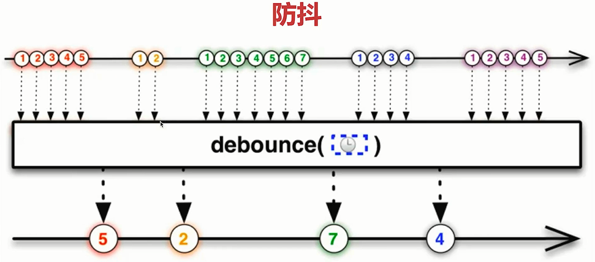 

- 在事件被触发 n 秒后再执行回调，如果在这 n 秒内又被触发，则重新计时（**只执行最后一次**） 

- 什么时候抖动停了，再执行下一步

- 场景：按钮提交时，防止多次提交按钮，只执行最后提交的一次；搜索框联想时，防止联想发送请求，只发送最后一次输入 
- 防抖关注**结果**，一次调用即可

- 非立即执行版

   

  ```javascript
  function debounce(fn, wait) {
    // 每次返回的函数执行的都是同一个timer，每次都能把上次的timer清除掉
    let timer = null;
    return function() {
      const context = this;
      const args = arguments;
      if (timer) {
        clearTimeout(timer);
      }
      // setTimeout内的this指向是window
      timer = setTimeout(function(){
        func.apply(context, args)
      }, wait);
    }
  }
  function handle() {
    console.log(Math.random());
  }
  window.addEventListener('click', debounce(handle, 1000));
  ```

  箭头函数版

  ```javascript
  const debounce = (fun, delay = 500) => {
    let timer = null;
    return function (...args) {
      clearTimeout(timer);
      timer = setTimeout(() => {
        // 箭头函数this的指向根据外部作用域，无需再绑定
        fun.apply(this, args)
      }, delay)
    }
  }
  ```

- 立即执行版

  事件触发后立刻执行函数，然后等到停止触发 n 秒后，才可以重新触发执行

   

  ```javascript
  function debounce(func, wait, immediate) {
    let timer = null;
    return function() {
      const context = this;
      const args = arguments;
      if (timer) {
        clearTimeout(timer);
      }
      if (immediate) {
        // 不存在 timer 是首次执行
        var callNow = !timer;
        timer = setTimeout(function() {
          timer = null;
        }, wait);
        if (callNow) {
          fn.apply(context, args);
        }
      } else {
        timer = setTimeout(function() {
          fn.apply(context, args);
        }, wait);
      }
    }
  }
  ```

- 回调函数拥有返回值

  ```javascript
  // 回调函数参数有返回值的情况
  // 只在 immediate 为 true 的时候返回函数的执行结果
  // immediate 为 false 的情况，因为使用了 setTimeout ，返回值将会一直是 undefined
  function debounce(func, wait, immediate) {
    let timer, result;
    return function () {
      const context = this;
      const args = arguments;
      if (timer) {
        clearTimeout(timer);
      }
      if (immediate) {
        var callNow = !timer;
        timer = setTimeout(function() {
          timer = null;
        }, wait);
        if (callNow) {
          result = fn.apply(context, args);
        }
      } else {
        timer = setTimeout(function() {
          fn.apply(context, args);
        }, wait);
      }
      return result;
    }
  }
  ```

- 取消防抖

  ```javascript
  function debounce(func, wait, immediate) {
    let timer = null;
    const debounced = function() {
      const context = this;
      const args = arguments;
      if (timer) {
        clearTimeout(timer);
      }
      if (immediate) {
        var callNow = !timer;
        timer = setTimeout(function() {
          timer = null;
        }, wait);
        if (callNow) {
          fn.apply(context, args);
        }
      } else {
        timer = setTimeout(function() {
          fn.apply(context, args);
        }, wait);
      }
    }
    // 取消掉下一次的执行，清除定时器
    const cancel = function() {
      clearTimeout(timer);
      timer = null;
    }
    debounced.cancel = cancel;
    return debounced;
  }
  ```


## 节流函数

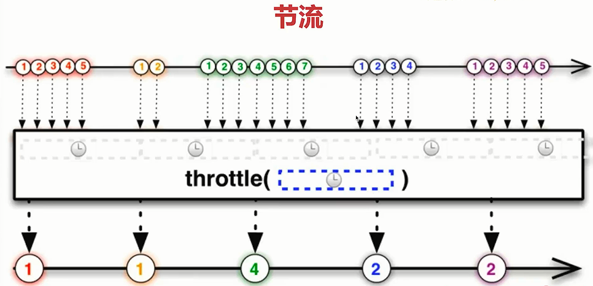 

- **在一个单位时间内，只能触发一次函数**，如果这个单位时间内触发多次函数，只有一次生效

- 使用场景：拖拽或缩放时，固定时间内只执行一次，防止超高频次触发位置变动
- 节流关注**过程**，需要持续一个过程，一次不够

- 使用时间戳实现

  ```javascript
  // 使用时间戳，当触发事件的时候，取出当前的时间戳，然后减去之前的时间戳(初始值为0）
  // 如果大于设置的时间周期，就执行函数，然后更新时间戳为当前的时间戳
  // 如果小于，就不执行
  function throttle(func, wait) {
    let context, args;
    let previous = 0;
    return function () {
      let now = +new Date();
      context = this;
      args = arguments;
      if (now - previous > wait) {
        func.apply(context, args);
        previous = now;
      }
    }
  }
  ```

- 使用定时器实现

  ```javascript
  // 当触发事件的时候，设置一个定时器，在触发事件的时候，如果定时器存在，就不执行
  // 定时器执行，然后执行函数，清空定时器，这样就可以设置下个定时器
  function throttle(func, wait) {
    let timer;
    return function() {
      const context = this;
      const args = arguments;
      if (!timer) {
        timer = setTimeout(function () {
          func.apply(context, args);
          timer = null;
        }, wait)
      }
    }
  }
  ```

  箭头函数

  ```javascript
  const throttle = (fun, delay = 1000) => {
    let flag = true;
    return function (...args) {
      if (!flag) return;
      flag = false
      setTimeout(() => {
        fun.apply(this, args)
        flag = true
      }, delay)
    }
  }
  ```


## 尾调用

### 尾调用

尾调用是指函数的**最后一个动作**是**返回一个函数的调用结果**

```javascript
function f(x){
  return g(x);
}
// 不一定出现在函数尾部，只要是最后一步操作即可
// 函数m和n都属于尾调用
function f(x) {
  if (x > 0) {
    return m(x)
  }
  return n(x);
}
```

**尾调用优化**，**即只保留内层函数的调用帧**，在调用栈中的调用帧始终只有一条，这样会**节省内存**

尾调用优化**只在严格模式下**开启，浏览器只支持 safari

- 不使用尾调用时调用栈情况

  ```javascript
  function foo () { console.log(111); }
  function bar () { foo(); }
  function baz () { bar(); }
  baz();
  ```

   

  造成这种结果是因为每个函数在调用另一个函数的时候，并没有 `return` 该调用

  所以 JS 引擎会认为还没有执行完，会保留调用帧

- 使用尾调用优化生效时调用栈情况

  ```javascript
  function foo () { console.log(111); }
  function bar () { return foo(); }
  function baz () { return bar(); }
  baz();
  ```

   

  尾调用由于是函数的最后一步操作，所以不需要保留外层函数的调用记录

  只要直接用内层函数的调用记录取代外层函数的调用记录就可以了，调用栈中始终只保持了一条调用帧

- 尾调用函数**不能**引用外部函数作用域中自由变量的**闭包**，并且不会使用外层函数的内部变量

  ```javascript
  // 尾调用优化失败
  function addOne(a){
    var one = 1;
    function inner(b){
      return b + one;
    }
    return inner(a);
  }
  ```


### 尾递归

使用尾递归，由于只存在一个调用帧，所以永远**不会发生栈溢出错误**，一旦使用递归，最好使用尾递归

```javascript
// 非尾递归Fibonacci数列实现
function Fibonacci (n) {
  if (n <= 1) return 1
  return Fibonacci(n - 1) + Fibonacci(n - 2);
}
Fibonacci(10) // 89
Fibonacci(100) // 超时
Fibonacci(500) // 超时

// 尾递归优化Fibonacci数列实现
function Fibonacci2 (n , ac1 = 1 , ac2 = 1) {
  if (n <= 1) return ac2
  return Fibonacci2 (n - 1, ac2, ac1 + ac2);
}
Fibonacci2(100) // 573147844013817200000
Fibonacci2(1000) // 7.0330367711422765e+208
Fibonacci2(10000) // Infinity
```

递归函数改写成尾递归：**把所有用到的内部变量改写成函数的参数**

```javascript
// 非尾递归形式
function factorial(n) {
  if (n === 1) return 1;
  // total = total * n
  return n * factorial(n - 1);
}
factorial(5)
```

1. 内部变量改写成函数的参数，但是函数可读写差

   ```javascript
   // 中间变量total转变为函数参数
   function factorial(n, total = 1) {
     if (n === 1) return total;
     return factorial(n - 1, n * total);
   }
   factorial(5)
   ```

2. 在尾递归函数之外，再提供一个中间函数

   ```javascript
   // 阶乘函数
   function factorial(n) {
     return tailFactorial(n, 1);
   }
   // 中间变量total转变为中间函数参数
   function tailFactorial(n, total) {
     if (n === 1) return total;
     return tailFactorial(n - 1, n * total);
   }
   ```

3. 使用柯里化函数

   ```javascript
   function currying(fn, n) {
     return function (m) {
       return fn.call(this, m, n);
     };
   }
   function tailFactorial(n, total) {
     if (n === 1) return total;
     return tailFactorial(n - 1, n * total);
   }
   const factorial = currying(tailFactorial, 1);
   factorial(5)
   ```

不支持尾递归优化环境的替代函数

```javascript
function tco(f) {
  var value;
  var active = false;
  var accumulated = [];
  return function accumulator() {
    accumulated.push(arguments);
    if (!active) {
      active = true;
      while (accumulated.length) {
        value = f.apply(this, accumulated.shift());
      }
      active = false;
      return value;
    }
  };
}

var sum = tco(function(x, y) {
  if (y > 0) {
    return sum(x + 1, y - 1)
  }
  else {
    return x
  }
});
sum(1, 100000)
```


### 蹦床函数

针对不支持尾递归优化的环境中，可以自己实现尾递归优化，采用**循环替换递归**，即蹦床函数（trampoline）

接受一个函数 `f` 作为参数，只要 `f` 执行后返回的是函数，就继续执行

```javascript
// 蹦床函数将递归执行转为循环执行
function trampoline(f) {
  while (f && f instanceof Function) {
    f = f();
  }
  return f;
}
```

递归函数，改写为**每一步返回另一个函数**

```javascript
function sum(x, y) {
  if (y > 0) {
    // sum函数的每次执行，都会返回自身的另一个版本
    return sum.bind(null, x + 1, y - 1);
  } else {
    return x;
  }
}
```

```javascript
trampoline(sum(1, 100000))
```


# 对象

## 创建对象

### 字面量创建对象

```javascript
const star = {
  name : 'pink',
  age : 18,
  sex : '男',
  sayHi : function(){
    alert('大家好啊~');
  }
};
```


### new Object 创建对象

```javascript
const andy = new Obect();
andy.name = 'pink';
andy.age = 18;
andy.sex = '男';
andy.sayHi = function(){
	alert('大家好啊~');
}
```

```javascript
const o1 = new Object({ name: 'o1' })
```


### 构造函数创建对象

- 构造函数约定首字母大写

- 函数内的属性和方法前面需要添加 `this` ，表示当前对象的属性和方法

- 构造函数中不需要 `return` 返回结果

- 当我们创建对象的时候，必须用 `new` 来调用构造函数

```javascript
function Person(name, age, sex) {
	this.name = name;
	this.age = age;
	this.sex = sex;
	this.sayHi = function() {
		alert('我的名字叫：' + this.name + '，年龄：' + this.age + '，性别：' + this.sex);
	}
}
var bigbai = new Person('大白', 100, '男');
var smallbai = new Person('小白', 21, '男');
console.log(bigbai.name);
console.log(smallbai.name);
```

`new` 关键字执行的操作：

1. 在内存中创建一个新的空对象
2. 这个对象内部的 `[[prototype]]` 属性会被赋值为该构造函数的 `prototype` 属性
3. 让 `this` 指向这个新的对象
4. 执行构造函数里面的代码，给这个新对象添加属性和方法
5. 返回这个新对象（所以构造函数里面不需要  `return`）


## 对象属性操作

- 属性读写操作

  ```javascript
  var obj = { name: 'jack', age: 18 }
  // 获取属性
  console.log(obj.name);
  // 给属性赋值
  obj.name = 'kobe';
  // 删除属性
  delete obj.name;
  ```


- 遍历对象属性

  `for..in..`

  ```javascript
  for (const k in obj) {
    console.log(k); 			// 这里的 k 是属性名
    console.log(obj[k]); 	// 这里的 obj[k] 是属性值
  }
  ```

  `Object.keys(obj)` 返回一个由属性名组成的数组


## 属性描述符

### 定义属性描述符

**对一个属性进行精准的操作控制**（添加或修改），可以使用属性描述符

- 属性描述符需要使用 `Object.defineProperty` 来对属性进行添加或者修改

  `Object.defineProperty(obj, prop, descriptor)`

  - `obj`：目标对象 

  - `prop`：需定义或修改的属性的名称或 `Symbol`

  - `descriptor`：需**定义或修改的属性描述符**，以对象形式  `{}` 书写

- 属性描述符类型：数据属性描述符，存取属性描述符

- 数据属性描述符和存取属性描述符**不可以混着写**
- 可以直接在对象上定义新属性或修改原有属性，并返回此对象


### 数据属性描述符

数据属性描述符  `value`、`writable`、`enumerable`、`configurable`

- `value` 设置属性的值

  默认为 `undefined`

- `writable` 值是否可以**重写**（修改）

  直接在一个对象上定义某个属性时，默认值为 `true`

  通过属性描述符定义某个属性时，默认值为 `false`

- `enumerable` 目标属性是否可以被**枚举**（通过 `for..in..` 或者 `Object.key()` 返回该属性）

  直接在一个对象上定义某个属性时，默认值为 `true`

  通过属性描述符定义某个属性时，默认值为 `false`

- `configurable`: 目标属性是否可以被 `delete` **删除**，是否可以**重新定义属性描述符**，或者是否可以修改为存储属性描述符

  直接在一个对象上定义某个属性时，默认值为 `true`

  通过属性描述符定义某个属性时，默认值为 `false`

```javascript
// 数据属性描述符
let obj = { id: 1, pname: '小米', price: 1999 };

// 新添加的属性如果是不可枚举的，打印对象时是看不到的
Object.defineProperty(obj, 'size', {
  value: 12,
  // enumerable: true
});
console.log(obj);				// { id: 1, pname: '小米', price: 1999 }
console.log(obj.size);	// 12

// 以前的对象添加和修改属性的方式
Object.defineProperty(obj, 'num', {
  value: 1000,
  enumerable: true
});

Object.defineProperty(obj, 'id', {
  // 如果值为false，不允许修改这个属性值，默认值也是false
  writable: false,
});

// 数据属性描述符
Object.defineProperty(obj, 'address', {
  value: '中国山东蓝翔技校xx单元',
  // 如果值为false，不允许修改这个属性值，默认值也是false
  writable: false,
  // enumerable 如果值为false，则不允许遍历，默认的值是 false
  enumerable: false,
  // configurable 如果为false，则不允许删除这个属性，不允许在修改这个属性里面的特性，默认为false
  configurable: false
});
```


### 存取属性描述符

存取属性描述符 `enumerable`、`configurable`、`get`、`set`

- `enumerable` 目标属性是否可以被枚举（通过 `for-in` 或者 `Object.key()` 返回该属性）

  直接在一个对象上定义某个属性时，默认值为 `true`

  通过属性描述符定义某个属性时，默认值为 `false`

- `configurable`: 目标属性是否可以被 `delete` 删除，是否可以重新定义属性描述符，或者是否可以修改为存储属性描述符

  直接在一个对象上定义某个属性时，默认值为 `true`

  通过属性描述符定义某个属性时，默认值为 `false`

- `get`: 获取属性时会执行的函数

  默认为 `undefined`

- `set`: 设置属性时会执行的函数

  默认为 `undefined`

  > `get` 和 `set` 与 `value` 和 `writable` 是互斥的
  >
  > 属性使用了 `get` 和 `set` 就没有保存属性值的能力
  >
  > - 隐藏某个私有属性，不希望直接被外界使用和赋值
  >
  > - 希望截取某个属性的访问和设置值的过程

```javascript
// 存取属性描述符
let obj = { id: 1, pname: '小米', _address: '北京市' };

Object.defineProperty(obj, 'address', {
  enumerable: true,
  configurable: true,
  get: function() {
    console.log('获取了address的值');
    return this._address;
  },
  set: function(value) {
    console.log('设置了address的值');
    this._address = value;
  }
});
console.log(obj.address);
obj.address = '上海市';
```


### 定义多个属性描述符

`Object.defineProperties(obj, props)`

- `obj`：目标对象 

- `props`：需定义或修改的属性的名称和属性描述符的对象

```javascript
var obj = {
  _age: 18
};
Object.definedProperties(obj, {
  name: {
    configurable: true,
    enumerable: true,
    writable: true,
    value: 'jack'
  },
  age: {
    configurable: true,
    enumerable: true,
    get: function() {
      return this._age;
    },
    set: function(value) {
      this._age = value;
    }
  }
})
```


### 获取属性描述符

- 获取某个属性的属性描述符

  `Object.getOwnPropertyDescriper(obj, prop)`

- 获取对象所有属性描述符

  `Object.getOwnPropertyDescripers(obj)`

```javascript
var obj = { };
Object.defineProperty(obj, 'name', {
  // value 是属性本身，如果是方法是方法体
  value: 'jack',
  writable: true,
  enumerable: true,
  configurable: true
});
console.log(Object.getOwnPropertyDescriper(obj, 'name'));
// { value: 'jack', writable: true, enumerable: true, configurable: true }
console.log(Object.getOwnPropertyDescripers(obj));
```


### 实现方法拦截器

```javascript
class People {
 doEat(who, where) {
   console.log(`who: ${who}, where: ${where}`)
 } 
}
```

```javascript
const dataProp = Object.getOwnPropertyDescriper(People.prototype, 'doEat')
// dataProp.value()	 执行方法
// 在外部拦截函数
const targetMethod = dataProp.value		// 保存原来的方法
// 重写原来的方法，添加拦截内容
dataProp.value = function (...args) {
  console.log('前置拦截')
  // 调用原来的方法
  targetMethod.apply(this, args)
  console.log('后置拦截')
}
// 替换原有的属性描述符，value 被替换
Object.defineProperty(People.prototype, 'doEat', dataProp)
```

```javascript
const people = new People()
// 执行的时候执行的是描述符中的 value 
people.doEate('jack', 'Beijing')
// 前置拦截
// who: jack, where: Beijing
// 后置拦截
```


## 对象限制方法

- `Object.preventExtensions(obj)` 禁止对象继续添加新的属性

  ```javascript
  var obj = { name: 'jack', age: 18 }
  Object.preventExtensions(obj);
  
  obj.height = 1.8;
  obj.address = '北京';
  console.log(obj);	// { name: 'jack', age: 18 }
  ```
  
- `Object.seal(obj)` 禁止对象配置 / 删除属性

  ```javascript
  var obj = { name: 'jack', age: 18 }
  Object.seal(obj);
  delete obj.name;
  console.log(obj.name);		// jack
  ```
  
- `Object.freeze(obj)` 使属性不可修改

  ```javascript
  var obj = { name: 'jack', age: 18 }
  Object.freeze(obj);
  obj.name = 'kobe';
  console.log(obj.name);		// jack
  ```
  


## 构造函数

构造函数主要用来**初始化对象**，为对象**成员变量赋初始值**，总与 `new` 一起使用

但是存在浪费内存的问题

- 静态成员

  在构造函数本身上添加的成员称为静态成员，只能由构造函数本身来访问

  ```javascript
  function Star(uname, age) {
    //...
  }
  // 静态成员
  Star.sex = '男';
  ```

- 实例成员

  在构造函数内部通过 `this` 添加的成员称为实例成员，只能由实例化的对象来访问


## 原型对象

### 显示原型(函数原型)

**所有的函数(构造函数)都有一个 `prototype` 对象**，称之为**显示原型**，**这个对象的所有属性和方法，都会被函数(构造函数)所拥有**

```javascript
function foo() {}
console.log(foo.prototype)
```

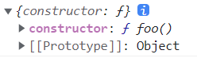 

- 可以为 `prototype` 对象添加新的属性

  ```javascript
  function foo() {}
  foo.prototype.name = 'jack';
  foo.prototype.age = 18;
  foo.prototype.eating = function() {};
  var f = new foo();
  console.log(f.name, f.age);	// 'jack', 18
  ```

- 重写整个 `prototype` 对象

  ```javascript
  function foo() {}
  foo.prototype = {
    name: 'jack',
    age: 18,
    height: 1.8
  }
  // 一般通过 Object.defineProperty 方式添加 constructor
  Object.defineProperty(foo.prototype, 'constructor', {
    enumerable: false,
    configurable: true,
    writable: true,
    value: foo
  })
  var f = new foo();
  console.log(f.name, f.age, f1.height);	// 'jack', 18, 1.8
  ```

函数(构造函数)通过**原型分配的函数是所有对象所共享**的

- 可以把那些不变的公共方法直接定义在 `prototype` 对象上，公共属性定义到构造函数里面

- 原型对象函数里面的 `this` 指向的是这个方法的调用者，也就是**实例对象**

  ```javascript
  function Person(name, age, height, address) {
    this.name = name;
    this.age = age;
    this.height = height;
    this.address = address;
  }
  Person.prototype.eating = function() {
    console.log(this.name + 'is eating');
  }
  Person.prototype.running = function() {
    console.log(this.name + 'is running');
  }
  var p1 = new Person('jack', 18, 1.8, '北京');
  var p2 = new Person('tom', 18, 1.8, '上海');
  
  p1.eating();
  p2.eating();
  ```

- 可以通过原型对象，对原来的内置对象进行扩展自定义的方法

  ```javascript
  // 数组增加自定义求和的功能
  Array.prototype.sum = function() {
    var sum = 0;
    for (var i = 0; i < this.length; i++) {
      sum += this[i];
    }
    return sum;
  };
  var arr = [1, 2, 3];
  console.log(arr.sum());
  ```

  **数组和字符串内置对象**不能给原型对象覆盖操作 `Array.prototype = {}` 

  只能是 `Array.prototype.xxx = function(){}` 的方式


###  隐式原型(对象原型)

**每个对象（函数也是对象）都有一个特殊的内置属性 `[[prototype]]` ，称为隐式原型**

**`[[prototype]] ` 属性是无法查看的**，但是浏览器给对象提供了一个属性 `__proto__`

ES5 也提供了获取对象原型的方法 `Object.getPrototypeOf(obj)`

它是一个**非标准属性**，因此实际开发中，不可以使用这个属性

- 隐式原型的作用：`__proto__` 对象原型的意义就在于**为对象的查找机制提供一个方向**

  当从一个**对象中获取某个属性**时，它会触发 `[[get]]` 操作

  1. 从当前对象中去查找对应的属性，如果找到就直接使用
  2. 如果没有找到，就会**沿着它的原型（原型链）去查找**，也就是去 `__proto__` 中去查找

  ```javascript
  var obj = { name: 'jack' };
  console.log(obj.age);	// undefined
  
  // 找不到去原型链中查找
  obj.__proto__.age = 18;
  console.log(obj.age);	// 18
  ```

- 字面量直接创建的对象也有内置属性 `[[prototype]] `

- 函数既有显示原型也有隐式原型

  > **显示原型**：
  >
  > Foo 是一个函数，在创建函数时，**显示原型赋值** `Foo.prototype = { constructor: Foo }`

  > **隐式原型**：
  >
  > Foo 也是一个对象，`function Foo() {}` 其实就是 `var Foo = new Function()`
  >
  > `new Function()` 时，**隐式原型赋值** `Foo.__proto__ = Function.prototype`
  >
  > `Function.prototype = { constructor: Function }`

  ```javascript
  function Foo() { }
  console.log(Foo.prototype === Foo.__proto__);	// false
  console.log(Foo.prototype.constructor);				// [Function: Foo]
  console.log(Foo.__proto__.constructor);				// [Function: Function]
  ```

   

- 对象可以使用函数原型对象 `prototype` 的属性和方法，就是因为对象有 `__proto__` 原型的存在

  **`new` 关键字创建对象**的时候，会在内存中创建一个新的对象

  这个**对象内部的 `__proto__` 属性会被赋值为该构造函数的 `prototype` 属性**（**显示原型赋值给隐式原型**）

  也就是，函数对象的 `__proto__` 指向 `Function` 对象的 `prototype`

  ```javascript
  function foo() { }
  var fn = new foo();
  console.log(fn.__proto__ === foo.prototype);	// true
  ```

    

- 对象原型对象里面的 `__proto__`  原型指向的是 `Object.prototype`
  
- `Object.prototype` 原型对象里面的 `__proto__` 原型  指向为 `null`


### 构造函数 constructor

对象原型 `__proto__` 和函数原型 `prototype` 里面都有一个 `constructor` 属性 

`constructor` 称为构造函数，因为它**指回构造函数本身**

- `constructor` 主要用于记录**该对象引用于哪个构造函数**，可以让原型对象重新指向原来的构造函数

- 很多情况下,需要手动的利用 `constructor` 这个属性指回原来的构造函数

  ```javascript
  function Star(uname, age) {
    this.uname = uname;
    this.age = age;
  }
  Star.prototype = {
    // 如果修改了原来的原型对象,给原型对象赋值的是一个对象,则必须手动的利用constructor指回原来的构造函数
    constructor: Star,
    sing: function() {
      console.log('我会唱歌');
    },
    movie: function() {
      console.log('我会演电影');
    }
  }
  ```

- ##### 构造函数、实例、原型对象三者之间的关系

   


### 原型链

对象的查找机制：

`__proto__` 对象原型的意义就在于**为对象成员查找机制提供一个方向**

1. 当访问一个对象的属性或方法时，**首先查找这个对象自身有没有该属性**
2. 如果**没有就查找它的原型**（也就是 `__proto__`，指向的 `prototype` 原型对象）
3. 如果还没有就**查找原型对象的原型**（`Object` 的原型对象）
4. 依此类推一直找到 `Object` 为止（`null`）

 

**原型链最顶层的原型对象就是 `Object` 的原型对象**

- 从 `Object` 直接创建出来的对象的原型都是 `[Object: null prototype] {}`
- 该原型不再继续有原型属性了，也就是顶层原型，该对象上有很多默认的属性和方法


### 原型检测方法

#### Object.create()

创建一个新对象，**使用现有的对象来提供新创建的对象的 `__proto__`**

`Object.create(proto，[propertiesObject])`

- `proto`：原型对象
- `propertiesObject`：可选，为新创建的对象添加指定的属性值和属性描述符

```javascript
var obj = {
  name: 'jack',
  age: 18
};
var info = Object.create(obj, {
  address: {
    value: '北京',
    enumerable: true
  }
});
console.log(info);				// { address: '北京' }
console.log(info.__proto__);	// { name: 'jack', age: 18 }
```

```javascript
var company = {
  address: 'beijing'
}
var info = Object.create(company);
// info中并没有address属性，address属性来自于company的__proto__
// delete删除失败
delete info.address
console.log(info.address);	// beijing
```


#### hasOwnProperty()

判断对象自身属性中是否具有指定的属性（**不是原型上的属性**）

`obj.hasOwnProperty(prop)`

```javascript
var obj = {
  name: 'jack',
  age: 18
};
var info = Object.create(obj, {
  address: {
    value: '北京',
    enumerable: true
  }
});
// 当前对象存在才返回true
console.log(info.hasOwnProperty('address'));	// true
console.log(info.hasOwnProperty('name'));		// false
```


#### in 操作符

判断某个**属性是否在某个对象或者对象原型上**

```javascript
var obj = { name: 'jack', age: 18 };
var info = Object.create(obj, {
  address: {
    value: '北京',
    enumerable: true
  }
});
// in操作符：不管在当前对象还是原型中存在，都返回true
console.log('address' in info);					// true
console.log('name' in info);					// true
```


#### instanceof

用于**检测构造函数的 `prototype`**，是否出现在**某个实例对象的原型链上**

```javascript
function Person() {}
function Student() {}
// Student 继承 Person
inheritPrototype(Student, Person);
var stu = new Student();

// 判断Student.prototype是否出现在stu的原型链中，如果找到就是true
console.log(stu instanceof Student);	// true
console.log(stu instanceof Person);		// true
console.log(stu instanceof Object);		// true

function inheritPrototype(SubType, SuperType) {
  SubType.prototype = Object.create(SuperType.prototype);
  Object.defineProperty(SubType.prototype, 'constructor', {
    enumerable: false,
    configurable: true,
    writable: true,
    value: SubType
  });
}
```


#### isPrototypeOf

用于**检测某个对象**，是否出现在**某个实例对象的原型链**上

```javascript
function Person() {}
var p = new Person();
console.log(p instanceof Person);				// true
console.log(Person.prototype.isPrototypeOf(p));	// true
```

```javascript
var obj = { name: 'jack', age: 18 };
var info = Object.create(obj);
// instanceof 只能检测构造函数
console.log(obj.isPrototypeOf(info))	// true
```


## 继承

通过**构造函数 + 原型对象**模拟实现继承，被称为**组合继承**

### 构造函数继承父类属性

通过 `call()` 把父类型的 `this` 指向子类型的 `this` ，这样就可以实现**子类型继承父类型的属性**

```javascript
// 父类
function Person(name, age, sex) {
  // this 指向父构造函数的对象实例
  this.name = name;
  this.age = age;
  this.sex = sex;
}
// 子类
function Student(name, age, sex, score) {
  // this 指向子构造函数的对象实例
  Person.call(this, name, age, sex);  // 此时父类的 this 指向子类的 this，同时调用这个函数
  this.score = score;
}
var s1 = new Student('zs', 18, '男', 100);
console.dir(s1); 
```


### 原型对象继承父类方法

一般对象的方法都在构造函数的原型对象中设置，通过构造函数无法继承父类方法

#### 组合继承

1. 将子类所共享的方法提取出来，让**子类的原型对象 `prototype = new 父类()` ** 

   子类原型对象等于是实例化父类，因为父类实例化之后另外开辟空间，就不会影响原来父类原型对象

2. 将子类的 `constructor` 重新指向子类的构造函数

组合继承存在的问题

1. 无论在什么情况下，**都会调用两次父类构造函数**

   一次在创建子类原型的时候，另一次在创建子类实例的时候

2. 所有的子类实例上事实上会**拥有两份父类的属性**

   一份在当前的实例里面，另一份在子类对应的原型对象中（ `son. __proto__` 里面）

```javascript
// 父构造函数
function Father(uname, age) {
  // this 指向父构造函数的对象实例
  this.uname = uname;
  this.age = age;
}
Father.prototype.money = function() {
  console.log(100000);
};
// 子构造函数
function Son(uname, age, score) {
  // this 指向子构造函数的对象实例
  Father.call(this, uname, age);
  this.score = score;
}
// Son.prototype = Father.prototype;  这样直接赋值会有问题,如果修改了子原型对象,父原型对象也会跟着一起变化
Son.prototype = new Father();
// 利用constructor 指回原来的构造函数
Son.prototype.constructor = Son;
// 子构造函数专门的方法
Son.prototype.exam = function() {
  console.log('考试');
}
var son = new Son('刘', 18, 100);
```


#### 寄生组合继承

创建一个封装继承过程的函数，该函数在内部以某种方式来增强对象，最后再将这个对象返回

```javascript
// 父
function Person(name, age, friends) {
  this.name = name;
  this.age = age;
  this.friends = friends;
}
Person.prototype.running = function() {
  console.log('runnning');
}
Person.prototype.eating = function() {
  console.log('eating');
}

// 子
function Student(name, age, friends, sno, scroe) {
  Person.call(this, name, age, friends);
  this.sno = sno;
  this.score = score;
}
// 使用工具函数，继承父类原型
inheritPrototype(Student, Person);
Student.prototype.studying = function() {
  console.log('studying');
}
var stu = new Student('jack', 18, ['kobe'], 111, 100);

// 工具函数：原型式继承
function inheritPrototype(SubType, SuperType) {
  // 最新ECMA提供的方法，使用现有的对象来提供新创建的对象的__proto__
  SubType.prototype = Object.create(SuperType.prototype);
  // 旧原型式继承方法
  // SubType.prototype = createObject1(SuperType);
  // SubType.prototype = createObject2(SuperType);
  Object.defineProperty(SubType.prototype, 'constructor', {
    enumerable: false,
    configurable: true,
    writable: true,
    value: SubType
  });
}

// 旧原型式继承
function createObject1(obj) {
  function Func() {};
  Func.prototype = obj;
  return new Func();
}
function createObject2(obj) {
  var newObj = {};
  Object.setPrototypeOf(newObj, obj);
  return newObjl
}
```

 


## 类

### 创建类

在 ES6 中新增加了类的概念，可以使用 `class` 关键字声明一个类，之后以这个类来实例化对象

类其实就是**语法糖**

- `class` 本质还是 `function`

- **类的所有方法都定义在类的 `prototype` 属性上**，里面有 **`constructor` 指向类本身**

  类可以通过原型对象添加方法

- 类创建的实例，里面也有 `__proto__` 指向类的 `prototype` 原型对象

- 函数的写法是 `add() {...}` 形式，并没有 `function` 关键字

- 类必须使用 `new` 实例化对象


- 类声明

  ```javascript
  class Person {
    constructor(name, age) {
      this.name = name;
      this.age = age;
    }
    eating() {
      console.log(this.name + ' eating');
    }
    running() {
      console.log(this.name + ' running');
    }
  }
  ```

- 类表达式

  ```javascript
  var Animal = class {
    constructor(name, age) {
      this.name = name;
      this.age = age;
    }
    eating() {
      console.log(this.name + ' eating');
    }
    running() {
      console.log(this.name + ' running');
    }
  }
  ```

- 类的访问器定义

  ```javascript
  class Person {
    constructor(address) {
      this._address = '北京';
    }
    get address() {
      return this._address;
    }
    set address(newAddress) {
      this._address = newAddress;
    }
  }
  ```

- 类的静态方法

  ```JavaScript
  class Person {
    constructor(name, age) {
      this.name = name;
      this.age = age;
    }
    // 实例方法：通过创建出来的对象进行访问
    eating() {
      console.log(this.name + ' eating');
    }
    // 静态方法：直接通过类调用
    static randomPerson() {
      var names = ['jack', 'tom', 'jerry', 'lucy'];
      var nameIndex = Math.floor(Math.random() * names.length);
      var name = names[nameIndex];
      var age = Math.floor(Math.random() * 100);
      return new Person(name, age);
    }
  }
  var p = Person.randomPerson();
  ```


### 构造函数

`constructor()` 方法是类的构造函数，用于传递参数，返回实例对象

- 如果没有显示定义，类内部会自动给我们创建一个 `constructor()`，一个类只能有一个构造函数


- 通过 `new` 命令生成对象实例时，自动调用该方法


构造函数**执行过程**

1. 在内存中创建一个对象
2. 将类的原型 `prototype` 赋值给创建出来的对象的 `__proto__`
3. 构造函数内部的 `this`，指向创建出来的新对象
4. 执行函数体中的代码
5. 自动返回创建出来的对象

```javascript
class Person {
  constructor(name,age) {   // constructor 构造方法或者构造函数
    this.name = name;
    this.age = age;
  }
}
var p = new Person('name', 18); 
```

- 不存在变量提升，必须先定义类，才能实例化

- 类里面的公有属性和方法一定要加 `this` 使用

  `constructor` 里面的 `this` 执行的是创建的实例对象，方法里面的 `this` 还是指向方法的调用者

  如果方法想用创建的实例对象，可以定义全局变量，把 `constructor` 里面的 `this` 赋值给这个全局变量


### 继承

子类可以继承父类的一些属性和方法

```javascript
// 父类
class Father {
  constructor(surname) {
    this.surname= surname;
  }
  say() {
    console.log('你的姓是' + this.surname);
  }
}
// 子类继承父类
class Son extends Father { }

var s = new Son('刘');
s.say();
```

- `super` 关键字用于**访问和调用对象父类**上的函数，可以**调用父类的构造函数**，也可以**调用父类的普通函数**

- 子类在构造函数中使用 `super`，必须放到 `this` 前面 (必须**先调用父类的构造方法,再使用子类构造方法**)

  ```javascript
  class Father {
    constructor(x, y) {
      this.x = x;
      this.y = y;
    }
    sum() {
      console.log(this.x + this.y);
    }
    multi() {
      console.log(this.x * this.y);
    }
    print() {
      console.log(this.x);
      console.log(this.y);
    }
    static staticMethod() {
      console.log('FatherStaticMedthod');
    }
  }
  // 子类继承父类加法方法 同时 扩展减法方法
  class Son extends Father {
    constructor(x, y, z) {
      // 利用super 调用父类的构造函数
      // super 必须在子类this之前调用
      super(x, y);
      this.z = z;
    }
    subtract() {
      console.log(this.x - this.y);
    }
    // 子类对父类的方法的重写
    multi() {
      console.log(this.x * this.y * this.z);
    }
    // 子类对父类的方法的重写
    print() {
      // 调用父类方法
      super.print();
      console.log(this.z);
    }
    // 重写静态方法
    static staticMethod() {
      // 调用父类静态方法
      super.staticMethod();
      console.log('SonStaticMedthod');
    }
  }
  var son = new Son(5, 3);
  son.subtract();
  son.sum();
  ```

继承中的属性或者方法**查找原则：就近原则**

- 输出一个方法，先看子类有没有这个方法，如果有就先执行子类的
- 如果子类里面没有，就去查找父类有没有这个方法，如果有，就执行父类的这个方法(就近原则)


### 继承内置类

```javascript
class MyArray extends Array {
  firstItem() {
    return this[0];
  }
  lastItem() {
    return this[this.lenght - 1];
  }
}
var arr = new MyArray(1, 2, 3);
console.log(arr.firstItem());
console.log(arr.lastItem());
```


### 类的混入

javascript 的**类只支持单继承**，当需要在一个类中添加更多相似的功能是，可以使用混入 mixin

```javascript
class Person { }
// js中只可以单继承
class Student extends Person { }

function mixinRunner(BaseClass) {
  return class extents BaseClass {
    running() {
      console.log('running');
    }
  };
}
function mixinEater(BaseClass) {
  return class extents BaseClass {
    eating() {
      console.log('eating');
    }
  };
}

var NewStudent = mixinEater(mixinRunner(Student));
var ns = new NewStudent();
ns.running();
ns.eating();
```


# 内置对象

## 数学对象 Math

- `Math` 对象不是构造函数，具有数学常数和函数的属性和方法，直接使用里面的属性和静态方法即可


### 向下取整 floor

`Math.floor()`

- **去掉所有的小数**，**向下**为最近的**整数**（**往小了取值**）

  ```javascript
  Math.floor(0.5);
  // => 0
  Math.floor(4.5);
  // => 4
  Math.floor(4.4);
  // => 4
  Math.floor(4.9);
  // => 4
  ```


### 向上取整 ceil

`Math.ceil() `

- **去掉所有的小数**，**向上**为下一个**整数**（**往大了取值**）

  ```javascript
  Math.ceil(0.5);
  // => 1
  Math.ceil(4.5);
  // => 5
  Math.ceil(4.4);
  // => 5
  Math.ceil(4.9);
  // => 5
  ```


### 四舍五入到整数 round

`Math.round()`

- 把一个数值四舍五入到最近的**整数**

  ```javascript
  const num = 19.48938;
  const roundNum = Math.round(num);
  // => 19
  ```

- `round()` **不可以指定保留几位小数**，如果需要**不同的精度**，**需要将数值乘以 10 的相应次方，四舍五入后再除以 10 的相同次方**

  ```javascript
  const numToRound = num * (10 ** digital);
  let roundedNum = Math.round(numToRound);
  roundedNum = roundedNum / (10 ** digital);
  ```

  ```javascript
  // 四舍五入保留两位小数
  const num = 19.48938;
  const numToRound = num * (10 ** 2);
  let roundedNum = Math.round(numToRound);
  roundedNum = roundedNum / (10 ** 2);
  // => 19.49
  ```

  **四舍五入到最近的 十 或者 百 等单位**，将保留的**小数位指定为负数**即可

  ```javascript
  const num = 19.48938;
  const numToRound = num * (10 ** -1);
  let roundedNum = Math.round(numToRound);
  roundedNum = roundedNum / (10 ** -1);
  // => 20
  ```

  ```javascript
  const num = 140.48938;
  const numToRound = num * (10 ** -2);
  let roundedNum = Math.round(numToRound);
  roundedNum = roundedNum / (10 ** -2);
  // => 100
  ```

- 如果是恰好是 `0.5` ，则向上取整为 `0`

- 四舍五入负数时，`-0.5` 会向上取整为 `0`

  ```javascript
  Math.round(-3.5)
  // => -3
  ```


### 绝对值 abs

 `Math.abs()`


### 最大值和最小值 max / min

`Math.max()`、`Math.min()`

参数是 0 个或者多个

`Math.max(value1, value2, … , valueN)`，如果没有参数，返回 `-Infinity`

`Math.min(value1, value2, … , valueN)`，如果没有参数，返回 `Infinity`

```javascript
var min = Math.min();
var max = Math.max();
console.log(min < max);	// false
```


### 随机数 random

`Math.random()`

- 生成一个 `0` 到 `1` 之间的浮点数，取值范围 `0 <= x < 1`，通常会按比例放大，再四舍五入，得到一个落在指定范围内的整数

- 获得两个数之间的随机整数，并且包含这两个整数

  `Math.floor(Math.random() * (max - min + 1)) + min`

  `rondom()` 获得随机小数，`floor()` 去掉小数部分获得一个整数

  ```javascript
  // 1 到 6 之间的随机整数
  const randomNumber = Math.floor(Math.random() * 6) + 1;
  ```

- `random()` 生成的是伪随机数，密码学上的随机数使用 `crypto`


### 常数

- 圆周率 `Math.PI `


## 日期对象Date

Date是一个构造函数，需要实例化后才能使用

- Date()不写参数，就返回当前时间

- Date()里面写参数，就返回括号里面输入的时间

- Date 对象是基于1970年1月1日（世界标准时间）起的毫秒数

  获取毫秒数`var now = + new Date();` `Date.now();`


## 数组对象 Array

### 是否为数组 isArray

`Array.isArray();` (ie9 以上版本) 

- 自行封装 `isArray` 方法

  ```javascript
  if (!Array.isArray) {
    Array.isArray = function(arg) {
      return Object.prototype.toString.call(arg) === '[object Array]';
    };
  }
  ```

- 其他验证方法

  - `xx instanceof Array`
  - `xx.constructor === Array`
  - `Object.prototype.toString.call(xx) === '[object Array]'`


### 末尾添加 push

末尾添加一个或多个元素，修改原数组，返回新的长度


### 末尾删除 pop

删除最后一个元素，修改原数组，返回删除的元素的值


### 开头添加 unshift

开头添加一个或多个元素，修改原数组，返回新的长度


### 开头删除 shift

删除第一个元素，修改原数组，返回第一个元素的值


### 颠倒顺序 reverse

颠倒元素的顺序，修改原数组，返回新数组


### 元素排序 sort

- 元素进行排序，修改原数组，返回新数组

- 默认排序顺序是在将元素转换为字符串，按字母顺序进行排序

  ```javascript
  const arr = [1, 20, 111];
  console.log(arr.sort());
  // [1, 111, 20]
  ```

- 数字排序必须指定比较函数，数组会按照调用该函数的返回值排序

  `arr.sort((a, b) => { /* … */ } )`

  ```javascript
  // 比较函数格式
  arr.sort((a, b) => {
    if (在某些排序规则中，a < b) {
      return -1;
    }
    if (在这一排序规则下，a > b) {
      return 1;
    }
    // a 一定等于 b
    return 0;
  })
  ```

  可以简单使用 `a - b`，数字数组**升序**排列（不包含 `Infinity` 和 `NaN`）

  ```javascript
  numbers.sort((a, b) => a - b);
  ```


### 查找首个索引 indexOf

`indexOf(数组元素)` 

- 如果存在，返回索引号；不存在，返回 `-1`；只返回第一个满足条件的索引号


### 查找最后索引 lastIndexOf

`lastIndexOf(数组元素)` 

- 如果存在，返回索引号；不存在，返回 `-1`


### 转逗号分隔字符串 toString

- 数组转换字符串，**逗号分隔**，返回字符串


### 转换字符串 join

`join('分隔符')`

- 把数组中的所有元素转换为一个字符串，返回字符串


### 连接数组 concat

- 连接两个或多个数组，不影响原数组，返回新数组


### 截取数组 slice

`slice(begin)`

`slice(begin, end)`

- `begin`：从该索引开始提取原数组元素；负数则为倒数；省略则为 `0`
  `end`：在该索引处结束提取原数组元素（**不包含 `end` 索引元素**）；省略则为提取到原数组末尾

  ```javascript
  var fruits = ['Banana', 'Orange', 'Lemon', 'Apple', 'Mango'];
  console.log(fruits.slice(1, 3));  // ['Orange','Lemon']
  console.log(fruits.slice(-2));    // ['Apple', 'Mango']
  console.log(fruits.slice(2, -1));	// ['Lemon', 'Apple']
  console.log(fruits.slice());			// ['Banana', 'Orange', 'Lemon', 'Apple', 'Mango']
  ```

- 数组截取，返回被截取项目的**新数组**（**浅拷贝**）


### 类数组转数组 slice

- 类数组（对象/集合等）转化为新数组 `slice(arguments)`

  ```javascript
  function list() {
    return Array.prototype.slice.call(arguments);
  }
  var list1 = list(1, 2, 3); // [1, 2, 3]
  ```


### 删除元素 splice

`splice(第几个开始)` 

`splice(第几个开始，要删除个数)` 

`splice(第几个开始, 要删除个数, 添加进数组的元素1, 添加进数组的元素2, ...)`

- 修改原数组，返回被删除项目的新数组

  ```javascript
  var myFish = ["angel", "clown", "mandarin", "sturgeon"];
  var removed = myFish.splice(2, 0, "drum");
  console.log(myFish);	// ["angel", "clown", "drum", "mandarin", "sturgeon"]
  console.log(removed); // []
  ```

  ```javascript
  var myFish = ["angel", "clown", "mandarin", "sturgeon"];
  var removed = myFish.splice(2, 1, "trumpet");
  console.log(myFish);	// ["angel", "clown", "trumpet", "sturgeon"]
  console.log(removed); // ["drum"]
  ```

  ```javascript
  var myFish = ['angel', 'clown', 'trumpet', 'sturgeon'];
  var removed = myFish.splice(0, 2, 'parrot', 'anemone', 'blue');
  console.log(myFish);	// ["parrot", "anemone", "blue", "trumpet", "sturgeon"]
  console.log(removed); // ["angel", "clown"]
  ```


### 遍历数组 forEach

`array.forEach(function(currentValue, index, arr))`

- `currentValue`：数组当前项的值
  `index`：数组当前项的索引
  `arr`：数组对象本身


### 筛选数组 filter

`array.filter(function(currentValue, index, arr))`

- 返回一个新的数组，把所有满足条件的元素返回回来


### 数组是否满足条件 some

`array.some(function(currentValue, index, arr))`

- 数组元素是否满足指定条件，返回值是布尔值
- 如果查找到第一个满足条件的元素就终止循环


### 数组是否全部满足条件 every

`array.every(function(currentValue, index, arr))`

- 数组元素是否全部满足指定条件，返回值是布尔值

- 如果检测到有一个元素不满足，则整个表达式返回 `false` ，且剩余的元素不会再进行检测


### 返回新数组 map

`array.map(function(currentValue, index, arr))`

- 返回一个新数组，数组中的元素为原始数组元素调用函数处理后的值


### 伪数组转数组 from

`Array.from(arrayLike[, mapFn[, thisArg]])`

- 对一个类似数组或可迭代对象创建一个新的，浅拷贝的数组实例


- 转换后的数组长度由 `length` 属性决定

- 索引不连续时转换结果是连续的，会自动补位
- 仅考虑 `0` 或 正整数 的索引

```javascript
let arrayLike = {
  '0': 'a',
  '1': 'b',
  '2': 'c',
  '4': 'e',
  '-1': 'f',
  'a': 'g'
  length: 6
}; 
let arr = Array.from(arrayLike); // ['a', 'b', 'c', undefined, 'e', undefined, undefined]
```

- 第二个参数作用类似于数组的`map`方法

  `let newAry = Array.from(aryLike, item => item *2)`


### 查找满足条件的首个元素 find

`array.find(function(currentValue, index, arr))`

- 返回第一个满足指定条件的数组成员，没有找到返回 `undefined`


### 查找满足条件的首个索引 findIndex

`array.findIndex(function(currentValue, index, arr))`

- 返回第一个满足指定条件的数组成员位置，没有找到返回 `-1`


### 是否包含指定元素 includes

`arr.includes(searchElement)`

`arr.includes(searchElement, fromIndex)`

- 是否包含一个指定的值，返回值是布尔值

```javascript
const names = ["abc", "cba", "nba", "mba", NaN];
if (names.includes("cba", 2)) {
  console.log("包含abc元素")
}
// indexOf是不能检测是否含有NaN
if (names.indexOf(NaN) !== -1) {
  console.log("包含NaN")
}
// includes可以检测NaN
if (names.includes(NaN)) {
  console.log("包含NaN")
}
```


### 数组扁平化 flat

`flat(depth)`

- 按照一个可**指定的深度**递归遍历数组，并将所有元素与遍历到的子数组中的元素合并为一个新数组返回（ES10）

  ```javascript
  const nums = [10, 20, [2, 9], [[30, 40], [10, 45]], 78, [55, 88]]
  // 数组下降一维
  const newNums1 = nums.flat()
  console.log(newNums1)			//  [10, 20, 2, 9, [30, 40], [10, 45], 78, 55, 88]
  // 数组下降二维
  const newNums2 = nums.flat(2)
  console.log(newNums2)			// [10, 20, 2, 9, 30, 40, 10, 45, 78, 55, 88]
  ```

- 不知道具体深度，想要完全扁平，使用 `Infinity`

  ```javascript
  const veryDeep = [[1, [2, 2, [3,[4,[5,[6]]]]], 1]];
  veryDeep.flat(Infinity);	// [1, 2, 2, 3, 4, 5, 6, 1]
  ```


### 先映射后压缩 flatMap

`flatMap(function(currentValue, index, array)`

- 首先使用映射函数映射每个元素，然后将结果压缩成一个新数组

  - 先进行 `map` 操作，再做 `flat` 的操作（ES10）

  - 其中的 `flat` 相当于深度为 `1`（`flat(1)`）

  ```javascript
  const messages = ["Hello World", "hello lyh", "my name is coderwhy"]
  const words = messages.flatMap(item => {
    // 对返回结果再进行一次降维 [['Hello', 'World'], ['hello', 'lyh'], ['my', 'name', 'is', 'coderwhy']]
    return item.split(" ")
  })
  console.log(words)	//  ['Hello', 'World', 'hello', 'lyh', 'my', 'name', 'is', 'coderwhy']
  ```


### 替换数组元素 fill

`fill(value, start, end)`

- 使用 `vale` 替换数组从 `start` 开始, 到 `end` 结束的元素

```javascript
const fruits = ["Banana", "Orange", "Apple", "Mango"];
fruits.fill("Runoob", 2, 4);
// [Banana, Orange, Runoob, Runoob]
```


### 数组转树

```javascript
let arr = [
  { id: 2, name: '部门B', parentId: 0 },
  { id: 3, name: '部门C', parentId: 1 },
  { id: 1, name: '部门A', parentId: 2 },
  { id: 4, name: '部门D', parentId: 1 },
  { id: 5, name: '部门E', parentId: 2 },
  { id: 6, name: '部门F', parentId: 3 },
  { id: 7, name: '部门G', parentId: 2 },
  { id: 8, name: '部门H', parentId: 4 }
];
// 变换后树形态，预期：
[
  { id: 2, name: '部门B', parentId: 0, children: [
    { id: 1, name: '部门A', parentId: 2, children: [
      { id: 3, name: '部门C', parentId: 1, children: [
        { id: 6, name: '部门F', parentId: 3, children: [] }
      ] },
      { id: 4, name: '部门D', parentId: 1, children: [
        { id: 8, name: '部门H', parentId: 4, children: [] }
      ] }
    ] },
    { id: 5, name: '部门E', parentId: 2, children: [] },
    { id: 7, name: '部门G', parentId: 2, children: [] }
  ] }
]
```

- 利用数组和对象相互引用，时间复杂度为 O(n)

  ```javascript
  // 利用数组和对象相互引用
  function arrayToTree(list, startParId) {
    let obj = {};
    let result = [];
    // 将数组转为id为key的键值对结构
    for (const item of list) {
      obj[item.id] = { ...item };
    }
    for (const item of list) {
      const parId = item.parentId;
      const id = item.id;
      // 构建树结构的根，最上层
      if (parId == startParId) {
        result.push(obj[id]);
        continue;
      }
      // 当前元素添加到父对象中
      // 共享相同的地址，同时也会添加到数组结果中
      if (obj[parId].children) {
        obj[parId].children.push(obj[id]);
      } else {
        obj[parId].children = [obj[id]];
      }
    }
    return result;
  }
  const tree = arrayToTree(arr, 0);
  ```

- 递归求解，数据量大时性能不好

  ```javascript
  function arrayToTree(list, startParId) {
    const result = [];
    for (const item of list) {
      if (item.parentId === startParId) {
        const newItem = { ...item };
        result.push(newItem);
        newItem.children = arrayToTree(list, newItem.id);
      }
    }
    return result;
  }
  const tree = arrayToTree(arr, 0);
  ```


### 树转数组

```javascript
const tree = [
  { id: 2, name: '部门B', parentId: 0, children: [
    { id: 1, name: '部门A', parentId: 2, children: [
      { id: 3, name: '部门C', parentId: 1, children: [
        { id: 6, name: '部门F', parentId: 3, children: [] }
      ] },
      { id: 4, name: '部门D', parentId: 1, children: [
        { id: 8, name: '部门H', parentId: 4, children: [] }
      ] }
    ] },
    { id: 5, name: '部门E', parentId: 2, children: [] },
    { id: 7, name: '部门G', parentId: 2, children: [] }
  ] }
];
// 扁平化后预期结果
[
  { id: 2, name: '部门B', parentId: 0 },
  { id: 3, name: '部门C', parentId: 1 },
  { id: 1, name: '部门A', parentId: 2 },
  { id: 4, name: '部门D', parentId: 1 },
  { id: 5, name: '部门E', parentId: 2 },
  { id: 6, name: '部门F', parentId: 3 },
  { id: 7, name: '部门G', parentId: 2 },
  { id: 8, name: '部门H', parentId: 4 }
]
```

- 深度优先

  ```javascript
  function treeToArray(tree) {
    const stack = [...tree]
    const result = []
    while (stack.length) {
      // 后进先出
      const { id, name, parentId, children } = stack.pop()
      result.push({ id, name, parentId })
      if (children) {
        for (let i = children.length - 1; i >= 0; i--) {
          stack.push(children[i])
        }
      }
    }
    return result
  }
  const array = treeToArray(tree);
  /*
  [
  	{ id: 2, name: '部门B', parentId: 0 }
  	{ id: 1, name: '部门A', parentId: 2 }
  	{ id: 3, name: '部门C', parentId: 1 }
  	{ id: 6, name: '部门F', parentId: 3 }
  	{ id: 4, name: '部门D', parentId: 1 }
  	{ id: 8, name: '部门H', parentId: 4 }
  	{ id: 5, name: '部门E', parentId: 2 }
  	{ id: 7, name: '部门G', parentId: 2 }
  ]
  */
  ```

- 广度优先

  ```javascript
  function treeToArray(tree) {
    const stack = [...tree]
    const result = []
    while (stack.length) {
      // 先进先出根据节点的父子关系，设置数组项的parentId
      const { id, name, parentId, children } = stack.shift()
      result.push({ id, name, parentId })
      if (children) {
        for (let i = 0; i < children.length; i++) {
          stack.push(children[i])
        }
      }
    }
    return result
  }
  const array = treeToArray(tree);
  /*
  [
    { id: 2, name: "部门B", parentId: 0 },
    { id: 1, name: "部门A", parentId: 2 },
    { id: 5, name: "部门E", parentId: 2 },
    { id: 7, name: "部门G", parentId: 2 },
    { id: 3, name: "部门C", parentId: 1 },
    { id: 4, name: "部门D", parentId: 1 },
    { id: 6, name: "部门F", parentId: 3 },
    { id: 8, name: "部门H", parentId: 4 },
  ]
  */
  ```

- 树结构不提供 parentId，根据节点的父子关系，设置数组项的 parentId

  ```javascript
  const tree = {
    id: 2, name: "部门B", children: [
      { id: 1, name: "部门A", children: [
        { id: 3, name: "部门C", children: [
          { id: 6, name: "部门F" }
        ]},
        { id: 4, name: "部门D", children: [
          { id: 8, name: "部门H" }
        ] },
      ],
      },
      { id: 5, name: "部门E" },
      { id: 7, name: "部门G" },
    ]
  }
  ```

  ```javascript
  function treeToArray(tree) {
    // 定义子节点和父节点的映射关系，map<子节点，父节点>
    const childToParent = new Map()
    const result = []
    // 广度优先遍历树，使用队列保存节点
    const queue = []
    // 入队，从头部入队
    queue.unshift(tree)
    while (queue.length) {
      // 出队，从尾部出队，保证先进先出
      const curNode = queue.pop()
      if (curNode == null) break
      const { id, name, children = [] } = curNode
      // 获取当前节点的父节点
      const parentNode = childToParent.get(curNode)
      // 获取父节点id，根节点设置为0
      const parentId = parentNode?.id || 0
      const item = { id, name, parentId }
      result.push(item)
      // 继续遍历子节点，并且子节点入队
      for (const child of children) {
        // 如果有子节点，则把子节点和当前节点通过Map保持关系
        childToParent.set(child, curNode)
        // 入队
        queue.unshift(child)
      }
    }
    return result
  }
  const arr = treeToArray(tree)
  /*
  [
   { id: 2, name: '部门B', parentId: 0 }
   { id: 1, name: '部门A', parentId: 2 }
   { id: 5, name: '部门E', parentId: 2 }
   { id: 7, name: '部门G', parentId: 2 }
   { id: 3, name: '部门C', parentId: 1 }
   { id: 4, name: '部门D', parentId: 1 }
   { id: 6, name: '部门F', parentId: 3 }
   { id: 8, name: '部门H', parentId: 4 }
  ]
  */
  ```

  


## 字符串包装类型 String

- 基本包装类型

  基本包装类型就是把简单数据类型包装成为复杂数据类型，这样基本数据类型就有了属性和方法

  提供了三个特殊的引用类型：`String`、`Number` 和 `Boolean`

  ```javascript
  var str = 'andy';
  console.log(str.length);
  
  // 包装过程
  // 1. 生成临时变量，把简单类型包装为复杂数据类型
  var temp = new String('andy');
  // 2. 赋值给我们声明的字符变量
  str = temp;
  // 3. 销毁临时变量
  temp = null;
  ```

- ##### 字符串的不可变

  里面的值不可变，虽然看上去可以改变内容，但其实是地址变了，内存中新开辟了一个内存空间

- ##### 指定内容的索引 `indexOf('要查找的字符',开始的位置)`

  如果存在返回索引号，不存在返回-1

- ##### 指定内容的最后索引 `lastIndexOf('要查找的字符')` 

  如果存在返回索引号，不存在返回-1

- ##### 返回指定位置的字符 `charAt(index)` 

  `str[index]` H5新增

- ##### 获取指定位置处字符的ASCII码 `charCodeAt(index)`

- ##### 连接两个或多个字符串 `concat()`

- ##### 截取字符串

  `substr('截取的起始位置','截取几个字符')`

  `slice(start, end)` 从start位置开始，截取到end位置，end取不到 （start和end都是索引）

  `substring(start, end)`从start位置开始，截取到end位置，end取不到 (start和end都是索引）不接受负值

- ##### 替换字符`replace(被替换的字符串/正则表达式 ， 要替换为的字符串) `

  只会替换第一个字符（正则表达式可以通过修饰符来修改匹配机制）

  返回值是一个替换完毕的新字符串

- ##### 切分字符串 `split('分隔符')`

- ##### 删除两端空白字符 `trim()`

  不影响原字符串本身，返回新字符串	
  
- ##### 单独去除前面或者后面空白字符 trimStart / trimEnd（ES10）

  ```javascript
  const message = "    Hello World    ";
  console.log(message.trim());			// Hello World
  console.log(message.trimStart());		// Hello World    
  console.log(message.trimEnd());			//     Hello World
  ```
  
- ##### 模板字符串

  使用字符串模板来嵌入JS的变量或者表达式来进行拼接（ES6新增）

  ```javascript
  let name = '张三';
  let age = 18;
  function nextAge() {
      return age + 1;
  }
  
  let sayHello = `hello,my name is ${name}`;
  let ageDouble = `double age is ${age * 2}`;
  let ageNext = `next year age is ${nextAge()}`;
  ```

  - 模板字符串中可以换行

- ##### 是否以指定的子字符串开始/结束 `startsWith()`/`endsWith()`

  `startsWith()`：表示参数字符串是否在原字符串的头部，返回布尔值

  `endsWith()`：表示参数字符串是否在原字符串的尾部，返回布尔值

  大小写敏感

- ##### 重复字符串 `repeat()`

  `string.repeat(count)`

  返回新字符串
  
- ##### 字符串前后填充 padStart()/padEnd()

  `padStart(targetLength [, padString])`

  `padEnd(targetLength [, padString])`

  1. targetLength  字符串需要填充到的目标长度
  2. padString 填充字符串 默认" "

  ```javascript
  const message = "Hello World"
  const newMessage = message.padStart(15, "*").padEnd(20, "-")
  console.log(newMessage)				// ****Hello World-----
  ```

  ```javascript
  const cardNumber = "321324234242342342341312"
  const lastFourCard = cardNumber.slice(-4)
  const finalCard = lastFourCard.padStart(cardNumber.length, "*")
  console.log(finalCard)				// ********************1312
  ```

 

## 正则对象 RegExp

- ##### 创建正则表达式

  `var 变量名 = new RegExp(/表达式/); `

  或通过字面量创建 `var 变量名 = /表达式/;`

- ##### 测试正则表达式 `test()`

  `regexObj.test(str) `

  - `regexObj `正则表达式
  - `str` 测试文本


## 唯一值集合 Set

`Set` 是唯一值的集合，不能提供索引

- 创建 `Set` 数据结构

  `const s = new Set();`

  可以接受一个可遍历数据作为参数，用来初始化

  `const set = new Set([1, 2, 3, 4, 4]);`

- 元素个数 `set.size`

- 添加元素 `set.add(value)`

  如果已有重复，则不产生效果

  返回集合本身

- 删除元素 `set.delete(value)`

  如果并不存在，则不产生效果

  返回集合本身

- 是否含有指定元素 `set.has(value)`

  返回布尔值

- 清空集合`set.clear()`

  没有返回值

- 遍历 `forEach`

  `set.forEach(callback)`

- 数组去重

  ```javascript
  function do(array) {
    return Array.from(new Set(array));
  }
  do([1, 1, 2, 3]) // [1, 2, 3]
  ```

  ```javascript
  let arr = [3, 5, 2, 2, 5, 5];
  let unique = [...new Set(arr)]; // [3, 5, 2]
  ```


## Object 对象

- 获取所有的 value 值 Object.values（ES8）

  ```javascript
  const obj = {
    name: "jack",
    age: 18
  }
  console.log(Object.keys(obj));		// ['name', 'age']
  console.log(Object.values(obj));	// ['jack', 18]
  ```

  ```javascript
  // 传入一个数组，会返回这个数组
  console.log(Object.values(["abc", "cba", "nba"]));	// ['abc', 'cba', 'nba']
  // 传入一个字符串，会返回字符串拆分后的数组
  console.log(Object.values("abc"));					// ['a', 'b', 'c']
  ```

- Object.entries 获取到一个数组，数组中会存放可枚举属性的键值对数组（ES8）

  ```javascript
  const obj = {
    name: "jack",
    age: 18
  }
  console.log(Object.entries(obj));	// [['name': 'jack'], ['age': 18]]
  const objEntries = Object.entries(obj);
  objEntries.forEach(item => {
    console.log(item[0], item[1]);
  })
  // name jack
  // age 18
  ```

  ```javascript
  // 传入一个数组，会返回数组下标和值组成的数组
  console.log(Object.entries(["abc", "cba", "nba"]));	// [['0': 'abc'], ['1': 'cba'], ['2': 'nba']]
  // 传入一个字符串，会返回字符串拆分后的下标和值组成的数组
  console.log(Object.entries("abc"));					// [['0': 'a'], ['1': 'b'], ['2': 'c']]
  ```

- ##### Object.formEntries 将键值对数组转换成对象

  ```javascript
  const obj = {
    name: "why",
    age: 18,
    height: 1.88
  }
  const entries = Object.entries(obj)
  console.log(entries)						//  [['name', 'why'], ['age', 18], ['height', 1.88]]
  const newObj = Object.fromEntries(entries)
  console.log(newObj)							// { "name": "why", "age": 18, "height": 1.88 }
  ```

  ```javascript
  // 将查询字符串转换为对象
  const queryString = 'name=why&age=18&height=1.88'
  const queryParams = new URLSearchParams(queryString)
  for (const param of queryParams) {
    console.log(param)
  }
  // ['name', 'why']
  // ['age', '18']
  // ['height', '1.88']
  const paramObj = Object.fromEntries(queryParams)
  console.log(paramObj)			// {name: 'why', age: '18', height: '1.88'}
  ```

- Object.keys

  Object.keys 的实现是使用 `for in`，for in 输出结果不包括 `symbol` 类型，要输出 `Symbol` 类型需要使用 `getOwnPropertySymbols` 方法

  生成 key 数组的顺序

  1. 创建一个空列表 keys，用于存放属性名
  2. 属性名是合法数组索引值（正整数）的，按照升序依次存入列表（非正整数按照字符串处理）
  3. 属性名是字符串类型的，按照创建的时间先后顺序依次存入列表
  4. 属性名是 Symbol 类型的，也按照创建的时间先后顺序一次存入列表
  5. 返回列表 keys

  ```javascript
  const obj= {};
  
  obj["d"] = "";
  obj["a"] = ";
  obj["b"] = ";
  obj["c"] = "";
  obj[4] = "";
  obj[1] = "";
  obj[3] = "";
  obj[2] = "";
  obj[0.9] = "";
  obj[Symbol("a")] = "";
  obj[Symbol("b")] = "";
  obj[Symbol(2)] = "";
  obj[Symbol(1)] = "";
  
  console.log(Object.keys(obj));
  // => ['1', '2', '3', '4', 'd', 'a', 'b', 'c'. '0.9']
  ```


## JSON 对象

- ##### JSON基本语法

  JSON的顶层支持三种类型的值

  1. 简单值：数字（Number）、字符串（String，不支持单引号）、布尔类型（Boolean）、null类型

  2. 对象值：由key、value组成，key是字符串类型，并且必须添加双引号，值可以是简单值、对象值、数组值

     ```json
     {
       "name": "why",
       "age": 18,
       "friend": {
         "name": "kobe"
       },
       "hobbies": ["篮球", "足球"]
     }
     ```

  3. 数组值：数组的值可以是简单值、对象值、数组值

     ```json
     [
       "abc",
       123,
       {
         "name": "kobe"
       }
     ]
     ```

- ##### JSON.stringify() 将JavaScript类型转成对应的JSON字符串

  `JSON.stringify(value[, replacer [, space]])`

  ```javascript
  const obj = {
    name: "why",
    age: 18,
    friends: {
      name: "kobe"
    },
    hobbies: ["篮球", "足球"]
  }
  const jsonString1 = JSON.stringify(obj)
  console.log(jsonString1);
  // {"name":"why","age":18,"friends":{"name":"kobe"},"hobbies":["篮球","足球"]}
  ```

  指定的replacer是数组，则可选择性地仅包含数组指定的属性

  ```javascript
  const obj = {
    name: "why",
    age: 18,
    friends: {
      name: "kobe"
    },
    hobbies: ["篮球", "足球"]
  }
  const jsonString2 = JSON.stringify(obj, ["name", "friends"])
  console.log(jsonString2)
  // {"name":"why","friends":{"name":"kobe"}}
  ```

  指定的replacer是回调函数

  ```javascript
  const obj = {
    name: "why",
    age: 18,
    friends: {
      name: "kobe"
    },
    hobbies: ["篮球", "足球"]
  }
  const jsonString3 = JSON.stringify(obj, (key, value) => {
    if (key === "age") {
      return value + 1
    }
    return value
  })
  console.log(jsonString3)
  // {"name":"why","age":19,"friends":{"name":"kobe"},"hobbies":["篮球","足球"]}
  ```

  指定缩进用的空白字符串，如果参数是个数字，代表有多少的空格，为字符串，将字符串作为空格

  ```javascript
  const obj = {
    name: "why",
    age: 18,
    friends: {
      name: "kobe"
    },
    hobbies: ["篮球", "足球"]
  }
  const jsonString4 = JSON.stringify(obj, null, 2)
  console.log(jsonString4)
  // {
  //   "name": "why",
  //   "age": 18,
  //   "friends": {
  //     "name": "kobe"
  //   },
  //   "hobbies": [
  //     "篮球",
  //     "足球"
  //   ]
  // }
  ```

  如果对象本身包含toJSON方法，那么会直接使用toJSON方法的结果

  ```javascript
  const obj = {
    name: "why",
    age: 18,
    friends: {
      name: "kobe"
    },
    hobbies: ["篮球", "足球"],
    toJSON: function() {
      return "123456"
    }
  }
  const jsonString1 = JSON.stringify(obj)
  console.log(jsonString1)
  // "123456"
  ```

- ##### JSON.parse() 解析JSON字符串，构造由字符串描述的JavaScript值或对象

  `JSON.parse(text[, reviver])`

  ```javascript
  const JSONString = '{"name":"why","age":19,"friends":{"name":"kobe"},"hobbies":["篮球","足球"]}'
  const info = JSON.parse(JSONString)
  console.log(info)
  // {name: 'why', age: 19, friends: {…}, hobbies: Array(2)}
  ```

  指定reviver函数，在返回之前对所得到的对象执行变换

  ```javascript
  const JSONString = '{"name":"why","time":"2000-01-01"}'
  const info = JSON.parse(JSONString, (key, value) => {
      if(key === 'time') {
          return new Date(value)
      }
      return value
  })
  console.log(info)
  // {name: 'why', time: Sat Jan 01 2000 09:00:00}
  ```

- ##### 使用JSON序列化深拷贝

  但是这种方法它对函数是无能为力的，stringify并不会对函数进行处理

  ```javascript
  const obj = {
    name: "why",
    age: 18,
    friends: {
      name: "kobe"
    },
    hobbies: ["篮球", "足球"],
    foo: function() {
      console.log("foo function")
    }
  }
  const jsonString = JSON.stringify(obj)
  const info3 = JSON.parse(jsonString)
  obj.friends.name = "curry"
  console.log(info3)
  // {age: 18, friends: {name: 'kobe'}, hobbies: ['篮球', '足球'], name: "why"}
  ```


# 异常处理

## throw 关键字

- `throw` 语句用于抛出一个用户自定义的异常，当遇到 `throw` 语句时，当前的函数执行会被停止（ **`throw` 后面的语句不会执行**）

- `throw` 关键字可以接基本数据类型（比如 `number`、`string`、`Boolean`）或者对象类型

  ```javascript
  function sum(num1, num2) {
    if (typeof num1 !== "number" || typeof num2 !== "number") {
      throw "parameters is error type~";
    }
    return num1 + num2;
  }
  sum({ name: "why" }, true);
  console.log("后续的代码~");
  // Uncaught parameters is error type~
  ```

- 已经提供了一个 `Error` 类，可以直接创建这个类的对象，`Error` 包含三个属性

  1. `messsage`：创建 `Error` 对象时传入的 `message`
  2. `name`：`Error` 的名称，通常和类的名称一致
  3. `stack`：整个 `Error` 的错误信息，包括函数的调用栈，当直接打印 `Error` 对象时，打印的就是 `stack`

  ```javascript
  function foo(type) {
    console.log("foo函数开始执行");
    if (type === 0) {
      const err = new Error("type不能为0");
      console.log(err.message);
      console.log(err.name);
      console.log(err.stack);
      throw err;
      // 强调: 如果函数中已经抛出了异常, 那么后续的代码都不会继续执行了
      console.log("foo函数后续的代码");
    }
    console.log("foo函数结束执行");
  }
  foo(0);
  // foo函数开始执行
  // type不能为0
  // Error
  // Error: type不能为0
  //     at foo (<anonymous>:4:17)
  //     at <anonymous>:14:1
  ```

- `Error` 的子类

  - `RangeError`：下标值越界时使用的错误类型

  - `SyntaxError`：解析语法错误时使用的错误类型
  - `TypeError`：出现类型错误时，使用的错误类型

  ```javascript
  function foo(type) {
    if (type === 0) {
      throw new TypeError("当前type类型是错误的");
    }
    console.log("foo函数结束执行");
  }
  foo(0);
  // Uncaught TypeError: 当前type类型是错误的
  ```

- 在调用一个函数时，这个函数抛出了异常，但是没有对这个异常进行处理，那么这个**异常会继续传递到上一个函数调用中**


- 如果到了**最顶层（全局）的代码中依然没有对这个异常的处理代码**，这个时候就会报错并且**终止程序的运行**

  ```javascript
  function foo() {
    // 抛出异常
    throw new Error('error message');
  }
  function bar() {
    foo();	// 异常会被继续传递到bar函数
    console.log('bar后续代码');
  }
  function test() {
    bar();	// 异常会被继续传递到test函数
    console.log('test后续代码');
  }
  test();		// 异常会被继续传递到全局代码
  console.log('后续代码');
  // Uncaught Error: error message
  ```


## 异常捕获

当出现异常时，不希望程序直接退出，而是可以正确的处理异常，就可以使用 `try ... catch`

```javascript
function foo() {
  throw new Error('error message');
}
function bar() {
  try {
    foo();
    console.log('bar后续代码');
  } catch(err) {
    console.log("err:", err.message);
  }
}
function test() {
  // try {
  bar();
  console.log('test后续代码');
  // } catch(err) {
  //     console.log("err:", err.message)
  // }
}

// try {
test();
console.log('后续代码');
// } catch(err) {
//     console.log("err:", err.message)
// }

// err: error message
// test后续代码
// 后续代码
```

- 在 ES10 中，`catch` 后面绑定的 `error` 可以省略


- `finally` 表示最终一定会被执行的代码结构，如果 `try` 和 `finally` 中都有返回值，那么会使用 `finally` 当中的返回值


# 代理和反射

## 代理类 Proxy

- `Proxy` 类用于帮助创建一个代理（ES6）

  - 如果希望**监听一个对象的相关操作**，那么可以**先创建一个代理对象**（`Proxy` 对象）

  - 之后**对该对象的所有操作**，都**通过代理对象来完成**，代理对象可以监听想要对原对象进行哪些操作

- `Object.defineProperty` 监听的缺点

  1. `Object.defineProperty` 设计的初衷不是为了监听对象中的属性

     定义属性的时候，初衷是定义普通的数据属性，但是为了监听强行把属性变成访问 / 存储属性

  2. 新增属性、删除属性等监听无能为力

  3. 复杂对象需要递归监听

  ```javascript
  const obj = { name: "why", age: 18 }
  Object.keys(obj).forEach(key => {
    let value = obj[key];
    Object.defineProperty(obj, key, {
      get: function() {
        console.log(`监听到obj对象的${key}属性被访问了`);
        return value;
      },
      set: function(newValue) {
        console.log(`监听到obj对象的${key}属性被设置值`);
        value = newValue;
      }
    })
  })
  obj.name = "kobe";
  obj.age = 30;
  ```

- `new Proxy` 创建对象，传入**需要侦听的对象**和**一个捕获器对象**

  `const p = new Proxy(target, handler)`

  之后的操作都是**直接对 `Proxy` 的操作，而不是原有的对象**，在**捕获器对象里面进行侦听**

  修改代理对象，原对象也会自动被修改

  ```javascript
  const obj = { name: "why", age: 18 }
  // 创建代理对象
  const objProxy = new Proxy(obj, {});
  console.log(objProxy.name);			// why
  console.log(objProxy.age);			// 18
  
  // 修改代理对象，原对象也会自动被修改
  objProxy.name = "kobe";
  objProxy.age = 30;
  console.log(obj.name);				// kobe
  console.log(obj.age);					// 30
  ```

- 使用 `Proxy` 监听对象

  ```javascript
  const obj = { name: "why", age: 18 }
  const objProxy = new Proxy(obj, {
    // 获取值时的捕获器
    get: function(target, key) {
      console.log(`监听到对象的${key}属性被访问了`, target);
      return Reflect.get(target, key);
    },
    // 设置值时的捕获器
    set: function(target, key, newValue) {
      console.log(`监听到对象的${key}属性被设置值`, target);
      Reflect.set(target, key, newValue);
    }
  });
  
  console.log(objProxy.name);		// 监听到对象的name属性被访问了
  console.log(objProxy.age);		// 监听到对象的age属性被访问了
  objProxy.name = "kobe";				// 监听到对象的name属性被设置值
  objProxy.age = 30;						// 监听到对象的age属性被设置值
  ```


## Proxy 捕获器

- 属性读取操作 `get`

  `get: function(target, property, receiver) {}`

  - `target`：目标对象
  - `property`：被获取的属性名
  - `receiver`：调用的代理对象，改变调用对象的 `this`

  ```javascript
  const obj = {
    _name: "why",
    get name() {
      // 访问name属性的时候，正常this的指向是obj
      // 不过不修改对应的this指向到代理对象，那么代理对象就永远无法捕获到_name属性
      // 所以需要使用receiver来指定
      return this._name;
    },
    set name(newValue) {
      this._name = newValue;
    }
  }
  const objProxy = new Proxy(obj, {
    get: function(target, key, receiver) {
      // receiver是创建出来的代理对象objProxy
      console.log("get方法被访问", key, receiver);
      console.log(receiver === objProxy);				// true
      // Reflect.get中的receiver会改变调用对象的this
      return Reflect.get(target, key, receiver);
    }
  })
  console.log(objProxy.name);		// 拦截器会被访问两次，分别是name和_name
  // get方法被访问 name { _name: 'why', name: {Getter/Setter} }
  // true
  // get方法被访问 _name { _name: 'why', name: {Getter/Setter} }
  // true
  ```

  **实现数组负索引**

  ```javascript
  const proxyArray = arr => {
    const length = arr.length;
    return new Proxy(arr, {
      get(target, key) {
        key = +key;
        while (key < 0) {
          key += length;
        }
        return target[key];
      }
    })
  };
  var a = proxyArray([1, 2, 3, 4, 5, 6, 7, 8, 9]);
  console.log(a[-1]);	// 9
  console.log(a[-20]);// 8
  ```

- 属性设置操作 `set`

  `set: function(target, property, value, receiver) {}`

  - `target`：目标对象
  - `property`：被获取的属性名
  - `value`：新属性值
  - `receiver`：调用的代理对象，改变调用对象的 `this`
  
  ```javascript
  const obj = {
    _name: "why",
    get name() {
      // 访问name属性的时候，正常this的指向是obj
      // 不过不修改对应的this指向到代理对象，那么代理对象就永远无法捕获到_name属性
      // 所以需要使用receiver来指定
      return this._name;
    },
    set name(newValue) {
      this._name = newValue;
    }
  }
  const objProxy = new Proxy(obj, {
    set: function(target, key, newValue, receiver) {
      // receiver是创建出来的代理对象objProxy
      console.log("set方法被访问", key);
      // Reflect.get中的receiver会改变调用对象的this
      Reflect.set(target, key, newValue, receiver);
    }
  });
  objProxy.name = "kobe";		// 拦截器会被访问两次，分别是name和_name
  // set方法被访问 name
  // set方法被访问 _name
  ```
  
- `in` 操作符的捕捉器 `has`

  `has: function(target, prop) {}`

  - `target`：目标对象
  - `prop`：需检查的属性名
  
  ```javascript
  const obj = { name: "jack", age: 18 };
  const objProxy = new Proxy(obj, {
    // 监听in的捕获器
    has: function(target, key) {
      console.log(`监听到对象的${key}属性in操作`, target);
      return Reflect.has(target, key);
    }
  });
  console.log("name" in objProxy);
  // 监听到对象的name属性in操作 { name: "jack", age: 18 }
  // true
  ```
  
- ##### `delete` 操作符的捕捉器 `deleteProperty`

  `deleteProperty: function(target, property) {}`

  - `target`：目标对象
  - `property`：待删除的属性名
  
  ```javascript
  const obj = { name: "jack", age: 18 };
  const objProxy = new Proxy(obj, {
    // 监听delete的捕获器
    deleteProperty: function(target, key) {
      console.log(`监听到对象的${key}属性delete操作`, target);
      Reflect.deleteProperty(target, key);
    }
  });
  delete objProxy.name;
  // 监听到对象的name属性delete操作 { name: "jack", age: 18 }
  ```
  
- 函数调用操作的捕捉器 `apply`

  `apply: function(target, thisArg, argumentsList) {}`

  - `target`：目标对象（函数）
  - `thisArg`：被调用时的上下文对象
  - `argumentsList`：被调用时的参数数组
  
  ```javascript
  function foo() {}
  const fooProxy = new Proxy(foo, {
    apply: function(target, thisArg, argArray) {
      console.log("对foo函数进行了apply调用");
      return Reflect.apply(target, thisArg, argArray);
    }
  });
  fooProxy.apply({}, ["abc", "cba"]);
  // 对foo函数进行了apply调用
  ```
  
- `new` 操作符的捕捉器 `construct`

  `construct: function(target, argumentsList, newTarget) {}`

  - `target`：目标对象（函数）
  - `argumentsList`：`constructor` 的参数数组
  - `newTarget`：最初被调用的构造函数
  
  ```javascript
  function foo() {}
  const fooProxy = new Proxy(foo, {
    construct: function(target, argArray, newTarget) {
      console.log("对foo函数进行了new调用");
      return Reflect.construct(target, argArray);
    }
  });
  new fooProxy("abc", "cba");
  // 对foo函数进行了new调用
  ```
  
- 返回对象的原型的捕捉器 `getPrototypeOf`

  `Object.getPrototypeOf` 方法的捕捉器

  `getPrototypeOf(target) {}`

  - `target`：目标对象

- 设置对象的原型的捕捉器 `setPrototypeOf`

  `Object.setPrototypeOf` 方法的捕捉器

  `setPrototypeOf: function(target, prototype) {}`

  - `target`：目标对象
  - `prototype`：对象新原型或为 `null`

- 判断对象是否是可扩展的捕捉器 `isExtensible`

  `Object.isExtensible` 方法的捕捉器

  `isExtensible: function(target) {}`

  - `target`：目标对象

- 让对象变的不可扩展的捕捉器 `preventExtensions`

  `Object.preventExtensions` 方法的捕捉器

  `preventExtensions: function(target) {}`

  - `target`：目标对象

- 指定对象上属性的属性描述符的捕捉器 `getOwnPropertyDescriptor`

  `Object.getOwnPropertyDescriptor` 方法的捕捉器

  `getOwnPropertyDescriptor: function(target, prop) {}`

  - `target`：目标对象
  - `prop`：属性名称的描述

- 对象上定义新属性或修改现有属性的捕捉器 `defineProperty`

  `Object.defineProperty` 方法的捕捉器

  `defineProperty: function(target, property, descriptor) {}`

  - `target`：目标对象
  - `property`：属性名
  - `descriptor`：待定义或修改的属性的描述符

- 返回对象自身属性的捕捉器 `ownKeys`

  `Object.getOwnPropertyNames` 方法和 `Object.getOwnPropertySymbols` 方法的捕捉器

  `ownKeys: function(target) {}`

  - `target`：目标对象

 

## 反射对象 Reflect

`Reflect` 反射是 ES6 新增的一个 API，它是一个对象，主要提供了很多操作对象的方法，有点像 **`Object` 中操作对象的方法**

让这些 `Objec t` 操作都集中到了 `Reflect` 对象上

1. `Object` 作为一个构造函数，对对象本身的操作实际上放到它身上并不合适
2. 类似于 `in`、`delete` 操作符让 JS 看起来有一些奇怪

[Object和Reflect对象之间的API关系](https://developer.mozilla.org/zh-
CN/docs/Web/JavaScript/Reference/Global_Objects/Reflect/Comparing_Reflect_and_Object_methods)


## Reflect 常见方法

**`Reflect` 方法和 `Proxy` 是一一对应的**

- 获取对象身上某个属性的值 `Reflect.get(target, propertyKey[, receiver])`

  类似于 `target[name]`

- 将值分配给属性 `Reflect.set(target, propertyKey, value[, receiver])`

  返回一个 `Boolean`，如果更新成功，则返回 `true`

- 判断对象是否存在某个属性 `Reflect.has(target, propertyKey)`

  和 `in` 运算符的功能完全相同

- 删除对象属性 `Reflect.deleteProperty(target, propertyKey)`

  和 `delete` 运算符的功能完全相同，相当于执行 `delete target[name]`

- 对函数进行调用 `Reflect.apply(target, thisArgument, argumentsList)`

  对一个函数进行调用操作，同时可以传入一个数组作为调用参数，和 `Function.prototype.apply()` 功能类似

- 对构造函数进行 `new` 操作 `Reflect.construct(target, argumentsList[, newTarget])`

  相当于执行 `new target(...args)`

  ```javascript
  // 执行Student函数中的内容, 创建Teacher对象
  function Student(name, age) {
  	this.name = name;
  	this.age = age;
  }
  function Teacher() {
  }
  const teacher = Reflect.construct(Student, ["why", 18], Teacher);
  console.log(teacher);									// Teacher { name: 'why', age: 18 }
  console.log(teacher.__proto__ === Teacher.prototype);	// true
  ```

- 返回对象的原型 `Reflect.getPrototypeOf(target)`

  类似于 `Object.getPrototypeOf()`

- 设置对象原型 `Reflect.setPrototypeOf(target, prototype)`

  返回一个 `Boolean`， 如果更新成功，则返回 `true`

- 判断对象是否是可扩展 `Reflect.isExtensible(target)`

  类似于 `Object.isExtensible()`

- 让对象变的不可扩展 `Reflect.preventExtensions(target)`

  类似于 `Object.preventExtensions()`，返回一个 `Boolean`

- 指定对象上属性的属性描述符 `Reflect.getOwnPropertyDescriptor(target, propertyKey)`

  类似于 `Object.getOwnPropertyDescriptor()`，如果对象中存在该属性，则返回对应的属性描述符，否则返回 `undefined`

- 对象上定义新属性或修改现有属性 `Reflect.defineProperty(target, propertyKey, attributes)`

  和 `Object.defineProperty()` 类似，如果设置成功就会返回 `true`

- 返回对象自身属性 `Reflect.ownKeys(target)`

  类似于 `Object.keys()`，但不会受 `enumerable` 影响


## 响应式

可以**自动响应数据变量**的代码机制，就称之为是响应式

### Proxy 响应式函数

通过 `new Proxy` 的方式（ vue3 采用的方式）

```javascript
// 保存当前需要收集的响应式函数
let activeReactiveFn = null;
// 管理响应式的数据依赖 
// 不同的对象，不同的属性，对应不同的响应式函数
// { obj1: { key1: Depend, key2: Depend }, obj2: { key: Depend } }
const targetMap = new WeakMap();

// 管理某一个对象的某一个属性的所有响应式函数
class Depend {
  constructor() {
    // 响应式函数的数组
    this.reactiveFns = new Set();
  }
  depend() {
    // 给depend对象中添加响应函数
    if (activeReactiveFn) {
      this.reactiveFns.add(activeReactiveFn);
    }
  }
  notify() {
    // 属性变更时，执行响应式函数
    this.reactiveFns.forEach(fn => {
      fn();
    })
  }
}

// 封装一个响应式的函数
function watchFn(fn) {
  activeReactiveFn = fn;
  // fn中对属性的操作会触发监听操作
  fn();
  activeReactiveFn = null;
}

// 封装获取depend的函数
function getDepend(target, key) {
  // 根据target对象获取map
  let map = targetMap.get(target);
  if (!map) {
    map = new Map();
    targetMap.set(target, map);
  }
  // 根据key获取depend对象
  let depend = map.get(key);
  if (!depend) {
    depend = new Depend();
    map.set(key, depend);
  }
  return depend;
}

// 将对象变成响应式对象，监听对象的属性变量
function reactive(obj) {
  return new Proxy(obj, {
    get: function(target, key, receiver) {
      // 根据target.key获取对应的depend
      const depend = getDepend(target, key);
      // 给depend对象中添加响应函数
      depend.depend();
      return Reflect.get(target, key, receiver);
    },
    set: function(target, key, newValue, receiver) {
      Reflect.set(target, key, newValue, receiver);
      const depend = getDepend(target, key);
      // 执行属性变更通知
      depend.notify();
    }
  });
}

// 将对象变成响应式对象
const objProxy = reactive({
  name: "why",			// 要对应一个depend对象
  age: 18					// 要对应一个depend对象
});
const infoProxy = reactive({
  address: "广州市",		  // 要对应一个depend对象
  height: 1.88			// 要对应一个depend对象
});

// 注册address的响应式函数
watchFn(() => {
  console.log(infoProxy.address);
});

infoProxy.address = "北京市";
// 执行结果：
// 广州市				->> 注册响应式函数时的执行结果
// 北京市				->> 修改属性值时监听的执行结果
```


### defineProperty 响应式函数

通过 `Object.defineProperty` 的方式（ vue2 采用的方式）

```javascript
// 保存当前需要收集的响应式函数
let activeReactiveFn = null;
// 管理响应式的数据依赖 
// 不同的对象，不同的属性，对应不同的响应式函数
// { obj1: { key1: Depend, key2: Depend }, obj2: { key: Depend } }
const targetMap = new WeakMap();

// 管理某一个对象的某一个属性的所有响应式函数
class Depend {
  constructor() {
    // 响应式函数的数组
    this.reactiveFns = new Set();
  }
  depend() {
    // 给depend对象中添加响应函数
    if (activeReactiveFn) {
      this.reactiveFns.add(activeReactiveFn);
    }
  }
  notify() {
    // 属性变更时，执行响应式函数
    this.reactiveFns.forEach(fn => {
      fn();
    })
  }
}

// 封装一个响应式的函数
function watchFn(fn) {
  activeReactiveFn = fn;
  // fn中对属性的操作会触发监听操作
  fn();
  activeReactiveFn = null;
}

// 封装获取depend的函数
function getDepend(target, key) {
  // 根据target对象获取map
  let map = targetMap.get(target);
  if (!map) {
    map = new Map();
    targetMap.set(target, map);
  }
  // 根据key获取depend对象
  let depend = map.get(key);
  if (!depend) {
    depend = new Depend();
    map.set(key, depend);
  }
  return depend;
}

// 将对象变成响应式对象，监听对象的属性变量
function reactive(obj) {
  // ES6之前, 使用Object.defineProperty
  Object.keys(obj).forEach(key => {
    let value = obj[key];
    Object.defineProperty(obj, key, {
      get: function() {
        const depend = getDepend(obj, key);
        depend.depend();
        return value;
      },
      set: function(newValue) {
        value = newValue;
        const depend = getDepend(obj, key);
        depend.notify();
      }
    })
  });
  return obj;
}

// 将对象变成响应式对象
const objProxy = reactive({
  name: "why",			// 要对应一个depend对象
  age: 18					// 要对应一个depend对象
});
const infoProxy = reactive({
  address: "广州市",		  // 要对应一个depend对象
  height: 1.88			// 要对应一个depend对象
});

// 注册address的响应式函数
watchFn(() => {
  console.log(infoProxy.address);
});

infoProxy.address = "北京市";
// 执行结果：
// 广州市				->> 注册响应式函数时的执行结果
// 北京市				->> 修改属性值时监听的执行结果
```


## 元数据

- 元数据是**附加在**对象、类、方法、属性、参数上的数据

- 元数据用来帮助提供实现某种业务功能需要用到的数据

- 使用元数据需要引入 reflect-metadata 第三方库

  ```bash
  npm i reflect-metadata
  ```

  ```javascript
  import 'reflect-metadata'
  ```

- 为类或对象定义 / 获取元数据

  `Reflect.defineMetadata(metaKey, metaValue, targetClassObject)`

  `Reflect.getMetadata(metaKey, targetClassObject)`

  ```javascript
  let obj = {
    username: 'jack'
  }
  // 定义元数据
  Reflect.defineMetadata('metaObjKey', '我是对象元数据', obj)
  // 获取元数据
  Reflect.getMetadata('metaObjKey', obj)	// 我是对象元数据
  // 是否存在元数据
  Reflect.hasMetadata('metaObjKey', obj) 	// true
  ```

- 为方法定义 / 获取元数据

  `Reflect.defineMetadata(metaKey, metaValue, targetPrototype, methodKey)`

  `Refeclt.getMetadata(metaKey, targetPrototype, methodKey)`

  ```javascript
  class Info {
    detail() {
      console.log('信息')
    }
  }
  // 定义元数据
  // targetPrototype 参数是类的原型
  Refect.defineMetadata('infoMetaKey', '这是信息方法', Info.prototype, 'detail')
  // 获取元数据
  Reflect.getMetadata('infoMetaKey', Info.prototype, 'detail')	// 这是信息方法
  // 是否存在元数据
  Reflect.hasMetadata('infoMetaKey', Info.prototype, 'detail')	// true
  ```

- 为属性定义 / 获取元数据

  `Refeclt.defineMetadata(metaKey, metaValue, targetPrototype, propKey)`

  `Refeclt.getMetadata(metaKey, targetPrototype, propKey)`

  ```javascript
  let obj = {
    username: 'jack'
  }
  // 定义元数据
  Refect.defineMetadata('usernameMetaKey', '这是用户名', obj, 'username')
  // 获取元数据
  Reflect.getMetadata('usernameMetaKey', obj, 'username')	// 这是用户名
  ```

- 使用装饰器定义元数据

  ```typescript
  @Reflect.metadata('classMetaKey', '都是地球人')
  class People {
    @Reflect.metadata('propMetaKey', '姓名不能包含非法汉字')
    username = 'jack'
    @Reflect.metadata('methodMetaKey', '吃西餐')
    eat() {}
  }
  ```

- 获取自有元数据，不能获取父类的元数据 `hasOwnMetadata`

  ```javascript
  @Reflect.metadata('classMetaKey', '都是地球人')
  class People {
    @Reflect.metadata('methodMetaKey', '吃西餐')
    eat() {}
  }
  class ChinesePeople extends People {}
  ```

  ```javascript
  Reflect.hasMetadata('classMetaKey', ChinesePeople.prototype, 'methodMetaKey')	// true
  Reflect.hasOwnMetadata('classMetaKey', ChinesePeople.prototype, 'methodMetaKey')	// false
  ```

- 获取所有元数据 `getMetadataKeys`

  ```typescript
  class People {
    @Reflect.metadata('firstname', '第一个名字')
    @Reflect.metadata('lastname', '最后一个名字')
    getFullName(name :string, age: number): string {
      return "kevin"
    }
  }
  ```

  ```javascript
  Reflect.getMetadataKeys(People.prototype, 'getFullName').forEach((metaKey) => {
    console.log(metaKey)
    Reflect.getMetadata(metakey, People.prototype, 'getFullName')
  })
  // 打印结果，包含内置元数据
  // [
  //   'design:returntype',
  //   'design:paramtypes',
  //   'design:type',
  //   'lastname',
  //   'firstname'
  // ]
  // 内置返回值类型 design:returntype	打印输出 [Function: String]
  // 内置参数类型 design:paramtypes    打印输出 [Function: String], [Function: Number]
  // 内置被元数据修饰的类型 design:type  打印输出 [Function: Function]
  ```

- 内置元数据

  - `design:paramtypes`：参数数据类型组成的数组（构造器参数数据类型、方法参数数据类型）

    ```javascript
    const constructorParamType = Reflect.getMetadata('design:paramtypes', target)
    ```

  - `design:type `：属性 / 方法的数据类型

  - `design:returntype`：方法返回值的数据类型


# 迭代器和生成器

## 迭代器

迭代器是帮助对某个数据结构进行遍历的对象

迭代器对象需要符合迭代器协议，在 js 中这个标准就是一个特定的 **`next` 方法**

`next` 方法的要求：一个无参数或者一个参数的函数，返回一个应当拥有以下两个属性的对象

1. `done`（`boolean`） 如果迭代器可以产生序列中的下一个值，则为 `false`；如果迭代器已将序列迭代完毕，则为 `true`
2. `value` 迭代器返回的任何 JavaScript 值，`done` 为 `true` 时可省略或默认返回值

```javascript
const names = ["abc", "cba", "nba"];
function createArrayIterator(arr) {
  let index = 0;
  return {
    next: function() {
      if (index < arr.length) {
        return { done: false, value: arr[index++] };
      } else {
        return { done: true, value: undefined };
      }
    }
  }
}
const namesIterator = createArrayIterator(names);
console.log(namesIterator.next());		// {done: false, value: 'abc'}
console.log(namesIterator.next());		// {done: false, value: 'cba'}
console.log(namesIterator.next());		// {done: false, value: 'nba'}
console.log(namesIterator.next());		// {done: true, value: undefined}
```


## 可迭代对象

当一个对象实现了可迭代协议时，它就是一个可迭代对象

- 对象必须实现 `@@iterator` 方法，在代码中使用 `Symbol.iterator` 访问该属性


- 当一个对象变成一个可迭代对象时，进行某些操作，例如 `for-of` 等操作时，其实就会调用它的 `@@iterator` 方法


1. 语法：`for ...of`、展开语法、`yield*`、解构赋值
2. 创建对象：`new Map([Iterable])`、`new WeakMap([iterable])`、`new Set([iterable])`、`new WeakSet([iterable])`
3. 方法调用：`Promise.all(iterable)`、`Promise.race(iterable)`、`Array.from(iterable)`

```javascript
// iterableObj对象就是一个可迭代对象
const iterableObj = {
  names: ["abc", "cba", "nba"],
  [Symbol.iterator]: function() {
    let index = 0
    return {
      next: () => {
        if (index < this.names.length) {
          return { done: false, value: this.names[index++] };
        } else {
          return { done: true, value: undefined };
        }
      }
    }
  }
}
const iterator = iterableObj[Symbol.iterator]();
console.log(iterator.next());						// {done: false, value: 'abc'}
console.log(iterator.next());						// {done: false, value: 'cba'}
console.log(iterator.next());						// {done: false, value: 'nba'}
console.log(iterator.next());						// {done: true, value: undefined}

// 第二次创建，会创建新的迭代器
const iterator2 = iterableObj[Symbol.iterator]();
console.log(iterator2.next());						// {done: false, value: 'abc'}

// for...of可以遍历可迭代对象
for (const item of iterableObj) {
  console.log(item); 
}
// abc
// cba
// nba
```

- 在设计类的时候就可以添加上 `@@iterator` 方法，类创建出来的对象默认是可迭代的

- 如果需要**迭代中断**（`break`、`continue`、`return`、`throw` 等中断循环），可以添加 `return` 方法

  ```javascript
  class Classroom {
    constructor(address, name, students) {
      this.address = address;
      this.name = name;
      this.students = students;
    }
    entry(newStudent) {
      this.students.push(newStudent);
    }
    [Symbol.iterator]() {
      let index = 0;
      return {
        next: () => {
          if (index < this.students.length) {
            return { done: false, value: this.students[index++] };
          } else {
            return { done: true, value: undefined };
          }
        },
        return: () => {
          console.log("迭代器提前终止了~");
          return { done: true, value: undefined };
        }
      }
    }
  }
  
  const classroom = new Classroom("3幢5楼205", "计算机教室", ["james", "kobe", "curry", "why"]);
  classroom.entry("lilei");
  for (const stu of classroom) {
    console.log(stu);
    if (stu === "why") break;
  }
  // james
  // kobe
  // curry
  // why
  // 迭代器提前终止了~
  ```


- 平时创建的很多原生对象已经实现了可迭代协议，会生成一个迭代器对象：

  `String`、`Array`、`Map`、`Set`、`arguments` 对象、`NodeList` 集合...

  ```javascript
  const names = ["abc", "cba", "nba"];
  const iterator1 = names[Symbol.iterator]();
  console.log(iterator1.next());	// {value: 'abc', done: false}
  ```


## 生成器

### 生成器函数

生成器是 ES6 中新增的一种函数控制、使用的方案，它可以让我们更加**灵活的控制函数什么时候继续执行、暂停执行等**

生成器函数也是一个函数，但是和普通的函数有一些区别：

1. 生成器函数需要在 `function` 的后面加**符号 `*`**

2. 生成器函数可以通过 **`yield` 关键字**来控制函数的执行流程，当遇到 `yield` 时候值**暂停函数执行**

   可以通过 `yield` 来返回结果，不指定默认返回 `undefined`

   生成器函数中遇到 `return` 时候生成器就停止执行

3. 生成器函数的**返回值是一个 `Generator`**（生成器对象），生成器是一种**特殊的迭代器**

   调用 `next` 来执行生成器对象

```javascript
function* foo() {
  console.log("函数开始执行~");

  const value1 = 100;
  console.log("第一段代码:", value1);
  yield value1;

  const value2 = 200;
  console.log("第二段代码:", value2);
  yield value2;

  const value3 = 300;
  console.log("第三段代码:", value3);
  yield value3;

  console.log("函数执行结束~");
  return "123";
}
const generator = foo();
console.log("返回值1:", generator.next());
console.log("返回值2:", generator.next());
console.log("返回值3:", generator.next());
console.log("返回值3:", generator.next());
// 函数开始执行~
// 第一段代码: 100
// 返回值1: {value: 100, done: false}
// 第二段代码: 200
// 返回值2: {value: 200, done: false}
// 第三段代码: 300
// 返回值3: {value: 300, done: false}
// 函数执行结束~
// 返回值3: {value: '123', done: true}
```

- 生成器是一种特殊的迭代器，可以使用生成器来替代迭代器


- 可以使用 `yield*` 来生产一个可迭代对象，相当于是一种 `yield` 的语法糖，会依次迭代这个可迭代对象，每次迭代其中的一个值

  迭代器写法

  ```javascript
  const names = ["abc", "cba", "nba"];
  function createArrayIterator(arr) {
    let index = 0;
    return {
      next: function() {
        if (index < arr.length) {
          return { done: false, value: arr[index++] };
        } else {
          return { done: true, value: undefined };
        }
      }
    }
  }
  const namesIterator = createArrayIterator(names);
  console.log(namesIterator.next());		// {done: false, value: 'abc'}
  console.log(namesIterator.next());		// {done: false, value: 'cba'}
  console.log(namesIterator.next());		// {done: false, value: 'nba'}
  console.log(namesIterator.next());		// {done: true, value: undefined}
  ```

  生成器写法一

  ```javascript
  const names = ["abc", "cba", "nba"];
  function* createArrayGenerator1(arr) {
    let index = 0;
    yield arr[index++];
    yield arr[index++];
    yield arr[index++];
  }
  const namesGenerator1 = createArrayGenerator1(names);
  console.log(namesGenerator1.next());		// {value: 'abc', done: false}
  console.log(namesGenerator1.next());		// {value: 'cba', done: false}
  console.log(namesGenerator1.next());		// {value: 'nba', done: false}
  console.log(namesGenerator1.next());		// {value: undefined, done: true}
  ```

  生成器写法二

  ```javascript
  const names = ["abc", "cba", "nba"];
  function* createArrayGenerator2(arr) {
    for (const item of arr) {
      yield item
    }
  }
  const namesGenerator2 = createArrayGenerator2(names);
  console.log(namesGenerator2.next());		// {value: 'abc', done: false}
  console.log(namesGenerator2.next());		// {value: 'cba', done: false}
  console.log(namesGenerator2.next());		// {value: 'nba', done: false}
  console.log(namesGenerator2.next());		// {value: undefined, done: true}
  ```

  生成器写法三

  ```javascript
  const names = ["abc", "cba", "nba"];
  function* createArrayGenerator3(arr) {
    yield* arr
  }
  const namesGenerator3 = createArrayGenerator3(names);
  console.log(namesGenerator3.next());		// {value: 'abc', done: false}
  console.log(namesGenerator3.next());		// {value: 'cba', done: false}
  console.log(namesGenerator3.next());		// {value: 'nba', done: false}
  console.log(namesGenerator3.next());		// {value: undefined, done: true}
  ```

  可迭代类使用生成器

  ```javascript
  // 可迭代类使用生成器
  class Classroom {
    constructor(address, name, students) {
      this.address = address;
      this.name = name;
      this.students = students;
    }
    entry(newStudent) {
      this.students.push(newStudent);
    }
    *[Symbol.iterator]() {
      yield* this.students;
    }
    // [Symbol.iterator] = function*() {
    // 	yield* this.students;
    // }
  }
  const classroom = new Classroom("3幢5楼205", "计算机教室", ["james", "kobe", "curry", "why"]);
  for (const item of classroom) {
    console.log(item);
  }
  // james
  // kobe
  // curry
  // why
  ```

  生成器案例

  ```javascript
  // 创建一个函数, 这个函数可以迭代一个范围内的数字
  function* createRangeIterator(start, end) {
    let index = start
    while (index < end) {
      yield index++
    }
  }
  const rangeIterator = createRangeIterator(10, 20)
  console.log(rangeIterator.next())		// {value: 10, done: false}
  console.log(rangeIterator.next())		// {value: 11, done: false}
  console.log(rangeIterator.next())		// {value: 12, done: false}
  console.log(rangeIterator.next())		// {value: 13, done: false}
  console.log(rangeIterator.next())		// {value: 14, done: false}
  ```


### next 方法

- 生成器对象调用 `next` 函数的时候，可以给传递参数，这个**参数会作为上一个 `yield` 语句的返回值**


```javascript
function* foo(initial) {
  console.log('函数执行函数~');
  const value1 = yield initial + 'aaa';
  const value2 = yield value1 + 'bbb';
  const value3 = yield value2 + 'ccc';
}
const generator = foo('why');
const result1 = generator.next();
console.log('result1:', result1);
// next传入的值会传到value1
const result2 = generator.next(result1.value + '1');
console.log('result2:', result2);
// next传入的值会传到value2
const result3 = generator.next(result2.value + '2');
console.log('result3:', result3);
// result1: {value: 'whyaaa', done: false}
// result2: {value: 'whyaaa1bbb', done: false}
// result3: {value: 'whyaaa1bbb2ccc', done: false}
```


### return 方法

- 生成器对象调用 `return` 函数，会让生成器提前结束，可以传递参数，返回给定的值


```javascript
function* foo(num) {
  console.log("函数开始执行~");

  const value1 = 100 * num;
  console.log("第一段代码:", value1);
  const m = yield value1;

  const value2 = 200 * n;
  console.log("第二段代码:", value2);
  const n = yield value2;

  const value3 = 300 * count;
  console.log("第三段代码:", value3);
  yield value3;

  console.log("函数执行结束~");
  return "123";
}
const generator = foo(10);
console.log("返回值1:", generator.next());
// 提前终止生成器函数代码继续执行
// 相当于在第一段代码后面加上return
console.log("返回值2:", generator.return(15));
console.log("返回值3:", generator.next());
// 函数开始执行~
// 第一段代码: 1000
// 返回值1: {value: 1000, done: false}
// 返回值2: {value: 15, done: true}
// 返回值3: {value: undefined, done: true}
```


### throw 方法

- 生成器对象调用 `throw` 函数，可以给生成器函数内部抛出异常，可以传入异常信息


- 抛出异常后可以在生成器函数中捕获异常，捕获异常后可以使用 `next` 继续函数的执行


```javascript
// 没有捕获异常
function* foo() {
  console.log("代码开始执行~")
  const value1 = 100
  yield value1

  console.log("第二段代码继续执行")
  const value2 = 200
  yield value2

  console.log("第三段代码继续执行")
  const value3 = 300
  yield value3
    
  console.log("代码执行结束~")
  return "123"
}
const generator = foo()
console.log(generator.next())
generator.throw("error message")
console.log(generator.next())
// 代码开始执行~
// {value: 100, done: false}
// Uncaught error message
```

```javascript
// 生成器函数中捕获异常
function* foo() {
  console.log("代码开始执行~")
  const value1 = 100
  try {
    yield value1
  } catch (error) {
    console.log("捕获到异常情况:", error)
  }

  console.log("第二段代码继续执行")
  const value2 = 200
  yield value2

  console.log("第三段代码继续执行")
  const value3 = 300
  yield value3

  console.log("代码执行结束~")
  return "123"
}
const generator = foo()
console.log(generator.next())
generator.throw("error message")
console.log(generator.next())
console.log(generator.next())
// 代码开始执行~
// {value: 100, done: false}
// 捕获到异常情况: error message
// 第二段代码继续执行
// 第三段代码继续执行
// {value: 300, done: false}
// 代码执行结束~
// {value: '123', done: true}
```


# 预解析和作用域

## 预解析

> js 引擎运行 js 分为两步：1. 预解析 2. 代码执行
>

1. js 引擎会把 js 里面**所有的 `var` 还有 `function` 提升到当前作用域的最前面**
2. 之后按照书写的顺序代码从上往下执行


### 变量提升

- 把所有的变量声明**提升到当前的作用域最前面**


- 只提升变量声明，**不提升赋值操作**


```javascript
console.log(num); // 输出undefined
var num = 10;

fun();			  		// 报错
// 使用var来声明函数
var fun = function() {
  console.log(22);
}
```

- **块极变量 `let` 和 `const` 声明的变量只能在作用域内访问，不存在变量提升**

  **暂时性死区**：在当前同级作用域内在达到声明处之前都是无法访问的

  `let` 、`const` 关键字声明的变量会产生块级作用域，会先在作用域中被创建出来，但是如果此时还未完成语法绑定，如果访问就会抛出错误

```javascript
console.log(a);
let a = 1;
```

```javascript
var tmp = 123;
if (true) { 
	tmp = 'abc';
	let tmp; 
}
```


### 函数提升

- 把所有的**函数声明提升到当前作用域的最前面**，**函数声明优先于变量声明**


- 只声明函数，不调用函数


```javascript
var a = 1;
(function a () {
  a = 2;
  // 寻找当前作用域中定义的变量a，此时变量a就是当前函数
  // 同时，在非匿名自执行函数中，函数变量为只读状态无法修改
  console.log(a);
})();
// 执行结果: 
/*
ƒ  a () {
      a = 2;
      console.log(a);
}
*/
```


## 作用域

### 全局作用域和全局变量

- **全局作用域**：整个 `script` 标签或者整个 js 文件

- **全局变量**：在全局作用域下的变量

- 在全局作用域下声明的变量是全局变量

- 在**函数内部**，**没有声明而直接赋值的变量**也是全局变量

  ```javascript
  function fun() {
    var num1 = 10; // 局部
    num2 = 20;	   // 全局
  }
  ```
  
  ```javascript
  function foo() {
    var a = b = 10;
    // 转化为 var a = 10; b = 10;
  }
  foo();
  console.log(a);	// 报错
  console.log(b);	// 10
  ```
  
- 浏览器关闭才会销毁，占内存


### 局部作用域和局部变量

- **局部作用域 / 函数作用域**：只在函数内部起效果

- **局部变量：**在局部作用域下的变量

- 在函数内部的声明变量就是局部变量
- 代码块执行才会初始化，代码结束就会销毁，节省内存

- 函数的**参数作用域**：当函数参数有默认值的情况下，会形成一个新的作用域，这个作用域用于保存参数的值

  ```javascript
  var x = 0
  function foo(x, y = function() { x = 3; console.log(x) }) {
    console.log(x)
    var x = 2
    console.log(x)
    y()
    console.log(x)
  }
  
  foo(1)
  console.log(x)
  // 1
  // 2
  // 3
  // 2
  // 0
  ```


### 块级作用域和块级变量

- **块级作用域：**ES6 中新增，在 `{ }` 内，通过 `let`、`const`、`function`、`class` 声明的标识符是具备块级作用域的限制

- 有的浏览器会对函数的声明进行特殊的处理（兼容以前的代码），允许像 `var` 那样进行提升


```javascript
{
  var name = 'jack';
  let foo = 'foo';
  function bar() {
    console.log('bar');
  }
  class Person {}
}
console.log(name);		// 'jack'
console.log(foo);			// ReferenceError: foo is not defined
bar();								// 可以访问
var p = new Person();	// ReferenceError: Person is not defined
```

- `if`，`switch`，`for` 都是块级作用域

  ```javascript
  if (true) {
    var foo = "foo";
    let bar = "bar";
  }
  console.log(foo);	// foo
  console.log(bar);	// ReferenceError: bar is not defined
  ```

  ```javascript
  switch (color) {
    case "red":
      var foo = "foo";
      let bar = "bar";
  }
  console.log(foo);	// foo
  console.log(bar);	// ReferenceError: bar is not defined
  ```

  ```javascript
  for (var i = 0; i < 10; i++) {
    console.log("Hello World" + i);
  }
  console.log(i);		// 10
  
  for (let j = 0; j < 10; j++) {
    console.log("Hello World" + j);
  }
  console.log(j);		// ReferenceError: j is not defined
  ```

- 利用 `let` 循环注册点击事件

  ```javascript
  const btns = document.getElementsByTagName('button');
  // 上层作用域的i已经是最后的结果了
  // for (var i = 0; i < btns.length; i++) {
  // 	btns[i].onclick = function() {
  //         console.log("第" + i + "个按钮被点击")
  //     }
  // }
  // 立即执行函数写法
  for (var i = 0; i < btns.length; i++) {
    (function(n) {
      btns[i].onclick = function() {
        console.log("第" + n + "个按钮被点击")
      }
    })(i)
  }
  // let 循环写法
  for (let j = 0; j < btns.length; j++) {
    btns[j].onclick = function() {
      console.log("第" + j + "个按钮被点击")
    }
  }
  ```


### 作用域链

- 内部函数查找外部函数的变量，采取**链式查找**的方式来决定取哪个值，就称为作用域链


- 就近原则，从目标出发，**一层一层往外查找**


### with 语句

- `with` 语句扩展一个语句的作用域链，可以形成自己的作用域

- 不建议使用，在严格模式下不能使用


```javascript
var obj = { name: 'jack', age: 18, message: 'hello world' };
function foo() {
  function bar() {
    with(obj) {
      // 变量在查找时，不会直接到函数的AO去查找，会先去with的函数对象中去查找，如果没有找到再去上一层找
      console.log(message);
    }
  }
  bar();
}
foo();
```


## JS 引擎解析运行

### 全局对象

引擎会在执行代码之前，会在堆内存中创建**全局对象（GlobalObject -> GO）**

- 该对象所有的作用域（scope）都可以访问
- 里面会包含 `Date`、`Array`、`String`、`Number`、`setTimeout`、`setInterval` 等
- 包含一个 `window` 属性，指向自己

```javascript
var name = 'why';
var num1 = 20;
var num2 = 30;
var result = num1 + num2;
function foo {
  console.log('foo');
}
```

```javascript
// 解析后的 GlobalObject -> go 对象
var globalObject = {
  String: '类',
  Date: '类',
  setTimeout: '函数',
  window: globalObject,
  name: undefined,
  num1: undefined,
  num2: undefined,
  result: undefined,
  foo: 0xa00
}
```


### 执行上下文栈

- 引擎内部会有一个执行上下文栈（Execution Context Stack -> **ECStack**），用于执行代码的调用栈


- 代码如果要执行，需要放入执行上下文栈中去运行（**入栈**）

 


### 全局执行上下文

- 全局代码为了执行，会创建全局执行上下文（Global Execution Context -> **GEC**），会被放到 ECStack 执行上下文栈中执行


- 全局执行上下文（GEC）被放入到执行上下文栈（ECS）中，里面包含两个部分

  1. 代码在执行前，在解析器（parser）转成抽象语法树（AST）的过程中，会将**全局定义的变量、函数等加入到 GO 中**，但是并**不会赋值**，这个过程也称为**变量的作用域提升**（hoisting）

     **编译函数**时，会在内存中开辟一块空间去存储函数，其中包括**父级作用域**（parent scope）和**函数的执行体**（代码块）

     在全局对象（GO）中的函数定义**保存函数存储空间的内存地址**

  2. 在代码执行中，按照顺序**从上往下执行代码**，对变量赋值，或者执行其他的函数


### 函数执行上下文

- 函数执行时，会根据函数体创建一个函数执行上下文（Functional Execution Content -> **FEC**）
  并且加入到执行上下文栈（EC Stack）中

- 一旦函数执行结束，函数执行上下文会移出栈，并销毁掉


- 函数执行上下文（FEC）中包含三部分内容

  1. 在解析函数成为抽象语法树（AST）结构时，会创建一个**函数活跃对象**（Activation Object -> **AO**）

     - **AO 中包含形参、`arguments`、函数定义和指向函数对象、定义的变量**

     - AO 对象在函数执行结束后，如果没有引用指向它，就会被销毁掉

  2. **作用域链**：由**变量对象**（Variable Object -> **VO**）（在函数中就是 AO 对象）**和父级 VO 组成**，查找时会一层层查找

     - 当**查找一个变量**时，查找路径是**沿着作用域链一层一层往上查找**

        

     - 在函数被编译的时候，父级作用域已经确定了

        

  3. **`this` 绑定的值**：**动态绑定**，不是在编译时而是在执行时绑定

    


### 变量对象 

- **早期 ECMA 版本规范**：每一个执行上下文会被关联到一个**变量对象**（Variable Object -> VO），在源代码中的变量和函数声明会被作为属性添加到 VO 中，对于函数来说，参数也会被添加到 VO 中

- **最新 ECMA 版本规范**：每一个执行上下文会关联到一个**变量环境**（Variable  Environment）中，在执行代码中变量和函数的声明会作为环境记录（Environment Record）添加进变量环境中，对于函数来说，参数也会被作为环境记录添加到变量环境中。环境记录不一定是对象形式


## 内存管理

### 栈内存和堆内存

- javaScript 会在**定义变量时分配内存**


- **基本数据类型**内存的分配会在执行时，直接在**栈空间**进行分配

- **复杂数据类型**内存的分配会在**堆内存**中开辟一块空间，并且将这块空间的**指针**返回值变量引用

 


### 垃圾回收

内存的大小是有限的，所有当内存不再需要的时候，需要对其进行释放，以便腾出更多内存空间

#### GC 算法：引用计数

- 当一个对象有一个**引用指向**它时，那么这个对象的引用就 **+1**，当一个对象的**引用为 0 **时，这个对象就可以被**销毁**

   

- 这个算法有很大的弊端，就是会产生**循环引用**

   

  如果忘记清除引用 `obj.info = null` 的时候，内存永远也不会释放，会造成内存泄漏


#### GC 算法：标记清除

- 设置一个**根对象**（root object），垃圾回收器会定期从这个根开始，找所有**从根开始有引用到的对象**，对于哪些没有引用到的对象，就认为是不可用的对象

   

- 这个算法可以很好解决循环引用的问题


- JS 引擎比较广泛的采用标记清除算法，V8 引擎为了更好的优化，也在算法的实现细节上结合一些其他的算法


### 函数执行内存变化

 


### 清理回调

- `FinalizationRegistry` 对象可以在对象被垃圾回收时请求一个回调（ES12）

  当一个注册的对象被销毁时，会在某个时间点上执行清理回调（GC 是不定时的检测）

```javascript
const finalRegistry = new FinalizationRegistry((value) => {
  console.log("注册在finalRegistry的对象被销毁了", value)
})
let obj = { name: "why" };
let info = { age: 18 };

// 注册需要回调的对象，注册的时候可以起别名
// finalRegistry.register(obj);
finalRegistry.register(obj, "obj");
finalRegistry.register(info, "value");

obj = null;
info = null;
// 注册在finalRegistry的对象被销毁了 obj
// 注册在finalRegistry的对象被销毁了 value
```


### 弱引用

- 默认将一个对象赋值给另外一个引用，那么这个引用是一个强引用


- 如果希望是一个**弱引用**的话，可以使用 `WeakRef`（ES12）


- `WeakRef.prototype.deref()` 获取弱引用的原对象，如果原对象已经销毁，那么获取到的是 `undefined`

```javascript
// 强引用
const finalRegistry = new FinalizationRegistry((value) => {
  console.log("注册在finalRegistry的对象被销毁了", value)
})
let obj = { name: "why" };
// 强引用
let info = obj;
finalRegistry.register(obj, "obj");
// 即使obj = null，因为info的引用，obj的内存也不会消除
obj = null;
```

```javascript
// 弱引用
const finalRegistry = new FinalizationRegistry((value) => {
  console.log("注册在finalRegistry的对象被销毁了", value)
})
let obj = { name: "why" };
// 弱引用
let info = new WeakRef(obj);
finalRegistry.register(obj, "obj");
// info对obj的内存是弱引用，内存会被GC销毁
obj = null;
// 注册在finalRegistry的对象被销毁了obj

setTimeout(() => {
  // 获取原对象
  console.log(info.deref()?.name);
}, 10000);
// undefined
```


### 内存泄漏

```javascript
var element = document.getElementById('element');
element.mark = 'marked';

// 移除 element 节点
function remove() {
  // 移除 element 节点，但是变量 element 仍然存在，节点的内存无法被释放
  element.parentNode.removeChild(element);
  // 需要添加 element = null;
  // element = null;
}
```

```javascript
var element = docment.getElementById('element');
element.innerHTML = '<button id="button">点击</button>'
var button = document.getElementById('button');
button.addEventListener('click', function() {
  // ...
});
// 此时button已经从DOM中移除，但是事件还存在，所以该节点无法被回收
element.innerHTML = '';
// 需要添加 removeEventListener 函数，防止内存泄漏
```

```javascript
function foo() {
  var name = 'lucas';
  setInterval(function() {
    console.log(name);
  }, 1000);
}
foo();
// 由于setInterval对name的内存空间始终无法被释放，要记得使用 clearInterval 进行清理
```


## 闭包

闭包（closure）指**有权访问另一个函数作用域中变量的函数**

也就是说，闭包可以让：**在一个作用域（`内部函数`）可以`访问到`另外一个函数内部（`外部函数`）的`局部变量`（作用域）**

- 使用闭包，可以在**内部函数访问到外部函数作用域**

- 闭包是两部分组成的：**函数 + 可以访问的自由变量**


- 闭包的作用是**延伸变量的作用范围**


```javascript
function fn() {
  var num = 10;
  return function {
    console.log(num); // 10
  }
}
var f = fn();
// 访问了另外一个函数 fn 里面的局部变量 num
f();
```

- 利用闭包循环注册点击事件

  ```javascript
  var lis = document.querySelector('.nav').querySelectorAll('li');
  // 利用闭包的方式得到当前小li的索引号
  for (var i = 0; i < lis.length; i++) {
    // 利用for循环创建了4个立即执行函数
    // 立即执行函数也成为小闭包因为立即执行函数里面的任何一个函数都可以使用它的i这变量
    (function(i) {
      lis[i].onclick = function() {
        console.log(i);
      }
    })(i);
  }
  // var 的变量提升导致 i 提升成了函数作用域的变量而不是 for 作用域内的变量
  // 可以将 var 改成 let 防止循环变量提升成函数变量
  // for (let i = 0; i < lis.length; i++) {}
  ```

- 定时器中的闭包

  ```javascript
  // 3秒钟之后,打印所有li元素的内容
  var lis = document.querySelector('.nav').querySelectorAll('li');
  for (var i = 0; i < lis.length; i++) {
    (function(i) {
      setTimeout(function() {
        console.log(lis[i].innerHTML);
      }, 3000)
    })(i);
  }
  // for (let i = 0; i < lis.length; i++) {}
  ```

- 函数作为参数传递的闭包

  ```javascript
  function F1() {
    var a = 100
    return function () {
      console.log(a)
    }
  }
  function F2(f1) {
    var a = 200
    f1()
  }
  var f1 = F1()
  F2(f1)	// 100
  ```
  
- 闭包思考题

  ```javascript
  var name = "The Window";
  var object = {
    name: "My Object",
    getNameFunc: function() {
      return function() {
        return this.name;
      };
    }
  }
  console.log(object.getNameFunc()());
  
  // var f = object.getNameFunc(); 类似于
  var f = function() {
    // this指向是window
    return this.name;
  }
  f();
  ```

**每当创建一个函数，闭包就会在函数创建的同时被创建出来**

```javascript
// 创建函数，形成闭包
var name = 'demo';		// 可以访问的外层作用域
function demo() {			// 函数
  console.log(name)
}
```

可以从内部函数访问外部函数的作用域中的变量，且访问到的变量长期驻扎在内存中，可供之后使用

但因内部函数保存了对外部变量的引用，导致无法被垃圾回收，增大内存使用量，所以使用不当会导致内存泄漏

函数执行过程解释闭包原理以及**闭包的内存泄漏**


AO 对象不会被销毁时，不被使用的属性会被释放

 


## this 指向

### this 指向的绑定

`this` 的指向的跟函数所处的位置没有关系，**跟函数被调用的方式有关系**

`this` 是在**运行时被绑定**的

 

如果没有 `this`，很多问题也是有解决方案的，但是编写代码会非常不方便

```javascript
// this 的写法
var obj1 = {
  name: 'jack',
  eating: function() {
    console.log(this.name + 'is eating');
  },
  running: function() {
    console.log(this.name + 'is running');
  },
  studying: function() {
    console.log(this.name + 'is studying');
  }
}
var obj2 = {
  name: 'john',
  eating: function() {
    console.log(this.name + 'is eating');
  },
  running: function() {
    console.log(this.name + 'is running');
  },
  studying: function() {
    console.log(this.name + 'is studying');
  }
}
// 不使用this
var obj1 = {
  name: 'jack',
  eating: function() {
    console.log(obj1.name + 'is eating');
  },
  running: function() {
    console.log(obj1.name + 'is running');
  },
  studying: function() {
    console.log(obj1.name + 'is studying');
  }
}
var obj2 = {
  name: 'john',
  eating: function() {
    console.log(obj2.name + 'is eating');
  },
  running: function() {
    console.log(obj2.name + 'is running');
  },
  studying: function() {
    console.log(obj2.name + 'is studying');
  }
}
```


### 全局作用域的指向

- 浏览器：`window`（globalObject），严格模式 `undefined`

   

- Node： `{}` 空对象 

  Node 的执行机制决定的：把 js 文件当成模块 `module` -> 加载 -> 编译 -> 所有代码放到一个函数中 -> 执行这个函数 `.apply({})`

开发中很少全局作用域下使用 `this`，通常都是在函数中使用

1. 所有的函数在调用时，都会创建一个执行上下文

2. 这个上下文对象中记录着函数的调用栈、AO对象等

3. `this` 也是其中的一条记录


### 内置函数的指向

#### setTimeout

```javascript
setTimeout(function() {
  console.log(this);
}, 1000);
// 结果 window
```

```javascript
// 模拟setTimeout源码
// setTimeout内部直接独立调用传入的方法，所以默认绑定window
function hySetTimeout(fn, duration) {
  fn();
}
hySetTimeout(function() {
  console.log(this);	// window
}, 3000)
```


#### 监听事件

```javascript
const boxDiv = document.querySelector('.box')
boxDiv.onclick = function() {
  console.log(this);
}
// 结果 .box的BOM对象
// 浏览器内部使用boxDiv.click()调用该事件，隐式绑定到该BOM对象上
```

```javascript
const boxDiv = document.querySelector('.box')
boxDiv.addEventLinstener('click', function() {
  console.log(this);
})
// 结果 .box的BOM对象
// 浏览器内部使用fn.call(boxDiv)调用该事件，显式绑定到该BOM对象上
```


#### 数组方法

```javascript
var names = ['abc', 'cba', 'nba'];
names.forEach(function(item) {
  console.log(this);
})
// 结果 循环打印window
```

数组的 `.forEach` / `map` / `filter` / `find`.. 方法的**第二个参数可以绑定 `this` 的指向**

`forEach(callbackfn: (value: string, index: number, array: string[]) => void, thisArg?: any): void`

```javascript
var obj = { name: 'jack' };
var names = ['abc', 'cba', 'nba'];
names.forEach(function(item) {
  console.log(this);
}, obj);
// 结果 循环打印obj对象
```


### 默认绑定

**独立函数调用**的情况下使用默认绑定

独立函数调用可以理解成函数没有被绑定到某个对象上进行调用

```javascript
// 案例1
function foo() {
  console.log(this);
}
foo();
// 结果：window

// 案例2
function test1() {
  console.log(this);
  test2();
}
function test2() {
  console.log(this);
  test3();
}
function test3() {
  console.log(this);
}
test1();
// 结果：window window window

// 案例3
function foo(func) {
  func();
}
var obj = {
  name: 'why',
  bar: function() {
    console.log(this);
  }
}
foo(obj.bar);
// 结果：window
```


### 隐式绑定

函数**通过某个对象进行调用**，是通过某个对象发起的函数调用

`object.fn()` 此时 `object` 对象会被 js 引擎绑定到 `fn` 函数中的 `this` 里

隐式绑定有前提条件

1. 必须在调用的对象内部有一个对函数的引用（比如一个属性）
2. 如果没有这样的引用，在进行调用时，会报找不到该函数的错误
3. 正是通过这个引用，间接的将 `this` 绑定到了这个对象上

```javascript
// 案例1
function foo() {
  console.log(this);
}
var obj = {
  name: 'obj',
  foo: foo
}
obj.foo();
// 结果：obj

// 案例2
function foo() {
  console.log(this);
}
var obj1 = {
  name: 'obj1',
  foo: foo
}
var obj2 = {
  name: 'obj2',
  obj1: obj1
}
obj2.obj1.foo();
// 结果：obj1

// 案例3
function foo() {
  console.log(this);
}
var obj = {
  name: 'obj',
  foo: foo
}
var bar = obj.foo;
bar();
// 结果：window
// 独立函数调用，使用默认绑定
// 此时执行bar已经获取不到obj的name
```


### 显式绑定

如果不希望在对象内部包含这个函数的引用，同时又希望在这个对象上进行强制调用

#### call

调用这个函数, 并且修改函数运行时的 `this` 指向  

`fun.call(thisArg, arg1, arg2, ...)`

- `thisArg `：当前调用函数 `this` 的指向对象
- `arg1，arg2, ...`：传递的其他参数

```javascript
function fn(x, y) {
  console.log(this);
  console.log(x + y);	
}
var o = {
  name: 'andy'
};
// call() 可以改变这个函数的this指向 此时这个函数的this 就指向了o这个对象
fn.call(o, 1, 2);
```


#### apply

调用这个函数, 并且修改函数运行时的 `this` 指向 

`fun.apply(thisArg, [argsArray])`

- `thisArg `：当前调用函数 `this` 的指向对象
- `argsArray`：传递的值参数必须是**数组**

```javascript
var arr = [1, 66, 3, 99, 4];
var max = Math.max.apply(Math, arr);
```


#### bind

**不会调用函数**，但是能改变函数内部 `this` 指向 

`fun.bind(thisArg, arg1, arg2, ...) `

- `thisArg `：在函数运行时指定的 `this` 值
- `arg1`，`arg2`：传递的其他参数
- 返回的是原函数改变 `this` 之后产生的新函数

如果有的函数**不需要立即调用**，但是又想改变这个函数内部的 `this` 指向此时用 `bind()`

```javascript
// 点击按钮,禁用按钮3秒钟
var btns = document.querySelectorAll('button');
for (var i = 0; i < btns.length; i++) {
  btns[i].onclick = function() {
    this.disabled = true;
    setTimeout(function() {
      this.disabled = false;
    }.bind(this), 2000);
  }
}
```

- `bind` 的实现

  ```javascript
  // 初级版本
  Function.prototype.bind = Function.prototype.bind || function (context) {
    // this是要绑定的函数
    var me = this;
    var argsArray = Array.prototype.slice.call(arguments);
    return function () {
      // 第一个参数context以外的其他参数作为提供给原函数的预设参数
      return me.apply(context, argsArray.slice(1));
    }
  }
  ```

  ```javascript
  // 复杂版本，bind返回的函数如果作为构造函数搭配new关键字出现，则绑定的this就需要被忽略，this要绑定在实例上
  // new的绑定要高于bind绑定
  Function.prototype.bind = Function.prototype.bind || function (context) {
    var me = this;
    var args = Array.prototype.slice.call(arguments, 1);
    var F = function () {};
    F.prototype = this.prototype;
    var bound = function () {
      var innerArgs = Array.prototype.slice.call(arguments);
      var finialArgs = args.concat(innerArgs);
      return me.apply(this instanceof F ? this : context || this, finialArgs);
    }
    bound.prototype = new F();
    return bound;
  }
  ```


### new 绑定

函数可以当做一个类的构造函数来使用，也就是使用 `new` 关键字

```javascript
function Person(name, age) {
  this.name = 'name';
  this.age = 'age';
}
var p1 = new Person('why', 18);
```

使用 `new` 关键字来调用函数会执行如下操作

1. 创建一个全新的对象

2. 这个新对象会被执行 `prototype` 连接

   ```javascript
   var obj = {};
   obj.__proto__ = Foo.prototype;
   Foo.call(obj);
   ```

3. 这个**新对象会绑定到函数调用的 `this` 上**（ `this`  绑定在这个步骤完成）

4. 如果函数没有返回其他对象，表达式会返回这个新对象

   如果构造函数中出现了显式 `return` 的情况

   1. 如果显式返回的是一个对象，则 `this` 指向这个返回的对象

      ```javascript
      function Foo() {
        this.user = 'Lucas';
        const o = {};
        return o;
      }
      var foo = new Foo();
      console.log(foo.user);	// undefined
      ```

   2. 如果显式返回的是一个基本数据类型，则 `this` 仍然指向实例

      ```javascript
      function Foo() {
        this.user = 'Lucas';
        return 1;
      }
      var foo = new Foo();
      console.log(foo.user);	// Lucas
      ```


### 绑定优先级 

**`new` 绑定 > 显示绑定 > 隐式绑定 > 默认绑定**

- 默认绑定优先级最低

  默认绑定优先级最低，存在其他规则时，就会通过其他规则的方式来绑定 `this`

- 显示绑定 > 隐式绑定

  ```javascript
  var obj = {
    name: 'obj',
    foo: function() {
      console.log(this);
    }
  }
  obj.foo();								// obj
  obj.foo.call('abc');			// abc
  obj.foo.apply('abc');			// abc
  var bar = obj.foo.bind('cba');
  bar();										// cba
  ```

  ```javascript
  function foo() {
    console.log(this);
  }
  var obj = {
    name: 'obj',
    foo: foo.bind('aaa')
  }
  obj.foo();
  // aaa
  ```

- `new` 绑定 > 隐式绑定

  ```javascript
  var obj = {
    name: 'obj',
    foo: function() {
      console.log(this);
    }
  }
  var f = new obj.foo();
  // foo {}
  ```

- `new` 绑定 > 显式绑定

  `new` 关键字不能和 `apply` / `call` 一起来使用

  `new` 关键字只能和 `bind` 一起使用

  ```javascript
  function foo() {
    console.log(this);
  }
  var bar = foo.bind('aaa');
  var obj = new bar();
  // foo {}
  ```


### 特殊绑定

- ##### 忽略显示绑定

  `apply` / `call` / `bind` ： 当传入 `null` / `undefined` 时，自动将 `this` 绑定成全局对象

  ```javascript
  function foo() {
    console.log(this);
  }
  foo.apply('abc');				// abc
  foo.apply({});					// {}
  
  foo.apply(null);				// window
  foo.apply(undefined);		// window
  var bar = foo.bind(null);
  bar();									// window
  ```

- ##### 间接函数引用

  创建一个函数的间接引用，使用默认绑定规则

  ```javascript
  var obj1 = {
    name: 'obj1',
    foo: function() {
      console.log(this);
    }
  }
  var obj2 = {
    name: 'obj2'
  }
  obj2.bar = obj1.foo
  obj2.bar();
  // 结果 obj2
  
  // 加上小括号相当于将这个看成一个整体
  // 会当成独立的函数调用
  (obj2.bar = obj1.foo)();
  // 结果 window
  ```

  

### 箭头函数的 this

- 箭头函数不使用 `this` 的四种标准规则（默认、隐式、显示、`new`），而是根据**外层作用域来决定 `this`**（也就是**不绑定 `this` **）

  **不断的从上层作用域找对应的 `this`**

```javascript
var foo = () => {
  console.log(this);
}
foo();					// window
var obj = { foo: foo };
obj.foo();				// window
foo.call('abc');		// window
```

```javascript
// 不使用箭头函数的解决方案
var obj = {
  data: [],
  // 发送请求，将结果添加到data属性中
  getData: function() {
    var _this = this;
    setTimeout(function) {
      var result = ['abc', 'cba', 'nba'];
      _this.data = result;
    }, 2000);
  }
}

// 使用箭头函数的解决方案
var obj = {
  data: [],
  // 发送请求，将结果添加到data属性中
  getData: function() {
    setTimeout(() => {
      var result = ['abc', 'cba', 'nba'];
      // 从上层作用域寻找属性
      this.data = result;
    }, 2000);
  }
}

obj.getData();
```

```javascript
const obj = { name: '张三'} 
function fn () {
  console.log(this);
  return () => {
    console.log(this)
  } 
} 
const resFn = fn.call(obj);
resFn();
// { name: '张三'}
// { name: '张三'}
```

```javascript
var age = 100;
var obj = {
  age: 20, // 定义对象不会产生作用域
  say: () => {
    alert(this.age)
  }
}
obj.say(); // 100
```

```javascript
function fn() {
  console.log('real', this)  // {a: 100} ，该作用域下的 this 的真实的值
  var arr = [1, 2, 3]
  // 普通 JS
  arr.map(function (item) {
    console.log('js', this)  // window 。数组函数是window
    return item + 1
  })
  // 箭头函数
  arr.map(item => {
    console.log('es6', this)  // {a: 100} 。箭头函数，这里打印的就是父作用域的 this
    return item + 1
  })
}
fn.call({a: 100})
```

- 箭头函数的绑定无法被修改

  ```javascript
  function foo() {
    return a => {
      console.log(this.a);
    }
  }
  const obj1 = { a: 2 };
  const obj2 = { a: 3 };
  const bar = foo.call(obj1);
  console.log(bar.call(obj2));	// 2
  ```

  ```javascript
  var a = 123;
  function foo() {
    return a => {
      console.log(this.a);
    }
  }
  const obj1 = { a: 2 };
  const obj2 = { a: 3 };
  var bar = foo.call(obj1);
  console.log(bar.call(obj2));		// 2
  ```

  ```javascript
  const a = 123;		// const 声明的变量不会挂载到 window 全局对象上
  function foo() {
    return a => {
      console.log(this.a);
    }
  }
  const obj1 = { a: 2 };
  const obj2 = { a: 3 };
  var bar = foo.call(obj1);
  console.log(bar.call(obj2));		// 2
  ```


### globalThis

获取 JavaScript 环境的全局对象，在浏览器中可以通过 `this`、`window` 来获取，在 Node 中需要通过 `global` 来获取

在 ES11 中对获取全局对象进行了统一的规范：`globalThis`

```javascript
// 在浏览器下
console.log(window);
console.log(this);
// 在node下
console.log(global);
// ES11
console.log(globalThis);
```


### 面试题练习

```javascript
var name = "window";
var person = {
  name: "person",
  sayName: function () {
    console.log(this.name);
  }
};
function sayName() {
  var sss = person.sayName;
  sss();
  person.sayName();
  (person.sayName)();
  (b = person.sayName)();
}
sayName();

// window		独立函数调用
// person		隐式调用
// person		隐式调用
// window		有赋值表达式，间接函数引用，独立函数调用
```

```javascript
var name = 'window'
var person1 = {
  name: 'person1',
  foo1: function () {
    console.log(this.name)
  },
  foo2: () => console.log(this.name),
  foo3: function () {
    return function () {
      console.log(this.name)
    }
  },
  foo4: function () {
    return () => {
      console.log(this.name)
    }
  }
}

var person2 = { name: 'person2' }

person1.foo1();
person1.foo1.call(person2);

person1.foo2();
person1.foo2.call(person2);

person1.foo3()();
person1.foo3.call(person2)();
person1.foo3().call(person2);

person1.foo4()();
person1.foo4.call(person2)();
person1.foo4().call(person2);

// person1		隐式绑定
// person2		显式绑定

// window			箭头函数，找上层作用域
// window			箭头函数，找上层作用域，4种绑定都无效

// window			独立函数调用，第二遍调用的时候没有绑定
// window			独立函数调用，第二遍调用的时候没有绑定
// person2		显式绑定，最终的调用是显式绑定

// person1		箭头函数，上层作用域是foo4，foo4作用域中的this是person1
// person2		箭头函数，上层作用域被显式绑定了person2
// person1		箭头函数，上层foo4作用域中的this是person1，箭头函数显式绑定无效
```

```javascript
var name = 'window'
function Person (name) {
  this.name = name
  this.foo1 = function () {
    console.log(this.name)
  }
  this.foo2 = () => console.log(this.name)
  this.foo3 = function () {
    return function () {
      console.log(this.name)
    }
  }
  this.foo4 = function () {
    return () => {
      console.log(this.name)
    }
  }
}
var person1 = new Person('person1')
var person2 = new Person('person2')

person1.foo1()
person1.foo1.call(person2)

person1.foo2()
person1.foo2.call(person2)

person1.foo3()()
person1.foo3.call(person2)()
person1.foo3().call(person2)

person1.foo4()()
person1.foo4.call(person2)()
person1.foo4().call(person2)

// person1			隐式绑定
// person2			显式绑定

// person1			箭头函数，上层作用域是Person，也就是person1
// person1			箭头函数，绑定无效，上层作用域是Person，也就是person1

// window				独立函数调用
// window				最终的调用是独立函数调用
// person2			显式绑定

// person1			箭头函数，上层作用域是Person，也就是person1
// person2			上层作用域的foo4绑定到person2
// person1			箭头函数，绑定无效，上层作用域是Person，也就是person1
```

```javascript
var name = 'window'
function Person (name) {
  this.name = name
  this.obj = {
    name: 'obj',
    foo1: function () {
      return function () {
        console.log(this.name)
      }
    },
    foo2: function () {
      return () => {
        console.log(this.name)
      }
    }
  }
}
var person1 = new Person('person1')
var person2 = new Person('person2')

person1.obj.foo1()()
person1.obj.foo1.call(person2)()
person1.obj.foo1().call(person2)

person1.obj.foo2()()
person1.obj.foo2.call(person2)()
person1.obj.foo2().call(person2)

// window			独立函数调用
// window			最终的调用是独立函数调用
// person2		显式绑定
// obj				箭头函数，上层作用域是foo2，foo2是被obj调用的，this是obj
// person2		箭头函数，上层作用域foo2被绑定到person2
// obj				箭头函数，显式绑定无效，上层作用域是foo2，foo2是被obj调用的，this是obj
```


# 同步和异步

## 浏览器的事件循环

- JavaScript 是**单线程的**，JavaScript 的线程有自己的容器进程：浏览器 或者 Node


- 多数浏览器是多进程的，每个进程中又有很多的线程，包括执行 JavaScript 代码的线程


- **浏览器可以用不同的线程**来完成 JavaScript 耗时的操作

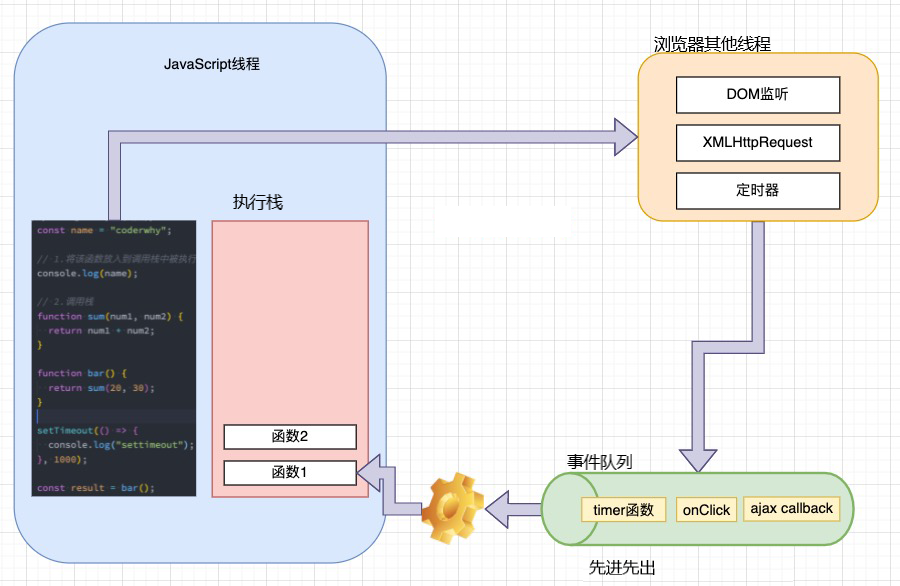 


## 同步任务和异步任务

- 同步任务

  同步任务都在**主线程上执行**，形成一个**执行栈**

- 异步任务

  异步是通过**回调函数**实现的，异步任务有以下三种类型:

  1. 普通**事件**，如 `click`、`resize` 等

  2. **资源加载**，如 `load`、`error` 等
  
     ```javascript
     console.log('start')
     var img = document.createElement('img')
     // 或者 img = new Image()
     img.onload = function () {
       console.log('loaded')
       img.onload = null
     }
     img.src = '/xxx.png'
     console.log('end')
     ```
  
  3. **定时器**，包括 `setInterval`、`setTimeout` 等
  
  4. **Ajax** 等
  
- **异步任务相关回调函数添加到任务队列中**（任务队列也称为消息队列、事件队列）

   


## 宏任务和微任务

在事件循环中，并非只维护着一个队列，事实上是有**两个队列**

- 宏任务队列

  `setTimeout`，`setInterval`，`requestAnimationFrame` (浏览器)，`setImmediate` (Node)， `I/O`，`ajax`，`DOM 监听`，`UI Rendering` (浏览器) 等

- 微任务队列

  `process.nextTick` (Node)，`Promise.then`，`Object.observe`，`MutationObserver`，`queueMicrotask` 等

- 执行优先级

  1. 同步的代码
  2. 微任务的异步代码
  3. 宏任务的异步代码

- **异步中先执行微任务再执行宏任务**

- **如果宏任务中有微任务，会执行完当前宏任务中的所有微任务以后，再执行下一个宏任务**

  （执行宏任务之前，需要保证微任务队列已经被清空）

  ```javascript
  console.log(1);
  setTimeout(function() {							// 宏任务 进入事件队列
    console.log(2);
    new Promise(function(resovle) {
      console.log(3);
      resolve();
    }).then(function() {								// 在宏任务中有微任务，先执行完所有微任务，再去执行下一个宏任务
      console.log(4);
    })
  }, 0)
  new Promise(function(resolve) {			// 微任务 进入事件队列
      console.log(5);
      resolve();
    }).then(function() {
      console.log(6);
  })
  setTimeout(function() {							// 宏任务 进入事件队列
    console.log(7);
    new Promise(function(resolve) {
      console.log(8);
      resolve();
    }).then(function(){
      console.log(9);
    })
    console.log(10);
  }, 0)
  console.log(11);
  // 执行顺序
  // 1 5 11 6 2 3 4 7 8 10 9
  ```


##  执行机制

1. **先执行执行栈中的同步任务**

2. **异步任务**（回调函数）放入**任务队列中**排队等待

3. 一旦执行栈中的所有**同步任务执行完毕**，系统就会**按次序读取任务队列中的异步任务**
   被读取的异步任务结束等待状态，进入执行栈，开始执行
   

 

**异步函数会先提交给异步进程进行处理，异步进程处理决定是否放入到任务队列中**

例如 `onclick` 的异步任务，**只有在点击了，才会进入任务队列**，**定时器时间到了，回调函数才会放入任务队列**中去

由于主线程不断的重复获得任务、执行任务、再获取任务、再执行，所以这种机制被称为**事件循环**（ event loop）

```javascript
// JS是单线程的, 所以进入while循环之后，没有线程去跑定时器了，所以这个代码跑起来是个死循环
var a = true;
setTimeout(function(){
  a = false;
}, 100)
while(a){
  console.log('while执行了')
}
```


## 定时器函数

- `setTimeout` 设置一个定时器，该定时器在定时器到期后执行调用函数

  `window.setTimeout(调用函数, [延迟的毫秒数]);`

  - 延迟的毫秒数省略默认是 0，如果写，必须是**毫秒**

  - 停止定时器 `clearTimeout`

    `clearTimeout()` 方法取消先前通过调用 ` setTimeout()` 建立的定时器。

    ```javascript
    const timeoutID = setTimeout(() => console.log('aa'), 2000)
    window.clearTimeout(timeoutID)
    ```

    里面的参数就是定时器的标识符 

- `setInterval` 重复调用一个函数，每隔这个时间，就去调用一次回调函数

  `window.setInterval(回调函数, [间隔的毫秒数]);`

  - 间隔的毫秒数省略默认是 0，如果写，必须是**毫秒**，表示每隔多少毫秒就自动调用这个函数

  - **第一次执行也是间隔毫秒数之后执行**，之后每隔毫秒数就执行一次

  - 停止定时器 `clearInterval`

    `clearInterval()` 方法取消先前通过调用 `setInterval()` 建立的定时器。

    ```javascript
    window.clearInterval(intervalID);
    ```

    里面的参数就是定时器的标识符


## 回调函数

**正常方式是不能获取异步函数内的返回值**，只能返回 `undefined`

```javascript
getCallbackData(){
  setTimeOut(()=>{
    var username = "张三";
    return username; 
  }, 1000);
}
```

使用回调函数获取异步函数返回值

```javascript
getCallbackData(callbackFunc){
  setTimeOut(()=>{
    var username = "张三";
    callbackFunc(username); 
  }, 1000);
}

let callbackData = getCallbackData((data)=>{
  console.log(data);
});
```

但是回调函数会引发**地狱回调**的问题

```javascript
// 两个异步函数无法确定哪个谁先执行完
&.ajax({
  url:"php/ok.php",
  sucess: function(res) {
    console.log('结果111', res);
  }
})
&.ajax({
  url:"php/ok.php",
  sucess: function(res) {
    console.log('结果22', res);
  }
})

// 利用回调函数嵌套规定执行顺序，但是如果一直嵌套会造成地狱回调问题
&.ajax({
  url:"php/ok.php",
  sucess: function(res) {
    console.log('结果111', res);
    &.ajax({
      url:"php/ok.php",
      sucess: function(res) {
        console.log('结果22', res);
        &.ajax({
          url:"php/ok.php",
          sucess: function(res) {
            console.log('结果33', res);
          }
        })
      }
    })
  } 
})
```


## Promise

### 理解 Promise

` Promise` 对象用于表示一个异步操作的最终完成（或失败），以及其结果值

在通过 `new` 创建 `Promise` 对象时，需要传入一个回调函数，称为 `executor`

- 这个回调函数会被**立即执行**，并且给传入另外两个回调函数 `resolve`（成功回调）、`reject`（失败回调）

- 当调用 `resolve` 回调函数时，会执行 `Promise` 对象的 `then` 方法中传入的成功回调函数
- 当调用 `reject` 回调函数时，会执行 `Promise` 对象的 `then` 方法中传入的失败回调函数，或者 `catch` 方法传入的回调函数

```javascript
let p = new promise(function(resolve, reject) {
  // 处理异步操作
  setTimeout(function() {
    // 生成1-10的随机数
    var num = Math.ceil(Math.random() * 10);
    if (num<=5){
      // resolve 成功的函数
      resolve(num);
    }
    else {
      // reject 失败的函数
      reject('数字太大了');
    }
  }, 2000);
})
// p.then(成功的函数resolve, 失败的函数reject(可以省略))
p.then(function(data) {
  // 成功函数
  console.log('resolved');
  console.log(data);
}, function(reason, data) {
  // 失败函数
  console.log('rejected');
  console.log(reason);
})
```

- 优点：
  1. 解决了回调地狱的问题，将异步操作以同步操作的流程表达出来
  2. 统一现在各种各样的异步 API
  3. 与事件相比，Promise 更适合处理一次性的结果，但是不能使用 Promise 处理多次触发的事件，链式处理是 Promise 的又一优点，但是事件却不能这样链式处理
- 缺点：
  1. **无法取消** Promise，**一旦新建它就会立即执行，无法中途取消**
  2. 不设置回调函数，Promise 内部抛出的错误，不会反应到外部
  3. 当处于 Pending 状态时，无法得知目前进展到哪一个阶段（刚刚开始还是即将完成）
  4. Promise 真正执行回调的时候，定义 Promise 那部分实际上已经走完了，所以 Promise 的报错堆栈上下文不太友好


### Promise 三个状态

1. 待定（`pending`）: 初始状态，既没有被兑现，也没有被拒绝

   当执行 `executor` 中的代码时，处于该状态

2. 已兑现（`fulfilled`）: 意味着操作成功完成

   执行了 `resolve` 时，处于该状态

3. 已拒绝（`rejected`）: 意味着操作失败

   执行了 `reject` 时，处于该状态

`Promise` **状态一旦确定下来，就是不可更改的 **(锁定)

1. 在调用 `resolve` 的时候，如果 **`resolve` 传入的值不是一个 `Promise`**，那么会将该 `Promise` 的状态变成**已兑现**（`fulfilled`）

2. 如果 **`resolve` 传入的值是一个 `Promise`**，那么当前的 `Promise` 的状态会由**传入的 `Promise` 来决定**（状态进行移交）

   ```javascript
   new Promise((resolve, reject) => {
     resolve(new Promise((resolve, reject) => {
       setTimeout(() => {
         resolve('第二个Promise的resolve'); 
       }, 3000);
     })) 
   }).then(res => {
     console.log('res:', res);
   }).catch(err => {
     console.log('err:', err); 
   });
   // res: 第二个Promise的resolve
   ```

3. 如果 `resolve` 中传入的是一个**对象**，并且这个**传入对象有实现 `then` 方法**，那么会**执行该 `then` 方法**，并且根据 `then` 方法的结果来决定 `Promise` 的状态

   ```javascript
   new Promise((resolve, reject) => {
     resolve({
       then: function(resolve, reject) {
         resolve('thenable value');
       }
     }) 
   }).then(res => {
     console.log(res);
   });
   // thenable value
   ```

4. 之后去调用 `reject` 时，已经不会有任何的响应了（并不是这行代码不会执行，而是无法改变 `Promise` 状态）

   ```javascript
   const promise = new Promise((resolve, reject) => {
     console.log('---');	 // pending状态（待定状态）
     resolve('哈哈');			// fulfilled状态（已敲定状态）
     reject('错误信息');	   // rejected状态（已拒绝状态）
   });
   promise.then(res => {
     console.log(res);
   }).catch(err => {
     console.log(err);
   });
   // ---
   // 哈哈
   ```


### Promise 对象方法

#### then 方法

`then` 方法是 `Promise` 对象上的一个方法，其实是放在 `Promise` 的原型上的 `Promise.prototype.then`

- `then` 方法接受两个参数

  1. **`fulfilled` 的回调函数**：当状态变成 `fulfilled` 时会回调的函数

  2. **`reject` 的回调函数**：当状态变成 `reject` 时会回调的函数

     ```javascript
     const promise = new Promise((resolve, reject) => {
       reject("rejected status");
     })
     promise.then(undefined, err => {
       console.log("err:", err);
     });
     // err: rejected status
     ```

     当抛出**异常**时, 也会**调用 `reject`** 回调函数的

     ```javascript
     const promise = new Promise((resolve, reject) => {
       throw new Error("rejected status")
     })
     promise.then(undefined, err => {
       console.log("err:", err);
     });
     // err: rejected status
     ```

- **同一个 `Promise` 可以被多次调用 `then` 方法**，当 `resolve` 方法被回调时, 所有的 `then` 方法传入的回调函数都会被调用

  ```javascript
  const promise = new Promise((resolve, reject) => {
    resolve("hahaha");
  });
  promise.then(res => {
    console.log("res1:", res);
  })
  promise.then(res => {
    console.log("res2:", res);
  })
  promise.then(res => {
    console.log("res3:", res);
  })
  // res1: hahaha
  // res2: hahaha
  // res3: hahaha
  ```

- **`then` 方法本身是有返回值的，它的返回值是一个 `Promise`**

  1. 如果 `then` 方法中的回调函数**返回的是一个普通值**，那么这个普通值会被作为一个**新的 `Promise` 的 `resolve` 值**

     ```javascript
     const promise = new Promise((resolve, reject) => {
       resolve("hahaha");
     });
     promise.then(res => {
       return 'aaa';
       // 相当于
       // return new Promise(resolve => {
       //    resolve('aaa'); 
       // });
     }).then(res => {
       console.log('res:', res);
     });
     // res: aaa
     ```

     如果回调函数**没有返回值**，会返回一个 `resolve(undefined)` 的新 `Promise`

     ```javascript
     const promise = new Promise((resolve, reject) => {
       resolve("hahaha");
     });
     promise.then(res => {
       // 相当于
       // return new Promise(resolve => {
       //    resolve(undefined); 
       // });
     }).then(res => {
       console.log('res:', res);
     });
     // res: undefined
     ```

  2. 如果返回的是一个 `Promise`，**返回的 `Promise` 的状态将取代调用的 `Promise` 的状态**

     ```javascript
     const promise = new Promise((resolve, reject) => {
       resolve("hahaha");
     });
     promise.then(res => {
       return new Promise(resolve => {
         setTimeout(() => {
           resolve(111);
         }, 3000) 
       });
     }).then(res => {
       console.log('res:', res);
     });
     // res: 111
     ```

  3. 如果返回的是一个对象, 并且该对象实现了 `then` 方法

     ```javascript
     const promise = new Promise((resolve, reject) => {
       resolve("hahaha");
     });
     promise.then(res => {
       return {
         then: function(resolve, reject) {
           resolve(222);
         }
       }
       // 相当于
       // return new Promise(resolve => resolve(obj.then));
     }).then(res => {
       console.log('res:', res);
     });
     // res: 222
     ```

- 使用链式编程，解决地狱回调

  ```javascript
  let p = new promise(function(resolve, reject){
    &.ajax({
      url: "php/ok.php",
      sucess: function(res) {
        console.log('结果111', res);
      }
    })
  })
  p.then(function(res){
    console.log('成功的结果',res);
    let p2 = new promise(function(resolve, reject){
      &.ajax({
        url:"php/ok.php",
        sucess: function(res) {
          console.log('结果222', res);
        }
      })
    })
    }).then(function(res){
    console.log('成功的结果2',res);
  })
  ```


#### catch 方法

`catch` 方法是 `Promise` 对象上的一个方法：它也是放在 `Promise` 的原型上的 `Promise.prototype.catch`

可以替代 `then` 的 `reject` 的回调函数写法，调用传入对应的 `reject` 回调

1. 如果 `executor` 中执行了 `reject` 函数或者抛出异常，`catch` 执行的 `promise` 就是最初调用的 `promise`

2. 如果 `executor` 中没有执行 `reject` 函数或者抛出异常，

   `catch` 之前的 `then` 执行 `reject` 函数或者抛出异常，`catch` 执行的 `promise` 就是 `then` 返回的 `promise`

```javascript
const promise = new Promise((resolve, reject) => {
  reject("rejected status")
  // throw new Error("rejected status")
});
promise.then(res => {

}).catch(err => {
  // catch里执行的promise不是then执行之后返回的新promise，而是最初的promise
  console.log("err:", err);
});
// err: rejected status
```

```javascript
const promise = new Promise((resolve, reject) => {
  resolve();
});
promise.then(res => {
  return new Promise((resolve, reject) => {
    reject('then rejected status');
  });
  // throw new Error('then rejected status');
}).catch(err => {
  // catch里执行的promise是then执行之后返回的新promise
  console.log("err:", err);
});
// err: then rejected status
```

```javascript
const promise = new Promise((resolve, reject) => {
  reject("rejected status");
  // throw new Error("rejected status");
});
promise.then(res => {
  return new Promise((resolve, reject) => {
    reject('then rejected status');
  });
  // throw new Error('then rejected status');
}).catch(err => {
  // catch里执行的promise不是then执行之后返回的新promise，而是最初的promise
  console.log("err:", err);
});
// err: rejected status
```

一个 `Promise` 的 `catch` 方法是**可以被多次调用**的，当 `Promise` 的状态变成 `reject` 的时候，这些回调函数都会被执行

```javascript
const promise = new Promise((resolve, reject) => {
  reject(111);
});
promise.catch(err => {
  console.log('err1:', err); 
});
promise.catch(err => {
  console.log('err2:', err);
});
// err1: 111
// err2: 111
```

拒绝捕获的问题

```javascript
const promise = new Promise((resolve, reject) => {
  reject(111);
});
// 两次then和catch相当于两次独立的调用
// 第一次的then没有捕获reject，会报异常
promise.then(res => {
  console.log('res:', res);
});
// Uncaught (in promise)
promise.catch(err => {
  console.log('err:', err);
});
// err: 111
```

**`catch` 的返回值也是一个 `Promise`**

1. 返回新 `Promise` 的 `resolve` 值

   ```javascript
   const promise = new Promise((resolve, reject) => {
     reject(111);
   });
   promise.catch(err => {
     console.log('err1:', err);
     // 相当于
     // return new Promise(resolve => resolve())
   }).catch(err => {
     console.log('err2;', err);
   }).then(res => {
     console.log('res:', res); 
   });
   // err1: 111
   // res: undefined
   ```

2. 返回带异常的新 `Promise` 的 `reject` 值

   ```javascript
   const promise = new Promise((resolve, reject) => {
     reject(111);
   });
   promise.catch(err => {
     console.log('err1:', err);
     throw new Error('error message');
   }).catch(err => {
     console.log('err2;', err);
   }).then(res => {
     console.log('res:', res); 
   });
   // err1: 111
   // err2: error message
   // res: undefined
   ```


#### finally 方法

`finally` 是在 ES9 中新增的一个特性，无论 `Promise` 对象无论变成 `fulfilled` 还是 `reject` 状态，最终都会被执行的代码

`finally` 方法不接收参数，无论前面是 `fulfilled` 状态，还是 `reject` 状态，都会执行

```javascript
const promise = new Promise((resolve, reject) => {
  resolve("resolve message");
  // reject("reject message");
})

promise.then(res => {
  console.log("res:", res);
}).catch(err => {
  console.log("err:", err);
}).finally(() => {
  console.log("finally code execute");
})
// res: resolve message
// finally code execute
```


### Promise 类方法

#### resolve 方法

将一个现成的内容转成 `Promise`，并且执行 `resolve` 操作

`Promise.resolve` 的用法相当于 `new Promise`

```javascript
// const promise2 = new Promise((resolve, reject) => {
// 	resolve({ name: "why" });
// })
// 相当于
const promise = Promise.resolve({ name: "why" });
promise.then(res => {
  console.log("res:", res);
});
// res: {name: 'why'}
```

`Promise.resolve` 可以传入 `Promise` 或者 `thenable` 对象

```javascript
const promise = Promise.resolve(new Promise(resolve => resolve(11)));
promise.then(res => {
	console.log("res:", res);
});
// res: 11
```


#### reject 方法

将一个现成的内容转成 `Promise`，将 `Promise` 对象的状态设置为 `reject` 状态

`Promise.reject` 相当于 `new Promise`，只是会调用 `reject`

```javascript
// const promise2 = new Promsie((resolve, reject) => {
// 	reject("rejected message");
// })
// 相当于
const promise = Promise.reject("rejected message");
promise.then(res => {
  console.log("res:", res);
}).catch(err => {
  console.log("err:", err);
})
// err: rejected message
```

`Promise.reject` 方法传入 `Promise` 或者 `thenable` 对象也不会调用，只会打印出来

```javascript
const promise = Promise.reject({
  then: function(resolve, reject) {
    resolve('111');
  }
});
promise.then(res => {
  console.log("res:", res);
}).catch(err => {
  console.log("err:", err);
})
// err: {then: ƒ}
```

```javascript
const promise = Promise.reject(new Promise(() => {}));
promise.then(res => {
	console.log("res:", res);
}).catch(err => {
	console.log("err:", err);
})
// Promise {<fulfilled>: undefined}
```


#### all 方法

- 将多个 `Promise` 包裹在一起形成一个新的 `Promise`


- 当**所有的 `Promise` 状态都变成 `fulfilled` 状态时**，新的 `Promise` 状态为 `fulfilled`，并且再将**所有 `Promise` 的返回值组成一个数组**

  ```javascript
  const p1 = new Promise((resolve, reject) => {
    setTimeout(() => {
      resolve(11);
    }, 1000);
  })
  const p2 = new Promise((resolve, reject) => {
    setTimeout(() => {
      resolve(22);
    }, 2000);
  })
  const p3 = new Promise((resolve, reject) => {
    setTimeout(() => {
      resolve(33);
    }, 3000);
  })
  // 所有的Promise都变成fulfilled时, 再拿到结果
  Promise.all([p1, p2, p3, "aa"]).then(res => {
    console.log(res);
  }).catch(err => {
    console.log("err:", err);
  })
  // [11, 22, 33, 'aa']
  ```

- 当**有一个 `Promise` 状态为 `reject` 时**，新的 `Promise` 状态会**立即变成对应的 `reject` 状态**，并且**会将第一个 `reject` 的返回值作为参数**

  **对于 `resolved` 的，以及依然处于 `pending` 状态的 `Promise`，是获取不到对应的结果的**

  ```javascript
  const p1 = new Promise((resolve, reject) => {
    setTimeout(() => {
      resolve(11);
    }, 1000);
  })
  const p2 = new Promise((resolve, reject) => {
    setTimeout(() => {
      reject(22);
    }, 2000);
  })
  const p3 = new Promise((resolve, reject) => {
    setTimeout(() => {
      resolve(33);
    }, 3000);
  })
  // 所有的Promise都变成fulfilled时, 再拿到结果
  Promise.all([p1, p2, p3, "aa"]).then(res => {
    console.log(res);
  }).catch(err => {
    console.log("err:", err);
  })
  // err: 22
  ```


#### allSettled 方法

会在**所有的 `Promise` 都有结果**（`settled`），无论是 `fulfilled`，还是 `reject` 时，才会有最终的状态

并且这个 `Promise` 的结果一定是 `fulfilled`（ES11）

```javascript
const p1 = new Promise((resolve, reject) => {
  setTimeout(() => {
    resolve(11);
  }, 1000);
})
const p2 = new Promise((resolve, reject) => {
  setTimeout(() => {
    reject(22);
  }, 2000);
})
const p3 = new Promise((resolve, reject) => {
  setTimeout(() => {
    resolve(33);
  }, 3000);
})
Promise.allSettled([p1, p2, p3]).then(res => {
  console.log(res);
}).catch(err => {
  console.log("err:", err);
})
// [
// 	{ status: 'fulfilled', value: 11 },
// 	{ status: 'rejected', reason: 22 },
// 	{ status: 'fulfilled', value: 33 }
// ]
```

 

#### race 方法

只要有一个 `Promise` 变成 `fulfilled` 或 `reject` 状态，那么就结束

```javascript
const p1 = new Promise((resolve, reject) => {
  setTimeout(() => {
    resolve(11);
  }, 1000);
})
const p2 = new Promise((resolve, reject) => {
  setTimeout(() => {
    resolve(22);
  }, 2000);
})
const p3 = new Promise((resolve, reject) => {
  setTimeout(() => {
    resolve(33);
  }, 3000);
})
Promise.race([p1, p2, p3]).then(res => {
  console.log("res:", res);
}).catch(err => {
  console.log("err:", err);
})
// res: 11
```

```javascript
const p1 = new Promise((resolve, reject) => {
	setTimeout(() => {
		reject(11);
	}, 1000);
})
const p2 = new Promise((resolve, reject) => {
	setTimeout(() => {
		resolve(22);
	}, 2000);
})
const p3 = new Promise((resolve, reject) => {
	setTimeout(() => {
		resolve(33);
	}, 3000);
})
Promise.race([p1, p2, p3]).then(res => {
	console.log("res:", res);
}).catch(err => {
	console.log("err:", err);
})
// err: 11
```


#### any 方法

`any` 方法会**等到一个 `fulfilled` 状态**，才会决定新 `Promise` 的状态（ES12）

```javascript
const p1 = new Promise((resolve, reject) => {
  setTimeout(() => {
    reject(11);
  }, 1000);
})
const p2 = new Promise((resolve, reject) => {
  setTimeout(() => {
    resolve(22);
  }, 2000);
})
const p3 = new Promise((resolve, reject) => {
  setTimeout(() => {
    resolve(33);
  }, 3000);
})
Promise.any([p1, p2, p3]).then(res => {
  console.log("res:", res);
}).catch(err => {
  console.log("err:", err);
})
// res: 22
```

如果**所有的 `Promise` 都是 `reject` 的，那么也会等到所有的 `Promise` 都变成 `rejected` 状态**

如果所有的 `Promise` 都是 `reject` 的，那么会报一个 `AggregateError` 的错误

```javascript
const p1 = new Promise((resolve, reject) => {
  setTimeout(() => {
    reject(11);
  }, 1000);
})
const p2 = new Promise((resolve, reject) => {
  setTimeout(() => {
    reject(22);
  }, 2000);
})
const p3 = new Promise((resolve, reject) => {
  setTimeout(() => {
    reject(33);
  }, 3000);
})
Promise.any([p1, p2, p3]).then(res => {
  console.log("res:", res);
}).catch(err => {
  console.log("err:", err);
  console.log("err:", err.errors);
})
// err: AggregateError: All promises were rejected
// err: [11, 22, 33]
```


### 执行顺序

**`new Promise` 会立即执行，`then` 的需要异步的**

```javascript
console.log(1);
let p = new Promise(function(resolve, reject){
  console.log(2)
  resovle();
})
p.then(function(){
  console.log(3);
})
console.log(4);
// 执行结果
// 1 2 4 3
```

**先微后宏**

在异步处理中 `then` 的回调比 `setTimeout` 先执行

```javascript
const first = () => (new Promise(resolve, reject) => {
  console.log(3);
  let p = new Promise((resolve, reject) => {
    console.log(7);
    setTimeout(() => {
      console.log(5);
      resolve(6);
    }, 0);
    resolve(1);
  });
  resolve(2);
  p.then((arg) => {
    console.log(arg); 
  });
}));
first().then((arg) => {
  console.log(arg); 
});
console.log(4);
// 执行结果
// 3 7 4 1 2 5
// 一个promise的resolve只能调用一次
// 6 不执行 
```

理解 `then` 的第二回调函数和 `catch`

```javascript
asyncThing1()
  .then(function() { 
  return asyncThing2();
})
  .then(function() {
  return asyncThing3();
})
  .catch(function() {
  return asyncRecovery1();
})
  .then(
  function() {
    return asyncThing4();
  },
  function(err) {
    return asyncRecovery2();
  }
)
  .catch(function(err) {
  console.log("Dont't worry about it");
})
  .then(function() {
  console.log("All done!");
})
```

 


### 实现 Promise

https://github.com/lgwebdream/FE-Interview/issues/29

```javascript
// 定义三种状态
const PENDING = 'PENDING';
const FULFILLED = 'FULFILLED';
const REJECT = 'REJECT';

class Promise {
  constructor(executor) {
    // 初始化状态
    this.state = PENDING;

    // 将成功、失败的结果放在this上，便于then、catch访问
    this.value = null;
    this.reason = null;

    // 成功态、失败态回调函数队列，同步调用then时将对应态的函数注册进去, 在状态变更的时候调用
    this.onFulfilledCallbacks = [];
    this.onRejectedCallbacks = [];

    const resolve = (value) => {
      if (this.status === PENDING){
        this.status = FULFILLED;
        this.value = value;
        // 成功态回调函数依次执行
        this.onFulfilledCallbacks.forEach(fn => fn(this.value))
      }
    }

    let resolve = value => {
      if (this.state === 'pending') {
        this.state = 'fulfilled';
        this.value = value;
      }
    };
    let reject = reason => {
      if (this.state === 'pending') {
        this.state = 'rejected';
        this.reason = reason;
      }
    };
    try {
      // 立即执行函数
      executor(resolve, reject);
    } catch (err) {
      reject(err);
    }
  }
  then(onFulfilled, onRejected) {
    if (this.state === 'fulfilled') {
      let x = onFulfilled(this.value);
    };
    if (this.state === 'rejected') {
      let x = onRejected(this.reason);
    };
  }
}
```


## async / await

### async

`async` 关键字用于**声明一个异步函数**

- `async` 异步函数写法

  ```javascript
  async function foo1() {}
  const foo2 = async function() {}
  const foo3 = async () => {}
  class Person {
    async foo() {}
  }
  ```


- `async` 函数就是 **`generator` 函数加 `yield` 的语法糖**

  ```javascript
  // 需求
  // 1> url: why -> res: why								向服务器发送网络请求获取数据，一共需要发送三次请求
  // 2> url: res + "aaa" -> res: whyaaa			第二次的请求url依赖于第一次的结果
  // 3> url: res + "bbb" => res: whyaaabbb	第三次的请求url依赖于第二次的结果，依次类推
  function requestData(url) {
    // 异步请求的代码会被放入到executor中
    return new Promise((resolve, reject) => {
      // 模拟网络请求
      setTimeout(() => {
        // 拿到请求的结果
        resolve(url);
      }, 2000);
    })
  }
  // 使用Promise + generator实现
  function* getData() {
    const res1 = yield requestData("why");
    const res2 = yield requestData(res1 + "aaa");
    const res3 = yield requestData(res2 + "bbb");
    const res4 = yield requestData(res3 + "ccc");
    console.log(res4);
  }
  // 封装工具函数execGenerator自动执行生成器函数
  function execGenerator(genFn) {
    const generator = genFn();
    function exec(res) {
      const result = generator.next(res);
      if (result.done) {
        return result.value;
      }
      result.value.then(res => {
        exec(res);
      });
    }
    exec();
  }
  execGenerator(getData);		// whyaaabbbccc
  
  // 使用async/await实现
  async function getData2() {
    const res1 = await requestData("why")
    const res2 = await requestData(res1 + "aaa")
    const res3 = await requestData(res2 + "bbb")
    const res4 = await requestData(res3 + "ccc")
    console.log(res4)
  }
  getData2();					// whyaaabbbccc
  ```


- 异步函数执行流程：异步函数的内部代码执行过程和普通的函数是一致的，默认情况下也是会被同步执行

  ```javascript
  async function foo() {
    console.log("foo function start~");
    console.log("内部的代码执行");
    console.log("foo function end~");
  }
  console.log("script start");
  foo();
  console.log("script end");
  // script start
  // foo function start~
  // 内部的代码执行
  // foo function end~
  // script end
  ```


- 异步函数也**可以有返回值**

  1. 异步函数的返回值会被包裹到 `Promise.resolve` 中

     ```javascript
     async function foo() {
       console.log("foo function start~");
       console.log("内部的代码执行");
       console.log("foo function end~");
     }
     const promise = foo();
     promise.then(res => {
       console.log();
     });
     ```

  2. 异步函数的返回值是一个对象并且实现了 `thenable`

     ```javascript
     async function foo() {
       console.log("foo function start~");
       return {
         then: function(resolve, reject) {
           resolve("内部的代码执行");
         }
       }
     }
     const promise = foo();
     promise.then(res => {
       console.log("promise then function exec:", res);
     });
     // foo function start~
     // promise then function exec: 内部的代码执行
     ```

  3. 异步函数的返回值是 `Promise`

     ```javascript
     async function foo() {
       console.log("foo function start~");
       return new Promise((resolve, reject) => {
         setTimeout(() => {
           resolve("内部的代码执行");
         }, 2000)
       })
     }
     const promise = foo();
     promise.then(res => {
       console.log("promise exec:", res);
     });
     // foo function start~
     // promise exec: 内部的代码执行
     ```

- 在 **`async` 中抛出异常**，并不会像普通函数一样报错，而是会作为 `Promise` 的 `reject` 来传递

  ```javascript
  async function foo() {
    console.log("foo function start~");
    console.log("中间代码~");
    // 异步函数中的异常, 会被作为异步函数返回的Promise的reject值的
    throw new Error("error message");
    console.log("foo function end~");
  }
  foo().catch(err => {
    console.log("err:", err);
  })
  console.log("后续还有代码~~~~~");
  // foo function start~
  // 中间代码~
  // 后续还有代码~~~~~
  // err: Error: error message
  ```


### await

`async` 函数另外一个特殊之处就是可以在它内部使用 **`await` 关键字**

1. `await` **后面会跟上一个表达式**，这个**表达式会返回一个 `Promise`**

   `await` 会**等到 `Promise` 的状态变成 `fulfilled `状态，之后继续执行异步函数**

   `await` 语句**之后的代码相当于在返回的 `Promise` 的 `then` 中执行的**

   ```javascript
   function requestData() {
     return new Promise((resolve, reject) => {
       setTimeout(() => {
         resolve(222);
       }, 2000);
     })
   }
   async function foo() {
     const res1 = await requestData();
     // 下面的语句相当于在promise的then中执行
     console.log("res1后面的代码", res1);
     console.log("后面的代码");
     const res2 = await requestData();
     console.log("res2后面的代码", res2);
   }
   foo();
   // res1后面的代码 222
   // 后面的代码
   // res2后面的代码 222
   ```

2. `await` 后面是一个 `Promise`

   ```javascript
   async function foo() {
     const res1 = await new Promise((resolve) => {
       resolve("why");
     })
     console.log("res1", res1);
   }
   foo();
   // res1 why
   ```

3. 返回的 `Promise` 是 **`reject` 的状态**，代码**不会继续往下执行**，会将这个 **`reject` 结果直接作为函数的 `Promise` 的 `reject` 值**

   ```javascript
   function requestData() {
     return new Promise((resolve, reject) => {
       setTimeout(() => {
         reject(1111);
       }, 2000);
     })
   }
   async function foo() {
     const res1 = await requestData();
     console.log("res1后面的代码", res1);
     console.log("后面的代码");
   }
   foo().catch(err => {
     console.log("err:", err)
   })
   // err: 1111
   ```

4. `await` 后面是一个**普通的值**，那么会**直接返回这个值**

   ```javascript
   async function foo() {
     const res1 = await 123;
     console.log("res1", res1);
   }
   foo();
   // res1 123
   ```

5. `await` 后面是一个 **`thenable` 的对象**，会调用对象的 `then` 方法

   ```javascript
   async function foo() {
     const res1 = await {
       then: function(resolve, reject) {
         resolve("abc");
       }
     }
     console.log("res1", res1);
   }
   foo();
   // res1 abc
   ```


使用 `async` 和 `await` 省略 `then`，代码清晰易读

```javascript
document.getElementById('btn').onclick = async () => {
  // 使用await省略then
  let res = await axios();
  console.log('结果', res);
}
```


## Web Worker

web worker 是**运行在后台**的 js，独立于其他脚本，不会影响页面的性能，并且**通过 `postMessage` 将结果回传到主线程**

这样在进行复杂操作的时候，就**不会阻塞主线程**了

-  给 JS 创造**多线程运行环境**，允许主线程创建 worker 线程，主线程运行的同时 worker 线程也在运行，相互不干扰
  在 worker 线程运行结束后把结果返回给主线程
- 好处是主线程可以**把计算密集型或高延迟的任务交给 worker 线程执行**，主线程不会被阻塞
- 并不意味着 JS 语言本身支持了多线程能力，而是浏览器作为宿主环境提供了 JS 一个多线程运行的环境

- 创建 web worker 对象

  `var myWorker = new Worker(jsUrl, options)`

  - `jsUrl`：脚本的网址（必须遵守同源政策），必需
  - `options`：配置对象，可选

  ```javascript
  // 指定 Worker 的名称
  var myWorker = new Worker('worker.js', { name : 'myWorker' });
  // Worker 线程
  self.name // myWorker
  ```

- worker 线程中**全局对象**为 `self`，代表子线程自身，这时 `this` 指向 `self`

  - `self.postMessage`：worker 线程往主线程发消息

    可以传递任何类型数据的，包括对象，这种通信是拷贝关系，即是传值而不是传址

  - `self.close`：worker 线程关闭自己

  - `self.onmessage`：指定主线程发 worker 线程消息时的回调

    也可以 `self.addEventListener('message', cb)`

  - `self.onerror`：指定 worker 线程发生错误时的回调

     也可以 `self.addEventListener('error',cb)`

- 主线程中 `worker` 表示 worker 的实例

  - `worker.postMessage`：主线程往 worker 线程发消息

  - `worker.terminate`：主线程关闭 worker 线程

  - `worker.onmessage`：指定 worker 线程发消息时的回调

    也可以 `worker.addEventListener('message',cb)`

  - `worker.onerror`：指定 worker 线程发生错误时的回调

    也可以 `worker.addEventListener('error',cb)`

- 检测浏览器对于 web worker 的支持性

  ```javascript
  if (typeof(Worker) === 'undefined') {
    document.writeln(' Sorry! No Web Worker support.. ')
  }
  ```

- 应用场景：加密数据、预取数据、预渲染、复杂数据处理（检索、排序、过滤、分析）、预加载图片

  使用 web worker 来加载图片

  ```javascript
  // 主线程
  let w = new Worker("js/workers.js");
  w.onmessage = function (event) {
    var img = document.createElement("img");
    img.src = window.URL.createObjectURL(event.data);
    document.querySelector('#result').appendChild(img)
  }
  ```

  ```javascript
  // worker线程
  let arr = [...好多图片路径];
  for (let i = 0, len = arr.length; i < len; i++) {
    let req = new XMLHttpRequest();
    req.open('GET', arr[i], true);
    req.responseType = "blob";
    req.setRequestHeader("client_type", "DESKTOP_WEB");
    req.onreadystatechange = () => {
      if (req.readyState == 4) {
        postMessage(req.response);
      }
    }
    req.send(null);
  }
  ```


# 模块化

模块化开发的目的是将程序划分成一个个小的结构，在这个结构中编写属于自己的逻辑代码，有**自己的作用域**，不会影响到其他的结构

这个结构可以将自己希望暴露的**变量、函数、对象等导出**给其结构使用，也可以通过某种方式，**导入另外结构**中的变量、函数、对象等


## 早期模块化

早期没有模块化带来了很多的问题：比如**命名冲突**的问题

早期解决模块化：**立即函数调用表达式**（IIFE），但是仍有问题

1. 必须记得每一个模块中返回对象的命名，才能在其他模块使用过程中正确的使用
2. 代码写起来混乱不堪，每个文件中的代码都需要包裹在一个匿名函数中来编写
3. 没有合适的规范情况下，会出现模块名称相同的情况

```javascript
// index.js
var moduleA = (function() {
  var name = "why";
  var age = 18;
  var isFlag = true;
  return { name: name, isFlag: isFlag };
})();
```

```javascript
// name.js
(function() {
  if (moduleA.isFlag) {
    console.log("我的名字是" + moduleA.name);
  }
})();
```


## CommonJS

Node 中对 CommonJS 进行了支持和实现，在开发 node 的过程中可以方便的进行模块化开发

- 在 Node 中每一个 js 文件都是一个单独的模块

- 模块中包括 CommonJS 规范的核心变量：`exports`、`module.exports`、`require`，可以使用这些变量来进行模块化开发

  **导出**：`exports` 和 `module.exports` 可以负责对模块中的内容进行导出

  **导入**：`require` 函数可以导入其他模块中的内容

  ```javascript
  // index.js
  const { name, age, sum } = require("./name.js");
  console.log(name, age, sum(20, 30));
  ```

  ```javascript
  // name.js
  const name = "why";
  const age = 18;
  function sum(num1, num2) {
    return num1 + num2;
  }
  module.exports = { name, age, sum }
  ```

- `exports` 是一个对象，可以为这个对象添加属性，添加的属性会被导出；每个模块都有 `export` 对象，默认是空对象 `{}`

  `exports` 导出的对象和 `require` 导入的对象是**同一个引用**

  ```javascript
  // bar.js
  exports.name = name;
  exports.age = age;
  exports.sayHello = function (name) {
    console.log("Hello " + name);
  };
  ```

  ```javascript
  // main.js
  // bar 变量就是 exports 对象，引用地址相同
  const bar = require('./bar');
  console.log(bar.name, bar.age, bar.sayHello("kobe"));
  ```

- `module.exports` 是 `exports` 对象的一个引用

  为了实现模块的导出，node 中使用的是 `Module` 的类，**每一个模块都是 `Module` 的一个实例，也就是 `module`**

  node 中**真正导出的是 `module.exports`**，而不是 `exports`

  `module.exports` 和 `exports` **指向的都是同一个对象**，`module.exports = exports = require 导入的对象`

  ```javascript
  // 源码
  // module.exports = {}
  // exports = module.exports
  const name = "why";
  const age = 18;
  function sum(num1, num2) {
    return num1 + num2;
  }
  module.exports = { name, age, sum }
  ```

  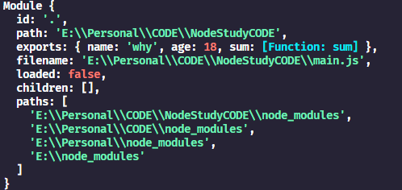 

- `require` 的查找规则

   格式：`require(X)`

  1. `X` 是一个 Node 核心模块，比如 `path`、`http`，直接返回核心模块，并且停止查找

  2. `X` 是以 `./` 或 `../` 或 `/`（根目录）开头的，将 `X` 当做一个文件在对应的目录下查找

     - 如果有后缀名，按照后缀名的格式查找对应的文件

       如果没有后缀名，按照 X > X.js > X.json > X.node 顺序查找

     - 如果没有找到对应的文件，将 `X` 作为一个目录，查找目录下的 index 文件

       按照 X/index.js > X/index.json > X/index.node 顺序查找

     - 如果没有找到，报错：not found

     ```javascript
     const abc = require("./abc")
     // ./abc/index.js
     ```

  3. 直接是一个 `X`（没有路径），并且 `X` 不是一个核心模块，会到每一层路径下面的 node_modules 中查找

     ```javascript
     const axios = require("axios")
     ```

     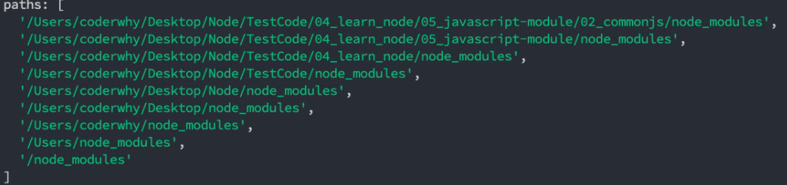 

- 模块的加载过程

  - 模块在被**第一次引入时**，模块中的 js 代码**会被运行一次**

  - 模块被多次引入时，**会缓存**，最终只加载（运行）一次

    每个模块对象 `module` 都有一个属性 `loaded`，为 `false` 还没有加载，为 `true` 表示已经加载

    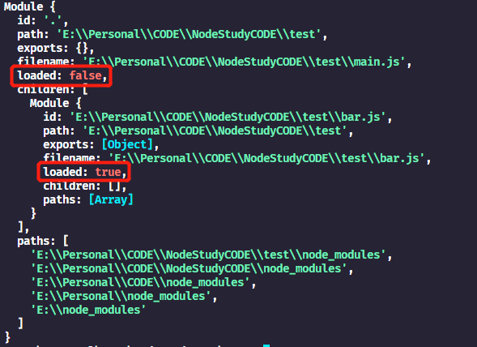 

  - 如果有循环引入，加载顺序是按照**深度优先搜索算法**

    加载顺序：main -> aaa -> ccc -> ddd -> eee -> bbb

    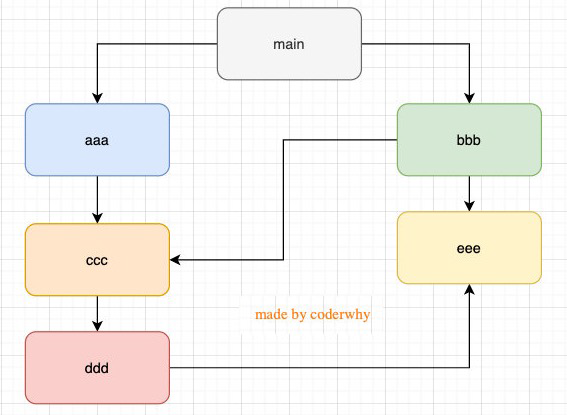 

    > 这种数据叫做图结构
    >
    > 图结构在遍历的过程中，有深度优先搜索（DFS, depth first search）和广度优先搜索（BFS, breadth first search）
    >
    > node 采用的是深度优先算法

- CommonJS 加载模块是**同步**的，意味着只有等到对应的模块加载完毕，当前模块中的内容才能被运行

  服务器加载的 js 文件都是本地文件，在服务器没有什么问题

  在浏览器中通常不使用 CommonJS 规范，因为浏览器加载 js 文件需要先从服务器将文件下载下来，之后再加载运行

  ```javascript
  const flag = true
  if (flag) {
    const foo = require('./foo')
    console.log('if语句继续执行')
  }
  ```


## ES Module

### ES Module 模块

ES Module 模块采用 `export` 和 `import` 关键字来实现模块化，采用编译器的静态分析，并且也加入了动态引用的方式

```javascript
// main.js
import { name, age } from "./foo.js"
console.log(name)
console.log(age)
```

```javascript
// foo.js
export const name = "why"
export const age = 18
```

- `export` 负责将模块内的内容导出，`import` 负责从其他模块导入内容

- 采用 ES Module 将自动采用严格模式 `use strict`

- ES Module 加载 js 文件的过程是**异步**的，并且是静态解析的

  获取 js 文件的过程是异步的，并不会阻塞主线程继续执行


- 引入 js 的时候需要将文件**指定为模块 `type="module"`**

  ```html
  <script src="./main.js" type="module"></script>
  ```

  如果指定为模块，再通过本地加载 Html 文件(比如一个 file:// 路径的文件)，将会报 **CORS 错误**，因为 Javascript 模块安全性需要

  需要通过**服务器来加载**测试（可以通过 VSCode 的 **Live Server 插件**）

  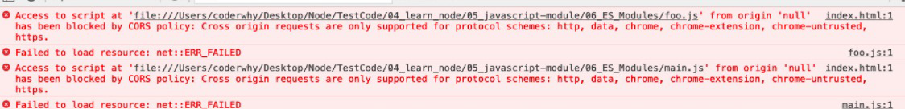 

- node 中使用 ES Module 需要让文件以 .mjs 结尾，或者在 package.json 中配置 `type: module`

  ```javascript
  // foo.mjs
  const name = 'why';
  const age = 18;
  export { name, age 
  ```

  ```javascript
  // index.mjs
  import { name, age } from "./modules/foo.mjs"
  console.log(name, age)
  ```


### export 关键字

`export` 关键字可以将一个模块中的变量、函数、类等导出

- 在语句声明的前面直接加上 `export` 关键字

   ```javascript
   // 导出
   export const name = "why"
   export const age = 18
   export function foo() {
     console.log("foo function")
   }
   export class Person { }
   ```

   ```javascript
   // 导入
   import { name, age, foo, Person } from "./foo.js"
   ```

- 将所有需要导出的标识符，放到 `export` 后面的 `{}` 中， **注意这个 `{}` 不是表示一个对象**

   ```javascript
   // 导出
   const name = "why"
   const age = 18
   function foo() {
     console.log("foo function")
   }
   export { name, age, foo }
   ```

   ```javascript
   // 导入
   import { name, age, foo } from "./foo.js"
   ```

- 导出时可以给标识符起一个别名

   ```javascript
   // 导出
   const name = "why"
   const age = 18
   function foo() {
     console.log("foo function")
   }
   export { name as fName, age as fAge, foo as fFoo }
   ```

   ```javascript
   // 导入
   import { fName, fAge, fFoo } from "./foo.js"
   ```

- 最重要的导出可以使用**默认导出**，其他的导出方式叫做命名导出，在**一个模块中，只能有一个默认导出**

   ```javascript
   const name = "why"
   const age = 18
   const foo = "foo value"
   // 默认导出方式一
   export { name, age, foo as default }
   ```

   ```javascript
   const name = "why"
   const age = 18
   const foo = "foo value"
   export { name, age }
   // 默认导出方式二
   export default foo
   ```

   ```javascript
   // 导入默认的导出
   import why from './foo.js'
   ```

- 导出的值是**只读**的，而且是**引用传递**


### import 关键字

`import` 关键字负责从另外一个模块中导入内容

- `import { 标识符列表 } from '模块'`, **注意这个 `{}` 不是一个对象**

   ```javascript
   import { name, age, foo } from "./foo.js"
   ```

- 导入时给标识符起别名

   ```javascript
   import { name as fName, age as fAge, foo as fFoo } from './foo.js'
   ```

- 通过 `*` 将模块功能放到一个模块功能对象上

   ```javascript
   import * as foo from './foo.js'
   console.log(foo.name, foo.age, foo.foo())
   ```

- 导入默认的导出，在导入时不需要使用 `{}`，导入时可以自定义名字

   ```javascript
   // 默认导出
   const foo = "foo value"
   export default foo
   ```

   ```javascript
   // 导入
   import myFoo from './foo.js'
   ```

- `export` 和 `import` 可以结合使用

  在开发和封装一个功能库时，通常希望将暴露的所有接口放到一个文件中（index.js），这样方便指定统一的接口规范

  ```javascript
  // ./utils/index.js
  // 导出方式一
  import { add, sub } from './math.js'
  import { timeFormat, priceFormat } from './format.js'
  export { add, sub, timeFormat, priceFormat }
  ```

  ```javascript
  // ./utils/index.js
  // 导出方式二
  export { add, sub } from './math.js'
  export { timeFormat, priceFormat } from './format.js'
  ```

  ```javascript
  // ./utils/index.js
  // 导出方式三
  export * from './math.js'
  export * from './format.js'
  ```

  ```javascript
  // main.js
  // 导入工具函数
  import { add, sub, priceFormat, timeFormat } from './utils'
  ```


- `import` 关键字导入也是**同步**代码，在导入完成之前，后续的代码都是不会运行的

  ```javascript
  import { name, age, foo } from './foo.js'
  console.log("foo.js解析完成之后，后续的代码才会运行")
  console.log(name)
  ```


- `import` 加载一个模块，不可以将其放到逻辑代码中，需要动态的加载可以使用 `import()` 函数

  ES Module 在被 JS 引擎解析时，就必须知道它的依赖关系

  ```javascript
  // 错误
  if (true) {
    import sub from './module/foo.js'
  }
  ```


### import 函数

- 使用 `import()` 函数**异步导入**，`import` 函数返回的结果是一个 `Promise`，加载成功后，内部会调用 `resolve`

  ```javascript
  // 异步导入，返回的是所有的导出
  import("./foo.js").then(res => {
    console.log("res:", res)
  }).catch(err => {
    console.log(err)
  })
  console.log("后续的代码运行")
  // 后续的代码运行
  // res: Module { age: {...}, foo: {...}, name: {...} }
  ```

- 可以使用 `import()` 函数来动态加载某一个模块

  ```javascript
  let flag = true;
  if (flag) {
    import('./modules/a.js').then(a => {
      a.aa();
    })
  } else {
    import('./modules/b.js').then(b => {
      b.bb();
    })
  }
  ```


- webpack 中使用 `import` 函数可以单独打包成一个文件


### import.meta 元属性

`import.meta` 是一个给模块暴露特定上下文的元数据属性的对象（ES11）

`import.meta` 只能在模块内部使用，如果在模块外部使用会报错

```javascript
console.log(import.meta)
// { url: "当前模块所在的路径" }
// 浏览器环境下 { url: 'http://127.0.0.1:5500/XXX/main.js' }
// node 环境下 { url: file:///home/user/foo.js }
```


### ES Module 解析过程

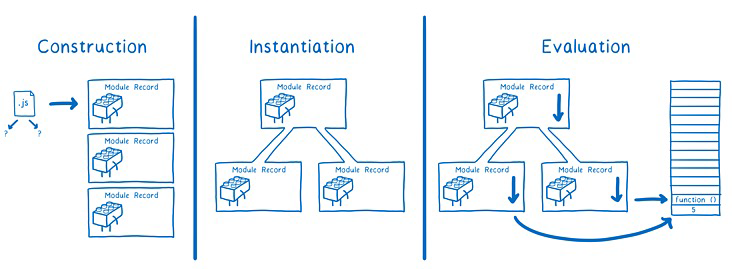 

1. 构建 Construction

   根据地址下载 js 文件，将其解析成模块记录 Module Record

   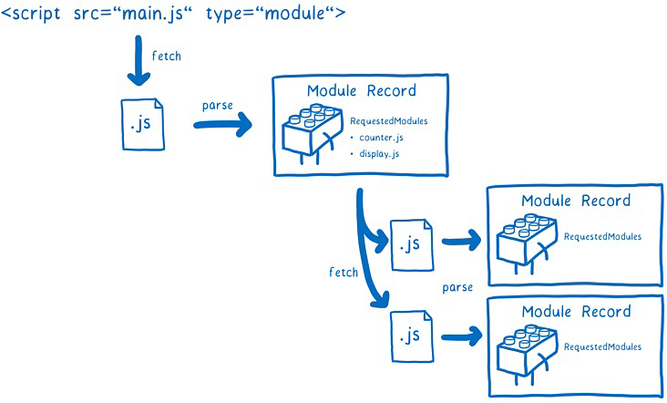 

   针对重复导入的模块，有专门的 Map 进行管理

    

2. 实例化 Instantiation

   对模块记录进行实例化，并且分配内存空间，解析模块的导入和导出语句，把模块指向对应的内存地址

3. 运行 Evaluation

   实例化阶段 & 求值阶段：运行代码，计算值，并且将值填充到内存地址中

   - `export` 在导出一个变量时会创建**模块环境记录**（module environment record）
   
   - 模块环境记录会和变量进行绑定（binding），并且这个绑定是实时的
   - 在导入的地方可以**实时的获取到绑定的最新值**的，并且在**导入的地方不可以修改变量**（其实是一个常量）
   
   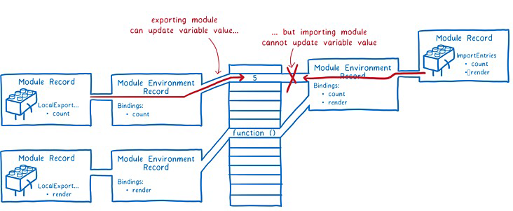 


### 与 CommonJs 互相引用

1. 在浏览器下不可以互相引用

2. 在特定的 Node 版本可以支持互相引用

3. webpack 环境，两者可以任意互相引用

   ```javascript
   // es module导出
   const name = "bar"
   const age = 100
   export { name, age }
   ```

   ```javascript
   // commonjs导入
   const bar = require("./bar")
   console.log(bar.name, bar.age)
   ```

   ```javascript
   // commonjs导出
   const name = "foo"
   const age = 18
   module.exports = { name, age }
   ```

   ```javascript
   // es module导入
   import { name, age } from './foo'
   console.log(name, age)
   ```


## npm 包管理

Node Package Manager，也就是 Node 包管理器，不仅仅是在 Node 中，在前端项目中也在使用它来管理依赖的包

npm 属于 node 的一个管理工具，所以需要先安装 Node

npm 管理的包存放在 registry 上面，安装一个包也是从 registry 上面下载

### 配置文件

#### package.json

1. 每一个项目都会有一个对应的配置文件
2. 配置文件会记录着项目的名称、版本号、项目描述等
3. 记录着项目所依赖的其他库的信息和依赖库的版本号

创建配置文件

1. `npm init -y` 所有信息使用默认的

   `npm init` 创建时填写信息

2. 通过脚手架创建项目

package.json 的常见属性

- `name`：项目的名称，必须

- `version`：当前项目的版本号，必须

- `description`：项目的基本描述

- `author`：作者相关信息（发布用）

- `license`：开源协议（发布用）

- `private`：记录当前的项目是否是私有，`true` 时，npm 不能发布这个项目

- `main`：设置程序的入口

  这个入口和 webpack 打包的入口并不冲突，是在发布模块的时候用到的

  例如 `const axios = require('axios');`，就是通过找到对应的 `main` 属性查找文件的

   

- `scripts`：用于配置一些脚本命令，以键值对的形式存在

  配置后可以通过 `npm run 命令的key` 来执行这个命令

  （对于常用的 `start`、`test`、`stop`、`restart` 可以省略掉 `run` 直接通过 `npm start` 等方式运行）

- `dependencies`：**无论开发环境还是生成环境都需要依赖的包**

  通常是项目实际开发用到的一些库模块，例如 vue、vuex、vue-router、react、react-dom、axios 等等

- `devDependencies`：只在**开发环境需要依赖的包**

  比如 webpack、babel 等

  通过 `npm install webpack --save-dev`，安装到 `devDependencies` 属性中

- `peerDependencies`：项目依赖关系是对等依赖

  也就是依赖的一个包，它必须是以另外一个宿主包为前提的

  比如 element-plus 是依赖于 vue3 的，ant design 是依赖于 react、react-dom

- `engines`：指定 Node 和 NPM 的版本号

  在安装的过程中，会先检查对应的引擎版本，如果不符合就会报错

  也可以指定所在的操作系统 `"os" : [ "darwin", "linux" ]`

- `browserslist`：配置打包后的 JavaScript 浏览器的兼容情况，为 webpack 等打包工具服务的一个属性

  （否则需要手动的添加 polyfills 来让支持某些语法）


#### package-lock.json

**package-lock.json 中记载了依赖包的真实版本**

如果项目中既有 package 也有 lock，而且 lock 的版本符合 package 的版本要求时，就会按照 lock 的版本号下载

需要重新下载最新版本就要删除掉 package-lock.json 文件再下载

package-lock.json 的常见属性

- `name`：项目的名称
- `version`：项目的版本
- `lockfileVersion`：lock 文件的版本
- `requires`：是否使用 `requires` 来跟踪模块的依赖关系
- `dependencies`：项目的依赖
  - `version`：表示实际安装的 axios 的版本
  - `resolved`：记录下载的地址，registry 仓库中的位置
  - `requires`：记录当前模块的依赖
  - `integrity`：用来从缓存中获取索引，再通过索引去获取压缩包文件


### 依赖版本管理

npm 的包的版本规范是 `X.Y.Z`

- `X` 主版本号（major）：当做了不兼容的 API 修改（可能不兼容之前的版本）
- `Y` 次版本号（minor）：当做了向下兼容的功能性新增（新功能增加，但是兼容之前的版本）
- `Z` 修订号（patch）：当做了向下兼容的问题修正（没有新功能，修复了之前版本的 bug）

**`^` 和 `~` 的区别**

- `^x.y.z`：表示 `x` 是保持不变的，`y` 和 `z` 永远安装最新的版本
- `~x.y.z`：表示 `x` 和 `y` 保持不变的，`z` 永远安装最新的版本


### npm 命令

- 全局安装

  ```bash
  npm install webpack -g
  ```

  全局安装是直接将某个包安装到全局，通常全局安装的包都是一些工具包：yarn、webpack 等

  类似于 axios、express、koa 等库文件，全局安装了之后并不等于能让所有的项目中都可以使用 axios 等库

- 项目（局部）安装

  项目安装会在当前目录下生产一个 node_modules 文件夹

  - 安装开发和生产依赖

    ```bash
    npm install axios
    npm i axios	
    ```

  - 生产依赖

    ```bash
    npm install webpack --save-dev
    npm install webpack -D
    npm i webpack –D
    ```

  - 安装 package.json 中的依赖包

    ```bash
    npm install
    ```

- `npm install` 原理

  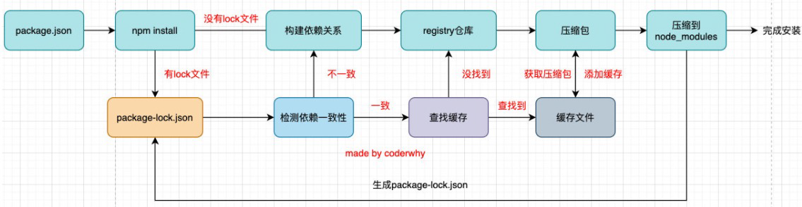 

  `npm install` 会检测是否有 package-lock.json 文件

  1. 没有 lock 文件

     1. 分析依赖关系，这是因为可能包会依赖其他的包，并且多个包之间会产生相同依赖的情况
     2. 从 registry 仓库中下载压缩包（如果设置了镜像，那么会从镜像服务器下载）
     3. 获取到压缩包后会对压缩包进行缓存
     4. 将压缩包解压到项目的 node_modules 文件夹中

  2. 有 lock 文件

     1. 检测 lock 中包的版本是否和 package.json 中一致（按照 semver 版本规范检测）

        不一致，那么会重新构建依赖关系，直接走顶层流程

     2. 一致的情况下，会去优先查找缓存

        没有找到，会从 registry 仓库下载，直接走顶层流程

     3. 查找到，会获取缓存中的压缩文件，并且将压缩文件解压到 node_modules 文件夹中

- 卸载某个依赖包

  ```bash
  npm uninstall package
  npm uninstall package --save-dev
  npm uninstall package -D
  npm uninstall package -g
  ```

- 强制重新build

  ```bash
  npm rebuild
  ```

- 清除缓存

  ```bash
  npm cache clean
  ```


### cnpm 工具

由于网络的原因，不能很好的从 https://registry.npmjs.org 上下载下来一些需要的包，可以使用 cnpm 设置为淘宝的镜像

```bash
npm install -g cnpm --registry=https://registry.npm.taobao.org
cnpm config get registry
```

也可以将 npm 设置成淘宝的镜像

查看 npm 镜像

```bash
npm config get registry
```

设置 npm 的镜像

```bash
npm config set registry https://registry.npm.taobao.org
```


### npx 工具

npx 是 npm5.2 之后自带的一个命令，使用它来**调用项目中的某个模块的指令**

例如，使用项目下的而不是全局的 webpack 来进行操作，使用 npx 会到当前目录的 node_modules/.bin 目录下查找对应的命令

```bash
# 在项目根目录下
./node_modules/.bin/webpack --version
# 等于
npx webpack --version
```


### npm 发布

- 发布包

  1. 注册 npm 账号

  2. 在命令行登录 `npm login`

  3. 修改 package.json

     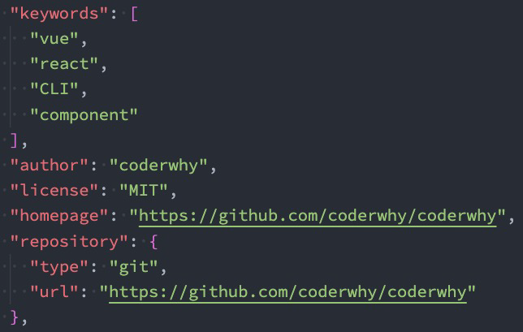 

  4. 发布到 npm registry 上 `npm publish`

- 更新仓库

  1. 修改版本号
  2. 重新发布 `npm publish`

- 删除发布的包：`npm unpublish`

- 让发布的包过期：`npm deprecate`


# DOM 树

 

- **文档**：一个页面就是一个文档，DOM 中使用 `document` 表示

- **元素**：页面中的所有**标签都是元素**，DOM 中使用 `element` 表示

- **节点**：网页中的**所有内容都是节点**（标签、属性、文本、注释等），DOM 中使用 `node` 表示

  所有的 DOM 节点类型都**继承自 `Node` 接口**

  元素 `Element` 继承于 Node ，它是所有 html 元素的基类

   

  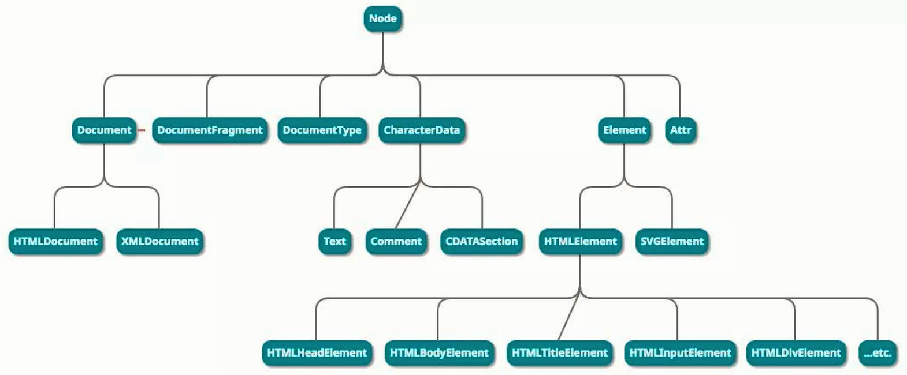 

  ```javascript
  class Node {}
  
  // document
  class Document extends Node {}
  class DocumentFragment extends Node {}
  
  // 文本和注释
  class CharacterData extends Node {}
  class Comment extends CharacterData {}
  class Text extends CharacterData {}
  
  // elem
  class Element extends Node {}
  class HTMLElement extends Element {}
  class HTMLParagraphElement extends HTMLElement {}
  class HTMLDivElement extends HTMLElement {}
  // ... 其他 elem ...
  ```

- DOM 把以上内容都看做是对象


# 元素

## 获取元素内容

### HTMLCollection

`HTMLCollection` 是元素集合，它由获取元素的 API 返回

```html
<p id="p1"><b>node</b> vs <em>element</em><!--注释--></p>
```

```javascript
const p1 = document.getElementById('p1')
console.log(p1.childNodes)
console.log(p1.childNodes instanceof HTMLCollection)
// b
// em
// true
```

- 不是数组，而是类数组

  ```javascript
  // 类数组转换为数组
  const arr1 = Array.form(list)
  const arr2 = Array.prototype.slice.call(list)
  const arr3 = [...list]
  ```


### 根据 ID 获取

`document.getElementById('id');`

- 参数 `id` 区分大小写
- 返回的是一个元素对象


### 根据标签名获取

`document.getElementsByTagName('标签名');`

- 以返回带有**指定标签名的对象的集合**
- 以伪数组的形式存储，操作里面的元素需要遍历
- 得到元素对象是动态的


### 根据类名获取

`document.getElementsByClassName(‘类名’);`

- HTML5 新增


### 根据选择器获取首个

`document.querySelector('选择器');`

- 根据指定选择器返回**第一个元素对象**
- 选择器需要加符号 `#nav` `.box`
- HTML5 新增


### 根据选择器获取所有

`document.querySelectorAll('选择器');`

- 根据指定选择器返回**所有元素对象**
- 选择器需要加符号 `#nav` `.box`
- HTML5 新增


### 获取 body 元素

`document.body`


### 获取 html 元素

`document.documentElement`


## 设置元素内容

### 元素文本内容

- 从起始位置到终止位置的内容，**去除 `<html>` 标签**， 同时**去除空格和换行**，可读写

  `element.innerText`

- 从起始位置到终止位置的内容，**保留 `<html>` 标签**， 同时**保留空格和换行**，可读写

  `element.innerHTML`


### 元素属性

如：`element.src` 、`element.href`

修改表单元素的属性操作，如：`element.type`、`element.value`、`element.checked`、`element.selected`、`element.disabled`


### 行内样式

`element.style`

JS 里面的样式采取驼峰命名法，比如 `fontSize`、 `backgroundColor`

修改 `style` 样式操作，产生的是**行内样式**


### 类名样式

`element.className`

会直接更改元素类名，**覆盖原先的类名**

因为 `class` 是个保留字，所以用 `className` 来操作元素类名属性


### 插入 DOM 树

文本解析成 HTML 插入 DOM 树中的指定位置

不会重新解析正在使用的元素，比直接使用 `innerHTML` 操作更快

`element.insertAdjacentHTML(position, text);`

- `position` 参数
  - `beforebegin`： 元素自身的前面
  
  - `afterbegin`：插入元素内部的第一个子节点之前
  - `beforeend`：插入元素内部的最后一个子节点之后
  - `afterend`：元素自身的后面

```javascript
let html = `<div id="two">two</div>`;
div.insertAdjacentHTML('beforeend', html);
```


## 元素属性操作

### 获取属性

- 获取**内置属性值**（元素本身自带的属性）,可读写

  `element.属性`

- 获取**内置属性和自定义属性**，主要获得自定义的属性

  `element.getAttribute('属性')`

  H5 规定**自定义属性要以 `data-` 开头做为属性名**

  ```html
  <div data-index="1"></div>
  ```

  ```javascript
  element.getAttribute('data-index');
  ```

- 获取**自定义属性**

  `element.dataset.自定义属性`

  `element.dataset['自定义属性']`

  `dataset` 是一个集合，存放了所有以 `data` 开头的自定义属性

  自定义属性获取时使用驼峰命名法，`-`（破折号）会被去掉

  H5 新增，ie11 才开始支持
  
  ```html
  <div data-list-name="andy"></div>
  ```
  
  ```javascript
  var listName = div.dataset.listName
  ```

 

### 设置属性

- 设置**内置属性**值

  `element.属性 = '值'`

- 设置**内置属性和自定义属性**，主要设置自定义的属性

  `div.setAttribute('属性', '值')`

  ```html
  <div data-index="1"></div>
  ```

  ```javascript
  element.setAttribute('data-index', 2);
  ```

  ```javascript
  // 这里写class，而不是className
  div.setAttribute('class', 'footer');
  ```

- 设置**自定义属性**

  `element.dataset.自定义属性 = '值'`

  `element.dataset['自定义属性'] = '值'`

  ```html
  <div data-date-of-birth>John</div>
  ```

  ```javascript
  element.dataset.dateOfBirth = '1960-10-03'; 
  ```


### 移除属性

`element.removeAttribute('属性');`

没有返回值，不能使用链式调用


## 元素类名操作

### 获取类名

`element.classList`

- 返回元素**所有的类名集合**

- ie10 以上支持


### 添加类

`element.classList.add('类名')`

- 类名不带点
- ie10 以上支持


### 移除类

`element.classList.remove('类名')`

- 类名不带点
- ie10 以上支持


### 切换类

`element.classList.toggle('类名')`

**存在**指定类名就**删除**，**不存在**就**添加**

- 类名不带点
- ie10 以上支持


## 元素偏移量 offset

`offset` 相关属性可以**动态**的得到该元素的位置（偏移）、大小

返回的数值都不带单位

`offset` 经常用于获取元素位置

`offsetHeight/offsetWidth = border + padding + content`

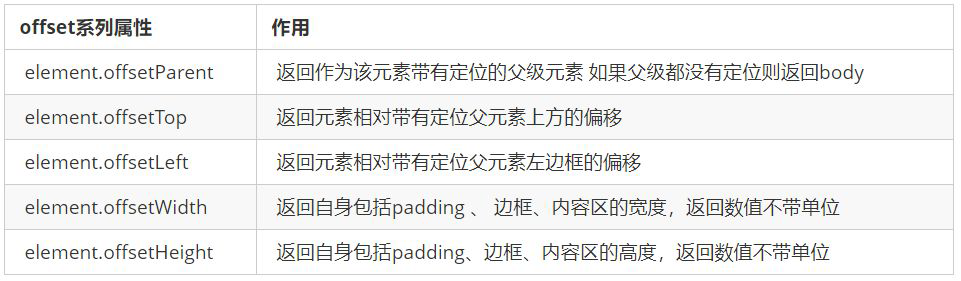 

 

- `element.offsetParent` 返回带有定位的父亲，否则返回的是 `body`
  `element.parentNode` 返回的是最近一级的父亲，不管父亲有没有定位

- `offset` 与 `style` 区别

  - `offset` **可以得到任意样式**表中的样式值

    `style` **只能得到行内样式**表中的样式值

  - `offset ` 系列获得的数值是没有单位的

    `style.width` 获得的是带有单位的字符串

  - `offsetWidth` **包含 `padding` + `border` + `width`**

    `style.width` 获得**不包含 `padding` 和 `border` 的值**

  - `offsetWidth` 等属性是**只读属性**，只能获取不能赋值

    `style.width` 是可读写属性，可以获取也可以赋值

  - 想要获取元素大小位置，用 `offset` 更合适

    想要给元素更改值，则需要用 `style` 改变


## 元素可视区 client

`clientWidth/clientHeight = padding + content`

- `client` 相关属性可以获取元素**可视区**的相关信息

   

   

  - `clientWidth` 和 `clientHeight` 获得的长度**不包含边框**

    `offsetWidth` 和 `offsetHeight` **包含边框**

     

  - `client` 经常用于获取元素大小


## 元素滚动 scroll

`scrollHeight/scrollWidth = padding + 实际内容的尺寸`

`scrollTop/scrollLeft = 滚动被卷去隐藏的距离`

- `scroll` 相关属性可以**动态**的得到该元素的大小、滚动距离等

  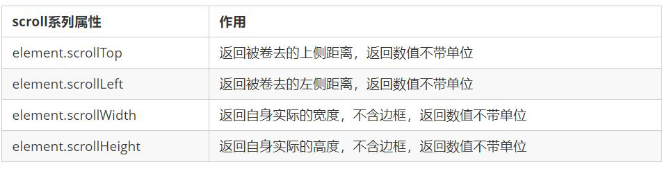 

   

  - 当滚动条向下滚动时，页面上面被隐藏掉的高度就是被卷去的头部

  - **元素被卷去的头部是** `element.scrollTop`，`element.scrollLeft`

    **页面被卷去的头部**则是 `window.pageYOffset`，`window.pageXOffset`

    - `window.pageYOffset`,`window.pageXOffset` IE9 开始支持

    - 兼容写法

      声明了 DTD，使用 `document.documentElement.scrollTop`

      未声明 DTD，使用 `document.body.scrollTop`

- ##### 滚动条滚动事件 `onscroll`

  `document.addEventListener('scroll', function(){});`


# 节点

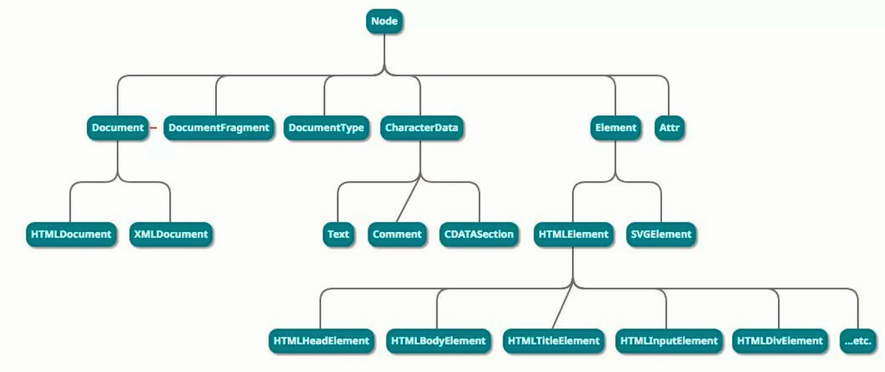

## 常见属性

### 节点名称

`var str = node.nodeName`

获取当前节点的节点名称的字符串

- 元素节点，返回元素名称，相当于 `tagName` 属性
- 文本节点，返回 `#text` 字符串

- 只读属性


### 节点类型

`var type = node.nodeType`

返回一个整数，代表这个节点的类型

- 元素节点 ，返回 1
- 文本节点，返回 3 （文本节点包含文字、空格、换行等）
- 只读属性


### 节点的值

`var str = node.nodeValue`

`node.nodeValue = str`

返回节点值的字符串

- 对于文档节点和**元素节点是不可用的**

  如果是元素节点，返回 `null`

- 文本节点，返回这个文本节点的内容

- 可读写，但不能设置元素节点的值


## 获取节点

### NodeList

`NodeList` 是节点集合，它由获取节点的 API 返回

```html
<p id="p1"><b>node</b> vs <em>element</em><!--注释--></p>
```

```javascript
const p1 = document.getElementById('p1')
console.log(p1.childNodes)
// b
// text
// em
// comment
```

- 不是数组，而是类数组

  ```javascript
  // 类数组转换为数组
  const arr1 = Array.form(list)
  const arr2 = Array.prototype.slice.call(list)
  const arr3 = [...list]
  ```


### 父节点

`parentNode = node.parentNode`

`parentElement = node.parentElement`

返回**最近的一个父节点**

- 如果指定的节点没有父节点则返回 `null`

- `parentNode` 找的是节点，可能是元素节点，也可能是文档节点或者 `DocumentFragment` 节点

  当找到根部 `document` 时候就返回 `#document`

- `parentElement` 找的是元素

  当找到根部 `document` 时候就是出现值为 `null` 的报错


### 最近祖先元素

`var closestElement = element.closest('选择器');`

如果找到匹配的祖先，**返回最接近的元素**，找不到，返回 `null`

- 选择器可以使用复合选择器，如 `p:hover, .toto + q`

- IE 不支持


### 子节点集合

`var ndList = parentNode.childNodes`

返回包含指定节点的**子节点的集合**，该集合为**即时更新的集合**

- 返回值里面包含了所有的子节点，包括**元素节点，文本节点**等

- 如果只想要获得里面的元素节点，需要专门处理，所以不提倡使用 `childNodes`

  ```javascript
  var ul = document.querySelector('ul');
  for(var i = 0; i < ul.childNodes.length;i++) {
  	if (ul.childNodes[i].nodeType == 1) {
  	// ul.childNodes[i] 是元素节点
  	console.log(ul.childNodes[i]);
  	}
  }
  ```


### 子元素节点集合

`var elList = parentNode.children`

**返回所有的子元素节点**，其余节点不返回

- 只读属性
- 非标准，但是得到了各个浏览器的支持，放心使用


### 首个子节点

`var childNode = parentNode.firstChild`

返回第一个子节点，找不到则返回 `null`

- 包含所有类型节点


### 最后子节点

`var childNode = parentNode.lastChild`

返回最后一个子节点，找不到则返回 `null`

- 包含所有类型节点


### 首个子元素节点

`var element = parentNode.firstElementChild`

返回第一个子元素节点，找不到则返回 `null`

- IE9 以上支持

`var element = parentNode.children[0]`

- 没有兼容问题


### 最后子元素节点

`var element = parentNode.lastElementChild`

返回最后一个子元素节点，找不到则返回 `null`

- IE9 以上支持

`var element = parentNode.children[parentNode.children.length - 1]`

- 没有兼容问题


### 下个兄弟节点

`var nextNode = node.nextSibling`

返回下一个兄弟节点，找不到则返回 `null`

- 包含所有类型节点


### 上个兄弟节点

`var previousNode = node.previousSibling`

返回上一个兄弟节点，找不到则返回 `null`

- 包含所有类型节点


### 下个兄弟元素节点

`var nextNode = node.nextElementSibling`

返回下一个兄弟元素节点，找不到则返回 `null`

- IE9 以上支持

返回下一个兄弟元素节点函数

```javascript
function getNextElementSibling(element) {
	var el = element;
	while (el = el.nextSibling) {
		if (el.nodeType === 1) {
			return el;
		}
	}
	return null;
}
```

- 没有兼容问题


### 上个兄弟元素节点

`var previousNode = node.previousElementSibling`

返回上一个兄弟元素节点，找不到则返回 `null`

- IE9 以上支持

返回上一个兄弟元素节点函数

```javascript
function getPreviousElementSibling(element) {
	var el = element;
	while (el = el.previousSibling) {
		if (el.nodeType === 1) {
			return el;
		}
	}
	return null;
}
```

- 没有兼容问题


## 操作节点

### 创建元素节点

`var element = document.createElement('tagName')`

创建指定的 HTML 元素

- 创建多个元素效率稍低，但是结构更清晰


### 创建元素

`document.write('字符串')`

直接将内容写入页面的内容流，但是**文档流执行完毕，再调用这句话会导致页面全部重绘**

```javascript
document.write('<div>123</div>')
```

`element.innerHTML = '字符串'`

将内容写入某个 DOM 节点，**不会导致页面全部重绘**

- 创建多个元素效率更高（不要拼接字符串，采取数组形式拼接），结构稍微复杂


### 末尾添加节点

`node.appendChild(child)`

一个节点（通常为元素）添加到**指定父节点的子节点列表末尾**

- 类似于 CSS 里面的 `after` 伪元素。 类似于数组的 `push`


### 前面添加节点

`node.insertBefore(child, 指定元素)`

一个节点添加到**父节点的指定子节点前面**


### 删除节点

` var oldChild = node.removeChild(child)`

从 DOM 中删除一个子节点，返回删除的节点


###  复制节点

`node.cloneNode()`

- 返回调用该方法的节点的一个副本
- 括号参数为空或者为 `false` ，则是浅拷贝，即只克隆复制节点本身，不克隆里面的子节点
- 括号参数为 `true` ，则是深度拷贝，会复制节点本身以及里面所有的子节点


# 事件

**事件三要素**

1. 获取事件源
2. 绑定事件类型
3. 添加事件处理程序


## 注册事件

- 传统注册

  `on` 开头事件注册

  ```html
  <button onclick=“alert('hi~')”></button>
  ```

  ```javascript
  btn.onclick = function() {}
  ```

  **注册事件的唯一性**：同一个元素同一个事件只能设置一个处理函数，最**后注册**的处理函数将**会覆盖前面注册**的处理函数

- 方法监听注册

  `eventTarget.addEventListener(type, listener[, useCapture])`

  - `type` 事件类型**字符串**，比如 `click` 、`mouseover` ，**不要带 `on`**

  - `listener` 事件处理函数

  - `useCapture` 是否为捕获监听器，可选参数 
  
    如果是 `true`，表示在**事件捕获阶段调用**事件处理程序
  
    如果是 `false` 或者 空，表示在**事件冒泡阶段调用**事件处理程序
  
  同一个元素同一个事件**可以注册多个监听器**，按注册顺序依次执行
  
  IE9 之前不支持此方法，可使用 `attachEvent()` 代替


## 删除事件

- 传统删除

  `eventTarget.onclick = null;`

- 方法监听删除

  `eventTarget.removeEventListener(type, listener[, useCapture]);`

  - `type` 要移除的事件类型**字符串**
  - `listener` 要移除的事件处理函数
  - `useCapture` 是否为捕获监听器，可选参数 

  IE9 之前 `eventTarget.detachEvent(eventNameWithOn, callback);`


## DOM 事件流

事件发生时会在元素节点之间按照特定的顺序传播，这个传播过程即 DOM 事件流

**DOM 事件流分为 3 个阶段**：

1. 捕获阶段

   由 DOM 最顶层节点开始，然后**逐级向下传播**到最具体的元素接收的过程

2. 当前目标阶段

3. 冒泡阶段

   事件开始时由最具体的元素接收，然后**逐级向上传播**到 DOM 最顶层节点的过程

JS 代码中**只能执行捕获或者冒泡其中的一个阶段**

- `onclick ` 和 `attachEvent ` 只能得到冒泡阶段
- 有些事件没有冒泡，比如 `onblur`、`onfocus`、`onmouseenter`、`onmouseleave`
- 实际开发中很少使用事件捕获，更关注事件冒泡

DOM 事件流图解：给一个`div` 注册了点击事件

（下图补充：在 `document` 前，最先捕获的是 `window`）

   

> 我们向水里面扔一块石头，首先它会有一个下降的过程，这个过程就可以理解为从最顶层向事件发生的最具体元素（目标点）的捕获过程；之后会产生泡泡，会在最低点（ 最具体元素）之后漂浮到水面上，这个过程相当于事件冒泡

```html
<div class="father">
  <div class="son">
    son盒子
  </div>
</div>
```

```javascript
// 捕获阶段 addEventListener 第三个参数为true
// 顺序 document->html>body->father->son
var son = document.querySelector('.son');
son.addEventListener('click', function(){
  alert('son');
}, true);
var father = document.querSelector('.father');
father.addEventListener('click', function(){
  alert('father') 
}, true);
// 点击结果 father->son

// 冒泡阶段 addEventListener 第三个参数为false或者空
// 顺序 son->father->body->html->document
var son = document.querySelector('.son');
son.addEventListener('click', function(){
  alert('son');
}, false);
var father = document.querSelector('.father');
father.addEventListener('click', function(){
  alert('father') 
}, false);
// 点击结果 son->father
```


## 事件对象 Event

`event` 对象代表事件的状态，比如键盘**按键的状态**、**鼠标的位置**、鼠标**按钮的状态**

事件发生后，**跟事件相关的一系列信息数据的集合**都放到这个对象里面，这个对象就是事件对象 `event`，它有很多属性和方法，比如：

1. 谁绑定了这个事件
2. 鼠标触发事件的话，会得到鼠标的相关信息，比如鼠标位置
3. 键盘触发事件的话，会得到键盘的相关信息，比如按了哪个键

```javascript
// 这个 event 就是事件对象，我们还喜欢的写成 e 或者 evt
eventTarget.onclick = function(event) {}
eventTarget.addEventListener('click', function(event) {}）
```

`event `是个**形参**，系统帮我们设定为事件对象，不需要传递实参过去

当注册事件时， `event` 对象就会被系统自动创建，并依次传递给事件监听器（事件处理函数）

兼容问题：IE6~8 浏览器不会给方法传递参数，使用 `window.event` 获取

解决：`e = e || window.event;`

- 触发事件的对象 `e.target`

  `e.target` 和 `this` 的区别

  - `this` 是事件绑定的元素， 这个函数的调用者（**绑定这个事件的元素**）
  - `e.target` 是**事件触发的元素**
  - `e.target` 返回的是**触发事件**(点击)的对象，`this` 返回的是**绑定事件**(绑定点击)的对象

  ```html
  <ul>
    <li>abc</li>
  </ul>
  ```

  ```javascript
  var ul = document.querySelector('ul');
  ul.addEventListener('click', function(e){
    // 给ul绑定了事件，this指向的是ul
    console.log(this); 
  
    // 点击的是li，e.target指向的就是li
    console.log(e.target);
  });
  ```

  `currentTarget` 表示当前绑定的对象

  `currentTarget` 和 `this` 非常相似，但是 IE6~8 不兼容，IE6~8 使用 `e.srcElement`

- 返回事件类型 `e.type`

  返回事件的类型，比如 `click`，`mouseover` 不带 `on`

- 阻止默认事件 `e.preventDefault()`

  比如**阻止链接跳转**，**阻止提交按钮提交**

  IE6~8 使用 `e.returnValue`

- 阻止事件冒泡 `e.stopPropagation()`

  IE6~8 使用 `e.cancelBubble = true`
  
-  阻止剩下的事件处理程序被执行 `event.stopImmediatePropagation()`

  ```javascript
  div.addEventListener("click" , function(){
    alert("第一次执行");
    stopImmediatePropagation();
  } , true);
  div.addEventListener("click" , function(){
    alert("第二次执行");
  } , true); 
  // 点击div，第二次执行不会触发
  ```


## 事件委托

事件委托的原理：**不在每个子节点单独设置事件监听器**，而是**事件监听器设置在其父节点上**，然后**利用冒泡**原理**影响设置每个子节点**

1. 一个或者一组元素的事件委托到它的父层或者更外层元素上，真正绑定事件的是外层元素

2. 当事件响应到需要绑定的元素上时，会通过事件冒泡机制从而触发它的外层元素的绑定事件上
3. 然后在外层元素上去执行函数

 

例如 `ul` 中有许多 `li`，如果给每个 `li` 注册事件，多次操作 DOM 会影响性能，同时有利于动态绑定事件

给 `ul` 注册点击事件，然后利用事件对象的 `target` 来找到当前点击的 `li`，因为点击 `li`，事件会冒泡到 `ul` 上

`ul` 有注册事件，就会触发事件监听器，只操作了一次 DOM ，提高了程序的性能，减少内存消耗

```html
<ul id="list">
  <li>item 1</li>
  <li>item 2</li>
  <li className="class-1">item 3</li>
  ......
  <li>item n</li>
</ul>
```

```javascript
// #list 下的 li 元素的事件代理委托到它的父层元素也就是 #list 上
document.getElementById('list').addEventListener('click', function (e) {
  // 兼容性处理
  var event = e || window.event;
  var target = event.target || event.srcElement;
  // 判断是否匹配目标元素
  if (target.nodeName.toLocaleLowerCase === 'li') {
    console.log('the content is: ', target.innerHTML);
  }
  // 使用Element.matches精确匹配
  if (target.matches('li.class-1')) {
    console.log('the content is: ', target.innerHTML);
  }
});
```


## 鼠标事件

常用的鼠标事件

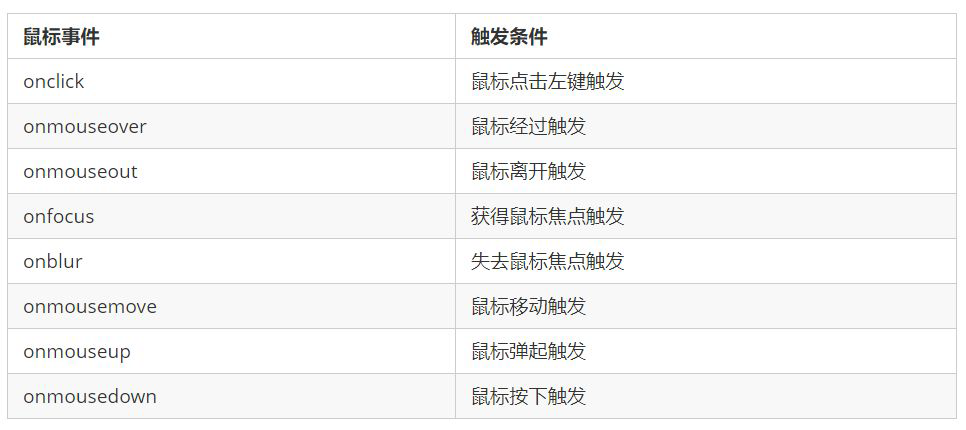 

- 禁止鼠标右键菜单，取消默认的上下文菜单

  ```javascript
  // contextmenu 控制何时显示上下文菜单 
  // 取消默认的上下文菜单
  document.addEventListener('contextmenu', function(e) {
    e.preventDefault();
  })
  ```

- 禁止鼠标选中

  ```javascript
  // selectstart 开始选中
  document.addEventListener('selectstart', function(e) {
  	e.preventDefault();
  })
  ```

- `mouseenter` 和 `mouseover` 的区别

  鼠标移动到元素上时就会触发 `mouseenter` 事件

  - `mouseover` 鼠标**经过自身盒子会触发，经过子盒子还会触发**
  - `mouseenter` 只会**经过自身盒子触发**， **不会冒泡**，鼠标离开 `mouseleave` 同样不会冒泡

- 双击事件 `ondblclick`

- 禁止双击选中文字

  `window.getSelection ? window.getSelection().removeAllRanges() : document.selection.empty();`

- ##### 鼠标事件对象 `MouseEvent`

  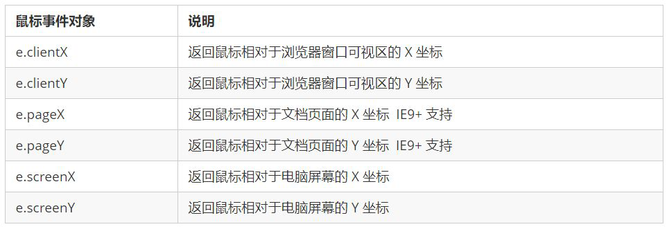 

   

  - 图片跟随鼠标移动

    ```html
    
    ```

    ```css
    /* 图片要移动距离，而且不占位置，使用绝对定位 */
    img {
      position: absolute;
      top: 2px;
    }
    ```

    ```javascript
    var pic = document.querySelector('img');
    // 鼠标不断的移动，使用鼠标移动事件： mousemove
    // 在页面中移动，给document注册事件
    document.addEventListener('mousemove', function(){
      // 每次鼠标移动，我们都会获得最新的鼠标坐标， 把这个x和y坐标做为图片的top和left 值就可以移动图片
      var x = e.pageX;
      var y = e.pageY;
      // 要给left和top添加px单位
      // 鼠标移到到图片的中心，往上移到图片高度一半，往左移到图片宽度一半
      pic.style.left = x - 50 + 'px';
      pic.style.top = y - 40 + 'px';
    });
    ```


## 键盘事件

常用键盘事件

 

- 三个事件的执行顺序是： `keydown` -> `keypress` -> `keyup`
- `keydown` 和 `keypress` 在文本框里面时，事件触发的时候，**文字还没有落入文本框中**
- `keyup` 事件触发的时候， 文字已经落入文本框里面了

- 键盘事件对象

   

  `onkeydown` 和  `onkeyup` 不区分字母大小写，A 和 a 得到的都是 65

  `onkeypress` 区分字母大小写


## 触摸事件

常用触摸事件

 

- ##### 触摸事件对象

   

- ##### 移动端 `click` 事件延时

  移动端 `click` 事件会有 300ms 的延时，原因是移动端屏幕双击会缩放(double tap to zoom) 页面

  系统会等待 300ms 检查是否是单机事件

  解决方案：

  - 禁用缩放，浏览器禁用默认的双击缩放行为并且去掉 300ms 的点击延迟

    `<meta name="viewport" content="user-scalable=no">`

  - 利用 `touch` 事件自己封装这个事件解决 300ms 延迟

    - 当手指触摸屏幕，记录当前触摸时间
    - 当手指离开屏幕， 用离开的时间减去触摸的时间
    - 如果时间小于150ms，并且没有滑动过屏幕， 那么我们就定义为点击
  
  ```javascript
  //封装tap，解决click 300ms 延时
  function tap (obj, callback) {
    var isMove = false;
    var startTime = 0; // 记录触摸时候的时间变量
    obj.addEventListener('touchstart', function (e) {
      startTime = Date.now(); // 记录触摸时间
    });
    obj.addEventListener('touchmove', function (e) {
      isMove = true; // 看看是否有滑动，有滑动算拖拽，不算点击
    });
    obj.addEventListener('touchend', function (e) {
      if (!isMove && (Date.now() - startTime) < 150) { // 如果手指触摸和离开时间小于150ms 算点击
        callback && callback(); // 执行回调函数
      }
      isMove = false; // 取反 重置
      startTime = 0;
    });
  } 
  //调用
  tap(div, function(){ 
    // 执行代码
  });
  ```

  - 使用 fastclick 插件


## 拖拽事件

- `dragstart`：事件主体是**被拖放元素**，在**开始拖放**被拖放元素时触发
- `darg`：事件主体是**被拖放元素**，在**正在拖放**被拖放元素时触发
- `dragenter`：事件主体是**目标元素**，在**被拖放元素进入**某元素时触发
- `dragover`：事件主体是**目标元素**，在**被拖放元素在某元素内移动**时触发
- `dragleave`：事件主体是**目标元素**，在**被拖放元素移出**目标元素是触发
- `drop`：事件主体是**目标元素**，在**目标元素完全接受**被拖放元素时触发
- `dragend`：事件主体是**被拖放元素**，在整个**拖放操作结束**时触发


## 自定义事件

```javascript
// Event 只能指定事件名
// CustomEvent 可以指定事件参数
var eve = new Event('custom');
ev.addEventListener('custom', function() {
  console.log('custom');
})
// 自定义事件触发
ev.dispatchEvent(eve);
```


# 浏览器对象

## window 对象

`window` 对象是浏览器的顶级对象，它具有**双重角色**

1. 窗口对象，JS 访问浏览器窗口的一个接口

    

   - `window`：包括全局属性、方法，控制浏览器窗口相关的属性、方法
   - `document`：当前窗口操作文档的对象
   - `location`：浏览器连接到的对象的位置（URL）
   - `navigator`：浏览器信息
   - `screen`：屏幕窗口信息
   - `history`：操作浏览器的历史

   `window` 窗口对象包含的内容

   1. 属性：`localStorage`、`console`、`location`、`history`、`screenX`、`scrollX` 等
   2. 方法：`alert`、`prompt`、`close`、`scroll`、`scrollTo`、`open` 等
      - `scroll(x, y)` 滚动窗口至文档中的特定位置，x 和 y 不跟单位，直接写数字
   3. 事件：`focus`、`blur`、`load`、`hashchange` 等等
   4. 从 `EventTarget` 继承来的方法：`addEventListener`、`removeEventListener`、`dispatchEvent`

2. 全局对象，也就是 GO 对象

   定义在**全局作用域**中的变量、函数都会变成 `window` 对象的属性和方法

   默认提供的全局的函数和类：`setTimeout`、`Math`、`Date`、`Object` 等，调用的时候可以省略 `window`


## location 对象

`location` 对象用于表示当前链接到的 URL 信息，`location` 其实是 URL 的一个抽象实现

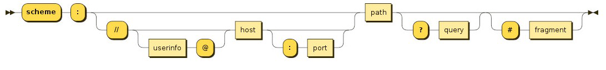 

### 常见属性

- `location.href`：获取或设置整个 URL，设置 `location.href` 可以跳转页面

- `location.protocol`：当前的协议（http、https）

- `location.host`：主机地址（域名，如 www.baidu.com，带端口）

- `location.hostname`：主机地址(不带端口)

- `location.origin`：URL 的协议、主机名和端口号（如 https://www.baidu.com ）

- `location.port`：端口号

- `location.pathname`：路径

- `location.search`：返回 URL 中查询字符串部分

- `location.hash`：哈希值（ `#` 后面的内容） 


### 常见方法

- `location.assign()`：赋值一个新的 URL，并且跳转到该 URL 中（**重定向页面**）

  ```javascript
  location.assign("http://www.baidu.com")
  // 等于
  location.href = "http://www.baidu.com"
  ```

- `location.replace()`：替换当前页面（**不记录历史**，无法后退页面）

  ```javascript
  location.replace("http://www.baidu.com")
  ```

- `location.reload()`：重新加载页面，相当于刷新按钮或 f5，参数是 `true` 则强制刷新 ctrl+f5


## history 对象

`history` 对象允许访问浏览器曾经的会话历史记录

### 常见属性

- `history.length`：会话中的记录条数

- `history.state`：当前保留的状态值


### 常见方法

- `history.go()`：加载历史中的某一页

- `history.back()`：返回上一页，等价于 `history.go(-1)`

- `history.forward()`：前进下一页，等价于 `history.go(1)`

- `history.pushState()`：打开一个指定的地址（网页不会刷新，不会请求资源，会保存历史）

  可以监听路径的改变，匹配加载相对应的组件进行渲染

  `history.pushState(state, title[, url])`

  - `state`：状态对象
  - `title`：网页标题，大部分浏览器不支持
  - `url`：跳转的网页

  ```javascript
  // 不会真实跳转detail.html页面，也不会检测detail.html页面是否存在
  history.pushState({name: "demo"}, "", "/detail")
  console.log(history.state);
  // {name: "demo"}
  ```

- `history.replaceState()`：打开一个指定的地址（网页不会刷新，不会请求资源，会替换掉之前页面的历史记录）


## navigator 对象

`navigator` 对象用它来查询当前浏览器的相关信息

- `navigator.userAgent`：返回当前浏览器的用户代理信息 (包括浏览器版本信息等的字符串)

  判断用户在哪个终端打开页面，实现跳转

  ```javascript
  if((navigator.userAgent.match(/(phone|pad|pod|iPhone|iPod|ios|iPad|Android|Mobile|BlackBerry|IEMobile|MQQBrowser|JUC|Fennec|wOSBrowser|BrowserNG|WebOS|Symbian|Windows Phone)/i))) {
    window.location.href = ""; //手机
  } else {
    window.location.href = ""; //电脑
  }
  ```

- `navigator.cookieEnabled`：返回浏览器是否支持(启用) cookie


# 浏览器事件

- 窗口加载事件(完全加载完成)

  ```javascript
  window.onload = function(){}
  window.addEventListener("load", function(){});
  ```

  - `window.onload` 是窗口（页面）加载事件，当**文档内容完全加载完成**会触发该事件(包括图像、脚本文件、CSS 文件等)
  - 因为 `onload` 是等页面内容全部加载完毕，再去执行处理函数，所以 JS 代码可以**写到页面元素的上方**
  - `window.onload` 传统注册事件方式是只能写一次，如果有多个，会以最后一个 `window.onload` 为准
  - 如果使用 `addEventListener` 来注册 `load` 则没有限制
  - `<a>` 标签的超链接，F5 或者刷新按钮（强制刷新），前进后退按钮都会触发 `load` 事件

- 窗口加载事件( DOM 加载完成)

  ```javascript
  document.addEventListener('DOMContentLoaded', function(){})
  ```

  - `DOMContentLoaded` 事件触发时，**仅当 DOM 加载完成**，不包括样式表，图片，flash 等等
  - Ie9 以上才支持

- 重新加载页面

  ```javascript
  window.addEventListener("pageshow", function(){});
  ```

  - `pageshow `和 `load` 的区别

    - 火狐浏览器中有个“往返缓存”特点，这个缓存中不仅保存着页面数据，还保存了 DOM 和 JavaScript 的状态。

      实际上是将整个页面都保存在了内存里。所以此时后退按钮不能刷新页面。

    - `pageshow` 在**页面显示时触发**，**无论页面是否来自缓存**

    - 重新加载页面中，`pageshow` 会在 `load` 事件触发后触发

  - `persisted` 属性用来判断**是否是缓存**中的页面触发

- 调整窗口大小事件

  ```javascript
  window.onresize = function(){}
  window.addEventListener("resize", function(){});
  ```

  - 只要**窗口大小发生像素变化**，就会触发这个事件
  - 可以利用这个事件完成响应式布局，`window.innerWidth` 当前屏幕的宽度


# 浏览器函数

> requestIdleCallback 允许开发者请求浏览器在主线程空闲时执行一些低
> 优先级的后台任务，这对于执行如分析、整理状态和数据等不紧急的任务是理想的。这种方法可以提
> 高用户的响应性和页面的整体性能。


# 浏览器渲染

## 浏览器渲染过程

1. 构建 DOM 树

   渲染引擎解析 HTML 文档，首先将**标签**转换成 DOM 树中的 **DOM 节点**（包括 js 生成的标签）生成**内容树** (content tree / DOM tree)

2. 构建渲染树

   解析对应的 **CSS 样式**信息（包括 js 生成的样式，外部 css 文件，带有样式的 HTML 标签）构建**渲染树** (rendering tree)

   渲染树中每个节点都有自己的 `style`

   渲染树**不包含隐藏的节点** ( `display: none` 的节点) 和 `head` 节点，因为这些节点不会显现

3. 布局渲染树

   从根节点递归调用，计算每一个元素的**大小，位置**等

   给出每个节点所应该在屏幕上出现的精准**坐标**

4. 绘制渲染树

   遍历渲染树，使用 UI 层来绘制每个节点

   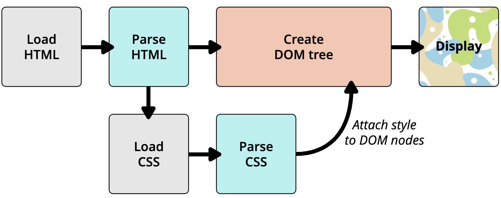 


## 重绘

- 当**盒子的位置**，**大小**以及其他属性，例如**颜色**，**字体大小**等都确定下来以后，浏览器会按照各自的特性绘制一遍，将内容呈现
- 重绘是指**元素外观的改变**，触发了浏览器根据元素的新属性**重新绘制**的行为，使元素呈现新的外观
- 触发重绘的条件：**改变元素外观属性**，如：`color`，`background-color` 等

- `table` 及其内部元素可能需要**多次计算才能确定**好其在渲染树中节点的属性值，比同等元素要多花两倍时间

  尽量避免使用 `table` 布局


## 重排

重排又称为回流，重构

- 当渲染树的一部分或全部，因为元素的**规模尺寸**，**布局**，**隐藏**等改变而需要重新构建，这称为重排

- 每个页面至少需要一次重排，就是页面第一次加载的时候

- **重排必定会引发重绘**，但重绘不一定会引发重排

  在重排的时候，浏览器会使渲染树中受到影响的部分失效，并重新构建这部分的渲染树

  完成重排后，浏览器会重新绘制受影响的部分到屏幕，该过程发生重绘

- 触发重排的条件：任何**页面布局**和**几何属性**的改变都会触发重排

  1. 页面渲染**初始化**（无法避免）

  2. 添加或删除可见的 **DOM 元素**

  3. 元素**位置改变**，或者使用**动画**

  4. **元素尺寸改变**——大小，外边距，边距

  5. 浏览器**窗口**尺寸的变化（ `resize` 事件发生时）

  6. 填充**内容改变**，比如文本数量和图片大小改变而引起的**计算值宽度和高度的改变**

  7. **查询读取**某些元素属性

     - `offsetLeft` / `offsetTop` / `offsetHeight` / `offsetWidth`
     - `clientTop` / `clientLeft` / `clientHeight` / `clientWidth`
     - `scrollTop` / `scrollLeft` / `scrollWidth` / `scrollHeight`
     - `width` / `height`
     - `getComputedStyle()`，`currentStyle`

     当用 js 操作 DOM 的时候，浏览器并不是立马执行的，而是将操作存储在一个队列中

     当到达一定数量或者时间时，浏览器才会统一执行队列中的操作

     当**查询这些属性时，浏览器就会强制刷新队列**，如果不立马执行队列中的操作，有可能得到的结果是错误的

     如果之前没有改变几何元素，获取 `offset` 等属性也不会产生重排


## 渲染优化

重绘重排的代价：耗时，浏览器卡慢

- 浏览器优化

  浏览器会维护一个队列，会把所有会引起重排、重绘的操作放入这个队列

  等队列中的操作到了一定的数量或者到了一定时间后，浏览器就会自动 flush 队列，进行一个批处理

  这样就能让多次重绘重排变成一次重绘重排

- 代码优化

  - 要减少对渲染树的操作，合并多次 DOM 和样式的修改，减少对 `style` 样式的请求

    ```javascript
    // 合并多次操作
    element.style.cssText = 'border-left: 1px; border-right: 2px; padding: 5px;';
    ```

  - 直接**改变元素的 `className`**

  - 先设置元素为 `display: none` ，然后进行页面布局等操作

    完成操作后将元素设置为 `display: block`，这样只会引发两次重绘和重排

  - 使用 `cloneNode` 和 `replaceChild`，引发一次重绘和重排

  - 将需要多次重排的元素，**`position` 属性设置成 `absolute` 或 `fixed`**

    元素**脱离了文档流**，它的**变化不会影响到其他元素**

  - 如果需要创建多个 DOM 节点，可以使用 `DocumentFragment` 创建完后一次性的加入 document

    ```javascript
    // 不要循环渲染，建议使用DocumentFragment
    var fragment = document.createDocumentFragment();
    for (let i = 0; i < 1000; i++) {
      var li = document.createElement('li');
      li.innerHtml = 'apple' + i;
      fragment.appendChild(li);
    }
    document.getElementById('fruit').appendChild(fragement);
    ```

  - `offset` 之类的属性**读取注意顺序**

    ```javascript
    // 产生了四次重排
    var div = document.querySelector("#test");
    div.style.left = '200px';
    console.log(div.offsetLeft);
    div.style.left = '100px';
    console.log(div.offsetLeft);
    div.style.left = '200px';
    console.log(div.offsetLeft);
    div.style.left = '100px';
    console.log(div.offsetLeft);
    ```

    ```javascript
    // 只发生了一次重排
    var div = document.querySelector("#test");
    div.style.left = '200px';
    div.style.left = '100px';
    div.style.left = '200px';
    div.style.left = '100px';
    console.log(div.offsetLeft);
    console.log(div.offsetLeft);
    console.log(div.offsetLeft);
    console.log(div.offsetLeft);
    ```


## 重绘回调

`requestAnimationFrame` 回调是在**浏览器将 DOM 转换为屏幕上的图像之前执行的最后一段代码**，浏览器在**浏览器在重绘 DOM 之前立即执行回调**

- 回调是在前一帧完全完成时被调用的——**回调可以快速地读取所有页面元素的尺寸和坐标，而无需同步重排**

  > 工作中的典型例子是显示一个巨大的表单，其中每个文本区域的全部内容都是可见的
  >
  > 如果在文本区域被绘制之前调整其高度，整个页面会因为不及时的布局计算而在几秒钟后才被绘制

  `requestAnimationFrame` 指示浏览器**在重绘 DOM 之前立即执行一个回调**，该方法**确保回调引入的任何对 DOM 的更改将在下一个帧中显示**

  ```html
  <div id="root"></div>
  ```

  同一线程执行 JavaScript 并渲染 DOM，**浏览器不能同时执行 JavaScript 和绘制**

  **为了让用户看到 DOM 中的任何更改，JavaScript 代码执行必须有中断**

  ```javascript
  // 看不到任何内容
  while (true){
  root.innerHTML='Timeout'
  }
  ```

  可以看到插入到 DOM 中的消息，因为**浏览器在通过 `setTimeout()` 插入到任务队列的回调之间有机会进行绘制**

  安排代码在延迟后执行是 `setTimeout()` 的一个次要功能，主要功能是将任务添加到与其他任务共享的队列中，以便浏览器保持响应

  ```javascript
  function timeout() {
  root.innerHTML='Timeout'
  setTimeout(timeout);
  }
  ```

- `requestAnimationFrame` **回调执行之间的时间大概是 17 毫秒**

  浏览器在用户屏幕上重绘 DOM 的速率不超过每秒 60 帧，并且只有在有内容需要重绘时才会进行

  这意味着 `requestAnimationFrame()` 的回调不会频繁于每秒 60 次，换句话说，不会频繁于每 1/60=17 毫秒

- **`setTimeout` 的回调比 `requestAnimationFrame` 的回调执行得更频繁**

  `setTimeout` 的回调频率是 `requestAnimationFrame` 回调的三倍

  ```html
  <div id="root"></div>
  ```

  ```javascript
  let previous = {};
  function log(method) {
  const now = Date.now();
  console.log(method,now - previous[method]);
  previous[method] = now;
  }
  function frame() {
  log("frame");
  root.innerHTML='Frame'
  requestAnimationFrame(frame);
  }
  function timeout() {
  log("timeout");
  root.innerHTML='Timeout'
  setTimeout(timeout);
  }
  timeout();
  frame();
  ```

  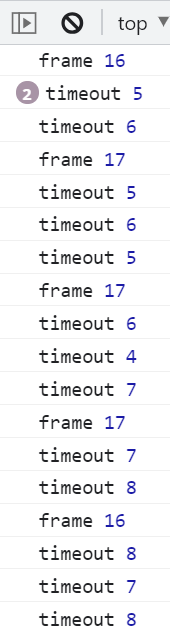  最多可以**在每秒 60 帧的最大速率下，在两次重绘之间会插入三个 `setTimeout` 回调**

- **`requestAnimationFrame`** 的回调函数会接收一个参数  `timestamp`，表示自网页加载以来经过的时间（毫秒）

  可以**利用这个时间戳来计算动画的进度**，从而实现平滑的动画效果

  通过**比较当前的 `timestamp` 和初始的时间戳，可以确定动画应该进行到哪个位置**

  > `requestAnimationFrame` 并不保证 60FPS 动画，它只是一种避免丢帧和提高效率的方法

  ```javascript
  var element = document.getElementById('box');
  var startTime;
  var duration = 1000; // 1 second or 1000ms
  var distance = 60; // 60FPS
  
  var rAFCallback = function(timestamp){
    startTime = startTime || timestamp; // set startTime is null
  
    var timeElapsedSinceStart = timestamp - startTime;
    var progress = timeElapsedSinceStart / 1000;
  
    // 1 == 100%
    var safeProgress = Math.min(progress.toFixed(2), 1); // 2 decimal points
  
    // 计算在时间上取得了多少 progress，并将其乘以 60px，得到 DOM 元素在下一次绘制操作时应该有多少像素
    var newPosition = safeProgress * distance;
  
    element.style.transform = 'translateX('+ newPosition + 'px)';
  
    // we need to progress to reach 100%
    if (safeProgress != 1){
      requestAnimationFrame(rAFCallback);
    }
  }
  
  // request animation frame on render
  requestAnimationFrame(rAFCallback);
  ```

-  `requestAnimationFrame` 相比 `setInterval` 或 `setTimeout` 的优点

  - `setInterval` 不能保证在给定的延迟 `n` 时被调用，回调函数总是阻塞的，如果网页正忙于做其他事情，那么这个回调必须等到**堆栈为空**

    回调函数的执行时间可能会超过指定的延迟

    ```javascript
    var element = document.getElementById('box');
    var left = 0;
    
    var animateCallback = function() {
      element.style.marginLeft = (++left) + 'px';
      // clear interval after 60 frame is moved
      if (left == 60) {
        clearInterval(interval);
      }
    }
    // 回调函数的执行时间可能会超过指定的 16.7ms 延迟
    // 动画运行 1 秒以上（但回调执行 60 次），但不会达到 60FPS
    var interval = setInterval(animateCallback, (1000 / 60));
    ```

  - 当浏览器标签页处于**非活动状态时，`requestAnimationFrame` 会暂停动画，阻止回调函数的执行**，这样可以节省系统电池并保持动画的状态

  -  `requestAnimationFrame` 唯一限制是其非确定性


# HTTP 请求

## XMLHttpRequest

- `XMLHttpRequest` 是一个构造函数，可以使用 `new` 命令生成实例

  ```javascript
  var xhr = new XMLHttpRequest();
  ```

- 尽管名字里面有 `XML` 和 `Http`，实际上可以使用多种协议（比如 `file` 或 `ftp` ），发送任何格式的数据（包括字符串和二进制）

- 使用 `open()` 方法指定建立 HTTP 连接

  ```javascript
  // 参数1：HTTP 方法
  // 参数2：请求URL
  // 参数3：是否异步，可选，默认true
  xhr.open('GET', 'http://www.example.com/page.php', true);
  ```

- 使用 `onreadystatechange` 监听通信状态 `readyState` 属性变化

  ```javascript
  xhr.onreadystatechange = function () {
    if (xhr.readyState !== 4 || xhr.status !== 200) {
      return;
    }
    console.log(xhr.responseText);
  };
  ```

- 使用 `send()` 方法，实际发出请求

  ```javascript
  // 如果是post请求，需要带上数据体
  xhr.send(null);
  ```


## AJAX

Asynchronous JavaScript and XML（异步的 JavaScript 和 XML）

使用 `XMLHttpRequest` 实现 `ajax`

```javascript
function ajax(url, successFn) {
  const xhr = new XMLHttpRequest()
  xhr.open("GET", url, false)
  xhr.onreadystatechange = function () {
    // 这里的函数异步执行，可参考之前 JS 基础中的异步模块
    if (xhr.readyState == 4) {
      if (xhr.status == 200) {
        successFn(xhr.responseText)
      }
    }
  }
  xhr.send(null)
}
```


## Fetch

- `fetch` 发送 `post` 请求的时候，总是发送 2 次，第一次状态码是 `204`，第二次才成功

  因为用 `fetch` 的 `post` 请求的时候，导致 `fetch` 第一次发送了一个 `Options` 请求，询问服务器是否支持修改的请求头

  如果服务器支持，则在第二次中发送真正的请求


# 存储和缓存

## 会话存储

`window.sessionStorage`

- 数据存储在用户浏览器中，以**键值对的形式存储使用**，容量较大（约 5M）
- **只能存储字符串**，可以将对象 `JSON.stringify()` 编码后存储

- 生命周期：**生命周期为关闭浏览器窗口**，在**同一个窗口(页面)下数据可以共享**，以**键值对的形式存储使用**
  1. 关闭网页后重新打开：不会保留
  2. 在页面内实现跳转：保留
  3. 在页面外实现跳转（打开新的网页）：不会保留

- 存储数据 `sessionStorage.setItem(key, value)`

  访问当前域名下的会话存储对象，把 `key` 和 `value` 添加到存储中

  ```javascript
  sessionStorage.setItem("name", "coderwhy")
  sessionStorage.setItem("age", 18)
  ```

- 获取数据 `var value = sessionStorage.getItem(key)`

  返回 `key` 对应的 `value`

  ```javascript
  sessionStorage.setItem("name", "coderwhy")
  sessionStorage.setItem("age", 18)
  console.log(sessionStorage.getItem("age"))
  // 18
  ```

- 获取键名 `var keyName = sessionStorage.key(key)`

  接受一个数值 `n` 作为参数，返回存储中的第 `n` 个 `key` 名称（键的存储顺序是由用户代理定义的，尽可能不使用）

  ```javascript
  sessionStorage.setItem("name", "coderwhy")
  sessionStorage.setItem("age", 18)
  console.log(sessionStorage.key(0))
  // age
  ```

- 获取长度 `var length = sessionStorage.length`

  只读属性，存储在会话存储对象中的数据项数量

  ```javascript
  sessionStorage.setItem("name", "coderwhy")
  sessionStorage.setItem("age", 18)
  console.log(sessionStorage.length)
  for (let i = 0; i < sessionStorage.length; i++) {
    const key = sessionStorage.key(i)
    console.log(sessionStorage.getItem(key))
  }
  // 2
  // 18
  // coderwhy
  ```

- 删除数据 `sessionStorage.removeItem(key)`

  把传入的 `key` 从存储中删除

  ```javascript
  sessionStorage.setItem("name", "coderwhy")
  sessionStorage.setItem("age", 18)
  sessionStorage.removeItem("age")
  ```

- 清空数据 `sessionStorage.clear()`

  清空存储中的所有 `key`

  ```javascript
  localStorage.setItem("name", "coderwhy")
  sessionStorage.setItem("age", 18)
  sessionStorage.clear()
  ```


## 本地存储

`window.localStorage`

- 数据存储在用户浏览器中，以**键值对的形式存储使用**，容量较大（约 5M）

- 只能存储字符串，可以将对象 `JSON.stringify()` 编码后存储

- 生命周期：声明周期**永久生效**，除非手动删除，否则**关闭页面也会存在**，可以多窗口（页面）共享（**同一浏览器可以共享**）
  1. 关闭网页后重新打开：保留
  2. 在页面内实现跳转：保留
  3. 在页面外实现跳转（打开新的网页）：保留

- 存储数据 `localStorage.setItem(key, value)`

  访问当前域名下的本地存储对象，把 `key` 和 `value` 添加到存储中

  ```javascript
  localStorage.setItem("name", "coderwhy")
  localStorage.setItem("age", 18)
  ```

- 获取数据 `var value = localStorage.getItem(key)`

  返回 `key` 对应的 `value`

  ```javascript
  localStorage.setItem("name", "coderwhy")
  localStorage.setItem("age", 18)
  console.log(localStorage.getItem("age"))
  // 18
  ```

- 获取键名 `var keyName = localStorage.key(key)`

  接受一个数值 `n` 作为参数，返回存储中的第 `n` 个 `key` 名称

  键的存储顺序是由用户代理定义的，尽可能不使用

  ```javascript
  localStorage.setItem("name", "coderwhy")
  localStorage.setItem("age", 18)
  console.log(localStorage.key(0))
  // age
  ```

- 获取长度 `var length = localStorage.length`

  只读属性，存储在本地存储对象中的数据项数量

  ```javascript
  localStorage.setItem("name", "coderwhy")
  localStorage.setItem("age", 18)
  console.log(localStorage.length)
  for (let i = 0; i < localStorage.length; i++) {
    const key = localStorage.key(i)
    console.log(localStorage.getItem(key))
  }
  // 2
  // 18
  // coderwhy
  ```

- 删除数据 `localStorage.removeItem(key)`

  把传入的 `key` 从存储中删除

  ```javascript
  localStorage.setItem("name", "coderwhy")
  localStorage.setItem("age", 18)
  localStorage.removeItem("age")
  ```

- 清空数据 `localStorage.clear()`

  清空存储中的所有 `key`

  ```javascript
  localStorage.setItem("name", "coderwhy")
  localStorage.setItem("age", 18)
  sessionStorage.clear()
  ```

- 存储工具类封装

  为了让对 Storage 使用更加方便，可以对其进行工具类封装

  ```javascript
  class MyCache {
    constructor(isLocal = true) {
      this.storage = isLocal ? localStorage: sessionStorage
    }
    setItem(key, value) {
      if (value) {
        this.storage.setItem(key, JSON.stringify(value))
      }
    }
    getItem(key) {
      let value = this.storage.getItem(key)
      if (value) {
        value = JSON.parse(value)
        return value
      } 
    }
    removeItem(key) {
      this.storage.removeItem(key)
    }
    clear() {
      this.storage.clear()
    }
    key(index) {
      return this.storage.key(index)
    }
    length() {
      return this.storage.length
    }
  }
  
  const localCache = new MyCache()
  const sessionCache = new MyCache(false)
  
  export { localCache, sessionCache }
  ```

  

## Cookie

Cookie 是一小段的文本信息( key-Value 格式)，一般用来存储数据，比如用户的登录状态

> **Http 协议本身是无状态**的，服务器无法判断用户身份，浏览器向服务器发送请求，
> 如果服务器需要记录该用户状态，就使用 **response 向浏览器颁发一个 Cookie **记录用户状态，**浏览器会把 Cookie 保存起来**，
> 当浏览器再请求该网站时，浏览器会把**请求的网址连同该 Cookie 一同提交给服务器**，
> 服务器检查该 Cookie 状态，以此辨认用户状态


Cookie 总是保存在客户端中，按在客户端中的存储位置，Cookie 可以分为 内存 Cookie 和 硬盘 Cookie

- 内存 Cookie

  **没有设置过期时间**，默认情况下 cookie 是内存 cookie

  内存 Cookie 由浏览器维护，保存在内存中，**浏览器关闭时 Cookie 就自动删除**

- 硬盘 Cookie

  **有设置过期时间**，并且过期时间不为 0 或者负数的 cookie，是硬盘 cookie

  硬盘 Cookie 保存在硬盘中，有一个过期时间，用户**手动清理或者过期时间到时，才会被清理**

- cookie 的生命周期

  通过设置 `expires` 或者 `max-age` 来设置过期的时间

  - `expires`：设置 `Date.toUTCString()`，设置格式是 `;expires=date-in-GMTString-format；`
  - `max-age`：设置过期的秒数，`;max-age=max-age-in-seconds ` (例如一年为 `60*60*24*365` )；

- cookie 的**作用域**：（允许 cookie 发送给哪些 URL）

  - `Domain`：指定哪些主机可以接受 cookie

    如果**不指定**，那么默认是 `origin`，**不包括子域名**

    如果**指定**，则**包含子域名**

    （例如，如果设置 `Domain=mozilla.org`，则 Cookie 也包含在子域名中（如 developer.mozilla.org））

  - `Path`：指定主机下哪些路径可以接受 cookie

    例如，设置 `Path=/docs`，则以下地址都会匹配：

    /docs、/docs/Web/、/docs/Web/HTTP

- 安全标志 `secure`：cookie 只有在使用 SSL 连接的时候才发送到服务器

  只能通过 https 来传递此条 cookie

- cookie 的**缺点**

  1.  存储的数据量小，大约 4kb
  2.  默认浏览器关掉就会过期，但是可以自己设置过期时间
  3.  安全性不好，每次请求头都会带着 Cookie
  4.  跨域问题

  现在常用 `localStorage` 去存 **token** 做处理，存储数据量大，不会过期

- 设置 Cookie

  可以设置多个

  `document.cookie = '键=值; expires=过期时间'`

  `document.cookie = '键=值; max-age=过期秒数'`

  不设置过期时间就是内存 Cookie，会在会话关闭时被删除掉

  `document.cookie = '键=值;' `

- 获取 Cookie

  `document.cookie`

  获取字符串形式：`username=zhangsan; age=18`，获取之后可以使用 `split` 拆分成数组

- 删除 Cookie

  **设置为过期日期**，也要设置 domain 和 path，**参数完全一样才能删除掉**

  ```javascript
  document.cookie = `name=;expires=${ new Date(0).toUTCString() };domain=.example.com;path=/`
  ```

  如果 Cookie 的 `HttpOnly` 的属性是 `true` 的时候，只能通过服务器清除

- `Set-Cookie` 头，使用分号加空格分隔每一段

  ```sh
  Set-Cookie: name=value; expires=Mon, 22-Jan-07 07:10:24 GMT; domain=.wrox.com;path=/; secure
  ```

  


## 三种浏览器存储总结

- 共同点

  都是**保存在浏览器端**，并且是**同源**的（同源窗口都会共享）

- Cookie

  Cookie 数据**始终在同源的 http 请求中携带**（即使不需要），即 Cookie **在浏览器和服务器间来回传递**

  而 **sessionStorage 和 localStorage 不会自动把数据发给服务器，仅在本地保存**

  在设置的 Cookie **过期时间之前一直有效，即使窗口或浏览器关闭**，当超过时间期限后，Cookie 就会自动消失

  Cookie 数据还有路径（`path`）的概念，可以限制 Cookie 只属于某个路径下

  存储的大小很小只有 4K 左右，很多浏览器都限制一个站点最多保存 20 个 cookie

- sessionStorage

  仅在**当前浏览器窗口关闭前有效**，就不可能持久保持

- localStorage

  始终有效，**窗口或浏览器关闭也一直保存**，用作持久数据


## IndexedDB

IndexedDB 是一种底层的 API，用于在客户端存储大量的结构化数据

是一种**事务型数据库**系统，是一种基于 JavaScript 面向对象数据库，类似于 NoSQL（**非关系型数据库**）

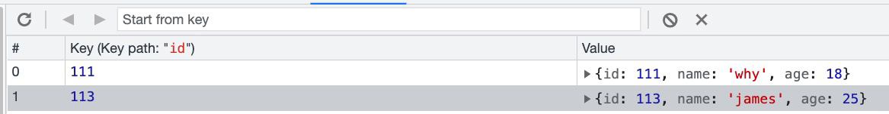 

### 建立数据库连接

打开 indexDB 的某一个数据库，**建立数据库连接**

`var openRequest = indexDB.open(数据库名称, 数据库版本号)`

`open` 方法会返回 `IDBOpenDBRequest` 类型结果

如果数据库不存在，会创建这个数据库，已经存在，则打开

```javascript
const dbRequest = indexedDB.open("demo", 1)
```

通过**监听回调**得到**数据库连接结果**

1. `onerror`：当数据库连接失败时回调

2. `onsuccess`：当数据库连接成功时回调

   通过回调的 `event` 获取到 db 对象：`event.target.result`

3. `onupgradeneeded`：当数据库第一次打开或者版本升级时回调

   通常**在这里创建具体的存储对象**：`db.createObjectStore(存储对象名称, { keypath: 存储的主键})`

```javascript
let db = null
// 数据库连接成功
dbRequest.onsuccess = function(event) {
  // 连接成功时，获取DB对象
  db = event.target.result
}
// 据库连接失败
dbRequest.onerror = function(err) {
  console.log("打开数据库失败~")
}
// 第一次打开/或者版本发生升级
dbRequest.onupgradeneeded = function(event) {
  const db = event.target.result
  // 创建存储对象
  db.createObjectStore("users", { keyPath: "id" })
}
```


### 事务对象

对数据库的操作通过**事务对象**来完成

1. 通过 db 获取对应存储的事务：`var transaction = db.transaction(存储名称, 读写权限readonly | readwrite)`
2. 通过事务获取对应的存储对象：`var store = transaction.objectStore(存储名称)`

```html
<button>新增</button>
<button>查询</button>
<button>删除</button>
<button>修改</button>
```

```javascript
class User {
  constructor(id, name, age) {
    this.id = id
    this.name = name
    this.age = age
  }
}
const users = [
  new User(100, "why", 18),
  new User(101, "kobe", 40),
  new User(102, "james", 30),
]

// 获取btns, 监听点击
const btns = document.querySelectorAll("button")
for (let i = 0; i < btns.length; i++) {
  btns[i].onclick = function() {

    // 指定操作表的名字和操作模式，表名参数可以是数组指定多个
    const transaction = db.transaction("users", "readwrite")
    // 指定表名，从事务中拿store
    const store = transaction.objectStore("users")

    switch(i) {
      case 0:
        console.log("点击了新增")
        break
      case 1:
        console.log("点击了查询")
        break
      case 2:
        console.log("点击了删除")
        break
      case 3:
        console.log("点击了修改")
        break
    }
  }
}
```


### 新增数据

`store.add`

```javascript
for (let i = 0; i < btns.length; i++) {
  btns[i].onclick = function() {
    const transaction = db.transaction("users", "readwrite")
    const store = transaction.objectStore("users")
    switch(i) {
      case 0:
        console.log("点击了新增")
        for (const user of users) {
          const request = store.add(user)
          // 监听当前数据是否添加成功
          request.onsuccess = function() {
            console.log(`${user.name}插入成功`)
          }
        }
        // 监听当前事务中，是否添加成功
        transaction.oncomplete = function() {
          console.log("添加操作全部完成")
        }
        break
    }
  }
}
```


### 查询数据

1. 通过 `store.get(key)`

   ```javascript
   for (let i = 0; i < btns.length; i++) {
     btns[i].onclick = function() {
       const transaction = db.transaction("users", "readwrite")
       const store = transaction.objectStore("users")
       switch(i) {
         case 1:
           console.log("点击了查询")
           // 根据主键查询
           const request = store.get(102)
           request.onsuccess = function(event) {
             console.log(event.target.result)
           }
           break
       }
     }
   }
   // 点击了查询
   // {id: 102, name: 'james', age: 30}
   ```

2. 通过 `store.openCursor` 拿到游标对象

   在 `request.onsuccess` 中获取 `cursor`：`event.target.result`

   - 获取对应的 `key`：` cursor.key`

   - 获取对应的 `value`：`cursor.value`

   - 继续执行：`cursor.continue`

     指针最初是指向第一条数据的，`cursor.continue` 接着指向下一条

      

   ```javascript
   for (let i = 0; i < btns.length; i++) {
     btns[i].onclick = function() {
       const transaction = db.transaction("users", "readwrite")
       const store = transaction.objectStore("users")
       switch(i) {
         case 1:
           console.log("点击了查询")
           const request = store.openCursor()
           request.onsuccess = function(event) {
             // 获取游标
             const cursor = event.target.result
             if (cursor) {
               if (cursor.key === 101) {
                 console.log(cursor.key, cursor.value)
               } else {
                 cursor.continue()
               }
             } else {
               console.log("查询完成")
             }
           }
           break
       }
     }
   }
   // 点击了查询
   // {id: 101, name: 'kobe', age: 40}
   ```


### 删除数据

`cursor.delete()`

```javascript
for (let i = 0; i < btns.length; i++) {
  btns[i].onclick = function() {
    const transaction = db.transaction("users", "readwrite")
    const store = transaction.objectStore("users")
    switch(i) {
      case 2:
        console.log("点击了删除")
        const deleteRequest = store.openCursor()
        deleteRequest.onsuccess = function(event) {
          const cursor = event.target.result
          if (cursor) {
            if (cursor.key === 101) {
              // 删除对应游标的数据
              cursor.delete()
            } else {
              cursor.continue()
            }
          } else {
            console.log("查询完成")
          }
        }
        break
    }
  }
}
```


### 修改数据

`cursor.update(value)`

```javascript
for (let i = 0; i < btns.length; i++) {
  btns[i].onclick = function() {
    const transaction = db.transaction("users", "readwrite")
    const store = transaction.objectStore("users")
    switch(i) {
      case 3:
        console.log("点击了修改")
        const updateRequest = store.openCursor()
        updateRequest.onsuccess = function(event) {
          const cursor = event.target.result
          if (cursor) {
            if (cursor.key === 101) {
              // 获取value，修改
              const value = cursor.value;
              value.name = "curry"
              cursor.update(value)
            } else {
              cursor.continue()
            }
          } else {
            console.log("查询完成")
          }
        }
        break
    }
  }
}
```


## HTTP 缓存

浏览器的缓存分为**强制缓存**和**协商缓存**，都可以通过后台**设置响应头控制**

### 强缓存

命中强缓存时，**浏览器并不会将请求发送给服务器**

http 的返回码是 `200`，但是在 size 列会显示为 `from cache`


强缓存是利用 http 的返回头中的 `Expires` 或者 `Cache-Control` 两个字段来控制的，用来表示资源的缓存时间

#### Expires

缓存过期的时间，用来**指定资源到期的时间**，是服务器端的具体的时间点

`Expires` 是 Web 服务器响应消息头字段，在响应 http 请求时告诉浏览器**在过期时间前浏览器可以直接从浏览器缓存取数据，而无需再次请求**

 

`Expires` 字段会返回一个时间，这个时间代表着这个资源的失效时间

由于失效时间是一个**绝对时间**，当客户端本地的时间被修改以后，**服务器和客户端时间不同步，会导致缓存混乱**


#### Cache-Control

`Cache-Control` 是一个**相对时间**，表达自上次请求正确的资源之后的多少秒的时间段内缓存有效

例如 `Cache-Control:3600`，代表着资源的有效期是 3600 秒

由于是相对时间，并且都是**与客户端时间比较**，所以服务器与客户端有时间偏差也不会导致问题

`Cahce-Control` 与 `Expires` 可以在服务器配置同时启用或者启用任意一个，同时启用的时候 **`Cache-Control` 优先级高**

`Cache-Control` 可以由多个字段组合而成

- 可缓存性

  - `public`：浏览器和缓存服务器都可以缓存页面信息
  - `private`：代理服务器不可缓存，只能被单个用户缓存，默认
  - `no-cache`：强制所有缓存了该响应的用户，在使用已缓存的数据前，发送带验证器的请求到服务器。不是字面意思上的不缓存
    过期时间设置为过去时间
  - `only-if-cache`：浏览器只接受已缓存的响应

- 到期

  - `max-age=`：缓存存储的最大周期，超过这个周期被认为过期，单位是 `s`

    `Cache-Control:max-age=31536000`，缓存有效期为( 31536000 / 24 / 60 * 60 )天，第一次访问这个资源时，服务器端也返回了 `Expires` 字段，并且过期时间是一年后

     

  - `s-maxage=`：设置共享缓存，在私有缓存中被忽，会覆盖 `max-age` 和 `expires`
  
  - `max-stale[=]`：客户端愿意接收一个已经过期的资源
  
  - `min-fresh=`：客户端希望在指定的时间内获取最新的响应
  
  - `stale-while-revalidate=`：客户端愿意接收陈旧的响应，并且在后台异步检查新的响应
  
    时间代表客户端愿意接收陈旧响应的时间长度
  
  - `stale-if-error=`：如新的检测失败，客户端则愿意接收陈旧的响应，时间代表等待时间
  
- 重新验证和重新加载

  - `must-revalidate`：如页面过期，则去服务器进行获取
  - `proxy-revalidate`：用于共享缓存
  - `immutable`：响应正文不随时间改变

- 其他

  - `no-store`：绝对禁止缓存
  - `no-transform`：不得对资源进行转换和转变，例如，不得对图像格式进行转换


#### Nginx 强缓存配置

```nginx
# nginx.conf
location / {  
    # add_header    Cache-Control  max-age=100;
    add_header    Cache-Control  max-age=6048000;
    # add_header    Cache-Control  no-cache;
    # add_header    Cache-Control  private;
    # add_header    Cache-Control  max-age=315360000;
    # add_header    Cache-Control  no-cache;
    # expires 30d;
    # add_header    Cache-Control  max-age=3600;
    
    if ($request_filename ~* ^.*?\.(gif|jpg|jepg|png|bmp|swf)$){
        # add_header    Cache-Control  no-cache;
        add_header    Cache-Control  max-age=3600;
        # expires 30d;
    }
    index  index.html index.htm;
}
```


### 协商缓存

若未命中强缓存，则浏览器会将请求发送至服务器

服务器根据 http 头信息中的 `Last-Modify` / `If-Modify-Since` 或 `Etag` / `If-None-Match` 来判断是否命中协商缓存

如果命中，则 **http 返回码为 `304`**（Not Modified 无需再次传输请求的内容），浏览器从缓存中加载资源

协商缓存中，浏览器**会询问服务器中缓存的文件有没有更新**，如果没有更新就使用缓存文件返回状态码 `304`，如果更新了，就从服务器取新的文件返回状态码 `200`

#### Last-Modify / If-Modify-Since

表示的是**服务器的资源最后一次修改的时间**

浏览器第一次请求一个资源的时候，服务器返回的 header 中会加上 `Last-Modify`，告知客户端，资源最后一次被修改的时间

`Last-Modify` 标识该**资源的最后修改时间**，例如 `Last-Modify: Thu,31 Dec 2037 23:59:59 GMT`

第一次请求  

当浏览器**再次请求该资源时**，**发送的请求头中会包含 `If-Modify-Since`**，该**值为缓存之前返回的 `Last-Modify`**

服务器收到 `If-Modify-Since` 后，**根据资源的最后修改时间判断是否命中缓存**

第二次请求 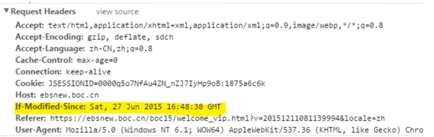 

如果**命中缓存**，则返回 `304`，并且**不会返回资源内容**，并且不会返回 `Last-Modify`

由于对比的服务端时间，所有客户端与服务器时间差距不会导致问题

但是有时候通过**最后修改时间来判断资源是否修改还是不太准确**（资源变化了最后修改时间也可以一致）


#### Etag / If-None-Match

表示的是**服务器资源的唯一标识**

与 `Last-Modify` / `If-Modify-Since` 不同的是，`Etag` / `If-None-Match` 返回的是一个**校验码**（Etag: entity tag）

`Etag` 可以保证每一个资源是唯一的，**资源变化都会导致 `Etag` 变化**

`Etag` 值的变更则说明资源状态已经被修改，服务器根据浏览器上发送的 `If-None-Match` 值来判断是否命中缓存

 

`Last-Modified` 可以和 `Etag` 一起使用，服务器会**优先验证 `Etag`**，一致的情况下才会继续对比 `Last-Modified`


### 缓存执行过程

**强制缓存优先于协商缓存进行**

1. 浏览器先根据这个资源的 http 头信息来判断**是否命中强缓存**

   如果**命中**则直接加载缓存中的资源，并**不会将请求发送到服务器**，直接返回 `200`

2. 如果未命中强缓存，则浏览器会将资源加载请求发送到服务器

   **服务器来判断**浏览器本地缓存是否失效（协商缓存）

   若**可以使用**，则**服务器并不会返回资源信息**，会告诉浏览器继续从缓存加载资源, 返回 `304`

3. 如果未命中协商缓存，则服务器会将完整的资源返回给浏览器，浏览器加载新资源，并更新缓存

浏览器第一次请求，服务器返回资源，并在 response header 中回传资源的缓存策略

 

浏览器第二次请求，HTTP 缓存都是从第二次请求开始的

 

强缓存和协商缓存的**共同点**

1. 如果命中，都是从客户端缓存中加载资源

强缓存和协商缓存的**不同点**

1. 强缓存不发送请求到服务器
2. 协商缓存会发送请求到服务器


# 性能优化

## 渲染优化

在浏览器中最消耗性能的就是操作 DOM，**尽可能的减少 DOM 的操作**

- 在渲染的时候，可以使用 `document.createDocumentFragment` **创建虚拟节点**，从而避免不必要的渲染

  虚拟节点渲染

  ```javascript
  // 插入十万条数据
  const total = 10000;
  let ul = document.querySelector('ul');
  
  function add() {
    // 创建虚拟节点，使用document.createDocumentFragment 不会触发渲染
    const fragment = document.createDocumentFragment();
    // 渲染十万次
    for (let i = 0; i< total; i++) {
      const li = document.createElement('li');
      li.innerText = Math.floor(Math.random() * total);
      fragment.appendChild(li);
    }
    // 最后把虚拟节点append到ul上
    ul.appendChild(fragment);；
  }
  add();
  ```

- 采用分段渲染的方式，最后使用 `window.requestAnimationFrame` 来**逐帧渲染**

  逐帧渲染

  ```javascript
  // 插入十万条数据
  const total = 10000;
  let ul = document.querySelector('ul');
  
  // 分段渲染
  // 渲染屏幕显示的数量
  const once = 20;
  // 全部渲染完需要多少次
  const loopCount = total / once;
  // 已经渲染多少次
  let countHasRender = 0;
  
  function add() {
    // 创建虚拟节点，使用document.createDocumentFragment 不会触发渲染
    const fragment = document.createDocumentFragment();
    // 循环20次
    for (let i = 0; i < once; i++) {
      const li = document.createElement('li');
      li.innerText = Math.floor(Math.random() * total);
      frgament.appendChlid(li);
    }
    // 最后把虚拟节点append到ul上
    ul.appendChild(fragment);
    // 已经渲染的次数+1
    countHasRender += 1;
    loop();
  }
  
  function loop() {
    // 如果还没有渲染完，那么就使用requestAnimationFrame 来继续渲染
    if (countHasRender < loopCount) {
      // requestAnimationFrame 叫做逐帧渲染
      // 帧，一秒钟播放多少张图片，一秒钟播放的图片越多，动画就越流畅
      // 类似于 setTimeout(add, 16);
      // 1000/60 = 16 人眼一秒钟看60张图片比较舒适
      // requestAnimationFrame保证是60帧
      window.requestAnimationFrame(add);
    }
  }
  loop();
  ```

- React 的虚拟 DOM，用 JS 数据来模拟真实 DOM 树，从而大大减少操作真实 DOM 的次数


## 加载优化

### 加载图片优化

- 使用图片懒加载的方式减少首屏图片的加载量

  懒加载的原理就是**监听滚动条事件**

  如果**滚动条距离浏览器顶部的高度**等于**图片距离顶部的高度**，就将 `data-src` 的值赋值到 `src` 上

  浏览器是否发起请求就是根据是否有 `src` 属性决定

   

  ```html
  
  <!-- 滚动到特定的位置的时候 -->
  
  ```

- 分别使用 iconfont 和精灵图来处理小图标和小图片

  对于纯色系的小图标可以使用 iconfont 来解决

  - 设置 `font-family` 的 CSS 属性

  对于彩色的小图片可以使用精灵图

  - 把所有小图片拼接到一张大图片上，使用 `background-position` 的 CSS 属性来修改图片坐标


### 优化首页请求量

- 通过浏览器的 Network 可以确定首页加载的资源和请求量 

   

  - request：请求数量
  - resource：前端资源总大小
  - Finish：请求总时间
  - DOMContentLoaded：浏览器已经完全加载了 HTML，其他静态资源（ JS，CSS，图片等）并没有下载完毕（只能看，不能用的状态）的时间
  - Load：浏览器已经加载了所有静态资源（能用的状态）的时间

- 通过浏览器的 Converge 来查看代码的使用状况

  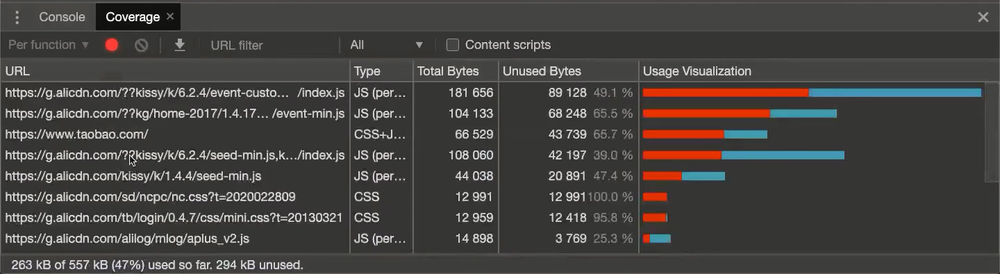 

  - 可以看出哪些代码虽然加载了但是没有执行（蓝色是使用的代码，红色是未使用的代码）

  - 只针对 JS 和 CSS

  没有执行的代码可以考虑使用懒加载

- 减少资源的请求量

  1. 通过 **Nginx 服务器**（可用作 CDN，用来处理静态资源）来做**资源文件合并** combin

     **将多个 javascript，css 文件合并成一个**（ Nginx 插件 nginx-http-concat ）

     【扩展】服务器按照功能区分

     - 应用服务器：服务端语言运行的服务器
     - 数据集服务器：放数据库的服务器
     - 存储服务器：放大型文件的服务器
     - CDN 服务器：放静态资源的服务器（ JS，CSS，图片，字体等）

  2. 通过打包工具（Webpack）来做资源文件的物理打包（相对没有第一种灵活）

- 代码层面优化

  1. 如果引入了大型的第三方库，可以通过 Babel 插件来**按需加载**
  2. 使用前端路由懒加载（只限 SAP 应用）


### 优化首页静态资源

- Webpack 打包优化

  CSS 和 JS 可以通过 Webpack 来进行混淆和压缩

  **混淆**：将 js 代码进行字符串加密（最大程度减少代码，比如将长变量名变成单个字母等等）

  **压缩**：去除注释空行以及 `console.log` 等调试代码

  webpack4 开始，会根据选择的 `mode` 来执行不同的优化，优化也可以手动配置和重写

  优化相关配置在 `optimization` 配置中管理

  使用 Webpack + dynamic import 并结合路由的入口文件做拆包处理

  - `development`：不混淆，不压缩，不优化
  - `production`：混淆 + 压缩，自动内置优化

  **打包策略**：我们通常会把第三方包打成一个包，公共的代码打一个包，非公共的代码打一个包

  - 第三方包（node_modules）：改动频率小
  - 公共代码包（src 代码的公共的组件等）：改动频率中
  - 非公共代码包：改动频率高

  **打包策略结合网络缓存**来做优化

  - 对于不需要经常变动的资源（第三方包），可以使用 `Cache-Control: max-age=3153600`（缓存一年）并配合协商缓存 `Etag` 使用（一旦文件名变动才会下载新文件）
  - 需要频繁变动的资源（代码包），可以使用 `Cache-Control: no-cache` 并配合 `Etag` 使用，表示该资源已被缓存，但是每次都会发送请求询问资源是否更新

  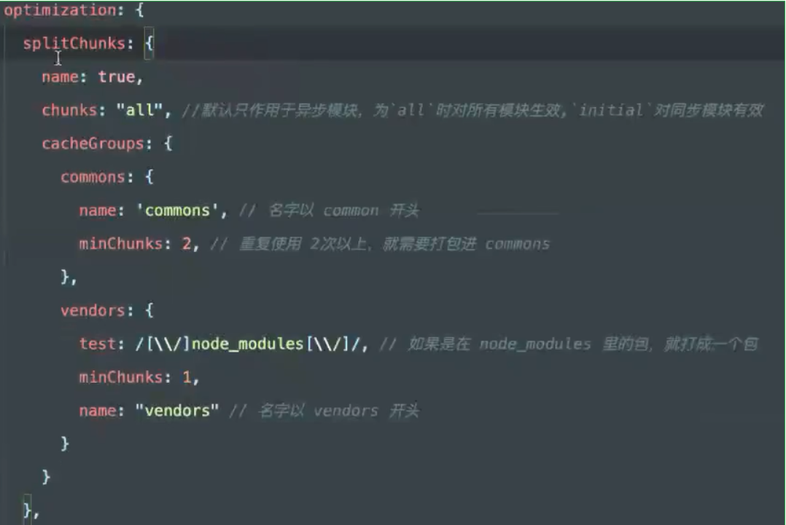 

- ##### 图片进行压缩

  - 通过自动化工具来压缩图片

    熊猫站 tinypng.com，减少颜色的数量以及不必要的数据来实现文件压缩

    ```bash
    npm install --save tinify
    ```

  - 对图片进行转码 -> base64 格式

    base64 格式图片的作用是减少资源的数量，但是 base64 格式图片会增大原有图片的体积

  - 使用 Webp 格式

- ##### 服务器开启 gzip 进行全部资源压缩

  - gzip 是一种压缩文件格式，可以对任何文件进行压缩（类比于文件压缩）
  - 可以通过 nginx 服务器的配置项进行开启（/user/local/etc/nginx）

- ##### 实现 CDN 加速

  CDN（内容分发网络），放静态资源的服务器（JS，CSS，图片，字体）

  CDN 服务器就是在家门口放一台服务器，把所有静态资源都同步到家门口这台服务器，以后只要访问这个网站，就直接从这台服务器上下载静态资源

  CDN 服务器的地址一般都跟主服务器的地址不同，可以破除浏览器对同一个域名发送请求的限制（HTTP1.1）

   


# HTTP 服务

## HTTP 协议

- HTTP 协议的主要特点：**简单快速、灵活、无连接、无状态**
- HTTP 报文的组成
  1. 请求报文：请求行、请求头、空行、请求体
  2. 响应报文：状态行、响应头、空行、响应体

- HTTP 协议
  - GET 获取资源
  - POST 传输资源
  - PUT 更新资源
  - DELETE 删除资源
  - HEAD 获得报文首部

- POST 和 GET 的区别
  - GET 在浏览器回退时是无害的，而 POST 会再次提交请求
  - GET 产生的 URL 地址可以被收藏，而 POST 不可以
  - GET 请求会被浏览器主动缓存，而 POST 不会，除非手动设置
  - GET 请求只能进行 url 编码，而 POST 支持多种编码方式
  - GET 请求参数会被完整保留在浏览器历史记录里，而 POST 中的参数不会被保留
  - GET 请求在 URL 中传送的参数是有长度限制的，而 POST 没有限制
  - 对参数的数据类型，GET 只接受 ASCII 字符，而 POST 没有限制
  - GET 比 POST 更不安全，因为参数直接暴露在 URL 上，所以不能用来传递敏感信息
  - GET 参数通过 URL 传递，POST 放在 Request body 中


## 一次完整的 HTTP 服务过程

当在浏览器中输入`www.baidu.com` 时，具体发生了什么

1. 对 `www.baidu.com` 这个网址**进行 DNS 域名解析，得到对应的 IP 地址**
2. 根据这个 IP，**找到对应的服务器，发起 TCP 的三次握手**
3. 建立 TCP 连接后**发起 HTTP 请求**
4. 服务器**响应 HTTP 请求，浏览器得到 html 代码**
5. 浏览器**解析 html 代码**，并**请求 html 代码中的资源**（如 js，css，图片等）（先得到 html 代码，才去找这些资源）
6. 浏览器对**页面进行渲染**呈现给用户
7. 服务器**关闭 TCP 连接**

> 具体实现

- 网络连接是 TCP 协议，传输内容是 HTTP 协议

- DNS 域名解析采用的是递归查询的方式，找到域名的

  1. 先去搜索**浏览器自身的 DNS 缓存** (缓存时间比较短，大概只有 1 分钟，且只能容纳 1000 条缓存)
  2. 如果浏览器自身的缓存找不到，浏览器会搜索**操作系统自身的 DNS 缓存**
  3. 如果还没找到，那么尝试从**hosts 文件里面去找**（只有这步可以人为进行干预）
  4. 如果还没找到，就递归去**域名服务器查找**

  这样递归查找后，找到了，给浏览器

  DNS 优化两个方面：DNS 缓存、DNS 负载均衡

   

- 为什么 HTTP 协议要基于 TCP 来实现

  TCP 是一个端到端的可靠的面向连接的协议，**HTTP 基于传输层 TCP 协议**不用担心数据传输的各种问题

  (当发生错误时，会重传)

- 服务器关闭 TCP 连接

  一般情况下，一旦服务器向浏览器发送了请求数据，它就要关闭 TCP 连接

  如果浏览器或者服务器在其头部信息加入了如下代码，TCP 连接在发送后仍然保持打开状态

  ```
  Connection:keep-alive
  ```

  于是，浏览器可以继续通过相同的连接发送请求

  保持连接节省了为每个请求建立新连接所需的时间，还节约了网络带宽

  自此一次完整的 HTTP 事务宣告完成


## TCP 的三次握手与四次挥手

 

### 三次握手

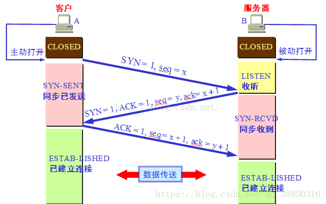 

- 第一次握手

  建立连接时，客户端发送 `SYN` 包（`syn=x`）到服务器，并进入 `SYN_SENT` 状态，等待服务器确认（`SYN`：同步序列编号）

- 第二次握手

  服务器收到 `SYN` 包，必须确认客户的 `SYN`（`ack=x+1`），同时自己也发送一个 `SYN` 包（`syn=y`），即 `SYN+ACK` 包，此时服务器进入 `SYN_RECV` 状态

- 第三次握手

  客户端收到服务器的 `SYN+ACK` 包，向服务器发送确认包 `ACK` (`ack=y+1`），此包发送完毕，客户端和服务器进入 `ESTABLISHED`（TCP 连接成功）状态，完成三次握手


### 四次挥手

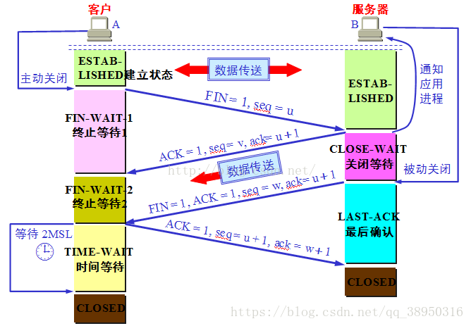 

1. 客户端进程发出连接释放报文，并且停止发送数据

2. 服务器收到连接释放报文，发出确认报文，此时，服务端就进入了 `CLOSE-WAIT`（关闭等待）状态

   `TCP` 服务器通知高层的应用进程，客户端向服务器的方向释放了，这时候处于半关闭状态，即客户端已经没有数据要发送了，但是服务器若发送数据，客户端依然要接受。这个状态还要持续一段时间，也就是整个 `CLOSE-WAIT` 状态持续的时间

3. 客户端收到服务器的确认请求后，此时，客户端就进入 `FIN-WAIT-2`（终止等待2）状态，等待服务器发送连接释放报文

   （在这之前还需要接受服务器发送的最后的数据）

4. 服务器将最后的数据发送完毕后，就向客户端发送连接释放报文

   由于在半关闭状态，服务器很可能又发送了一些数据。此时，服务器就进入了 `LAST-ACK`（最后确认）状态，等待客户端的确认

5. 客户端收到服务器的连接释放报文后，必须发出确认。此时，客户端就进入了 `TIME-WAIT`（时间等待）状态

   注意此时 TCP 连接还没有释放，必须经过 `2MSL`（最长报文段寿命）的时间后

   当客户端撤销相应的 TCB （传输控制块）后，才进入 `CLOSED` 状态

6. 服务器只要收到了客户端发出的确认，立即进入 `CLOSED` 状态

   同样，撤销 TCB 后，就结束了这次的 TCP 连接，可以看到，服务器结束 TCP 连接的时间要比客户端早一些


### 常见问题

- 为什么连接的时候是三次握手，关闭的时候却是四次挥手？

  - 因为当服务端收到客户端的 `SYN` 连接请求报文后，可以直接发送 `SYN+ACK` 报文

    其中 `ACK` 报文是用来**应答**的，`SYN` 报文是用来**同步**的

  - 但是关闭连接时，当服务端收到 `FIN` 报文时，很可能并不会立即关闭 `SOCKET`

    所以只能先回复一个 `ACK` 报文，告诉客户端，"你发的 `FIN` 报文我收到了"

  - 只有等到服务端所有的报文都发送完了，才能发送 `FIN` 报文，因此不能一起发送，故需要四步握手

- 为什么 `TIME_WAIT` 状态需要经过 `2MSL` (最大报文段生存时间)才能返回到 `CLOSE` 状态？

  - 虽然按道理，四个报文都发送完毕，可以直接进入 `CLOSE` 状态了，但是必须假设网络是不可靠的，有可以最后一个 `ACK` 丢失

    所以 `TIME_WAIT` 状态就是用来重发可能丢失的 `ACK` 报文。在客户端发送出最后的 `ACK` 回复，但该 `ACK` 可能丢失

    服务端如果没有收到 `ACK`，将不断重复发送 `FIN` 片段。所以客户端不能立即关闭，它必须确认服务端接收到了该 `ACK`

  - 客户端会在发送出 `ACK` 之后进入到 `TIME_WAIT` 状态。客户端会设置一个计时器，等待 `2MSL` 的时间

    如果在该时间内再次收到 `FIN`，那么客户端会重发 `ACK` 并再次等待 `2MSL`

  - 所谓的 `2MSL` 是两倍的 `MSL`(Maximum Segment Lifetime)

    `MSL` 指一个片段在网络中最大的存活时间，`2MSL` 就是一个发送和一个回复所需的最大时间

  - 如果直到 `2MSL`，客户端都没有再次收到 `FIN`，那么客户端推断 `ACK` 已经被成功接收，则结束 `TCP` 连接

- 为什么不能用两次握手进行连接？

  - 三次握手完成两个重要的功能，既要双方做好发送数据的准备工作(双方都知道彼此已准备好)，也要允许双方就初始序列号进行协商，这个序列号在握手过程中被发送和确认

  - 把三次握手改成仅需要两次握手，死锁是可能发生的

    例如，计算机 S 和 C 之间的通信，假定 C 给 S 发送一个连接请求分组，S 收到了这个分组，并发送了确认应答分组

    按照两次握手的协定，S 认为连接已经成功地建立了，可以开始发送数据分组

    可是，C 在 S 的应答分组在传输中被丢失的情况下，将不知道 S 是否已准备好，不知道 S 建立什么样的序列号，C 甚至怀疑 S 是否收到自己的连接请求分组

    在这种情况下，C 认为连接还未建立成功，将忽略 S 发来的任何数据分组，只等待连接确认应答分组。而 S 在发出的分组超时后，重复发送同样的分组。这样就形成了死锁

- ##### 如果已经建立了连接，但是客户端突然出现故障了怎么办？

  - TCP 还设有一个**保活计时器**，显然，客户端如果出现故障，服务器不能一直等下去，白白浪费资源

    服务器每收到一次客户端的请求后都会重新复位这个计时器，时间通常是设置为两小时

  - 若两小时还没有收到客户端的任何数据，服务器就会发送一个探测报文段，以后每隔 75 秒钟发送一次

    若一连发送 10 个探测报文仍然没反应，服务器就认为客户端出了故障，接着就关闭连接


## TCP 和 UDP

1. TCP 是面向连接的，UDP 是无连接的即发送数据前不需要先建立链接
2. TCP 提供可靠的服务，通过 TCP 连接传送的数据，无差错，不丢失，不重复，且按序到达
   UDP 尽最大努力交付，即不保证可靠交付
   并且因为 TCP 可靠，面向连接，不会丢失数据因此适合大数据量的交换
3. TCP 是面向字节流，UDP 面向报文，并且网络出现拥塞不会使得发送速率降低
   （因此会出现丢包，对实时的应用比如IP电话和视频会议等）
4. TCP 只能是 1 对 1 的，UDP 支持 1 对 1, 1 对多
5. TCP 的首部较大为 20 字节，而 UDP 只有 8 字节
6. TCP 是面向连接的可靠性传输，而 UDP 是不可靠的


## RESTFUL

用 URL 定位资源，用 HTTP 描述操作


# 网络安全

## XSS 跨站脚本攻击

攻击者**将可以执行的代码注入到网页中**

- 存储型（服务端）

  - 场景：见于带有用户保存数据的网站功能，如论坛发帖、商品评论、用户私信等

  - 攻击步骤

    1. 攻击者**将恶意代码提交到目标网站的数据库中**

    2. 用户打开目标网站时，服务端将**恶意代码从数据库中取出来，拼接在 HTML 中返回给浏览器**

    3. 用户浏览器在收到响应后解析执行，混在其中的恶意代码也同时被执行

    4. 恶意代码窃取用户数据，并发送到指定攻击者的网站，或者冒充用户行为，调用目标网站的接口，执行恶意操作

- 反射型（服务端）

  与存储型的区别在于，存储型的恶意代码存储在数据库中，**反射型的恶意代码在 URL 上**

  -  场景：通过 URL 传递参数的功能，如网站搜索、跳转等
  - 攻击步骤：
    1. **攻击者构造出特殊的 URL**，其中包含恶意代码
    2. 用户打开带有恶意代码的 URL 时，网站服务端将**恶意代码从 URL 中取出，拼接在 HTML 中返回给浏览器**
    3. 用户浏览器接收到响应后解析执行，混在其中的恶意代码也被执行
    4. 恶意代码窃取用户数据并发送到攻击者的网站，或者冒充用户的行为，调用目标网站接口执行攻击者指定的操作

- Dom 型（浏览器端）

  DOM 型 XSS 攻击中，取出和执行恶意代码由浏览器端完成，属于前端 JavaScript 自身的安全漏洞

  其他两种 XSS 都属于服务端的安全漏洞

  - 场景：通过 URL 传递参数的功能，如网站搜索、跳转等
  - 攻击步骤：
    1. **攻击者构造出特殊的 URL**，其中包含恶意代码
    2. 用户打开带有恶意代码的 URL
    3. 用户浏览器接收到响应后解析执行，**前端 JavaScript 取出 URL 中的恶意代码并执行**
    4. 恶意代码窃取用户数据并发送到攻击者的网站，或者冒充用户的行为，调用目标网站接口执行攻击者指定的操作

- 对策方案

  **防止攻击者提交恶意代码，防止浏览器执行恶意代码**

  - 对数据进行严格的输出编码：如 HTML 元素的编码，JS 编码，CSS 编码，URL 编码等等

    避免拼接 HTML，Vue / React 技术栈，避免使用 `v-html` / `dangerouslySetInnerHTML`

  - 使用 CSP HTTP Header，即 `Content-Security-Policy`、`X-XSS-Protection`

    增加攻击难度，配置 CSP (本质是建立白名单，由浏览器进行拦截)

    - `Content-Security-Policy: default-src 'self' ` 所有内容均来自站点的同一个源（不包括其子域名）
    - `Content-Security-Policy: default-src 'self' *.trusted.com` 允许内容来自信任的域名及其子域名 (域名不必须与 CSP 设置所在的域名相同)
    - `Content-Security-Policy: default-src https://trusted.com` 该服务器仅允许通过 HTTPS 方式并仅从trusted.com 域名来访问文档

  - 输入验证：比如一些常见的数字、URL、电话号码、邮箱地址等等做校验判断

  - 开启浏览器 XSS 防御：Http Only cookie，禁止 JavaScript 读取某些敏感 Cookie，攻击者完成 XSS 注入后也无法窃取此 Cookie

  - 验证码
  
  - **Cookie 防范 XSS 攻击**：在 HTTP 头部配置 `set-cookie`
  
    - 设置 `httponly` 属性，只允许 http 或 https 请求读取 cookie，会禁止 js 代码来访问 cookie
    - 设置 `secure` 属性，告诉浏览器仅在请求为 https 的时候发送 cookie
  
    ```javascript
    response.setHeader("Set-Cookie", "cookiename=httponlyTest;Path=/;Domain=domainvalue;Max-Age=seconds;HTTPOnly");
    ```
  
    


## CSRF 跨站请求伪造

攻击者**诱导受害者进入第三方网站，在第三方网站中，向被攻击网站发送跨站请求**

利用受害者在被攻击网站已经获取的注册凭证，绕过后台的用户验证，达到冒充用户对被攻击的网站执行某项操作的目的

- 攻击流程

  1. 受害者登录 a.com，并保留了登录凭证（Cookie）
  2. 攻击者引诱受害者访问了 b.com
  3. b.com 向 a.com 发送了一个请求：a.com/act=xx 浏览器会默认携带 a.com 的 Cookie
  4. a.com 接收到请求后，对请求进行验证，并确认是受害者的凭证，误以为是受害者自己发送的请求
  5. a.com 以受害者的名义执行了 act=xx
  6. 攻击完成，攻击者在受害者不知情的情况下，冒充受害者，让 a.com 执行了自己定义的操作

- 攻击方式

  - GET 型：如在页面的某个 img 中发起一个 get 请求
  - POST 型：通过自动提交表单到恶意网站
  - 链接型：需要诱导用户点击链接

- 对策方案

  CSRF 通常从第三方网站发起，被攻击的网站无法防止攻击发生，只能通过**增强自己网站针对 CSRF 的防护能力**来提升安全性

  - 同源检测：通过 Header 中 `Origin Header` 、`Referer Header` 确定，但不同浏览器可能会有不一样的实现，不能完全保证

  - CSRF Token 校验：将 CSRF Token 输出到页面中（通常保存在 Session 中），页面提交的请求携带这个 Token，服务器验证Token 是否正确

  - 双重 Cookie 验证

    1. 在用户访问网站页面时，向请求域名注入一个 Cookie，内容为随机字符串（例如 csrfcookie=v8g9e4ksfhw ）

    2. 在前端向后端发起请求时，取出 Cookie，并添加到 URL 的参数中

       （POST `https://www.a.com/comment?csrfcookie=v8g9e4ksfhw` ）

    3. 后端接口验证 Cookie 中的字段与 URL 参数中的字段是否一致，不一致则拒绝

    如果有其他漏洞（例如 XSS），攻击者可以注入 Cookie，那么该防御方式失效

    为了确保 Cookie 传输安全，采用这种防御方式的最好确保用整站 HTTPS 的方式

    难以做到子域名的隔离 

  - Samesite Cookie 属性

    为 `Set-Cookie` 响应头新增 `Samesite` 属性，用来标明这个 Cookie 是个 “同站 Cookie”

    同站 Cookie 只能作为第一方 Cookie，不能作为第三方 Cookie

    `Samesite` 有两个属性值：

    `Strict` 为任何情况下都不可以作为第三方 Cookie 

    `Lax` 为可以作为第三方 Cookie , 但必须是 Get 请求


## iframe 安全

嵌入第三方 `iframe` 会有很多不可控的问题，同时当第三方 `iframe` 出现问题或是被劫持之后，也会诱发安全性问题

- 点击劫持

  攻击者**将目标网站通过 `iframe` 嵌套的方式嵌入自己的网页中**，并将 iframe 设置为透明，诱导用户点击

- 对策方案

  - 为 `iframe` 设置 `sandbox` 属性，对 `iframe` 的行为进行各种限制，充分实现“最小权限“原则

  - 服务端设置 `X-Frame-Options Header` 头，**拒绝页面被嵌套**

    - `X-Frame-Options: SAMEORIGIN`：`iframe` 页面的地址只能为相同域名下的网页
    - `X-Frame-Options: ALLOW-FROM https://a.com`：白名单限制
    - `X-Frame-Options: DENY`：禁止 `iframe` 

  - 设置 CSP 即 `Content-Security-Policy` 请求头

    `Content-Security-Policy: frame-ancestors https://a.com` 指定白名单


## 其他安全问题

### 错误的内容推断

文件上传类型校验失败后，导致恶意的 JS 文件上传后，浏览器 `Content-Type Header` 的默认解析为可执行的 JS 文件

- 对策方案：设置 `X-Content-Type-Options` 头


### HTTPS

黑客可以利用 SSL Stripping 这种攻击手段，强制让 HTTPS 降级回 HTTP，从而继续进行中间人攻击

- 对策方案：使用 HSTS（HTTP Strict Transport Security），强制性的使用 HTTPS


### 网络劫持

DNS 劫持：修改运行商的 DNS 记录，重定向到其他网站

HTTP 劫持：HTTP 是明文传输，运营商便可借机修改 HTTP 响应内容（如加广告）

- 对策方案：全站 HTTPS


### 静态资源完整性校验

攻击者获得对 CDN 的控制权，将恶意内容注入到 CDN 上的文件中 （或完全替换掉文件），因潜在地攻击所有从该 CDN 获取文件的站点

- 对策方案：使用 base64 编码过后的文件哈希值写入所引用的 `<script>` 或标签的 `integrity` 属性值中启用子资源完整性能


### 中间人攻击 MITM

攻击者与通讯的两端分别创建独立的联系，并交换其所收到的数据

通讯的两端认为他们正在通过一个私密的连接与对方直接对话，但事实上整个会话都被攻击者窃听、篡改甚至完全控制

SSL （安全套接字层）协议可以验证参与通讯的用户的证书是否有权威、受信任的数字证书认证机构颁发，并且能执行双向身份认证

- 对策方案
  - 用可信的第三方 CA 厂商
  - 确认访问的 URL 是 HTTPS，确保网站使用了 SSL，确保禁用一些不安全的 SSL，只开启：TLS1.1，TLS1.2


### SQL 注入

SQL 命令插入到 Web 表单递交或输入域名或页面请求的查询字符串，最终达到欺骗数据库服务器执行恶意的 SQL 命令，从而达到和服务器进行直接的交互

- 对策方案
  - 后台进行输入验证，对敏感字符过滤
  - 使用参数化查询，避免拼接SQL语句


### 反爬虫

- 对策方案
  - `font-face` 拼接方式：猫眼电影、天眼查
  - `background` 拼接：美团
  - 伪元素隐藏：汽车之家
  - 元素定位覆盖式：去哪儿
  - `iframe` 异步加载：网易云音乐


# 网页特效

## 图片懒加载

懒加载就是优先加载可视区域的内容，其他部分等进入了可视区域再加载

`` 标签只有在有 `src` 属性时，浏览器才会发起请求，所以在 `` 没进入可视区域之前，不赋 `src` 属性

```html


```

1. 滚动监听，图片进入了可视区内判断公式 `offsetTop - scrollTop <= clientHeight`

   `offsetTop`：元素相对带有定位的父元素的位置，没有定位的父元素则相对于 `body`

   `scrollTop`：元素被滚动条卷去的部分

   `clientHeight` / `innerHeight`：浏览器可视区大小

   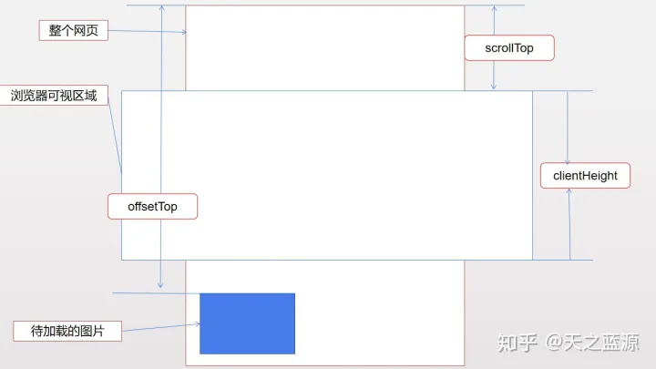 

   ```javascript
   const imgs = document.getElementsByTagName('img')
   
   // 一上来立即执行一次
   scrollFn();
   
   // 监听滚动事件
   window.onscroll = throttle(scrollFn, 200);
   
   function scrollFn() {
     const clietHeight = window.innerHeight ||
           document.documentElement.clientHeight ||
           document.body.clientHeight;
     const scrollTop = document.documentElement.scrollTop ||
           window.pageYOffset ||
           document.body.scrollTop;
     for (let i = 0; i < imgs.length; i++) {
       if (clietHeight + scrollTop >= getOffsetTop(imgs[i])) {
         // //从data-src中取出真实的图片地址赋值给scr
         item.setAttribute('src', item.getAttribute('data-src'))
       }
     }
   }
   
   // offsetTop是元素与offsetParent的距离，循环获取直到页面顶部
   function getOffsetTop(e) {
     let top = e.offsetTop;
     // 循环获取到最顶部body，直到为null跳出循环
     while(e = e.offsetParent) {
       top += e.offsetTop;
     }
     return top;
   }
   
   // 函数节流
   function throttle(fn, delay) {
     let timer = null
     return function () {
       let context = this;
       if (!timer) {
         timer = setTimeout(() => {
           fn.apply(this)
           timer = null
         }, delay)
       }
     }
   }
   ```

2. 滚动监听，使用 `getBoundingClientRect()` 获取**相对于视图窗口的左上角**的距离，判断图片是否进入可视区

   `getBoundingClientRect().top <= clientHeight`

   `getBoundingClientRect()`：返回元素的大小以及其相对于视口的位置

   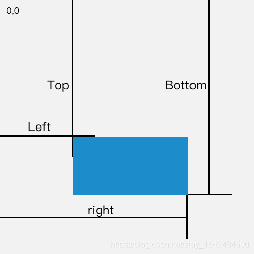 

   ```javascript
   const imgs = document.getElementsByTagName('img');
   
   // 一上来立即执行一次
   scrollFn();
   
   // 监听滚动事件
   window.onscroll = throttle(scrollFn, 200);
   
   function scrollFn() {
     const clietHeight = window.innerHeight ||
           document.documentElement.clientHeight ||
           document.body.clientHeight;
     for (let i = 0; i < imgs.length; i++) {
       // 返回一个矩形对象，包含上下左右的偏移值
       const oBounding = imgs[i].getBoundingClientRect();
       if (0 <= oBounding.top && oBounding.top <= offsetHeight) {
         item.setAttribute('src', item.getAttribute('data-src'));
       }
     }
   }
   
   // 函数节流
   function throttle(fn, delay) {
     let timer = null
     return function () {
       let context = this;
       if (!timer) {
         timer = setTimeout(() => {
           fn.apply(this)
           timer = null
         }, delay)
       }
     }
   }
   ```

3. 使用交叉观察器 `IntersectionObserver` 的 `intersectionRatio` 属性，检测图片是否进入可视区

   使用 `IntersectionObserver` API 的优点是可以减少不必要的计算和事件监听，提高了性能

   `var io = new IntersectionObserver(callback, option)`

   - `callback`：可见性变化时的回调函数

     回调函数会触发两次，一次是目标元素刚刚进入视口，一次是完全离开视口

     回调函数的参数 `entries` 是一个数组，每个成员都是一个 `IntersectionObserverEntry` 对象

     如果同时有多个被观察的对象的可见性发生变化，`entries` 数组就会有多个成员

     `IntersectionObserverEntry` 对象属性：
   
     ```javascript
     {
       // 可见性发生变化的时间, 毫秒
       time: 3893.92,
       // 根元素的getBoundingClientRect()方法的返回值, 没有根元素，则是Null
       rootBounds: ClientRect {
         bottom: 920,
         height: 1024,
         left: 0,
         right: 1024,
         top: 0,
         width: 920
       },
       // 目标元素的getBoundingClientRect()方法的返回值
       boundingClientRect: ClientRect {
          // ...
       },
       // 目标元素与视口（或根元素）的交叉区域的信息
       intersectionRect: ClientRect {
         // ...
       },
       // 目标元素的可见比例, 即intersectionRect占boundingClientRect的比例，完全可见时为1，完全不可见时小于等于0
       intersectionRatio: 0.54,
       // 被观察的目标元素的DOM节点
       target: element
     }
     ```

      

   - `option`：配置对象，可选

     - `threshold` 属性：`intersectionRatio` 达到多少比例时触发回调函数，默认为 `[0]`

       `{threshold: [0, 0.25, 0.5, 0.75, 1]}` 时，当目标元素 0%、25%、50%、75%、100% 可见时，触发

     - `root` 属性：指定目标元素所在的容器 DOM 节点，实现容器内滚动

     - `rootMargin` 属性：定义根元素的 `margin`，扩展或缩小 `rootBounds` 这个矩形的大小，使用 CSS 的定义方法

   - 构造函数的返回值是一个观察器实例，实例的 `observe` 方法可以指定观察哪个 DOM 节点

     - 开始观察：`io.observe(document.getElementById('example'))`

       参数是一个 DOM 节点对象，如果要观察多个节点，就要多次调用这个方法

     - 停止观察：`io.unobserve(element)`

     - 关闭观察器：`io.disconnect()`
   
   - `IntersectionObserver` 是异步的，不随着目标元素的滚动同步触发

```javascript
const imgs = document.getElementsByTagName('img');
let io = new IntersectionObserver((entires) => {
  // 图片进入视口时执行回调
  entires.forEach((item) => {
    // 获取目标元素
    let oImg = item.target;
    if (item.intersectionRatio > 0 && item.intersectionRatio <= 1) {
      oImg.setAttribute('src', oImg.getAttribute('data-src'))
    } 
  });
});
// 给每一个图片设置观察器
Array.from(imgs).forEach(element => {
  io.observe(element) 
});
```


## 模态框拖拽

 

- 监听鼠标按下 `mousedown` 事件，获取鼠标在模态框中的坐标

- 监听鼠标移动 `mousemove` 事件，鼠标在页面中的坐标 - 鼠标在模态框中的坐标 = 模态框移动后的 `left` 和 `top` 值

   `mousemove` 事件需要写到  `mousedown` 事件里面

- 监听鼠标松开 `mouseup` 事件，解除鼠标移动事件

```javascript
var login = document.querySelector('.login');
// 鼠标按下触发的事件源是 最上面一行，就是 id 为 title
var title = document.querySelector('#title');

// 触发事件是鼠标按下 mousedown， 鼠标移动mousemove 鼠标松开 mouseup
title.addEventListener('mousedown', function(e) {
  // 鼠标按下，我们要得到鼠标在盒子的坐标
  var x = e.pageX - login.offsetLeft;
  var y = e.pageY - login.offsetTop;

  // 鼠标移动，就让模态框的坐标 设置为 ： 鼠标坐标 减去盒子坐标即可，注意移动事件写到按下事件里面。
  // 鼠标移动的时候，把鼠标在页面中的坐标，减去 鼠标在盒子内的坐标就是模态框的left和top值
  document.addEventListener('mousemove', move);

  // 拖拽过程: 鼠标移动过程中，获得最新的值赋值给模态框的left和top值， 这样模态框可以跟着鼠标走了
  function move(e) {
    // 鼠标的坐标 减去 鼠标在盒子内的坐标， 才是模态框真正的位置。
    login.style.left = e.pageX - x + 'px';
    login.style.top = e.pageY - y + 'px';
  }

  // 鼠标松开，就停止拖拽，就是可以让鼠标移动事件解除
  document.addEventListener('mouseup', function() {
    document.removeEventListener('mousemove', move);
  });
})
```


## 轮播图

 

1. 鼠标经过轮播图模块，左右按钮显示，离开隐藏左右按钮
2. 点击右侧按钮一次，图片往左播放一张，以此类推， 左侧按钮同理
3. 图片播放的同时，下面小圆圈模块跟随一起变化
4. 点击小圆圈，可以播放相应图片
5. 鼠标不经过轮播图， 轮播图也会自动播放图片
6. 鼠标经过，轮播图模块， 自动播放停止

```html
<div class="focus">
  <!-- 左侧箭头按钮 -->
  <a href="javascript:;" class="arrow-l">&lt;</a>
  <!-- 右侧箭头按钮 -->
  <a href="javascript:;" class="arrow-r">&gt;</a>
  <!-- 核心的滚动区域 -->
  <ul>
    <li><a href="#"></a></li>
    <li><a href="#"></a></li>
    <li><a href="#"></a></li>
    <li><a href="#"></a></li>
  </ul>
  <!-- 小圆圈 -->
  <ol class="circle">
  </ol>
</div>
```

```javascript
// 获取元素
var arrow_l = document.querySelector('.arrow-l');
var arrow_r = document.querySelector('.arrow-r');
var focus = document.querySelector('.focus');
var ul = focus.querySelector('ul');
var ol = focus.querySelector('.circle');

// 鼠标经过focus 就显示左右按钮，并且停止滚动
focus.addEventListener('mouseenter', function() {
  arrow_l.style.display = 'block';
  arrow_r.style.display = 'block';
  // 鼠标经过focus 就停止定时器
  clearInterval(timer);
  timer = null; // 清除定时器变量
});

// 鼠标离开focus 就隐藏左右按钮，并且开始滚动
focus.addEventListener('mouseleave', function() {
  arrow_l.style.display = 'none';
  arrow_r.style.display = 'none';
  // 鼠标离开focus 就开启定时器
  timer = setInterval(function() {
    //手动调用右箭头的点击事件
    arrow_r.click();
  }, 2000);
});

// 自动播放轮播图
var timer = setInterval(function() {
  //手动调用点击事件
  arrow_r.click();
}, 2000);

// 轮播图盒子宽度
var focusWidth = focus.offsetWidth;
// 点击右侧按钮一次，就让图片滚动一张，自增1
var num = 0;
// 控制小圆圈的播放 每次点击自增1
var circle = 0;

// 根据图片数量，动态生成小圆圈
for (var i = 0; i < ul.children.length; i++) { 
  // 创建一个li
  var li = document.createElement('li');
  // 通过自定义属性来记录当前小圆圈的索引号
  li.setAttribute('index', i);
  // 把li插入到ol里面
  ol.appendChild(li);

  // 绑定小圆圈的点击事件
  li.addEventListener('click', function(){
    // 所有li清除current类名
    for (var i = 0; i < ol.children.length; i++) {
      ol.children[i].className = '';
    }
    // 当前的li设置current 类名
    this.className = 'current';
    // 获得当前点击的li的索引号
    var index = this.getAttribute('index');
    // 当点击了某个li 就要把这个li 的索引号给 num 和 circle
    num = index;
    circle = index;

    // 点击小圆圈，移动图片 移动的是 ul
    // ul 的移动距离 小圆圈的索引号 乘以 图片的宽度 注意是负值
    animate(ul, -index * focusWidth);
  });
}

// 默认ol里面的第一个li设置类名为 current
ol.children[0].className = 'current';

// 图片无缝滚动 克隆第一张图片(li)放到ul最后面 深克隆
// 因为小圆圈已经动态生成完毕，多一张图片不会影响小圆圈的数量
var first = ul.children[0].cloneNode(true);
ul.appendChild(first);

// 节流阀 防止轮播图按钮连续点击造成播放过快
// 当上一个函数动画内容执行完毕，再去执行下一个函数动画，让事件无法连续触发
var flag = true;

// 右侧按钮
arrow_r.addEventListener('click', function() {
  if (flag) {
    // 关闭节流阀
    flag = false;
    // 如果走到了最后复制的一张图片，此时ul要快速复原 left 改为 0，去到第一张图片
    if (num == ul.children.length - 1) {
      ul.style.left = 0;
      num = 0;
    }
    // 按钮点击一次，自增1
    num++;
    animate(ul, -num * focusWidth, function() {
      // 打开节流阀
      flag = true;
    });
    // 小圆圈跟随一起变化
    circle++;
    // 走到最后克隆的这张图片，就复原
    if (circle == ol.children.length) {
      circle = 0;
    }
    // 调用函数
    circleChange();
  }
});

// 左侧按钮
arrow_l.addEventListener('click', function() {
  if (flag) {
    flag = false;
    // 如果当前是第一张图片，要快速跳到最后一张图片
    if (num == 0) {
      num = ul.children.length - 1;
      ul.style.left = -num * focusWidth + 'px';
    }
    // 后退一张图片
    num--;
    animate(ul, -num * focusWidth, function() {
      flag = true;
    });
    circle--;
    // 如果circle < 0  说明第一张图片，则小圆圈要改为最后一个小圆圈
    circle = circle < 0 ? ol.children.length - 1 : circle;
  }
});

// 动画函数
function animate(obj, target, callback) {
  // 先清除以前的定时器，只保留当前的一个定时器执行
  clearInterval(obj.timer);
  obj.timer = setInterval(function() {
    // 步长为一个慢慢变小的值
    // 步长公式：(目标值 - 现在的位置) / 10
    var step = (target - obj.offsetLeft) / 10;
    // 步长值改为整数
    // 如果是正值，则步长 往大了取整
    // 如果是负值，则步长 向小了取整
    step = step > 0 ? Math.ceil(step) : Math.floor(step);
    if (obj.offsetLeft == target) {
      // 停止动画
      clearInterval(obj.timer);
      // 回调函数写到定时器结束里面
      callback && callback();
    }
    obj.style.left = obj.offsetLeft + step + 'px';
  }, 15);
}

function circleChange() {
  // 先清除其余小圆圈的current类名
  for (var i = 0; i < ol.children.length; i++) {
    ol.children[i].className = '';
  }
  // 留下当前的小圆圈的current类名
  ol.children[circle].className = 'current';
}
```


## 返回顶部

 

```html
<div class="slider-bar">
  <span class="goBack">返回顶部</span>
</div>
<div class="header w">头部区域</div>
<div class="banner w">banner区域</div>
<div class="main w">主体部分</div>
```

```css
.slider-bar {
  position: absolute;
  left: 50%;
  top: 300px;
  margin-left: 600px;
  width: 45px;
  height: 130px;
  background-color: pink;
}
.w {
  width: 1200px;
  margin: 10px auto;
}
.header {
  height: 150px;
  background-color: purple;
}
.banner {
  height: 250px;
  background-color: skyblue;
}
.main {
  height: 1000px;
  background-color: yellowgreen;
}
span {
  display: none;
  position: absolute;
  bottom: 0;
}
```

```javascript
// 获取元素
var sliderbar = document.querySelector('.slider-bar');
var banner = document.querySelector('.banner');
var main = document.querySelector('.main');
var goBack = document.querySelector('.goBack');

// 侧边栏发生变化时的被卷去头部的大小 要写到滚动的外面
var bannerTop = banner.offsetTop
// 侧边栏固定定位之后，要变化成的定位数值
var sliderbarTop = sliderbar.offsetTop - bannerTop;
var mainTop = main.offsetTop;

// 页面滚动事件 scroll
document.addEventListener('scroll', function() {
  // 当页面滚动到banner盒子，此时侧边栏就要改为固定定位 
  if (window.pageYOffset >= bannerTop) {
    sliderbar.style.position = 'fixed';
    sliderbar.style.top = sliderbarTop + 'px';
  } else {
    sliderbar.style.position = 'absolute';
    sliderbar.style.top = '300px';
  }
  // 当页面滚动到main盒子，就显示 goback模块
  if (window.pageYOffset >= mainTop) {
    goBack.style.display = 'block';
  } else {
    goBack.style.display = 'none';
  }
});

// 点击返回顶部模块，就让窗口滚动的页面的最上方
goBack.addEventListener('click', function() {
  animate(window, 0);
});

// 动画函数
function animate(obj, target, callback) {
  // 先清除以前的定时器，只保留当前的一个定时器执行
  clearInterval(obj.timer);
  obj.timer = setInterval(function() {
    // 步长为一个慢慢变小的值
    // 步长公式：(目标值 - 现在的位置) / 10
    var step = (target - window.pageYOffset) / 10;
    // 步长值改为整数
    // 如果是正值，则步长 往大了取整
    // 如果是负值，则步长 向小了取整
    step = step > 0 ? Math.ceil(step) : Math.floor(step);
    if (window.pageYOffset == target) {
      // 停止动画
      clearInterval(obj.timer);
      // 回调函数写到定时器结束里面
      callback && callback();
    }
    window.scroll(0, window.pageYOffset + step);
  }, 15);
}
```


# Node 内置模块

## 路径模块 path

`path` 模块用于对路径和文件进行处理

```javascript
const path = require('path');
```


### 获取父文件夹 dirname

`path.dirname(path)`

认为参数路径倒数第二个文件分隔符 `/` 后字符串为文件名

```javascript
const path = require('path');

const filepath1 = "/User/code/abc.txt"
console.log(path.dirname(filepath1))
// /User/code

const filepath2 = "/User/code/"
console.log(path.dirname(filepath2))
// /User

const filepath3 = "/User/code"
console.log(path.dirname(filepath3))
// /User
```


### 获取文件名 basename

`path.basename(path[, ext])`

参数：`path`：路径；`ext`：可选的文件扩展名

```javascript
const path = require('path');

// 只返回文件名
console.log(path.basename('./User/code/abc.js', '.js'))
// abc

// 返回 path 路径最后的文件名和扩展名
console.log(path.basename('./User/code/abc.js'))
// abc.js

// 不会判断是否是文件名
console.log(path.basename('./User/code/abc'))
console.log(path.basename('./User/code/abc/'))
// abc
// abc
```


### 获取扩展名 extname

`path.extname(path)`

```javascript
const path = require('path');

const filepath1 = "/User/code/abc.js"
console.log(path.extname(filepath1))
// .js

const filepath2 = "/User/code/abc"
console.log(path.extname(filepath2))
// ''

const filepath3 = "/User/code/abc.module.js"
console.log(path.extname(filepath3))
// .js

const filepath4 = "/User/code/abc."
console.log(path.extname(filepath4))
// .

const filepath4 = "/User/code/.abc"
console.log(path.extname(filepath4))
// ''
```


### 返回绝对路径 resolve

`path.resolve([...paths])`

参数为多个路径，返回拼接解析后的绝对路径

```javascript
const path = require('path');

path.resolve()
// E:\NodeStudyCODE\test

path.resolve("foo/", "bar")
// E:\NodeStudyCODE\test\foo\bar

path.resolve("/User", "code")
// E:\User\code

// 从右向左依次解析，直到构造出一个绝对路径
path.resolve('/foo', 'users', '/bar', 'user')
// E:\bar\user

path.resolve("/foo/bar", "baz/")
// E:\foo\bar\baz

path.resolve("/foo/bar", "./baz")
// E:\foo\bar\baz

path.resolve("/foo/bar", "../baz")
// E:\foo\baz

path.resolve(__dirname, 'src/components')
// E:\NodeStudyCODE\test\src\components
```


### 拼接路径片段 join

`path.join([...paths])`

```javascript
const path = require('path');

path.join("/foo", "bar", "baz/qux", "user", "..")
// \foo\bar\baz\qux

path.join()
// .
```


### 获取相对路径 relative

`path.relative(from,to)`

获取 `from` 到 `to` 的相对路径

```javascript
const path = require("path");

path.relative('/foo/bar/baz','/foo/bar/dir/file.js')
// ..\dir\file.js

path.relative("/foo/bar/baz/aaa", "/foo/bar/qux/bbb")
// ..\..\qux\bbb

path.relative("/foo/bar/baz/aaa", "")
// ..\..\..\..\NodeStudyCODE\test

path.relative("", "/foo/bar/dir/file.js")
// ..\..\..\..\foo\bar\dir\file.js
```


### 解析路径 parse

`path.parse(path)`

```javascript
path.parse('/home/user/dir/file.txt');
// {
//   root: '/',
//   dir: '/home/user/dir',
//   base: 'file.txt',
//   ext: '.txt',
//   name: 'file'
// }
```


### 序列化路径 format

`path.format(pathObj)`

与 `path.parse()` 刚好相反，接受一个 `path` 对象，返回序列化后的字符串路径

```javascript
path.format({
  root: "/",
  dir: "/home/user/dir",
  base: "file.txt",
})
// /home/user/dir\file.txt
```


## 文件模块 fs

`fs` 是File System的缩写，表示文件系统

```javascript
const fs = require('fs');
```

`fs` 提供的 API 大多数都提供三种操作方式

- **同步**操作文件：**代码会被阻塞**，不会继续执行
- **异步**回调函数操作文件：**代码不会被阻塞**，需要传入回调函数，当获取到结果时，回调函数被执行
- **异步 Promise** 操作文件：**代码不会被阻塞**，通过 `fs.promises` 调用方法，返回一个 Promise，通过 `then`、`catch` 进行处理


### 文件标识位和权限位

文件标识位 `flag`、文件权限位 `mode`，一般作为参数 `options` 对象的属性之一

- 文件操作的标识位：`r` 读取、`w` 写入、`a` 追加、`s` 同步、`+` 增加相反操作、`x` 排他方式

  | 符号  | 含义                                                   |
  | ----- | ------------------------------------------------------ |
  | `r`   | 读取文件，如果文件不存在则抛出异常                     |
  | `r+`  | 读取并写入文件，如果文件不存在则抛出异常               |
  | `rs`  | 读取并写入文件，指示操作系统绕开本地文件系统缓存       |
  | `w`   | 写入文件，文件不存在会被创建，存在则清空后写入         |
  | `wx`  | 写入文件，排它方式打开                                 |
  | `w+`  | 读取并写入文件，文件不存在则创建文件，存在则清空后写入 |
  | `wx+` | 和 `w+` 类似，排他方式打开                             |
  | `a`   | 追加写入，文件不存在则创建文件                         |
  | `ax`  | 与 `a` 类似，排他方式打开                              |
  | `a+`  | 读取并追加写入，不存在则创建                           |
  | `ax+` | 与 `a+` 类似，排他方式打开                             |

- 文件操作权限

  系统针对三种类型进行权限分配，即文件所有者、文件所属组和其他用户

  文件操作权限又分为三种，读、写和执行，数字表示为八进制数，具备权限的八进制数分别为 `4 `、`2`、`1`，不具备权限为 `0`

   

  `drwxr-xr-x`、`-rw-r--r--`

  一共十位字符，**第一位 `d` 代表文件夹，`-` 代表文件**，**后面九位就是文件的操作权限**

  默认 `666` 代表了所有用户可读、可写、不可执行


### 文件目录操作

#### 获取文件状态 stats

获取文件或文件夹的一些重要信息

如创建时间、最后一次访问的时间、最后一次修改的时间、文章所占字节和判断文件类型的多个方法等等

- 异步获取 `fs.state(path, callback)`

  回调函数 `callback` 有两个参数 `err` 和 `Stats` 对象

  ```javascript
  const filepath = "./abc.txt";
  // 异步操作
  fs.stat(filepath, (err, info) => {
    if (err) {
      return console.log(err)
    }
    console.log(info)
    console.log(info.isFile(), info.isDirectory())
  })
  console.log("后续需要执行的代码")
  ```
  
- 异步 Promise 获取 `fs.promises.stat(path)`

  ```javascript
  const filepath = "./abc.txt";
  // 异步Promise
  fs.promises.stat(filepath).then(info => {
    console.log(info);
    console.log(info.isFile(), info.isDirectory())
  }).catch(err => {
    console.log(err);
  });
  console.log("后续需要执行的代码")
  ```
  
- 同步获取 `fs.statSync(path)`

  ```javascript
  const filepath = "./abc.txt";
  // 同步操作
  const info = fs.statSync(filepath)
  console.log("后续需要执行的代码")
  console.log(info)
  console.log(info.isFile(), info.isDirectory())
  ```


### 完整读写文件操作

对文件进行**整体操作**，即整个文件数据直接放在内存中操作，**只针对操作占用内存较小的文件**

#### 文件读取 readFile

- 参数列表：`path` 读取的文件名，`options` 选项对象（可选）

  `options`  对象：

  - 字符编码 `encoding`：默认值为 `null`，**如果不填写 `encoding`，返回的结果是 `Buffer` 对象**

  - 写入方式 `flag`：默认值为 `r`，文件不存在抛出异常

  如果 `options` 是字符串，则是指定的编码

- 异步读取 `fs.readFile(path[, options], callback)`

  ```javascript
  const filepath = "./abc.txt";
  
  // 如果 options 是字符串，则是指定的编码
  // fs.readFile(filepath, 'utf-8', (err, data) =>{})
  fs.readFile(filepath, {encoding: 'utf-8'}, (err, data) => {
    if (err) throw err;
    console.log(data);
    // Hello
  });
  
  // 如果未指定编码，返回 Buffer 对象
  fs.readFile(filepath, (err, data) => {
    if (err) throw err;
    console.log(data);
    // <Buffer 48 65 6c 6c 6f>
  });
  ```
  
- 异步 Promise 读取 `fs.promises.readFile(path[, options])`

  ```javascript
  const filepath = "./abc.txt";
  fs.promises.readFile(filepath, 'utf-8').then(data =>{
    console.log(data);
  }).catch(err => {
    throw err;
  });
  ```
  
- 同步读取 `fs.readFileSync(path[, options])`

  ```javascript
  const filepath = "./abc.txt";
  const data = fs.readFileSync(filepath, "utf8");
  ```


#### 文件写入 writeFile

- 参数列表：`file` 读取的文件名，`data` 要写入的数据，`options` 选项对象（可选）

  `options`  对象：

  - 字符编码 `encoding`：默认值为 `utf8`

  - 写入方式 `flag`：默认值为 `w`，文件存在则清空后写入，不存在会被创建

  - 权限 `mode`： 默认值为 `0o666`，可读、可写、不可执行

  如果 `options` 是字符串，则是指定的编码

- 异步写入 `fs.writeFile(file, data[, options], callback)`

  回调函数**只有一个参数 `err`**，回调函数在文件**写入数据成功后执行**

  ```javascript
  const content = "world"
  
  // 默认编码为 utf8，默认写入方式为 w（文件已存在则替换该文件）
  fs.writeFile("./abc.txt", content, (err) => {
    if (err) throw err;
    console.log("写入成功")
  })
  
  // 写入的方式为，开打已有文件，写入文件末尾，文件不存在则创建文件
  fs.writeFile("./abc.txt", content, { flag: "a" }, (err) => {
    if (err) throw err;
    console.log("写入成功")
  })
  
  // 如果 options 是字符串，则是指定的编码
  fs.writeFile("./abc.txt", content, 'utf8', (err) => {
    if (err) throw err;
    console.log("写入成功")
  })
  ```

  ```javascript
  // 先读取在写入
  fs.readFile("./abc.txt", 'utf-8', (err, data) => {
    if (err) throw err;
    // 可以对取到的文件内容进行处理
    const newDate = date;
  
    // 写入到其他文件中
    fs.writeFile('./cba.txt', newDate, (err) => {
      if (err) throw err;
      console.log("写入成功");
    });
  });
  ```

- 异步 Promise 写入 `fs.promises.writeFile(file, data[, options])`

  **没有返回值**，`then` 回调函数接收的参数是 `undefined`

  ```javascript
  try {
    const content = "world"
    await fs.promises.writeFile("./abc.txt", content, { flag: "a" });
    console.log("写入成功")
  } catch (err) {
    throw err
  }
  ```

- 同步写入 `fs.writeFileSync(file, data[, options])`

  ```javascript
  const content = "world"
  fs.writeFileSync("./abc.txt", content);
  console.log("写入成功");
  ```


#### 文件追加 appendFile

- 参数列表：`path` 读取的文件名，`data` 要写入的数据，`options` 选项对象（可选）

  `options`  对象：

  - 字符编码 `encoding`：默认值为 `utf8`

  - 写入方式 `flag`：默认值为 `a`，文件存在则追加写入，不存在会被创建

  - 权限 `mode`： 默认值为 `0o666`，可读、可写、不可执行

  如果 `options` 是字符串，则是指定的编码

- 异步追加 `fs.appendFile(path, data[, options], callback)`

  回调函数**只有一个参数 `err`**，回调函数在文件**追加数据成功后执行**

  ```javascript
  const filepath = "./abc.txt";
  fs.appendFile(filepath, "world", "utf8", (err) => {
    if (err) throw err;
    fs.readFile(filepath, "utf8", (err, data) => {
      console.log(data);
    });
  })
  ```

- 异步 Promise 追加 `fs.promises.appendFile(path, data[, options])`

  **没有返回值**，`then` 回调函数接收的参数是 `undefined`

  ```javascript
  try {
    await fs.promises.appendFile("./abc.txt", "world");
    console.log("追加成功")
  } catch (err) {
  	throw err
  }
  ```

- 同步追加 `fs.appendFileSync(path, data[, options])`

  ```javascript
  fs.appendFileSync("./abc.txt", "world");
  console.log("追加成功")
  ```


#### 文件拷贝 copyFile

- 参数列表：`src` 源文件名，`dest` 目标文件名，`mode` 复制操作行为（可选）

  `mode` 默认值为 `0`，可指定常量

  - `fs.constants.COPYFILE_EXCL` 如果目标文件名已经存在，则复制操作将失败（常量值为 `1`）
  - `fs.constants.COPYFILE_FICLONE` 以 copy-on-write 模式复制，如果操作系统不支持就转为真正的复制（常量值为 `2`）
  - `fs.constants.COPYFILE_FICLONE_FORCE` 以 copy-on-write 模式复制，如果操作系统不支持就报错（常量值为 `4`）

  常量可以通过按位或进行合并 `COPYFILE_FICLONE | COPYFILE_EXCL`

  > copy-on-write 模式
  >
  > - 如果不修改并不会真正复制
  > - 写文件时会先在另一个空闲磁盘块做修改，等修改完之后才会复制到目标位置

- 异步拷贝 `fs.copyFile(src, dest[, mode], callback)`

  ```javascript
  fs.copyFile("from.txt", "to.txt", (err) => {
    if (err) throw err;
    fs.readFile("to.txt", "utf8", (err, data) => {
      console.log(data);
    });
  });
  
  // 指定复制操作行为 mode
  const mode = fs.constants.COPYFILE_FICLONE | fs.constants.COPYFILE_EXCL
  fs.copyFile("from.txt", "to.txt", mode, (err) => {
    console.log("复制成功")
  })
  ```

- 异步 Promise 拷贝 `fs.promises.copyFile(src, dest[, mode])`

  **没有返回值**，`then` 回调函数接收的参数是 `undefined`

  ```javascript
  try {
    await fs.promises.copyFile("from.txt", "to.txt");
    console.log("复制成功")
  } catch (err) {
    throw err;
  }
  ```

- 同步拷贝 `fs.copyFileSync(src, dest[, mode])`

  ```javascript
  fs.copyFileSync("from.txt", "to.txt");
  console.log("复制成功")
  ```


#### 文件删除 unlink

`unlink` 只可以删除文件和链接，删除目录使用 `fs.rmdir`

- 异步删除 `fs.unlink(path, callback)`

  ```javascript
  fs.unlink('./file.txt', (err) => {
    if (err) throw err;
    console.log('删除成功');
  });
  ```

- 异步 Promise 删除 `fs.promises.unlink(path)`

  ```javascript
  try {
    await fs.promises.unlink("./file.txt");
    console.log("删除成功")
  } catch (err) {
    throw err;
  }
  ```

- 同步删除 `fs.unlinkSync(path)`

  ```javascript
  fs.unlinkSync("./file.txt");
  console.log("删除成功")
  ```


### 高级文件操作

如果要**对文件执行多个操作**，可以使用 `fs.open` 打开文件，进行 `fs.read`、 `fs.write` 读写等操作，最后使用 `fs.close` 关掉文件

使用 `fs.readFile` 类似的方法去处理同一文件，会频繁的打开和关闭文件，像 `fs.readFile` 方法也是 `fs.read` 方法的封装

#### 文件打开 open

- 参数列表：`path` 读取的文件名，`flags` 文件标识位，`mode` 权限（可选）

  文件标识位 `flag`：默认值为 `r`，文件存在读取，不存在报异常；如果**文件需要修改使用 `r+`**

  权限 `mode`： 默认值为 `0o666`，可读、可写、不可执行

- 文件描述符 `fd`：Node 抽象出操作系统之间的特定差异，并为所有打开的文件分配一个数字型的文件描述符

  `fs.open()` 方法用于**分配新的文件描述符**，文件描述符是一个**索引值**，操作系统可以根据它来**找到对应的文件**

- 异步打开 `fs.open(path[, flags[, mode]], callback)`

  回调函数有两个参数 `err` 和 **`fd` 文件描述符**，打开文件后执行

  ```javascript
  // 建6字节长度的buf缓存对象
  let buf = Buffer.alloc(1024)
  
  // 打开文件
  fs.open("./abc.txt", "r", (err, fd) => {
    if (err) throw err
    console.log("文件打开")
  
    // 通过描述符去操作文件
    fs.read(fd, buf, 0, buf.length, 0, (err, bytesRead, buffer) => {
      if (err) throw err
      console.log("文件读取")
    })
  
    // 关闭文件
    fs.close(fd, err => {
      if (err) throw err
      console.log("文件关闭")
    })
  })
  ```

- 异步 Promise 打开 `fs.promises.open(path, flags[, mode])`

  `resolve` 传入的对象：`FileHandle { fd: n }`

  ```javascript
  fs.promises.open("./abc.txt", "r").then((result) => {
    console.log("文件打开")
    console.log(result.fd)
  }).catch((err) => {
    throw err
  })
  ```

- 同步打开 `fs.openSync(path[, flags[, mode]])`

  ```javascript
  const fd = fs.openSync("./abc.txt", 'r');
  console.log("文件打开")
  console.log(fd)
  ```


#### 文件关闭 close

- 异步关闭 `fs.close(fd[, callback])`

  ```javascript
  fs.open("./abc.txt", "r", (err, fd) => {
    if (err) throw err
    
    fs.close(fd, err => {
      if (err) throw err
      console.log("文件关闭")
    })
  })
  ```

- 同步关闭 `fs.closeSync(fd)`

  ```javascript
  const fd = fs.openSync("./abc.txt", 'r');
  fs.closeSync(fd);
  console.log("文件关闭")
  ```


#### 文件读取 read

本质上 `fs.readFile` 方法是对 `fs.read `方法的进一步封装，`fs.readFile` 方法可以方便的读取文件的全部内容

- 参数列表：

  `fd` 文件描述符 

  `buffer` 数据要被写入的 Buffer 对象

  `offset` Buffer 中开始写入的初始位置，整数

  `length` 读取的字节数，整数

  `position` 从文件中开始读取的位置，位置按照文件的 Buffer 位数计算，整数

  或者参数改为使用 `option` 对象：

  ​	`buffer`：默认值 `Buffer.alloc(16384)`

  ​	`offset`：默认值 `0`

  ​	`length` ：默认值 `buffer.byteLength - offset`

  ​	`position`：默认值 `null`

- 异步读取 `fs.read(fd, buffer, offset, length, position, callback)`

  或者将参数写到 `options` 对象中 `fs.read(fd, [options,] callback)`，``options` 对象会赋默认值

  回调函数参数：`err`、`bytesRead` 实际读取的字节数、`buffer` 被写入的缓存区对象

  ```javascript
  // 文件内容：Hello_World
  fs.open('./abc.txt', 'r', (err, fd) => {
    if (err) throw err
    // 读取文件，创建一 个buffer 来存储读取到的数据
    const buf = Buffer.alloc(6)
    fs.read(fd, buf, 0, buf.length, 0, (err, bytesRead, buffer) => {
      if (err) throw err
      console.log('读取到的字节数:', bytesRead)				// 6
      console.log('读取到的数据：', buffer.toString())	// Hello_
      console.log(buf.toString())										 // Hello_
      console.log('读取成功')
    })
  })
  ```

   使用 `fs.read` 读取文件完整内容

  ```javascript
  const filepath = "./abc.txt"
  
  // fs.stat 判断文件的大小
  fs.stat(filepath, (err, stat) => {
    if (stat && stat.isFile()) {
      // 打开文件
      fs.open(filepath, "r", (err, fd) => {
        // 创建一个与文件大小相同的缓冲区
        const readBuffer = Buffer.alloc(stat.size)
        // 读取长度为文件大小
        const len = stat.size
        const offset = 0
        const filePostion = 0
        fs.read(fd, readBuffer, offset, len, filePostion, function (err, readByte, readResult) {
          //文件内容
          console.log(readResult.toString())
        })
      })
    }
  })
  ```

- 同步读取 `fs.readSync(fd, buffer, offset, length, position)` / `fs.readSync(fd, buffer[, options])`

  返回读取到的字节数 `readByte`

  ```javascript
  const fd = fs.openSync("./abc.txt", 'r');
  const buf = Buffer.alloc(8);
  const readByte = fs.readSync(fd, buf, 0, 8, null);
  console.log('读取成功', readByte)
  ```


#### 文件写入 write

`fs.write` 方法是将 Buffer 中的数据写入文件，Buffer 的作用是一个数据中转站

- 参数列表：

  `fd` 文件描述符 

  `buffer` 数据要被写入的 Buffer 对象

  `offset` Buffer 中开始写入的初始位置，整数

  `length` 读取的字节数，整数

  `position` 从文件中开始读取的位置，位置按照文件的 Buffer 位数计算，整数

- 文件要写入的情况下，`fs.open` 要设置 `flags` 为 `r+` 或 `w` 等

- 异步写入 `fs.write(fd, buffer[, offset[, length[, position]]], callback)`

  也可以传入要写入的字符串 `fs.write(fd, string[, position[, encoding]], callback)`

  回调函数参数：`err`、`bytesWritten` 实际写入的字节数、`buffer` 被读取的缓存区对象，写入完成后执行

  ```javascript
  // 修改前文件的内容：常见的内置模块之文件模块
  fs.open("./abc.txt", "r+", (err, fd) => {
    if (err) throw err
    
    const buf = Buffer.from("今天天气不错")
    fs.write(fd, buf, 0, buf.length, (err, bytesWritten, buffer) => {
      if (err) throw err
      console.log("写入成功")
      console.log(bytesWritten)					// 18
      console.log(buffer.toString())		// 今天天气不错
  
      // 使用 r+ 修改文件，只会替换文件的字符
      fs.read(fd, (err, bytesRead, buffer) => {
        if (err) throw err
        console.log(buffer.toString())	//  天天气不错块之文件模块
      })
    })
  })
  ```

  ```javascript
  fs.open("./abc.txt", "w", (err, fd) => {
    if (err) throw err
    fs.write(fd, "今天天气不错", 0, "utf-8", (err, written, string) => {
      if (err) throw err
      console.log("写入成功")
      console.log(written, string)
    })
  })
  ```

- 同步写入 ``fs.writeSync(fd, buffer[, offset[, length[, position]]])`` 

  或 `fs.writeSync(fd, string[, position[, encoding]])`

  返回值为写入的字节数 `writtenByte`


# 算法

## 算法复杂度

- 复杂度是程序执行时，需要的**计算量**和**内存空间**（和代码是否简洁无关）
- 复杂度是数量级，不是具体的数字，用 `O(...)` 表示，内部是一个函数表达式
- 谈论复杂度，一般针对一个具体的算法，而非一个完整的系统

- 前端复杂度，重时间，轻空间


## 时间复杂度

程序执行时需要的计算量（CPU）

  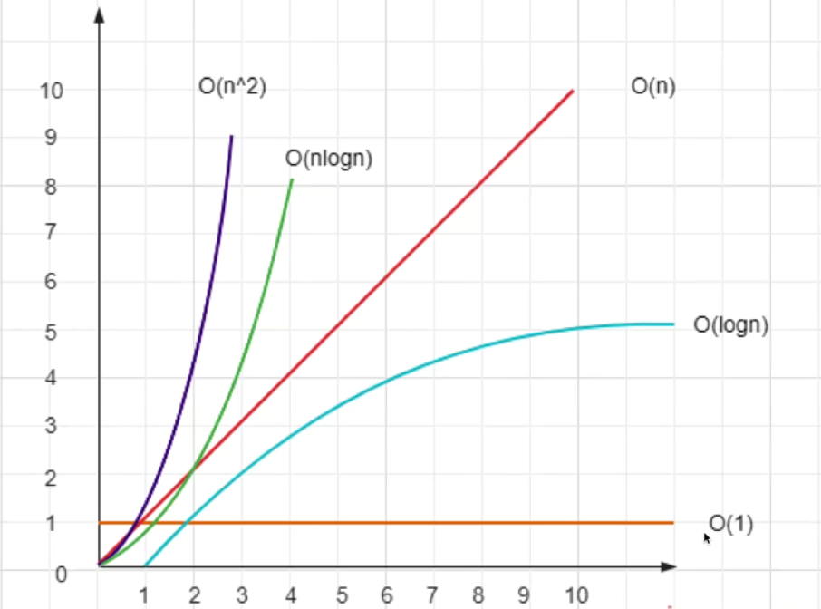 x 轴：输入值 n，y 轴：复杂度

- `O(1)`：可数的，有限的（平铺直叙的执行，**无循环**）

  ```javascript
  function fn(obj = {}, key) {
    // O(1)
    return obj[key]
  }
  ```

- `O(n)`：和传输的数据量一样（单次循环）

  ```javascript
  function fn(arr = []) {
    // O(n)
    for (let i = 0; i < arr.length; i++) {
      console.info(arr[i])
    }
  }
  ```

- `O(n^2)`：数据量的平方，这种算法基本是不可用的（嵌套循环）

  ```javascript
  function fn(arr = []) {
    // O(n^2)
    for (let i = 0; i < arr.length; i++) {
      for (let j = 0; j < arr.length; j++) {
           console.info(arr[j]) 
      }
    }
  }
  ```

- `O(logn)`：数据量的对数（二分法）

- `O(n*logn)`：数据量 * 数据量的对数（嵌套循环，一层是普通循环，一层有二分算法，例如：快速排序算法）


## 空间复杂度

程序执行时需要的内存空间（算法需要额外定义多少变量）

- `O(1)`：定义了为数不多的变量，和 `n` 无关
- `O(n)`：需要定义 `n` 级别的变量，如额外复制一个同样的数组


## 二分查找

- 二分法有一个条件：需要**有序数据**，可排序数据

  **凡有序，必二分**

- 时间复杂度 `O(logn)`

  凡二分，时间复杂度必定包含 `O(logn)`

- 两种实现思路

  - 递归 - 代码逻辑更加简洁

    ```typescript
    export function binarySearch(arr: number[], target: number, startIndex?: number, endIndex?: number): number {
      const length = arr.length
      if (length === 0) return -1
    
      // 开始和结束的范围
      if (startIndex == null) startIndex = 0
      if (endIndex == null) endIndex = length - 1
    
      // 如果 start 和 end 相遇，则结束
      if (startIndex > endIndex) return -1
    
      // 中间位置
      const midIndex = Math.floor((startIndex + endIndex) / 2)
      const midValue = arr[midIndex]
    
      if (target < midValue) {
        // 目标值较小，则继续在左侧查找
        return binarySearch(arr, target, startIndex, midIndex - 1)
      } else if (target > midValue) {
        // 目标值较大，则继续在右侧查找
        return binarySearch(arr, target, midIndex + 1, endIndex)
      } else {
        // 相等，返回
        return midIndex
      }
    }
    
    const arr = [10, 20, 30, 40, 50, 60, 70, 80, 90, 100, 110, 120]
    const target = 40
    console.info(binarySearch(arr, target))
    ```

  - 循环 - 性能更好（就调用一次函数，而递归需要调用很多次函数，创建函数作用域会消耗时间）

    ```typescript
    export function binarySearch(arr: number[], target: number): number {
      const length = arr.length
      if (length === 0) return -1
    
      let startIndex = 0 				// 开始位置
      let endIndex = length - 1 // 结束位置
    
      while (startIndex <= endIndex) {
        const midIndex = Math.floor((startIndex + endIndex) / 2)
        const midValue = arr[midIndex]
        if (target < midValue) {
          // 目标值较小，则继续在左侧查找
          endIndex = midIndex - 1
        } else if (target > midValue) {
          // 目标值较大，则继续在右侧查找
          startIndex = midIndex + 1
        } else {
          // 相等，返回
          return midIndex
        }
      }
      return -1
    }
    
    const arr = [10, 20, 30, 40, 50, 60, 70, 80, 90, 100, 110, 120]
    const target = 40
    console.info(binarySearch(arr, target))
    ```


## 二叉树

### 二叉树结构

树结构，如前端常见的 DOM 树、vdom 结构，二叉树，顾名思义，就是**每个节点最多能有两个子节点**

```typescript
interface ITreeNode {
  value: number // 或其他类型
  left?: ITreeNode
  right?: ITreeNode
}
```


### 二叉树遍历

1. **前序遍历**：root -> left -> right

   ```typescript
   const arr: number[] = []
   // 二叉树前序遍历
   function preOrderTraverse(node: ITreeNode | null) {
     if (node == null) return
     arr.push(node.value)
     preOrderTraverse(node.left)
     preOrderTraverse(node.right)
   }
   ```

2. **中序遍历**：left -> root -> right

   ```typescript
   const arr: number[] = []
   // 二叉树中序遍历
   function inOrderTraverse(node: ITreeNode | null) {
     if (node == null) return
     inOrderTraverse(node.left)
     arr.push(node.value)
     inOrderTraverse(node.right)
   }
   ```

3. **后序遍历**：left -> right -> root

   ```typescript
   const arr: number[] = []
   // 二叉树后序遍历
   function postOrderTraverse(node: ITreeNode | null) {
     if (node == null) return
     postOrderTraverse(node.left)
     postOrderTraverse(node.right) 
     arr.push(node.value)
   }
   ```


### 二叉搜索树 BST 

- 二叉搜索树：查找快，增删快，可使用**二分法**进行快速查找

  数组：查找快 `O(1)`，增删慢 `O(n)`

  链表：查找慢 `O(n)`，增删快 `O(1)`

- 左节点（包括其后代） <= 根节点

- 右节点（包括其后代） >= 根节点 

- 根据 BST 的特点，中序遍历的结果，正好是按照从小到大排序的结果

 

一个二叉搜索树，求其中的第 K 小的节点的值，如图，第 3 小的节点是 `4`

```typescript
/**
 * 寻找 BST 里的第 K 小值
 * @param node tree node
 * @param k 第几个值
 */
export function getKthValue(node: ITreeNode, k: number): number | null {
  // 中序遍历
  inOrderTraverse(node)
  return arr[k - 1] || null
}
```


### 高级二叉树

- 平衡二叉搜索树 BBST ：要求**树左右尽量平衡**

  二叉搜索树 BST ，如果左右不平衡，也无法做到最优，极端情况下，它就成了链表

  - 树高度 `h` 约等于 `logn`
  - 查找、增删，时间复杂度都等于 `O(logn)`

- 红黑树：一种自动平衡的二叉树

  - 节点分 红/黑 两种颜色，通过颜色转换来维持树的平衡
  - 相比于普通平衡二叉树，它维持平衡的效率更高

   

- B 树：物理上是多叉树，但逻辑上是一个 BST 

  用于高效 I/O ，如关系型数据库就用 B 树来组织数据结构。

   


### 堆

JS 执行时代码中的变量，值类型存储到栈，引用类型存储到堆

堆的特点

- 节点的值，总是不大于（或不小于）其父节点的值

  最大堆: 父节点 >= 子节点

  最小堆: 父节点<= 子节点

- 堆是完全二叉树

   

- 堆，虽然逻辑上是二叉树，但实际上它使用数组来存储的
    

  ```javascript
  // 上图是一个堆（从小到大），可以用数组表示
  const heap = [-1, 10, 14, 25, 33, 81, 82, 99] // 忽略 0 节点
  
  // 节点关系
  // i 为堆数组下标
  const parentIndex = Math.floor(i / 2)
  const leftIndex = 2 * i
  const rightIndex = 2 * i + 1
  ```

- 堆的排序规则，没有 BST 那么严格

  - 查询比 BST 慢
  - 增删比 BST 快，维持平衡也更快
  - 但整体复杂度都是 `O(logn)` 级别，即树的高度

- 适用于“堆栈”结构

  - 一般使用内存地址（栈中保存了）来查询，不会直接从根节点搜索
  - 堆的物理结构是数组，根据栈的地址，可用 `O(1)` 找到目标
  - 物理结构是数组（空间更小），逻辑结构是二叉树（操作更快）


## 斐波那契数列

- 计算第 `n` 个斐波那契数列的值

  - `f(0) = 0`
  - `f(1) = 1`
  - `f(n) = f(n - 1) + f(n - 2)` 前两个值的和

- 使用递归计算，时间复杂度是 `O(2^n)` ，不可用

- 使用循环，记录中间结果，时间复杂度降低到 `O(n)`

  ```typescript
  export function fibonacci(n: number): number {
    if (n <= 0) return 0
    if (n === 1) return 1
  
    let n1 = 1 	// 记录 n-1 的结果
    let n2 = 0 	// 记录 n-2 的结果
    let res = 0
  
    // 从2下标开始
    for (let i = 2; i <= n; i++) {
      res = n1 + n2
  
      // 记录中间结果
      n2 = n1
      n1 = res
    }
  
    return res
  }
  ```

- 青蛙跳台阶问题：一只青蛙，一次可以跳 1 个台阶，也可以跳 2 个台阶，问该青蛙跳上 n 级台阶，总共有多少种方式？

  - `f(1) = 1` 跳 1 级台阶，只有一种方式
  - `f(2) = 2` 跳 2 级台阶，有两种方式
  - `f(n) = f(n - 1) + fn(n - 2)` 跳 n 级，可拆分为两个问题
    - 第一次跳，要么 1 级，要么 2 级，只有这两种
    - 第一次跳 1 级，剩下有 `f(n - 1)` 种方式
    - 第一次跳 2 级，剩下有 `f(n - 2)` 种方式


## 双指针

- 遍历一个数组的时候，一次性的利用两个 `index` 去做遍历

- 针对嵌套循环的情况，可用考虑使用双指针，时间复杂度为 `O(n)`

- 移动数字 `0` 问题

  > 定义一个函数，将数组种所有的 `0` 都移动到末尾，例如输入 `[1, 0, 3, 0, 11, 0]` 输出 `[1, 3, 11, 0, 0, 0]`
  >
  > 只移动 `0` ，其他数字顺序不变

  - 如果不限制必须在原数组修改

    定义 `part1` `part2` 两个空数组，遍历数组，非 `0` `push` 到 `part1` ，`0` `push` 到 `part2`，返回 `part1.concat(part2)`

    时间复杂度 `O(n)`，空间复杂度 `O(n)` 

  - 如果限制在原数组基础上修改

    1. 传统方式：遍历数组，遇到 `0` 则 `push` 到数组末尾，然后用 `splice` 截取掉当前元素

        `splice` 和 `unshift` 修改数组结构，时间复杂度是 `O(n)`，总体时间复杂度是 `O(n^2)`，不可用

       **数组是有序结构，不能随意 `splice` `unshift`**

       ```typescript
       function moveZero(arr: number[]): void {
         const length = arr.length
         if (length === 0) return
         let zeroLength = 0
         // O(n^2)
         for (let i = 0; i < length - zeroLength; i++) {
           if (arr[i] === 0) {
             arr.push(0)
             arr.splice(i, 1) 			// 本身就有 O(n)
             i-- 									// 数组截取了一个元素，i 要递减，否则连续 0 就会有错误
             zeroLength++ 					// 累加 0 的长度
           }
         }
       }
       ```

    2. **双指针方式**

       1. 指针 `j` 指向第一个 `0` ，指针 `i` 指向 `j` 后面的第一个非 `0`
       2. 把指针 `i` 和 指针 `j` 进行交换
       3. 指针继续向后移动

       只遍历一次，时间复杂度为 `O(n)`

       ```typescript
       function moveZero(arr: number[]): void {
         const length = arr.length
         if (length === 0) return
       
         let i
         let j = -1 // 指向第一个 0
       
         for (i = 0; i < length; i++) {
           if (arr[i] === 0) {
             // 第一个 0 赋值给 j
             if (j < 0) {
               j = i
             }
           }
       
           if (arr[i] !== 0 && j >= 0) {
             // 交换 i 和 j 的值，继续向后移动
             const n = arr[i]
             arr[i] = arr[j]
             arr[j] = n
       
             j++
           }
         }
       }
       ```


## 快速排序

- 快速排序算法思路是固定的

  1. 找到中间位置 `midValue`
  2. 遍历数组，小于 `midValue` 放在 `left` ，大于 `midValue` 放在 `right`
  3. 继续递归，`concat` 拼接

- 获取 `midValue` 可以通过 `splice` 和 `slice` 两种方式

  单纯比较二者，`slice` 要优于 `splice` ，因为 `splice` 会修改原数组

  但在快速排序算法中，实际性能两者接近

- **时间复杂度 `O(nlogn)`， 有遍历，有二分**

  普通的排序算法（如冒泡排序）时间复杂度时 `O(n^2)`

- 使用 `splice` 思路

  ```typescript
  function quickSort(arr: number[]): number[] {
    const length = arr.length
    if (length === 0) return arr
  
    const midIndex = Math.floor(length / 2)
    const midValue = arr.splice(midIndex, 1)[0]
  
    const left: number[] = []
    const right: number[] = []
  
    // 注意：这里不用直接用 length ，而是用 arr.length 。因为 arr 已经被 splice 给修改了
    for (let i = 0; i < arr.length; i++) {
      const n = arr[i]
      if (n < midValue) {
        // 小于 midValue ，则放在 left
        left.push(n)
      } else {
        // 大于 midValue ，则放在 right
        right.push(n)
      }
    }
    return quickSort(left).concat([midValue], quickSort(right))
  }
  ```

- 使用 `slice` 思路

  ```typescript
  function quickSort(arr: number[]): number[] {
    const length = arr.length
    if (length === 0) return arr
  
    const midIndex = Math.floor(length / 2)
    const midValue = arr.slice(midIndex, midIndex + 1)[0]
  
    const left: number[] = []
    const right: number[] = []
  
    for (let i = 0; i < length; i++) {
      if (i !== midIndex) {
        const n = arr[i]
        if (n < midValue) {
          // 小于 midValue ，则放在 left
          left.push(n)
        } else {
          // 大于 midValue ，则放在 right
          right.push(n)
        }
      }
    }
    return quickSort(left).concat([midValue], quickSort(right))
  }
  ```


## 前端算法题

### 数组旋转

定义一个函数，实现数组的旋转，如输入 `[1, 2, 3, 4, 5, 6, 7]` 和 `key = 3`， 输出 `[5, 6, 7, 1, 2, 3, 4]`<br>
考虑时间复杂度和性能

```typescript
// 思路1
// 将 k 后面的元素，挨个 pop 然后 unshift 到数组前面
// 时间复杂度 O(n^2)，空间复杂度 O(1)
export function rotate1(arr: number[], k: number): number[] {
  const length = arr.length
  if (!k || length === 0) return arr
  const step = Math.abs(k % length) // abs 取绝对值

  // O(n^2)
  for (let i = 0; i < step; i++) {			// O(n)
    const n = arr.pop()
    if (n != null) {
      arr.unshift(n) // 数组是一个有序结构，unshift 操作非常慢！！！ O(n)
    }
  }
  return arr
}
```

```typescript
// 思路2
// 将 k 后面的所有元素拿出来作为 part1，将 k 前面的所有元素拿出来作为 part2，返回 part1.concat(part2)
// 时间复杂度O(1)，空间复杂度O(n)
// 性能更优!!
export function rotate2(arr: number[], k: number): number[] {
  const length = arr.length
  if (!k || length === 0) return arr
  const step = Math.abs(k % length) // abs 取绝对值

  // O(1)
  const part1 = arr.slice(-step) // O(1)
  const part2 = arr.slice(0, length - step)
  const part3 = part1.concat(part2)
  return part3
}
```


### 判断括号匹配

一个字符串内部可能包含 `{ }` `( )` `[ ]` 三种括号，判断该字符串是否是括号匹配的

如 `(a{b}c)` 就是匹配的， `{a(b` 和 `{a(b}c)` 就是不匹配的

```typescript
// 使用栈的概念，先进后出
// 遇到左括号 { ( [ 则入栈
// 遇到右括号 } ) ] 则判断栈顶，相同的则出栈
// 最后判断栈 length 是否为 0
export function matchBracket(str: string): boolean {
  const length = str.length
  if (length === 0) return true

  const stack = []

  const leftSymbols = '{[('			// 左括号
  const rightSymbols = '}])'		// 右括号

  for (let i = 0; i < length; i++) {
    const s = str[i]

    if (leftSymbols.includes(s)) {
      // 匹配左括号，入栈
      stack.push(s)
    } else if (rightSymbols.includes(s)) {
      // 匹配右括号，判断栈顶（是否出栈）
      const top = stack[stack.length - 1]
      if (isMatch(top, s)) {
        stack.pop()
      } else {
        // 有一个不匹配，结果就为false
        return false
      }
    }
  }

  return stack.length === 0
}

// 判断左右括号是否匹配
function isMatch(left: string, right: string): boolean {
  if (left === '{' && right === '}') return true
  if (left === '[' && right === ']') return true
  if (left === '(' && right === ')') return true
  return false
}
```


### 两个栈实现一个队列

用两个栈，来实现队列的功能，实现功能 `add` `delete` `length`

> - 栈，先进后出
>
> - 队列，先进先出

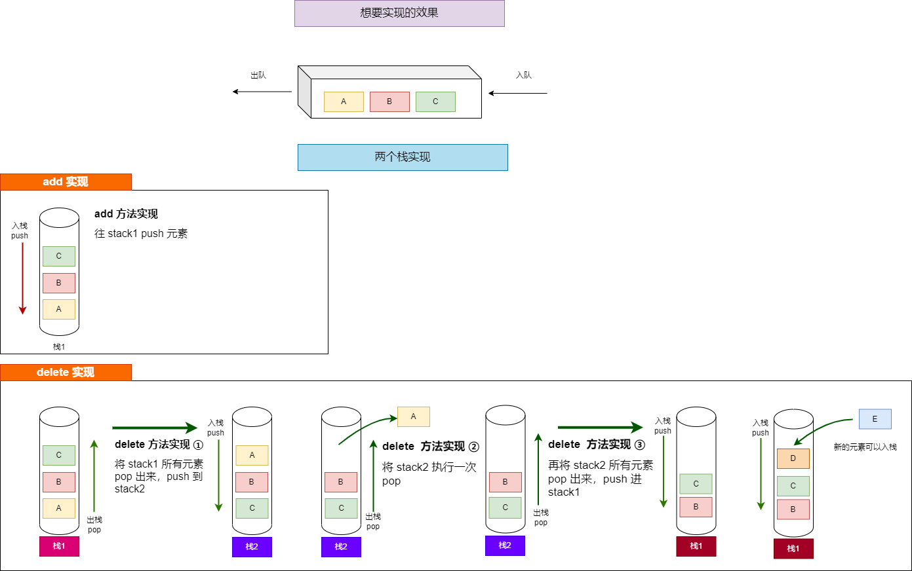  

```typescript
// 两个栈 - 一个队列
export class MyQueue { 
  private stack1: number[] = []
  private stack2: number[] = []
  // 入队
  // 时间复杂度 O(1)
  add(n: number) {
    this.stack1.push(n)
  }
  // 出队
	// 时间复杂度 O(n)
  delete(): number | null {
    let res
    const stack1 = this.stack1
    const stack2 = this.stack2
    // 1.将 stack1 所有元素移动到 stack2 中
    while(stack1.length) {
      const n = stack1.pop()
      if (n != null) {
        stack2.push(n)
      }
    }
    // 2.stack2 pop
    res = stack2.pop()
    // 3. 将 stack2 所有元素“还给”stack1
    while(stack2.length) {
      const n = stack2.pop()
      if (n != null) {
        stack1.push(n)
      }
    }
    return res || null
  }
  get length(): number {
    return this.stack1.length
  }
}
```


### 反转单向链表

定义一个函数，输入一个单向链表的头节点，反转该链表，并输出反转之后的头节点

```typescript
// 单向链表结构
interface ILinkListNode {
  value: number
  next?: ILinkListNode
}
```

```typescript
// 根据数组创建单向链表
function createLinkList(arr: number[]): ILinkListNode {
  const length = arr.length
  if (length === 0) throw new Error('arr is empty')
  let curNode: ILinkListNode = {
    value: arr[length - 1]
  }
  if (length === 1) return curNode
  for (let i = length - 2; i >= 0; i--) {
    curNode = { value: arr[i], next: curNode }
  }
  return curNode
}
const arr = [100, 200, 300, 400, 500]
const list = createLinkList(arr)
console.info('list:', list)
```

```typescript
// 反转单向链表，并返回反转之后的 head node
function reverseLinkList(listNode: ILinkListNode): ILinkListNode {
  // 遍历过程中，至少要存储 3 个指针 prevNode curNode nextNode
  // 定义三个指针
  let prevNode: ILinkListNode | undefined = undefined
  let curNode: ILinkListNode | undefined = undefined
  let nextNode: ILinkListNode | undefined = listNode
  // 以 nextNode 为主，遍历链表
  while(nextNode) {
    // 第一个元素，删掉 next ，防止循环引用
    if (curNode && !prevNode) {
      delete curNode.next
    }
    // 反转指针 
      curNode.next = prevNode
    }
    // 整体向后移动指针
    prevNode = curNode
    curNode = nextNode
    nextNode = nextNode?.next
  }
  // 最后一个的补充：当 nextNode 空时，此时 curNode 尚未设置 next
  curNode!.next = prevNode
  return curNode!
}
const list1 = reverseLinkList(list)
console.info('list1:', list1)
```


### 两数之和

输入一个**递增**的数字数组，和一个数字 `n` ，求和等于 `n` 的两个数字

例如输入 `[1, 2, 4, 7, 11, 15]` 和 `15` ，返回两个数 `[4, 11]`

- 常规思路：嵌套循环，找个一个数，然后再遍历剩余的数，求和，判断，时间复杂度为  `O(n^2)`，不可用

- 使用**双指针**，时间复杂度降低到 `O(n)`

  - 定义 `i` 指向头，`j` 指向尾，求 `arr[i] + arr[j]`
  - 如果大于 `n`，则 `i` 需要向前移动
  - 如果小于 `n`，则 `i` 需要向后移动

  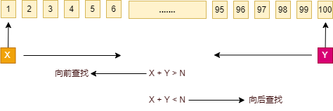 

```typescript
export function findTowNumbers(arr: number[], n: number): number[] {
  const res: number[] = []
  const length = arr.length
  if (length === 0) return res

  let i = 0 					// i 指向头
  let j = length - 1 	// j 指向尾

  // O(n)
  while (i < j) {
    const n1 = arr[i]
    const n2 = arr[j]
    // 求 i + j 的和
    const sum = n1 + n2

    if (sum > n) {
      // sum 大于 n ，则说明需要减少，则 j 要向前移动（递减）
      j--
    } else if (sum < n) {
      // sum 小于 n ，则说明需要增加，则 i 要向后移动（递增）
      i++
    } else {
      // 相等
      res.push(n1)
      res.push(n2)
      break
    }
  }
  return res
}
```


### 连续最多的字符

> 给一个字符串，找出连续最多的字符，以及次数，例如字符串 `'aabbcccddeeee11223'` 连续最多的是 `e` ，`4` 次

- 嵌套循环方式，找出每个字符的连续次数，并记录比较

  时间复杂度看似是 `O(n^2)`， **但实际上时间复杂度是 `O(n)`，因为循环中有跳转**

  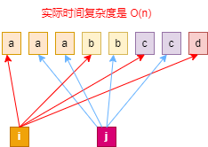 

  ```typescript
  interface IRes {
    char: string
    length: number
  }
  
  function findContinuousChar(str: string): IRes {
    const res: IRes = { char: '', length: 0 }
  
    const length = str.length
    if (length === 0) return res
  
    let tempLength = 0 			// 临时记录当前连续字符的长度
  
    // O(n)
    for (let i = 0; i < length; i++) {
      tempLength = 0 				// 重置
  
      for (let j = i; j < length; j++) {
        if (str[i] === str[j]) {
          tempLength++
        }
  
        if (str[i] !== str[j] || j === length - 1) {
          // 不相等，或者已经到了最后一个元素。要去判断最大值
          if (tempLength > res.length) {
            res.char = str[i]
            res.length = tempLength
          }
  
          if (i < length - 1) {
            i = j - 1 // 跳步
          }
          break
        }
      }
    }
  
    return res
  }
  ```

- 双指针，只有一次循环，时间复杂度是 `O(n)`

  1. 定义指针 `i` 和 `j`，`j` 不动，`i` 继续移动
  2. 如果 `i` 和 `j` 的值一直相等，则 `i` 继续移动
  3. 直到 `i` 和 `j` 的值不相等，记录处理，让 `j` 追上 `i`，继续第一步

   

  ```typescript
  interface IRes {
    char: string
    length: number
  }
  
  function findContinuousChar2(str: string): IRes {
    const res: IRes = { char: '', length: 0 }
    const length = str.length
    if (length === 0) return res
    let tempLength = 0 // 临时记录当前连续字符的长度
    let i = 0
    let j = 0
    // O(n)
    for (; i < length; i++) {
      if (str[i] === str[j]) {
        tempLength++
      }
      if (str[i] !== str[j] || i === length - 1) {
        // 不相等，或者 i 到了字符串的末尾
        if (tempLength > res.length) {
          res.char = str[j]
          res.length = tempLength
        }
        tempLength = 0 // reset
        if (i < length - 1) {
          j = i 			// 让 j “追上” i
          i-- 				// 细节
        }
      }
    }
    return res
  }
  ```


### 判断对称数

> 打印 1-10000 之间的对称数

- 使用数组反转

  1. 数字转换为字符串
  2. 字符串转换为数组 `reverse` ，再 `join` 生成字符串
  3. 比较前后的字符串

  时间复杂度 `O(n)`，但是涉及数组的转换和操作，需要耗费大量的时间

  ```typescript
  // 查询 1-max 的所有对称数（数组反转）
  function findPalindromeNumbers(max: number): number[] {
    const res: number[] = []
    if (max <= 0) return res
    for (let i = 1; i <= max; i++) {
      // 转换为字符串，转换为数组，再反转，比较
      const s = i.toString()
      if (s === s.split('').reverse().join('')) {
        res.push(i)
      }
    }
    return res
  }
  ```

- 使用字符串头尾比较

  1. 数字转换为字符串
  2. 字符串头尾比较

  时间复杂度 `O(n)`

  ```typescript
  // 查询 1-max 的所有对称数（字符串前后比较）
  function findPalindromeNumbers(max: number): number[] {
    const res: number[] = []
    if (max <= 0) return res
    for (let i = 1; i <= max; i++) {
      const s = i.toString()
      const length = s.length
      // 字符串头尾比较
      let flag = true
      let startIndex = 0 								// 字符串开始
      let endIndex = length - 1 				// 字符串结束
      while (startIndex < endIndex) {
        if (s[startIndex] !== s[endIndex]) {
          flag = false
          break
        } else {
          // 继续比较
          startIndex++
          endIndex--
        }
      }
      if (flag) res.push(i)
    }
    return res
  }
  ```

- 生成反转数

  1. 通过 `%` 和 `Math.floor` 将数字生成一个反转数
  2. 比较前后的数字

  时间复杂度 `O(n)`

  ```typescript
  function findPalindromeNumbers3(max: number): number[] {
    const res: number[] = []
    if (max <= 0) return res
    for (let i = 1; i <= max; i++) {
      let n = i
      let rev = 0 // 存储翻转数
      // 生成翻转数
      while (n > 0) {
        rev = rev * 10 + n % 10
        n = Math.floor(n / 10)
      }
      if (i === rev) res.push(i)
    }
    return res
  }
  ```


### 字符串前缀匹配

> 先给一个英文单词库（数组），里面有几十万个英文单词
>
> 再给一个输入框，输入字母，搜索单词
>
> 输入英文字母，要实时给出搜索结果，按前缀匹配
>
> 要求：尽量快，不要使用防抖（输入过程中就及时识别）

- 常规思路：`keyup` 之后，拿当前的单词，遍历词库数组，通过 `indexOf` 来前缀匹配

  算法思路的时间复杂度是 `O(n)`，外加 `indexOf` 也需要时间复杂度，实际的复杂度要超过 `O(n)`

- 哈希表：英文字母一共 26 个，按照第一个字母分组，分为 26 组，再按照第二个、第三个字母分组，以此类推

  在程序初始化时，把数组变成一个树，然后按照字母顺序在树中查找

  这样时间复杂度就大幅度减少，从 `O(n)` 降低到 `O(m)` （`m` 是单词的最大长度）

  ```typescript
  obj.a.r.r.a.y
  ```

  ```typescript
  const arr = [
    'abs',
    'arab',
    'array',
    'arrow',
    'boot',
    'boss',
    // 更多...
  ]
  
  const obj = {
    a: {
      b: {
        s: {}			// abs
      },
      r: {
        a: {
          b: {}		// arab
        },
        r: {
          a: {
            y: {}	// array
          },
          o: {
            w: {}	// arrows
          }
        }
      }
    },
    b: {
      o: {
        o: {
          t: {}	// boot
        },
        s: {
          s: {}	// boss
        }
      }
    },
    // 更多...
  }
  ```


### 数字千分位

> 将数字按照千分位生成字符串，即每三位加一个逗号
>
> 如输入数字 `78100200300` 返回字符串 `'78,100,200,300'`

- 从尾向头计算，和日常遍历的顺序相反

- 使用数组

  ```typescript
  function format(n: number): string {
    n = Math.floor(n) // 只考虑整数
    const s = n.toString()
    // 数组反转，因为逆序判断
    const arr = s.split('').reverse()
    return arr.reduce((prev, val, index) => {
      if (index % 3 === 0) {
        if (prev) {
          return val + ',' + prev
        } else {
          return val
        }
      } else {
        return val + prev
      }
    }, '')
  }
  ```

- 使用字符串拆分，性能较好

  ```typescript
  function format(n: number): string {
    n = Math.floor(n) // 只考虑整数
    let res = ''
    const s = n.toString()
    const length = s.length
    for (let i = length - 1; i >= 0; i--) {
      const j = length - i
      if (j % 3 === 0) {
        if (i === 0) {
          res = s[i] + res
        } else {
          res = ',' + s[i] + res
        }
      } else {
        res = s[i] + res
      }
    }
    return res
  }
  ```

- 使用正则表达式，性能较差


### 切换字母大小写

> 判断字母是大写还是小写，切换字母大小写，输入 `'aBc'` 输出 `'AbC'`

- 使用 `charCodeAt` 获取 ASCII 码

  ```typescript
  function switchLetterCase(s: string): string {
    let res = ''
    const length = s.length
    if (length === 0) return res
    for (let i = 0; i < length; i++) {
      const c = s[i]
      const code = c.charCodeAt(0)
      if (code >= 65 && code <= 90) {
        res += c.toLowerCase()
      } else if (code >= 97 && code <= 122) {
        res += c.toUpperCase()
      } else {
        res += c
      }
    }
    return res
  }
  ```

- 使用正则表达式，性能较差

  ```typescript
  function switchLetterCase(s: string): string {
    let res = ''
    const length = s.length
    if (length === 0) return res
    const reg1 = /[a-z]/
    const reg2 = /[A-Z]/
    for (let i = 0; i < length; i++) {
      const c = s[i]
      if (reg1.test(c)) {
        res += c.toUpperCase()
      } else if (reg2.test(c)) {
        res += c.toLowerCase()
      } else {
        res += c
      }
    }
    return res
  }
  ```


# 数据结构

## 栈 Stack

- 栈是一种遵从**后进先出**原则的有序集合
- 添加新元素的一段称为栈顶，另一端称为栈底
- 操作栈的元素时，**只能从栈顶进行存取操作**（添加、移除、取值）

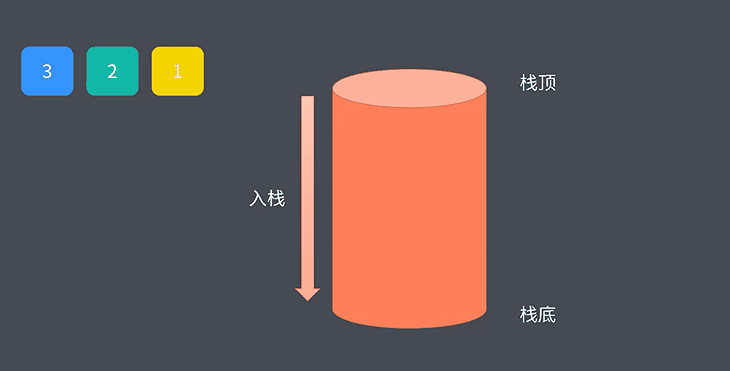 


### 栈的实现

```javascript
class Stack {
  constructor () {
    // 存储栈的数据
    this.data = {}
    // 记录栈的数据个数（相当于数组的 length）
    this.count = 0
  }
  // 实现 push、pop、top、size、clear 方法
}
```

- `push()` 入栈方法

  ```javascript
  class Stack {
    push (item) {
      // 计数方式
      this.date[this.count] = item
      // 入栈后，count 自增
      this.count++
      // 省略上两行写法
      // this.date[this.count] = item
    } 
  }
  const s = new Stack()
  s.push('a')
  s.push('b')
  ```

- `pop()` 出栈方法

  ```javascript
  class Stack {
    pop () {
      // 出栈的前提是栈中存在元素，应先行检测
      if (this.isEmpty()) {
        console.log('栈为空！')
        return
      }
      // 移除栈顶数据
      // 临时存储要被删除的元素，为了最后返回
      const temp = this.data[this.count - 1]
      delete this.data[this.count - 1]
      this.count --
      // 省略上两行写法
      // delete this.data[--this.count]
      return temp
    }
    // 检测栈是否为空
    isEmpty () {
      return this.count === 0
    }
  }
  const s = new Stack()
  s.push('a')
  s.push('b')
  s.push('c')
  s.pop()
  ```

- `top()` 获取栈顶值

  ```javascript
  class Stack {
    top () {
      if (this.isEmpty()) {
        console.log('栈为空！')
        return
      }
      return this.data[this.count - 1]
    }
  }
  const s = new Stack()
  s.push('a')
  s.push('b')
  s.push('c')
  s.top()
  ```

- `size()` 获取栈的元素个数

  ```javascript
  class Stack {
    size () {
      return this.count
    }
  }
  ```

- `clear()` 清空栈

  ```javascript
  class Stack {
    clear () {
      this.data = {}
      this.count = 0
    }
  }
  ```


### 思考题

- 定义包含 `min` 函数的栈

  实现能够获得栈中最小元素的 `min` 函数，调用 `min`、`push`、`pop` 的时间复杂度都是 `O(1)`

  ```javascript
  // 在存储数据的栈外，再新建一个栈，用于存储最小值
  class MinStack {
    constructor () {
      // stack 用于存储数据
      this.stack = {}
      this.count = 0
      // stackMin 用于将数据降序存储（栈顶值为最小值）
      this.stackMin = {}
      this.countMin = 0
    }
    // 入栈
    push (item) {
      // stack 正常入栈
      this.stack[this.count++] = item
      // stackMin 如果没有数据，直接入栈
      // 如果 item 的值 <= stackMin 的最小值，入栈
      if (this.countMin === 0 || item <= this.min()) {
        this.stackMin[this.countMin++] = item
      }
    }
    // 最小值函数
    min () {
      // stackMin的栈顶值
      return this.stackMin[this.countMin - 1]
    }
    // 获取栈顶值
    top () {
      return this.stack[this.count - 1]
    }
    // 出栈
    pop () {
      // 先进行 stackMin 的检测
      // 如果 stack 的栈顶值 === stackMin 的栈顶值，stackMin 出栈
      if (this.top() === this.min()) {
        delete this.stackMin[--this.countMin]
      }
      // stack 出栈
      delete this.stack[--this.count]
    }
  }
  
  const m = new MinStack()
  ```

- 根据气温列表 `[73, 74, 75, 71, 69, 72, 76, 73]` ，获取想要观测到更高的气温，至少需要等待的天数

  正确的返回结果应该是 `[1, 1, 4, 2, 1, 1, 0, 0]`

  ```javascript
  function dailyTemperatures (T) {
    // 创建单调栈用于记录（存储索引值，用于记录天数）
    const stack = [0]
    let count = 1
  
    // 创建结果数组（默认将结果数组使用 0 填充）
    const len = T.length
    const arr = new Array(len).fill(0)
    // 遍历 T
    for (let i = 1; i < len; i++) {
      let temp = T[i]
      // 使用 temp 比较栈顶值，如果栈顶值小，出栈（计算日期差，并存储），并重复操作
      //  - stack[count - 1] 代表栈顶值
      while (count && temp > T[stack[count - 1]]) {
        // 出栈
        let index = stack.pop()
        count--
        // 计算 index 与 i 的差，作为 index 位置的升温日期的天数使用 
        arr[index] = i - index 
      }
      // 处理完毕，当前温度入栈（等待找到后续的更大温度）
      stack.push(i)
      count++
    }
    return arr
  }
  ```


## 队列 Queue

- 队列是一种遵从**先进先出**原则的有序集合
- 添加新元素的一端称为队尾，另一端称为队首

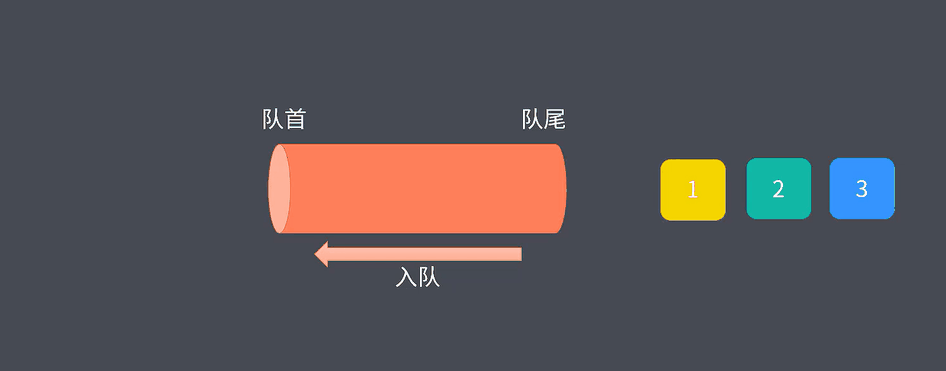 


- 队列的实现

  ```javascript
  class Queue {
    constructor () {
      // 用于存储队列数据
      this.queue = {}
      // 队列元素个数
      this.count = 0
      // 用于记录队首的键(key)，因为对象是无序结构
      this.head = 0
    }
    // 实现 enQueue、deQueue、top、size、clear 方法
  }
  ```

  - `enQueue()` 入队方法

    ```javascript
    class Queue {
      enQueue (item) {
        this.queue[this.count++] = item
      }
    }
    ```

  - `deQueue()` 出队方法

    ```javascript
    class Queue {
      deQueue () {
        if (this.isEmpty()) {
          return
        }
        // 删除 queue 的第一个元素
        const headData = this.queue[this.head]
        delete this.queue[this.head]
        this.head++
        this.count--
        return headData
      }
      isEmpty () {
        return this.count === 0
      }
    }
    ```

  - `top()` 获取队首值

    ```javascript
    class Queue {
      if (this.isEmpty()) {
        return
      }
    	return this.queue[this.head]
    }
    ```

  - `size()` 获取队列元素个数

    ```javascript
    class Queue {
      size () {
        return this.count
      }
    }
    ```

  - `clear()` 清空队列

    ```javascript
    class Queue {
      clear () {
        this.queue = {}
        this.count = 0
        this.head = 0
      }
    }
    ```


## 双端队列 DoubleEndQueue

- 双端队列是**允许同时从队尾和队首两端进行存取操作**的队列
- 双端队列和数组操作类似，只是不允许在数组两端以外的位置进行存取操作

- 双端队列的实现

  ```javascript
  class DoubleEndQueue {
    constructor () {
      // 存储队列数据
      this.queue = {}
      // 记录队尾的键
      this.tail = 0
      // 记录队首的键
      this.head = 0
    }
    isEmpty() {
      return this.size() === 0
    }
    // 实现 addFront、addBack、removeFront、removeBack、frontTop、backTop、size、clear 方法
  }
  ```

  - `addFront()` 队首添加

    ```javascript
    class DoubleEndQueue {
      addFront(item) {
        this.queue[--this.head] = item
      }
    }
    ```

  - `addBack()` 队尾添加

    ```javascript
    class DoubleEndQueue {
      addBack(item) {
        this.queue[this.tail++] = item
      }
    }
    ```

  - `removeFront()`  队首删除

    ```javascript
    class DoubleEndQueue {
      removeFront() {
        if (this.isEmpty()) {
          return
        }
        const headData = this.queue[this.head]
        delete this.queue[this.head++]
        return headData
      }
    }
    ```

  - `removeBack()` 队尾删除

    ```javascript
    class DoubleEndQueue {
      removeBack() {
        if (this.isEmpty()) {
          return
        }
        const backData = this.queue[this.tail - 1]
        delete this.queue[--this.tail]
        return backData
      }
    }
    ```

  - `frontTop()` 获取队首值

    ```javascript
    class DoubleEndQueue {
      frontTop() {
        if (this.isEmpty()) {
          return
        }
        return this.queue[this.head]
      }
    }
    ```

  - `backTop()` 获取队尾值

    ```javascript
    class DoubleEndQueue {
      backTop() {
        if (this.isEmpty()) {
          return
        }
        return this.queue[this.tail - 1]
      }
    }
    ```

  - `size()` 获取队列元素个数

    ```javascript
    class DoubleEndQueue {
      size() {
        // 首尾两项的差
        return this.tail - this.head
      }
    }
    ```

  - `clear()` 清空队列

    ```javascript
    class DoubleEndQueue {
      clear() {
        this.queue = {}
        this.tail = 0
        this.head = 0
      }
    }
    ```

- 思考题

  - 定义一个队列，拥有最大值 `max_value` 函数，尾入队 `push_back` 函数，首出队 `pop_front` 函数

    并且时间复杂度都为 `O(1)`

    ```javascript
    class MaxQueue {
      constructor() {
        // 存储队列数据
        this.queue = {}
        // 双端队列维护最大值（每个阶段的最大值）
        this.deque = {}
        // 准备队列相关的数据
        this.countQ = this.countD = this.headQ = this.headD = 0
      }
      // 队尾入队
      push_back(value) {
        // 数据在 queue 入队
        this.queue[this.countQ++] = value
        // 检测是否可以将数据添加到双端队列
        //   - 队列不能为空
        //   - value 大于队尾值
        while (!this.isEmptyDeque() && value > this.deque[this.countD - 1]) {
          // 删除当前队尾值
          delete this.deque[--this.countD]
        }
        // 将 value 入队
        this.deque[this.countD++] = value
      }
    
      // 队首出队
      pop_front() {
        if (this.isEmptyQueue()) {
          return - 1
        }
        // 比较 deque 与 queue 的队首值，如果相同，deque 出队，否则 deque 不操作
        if (this.queue[this.headQ] === this.deque[this.headD]) {
          delete this.deque[this.headD++]
        }
        // 给 queue 出队，并返回
        const frontData = this.queue[this.headQ]
        delete this.queue[this.headQ++]
        return frontData
      }
    
      // 获取队列最大值
      max_value() {
        if (this.isEmptyDeque()) {
          return -1
        }
        // 返回 deque 队首值即可
        return this.deque[this.headD]
      }
    
      // 检测队列 deque 是否为空
      isEmptyDeque() {
        return !(this.countD - this.headD)
      }
    
      // 检测队列 Queue 是否为空
      isEmptyQueue() {
        return !(this.countQ - this.headQ)
      }
    }
    ```


## 链表

### 链表

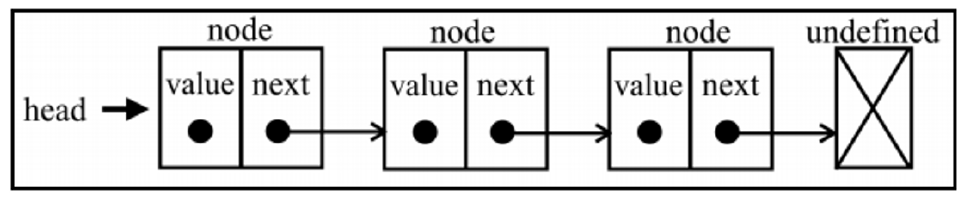 

- 链表是**有序**的数据结构，链表中的每个部分称为节点
- 链表可以**从首、尾、中间进行数据存储**
- 链表的元素**在内存中不必是连续的空间**
- 优点：添加与删除**不会导致其余元素位移**
- 缺点：无法根据索引快速定位元素

- **数组**也可以从首、尾、中间进行数据存储，但是数组在内存中占用一段连续的空间
  添加、移除会导致后续元素位移，**性能开销大**

  - 获取、修改元素时，数组效率高
  - 添加、删除元素时，链表效率高

  ```javascript
  const arr = []
  console.time('perfTest')
  for (let i = 0; i < 100000; i++) {
    arr.push(i)
  }
  console.timeEnd('perfTest')	// 8.226ms
  ```

  ```javascript
  const arr = []
  console.time("perfTest")
  for (let i = 0; i < 100000; i++) {
    arr.unshift(i)
  }
  console.timeEnd("perfTest")	// 1.457s
  ```

- 链表的实现

  ```javascript
  // 节点类
  class LinkedNode {
    constructor (value) {
      this.value = value
      // 用于存储下一个节点的引用
      this.next = null
    }
  }
  ```

  ```javascript
  // 链表类
  class LinkedList {
    constructor () {
      // 链表的元素个数
      this.count = 0
      // 链表的头部元素
      this.head = null
    }
    // 实现 addAtTail、addAtHead、addAtIndex、get、removeAtIndex 方法
  }
  ```

  - `addAtTail()` 添加尾部节点

    ```javascript
    class LinkedList {
      // 添加节点 (尾）
      addAtTail (value) {
        // 创建新节点
        const node = new LinkedNode(value)
        // 检测链表是否存在数据
        if (this.count === 0) {
          this.head = node
        } else {
          // 找到链表尾部节点，将最后一个节点的 next 设置为 node
          let cur = this.head
          while (cur.next != null) {
            cur = cur.next
          }
          cur.next = node
        }
        this.count++
      }
    }
    ```

  - `addAtHead()` 添加头部节点

    ```javascript
    class LinkedList {
      // 添加节点（首）
      addAtHead (value) {
        const node = new LinkedNode(value)
        if (this.count === 0) {
          this.head = node
        } else {
          // 将 node 添加到 head 的前面
          node.next = this.head
          this.head = node
        }
        this.count++
      }
    }
    ```

  - `get()` 根据索引获取节点

    ```javascript
    class LinkedList {
      // 获取节点（根据索引）
      get (index) {
        // 索引参数错误
        if (this.count === 0 || index < 0 || index >= this.count) {
          return
        }
        // 迭代链表，找到对应节点
        let current = this.head
        for (let i = 0; i < index; i++) {
          current = current.next
        }
        return current
      }
    }
    ```

  - `addAtIndex()` 根据索引添加节点

    ```javascript
    class LinkedList {
      // 添加节点（根据索引）
      addAtIndex (value, index) {
        if (this.count === 0 || index >= this.count) {
          return
        }
        // 如果 index <= 0，都添加到头部即可
        if (index <= 0) {
          return this.addAtHead(value)
        }
        // 后面为正常区间处理
        const prev = this.get(index - 1)
        const next = prev.next
    
        const node = new LinkedNode(value)
        prev.next = node
        node.next = next
    
        this.count++
      }
    }
    ```

  - ` removeAtIndex()` 根据索引删除节点

    ```javascript
    class LinkedList {
      // 删除（根据索引）
      removeAtIndex (index) {
        if (this.count === 0 || index < 0 || index >= this.count) {
          return
        }
        if (index === 0) {
          this.head = this.head.next
        } else {
          const prev = this.get(index - 1)
          prev.next = prev.next.next
        }
        this.count--
      }
    }
    ```

- 反转链表

  ```
  输入: 1 -> 2 -> 3 -> 4 -> 5 -> null
  输出: 5 -> 4 -> 3 -> 2 -> 1 -> null
  ```

  - 迭代方式反转链表

    ```javascript
    function reverseList(head) {
      // 声明变量记录 prev、cur
      let prev = null
      let cur = head
      // 当 cur 是节点时，进行迭代
      while (cur) {
        // 先保存当前节点的下一个节点
        const next = cur.next
        cur.next = prev
        prev = cur
        cur = next
      }
      return prev
    };
    ```

  - 递归方式反转链表

    ```javascript
    function reverseList(head) {
      if (head === null || head.next === null) {
        return head
      }
      const newHead = reverseList(head.next)
      // 能够第一次执行这里的节点为 倒数第二个 节点
      head.next.next = head
      // head 的 next 需要在下一次递归执行时设置。当前设置为 null 不影响
      //   - 可以让最后一次（1）的 next 设置为 null
      head.next = null
      return newHead
    };
    ```

    


### 双向链表

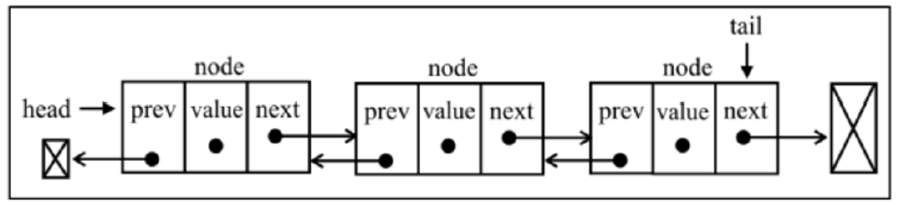 

- 双向链表在普通链表的基础上，**添加了一个用于记录上一个节点的属性 `prev`** ，可以进行双向访问


### 循环链表

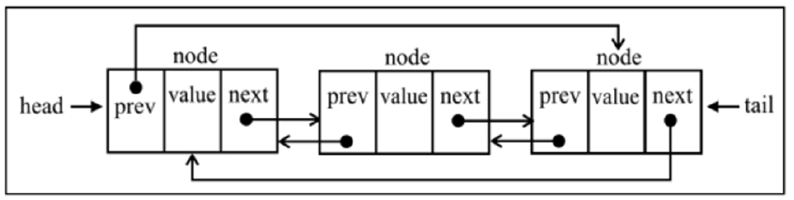 

- 循环链表又称为环形链表，指的是链表最后一个节点的 `next` 指向第一个节点，形成首尾相连的循环结构
- 环的结束点也可以是链表的任意节点


- 环路检测

  https://leetcode.cn/problems/linked-list-cycle/


