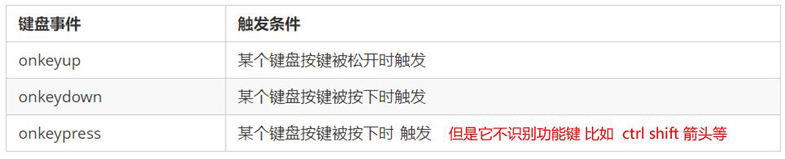
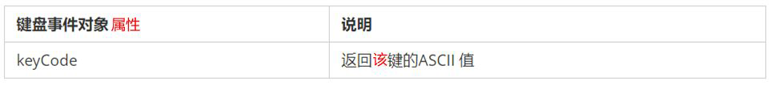
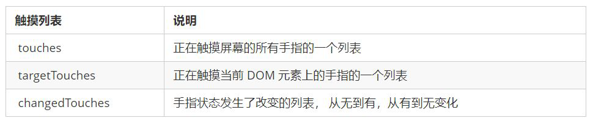
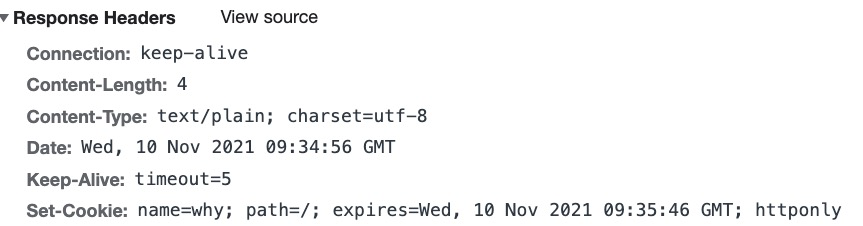
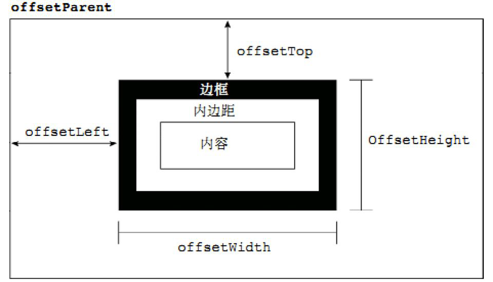
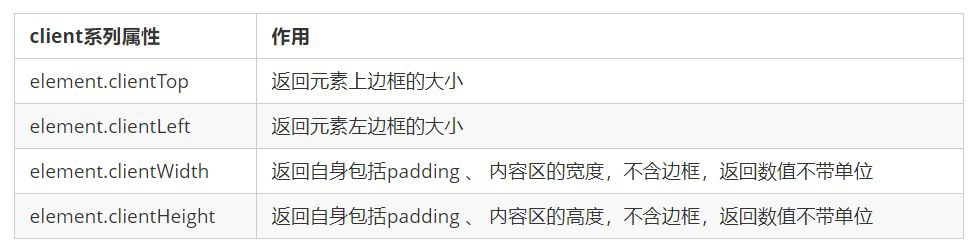
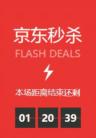

# 节点


## 设置节点


###  复制节点node.cloneNode()

- 返回调用该方法的节点的一个副本
- 括号参数为空或者为 false ，则是浅拷贝，即只克隆复制节点本身，不克隆里面的子节点
- 括号参数为 true ，则是深度拷贝，会复制节点本身以及里面所有的子节点


# 事件

- #####  事件三要素

  1. 获取事件源
  2. 绑定事件类型
  3. 添加事件处理程序

- ##### 事件函数内的`this`指向事件函数的调用者


## 注册事件

###  传统注册

on开头事件注册

`<button onclick=“alert('hi~')”></button>`

`btn.onclick = function() {}`

- ##### 注册事件的唯一性

  同一个元素同一个事件只能设置一个处理函数，最后注册的处理函数将会覆盖前面注册的处理函数

### 方法监听注册addEventListener()

`eventTarget.addEventListener(type, listener[, useCapture])`

1. `type` 事件类型字符串，比如 click 、mouseover ，**不要带 on**

2. `listener` 事件处理函数

3. `useCapture` 可选参数 

   如果是 true，表示在**事件捕获阶段调用**事件处理程序

   如果是 false或者空，表示在**事件冒泡阶段调用**事件处理程序

同一个元素同一个事件**可以注册多个监听器**

按注册顺序依次执行

IE9 之前不支持此方法，可使用 `attachEvent()` 代替


## 删除事件

### 传统注册方式

`eventTarget.onclick = null;`

### 方法监听注册方式

`eventTarget.removeEventListener(type, listener[, useCapture]);`

- IE9 之前`eventTarget.detachEvent(eventNameWithOn, callback);`


## DOM事件流

事件发生时会在元素节点之间按照特定的顺序传播，这个传播过程即 DOM 事件流

**DOM 事件流分为3个阶段**：

1. **捕获阶段**

   由 DOM 最顶层节点开始，然后**逐级向下传播**到到最具体的元素接收的过程

2. **当前目标阶段**

3. **冒泡阶段**

   事件开始时由最具体的元素接收，然后**逐级向上传播**到到 DOM 最顶层节点的过程

**JS 代码中只能执行捕获或者冒泡其中的一个阶段**

- `onclick `和 `attachEvent `只能得到冒泡阶段

- 有些事件没有冒泡，比如 `onblur`、`onfocus`、`onmouseenter`、`onmouseleave`

- 实际开发中很少使用事件捕获，更关注事件冒泡

DOM事件流图解：给一个div 注册了点击事件

   

我们向水里面扔一块石头，首先它会有一个下降的过程，这个过程就可以理解为从最顶层向事件发生的最具
体元素（目标点）的捕获过程；之后会产生泡泡，会在最低点（ 最具体元素）之后漂浮到水面上，这个过
程相当于事件冒泡。

 

验证

```html
<div class="father">
    <div class="son">
        son盒子
    </div>
</div>
```

```javascript
// 捕获阶段 addEventListener 第三个参数为true
// 顺序 document->html>body->father->son
var son = document.querySelector('.son');
son.addEventListener('click', function(){
    alert('son');
}, true);
var father = document.querSelector('.father');
father.addEventListener('click', function(){
   alert('father') 
}, true);
// 点击结果 father->son

// 冒泡阶段 addEventListener 第三个参数为false或者空
// 顺序 son->father->body->html->document
var son = document.querySelector('.son');
son.addEventListener('click', function(){
    alert('son');
}, false);
var father = document.querSelector('.father');
father.addEventListener('click', function(){
   alert('father') 
}, false);
// 点击结果 son->father
```


## 事件对象

### 事件对象event

event 对象代表事件的状态，比如键盘按键的状态、鼠标的位置、鼠标按钮的状态

事件发生后，跟事件相关的一系列信息数据的集合都放到这个对象里面，这个对象就是事件对象event，它有很多属性和方法。比如：

1. 谁绑定了这个事件。
2. 鼠标触发事件的话，会得到鼠标的相关信息，比如鼠标位置。
3. 键盘触发事件的话，会得到键盘的相关信息，比如按了哪个键。

```javascript
// 这个 event 就是事件对象，我们还喜欢的写成 e 或者 evt
eventTarget.onclick = function(event) {}
eventTarget.addEventListener('click', function(event) {}）
```

event 是个**形参**，系统帮我们设定为事件对象，不需要传递实参过去

当注册事件时， event 对象就会被系统自动创建，并依次传递给事件监听器（事件处理函数）

兼容问题：IE6~8浏览器不会给方法传递参数，使用`window.event`获取

解决：`e = e || window.event;`

### 触发事件的对象e.target

- `e.target` 和 `this `的区别

  `this `是事件绑定的元素， 这个函数的调用者（绑定这个事件的元素）

  `e.target `是事件触发的元素

  **`e.target `返回的是触发事件(点击)的对象，`this`返回的是绑定事件(绑定点击)的对象**

  ```html
  <ul>
      <li>abc</li>
  </ul>
  ```

  ```javascript
  var ul = document.querySelector('ul');
  ul.addEventListener('click', function(e){
      // 给ul绑定了事件，this指向的是ul
      console.log(this); 
      
      // 点击的是li，e.target指向的就是li
      console.log(e.target);
  });
  ```

  `currentTarget`和`this`非常相似，但是ie678不兼容

- IE6~8使用`e.srcElement`

### 返回事件类型e.type

返回事件的类型，比如`click`,`mouseover` 不带`on`

### 阻止默认事件e.preventDefault()

阻止链接跳转，阻止提交按钮提交

- ie678 `e.returnValue`

### 阻止事件冒泡e.stopPropagation()

- ie678 `e.cancelBubble = true`


## 事件委托 

事件委托的原理：不在每个子节点单独设置事件监听器，而是事件监听器设置在其父节点上，然后利用冒泡原理影响设置每个子节点。

例如`ul`中有许多`li`，如果给每个 li 注册事件，多次操作DOM会影响性能。

给 `ul `注册点击事件，然后利用事件对象的 `target `来找到当前点击的 `li`，因为点击 `li`，事件会冒泡到 `ul `上，

`ul `有注册事件，就会触发事件监听器。只操作了一次 DOM ，提高了程序的性能


## 鼠标事件

- ##### 常用的鼠标事件

   

  - 禁止鼠标右键菜单

    ```javascript
    // contextmenu 控制何时显示上下文菜单 
    // 取消默认的上下文菜单
    document.addEventListener('contextmenu', function(e) {
    	e.preventDefault();
    })
    ```

  - 禁止鼠标选中

    ```javascript
    // selectstart 开始选中
    document.addEventListener('selectstart', function(e) {
    	e.preventDefault();
    })
    ```

  - `mouseenter`和`mouseove`的区别

    鼠标移动到元素上时就会触发 `mouseenter `事件

    - `mouseover `鼠标经过自身盒子会触发，经过子盒子还会触发
    - `mouseenter `只会经过自身盒子触发
    - `mouseenter`不会冒泡
    - 跟`mouseenter`搭配 鼠标离开 `mouseleave `同样不会冒泡
    
  - 双击事件`ondblclick`

  - 禁止双击选中文字

    `window.getSelection ? window.getSelection().removeAllRanges() : document.selection.empty();`

- ##### 鼠标事件对象`MouseEvent`

   

  - 图片跟随鼠标移动

    ```html
    <style>
        img {
            position: absolute;
            top: 2px;
        }
    </style>
    <body>
        
        <script>
            var pic = document.querySelector('img');
            // 鼠标不断的移动，使用鼠标移动事件： mousemove
            // 在页面中移动，给document注册事件
            // 图片要移动距离，而且不占位置，我们使用绝对定位即可
            document.addEventListener('mousemove', function(){
                // 每次鼠标移动，我们都会获得最新的鼠标坐标， 把这个x和y坐标做为图片的top和left 值就可以移动图片
                var x = e.pageX;
                var y = e.pageY;
                // 要给left和top添加px单位
                // 鼠标移到到图片的中心，往上移到图片高度一半，往左移到图片宽度一半
                pic.style.left = x - 50 + 'px';
                pic.style.top = y - 40 + 'px';
            });
        </script>
    </body>
    ```


## 键盘事件

- ##### 常用键盘事件

   

  - 三个事件的执行顺序是： keydown -- keypress --- keyup

  - `keydown `和 `keypress `在文本框里面时，事件触发的时候，文字还没有落入文本框中

    `keyup`事件触发的时候， 文字已经落入文本框里面了

- ##### 键盘事件对象

   

  - `onkeydown `和 `onkeyup `不区分字母大小写。A 和 a 得到的都是65

    `onkeypress `区分字母大小写


## 触摸事件

- ##### 常用触摸事件

   

- ##### 触摸事件对象

   
  
- ##### 移动端 click 事件延时

  移动端 click 事件会有 300ms 的延时，原因是移动端屏幕双击会缩放(double tap to zoom) 页面。

  系统会等待300ms检查是否是单机事件

  - 解决方案

    1. 禁用缩放。 浏览器禁用默认的双击缩放行为并且去掉 300ms 的点击延迟

       `<meta name="viewport" content="user-scalable=no">`

    2. 利用touch事件自己封装这个事件解决 300ms 延迟

       当我们手指触摸屏幕，记录当前触摸时间

       当我们手指离开屏幕， 用离开的时间减去触摸的时间

       如果时间小于150ms，并且没有滑动过屏幕， 那么我们就定义为点击

       ```javascript
       //封装tap，解决click 300ms 延时
       function tap (obj, callback) {
       	var isMove = false;
       	var startTime = 0; // 记录触摸时候的时间变量
       	obj.addEventListener('touchstart', function (e) {
       		startTime = Date.now(); // 记录触摸时间
       	});
       	obj.addEventListener('touchmove', function (e) {
       		isMove = true; // 看看是否有滑动，有滑动算拖拽，不算点击
       	});
       	obj.addEventListener('touchend', function (e) {
       		if (!isMove && (Date.now() - startTime) < 150) { // 如果手指触摸和离开时间小于150ms 算点击
       			callback && callback(); // 执行回调函数
       		}
       		isMove = false; // 取反 重置
       		startTime = 0;
       	});
       } 
       //调用
       tap(div, function(){ // 执行代码 });
       ```

    3. 使用fastclick 插件


#  BOM 构成

浏览器对象模型，提供了独立于内容而与浏览器窗口进行交互的对象

BOM 比 DOM 更大，它包含 DOM


# window 对象

## 认识window对象

window 对象是浏览器的顶级对象，它具有双重角色

1. **窗口对象**，JS访问浏览器窗口的一个接口

    

   - window：包括全局属性、方法，控制浏览器窗口相关的属性、方法
   - document：当前窗口操作文档的对象
   - location：浏览器连接到的对象的位置（URL）
   - navigator：浏览器信息
   - screen：屏幕窗口信息
   - history：操作浏览器的历史

2. **全局对象**，也就是GO对象

   定义在全局作用域中的变量、函数都会变成 window 对象的属性和方法
   
   默认提供的全局的函数和类：setTimeout、Math、Date、Object等，调用的时候可以略 window

window窗口对象包含的内容

1. 属性：localStorage、console、location、history、screenX、scrollX等等
2. 方法：alert、close、scrollTo、open等等
3. 事件：focus、blur、load、hashchange等等
4. 从EventTarget继承来的方法：addEventListener、removeEventListener、dispatchEvent

MDN文档：https://developer.mozilla.org/zh-CN/docs/Web/API/Window


## location对象

location对象用于表示当前链接到的URL信息，location其实是URL的一个抽象实现

 

### 常见属性

- ##### location.href：获取或设置整个URL，设置`location.href`可以跳转页面

- ##### location.protocol：当前的协议（http、https）

- ##### location.host：主机地址（域名，如www.baidu.com，带端口）

- ##### location.hostname：主机地址(不带端口)

- ##### location.origin：URL的协议、主机名和端口号（如https://www.baidu.com）

- ##### location.port：端口号

- ##### location.pathname：路径

- ##### location.search：查询字符串

- ##### location.hash：哈希值（#后面的内容） 


### 常见方法

- ##### location.assign()：赋值一个新的URL，并且跳转到该URL中（重定向页面）

  ```javascript
  location.assign("http://www.baidu.com")
  // 等于
  location.href = "http://www.baidu.com"
  ```

- ##### location.replace()：替换当前页面（不记录历史，无法后退页面）

  ```javascript
  location.replace("http://www.baidu.com")
  ```

- ##### location.reload()：重新加载页面，相当于刷新按钮或f5，参数是true则强制刷新ctrl+f5


## history对象

history对象允许我们访问浏览器曾经的会话历史记录

### 常见属性

- ##### history.length：会话中的记录条数

- ##### history.state：当前保留的状态值


### 常见方法

- ##### history.go()：加载历史中的某一页

- ##### history.back()：返回上一页，等价于history.go(-1)

- ##### history.forward()：前进下一页，等价于history.go(1)

- ##### history.pushState()：打开一个指定的地址（网页不会刷新，不会请求资源，会保存历史）

  可以监听路径的改变，匹配加载相对应的组件进行渲染

  `history.pushState(state, title[, url])`

  - state：状态对象
  - title：网页标题，大部分浏览器不支持
  - url：跳转的网页

  ```javascript
  // 不会真实跳转detail.html页面，也不会检测detail.html页面是否存在
  history.pushState({name: "demo"}, "", "/detail")
  console.log(history.state);
  // {name: "demo"}
  ```

- ##### history.replaceState()：打开一个指定的地址（网页不会刷新，不会请求资源，会替换掉之前页面的历史记录）


## navigator对象

navigator对象用它来查询当前浏览器的相关信息

- ##### navigator.userAgent：返回当前浏览器的用户代理信息

  判断用户在哪个终端打开页面，实现跳转

  ```javascript
  if((navigator.userAgent.match(/(phone|pad|pod|iPhone|iPod|ios|iPad|Android|Mobile|BlackBerry|IEMobile|MQQBrowser|JUC|Fennec|wOSBrowser|BrowserNG|WebOS|Symbian|Windows Phone)/i))) {
  	window.location.href = ""; //手机
  } else {
  	window.location.href = ""; //电脑
  }
  ```


# window 属性


# window 方法

## 定时器 setTimeout

设置一个定时器，该定时器在定时器到期后执行调用函数

```javascript
window.setTimeout(调用函数, [延迟的毫秒数]);
```

- 延迟的毫秒数省略默认是 0，如果写，必须是毫秒

- 停止 `setTimeout() `定时器

  `clearTimeout()`方法取消先前通过调用` setTimeout() `建立的定时器。

  ```javascript
  window.clearTimeout(timeoutID)
  ```

  里面的参数就是定时器的标识符 


## 定时器 setInterval

重复调用一个函数，每隔这个时间，就去调用一次回调函数

```javascript
window.setInterval(回调函数, [间隔的毫秒数]);
```

- 间隔的毫秒数省略默认是 0，如果写，必须是毫秒，表示每隔多少毫秒就自动调用这个函数

- 第一次执行也是间隔毫秒数之后执行，之后每隔毫秒数就执行一次

- 停止 `setInterval() `定时器

  `clearInterval()`方法取消了先前通过调用 `setInterval()`建立的定时器。

  ```javascript
  window.clearInterval(intervalID);
  ```

  里面的参数就是定时器的标识符


## 滚动窗口 scroll

滚动窗口至文档中的特定位置

```javascript
window.scroll(x, y)
```

- x和y 不跟单位，直接写数字


## 输入对话框 prompt

prompt(text) 浏览器弹出用户输入框


# window 事件

- ##### 窗口加载事件(完全加载完成)

  ```javascript
  window.onload = function(){}
  window.addEventListener("load",function(){});
  ```

  - `window.onload`是窗口 (页面）加载事件，当文档内容完全加载完成会触发该事件(包括图像、脚本文件、CSS文件等), 就调用的处理函数。
  - 因为 `onload `是等页面内容全部加载完毕，再去执行处理函数。所以JS 代码可以写到页面元素的上方
  - `window.onload` 传统注册事件方式 只能写一次，如果有多个，会以最后一个 `window.onload` 为准
  - 如果使用 `addEventListener `来注册`load`则没有限制
  - a标签的超链接，F5或者刷新按钮（强制刷新），前进后退按钮 都会触发 load 事件

- ##### 窗口加载事件(DOM加载完成)

  ```javascript
  document.addEventListener('DOMContentLoaded',function(){})
  ```

  - `DOMContentLoaded `事件触发时，仅当DOM加载完成，不包括样式表，图片，flash等等
  - Ie9以上才支持

- ##### 重新加载页面

  ```javascript
  window.addEventListener("pageshow",function(){});
  ```

  - `pageshow`和`load`的区别

    - 火狐浏览器中有个“往返缓存”特点，这个缓存中不仅保存着页面数据，还保存了DOM和JavaScript的状态。

      实际上是将整个页面都保存在了内存里。所以此时后退按钮不能刷新页面。

    - `pageshow`在页面显示时触发，无论页面是否来自缓存
    - 重新加载页面中，`pageshow`会在`load`事件触发后触发

  - `persisted`属性用来判断是否是缓存中的页面触发

- ##### 调整窗口大小事件

  ```javascript
  window.onresize = function(){}
  window.addEventListener("resize",function(){});
  ```

  - 只要窗口大小发生像素变化，就会触发这个事件
  - 可以利用这个事件完成响应式布局。`window.innerWidth` 当前屏幕的宽度


# 数据存储

## 会话存储

### 生命周期和特性

window.sessionStorage：**会话存储**

**生命周期为关闭浏览器窗口**，在**同一个窗口(页面)下数据可以共享**，以**键值对的形式存储使用**

1. 关闭网页后重新打开：不会保留
2. 在页面内实现跳转：保留
3. 在页面外实现跳转（打开新的网页）：不会保留

数据存储在用户浏览器中，容量较大，sessionStorage约5M

**只能存储字符串**，可以将对象JSON.stringify() 编码后存储

### 存储数据

`sessionStorage.setItem(key, value)`

访问当前域名下的会话存储对象，把key和value添加到存储中

```javascript
sessionStorage.setItem("name", "coderwhy")
sessionStorage.setItem("age", 18)
```

### 获取数据

`var value = sessionStorage.getItem(key)`

返回key对应的value

```javascript
sessionStorage.setItem("name", "coderwhy")
sessionStorage.setItem("age", 18)
console.log(sessionStorage.getItem("age"))
// 18
```

### 获取键名

`var keyName = sessionStorage.key(key)`

接受一个数值n作为参数，返回存储中的第n个key名称（键的存储顺序是由用户代理定义的，尽可能不使用）

```javascript
sessionStorage.setItem("name", "coderwhy")
sessionStorage.setItem("age", 18)
console.log(sessionStorage.key(0))
// age
```

### 获取长度

`var length = sessionStorage.length`

只读属性，存储在会话存储对象中的数据项数量

```javascript
sessionStorage.setItem("name", "coderwhy")
sessionStorage.setItem("age", 18)
console.log(sessionStorage.length)
for (let i = 0; i < sessionStorage.length; i++) {
  const key = sessionStorage.key(i)
  console.log(sessionStorage.getItem(key))
}
// 2
// 18
// coderwhy
```

### 删除数据

`sessionStorage.removeItem(key)`

把传入的key从存储中删除

```javascript
sessionStorage.setItem("name", "coderwhy")
sessionStorage.setItem("age", 18)
sessionStorage.removeItem("age")
```

### 清空数据

`sessionStorage.clear()`

清空存储中的所有key

```javascript
localStorage.setItem("name", "coderwhy")
sessionStorage.setItem("age", 18)
sessionStorage.clear()
```


## 本地存储

### 生命周期和特性

window.localStorage：**本地存储**

声明周期**永久生效**，除非手动删除，否则**关闭页面也会存在**

可以多窗口（页面）共享（**同一浏览器可以共享**），以**键值对的形式存储使用**

1. 关闭网页后重新打开：保留
2. 在页面内实现跳转：保留
3. 在页面外实现跳转（打开新的网页）：保留

数据存储在用户浏览器中，容量较大，localStorage约20M

只能存储字符串，可以将对象JSON.stringify() 编码后存储

### 存储数据

`localStorage.setItem(key, value)`

访问当前域名下的本地存储对象，把key和value添加到存储中

```javascript
localStorage.setItem("name", "coderwhy")
localStorage.setItem("age", 18)
```

### 获取数据

`var value = localStorage.getItem(key)`

返回key对应的value

```javascript
localStorage.setItem("name", "coderwhy")
localStorage.setItem("age", 18)
console.log(localStorage.getItem("age"))
// 18
```

### 获取键名

`var keyName = localStorage.key(key)`

接受一个数值n作为参数，返回存储中的第n个key名称（键的存储顺序是由用户代理定义的，尽可能不使用）

```javascript
localStorage.setItem("name", "coderwhy")
localStorage.setItem("age", 18)
console.log(localStorage.key(0))
// age
```

### 获取长度

`var length = localStorage.length`

只读属性，存储在本地存储对象中的数据项数量

```javascript
localStorage.setItem("name", "coderwhy")
localStorage.setItem("age", 18)
console.log(localStorage.length)
for (let i = 0; i < localStorage.length; i++) {
  const key = localStorage.key(i)
  console.log(localStorage.getItem(key))
}
// 2
// 18
// coderwhy
```

### 删除数据

`localStorage.removeItem(key)`

把传入的key从存储中删除

```javascript
localStorage.setItem("name", "coderwhy")
localStorage.setItem("age", 18)
localStorage.removeItem("age")
```

### 清空数据

`localStorage.clear()`

清空存储中的所有key

```javascript
localStorage.setItem("name", "coderwhy")
localStorage.setItem("age", 18)
sessionStorage.clear()
```

### 存储工具类封装

为了让对Storage使用更加方便，可以对其进行工具类封装

```javascript
class MyCache {
  constructor(isLocal = true) {
    this.storage = isLocal ? localStorage: sessionStorage
  }

  setItem(key, value) {
    if (value) {
      this.storage.setItem(key, JSON.stringify(value))
    }
  }

  getItem(key) {
    let value = this.storage.getItem(key)
    if (value) {
      value = JSON.parse(value)
      return value
    } 
  }

  removeItem(key) {
    this.storage.removeItem(key)
  }

  clear() {
    this.storage.clear()
  }

  key(index) {
    return this.storage.key(index)
  }

  length() {
    return this.storage.length
  }
}

const localCache = new MyCache()
const sessionCache = new MyCache(false)

export {
  localCache,
  sessionCache
}
```


## Cookie

### 认识Cookie

Cookie是一小段的文本信息(key-Value格式)，一般用来存储数据，比如用户的登录状态

Http协议本身是无状态的，服务器无法判断用户身份。浏览器向服务器发送请求，如果服务器需要记录该用户状态，就使用**response向浏览器颁发一个Cookie**记录用户状态，**浏览器会把Cookie保存起来**，当浏览器再请求该网站时，浏览器会把**请求的网址连同该Cookie一同提交给服务器**。服务器检查该Cookie状态，以此辨认用户状态



Cookie总是保存在客户端中，按在客户端中的存储位置，Cookie可以分为内存Cookie和硬盘Cookie

- 内存Cookie：

  没有设置过期时间，默认情况下cookie是内存cookie

  内存Cookie由浏览器维护，保存在内存中，浏览器关闭时Cookie就自动删除

- 硬盘Cookie：

  有设置过期时间，并且过期时间不为0或者负数的cookie，是硬盘cookie

  硬盘Cookie保存在硬盘中，有一个过期时间，用户手动清理或者过期时间到时，才会被清理

cookie的**生命周期**：

通过设置expires或者max-age来设置过期的时间

- expires：设置Date.toUTCString()，设置格式是`;expires=date-in-GMTString-format；`
- max-age：设置过期的秒数，`;max-age=max-age-in-seconds `(例如一年为60*60*24*365)；

cookie的**作用域**：（允许cookie发送给哪些URL）

- Domain：指定哪些主机可以接受cookie

  如果不指定，那么默认是origin，不包括子域名

  如果指定，则包含子域名（例如，如果设置Domain=mozilla.org，则Cookie 也包含在子域名中（如developer.mozilla.org））

- Path：指定主机下哪些路径可以接受cookie

  例如，设置Path=/docs，则以下地址都会匹配：

  /docs、/docs/Web/、/docs/Web/HTTP

cookie的**缺点**

1.  存储的数据量小，大约4kb
2.  默认浏览器关掉就会过期，但是可以自己设置过期时间
3.  安全性不好，每次请求头都会带着Cookie
4.  跨域问题

现在常用localStorage去存**token**做处理，存储数据量大，不会过期

### 客户端设置

- ##### 设置Cookie

  可以设置多个

  `document.cookie = '键=值; expires=过期时间'`

  `document.cookie = '键=值; max-age=过期秒数'`

  不设置过期时间就是内存Cookie，会在会话关闭时被删除掉

  `document.cookie = '键=值;' `

- ##### 获取Cookie

  获取字符串形式：username=zhangsan; age=18，获取之后可以使用split拆分成数组

  `document.cookie`

- ##### 删除Cookie

  设置为过期日期，也要设置domain和path，参数完全一样才能删除掉

  ```javascript
  document.cookie = `name=;expires=${ new Date(0).toUTCString() };domain=.example.com;path=/`
  ```

  如果Cookie的HttpOnly的属性是true的时候，只能通过服务器清除


## IndexedDB

IndexedDB是一种底层的API，用于在客户端存储大量的结构化数据

是一种事务型数据库系统，是一种基于JavaScript面向对象数据库，类似于NoSQL（非关系型数据库）

 

### 建立数据库连接

打开indexDB的某一个数据库，**建立数据库连接**

`var openRequest = indexDB.open(数据库名称, 数据库版本号)`

open方法会返回IDBOpenDBRequest类型结果

如果数据库不存在，会创建这个数据库，已经存在，则打开

```javascript
const dbRequest = indexedDB.open("demo", 1)
```

通过监听回调得到**数据库连接结果**

1. onerror：当数据库连接失败时回调

2. onsuccess：当数据库连接成功时回调

   通过回调的event获取到db对象：event.target.result

3. onupgradeneeded：当数据库第一次打开或者版本升级时回调

   通常在这里创建具体的存储对象：db.createObjectStore(存储对象名称, { keypath: 存储的主键})

```javascript
let db = null
// 数据库连接成功
dbRequest.onsuccess = function(event) {
  // 连接成功时，获取DB对象
  db = event.target.result
}
// 据库连接失败
dbRequest.onerror = function(err) {
  console.log("打开数据库失败~")
}
// 第一次打开/或者版本发生升级
dbRequest.onupgradeneeded = function(event) {
  const db = event.target.result
  // 创建存储对象
  db.createObjectStore("users", { keyPath: "id" })
}

```


### 数据库操作

对数据库的操作通过**事务对象**来完成

1. 通过db获取对应存储的事务：`var transaction = db.transaction(存储名称, 读写权限readonly | readwrite)`
2. 通过事务获取对应的存储对象：`var store = transaction.objectStore(存储名称)`

```html
<button>新增</button>
<button>查询</button>
<button>删除</button>
<button>修改</button>
```

```javascript
class User {
  constructor(id, name, age) {
    this.id = id
    this.name = name
    this.age = age
  }
}
const users = [
  new User(100, "why", 18),
  new User(101, "kobe", 40),
  new User(102, "james", 30),
]

// 获取btns, 监听点击
const btns = document.querySelectorAll("button")
for (let i = 0; i < btns.length; i++) {
  btns[i].onclick = function() {

    // 指定操作表的名字和操作模式，表名参数可以是数组指定多个
    const transaction = db.transaction("users", "readwrite")
    // 指定表名，从事务中拿store
    const store = transaction.objectStore("users")

    switch(i) {
      case 0:
        console.log("点击了新增")
        break
      case 1:
        console.log("点击了查询")
        break
      case 2:
        console.log("点击了删除")
        break
      case 3:
        console.log("点击了修改")
        break
    }
  }
}
```

**增删改查操作**

- ##### 新增数据：store.add

  ```javascript
  for (let i = 0; i < btns.length; i++) {
    btns[i].onclick = function() {
      const transaction = db.transaction("users", "readwrite")
      const store = transaction.objectStore("users")
      switch(i) {
        case 0:
          console.log("点击了新增")
          for (const user of users) {
            const request = store.add(user)
            // 监听当前数据是否添加成功
            request.onsuccess = function() {
              console.log(`${user.name}插入成功`)
            }
          }
          // 监听当前事务中，是否添加成功
          transaction.oncomplete = function() {
            console.log("添加操作全部完成")
          }
          break
      }
    }
  }
  ```

- ##### 查询数据

  1. 通过 store.get(key)

     ```javascript
     for (let i = 0; i < btns.length; i++) {
       btns[i].onclick = function() {
         const transaction = db.transaction("users", "readwrite")
         const store = transaction.objectStore("users")
         switch(i) {
           case 1:
             console.log("点击了查询")
             // 根据主键查询
             const request = store.get(102)
     		request.onsuccess = function(event) {
     		  console.log(event.target.result)
     		}
             break
         }
       }
     }
     // 点击了查询
     // {id: 102, name: 'james', age: 30}
     ```

  2. 通过 store.openCursor 拿到游标对象

     在request.onsuccess中获取cursor：event.target.result

     - 获取对应的key：cursor.key

     - 获取对应的value：cursor.value

     - 继续执行：cursor.continue

       指针最初是指向第一条数据的，cursor.continue接着指向下一条

        

     ```javascript
     for (let i = 0; i < btns.length; i++) {
       btns[i].onclick = function() {
         const transaction = db.transaction("users", "readwrite")
         const store = transaction.objectStore("users")
         switch(i) {
           case 1:
             console.log("点击了查询")
             const request = store.openCursor()
             request.onsuccess = function(event) {
               // 获取游标
               const cursor = event.target.result
               if (cursor) {
                 if (cursor.key === 101) {
                   console.log(cursor.key, cursor.value)
                 } else {
                   cursor.continue()
                 }
               } else {
                 console.log("查询完成")
               }
             }
             break
         }
       }
     }
     // 点击了查询
     // {id: 101, name: 'kobe', age: 40}
     ```

- ##### 删除数据：cursor.delete()

  ```javascript
  for (let i = 0; i < btns.length; i++) {
    btns[i].onclick = function() {
      const transaction = db.transaction("users", "readwrite")
      const store = transaction.objectStore("users")
      switch(i) {
        case 2:
          console.log("点击了删除")
          const deleteRequest = store.openCursor()
          deleteRequest.onsuccess = function(event) {
            const cursor = event.target.result
            if (cursor) {
              if (cursor.key === 101) {
                // 删除对应游标的数据
                cursor.delete()
              } else {
                cursor.continue()
              }
            } else {
              console.log("查询完成")
            }
          }
          break
      }
    }
  }
  ```

- ##### 修改数据：cursor.update(value)

  ```javascript
  for (let i = 0; i < btns.length; i++) {
    btns[i].onclick = function() {
      const transaction = db.transaction("users", "readwrite")
      const store = transaction.objectStore("users")
      switch(i) {
        case 3:
          console.log("点击了修改")
          const updateRequest = store.openCursor()
          updateRequest.onsuccess = function(event) {
            const cursor = event.target.result
            if (cursor) {
              if (cursor.key === 101) {
                // 获取value，修改
                const value = cursor.value;
                value.name = "curry"
                cursor.update(value)
              } else {
                cursor.continue()
              }
            } else {
              console.log("查询完成")
            }
          }
          break
      }
    }
  }
  ```


# 浏览器缓存

浏览器的缓存分为**强制缓存**和**协商缓存**，都可以通过后台设置响应头控制

- ##### 强制缓存

  不会向服务器发生请求，直接从缓存中读取资源。每次访问本地缓存直接验证检测是否过期

  强制缓存可以通过设置两种HTTP Header实现

  - 过期时间Expires

  - 缓存控制Cache-Control

    Cache-Control:max-age=300 缓存300秒

- ##### 协商缓存(Last-Modified / If-Modified-Since和Etag / If-None-Match)

  协商缓存命中，服务器会将这个请求返回，但不会返回这个资源的数据，而是告诉客户端可以直接从缓存中读取

**强制缓存优先于协商缓存进行**，弱强制缓存(Expires / Cache-Control)生效则直接使用缓存

浏览器缓存执行过程

1. 浏览器加载资源时，先根据资源的http header去判断它是否强缓存，强缓存如果命中，浏览器就直接从缓存中加载这个css，连请求都不会发送到服务器

   例如某个css文件，如果浏览器在加载网页时，这个css文件的缓存配置命中了强缓存，浏览器就直接从缓存中加载这个css，不会发送请求到服务器

2. 当强缓存过期时，浏览器一定会发送一个请求到服务器。如果请求中的header命中协商缓存，服务器会将这个请求返回，但是不会返回请求数据，会告诉客户端可以直接从缓存中加载资源

3. 如果协商缓存没有命中，浏览器直接从服务器加载数据资源

强缓存和协商缓存的共同点

1. 如果命中，都是从客户端缓存中加载资源

强缓存和协商缓存的不同点

1. 强缓存不发送请求到服务器
2. 协商缓存会发送请求到服务器


# 网页特效

## 元素偏移量 

- ##### `offset`相关属性可以动态的得到该元素的位置（偏移）、大小

   

   

  - 返回的数值都不带单位

  - `element.offsetParent`返回带有定位的父亲，否则返回的是body

    `element.parentNode`返回的是最近一级的父亲，不管父亲有没有定位

  - `offset `与 `style `区别

    - `offset `可以得到任意样式表中的样式值

      `style `只能得到行内样式表中的样式值

    - `offset `系列获得的数值是没有单位的

      `style.width` 获得的是带有单位的字符串

    - `offsetWidth `包含`padding`+`border`+`width`

      `style.width` 获得不包含`padding`和`border `的值

    - `offsetWidth `等属性是只读属性，只能获取不能赋值

      `style.width` 是可读写属性，可以获取也可以赋值

    - 想要获取元素大小位置，用`offset`更合适

      想要给元素更改值，则需要用`style`改变
    
  - `offset` 经常用于获取元素位置


## 元素可视区

- `client`相关属性可以获取元素可视区的相关信息

   

   

  - `clientWidth`和`clientHeight`获得的长度不包含边框，`offsetWidth`和`offsetHeight`包含边框
  - `client`经常用于获取元素大小


## 元素滚动

- `scroll`相关属性可以动态的得到该元素的大小、滚动距离等

   

   

  - 当滚动条向下滚动时，页面上面被隐藏掉的高度就是被卷去的头部

  - 元素被卷去的头部是 `element.scrollTop`,`element.scrollLeft`

    页面被卷去的头部 则是 `window.pageYOffset`,`window.pageXOffset`
    
    - `window.pageYOffset`,`window.pageXOffset` IE9开始支持
    
    - 兼容写法
    
      声明了 DTD，使用 `document.documentElement.scrollTop`
    
      未声明 DTD，使用 `document.body.scrollTop`

- ##### 滚动条滚动事件`onscroll`

  ```javascript
  document.addEventListener('scroll', function(){});
  ```


## 常见网页特效案例

### 倒计时

- ##### 功能需求

   

- ##### 实现方案

  ```html
   <div>
  	<span class="hour">1</span>
  	<span class="minute">2</span>
  	<span class="second">3</span>
   </div>
  ```

  ```javascript
  // 1. 获取元素 
  var hour = document.querySelector('.hour'); // 小时的黑色盒子
  var minute = document.querySelector('.minute'); // 分钟的黑色盒子
  var second = document.querySelector('.second'); // 秒数的黑色盒子
  var inputTime = +new Date('2019-5-1 18:00:00'); // 返回的是用户输入时间总的毫秒数
  countDown(); // 第一次执行也是间隔毫秒数，我们先调用一次这个函数，防止第一次刷新页面有空白 
  // 2. 开启定时器
  setInterval(countDown, 1000);
  function countDown() {
      var nowTime = +new Date(); // 返回的是当前时间总的毫秒数
      var times = (inputTime - nowTime) / 1000; // times是剩余时间总的秒数 
      var h = parseInt(times / 60 / 60 % 24); //时
      h = h < 10 ? '0' + h : h;
      hour.innerHTML = h; // 把剩余的小时给 小时黑色盒子
      var m = parseInt(times / 60 % 60); // 分
      m = m < 10 ? '0' + m : m;
      minute.innerHTML = m;
      var s = parseInt(times % 60); // 当前的秒
      s = s < 10 ? '0' + s : s;
      second.innerHTML = s;
  }
  ```


### 轮播图

- ##### 功能需求

  1. 鼠标经过轮播图模块，左右按钮显示，离开隐藏左右按钮。
  2. 点击右侧按钮一次，图片往左播放一张，以此类推， 左侧按钮同理。
  3. 图片播放的同时，下面小圆圈模块跟随一起变化。
  4. 点击小圆圈，可以播放相应图片。
  5. 鼠标不经过轮播图， 轮播图也会自动播放图片。
  6. 鼠标经过，轮播图模块， 自动播放停止。

   

- ##### 实现方案

  ```html
  <div class="focus">
      <!-- 左侧按钮 -->
      <a href="javascript:;" class="arrow-l">&lt;</a>
      <!-- 右侧按钮 -->
      <a href="javascript:;" class="arrow-r">&gt;</a>
      <!-- 核心的滚动区域 -->
      <ul>
          <li><a href="#"></a></li>
          <li><a href="#"></a></li>
          <li><a href="#"></a></li>
          <li><a href="#"></a></li>
      </ul>
      <!-- 小圆圈 -->
      <ol class="circle">
      </ol>
  </div>
  ```

  ```javascript
  // 获取元素
  var arrow_l = document.querySelector('.arrow-l');
  var arrow_r = document.querySelector('.arrow-r');
  var focus = document.querySelector('.focus');
  var ul = focus.querySelector('ul');
  var ol = focus.querySelector('.circle');
  
  // 鼠标经过focus 就显示左右按钮
  focus.addEventListener('mouseenter', function() {
      arrow_l.style.display = 'block';
      arrow_r.style.display = 'block';
      // 鼠标经过focus 就停止定时器
      clearInterval(timer);
      timer = null; // 清除定时器变量
  });
  
  // 鼠标离开focus 就隐藏左右按钮
  focus.addEventListener('mouseleave', function() {
      arrow_l.style.display = 'none';
      arrow_r.style.display = 'none';
      // 鼠标离开focus 就开启定时器
      timer = setInterval(function() {
          //手动调用右箭头的点击事件
          arrow_r.click();
      }, 2000);
  });
  
  // 自动播放轮播图
  var timer = setInterval(function() {
  	//手动调用点击事件
  	arrow_r.click();
  }, 2000);
  
  var focusWidth = focus.offsetWidth;
  // 点击右侧按钮一次，就让图片滚动一张
  // 右侧按钮点击一次，自增1
  var num = 0;
  // 控制小圆圈的播放 每次点击自增1
  var circle = 0;
  
  // 根据图片数量，动态生成小圆圈
  for (var i = 0; i < ul.children.length; i++) { 
      // 创建一个li
      var li = document.createElement('li');
      // 通过自定义属性来记录当前小圆圈的索引号
      li.setAttribute('index', i);
      // 把li插入到ol里面
      ol.appendChild(li);
      
      // 绑定小圆圈的点击事件
      li.addEventListener('click', function(){
          // 所有li清除current类名
  		for (var i = 0; i < ol.children.length; i++) {
              ol.children[i].className = '';
          }
          // 当前的li设置current 类名
          this.className = 'current';
          // 获得当前点击的li的索引号
          var index = this.getAttribute('index');
          // 当点击了某个li 就要把这个li 的索引号给 num 和 circle
  		num = index;
          circle = index;
          
          // 点击小圆圈，移动图片 移动的是 ul
          // ul 的移动距离 小圆圈的索引号 乘以 图片的宽度 注意是负值
          animate(ul, -index * focusWidth);
      });
  }
  
  // 默认ol里面的第一个li设置类名为 current
  ol.children[0].className = 'current';
  
  // 图片无缝滚动 克隆第一张图片(li)放到ul最后面 深克隆
  // 因为小圆圈已经动态生成完毕，多一张图片不会影响小圆圈的数量
  var first = ul.children[0].cloneNode(true);
  ul.appendChild(first);
  
  // 节流阀 防止轮播图按钮连续点击造成播放过快
  // 当上一个函数动画内容执行完毕，再去执行下一个函数动画，让事件无法连续触发
  var flag = true;
  
  // 右侧按钮
  arrow_r.addEventListener('click', function() {
      if (flag) {
          // 关闭节流阀
          flag = false;
          // 如果走到了最后复制的一张图片，此时ul要快速复原 left 改为 0，去到第一张图片
          if (num == ul.children.length - 1) {
              ul.style.left = 0;
              num = 0;
          }
          // 按钮点击一次，自增1
          num++;
          animate(ul, -num * focusWidth, function() {
              // 打开节流阀
              flag = true;
          });
          // 小圆圈跟随一起变化
          circle++;
          // 走到最后克隆的这张图片，就复原
          if (circle == ol.children.length) {
              circle = 0;
          }
          // 调用函数
          circleChange();
      }
  });
  
  // 左侧按钮
  arrow_l.addEventListener('click', function() {
      if (flag) {
          flag = false;
          if (num == 0) {
              num = ul.children.length - 1;
              ul.style.left = -num * focusWidth + 'px';
          }
          num--;
          animate(ul, -num * focusWidth, function() {
              flag = true;
          });
          circle--;
          // 如果circle < 0  说明第一张图片，则小圆圈要改为最后一个小圆圈
          circle = circle < 0 ? ol.children.length - 1 : circle;
      }
  });
  
  // 动画函数
  function animate(obj, target, callback) {
      // 先清除以前的定时器，只保留当前的一个定时器执行
      clearInterval(obj.timer);
  	obj.timer = setInterval(function() {
          // 步长为一个慢慢变小的值
          // 步长公式：(目标值 - 现在的位置) / 10
          var step = (target - obj.offsetLeft) / 10;
  		// 步长值改为整数
          // 如果是正值，则步长 往大了取整
          // 如果是负值，则步长 向小了取整
          step = step > 0 ? Math.ceil(step) : Math.floor(step);
          if (obj.offsetLeft == target) {
  			// 停止动画
              clearInterval(obj.timer);
              // 回调函数写到定时器结束里面
              callback && callback();
          }
          obj.style.left = obj.offsetLeft + step + 'px';
      }, 15);
  }
  
  function circleChange() {
      // 先清除其余小圆圈的current类名
      for (var i = 0; i < ol.children.length; i++) {
  		ol.children[i].className = '';
  	}
      // 留下当前的小圆圈的current类名
      ol.children[circle].className = 'current';
  }
  ```


### 返回顶部

- ##### 功能需求

  1. 原先侧边栏是绝对定位
  2. 当页面滚动到一定位置，侧边栏改为固定定位
  3. 页面继续滚动，会让 返回顶部显示出来

- ##### 实现方案

  ```html
  <div class="slider-bar">
  	<span class="goBack">返回顶部</span>
  </div>
  <div class="header w">头部区域</div>
  <div class="banner w">banner区域</div>
  <div class="main w">主体部分</div>
  ```

  ```javascript
  // 获取元素
  var sliderbar = document.querySelector('.slider-bar');
  var banner = document.querySelector('.banner');
  var main = document.querySelector('.main');
  var goBack = document.querySelector('.goBack');
  
  // 侧边栏发生变化时的被卷去头部的大小 要写到滚动的外面
  var bannerTop = banner.offsetTop
  // 侧边栏固定定位之后，要变化成的定位数值
  var sliderbarTop = sliderbar.offsetTop - bannerTop;
  var mainTop = main.offsetTop;
  
  // 页面滚动事件 scroll
  document.addEventListener('scroll', function() {
      
      // 当页面滚动到banner盒子，此时侧边栏就要改为固定定位 
      if (window.pageYOffset >= bannerTop) {
          sliderbar.style.position = 'fixed';
          sliderbar.style.top = sliderbarTop + 'px';
      } else {
          sliderbar.style.position = 'absolute';
          sliderbar.style.top = '300px';
      }
      // 当页面滚动到main盒子，就显示 goback模块
      if (window.pageYOffset >= mainTop) {
          goBack.style.display = 'block';
      } else {
          goBack.style.display = 'none';
      }
  });
  
  // 点击返回顶部模块，就让窗口滚动的页面的最上方
  goBack.addEventListener('click', function() {
      animate(window, 0);
  });
  
  // 动画函数
  function animate(obj, target, callback) {
      // 先清除以前的定时器，只保留当前的一个定时器执行
      clearInterval(obj.timer);
      obj.timer = setInterval(function() {
          // 步长为一个慢慢变小的值
          // 步长公式：(目标值 - 现在的位置) / 10
          var step = (target - window.pageYOffset) / 10;
  		// 步长值改为整数
          // 如果是正值，则步长 往大了取整
          // 如果是负值，则步长 向小了取整
          step = step > 0 ? Math.ceil(step) : Math.floor(step);
          if (window.pageYOffset == target) {
  			// 停止动画
              clearInterval(obj.timer);
              // 回调函数写到定时器结束里面
              callback && callback();
          }
  		window.scroll(0, window.pageYOffset + step);
      }, 15);
  }
  ```

  

###  悬停效果

- ##### 功能需求

  1. 鼠标经过某个li， 悬停图片跟这到当前li位置

  2. 鼠标离开某个li， 悬停图片复原为原来的位置

  3. 鼠标点击了某个li， 悬停图片就会留在点击这的个li 的位置

      

- ##### 实现方案

  ```javascript
  // 获取元素
  var cloud = document.querySelector('.cloud');
  var c_nav = document.querySelector('.c-nav');
  var lis = c_nav.querySelectorAll('li');
  
  // 给所有的li绑定事件
  // current做为筋斗云的起始位置
  var current = 0;
  for (var i = 0; i < lis.length; i++) {
      // 鼠标经过把当前li 的位置做为目标值
      lis[i].addEventListener('mouseenter', function() {
          animate(cloud, this.offsetLeft);
      });
      
      // 鼠标离开就回到起始的位置
      lis[i].addEventListener('mouseleave', function() {
  		animate(cloud, current);
  	});
      
      // 当我们鼠标点击，就把当前位置做为目标值
      lis[i].addEventListener('click', function() {
  		current = this.offsetLeft;
  	});
  }
  
  function animate(obj, target, callback) {
      clearInterval(obj.timer);
      obj.timer = setInterval(function() {
          var step = (target - obj.offsetLeft) / 10;
          step = step > 0 ? Math.ceil(step) : Math.floor(step);
          if (obj.offsetLeft == target) {
              clearInterval(obj.timer);
              callback && callback();
          }
          obj.style.left = obj.offsetLeft + step + 'px';
      }, 15);
  }
  ```


### 模态框拖拽效果

- ##### 功能需求

   

- ##### 实现方案

  ```javascript
  var login = document.querySelector('.login');
  // 鼠标按下触发的事件源是 最上面一行，就是 id 为 title
  var title = document.querySelector('#title');
  
  // 触发事件是鼠标按下 mousedown， 鼠标移动mousemove 鼠标松开 mouseup
  title.addEventListener('mousedown', function(e) {
      // 鼠标按下，我们要得到鼠标在盒子的坐标
  	var x = e.pageX - login.offsetLeft;
  	var y = e.pageY - login.offsetTop;
      
      // 鼠标移动，就让模态框的坐标 设置为 ： 鼠标坐标 减去盒子坐标即可，注意移动事件写到按下事件里面。
  	// 鼠标移动的时候，把鼠标在页面中的坐标，减去 鼠标在盒子内的坐标就是模态框的left和top值
  	document.addEventListener('mousemove', move);
  
      // 拖拽过程: 鼠标移动过程中，获得最新的值赋值给模态框的left和top值， 这样模态框可以跟着鼠标走了
  	function move(e) {
          // 鼠标的坐标 减去 鼠标在盒子内的坐标， 才是模态框真正的位置。
      	login.style.left = e.pageX - x + 'px';
      	login.style.top = e.pageY - y + 'px';
  	}
      
      // 鼠标松开，就停止拖拽，就是可以让鼠标移动事件解除
   	document.addEventListener('mouseup', function() {
  		document.removeEventListener('mousemove', move);
  	});
  })
  ```


### 放大镜效果

- ##### 功能需求

   

- ##### 实现方案

  ```javascript
  // 小图片盒子
  var preview_img = document.querySelector('.preview_img');
  // 黄色遮挡层
  var mask = document.querySelector('.mask');
  // 大图片盒子
  var big = document.querySelector('.big');
  // 大图片
  var bigIMg = document.querySelector('.bigImg');
  
  // 鼠标经过小图片盒子， 黄色的遮挡层 和 大图片盒子显示
  preview_img.addEventListener('mouseover', function() {
  	mask.style.display = 'block';
  	big.style.display = 'block';
  });
  // 离开隐藏2个盒子功能
  preview_img.addEventListener('mouseout', function() {
  	mask.style.display = 'none';
  	big.style.display = 'none';
  });
  
  // 黄色的遮挡层跟随鼠标功能。
  preview_img.addEventListener('mousemove', function(e){
      
      // 先计算出鼠标在盒子内的坐标
  	var x = e.pageX - this.offsetLeft;
  	var y = e.pageY - this.offsetTop;
      
      // 减去盒子高度的一半 就是我们mask 的最终 left 和top值了
      var maskX = x - mask.offsetWidth / 2;
      var maskY = y - mask.offsetHeight / 2;
      
      // 遮挡层的最大移动距离 小图片盒子宽度 减去 遮挡层盒子宽度
      var maskMax = preview_img.offsetWidth - mask.offsetWidth;
      
      // 遮挡层不能超出小图片盒子范围
      // 如果x 坐标小于了0 就让他停在0 的位置
      // 如果大于遮挡层最大的移动距离，就把坐标设置为最大的移动距离
  	if (maskX <= 0) {
  		maskX = 0;
  	} else if (maskX >= maskMax) {
  		maskX = maskMax;
  	}
  	if (maskY <= 0) {
  		maskY = 0;
  	} else if (maskY >= maskMax) {
  		maskY = maskMax;
  	}
      
      // 遮挡层移动
      mask.style.left = maskX + 'px';
      mask.style.top = maskY + 'px';
      
      // 大图片最大移动距离
      var bigMax = bigIMg.offsetWidth - big.offsetWidth;
      
  	// 大图片的移动距离 = 遮挡层移动距离 * 大图片最大移动距离 / 遮挡层的最大移动距离
      var bigX = maskX * bigMax / maskMax;
      var bigY = maskY * bigMax / maskMax;
      
      // 大图片跟随移动
      bigIMg.style.left = -bigX + 'px';
      bigIMg.style.top = -bigY + 'px';
  });
  ```


### 移动端拖动元素

- ##### 实现方案

  ```html
  <style>
  	div {
  	    position: absolute;
  	    left: 0;
  	    width: 100px;
  	    height: 100px;
  	    background-color: pink;
  	}
  </style>
  
  <body>
      <div></div>
  </body>
  ```

  ```javascript
  var div = document.querySelector('div');
  
  //手指初始坐标
  var startX = 0;
  var startY = 0;
  
  //盒子原来的位置
  var x = 0;
  var y = 0;
  
  // 触摸元素 touchstart：  获取手指初始坐标，同时获得盒子原来的位置
  div.addEventListener('touchstart', function(e) {
  	//  获取手指初始坐标
      startX = e.targetTouches[0].pageX;
      startY = e.targetTouches[0].pageY;
      x = this.offsetLeft;
      y = this.offsetTop;
  });
  
  // 移动手指 touchmove：  计算手指的滑动距离，并且移动盒子
  div.addEventListener('touchmove', function(e) {
      //  计算手指的移动距离： 手指移动之后的坐标减去手指初始的坐标
      var moveX = e.targetTouches[0].pageX - startX;
      var moveY = e.targetTouches[0].pageY - startY;
      
      // 移动盒子 盒子原来的位置 + 手指移动的距离
      this.style.left = x + moveX + 'px';
      this.style.top = y + moveY + 'px';
      // 阻止屏幕滚动的默认行为
      e.preventDefault();
  });
  ```

  

### 移动端轮播图

- ##### 功能需求

  1. 自动播放图片

  2. 手指可以拖动播放轮播图

      

- ##### 实现方案

  ```css
  .focus {
      position: relative;
      padding-top: 44px;
      overflow: hidden;
  }
  
  .focus img {
      width: 100%;
  }
  
  .focus ul {
      overflow: hidden;
      width: 500%;
      margin-left: -100%;
  }
  
  .focus ul li {
      float: left;
      width: 20%;
  }
  
  .focus ol {
      position: absolute;
      bottom: 5px;
      right: 5px;
      margin: 0;
  }
  
  .focus ol li {
      display: inline-block;
      width: 5px;
      height: 5px;
      background-color: #fff;
      list-style: none;
      border-radius: 2px;
      transition: all .3s;
  }
  
  .focus ol li.current {
      width: 15px;
  }
  ```

  ```html
  <!-- 焦点图模块 -->
  <div class="focus">
      <ul>
          <li></li>
          <li></li>
          <li></li>
          <li></li>
          <li></li>
      </ul>
      <!-- 小圆点 -->
      <ol>
          <li class="current"></li>
          <li></li>
          <li></li>
      </ol>
  </div>
  ```

  ```javascript
  // 获取元素
  var focus = document.querySelector('.focus');
  var ul = focus.children[0];
  var ol = focus.children[1];
  
  // 获得focus 的宽度
  var w = focus.offsetWidth;
  
  // 利用定时器自动轮播图图片
  var index = 0;
  var timer = setInterval(function() {
      index++;
      // 索引号乘以宽度 去滚动图片
      var translatex = -index * w;
      // 过渡效果
      ul.style.transition = 'all .3s';
      // 移动端移动，可以使用translate 移动
      ul.style.transform = 'translateX(' + translatex + 'px)';
  }, 2000);
  
  // 监听过渡完成的事件 transitionend
  // 判断条件是要等到图片滚动完毕再去判断，就是过渡完成后判断
  ul.addEventListener('transitionend', function() {
      
      if (index >= 3) {
          // 如果索引号等于 3 说明走到最后一张图片，此时 索引号要复原为 0
          index = 0;
          // 去掉过渡效果 让ul快速的跳到目标位置
          ul.style.transition = 'none';
          // 利用最新的索引号乘以宽度 去滚动图片
          var translatex = -index * w;
          ul.style.transform = 'translateX(' + translatex + 'px)';
          
      } else if (index < 0) {
          // 如果索引号小于0，说明是倒着走，索引号等于2
          index = 2;
          ul.style.transition = 'none';
          var translatex = -index * w;
          ul.style.transform = 'translateX(' + translatex + 'px)';
      }
      // 小圆点跟随变化
      // 把ol里面li带有current类名的选出来去掉类名
      ol.querySelector('.current').classList.remove('current');
      // 让当前索引号的li 加上 current
      ol.children[index].classList.add('current');
  });
  
  // 触摸元素 touchstart： 获取手指初始坐标
  var startX = 0;
  var moveX = 0;
  // 手指是否移动
  var flag = false;
  
  // 触摸元素 touchstart： 获取手指初始坐标
  ul.addEventListener('touchstart', function(e) {
  	startX = e.targetTouches[0].pageX;
      // 手指触摸的时候就停止定时器
      clearInterval(timer);
  });
  
  // 移动手指 touchmove： 计算手指的滑动距离， 并且移动盒子
  ul.addEventListener('touchmove', function(e) {
  	// 计算移动距离
      moveX = e.targetTouches[0].pageX - startX;
      // 移动盒子：  盒子原来的位置 + 手指移动的距离 
      var translatex = -index * w + moveX;
      // 手指拖动的时候，不需要动画效果所以要取消过渡效果
      ul.style.transition = 'none';
      ul.style.transform = 'translateX(' + translatex + 'px)';
      // 如果用户手指移动过再去判断，否则不做判断效果
      flag = true;
      // 阻止滚动屏幕的行为
      e.preventDefault();
  });
  
  // 离开手指 touchend: 根据滑动的距离分不同的情况
  ul.addEventListener('touchend', function(e) {
      if (flag) {
          // 如果移动距离大于50像素我们就播放上一张或者下一张
          if (Math.abs(moveX) > 50) {
              // 如果是右滑就是 播放上一张 moveX 是正值
              if (moveX > 0) {
              	index--;
              } else {
  				// 如果是左滑就是 播放下一张 moveX 是负值
  				index++;
  			}
              var translatex = -index * w;
              ul.style.transition = 'all .3s';
              ul.style.transform = 'translateX(' + translatex + 'px)';
          } else {
              // 如果移动距离小于50像素我们就回弹
              var translatex = -index * w;
              ul.style.transition = 'all .1s';
              ul.style.transform = 'translateX(' + translatex + 'px)';
          }
      }
      
      // 手指离开的时候就重新开启定时器
      clearInterval(timer);
  	timer = setInterval(function() {
  	    index++;
  	    var translatex = -index * w;
  	    ul.style.transition = 'all .3s';
  	    ul.style.transform = 'translateX(' + translatex + 'px)';
  	}, 2000);
  });
  ```

  

