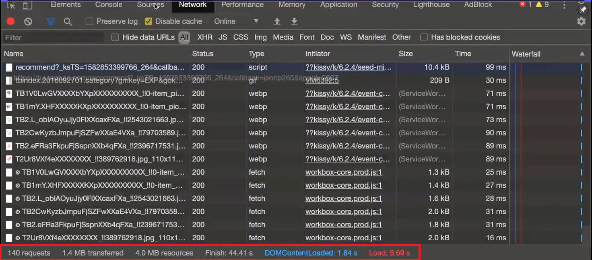
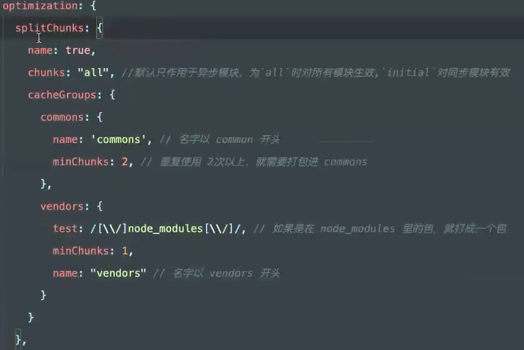

# 加载优化

## 首页加载慢的优化

### 首页加载图片过多

- ##### 使用图片懒加载的方式减少首屏图片的加载量

  ```html
  
  <!-- 滚动到特定的位置的时候 -->
  
  ```

  懒加载的原理就是**监听滚动条事件**，如果**滚动条距离浏览器顶部的高度**等于**图片距离顶部的高度**，就将data-src的值赋值到src上

- ##### 分别使用iconfont和精灵图来处理小图标和小图片

  对于纯色系的小图标可以使用iconfont来解决

  - 设置font-family的CSS属性

  对于彩色的小图片可以使用精灵图

  - 把所有小图片拼接到一张大图片上，使用background-position的CSS属性来修改图片坐标


### 首页的请求量过多

通过工具查看哪些类型的资源请求过多

- ##### 通过浏览器的Network可以确定首页加载的资源和请求量

   

  - request：请求数量
  - resource：前端资源总大小
  - Finish：请求总时间
  - DOMContentLoaded：浏览器已经完全加载了HTML，其他静态资源（JS，CSS，图片等）并没有下载完毕（只能看，不能用的状态）的时间
  - Load：浏览器已经加载了所有静态资源（能用的状态）的时间

- ##### 通过浏览器的Converge来查看代码的使用状况

   

  - 可以看出哪些代码虽然加载了但是没有执行（蓝色是使用的代码，红色是未使用的代码）

  - 只针对JS和CSS

  没有执行的代码可以考虑使用懒加载

- #####  减少资源的请求量

  1. 通过**Nginx服务器**（可用作CDN，用来处理静态资源）来做资源文件合并combin

     **将多个javascript，css文件合并成一个**（Nginx插件nginx-http-concat）

     【扩展】服务器按照功能区分

     - 应用服务器：服务端语言运行的服务器
     - 数据集服务器：放数据库的服务器
     - 存储服务器：放大型文件的服务器
     - CDN服务器：放静态资源的服务器（JS，CSS，图片，字体等）

  2. 通过打包工具（Webpack）来做资源文件的物理打包（相对没有第一种灵活）

- ##### 代码层面优化

  1. 如果引入了大型的第三方库，可以通过Babel插件来**按需加载**
  2. 使用前端路由懒加载（只限SAP应用）


### 首页请求的静态资源过大

- ##### Webpack打包优化

  CSS和JS可以通过Webpack来进行混淆和压缩

  **混淆**：将js代码进行字符串加密（最大程度减少代码，比如将长变量名变成单个字母等等）

  **压缩**：去除注释空行以及console.log等调试代码

  webpack4开始，会根据选择的mode来执行不同的优化，优化也可以手动配置和重写。优化相关配置在optimization配置中管理

  使用Webpack+dynamic import并结合路由的入口文件做拆包处理

  - development：不混淆，不压缩，不优化
  - production：混淆+压缩，自动内置优化

  **打包策略**：我们通常会把第三方包达成一个包，公共的代码打一个包，非公共的代码打一个包

  - 第三方包（node_modules）：改动频率小
  - 公共代码包（src代码的公共的组件等）：改动频率中
  - 非公共代码包：改动频率高

  **打包策略结合网络缓存**来做优化

  - 对于不需要经常变动的资源（第三方包），可以使用Cache-Control: max-age=3153600（缓存一年）并配合协商缓存Etag使用（一旦文件名变动才会下载新文件）
  - 需要频繁变动的资源（代码包），可以使用Cache-Control: no-cache并配合Etag使用，表示该资源已被缓存，但是每次都会发送请求询问资源是否更新

   

- ##### 图片进行压缩

  - 通过自动化工具来压缩图片

    熊猫站tinypng.com，减少颜色的数量以及不必要的数据来实现文件压缩

    ```
    npm install --save tinify
    ```

  - 对图片进行转码 -> base64格式

    base64格式图片的作用是减少资源的数量，但是base64格式图片会增大原有图片的体积

  - 使用Webp格式

- ##### 服务器开启gzip进行全部资源压缩

  - gzip是一种压缩文件格式，可以对任何文件进行压缩（类比于文件压缩）
  - 可以通过nginx服务器的配置项进行开启（/user/local/etc/nginx）

- ##### 实现CDN加速

  CDN（内容分发网络），放静态资源的服务器（JS，CSS，图片，字体）

  CDN服务器就是在家门口放一台服务器，把所有静态资源都同步到家门口这台服务器，以后只要访问这个网站，就直接从这台服务器上下载静态资源

  CDN服务器的地址一般都跟主服务器的地址不同，可以破除浏览器对同一个域名发送请求的限制（HTTP1.1）

   


# 渲染优化

无论是浏览器中DOM和BOM，还是NodeJS，它们都是基于JavaScript引擎之上开发出来的。DOM和BOM的处理最终都是要被转换成JavaScript引擎能够处理的数据，这个转换很耗时间。在浏览器中最消耗性能的就是操作DOM

**尽可能的减少DOM的操作**

- 在渲染的时候，可以使用document.createDocumentFragment**创建虚拟节点**，从而避免不必要的渲染

- 采用分段渲染的方式，最后使用window.requestAnimationFrame来**逐帧渲染**
- React的虚拟DOM，用JS数据来模拟真实DOM树，从而大大减少操作真实DOM的次数

虚拟节点渲染

```javascript
// 插入十万条数据
const total = 10000;
let ul = document.querySelector('ul');

function add() {
    // 创建虚拟节点，使用document.createDocumentFragment 不会触发渲染
    const fragment = document.createDocumentFragment();
    // 渲染十万次
    for (let i = 0; i< total; i++) {
        const li = document.createElement('li');
        li.innerText = Math.floor(Math.random() * total);
        fragment.appendChild(li);
    }
    // 最后把虚拟节点append到ul上
    ul.appendChild(fragment);；
}
add();
```

逐帧渲染

```javascript
// 插入十万条数据
const total = 10000;
let ul = document.querySelector('ul');

// 分段渲染
// 渲染屏幕显示的数量
const once = 20;
// 全部渲染完需要多少次
const loopCount = total / once;
// 已经渲染多少次
let countHasRender = 0;

function add() {
    // 创建虚拟节点，使用document.createDocumentFragment 不会触发渲染
    const fragment = document.createDocumentFragment();
    // 循环20次
    for (let i = 0; i < once; i++) {
        const li = document.createElement('li');
        li.innerText = Math.floor(Math.random() * total);
        frgament.appendChlid(li);
    }
    // 最后把虚拟节点append到ul上
    ul.appendChild(fragment);
    // 已经渲染的次数+1
    countHasRender += 1;
    loop();
}

function loop() {
    // 如果还没有渲染完，那么就使用requestAnimationFrame 来继续渲染
    if (countHasRender < loopCount) {
        // requestAnimationFrame 叫做逐帧渲染
        // 帧，一秒钟播放多少张图片，一秒钟播放的图片越多，动画就越流畅
        // 类似于 setTimeout(add, 16);
        // 1000/60 = 16 人眼一秒钟看60张图片比较舒适
        // requestAnimationFrame保证是60帧
        window.requestAnimationFrame(add);
    }
}
loop();
```


