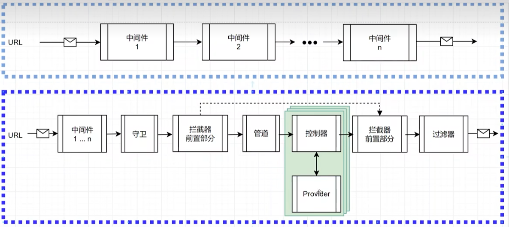
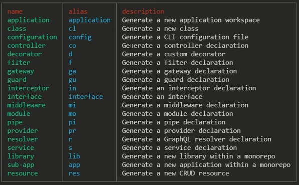
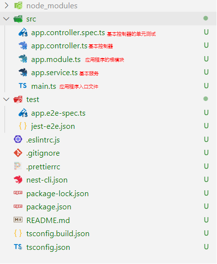
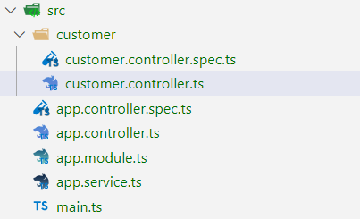
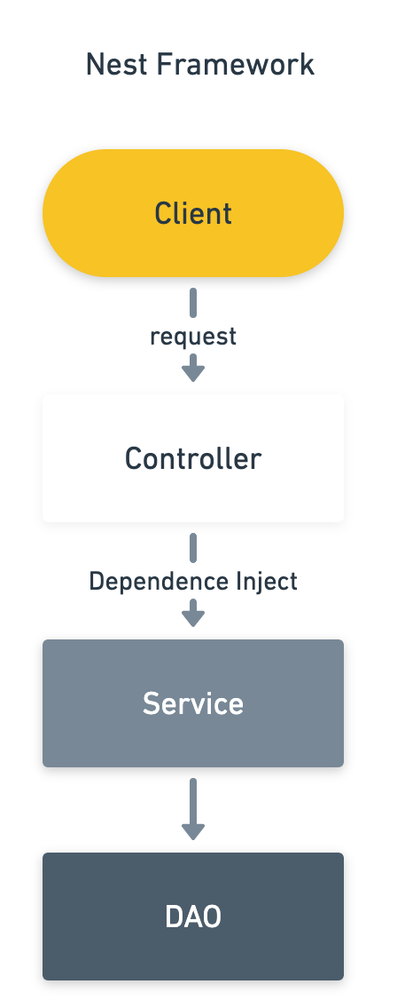
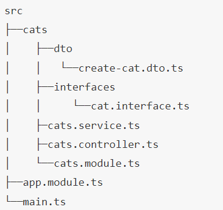

# Nest 特点

- 单例模式、依赖注入
- 统一的异常处理
- 面向切面编程 AOP
- 支持 Typescript
- 引入很多高级语法





# 安装配置

## 创建项目

- 先决条件：node 版本 >= 10.13.0

- 全局安装脚手架 nest cli

  ```bash
  npm i -g @nestjs/cli
  ```

- 创建新项目

  ```bash
  nest new project-name
  ```

- 使用 `nest g ` 创建文件命令

   

- 创建成功后的项目结构

    src 下保留 app.module.ts 和 main.ts 其他的都可以删掉

- 启动服务

  ```bash
  nest start
  # 或者使用
  npm run start
  ```

  热加载启动

  ```bash
  nest start --watch
  # 或者使用
  npm run start:dev
  ```

- 生成新资源

  ```bash
  nest g resource 模块名
  ```


## 入口文件

项目入口文件 main.ts

使用 `NestFactory` 核心类，创建一个 Nest 应用实例 `NestFactory.create()`，返回一个实现 `INestApplication` 接口的对象

```typescript
import { NestFactory } from '@nestjs/core';
import { AppModule } from './app.module';

async function bootstrap() {
  // 创建一个 Nest 应用实例
  const app = await NestFactory.create(AppModule);
  // listen 函数的第一个参数可以用来修改项目启动的端口
  await app.listen(3000, () => {
    console.log('Server is running on http://localhost:3000');
  });
}
bootstrap();
```


## HTTP 平台

`NestFactory.create()` 方法可以选择一种 httpAdapter 来创建服务，默认是 express

可以选择的平台有  `platform-express` 和 `platform-fastify`

```typescript
import { NestExpressApplication } from '@nestjs/platform-express';
```

```typescript
async function bootstrap() {
  // 使用 express 平台
  const app = await NestFactory.create<NestExpressApplication>(AppModule);
  await app.listen(3000);
}
```

这样之后调用的 `request` 和 `response` 最终就都是 express 的原生对象

指定对应的平台也可以提供类型提示和检查


## 全局路由

- 全局路由前缀 `app.setGlobalPrefix`

  ```typescript
  const app = await NestFactory.create(AppModule);
  app.setGlobalPrefix('v1');
  await app.listen(3000);
  ```


## 允许跨域

- 允许跨域 `app.enableCors`

  ```typescript
  const app = await NestFactory.create(AppModule);
  app.enableCors();
  await app.listen(3000);
  ```

- 解决跨域 Cookie、Session 失效

  ```typescript
  //允许cookie跨域
  app.enableCors({
    origin: "http://localhost:8080",		// 改成客户端地址
    credentials: true
  });
  ```

  ```javascript
  // axios ajax 请求允许跨域
  const service = axios.create({
    withCredentials: true 		// 允许携带cookie
  })
  ```


## 配置静态资源

- 配置静态资源目录

  使用 `platform-express` http 平台

  > main.ts

  ```typescript
  import { NestExpressApplication } from '@nestjs/platform-express';
  ```

  ```typescript
  async function bootstrap() {
    // 使用 express 平台
    const app = await NestFactory.create<NestExpressApplication>(AppModule);
    // 配置静态资源目录，根目录下 public 文件夹
    app.useStaticAssets('public');
    
    // ....
  }
  ```

  通过 `http://localhost:3000/1.jpg` 直接可以访问到静态资源目录的内容

- 配置虚拟静态资源目录

  ```typescript
  async function bootstrap() {
    // 使用 express 平台
    const app = await NestFactory.create<NestExpressApplication>(AppModule);
    // 配置虚拟目录，使用前缀来获取 public 文件夹内容
    app.useStaticAssets('public', {
      prefix: '/static/'	//设置虚拟路径 
    })
    // app.useStaticAssets(join(__dirname, '..', 'public'), {
    //   prefix: '/static/',
    // });
    
    // ....
  }
  ```

  通过虚拟目录 `http://localhost:3000/static/1.jpg` 直接可以访问到静态资源目录的内容


## 配置模板引擎

- 安装 ejs 模板引擎

  ```bash
  npm i ejs --save
  ```

- 配置模板引擎

  ```typescript
  async function bootstrap() {
    // 使用 express 平台
    const app = await NestFactory.create<NestExpressApplication>(AppModule);
    // 配置静态模板目录
    app.setBaseViewsDir(join(__dirname, '..', 'views')) 
    // 配置模板引擎
    app.setViewEngine('ejs');
  
    // ....
  }
  ```

- 使用 `@Render()` 装饰器加载模板

  ```typescript
  import { Render } from '@nestjs/common';
  ```

  ```typescript
  @Get()
  @Render('default/index')				// 加载 /views/default/user.ejs 模板文件
  index() {
    // 使用模板渲染的情况下不能返回字符串，可以返回空对象 {}
    return { message: 'Hello world!' };
  }
  ```
  
  ```ejs
  <h1>这是 ejs 演示代码</h1>
  <%=message%>
  ```

- 使用 `res.render()` 方法加载模板

  ```typescript
  @Post('login')
  async Login(@Response() res) {
    await res.render('admin/success', { redirectUrl: 'admin/main' })
  }
  ```

- 全局模板变量 `res.locals`

  ```typescript
  @Injectable()
  export class InitMiddleware implements NestMiddleware {
    use(req: any, res: any, next: () => void) {
      res.locals.userinfo = userinfo;
      next();
    }
  }
  ```

  ```ejs
  <%=userinfo.username%>
  ```


## 配置 Cookie

- 配置哪个 cookie 插件取决于使用的是哪个平台，这里使用 express 的 `cookie-parser` 来实现

  ```bash
  npm install cookie-parser
  npm i -D @types/cookie-parser
  ```

- 配置中间件

  > main.ts

  ```typescript
  import * as cookieParser from 'cookie-parser'
  ```

  ```typescript
  async function bootstrap() {
    const app = await NestFactory.create(AppModule);
    // 配置 cookie 中间件
    app.use(cookieParser());
  
    // ....
  }
  ```

  配置加密 cookie

  ```typescript
  // 配置 cookie 中间件，参数为秘钥
  app.use(cookieParser("this signed cookies"));   
  ```

- 设置 cookie

  ```typescript
  @Get()
  index(@Response() res) {
    // 设置 Cookie
    res.cookie('username', 'zhangsan', { maxAge: 14000, httpOnly: true })
    res.send('设置了Cookie');
  }
  ```

  设置加密 cookie

  ```typescript
  res.cookie('username', 'zhangsan', { maxAge: 14000, httpOnly: true, signed: true })
  ```

- 获取 cookies

  ```typescript
  @Get('cookie')
  getCookie(@Request() req) {
    return req.cookies.username;
  }
  ```

  获取加密 cookies

  ```typescript
  console.log(req.signedCookies.username)
  ```


## 配置 Session

- 配置哪个 session 插件取决于使用的是哪个平台，这里使用 express 的 `express-session` 来实现

  ```bash
  npm i express-session
  npm i -D @types/express-session
  ```

- 配置中间件

  > main.ts

  ```typescript
  import * as session from 'express-session'
  ```

  ```typescript
  async function bootstrap() {
    const app = await NestFactory.create(AppModule);
    // 配置 session 中间件
    app.use(session({
      secret: 'secret key',			// 秘钥
      cookie: { maxAge: 9000, httpOnly: true },
      rolling: true							// 过期是否重新设置
    }));
  
    // ....
  }
  ```

  > `session` 参数
  >
  > ```typescript
  > session({
  >   // 服务器端生成 session 签名
  >   secret: '12345',
  >   // 返回客户端的 key，默认 connect.sid
  >   name: 'name',
  >   cookie: {maxAge: 60000},
  >   // 每次请求都重新设置 session cookie，即使并没有变化，默认true，建议false
  >   resave: false, 
  >   // 强制将未初始化的 session 存储，当新建了一个 session 且未设定属性或值时，它就处于未初始化状态
  >   saveUninitialized: true,
  >   // 返回到前端 key 的属性，以下为默认值
  >   cookie: { path: ‘/’, httpOnly: true, secure: false, maxAge: null },
  >   // 每次请求时强行设置 cookie，重置 cookie 过期时间，默认false
  >   rolling: true
  > })
  > ```

- 设置 session

  ```typescript
  @Get()
  index(@Request() req): string {
    // 设置 session
    req.session.username = "zhangsan";
    return '设置了Session';
  }
  ```

- 获取 session

  ```typescript
  @Get('user')
  userIndex(@Request() req): string {
    // 获取 session 的值
    return req.session.username;
  }
  ```

- 销毁 session

  ```typescript
  @Get('logout')
  logout(@Request() req): string {
    // 删除 session 的值
    req.session.destroy((err) => {
      return '删除了Session';
    })
  }
  ```

  ```typescript
  // 设置 cookie 的过期时间
  req.session.cookie.maxAge = 0;
  ```


## gzip 压缩

- 安装 express 平台的  `compression` 中间件使用 gzip 压缩

  ```bash
  npm install compression
  ```

- 入口文件 main.ts 中配置

  ```bash
  import compression from 'compression'
  ```

  ```typescript
  async function bootstrap() {
    const app = await NestFactory.create(AppModule);
    app.use(compression())
    // ..
  }
  ```

  

## 安全 HTTP 头

- 安装 express 平台的 `helmet` 中间件，设置与安全相关的 `HTTP` 头

  ```bash
  npm install helmet 
  ```

- 入口文件 main.ts 中配置，`app.use(helmet())` 要写在所有中间件的最前面

  ```typescript
  import * as helmet from 'helmet'
  ```

  ```typescript
  async function bootstrap() {
    const app = await NestFactory.create(AppModule);
    app.use(helmet())
    // ..
  }
  ```


## 日志

- 使用 Winston 来实现日志系统

  ```bash
  npm install nest-winston winston winston-daily-rotate-file
  ```

- 跟模块中注册 `WinstonModule`，使用 `WinstonModule.forRoot()` 配置选项，选项参数与 winston 的 `createLogger()` 一致

  - `level` 日志级别，`{ error: 0, warn: 1, info: 2, http: 3, verbose: 4, debug: 5, silly: 6 }`

    `level: 'info'` 表示小于等于此 `level` 时才输出日志

  - `format` 格式化，多个 `format` 可以通过 `format.combine` 合并成一个

  - `transports` 日志输出位置

    - `new winston.transports.Console` 打印到控制台
    - `new winston.transports.File` 记录到文件中
    - `new winston.transports.Http` 通过 http 传输
    - `new winston.transports.Stream` 通过流传输
    - 自定义传输通道，继承 `winston.Transport`，接收到日志之后会触发类的 `log` 方法处理和发送消息

  - `exitOnError` 设置 `false` 时，遇到未捕获的异常不会退出

  日志文件按天进行切割 `DailyRotateFile`

  ```typescript
  import * as winston from 'winston';
  import * as DailyRotateFile from 'winston-daily-rotate-file';
  import { utilities as nestWinstonModuleUtilities, WinstonModule } from 'nest-winston';
  ```

  ```typescript
  @Module({
    imports: [
      WinstonModule.forRoot({
        exitOnError: false,
        transports: [
          new winston.transports.Console({
            format: winston.format.combine(
              winston.format.timestamp(),
              nestWinstonModuleUtilities.format.nestLike('MyApp'),
            ),
          }),
          new DailyRotateFile({
            // filename: 'logs/error-%DATE%.log',
            filename: path.join(process.cwd(), 'logs', 'error-%DATE%.log'),
            datePattern: 'YYYY-MM-DD',		// 按天存放
            zippedArchive: true,					// 自动压缩
            maxSize: '20m',
            maxFiles: '14d',							// 14天
            level: 'error',
          }),
          new DailyRotateFile({
            filename: path.join(process.cwd(), 'logs', 'info-%DATE%.log'),
            // datePattern: 'YYYY-MM-DD',	// 按小时存放
            datePattern: 'YYYY-MM-DD',
            zippedArchive: true,
            handleExceptions: true,
            maxSize: '20m',
            maxFiles: '14d',
            level: 'silly',
          }),
        ],
      }),
    ],
    controllers: [AppController],
    providers: [AppService],
  })
  export class AppModule {}
  ```

- 入口文件 mian.ts 中使用 winston 作为全局日志

  ```typescript
  import { WINSTON_MODULE_NEST_PROVIDER } from 'nest-winston';
  ```

  ```typescript
  app.useLogger(app.get(WINSTON_MODULE_NEST_PROVIDER));
  ```

- 将 winston 实例通过注入令牌注入使用

  ```typescript
  import { WINSTON_MODULE_PROVIDER } from 'nest-winston';
  import { Logger } from 'winston';
  ```

  ```typescript
  @Catch()
  export class HttpExceptionFilter implements ExceptionFilter {
    constructor(@Inject(WINSTON_MODULE_PROVIDER) private readonly logger: Logger) {}
    catch(exception: HttpException, host: ArgumentsHost) {
      const request = host.switchToHttp().getRequest()
      const response = host.switchToHttp().getResponse()
      const exceptionStatus = exception.getStatus()
      this.logger.error({ message: [exception.message, exception.stack].join('\n'), })
      response.status(exceptionStatus).json({
        statusCode: exceptionStatus,
        timestamp: new Date().toISOString(),
        path: request.url
      });
    }
  }
  ```


## 邮件

- 安装 nodemailer 和模板引擎 handlebars

  ```bash
  npm install @nestjs-modules/mailer nodemailer
  npm install -D @types/nodemailer
  npm install handlebars
  ```

- 根模块中注册 `MailerModule`，配置方法和 nodemailer 一致

  ```typescript
  import { MailerModule } from '@nestjs-modules/mailer';
  ```

  ```typescript
  @Module({
    imports: [
      MailerModule.forRoot({
        transport: {
          host: 'smtp.zoho.jp',
          port: 465,
          secure: true, 								// true for 465, false for other ports
          auth: {
            user: 'email@address.com', // generated ethereal user
            pass: `password` 					 // generated ethereal password
          },
        },
      })
    ]
  })
  ```

- 注册服务使用

  ```typescript
  import { MailerService } from '@nestjs-modules/mailer';
  ```

  ```typescript
  export class CatService {
    constructor(private readonly mailerService: MailerService) {}
    public notification() {
      this.mailerService.sendMail({
        to: 'emailto@address.com',									  // List of receivers email address
        from: 'emailfrom@address.com',							  // Senders email address
        subject: 'Testing Nest MailerModule',					// Subject line
        text: 'welcome',															// plaintext body
        html: '<b>welcome</b>',												// HTML body content
      })
        .then((success) => {
        console.log(success)
      })
        .catch((err) => {
        console.log(err)
      });
    }
  }
  ```


## 环境变量

- 项目根目录中放置不同的**环境变量配置文件**

  > `.env`：在所有的环境中被载入
  >
  > `.env.local`：在所有的环境中被载入，但会被 git 忽略
  >
  > `.env.production`：生产环境中被载入
  >
  > `.env.production.local`：生产环境中被载入，但会被 git 忽略
  >
  > `.env.development`：开发环境中被载入
  >
  > `.env.development.local`：开发环境中被载入，但会被 git 忽略

  ```shell
  DB_HOST=localhost
  DB_PORT=5432
  DB_USER=sample_nestjs_user
  DB_PASSWORD=sample_nestjs_password
  DB_DATABASE=sample_nestjs_db
  ```

- 安装 `ConfigModule` 依赖项

  ```bash
  npm install @nestjs/config
  ```

- 使用 `ConfigModule` 模块加载环境变量配置文件

  ```typescript
  import { ConfigModule } from '@nestjs/config';
  ```

  ```typescript
  @Module({
    imports: [ConfigModule.forRoot(
      { isGlobal: true }			// 全局模块，根模块中导入，其他模块无需再导入
    )],
  })
  export class AppModule {}
  ```

- `ConfigModule`  的 `load` 属性可以加载定义多个自定义配置文件，自定义配置文件使用 `registerAs()` 函数返回命名空间对象

  ```typescript
  import { registerAs } from '@nestjs/config';
  ```

  ```typescript
  // src/config/db.config.ts
  export default registerAs('database', () => ({
    type: 'postgres',
    host: process.env.DB_HOST,
    port: process.env.DB_PORT,
    database: process.env.DB_DATABASE,
    username: process.env.DB_USER,
    password: process.env.DB_PASSWORD,
    // ...
  }));
  ```

  ```typescript
  import { ConfigService } from '@nestjs/config';
  ```

  ```typescript
  ConfigModule.forRoot({
    isGlobal: true,
    // 加载自定义配置文件
  	load: [dbConfig],
  }),
  TypeOrmModule.forRootAsync({
    imports: [ConfigModule],
    useFactory: async (configService: ConfigService) => ({
      ...(await configService.get('database')),
    }),
    inject: [ConfigService],
  }),
  ```

- 启动脚本中指定环境变量

  ```json
  {
    "scripts": {
      "start:dev": "NODE_ENV=development nest start --watch"
    }
  }
  ```

- 使用 `ConfigService` 获取环境变量

  ```typescript
  import { ConfigService } from '@nestjs/config';
  ```

  ```typescript
  interface EnvironmentVariables {
    NAME: string;
    HOST: string;
    PORT: string;
    MAIL_USER: string;
  }
  ```

  ```typescript
  @Injectable()
  export class MailService {
    private readonly from: string;
    private readonly name: string;
    private readonly host: string;
    // 使用泛型限制，返回值将具有类型
    constructor(private readonly configService: ConfigService<EnvironmentVariables>) {
      this.name = this.configService.get('NAME');
      this.host = `${this.configService.get('HOST')}:${this.configService.get('PORT')}`;
      this.from = `${this.name} <${this.configService.get('MAIL_USER')}>`;
      // 如果定义了命名空间
      // const config = this.configService.get('命名空间')
      // const name = config.name
    } 
  }
  ```


## Swagger 接口文档

- 安装 Swagger 包

  ```typescript
  npm install @nestjs/swagger swagger-ui-express
  ```

- 在 main.ts 中使用 `SwaggerModule` 类初始化 Swagge

  ```typescript
  import { SwaggerModule, DocumentBuilder } from '@nestjs/swagger';
  ```

  ```typescript
  async function bootstrap() {
    // ...
    
    const options = new DocumentBuilder()
    .setTitle('Cats example')
    .setDescription('The cats API description')
    .setVersion('1.0')
    .addTag('cats')
    .build();
    const document = SwaggerModule.createDocument(app, options);
    SwaggerModule.setup('api', app, document);
    
    // ...
  }
  ```

- `@ApiProperty()` 装饰器对请求参数类属性进行注释

  ```typescript
  import { ApiProperty } from '@nestjs/swagger';
  ```

  ```typescript
  export class CreateCatDto {
    @ApiProperty({ required: true, description: '名称', example: 'Kitty' })
    name: string;
  
    @ApiPropertyOptional()			// 可以代替 required: false
    @ApiProperty({ type: Number, min: 1, default: 1 })
    age: number;
    
    @ApiProperty({ type: [String] })
    hobbies: string[];
    
    @ApiProperty({ enum: [ 'red', 'black', 'white', 'orange' ] })
    color: CatColor;
    
    @ApiProperty({ type: 'string', format: 'binary' })
    file: any;
  }
  ```

  部分更新的 DTO 可以使用 `PartialType()` 函数，将所有输入类型设置为可选的

  ```typescript
  import { PartialType } from '@nestjs/swagger';
  ```

  ```typescript
  export class UpdateCatDto extends PartialType(CreateCatDto) {}
  ```

  也可以使用 `PickType()` / `OmitType()` 函数，挑选 / 排除某些字段

  ```typescript
  import { PickType } from '@nestjs/swagger';
  ```

  ```typescript
  export class UpdateCatAgeDto extends PickType(CreateCatDto, ['age'] as const) {}
  ```

  使用 `IntersectionType()` 函数合并两种类型

  ```typescript
  import { IntersectionType } from '@nestjs/swagger';
  ```

  ```typescript
  export class UpdateCatDto extends IntersectionType(CreateCatDto, AdditionalCatInfo) {}
  ```

-  `@ApiQuery()` 注释查询参数

  ```typescript
  import { ApiQuery } from '@nestjs/swagger';
  ```

  ```typescript
  @ApiQuery({ name: 'name', description: '名称', example: 'Kitty' })
  @ApiQuery({ name: 'color', description: '颜色', enum: [ 'red', 'black', 'white', 'orange' ]})
  @Get()
  search(@Query('name') name: string, @Query('color') color: CatColor) { }
  ```

-  `@ApiParam` 注释路由参数

  ```typescript
  import { ApiParam } from '@nestjs/swagger';
  ```

  ```typescript
  @ApiParam({ name: 'id', example: 'xxx-xxxxx' })
  @Get()
  search(@Query('id') id: string) { }
  ```

- `@ApiBody` 注释请求体

  ```typescript
  import { ApiBody } from '@nestjs/swagger';
  ```

  ```typescript
  @ApiBody({ type: UserCreateDTO, description: '输入用户名和密码' })
  @Post()
  createUser(@Body() data: CreateUserDTO) {}
  ```

- `ApiConsumes` 注释文件上传

  ```typescript
  import { ApiConsumes } from '@nestjs/swagger';
  ```

  ```typescript
  @ApiConsumes('multipart/form-data')
  @Post('image')
  @UseInterceptors(FileInterceptor('file'))
  uploadImage(@UploadedFile() file: Express.Multer.File) {}
  ```

- `@ApiTags` 设置模块接口的分类，不设置默认分配到 default

  ```typescript
  import { ApiTags } from '@nestjs/swagger';
  ```

  ```typescript
  @ApiTags('customer')
  @Controller('customer')
  export class CustomerController {}
  ```

- `@ApiOperation` 设置单个控制器方法的描述

  ```typescript
  import { ApiOperation } from '@nestjs/swagger';
  ```

  ```typescript
  @ApiOperation({ summary: '创建用户', description: '请输入用户名和密码' })
  @Post()
  createUser(@Body() data: CreateUserDTO) {}
  ```

- `@ApiResponse` 设置响应 `HTTP` 响应格式

  ```typescript
  import { ApiOperation } from '@nestjs/swagger';
  ```

  ```typescript
  @ApiResponse({ status: 201, description: '用户创建成功'})
  @ApiResponse({ status: 403, description: '没有访问权限'})
  @Post()
  createUser(@Body() data: CreateUserDTO) {}
  ```

  使用内置好的响应装饰器

  > 更多参考 https://docs.nestjs.cn/9/recipes?id=swagger

  ```typescript
  import { ApiCreatedResponse, ApiForbiddenResponse } from '@nestjs/swagger';
  ```

  ```typescript
  @ApiCreatedResponse({ description: '用户创建成功', type: User })
  @ApiForbiddenResponse({ description: '没有访问权限'})
  @Post()
  createUser(@Body() data: CreateUserDTO) {}
  ```

- 使用 Swagger 插件，基于抽象语法树动态添加适当的装饰器

  > nest-cli.json

  ```json
  {
    "collection": "@nestjs/schematics",
    "sourceRoot": "src",
    "compilerOptions": {
      "plugins": ["@nestjs/swagger/plugin"]
    }
  }
  ```


## 命令行参数

- 安装 yargs

  ```bash
  npm i yargs
  ```

  

- 


# 控制器

> 控制器层负责**处理传入的请求**，并**返回对客户端的响应**

## 创建控制器

- 脚手架创建控制器

  ```bash
  nest g controller 控制器名
  # 或简写成
  nest g co 控制器名
  ```

    会在 src 中创建同名文件夹

- 在类声明上，使用 `@Controller()` 装饰器定义控制器

  使用装饰器**为控制器定义一个路由路径前缀** `@Controller('路由前缀')`

  ```typescript
  import { Controller } from '@nestjs/common';
  ```

  ```typescript
  @Controller('shoppingCart')
  export class ShoppingCartController {
    constructor(){}
  
    @Get()										// 路由映射 /shoppingCart
    async GetShoppingCart() {}
  
    @Post('checkout') 				// 路由映射 /shoppingCart/checkout
    async Checkout() {}
  
    @Delete('items/{itemId}')	// 路由映射 /shoppingCart/items/99
    async DeleteShoppingCartItem() {}
  }
  ```


## HTTP 请求

HTTP 请求装饰器：`@Get()`、`@Post()`、`@Put()`、`@Delete()`、`@Patch()`、`@Options()`、`@Head()`、`@All()`

```typescript
// 从 @nestjs/common 中引入
import { Get, Post, Put, Delete } from '@nestjs/common';
```

- 路由匹配

  创建此路由路径的端点，并将每个的请求映射到相应的处理程序

  ```typescript
  @Controller('blogs')
  export class BlogsController {
    @Get('hotlist')				// 路由： /blogs/hotlist
    async getHotList() {}
    @Get('find/:id')			// 路由： /blogs/find/01
    async findById(@Param('id') id) {}
  }
  ```

- 通配符路由匹配

  ```typescript
  // 请求url：http://localhost:3000/customer/23
  @Get('/:id(\\d+)')
  getCustomer(@Param('id') id: string) {
    console.log(id);				// 23
    return 'This action returns customers';
  }
  ```

- 动态路由参数

  `@Get(':参数名')`

  ```typescript
  @Get(':id')
  findOne(@Param('id') id): string {
    return `This action returns a #${id} cat`;
  }
  ```

- 动态路由地址

  ```typescript
  export class Config {     
    static adminPath = 'admin'; 
  }
  ```

  ```typescript
  import { Config } from '../config'
  @Controller(`${Config.adminPath}/login`)
  export class LoginController {}
  ```


## 请求参数

- `@Req()` 获取请求对象

  使用 `Request` 类型提示需要安装 `@types/express`

  ```bash
  npm i -D @types/express
  ```

  ```typescript
  import { Req } from '@nestjs/common';
  import { Request } from 'express';
  ```

  ```typescript
  @Get()
  getCustomer(@Req() request: Request) {
    console.log(request.body);
    console.log(request.headers);
    console.log(request.path);
    return 'This action returns customers';
  }
  ```

- `@Res()` 获取响应对象，使用响应对象返回响应，不能使用 `return` 返回值形式了

  使用 `Response` 类型提示需要安装 `@types/express`

  ```typescript
  import { Res } from '@nestjs/common';
  import { Response } from 'express';
  ```

  调用 `response` 对象，例如 `res.json(…)` 或 `res.send(…)` 发出响应，否则 HTTP 服务器将挂起

  ```typescript
  @Get()
  getCustomers(@Res() res) {
    res.status(HttpStatus.OK).json({ id: 1, name: 'jack', age: 32 });
  }
  
  @Post()
  createCustomer(@Res() res, @Body() createCustomerDto: CreateCustomerDto) {
    res.status(HttpStatus.CREATED).send();
  }
  ```

- `@Param(key?: string)` 获取动态路由参数

  等价于 `req.params`、`req.params[key]`

  ```typescript
  import { Param } from '@nestjs/common';
  ```

  ```typescript
  // 请求url：http://localhost:3000/customer/99
  @Get(':id')
  getCustomer(@Param() params: any) {
    console.log(params);					// { id: '99' }
    return 'This action returns customer';
  }
  ```

  ```typescript
  // 请求url：http://localhost:3000/customer/1/99
  @Get(':no/:id')
  getCustomer(@Param('id') id: string, @Param('no') no: string) {
    console.log(no, id);					// 1 99
    return 'This action returns customer';
  }
  ```

- `@Query(key?: string)` 获取查询参数

  等价于 `req.query`、`req.query[key]`
  
  ```typescript
  import { Query } from '@nestjs/common';
  ```
  
  ```typescript
  // 请求url：http://localhost:3000/customer?age=18&name=zhangsan
  @Get()
  getCustomer(@Query('age', new ParseIntPipe()) age: number, @Query('name') name: string) {
    console.log(age, name);			// 18 zhangsan
    return 'This action returns customers';
  }
  ```
  
  ```typescript
  class CustomerSearchParams {
    name: string;
    age: number;
  }
  // 请求url：http://localhost:3000/customer?age=18&name=zhangsan
  @Get()
  getCustomer(@Query() dto: CustomerSearchParams) {
    console.log(dto);				// { age: '18', name: 'zhangsan' }
    return 'This action returns customers';
  }
  ```
  
- `@Body(param?: string)` 获取请求 Body 的数据

  等价于 `req.body`、`req.body[key]`

  ```typescript
  import { Body } from '@nestjs/common';
  ```

  ```typescript
  class CustomerDto {
      name: string;
      age: number;
  }
  // 请求url：http://localhost:3000/customer
  // post内容：{ "name": "zhangsan", "age": 18 }
  @Post()
  addCustomer(@Body() dto: CustomerDto) {
    console.log(dto);					// { name: 'zhangsan', age: 18 }
    return { success: true };
  }
  ```


## 应用状态码

默认情况下，响应的状态码默认为 `200`，可以添加 `@HttpCode()` 来修改状态码

```typescript
import { HttpCode } from '@nestjs/common';
```

```typescript
@Post()
@HttpCode(201)
createData() {
  return 'This action adds a new cat';
}
```

除了使用 `@HttpCode()` 装饰器，还可以使用 `@Res` 响应对象修改状态码

```typescript
import { HttpStatus } from '@nestjs/common';
```

```typescript
@Post()
createData(@Res() res: Response) {
  res.status(HttpStatus.CREATED).send();
}
```

内置状态码

- `HttpStatus.OK` 200
- `HttpStatus.CREATED` 201，创建数据成功
- `HttpStatus.NO_CONTENT` 204，后端处理成功，前端不需要内容
- `HttpStatus.ACCEPTED` 202，已接收，交给其他异步程序处理，不需要与服务器的连接持续到进程完成


## 响应头

使用 `@header()` 装饰器指定自定义响应头，或使用 `@Res` 响应对象 `res.header()` 方法

```javascript
import { Header } from '@nestjs/common';
```

```typescript
@Post()
@Header('Cache-Control', 'none')
createData() {
  return 'This action adds a new cat';
}
```

`res.header()` 方法

```typescript
@Get()
GetPages(@Res() res: Response, @Query('current') current: number, @Query('size') size: number) {
  // 取分页信息 省略。。。
  const pageInfo = {}
  res.header("x-pagination", JSON.stringify({ prevLink: 'xxx', next: 'xxx', total: 99 }).send(pageInfo);
}
```


## 重定向

使用 `@Redirect()` 装饰器，或使用  `@Res` 响应对象 `res.redirect()` 方法

```typescript
import { Redirect } from '@nestjs/common';
```

`@Redirect('url', 状态码)`，状态码默认 `302`

```typescript
@Get('docs')
@Redirect('https://docs.nestjs.com', 302)
getDocs(@Query('version') version) {
  // 如果需要动态决定重定向地址
  if (version && version === '5') {
    // 返回的值将覆盖传递给 @Redirect()装饰器的所有参数
    return { url: 'https://docs.nestjs.com/v5/', statusCode: 301 };
  }
}
```


## 异步性

每个异步函数都必须返回一个 `Promise` / `Observable`， Nest 将自行解析 / 订阅

```typescript
@Get()
async findAll(): Promise<any[]> {
  return [];
}
```

```typescript
@Get()
findAll(): Observable<any[]> {
  return of([]);
}
```


## 文件上传

- 安装 express 中间件 `multer`

  ```bash
  npm i -D @types/multer
  ```

- 使用 `FileInterceptor()` 拦截器和 `@UploadedFile` 装饰器接收文件

  ```typescript
  import { UseInterceptors, UploadedFile } from '@nestjs/common';
  import { FileInterceptor } from '@nestjs/platform-express';
  import { createWriteStream } from 'fs';
  ```

  `FileInterceptor('表单文件上传的name属性值')`

  ```typescript
  @Post()
  @UseInterceptors(FileInterceptor('file'))
  addFile(@UploadedFile() file: Express.Multer.File) {
    // 需要处理文件格式等验证
    // 上传图片的信息，必须在 form 的属性里面配置 enctype="multipart/form-data"
    console.log(file);
    // 创建写入流
    var writeStream = createWriteStream(
      join(__dirname, '../../public/upload',			// 保存路径
  		`${Date.now()}-${file.originalname}`))			// 文件名称
    // 写入本地
    writeStream.write(file.buffer);
    return '上传图片成功';
  }
  ```

  上传多个文件

  ```typescript
  import { UploadedFiles } from '@nestjs/common';
  import { AnyFilesInterceptor } from '@nestjs/platform-express';
  ```

  ```typescript
  @Post()
  @UseInterceptors(AnyFilesInterceptor())
  addFiles(@UploadedFiles() files: Express.Multer.File[]) {
    console.log(files);
    for (const file of files) { 
      const writeImage = createWriteStream(
        join(__dirname, '../../', 'public/upload', `${Date.now()}-${file.originalname}`))
      writeImage.write(file.buffer);         
    }
    return '上传图片成功';
  }
  ```

- 上传文件 `Content-Type` 必须为 `multipart/form-data` 格式

  使用表单提交

  ```html
  <form action="file/add" method="post" enctype="multipart/form-data">
    <input type="file" name="file" id="" />
    <input type="submit" value="提交">
  </form>
  ```

  使用 post 请求时，必须指定 `Content-Type` 为 `multipart/form-data`

  ```typescript
  const form = new FormData();
  form.append("file", file);
  axios.post('/file/add', form, headers: { "Content-Type": "multipart/form-data" })
  ```


## 自定义装饰器

### 方法装饰器


### 参数装饰器

- 在中间件或守卫中，将需要传递的值加到请求对象的属性中，在之后的路由处理程序中可以手动提取到

  ```typescript
  @Injectable()
  export class AuthGuard implements CanActivate {
    canActivate(context: ExecutionContext): boolean | Promise<boolean> | Observable<boolean> {
      const request = context.switchHttp().getRequest();
      // 将用户信息添加到requset中
      request.user = { userId: xxx, name: 'zhangsan', email: 'xx@xx.com', role: admin };
      return true;
    }
  }
  ```

- 参数装饰器作用在控制器，可以获取到中间件或守卫设置的请求对象的自定义属性

  ```typescript
  import { createParamDecorator, ExecutionContext } from '@nestjs/common';
  ```

  ```typescript
  // 参数 data：传递给装饰器的参数，参数 ctx：上下文对象
  export const User = createParamDecorator((data: string, ctx: ExecutionContext) => {
    const request = ctx.switchToHttp().getRequest();
    const user = request.user;
    return data ? user && user[data] : user;
  });
  ```

- 控制器中使用自定义参数装饰器访问特定属性

  ```typescript
  @Get()
  async findOne(@User('firstName') firstName: string) {
    console.log(`Hello ${firstName}`);
  }
  ```


### 装饰器聚合

- 通过 `applyDecorators` 将需要的多个装饰器聚合到一个装饰器

  ```typescript
  import { applyDecorators } from '@nestjs/common';
  ```

  ```typescript
  export function Auth(...roles: Role[]) {
    return applyDecorators(
      SetMetadata('roles', roles),
      UseGuards(AuthGuard, RolesGuard),
      ApiBearerAuth(),
      ApiUnauthorizedResponse({ description: 'Unauthorized"' })
    );
  }
  ```

- 使用聚合装饰器

  ```typescript
  @Get('users')
  @Auth('admin')
  findAllUsers() {}
  ```


# 服务

>  Nest 框架的三层结构：控制器、服务与数据的架构
>
>  

## 创建服务

- 脚手架创建服务

  ```bash
  nest g service 服务名
  # 或简写成
  nest g s 服务名
  ```

   

- 使用 `@Injectable()` 装饰的类就是一个服务

  ```typescript
  import { Injectable } from '@nestjs/common';
  ```

  ```typescript
  @Injectable()
  export class CustomerService {
  
    private readonly cats: Cat[] = [];
  
    create(cat: Cat) {
      this.cats.push(cat);
    }
  
    findAll(): Cat[] {
      return this.cats;
    }
  }
  ```


## 依赖注入

使用依赖注入可以使 `Controller` 和 `Service` 处于完全解耦的状态

`Controller` 单纯调用 `Service`，不需要关心 `Service` 内部的实现

- 通过构造函数注入

  控制器中注入并引用服务

  ```typescript
  @Controller('cats')
  export class CatsController {
    constructor(private readonly catsService: CatsService) {}
    
    @Get()
    async findAll(): Promise<Cat[]> {
      return this.catsService.findAll();
    }
  }
  ```

- 可选注入

  使用 `@Optional()` 装饰一个非必选的参数

  ```typescript
  import { Optional } from '@nestjs/common';
  ```

  ```typescript
  @Injectable()
  export class HttpService<T> {
    constructor(@Optional() private readonly httpClient: T) {}
  }
  ```

  没有注入但是不会抛出错误，会解析为 `undefined`

  ```typescript
  @Controller('cats')
  export class CatsController {
    constructor(private readonly catsService: HttpService<Cat>) {}
  }
  ```

  设置默认值，如果不传会使用默认值代替

  ```typescript
  constructor(@Optional() @Inject('HTTP_OPTIONS') private readonly httpClient: T) {}
  ```


# 模块

> 每个 Nest 应用程序至少有一个模块，即根模块，根模块是 Nest 开始安排应用程序树的地方
>
> 当应用程序大的时候，将会拥有多个模块，每个模块都有一组紧密相关的功能

## 创建模块

- 脚手架创建模块

  ```bash
  nest g module 模块名
  # 或简写成
  nest g mo 模块名
  ```

- 模块是具有 `@Module()` 装饰器的类，`@module()` 装饰器接受一个描述模块属性的对象

  `providers`：在整个模块中共享的服务列表

  `controllers`：控制器列表

  `imports`：导入模块的列表

  `exports`：导出供其他模块使用的内容

  ```typescript
  @Module({
    imports: [SharedModule],
    controllers: [UserController, NewsController],
    providers: [UserService, NewsService]  
  })
  export class AdminModule {}
  ```

- 在根模块中引入创建的模块

  ```typescript
  @Module({
    imports: [AdminModule],
    controllers: [AppController],
    providers: [AppService]  
  })
  export class AppModule {}
  ```


## 功能模块

将属于同一个应用程序域的 `Controller`、`Service` 等导入到同一个功能模块 `Module` 下

```typescript
import { Module } from '@nestjs/common';
import { CatsController } from './cats.controller';
import { CatsService } from './cats.service';
import { SharedModule } from '../shared/shared.module';

@Module({
  controllers: [CatsController],
  providers: [CatsService],
  imports: [SharedModule]
})
export class CatsModule {}
```

理想的目录结构

 


## 共享模块

默认情况下，模块是单例，可以在**多个模块之间共享同一个提供者实例**

将希望共享的内容导出给其他模块使用

```typescript
@Module({
  imports: [Entity],
  providers: [DbService],
  exports: [DbService, Entity]
})
export class CatsModule {}
```

每一个导入的模块都可以共享相同的服务实例


# 中间件

> 中间件就是匹配路由之前或者匹配路由完成做的一系列的操作
>
> Nestjs 的中间件实际上等价于 express 中间件
>
> Nest 中间件可以是一个**函数**，也可以是一个带有 **`@Injectable()` 装饰器的类**
>
>  

## 创建中间件

- 脚手架创建中间件

  ```bash
  nest g middleware 中间件名
  # 或简写为
  nest g mi 中间件名
  ```

- 生成的中间件

  ```typescript
  import { Injectable, NestMiddleware } from '@nestjs/common';
  ```

  ```typescript
  @Injectable()
  export class InitMiddleware implements NestMiddleware {
    use(req: any, res: any, next: () => void) {
      console.log('我是中间件');
      next();
    }
  }
  ```

  

## 配置中间件

- 在模块中引入中间件

  根模块需要实现 `NestModule` 接口的方法

  ```typescript
  import { NestModule, MiddlewareConsumer } from '@nestjs/common';
  ```

  ```typescript
  export class AppModule implements NestModule {
    configure(consumer: MiddlewareConsumer) {
      consumer
        .apply(InitMiddleware)			// 配置中间件
        .forRoutes(									// 匹配多个路由
        	{ path: 'user', method: RequestMethod.ALL },
        	{ path: 'news', method: RequestMethod.Get }
      )
    }
  }
  ```

  路由的匹配

  ```typescript
  // 匹配所有的路由
  consumer.apply(InitMiddleware).forRoutes('*')
  // 匹配指定路由
  consumer.apply(InitMiddleware).forRoutes('user')
  // 匹配指定控制器
  consumer.apply(InitMiddleware).forRoutes(UserController)
  ```

- 配置多个中间件

  ```typescript
  export class AppModule implements NestModule {
    configure(consumer: MiddlewareConsumer) {
      consumer
        .apply(InitMiddleware)
        .forRoutes('*')
        .apply(InitMiddleware)
        .forRoutes('user')
    }
  }
  ```

  ```typescript
  export class AppModule implements NestModule {
    configure(consumer: MiddlewareConsumer) {
      consumer
        .apply(NewsMiddleware, UserMiddleware)
        .forRoutes(
        	{ path: 'user', method: RequestMethod.ALL },
        	{ path: 'news', method: RequestMethod.ALL }
      ) 
    }
  }
  ```


## 函数式中间件

```typescript
export function logger(req, res, next) {
  console.log(`Request...`);
  next();
};
```

```typescript
export class AppModule implements NestModule {
  configure(consumer: MiddlewareConsumer) {
    consumer.apply(logger).forRoutes('*')
  }
}
```


## 全局中间件

全局中间件只能引入函数中间件

```typescript
export function logger(req, res, next) {
  console.log(`Request...`);
  next();
};
```

```typescript
async function bootstrap() {
  const app = await NestFactory.create(AppModule);
  // 引入函数中间件
  app.use(logger);
  await app.listen(3000);
}
```


# 守卫

> 在 Nextjs 中如果想做权限判断的话可以在守卫中完成，也可以在中间件中完成

## 创建守卫

- 脚手架创建守卫

  ```bash
  nest g guard 守卫名
  # 或简写为
  nest g gu 管道名
  ```

- 守卫是 `@Injectable()` 装饰器的类，实现 `CanActivate` 接口

  ```typescript
  import { CanActivate, ExecutionContext, Injectable } from '@nestjs/common';
  import { Observable } from 'rxjs';
  ```

  ```typescript
  @Injectable()
  export class AuthGuard implements CanActivate {
    canActivate(context: ExecutionContext): boolean | Promise<boolean> | Observable<boolean> {
      // 上下文对象中获取 request 对象
      const request = context.switchHttp().getRequest();
      return true; // 返回boolean值表示是否有权限访问
    }
  }
  ```


## 控制器守卫

- 守卫添加到控制器上

  ```typescript
  import { UseGuards } from '@nestjs/common';
  ```

  ```typescript
  @Controller('user')
  @UseGuards(AuthGuard)   // 整个控制器都需要进行权限判断
  export class UserController {
    @Get()
    getUser() {
      return '获取信息';
    }
    @Post('add')
    addUser() {
      return '添加用户';
    }
  }
  ```

- 守卫添加到方法上

  ```typescript
  @Get()
  @UseGuards(AuthGuard)
  getUser() {
    return '获取信息';
  }
  ```


## 全局守卫

- 在 main.ts 中注册，但是这种情况下，守卫不能插入依赖项

  ```typescript
  async function bootstrap() {
    const app = await NestFactory.create(AppModule);
    // 全局配置守卫
    app.useGlobalGuards(new AuthGuard());
    await app.listen(3000);
  }
  ```

- 在模块中注册

  ```typescript
  import { APP_GUARD } from '@nestjs/core';
  ```

  ```typescript
  @Module({
    providers: [
      { provide: APP_GUARD, useClass: RolesGuard },
    ],
  })
  export class AppModule {}
  ```


## 守卫添加参数

- 通过构造函数为守卫提供动态参数

  ```typescript
  @Injectable()
  export class AuthGuard implements CanActivate {
    constructor(private status: number = 0) { }
    canActivate(context: ExecutionContext): boolean | Promise<boolean> | Observable<boolean> {
      console.log(this.status);
      return true;
    }
  }
  ```

- 创建守卫的实例并传递参数

  ```typescript
  @UseGuards(new AuthGuard(1))
  ```


## JWT 身份认证

- 安装 passport 认证库

  ```bash
  npm install @nestjs/passport @nestjs/jwt passport passport-jwt
  npm install @types/passport-jwt
  ```

- 模块中注册 `PassportModule` 和 `JwtModule`

  ```typescript
  import { PassportModule } from '@nestjs/passport';
  import { JwtModule } from '@nestjs/jwt';
  ```

  ```typescript
  @Module({
    imports: [
      // 默认策略为 JWT，使用 AuthGuard() 不传递参数时，会使用默认策略
      PassportModule.register({ defaultStrategy: 'jwt' }),
      // 生产环境秘钥单独存放
      JwtModule.register({ secret: jwtConstants.secret, signOptions: { expiresIn: '60s' }})
    ]
  })
  export class AuthModule { }
  ```

- 创建  JWT token 帮助方法

  ```typescript
  import { JwtService } from '@nestjs/jwt';
  ```

  ```typescript
  createToken(user: Auth) {
    const payload = { userId: user.userId, username: user.name };
    return { access_token: this.jwtService.sign(payload) }
  }
  ```

- 密码加密帮助方法

  ```typescript
  import { randomBytes, pbkdf2Sync } from 'crypto';
  ```

  ```typescript
  // 加盐，注册用
  makeSalt(): string {
    return randomBytes(3).toString('base64');
  }
  ```

  `crypto.pbkdf2Sync( password, salt, iterations, keylen, digest )`

  ```typescript
  encryptPassword(password: string, salt: string): string {
    if (!password || !salt) return '';
    const tempSalt = Buffer.from(salt, 'base64');
    // 10000 代表迭代次数 16 代表长度
    return pbkdf2Sync(password, tempSalt, 10000, 16, 'sha1').toString('base64');
  }
  ```

  也可以使用 `bcrypt` 包进行加密

- 用户登录生成 JWT token

  ```typescript
  async login(userId: string, password: string) {
    const result = await this.authModel.findOne({ userId: userId }).exec();
    const loginPassword = this.encryptPassword(password, result?.salt);
    if (loginPassword === result?.password) {
      return this.createToken(result);
    } else {
      throw 'Incorrect password';
    }
  }
  ```

  ```typescript
  @Post('login')
  async login(@Body() dto: AuthLoginDto) {
    return await this.service.login(dto.userId, dto.password);
  }
  ```

- 提供 JWT 策略

  ```typescript
  import { ExtractJwt, Strategy } from 'passport-jwt';
  import { PassportStrategy } from '@nestjs/passport';
  ```

  ```typescript
  @Injectable()
  export class JwtStrategy extends PassportStrategy(Strategy) {
    constructor() {
      super({
        // 请求的授权头中提供token
        jwtFromRequest: ExtractJwt.fromAuthHeaderAsBearerToken(),
        // 是否忽略过期
        ignoreExpiration: false,
        // 密匙
        secretOrKey: jwtConstants.secret,
      });
    }
    // Passport 首先验证 JWT 的签名并解码 JSON，然后调用 validate() 方法
    // 将解码后的 JSON 作为其单个参数传递
    // 返回的值自动创建一个 user 对象，并将其作为 req.user 分配给请求对象
    async validate(payload: any) {
      return { userId: payload.userId, username: payload.username };
    }
  }
  ```

  在模块中注册

  ```typescript
  @Module({
    providers: [JwtStrategy],
  })
  export class AuthModule { }
  ```

- 使用 `AuthGuard` 内置的守卫进行 JWT 验证

  ```typescript
  import { AuthGuard } from '@nestjs/passport';
  ```

  ```typescript
  @Get('find')
  @UseGuards(AuthGuard('jwt'))
  async getCustomer(@Req() req) {
    console.log(req.user)		// { userId: 'root', username: 'admin' }
    return await this.service.find()
  }
  // 如果没有登录token，则会返回 401 未授权的异常
  ```

- 可以使用装饰器聚合简化守卫

  ```typescript
  import { applyDecorators, UseGuards } from '@nestjs/common'
  import { AuthGuard } from '@nestjs/passport'
  ```

  ```typescript
  export function Auth() {
    return applyDecorators(UseGuards(AuthGuard('jwt')))
  }
  ```

  ```typescript
  @Get('find')
  @Auth()
  async getCustomer() {}
  ```

- 可以使用自定义参数装饰器获取登录信息

  ```typescript
  import { createParamDecorator, ExecutionContext } from '@nestjs/common';
  ```

  ```typescript
  export const Payload = createParamDecorator((data: string, ctx: ExecutionContext) => {
      const request = ctx.switchToHttp().getRequest();
      const user = request.user;
      return data ? user && user[data] : user;
  });
  ```

  ```typescript
  @Get('find')
  @UseGuards(AuthGuard('jwt'))
  async getCustomer(@Payload() payload) {
    console.log(payload)		// { userId: 'root', username: 'admin' }
  }
  ```

  ```typescript
  @Get('find')
  @UseGuards(AuthGuard('jwt'))
  async getCustomer(@Payload('username') username) {
    console.log(username)		// { userId: 'root', username: 'admin' }
  }
  ```


## RBAC 权限认证

- 创建装饰器，使用 `SetMetadata` 将元数据附加到路由

  ```typescript
  import { SetMetadata } from '@nestjs/common';
  ```

  ```typescript
  export const Roles = (...roles: string[]) => SetMetadata('roles', roles);
  ```

- 方法添加角色

  ```typescript
  @Post()
  @Roles('admin')
  async create(@Body() createCatDto: CreateCatDto) {
    this.catsService.create(createCatDto);
  }
  ```

- 使用  `Reflector` 帮助类访问路由的角色，交给守卫来验证处理

  ```typescript
  import { Injectable, CanActivate, ExecutionContext } from '@nestjs/common';
  import { Reflector } from '@nestjs/core';
  ```

  ```typescript
  @Injectable()
  export class RolesGuard implements CanActivate {
    constructor(private reflector: Reflector) {}
  
    canActivate(context: ExecutionContext): boolean {
      const roles = this.reflector.get<string[]>('roles', context.getHandler());
      if (!roles) {
        return true;
      }
      const request = context.switchToHttp().getRequest();
      // 获取当前用户的角色（用户附加到 request 对象的情况下，可能借助于身份认证的管道处理）
      const user = request.user;
      return matchRoles(roles, user.roles);
    }
  }
  ```

- 全局注册守卫

  ```typescript
  providers: [
    { provide: APP_GUARD, useClass: RolesGuard }
  ],
  ```


## 登录验证守卫

```typescript
@Injectable()
export class AuthGuard implements CanActivate {
  canActivate(context: ExecutionContext): boolean | Promise<boolean> | Observable<boolean> {
    // 做权限判断
    var req = context.switchToHttp().getRequest();
    if (req.path == '/admin/login') {
      return true;
    }
    if (req.session.username) {
      return true;
    }
    return false;
  }
}
```


# 管道

> 管道可以将输入**数据转换**为所需的输出数据；也可以**处理验证**，当数据不正确时可能会抛出异常

## 内置管道

- 参数转为某种类型

  `ParseIntPipe`、`ParseFloatPipe`、`ParseBoolPipe`、`ParseArrayPipe`、`ParseUUIDPipe`、`ParseEnumPipe`

  ```typescript
  import { ParseIntPipe } from "@nestjs/common";
  ```

  ```typescript
  @Get(':id')
  async findOne(@Param('id', ParseIntPipe) id: number) {
    return this.catsService.findOne(id);
  }
  ```

  ```typescript
  @Get(':id')
  async findOne(
    @Param('id', new ParseIntPipe({ errorHttpStatusCode: HttpStatus.NOT_ACCEPTABLE })) id: number) {
    return this.catsService.findOne(id);
  }
  ```

  ```typescript
  // /?ids=1,2,3
  @Get()
  findByIds(@Query('id', new ParseArrayPipe({ items: Number, separator: ',' })) ids: number[]) {
    return 'This action returns users by ids';
  }
  ```

- 设置参数默认值 `DefaultValuePipe`

  ```typescript
  import { DefaultValuePipe } from "@nestjs/common";
  ```

  ```typescript
  @Get()
  async search(
    @Query('start', new DefaultValuePipe('0')) start: string,
    @Query('size', new DefaultValuePipe('10')) size: string
  ) {}
  ```

- 文件验证 `ParseFilePipe`

  ```typescript
  import { ParseFilePipe } from "@nestjs/common";
  ```

  ```typescript
  import { MaxFileSizeValidator, FileTypeValidator } from "@nestjs/common";
  import { Express } from 'express';
  ```

  ```typescript
  @Post()
  async uploadFile(
    @UploadedFile(
      new ParseFilePipe({
        validators: [new MaxFileSizeValidator({ maxSize: 2097152 })],
      }),
      new ParseFilePipe({
        validators: [new FileTypeValidator({ fileType: 'image/*' })],
      }),
    ) image: Express.Multer.File
  ) {}
  ```

- `ValidationPipe`

  `ValidationPipe` 管道使用了 `class-validator` 和 `class-transformer` 库，安装依赖

  ```bash
  npm install class-validator class-transformer
  ```

  `ValidationPipe` 的选项

  > 详细参考 https://docs.nestjs.cn/9/techniques?id=%e9%aa%8c%e8%af%81

  - `transform`：自动将有效负载**转换为对象类型**（将 JSON 转换为对应的对象类型）

    地址参数和查询参数在网络传输时，默认都是 `string` 类型

    ```typescript
    @Post()
    @UsePipes(new ValidationPipe({ transform: true }))
    async create(@Body() createCatDto: CreateCatDto) {
      this.catsService.create(createCatDto);
    }
    ```

    ```typescript
    // 全局绑定
    @Module({
      providers: [{ provide: APP_PIPE, useClass: new ValidationPipe({ transform: true }) }]
    })
    export class AppModule {}
    ```

  - `disableErrorMessages`：禁用详细的错误

    ```typescript
    new ValidationPipe({ disableErrorMessages: true })
    ```


## 自定义管道

- 脚手架创建管道

  ```bash
  nest g pipe 管道名
  # 或简写为
  nest g pi 管道名
  ```

- 管道是 `@Injectable()` 装饰的类，实现 `PipeTransform` 接口

  实现接口的 `transfrom(value: any, metadata: ArgumentMetadata)` 方法

  - `value` 传递来的参数

  - `metadata` 当前处理的参数的描述 `{ type, metatype, data }`

    - `type`：参数是 body `@Body()`，query `@Query()`，param `@Param()` 还是其他类型

    - `metatype`：参数的元类型，例如 `String`

    - `data` 传递给装饰器的字符串，例如 `@Body('string')`

  ```typescript
  import { ArgumentMetadata, Injectable, PipeTransform } from '@nestjs/common';
  ```

  ```typescript
  @Injectable()
  export class NewsPipe implements PipeTransform {
    transform(value: any, metadata: ArgumentMetadata) {
      // Get 或者 Post 传过来的值
      console.log(value);
      // 处理传递来的值
      value.id = '99';
      return value;
    }
  }
  ```

- 控制器中使用自定义管道 `@UsePipes`

  ```typescript
  import { UsePipes } from '@nestjs/common';
  ```

  ```typescript
  @Get()
  @UsePipes(new NewsPipe())		// 实例化管道
  index(@Query() info){
    return '使用了管道'
  }
  ```


## 数据验证管道

- 构建基于 Joi schema 的验证管道

  ```bash
  npm install joi
  npm install @types/joi -D
  ```

- 定义管道，接收控制器传递的验证 `schema` 进行验证

  ```typescript
  import { ObjectSchema } from 'joi';
  ```

  ```typescript
  @Injectable()
  export class JoiValidationPipe implements PipeTransform {
    constructor(private schema: ObjectSchema) {}
    transform(value: any, metadata: ArgumentMetadata) {
      // 调用 validate 方法
      const { error } = this.schema.validate(value);
      if (error) {
        throw new BadRequestException('Validation failed');
      }
      return value;
    }
  }
  ```

- 创建自定义验证管道实例并传入 `schema`，使用 `@UsePipes()` 装饰器绑定到方法

  ```typescript
  import * as Joi from 'joi';
  ```

  ```typescript
  export const userSchema = Joi.object().keys({
    name: Joi.string().required(),
    age: Joi.number().integer().min(6).max(66).required(),
  })
  ```

  ```typescript
  @Get()
  @UsePipes(new JoiValidationPipe(userSchema))			// 实例化管道并传入 schema
  index(@Query() info: userDto) {
    this.cuserService.create(userDto);
  }
  ```


## 类验证器

### 创建验证器

- 安装 `class-validator` 插件

  ```bash
  npm install class-validator class-transformer
  ```

- 为 `DTO` 的属性添加 `class-validator` 提供的装饰器，使用该 `DTO` 的路由将自动执行这些验证规则

  ```typescript
  import { IsString, IsInt } from 'class-validator';
  export class CreateCatDto {
    @IsString()
    name: string;
  
    @IsInt()
    age: number;
  
    @IsString()
    breed: string;
  }
  ```

- 创建自定义管道验证属性

  ```typescript
  import { PipeTransform, Injectable, ArgumentMetadata, BadRequestException } from '@nestjs/common';
  import { validate } from 'class-validator';
  import { plainToInstance } from 'class-transformer';
  ```

  ```typescript
  @Injectable()
  export class ValidationPipe implements PipeTransform<any> {
    async transform(value: any, { metatype }: ArgumentMetadata) {
      // 没有传入验证规则，直接返回
      if (!metatype || !this.toValidate(metatype)) {
        return value;
      }
      // plainToInstance() 方法将普通的 JavaScript 参数对象转换为可验证的类型对象
      const object = plainToInstance(metatype, value);
      const errors = await validate(object);
  
      if (errors.length > 0) {
        const messages: string[] = []
        const pushMessage = (constraints = {}) => {
          messages.push(...Object.values<any>(constraints))
        }
        errors.forEach((error) => {
          if (error.constraints) {
            pushMessage(error.constraints)
          }
          if (error.children) {
            error.children.forEach((e) => pushMessage(e.constraints))
          }
        })
        throw new ValidationError(`Invalid params: ` + messages.join(', '))
      }
  		
      // 返回object，会返回JSON转换的对应的对象类型
      // return object
      return value;
    }
  
    private toValidate(metatype: Function): boolean {
      const types: Function[] = [String, Boolean, Number, Array, Object];
      return !types.includes(metatype);
    }
  }
  ```

- 使用自定义验证管道，可以是参数范围、方法范围、控制器范围、全局范围的绑定

  - 参数范围绑定

    ```typescript
    @Post()
    async create(@Body(new ValidationPipe()) createCatDto: CreateCatDto) {
      this.catsService.create(createCatDto);
    }
    ```

  - 全局范围绑定，为整个应用程序、每个控制器和每个路由处理程序

    ```typescript
    import { APP_PIPE } from '@nestjs/core';
    ```

    ```typescript
    @Module({
      providers: [{ provide: APP_PIPE, useClass: ValidationPipe }]
    })
    export class AppModule {}
    ```


### 验证装饰器

> https://github.com/typestack/class-validator

- 可选 `@IsOptional()`

  为空（ `=== null`、`=== undefined`）则忽略属性上的所有验证

- 已定义（`!== undefined`、`!== null`）`@IsDefined(value: any)`

- 不为空（`!== ‘’`、`!== null`、`!== undefined`）`@IsNotEmpty()`

- 在允许值的数组中 `@IsIn(values: any[])`

- 相等（`===`） `@Equals(comparison: any)`

- 布尔值 `@IsBoolean()`、`@IsBooleanString()`
- 日期 `@IsDate()`、`@IsDateString()`
- 最小日期、最大日期 `@MinDate(date: Date)`、`@MaxDate(date: Date)`
- 字符串 `@IsString()`

- 数字 `@IsNumber(options: IsNumberOptions)`、`@IsNumberString(options?: IsNumericOptions)`

  可选选项 `allowNaN: boolean`、`allowInfinity: boolean`、`maxDecimalPlaces: number`

- 整数 `@IsInt()`

- 正数 / 负数 `@IsPositive()` / `@IsNegative()`

- 最大 / 最小 `@Min(min: number)` / `@Max(max: number)`

- 数组 `@IsArray()`

- 枚举 `@IsEnum(entity: object)`

- 电子邮箱 `@IsEmail()`

- 只包含字母和数字的字符串 `@IsAlphanumeric`

- 手机号 `@IsMobilePhone(locale: string)`，中国 `zh-CN`

- MongoDB ObjectId `@IsMongoId()`

- Url `@IsUrl(options?: IsURLOptions)`

- 数组包含 / 不包含给定值数组 `@ArrayContains(values: any[])` / `@ArrayNotContains(values: any[])`
- 数组不为空 `@ArrayNotEmpty()`
- 数组长度最大 / 最小 `@ArrayMaxSize(max: number)` / `@ArrayMinSize(min: number)`
- 数组值唯一 `@ArrayUnique(identifier?: (o) => any)`


### 自定义验证装饰器

- 创建自定义装饰器

  ```typescript
  import { registerDecorator, ValidationOptions, ValidationArguments } from 'class-validator';
  ```

  ```typescript
  export function IsLongerThan(property: string, validationOptions?: ValidationOptions) {
    return function (object: Object, propertyName: string) {
      registerDecorator({
        name: 'isLongerThan',
        target: object.constructor,
        propertyName: propertyName,
        constraints: [property],
        options: validationOptions,
        validator: {
          validate(value: any, args: ValidationArguments) {
            const [relatedPropertyName] = args.constraints;
            const relatedValue = (args.object as any)[relatedPropertyName];
            return typeof value === 'string' 
            		&& typeof relatedValue === 'string' 
            		&& value.length > relatedValue.length; 
            // you can return a Promise<boolean> here as well, if you want to make async validation
          },
        },
      });
    };
  }
  ```

- 使用自定义装饰器

  ```typescript
  title: string;
  @IsLongerThan('title', { message: 'Text must be longer than the title' })
  text: string;
  ```

  


# 拦截器

> 拦截器是在请求前后对数据进行拦截处理

## 创建拦截器

- 脚手架创建拦截器

  ```bash
  nest g interceptor 拦截器名
  # 或简写成
  nest g itc 服务名
  ```

- 拦截器是使用 `@Injectable()` 装饰器注解的类，实现 `NestInterceptor` 接口

  实现 `intercept(context: ExecutionContext, next: CallHandler)` 方法

  - `context` 执行上下文对象

  - `next` 手动调用 `next` 方法并且有返回值，程序才会继续运行，函数的返回值就是对应路由的返回值

    `next.handle()` 返回一个 RxJs 对象

  返回 `next` 之前的内容是请求拦截时触发，`next` 返回的内容是响应拦截时触发

  ```typescript
  import { Injectable, NestInterceptor, ExecutionContext, CallHandler } from '@nestjs/common';
  import { Observable } from 'rxjs';
  import { tap } from 'rxjs/operators';
  ```

  ```typescript
  @Injectable()
  export class LoggingInterceptor implements NestInterceptor {
    intercept(context: ExecutionContext, next: CallHandler): Observable<any> {
      console.log('Before...');
      const now = Date.now();
      return next.handle().pipe(tap(() => console.log(`After... ${Date.now() - now}ms`)));
    }
  }
  ```

- 使用 `@UseInterceptors()` 为控制器绑定拦截器，拦截器会同时拦截控制器的请求和响应

  ```typescript
  import { UseInterceptors } from '@nestjs/common';
  ```

  ```typescript
  // 路由方法级别绑定
  @Get()
  @UseInterceptors(LoggingInterceptor)
  getUser() { }
  ```

  ```typescript
  // 控制器级别绑定
  @UseInterceptors(LoggingInterceptor)
  export class CatsController {}
  ```

- 全局绑定拦截器

  模块绑定

  ```typescript
  import { APP_INTERCEPTOR } from '@nestjs/core';
  ```

  ```typescript
  @Module({
    providers: [
      { provide: APP_INTERCEPTOR, useClass: LoggingInterceptor },
    ],
  })
  export class AppModule {}
  ```

  入口文件绑定，无法插入依赖项

  ```typescript
  const app = await NestFactory.create(ApplicationModule);
  app.useGlobalInterceptors(new LoggingInterceptor());
  ```


## 响应拦截

- 使用 `map` 操作符转换响应内容

  响应内容拦截成 `{ code: 200, data: {}, message: "请求成功" }` 格式

  ```typescript
  import { map } from 'rxjs/operators';
  ```

  ```typescript
  @Injectable()
  export class TransformInterceptor implements NestInterceptor {
    intercept(context: ExecutionContext, next: CallHandler): Observable<any> {
      return next.handle().pipe(map(data => ({ code: 200, data, message: 'success' })))
    }
  }
  ```

- 全局绑定拦截器

  ```typescript
  app.useGlobalInterceptors(new TransformInterceptor())
  ```


## 异常拦截

> 使用 `ExceptionFilter` 过滤器方法参考异常部分

- 使用 `catchError` 操作符捕获异常

  异常内容拦截成 `{ message: "没有权限访问", status: 403 }` 格式

  ```typescript
  import { catchError } from 'rxjs/operators';
  ```

  ```typescript
  @Injectable()
  export class ErrorsInterceptor implements NestInterceptor {
    intercept(context: ExecutionContext, next: CallHandler): Observable<any> {
      return next.handle().pipe(
        catchError(err => of(err)),
        map(err => ({ message: err.response, status: err.status }))
      )
    }
  }
  ```

- 全局绑定拦截器

  ```typescript
  app.useGlobalInterceptors(new ErrorsInterceptor())
  ```


## 缓存拦截

```typescript
@Injectable()
export class CacheInterceptor implements NestInterceptor {
  constructor(private readonly cacheService: CacheService) { }
  async intercept(context: ExecutionContext, next: CallHandler): Observable<any> {
    const host = context.switchToHttp();
    const request = host.getRequest();
    if (request.method !== 'GET') {
      // 非GET请求放行
      return next.handle();
    }
    const cachedData = await this.cacheService.get(request.url);
    if (cachedData) {
      // 命中缓存，直接放行
      return of(cachedData);
    }
    return next.handle().pipe(tap(response) => {
      // 响应数据写入缓存，此处可以等待缓存写入完成，也可以不等待
      this.cacheService.set(request.method, response);
    });
  }
}
```


## 日志拦截

```typescript
@Injectable()
export class AppInterceptor implements NestInterceptor {
  private readonly logger = new Logger();
  intercept(context: ExecutionContext, next: CallHandler): Observable<any> {
    const start = Date.now();
    return next.handle().pipe(tap((response) => {
      const host = context.switchToHttp();
      const request = host.getRequest<Request>();
      // 输出格式 
      // [Nest] 96310   - 09/10/2019, 2:44 PM   GET /user 1ms []
      this.logger.log(format(
        '%s %s %dms %s',
        request.method,
        request.url,
        Date.now() - start,
        JSON.stringify(response),
      ));
    }));
  }
}
```


# 异常

## 内置异常

`throw new HttpException(response, status)`

- `response` 可以是 `string` 或 `object`
- `status` 定义 HTTP 状态码

```typescript
import { HttpException, HttpStatus } from '@nestjs/common'
```

```typescript
throw new HttpException('Forbidden', HttpStatus.FORBIDDEN);
```

```typescript
const errors = { username: 'Username and email must be unique.' };
throw new HttpException({ message: 'Input data validation failed', errors }, HttpStatus.BAD_REQUEST);
```

常用内置异常状态码

```typescript
import { HttpStatus } from '@nestjs/common'
```

- `HttpStatus.BAD_REQUEST` 400，错误请求
- `HttpStatus.UNAUTHORIZED` 401，用户没有登录，没法访问
- `HttpStatus.NOT_FOUND` 404，请求的资源不存在
- `HttpStatus.FORBIDDEN` 403，用户登录了，没有访问的权限
- `HttpStatus.NOT_ACCEPTABLE` 406，前端请求的格式后端无法识别

- `HttpStatus.UNPROCESSABLE_ENTITY` 422，请求格式正确，但是由于含有语义错误，无法响应


## 异常过滤器

捕获异常，并设置自定义响应逻辑

- 创建异常过滤器，实现 `ExceptionFilter<T>` 接口，`T` 是异常的类型，`@Catch()` 装饰器传入要过滤的异常

  异常过滤成 `{ statusCode, timestamp, path }` 格式

  ```typescript
  import { ExceptionFilter, Catch, ArgumentsHost, HttpException } from '@nestjs/common';
  ```

  ```typescript
  @Catch(HttpException)
  export class HttpExceptionFilter implements ExceptionFilter {
    catch(exception: HttpException, host: ArgumentsHost) {
      const request = host.switchToHttp().getRequest()
      const response = host.switchToHttp().getResponse()
      const exceptionStatus = exception.getStatus()
      response.status(exceptionStatus).json({ 
        statusCode: exceptionStatus, 
        timestamp: new Date().toISOString(), 
        path: request.url
      });
    }
  }
  ```

- 绑定过滤器

  路由绑定

  ```typescript
  @Post()
  @UseFilters(new HttpExceptionFilter())
  async create(@Body() createCatDto: CreateCatDto) {
    throw new ForbiddenException();
  }
  ```

  全局绑定

  ```typescript
  async function bootstrap() {
    const app = await NestFactory.create(AppModule);
    app.useGlobalFilters(new HttpExceptionFilter());
    await app.listen(3000);
  }
  ```
  
  ```typescript
  import { APP_FILTER } from '@nestjs/core';
  ```
  
  ```typescript
  @Module({
    providers: [
      { provide: APP_FILTER, useClass: HttpExceptionFilter }
    ],
  })
  export class AppModule {}
  ```
  
  


# 数据库

## Mongoose

> Mongoose 是在 node.js 异步环境下对 mongodb 进行便捷操作的对象模型工具

### 安装配置

- 安装 mongoose

  ```bash
  npm install @nestjs/mongoose mongoose
  ```

- 模块中配置数据库连接

  ```typescript
  import { MongooseModule } from '@nestjs/mongoose';
  ```

  ```typescript
  @Module({
    imports: [
      // forRoot 中配置数据库地址
      MongooseModule.forRoot("mongodb://127.0.0.1:27017/koa",{ useNewUrlParser: true })
    ],
    controllers: [AppController],
    providers: [AppService]  
  })
  export class AppModule {}
  ```

- 定义数据库映射 Schema

  每个 `Schema` 会映射到 mongodb 中的一个 `collection`

  > /src/schema/article.schema.ts

  使用 `@Schema()` 装饰器定义

  ```typescript
  import { Prop, Schema, SchemaFactory } from '@nestjs/mongoose';
  import { Document } from 'mongoose';
  ```

  ```typescript
  // 定义模型
  @Schema()
  export class Article extends Document {
    @Prop({ required: true })
    title: string;
    @Prop()
    author: string;
    @Prop()
    content: string;
  }
  // 定义集合内文档结构类型，模块注入时使用
  export type ArticleDocument = Article & Document;
  // 用于模块中配置Schema和数据库集合的映射
  export const ArticleSchema = SchemaFactory.createForClass(Article);
  ```

  > 也可以使用传统方法
  >
  > ```typescript
  > import * as mongoose from 'mongoose';
  > export const ArticleSchema = new mongoose.Schema({
  >   title: String,
  >   author: String,
  >   content:String
  > });
  > ```

- 在控制器对应的模块中，定义数据模型

  ```typescript
  import { MongooseModule } from '@nestjs/mongoose';
  import { ArticleSchema } from '../../schema/article.schema';
  ```

  ```typescript
  @Module({
    imports: [
      // 配置 Schema 对应的模型
      MongooseModule.forFeature([
        // collection 要和数据库的集合名一致
        { name: "Article", schema: ArticleSchema, collection: 'article' },
        // { name: "Nav", schema: NavSchema, collection: 'nav' }
      ])],
    controllers: [UserController, NewsController, NavController],
    providers: [ArticleService, NavService]
  })
  export class AdminModule { }
  ```
  
- 在服务中查询数据库

  ```typescript
  import { InjectModel } from '@nestjs/mongoose';
  import { Model } from 'mongoose';
  ```
  
  ```typescript
  @Injectable()
  export class ArticleService {
  	// 要和模块中定义的Schema的name一致
    constructor(@InjectModel('Article') private articleModel: Model<ArticleDocument>) { }
    // 在数据库里面查询全部文章
    async findAll(json = {}): Promise<Article[]> {
      return await this.articleModel.find(json).exec();
    }
  }
  ```


### 预定义模式修饰符

`@Prop` 装饰器在文档中定义属性

- `type` 类型

  得益于 TypeScript，属性的类型会被**自动推导**出来

  ```typescript
  @Prop()
  name: string
  ```

  **对象和嵌套数组**无法正确推断类型，需要显式的指出

  ```typescript
  @Prop([{ type: String }])
  tags: string[]
  ```

  ```typescript
  @Prop({ type: () => [string] })
  tags: string[]
  ```

  > Schema Types 内置类型：
  >
  > `String`、`Number`、`Date`、`Buffer`、`Boolean`、`Mixed`、`ObjectId`、`Array`、`Decimal128`、`Map`、`Schema`

- `required` 必须，`Boolean` 类型

  ```typescript
  @Prop({ required: true })
  name: string
  ```

  ```typescript
  // 指定异常信息
  @Prop({ required: [true, 'name is required'] })
  name: string
  ```

  ```typescript
  @Prop()
  status: number
  @Prop({})
  address: string
  ```

- `default` 默认值

  ```typescript
  @Prop({ default: '匿名' })
  name: string
  ```

- `index` 索引，`Boolean` 类型

  ```typescript
  @Prop({ index: true })
  userId: string
  ```

- `unique` 唯一，`Boolean` 类型

  ```typescript
  @Prop({ unique: true })
  userId: string
  ```

- `lowercase` 转化为小写，`Boolean` 类型

  ```typescript
  @Prop({ lowercase: true })
  name: string
  ```

- `uppercase` 转化为大写，`Boolean` 类型

  ```typescript
  @Prop({ uppercase: true })
  name: string
  ```

- `match` 正则验证，`RegExp` 类型

  ```typescript
  @Prop({ match: /^\w+([\.-]?\w+)*@\w+([\.-]?\w+)*(\.\w{2,3})+$/ })
  email: string
  ```

  ```typescript
  @Prop({
    match: [/^\w+([\.-]?\w+)*@\w+([\.-]?\w+)*(\.\w{2,3})+$/, 'Please fill a valid email address'] 
  })
  email: string
  ```

- `enum` 限定数组中的值，`Array` 类型

  ```typescript
  @Prop({ enum: ['male', 'female'] })
  gender: string
  ```

  ```typescript
  enum Role { ADMIN = 'ADMIN', USER = 'USER' }
  @Prop({ enum: Role, default: Role.USER })
  role: string
  ```

- `trim` 前后去空格，`Boolean` 类型

  ```typescript
  @Prop({ trim: true })
  name: string
  ```

- `min` 限定最小值，`Number` 类型

  ```typescript
  @Prop({ min: 1 })
  srore: number
  ```

  ```typescript
  @Prop({ min: [1, 'srore need to be >= 1'] })
  srore: number
  ```

- `max` 限定最大值，`Number` 类型

  ```typescript
  @Prop({ max: 5 })
  srore: number
  ```

  ```typescript
  @Prop({ max: [5, 'srore need to be <= 5'] })
  srore: number
  ```

- `minlength` 限定最小长度，`Number` 类型

  ```typescript
  @Prop({ minlength: 10 })
  content: string
  ```

- `maxlength` 限定最大长度，`Number` 类型

  ```typescript
  @Prop({ maxlength: 50 })
  content: string
  ```

- `get` 定制的 `getter`

  ```typescript
  @Prop({  get: v => `${APP_URL}/${v}` })
  image: string
  ```

- `set` 定制的 `setter`

  ```typescript
  @Prop({ set: v => Math.round(v) })
  srore: number
  ```

- `validate` 验证器函数

  `(value: T): boolean` 类型函数，或  `{ validator: (value: T): boolean，message：string }` 对象形式

  ```typescript
  const arrayLengthValidator = function(len) {
    return {
      validator: (v)  => v.length <= len,
      message: '`{PATH}` can be stored up to ' + len
    }
  }
  
  @Prop([{ type: String }], validate: arrayLengthValidator(10))
  pictureUrl: string[]
  ```


### 操作符

#### 条件操作符

- `$eq`  匹配等于指定值的值，相当于 `=`

  ```typescript
  model.find({ name: { $eq: 'john' } })
  ```

  ```typescript
  model.find().where('name').equals('john')
  ```

- `$ne`  匹配所有不等于指定值的值，相当于 `!=`

  ```typescript
  model.find({ name: { $ne: 'john' } })
  ```

  ```typescript
  model.find().where('name').ne('john')
  ```

- `$gt` 匹配大于指定值的值，相当于 `>`

  ```typescript
  model.find({birth: { $gt: new Date('1950-01-01') } })
  ```

  ```typescript
  model.find().where('birth').gt(new Date('1950-01-01'))
  ```

- `$gte` 匹配大于或等于指定值的值，相当于 `>=`

  ```typescript
  model.updateMany({ "fee": { $gte: 2 } }, { price: 9.99 })
  ```

  ```typescript
  model.updateMany().set('price', 9.99).where('fee').gte(2)
  ```

- `$lt` 匹配小于指定值的值，相当于 `<`

  ```typescript
  model.find({ age: { $lt: 20 } })
  ```

  ```typescript
  model.find().where('age').lt(20)
  ```

- `$lte` 匹配小于或等于指定值的值，相当于 `<=`

  ```typescript
  model.find({ age: { $lte: 20 } })
  ```

  ```typescript
  model.find().where('age').lte(20)
  ```

- `$in` 匹配数组中指定的任何值，相当于 `in`

  ```typescript
  model.find({ age: { $in: [16, 18]} })
  ```

  ```typescript
  model.find().where('age').in([16, 18])
  ```

- `$nin` 不匹配数组中指定的任何值，相当于 `not in`

  ```typescript
  model.find({ age: { $nin: [16, 18]} })
  ```

  ```typescript
  model.find().where('age').nin([16, 18])
  ```

- `$and` 满足数组中指定的所有条件，相当于 `and`

  ```typescript
  model.find({ $and: [ { price: { $ne: 1.99 } }, { price: { $exists: true } } ] })
  // 简写为
  model.find({ price: { $ne: 1.99, $exists: true } })
  ```

  ```typescript
  model.find().and({ price: { $ne: 1.99 } }, { price: { $exists: true } })
  model.find().where('price').ne(1.99).exists()
  ```

- `$nor` 不满足数组中指定的所有条件，相当于 `not (.. or ..)`

  ```typescript
  model.find({ $nor: [ { price: 1.99 }, { sale: true } ]  })
  ```

  ```typescript
  model.find().nor([ { price: 1.99 }, { sale: true } ])
  ```

- `$or` 满足数组中指定的条件的其中一个，相当于 `or`

  ```typescript
  model.find({ $or: [ { quantity: { $lt: 20 } }, { price: 10 } ] })
  ```

  ```typescript
  model.find().or([ { quantity: { $lt: 20 } }, { price: 10 } ])
  ```

- `$not` 不满足指定条件，相当于 `not`

  ```typescript
  model.find({ price: { $not: { $gt: 1.99 } } })
  ```

- `$exists` 指定字段在文档中存在

  ```typescript
  model.find({ name: { $exists: true } })
  ```

  ```typescript
  model.find().where('name').exists()
  ```

- `$all` 满足指定数组中多个值

  ```typescript
  model.find({ year: { $all: [ 2019, 2020 ] } });
  // { "_id" : ..., "year" : [ 2017, 2019, 2020 ] }
  ```

  ```typescript
  model.find().where('year').all([ 2019, 2020 ])
  ```

- `$elemMatch` 查找数组字段中满足条件的结果

  ```typescript
  model.find({ year: { $elemMatch: { $gt: 2016, $lt: 2018 } } })
  // { "_id" : ..., "year" : [ 2017, 2019, 2020 ] }
  ```

  ```typescript
  model.find().where('year').$elemMatch({ $gt: 2016, $lt: 2018 })
  ```

- `$size` 数组长度等于指定大小

  ```typescript
  model.find({ year: { size: 0 } })
  ```

  ```typescript
  model.find().where('year').size(0)
  ```


#### 更新操作符

- `$set` 设置字段值

  ```typescript
  model.updateOne({'_id' : '5ebadc45a99bde77b2efb20e'}, { $set : { age : 18 } })
  ```

  ```typescript
  model.updateOne().set('age', 18).where('_id').equals('5ebadc45a99bde77b2efb20e')
  ```

- `$unset` 文档中移除字段

  ```typescript
  model.updateOne({'_id' : '5ebadc45a99bde77b2efb20e'}, { $unset : { age : 18 } })
  ```

- `$inc` 递增递减

  ```typescript
  model.updateOne({'_id' : '5ebadc45a99bde77b2efb20e'}, { $inc : { views : 1 } })
  ```

- `$currentDate` 设置当前系统日期

  ```typescript
  model.updateOne({'_id' : '5ebadc45a99bde77b2efb20e'}, { $currentDate : { createdAt : true } })
  ```

- `<array>.$` 匹配满足条件的数组中的第一个

  ```typescript
  /**
    { "_id" : 1, "grades" : [ 78, 88, 88 ] }
    { "_id" : 2, "grades" : [ 88, 90, 92 ] }
  */
  model.updateOne({ _id: 1, grades: 88 }, { $set: { "grades.$" : 82 } })
  /** 
  	更新后 { "_id" : 1, "grades" : [ 78, 82, 88 ] }
  */
  ```

- `$push` 添加指定值到数组末尾

  ```typescript
  model.updateOne({ "title" : "MongoDB" },
                  { $push: { "comments": { "name": "john", "content": "thks!" } } })
  ```

  - `$each` 为数组添加多个元素

    ```typescript
    model.updateOne({ name: "joe" },
                    { $push: { scores: { $each: [ 90, 92, 85 ] } } }))
    ```

  - `$position` 指定添加到的数组位置

    ```typescript
    model.updateOne({ name: "joe" },
                    { $push: { scores: { $each: [ 90, 92, 85 ], $position: 0 } } }))
    ```

- `$pull` 移除指定值从数组

  ```typescript
  /**
    { "_id" : 1, "grades" : [ 78, 88, 88 ] }
  */
  model.update( { _id: 1 }, { $pull: { grades: { $gt: 80 } } } )
  /** 
  	更新后 { "_id" : 1, "grades" : [ 78 ] }
  */
  ```


### 增加数据

#### save 增加或更新

`save([options][, callback])`

- 不包含 `_id` 字段，则插入新文档，相当于 `insert()`
- 包含 `_id` 字段，但 `_id` 存在，则更新文档，相当于 `update(filter, update, { upsert: true })`
- 包含 `_id` 字段（必须是 `ObjectId` 形式），且 `_id` 不存在，则插入指定 `_id` 的新文档

返回更新或增加的数据

```typescript
var new_user = new UserModel({ name: 'Manish', age: 34 })
await new_user.save()
```


#### create 增加

`create` 将一个或多个文档保存到数据库

`create(docs[, options][, callback])`

- `create`：`[]` 数组形式或 `{}` 对象形式
- 没有定义在 `schema` 中的字段，不会被添加
- `schema` 中有默认值的字段会自动添加

返回增加的数据

```typescript
await model.create({ name: "aayush", marks: 10 })
```


#### insertMany 增加多条

`insertMany` 将一个或多个文档保存到数据库

`insertMany(docs[, options][, callback])`

- 该方法比 `create()` 方法更快，因为它只向服务器发送一个操作，而不是每个文档发送一个操作

- 会验证每个文档，如果出现验证错误，则不会保存

返回增加的数据

```typescript
await model.insertMany([
  { name: 'Gourav', age: 20}, { name: 'Kartik', age: 20}, { name: 'Niharika', age: 20}
])
```


### 查找数据

#### 查询参数

- `filter` 查询条件

  ```typescript
  // 查找所有
  await model.find().exec()
  ```

  ```typescript
  // 精确查找
  await model.find({ name: 'john' }).exec()
  ```

  ```typescript
  // 嵌套对象
  await model.find({ name: { last: "wang", first: "dora" } }).exec()
  await model.find({ 'author.age': { $gte: 18 } }).exec()
  ```

  ```typescript
  // 数组下标
  await model.find({ 'year.1': { $gt: 2019 } }).exec()
  ```

  ```typescript
  // 模糊查询 (like "%bc%")
  await model.find({ user_id: /bc/ })
  // 模糊查询 (like "bc%")
  await model.find({ user_id: /^bc/ })
  ```

  ```typescript
  // 使用条件操作符
  await model.find({ name: 'john', age: { $gte: 18 } }).exec()
  ```

- `projection` 查询的字段，`_id` 字段默认返回，`1` 是包含，`0` 是排除

  ```typescript
  // 字符串指定
  await model.find( { status: "A" }, 'item, status').exec()
  ```

  ```typescript
  // 默认返回 _id
  await model.find({ status: "A" }, { item: 1, status: 1 }).exec()
  ```

  ```typescript
  // 不返回 _id
  await model.find({ status: "A" }, { _id: 0, item: 1, status: 1 }).exec()
  ```

  ```typescript
  // 返回除 0 以外的所有字段
  await model.find({ status: "A" }, { item: 0, status: 0 }).exec()
  ```

- `options` 选项

  `sort` 字段排序，排序值可以是 `asc`、`desc`、 `ascending`、`descending`、`1`、`-1`

  ```typescript
  await model.find().sort({ age: 'asc', name: -1 }).exec()
  ```

  `limit` 限制返回结果件数，`sort` 和 `limit` 同时使用，无论调用顺序如何都是**先排序后限制数量**

  ```typescript
  await model.find().sort('age').limit(2).exec()
  ```

  `skip` 跳过件数

  ```typescript
  await model.find(conditions).skip(pageTotal * pageNum).limit(pageTotal).sort({'_id': -1}).exec()
  ```


#### find 查询

`find` 查询满足条件的值并返回一个数组

`find(filter[, projection][, options][, callback])`

```typescript
await model.find().exec()
```

```typescript
await model.find({ name: 'john' }, { item: 1, status: 1 }, { sort: { status: 'desc' } }).exec()
```

```typescript
await model.find()
  .select('item, status')
  .where('name').equals('john')
  .sort({ status: 'desc' })
  .exec()
```


#### findOne 查询一件

`findOne` 查询满足条件的一条数据

`findOne(filter[, projection][, options][, callback])`

```typescript
await model.findOne().exec()
```

```typescript
await model.findOne({ name: 'john' }, { item: 1, status: 1 }, { sort: { status: 'desc' } }).exec()
```

```typescript
await model.findOne()
  .select('item, status')
  .where('name').equals('john')
  .sort({ status: 'desc' })
  .exec()
```


#### findById 指定 id 查询

`findById` 查询指定 `_id` 的一条数据

`findById(id[, projection][, options][, callback])`

```typescript
await model.findById('5ebadc45a99bde77b2efb20e', { item: 1, status: 1 }).exec()
```


#### count 查询件数

`count` 返回满足条件的件数

`count(filter[, callback])`

```typescript
await model.count({ name: 'john' }).exec()
```


#### distinct 去重

`distinct` 指定字段去重并返回一个数组

`distinct(field[, filter][, callback])`

```typescript
await model.distinct('item', { status: 1 }).exec()
```


#### exists 查询 id

`exists` 返回满足条件的 `_id`

`exists(filter [, options][, callback])`

```typescript
await model.exists({ name: 'john' }).exec()
```


### 更新数据

#### updateMany 更新多件

`updateMany` 更新符合条件的所有文档

`updateMany(filter, update[, options][, callback])`

```typescript
await model.updateMany({ age:{ $gte: 18 }, { adult: true }).exec()
```

- 返回值类型：

  `acknowledged`：更新结果，成功 `true`，失败 `false`

  `modifiedCount`：更新数量

  `upsertedId`：插入的 `_id`

  `upsertedCount`：插入数量

  `matchedCount`：匹配数量


#### updateOne 更新一件

`updateOne` 只更新第一条符合条件的文档

`updateOne(filter, update[, options][, callback])`

```typescript
await model.updateOne({ age:{ $gte: 18 }, { adult: true }).exec()
```

- 返回值类型：

  `acknowledged`：更新结果，成功 `true`，失败 `false`

  `modifiedCount`：更新数量

  `upsertedId`：插入的 `_id`

  `upsertedCount`：插入数量

  `matchedCount`：匹配数量


#### findByIdAndUpdate 指定 id 更新

`findByIdAndUpdate` 更新指定 `_id` 的一条数据，**返回更新的数据**

`findByIdAndUpdate(id, update[, options][, callback])`

```typescript
await model.findByIdAndUpdate('5eb985d440bd2155e4d788e2', { name: 'Gourav' }).exec()
```


#### findOneAndUpdate 更新一件

`findOneAndUpdate` 更新满足条件的一条数据，**返回更新的数据**

`Model.findOneAndUpdate(filter, update[, options][, callback])`

```typescript
await model.findOneAndUpdate({ age: { $gte: 5 }, { adult: true }).exec()
```


#### replaceOne 替换一件

`replaceOne ` 替换满足条件的一条数据，不支持任何 `update` 操作符

`replaceOne(filter, replace[, options][, callback])`

```typescript
await model.findOneAndUpdate({ age: { $gte: 5 }, { adult: true }).exec()
```

- 返回值类型：

  `acknowledged`：更新结果，成功 `true`，失败 `false`

  `modifiedCount`：更新数量

  `upsertedId`：插入的 `_id`

  `upsertedCount`：插入数量

  `matchedCount`：匹配数量


#### findOneAndReplace 替换一件

`findOneAndReplace  ` 替换满足条件的一条数据，**返回更新的数据**，不支持任何 `update` 操作符

`findOneAndReplace(filter, replace[, options][, callback])`

```typescript
await model.findOneAndReplace({ age: { $gte: 5 }, { adult: true }).exec()
```


### 删除数据

#### deleteMany 删除多件

`deleteMany` 更新符合条件的所有文档

`deleteMany(filter[, options][, callback])`

```typescript
await model.deleteMany({ age: { $gte: 5 }).exec()
```

- 返回值类型：

  `acknowledged`：删除结果，成功 `true`，失败 `false`

  `deletedCount`：删除件数


#### deleteOne 删除一件

`deleteOne` 删除满足条件的第一条数据

`deleteOne(filter[, options][, callback])`

```typescript
await model.deleteOne({ age: { $gte: 5 }).exec()
```

- 返回值类型：

  `acknowledged`：删除结果，成功 `true`，失败 `false`

  `deletedCount`：删除件数


#### findByIdAndDelete 指定 id 删除

`findByIdAndDelete`  删除指定 `_id` 的一条数据，**返回被删除的数据**

`findByIdAndDelete(id[, options][, callback])`

```typescript
await model.findByIdAndUpdate('5eb985d440bd2155e4d788e2').exec()
```


#### findOneAndDelete 删除一件

`findOneAndDelete` 删除满足条件的一条数据，**返回更新的数据**

`findByIdAndDelete(id[, options][, callback])`

```typescript
await model.findOneAndDelete({ age: { $gte: 5 }).exec()
```


#### remove 删除

`remove` 删除满足条件的数据

`remove(filter[, callback])`

```typescript
await model.remove().exec()
```

```typescript
await model.remove({ age: { $gte: 5 }).exec()
```

- 返回值类型：

  `acknowledged`：删除结果，成功 `true`，失败 `false`

  `deletedCount`：删除件数


### 关联查询

- `ref` 属性负责指定外键关联

  ```typescript
  @Schema()
  export class User extends Document {
    @Prop()
    name: string;
    @Prop()
    age: number;
  }
  ```

  ```typescript
  @Schema()
  export class Story extends Document {
    @Prop()
    title: string;
    @Prop({ type: mongoose.Schema.Types.ObjectId, ref: "User" })
    author: string;
  }
  ```

  ```typescript
  @Schema()
  export class Story extends Document {
    @Prop()
    title: string;
    @Prop({type: [{ type: mongoose.Schema.Types.ObjectId, ref: "User" }]})
    author: string[];
  }
  ```

- `populate` 函数可以模拟关系型数据库的外键连接后的查询功能

  `populate(path[, select][, model][, match])`

  `populate({ path[, select][, match][, model][, options][, populate] })`

  - `path` 外键关联的字段
  - `select` 关联表要选出的字段
  - `model` 外键关联的模型，默认是 `ref` 关联的模型
  - `options` 指定附加的其他查询选项，如排序以及条数限制等
  - `match` 附加的查询条件

  ```typescript
  Story.findOne({ title: /casino royale/i }).populate({
    path: 'author', select: 'name -_id', match: { age: { $gte: 21 }}, options: { limit: 5 }
  })
  ```

  关联嵌套

  ```typescript
  User.
  findOne({ name: 'Val' }).populate({
    path: 'friends',
    populate: { path: 'friends' }
  })
  ```


## TypeORM

### 安装配置

- 使用 TypeORM 作为对象关系映射器

  ```bash
  npm install @nestjs/typeorm typeorm mysql
  ```

- 在模块中建立数据库的连接

  ```typescript
  import { TypeOrmModule } from '@nestjs/typeorm';
  ```

  ```typescript
  @Module({
    imports: [
      TypeOrmModule.forRoot(
        {
          type: 'mysql',
          host: 'localhost',
          port: 3306,
          username: 'root',
          password: 'root',
          database: 'test',
          entities: [ Article ],
          synchronize: true
        }
      )
    ]
  })
  export class DatabaseModule {}
  ```

- 创建实体

  ```typescript
  import { Entity, Column, PrimaryGeneratedColumn } from 'typeorm';
  ```

  ```typescript
  @Entity()
  export class Article {
    @PrimaryGeneratedColumn()
    id: number;
  
    @Column({ length: 255 })
    title: string;
  
    @Column('text')
    description: string;
  
    @Column('text')
    content: string;
  
    @Column('int')
    status: number;
  }
  ```

- 在控制器对应的 Module 中配置数据 Model

  ```typescript
  import { TypeOrmModule } from '@nestjs/typeorm';
  import { Article } from '../../entity/article.entity';
  ```

  ```typescript
  @Module({
    imports: [TypeOrmModule.forFeature([Article])],
    controllers: [UserController, NewsController],
    providers: [ArticleService]
  })
  export class AdminModule {}
  ```

- 在服务中查询数据库

  ```typescript
  import { InjectRepository } from '@nestjs/typeorm';
  import { Repository } from 'typeorm';
  // 实体
  import { Article } from '../../entity/article.entity';
  ```

  ```typescript
  @Injectable()
  export class ArticleService {
    constructor(@InjectRepository(Article) private readonly articleRepository: Repository<Article>) {}
    async findAll() {
      return await this.articleRepository.find();
    }
  }
  ```


### 查找数据

- `find` 根据 json 条件查找

  ```typescript
  const result = await repository.find()
  const result = await repository.find({ firstName: "Timber" })
  ```

- `findOne` 查找匹配 ID 或 json 条件第一个条记录

  ```typescript
  const result = await repository.findOne(2)
  ```

  ```typescript
  const result = await repository.findOne({ firstName: "Timber" })
  ```

- `query` 执行 SQL 查询

  ```typescript
  const result = await repository.query(`SELECT * FROM USERS`)
  ```

- `count` 查找件数

  ```typescript
  const count = const count = await repository.count({ firstName: "Timber" });
  ```

- `findAndCount` 查找指定条件的记录，并且计算件数

  ```typescript
  const [timbers, timbersCount] = await repository.findAndCount({ firstName: "Timber" });
  ```

- `findByIds` 根据 ID 查找

  ```typescript
  const result = await repository.findByIds([1, 2, 3]);
  ```


### 增加数据

-  `save` 数据库中实体存在则更新，不存在则插入，返回被更新的数据

  ```typescript
  const user = new User()
  user.name = '张三'
  user.sex = 1
  await repository.save(user)
  ```

- `insert` 插入传入的实体

  ```typescript
  const user = new User()
  user.name = '张三'
  user.sex = 1
  await repository.insert(user);
  ```


### 更新数据

- `save` 数据库中实体存在则更新，不存在则插入，返回被更新的数据

  ```typescript
  var result = await repository.findOne({ name: "张三" })
  result.sex = 0
  await repository.save(result)
  ```

- `update` 根据 json 条件更新

  ```typescript
  await repository.update({ firstName: "Timber" }, { firstName: "Rizzrak" })
  // 执行 UPDATE user SET firstName = Rizzrak WHERE firstName = Timber
  
  await repository.update(1, { firstName: "Rizzrak" })
  // 执行 UPDATE user SET firstName = Rizzrak WHERE id = 1
  ```


### 删除数据

- `remove` 根据 json 条件或者实体删除

  ```typescript
  var result = await repository.findOne({ name: "张三" })
  await repository.remove(result)
  ```

  ```typescript
  await repository.remove({"id": 1})
  ```


## Redis

### 安装配置

- 安装 Redis

  ```bash
  npm install nestjs-redis --save
  ```

- 模块中注册 `RedisModule`

  ```typescript
  import { RedisModule } from 'nestjs-redis'
  ```

  ```typescript
  export const redisOptions = { 
      port: 6379,
      host: '127.0.0.1',
      password: '',
      db: 0
  }
  ```

  ```typescript
  @Module({
    imports: [RedisModule.register(redisOptions)],
    providers: [CacheService]
  })
  export class DefaultModule { }
  ```


### 操作缓存

- 封装操作 redis 的方法

  ```typescript
  import { RedisService } from 'nestjs-redis';
  ```

  ```typescript
  @Injectable()
  export class CacheService {
    constructor(private readonly redisService: RedisService) {}
  
    // 获取 redis 的 client 实例
    private client;
    async getClient() {
      // 如果是集群的话可以传入对应的名称
      this.client = await this.redisService.getClient();
    }
  
    // 设置数据
    async set(key: string, value: any, seconds?: number) {
      value = JSON.stringify(value);
      if (!this.client) {
        await this.getClient();
      }
      if (seconds) {
        await this.client.set(key, value, 'EX', seconds);
      } else {
        await this.client.set(key, value);
      }
    }
  
    // 获取数据
    async get(key: string) {
      if (!this.client) {
        await this.getClient();
      }
      let data = await this.client.get(key);
      if (!data) {
        return null;
      }
      return JSON.parse(data);
    }
  
    // 删除全部
    async clear() {
      if (!this.client) {
        await this.getClient();
      }
      await this.client.flushdb();
    }
  }
  ```

- 使用封装的方法

  ```typescript
  async index(){
    let result = await this.cacheService.get('userInfo')
    if (!result) {
      result = await this.UserService.find({ status: 1 })
      // 不需要 await，不获取数据，异步处理就可以
      this.cacheService.set('userInfo', result, 60 * 60)
    }
    return { userInfo: result }
  }
  ```


##  ElasticSearch

### 安装配置

- 安装 ElasticSearch

  ```bash
  npm i @nestjs/elasticsearch @elastic/elasticsearch
  ```

- 模块中注册 `ElasticsearchModule`

  ```typescript
  import { ElasticsearchModule } from '@nestjs/elasticsearch';
  ```

  ```typescript
  @Module({
    imports: [
      ElasticsearchModule.register({
        node: 'http://localhost:9200'
      })
    ],
    providers: [SearchService],
    exports: [SearchService]
  })
  export class PublicModule { }
  ```


### 搜索服务

- 封装搜索服务

  ```typescript
  import { ElasticsearchService } from '@nestjs/elasticsearch';
  ```

  ```typescript
  @Injectable()
  export class SearchService {
    constructor(private elasticsearchService: ElasticsearchService) { }
  
    // 查找 
    async search(params) {
      return await this.elasticsearchService.search(params);
    }
    // 增加 修改 删除
    async bulk(params) {
      return await this.elasticsearchService.bulk(params);
    }
    // 统计数量 
    async count(params) {
      return await this.elasticsearchService.count(params);
    }
  }
  ```

- 使用封装的方法

  ```typescript
  // 查询
  let result = await this.searchService.search({
    index: 'news',
    type: 'doc',
    body: { query: { match: { content: '中国' } } }
  })
  ```

  ```typescript
  // 增加
  let result = await this.searchService.bulk({
    body: [
      { index: { _index: 'news', _type: 'doc', _id: "111111111" } },
      { content: '中国前端' }
    ]
  })
  ```

  ```typescript
  // 更新
  let result = await this.searchService.bulk({
    body: [
      { update: { _index: 'news', _type: 'doc', _id: "yG0MNHEBDCwmnk5cs-Zy" } },
      { doc: { content: '中国前端66' } },
    ]
  })
  ```

  ```typescript
  // 删除
  let result = await this.searchService.bulk({
    body: [
      { delete: { _index: 'news', _type: 'doc', _id: "111111111" } }
    ]
  })
  ```

  ```typescript
  // 计数
  let result = await this.searchService.count({
    index: 'news',
    type: 'doc',
    body: { query: { match: { content: '中国' } } }
  })
  ```


# 第三方库

## 命令行工具 yargs

- 安装

  ```bash
  npm install yargs
  ```

- 配置使用

  ```typescript
  import { argv } from 'yargs'
  ```

  ```
  
  ```


