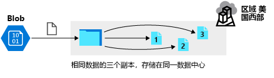
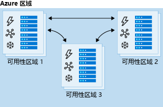
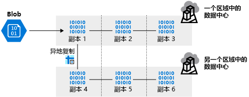
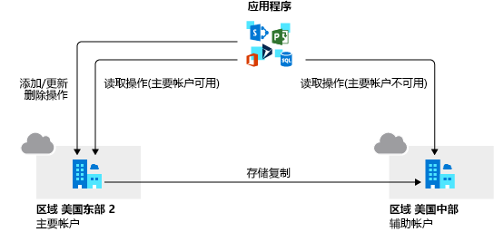

# 云概念

# 核心服务

## 云服务

### 云服务模型

 

- ##### IaaS  基础结构即服务 Infrastructure-as-a-Service

  最接近于管理物理服务器

  云提供商将保持硬件是最新的，但是**操作系统维护**和**网络配置**则需要云租户完成。例如Azure**虚拟机**

  1. 没有前期成本(CapEx)

  2. 可以快速访问应用程序，并在需要时取消配置。
  3. 用户管理和维护其已预配的服务，云提供商管理和维护云基础结构
  4. 只需为在运营费用 (OpEx) 模式下使用和运营的产品付费
  5. 部署、使用和获取公有云的优势不需要深厚的技术技能
  6. 可以利用云提供商的技能和专业知识来确保工作负载的安全性和高可用性
  7. IaaS 是最**灵活**的云服务，因为你可以控制配置和管理运行应用程序的硬件。

- ##### PaaS 平台即服务 Platform-as-a-Service

  一种托管主机环境

  **云提供商管理虚拟机和网络资源**，云租户将其应用程序部署到托管主机环境中

  Azure应用服务提供托管的主机环境，开发人员可在其中上传其 Web 应用程序而无需担心物理硬件和软件要求。

  1. 没有前期成本(CapEx)
  2. PaaS 比 IaaS 更敏捷，用户无需为运行应用程序配置服务器
  3. 只需为在运营费用 (OpEx) 模式下使用和运营的产品付费
  4. 不需要深厚的技术技能
  5. 

- ##### SaaS 软件即服务 Software-as-a-Service

  云提供商管理应用程序环境的所有方面，如**虚拟机、网络资源、数据存储和应用程序**。

  云租户只需向由云提供商管理的应用程序提供数据。例如，Microsoft Office 365

|          | **IaaS**                                                     | **PaaS**                                                     | **SaaS**                                                     |
| -------- | ------------------------------------------------------------ | ------------------------------------------------------------ | ------------------------------------------------------------ |
| **成本** | 无前期成本 只需为在运营费用模式下的产品付费             | 无前期成本 只需为在运营费用模式下的产品付费             | 无前期成本 即用即付，为软件付费                         |
| **配置** | 用户管理和维护其已预配的服务 云提供商管理维护云基础结构 | 无需配置服务器 云提供商进行平台管理                     | 快速轻松访问最新软件                                         |
| **技能** | 不需要深厚的技术技能                                         | 不需要深厚的技术技能 可以使用更多尖端的开发工具 可以专注于应用程序开发 | 不需要深厚的技术技能                                         |
| **灵活** | 最灵活的云服务 可以控制配置和管理运行应用程序的硬件     | 与分散式团队合作更容易 在全球范围内使用该平台 云平台可能存在一些限制 可能会影响应用程序的运行 | 从任何位置 访问相同的应用程序数据 软件应用程序可能存在一些限制 |

云提供商与云租户之间的不同级别责任

 

#### 例题

- ##### 例题1

  > You are tasked with deploying Azure virtual machines for your company.
  > You need to make use of the appropriate cloud deployment solution.
  > Solution: You should make use of Software as a Service (SaaS).
  > Does the solution meet the goal?
  >
  > - A. Yes
  > - B. No
  >
  > ------
  >
  > **Answer**: B

- ##### 例题2

  > You are tasked with deploying Azure virtual machines for your company.
  > You need to make use of the appropriate cloud deployment solution.
  > Solution: You should make use of Platform as a Service (PaaS).
  > Does the solution meet the goal?
  >
  > - A. Yes
  > - B. No
  >
  > ------
  >
  > **Answer**: B

- ##### 例题2

  > You are tasked with deploying Azure virtual machines for your company.
  > You need to make use of the appropriate cloud deployment solution.
  > Solution: You should make use of Infrastructure as a Service (IaaS).
  > Does the solution meet the goal?
  >
  > - A. Yes
  > - B. No
  >
  > ------
  >
  > **Answer**: A

## 存储服务

### 冗余存储

复制 Azure 中的数据，确保即使数据中心或区域不可访问或特定硬件出现故障，数据也仍始终可用

- ##### 本地冗余存储 (LRS) locally redundant storage

   

  本地冗余存储在一个区域中的单个数据中心设施内的容错域或硬件架之间复制数据并存储三个副本

  LRS 可以保护数据**免受硬件故障**的影响，但如果整个**数据中心发生故障**，则很有可能会丢失数据。

- ##### 区域冗余存储 (ZRS) zone-redundant storage

   

  区域冗余存储在一个区域中的三个存储群集之间复制数据。每个群集与其他两个群集进行了物理隔离，每个群集由单独的实用工具（如电源或网络）提供

  如果数据中心发生中断，仍可从该区域中的其他可用性区域 (AZ) 访问数据。由于所有 AZ 都位于同一区域，ZRS 可能**无法防止区域性中断**

- ##### 异地冗余存储 (GRS) geographically redundant storage

   

  异地冗余存储提供多个复制级别。 在主要区域内复制数据三次，然后，将此集复制到次要区域。

  主要区域发生数据中心故障或区域性问题，**数据仍在次要区域中可用**，次要区域成为活动区域。

- ##### 读取访问异地冗余存储 (RA-GRS) read-access geo-redundant storage

   

  读取访问异地冗余存储（RA-GRS）与 GRS 在存储机制上完全一致，唯一不同的是 RA-GRS 提供了**次要区域的只读访问权限**。

  主要区域的访问端点为 sysgeek.blob.core.windows.net，则次要区域的只读访问端点则为 sysgeek-secondary.blob.core.windows.net

  允许启动主要区域与次要区域之间的故障转移。主要终结点不可用，则可故障转移到辅助终结点。故障转移和 DNS 终结点更新完成后，存储帐户将设置回 LRS。

  RA-GRS 非常适合需要**高可用性的应用程序**。

- ##### 异地区域冗余存储 (GZRS) geo-zone-redundant storage

  异地区域冗余存储 (GZRS) 将 ZRS 的高可用性优势与 GRS 相结合。

  数据将跨一个区域中的三个可用性区域进行复制（ZRS），还会被复制三次到与该区域配对的另一个次要区域（GRS）

  区域冗余数据也**不会受到区域级中断**的影响

- ##### 读取访问异地区域冗余存储 (RA-GZRS)  read-access geo-zone-redundant storage

  读取访问权限异地区域冗余存储 (RA-GZRS) 使用与 GZRS 相同的复制方法，唯一不同的是提供了从次要区域进行读取

  即使主要区域没有发生停机，也可以读取次要区域的数据

#### 例题

- ##### 例题1

  > Your company has datacenters in Los Angeles and New York. The company has a Microsoft Azure subscription.
  > You are configuring the two datacenters as geo-clustered sites for site resiliency.
  > You need to recommend an Azure storage redundancy option.
  > You have the following data storage requirements:
  > ✑ Data must be stored on multiple nodes.
  > ✑ Data must be stored on nodes in separate geographic locations.
  > ✑ Data can be read from the secondary location as well as from the primary location
  > Which of the following Azure stored redundancy options should you recommend?
  >
  > - A. Geo-redundant storage
  > - B. Read-only geo-redundant storage
  > - C. Zone-redundant storage
  > - D. Locally redundant storage
  >
  > ------
  >
  > **Answer**: B

## 数据库和分析服务

### Azure Cosmos DB

Azure Cosmos DB 是一种全球分布式多模型数据库服务

- 快速读写延迟的全局实时访问以及吞吐量和一致性提供支持
- 可将多区域写入和数据分发到任何 Azure 区域
- 在任何 Azure 区域独立且弹性地缩放存储和吞吐量，实现在全球范围内无限缩放

支持无架构数据

- 使用开源 API、多个 SDK、无架构数据和对操作数据的无 ETL 分析进行快速构建

非常灵活

- 将公司的数据库迁移到 Azure Cosmos DB 后，开发人员可继续使用自己最熟悉的 API

  包括SQL、MongoDB、Cassandra、Tables 和 Gremlin。

# 核心解决方案和管理工具

## AI 服务

### Azure 机器学习 

Azure 机器学习(Azure Machine Learning)是一个用于进行**预测**的平台

由工具和服务构成，可连接数据，训练和测试模型，从而获得最能准确预测未来结果的模型，可部署和通过Web API使用

# 安全性和网络安全功能

# 标识、治理、隐私和合规性功能

## 标识服务

### Azure AD

Azure AD(Azure Active Directory  [Azure活动目录])是微软基于云的标识和授权访问管理服务，可以帮助在Azure中登录和访问资源

- ##### 身份验证

  验证用于访问应用程序和资源的标识。

  自助式密码重置、多重身份验证、禁用密码自定义列表和智能锁定服务等

- ##### 单一登录 SSO

  只需记住一个用户名和一个密码即可访问多个应用程序

  单个标识与用户关联，当用户更改角色或离开组织时，访问权限修改仅与该标识关联

- ##### 应用程序管理

  可以使用 Azure AD 管理云和本地应用

  可以控制对应用程序和资源的访问。为应用程序添加功能

- ##### 设备管理

  除了个人帐户外，Azure AD 还支持设备注册

  设备可通过工具进行管理

  允许将访问尝试限制为仅来自已知设备

#### 例题

- ##### 例题1

  > You are planning to migrate a company to Azure. Each of the company's numerous divisions will have an administrator in place to manage the Azure resources used by their respective division.
  > You want to make sure that the Azure deployment you employ allows for Azure to be segmented for the divisions, while keeping administrative effort to a minimum.
  > Solution: You plan to make use of several Azure Active Directory (Azure AD) directories.
  > Does the solution meet the goal?
  >
  > - A. Yes
  > - B. No
  >
  > ------
  >
  > **Answer**: B

# 云治理策略

### 订阅治理策略

- ##### 访问控制

  订阅是 Azure 资源的部署边界

  每个订阅都与一个 Azure Active Directory 租户关联

  能够通过角色的访问控制来定义**角色访问权限**

  设计订阅体系结构时，应考虑部署边界因素，例如，对于开发和生产环境，是否需要单独的订阅？ 通过单独的订阅，你可以单独控制每个订阅的访问权限，并将其资源彼此隔离

# 成本管理和服务级别协议

## 资本费用与运营费用

- ##### 资本支出 (CapEx)

  指花在实体基础设施上的前期支出

  前期成本的价值会随着时间的推移而降低

- ##### 运营支出 (OpEx) 

  指现在花钱购买服务或产品，现在为其付费

  在使用服务或产品时为其付费，无前期成本

  OpEx 是基于使用的模型

云服务提供商在基于使用的模型上运行，这意味着最终用户只需为其使用的资源付费

### 例题

- ##### 例题1

  > Your company is planning to migrate all their virtual machines to an Azure pay-as-you-go subscription. The virtual machines are currently hosted on the Hyper-V hosts in a data center.
  > You are required make sure that the intended Azure solution uses the correct expenditure model.
  > Solution: You should recommend the use of the elastic expenditure model.
  > Does the solution meet the goal?
  >
  > - A. Yes
  > - B. No
  >
  > ------
  >
  > **Answer**: B

- ##### 例题2

  > Your company is planning to migrate all their virtual machines to an Azure pay-as-you-go subscription. The virtual machines are currently hosted on the Hyper-V hosts in a data center.
  > You are required make sure that the intended Azure solution uses the correct expenditure model.
  > Solution: You should recommend the use of the scalable expenditure model.
  > Does the solution meet the goal?
  >
  > - A. Yes
  > - B. No
  >
  > ------
  >
  > **Answer**: B

- ##### 例题3

  > Your company is planning to migrate all their virtual machines to an Azure pay-as-you-go subscription. The virtual machines are currently hosted on the Hyper-V hosts in a data center.
  > You are required make sure that the intended Azure solution uses the correct expenditure model.
  > Solution: You should recommend the use of the operational expenditure model.
  > Does the solution meet the goal?
  >
  > - A. Yes
  > - B. No
  >
  > ------
  >
  > **Answer**: A

## 应用服务定价

1. ##### 免费和共享 Free/Shared

   仅用于**开发和测试**目的

   免费产品没有服务级别协议 (SLA)

2. ##### 基本 Basic

   专为拥有**低流量**需求的应用设计，不需要高级自动缩放和流量管理功能

   基于运行的实例大小和数量定价

   内置网络**负载均衡**支持可自动在实例间分配流量

   Linux运行时环境的基本服务计划支持容器的Web应用

3. ##### 标准 Standard

   专为运行**生产工作负荷**设计

   基于运行的实例大小和数量定价

   内置网络**负载均衡**支持可自动在实例间分配流量

   包括**自动缩放**支持，自动调整运行的虚拟机实例数量，以符合流量需求

   Linux运行时环境的基本服务计划支持容器的Web应用

4. ##### 高级 Premium

   为生产应用提供增强的**性能**

   VM具有更快的处理器、SSD 存储以及双倍的内存-核心比

   支持通过增加实例数扩大规模

   包含标准计划中的功能

   高级v3：更快处理器、Hyper-V 虚拟化和 VNet 连接支持

   ​				支持容器和基于代码的部署。

   ​				通过增加 vCPU、内存和实例数实现更高的缩放

5. ##### 独立 Isolated

   运行在虚拟网络中运行所需的任务关键型工作负载

   **专用**环境中运行其应用，专用环境称为应用服务环境

   VM具有更快的处理器、SSD 存储以及双倍的内存-核心比

|                | 免费 / 共享                | 基本             | 标准             | 高级             | 独立                   |
| -------------- | -------------------------- | ---------------- | ---------------- | ---------------- | ---------------------- |
| **特点**       | 免费试用 开发测试环境 | 开发测试专用环境 | 运行生产工作负荷 | 增强的性能和缩放 | 高性能、安全性和独立性 |
| **应用**       | 10 / 100                   | 无限制           | 无限制           | 无限制           | 无限制                 |
| **磁盘空间**   | 1 GB                       | 10 GB            | 50 GB            | 250 GB           | 1 TB                   |
| **最大实例**   | –                          | 3                | 10               | 30               | 100                    |
| **自定义域**   | – / 支持                   | 支持             | 支持             | 支持             | 支持                   |
| **混合连接**   | –                          | 支持             | 支持             | 支持             | 支持                   |
| **专用终结点** | –                          | –                | –                | 支持             | 支持                   |
| **计算类型**   | 共享                       | 专用             | 专用             | 专用             | 独立                   |
| **价格**       | 免费 / $0.013/小时         | $0.075/小时      | $0.10/小时       | $0.20/小时       | $0.30/小时             |

### 例题

- ##### 例题1

  > Your developers have created 10 web applications that must be host on Azure.
  > You need to determine which Azure web tier plan to host the web apps. The web tier plan must meet the following requirements:
  > ✑ The web apps will use custom domains.
  > ✑ The web apps each require 10 GB of storage.
  > ✑ The web apps must each run in dedicated compute instances.
  > ✑ Load balancing between instances must be included.
  > ✑ Costs must be minimized.
  > Which web tier plan should you use?
  >
  > - A. Standard
  > - B. Basic
  > - C. Free
  > - D. Shared
  >
  > ------
  >
  > **Answer**: B

- ##### 例题2

  > Your developers have created a portal web app for users in the Miami branch office. The web app will be publicly accessible and used by the Miami users to retrieve customer and product information. The web app is currently running in an on-premises test environment.
  > You plan to host the web app on Azure.
  > You need to determine which Azure web tier plan to host the web app. The web tier plan must meet the following requirements:
  > ✑ The website will use the miami.weyland.com URL.
  > ✑ The website will be deployed to two instances.
  > ✑ SSL support must be included.
  > ✑ The website requires 12 GB of storage.
  > ✑ Costs must be minimized.
  > Which web tier plan should you use?
  >
  > - A. Standard
  > - B. Basic
  > - C. Free
  > - D. Shared
  >
  > ------
  >
  > **Answer**: A

## 技术支持

1. ##### 基本 Basic

2. ##### 开发人员 DEVELOPER

3. ##### 标准版 STANDARD

4. ##### 专业直接 PROFESSIONAL DIRECT

|                                                              | 基本 | 开发人员         | 标准             | 专业直接           |
| ------------------------------------------------------------ | ---- | ---------------- | ---------------- | ------------------ |
| **价格**                                                     | 免费 | $29/月     | $100/月    |$1,000/月|
| **范围**                                                     | 已含 | 试用和非生产环境 | 生产工作负荷环境 | 业务关键型依赖关系 |
| **技术支持**                                                 | 可用  | 可用  | 可用 | 可用 |
| **自助和社区支持** **支持票证** **Azure 顾问** **运行状况和通知** | 可用  | 可用  | 可用 | 可用 |
| **第三方软件支持**                                           |      | 可用  | 可用 | 可用 |
| **电子邮件和手机支持**                                       |      | 仅工作时间电子邮件   | 可用 | 可用 |
| **响应时间**                                                 |      | 最低业务：     八个工作时间内 | 最低业务：     八个工作时间内 中等业务：     四个小时内 关键业务：    一小时内 | 最低业务：     四个工作时间内 中等业务：     两个小时内 关键业务：    一小时内 |
| **体系结构支持** |      | 一般指南 | 一般指南 | ProDirect交付经理池指南 |
| **支持 API** **操作支持** **培训** **积极指导** |      |                  |                  | 可用 |

### 例题

- ##### 例题1

  > Your company intends to subscribe to an Azure support plan.
  > The support plan must allow for new support requests to be opened.
  > Which of the following are support plans that will allow this? Answer by dragging the correct option from the list to the answer area.
  >
  > Select and Place:
  >
  > - Basic 
  > - Developer 
  > - Standard 
  > - Professional Direct
  > - Premier
  >
  > ------
  >
  > **Answer**: Basic > Developer > Standard > Professional Direct

- ##### 例题2

  > Your company's Azure subscription includes a Basic support plan.
  > They would like to request an assessment of an Azure environment's design from Microsoft. This is, however, not supported by the existing plan.
  > You want to make sure that the company subscribes to a support plan that allows this functionality, while keeping expenses to a minimum.
  > Solution: You recommend that the company subscribes to the Professional Direct support plan.
  > Does the solution meet the goal?
  >
  > - A. Yes
  > - B. No
  >
  > ------
  >
  > **Answer**: B

  

  

  

 

Azure核心体系结构组件

- Azure 订阅和管理组
- Azure 资源、资源组和 Azure 资源管理器
- Azure 区域、区域对和可用性区域