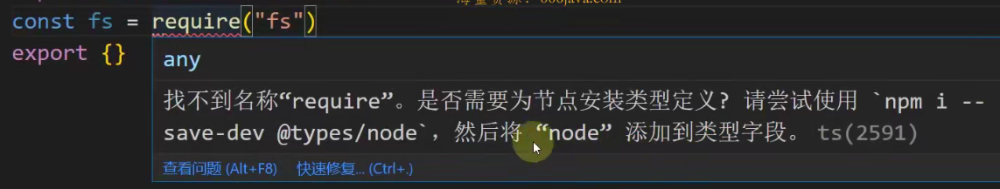
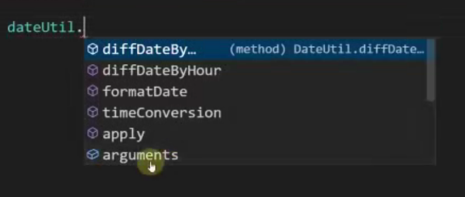
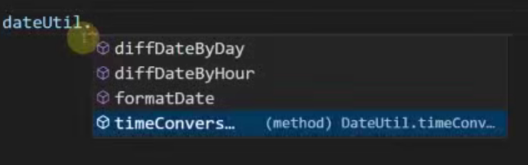

# TypeScript 相关

## 简介

- 编译时静态类型检测，函数或方法传参或变量赋值不匹配时，会出现编译错误提示，规避开发期间大量低级错误，省事，省力
- 自动提示更清晰明确
- 引入了泛型和一系列的 TS 特有的类型
- 强大的 d.ts 声明文件，清晰直观展示了依赖库文件的接口，`type` 类型，类
- 轻松编译成 JS 文件，即使 TS 文件有错误，绝大多数情况也能编译出 JS 文件
- 灵活性高，尽管 TS 是一门强类型检查语言，但也提供了 `any` 类型和 `as any` 断言，这提供了 TS 的灵活度


## 环境搭建

- 环境搭建

  ```bash
  npm init -y
  npm install typescript
  tsc --init
  ```

- 代码编译

  ```bash
  tsc xxx.ts
  ```


### tsconfig.ts 配置

#### 根属性

```json
{
  // 编译器选项
  "compilerOptions": {},
  // 
  "include": {},
  //
  "exclude": {},
  // 继承父配置选项
  "extends": ""
}
```


#### 编译器选项 compilerOptions

- 库选项

  提供全局库

  ```json
  // esnext 寻找最新版本
  "lib": ["esnext", "DOM"] 
  ```

- 目标选项

  会按照哪种 js 版本去编译 ts 代码

  ```json
  "target": "ESNext"
  ```

- 模块选项

  ts 编译成 js 使用的规范

  ```json
  "module": "CommonJS"
  ```

- 编译文件目录

  ```json
  // 要编译的目录
  "rootDir": "./app/src",
  // 编译后存放的目录
  "outDir": "./app/dist"
  ```

- 编译器用何种方式来确定导入所指内容

  - `node`：采用 `node` 模块解析的方式查找文件，从内层到最高目录的外层查找 `import` 引入的文件
  - `classic`：采用 `classic` 模块解析的方式查找文件，从外层到内层方式查找 查找 `import` 引入的文

  ```json
  "moduleResolution": "node"
  ```

- 是否支持导入 json 文件

  ```json
  "resolveJsonModule": true
  ```

  ```json
  // test.json
  {
    'name': 'jack',
    'age': '18'
  }
  ```

  ```typescript
  import test from './test.json'
  console.log(test)
  ```

- 允许导入 js，且编译后目录包含源 js 文件

  ```json
  "allowJs": true
  ```

  ```typescript
  import { price } from './product.js'
  ```

- 是否按照 ts 标准检测 js 文件

  ```json
  "checkJs": false
  ```

- 是否生成声明文件 d.ts

  ```json
  "declaration": true
  ```

- 是否生成 js.map 文件，帮助在浏览器运行编译后 js 时自动匹配源 ts 文件

  ```json
  "sourceMap": true
  ```

- 是否按照严格模式检测 `strict`

  ```json
  "strict": true
  ```

  `"strict": true` 等于以下子项之和

  ```json
  "noImplicitAny": true
  "strictNullChecks": true
  "strictFunctionTypes": true
  "strictPropertyInitialization": true
  "noImplicitReturns": true
  "removeComments": true
  "noUnusedlocals": true
  "noUnusedParameters" true
  ```

- 不允许隐式 `any`

  ```json
  "noImplicitAny": true 
  ```

- 空或 `undefined` 检查

    ```json
  "strictNullChecks": true
    ```

-   函数参数只支持逆变

    - 逆变：父可以赋值给子类型，子赋值给父类型会报错
    - 双向协变：父可以赋值给子类型，子可以赋值给父类型，既逆变又协变

  ```json
  // true 为只支持逆变， false 为双向协变
  "strictFunctionTypes": true
  ```

  - 属性要求有初始值

    ```json
    // 两个选择需要同时打开
    "strictNullChecks": true
    "strictPropertyInitialization": true
    ```

  - '不是函数的所有路径都有返回值' 的错误

    ```json
    "noImplicitReturns": true
    ```

    ```typescript
    // noImplicitReturns 为 true 时报错
    function fn(num: number) {
      if (num > 3) return 3
      else if (num > 3 && num < 100) return 10
    }
    ```

  - 编译后删除所有的注释

    ```json
    "removeComments": true
    ```

  - 声明的变量必须使用

    ```json
    "noUnusedlocals": true
    ```

  - 函数声明的参数必须使用

    ```json
    "noUnusedParameters" true
    ```

  - 对 d.ts 声明文件是否跳过类型检查

    ```json
    "skipLibCheck": true
    ```

  - 查找第三方包的声明文件的目录

    ```json
    "typeRoots": ["node_module/@types"]
    ```

     

    ```json
    // 和 node 相关的包都被支持
    "types": ["node"]
    ```

     

  - 支持 jsx 语法格式

    ```json
    // react 模式 react-native
    "jsx": "preserve"
    ```

  - 支持 ts 装饰器开启

    ```json
    "experimentalDecorators": true
    "emitDecoratorMetadata": true
    ```

  - 设置导入路径别名

    ```json
    "baseUrl": "."
    "paths": {
      "@user/*": ["src/user/*"]
    }
    ```

    ```typescript
    import { account } from '@user'
    ```

    


## 数据类型

### 基本数据类型

`number`、`string `、`boolean`、`symbol`、`null`、`undefined`

- `null` 表示一个空对象的引用

  ```typescript
  typeof null	// object
  ```

  ```typescript
  // 可以接受 null 的类型
  let data: null = null
  let data: any = null
  let data: known = null
  ```

- `undefined` 表示一个空对象的引用声明一个变量但没有赋值，该变量值为 `undefined`

  ```typescript
  typeof undefined // undefined
  ```

  ```typescript
  // 给了变量具体类型，但是不想赋值
  let str: string | nudefined
  console.log('str', str)
  ```

  ```typescript
  // 会将参数变为可选类型，同时参数类型为 string | undefined
  function fn(data?: string) {}
  // 此时参数并不是可选类型
  function fn(data: string | undefined) {}
  ```

  ```typescript
  // 可以接受 undefined 的类型
  let date: undefined = undefined
  let data: any = undefined
  let data: unknown = undefined 
  ```


### 根类型

`Object`、`{}`

- 根类型是其他类型的父类，只有 `null` 和 `undefined` 类型不可以赋值给 `Object` 和 `{}` 类型

  ```typescript
  let data: Object = 3
  let data: Object = [11, 22]
  let data: Object = { value: 'hello' }
  let data: Object = new Set<string>()
  ```

- `{}` 是 `Object` 的简写


### 对象类型

 `Array`、`object`、`function`

- `object` 是约束对象的数据类型

- `object`  类型的常见对象取值错误

  ```typescript
  let obj = { username: 'jack', age: 23 }
  let username = 'username'
  // const username = 'username'
  let name = obj[username]	// 报错，如果 let 改为 const 可以正常取值
  ```

  ```typescript
  let obj: object = { username: 'jack', age: 23 }
  const username = 'username'
  let name = obj[username]	// 报错：类型 {} 上不存在属性 username
  ```

- 函数类型

  ```typescript
  type fnType = (name: string, age: number) => number
  const info: fnType = function (name: string, age: number) {
    return 1
  }
  ```

- 剩余参数

  ```typescript
  // 可以是 any，或者某个类型的数组
  function info(name: string, age: number, ...rest: any) {}
  function info(name: string, age: number, ...rest: string[]) {}
  ```

### 枚举

 `enum`

- 枚举是用来存放一组固定常量的序列

- 枚举既是一个类型，也是一个变量

- 字符串枚举

  ```typescript
  enum Week {
    Monday = 'Monday',
    Tueeday = 'Tueeday',
    Wensday = 'Wensday',
    Thirsday = 'Thirsday',
    Firday = 'Firday',
  	Saturday = 'Saturday',
    Sunday = 'Sunday'
  }
  ```

  获取枚举值方式

  ```typescript
  const data1 = Week.Monday
  const data2 = Week['Monday']
  const data3 = Week[1]
  ```

- 数值枚举

  ```typescript
  enum Week {
    // 赋值第一项，后面的项默认递增
    Monday = 1,
    Tueeday,
    Wensday,
    Thirsday,
    Firday,
  	Saturday,
    Sunday
  }
  ```

  获取枚举值方式

  ```typescript
  const data1 = Week.Monday
  const data2 = Week['Monday']
  // 不可以使用下标获取
  ```

- 枚举调用

  ```typescript
  function getAduitState(status: EnumAduitStatus): void {
    if (status === EnumAduitStatus.NO_ADUIT) {
    } else if (status === EnumAduitStatus.MANAGER_ADUIT_SUCCESS) {
    } else if (status === EnumAduitStatus.FINAL_ADUIT_SUCCESS) {
    }
  }
  ```


### 其他特殊类型

`any`、`unknown`、`never`、`void`、元组 ( `tuple`) 、可变元组

- `never` 类型是穷尽了所有可能的类型，也没有对应的类型

  ```typescript
  function dataFlowAnalysisWithNever(data: number | string) {
    if (typeof data === 'string') {
      console.log('字符串类型', data.length)
    } else if (typeof data === 'number') {
      console.log('数值类型', data.toFixed(2))
    } else {
      // 没有对应的
      let _data: never = data;
    }
  }
  ```

- `any` 和 `unknown` 可以是任何类的父类，所以任何类型的变量都可以赋值给 `any` 或 `unknown` 类型的变量（左父右子）

  ```typescript
  let num: number = 2
  let data: any = num
  ```

- `any` 也可以是任何类的子类，但 `unknown` 不可以，所以 `any` 类型的变量都可以赋值给其他类型的变量

  ```typescript
  let array: any = ['a', 'b']
  let data: number = array
  ```

  ```typescript
  let array: unknown = ['a', 'b']
  let data: number = array	// 报错：不能将 unknown 赋值给 number
  ```

- 不能使用 `unknown` 类型的变量来获取任何属性和方法，但 `any` 类型的变量可以获取任意名称的属性和方法

  ```typescript
  function getName(data: any) {
    return data.name
  }
  function getName(data: unknown) {
    return data.name	// 报错
    // data[0]	报错
  }
  ```

  `unknown` 用作函数参数，目的是在函数内部只用于再次传递或输出结果，不获取属性

  ```typescript
  function ref(value: unknow) {
    // 函数内部只用于再次传递值，不获取属性
    return createRef(value)
  }
  ```

- 元祖条件：在定义时每个元素的类型都确定，元素值的数据类型必须是当前元素定义的类型，元素值的个数必须和定义时个数相同

  ```typescript
  let salary = [string, number, number] = ['jack', 2000, 1]
  ```

  ```typescript
  // 元祖取值
  console.log(salary[0])
  ```

- 可变元祖

  ```typescript
  let customers: [string, number, string, ...any[]] = ['jack', 23, '北京', '海淀区', '中关村']
  // 解构
  let { name, age, address, ...rest }: [string, number, string, ...any[]] = 
    ['jack', 23, '北京', '海淀区', '中关村']
  ```

  可变元祖标签，像对象一样命名

  ```typescript
  // 元祖标签名称和解构出来的变量名无关
  let { name, age, address, ...rest }: [name_: string, age: number, address: string, ...rest: any[]]
  ```


### 合成类型

联合类型，交叉类型

- 联合类型表示取值可以为多种类型的一种，联合类型在给出具体值以后，类型会确定为其中的一种类型

  ```typescript
  // 联合类型
  let data: string | number = 'hello'
  ```

- 联合类型只会取两个类型中相同的属性组成类型

  ```typescript
  type MouseEvent = {
  	eventType: 'click'
    x: number
    y: number
  }
  type KeyEvent = {
    eventType: 'keyUp'
    key: number
  }
  type Event = MouseEvent | KeyEvent
  // 类型结果：{ eventType: string }
  ```

- 交叉类型是将多个类型合并成一个类型

  ```typescript
  // 交叉类型
  let obj: { username: string } & { age: number } = { username: 'jack', age: 23 }
  ```

- 通用交叉方法

  ```typescript
  function cross<T extends object, U extends object>(obj1: T, obj2: U): T & U {
    const combine = {} as T & U
    for (let k in obj1) (combine as any)[k] = obj1[k]
    for (let k in obj2) (combine as any)[k] = obj2[k]
    return combine
  }
  ```


### 字面量类型

```typescript
let num: 1 | 2 | 3 = 1
```


### 接口

- 接口是另一种定义对象类型的类型

- 接口中定义的方法只有声明没有具体实现


#### 接口继承

```typescript
interface Pet {
  name: string,
  love: string[],
  health: string,
  eat(): void
}

// 新的接口在原来接口继承之上增加了一些属性或方法
interface Dog extends Pet {
  strain: string,
  guradHome(): void
}
```

- `interface` 可以 `extends` 一个或多个接口或类，也可以继承 `type`

  ```typescript
  interface TextNode extends Node, TemplateNode {}
  ```


#### 接口实现

为多个同类别的类提供统一的方法和属性声明

```typescript
interface List {
  add (): void,
  remove (): void
}
class ArrayList implements List {
  add (): void {
    console.log('add')
  }
  remove (): void {
    console.log('remove')
  }
}
```


#### 接口合并

```typescript
// 接口可以合并
interface Product {
  name: string;
  price: number;
  account: number;
  buy(): void;
}
interface Product {
  describe: string;
}
```


#### 索引签名

- 索引签名定义

  ```typescript
  interface Product {
    name: string;
    price: number;
    account: number;
    [x: string]: any;
    // [x: string]: string; 与其他属性重合不可以
  }
  ```

  ```typescript
  const product: Product = {
    name: 'phone',
    price: 1000,
    account: 1,
    color: 'red',
    // 指定 string 的情况，属性名不仅限于 string，其他类型也可以
    [Symbol('stockNo')]: 10,
    100: 'ok'
  }
  ```

- 索引签名访问

  ```typescript
  const symbolId = new Symbol('productNo')
  interface Product {
    [symbolId]: string | number;
    name: string;
    price: number;
    account: number;
    buy(): void;
  }
  ```

  ```typescript
  type Buy = Product['buy']
  type NameOrPrice = Product['name' | 'price']
  type No = Product[typeof symbolId]
  
  // 获取接口中属性的所有类型
  type PKeys = keyof Product // 等同于 'name' | 'price' | 'account' | 'buy' | typeof symbolId
  
  // 将所有的类型迭代出来，获取的类型为 'name' | 'price' | 'account' | 'buy' | typeof symbolId
  type AllKeys<T> = T extends any ? T : any
  type PKeys2 = AllKeys<keyof Product>	// ‘name' | 'price' | 'account' | 'buy' | typeof symbolId
  ```


### type 类型

- `type` 可以定义任何类型，包括基础类型、联合类型、交叉类型、元祖
  `interfaxce` 只可以定义对象类型或接口当名字的函数类型

  ```typescript
  // 定义基础类型
  type num = number
  // 定义联合类型
  type baseType = string | number | symbol
  // 定义联合类型（联合接口）
  interface Car { brandNo: string }
  interface Plane { No: string; brandNo: string }
  type TypVechile = Carl | Plane
  // 定义元组
  interface car { brandNo: string }
  interface Plane { No: string; brandNo: string }
  type TypVechile = [car, Plane]
  ```

- `type` 没有继承功能
  `interface` 可以 `extends` 一个或多个接口或类，也可以继承 `type`

- `type` 使用交叉类型 `&` 可以让类型中的成员合并成一个新的 `type` 类型

  `interface` 不能合并

  ```typescript
  type Group = { groupName: string, memberNum: number }
  type GroupInfoLag = { info: string, happen: string }
  type GroupMemeber = Group & GroupInfoLog
  
  let data: GroupMemeber = {
    groupName: '01',
    memberNum: 10,
    info: '集体爬山',
    happen: '中途有组员恐高，有惊无险'
  }
  ```

- 相同名称的 `interface` 可以合并声明，同名 `type` 会出现编译错误

  ```typescript
  interface Error { name: string }
  interface Error { message: string; stack?: string }
  // 接口合并
  let error: Error = { message: '空指针', name: 'NullPointException' }
  ```


### 类型断言和转换

- 类型断言：绕过 ts 编译检查，告诉编译器就是这个类型，无需检查

  `A 数据类型的变量 as B 数据类型`

  类型断言是有条件的，两种无相关的类型是不能断言的

  ```typescript
  let num: number = 3
  let str: num as string	// 报错
  // 父类转换子类
  let car = vechile as Car
  ```

- 类型转换：编译器强制一个类型转换成另外一个类型

  ```typescript
  let car: Car = <Car>vechile
  ```


### 类型守卫

- 类型守卫：在语句的块级作用域（`if` 语句内或条目运算符表达式内）**缩小变量类型**的一种推断的行为
- 类型守卫可以帮助在块级作用域中获得需要的更为精确变量类型


#### 实例判断 instanceof

```typescript
function pay(payMethod: BankPay | MobilePay) {
  if (payMethod instanceof MobilePay) {
    // MobilePay 的方法调用
  } else if (payMethod instanceof BankPay) {
    // BankPay 的方法调用
  }
}
```


#### 属性判断 in

```typescript
function pay(payMethod: BankPay | MobilePay) {
  // 类型包含指定属性
  if ('appId' in payMethod) {
    // 只能调用 MobilePay 内的属性方法
  } else if ('bankId' in payMethod) {
    // 只能调用 BankPay 内的属性方法
  }
}
```


#### 类型判断 typeof

```typescript
function cal(num: string | number) {
  if (typeof num === 'number') {
    num + 3
  }
}
```


#### 字面量判断

字面量相等判断 `==`、`===`、`!=`、`!==`


#### 自定义类型守卫

```typescript
// 固定写法
function 函数名(形参: 参数类型 多为 any): 形参 is A类型 {
  return true or false
}
```

```typescript
function isMobilePay(payMethod: Pay): payMethod is MobilePay {
  return payMethod instanceof MobilePay
}

function pay(payMethod: BankPay | MobilePay) {
  if (isMobilePay(payMethod)) {
    // MobilePay 的方法调用
  }
}
```

```typescript
function isNum(num: any): num is number {
  return typeof num === 'number'; 
}
function cal(num: string | number) {
  if (isNum(num)) {
    num + 3
  }
}
```

```typescript
function isPromiseLike<T>(it: unknown): it is PromiseLike<T> {
  return it instanceof Promise || typeof (it as any)?.then === "function";
}
```

```typescript
function isRef(r: any): r is Ref {
  return Boolean(r && r.__v_isRef === true)
}
```


### 条件类型

- 使用条件类型简化泛型约束代码

  ```typescript
  // 原始写法
  function cross<T extends object, U extends object>(obj1: T, obj2: U): T & U
  // 简化写法，且便于维护
  type CrossType<T> = T extends object ? T : never
  function cross<T, U>(obj1: CrossType<T>, obj2: CrossType<U>): T & U
  // Extract 写法
  type ExtractType<T> = Extract<T, object>
  function cross<T, U>(obj1: ExtractType<T>, obj2: ExtractType<U>): T & U
  ```

- 泛型为联合类型时的条件类型比较

  ```typescript
  // 一次性比较，string | number | boolean 当成整体去比较
  type Test = string | number | boolean extends string | number ? string : never
  // 类型结果为 never
  ```

  ```typescript
  // 泛型比较是迭代比较，逐个类型去匹配
  type CondType<T> = T extends string | number ? T : never
  type TestCondType = CondType<string | number | boolean>
  // 类型结果为 string | number
  ```


### keyof 操作符

- `keyof` 获取对象中的所有 key

  ```typescript
  interface User {
    name: string
    age: number
    phone: string
  }
  type UserKeysType = keyof User
  // 类型结果：'name' | 'age' | 'phone'
  ```

- `in keyof` 遍历对象中的 key

  ```typescript
  interface User {
    name: string
    age: number
    phone: string
  }
  type CopyUser = {
    // K 为 User 循环中的每个 key，循环结果 K 可以在其他地方使用
    // 相当于 K in 'name' | 'age' | 'phone'
    // 联合类型逐个迭代出结果
    [K in keyof User]: User[K]
  }
  // CopyUser 结果等于 User
  ```

- `in keyof` 结合条件类型扩展现有类型

  ```typescript
  // 现有类型
  interface User {
    name: string
    age: number
    phone: string
  }
  // 基于现有类型添加属性后的扩展类型
  // T 为现有类型，K 为新添加的属性，V 为新添加的属性的数据类型
  type AddAttrToObj<T, K extends string, V> = {
    // in keyof 迭代现有类型，包含住现有类型内的属性
    // 不存在于现有类型的新属性，新属性的数据类型为 V
    [P in keyof T | K]: P extends keyof T ? T[P] : V
  }
  type UserPlus = AddAttrToObj<User, 'weixin', string>
  // 类型结果为
  // {
  //   name: string
  //   age: number
  //   phone: string
  //   weixin: string
  // }
  ```

- `keyof` 结果显示联合类型

  ```typescript
  interface User {
    name: string
    age: number
    phone: string
  }
  // 在IDE中鼠标放到类型上面，显示的类型是 keyof User，并没有直观的显示key的联合类型
  type Keys = keyof User
  // 展现key的联合类型，需要使用通用的格式
  // 利用了泛型的依次比较的特点
  type DirectKeys<T> = T extends any ? T : never
  type UserKeys = DirectKeys<keyof User>	// 'name' | 'age' | 'phone'
  ```

- 扁平化模块属性名

  ```typescript
  type MethodsType = {
    menu: {
      setActiveIndex: (index: string) => string
      setCollapse: (index: string) => string
    }
    tabs: {
      seteditableTabsValue: (editValue: string) => void
      setTabs: (index: string) => void
      setTabsList: (index: string) => void
    }
  }
  ```

  ```typescript
  // 模板字符串类型
  // 泛型写到模板时，固定写法 T & string
  type TemplateString<T, U> = `${T & string}/${U & string}`
  // 测试模板字符串类型
  // 类型结果为：'menu/setActiveIndex' | 'menu/setCollapse'
  type TestTempStr = TemplateString<'menu', 'setActiveIndex' | 'setCollapse'>
  ```

  ```typescript
  type SpliceObjKey<T> = {
     // 父和子联合起来
     [key in keyof T]: TemplateString<Key, keyof T[Key]>
   } [keyof T]
  // 对象类型后面写 [keyof T] 意味着舍弃 key 直接取后面的部分
  // { name:string, age: number }['name' | 'age']
  ```

  ```typescript
  type ModuleSpliceObjKey = SpliceObjKey<MethodsType>
  // 结果：'menu/setActiveIndex' | 'menu/setCollapse' | 'tabs/seteditableTabsValue' | 'tabs/setTabs' | 'tabs/setTabsList'
  ```


### 类型映射 in

- 在类型映射中，`in` 只能接 `string`、`number`、`symbol` 三种基本类型

  ```typescript
  type Copy<T extends Record<string, any>> = {
    [K in keyof T]: T[K]
  }
  // 结果为可索引签名形式
  // {
  //   [x: string]: any
  // }  
  ```

- 使用 `in ... as` 来剔除属性

  ```typescript
  type Omit<T, K extends keyof T> = {
    // 剔除的 key 转为 never 类型
    // [P in keyof T as P extends K ? never : P]: T[P]
    // 最终形式
    [P in keyof T as Exclude<P, K>]: T[P]
  }
  ```

- 使用 `in ... as` 来提取类型

  实现抓取类型中的方法

  ```typescript
  interface Todo {
    title: string
    completed: boolean
    description: string
    add(): number
    delete(): number
    update(): number
  }
  ```

  ```typescript
  // 排除 Array 类型
  type ExcludeArray<T> = Exclude<T, Array<any>>
  // 提取函数类型
  type TodoMethod<T extends Record<string, any>> = {
    // 是函数的返回，不是的返回never
    // as 重映射
    [P in keyof ExcludeArray<T> as ExcludeArray<T>[P] extends Function ? P : never]: T[P]
  }
  ```

  ```typescript
  type MyMethod = TodoMethod<Todo>
  // 结果类型
  // {
  //   add: () => number
  //   delete: () => number
  //   update: () => number
  // }
  ```

  ```typescript
  type MethodName<T> = `do${Capitalize<T & string>}`
  // 映射修改方法名
  type TodoMethod<T extends Record<string, any>> = {
    [P in keyof ExcludeArray<T> as ExcludeArray<T>[P] extends Function ? MethodName<P> : never]: T[P]
  }
  // 结果类型
  // {
  //   doAdd: () => number
  //   doDelete: () => number
  //   doUpdate: () => number
  // }
  ```

- 使用 `in ... as` 将对象的属性数据类型转换为 key 的值

  ```typescript
  type MouseEvent = {
    eventType: 'click'
    x: number
    y: number
  }
  type KeyEvent = { 
    eventType: 'keyUp'
    key: number
  }
  ```

  ```typescript
  type EventMethod = EventFunctions<MouseEvent | KeyEvent, 'eventType'>
  // 结果
  // {
  //   click: (event: MouseEvent) => any
  //   keyup: (event: KeyEvent) => any
  // }
  ```

  ```typescript
  // 泛型 Events 为事件对象类型
  // 泛型 EventKey 为要事件对象中要把值转为key的属性
  type EventFunctions<Events extends Record<string, any>, EventKey extends keyof Events> {
  	// MouseEvent | KeyEvent 的联合类型为 `eventType: 'click' | 'keyup'`
  	// 如果写成 [Event in Events]，编译器不识别，因为 in 后面只能接 string、number、symbol 类型
  	// 解决思路是 [Event in Events as string]
  	// in as 映射为将指定属性 EventKey 在旧类型中的指定属性的类型，作为新类型的 key
  	[Event in Events as Event extends Events ? Event[EventKey] : never ]: (event: Event) => any
  	// 简写模式
  	// [Event in Events as Event[EventKey]]: (event: Event) => any
  }
  ```


### 推断类型 infer

- `infer` 表示在 `extends` 条件语句中，以占位符出现的，等到使用时才推断出来的数据类型

- 获取参数类型

  ```typescript
  // User 为对象类型
  type FuncType = (params: User) => string
  ```

  ```typescript
  // infer 推断，P 就是占位符
  // 使用该类型的时候，P 就会匹配到实际的类型
  type FuncParaType<T> = T extends (params: infer P) => any ? P : never
  ```

  ```typescript
  // 获取到类型结果为 User
  type ParaType = FuncParaType<FuncType>	// User
  ```

- 获取返回值类型

  ```typescript
  type FuncType = (params: User) => string
  ```

  ```typescript
  type FuncRtnType<T> = T extends (params: any) => infer R ? R : never
  ```

  ```typescript
  type RtnType = FuncRtnType<FuncType>	// string
  ```

- 获取泛型的类型

  ```typescript
  type ElementOfArray<T> = T extends Array<infer P> ? P : never
  ```

  ```typescript
  type ArrayItemType = ElementOfArray<Array<{ name: string, age: number }>>
  // 类型输出为 { name: string, age: number }
  ```

  函数中使用

  ```typescript
  function unref<T>(ref: T): T extends Ref<infer V> ? V : T {
    // 参数可以是 Ref 对象，也可以是其他对象
    return isRef(ref) ? (ref.value as any) : ref
  }
  ```

  ```typescript
  unref(ref(3))									//返回值类型为 number
  unref(ref('jack'))						// 返回值类型为 string
  unref(ref({ name: 'jack' }))	// 返回值类型为 { name: string }
  unref({ age: 29 })						// 返回值类型为 { age: number }
  ```


### 高级类型

#### Extract 类型

- `Extract` 类型就是条件类型的简写
- 底层实现 `type Extract<T, U> = T extends U ? T : never`

```typescript
type TestExtract = Extract<string, string | number>
// 类型结果为 string | number，由此可知是循环比较的
type TestExtract = Extract<string | number | boolean, string | number>
```


#### Exclude 类型

- 与 `Extract ` 正好相反，满足条件不显示，不满足条件显示

- 底层实现 `type Exclude<T, U> = T extends U ? never : T`

```typescript
// 类型结果为 boolean，只把不匹配的内容筛选出来
type TestExclude = Exclude<string | number | boolean, string | number>
```

```typescript
// 排除数组和基本类型，只有以外的数据类型可以使用
type ExcludeBaseAndArrayType<T> = Exclude<T, string | number | boolean | Array[any]>
```


#### Record 类型

- 使用 `object` 的地方，`Record` 都可以替代

- `Record` 的 key 只支持 `string`、`number`、`symbol` 三种类型 `Record<string | number | symbol, string>`

  ```typescript
  // key支持 number 类型，因此也支持数组
  const record: Record<string, any> = [3, 4, 5]
  ```

- 底层实现

  ```typescript
  type Record<K extends keyof any, T> = {
    [P in K]: T;
  }
  ```

  ```typescript
  type MyRecord = Record<string, string| number>
  // MyRecord 的结果为
  // { [x: string]: string | number }
  // 索引签名格式，以下形式都可以
  const record: MyRecord = {
    name: 'jack'
    [Symobl('no')]: 100,
    100: 101,
    true: 100
  }
  ```

- `Record` 既可以接受对象，也可以接受数组

  ```typescript
  // 是否为纯对象
  // 参数为对象或数组都可以
  function isPlainObject(data: Record<string, any>) {
    // true 为对象，false 为数组
    return Object.prototype.toString.call(data) === '[object Object]'
  }
  type BaseType = string | number | boolean
  // 既可以为对象也可以为数组
  function deepCopy(data: Record<string, any> | BaseType) { }
  ```


#### Pick 类型

- `Pick` 用来抓取 type 类型、接口、类中的属性组成一个新的对象类型

- `Pick<T, K extends keyof T>`：`T` 为要抓取的类型，`K` 为类型当中要抓取的属性

  ```typescript
  interface Book {
    ISBN: string
    bookName: boolean
    bookPrice: string
    storeCount: number
    publish: string
  }
  type SubBook = Pick<Book, 'ISBN' | 'bookName' | 'bookPrice'>
  ```

- 底层实现

  ```typescript
  type Pick<T, K extends keyof T> = {
    [P in K]: T[P]
  }
  ```


#### Omit 类型

- `Omit` 用来剔除一个类型的某些属性，返回一个新属性

- 底层实现

  ```typescript
  type Omit<T, K extends keyof any> = Pick<T, Exclude<keyof T, K>>;
  ```

- 使用 `in` 来实现

  ```typescript
  type Omit<T, K extends keyof T> = {
    // 剔除的 key 转为 never 类型
    // [P in keyof T as P extends K ? never : P]: T[P]
    // 最终形式
    [P in keyof T as Exclude<P, K>]: T[P]
  }
  ```


#### Required 类型

-  `Required<T>` 将类型中的可选类型转为必选类型，去除所有 `?`
- 源码实现 `type Required<T> = {[K in keyof T]-?: T[K]}`

```typescript
interface Todo {
  title: string
  completed: boolean
  date?: Date
  publisher?: string
}
type MustTodo = Required<Todo>
// 结果
// {
//   title: string
//   completed: boolean
//   date: Date
//   publisher: string
// }
```


#### Partial 类型

- `Partial<T>` 将类型中的所有必选属性转为可选属性，加上 `?`
- 源码实现 `type Partial<T> = {[K in keyof T]?: T[K]}`，等同于 `type Partial<T> = {[K in keyof T]+?: T[K]}`

```typescript
interface Todo {
  title: string
  completed: boolean
  date: Date
  publisher: string
}
type ChooseTodo = Partial<Todo>
// 结果
// {
//   title?: string
//   completed?: boolean
//   date?: Date
//   publisher?: string
// }
```


#### Readonly  类型

- `readonly` 标记一个属性是只读，不可再赋值修改的
- `Readonly<T>` 将类型中的所有属性转为只读属性

- 源码实现 `type Readonly<T> = { readyonly [K in keyof T]: T[K] }`

- 去除只读类型

  ```typescript
  type Writable<T> = {
  	-readonly [K in keyof T]: T[K]
  }
  ```

  ```typescript
  // 又不只读，又可选
  type PartialAndWritable<T> = {
    -readonly [K in keyof T]+?: T[K]
  }
  ```

  


#### Capitalize 类型

首字母大写

```typescript
type ToCapitalize = 'test'
type TestCapitalize = Capitalize<ToCapitalize>		// 类型结果：Test
```


## 类

### 静态成员

- 类在执行的时候，首先会先执行全部静态属性

  ```typescript
  class Util {
    static obj = new Util()
    private constructor() {
      console.log('创建对象')
    }
  }
  console.log('外部执行')
  // 创建对象
  // 外部执行了
  ```

- 静态方法属性的应用场景：当类是作为工具类，并且没必要多次实例化的场合

  ```typescript
  class DataUtil {
    static formatData() {}
    static timeConversion() {}
    static diffDataByHour() {}
  }
  DataUtil.formatData()
  ```

- 静态方法和单例模式的区别，以及单例模式实现：一个类只允许外部获取到它的唯一实例对象

  ```typescript
  // 方式一：立即创建单件模式
  // 方法一的缺点是自动默认创建实例对象，即使没使用
  // 使用静态属性指向唯一实例对象
  class DataUtil {
    static dataUtil = new DataUtil()
    // 创建类的实例对象的权限放在类的内部
    // 私有构造函数只能在类的内部调用
    private constructor() {}
    formatData() {}
  }
  export default DataUtil.dataUtil
  ```

  ```typescript
  // 方式二：想使用的时候，才去创建实例对象
  class DataUtil {
    static dataUtil: DataUtil
    static getInstance() {
      if (this.dataUtil) {
        this.dataUtil = new DataUtil()
      }
      return this.dataUtil
    }
    private constructor() {}
    formatData() {}
  }
  ```

  - 静态成员调用因为是类的调用，会有其他原型链上无关的属性和方法

     

  - 单例模式是对象的调用，调用起来更简洁一些

     


### Getter / Setter 属性

```typescript
class Person {
	_age: number = 0
  set age(vaule: number) {
    if (value > 10 && value < 128) {
      this._age = value
    } else {
      throw new Error('年龄不在范围内')
    }
  }
  get age() {
    return this._age;
  }
}
```


## 泛型

具有以下特点的数据类型叫做泛型

1. 定义时不明确，使用时必须明确成某种具体数据类型的数据类型
2. 编译期间进行数据类型检查的数据类型

 

### 泛型约束

```typescript
type InstancePropKeys<T extends object> = keyof T
```

```typescript
class Order {
  id: number
  name: string
  count: number
  print() {}
}
type OrderPropKeys = InstancePropKeys<Order>
```

```typescript
type KeysType<T, K> = K extends keyof T ? K : never
```

```typescript
type User = { name: string, age: number }
type TestKeysType = KeysType<User, 'name'>
```


## 函数

### 函数重载

一组具有相同名字，不同参数列表的和返回值无关并且具有一个实现签名和一个或多个重载签名的函数

```typescript
// 重载签名
function searchMsg(condition: MessageType): Message[]
function searchMsg(condition: number): Message | undefined
// 实现签名
function searchMsg(condition: MessageType | number): Message | undefined | Message[] {
  if (typeof condition === 'number') {
    return messages.find((msg) => condition === msg.id)
  } else {
    return messages.filter((msg) => condition === msg.type)
  }
}
```


### 泛型工厂函数

构造函数的函数类型

```typescript
type ConstructorType = new (...args: any) => any
// 接口形式
interface ConstructorInterface {
  new (...args: any): any
}
```

```typescript
// 为所有的类提供一个构造器
function createFactoryConstructor(constructorType: new (...args: any) => any) {
  // 创建对象拦截部分
  console.log(constructorType.name + '被创建..')
  new constructorType()
}

class User {
  name: string
  age: number
  constructor(name: string, age: number) {
    this.name = name
    this.age = age
  }
}
createFactoryConstructor(User)
```


## 声明文件

- 关键字 `declare` 表示声明

  声明全局变量：`declare let`、`declare const`

  声明全局方法：`declare function`

  声明全局类：`declare class`

  声明全局枚举类型：`declare enum`

  声明全局对象：`declare namespace`

  声明模块：`declare module`

  声明全局类型：`interface` / `type`，不需要 `declare`

- 凡是 js 能识别的都需要加 `declare`，js 不支持的例如 `interface`、`type` 则不需要加 `declare`

- d.ts 文件的作用范围为 tsconfig.json 文件的 `include` 选项指定的路径范围

- 命名空间 `namespace` 是为了防止重名，可以当成对象看待，`namespace` 添加 `declare` 了，内部的内容就无需 `declare` 了

  ```typescript
  declare namespace JQuery {
    type cssSelector = {
      css: (key: string, value: string) => cssSelector
    }
    export function $(ready: () => void): void
    // 嵌套命名空间
    namespace $ {
      function ajax(url: string): void
    }
  }
  ```

  ```typescript
  // 使用
  JQuery.$(function() => {})
  ```

- 使用 `module` 替代 `namespace`

  ```typescript
  declare module "JQueryModule" {
    type cssSelector = {
      css: (key: string, value: string) => cssSelector
    }
    export function $(ready: () => void): void
    export = $
  }
  ```

  

## 装饰器

- 装饰器就是一个方法，可以注入到**类、方法、属性、参数，对象**上，扩展其功能

- 装饰器就是解决在不修改原来类、方法，属性，参数的时候为其添加额外的功能

- 常见的装饰器：**类装饰器、属性装饰器、方法装饰器、参数装饰器，元数据装饰器**


