# 认识Vue

Vue 是一套用于构建用户界面的**渐进式框架**，所谓渐进式框架，就是可以在项目中一点点来引入和使用 Vue，而不一定需要全部使用 Vue 来开发整个项目

**Vue2 和 Vue3 的区别**

1. 源码使用 TypeScript 来进行重写
   - Vue2.x：Vue 使用 Flow 来进行类型检测
   - Vue3.x：Vue 的源码全部使用 TypeScript 来进行重构
2. 使用 Proxy 进行数据劫持
   - Vue2.x：使用 `Object.defineProperty` 来劫持数据的 getter 和 setter 方法
   - Vue3.x：使用 `Proxy` 来实现数据的劫持
3. 删除一些不必要的 API
   - 移除了实例上的 `$on`,  `$off` 和 `$once`
   - 移除了一些特性：如 filter、内联模板等
4. 编译方面的优化
   - 生成 Block Tree、Slot 编译优化、diff 算法优化
5. 由 Options API 到 Composition API
   - Vue2.x：通过 Options API 来描述组件对象，存在比较大的问题是多个逻辑可能是在不同的地方
   - Vue3.x：通过 Composition API 将相关联的代码放到同一处进行处理，而不需要在多个 Options 之间寻找

6. Hooks 函数增加代码的复用性

   - Vue2.x：通过 mixins 在多个组件之间共享逻辑

     缺陷是 mixins 也是由一大堆的 Options 组成的，并且多个 mixins 会存在命名冲突的问题

   - Vue3.x：通过 Hook 函数，来将一部分独立的逻辑抽取出去，并且可以做到是响应式的

7. 源码通过 monorepo 的形式来管理源代码


# 安装

## 非脚手架安装

- 页面中通过 CDN 的方式来引入

   ```vue
   <script src="https://unpkg.com/vue@next"></script>
   ```

- 下载 Vue 的 JavaScript 文件，手动引入

   ```vue
   <script src="../js/vue.js"></script>
   ```

- 通过 npm 包管理工具安装使用

   ```bash
   npm install vue@next
   ```

   单文件组件适配

   ```bash
   npm install @vue/compiler-sfc -D
   ```

   **项目编译参考 webpack**


## Vue CLI 安装

通过 Vue CLI 创建项目使用

```bash
npm install @vue/cli -g
vue create projectName
```

**vue create 项目的过程**

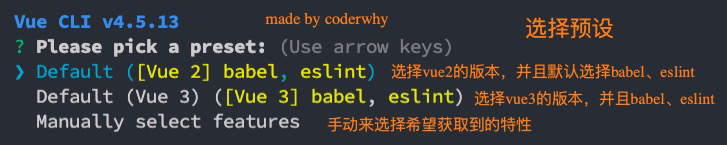 

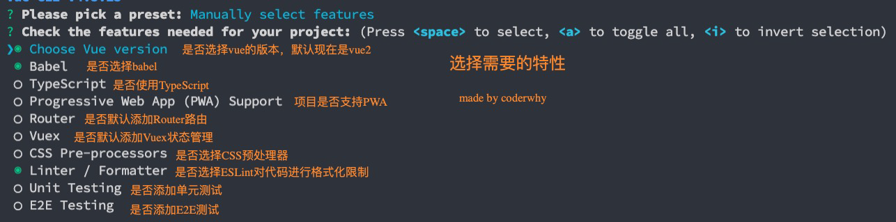 

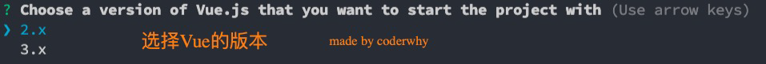 

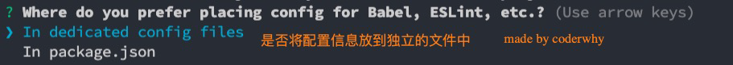 

**脚手架创建的项目目录**

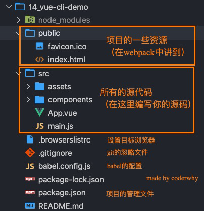 

**项目启动编译**

```bash
# 启动
npm run serve
# 编译
npm run bulid
```

> npm run bulid 打包后，可以使用 anywhere 简单静态服务器运行 dist 目录

如果命令行中使用 vue 命令失败，需要手动配置环境变量

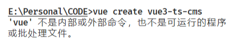 

执行 `npm config list`

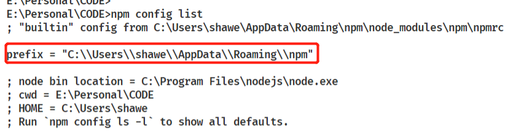 

文件夹中是否有 vue.cmd，如果没有就是 Vue CLI 安装失败

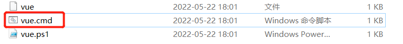 

将 npm 文件夹添加进环境变量，重启

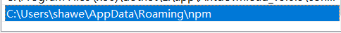 


## Vite 安装

在开发运行阶段 vite **借助浏览器原生支持模块化** ESM，而不对项目进行编译，**直接运行模块化代码**

同时会对依赖的第三方库进行优化，减少浏览器发送请求，同时支持识别 TypeScript、less、vue 等代码

vite 主要由两部分组成

1. 一个开发服务器 Connect，基于原生 ES 模块提供了丰富的内建功能，HMR 的速度非常快速
2. 一套构建指令，使用 rollup 打开代码，并且它是预配置的，可以输出生成环境的优化过的静态资源

**vite 对 TypeScript 是原生支持**的，它会直接使用 ESBuild 来完成编译

**通过 Vite 构建项目**

- 安装 Vite，Vite 需要 Node.js 版本 >= 12.0.0

  ```bash
  npm install -g vite
  ```

- 使用 Vite 脚手架创建项目

  ```bash
  npm init vite projectName
  ```

- 项目启动编译

  ```bash
  # 启动
  npm run dev
  # 编译
  npm run bulid
  # 预览编译后效果
  npm run serve
  ```

  可以设置局域网 ip 运行

  ```json
  "scripts": {
    "dev": "vite --host"
  }
  ```

- vite 对 css 的支持

  - 可以直接支持 css 的处理

  - 支持 css 预处理器，安装即可

    ```bash
    npm install less -D
    ```

    ```bash
    npm install sass -D
    ```

  - 支持 postcss 的转换，安装并且配置 postcss.config.js 的配置文件即可

    ```bash
    npm install postcss postcss-preset-env -D
    ```

    ```javascript
    module.exports = {
        plugins: [
            require('postcss-preset-env')
        ]
    }
    ```

- 不依赖 vite 脚手架的安装方式

  - 安装 vite 工具

    ```bash
    npm install vite –g # 全局安装
    npm install vite –D # 局部安装
    ```

  - 安装 vue 插件

    ```bash
    npm install @vitejs/plugin-vue -D
    ```

    在 vite.config.js 中配置插件

    ```javascript
    import vue from '@vitejs/plugin-vue'
    
    module.exports = {
      plugins: [
          vue()
      ]
    }
    ```

  - 打包编译

    ```bash
    # 启动
    npx vite
    # 编译
    npx vite build
    # 预览
    npx vite preview
    ```


# 模板

在模板中，允许开发者以声明式的方式将 DOM 和底层组件实例的数据绑定在一起

在底层的实现中，Vue 将模板编译成虚拟 DOM 渲染函数


## 双大括号语法

把数据显示到模板中，通常使用 **Mustache 语法**（双大括号） 的文本插值

`data` 返回的对象是有添加到 Vue 的响应式系统中，当 `data` 中的数据发生改变时，对应的双大括号中的内容也会发生更新

- 双括号语法

  ```html
  <h1>{{ message }}</h1>
  ```

- 使用表达式

  只能写一个表达式，不能使用赋值语句

  ```html
  <h2>{{ counter * 10 }}</h2>
  ```

  ```html
  <h1>{{ message.split('').reverse().join('') }}</h1>
  ```

- 调用函数

  ```html
  <h2>{{ reverse(message) }}</h2>
  ```

- 使用计算属性

  ```html
  <h1>{{ message }}</h1>
  ```

- 使用三元表达式

  ```html
  <div>{{ color=='green' ? "开心" : "难过" }}</div>
  ```


# 样式

## scoped 属性

在 `style` 标签上可以添加一个 `scoped` 属性，表示这个 `style` 标签里面的 css **只会应用到当前的组件上**

在带有 `scoped` 的时候，父组件的样式将不会泄露到子组件当中

**子组件的根节点**会**同时被父组件的作用域样式和子组件的作用域样式影响**，这样父组件就可以设置子组件根节点的样式

类似于 Shadow DOM 中的样式封装

```html
<style scoped>
.example {
  color: red;
}
</style>
```


## 深度选择器 :deep

处于 `scoped` 样式中的选择器如果想**影响到子组件**，可以使用 `:deep()` 这个伪类来**覆盖样式**，括号内是需要影响的选择器

```vue
<style scoped>
.a :deep(.b) {
  /* ... */
}
</style>
```


## v-bind 绑定 JS 变量

`<style>` 标签中，通过 `v-bind` 函数将 CSS 的值关联到动态的组件状态上

```vue
<script setup>
const theme = {
  color: 'red'
}
</script>
<style scoped>
p {
  color: v-bind('theme.color');
}
</style>
```


# 指令

## v-bind / :

**动态绑定一个或多个属性值**，或者**向另一个组件传递 props 值**

`v-bind:属性名="值"`，简写 `:属性名="值"`

- 参数：attrOrProp (optional)
- 绑定类型：any (with argument) | Object (without argument)


### 绑定属性

比如图片的链接 src、网站的链接 href、动态绑定一些类、样式等等

```html


<a :href="href"></a>
```


### 绑定 class

#### 对象语法

传给 `:class` 一个对象，动态地切换 class： `{类: boolean}`

- 普通绑定

  ```html
  <div :class="{'active': isActive}">hahaha</div>
  <!-- 也可以有多个键值对 -->
  <div :class="{active: isActive, title: true}">hehehe</div>
  ```

- 默认 class 和动态 class 结合

  ```html
  <div class="abc cba" :class="{active: isActive, title: true}">hahaha</div>
  ```

- 绑定对象

  ```html
  <div :class="classObj">呵呵呵呵</div>
  ```

  ```javascript
  const classObj = reactive({ 
  	active: true,
  	title: true 
  })
  ```
  
- 从 `methods` / `computed` 方法中获取对象

  ```html
  <div :class="getClassObj()">呵呵呵呵</div>
  ```

  ```javascript
  function getClassObj() {
    return {
      active: true, 
      title: true 
    }
  }
  ```


#### 数组语法

把一个数组传给 `:class`，以应用一个 class 列表

- 直接传入数组

  ```html
  <div :class="['abc', title]">呵呵呵呵</div>
  ```

  ```javascript
  const title = ref("cba");
  ```
  
- 数组中使用三元运算符

  ```html
  <div :class="['abc', title, isActive ? 'active': '']">哈哈哈哈</div>
  ```

  ```javascript
  const title = ref("cba");
  const isActive = ref(true);
  ```

- 数组中使用对象

  ```html
  <div :class="['abc', title, {'active': isActive}]">哈哈哈哈</div>
  ```

  ```javascript
  const title = ref("cba");
  const isActive = ref(true);
  ```


### 绑定 style

利用 `v-bind:style` / `:style` 来绑定 CSS 内联样式

CSS property 名可以用**驼峰式**或**短横线分隔**（需要用引号括起来）来命名

#### 对象语法

`{cssPropertyName: cssPropertyValue}`

- 普通绑定

  ```html
  <div :style="{color: finalColor, 'font-size': '30px'}">哈哈哈哈</div>
  <div :style="{color: finalColor, fontSize: '30px'}">哈哈哈哈</div>
  <div :style="{color: finalColor, fontSize: finalFontSize + 'px'}">哈哈哈哈</div>
  ```

  ```javascript
  const finalColor = ref('red');
  const finalFontSize = ref(50);
  ```

- 绑定对象

  ```html
  <div :style="finalStyleObj">呵呵呵呵</div>
  ```

  ```javascript
  const finalStyleObj = reactive({
    'font-size': '50px',
    fontWeight: 700,
    backgroundColor: 'red'
  })
  ```
  
- 从 `methods` / `computed` 方法中获取对象

  ```html
  <div :style="getFinalStyleObj()">呵呵呵呵</div>
  ```

  ```javascript
  function getFinalStyleObj() {
    return {
      'font-size': '50px',
      fontWeight: 700,
      backgroundColor: 'red'
    }
  }
  ```


#### 数组语法

将多个样式对象应用到同一个元素上

```html
<div :style="[style1Obj, style2Obj]">哈哈哈</div>
```

```javascript
const style1Obj = reactive({
  color: 'red',
  fontSize: '30px'
});
const style2Obj = reactive({
  textDecoration: "underline"
});
```


### 绑定动态属性

如果属性名称不是固定的，可以使用 `:[属性名]="值"` 的格式来定义

```html
<div :[name]="value">哈哈哈</div>
```

```javascript
const name = ref('cba');
const value = ref('kobe');
```


### 绑定对象

**将一个对象的所有属性**，**绑定到元素上的所有属性**，可以直接使用 `v-bind` 绑定一个对象

```html
<!-- info对象会被拆解成div的各个属性 -->
<div v-bind="info">哈哈哈哈</div>
<div :="info">哈哈哈哈</div>
```

```javascript
const info = reactive({
  name: "why",
  age: 18,
  height: 1.88
})
```


## v-on / @

绑定监听事件

- 缩写语法糖：`@`
- 参数：event
- 绑定类型：Function | Inline Statement | Object


### 绑定事件

` v-on:监听事件="方法"`、` @监听事件="方法"`

- 普通绑定

  ```html
  <button v-on:click="btnClick">按钮</button>
  <button @click="btnClick">按钮</button>
  ```

  ```javascript
  function btnClick() {
    console.log("按钮点击");
  }
  ```
  
- 绑定表达式

  ```html
  <button @click="counter++">{{counter}}</button>
  ```

- 绑定多个事件

  ```html
  <div v-on="{click: btnClick, mousemove: mouseMove}"></div>
  <div @="{click: btnClick, mousemove: mouseMove}"></div>
  ```

  ```javascript
  function btnClick() {
    console.log("按钮点击");
  }
  function mouseMove() {
    console.log("鼠标移动");
  }
  ```

- 常见 DOM 事件

  鼠标事件  `@click`，`@dblclick`，`@mousemove`，`@mouseover`、`@mouseenter`、`@mouseleave`

  键盘事件  `@keypress`，`@keyup`，`@keydown`

  表单事件  `@submit`，`@focus`，`@blur`


### 参数传递

- 如果该方法**不需要额外参数**，方法后的 `()` **可以不添加**，会默认将原生事件 `event` 参数传递进去

  ```html
  <button @click="btnClick">按钮</button>
  ```

  ```javascript
  function btnClick(event) {
    console.log(event);
  }
  ```
  
- 如果**需要传入其他参数**，需要同时通过 `$event` 传入事件

  `$event` 可以获取到事件发生时的事件对象

  ```html
  <button @click="btnClick($event, 'coderwhy', 18)">按钮</button>
  ```

  ```javascript
  function btnClick(event, name, age) {
    console.log(name, age, event);
  }
  ```


### 修饰符

`v-on` 支持修饰符，修饰符相当于对事件进行了一些特殊的处理

- `.stop`：调用 `event.stopPropagation()`，阻止事件冒泡

  ```html
  <!-- 阻止事件冒泡 -->
  <div @click="divClick">
    <button @click.stop="btnClick">按钮</button>
  </div>
  ```

  ```javascript
  function divClick() {
    console.log("divClick");
  }
  function btnClick() {
    console.log('btnClick');
  }
  ```
  
- `.prevent`：调用 `event.preventDefault()` 阻止默认行为

  ```html
  <!-- 提交事件将不再重新加载页面 -->
  <form @submit.prevent="onSubmit"></form>
  ```

- `.capture`：添加事件侦听器时使用 capture 模式

- `.once`：只触发一次回调

- `.self`：只当事件是从侦听器绑定的元素本身触发时才触发回调

- `.passive`：`{ passive: true }` 模式添加侦听器

- `.{keyAlias}`：仅当事件是从特定键触发时才触发回调

  Vue 为一些**常用的按键**提供了别名：

  `.enter`、`.tab`、`.esc`、`.space`、`.up`、`.down`、`.left`、`.right`、`.delete` (捕获“Delete”和“Backspace”两个按键)

  ```html
  <!-- 按下回车键才会触发 -->
  <input type="text" @keyup.enter="enterKeyup">
  ```

  ```javascript
  function enterKeyup(event) {
    console.log("keyup", event.target.value);
  }
  ```

  使用系统按键修饰符来触发鼠标或键盘事件监听器，只有当按键被按下时才会触发

  `.ctrl`、`.alt`、`.shift`、`.meta`

  ```html
  <!-- Alt + Enter -->
  <input @keyup.alt.enter="clear" />
  
  <!-- Ctrl + 点击 -->
  <div @click.ctrl="doSomething">Do something</div>
  ```

- `.exact`：精确匹配组合键

  ```html
  <!-- 当按下 Ctrl 时，即使同时按下 Alt 或 Shift 也会触发 -->
  <button @click.ctrl="onClick">A</button>
  
  <!-- 仅当按下 Ctrl 且未按任何其他键时才会触发 -->
  <button @click.ctrl.exact="onCtrlClick">A</button>
  
  <!-- 仅当没有按下任何系统按键时触发 -->
  <button @click.exact="onClick">A</button>
  ```

- `.left`：只当点击鼠标左键时触发

- `.right`：只当点击鼠标右键时触发

- `.middle`：只当点击鼠标中键时触发


### 绑定动态事件

如果事件名称不是固定的，可以使用 `@[事件名]="方法" ` 的格式来定义

```html
<button @[eventName]="btnClick">按钮</button>
```

```javascript
const eventName = ref("click");
function btnClick(){
  console.log('btnClick');
}
```


## v-if / v-show

根据条件决定某些元素或组件是否渲染

### v-if / v-else / v-else-if

只有在条件为 true 时，才会被渲染出来

`v-if` 渲染是惰性的，**当条件为 false** 时，其判断的内容完全不会被渲染**会被销毁掉**，当**条件为 true** 时，**才会真正渲染**条件块中的内容

```html
<input type="text" v-model="score">
<h2 v-if="score > 90">优秀</h2>
<h2 v-else-if="score > 60">良好</h2>
<h2 v-else>不及格</h2>
```

```javascript
const score = ref(95)
```

`<template>` 元素可以当做**不可见的包裹元素**，在 `v-if `上使用，`<template>` 不会被渲染出来

```html
<ul>
  <template v-if="isShowHa">
    <li>哈哈哈哈</li>
  </template>
</ul>
```


### v-show

`v-show` 也是根据一个条件决定是否显示元素或者组件

```html
<h2 v-show="isShow">哈哈哈哈</h2>
```

```javascript
const isShow = ref(true)
```

**`v-show` 和 `v-if` 的区别**：

1. `v-show` 不支持 `<template>`

2. `v-show` 不可以和 `v-else` 一起使用

3. `v-show` 元素无论是否需要显示到浏览器上，它的 DOM 实际都是有渲染的，只是通过 CSS 的 `display` 属性来进行切换

   `v-if` 当条件为 false 时，其对应的原生不会被渲染到 DOM 中

   - 如果需要在**显示和隐藏之间频繁的切换**，那么使用 `v-show`
- 如果不会频繁的发生切换，那么使用 `v-if`


## v-for

### 遍历数组

一个参数：`item in array`

两个参数：`(item, index) in array` （**数组元素项 `item`** 在前面，**索引项 `index`** 在后面）

```html
<ul>
  <li v-for="movie in movies">{{ movie }}</li>
</ul>
<ul>
  <li v-for="(movie, index) in movies">{{ index+1 }}.{{ movie }}</li>
</ul>
<ul>
  <li v-for="movie, index in movies">{{ index+1 }}.{{ movie }}</li>
</ul>
<ul>
  <li v-for="movie, index of movies">{{ index+1 }}.{{ movie }}</li>
</ul>
```

```javascript
const movies = ref([ "星际穿越", "盗梦空间", "大话西游" ])
```

可以使用**解构**

```html
<ul>
  <li v-for="({ name, age }, index) in infos">{{ index+1 }}.{{ name }}:{{ age }}</li>
</ul>
```

```javascript
const infos = ref([
  { name: 'jack', age: 18 },
  { name: 'tom', age: 20 }
])
```

可以使用 `<template>` 来对多个元素进行包裹

```html
<ul>
  <template v-for="({ name, age }, index) in infos">
    <li>{{ index+1 }}.{{ name }}:{{ age }}</li>
  </template>
</ul>
```


### 遍历对象

一个参数： `value in object`

两个参数：` (value, key) in object`

三个参数：`(value, key, index) in object`

```html
<ul>
  <li v-for="value in info">{{ value }}</li>
</ul>
<ul>
  <li v-for="(value, key) in info">{{ value }}-{{ key }}</li>
</ul>
<ul>
  <li v-for="(value, key, index) in info">{{ value }}-{{ key }}-{{ index }}</li>
</ul>
```

```javascript
const info = reactive({
  name: "why",
  age: 18,
  height: 1.88
})
```

可以使用 template 来对多个元素进行包裹

```html
<ul>
  <template v-for="(value, key) in info">
    <li>{{key}}</li>
    <li>{{value}}</li>
  </template>
</ul>
```


### 遍历数字

 初值是从 1 开始而非 0

```html
<ul>
	<li v-for="num in 10">{{num}}</li>
</ul>
<ul>
	<li v-for="(num, index) in 10">{{num}}-{{index}}</li>
</ul>
```


### 优先级

不推荐同时使用 `v-if ` 和 `v-for`

当它们同时存在于一个节点上时，**`v-if`  比 `v-for` 的优先级更高**

意味着 **`v-if` 的条件将无法访问到 `v-for` 作用域内定义的变量**别名

```html
<!-- 这会抛出一个错误，因为属性 todo 此时没有在该实例上定义 -->
<li v-for="todo in todos" v-if="!todo.isComplete">
  {{ todo.name }}
</li>
```

应该在外新包装一层 `<template>` 再在其上使用 `v-for`

```html
<template v-for="todo in todos">
  <li v-if="!todo.isComplete">
    {{ todo.name }}
  </li>
</template>
```


### 数组更新检测

Vue 将被侦听的**数组的变更方法**进行了包裹，**数组变更**将会**触发视图更新**

方法包括（会**直接修改原来的数组**）：`push()`、`pop()`、`shift()`、`unshift()`、`splice()`、`sort()`、`reverse()`

```html
<ul>
  <li v-for="(movie, index) in movies">{{ index+1 }}.{{ movie }}</li>
</ul>
<input type="text" v-model="newMovie">
<button @click="addMovie">添加电影</button>
```

```javascript
let newMovie = ref("");
const movies = ref([ "星际穿越", "盗梦空间", "大话西游" ]);
function addMovie() {
  movies.value.push(newMovie.value);
  newMovie.value = "";
}
```

对于不会替换原来的数组，而是会生成新的数组的方法，需要**替换原来的数组**，才会**触发视图更新**

方法包括（生成新的数组）：`filter()`、`concat()`、`slice()`

```html
<ul>
  <li v-for="(movie, index) in movies">{{ index+1 }}.{{ movie }}</li>
</ul>
<button @click="filterMovie">过滤电影</button>
```

```javascript
let movies = ref([ "星际穿越", "盗梦空间", "教父" ]);
function filterMovie() {
  movies.value = movies.value.filter(item => item.length > 2);
}
```


### key 属性

在使用 `v-for` 进行列表渲染时，通常会给元素或者组件绑定一个 `key` 属性：`:key: "值"`

Vue 在**进行 diff 算法**的时候，会尽量**利用 `key` 来进行优化操作**

在进行插入或者重置顺序的时候，保持相同的 `key` 可以让 diff 算法更加的高效

```html
<ul>
  <li v-for="item in letters" :key="item">{{item}}</li>
</ul>
<button @click="insertF">插入F元素</button>
```

```javascript
const letters = ref(['a', 'b', 'c', 'd'])
function insertF() {
  letters.value.splice(2, 0, 'f')
}
```

**key 属性作用**：

1. `key` 属性主要用在 Vue 的虚拟 DOM 算法，在新旧 nodes 对比时辨识 VNodes

   - **虚拟节点**（VNode）：本质是一个 **JavaScript 对象版本的 DOM 元素**，**描述了应该怎样去创建真实的 DOM 节点**

     VNode 方便了对 DOM 进行 Diff，Patch 等操作

     **渲染视图**的过程是**先创建 VNodes**，然后在**使用 VNodes 去生成真实的 DOM 元素**，最后**插入到页面渲染视图**

     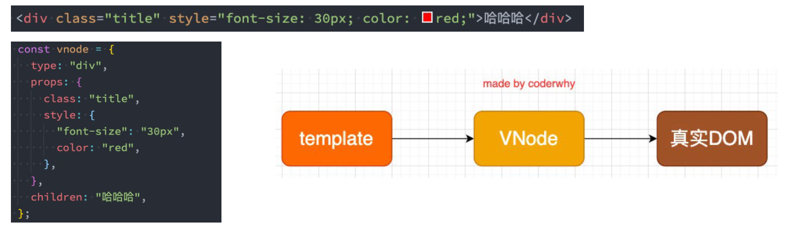 

   - **虚拟 DOM**：对个 VNode 会形成一个 VNode Tree

     使用虚拟 dom来替代真实 dom，解决渲染效率的问题

     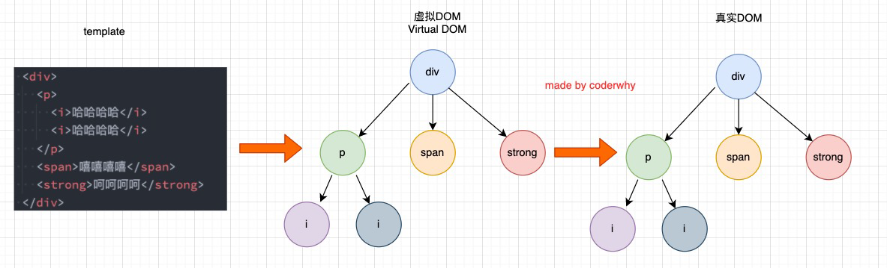 

2. 如果不使用 key，Vue 会使用一种最大限度减少动态元素并且尽可能的尝试就地修改/复用相同类型元素的算法

   没有 key 的 Diff 算法

   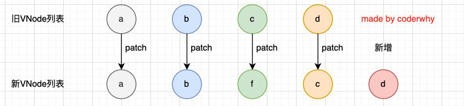 

3. 使用 key 时，它会基于 key 的变化重新排列元素顺序，并且会移除/销毁 key 不存在的元素

   有 key 的 Diff 算法

   1. 从头开始进行遍历、比较

      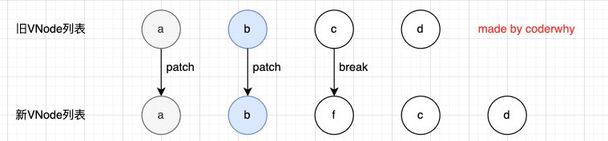 

   2. 从尾部开始进行遍历、比较

      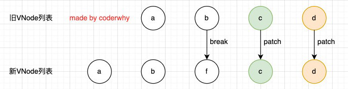 

   3. 如果旧节点遍历完毕，但是依然有新的节点，那么就新增节点

      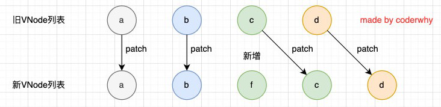 

   4. 如果新的节点遍历完毕，但是依然有旧的节点，那么就移除旧节点

      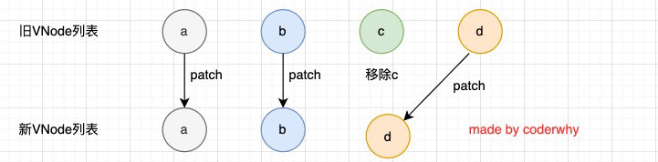 

   5. 如果中间还有很多未知的或者乱序的节点

       

   

## v-model

### v-model 指令

`v-model` 指令可以在表单 `<input>`、`<textarea>` 以及 `<select>` 元素上创建**双向数据绑定**

会根据控件类型自动选取正确的方法来更新元素

```html
<input type="text" v-model="message">
```

```javascript
const message = ref("Hello World")
```

`v-model` 本质上不过是**语法糖**，它负责**监听用户的输入事件**来更新数据

```html
<!-- v-bind 绑定 value 属性的值 -->
<!-- v-on 绑定 input 事件监听到函数中，函数会获取最新的值赋值到绑定的属性中 -->
<input type="text" :vaule="message" @input="message = event.target.value">
```


### 绑定 textarea

```html
<label for="intro">
  自我介绍
  <textarea name="intro" id="intro" cols="30" rows="10" v-model="intro"></textarea>
</label>
<h2>intro: {{intro}}</h2>
```

```javascript
const intro = ref("Hello World")
```


### 绑定 checkbox

- 单选框

  `v-model` 值为布尔值

  ```html
  <label for="agree">
    <input id="agree" type="checkbox" v-model="isAgree"> 同意协议
  </label>
  <h2>isAgree: {{isAgree}}</h2>
  ```

  ```javascript
  const isAgree = ref(false)
  ```
  
  也可以使用 `true-value` 和 `false-value` 指定的值去替换布尔值
  
  ```html
  <input type="checkbox" v-model="toggle" true-value="yes" false-value="no" />
  ```
  
- 多选框

  复选框因为可以选中多个，所以对应的 `v-model` 中属性应该是一个**数组**

  当选中某个时，就**会将 `<input>` 的 `value` 添加到数组中**

  ```html
  <span>你的爱好: </span>
  <label for="basketball">
    <input id="basketball" type="checkbox" v-model="hobbies" value="basketball"> 篮球
  </label>
  <label for="football">
    <input id="football" type="checkbox" v-model="hobbies" value="football"> 足球
  </label>
  <label for="tennis">
    <input id="tennis" type="checkbox" v-model="hobbies" value="tennis"> 网球
  </label>
  <h2>hobbies: {{hobbies}}</h2>
  ```

  ```javascript
  const hobbies = ref(["basketball"])
  ```


### 绑定 radio

```html
<span>性别: </span>
<label for="male">
  <input id="male" type="radio" v-model="gender" value="male">男
</label>
<label for="female">
  <input id="female" type="radio" v-model="gender" value="female">女
</label>
<h2>gender: {{gender}}</h2>
```

```javascript
const gender = ref("")
```


### 绑定 select

- 单选列表

  `v-model` 中属性应该是一个值，**选中某个 `<option>`**，会**将对应的 `value` 赋值到值中**

  ```html
  <span>喜欢的水果: </span>
  <select v-model="fruit">
    <!-- 
    <option v-for="item in friuts" :value="item.value">{{ item.name }}</option>
    -->
    <option value="apple">苹果</option>
    <option value="orange">橘子</option>
    <option value="banana">香蕉</option>
  </select>
  <h2>fruit: {{fruit}}</h2>
  ```

  ```javascript
  const fruit: ref("orange")
  ```
  
- 多选列表

  `v-model` 中属性应该是一个数组，**选中多个值**，会**将选中的 `<option>` 对应的 `value` 添加到数组中**

  ```html
  <span>喜欢的水果: </span>
  <select v-model="fruit" multiple>
    <!-- 
    <option v-for="item in friuts" :value="item.value">{{ item.name }}</option>
    -->
    <option value="apple">苹果</option>
    <option value="orange">橘子</option>
    <option value="banana">香蕉</option>
  </select>
  <h2>fruit: {{fruit}}</h2>
  ```

  ```javascript
  const fruit = ref(["orange"])
  ```
  


### 修饰符

- `.lazy`：将绑定的事件切换为 change 事件

  默认情况下，`v-model` 在进行双向绑定时，绑定的是 **input 事件**，会在**每次内容输入后就将最新的值和绑定的属性进行同步**

  `lazy` 修饰符，会将绑定的事件切换为 **change 事件**，只有**在提交时（比如回车）才会触发**

  ```html
  <input type="text" v-model.lazy="message">
  ```

- `.number`：输入值转为数字类型

  ```html
  <input type="text" v-model.number="message">
  ```

- `.trim`：去除输入值的首尾空白字符

  ```html
  <input type="text" v-model.trim="message">
  ```


### 组件的 v-model

#### 绑定组件 v-model

vue 也支持**在组件上使用 `v-model`**

**组件标签**的 `v-model` **使用 `modelValue` 作为 prop** 和 **`update:modelValue` 作为事件**

父组件

```html
<div>
  <my-input v-model="message"></my-input>
  <!-- 等价于 -->
  <my-input :modelValue="message" @update:modelValue="message = $event"></my-input> 
  <h2>{{message}}</h2>
</div>
```

```javascript
import MyInput from './MyInput.vue';
const message= ref("Hello World");
```

在**组件内部**需要将 **`value` 属性绑定到**一个名叫 **`modelValue` 的 prop 上**

在其 input 事件被触发时，将**新的值将通过自定义的 `update:modelValue` 事件抛出**

子组件

```html
<!-- MyInput -->
<div>
  <input :value="modelValue" @input="$emit('update:modelValue', $event.target.value)">
</div>
```

```javascript
const props = defineProps({
  modelValue: String
});
const emit = defineEmits(['update:modelValue']);
```


#### 绑定属性名称

默认情况下的 `v-model` 绑定了 `modelValue ` 属性和 `@update:modelValue` 的事件

`v-model` 是可以**传参数**的，这个参数就是**绑定属性的名称**

`v-model:title` 等价于

1. 组件内部的 **props 绑定 `title` 属性**
2. 组件内部**监听了 `update:title` 事件**

父组件

```html
<my-input v-model:title="title"></my-input>
```

子组件

```html
<!-- MyInput -->
<div>
  <input :value="title" @input="$emit('update:title', $event.target.value)">
</div>
```

```javascript
const props = defineProps({
  title: String
})
const emit = defineEmits(['update:title'])
```

**绑定多个属性**

父组件

```html
<my-input v-model="message" v-model:title="title"></my-input>
```

子组件

```html
<div>
  <input v-model="value1">
  <input v-model="value2">
</div>
```

```javascript
const props = defineProps({
  modelValue: String,
  title: String
})
const emit = defineEmits(['update:modelValue', 'update:title'])
const value1 = computed({
  set(value) {
    emit("update:modelValue", value);
  },
  get() {
    return props.modelValue;
  }
})
const value2 = computed({
  set(value) {
    emit("update:title", value);
 },
  get() {
    return props.title;
  }
})
```


#### 绑定组件内部 v-model

如果希望**在组件内部**按照**双向绑定**的做法去完成，可以**使用计算属性的 setter 和 getter **来完成

**组件内部不能直接双向绑定 props 中的值**，一是无法把值传到父组件，二是开发中不推荐改动传进来的 props 值

父组件

```html
<my-input v-model="message"></my-input>
```

子组件

```html
<!-- MyInput -->
<div>
  <!-- 错误写法
	<input v-model="modelValue"> 
	-->
  <input v-model="value">
</div>
```

```javascript
const props = defineProps({
  modelValue: String,
})
const emit = defineEmits(["update:modelValue"])
const value = computed({
  set(value) {
    emit("update:modelValue", value);
  },
  get() {
    return props.modelValue;
  }
})
```


## v-once

**只渲染元素或组件以及其子元素一次**，当数据发生变化时，元素或者组件以及其所有的子元素将视为静态内容并且跳过，用于性能优化

```html
<!-- 点击后，内容发生变化 -->
<h2>{{ counter }}</h2>
<!-- 点击后，内容不变，子节点也只会渲染一次 -->
<div v-once>
  <h2>{{ counter }}</h2>
  <h2>{{ message }}</h2>
</div>
<button @click="increment">+1</button>
```

```javascript
const counter = ref(100);
const message = ref("abc");
function increment() {
  counter.value++;
}
```


## v-text

更新元素的 textContent，等价于双大括号插值

```html
<h2 v-text="message"></h2>
<!-- 等价于 -->
<h2>{{ message }}</h2>
```


## v-html

内容按普通 HTML 插入，不会作为 Vue 模板进行编译

```html
<!-- content:"<span style="color:red; background: blue;">哈哈哈</span>" -->
<div>{{ content }}</div>
<div v-html="content"></div>
```


## v-pre

跳过元素和它的子元素的编译过程，显示原始的 Mustache 标签

跳过不需要编译的节点，加快编译的速度

```html
<h2 v-pre>{{message}}</h2>
<!-- 展示内容：{{message}} -->
```


## v-cloak

这个指令保持在元素上直到关联组件实例结束编译

和 CSS `[v-cloak] { display: none }` 一起用时，这个指令可以隐藏未编译的 Mustache 标签直到组件实例准备完毕

真实开发一般使用不到，在编译阶段就已经处理了

```css
[v-clock] {
    display: none;
}
```

```html
<!-- <div> 不会显示，直到编译结束 -->
<div v-cloak>
    <h2>{{ message }}</h2>
</div>
```


## 自定义指令

在 Vue 中，代码的复用和抽象主要还是通过组件，在某些情况下，**需要对 DOM 元素进行底层操作**，这个时候就会用到**自定义指令**

### 局部指令

局部指令只能在**当前组件中使用**

- `<script setup>` 内写法

  在 `<script setup>` 中，任何**以 `v` 开头的驼峰式命名的变量**都可以被用作一个自定义指令

  ```html
  <input type="text" v-focus>
  ```

  ```javascript
  const vFocus = {
    mounted(el, bindings, vnode, preVnode) {
      el.focus();
    }
  }
  ```

- 选项式写法

  **组件中通过 `directives` 选项**定义，自定义指令的名称不需要加 `v`

  ```html
  <input type="text" v-focus>
  ```

  ```javascript
  export default {
    directives: {
      focus: {
        mounted(el, bindings, vnode, preVnode) {
          el.focus();
        }
      }
    }
  }
  ```


### 全局指令

**全局指令**：**`app` 的 `directive` 方法**，可以在**任意组件中被使用**

```javascript
app.directive("focus", {
  mounted(el, bindings, vnode, preVnode) {
    el.focus();
  }
})
```

> 自定义指令案例，参考：
>
> [指令封装案例](#指令封装案例)


### 组件上使用指令

尽量不要在组件上使用自定义指令，**除非能确定只会有一个根节点**

在组件上使用自定义指令时，它会始终应用于组件的根节点，如果组件只有一个根节点不会报错

父元素如果不止一个根节点

```html
<template>
    <div></div>
    <div></div>
</template>
```

会抛出警告，并且不执行指令

```html
<MyComponent v-demo="obj"/>
```


### 参数和修饰符

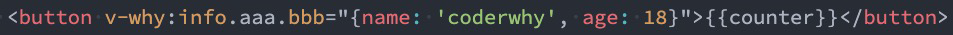 

- info 是参数的名称
- aaa 和 bbb 是修饰符的名称
- 等号后是传入的具体的值


### 生命周期

在一个指令定义的对象中，提供了如下的几个钩子函数

- `created`：在绑定元素的属性前，或者事件监听器应用前调用
- `beforeMount`：当指令第一次绑定到元素并且在挂载父组件之前调用（**插入到 DOM 前**）
- `mounted`：在绑定元素的父组件被挂载后调用（**插入到 DOM 后**）
- `beforeUpdate`：在更新包含组件的 VNode 之前调用（**要更新 DOM 前**）
- `updated`：在包含组件的 VNode 及其子组件的 VNode 更新后调用（**更新 DOM 后**）
- `beforeUnmount`：在卸载绑定元素的父组件之前调用（**卸载前**）
- `unmounted`：当指令与元素解除绑定且父组件已卸载时，只调用一次（**卸载后**）

**钩子函数传递的参数**：

- `el`：指令绑定到的元素，可用于直接操作 DOM

- `binding`：包含 property 的对象

   

  - `value`：**传递给指令的值**，例如在 `v-my-directive="hello"` 中，`value` 为 `"hello"`

    值可以是字面量对象，例如 `v-my-directive="{ color: 'white', text: 'hello!' }"` 

  - `modifiers`：修饰符对象，例如在 `v-my-directive.foo.bar` 中，修饰符对象为 `{foo: true，bar: true}`

  - `instance`：使用指令的组件实例

  - `arg`：传递给指令的参数，例如在 `v-my-directive:foo` 中，`arg` 为 `"foo"`

  - `dir`：注册指令时作为参数传递的对象

  - `oldValue`：先前的值（仅在 `beforeUpdate` 和 `updated` 中可用）

- `vnode`：对应 el 参数的 vnode 对象

- `prevNode`：上一个虚拟节点（仅在 `beforeUpdate` 和 `updated` 中可用） 

自定义指令钩子的**简化形式**：

- 需要在 `mounted` 和 `updated` 上实现相同的行为，并且不关心其他钩子的情况，可以采用简写

  ```javascript
  app.directive('color', (el, binding) => {
    // 这将会在 mounted 和 updated 时调用
    el.style.color = binding.value;
  })
  ```


# 选项

## template

Vue 需要帮助渲染的模板信息

`template` 中可以传入 HTML 模板，在模板中可以引用声明的变量和方法

**声明的模板会替换掉挂载到的元素的 `innerHTML`**

`template` 声明方法：

1. 模板字符串

   ```vue
   <!-- 挂载到id为app的div上，并且替换掉div的innerHTML内容 -->
   <div id="app">哈哈哈哈啊</div>
   <script>
   	Vue.createApp({
   	  template: `
   	    <div>
   	      <h2>{{message}}</h2>
   	    </div>
   	  `,
   	  data: function() {
   	    return {
   	      message: "Hello World",
   	    }
   	  }
   	}).mount('#app');
   </script>
   ```

2. 使用 `<script>` 标签，并且标记它的类型为 `x-template`，设置 `id`，`template` 声明 `#id`

   需要传入 `template` 的 `id` 要以 `#` 开头，内部会使用 `querySelector` 进行匹配，匹配元素的 `innerHTML` 作为模板字符串

   ```vue
   <div id="app">哈哈哈哈啊</div>
   <script type="x-template" id="why">
     <div>
       <h2>{{message}}</h2>
     </div>
   </script>
   <script>
   	Vue.createApp({
   	  template: '#why',
   	  data: function() {
   	    return {
   	      message: "Hello World ",
   	    }
   	  }
   	}).mount('#app');
   </script>
   ```

3. 使用任意标签，设置 `id`，`template` 声明 `#id`

   **通常使用 `<template>` 标签**，因为不会被浏览器渲染

   需要传入 `template` 的 `id` 要以 `#` 开头，内部会使用 `querySelector` 进行匹配，匹配元素的 `innerHTML` 作为模板字符串

   ```vue
   <div id="app">哈哈哈哈啊</div>
   <template id="why">
     <div>
       <h2>{{message}}</h2>
     </div>
   </template>
   <script>
   	Vue.createApp({
   	  template: '#why',
   	  data: function() {
   	    return {
   	      message: "Hello World ",
   	    }
   	  }
   	}).mount('#app');
   </script>
   ```

   

## data

**传入一个函数**，并且**该函数需要返回一个对象**

- 在 Vue2.x 的时候，也可以传入一个对象（虽然官方推荐是一个函数）
- 在 Vue3.x 的时候，必须传入一个函数，否则就会直接在浏览器中报错

`data` 中返回的对象会被 Vue 的响应式系统劫持，**将使其成为响应式对象**

实例创建后，组件实例代理了该数据对象上所有的 property

```html
<div>
  <h2>{{counter}}</h2>
  <button @click='increment'>+1</button>
  <button @click='decrement'>-1</button>
</div>
```

```javascript
data: function() {
  return {
    counter: 100
  }
},
methods: {
  increment() {
    this.counter++;
  },
  decrement() {
    this.counter--;
  }
}
```


## methods

`methods` 属性是一个**对象**，通常会在这个对象中定义很多的方法：

- 定义的方法可以被绑定到 `template` 模板中
- 定义的方法中，可以使用 `this` 关键字来直接访问到 `data` 中返回的对象的属性

注意：**不能使用箭头函数来定义 `method` 函数** 

- 箭头函数绑定了父级作用域的上下文，`this` 指向的是 `window`

- `method` 中的函数，会被 `bind` 绑定到组件实例的代理对象

  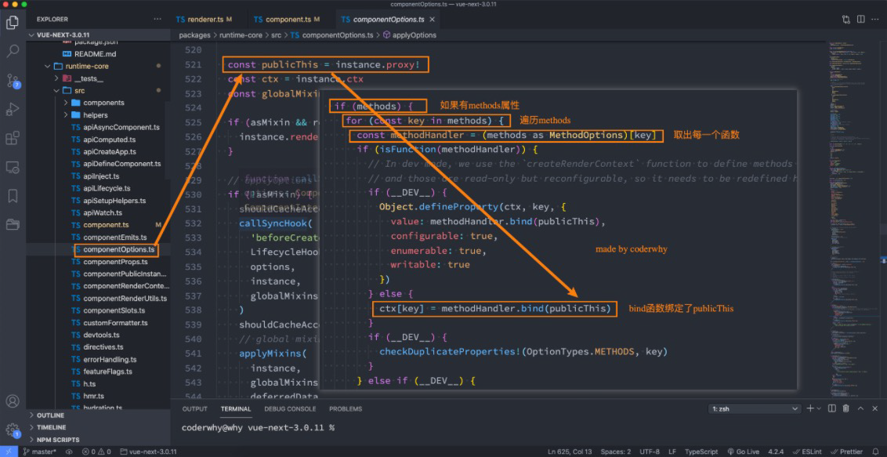 


## computed

对于任何包含响应式数据的复杂逻辑，都建议使用**计算属性**

可以将一个**函数**，或者**具有 getter 和 setter 方法的对象**赋值给计算属性

大多数情况下，**只需要一个 getter 方法**，所以会将计算属性**直接简写成一个函数**

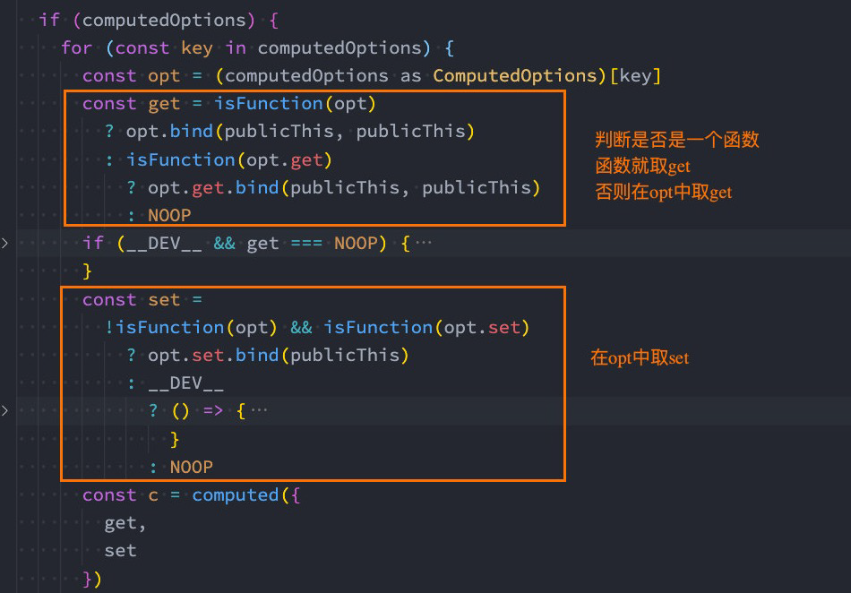 

计算属性将被混入到组件实例中，getter 和 setter 的 **`this` 上下文**自动地绑定为**组件实例**

计算属性在使用时，不需要添加 `()`

```html
<h2>{{fullName}}</h2>
<h2>{{result}}</h2>
<h2>{{reverseMessage}}</h2>
<button @click="changeFullName">修改fullName</button>
```

```javascript
data() {
  return {
    firstName: "Kobe",
    lastName: "Bryant",
    score: 80,
    message: "Hello World"
  }
},
computed: {
  // fullName 的 getter 和 setter 方法
  fullName: {
    get: function() {
      return this.firstName + " " + this.lastName;
    },
    set: function(newValue) {
      const names = newValue.split(" ");
      this.firstName = names[0];
      this.lastName = names[1];
      // 使用解构赋值方法
      // [this.firstName, this.lastName] = newValue.split(' ')
    }
  }
  result() {
    return this.score >= 60 ? "及格": "不及格";
  },
  reverseMessage() {
    return this.message.split(" ").reverse().join(" ");
  }
},
methods: {
  changeFullName() {
    this.fullName = "Coder Why";
  }
}
```

计算属性是**基于其响应式依赖进行缓存**，在数据不发生变化时，计算属性不需要重新计算，如果发生变化，依然会重新进行计算

```javascript
// Date.now() 不是响应式依赖，永远不会更新
computed: {
  now() {
    return Date.now()
  }
}
```


## watch

希望在代码逻辑中**监听 `data` 或 `computed` 某个数据的变化**，就需要用**侦听器**来完成

- 类型：`{ [key: string]: string | Function | Object | Array}`

### 侦听 data

侦听的 `data` 中的属性的，**侦听器方法的名字是 `data` 中的属性的名称**

```html
<label for="question">
    输入问题: <input type="text" id="question" v-model="question">
</label>
```

```javascript
data() {
  return {
    // 侦听question的变化时, 去进行一些逻辑的处理(JavaScript, 网络请求)
    question: "Hello World",
  }
},
watch: {
  // question侦听的data中的属性的名称
  // newValue变化后的新值
  // oldValue变化前的旧值
  question: function(newValue, oldValue) {
    console.log("新值: ", newValue, "旧值", oldValue);
    this.queryAnswer();
  }
},
methods: {
  queryAnswer() {
    console.log(`你的问题${this.question}的答案是哈哈哈哈哈`);
  }
}
```


### 侦听 computed 

侦听的 `computed` 中的属性的，**侦听器方法的名字是 `computed` 中的属性的名称**

```html
<label for="score">
    输入分数: <input type="text" id="score" v-model="score">
</label>
```

```javascript
data() {
  return {
    score: 80
  }
},
computed: {
  result() {
    return this.score >= 60 ? "及格": "不及格";
  }
},
watch: {
  result: function(newValue, oldValue) {
    console.log("新值: ", newValue, "旧值", oldValue);
  }
}
```


### 深度侦听

在默认情况下，`watch` 只是在**侦听对象的引用变化**，对于**内部属性的变化是不会做出响应**

这时可以使用 **`deep` 选项**进行**深度侦听**

当变更（不是替换）对象或数组并使用 `deep` 选项时，旧值将与新值相同，因为它们的引用指向同一个对象/数组

```html
<h2>{{info.name}}</h2>
<button @click="changeInfoName">改变info.name</button>
<button @click="changeInfoNbaName">改变info.nba.name</button>
```

```javascript
data() {
  return {
    info: { name: "why", age: 18, nba: {name: 'kobe'} }
  }
},
watch: {
  info: {
    handler: function(newInfo, oldInfo) {
      console.log("newValue:", newInfo.name, "oldValue:", oldInfo.name);
      console.log("newValue:", newInfo.nba.name, "oldValue:", oldInfo.nba.name);
    },
    deep: true // 深度侦听
  }
},
methods: {
  changeInfoName() {
    this.info.name = "kobe";
  },
  changeInfoNbaName() {
    this.info.nba.name = "james";
  }
}
```


### 立即调用

使用 `immediate` 选项，无论数据是否有变化，侦听的函数都**在侦听开始后立即执行一次**

```javascript
watch: {
  info: {
    handler: function(newInfo, oldInfo) {
      console.log("newValue:", newInfo, "oldValue:", oldInfo);
    },
    deep: true, // 深度侦听
    mmediate: true // 立即执行
  }
}
```


### 其他侦听方法

- 侦听对象属性

  ```html
  <h2>{{info.name}}</h2>
  <button @click="changeInfoName">改变info.name</button>
  ```

  ```javascript
  data() {
    return {
      info: { name: "why", age: 18, nba: {name: 'kobe'} }
    }
  },
  watch: {
    "info.name": function(newName, oldName) {
      console.log(newName, oldName);
    }
  },
  methods: {
    changeInfoName() {
      this.info.name = "kobe";
    }
  }
  ```

- 方法名形式侦听

  在 `methods` 中定义侦听方法，使用 `'` **字符串方法名**形式定义侦听函数

  ```javascript
  data() {
    return {
      info: { name: "why", age: 18, nba: {name: 'kobe'} }
    }
  },
  watch: {
    info: 'watchInfo'
  },
  methods: {
    watchInfo() {
      console.log('do something');
    }
  }
  ```

- 数组形式侦听

  传入**回调数组**，会被逐一调用

  ```javascript
  watch: {
    f: [
      'handle1',
      function handle2(val, oldVal) {
        console.log('handle2 triggered')
      },
      {
        handler: function handle3(val, oldVal) {
          console.log('handle3 triggered')
        }
      }
    ]
  },
  methods: {
    handle1() {
      console.log('handle 1 triggered')
    }
  }
  ```
  
- `$watch` API 侦听

  **在生命周期中**，使用 `this.$watchs` 来侦听

  `this.$watch("侦听源", 侦听回调函数, 额外选项对象 deep、immediate)`

  `$watch` **返回一个取消侦听函数**，**用来停止触发回调**

  ```html
  <h2>{{info.name}}</h2>
  <button @click="changeInfo">改变info</button>
  ```

  ```javascript
  data() {
    return {
      info: { name: "why", age: 18, nba: {name: 'kobe'} }
    }
  },
  methods: {
    changeInfo() {
      this.info = {name: "kobe"};
    }
  },
  created() {
    const unwatch = this.$watch("info", function(newInfo, oldInfo) {
      console.log(newInfo, oldInfo);
    }, {
      deep: true,
      immediate: true
    })
    unwatch();
  }
  ```


## mixins

组件和组件之间有时候会存在相同的代码逻辑，希望**对相同的代码逻辑进行抽取**，在 Vue2 和 Vue3 中都支持的一种方式就是使用 Mixin

- Mixin 提供了一种非常灵活的方式，来**分发 Vue 组件中的可复用功能**
- 一个 Mixin 对象**可以包含任何组件选项**
- 当组件使用 Mixin 对象时，**所有 Mixin 对象的选项将被混合进入该组件本身的选项中**

Mixin 的**合并规则**

1. 如果是 `data` 函数的返回值对象

   返回值对象**默认情况下会进行合并**

   如果 `data` 返回值对象的**属性发生了冲突**，那么会**保留组件自身的数据**

2. 如果是生命周期钩子函数

   生命周期的钩子函数**会被合并到数组中**，**都会被调用**

3. 值为对象的选项，例如 `methods`、`components` 和 `directives`

   将被**合并为同一个对象**，例如都有 `methods` 选项，并且都定义了方法，那么它们**都会生效**

   但是如果**对象的 key 相同**，那么**会取组件对象的键值对**

```javascript
// demoMixin.js
export const demoMixin = {
  data() {
    return {
      message: "Hello DemoMixin"
    }
  },
  methods: {
    foo() {
      console.log("demo mixin foo");
    }
  },
  created() {
    console.log("执行了demo mixin created");
  }
}
```

```vue
<template>
  <div>
    <h2>{{message}}</h2>
    <button @click="foo">按钮</button>
  </div>
</template>

<script>
  import { demoMixin } from './mixins/demoMixin';
  export default {
    mixins: [demoMixin],
    data() {
      return {
        title: "Hello World",
        message: "Hello App"
      }
    },
    methods: {
      foo() {
        console.log("app foo");
      }
    },
    created() {
      console.log("App created 执行");
    }
  }
</script>
```

如果**组件中的某些选项**，是**所有的组件都需要**拥有的，那么这个时候可以使用**全局的 mixin**

- 全局的 Mixin 可以使用应用 **`app` 的 `mixin` 方法来完成注册**
- 一旦注册，那么**全局混入的选项将会影响每一个组件**

```javascript
const app = createApp(App);
app.mixin({
  data() {
    return {}
  },
  methods: {

  },
  created() {
    console.log("全局的created生命周期");
  }
});
app.mount("#app");
```


## extends

允许**一个组件扩展另外一个组件**，**且继承该组件选项**

**和 `mixins` 类似**，任何选项都会**通过对应的合并策略**被合并

在开发中 `extends` 用的非常少，在 Vue2 中推荐使用 Mixin，而在 Vue3 中推荐使用 Composition API

```vue
<!-- BasePage.vue -->
<script>
  export default {
    data() {
      return {
        title: "Hello Page"
      }
    },
    methods: {
      bar() {
        console.log("base page bar");
      }
    }
  }
</script>
```

```vue
<template>
  <div>
    <h2>{{content}}</h2>
    <h2>{{title}}</h2>
    <button @click="bar">按钮</button>
  </div>
</template>
<script>
  import BasePage from './BasePage.vue';
  export default {
    extends: [BasePage],
    data() {
      return {
        content: "Hello Home"
      }
    }
  }
</script>
```


## render

Vue 推荐在绝大数情况下使用模板来创建 HTML，

一些特殊的场景，**需要 JavaScript 的完全编程的能力**，这个时候可以使用**渲染函数**，它比模板更接近编译器

**Vue 在生成真实的 DOM 之前，会将节点转换成 VNode，而 VNode 组合在一起形成一颗树结构，就是虚拟 DOM（VDOM）**

事实上，编写的 `template` 中的 HTML 最终也是使用渲染函数生成对应的 VNode

那么，也可以自己来编写 createVNode 函数，生成对应的 VNode


### h 函数

`h()` 函数是一个用于**创建 vnode 的一个函数**

`h` 函数接受**三个参数**：

```javascript
render() {
  return h("div", {class: "title"}, [
    'some text comes first.',
     h('h1', 'A headline'),
     h(MyComponent, {
       someProp: 'foobar'
     })
  ])
}
```

- `type`：一个 HTML **标签名**，一个组件，一个异步组件，或一个函数式组件（必需）

  类型：String | Object | Function

- `props`：与 **attribute**、**prop** 和**事件**相对应的对象，会在模板中使用（可选）

  类型：Object

- `children`：子 vnodes，使用 `h()` 构建，或使用字符串获取 “文本 vnode” 或者有插槽的对象（可选）

  类型：String | Array | Object

如果**没有 `props`**，那么通常 **`children` 作为第二个参数**传入，

如果会产生歧义，可以**将 `null` 作为第二个参数传入**，**将 `children` 作为第三个参数传入**


### render 中使用

在 `render` 选项中使用

```javascript
import { h } from 'vue';
export default {
  data() {
    return {
      counter: 0
    }
  },
  render() {
    return h("div", {class: "app"}, [
      h("h2", null, `当前计数: ${this.counter}`),
      h("button", {
        onClick: () => this.counter++
      }, "+1"),
      h("button", {
        onClick: () => this.counter--
      }, "-1"),
    ])
  }
}
```


### 插槽中使用

通过 **`this.$slots` 访问静态插槽**的内容，每个插槽都是一个 VNode 数组

子组件

```javascript
import { h } from "vue";
export default {
  render() {
    return h("div", null, [
      h("h2", null, "Hello World"),
      this.$slots.default ?
        this.$slots.default({name: "coderwhy"}):
        h("span", null, "我是HelloWorld的插槽默认值")
    ])
  }
}
```

将 slots 以 **`{ name: props => VNode | Array<VNode> }` 的形式传递给子对象**

父组件

```vue
<script>
  import { h } from 'vue';
  import HelloWorld from './HelloWorld.vue';
  export default {
    render() {
      return h("div", null, [
        h(HelloWorld, null, {
          default: props => h("span", null, `app传入到HelloWorld中的内容: ${props.name}`)
        })
      ])
    }
  }
</script>
```


### jsx 中使用

父组件

```jsx
import HelloWorld from './HelloWorld.vue';
export default {
  data() {
    return {
      counter: 0
    }
  },
  render() {
    const increment = () => this.counter++;
    const decrement = () => this.counter--;
    return (
      <div>
        <h2>当前计数: {this.counter}</h2>
        <button onClick={increment}>+1</button>
        <button onClick={decrement}>-1</button>
        <HelloWorld>
        </HelloWorld>
      </div>
    )
  }
}
```

子组件

```jsx
export default {
  render() {
    return (
      <div>
        <h2>HelloWorld</h2>
        {this.$slots.default ? this.$slots.default(): <span>哈哈哈</span>}
      </div>
    )
  }
}
```


### setup 中使用

在 `setup` 中使用（`setup` 本身需要返回一个函数类型，函数再返回 `h` 函数创建的 VNode）

```javascript
import { ref, h } from 'vue';
export default {
  setup() {
    const counter = ref(0);
    return () => {
      return h("div", {class: "app"}, [
        h("h2", null, `当前计数: ${counter.value}`),
        h("button", {
          onClick: () => counter.value++
        }, "+1"),
        h("button", {
          onClick: () => counter.value--
        }, "-1")
      ])
    }
  }
}
```

`<script setup>` 中使用

```javascript
h('div', { class: [foo, { bar }], style: { color: 'red' } });
```

在 `<script setup>` 中通过 **`useSlots` 辅助函数使用 slots**

```javascript
import { h, useSlots } from "vue";
const slots = useSlots();
h("div", slots.default());
```

`h` 函数**返回创建的 VNode 对象**

```javascript
const vnode = h('div', { id: 'foo' }, [])
console.log(vnode.type);
```


# 组件

`createApp` 函数传入了一个**对象 App** ，这个对象其实本质上就是一个组件，也是应用程序的**根组件**

组件化提供了一种抽象，可以开发出一个个独立可复用的小组件来构造应用，最后都会被抽象成一颗组件树

## 全局组件

全局组件需要使用**全局创建的 `app` 来注册组件**

通过 **`component` 方法**传入**组件名称**、**组件对象**来注册一个全局组件，之后可以在**此应用的任意组件的模板中使用**

组件本身也可以有自己的代码逻辑，比如自己的 `data`、`computed`、`methods` 等等

```javascript
import MyComponent from './App.vue'
const app = createApp(App)
app.component('MyComponent', MyComponent);
```

```javascript
const app = Vue.createApp(App);
// 使用app.component()注册全局组件
app.component("component-a", {
  template: `
  <div>
    <h2>{{ title }}</h2>
    <p>{{ desc }}</p>
    <button @click="btnClick">按钮点击</button>
  </div>
  `,
  data() {
    return {
      title: "我是标题",
      desc: "我是内容",
    };
  },
  methods: {
    btnClick() {
      console.log("按钮的点击");
    }
  }
});
```


## 批量注册全局组件

**webpack 批量注册全局组件**

- 使用 webpack 提供的 `require.context(dir,deep,matching)` 函数加载某一个目录下的所有 `.vue` 后缀的文件
  
  `dir`：目录
  
  `deep`：是否加载子目录
  
  `matching`：加载的正则匹配
  
- `context` 函数会返回一个导入函数 `importFn`，通过其中的属性 `keys()` 获取所有的文件路径

- 遍历文件路径数组，使用 `importFn` 根据路径导入组件对象，全局注册组件对象

```javascript
const importFn = require.context('./', false, /\.vue$/)
// console.dir(importFn.keys()) 文件名称数组

export default {
  install (app) {
    // 批量注册全局组件
    importFn.keys().forEach(key => {
      // 导入组件
      const component = importFn(key).default
      // 注册组件
      app.component(component.name, component)
    })
  }
}
```

```javascript
import defineComponent from './src/components/library'
const app = createApp(App);
app.use(defineComponent);
app.mount('#app');
```

**Vite 批量注册全局组件**

- 使用 vite 的 Glob 导入功能，该功能可以帮助在文件系统中导入多个模块

  ```javascript
  import { defineAsyncComponent } from 'vue'
  
  export default {
    install(app) {
      // 获取当前路径任意文件夹下的 index.vue 文件
      const components = import.meta.glob('./*/index.vue')
      // 遍历获取到的组件模块
      for (const [key, value] of Object.entries(components)) {
        // 拼接组件注册的 name
        const componentName = 'm-' + key.replace('./', '').split('/')[0]
        // 通过 defineAsyncComponent 异步导入指定路径下的组件，创建按需加载的异步组件
        app.component(componentName, defineAsyncComponent(value))
      }
    }
  }
  ```

  ```javascript
  import mLibs from './libs'
  const app = createApp(App);
  app.use(mLibs);
  app.mount('#app');
  ```


## 局部组件

全局组件往往是在应用程序一开始就会全局注册完成，意味着如果某些组件并没有用到，也会一起被注册，打包工具依然会对其进行打包

局部注册将**注册组件的可用性限定在当前组件的范围内**

- `components`  选项注册

  在需要使用到的组件中，通过 **components 属性选项**来进行注册

  `components` 选项对应的是一个对象，对象中的键值对是 **组件的名称: 组件对象**

  ```vue
  <template>
    <component-a></component-a>
  </template>
  <script>
  import ComponentA from './ComponentA.vue'
  export default {
    components: {
      ComponentA
    }
  }
  </script>
  ```

- ` <script setup>` 中注册

  **导入的组件**可以在本地使用而**无需注册**

  ```vue
  <template>
    <component-a></component-a>
  </template>
  <script setup>
  import ComponentA from './ComponentA.vue'
  </script>
  ```


## 组件名格式

- kebab-case（短横线分割符）

  当**使用 kebab-case 定义**一个组件时，也必须在**引用这个自定义元素时使用 kebab-case**

  ```html
  <component-name></component-name>
  ```
  
  ```javascript
  app.component('component-name', {
    /* ... */
  })
  ```
  
- PascalCase（驼峰标识符）

  当使用 PascalCase 定义一个组件时，引用这个自定义元素时**两种命名法**（kebab-case 和 PascalCase）**都可以使用**

  ```html
  <component-name></component-name>
  <ComponentName></ComponentName>
  ```
  
  ```javascript
  app.component('ComponentName', {
    /* ... */
  })
  ```
  
  

## 组件通信

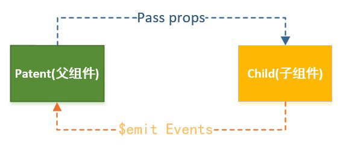 

### 父组件传递给子组件

#### 基本用法

父组件传递给子组件：**通过 `props` 属性**完成组件之间的通信

**子组件的 `Props` 属性**中注册一些**自定义的 attribute** 提供给父组件

**父组件给这些 attribute 赋值**，**子组件通过 attribute 的名称获取到对应的值**

子组件

```html
<div>
  <h2>{{title}}</h2>
  <p>{{content}}</p>
</div>
```

- 选项式

  `props` 会暴露到 `this` 上

  ```javascript
  export default {
    // props: ['title', 'content']
    props: {
      title: String,
      content: { type: String, required: true, default: "123" }
    },
    created() {
      console.log(this.title)
    }
  }
  ```
  
- 组合式 setup 

  `props` 是 `setup` 函数的第一个参数

  ```javascript
  export default {
    // props: ['title', 'content']
    props: {
      title: String,
      content: { type: String, required: true, default: "123" }
    },
    setup(props) {
      console.log(props.title)
    }
  }
  ```
  
- `<script setup>` 组件

  prop 可以使用 `defineProps()` 来定义

  ```javascript
  // const props = defineProps(['title', 'content'])
  const props = defineProps({
    title: String,
    content: { type: String, required: true, default: "123" }
  })
  console.log(props.title)
  ```
  
- `<script setup>` 中使用 Typrscript 限制类型

  ```typescript
  const props = defineProps<{ foo: string, bar?: number }>()
  /* 转写为 js 中代码
  const props = defineProps({
    foo: { type: String, required: true },
    bar: Number
  })
  */
  ```
  
  使用 `withDefaults` 提供默认值
  
  ```typescript
  interface Props {
    msg?: string
    labels?: string[]
  }
  const props = withDefaults(defineProps<Props>(), {
    msg: 'hello',
    labels: () => ['one', 'two']
  })
  ```

父组件

```html
<div>
  <show-message :title="title" :content="content"></show-message>
  <!-- 传递对象方式一 -->
  <show-message :title="message.title" :content="message.content"></show-message>
  <!-- 传递对象方式二 -->
  <show-message v-bind="message"></show-message>
</div>
```

```javascript
import ShowMessage from './ShowMessage.vue

const title = ref("我是从父组件来的title");
const content = ref("我是从父组件来的content");
const message = reactive({
  title: "我是从父组件来的message.title",
  content: "我是从父组件来的message.content"
})
```


#### Props 的 attribute 

**`Props` 的参数类型**：

1. ##### **字符串数组**，数组中的字符串就是 attribute 的名称

   ```javascript
   props: ['title', 'contenst']
   ```
   
2. ##### **对象类型**，可以在指定 attribute 名称的同时，指定它需要**传递的类型、是否是必须的、默认值等等**

   当使用对象语法的时候，可以对传入的内容进行更多限制

   - `type`：attribute 的**类型**
     
     类型可以是：`String`、`Number`、`Boolean`、`Array`、`Object`、`Date`、`Function`、`Symbol`
     
     - `null` 和 `undefined` 会通过任何类型验证
     - 多个类型：`[类型1，类型2]`
     
     ```javascript
     const props = defineProps({
       messageInfo: String,
       propA: Number,
       propB: [String, Number]
     })
     ```
     
     在 typescript 中为 `type` 定义明确的类型
     
     ```typescript
     const props = defineProps({
       items: {
         type: Array as PropType<string []>
       }
     })
     ```
     
   - `require`：attribute 是否是**必传**的
   
     ```javascript
     const props = definedPorps({
       propC: { type: String, required: true }
     })
     ```
   
   - `default`：attribute 的**默认值**
     
     **对象或者数组的默认值必须从一个工厂函数获取**，避免同一引用
     
     ```javascript
     const props = defineProps({
       propD: { type: Number, default: 100 },
       propE: { type: Object, defalut: () => ({ message: 'hello' }) },
       propG: { type: Function, defalut() { return 'Default function' } }
     })
     ```
     
   - `validator`：**验证函数**
   
     ```javascript
     const props = defineProps({
       propF: {
         validator(value) {
           return ['sucess', 'warning', 'danger'].includes(value);
         }
       }
     })
     ```
   

**Prop 的大小写命名**：

HTML 中的 attribute 名是**大小写不敏感**的，所以**浏览器会把所有大写字符解释为小写字符**

这意味着使用 DOM 中的模板时，camelCase (驼峰命名法) 的 prop 名需要使用其**等价的 kebab-case (短横线分隔命名) 命名**

```html
<show-message :messageInfo="title"></show-message>
<!-- 推荐替换为短横线写法 -->
<show-message :message-info="title"></show-message>
```


#### 非 Prop 的 Attribute

当**传递给一个组件某个属性**，但是**该属性并没有定义对应的 `props` 或者 `emits`** 时，就称之为非 Prop 的 Attribute

常见的包括 `class`、`style`、`id` 属性等

**Attribute 继承**

- ##### 单个根节点的 Attribute 继承

  当**组件有单个根节点**时，非 Prop 的 Attribute 将自动**添加到该组件根节点**的 Attribute 中

   

- ##### 禁用 attribute 继承

  如果**不希望组件的根元素继承 attribute**，可以在**组件中设置 `inheritAttrs: false`**

  **禁用 attribute 继承**的常见情况是需要将 attribute **应用于根元素之外的其他元素**

  可以通过 **`$attrs` 来访问所有的非 props 的 attribute**

  ```html
  <show-message class="why" :title="title"></show-message>
  ```

  ```vue
  <template>
    <div>
      <!-- 使用父组件传来的非 props 的 attribute -->
      <h2 :class="$attrs.class">{{title}}</h2>
    </div>
  </template>
  <script>
    export default {
      props: ['title'],
      inheritAttrs: false
    }
  </script>
  ```

  **多个非 props 的 attribute**

  ```html
  <show-message id="abc" class="why" :title="title"></show-message>
  ```

  ```vue
  <template>
    <div>
      <!-- 使用父组件传来的非 props 的 attribute -->
      <h2 v-bind="$attrs">{{title}}</h2>
    </div>
  </template>
  <script>
    export default {
      props: ['title'],
      inheritAttrs: false
    }
  </script>
  ```

  `<script setup>` 中声明 `inheritAttrs` 选项时，需要一个**额外的 ` <script>` 块**

  ```vue
  <script>
  export default {
    inheritAttrs: false
  }
  </script>
  <script setup>
  const props = defineProps(['title'])
  </script>
  ```
  
- ##### 多个根节点的 attribute 继承

  多个根节点的 attribute 如果**没有显示的绑定**，那么**会报警告**，**必须手动的指定要绑定到哪一个属性上**

  ```html
  <multi-root-element id="aaaa"></multi-root-element>
  ```

  ```vue
  <template>
    <h2>MultiRootElement</h2>
    <h2>MultiRootElement</h2>
    <h2 :id="$attrs.id">MultiRootElement</h2>
  </template>
  ```


### 子组件传递给父组件

> 首先，需要**在子组件的 `emits` 属性**中定义好在某些情况下**触发的事件名称**
>
> 其次，在**父组件中以 `v-on` 的方式传入要监听的事件名称**，并且**绑定到对应的方法中**
>
> 最后，在子组件中发生某个事件的时候，**根据事件名称 `emit("事件名称")` 触发对应的事件**

#### 声明触发事件

**`emits` 选项的参数类型**：

1. 字符串数组

   数组中的字符串就是自定义的事件名称

   ```javascript
   export default {
   	emits: ["add", "sub", "addN"]
   }
   ```

2. 对象类型

   `[key: string]: EmitValidator | null`

   每个 value **值可以为 `null` 或验证函数**，**验证函数将接收传递给 `$emit` 调用的其他参数**，并**返回验证结果的布尔值**

   ```javascript
   export default {
     emits: {
       // 没有验证函数
       click: null,
       // 具有验证函数
       submit: (payload) => {
         if (payload.email && payload.password) {
           return true
         } else {
           console.warn(`Invalid submit event payload!`)
           return false
         }
       }
     }
   }
   ```

在 `<script setup>` 中 **使用 `defineEmits` 来声明 `emits`**，参数类型和 `emits` 选项一致

```javascript
const emit = defineEmits(['change', 'delete'])
```

 `<script setup>`  配合 TypeScript 使用，可以使用纯**类型标注来声明触发的事件**

```typescript
const emit = defineEmits<{
  (e: 'change', id: number): void
  (e: 'update', value: string): void
}>()
```


#### 触发事件

**父组件**通过 `v-on` / `@` 来**监听事件**，**子组件**使用 `$emit` / `emit` 函数**触发自定义事件**

**`$emit` 方法可以传递参数给父组件**

`$emit(event: string, ...args: any[]): void`

- 模板表达式中，可以直接使用 `$emit` 函数

  ```html
  <button @click="$emit('someEvent')">click me</button>
  <button @click="$emit('increaseBy', 1)">Increase by 1</button>
  ```

- 组件实例上的方法 `this.$emit()`

  ```html
  <button @click="increment">+1</button>
  ```

  ```javascript
  emits: ["increase"],
  methods: {
    increment() {
      this.$emit("increase");
    }
  }
  ```

- 组合式 `setup` 函数，使用**上下文对象**调用 `emit` 函数

  ```javascript
  emits: ['increase'],
  setup(props, ctx) {
    const increment = () => {
      ctx.emit("increase");
    }
    return {
      increment
    }
  }
  ```

- 在 `<script setup>` 中，使用 `defineEmits` 返回的 `emit` 函数去触发事件

  ```javascript
  const emit = defineEmits(['increase'])
  function increment(){
    emit("increase");
  }
  ```

父元素

```html
<div>
  <h2>当前计数: {{counter}}</h2>
  <counter-operation @add="addOne" @sub="subOne" @addN="addNNum"></counter-operation>
</div>
```

```javascript
import CounterOperation from './CounterOperation.vue';
const counter = ref(0);
function addOne() {
  counter.value++;
}
function subOne() {
  counter.value--;
}
function addNNum(num, name, age) {
  console.log(num, name, age);
  counter.value += num;
}
```

子组件

```html
<div>
  <button @click="increment">+1</button>
  <button @click="decrement">-1</button>
  <input type="text" v-model.number="num">
  <button @click="incrementN">+n</button>
</div>
```

```javascript
const num = ref(0);
const emit = defineEmits({
  add: null,
  sub: null,
  addN: (num, name, age) => {
    if (num > 10) {
      return true
    }
    return false;
  }
});
function increment() {
  console.log("+1");
  emit("add");
}
function decrement() {
  console.log("-1");
  emit("sub");
}
function incrementN() {
  emit('addN', num.value, "why", 18);
}
```


### 祖先组件传递给子孙组件

#### 基本概念

**`provide` / `Inject` 用于非父子（祖先/子孙）组件之间共享数据**

比如有一些深度嵌套的组件，子孙组件想要获取祖先组件的部分内容，如果仍然将 props 沿着组件链逐级传递下去，就会非常的麻烦

这种情况下，可以使用 `Provide` 和 `Inject`

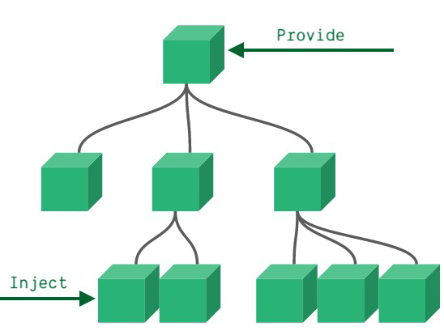 

- 无论层级结构有多深，**祖先组件都可以作为其所有子孙组件的依赖提供者**

- 祖先组件有一个 **`provide` 选项来提供数据**，子孙组件有一个 **`inject` 选项来开始使用这些数据**

- 可以将依赖注入看作是 “long range props” 

  祖先组件不需要知道哪些子孙组件使用它 `provide` 的 property

  子孙组件不需要知道 `inject` 的 property 来自哪里 

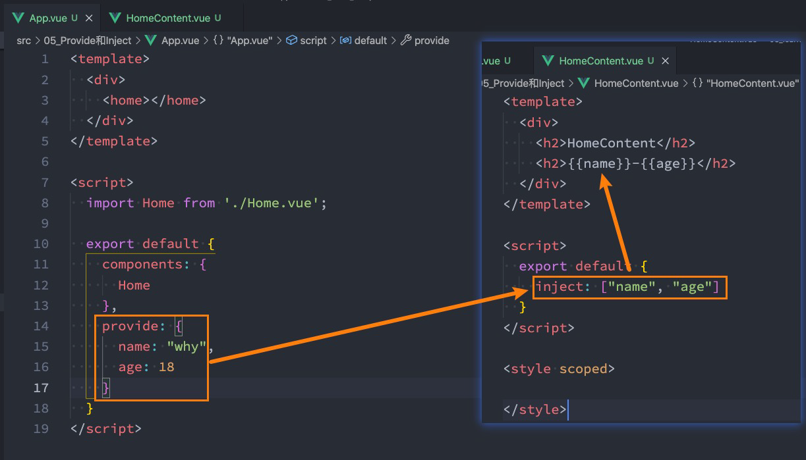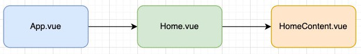


#### provide 选项

**`provide` 选项**应当是一个**对象或是返回一个对象的函数**，这个对象包含了可注入其后代组件的 property

如果 `provide` 需要使用组件中 `data` 属性中的数据，这时需要**通过 `this` 来获取**，就**需要使用 `provide` 的函数写法**

```javascript
data() {
  return {
    names: ["abc", "cba", "nba"]
  }
},
provide() {
  return {
    name: "jack",
    age: 18,
    length: this.names.length // 注意：这个length不是响应式
  }
}
```

如果需要让 `provide` 中提供的 property **具有响应式**，就需要**使用计算属性，**让数据具有响应式

```javascript
provide() {
  return {
    name: "jack",
    age: 18,
    length: computed(() => this.names.length)	// ref对象 .value获取
  }
}
methods: {
  addName() {
    this.names.push("why");
  }
}
```

`computed` 函数**返回的是一个 `ref` 对象**，需要取出其中的 `value `来使用

```html
<div>{{name}} - {{age}} - {{length.value}}</div>
```


#### provide 函数

通过 `provide` 方法来提供数据，可以被后代组件注入，可以传入**两个参数**

`function provide<T>(key: InjectionKey<T> | string, value: T): void`

- `key`：提供的属性名称，字符串或者 symbol

- `value`：要注入的属性值，任意类型，包括响应式的状态

  为了增加 `provide` 值和 `inject` 值之间的**响应性**，可以在**设置 `provide` 值时使用 `ref` 和 `reactive`**

  ```javascript
  import { provide } from "vue";
  const name = ref("jack");
  let counter = ref(100);
  provide("name", name);
  provide("counter", counter);
  ```

`provide` 函数**必须在组件的 `setup` 方法同步调用**

如果需要**修改可响应的数据**，那么**最好是在数据提供的位置来修改**（代码要符合单向数据流规范）

- 确保从 `provide` 传过来的数据不能被 `injector` 的组件更改，使用 `readonly()`

  ```javascript
  const name = ref("coderwhy");
  let counter = ref(100);
  provide("name", readonly(name));
  provide("counter", readonly(counter));
  ```

- 如果需要在 `injector` 的组件中修改数据，可以在 `provider` 的组件内提供一个修改数据的方法

  ```javascript
  const location = ref('North Pole')
  function updateLocation() {
    location.value = 'South Pole'
  }
  provide('location', {
    location,
    updateLocation
  })
  ```

  ```vue
  <template>
    <button @click="updateLocation">{{ location }}</button>
  </template>
  <script setup>
  const { location, updateLocation } = inject('location')
  </script>s
  ```

对于大型项目，**推荐使用 `Symbol` 作为注入名**以避免潜在的冲突

```javascript
export const myInjectionKey = Symbol();
```

```javascript
import { myInjectionKey } from './keys.js'
provide(myInjectionKey, 'value')
```

```javascript
import { myInjectionKey } from './keys.js'
const injected = inject(myInjectionKey)
```


#### 全局供给

应用级的供给 `app.provide` 在应用的所有组件中都可以注入

```javascript
import { createApp } from 'vue'
const app = createApp({})
app.provide(/* 注入名 */ 'message', /* 值 */ 'hello!')
```


#### Inject 选项

使用 `inject` 选项注入祖先组件供给的数据

**数组形式**注入，**注入的属性会以同名的 key 暴露到组件实例上**

```javascript
inject: ['message'],
created() {
  console.log(this.message);
}
```

`inject` 注入会在组件自己的状态之前被解析，可以在 `data` 选项中访问到注入的属性

```javascript
inject: ['message'],
data() {
  return {
    // 基于注入值的初始数据
    fullMessage: this.message
  }
}
```

**对象形式**注入

- 为注入的属性定义别名

  ```javascript
  inject: {
    localMessage: {
      from: 'message'  // 原注入名
    }
  }
  created() {
    console.log(this.localMessage);
  }
  ```

- 注入时可以声明一个默认值

  ```javascript
  inject: {
    message: {
      from: 'message', // 当与原注入名同名时，这个属性是可选的
      default: 'default value'
    },
    user: {
      // 对于非基础类型数据，如果创建开销比较大，或是需要确保每个组件实例
      // 需要独立数据的，请使用工厂函数
      default: () => ({ name: 'John' })
    }
  }
  ```

  

#### Inject 函数

注入一个由祖先组件或整个应用供给的值

**参数类型**：

`function inject<T>(key: InjectionKey<T> | string): T | undefined`

`function inject<T>(key: InjectionKey<T> | string, defaultValue: T): T`

`function inject<T>(key: InjectionKey<T> | string, defaultValue: () => T, treatDefaultAsFactory: true): T`

- `key`： 供给的属性名称，如果没有匹配到，返回 `undefined`

  ```javascript
  const foo = inject('foo');
  
  import { fooSymbol } from './injectionSymbols'
  const foo2 = inject(fooSymbol)
  ```

- `defaultValue`：为空时提供的默认值，或默认值的工厂函数

  ```javascript
  const bar = inject('foo', 'default value')
  const baz = inject('foo', () => new Map())
  ```

- `treatDefaultAsFactory`：提供的默认值是否是工厂函数

  如果默认值是个函数，需要传入第三个参数

  ```javascript
  const fn = inject('function', () => {}, false)
  ```

`inject` **必须在组件的 `setup` 方法同步调用**

```javascript
setup() {
  const message = inject('message')
  return { message }
}
```

如果供给的值是一个 `ref`，注入进来的就是它本身，**不会自动解包**

```javascript
const message = ref('hello')
provide('message', message)
```

```javascript
const injectedMessage = inject('message')
console.log(injectedMessage.value)
```

```html
<div>Message to grand child: {{ injectedMessage }}</div>
```


#### InjectionKey 接口

使用 TypeScript 时，**供给与注入的 key** 可以是一个被转换为 `InjectionKey` 的 `symbol`

可以用来同步 `provide()` 和 `inject()` 之间值的类型

```javascript
import type { InjectionKey } from 'vue';

const key = Symbol() as InjectionKey<string>;
provide(key, 'foo');
```

```javascript
const foo = inject<string>('foo') // 类型：string | undefined
// 提供了默认值
const foo = inject<string>('foo', 'bar') // 类型：string
// 确定不会为空，可以强制转换
const foo = inject('foo') as string
```


### 全局事件总线 mitt

通过第三方的库 mitt，使用全局事件总线，实现**非父子组件之间共享数据**

- Vue3 从实例中移除了 `$on`、`$off` 和 `$once` 方法
- 使用全局事件总线，只能通过第三方的库，官方推荐：mitt 或 tiny-emitter

**安装 mitt**

```bash
npm install mitt
```

**封装一**个工具 eventbus.js

```javascript
import mitt from 'mitt';
const emitter = mitt();
// export const emitter1 = mitt();
// export const emitter2 = mitt();
export default emitter;
```

常用方法

- 触发事件

  `emit("自定义事件名", 数据)`

  ```javascript
  emitter.emit('foo', { a: 'b' })
  ```

- 监听事件

  `on("自定义事件名", 接收数据的回调函数)`

  ```javascript
  emitter.on('foo', e => console.log('foo', e) )
  // 监听所有事件
  emitter.on('*', (type, e) => console.log(type, e) )
  ```

- 清空监听事件

  ```javascript
  emitter.all.clear()
  ```

- 移除某个监听事件

  `off("自定义事件名", 监听事件回调函数的引用)`
  
  ```javascript
  function onFoo() {}
  emitter.on('foo', onFoo)
  emitter.off('foo', onFoo)
  ```

**触发事件**

```html
<button @click="btnClick">按钮点击</button>
```

```javascript
import emitter from './utils/eventbus';
function btnClick() {
  emitter.emit("sayHi", {name: "jack", age: 18});
}
```

**监听事件**和**移除事件**

```javascript
import emitter from './utils/eventbus';

const sayHi = (info) => {
  console.log(info);
}
// 启用监听
emitter.on("sayHi", sayHi);

// 在组件卸载之前移除监听
onBeforeUnmount( () => {
  emitter.off('sayHi', sayHi);
})
```


## 插槽

### 认识插槽

在开发中，会经常封装一个个可复用的组件，会通过 props 传递给组件一些数据，让组件来进行展示

但是为了让这个组件具备更强的通用性，不能将组件中的内容限制为固定的 div、span 等等这些元素

比如某种情况希望组件显示的是一个按钮，某种情况希望显示的是一张图片

应该让使用者可以决定某一块区域到底存放什么内容和元素，这时就可以来定义插槽 `slot`

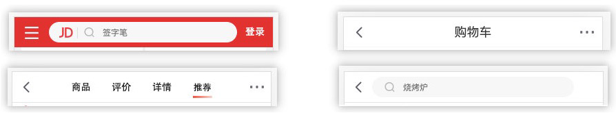 

- 插槽的使用过程其实是**抽取共性、预留不同**
- 会将**共同的元素、内容依然在组件内**进行封装
- 会将**不同的元素使用 `<slot>` 作为占位**，让**外部决定到底显示什么**样的元素


### 基本使用

vue 中将 `<slot>` 元素作为承载分发内容的出口

在封装组件中，使用**特殊的元素 `<slot>`** 就可以**为封装组件开启一个插槽**

该插槽**插入什么内容取决于父组件**如何使用

子组件

```html
<div>
  <h2>组件开始</h2>
  <slot></slot>
  <h2>组件结束</h2>
</div>
```

父组件

```html
<div>
  <!-- 插入按钮 -->
  <my-slot-cpn>
    <button>我是按钮</button>
  </my-slot-cpn>

<!-- 插入文本 -->
  <my-slot-cpn>
    我是普通的文本
  </my-slot-cpn>

<!-- 插入组件 -->
  <my-slot-cpn>
    <my-button/>
  </my-slot-cpn>

  <!-- 插入多个内容 -->
  <my-slot-cpn>
    <button>我是按钮</button>
    <strong>我是strong</strong>
  </my-slot-cpn>
</div>
```

在使用插槽时，如果没有插入对应的内容，可以显示**默认的内容**

**默认内容**只会在**没有提供插入的内容时，才会显示**

子组件

```html
<div>
  <h2>组件开始</h2>
  <slot>
    <i>我是默认的i元素</i>
  </slot>
  <h2>组件结束</h2>
</div>
```

父组件

```html
<div>
  <!-- 插入内容，不会显示默认内容 -->
  <my-slot-cpn>
    <button>我是按钮</button>
  </my-slot-cpn>

	<!-- 不插入内容，会显示默认内容 -->
  <my-slot-cpn></my-slot-cpn>
</div>
```

插槽被元素包裹，可以判断插槽是否有内容，有的话才会渲染外层的元素

```html
<span v-if="$slots.default">
  <slot></slot>
</span>
```


### 具名插槽

如果一个组件中**含有多个插槽**，需要**多个内容对应插入到每个不同的插槽**，就可以**使用具名插槽**

子组件中，`<slot>` 元素有一个**特殊的 attribute `name`**，**给插槽起一个名字**

父组件中，在 **`<template>` 元素上使用 `v-slot` 指令**，并以 **`v-slot` 的参数的形式 `v-slot:名称` 提供插槽的名称**

除了独占默认插槽的缩写以外，`v-slot` 只能添加在 `<template>` 上

**不带 `name` 的 `<slot>`，会带有隐含的名字 `default`**

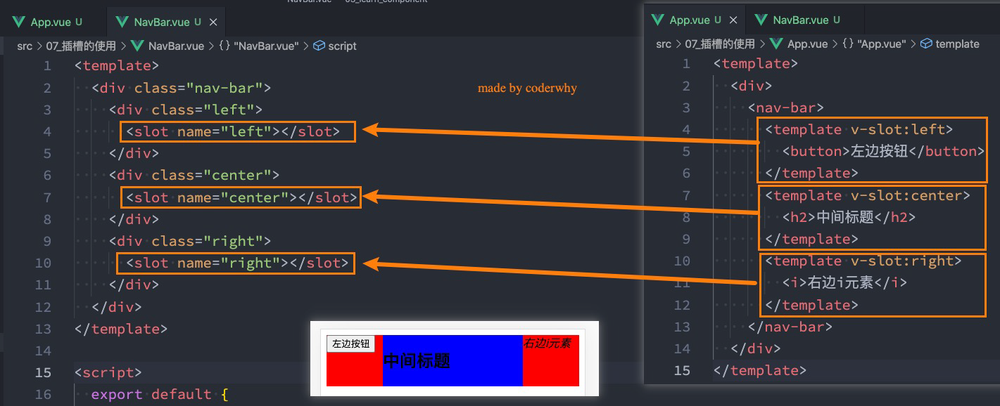 

**具名插槽的缩写**：**`v-slot`: 替换为字符 `#`**；

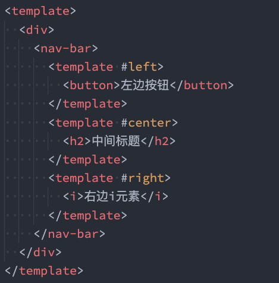 

插槽名称也可以使用**动态插槽名**，可以通过 `v-slot:[dynamicSlotName]` 方式动态绑定一个名称

子组件

```html
<div>
  <slot :name="name"></slot>
</div>
```

```javascript
const props = defineProps({
  name: String
})
```

父组件

```html
<div>
  <nav-bar :name="name">
    <template #[name]>
      <i>插槽内容</i>
    </template>
  </nav-bar>
</div>
```

```javascript
import NavBar from './NavBar.vue';
const name = ref("james");
```


### 作用域插槽

在 Vue 中有**渲染作用域**的概念

- **父级模板**里的所有内容都是在**父级作用域中编译**的
- **子模板**里的所有内容都是在**子作用域中编译**的

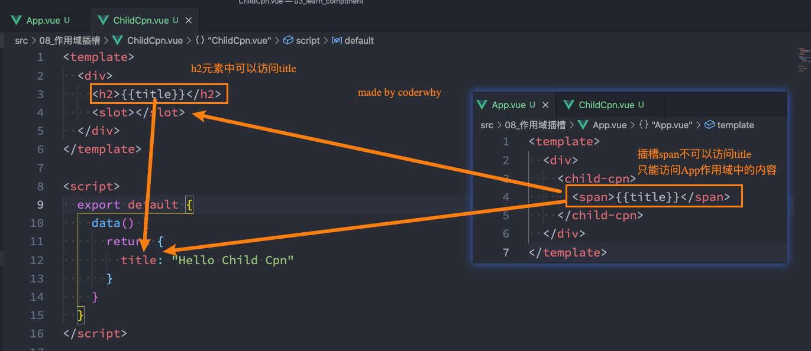 

希望**插槽可以访问到子组件中的内容**，可以使用**作用域插槽**

- 要使**子作用域的属性在父级提供的插槽内容上可用**，可以**在 `<slot>` 元素上将要暴露给父级作用域的值作为 attribute 绑定**

  可以绑定任意数量的 attribute，绑定在 `<slot>` 元素上的 attribute 被称为**插槽 prop**

  ```html
  <!-- 子作用域 -->
  <slot :item="item" :index="index" :another-attribute="anotherAttribute"></slot>
  ```

  ```html
  <!-- 带有具名插槽的子作用域 -->
  <slot name="li" :item="item" :index="index" :another-attribute="anotherAttribute"></slot>
  ```

- 在**父级作用域**中，可以使用**带值的 `v-slot` 来定义子作用域提供的插槽 prop 的名字**

  **默认插槽**在使用的时候 `v-slot:default="slotProps"` 可以简写为 `v-slot="slotProps"`

  ```html
  <!-- 父作用域 -->
  <todo-list>
    <template v-slot="slotProps">
      <span>{{ slotProps.item }}</span>
    </template>
  </todo-list>
  ```

  ```html
  <!-- 指定插槽名的父作用域 -->
  <todo-list>
    <template v-slot:li="slotProps">
      <span>{{ slotProps.item }}</span>
    </template>
  </todo-list>
  ```

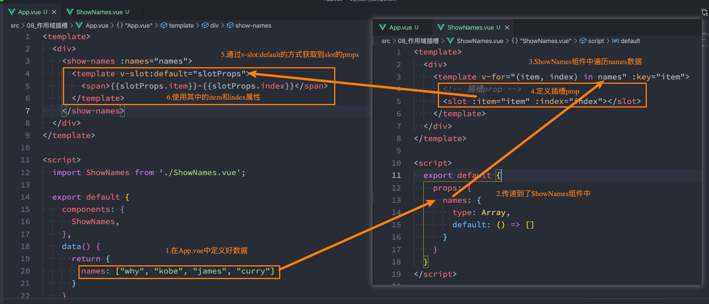 

**独占默认插槽**

如果插槽**只有默认插槽**时，**组件的标签可以被当做插槽的模板**来使用，就可以将 **`v-slot` 直接用在组件上**

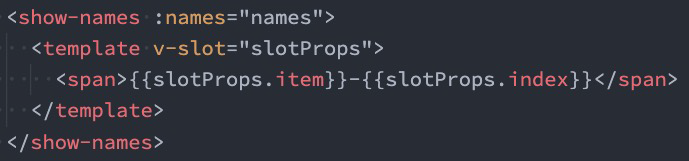 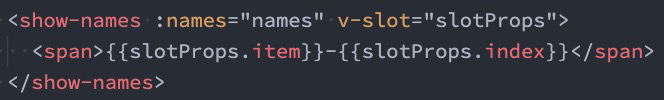

但是如果**同时有默认插槽和具名插槽**，那么按照**完整的 `<template>` 来编写**

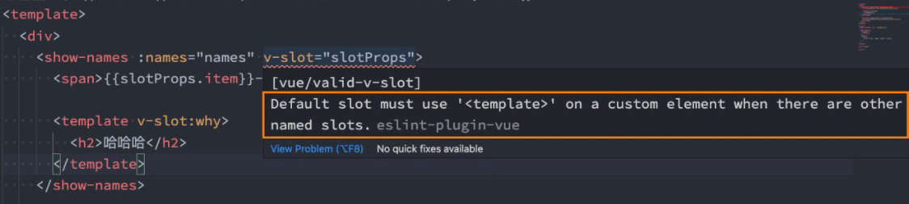 

出现**多个插槽**，请始终为所有的插槽使用**完整的基于 `<template>`** 的语法

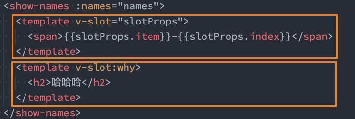 


## 动态组件

### component 组件

动态组件是使用 **`<component>` 组件**，通过一个**特殊的 attribute `is` 来实现**，可以实现在不同组件之间进行动态切换

```html
<component :is="currentTab"></component>
```

**`is` 可以绑定的值**：

1. 组件对象的 **`components` 选项中注册的组件**
2. 通过 **`component` 函数注册的组件**，或**组件选项对象**
2. 导入的组件对象

动态组件**可以传值和监听事件**，可以将属性和监听事件放到 `<component>` 上来使用

父组件

```html
<div>
  <button v-for="item in tabs" :key="item"
          @click="itemClick(item)" :class="{active: currentTab === item}">
    {{item}}
  </button>

  <component :is="currentTab" name="zhangsan" :age="18" @pageClick="pageClick"></component>
</div>
```

```javascript
import Home from './pages/Home.vue';
import About from './pages/About.vue';
import Category from './pages/Category.vue';

const tabs = ["home", "about", "category"];
const currentTab = ref("home");

function itemClick(item) {
  this.currentTab = item;
}
function pageClick() {
  console.log("page内部发生了点击");
}
```

子组件

```html
<div @click="divClick">
  Home组件: {{name}} - {{age}}
</div>
```

```vue
<script>
  export default {
    name: "home"
  }
</script>
<script setup>
  const props = defineProps({
    name: { type: String, default: "" },
    age: { type: Number, default: 0 }
  })
  const emit = defineEmits(['pageClick']);
  function divClick() {
    emit("pageClick");
  }
</script>
```


### keep-alive 组件

**内置组件 `keep-alive` 包裹动态组件**时，会**继续缓存不活动的组件实例**，而**不是销毁**它们

> 例如，按钮点击可以实现递增，但是将 counter 点到10，那么在切换到 home 再切换回来 about 时，状态并不是保存
>
> 默认情况下，在切换组件后，about 组件会被销毁掉，再次回来时会重新创建组件
>
> 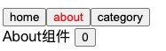 

`<keep-alive>` 属性

1. `include`：只有名称匹配的组件会被缓存

    类型：string | RegExp | Array 

2. `exclude`：任何名称匹配的组件都不会被缓存

   类型：string | RegExp | Array

3. `max`：最多可以缓存多少组件实例，一旦达到这个数字，那么缓存组件中最近没有被访问的实例会被销毁

   类型：number | string

`include` 和 `exclude` 属性允许**组件有条件地缓存**

- 可以用**逗号分隔字符串**、**正则表达式**或一个**数组**来约束条件

  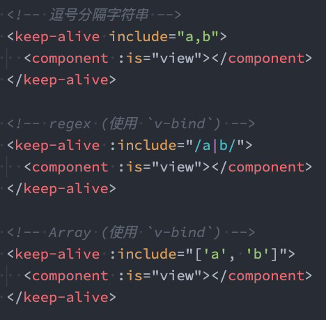 

- 匹配首先检查**组件自身的 `name` 选项**

  父组件

  ```html
  <keep-alive include="home,about">
    <component :is="currentTab" name="zhangsan" :age="18"></component>
  </keep-alive>
  ```

  子组件

  ```javascript
  export default {
  	name: "home"
    // 其他部分省略
  }
  ```
  

**缓存的生命周期**

组件实例从 DOM 上移除但因为被 `<keep-alive>` 缓存而仍作为组件树的一部分时，它将变为**不活跃**状态而不是被卸载

```javascript
import { onDeactivated } from 'vue'
onDeactivated(() => {
  // 在从 DOM 上移除、进入缓存
  // 以及组件卸载时调用
})
```

组件实例作为缓存树的一部分插入到 DOM 中时，它将重新**被激活**

```javascript
import { onActivated } from 'vue'
onActivated(() => {
  // 调用时机为首次挂载
  // 以及每次从缓存中被重新插入时
})
```


## 异步组件

### defineAsyncComponent

如果项目过大，对于某些**组件希望通过异步的方式来进行加载**（目的是可以对其进行分包处理）

可以使用 **`defineAsyncComponent` 函数**，创建一个**只有在需要时才会加载**的异步组件

`defineAsyncComponent` 接受**两种类型的参数**

1. **工厂函数**，该工厂函数需要返回一个 Promise 对象

   ```javascript
   import { defineAsyncComponent } from 'vue';
   // import AsyncComponent from './AsyncComponent.vue';
   const AsyncComponent = defineAsyncComponent(() => import("./AsyncComponent.vue"))
   export default {
     components: {
       AsyncComponent
     }
   }
   ```

   ```javascript
   import { defineAsyncComponent } from 'vue';
   export default {
     components: {
       AsyncComponent: defineAsyncComponent(() => import("./AsyncComponent.vue"))
     }
   }
   ```

   **全局注册**

   ```javascript
   import { defineAsyncComponent } from 'vue'
   app.component('async-component', 
                 defineAsyncComponent(() => import('./components/AsyncComponent.vue')
   ))
   ```
   
   `<cript setup>` 中加载
   
   ```javascript
   import { defineAsyncComponent } from 'vue'
   const AsyncComp = defineAsyncComponent(() => import('./components/MyComponent.vue'))
   ```
   
   从**服务器加载**相关组件
   
   ```javascript
   import { defineAsyncComponent } from 'vue'
   const AsyncComp = defineAsyncComponent(() => {
     return new Promise((resolve, reject) => {
       // ...从服务器获取组件
       resolve(/* 获取到的组件 */)
     })
   })
   ```
   
2. **对象类型**，对异步函数进行配置

   ```javascript
   import { defineAsyncComponent } from 'vue'
   
   const AsyncComp = defineAsyncComponent({
     // 工厂函数
     loader: () => import('./Foo.vue'),
     // 加载过程中显示的组件
     loadingComponent: LoadingComponent,
     // 加载失败时显示的组件
     errorComponent: ErrorComponent,
     // 在显示 loadingComponent 之前的延迟 | 默认值：200（单位 ms）
     delay: 200,
     // 如果提供了 timeout ，并且加载组件的时间超过了设定值，将显示错误组件
     // 默认值：Infinity（即永不超时，单位 ms）
     timeout: 3000,
     // 定义组件是否可挂起 | 默认值：true
     // 异步组件可以选择退出 <suspense> 控制，指定 suspensible:false，让组件始终控制自己的加载状态
     suspensible: false,
     /**
      * error  错误信息
      * retry  函数, 调用retry尝试重新加载
      * fail   函数，失败退出处理
      * attempts 允许的最大重试次数
      */
     onError(error, retry, fail, attempts) {
     }
   })
   ```


### Suspense 组件

`<suspense>` 是一个内置的全局组件，该组件有**两个插槽**

- `default`：如果 `<template #default>` 可以显示，那么显示 `<template #default>` 的内容
- `fallback`：如果 `<template #default>` 无法显示，那么会显示 `<template #fallback>` 插槽的内容

```html
<suspense>
  <template #default>
    <async-category></async-category>
  </template>
  <template #fallback>
    <loading></loading>
  </template>
</suspense>
```

`<suspense>` **可以等待的异步依赖**有两种

1. 异步组件

2. 带有异步 `setup()` 的组件

   ```javascript
   export default {
     async setup() {
       const res = await fetch(...)
       const posts = await res.json()
       return {
         posts
       }
     }
   }
   ```

3. `<script setup> ` 顶层有 `await` 表达式的组件

   使用 `<script setup>`，那么**顶层 `await` 表达式会自动让该组件成为一个异步依赖**

   ```vue
   <script setup>
   const res = await fetch(...)
   const posts = await res.json()
   </script>
   ```

常常会将 `<suspense>` 和 `<transition>`、`<keep-alive>`  等**组件结合，嵌套的顺序非常重要**

```html
<router-view v-slot="{ Component }">
  <template v-if="Component">
    <transition mode="out-in">
      <keep-alive>
        <suspense>
          <!-- 主要内容 -->
          <component :is="Component"></component>
          <!-- 加载中状态 -->
          <template #fallback>
            正在加载...
          </template>
        </suspense>
      </keep-alive>
    </transition>
  </template>
</router-view>
```

**懒加载的组件不会触发 `<suspense> `**，但是仍然可以有异步组件作为后代，这些组件可以照常触发 `<suspense>`


## 组件实例

### 模板 ref

在 Vue 开发中不推荐进行 DOM 操作，如果想要**获取到元素对象或者子组件实例**，可以**给元素或者组件绑定一个 `ref` 的 attribute**

#### 获取元素的实例

```html
<div>
  <input ref="input">
  <button @click="btnClick">获取元素实例</button>
</div>
```

- 选项式

  挂载结束后 `ref` 都会被暴露在 `this.$refs` 之上，只可以**在组件挂载后**才能访问 `ref`

  ```javascript
  mounted() {
    this.$refs.input.focus()
  },
  methods: {
    btnClick() {
      console.log(this.$refs.input);
    }
  }
  ```

   

- 组合式

  声明一个**响应式 `ref` 来存放该元素的引用**，必须**和模板 `ref` 同名**，只可以**在组件挂载后**才能访问 `ref`

  需确保从 `setup()` 返回 `ref`

  ```javascript
  setup() {
    const input = ref(null)
    onMounted(() => {
      input.value.focus()
    })
    function btnClick() {
      console.log(input.value)
    }
    return {
      input,
      btnClick
    }
  }
  ```

  `<script setup>` 写法

  ```javascript
  const input = ref(null)
  onMounted(() => {
    input.value.focus()
  })
  function btnClick() {
    console.log(input.value)
  }
  ```

**模板 `ref` 标注类型**

```typescript
const input = ref<HTMLInputElement | null>(null)
onMounted(() => {
  input.value?.focus()
})
```


#### 获取组件的实例

`ref` 也可以被用在一个子组件上，此时 `ref` 中引用的是**组件实例**

```html
<div>
  <nav-bar ref="navBar"></nav-bar>
  <button @click="btnClick">获取组件实例</button>
</div>
```

- 选项式

  被引用的组件实例和该子组件的 `this` 完全一致，意味着**父组件对子组件的每一个属性和方法都有完全的访问权**

  ```javascript
  import NavBar from './NavBar.vue';
  export default {
    components: {
      NavBar
    },
    mounted() {
      console.log(this.$refs.navBar);
    },
    methods: {
      btnClick() {
        // 返回的是一个组件实例的代理对象
        console.log(this.$refs.navBar);
        // 调用组件的属性
        console.log(this.$refs.navBar.message);
        // 调用组件的方法
        this.$refs.navBar.sayHello();
      }
    }
  }
  ```

  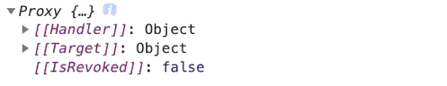 

  **`expose` 选项**可以用于**限制对子组件实例的访问**，父组件通过子组件的实例**只能访问到导出的内容**

  ```javascript
  expose: ['publicData', 'publicMethod'],
  data() {
    return {
      publicData: 'foo',
      privateData: 'bar'
    }
  },
  methods: {
    publicMethod() {
      console.log(this.publicData);
    },
    privateMethod() {
      console.log(this.privateData);
    }
  }
  ```

- 组合式

  父组件可以通过**子组件的实例调用子组件的属性和方法**

  ```javascript
  import NavBar from './NavBar.vue';
  export default {
    components: {
      NavBar
    },
  	setup() {
  	  const navBar = ref(null);
  		onMounted(() => {
        console.log(navBar.value);
  		})
  	  function btnClick() {
        // 返回的是一个组件实例的代理对象
        console.log(navBar.value);
        // 调用组件的属性
        console.log(navBar.value.message);
        // 调用组件的方法
        navBar.value.sayHello();
  	  }
  	  return {
  	    navBar,
  	    btnClick
  	  }
  	}
  }
  ```

  调用**上下文对象参数的 `expose` 方法**，**限制对子组件实例的访问**，父组件通过子组件的实例只能访问到导出的内容

  ```javascript
  setup(props, {expose}){
    const message = ref('narbar')
  	function sayHello(){
  	  console.log('sayHello')
  	}
    expose({ message,sayHello})
    return {
      message,
      sayHello
    }
  }
  ```

  `<script setup>`  的写法

  ```javascript
  import NavBar from './NavBar.vue';
  const navBar = ref(null);
  onMounted(() => {
    console.log(navBar.value);
  })
  function btnClick() {
    // 返回的是一个组件实例的代理对象
    console.log(navBar.value);
    // 调用组件的属性
    console.log(navBar.value.message);
    // 调用组件的方法
    navBar.value.sayHello();
  }
  ```

  使用了 `<script setup>` 的组件是**默认私有**的，父组件无法访问到使用了 `<script setup>` 的子组件中的任何东西

  除非**子组件在其中通过 `defineExpose` 宏显式暴露**

  ```javascript
  const message = ref('narbar')
  function sayHello(){
    console.log('sayHello')
  }
  defineExpose({
    message,
    sayHello
  })  
  ```

**组件 `ref` 标注类型**

```html
<login-account ref="accountRef" />
```

```typescript
import LoginAccount from './login-account.vue'
```

获取导出的组件的真正类型

```typescript
const accountRef = ref<InstanceType<typeof LoginAccount>>()
```


#### v-for 中的 ref

当 `ref` 在 `v-for` 中使用时，相应的 `ref` 中包含的值是一个**数组**，它将在元素被挂载后填充

`ref` 数组不能保证与源数组相同的顺序

```html
<ul>
  <li v-for="item in list" ref="itemRefs">
    {{ item }}
  </li>
</ul>
```

```javascript
const itemRefs = ref([])
const list = ref([1, 2, 3])
onMounted(() => {
  console.log(itemRefs.value.map(i => i.textContent))
})
```


#### 函数 ref

`ref` 可以**绑定一个函数**，会在**每次组件更新时都被调用**，函数接受该**元素引用作为第一个参数**

绑定内联函数

```html
<input :ref="(el) => { /* 将 el 分配给 property 或 ref */ }">
```

绑定函数

```html
<div v-for="item in list" :ref="setItemRef"></div>
```

```javascript
const list = []
function setItemRef (el) {
  this.list.value.push(el);
}
```


### 组件实例属性

#### \$parent / $root

可以通过 `$parent` 来访问**父元素**，`$root` 来访问**根元素**

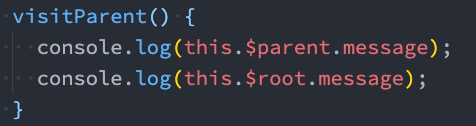 

不推荐使用 `$parent` 来做组件通信，因为代码的耦合性太强

在 Vue3 中已经**移除了 `$children` 的属性**

在组合式，子组件可以通过 `emit` 调用父组件的方法，或者父组件可以通过 `provide` 给子组件方法和属性使用


#### $el

获取组件实例关联使用的 DOM 元素

```html
<div>
  <nav-bar ref="navBar"></nav-bar>
  <button @click="btnClick">获取组件根元素实例</button>
</div>
```

```javascript
import NavBar from './NavBar.vue';
export default {
  components: {
    NavBar
  },
  methods: {
    btnClick() {
      // 通过 this.$refs.navBar 获取到的是组件，不是 dom 元素
      console.log(this.$refs.navBar);
      // $el 获取的组件实例关联的 dom元 素，访问 dom 属性
      console.log(this.$refs.navBar.$el);
      console.log(this.$refs.navBar.$el.offsetTop);
    }
  }
}
```

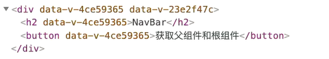 

**组合式**

```javascript
import NavBar from './NavBar.vue';
const navBar = ref(null);
btnClick() {
  console.log(navBar.value.$el);
}
```


### nextTick

**将回调延迟到下次 DOM 更新循环之后执行**，在修改数据之后立即使用它，然后**等待 DOM 更新**

> 例如有这样一个需求：点击一个按钮，修改在 `<h2>` 中显示的 message，message 被修改后，再获取 `<h2>` 的高度
>
> ```html
> <div>
>   <h2>{{counter}}</h2>
>   <button @click="increment">+1</button>
>   <h2 class="title" ref="titleRef">{{message}}</h2>
>   <button @click="addMessageContent">添加内容</button>
> </div>
> ```
>
> ```javascript
> const message = ref("")
> const counter = ref(0)
> const titleRef = ref(null)
> const addMessageContent = () => { message.value += "哈哈哈哈哈哈哈哈哈哈" }
> ```
>
> ```css
> .title {
>   width: 120px;
> }
> ```
>
> 错误的方式：
>
> - 方式一：在点击按钮后立即获取 `<h2>` 的高度
>
>   错误：获取的**高度永远是前一次的高度**
>
>   ```javascript
>   const addMessageContent = () => {
>     message.value += "哈哈哈哈哈哈哈哈哈哈"
>     console.log(titleRef.value.offsetHeight)
>   }
>   ```
>
> - 方式二：在 `updated` 生命周期函数中获取 `<h2>` 的高度
>
>   错误：可以正确获取到，但是其他数据更新（当点击 +1 按钮时），也会执行该操作
>
>   ```javascript
>   onUpdated(() => {
>     // 每次DOM渲染之后都会执行
>     console.log(titleRef.value.offsetHeight)
>   })
>   ```

使用 `nextTick` 函数

vue 中的 **`watch` 回调函数、组件更新、生命周期回调等都放入了微任务队列中执行**，如果**执行同步代码会先于微任务队列执行**

**`nextTick` 的回调函数也是微任务**，会把该微任务**加入到微任务队列的最后**

```javascript
const addMessageContent = () => {
  message.value += "哈哈哈哈哈哈哈哈哈哈"
  nextTick(() => {
    console.log(titleRef.value.offsetHeight)
  })
}
```


## 生命周期

### 认识生命周期

每个组件都可能会经历从**创建、挂载、更新、卸载**等一系列的过程

在这个过程中的某一个阶段，用于可能会想要添加一些属于自己的代码逻辑（比如组件创建完后就请求一些服务器数据）

Vue 提供了组件的**生命周期函数**，可以知道**目前组件正在哪一个过程**

- 生命周期函数是一些**钩子函数**，在**某个时间会被 Vue 源码内部进行回调**
- 通过对生命周期函数的回调，可以知道**目前组件正在经历什么阶段**
- 可以在**该生命周期中编写属于自己的逻辑代码**

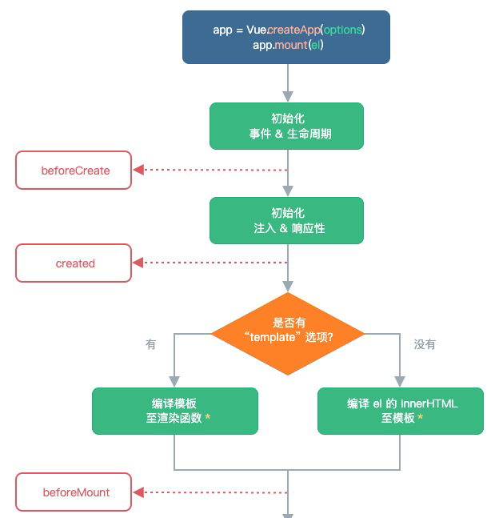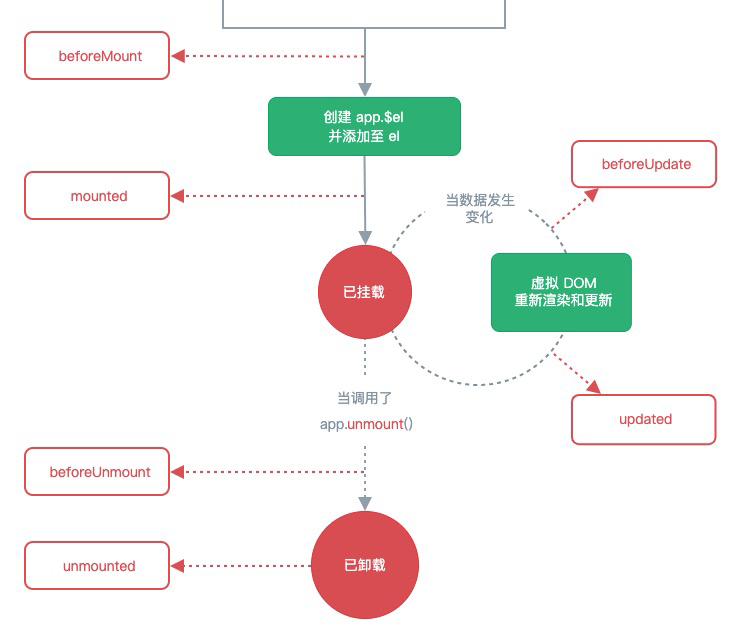


### beforeCreate

在**实例初始化之后**、进行数据侦听和事件 / **侦听器的配置之前**同步调用

通常用于插件开发中执行一些初始化任务

```javascript
beforeCreate() {
  console.log("beforeCreate");
}
```

`setup` 是围绕 `beforeCreate` 和 `created` 生命周期钩子运行的，所以**不需要显式地定义**它们

```javascript
setup() {
  
}
```


### created

在**实例创建完成后**被立即同步调用

在这一步中，实例已完成对选项的处理，意味着以下内容已被**配置完毕**：**数据侦听、计算属性、方法、事件/侦听器的回调函数**

然而，挂载阶段还没开始，且 `$el` property 目前尚不可用

这里**适合访问各种数据，获取接口数据**等

```javascript
created() {
  console.log("created");
}
```

`setup` 是围绕 `beforeCreate` 和 `created` 生命周期钩子运行的，所以**不需要显式地定义**它们

```javascript
setup() {
  
}
```


### beforeMount

在**挂载开始之前**被调用，组件已经**完成了其响应式状态的设置**，但还**没有创建 DOM 节点**

即将首次执行 DOM 渲染过程，相关的 `render` 函数首次被调用

```javascript
beforeMount() {
  console.log("beforeMount");
}
```

组合式 API 

```javascript
import { onBeforeMount } from 'vue';
setup() {
  onBeforeMount(() => {
    console.log("beforeMount");
  })
}
```


### mounted

在**实例挂载完成后**被调用，所有**同步子组件都已经被挂载**（不包括异步组件和 `<suspense>` 组件内的组件）

这里**适合用来获取 DOM 元素，访问子组件**等

```javascript
mounted() {
  console.log("mounted");
}
```

组合式 API 

```javascript
import { onMounted } from 'vue';
setup() {
  onMounted(() => {
    console.log("mounted");
  })
}
```

**获取模板 `ref`**：只可以在组件挂载后才能访问 `ref`

```html
<div ref="el"></div>
```

```javascript
import { ref, onMounted } from 'vue'
const el = ref(null)
onMounted(() => {
  console.log(el.value)
})
```


### beforeUnmount

在**卸载组件实例之前**调用，在这个阶段，**组件实例仍然还保有全部的功能**

```javascript
beforeUnmount() {
  console.log("beforeUnmount");
}
```

组合式 API 

```javascript
import { onBeforeUnmount } from 'vue';
setup() {
  onBeforeUnmount(() => {
    console.log("beforeUnmount");
  })
}
```


### unmounted

**卸载组件实例后**调用

调用此钩子时，组件实例的所有**指令都被解除绑定**，所有**事件侦听器都被移除**，所有**子组件实例被卸载**

这里适合**清理一些副作用**，例如计时器、DOM 事件监听器、与服务器的连接移除、手动添加的事件监听器

```javascript
unmounted() {
  console.log("unmounted");
}
```

组合式 API 

```javascript
import { onUnmounted } from 'vue';
setup() {
  onUnmounted(() => {
    console.log("unmounted");
  })
}
```


### beforeUpdate

在**数据发生改变后，DOM 被更新之前**被调用

这里适合在现有 DOM 将要被更新之前访问它，比如移除手动添加的事件监听器，数据挂载前的最后修改

```javascript
beforeUpdate() {
  console.log("beforeUpdate");
}
```

组合式 API 

```javascript
import { onBeforeUpdate } from 'vue';
setup() {
  onBeforeUpdate(() => {
    console.log("beforeUpdate");
  })
}
```


### updated

在**数据更改**导致的**虚拟 DOM 重新渲染和更新完毕之后**被调用

父组件的更新钩子将在其子组件的更新钩子之后调用

```javascript
updated() {
  console.log("updated");
}
```

组合式 API 

```javascript
import { onUpdated } from 'vue';
setup() {
  onUpdated(() => {
    console.log("updated");
  })
}
```

组件的 DOM 更新后被调用

```html
<div>
  <h2 ref="title">{{message}}</h2>
  <button @click="changeMessage">修改message</button>
</div>
```

```javascript
const message = ref("Hello World")
function changeMessage() {
  message.value = "Bye World"
}
onBeforeUpdate(() => {
  console.log(this.$refs.title.innerHTML);
})
onUpdated(() => {
  console.log(this.$refs.title.innerHTML);
})
```


### activated

被 **`<keep-alive>` 缓存的组件激活时**调用

**缓存的组件是不会执行 `created` 或者 `mounted`** 等生命周期函数

```javascript
activated() {
  console.log("activated");
}
```

组合式 API 

```javascript
import { onActivated } from 'vue';
setup() {
  onActivated(() => {
    console.log("activated");
  })
}
```


### deactivated

被 **`<keep-alive>` 缓存的组件失活时**调用

```javascript
deactivated() {
  console.log("deactivated");
}
```

组合式 API 

```javascript
import { onDeactivated } from 'vue';
setup() {
  onDeactivated(() => {
    console.log("deactivated");
  })
}
```


### errorCaptured

在**捕获了后代组件传递的错误时**调用

```
errorCaptured(err) {
  console.log("errorCaptured", err);
}
```

组合式 API 

```javascript
import { onErrorCaptured } from 'vue';
setup() {
  onErrorCaptured((err) => {
    console.log("onErrorCaptured", err);
  })
}
```


### 父子组件生命周期执行顺序

1. 父组件：`beforeCreate`
2. 父组件：`created`
3. 父组件：`beforeMount`
4. 子组件：`beforeCreate`
5. 子组件：`created`
6. 子组件：`beforeMount`
7. 子组件：`mounted`
8. 父组件：`mounted`

更新过程（子组件更新、父组件更新）

1. 父组件：`beforeUpdate`
2. 子组件：`beforeUpdate`，父组件更新不影响子组件时，不执行
3. 子组件：`updated`，父组件更新不影响子组件时，不执行
4. 父组件：`updated`

销毁过程

1. 父组件：`beforeDestroy`
2. 子组件：`beforeDestroy`
3. 子组件：`destroyed`
4. 父组件：`destroyed`


## 传送门组件

封装一个组件 A，在另外一个组件 B 中使用，那么组件 A 中 `<template>` 的元素，会被挂载到组件 B 中 `<template>` 的某个位置，最终应用程序会形成一颗 DOM 树结构

但是某些情况下，希望**组件不是挂载在这个组件树上的**，可能是**移动到 Vue app 之外的其他位置**，比如**移动到 `<body>` 元素上**，或者有其他的 **`div#app` 之外的元素上**，或者构建一个**模态框**，这个时候就可以**通过 `<teleport>` 来完成**

`<teleport>` 是 Vue 提供的**内置组件**，类似于 react 的 Portals

有两个属性：

- `to`：指定将其中的内容**移动到的目标元素**，可以使用选择器
- `disabled`：是否禁用 teleport 的功能

```html
<button @click="open = true">Open Modal</button>
<teleport to="body">
  <div v-if="open" class="modal">
    <p>Hello from the modal!</p>
    <button @click="open = false">Close</button>
  </div>
</teleport>
```

可以**在 `<teleport>` 中使用组件**，并且也可以给组件传入数据

```html
<div class="my-app">
  <teleport to="body">
    <hello-world message="我是App中的message"></hello-world>
  </teleport>
</div>
```

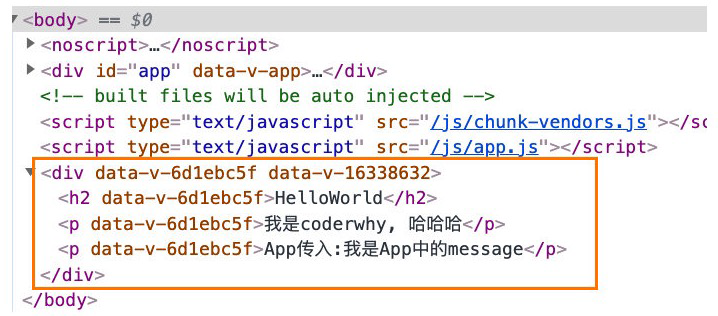 

如果**将多个 `<teleport>` 应用到同一个目标**上（ `to` 的值相同），那么这些**目标会进行合并**

```html
<teleport to="#why">
  <h2>coderwhy</h2>
</teleport>
<teleport to="#why">
	<hello-world message="我是App中的message"></hello-world>
</teleport>
```

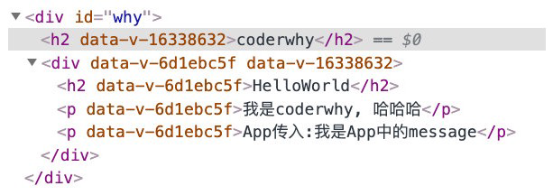 


# 组合式

> Options API 的弊端
>
> - Options API 的一大特点就是在**对应的属性中编写对应的功能模块**
>
>   比如 `data` 定义数据、`methods` 中定义方法、`computed` 中定义计算属性、`watch` 中监听属性改变，也包括生命周期钩子
>
> - 当**实现某一个功能**时，这个功能对应的**代码逻辑会被拆分到各个属性中**
>
>   组件变得更大、更复杂时，逻辑关注点的列表就会增长，那么同一个功能的逻辑就会被拆分的很分散
>
>   这个组件的代码是难以阅读和理解的
>
> 如果能将同一个逻辑关注点相关的代码收集在一起会更好，这就是 Composition API 想要做的事情，以及可以帮助做的事情
>


## setup 函数

为了开始使用 Composition API，需要有一个可以实际使用它（编写代码）的地方，这个位置就是 `setup` 函数

`setup` 其实就是组件的另外一个选项

- 这个选项可以用**它来替代之前所编写的大部分其他选项**
- 比如 `methods`、`computed`、`watch`、`data`、生命周期等等

`setup` 函数的**参数**

1. ##### `props`：**父组件传递过来的属性**会被放到 `props` 对象中，在 `setup` 中如果需要使用，就可以直接通过 `props` 参数获取

   - 对于**定义 props 的类型**，还是和之前的规则是一样的，**在 `props` 选项中定义**

   - 在 **`template` 中依然是可以正常去使用 `props`** 中的属性

   - 如果 **`setup` 函数中想要使用 `props`**，**不可以通过 `this` 去获取**

     因为 `props` 有直接作为参数传递到 `setup` 函数中，所以可以**直接通过参数来使用**即可
     
   - `setup` 函数的 **`props` 是响应式**的，如果**解构 `props`  对象会失去响应式**
   
     如果需要解构，可以**使用 `toRefs()` 和 `toRef()` 方法**

     ```javascript
     let { name, age } = toRefs(props);
     ```
   
2. ##### `context`：**`setup` 上下文**对象，里面包含四个属性

    - `attrs`：所有的**非 prop 的 attribute**，等价于 `$attrs`
   - `slots`：父组件传递过来的**插槽**，等价于 `$slots`
   - `emit`：当组件内部需要**发出事件**时会用到 `emit`，等价于 `$emit`
   - `expose`：组件实例被父组件通过模板 `ref` 访问时**暴露的公共 property**
   
   因为**不能访问 `this`**，所以不可以通过 `this.$emit` 等实例方法
   
   上下文对象是非响应式的，**可以安全地解构**
   
   ```javascript
   setup(props, { attrs, slots, emit, expose }) {}
   ```

`setup` 函数也可以**有返回值**，返回的对象会**暴露给模板**

- `setup` 的返回值**可以在模板 `<template>` 中被使用**，也就是说可以通过 `setup` 的返回值来**替代 `data` 选项**
- 可以返回一个执行函数来**代替在 `methods` 中定义的方法**
- 对于在 `setup` 函数中**定义的变量**，默认情况下，**Vue 并不会跟踪它的变化，来引起界面的响应式操作**，需要使用**响应式 API 去处理**

```html
<div>
  <h2>{{message}}</h2>
  <h2>{{title}}</h2>
</div>
```

```javascript
props: {
  message: { type: String, required: true }
},
setup(props, {attrs, slots, emit, expose}) {
  console.log(props.message);
  const title = ref("Hello Home");
  return {
    title
  }
}
```


## script setup

`<script setup> ` 是在单文件组件中使用组合式 API 的编译时**语法糖**，简化了组合式 API 必须 return 的写法

```vue
<script setup></script>
```

- `<script setup>` 标签内的内容相当于原本组件声明中 `setup()` 的函数体

- 组件只需引入不用注册，声明或导入的属性和方法等，都能在模板中直接使用，也不用返回

  ```html
  <template>
    <MyComponent />
    <div @click="log">{{ msg }}</div>
    <div>{{ capitalize('hello') }}</div>
  </template>
  ```

  ```vue
  <script setup>
    import MyComponent from './MyComponent.vue'
    import { capitalize } from './helpers'
    const msg = 'Hello!'
    function log() {
      console.log(msg)
    }
  </script>
  ```

- 全局编译器宏，无需 `import` 就可以直接使用

  传入到 `defineProps` 和 `defineEmits` 的选项会从 `setup` 中提升到模块的范围

  - `defineProps` 声明 props

    ```javascript
    const props = defineProps({
      foo: String
    })
    ```

  - `defineEmits` 声明 emits

    ```javascript
    const emit = defineEmits(['change', 'delete'])
    ```

    ```javascript
    emit('change');
    ```

  - `defineExpose` 声明要暴露出去的属性

    ```javascript
    const a = ref(2)
    defineExpose({ a })
    ```

  - `withDefaults` 使用 TypeScript 时指定 props 的默认值

    ```typescript
    withDefaults(
      defineProps<{ size?: number, labels?: string[] }>(),
      { size: 3, labels: () => ['default label'] }
    )
    ```

- 使用 `useSlots` 获取插槽数据 `slots`

  ```javascript
  import { useSlots } from 'vue'
  const slots = useSlots()
  ```

- 使用 `useAttrs` 获取非 Prop 的 Attribute

  ```javascript
  import { useAttrs } from 'vue'
  const attrs = useAttrs()
  ```

- 在 `<script setup> ` 的顶层作用域下可以直接使用 `await`，会自动让该组件成为一个异步依赖

  ```vue
  <script setup>
    const post = await fetch(`/api/post/1`).then(r => r.json())
  </script>
  <!-- 
   会被编译成
   async setup(){ ... }
  -->
  ```

- `<script setup> ` 可以与普通的 `<script>` 一起使用

  ```vue
  <script>
    // 普通 <script>, 在模块范围下执行(只执行一次)
  	const FOO = 'foo'
  
    // 声明额外的选项
    export default {
      name: 'home',
      inheritAttrs: false
    }
  </script>
  
  <script setup>
  </script>
  ```


## 响应式

### reactive 

如果想**为在 `setup` 中定义的数据提供响应式**的特性，那么可以使用 `reactive` 函数

- 当使用 `reactive` 函数处理数据之后，数据再次被使用就会进行依赖收集
- 当数据发生改变时，所有收集到的依赖都是进行对应的响应式操作
- 事实上，`data` 选项，也是在内部交给了 `reactive` 函数将其变成响应式对象的

```html
<div>
  <h2>当前计数: {{state.counter}}</h2>
  <button @click="increment">+1</button>
</div>
```

```javascript
import { reactive } from 'vue';
const state = reactive({
  counter: 100
})
const increment = () => {
  state.counter++;
}
```

- `reactive` 函数对**传入的类型是有限制**的，要求必须传入的是一个**对象或者数组类型**

  如果传入一个**基本数据类型（String、Number、Boolean）会报一个警告**

- 传入的对象**无论嵌套多少层**，**深层都是响应式的**

- `reactive` 函数是单例模式

  对同一个对象多次调用 `reactive` 函数，返回的都是同一个代理对象

  对一个响应式对象调用 `reactive` 函数，总会返回代理对象自身

  ```javascript
  let info = { age: 30, name: "jack" }
  const reactive1 = reactive(tom)
  const reactive2 = reactive(tom)
  const reactive3 = reactive(reactive2)
  
  console.log(reactive1 == reactive2) //true
  console.log(reactive3 == reactive2) //true
  console.log(reactive3 == reactive1) //true
  ```

- `reactive` 函数不能更改响应式对象引用，将响应式对象的变量赋值给另一个对象，会丢失响应式

  ```javascript
  let reactive1 = reactive({ age: 30, name: "jack" })
  // 丢失响应式
  reactive1 = { age: 30, name: "tom" }
  
  let reactive2 = reactive({ age: 30, name: "jack", info: { sex: 'male', address: 'CN' } })
  // 修改响应式对象里面的嵌套对象引用可以，因为是深层代理
  reactive2.info = { sex: 'female', address: 'US' }
  ```

- 将 `reactive` 响应式对象的属性（值类型属性）赋值给另一个变量，被赋值的变量不会有响应式

  值类型属性传递会丢失响应式；引用类型属性传递不会失去响应式，因为是深层次的代理，该对象属性自身就是响应式对象

  ```javascript
  let reactive1 = reactive({ age: 30, name: "jack" })
  // 被赋值的变量不是响应式
  let name = reactive1.name
  let { age, name } = reactive1
  // 将属性传入函数中，该属性不是响应式
  const setName = (name) => name = 'tom'
  setName(reactive1.name)
  
  let reactive2 = reactive({ age: 30, name: "jack", info: { sex: 'male', address: 'CN' } })
  // 是响应式
  let info = reactive2.info
  // 是响应式
  const setSex = (info) => info.sex = 'female'
  setSex(reactive1.info)
  ```


### ref

`ref` 会返回一个**可变的响应式对象**，该对象作为一个响应式的引用维护着它内部的值

它内部的**值是在 `ref` 的 `value` 属性**中被维护的

```html
<!-- 当在 template 模板中使用 ref 对象, 它会自动进行解包 -->
<h2>当前计数: {{counter}}</h2>
```

```javascript
import { ref } from 'vue';
let counter = ref(100);
```

- `ref` 允许创建**任何类型**的响应式 `ref` 对象

  ```javascript
  const ref1 = ref(1)
  console.log(ref1.value)
  const ref2 = ref({ age: 30, name: "jack" })
  console.log(ref2.value)
  ```

- 在**模板中**引入 `ref` 的值时，Vue 会**自动帮助进行解包操作**，并不需要在模板中通过 `ref.value` 的方式来使用

  但是在 **`setup` 函数内部**，它**依然是一个 `ref` 引用**，所以对其进行操作时，依然**需要使用 `ref.value` 的方式**

  ```html
  <!-- 在 template 模板中使用 ref 对象, 它会自动进行解包 -->
  <h2>当前计数: {{counter}}</h2>
  ```

  ```javascript
  let counter = ref(100);
  ```

- 模板中的解包是**浅层的解包**

  ```html
  <!-- ref 的解包只能是一个浅层解包( info 是一个普通的 JavaScript 对象) -->
  <h2>当前计数: {{info.counter.value}}</h2>
  ```

  ```javascript
  let counter = ref(100);
  // 对象包裹 ref
  const info = { counter }
  ```

- 如果将 `ref` 放到一个 `reactive` 的属性当中，那么在模板中使用时会自动解包

  ```html
  <!-- 当如果最外层包裹的是一个reactive可响应式对象, 那么内容的ref可以解包 -->
  <h2>当前计数: {{reactiveInfo.counter}}</h2>
  ```

  ```javascript
  let counter = ref(100);
  // reactive 包裹 ref
  const reactiveInfo = reactive({ counter })
  ```

-  `ref` 创建的响应式对象**可以更改对象的引用**，而 `reactive` 不可以更改

  ```html
  <button @click="changeRef">修改ref</button>
  <button @click="infoReactive">修改reactive</button>
  <!-- 按下修改ref按钮后，结果为：tom -->
  <h1>{{ infoRef.name }}</h1>
  <!-- 按下修改reactive按钮后，结果为：jack -->
  <h1>{{ infoReactive.name }}</h1>
  ```

  ```javascript
  const infoRef = ref({ age: 30, name: "jack" })
  function changeRef(){
    infoRef.value = { age: 30, name: "tom" } 
  }
  let infoReactive = reactive({ age: 30, name: "jack" })
  function changeReactive(){
    infoReactive = { age: 30, name: "tom" } 
  }
  ```

- 在 `setup` 中**使用 `ref` 获取元素或者组件实例**

  只需要定义一个 **`ref` 对象，绑定到元素或者组件的 `ref` 属性上**即可

  ```html
  <h2 ref="title">哈哈哈</h2>
  ```

  ```javascript
  const titleRef = ref(null);
  ```

  **多个元素或者组件实例**，需要变为**函数处理 `ref`**，由于是动态的，需要**加冒号 `:ref`**

  如果不使用函数处理 `ref`，只能获得最后一个元素

  ```html
  <ul>
    <li v-for="(item, index) in arr" :key="index" :ref="setRef">
      {{ item }}
    </li>
  </ul>
  ```

  ```javascript
  // 存储dom数组
  const myRef = ref([]);
  const setRef = (el) => {
    myRef.value.push(el);
  };
  ```


> **`ref` 的性能比 `reactive` 更强大，更高效**，推荐更多使用 `ref`
>
> - `reactive` 只能用来创建对象类型的响应式数据，而 `ref` 则是可以创建任意数据类型的响应式对象
>
> - `reactive` 创建的响应式对象是不能更换对象的引用的，而 `ref` 创建响应式对象是可以替换的
>
> - `ref` 创建响应式对象时，如果是基本数据类型，通过 `Object.defineProperty()` 来实现对数据的劫持
>
>   如果是对象类型的数据，则是通过调用 `reactive` 函数实现
>
> - `reactive` 是通过 `Proxy` 来对数据进行代理的


### readonly

通过 `reactive` 或者 `ref` 可以获取到一个响应式的对象，

但是某些情况下，传入给其他地方（组件）的这个响应式对象希望在另外一个地方（组件）被使用，但是**不能被修改**

Vue3 提供了 `readonly` 的方法

**`readonly` 会返回原生对象的只读代理**（依然是一个 `Proxy`，这是一个 `Proxy` 的 **`set` 方法被劫持**，不能对其进行修改）

开发中常见的 `readonly` 方法会传入的参数类型

- 普通对象

  ```javascript
  const info1 = {name: "why"};
  const readonlyInfo1 = readonly(info1);
  ```

- reactive 返回的对象

  ```javascript
  const info2 = reactive({ name: "why" })
  const readonlyInfo2 = readonly(info2);
  ```
  
- ref 的对象

  ```javascript
  const info3 = ref("why");
  const readonlyInfo3 = readonly(info3);
  ```

`readonly` 的使用规则：

- `readonly` **返回的对象都是不允许修改的**

- 经过 `readonly` 处理的**原来的对象是允许被修改的**

  比如 `const info = readonly(obj)`，`info` 对象是不允许被修改的，

  当 `obj` 被修改时，`readonly` 返回的 `info` 对象也会被修改

在传递给其他组件数据时，往往希望其他组件使用传递的内容，但是不允许它们修改时，就可以使用 `readonly` 了

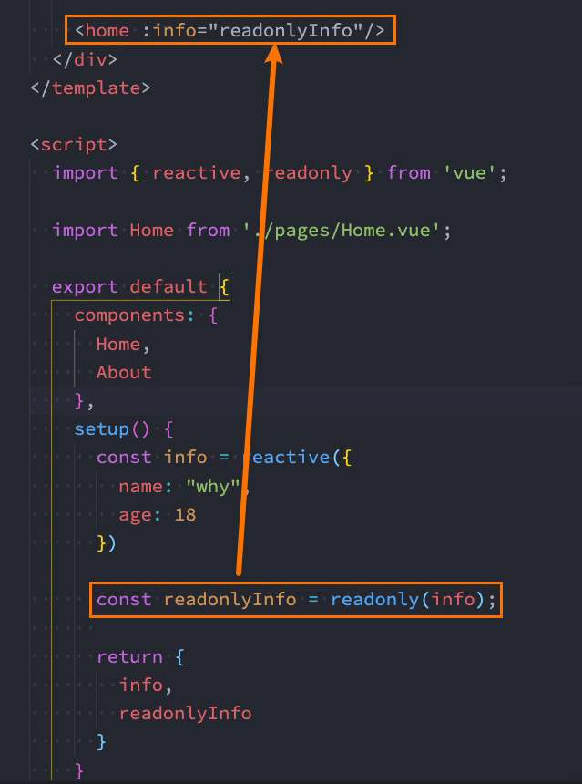 


### toRefs / toRef

`toRefs` 函数，可以将 **`reactive` 返回的对象中的属性都转成 `ref`**

使用 ES6 的**解构语法**，对 `reactive` 返回的对象进行**解构获取响应式的值**

```javascript
const state = reactive({name: "why", age: 18});
// 将reactive对象中的所有属性都转成ref, 建立链接
let { name, age } = toRefs(state);
```

这种做法相当于已经在 `state.name` 和 `ref.value` 之间建立了链接，**任何一个修改都会引起另外一个变化**

`toRef` 函数，只希望**转换一个 `reactive` 对象中的属性为 `ref`**

```javascript
const info = reactive({name: "why", age: 18});
let age = toRef(info, "age");
```


### customRef

创建一个**自定义的 `ref`**，并**对其依赖项跟踪和更新触发进行显示控制**

- 需要一个**工厂函数**，该函数接受 **`track`（跟踪） 和 `trigger`（触发） 函数作为参数**

  `track` 函数决定什么时候**收集依赖**

  `trigger` 函数决定什么时候**触发依赖**来更新

- **返回一个带有 `get` 和 `set` 的对象**

使用 `customRef` 对双向绑定的属性进行 debounce（防抖）的操作

```javascript
import { customRef } from 'vue';
// 自定义 ref
export default function(value, delay = 300) {
  let timer = null;
  return customRef((track, trigger) => {
    return {
      get() {
        track();
        return value;
      },
      set(newValue) {
        clearTimeout(timer);
        timer = setTimeout(() => {
          value = newValue;
          trigger();
        }, delay);
      }
    }
  })
}
```

```html
<div>
  <input v-model="message"/>
  <h2>{{message}}</h2>
</div>
```

```javascript
import debounceRef from './hook/useDebounceRef';
const message = debounceRef("Hello World");
```


### reactive 其他 API

- `isProxy`：检查对象是否是由 `reactive` 或 `readonly` 创建的 `proxy`

- `isReactive`：检查对象是否是由 `reactive` 创建的响应式代理

  如果该代理是 `readonly` 建的，但包裹了由 `reactive` 创建的另一个代理，它也会返回 `true`

- `isReadonly`：检查对象是否是由 `readonly` 创建的只读代理

- `toRaw`：返回 `reactive` 或 `readonly` 代理的原始对象

  不建议保留对原始对象的持久引用，请谨慎使用

- `shallowReactive`：创建一个响应式代理，它跟踪其自身 property 的响应性，但**不执行嵌套对象的深层响应式转换**

  深层还是原生对象

- `shallowReadonly`：创建一个 `proxy`，使其自身的 property 为只读，但**不执行嵌套对象的深度只读转换**

  深层还是可读、可写的


### ref 其他 API

- `unref`：如果想要**获取一个 `ref` 引用中的 `value`**，那么也可以通过 `unref` 方法

  如果**参数是一个 `ref`**，则**返回内部值**，**否则返回参数本身**
  
  是 `val = isRef(val) ? val.value : val` 的语法糖函数
  
  ```typescript
  function useFoo(x: number | Ref<number>) {
    const unwrapped = unref(x) // unwrapped 现在一定是数字类型
  }
  ```
  
- `isRef`：判断值是否是一个 `ref` 对象

- `shallowRef`：创建一个**浅层的 `ref` 对象**

  创建一个跟踪自身 ` .value` 变化的 `ref`，但不会使其值也变成响应式的

  ```javascript
  const foo = shallowRef({})
  // 改变 ref 的值是响应式的
  foo.value = {}
  // 但是这个值不会被转换。
  isReactive(foo.value) // false
  ```

- `triggerRef`：手动触发和 `shallowRef` 相关联的副作用

  ```html
  <div>
    <h2>{{info}}</h2>
    <button @click="changeInfo">修改Info</button>
  </div>
  ```
  
  ```javascript
  import { ref, shallowRef, triggerRef } from 'vue';
  // 浅层的 ref 对象
  const info = shallowRef({name: "kobe"})
  const changeInfo = () => {
    // 不会触发作用，name属性不是ref
    info.value.name = "james";
    // 手动触发
    triggerRef(info);
  }
  ```


## 计算属性

在 Options API中，计算属性是使用 `computed` 选项来完成的

在 Composition API 中，可以在 **`setup` 函数中使用 `computed` 方法来编写一个计算属性**

`computed` 函数用法：

1. ##### 传入一个 getter 函数，返回一个**不可变的 `ref` 对象**

   ```html
   <div>
     <h2>{{fullName}}</h2>
     <button @click="changeName">修改firstName</button>
   </div>
   ```

   ```javascript
   import { ref, computed } from 'vue';
   const firstName = ref("Kobe");
   const lastName = ref("Bryant");
   const fullName = computed(() => firstName.value + " " + lastName.value);
   const changeName = () => {
     firstName.value = "James"
   }
   ```

2. 接收一个具有 get 和 set 的对象，返回一个**可读写的 `ref` 对象**

   ```html
   <div>
     <h2>{{fullName}}</h2>
     <button @click="changeName">修改firstName</button>
   </div>
   ```
   
   ```javascript
   import { ref, computed } from 'vue';
   const firstName = ref("Kobe");
   const lastName = ref("Bryant");
   const fullName = computed({
     get: () => firstName.value + " " + lastName.value,
     set(newValue) {
       [this.firstName.value, this.lastName.value] = newValue.split(' ')
     }
   });
   const changeName = () => {
     fullName.value = "coder why";
   }
   ```


## 侦听器

### watchEffect

#### 基本使用

在组合式 API 中，可以使用 `watchEffect` 用于**自动收集响应式数据的依赖**

`watchEffect` 传入的函数会被**立即执行一次**，并且在执行的过程中会收集依赖

只有收集的依赖**发生变化**时，`watchEffect` 传入的函数才**会再次执行**

`watchEffect` 参数

1. `effect` 函数（副作用函数），收集依赖并且**组件初始化时立即执行一次**（必须）

   `effect` 函数可以接受一个 **`onInvalidate` 函数参数**，该参数执行并**传入一个 callback** ，**每次监听回调执行前都会执行**该callback

   参数 `onInvalidate` 可以用来**清理无效的副作用**，例如等待中的异步请求等

2. 副作用函数的执行时机：`pre` | `post` | `sync`

```html
<div>
  <h2>{{name}}-{{age}}</h2>
  <button @click="changeName">修改name</button>
  <button @click="changeAge">修改age</button>
</div>
```

```javascript
import { ref, watchEffect } from 'vue';
const name = ref("why");
const age = ref(18);
const changeName = () => name.value = "kobe"
const changeAge = () => age.value++
// 函数会被立即执行一次
watchEffect(() => {
  console.log("name:", name.value, "age:", age.value);
});
```


#### 停止侦听

如果希望停止侦听，可以获取 `watchEffect` 的**返回值函数**，**调用该函数**即可

```javascript
const name = ref("why");
const age = ref(18);
const stop = watchEffect(() => {
  console.log("name:", name.value, "age:", age.value);
});
// age达到20的时候就停止侦听
const changeAge = () => {
  age.value++;
  if (age.value > 25) {
    stop();
  }
}
```


#### 清除副作用

什么是清除副作用

- 比如在开发中需要在侦听函数中执行网络请求，但是在网络请求还没有达到的时候，就停止了侦听器，或者侦听函数被再次执行了
- 那么上一次的网络请求应该被取消掉，这时就可以清除上一次的副作用

给 `watchEffect` 传入的**副作用函数被回调时**，其实**可以获取到一个参数 `onInvalidate`**

- 当**副作用函数即将重新执行**或者**侦听器被停止时**会**执行该函数传入的回调函数**
- 可以在传入的回调函数中，执行一些清理工作

```javascript
const stop = watchEffect((onInvalidate) => {
  // 根据 name 和 age 两个变量发送网络请求
  const timer = setTimeout(() => {
    console.log("网络请求成功~");
  }, 2000)

  onInvalidate(() => {
    // 在这个函数中清除额外的副作用
    // request.cancel()
    clearTimeout(timer);
  })
  console.log("name:", name.value, "age:", age.value);
});
```


#### 执行时机

默认情况下，**副作用函数**会在**组件更新之前执行**，但是可以传递带有 `flush` 选项的附加 options 对象

- `pre`：副作用函数**在元素挂载或者更新之前执行**（默认）
- `post`：副作用函数**在组件更新后触发**
- `sync`：效果始终**同步触发**（低效，不推荐）

```html
<div>
  <h2 ref="title">哈哈哈</h2>
</div>
```

```javascript
import { ref, watchEffect } from 'vue';
const title = ref(null);
watchEffect(() => {
  console.log(title.value);
}, {
  flush: "post"
})
```


### watch

`watch` 的 API 完全等同于组件侦听器选项的 `watch`

- `watch` 需要侦听特定的数据源，并在回调函数中执行副作用
- 默认情况下是**惰性**的，只有当被**侦听的源发生变化时才会执行回调**

与 `watchEffect` 比较，`watch` 允许：

- 懒执行副作用（**第一次不会直接执行**）
- 更具体地说明什么状态应该触发侦听器重新运行
- 访问侦听状态**变化前后的值**

**侦听单个数据源**

`watch` 侦听函数的数据源有两种类型

- **一个 getter 函数**：该 getter 函数**必须引用可响应式的对象**（ `reactive` 或者 `ref` ）

  ```javascript
  const info = reactive({name: "why", age: 18});
  // 侦听watch时,传入一个getter函数
  watch(() => info.name, (newValue, oldValue) => {
    console.log("newValue:", newValue, "oldValue:", oldValue);
  })
  ```

  如果希望**侦听一个数组或者对象**，那么可以**使用一个 getter 函数**，并且**对可响应对象进行解构**

  ```javascript
  const info = reactive({name: "why", age: 18});
  watch(() => ({...info}), (newValue, oldValue) => {
    console.log("newValue:", newValue, "oldValue:", oldValue);
  })
  ```

  ```javascript
  const info = reactive(["abc", "cba", "nba"]);
  watch(() => [...names], (newValue, oldValue) => {
    console.log("newValue:", newValue, "oldValue:", oldValue);
  })
  ```

- **一个可响应式的对象**，`reactive` 或者 `ref`（比较常用 `ref` ）

  **`reactive` 对象获取到的 `newValue` 和 `oldValue` 本身都是 `reactive` 对象**，可以通过函数参数进行解构变为普通对象

  ```javascript
  const info = reactive({name: "why", age: 18});
  watch(info, (newValue, oldValue) => {
    console.log("newValue:", newValue, "oldValue:", oldValue);
  })
  ```

  **`ref` 对象获取 `newValue` 和 `oldValue` 是 `value` 值的本身**

  ```javascript
  const name = ref("why"); 
  watch(name, (newValue, oldValue) => {
    console.log("newValue:", newValue, "oldValue:", oldValue);
  })
  ```

**侦听多个数据源**

- 侦听器可以**使用数组同时侦听多个源**

  ```javascript
  const info = reactive({name: "why", age: 18});
  const name = ref("why");
  watch([() => ({...info}), name], ([newInfo, newName], [oldInfo, oldName]) => {
    console.log(newInfo, newName, oldInfo, oldName);
  })
  ```

`watch` 的选项

- `deep`：深层侦听

  传入**可响应式对象**时，**默认是深层监听**

  ```javascript
  const info = reactive({ name: "why",  age: 18, friend: { name: "kobe" } });
  watch(info, (newInfo, oldInfo) => {
    console.log(newInfo, oldInfo);
  })
  const changeData = () => {
    info.friend.name = "james";
  }
  ```
  
  如果侦听的是一个**普通对象**，默认不是深层监听，需要手动设置
  
  ```javascript
  const info = { name: "why",  age: 18, friend: { name: "kobe" } };
  watch(info, (newInfo, oldInfo) => {
    console.log(newInfo, oldInfo);
  }, { deep: true })
  const changeData = () => {
    info.friend.name = "james";
  }
  ```
  
- `immediate`：**立即执行**，组件初始化时立即执行一次

  ```javascript
  const info = reactive({ name: "why",  age: 18, friend: { name: "kobe" } });
  watch(info, (newInfo, oldInfo) => {
    console.log(newInfo, oldInfo);
  }, { immediate: true })
  ```


## Hook 函数

利用组合式 API，可以仿照 React 的写法来实现 Hook

使用 Hook 的形式编写，可以把单独的功能模块封装成一个函数，使得 .vue 文件代码非常简洁清晰，组件和业务代码分离

和在组件中一样，可以**在组合式函数中使用所有的组合式 API 函数**

通常约定自定义的 hook 函数以 use 作为前缀，与普通函数作区分

### 计数器案例

```javascript
import { ref, computed } from 'vue';

export default function() {
  const counter = ref(0);
  const doubleCounter = computed(() => counter.value * 2);

  const increment = () => counter.value++;
  const decrement = () => counter.value--;

  return {
    counter, 
    doubleCounter, 
    increment, 
    decrement
  }
}
```

```html
<div>
  <h2>当前计数: {{counter}}</h2>
  <h2>计数*2: {{doubleCounter}}</h2>
  <button @click="increment">+1</button>
  <button @click="decrement">-1</button>
</div>
```

```javascript
import { useCounter } from './hooks';
const { counter, doubleCounter, increment, decrement } = useCounter();
```


### 修改 title 案例

```javascript
import { ref, watch } from 'vue';

export default function(title = "默认title") {
  const titleRef = ref(title)

  watch(titleRef, (newValue) => {
    document.title = newValue
  }, {
    immediate: true
  })

  return titleRef
}
```

```javascript
import { useTitle } from './hooks';
const titleRef = useTitle("james");
setTimeout(() => {
  titleRef.value = "kobe"
}, 3000);
```


### 监听界面滚动案例

```javascript
import { ref } from 'vue';

export default function() {
  const scrollX = ref(0);
  const scrollY = ref(0);

  document.addEventListener("scroll", () => {
    scrollX.value = window.scrollX;
    scrollY.value = window.scrollY;
  });

  return {
    scrollX,
    scrollY
  }
}
```

```html
<div>
  <div class="scroll">
    <div class="scroll-x">scrollX: {{scrollX}}</div>
    <div class="scroll-y">scrollY: {{scrollY}}</div>
  </div>
</div>
```

```javascript
import { useScrollPosition } from './hooks';
const { scrollX, scrollY } = useScrollPosition();
```


### localStorage封装

```javascript
import { ref, watch } from 'vue';

export default function(key, value) {
  const data = ref(value);

  if (value) {
    window.localStorage.setItem(key, JSON.stringify(value));
  } else {
    data.value = JSON.parse(window.localStorage.getItem(key));
  }

  watch(data, (newValue) => {
    window.localStorage.setItem(key, JSON.stringify(newValue));
  })

  return data;
}
```

```html
<div>
  <h2>{{data}}</h2>
  <button @click="changeData">修改data</button>
</div>
```

```javascript
import { useLocalStorage } from './hooks';
const data = useLocalStorage("info");
const changeData = () => data.value = "哈哈哈哈"
```


## 插件

通常向 Vue **全局添加一些功能**时，会采用插件的模式

有两种编写方式：

- **对象类型**：一个对象，但是**必须包含一个 `install` 的函数**，该**函数会在安装插件时执行**

  **调用 `install` 函数**时，会**默认传入 `app` 的对象**

  ```javascript
  export default {
    name: 'jack'
    install(app, options) {
      console.log('插件被安装', app, options);
      console.log(this.name);
    }
  }
  ```

  获取到的 `app` 对象

  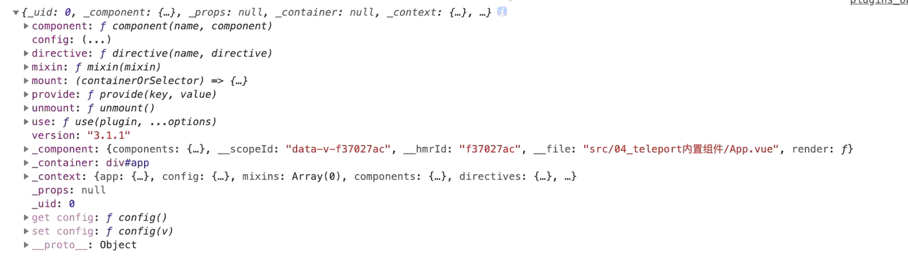

  main.js 中**使用 `use` 注入**

  ```javascript
  import pluginObject from './plugins/plugins_object'
  const app = createApp(App);
  app.use(pluginObject);
  app.mount('#app');
  ```

- **函数类型**：一个 `function`，这个**函数会在安装插件时自动执行**

  ```javascript
  export default function(app, options) {
    app.component('');
    app.mixin();
    console.log(app, options)
  }
  ```

  ```javascript
  import pluginFunction from './plugins/plugins_function'
  const app = createApp(App);
  app.use(pluginFunction);
  app.mount('#app');
  ```

插件可以**完成的功能没有限制**

- **添加全局方法或者 property**，通过把它们添加到 `config.globalProperties` 上实现

  ```javascript
  export default {
    install(app) {
      // 添加全局属性
      app.config.globalProperties.$name = "glbalName"
      // 添加全局方法
      app.config.globalProperties.$filter = {
        formatTime(value, format = 'YYYY-MM-DD HH:mm:ss') {
          // .....
        }
      }
    }
  }
  ```

  在模板中可以直接获取

  ```html
  <strong>{{ $filter.formatTime(createTime) }}</strong>
  ```

  在组件的**选项 API 中可以直接使用 `this` 获取**

  ```javascript
  methods: {
    foo() {
      console.log(this.$name);
    }
  }
  ```

  在 `setup` 函数中获取稍微麻烦

  ```javascript
  import { getCurrentInstance } from "vue";
  export default {
    setup() {
      // 获取组件实例
      const instance = getCurrentInstance();
      // 通过app上下文获取
      console.log(instance.appContext.config.globalProperties.$name);
    }
  }
  ```

- 添加全局资源：指令 / 过滤器 / 过渡等

- 通过全局 `mixin`，来添加一些组件选项

- 一个库，提供自己的 API，同时提供上面提到的一个或多个功能


# 动画

## transition 组件

### 基本使用

使用 `<transition>` 内置组件，给**单元素或者组件实现过渡动画**

下列情形中，可以给任何元素和组件添加进入 / 离开过渡动画

- 条件渲染：`v-if` / `v-show`，也可以通过 `v-if` / `v-else` / `v-else-if` 在几个组件间进行切换

  ```html
  <button @click="isShow = !isShow">显示/隐藏</button>
  <transition name="fade">
      <h2 v-if="isShow">Hello World</h2>
  </transition>
  ```

- 动态组件

  ```html
  <transition name="fade">
      <component :is="show ? 'home' : 'about'"></component>
  </transition>
  ```

当**插入或删除包含在 `transition` 组件中的元素**时，Vue 将会做以下处理

1. 自动嗅探目标元素**是否应用了 CSS 过渡或者动画**，如果有，那么**在恰当的时机添加 / 删除 CSS 类名**
2. 如果 `transition` 组件提供了 **JavaScript 钩子函数**，这些钩子函数将在**恰当的时机被调用**
3. 如果**没有找到 JavaScript 钩子**，并且也**没有检测到 CSS 过渡 / 动画**，**DOM 插入 / 删除操作将会立即执行**

过渡是可以被重用的

```html
<transition name="my-transition" @enter="onEnter" @leave="onLeave">
  <slot></slot>
</transition>
```

```html
<my-transition>
  <div v-if="show">Hello</div>
</my-transition>
```


### 监听类型 type

Vue 为了知道过渡的完成，内部是在监听 transitionend 或 animationend 事件

- 如果只是使用了其中的一个，那么 Vue 能自动识别类型并设置监听

- 如果**同时使用了过渡（transition）和动画（animation）**，并且两个动画的**执行时间不同**，就需要**明确告知 Vue 监听的类型**

  `transition` 组件上**设置 `type` 属性为 `animation` 或者 `transition`**

  ```html
  <transition name="fade" type="transition">
      <h2 v-if="isShow">Hello World</h2>
  </transition>
  ```


### 过渡时间 duration

`duration` 可以设置两种类型的值

- `number` 类型：同时设置进入和离开的过渡时间

  ```html
  <transition name="fade" :duration="1000">
      <h2 v-if="isShow">Hello World</h2>
  </transition>
  ```

- `object` 类型：分别设置进入和离开的过渡时间

  ```html
  <transition name="fade" :duration="{enter: 800, leave: 1000}">
      <h2 v-if="isShow">Hello World</h2>
  </transition>
  ```


### 深层级过渡

过渡 class 仅能应用在 `<transition>` 的直接子元素上，但是可以**使用深层级的 CSS 选择器**，使深层级的元素发生过渡

默认情况下，`<transition>` 组件会**监听过渡根元素**上的第一个  transitionend 或者 animationend 事件来**自动判断过渡何时结束**

 `duration` 设置**过渡时间需要加上内部元素的过渡时间**

```html
<transition name="nested" :duration="550">
  <div v-if="show" class="outer">
    <div class="inner">
      Hello
    </div>
  </div>
</transition>
```

```css
.nested-enter-active .inner,
.nested-leave-active .inner {
  transition: all 0.3s ease-in-out;
}

.nested-enter-from .inner,
.nested-leave-to .inner {
  transform: translateX(30px);
  opacity: 0;
}

/* 延迟嵌套元素的进入以获得交错效果 */
.nested-enter-active .inner {
  transition-delay: 0.25s;
}
```


### 初次渲染 appear

默认情况下，**首次渲染的时候是没有动画**的，如果**希望添加上去动画**，那么就可以增加另外一个**属性 `appear`**

```html
<button @click="isShow = !isShow">显示/隐藏</button>
<transition name="fade" appear>
    <component :is="show ? 'home' : 'about'"></component>
</transition>
```


### 过渡模式 mode

动画在两个元素之间切换的时候，**默认情况下进入和离开动画是同时发生的**

 

如果**不希望同时执行进入和离开动画**，那么需要**设置 `<transition>` 的过渡模式**

- `in-out`：新元素先进行过渡，完成之后当前元素过渡离开
- `out-in`：当前元素先进行过渡，完成之后新元素过渡进入

```html
<transition name="fade" mode="out-in">
  <h2 class="title" v-if="isShow">Hello World</h2>
  <h2 class="title" v-else>你好啊,李银河</h2>
</transition>
```


## 基于 class 的动画

### 过渡动画 class

vue 提供的**过渡动画 `class`**：

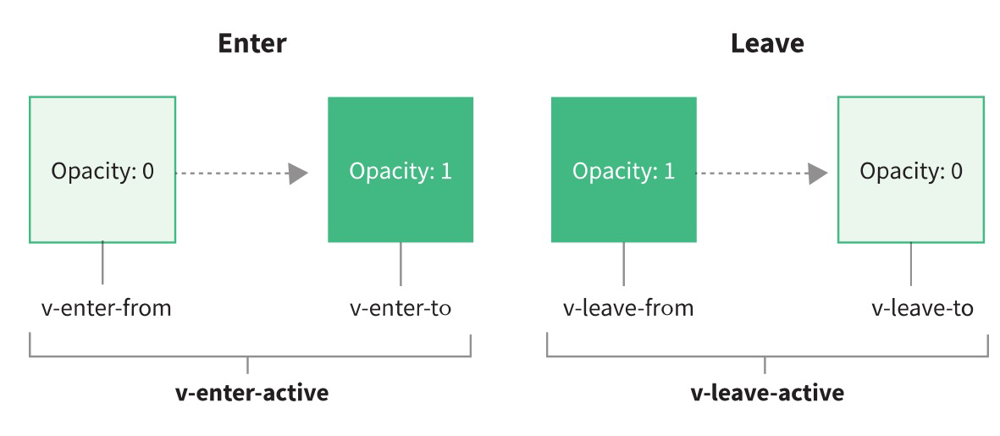 

- ##### `v-enter-from`：定义进入**过渡的开始状态**

  在元素被插入之前生效，在元素被插入之后的下一帧移除

- ##### `v-enter-active`：定义进入**过渡生效时**的状态

  在整个进入过渡的阶段中应用，在元素被插入之前生效，在过渡 / 动画完成之后移除

  这个类可以被用来定义进入过渡的过程时间，延迟和曲线函数

- ##### `v-enter-to`：定义进入**过渡的结束**状态

  在元素被插入之后下一帧生效(与此同时 `v-enter-from` 被移除)，在过渡 / 动画完成之后移除

- ##### `v-leave-from`：定义**离开过渡的开始**状态

  在离开过渡被触发时立刻生效，下一帧被移除

- ##### `v-leave-active`：定义**离开过渡生效时**的状态

  在整个离开过渡的阶段中应用，在离开过渡被触发时立刻生效，在过渡 / 动画完成之后移除

  这个类可以被用来定义离开过渡的过程时间，延迟和曲线函数

- ##### `v-leave-to`：定义**离开过渡的结束**状态

  在离开过渡被触发之后下一帧生效(与此同时 `v-leave-from` 被删除)，在过渡 / 动画完成之后移除


### 过渡命名 name

过渡动画 `class` 的 **`name` 命名规则**

- 如果使用的是**没有 `name` 的 `<transition>`**，那么所有的 `class` 是以 **`v-` 作为默认前缀**
- 如果**添加了 `name` 属性**，比如 `<transtion name="my">`，那么所有的 **`class` 会以 `my-` 开头**

通过 css `transition` 实现动画

```html
<div>
  <button @click="isShow = !isShow">显示/隐藏</button>
  <transition name="fade">
    <h2 v-if="isShow">Hello World</h2>
  </transition>
</div>
```

```javascript
const isShow = ref(true);
```

```css
.fade-enter-from,
.fade-leave-to {
  opacity: 0;
}

.fade-enter-to, 
.fade-leave-from {
  opacity: 1;
}

.fade-enter-active,
.fade-leave-active {
  transition: opacity 2s ease;
}
```

通过 css `animation` 实现动画

```html
<div class="app">
  <div><button @click="isShow = !isShow">显示/隐藏</button></div>
  <transition name="bounce">
    <h2 class="title" v-if="isShow">Hello World</h2>
  </transition>
</div>
```

```javascript
const isShow = ref(true);
```

```css
.app {
  width: 200px;
  margin: 0 auto;
}

.title {
  display: inline-block;
}

.bounce-enter-active {
  animation: bounce 1s ease;
}

.bounce-leave-active {
  animation: bounce 1s ease reverse;
}

@keyframes bounce {
  0% {
    transform: scale(0)
  }

  50% {
    transform: scale(1.2);
  }

  100% {
    transform: scale(1);
  }
}
```


### 自定义过渡 class

可以通过以下 **attribute 来自定义过渡类名**

- `enter-from-class`
- `enter-active-class`
- `enter-to-class`
- `leave-from-class`
- `leave-active-class`
- `leave-to-class`

设置的类名的**优先级高于普通的类名**，**集成其他的第三方 CSS 动画库**时非常有用

使用 animate.css 动画库

```html
<Transition
  name="custom-classes"
  enter-active-class="animate__animated animate__tada"
  leave-active-class="animate__animated animate__bounceOutRight"
>
  <p v-if="show">hello</p>
</Transition>
```


### animate.css 库

安装 animate.css

```bash
npm install animate.css
```

在 main.js 中导入 animate.css

```javascript
import "animate.css";
```

使用方法：

1. 直接使用 animate 库中定义的 keyframes 动画

   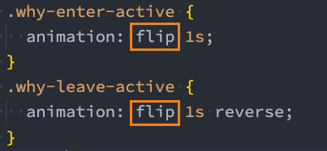 

2. 直接使用 animate 库提供给的类（使用类时，需要一起添加基本类 `animate__animated`）

    


## 基于 javascript 的动画

### JavaScript 钩子

`<transition>` 组件提供的 JavaScript 钩子，可以帮助**监听动画执行到的阶段**

当使用 JavaScript 来执行过渡动画时，需要**进行 done 回调**，否则它们将会被同步调用，过渡会立即完成

**添加 `:css="false"`**，会让 Vue 会跳过 CSS 检测，除了性能略高之外，这可以避免过渡过程中CSS 规则的影响

```html
<transition
  @before-enter="onBeforeEnter"
  @enter="onEnter"
  @after-enter="onAfterEnter"
  @enter-cancelled="onEnterCancelled"
  @before-leave="onBeforeLeave"
  @leave="onLeave"
  @after-leave="onAfterLeave"
  @leave-cancelled="onLeaveCancelled"
  :css="false"
>
  <!-- ... -->
</transition>
```

所有的钩子函数都会传入 `el` 参数，`el` 是**动画包裹的标签元素**

- `before-enter`：入场前，在元素被插入到 DOM 之前被调用，设置元素的 "enter-from" 状态

  ```html
  <transition @before-enter="onBeforeEnter"></transition>
  ```

  ```javascript
  function onBeforeEnter(el) {}
  ```

- `enter`：入场，在元素被插入到 DOM 之后的下一帧被调用，用这个来开始进入动画

  ```html
  <transition @enter="onEnter"></transition>
  ```

  调用回调函数 `done` 表示**过渡结束**

  如果与 CSS 结合使用，回调是可选参数，**使用 JavaScript 过渡**的时候，**回调是必须**的，否则过渡会立即完成

  ```javascript
  function onEnter(el, done) {
    done()
  }
  ```

- `after-enter`：入场后，当进入过渡完成时调用

  ```html
  <transition @after-enter="onAfterEnter"></transition>
  ```

  ```javascript
  function onAfterEnter(el) {}
  ```

- `enter-cancelled`：取消入场，当进入过渡完成时调用

  ```html
  <transition @enter-cancelled="onEnterCancelled"></transition>
  ```

  ```javascript
  function onEnterCancelled(el) {}
  ```

- `before-leave`：出场前，在 `leave` 钩子之前调用，大多数时候只会用到 `leave` 钩子

  ```html
  <transition @before-leave="onBeforeLeave"></transition>
  ```

  ```javascript
  function onBeforeLeave(el) {}
  ```

- `leave`：出场，在离开过渡开始时调用，用这个来开始离开动画

  ```html
  <transition @leave="onLeave"></transition>
  ```

  调用回调函数 `done` 表示过渡结束

  如果与 CSS 结合使用，回调是可选参数，**使用 JavaScript 过渡**的时候，**回调是必须**的，否则过渡会立即完成

  ```javascript
  function onLeave(el, done) {
    done()
  }
  ```

- `after-leave`：出场后，在离开过渡完成，且元素已从 DOM 中移除时调用

  ```html
  <transition @after-leave="onAfterLeave"></transition>
  ```

  ```javascript
  function onAfterLeave(el) {}
  ```

- `leave-cancelled`：取消出场，仅在 `v-show` 过渡中可用

  ```html
  <transition @leave-cancelled="onLeaveCancelled"></transition>
  ```

  ```javascript
  function leaveCancelled(el) {}
  ```


### gsap 库

通过 JavaScript 为 CSS 属性、SVG、Canvas 等设置动画，并且是浏览器兼容的

安装 gsap 库

```bash
npm install gsap
```

导入 gsap 库，使用对应 api 即可

```javascript
import gsap from 'gsap';
```

结合 gsap 库来完成动画效果

```html
<div>
  <div><button @click="isShow = !isShow">显示/隐藏</button></div>
  <transition @enter="enter" @leave="leave" :css="false">
    <h2 style="display: inline-block" v-if="isShow">Hello World</h2>
  </transition>
</div>
```

```javascript
import gsap from 'gsap'
const isShow = ref(true)
function enter(el, done) {
  gsap.from(el, {
    scale: 0,
    x: 200,
    onComplete: done
  })
}
function leave(el, done) {
  gsap.to(el, {
    scale: 0,
    x: 200,
    onComplete: done
  })
}
```

gsap 实现数字变化

```html
<div class="app">
  <input type="number" step="100" v-model.number="counter">
  <h2>当前计数: {{ showCounter.toFixed(0) }}</h2>
</div>
```

```javascript
import gsap from 'gsap';
export default {
  data() {
    return {
      counter: 0,
      showNumber: 0
    }
  },
  watch: {
    counter(newValue) {
      gsap.to(this, {duration: 1, showNumber: newValue})
    }
  }
}
```


## transition-group 组件

`<transition>` 组件只能渲染单个节点，或者同一时间渲染多个节点中的一个

如果希望**渲染的是一个列表**，并且该列表中添加删除数据也希望有动画执行，可以使用 `<transition-group>` 组件来完成

`<transition-group>` 支持和 `<transition>` 基本相同的 prop、CSS 过渡 class 和 JavaScript 钩子监听器

`transition-group` 特点

- 默认情况下，不会渲染一个元素的包裹器，但是可以**通过 `tag` 指定**一个元素作**为包装器元素**以进行渲染
- **过渡模式不可用**，因为不再相互切换特有的元素
- 内部元素总是**需要提供唯一的 `key `**
- **CSS 过渡的类将会应用在内部的元素**中，而**不是这个组 / 容器本身**

```html
<transition-group tag="p" name="why">
  <span v-for="item in numbers" :key="item">
    {{item}}
  </span>
</transition-group>
```

`v-move` 类会在**元素改变位置的过程中应用**，可以通过 `name` 来自定义前缀，也可以通过 `move-class` attribute 手动设置

```css
.my-move {
    transition: transform 1s ease;
}
```


# 路由

## 基本使用

### 创建路由

vue-router 是基于路由和组件的

路由用于设定访问路径，将路径和组件映射起来，在 vue-router 的单页面应用中，页面的路径的改变就是组件的切换

安装 Vue Router

```bash
npm install vue-router
```

创建路由：

1. 创建路由组件

2. 配置路由映射：**组件和路径映射关系的 `routes` 数组**

3. 通过 **`createRouter` 创建路由对象**，并且**传入 `routes` 数组和 `history` 模式**

   ```javascript
   import { createRouter, createWebHistory } from 'vue-router'
   import Home from "../pages/Home.vue";
   import About from "../pages/About.vue"; 
   // 配置映射关系
   const routes = [
     { path: '/home', component: Home },
     { path: '/about', component: About }
   ]
   // 创建路由对象router
   const router = createRouter({
     routes,
     history: createWebHistory()
   })
   export default router
   ```

   ```javascript
   import router from './router'
   const app = createApp(App)
   app.use(router)
   app.mount('#app')
   ```

4. 使用路由：通过 **`<router-link>`** 和 **`<router-view>`**

   `router-link` 可以在不重新加载页面的情况下更改 URL，生成 URL
   
   `router-view` 将显示与 url 对应的组件，可以放在任何地方
   
   ```html
   <template>
     <div id="app">
       <router-link to="/home">首页</router-link>
       <router-link to="/about">关于</router-link>
     </div>
     <router-view></router-view>
   </template>
   ```


### 路由命名 name

通过路由记录的 `name` 属性，为路由记录独一无二的名称，也可以**用名字进行跳转**

```javascript
{ path: '/user/:username', name: 'user', component: () => import("../pages/User.vue") }
```

利用路由名称进行跳转

```html
<router-link :to="{ name: 'user', params: { username: 'erina' }}">User</router-link>
```

```javascript
router.push({ name: 'user', params: { username: 'erina' } })
```


### router-link

`<router-link>` 可以配置很多属性

- `to`：目标路由的链接，点击后会把 `to` 的值传到 `router.push()`，可以传递字符串和对象

  ```html
  <router-link to="/home">Home</router-link>
  <router-link :to="{ path: '/home' }">Home</router-link>
  <router-link :to="{ name: 'user', params: { userId: '123' }}">User</router-link>
  <router-link :to="{ path: '/register', query: { plan: 'private' }}">Register</router-link>
  ```

- `replace`：点击时会调用 `router.replace()`，而不是 `router.push()`，导航后不会留下历史记录（替换原来的路径）

  ```html
  <router-link to="/home" replace>首页</router-link>
  ```

- `active-class`：链接激活时，应用在 `<a>` 元素的 class，默认是 `.router-link-active`

  ```html
  <router-link to="/home" active-class="my-active">首页</router-link>
  ```

  子路由链接激活时，也会匹配父路由

  ```javascript
  { path: '/movies', component: () => import("../pages/Movies.vue"),
   children: [
      { path: "new", component: () => import("../pages/MoviesNew.vue") }
    ]
  }
  ```

  ```html
  <!-- 当页面匹配到 ’/movies/new’ 的时候，’/movies' 也会被匹配到 -->
  <router-link to='/movies' active-class="my-active">首页</router-link>
  <router-link to='/movies/new' active-class="my-active">登录</router-link>
  ```

  如果没有路由嵌套关系，只是相似的路由，不会渲染激活 class，例如：`/order` 和 `/order/:id`

  可以使用以下方法，来让路由路径包含

  ```javascript
  import { h } from 'vue'
  import { RouterView } from 'vue-router'
  ```

  ```javascript
  { path: '/order/', component: { render: () => h(<RouterView/>) },
    children: [
      { path: '', component: import("../pages/Order.vue") },
      { path: ':id', component: import("../pages/OrderDetail.vue") }
    ]
  }
  ```

  ```html
  <!-- 当页面匹配到’ /order/123’ 的时候，’/order' 也会被匹配到 -->
  <router-link to='/order' active-class="my-active">订单</router-link>
  <router-link to='/order/123' active-class="my-active">订单详细</router-link>
  ```

- `exact-active-class`：链接精准激活时，应用于渲染的 `a` 元素的 class，默认是 `.router-link-exact-active`

  路由路径完全一致的情况，才会渲染激活 class

  ```html
  <router-link to="/article" exact-active-class="my-active"></router-link>
  ```


### history 模式

前端路由中改变 URL 而不刷新页面，使用 URL 的 `hash` 或者 HTML5 的 `history` 接口

- ##### `createWebHistory`：HTML5 历史

  使用 HTML5 的 `history` 接口，应用程序必须**通过 http 协议**被提供服务

  ```javascript
  import { createWebHistory } from 'vue-router'
  const routes = [
    { path: '/about', component: About }
  ]
  const router = createRouter({
    routes,
    history: createWebHistory()
  })
  ```

   

  SPA 页面在路由跳转之后，进行页面刷新时，会返回 404 的错误，可以配置 `historyApiFallback` 来解决

  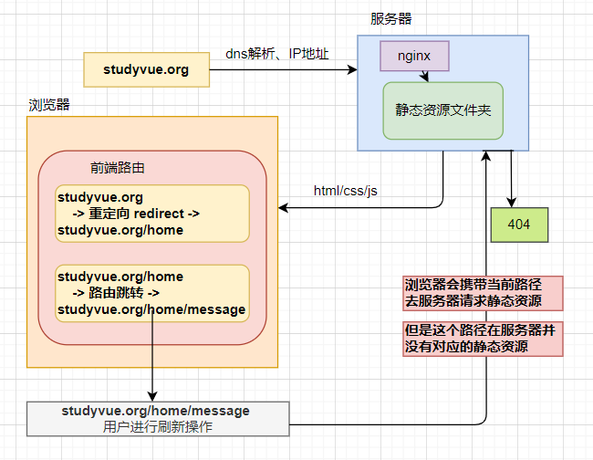 

  vue.config.js

  ```javascript
  module.exports = {
    configureWebpack: {
      devServer: {
        historyApiFallback: true
      }
    }
  }
  ```

  - boolean 值：默认是 false

    设置为 true，在刷新时，返回 404 错误时，会**自动返回 index.html 的内容**

  - object 类型的值，可以配置 `rewrites` 属性

    可以配置 `from` 来匹配路径，决定要跳转到哪一个页面

  服务器上时 **nginx 的配置**

  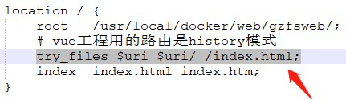 

- ##### `createWebHashHistory`：URL 的 hash 历史

  创建 hash 历史记录，用于**没有主机的 web 应用程序** (例如 file:// )，URL 从未被发送到服务器

  URL 的 hash 也就是锚点 (`#`)，本质上是改变 `window.location` 的 `href` 属性

  ```javascript
  import { createWebHashHistory } from 'vue-router'
  const routes = [
    { path: '/home', component: Home }
  ]
  const router = createRouter({
    routes,
    history: createWebHashHistory()
  })
  ```

   


### 路由元信息 meta

通过路由记录的 `meta` 属性，将**任意信息附加到路由上**，如过渡名称、谁可以访问路由等，供页面组件或路由钩子函数中使用

```javascript
{
  path: '/posts',
  component: PostsLayout,
  children: [
    {
      path: 'new',
      component: PostsNew,
      // 只有经过身份验证的用户才能创建帖子
      meta: { requiresAuth: true }
    },
    {
      path: ':id',
      component: PostsDetail,
      // 任何人都可以阅读文章
      meta: { requiresAuth: false }
    }
  ]
}
```

通过 `route.meta` 方法，获取路由记录中的 `meta` 字段（匹配到的父路由以及子路由所有 `meta` 字段的合并）

```javascript
router.beforeEach((to, from) => {
  if (to.meta.requiresAuth && !auth.isLoggedIn()) {
    return {
      path: '/login',
      // 保存所在的位置，以便以后再来
      query: { redirect: to.fullPath },
    }
  }
})
```

在  `<template>` 中，直接通过 `$route.meta` 获取

```html
<keep-alive v-if="$route.meta.isKeepAlive">
  <router-view/>
</keep-alive>
```

```javascript
{
	path:'/',
	name:'home',
	component:home,
	meta:{ isKeepAlive: true }
}
```

在 `setup` 中通过 `useRoute()` 获取路由对象来获取 `route.meta`


## 路由懒加载

可以把不同路由对应的组件分割成不同的代码块，然后当**路由被访问的时候才加载对应组件**，这样能提高首屏的渲染效率

`component` 可以传入一个组件，也可以**接收一个函数**，该**函数需要返回一个 Promise**，而 `import` 函数返回的就是一个 Promise

**只会在第一次进入页面时才会获取这个函数**，然后使用缓存数据

```javascript
const routes = [
  { path: '/', redirect: "/home" },
  { path: '/home', component: () => import("../pages/Home.vue") },
  { path: '/about', component: () => import("../pages/About.vue") }
]
```

分包后的文件没有很明确的名称，**webpack** 从 3.x 开始支持**对分包进行命名**（chunk name）

按照固定格式使用魔法注释

```javascript
const routes = [
  { path: '/', redirect: "/home" },
  { path: '/home', component: () => import(/* webpackChunkName: "home-chunk" */"../pages/Home.vue") },
  { path: '/about', component: () => import(/* webpackChunkName: "about-chunk" */"../pages/About.vue") }
]
```


## 路径参数

### 基本使用

很多时候需要将**给定匹配模式的路由映射到同一个组件**

例如可能有一个 User 组件，它应该对所有用户进行渲染，但是用户的 ID 是不同的

在 Vue Router 中，可以**在路径中使用一个动态字段**来实现，称之为**路径参数**，路径参数用冒号 `:` 表示

```javascript
{ 
  path: "/user/:username",
  component: () => import("../pages/User.vue") 
}
```

```html
<router-link :to="'/user/' + name">用户:{{ name }}</router-link>
```

**匹配多个参数**

```javascript
{ 
  path: "/user/:username/id/:id",
  component: () => import("../pages/User.vue") 
}
```

```html
<router-link :to="'/user/' + name + '/id/' + id">用户</router-link>
```


### 获取路径参数

通过 Vue Router 内部提供的**当前路由对象**的全局属性 `$route` 来获取，在 `setup` 中，全局属性通过 `useRoute()` 来获取

当一个路由被匹配时，路径参数的值将在每个组件中以 `route.params` 的形式暴露出来

```javascript
const route = useRoute();
console.log(route.params.username);
```

在 `<template>` 中，直接通过 `$route.params` 获取路径参数

```html
<h2>User: {{$route.params.username}}-{{$route.params.id}}</h2>
```

获取的 `route` 对象是**当前活跃的路由对象**

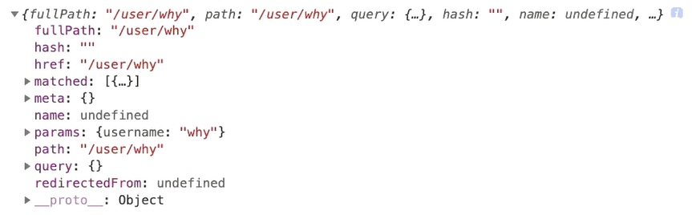 

当用户从 `/users/johnny` 导航到 `/users/jolyne` 时，**相同的组件实例将被重复使用**

两个路由都渲染同个组件，**不会被销毁再创建，会被复用**，也意味着**组件的生命周期钩子不会被调用**

可以**监听路由来实现页面数据的变化更新**

使用侦听器

```javascript
watch(
  () => route.params,
  async (toParams, previousParams) => {
    userData.value = await fetchUser(toParams.id)
  }
)
```

使用导航守卫

```javascript
onBeforeRouteUpdate(async (to, from) => {
  if (to.params.id !== from.params.id) {
    userData.value = await fetchUser(to.params.id)
  }
})
```


### 正则匹配

#### 自定义正则规则

在路径参数后，在**括号中为参数指定一个自定义的正则**

注意转义反斜杠 `\`  为 `\\`

```javascript
{ path: '/:orderId(\\d+)' }
```


#### 可重复的参数

用 `*`（0 个或多个）和 `+`（1 个或多个）将参数标记为可重复

```javascript
// 匹配 /one, /one/two, /one/two/three, 等
{ path: '/:chapters+' }

// 匹配 /, /one, /one/two, /one/two/three, 等
{ path: '/:chapters*' }

// 匹配 /, /1, /1/2, 等
{ path: '/:chapters(\\d+)*' }
```

这将提供一个**参数数组**，使用命名路由时也需要传递一个数组

```javascript
// /:chapters*
router.push({ name: 'chapters', params: { chapters: [] } })
router.push({ name: 'chapters', params: { chapters: ['a', 'b'] } })

// /:chapters+
// chapters 为空，报错
router.push({ name: 'chapters', params: { chapters: [] } })
```


#### 可选参数

使用 `?` 修饰符(0 个或 1 个)将一个参数标记为可选

```javascript
// 匹配 /users 和 /users/posva
{ path: '/users/:userId?' }

// 匹配 /users 和 /users/42
{ path: '/users/:userId(\\d+)?' }
```


#### 匹配所有路径（NotFound）

如果要匹配**任意路径**，可以使用自定义的路径参数 + 正则表达式

```javascript
const routes = [
  { path: "/", redirect: "/home" },
  { path: "/home", name: "home", component: () => import("../pages/Home.vue") },
  
  // 将匹配以 /user- 开头的所有内容，并将其放在 route.params.afterUser 下
  { path: "/user-:afterUser(.*)", name: "user", component: () => import("../pages/User.vue") },
  
  // 当其他路由都匹配不到时，就匹配 NotFound 页面，这个路由一定要放在最后
  // 将匹配所有内容并将其放在 route.params.pathMatch 下
  { path: "/:pathMatch(.*)*", name: "notFound", component: () => import("../pages/NotFound.vue") }
]
```

获取任意匹配的路径参数

```html
<h1>Not Found: {{ $route.params.pathMatch }}</h1>
```

```javascript
const route = useRoute();
console.log(route.params.afterUser);
```

**`/:pathMatch(.*)*`** 多一个 `*` 的写法会把**匹配到的路径变为数组**

区别在于解析的时候，是否解析 `/`

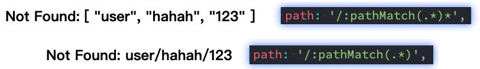 


### 严格匹配

- `sensitive`

  默认情况下，所有路由是不区分大小写的

  通过路由记录的 `sensitive` 属性，可以使路由匹配**区分大小写**，默认为 false，可以在路由级别上设置

  ```javascript
  // 将匹配 /users/posva 而非 /Users/posva
  { path: '/users/:id', sensitive: true }
  ```

  ```javascript
  const router = createRouter({
    history: createWebHistory(),
    routes: [
      { path: '/users/:id?' }
    ]
    sensitive: true
  })
  ```

- `strict`

  默认情况下，能匹配带有或不带有尾部 `\` 的路由

  通过路由记录的 `strict` 属性，可以严格检查**路径末尾是否有尾部斜线** `/`，默认为 false，可以在路由级别上设置

  ```javascript
  // 将匹配 /users, /User, 以及 /users/42 而非 /users/ 或 /users/42/
  { path: '/users/:id', strict: true }
  ```

  ```javascript
  const router = createRouter({
    history: createWebHistory(),
    routes: [
      { path: '/users/:id?' }
    ]
    strict: true
  })
  ```


## 路由嵌套

在路由记录的 `children` 属性中配置另一个路由数组，就像 `routes` 本身一样，可以根据需求，不断地**嵌套视图**

同样使用 `<router-view>` 渲染自己嵌套的路由

可以提供一个**空的嵌套路径**作为**子路由的默认路径**，可以配置默认的组件，也可以使用重定向， **重定向需要配置完整路由路径**

```javascript
const routes = [
  // 以 / 开头的为根路径
  { path: "/home", name: "home", component: () => import("../pages/Home.vue"),
    children: [
      { path: "", redirect: "/home/message" },
      // { path: "", component: () => import("../pages/HomeMain.vue") }
      { path: "message", component: () => import("../pages/HomeMessage.vue") },
      { path: "shops", component: () => import("../pages/HomeShops.vue") }
    ]
  }
]
```

```html
<!-- Home组件 -->
<router-link to="/home/message">消息</router-link>
<router-link to="/home/shops">商品</router-link>
<router-view></router-view>
```


## 路由跳转

在选项式 API 中，可以使用**路由实例全局对象 `$router`** ，实现路由跳转，**包含所有路由信息**

在组合式 API中，在 `setup` 函数中通过 **`useRouter` 来获取路由实例对象**

```javascript
import { useRouter } from 'vue-router'
const router = useRouter();
```


### 页面跳转

`router.push` 方法会向 history 栈添加一个新的记录，当点击浏览器后退按钮时，会回到之前的 URL

点击 `<router-link :to="...">` 相当于调用 `router.push(...)`

- 参数可以是一个**字符串路径**

  ```javascript
  router.push("/about")
  router.push('/users/eduardo')
  ```

  如果带有特殊字符，需要使用 `encodeURIComponent` 转换 uri 编码

  ```javascript
  const fullPath = encodeURIComponent(`/user?a=10&b=10`)
  router.push('/login?redirectUrl=' + fullPath)
  ```

- 参数可以是一个描述地址的**对象**

  参数对象中，如果**提供了 `path`**，**`params` 会被忽略**，**可以提供路由的 `name`** 或手写**完整的带有参数的 `path`**

  ```javascript
  // 字符串路径
  router.push({ path: '/users/eduardo' })
  
  // 查询参数 /users?name=eduardo&age=18
  router.push({ path: "/users", query: { name: "eduardo", age: 18 }})
  
  // 使用完整路径名
  router.push({ path: `/user/${username}` })
  
  // 命名的路由，并加上参数，让路由建立 url
  router.push({ name: 'user', params: { username: 'eduardo' } })
  
  // 可重复参数使用数组
  router.push({ name: 'user', params: { username: [] } })
  
  // 可选参数
  router.push({ name: 'user', params: { username: '' } })
  
  // 带hash参数 /about#team
  router.push({ path: '/about', hash: '#team' })
  ```

  **获取查询参数 `route.query`**

  ```html
  <h2>About: {{$route.query.name}}-{{$route.query.age}}</h2>
  ```

  ```javascript
  import { useRouter } from 'vue-router'
  const routerrouter = useRouter()
  console.log(route.query.name)
  console.log(route.query.age)
  // 带有查询参数的完整当前路由路径
  // currentRoute 是 ref 包装的数据类型
  console.log(router.currentRoute.value.fullPath)
  ```


### 页面替换

`router.replace` 方法在导航时不会向 history 添加新记录，而是取代了当前的条目

`<router-link :to="..." replace>` 等价于 `router.replace(...)`

```javascript
router.replace({ path: '/home' })
// 相当于
router.push({ path: '/home', replace: true })
```


### 历史跳转

- `router.go`：历史中前进或后退

  ```javascript
  import { useRouter } from 'vue-router'
  const router = useRouter()
  jumpToAbout() {
    // 向前，与 $router.forward 相同
    router.go(1)
    // 向后，与 $router.back 相同
    router.go(-1)
    // 向前三条记录
    router.go(3)
    // 如果没有那么多记录，静默失败
    router.go(-100)
    router.go(100)
  } 
  ```

- `router.back`：调用 `history.back()` 回溯历史。相当于 `router.go(-1)`
- `router.forward`：调用 `history.forward()` 在历史中前进。相当于 `router.go(1)`


## 命名视图

在**一个页面同时使用多个组件**，**多个组件同时存在一个路由之中**

在页面中要有**多个单独命名的 `<router-view>` 视图**，一个视图使用一个组件渲染，如果没有设置名字，默认为 `default`

```javascript
// components: { name1: 组件 } 形式
const routes = [
  { path: '/', name: 'login', components: { header: LoginHeader, main: Index } },
  { path: '/settings', name: 'settings', components: { default: Setting, helper: UserHelper } }
]
```

```html
<head>
  <router-view name="header"></router-view>
</head>
<main>
  <router-view name="main"></router-view>
</main>
<router-view></router-view>
```


## 重定向

路由的重定向通过路由记录的 `redirect` 属性配置，参数类型：

- 路径字符串

  ```javascript
  const routes = [{ path: '/home', redirect: '/' }]
  ```

- 命名的路径对象

  ```javascript
  const routes = [{ path: '/home', redirect: { name: 'homepage' } }]
  ```

- 函数，动态返回重定向目标

  返回字符串路径

  ```javascript
  {
  	path: '/home',
  	redirect: to => {
  	  return '/home/main'
  }
  ```

  返回路径对象

  ```javascript
  {
  	path: '/search/:searchText',
  	redirect: to => {
  	  return { path: '/search', query: { q: to.params.searchText } }
  }
  ```

  参数 `to`  就是当前路由对象 `route`

**导航守卫仅仅应用重定向的目标上**

在写 `redirect` 的时候，可以省略 `component` 配置，因为它从来没有被直接访问过，没有组件要渲染

但是如果一个路由记录有 `children` 和 `redirect` 属性，它也应该有 `component` 属性

```javascript
{
  path: 'home', component: () => import("../pages/Home.vue"),
    redirect: '/home/main'
    children: [
      { path: "main", component: () => import("../pages/HomeMain.vue") },
      { path: "shops", component: () => import("../pages/HomeShops.vue") }
    ]
}
```

**起跳处提供的 `name`、`query`、`hash`、`params ` 会传递到重定向目标**上

如果 `redirect ` 也提供了这些属性，就使用 `redirect` 提供的

```javascript
const routes = [{ path: '/user', redirect: { name: 'userInfo', params: { username: 'jack' } } }]
```

也可以**重定向到相对位置**

```javascript
// 将 /users/123/posts 重定向到 /users/123/profile
{ 
  path: '/users/:id/posts',
  redirect: to => {
    // return { path: 'profile'}
    // 相对位置不以`/`开头
    return 'profile'
  }
}
```


## 路由别名

使用路由记录的 `alias` 属性定义路由的别名

使得路由可以简写，可以自由地将 UI 结构映射到一个任意的 URL，而**不受配置的嵌套结构的限制**

如果业务场景很复杂，顺着业务已经嵌套了很多层的路由，路由操作很复杂。如果重新开一个顶层路由，路由的 URL 又会不符合原本的业务，使用别名就可以解决这种情况

```javascript
{ path: '/home', component: Home,
  children: [
    { path: 'about', component: HomeAbout,
     children: [
       { path: 'info', component: HomeInfo }
     ]
    }
  ]
},
{ path: '/detail', component: HomeDetail, alias: '/home/about/info/detail' }
```

`/a` 的别名是 `/b`，意味着，当用户访问 `/b` 时，URL 会保持为 `/b`，但是路由匹配则为 `/a`，就像用户访问 `/a` 一样

```javascript
const routes = [
  { path: '/', component: Homepage, alias: '/home' },
  { path: '/user', component: Userpage, 
   children: [
     // 绝对地址 /foo
     { path: 'foo', component: Foo, alias: '/foo' },
     // 相对地址 (/user/bar-alias)
     { path: 'bar', component: Bar, alias: 'bar-alias' },
     // 多个别名，相对地址和绝对地址可以混合
     { path: 'baz', component: Baz, alias: ['/baz', 'baz-alias'] },
     // 默认显示的页面可设置别名为空
     { path: 'default', component: Default, alias: '' },
     // 嵌套路由
     { path: 'nested', component: Nested, alias: 'nested-alias',
      children: [
        { path: 'foo', component: NestedFoo }
      ]
     }
   ]
  }
]
```

如果**路由有参数**，确保在任何**绝对别名中包含**它们

```javascript
{
  path: '/users/:id', component: UsersByIdLayout,
  children: [
    // 为这 3 个 URL 呈现 UserDetails
    // - /users/24
    // - /users/24/profile
    // - /24
    { path: 'profile', component: UserDetails, alias: ['/:id', ''] },
  ]
}
```

**重定向和别名的区别**

**重定向**是进入 `a` ，然后自动跳转到 `b`，`a` 和 `b` 都是真实的路由地址，这个过程经过两地址，只是 `a` **不会被记录**

**别名**是进入 `a` ，实际上是进入 `b`，`a` 不是真实的路由地址，这个过程自始至终都只是在 `b` 地址


## 路由 props

用**组件的 `props` 接收路由的参数**

通过设置路由记录的 `props` 属性，使用组件的 `props` 进行参数传递

路由 `props` 属性参数

- 当 `props` 设置为 `true` 时，`route.params` 将被设置为组件的 `props`

  ```javascript
  { path: '/user/:id', component: User, props: true }
  ```

  ```javascript
  const props = defineProps(['id']);
  console.log(props.id);
  ```

  对于有命名视图的路由，必须为每个命名视图定义 `props` 配置

  ```javascript
  {
    path: '/user/:id',
    components: { default: User, sidebar: Sidebar },
    props: { default: true, sidebar: false }
  }
  ```

- 当 `props` 是一个对象时，它将原样设置为组件 `props`，当 `props` 是静态的时候很有用

  ```javascript
  { path: '/hello', component: Hello, props: { name: 'World' } }
  ```

  ```javascript
  const props = defineProps({ name: { type: String, default: 'Vue' }});
  console.log(props.name)
  ```
  
- 创建一个返回 `props` 的函数，将参数转换为其他类型，将静态值与基于路由的值相结合等等

  ```javascript
  {
    path: '/search',
    component: SearchUser,
    props: route => ({ query: route.query.q })
  }
  ```

  

## 导航守卫

vue-router 提供的导航守卫主要用来**通过跳转或取消的方式守卫导航**

有很多方式植入路由导航中：全局的，单个路由独享的，或者组件级的


### 全局前置 beforeEach

使用 `router.beforeEach` 注册一个全局前置守卫

在**路由跳转前触发**，常用于**登录验证**

当一个**导航触发**时，**全局前置守卫按照创建顺序调用**。守卫是异步解析执行，此时**导航在所有守卫 resolve 完之前一直处于等待中**

回调函数**参数**：

- `to`：即将进入的路由 Route 对象
- `from`：即将离开的路由 Route 对象
- `next`：在 Vue2 中是通过 `next` 函数来决定如何进行跳转的，Vue3 中是通过返回值来控制的，**不再推荐使用** `next` 函数

回调函数**返回值**：

- **不返回 或者 `undefined`**：进行默认导航

- **返回 `false`**：取消当前导航

  ```javascript
  const router = createRouter({ ... })
  router.beforeEach((to, from) => {
    if (to.path !== "/login") {
      const token = window.localStorage.getItem("token");
      if (!token) {
        return "/login"
      }
    }
  })
  ```

- **返回一个路由地址**：类似调用 `router.push()` 一样，当前的导航被中断，进行一个新的导航

  - 可以是一个 **`string` 类型的路径**
  - 可以是一个**路由对象**，包含 `path`、`query`、`params` 等信息 `router.push({path: "/login", query: ....})`
  
  ```javascript
  router.beforeEach(async (to, from) => {
     if (!isAuthenticated && to.name !== 'Login') {
       return { name: 'Login' }
     }
   })
  ```


### 全局解析 beforeResolve

使用 `router.beforeResolve` 注册一个全局解析守卫

`router.beforeResolve` 是获取数据或执行任何其他操作（如果用户无法进入页面时你希望避免执行的操作）的理想位置

接受的参数和返回值与  `router.beforeEach` 一致

```javascript
router.beforeResolve(async to => {
  if (to.meta.requiresCamera) {
    try {
      await askForCameraPermission()
    } catch (error) {
			// ... 处理错误，然后取消导航
      return false
    }
  }
})
```

全局前置守卫 `beforeEach` 和全局解析守卫 `beforeResolve` 的区别

- 两者都是在**路由跳转之前触发**

- 全局解析守卫 `beforeResolve` 是在**导航被确认之前**，在**所有组件内守卫和异步路由组件被解析之后**触发

  `beforeResolve` 是在**组件被解析之后调用**

  在 `beforeEach` 和 **组件内 `beforeRouteEnter` 或 `beforeRouteUpdate` 之后**，**`afterEach` 之前**调用


### 全局后置 afterEach

使用 `router.afterEach` 注册全局后置钩子，在**路由跳转完成之后触发**，**不会改变导航**

 `router.afterEach` 的参数有 `to` 和 `from` ，第三个参数 `failure` 可选

发生在 **`beforeEach` 和 `beforeResolve` 之后**，**`beforeRouteEnter` 之前**

 `router.afterEach` 已经确定了导航，不能更改导航，可以做一些分析更改页面等功能

```javascript
router.afterEach((to,from) => {
  window.scrollTo(0,0)
})
```


### 路由独享 beforeEnter

在路由配置上定义 `beforeEnter` 守卫

`beforeEnter` 守卫**只在进入路由时触发**，不会在 `params`、`query` 或 `hash` 改变时触发

只有在**从一个不同的路由导航时**，才会被触发

路由独享守卫 `beforeEnter` 与全局前置守卫 `beforeEach` 的参数和用法一致

```javascript
{
	path: "/category/:catId",
	name: 'category',
	component: Category,
	beforeEnter: (to, from) => {
	  // 如果不是正确的分类，跳转到 NotFound 的页面
	  if (!["0", "1", "2", "3", "4"].includes(to.params.catId)) { 
	    return {
	      name: "NotFound",
	      params: { pathMatch: to.path.split("/").slice(1) },
	      query: to.query,
	      hash: to.hash,
	    };
	  }
}
```


### 组件前置 beforeRouteEnter

**路由进入之前调用**，**不能获取组件 `this` 实例** ，因为路由在进入组件之前，组件实例还没有被创建

全局 `beforeEach` 和独享守卫 `beforeEnter` 之后，全局 `beforeResolve` 和全局 `afterEach` 之前调用

可以通过 `next` 参数传递一个回调，会在导航被确认的时候执行回调，把组件实例作为回调方法的参数

```javascript
onBeforeRouteEnter(to, from, next) {
 getPost(to.params.id, (err, post) => {
   next(vm => vm.setData(err, post))
 })
}
```

并没有提供 `beforeRouteEnter` 的组合式函数的导航守卫


### 组件更新 beforeRouteUpdate

在**路由改变**，但又**复用同一个组件**时调用，可以通过 `this` 访问实例

组件实例会被复用的场合，例如**动态参数、`query `、`hash` 改变**时，而不是 `path` 发生改变时，该守卫会被调用

在 `setup` 函数中，使用 `onBeforeRouteUpdate` 函数

```javascript
onBeforeRouteUpdate(async (to, from) => {
  if (to.params.id !== from.params.id) {
    userData.value = await fetchUser(to.params.id)
  }
})
```


### 组件失活 beforeRouteLeave

在导航离开渲染该组件的对应路由时调用，可以访问组件实例 `this`

在 `setup` 函数中，使用 `onBeforeRouteLeave` 函数

```javascript
onBeforeRouteLeave((to, from) => {
  const answer = window.confirm(
    'Do you really want to leave? you have unsaved changes!'
  )
  // 取消导航并停留在同一页面上
  if (!answer) return false
})
```


### 导航解析流程

- 导航被触发
- 在失活的组件里调用 `beforeRouteLeave` 守卫
- 调用全局的 `beforeEach` 守卫
- 在重用的组件里调用 `beforeRouteUpdate` 守卫(2.2+)
- 在路由配置里调用 `beforeEnter`
- 解析异步路由组件
- 在被激活的组件里调用 `beforeRouteEnter`
- 调用全局的 `beforeResolve` 守卫(2.5+)
- 导航被确认
- 调用全局的 `afterEach` 钩子
- 触发 DOM 更新
- 调用 `beforeRouteEnter` 守卫中传给 `next` 的回调函数，创建好的组件实例会作为回调函数的参数传入

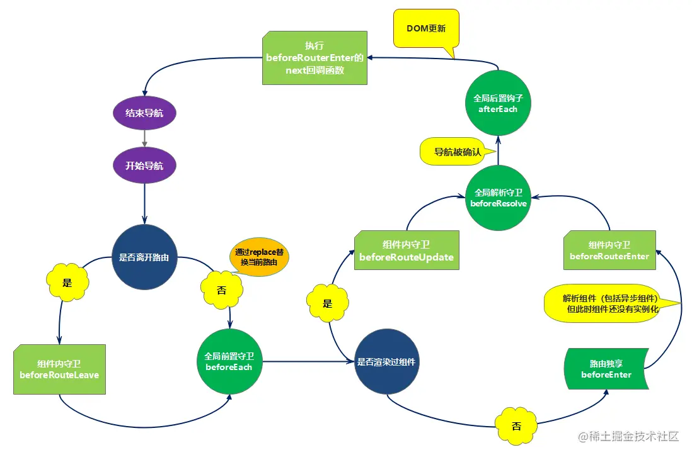 


## 路由插槽

### router-link 插槽

`<router-link>` 使用 `v-slot` 的方式来灵活定制渲染的内容

> 在 vue-router 3.x 的时候，`<router-link>` 有一个 `tag` 属性，可以决定 `<router-link>` 到底渲染成什么元素
>
> 在 vue-router 4.x 开始，该属性被移除了，替换为更灵活的 `v-slot` 的方式

使用 `custom` 表示**整个元素要自定义**，如果不写，那么自定义的内容会被包裹在一个 `<a>` 元素中

使用 `v-slot` 来通过**作用域插槽**来**获取内部传给的值**

- `href`：解析后的 URL
- `route`：解析后的规范化的 route 对象
- `navigate`：触发导航的函数
- `isActive`：是否匹配的状态
- `isExactActive`：是否是精准匹配的状态

```html
<router-link to="/foo" v-slot="{ href, route, navigate, isActive, isExactActive }"></router-link>
```

```html
<router-link to="/home" v-slot="props" custom>
  <button @click="props.navigate">{{props.href}}</button>
  <button @click="props.navigate">哈哈哈</button>
  <span :class="{'active': props.isActive}">{{props.isActive}}</span>
  <span :class="{'exact-active': props.isExactActive}">{{props.isExactActive}}</span>
</router-link>
```

组合式函数 `useLink` 公开了 `router-link` 组件在导航时其内部所产生的行为与信息

接收的参数与 `<router-link>` 所接收的 `props` 完全一致

可以通过 `useLink` 对 `<router-link>`  再封装，来应对不同形式链接的跳转，例如内部链接、外部链接(第三方链接)、是否新窗口打开等

```html
<button class="my-link" :class="{active: isActive, exact-active: isExactActive}" @click="navigate">
  {{ route.params.city }}
</button>
```

```javascript
import { RouterLink, useLink } from 'vue-router'
// RouterLink 组件
const props = defineProps({...RouterLink.props})
const { navigate, href, route, isActive, isExactActive } = useLink(props)
```

```html
<my-link to="{name:'city', params:{city: 'London'}}"></my-link>
```


### router-view 插槽

`<router-view>` 也提供一个插槽，可以使用 `<transition> ` 、 `<keep-alive> ` 、`<suspense>` 组件来包裹路由组件

作用域**插槽传给内部的值**

- `Component`：要渲染的组件
- `route`：解析出的标准化路由对象

```html
<router-view v-slot="props">
  <template v-if="props.Component">
  	<transition :name="route.meta.transition || 'fade'">
  	  <keep-alive>
  	    <suspense>
  	      <component :is="props.Component"></component>
  	      <template #fallback>
  	        正在加载...
  	      </template>
  	    </suspense>
  	  </keep-alive>
  	</transition>
  </template>
</router-view>
```

**懒加载的组件不会触发 `<suspense> `**，但是仍然可以有异步组件作为后代，这些组件可以照常触发 `<suspense>`


## 动态路由

### 添加路由

某些情况需要动态的来添加 / 删除路由，比如**根据用户不同的权限，注册不同的路由**

使用 `router.addRoute` 方法

```javascript
// 添加顶级路由对象
router.addRoute({ path: "/category", component: () => import("../pages/Category.vue") });
```

**添加子路由**对象，通过 **`name` 进行匹配**

```javascript
router.addRoute({ name: 'admin', path: '/admin', component: Admin })
router.addRoute('admin', { path: 'settings', component: AdminSettings })
```

在导航守卫中添加路由

```javascript
router.beforeEach(to => {
  if (!hasNecessaryRoute(to)) {
    router.addRoute(generateRoute(to))
    // 触发重定向
    return to.fullPath
  }
})
```


### 删除路由

1. 方法一：添加一个 `name` 相同的路由

   ```javascript
   router.addRoute({ path: '/about', name: 'about', component: About })
   router.addRoute({ path: '/other', name: 'about', component: Home })
   ```

2. 方法二：通过 `removeRoute` 方法，传入路由的名称

   ```javascript
   router.addRoute({ path: '/about', name: 'about', component: About })
   route.removeRoute('about');
   ```

3. 方法三：调用 `addRoute` 方法的返回值回调

   ```javascript
   const removeRoute = router.addRoute({ path: '/about', name: 'about', component: About })
   removeRoute()
   ```

- ##### 检查路由是否存在：`router.hasRoute`

- ##### 获取包含所有路由记录的数组：`router.getRoutes`


### 动态注册路由

**根据不同的用户角色注册不同的路由**

1. 根据不同的用户权限，获取用户菜单
2. 根据不同角色的菜单，动态生成菜单与路由的映射的数组（获取的菜单数据需要包含路由的 url）
3. 将生成的数组注册进路由对象中（可以在导航守卫注册，也可以在用户登录成功后注册）

根据服务器返回的菜单（包含路由 url），动态生成路由数组

```javascript
import { RouteRecordRaw } from 'vue-router'

// 默认菜单项，作为进入首页默认显示的内容
let firstMenu: any = null

export function mapMenusToRoutes(userMenus: any[]): RouteRecordRaw[] {
  
  const allRoutes: RouteRecordRaw[] = []
  
  // 使用Webpack的require.context方法，加载文件夹内匹配的所有文件信息
  // require.context参数：参数1：文件夹，参数2：是否递归查找，参数3：正则表达式匹配查找的文件
  const routeFiles = require.context('../router/main', true, /\.ts/)
  
  // routeFiles.keys() 获取文件路径列表(相对路径)，进行遍历导入
  routeFiles.keys().forEach((key) => {
  const route = require('../router/main' + key.split('.')[1])
    allRoutes.push(route.default)
  })
  
  // 根据菜单获取需要添加的routes
  // 如果是一级菜单（type === 1），递归查找二级子菜单
  // 如果是二级菜单（type === 2），则添加进路由数组
  const _recurseGetRoute = (menus: any[]) => {
    for (const menu of menus) {
      if (menu.type === 2) {
        const route = allRoutes.find((route) => route.path === menu.url)
        if (route) routes.push(route)
        if (!firstMenu) {
          firstMenu = menu
        }
      } else {
        _recurseGetRoute(menu.children)
      }
    }
  }
  _recurseGetRoute(userMenus)
  
  return routes
}
```

登录成功后，通过返回的菜单，动态注册路由

```javascript
import { mapMenusToRoutes } from '@/utils/map-menus'
const loginModule {
  state() {
    return {
      // 其余省略
      userMenus: []
    }
  },
  mutations: {
    // 其余省略
    changeUserMenus(state, userMenus: any) {
      state.userMenus = userMenus
      // 注册动态路由
      const routes = mapMenusToRoutes(userMenus)
      routes.forEach((route) => {
        // 将routes 注册到 router.main.children
			  router.addRoute('main', route)
			})
    }
  },
  action: {
    // 登录
    accountLoginAction({ commit }, payload) {
      // 登录，请求用户菜单过程省略
      // const loginResult = ....
      // const userMenus = ....
      commit('changeUserMenus', userMenus)
      // 用户菜单保存到本地（页面刷新也能获取到）
      localCache.setCache('userMenus', userMenus)
      router.push('/main')
    },
    // 已登录无需登录的场合，和用户页面刷新的场合，加载本地存储内容
    loadLocalLogin({ commit }) {
      // 登录信息等省略
      // 用户菜单
      const userMenus = localCache.getCache('userMenus')
			if (userMenus) {
			  commit('changeUserMenus', userMenus)
			}
    }
  }
}
```

注意，动态生成路由方法一定要放到全局注册路由之前调用

```javascript
export function setupStore() {
  store.dispatch('login/loadLocalLogin')
}
```

```javascript
setupStore()
app.use(router)
```


## 路由对象

### 全局路由对象 router

`router` / `$router` 是全局路由的实例，组合式 API 通过 `useRouter()` 来获取

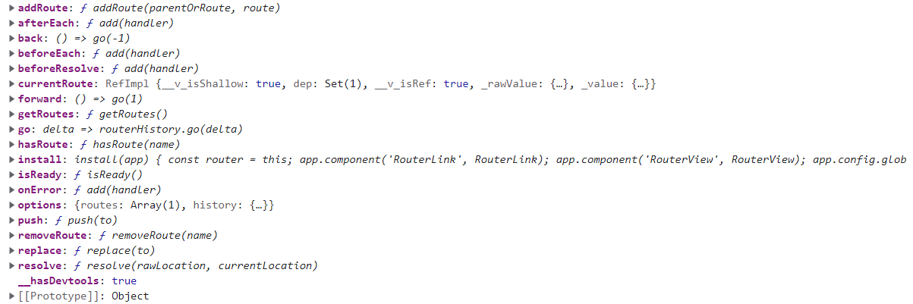 

**全局路由对象属性**

- `currentRoute`：当前路由地址，只读的 `ref` **响应式对象**，相当于当前路由对象 `route` / `$route`

  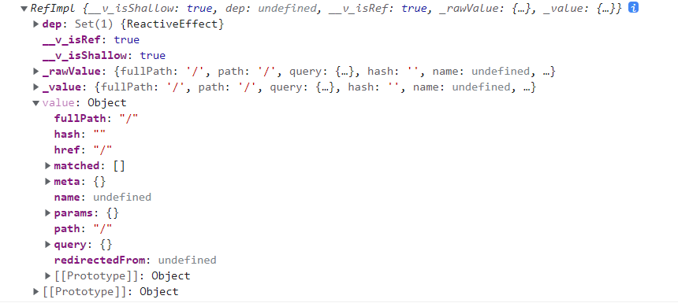 

  ```javascript
  const routerrouter = useRouter()
  console.log(router.currentRoute.value.fullPath)
  ```

- `options`：创建全局路由对象 `router` 时传递的**原始配置对象**（`routes` 数组、`history` 模式），只读

  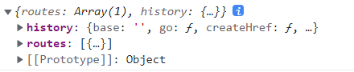 


### 当前路由对象 route

`route` / `$route` 是当前路由的实例，组合式 API 通过 `useRoute()` 来获取

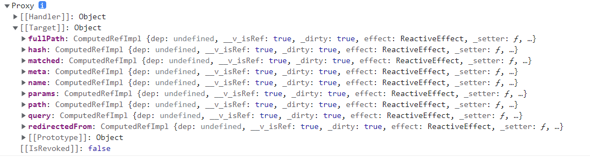 

- `fullPath`：完整当前路由路径，包括 `path`、 `query` 和 `hash`

- `hash`：URL 的 `hash` 部分，总是以 `#` 开头，如果没有，则为空字符串

- `query`：URL 的查询参数对象

- `matched`：每一级匹配的路由，生成 route 路由对象的数组

   

- `meta`：匹配到的父路由以及子路由所有 `meta` 字段的合并

- `name`：路由名称

- `params`：路径参数

- `path`：路由地址

- `redirectedFrom`：重定向跳转来的路由的对象


# 状态管理 Vuex

## 认识 Vuex

在开发中，应用程序需要处理各种各样的数据，这些数据需要保存在应用程序中的某一个位置，对于这些数据的管理就称之为是状态管理

当应用遇到**多个组件共享状态**时，单向数据流的简洁性很容易被破坏

- 多个视图依赖于同一状态
- 来自不同视图的行为需要变更同一状态

对于一些简单的状态，确实可以通过 `props` 的传递或者 `provide` 的方式来共享状态

但是对于复杂的状态管理来说，显然单纯通过传递和共享的方式是不足以解决问题的，比如兄弟组件共享数据等

Vuex 是一个专为 Vue 应用程序开发的**状态管理模式 + 库**

它采用集中式存储管理应用的所有组件的状态，并以相应的规则保证状态以一种可预测的方式发生变化

- 将组件的内部状态抽离出来，以一个**全局单例**的方式来管理

- 这种模式下，组件树构成了一个巨大的 “视图 View” ，不管在树的哪个位置，任何组件都能获取状态或者触发行为

- 通过定义和隔离状态管理中的各个概念，并通过强制性的规则来维护视图和状态间的独立性

  代码会变得更加结构化和易于维护、跟踪

 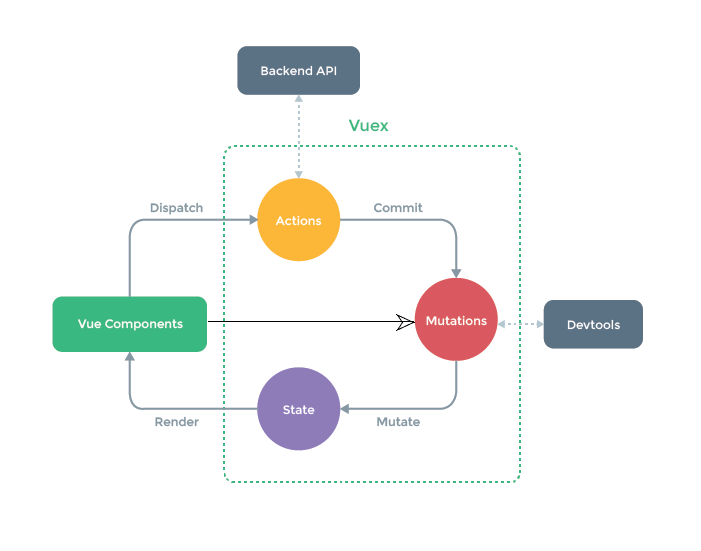

Vuex 使用**单一状态树**

- 用一个对象就包含了全部的应用层级的状态，意味着，每个应用将仅仅包含一个 `store` 实例

  如果状态信息是保存到多个 `store` 对象中的，那么之后的管理和维护等等都会变得特别困难

- 单状态树和模块化并不冲突，Vuex 允许将 `store` 分割成模块（module）

安装 vuex

```bash
npm install vuex
```


## Store

每一个 Vuex 应用的核心就是 `store`（仓库），`store` 本质上是一个容器，它包含着应用中大部分的状态 `state`

Vuex 和单纯的全局对象的区别

- vuex 的**状态**存储是**响应式的**

  当 Vue 组件从 `store` 中读取状态 `state` 的时候，若 `store` 中的状态 `state` 发生变化，那么相应的组件也会被更新

- 不能直接改变 `store` 中的状态

  改变 `store` 中的状态 `state` 的唯一途径就是**显式地提交** ( commit ) `mutation`，这样可以方便的跟踪每一个状态的变化

**创建 `Store`**

```javascript
import { createStore } from "vuex"
const store = createStore({
  state() {
    return {
      count: 100
    }
  },
  mutations: {
    increment(state) {
      state.count++
    }
  },
});

export default store;
```

**在 `app` 中通过插件安装**

```javascript
createApp(App).use(store).mount('#app')
```

**组件中使用 `store`**

- 在模板中使用

  ```html
  <template>
    <h2>App:{{ $store.state.counter }}</h2>
    <button @click="increment">+1</button>
  </template>
  ```

- 在选项 api 中使用：`$store`

  ```javascript
  methods: {
    increment() {
      this.$store.commit("increment")
    }
  }
  ```

- 在 `setup` 中使用：`useStore()`

  ```javascript
  import { useStore } from 'vuex'
  setup() {
    const store = useStore()
    const sCounter = computed(() => store.state.counter)
    return {
      sCounter
    }
  }
  ```


## State

### 基本使用

 vuex 中的 `state` 和 vue 实例中的 `data` 遵循相同的规则

```javascript
const store = createStore({
  state() {
    return {
      count: 100
    }
  }
});
export default store;
```

由于 Vuex 的状态存储是**响应式**的，从 `store` 实例中读取状态，最简单的方法就是在**计算属性中返回某个状态**

```javascript
const store = useStore()
const count = computed(() => store.state.count)
```

Vuex 的数据**保存在内存中**，如果用户**刷新页面**，数据会从**内存消失**掉


### mapState 

使用 **`mapState` 辅助函数**帮助生成计算属性

- ##### 在 `computed` 选项中使用 `mapState `

  参数为**数组类型**，可以使用**展开运算符**与其他的 `computed` 混在一起

  ```html
  <h2>{{ counter }}</h2>
  <h2>{{ name }}</h2>
  ```

  ```javascript
  computed: {
    fullName() {
      return "Kobe Bryant"
    },
    ...mapState(["counter", "name"])
  }
  ```

  参数为**对象类型**，可以自定义名称

  ```html
  <h2>{{ sCounter }}</h2>
  <h2>{{ sName }}</h2>
  ```

  ```javascript
  computed: {
    fullName() {
      return "Kobe Bryant"
    },
    ...mapState({
      sCounter: state => state.counter,
      // 等同于 sName: state => state.name
      sName: 'name',
      // 如果需要使用this，必须使用常规函数
      countPlusLocalState (state) {
        return state.counter + this.localCount
      }
    })
  }
  ```

- ##### 在 `setup` 中使用 `mapState`

  **单独获取**

  ```html
  <h2>{{ sCounter }}</h2>
  <h2>{{ sName }}</h2>
  ```

  ```javascript
  setup() {
    const store = useStore()
    const sCounter = computed(() => store.state.counter)
    const sName = computed(() => store.state.name)
    return {
      sCounter,
      sName
    }
  }
  ```

  **函数封装写法**

  `mapState` **返回的对象存放的是函数**，使用数组参数写法获取后还需要遍历处理

  ```javascript
  import { computed } from 'vue'
  import { mapState, useStore } from 'vuex'
  export function useState(mapper) {
    const store = useStore()
    // 获取到对应的对象的functions: {name: function, age: function}
    const storeStateFns = mapState(mapper)
    // 对数据进行转换
    const storeState = {}
    Object.keys(storeStateFns).forEach(fnKey => {
      const fn = storeStateFns[fnKey].bind({$store: store})
      storeState[fnKey] = computed(fn)
    })
    return storeState
  }
  ```

  ```javascript
  setup() {
    // 数组参数
    const storeState = useState(["counter", "name"])
    // 对象参数
    const storeState2 = useState({
      sCounter: state => state.counter,
      sName: state => state.name
    })
    return {
      ...storeState,
      ...storeState2
    }
  }
  ```


## Getter

### 基本使用

有时候需要从 `store` 中的 `state` 中派生出一些状态，可能需要经过变化后来使用，这个时候可以使用 `getters`

Vuex 允许在 `store` 中定义 `getter`（可以认为是 `store` 的**计算属性**）

**`store` 中定义的参数类型**：**`getter(state, getters) {}`**

- `state`：状态对象
- `getters`：等同于 `store.getters`

**模块中定义的参数类型**：**`getter(state, getters, rootState, rootGetters) {}`**

- `state`：模块的局部状态
- `getters`：模块的局部状态 `getters`
- `rootState`：全局 `state`，等同于 `store.state`
- `rootGetters`：所有 `getters`，等同于 `store.getters`

`getter` 可以**返回一个函数**，那么在使用的地方相当于可以**调用这个函数**

```javascript
const store = createStore({
  state() {
    return {
      counter: 0,
      books: [
        { name: "vue", count: 2, price: 110 },
        { name: "react", count: 3, price: 120 },
        { name: "webpack", count: 4, price: 130 }
      ]
    },
    getters: {
      // 接受 state 参数
      totalPrice(state) {
        let totalPrice = 0;
        for (const book of state.books) {
          totalPrice += book.count * book.price
        }
        return totalPrice
      },
      
    	// 接受 state 和 getter 参数
    	discountPrice(state, getter) {
    	  return getters.totalPrice * 0.8
    	},
        
    	// 返回一个函数
    	totalPriceCountGreaterN(state, getter) {
    	  return function(n) {
    	    let totalPrice = 0
    	    for (const book of state.books) {
    	      if (book.count > n) {
    	        totalPrice += book.count * book.price
    	      }
    	    }
    	  }
    	  return totalPrice
    	}
    }
  }
});
export default store;
```

```html
<h2>总价: {{ $store.getters.totalPrice }}</h2>
<h2>折扣价: {{ $store.getters.discountPrice }}</h2>
<h2>数量大于2的价格: {{ $store.getters.totalPriceCountGreaterN(2) }}</h2>
```


### mapGetters

- ##### 在 `computed` 选项中使用 `mapGetters`

  参数为**数组类型**

  ```html
  <h2>{{ ageInfo }}</h2>
  <h2>{{ heightInfo }}</h2>
  ```

  ```javascript
  import { mapGetters } from 'vuex'
  export default {
    computed: {
      ...mapGetters(["nameInfo", "ageInfo"])
    }
  }
  ```

  参数为**对象类型**

  ```html
  <h2>{{ sNameInfo }}</h2>
  <h2>{{ sAgeInfo }}</h2>
  ```

  ```javascript
  import { mapGetters } from 'vuex'
  export default {
    computed: {
      ...mapGetters({
        sNameInfo: "nameInfo",
        sAgeInfo: "ageInfo"
      })
    }
  }
  ```

- ##### 在 `setup` 中使用 `mapGetters`

  **单独获取**

  ```html
  <h2>{{ sNameInfo }}</h2>
  <h2>{{ sAgeInfo }}</h2>
  ```

  ```javascript
  setup() {
    const store = useStore()
    const sNameInfo = computed(() => store.getters.nameInfo)
    const sAgeInfo = computed(() => store.getters.ageInfo)
    return {
      sNameInfo,
      sAgeInfo
    }
  }
  ```

  **函数封装方法**

  ```javascript
  import { computed } from 'vue'
  import { mapGetters, useStore } from 'vuex'
  
  export function useGetters(mapper) {
    const store = useStore()
    // 获取到对应的对象的functions: {name: function, age: function}
    const storeStateFns = mapGetters(mapper)
    // 对数据进行转换
    const storeState = {}
    Object.keys(storeStateFns).forEach(fnKey => {
      const fn = storeStateFns[fnKey].bind({$store: store})
      storeState[fnKey] = computed(fn)
    })
    return storeState
  }
  ```

  ```javascript
  setup() {
    const storeGetters = useGetters(["nameInfo", "ageInfo"])
    return {
      ...storeGetters
    }
  }
  ```


## Mutation

### 基本使用

**更改 `store` 中的状态**的唯一方法是**提交 `mutation`**

`mutation` **必须是同步函数**

**参数类型**：`mutation(state, payload) {}`

- `state`：**状态对象**，**在模块中是模块的局部状态**

  ```javascript
  mutations: {
    increment(state) {
      state.count++
    },
    decrement(state) {
      state.count--
    }
  }
  ```

  ```javascript
  methods: {
    increment() {
      this.$store.commit("increment")
    },
    decrement() {
      this.$store.commit("decrement")
    }
  }
  ```

- `payload`：**额外的参数**（载荷），可选

  向 `store.commit` 和 `mutation` 函数传入额外的参数，即 `mutation` 的载荷（payload）

  ```javascript
  mutations: {
    incrementN(state, payload) {
      // state.counter += payload
      state.counter += payload.n
    }
  }
  ```

  ```javascript
  methods: {
    addTen() {
      // this.$store.commit('incrementN', 10)
      this.$store.commit('incrementN', {n: 10, name: "why", age: 18})
    }
  }
  ```

提交 `mutation` 的另一种方式是**使用包含 `type` 属性的对象**

```javascript
methods: {
  addTen() {
    this.$store.commit({
      type: 'incrementN',
      n: 10, 
      name: "why", 
      age: 18
    })
  }
}
```

使用**常量替代 `mutation` 事件类型**

```javascript
export const INCREMENT_N = "increment_n"
```

```javascript
mutations: {
  [INCREMENT_N](state, payload) {
    state.counter += payload.n
  }
}
```

```javascript
methods: {
  addTen() {
    this.$store.commit({
      type: INCREMENT_N,
      n: 10
    })
  }
}
```


### mapMutations

可以借助于辅助函数 `mapMutations`，帮助快速**映射到对应的方法中**

- 在 `methods` 选项中使用 `mapMutations`

  参数为**数组类型**

  ```javascript
  methods: {
    ...mapMutations(["increment", "decrement", INCREMENT_N])
  }
  ```

  ```html
  <button @click="increment">+1</button>
  <button @click="decrement">-1</button>
  <button @click="increment_n({n: 10})">+10</button>
  ```

  参数为**对象类型**

  ```javascript
  methods: {
    ...mapMutations({
      add: "increment"
    })
  }
  ```

  ```html
  <button @click="add">+1</button>
  ```

- 在 `setup` 中使用 `mapMutations`

  ```javascript
  setup() {
    const storeMutations = mapMutations(["increment", "decrement", INCREMENT_N])
    return {
      ...storeMutations
    }
  }
  ```

  ```html
  <button @click="increment">+1</button>
  <button @click="decrement">-1</button>
  <button @click="increment_n({n: 10})">+10</button>
  ```


## Action

### 基本使用

`action` 类似于 `mutation`，不同在于，**`action` 提交的是 `mutation`，而不是直接变更状态**，`action` **可以包含任意异步操作**

`action` 函数接受一个与 `store` 实例具有相同方法和属性的 **`context` 对象**，所以可以从其中获取到 **`commit` 方法来提交一个 `mutation`**，或者通过 `context.state` 和 `context.getters` 来获取 `state` 和 `getters`

在组件中，使用 `store` 上的 **`dispatch` 函数对 `action` 进行分发**

**参数类型**：

**`action(context, payload) {}`** 

**`action({ state, rootState, commit, dispatch, getters, rootGetters }, payload) {}`**

- `context`：

  - `state`：等同于 `store.state`，在**模块中则为局部状态**
  - `rootState`：等同于 `store.state`，**只存在于模块中**
  - `commit`：等同于 `store.commit`
  - `dispatch`：等同于 `store.dispatch`
  - `getters`：等同于 `store.getters`
  - `rootGetters` ：等同于 `store.getters`，**只存在于模块中**

  ```javascript
  mutations: {
    increment(state) {
      state.counter++;
    }
  }
  ```

  ```javascript
  actions: {
    incrementAction(context) {
      setTimeout(() => {
        context.commit('increment')
      }, 1000);
    }
  }
  ```

  ```javascript
  methods: {
    increment() {
      this.$store.dispatch("incrementAction")
    }
  }
  ```

- `payload`：**额外的参数**

  ```javascript
  mutations: {
    increment(state, payload) {
      state.counter += payload.count
    }
  }
  ```

  ```javascript
  actions: {
    incrementAction(context, payload) {
      setTimeout(() => {
        context.commit('increment', payload)
      }, 1000);
    }
  }
  ```

  ```javascript
  methods: {
    increment() {
      this.$store.dispatch("incrementAction", {count: 100})
    }
  }
  ```

  也可以**以对象的形式进行分发**

  ```javascript
  methods: {
    increment() {
      this.$store.dispatch({
        type: "incrementAction",
        count: 100
      })
    }
  }
  ```

可以让 `action` **返回 Promise**，在组件中的**分发函数中处理 `then` 的后续操作**

```javascript
actions: {
  getHomeMultidata(context) {
    return new Promise((resolve, reject) => {
      axios.get("http://123.207.32.32:8000/home/multidata").then(res => {
        context.commit("addBannerData", res.data.data.banner.list)
        resolve('异步完成')
      }).catch(err => {
        reject(err)
      })
    })
  }
}
```

```javascript
setup() {
  const store = useStore()
  onMounted(() => {
    const promise = store.dispatch("getHomeMultidata")
    promise.then(res => {
      console.log(res)
    }).catch(err => {
      console.log(err)
    })
  })
}
```


### mapActions

- 在 `methods` 选项中使用 `mapActions`

  参数为**数组类型**

  ```javascript
  methods: {
    ...mapActions(["incrementAction", "decrementAction"])
  }
  ```

  ```html
  <button @click="incrementAction">+1</button>
  <button @click="decrementAction">-1</button>
  ```

  参数为**对象类型**

  ```javascript
  methods: {
    ...mapActions({
      add: "incrementAction",
      sub: "decrementAction"
    })
  }
  ```

  ```html
  <button @click="add">+1</button>
  <button @click="sub">-1</button>
  ```

- 在 `setup` 中使用 `mapActions`

  ```javascript
  setup() {
    const actions = mapActions(["incrementAction", "decrementAction"])
    const actions2 = mapActions({
      add: "incrementAction",
      sub: "decrementAction"
    })
    return {
      ...actions,
      ...actions2
    }
  }
  ```

  

## Module

### 基本使用

由于使用单一状态树，应用的所有状态会集中到一个比较大的对象，当应用变得非常复杂时，`store` 对象就有可能变得相当臃肿

为了解决以上问题，Vuex 允许**将 `store` 分割成模块** `module`

**每个模块拥有自己的 `state`、`mutation`、`action`、`getter`，甚至是嵌套子模块**

- 默认情况下，**模块内部的 `action`、`mutation` 和 `getter` 仍然是注册在全局的命名空间中**，**只有 `state` 区分模块**

  使得多个模块能够对同一个 `action` 或 `mutation` 作出响应

- 如果希望模块具有更高的封装度和复用性，可以**添加 `namespaced: true`** 的方式使其成为**带命名空间的模块**

  当模块被注册后，它的所有 **`getter`、`action` 及 `mutation`** 都**会自动根据模块注册的路径调整命名**

模块 **Module 类型** `Module<S, R>` 

- S：模块中的 `State` 类型
- R：根模块的 `State` 类型

定义子模块

```javascript
const homeModule = {
  namespaced: true,
  state() {
    return {
      homeCounter: 100
    }
  },
  getters: {
    doubleHomeCounter(state, getters, rootState, rootGetters) {
      return state.homeCounter * 2
    }
  },
  mutations: {
    increment(state) {
      state.homeCounter++
    }
  },
  actions: {
    incrementAction({commit, dispatch, state, rootState, getters, rootGetters}) {
      commit("increment")
    }
  }
}
export default homeModule
```

**子模块的对象合并到 `store`**

```javascript
const store = createStore({
  modules: {
    home,
    user
  }
})
```

在组件中**获取子模块方法和属性**

```html
<h2>root:{{ $store.state.rootCounter }}</h2>
<h2>home:{{ $store.state.home.homeCounter }}</h2>

<h2>{{ $store.getters["home/doubleHomeCounter"] }}</h2>

<button @click="homeIncrement">home+1</button>
<button @click="homeIncrementAction">home+1</button>
```

```javascript
methods: {
  homeIncrement() {
    this.$store.commit("home/increment")
  },
  homeIncrementAction() {
    this.$store.dispatch("home/incrementAction")
  }
}
```

**提交或派发根组件**

- `commit(type: string, payload?: any, options?: Object)`
- `commit(mutation: Object, options?: Object)`
- `dispatch(type: string, payload?: any, options?: Object): Promise<any>`
- `dispatch(action: Object, options?: Object): Promise<any>`

在参数 `options` 里，可以有 **`root: true`**，允许在命名空间模块里**提交 / 派发根组件**的 `mutation` / `action`

```javascript
methods: {
  rootIncrement() {
    this.$store.commit("increment", null, { root: true })
  },
  rootIncrementAction() {
    this.$store.dispatch("incrementAction", null, { root: true })
  }
}
```


### 辅助函数

- 通过完整的模块空间名称来查找

  ```javascript
  computed: {
    ...mapState({
      homeCounter: state => state.home.homeCounter
    }),
    ...mapGetters({
      doubleHomeCounter: getter => getter.home.doubleHomeCounter
    }),
    ...mapGetters({
      doubleUserCounter: "user/doubleUserCounter"
    })
  },
  methods: {
    ...mapMutations({
      increment: "home/increment"
    }),
    ...mapActions({
      incrementAction: "home/incrementAction"
    })
  }
  ```

- 第一个参数传入模块空间名称

  ```javascript
  computed: {
    ...mapState("home", ["homeCounter"]),
    ...mapGetters("home", ["doubleHomeCounter"])
  },
  methods: {
    ...mapMutations("home", ["increment"]),
    ...mapActions("home", ["incrementAction"]),
  }
  ```

- 创建基于命名空间的组件绑定辅助函数 `createNamespacedHelpers`

  返回一个包含 `mapState`、`mapGetters`、`mapActions` 和 `mapMutations` 的对象，它们都已经绑定在了给定的命名空间上

  ```javascript
  import { createNamespacedHelpers } from "vuex";
  const { mapState, mapGetters, mapMutations, mapActions } = createNamespacedHelpers("home")
  ```

  ```javascript
  computed: {
    ...mapState(["homeCounter"]),
    ...mapGetters(["doubleHomeCounter"])
  },
  methods: {
    ...mapMutations(["increment"]),
    ...mapActions(["incrementAction"]),
  }
  ```

  **在 `setup` 中封装使用**

  useMapper.js

  ```javascript
  import { computed } from 'vue'
  import { useStore } from 'vuex'
  // mapper: 属性的字符串数组或对象，mapFn: 辅助方法
  export function useMapper(mapper, mapFn) {
    const store = useStore()
    const storeStateFns = mapFn(mapper)
    const storeState = {}
    Object.keys(storeStateFns).forEach(fnKey => {
      const fn = storeStateFns[fnKey].bind({$store: store})
      storeState[fnKey] = computed(fn)
    })
    return storeState
  }
  ```

  useState.js

  ```javascript
  import { mapState, createNamespacedHelpers } from 'vuex'
  import { useMapper } from './useMapper'
  export function useState(moduleName, mapper) {
    let mapperFn = mapState
    if (typeof moduleName === 'string' && moduleName.length > 0) {
      mapperFn = createNamespacedHelpers(moduleName).mapState
    }
    return useMapper(mapper, mapperFn)
  }
  ```

  useGetters.js

  ```javascript
  import { mapGetters, createNamespacedHelpers } from 'vuex'
  import { useMapper } from './useMapper'
  export function useGetters(moduleName, mapper) {
    let mapperFn = mapGetters
    if (typeof moduleName === 'string' && moduleName.length > 0) {
      mapperFn = createNamespacedHelpers(moduleName).mapGetters
    }
    return useMapper(mapper, mapperFn)
  }
  ```

  组件中使用

  ```javascript
  setup() {
    const state = useState("home", ["rootCounter"])
    const getters = useGetters("home", ["doubleHomeCounter"])
    const mutations = mapMutations(["increment"])
    const actions = mapActions(["incrementAction"])
    return {
      ...state,
      ...getters,
      ...mutations,
      ...actions
    }
  }
  ```


## 持久化

安装 vuex 的插件 `vuex-persistedstate` 来支持 vuex 的状态持久化

```bash
npm i vuex-persistedstate
```

可以让在 vuex 中管理的**状态数据同时存储在本地**，免去自己存储的环节

- 例如用户信息（名字，头像，token），未登录状态下的购物车信息等需要存储在本地

在根模块注册插件

- 默认是存储在 `localStorage` 中
- `key`：存储数据的键名
- `paths`：存储 `state` 中的哪些数据，可以指定模块名，如果是模块下的具体数据需要加上模块名称，如 `user.token`
- 修改 `state` 后触发才可以看到本地存储数据的变化

```javascript
import createPersistedstate from 'vuex-persistedstate'
export default createStore({
  modules: {
    user,
    cart,
    category
  },
  plugins: [
    createPersistedstate({
      key: 'xxxx-client-pc-store',
      paths: ['user', 'cart']
    })
  ]
})
```


# 状态管理 Pinia

## 认识 Pinia

Pinia 和 Vuex 的作用一样，是跨组件 / 页面共享状态的存储库

- Pinia 中只有 `state`、`getter`、`action`，抛弃了 Vuex 中的 `mutation`，同时 Pinia 的 `action` 支持同步和异步

- Pinia 具有很好的 Typescript 支持
- 无需再创建各个模块嵌套，Pinia 中每个 `store` 都是独立的，互相不影响
- 体积非常小，只有 1KB 左右
- 支持插件来扩展自身功能，支持服务器渲染

安装 pinia

```bash
npm install pinia
```

引入 `createPinia` 方法，创建 pinia 根存储，在入口文件 main.js 中通过插件安装 

```javascript
import { createPinia } from 'pinia'

const app = createApp(App)
app.use(createPinia())
app.mount('#app')
```


## Store

`store` 就是状态管理库，用来存放需要全局使用的数据，其中的数据所有的组件都能够访问且可以修改

**创建 `store`**：使用 `defineStore` 方法

`defineStroe(容器名, 容器配置选项)`

- 容器名不能重复
- 配置选项：`state` 存储全局状态、`getters` 计算属性、`actions` 修改全局状态

```javascript
// src 下新建 store 文件夹，创建 main.ts 文件
import { defineStore} from 'pinia'
export const useMainStore = defineStore('main', {
  state:() => {
    return {}
  },
  getters: {},
  actions: {}
})
```

获得 `store` 实例

```javascript
import { useMainStore } from "../store/useMainStore";
const store = useMainStore();
console.log(store);
```

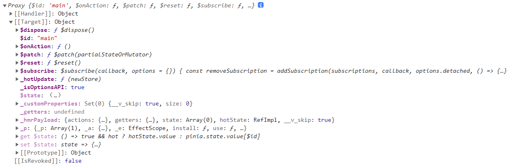 

不同 `store` 之间的互相调用

```javascript
export const usePriceStore = defineStore('price', {
  state: () => {
    return { price: 100 }
  }
})
```

```javascript
import { usePriceStore } from './usePriceStore'
export const useMainStore = defineStore('main', {
  actions: {
    getTotalPrice: () => {
      // 跨容器访问状态方法
      const priceStore = usePriceStore()
      return priceStore.price * this.count
    }
  }
})
```


## State

在 `store` 的 `state` 选项中定义状态数据

`state` 接收的是一个**箭头函数返回的值**

```javascript
import { defineStore} from 'pinia'
export const useMainStore = defineStore('main',{
  state:()=>{
    return {
      name: '张三',
      age: 18,
      count: 0,
      arr: [1, 2, 3]
    }
  }
})
```

- 读取 `state` 数据

  ```javascript
  import { useMainStore } from "../src/store/useMainStore";
  const store = useMainStore();
  ```

  ```html
  <h2>{{ store.name }}</h2>
  <h2>{{ store.age }}</h2>
  <h2>{{ store.count }}</h2>
  ```

  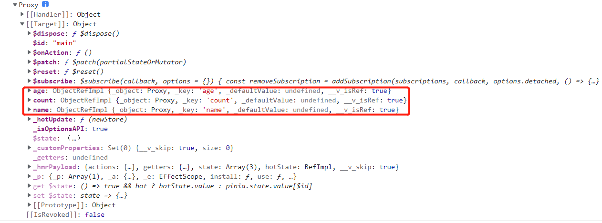 

  `state` 数据是 `reactive` 包装的响应式对象，对其**解构会丧失响应性**

  使用 `storeToRefs()` 方法，为解构数据提供 `ref` 响应式能力

  ```javascript
  import { storeToRefs } from "pinia";
  const store = useMainStore();
  const { name, age, count, arr } = storeToRefs(store);
  ```

  ```html
  <h2>{{ name }}</h2>
  <h2>{{ age }}</h2>
  <h2>{{ count }}</h2>
  ```

- 直接重新赋值 `state` 数据

  ```html
  <button @click="btnClick">+1</button>
  <h2>{{ store.count }}</h2>
  ```

  ```javascript
  const store = useMainStore();
  const btnClick = () => store.count ++;
  ```

- 使用 `store` 的 `$patch` 方法批量更改多条 `state` 数据

  `$patch` 方法经过优化，有利于程序的性能，会加快修改速度，多条更新推荐使用
  
  `$patch` 方法**传递对象参数**

  ```javascript
  const btnClick = () => {
    store.$patch({
      name: "李四",
      age: 100,
      count: ++store.count,		// ++放在前
      arr: [...store.arr, 4] 
    });
  };
  ```
  
  `$patch` 方法**传递函数参数**，有利于复杂数据的修改
  
  `$patch((state) => {})`
  
  ```javascript
  const btnClick = () => {
    store.$patch((state) => {
      state.count++;
      state.arr.push(4);
    });
  };
  ```
  
- 使用 `$state` 直接替换 `state` 对象

  ```javascript
  store.$state = { counter: 666, name: '张三' }
  ```

- 调用 `actions` 中定义的函数

  ```javascript
  import { defineStore} from 'pinia'
  export const useMainStore = defineStore('main', {
    state: () => {
      return { name: '张三', age: 18, count: 0 }
    },
    actions: {
      changeState() {
        this.name='李四'
        this.count++
      }
    }
  })
  ```

  ```javascript
  const btnClick = () => {
    store.changeState()
  };
  ```


## Getter

`getter` 可以理解为计算属性，用来监视 / 计算状态的变化的，返回一个新的结果，具有**缓存特性**

在 `store` 中定义 `getter`

```javascript
export const useMainStore = defineStore('main', {
  state: () => {
    return { phone:'15139333888' }
  },
  getters: {
    // 隐藏手机号中间四位
    phoneHidden(state){
      return state.phone.toString().replace(/^(\d{3})\d{4}(\d{4})$/, '$1****$2')
    }
  }
})
```

```html
<h2>{{ store.phoneHidden }}</h2>
```

```javascript
const store = useMainStore();
console.log(store.phoneHidden)
```

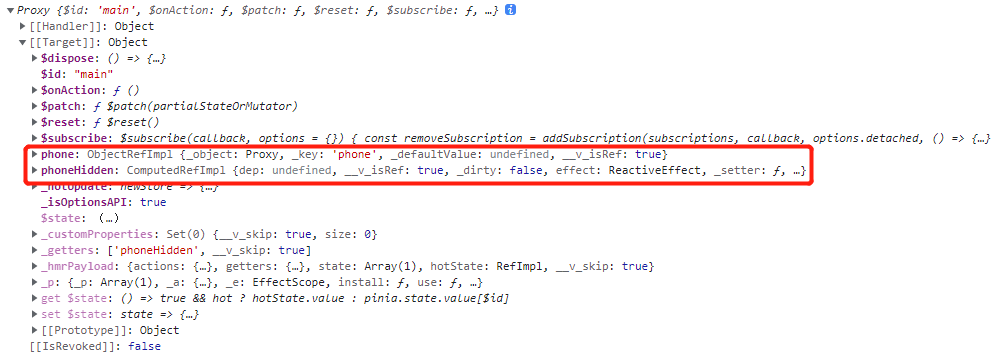 

`getter`  函数的参数可以传入或者不传 `state`，传入则有利于返回值类型推导

```typescript
getters: {
  // 传入状态 state
  phoneHidden(state) {
    return state.phone.toString().replace(/^(\d{3})\d{4}(\d{4})$/, '$1****$2')
  }
  // 可以不传 state，而使用 this 来调用 state状态
  // 但是在 ts 中，就需要指明返回值类型，不传 state 无法推导出返回值类型
  // 使用 this，就不能使用箭头函数
  phoneHidden(): string {
    return this.phone.toString().replace(/^(\d{3})\d{4}(\d{4})$/, '$1****$2')
  }
}
```

`getter`  函数可以**返回带一个参数的函数**，从而达到传参的目的

```javascript
export const useMainStore = defineStore('main',{
  state: () => {
    return { count: 0 }
  },
  getters: {
    // 隐藏手机号中间四位
    addCount: (state) => {
      return (num) => { state.count + num }
    }
  }
})
```

```javascript
const store = useMainStore();
console.log(store.addCount(10))
```


## Action

`store` 选项中的 `actions` 属性值是一个对象，定义处理业务逻辑的方法，**支持同步和异步方法**

添加 `actions` 方法

```javascript
export const useMainStore = defineStore('main',{
  state: () => {
    return { count: 0 }
  },
  actions: {
    // 隐藏手机号中间四位
    addCount: (num) => {
      this.count += num
    }
  }
})
```

```javascript
const btnClick = () => store.addCount()
```

使用异步方法

```javascript
export const useMainStore = defineStore('main',{
  state: () => {
    return { 
      items: []
    }
  },
  actions: {
    async getItems() {
      this.items = await getItems()
    }
  }
})
```


## 插件

Pinia 插件本质是一个函数，函数的返回值会混入到 `store`

使用 `pinia.use()` 将插件添加到 Pinia 实例中

- 使用插件为所有 `store` 添加公共 `state`

  ```javascript
  import { createPinia } from 'pinia'
  const pinia = createPinia()
  //pinia.use(() => ({ hello: 'world' }))
  pinia.use(({ store }) => {
    // ref 会自动展开
    store.hello = ref('world')
    // 为了 vue devTools 能够追踪显示添加的状态
    if (process.env.NODE_ENV === 'development') {
      store._customProperties.add('hello')
    }
  })
  ```

  ```javascript
  const store = useStore()
  console.log(store.hello)
  ```

- 数据持久化插件 pinia-plugin-persistedstate

  安装 pinia-plugin-persistedstate 插件

  ```bash
  npm i pinia-plugin-persistedstate
  ```

  在 main.js 中配置插件

  ```javascript
  import { createPinia } from "pinia"
  import piniaPluginPersistedstate from 'pinia-plugin-persistedstate'
  const store = createPinia()
  pinia.use(piniaPluginPersistedstate)
  ```

  自定义选项配置插件

  ```javascript
  import { createPinia } from 'pinia'
  import { createPersistedState } from 'pinia-plugin-persistedstate'
  const pinia = createPinia()
  pinia.use(createPersistedState({
    // 指定存储类型，默认 localStorage
    storage: sessionStorage,
    // 指定参数序列化器，默认如下
    serializer: {
      serialize: JSON.stringify,
      deserialize: JSON.parse,
    },
    // 重新加载持久化数据时运行的钩子函数（刷新之后再获取数据时触发）
    afterRestore(context) {
      console.log("afterRestore", context);
    },
    beforeRestore(context) {
      console.log("beforeRestore", context);
    },
  }))
  ```

  > 钩子函数获取的 `context`
  >
  > 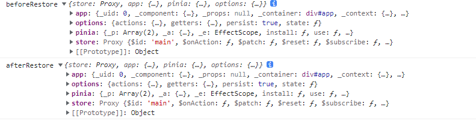 

  `store` 中开启数据持久化

  ```javascript
  import { defineStore } from "pinia"
  export const useCounterStore = defineStore({
    // 开启默认配置
    persist: true,
    state: () => ({
      info: { name: "张三", age: 18 },
      count: 0,
      arry: [1, 2, 3],
    }),
    getters: {},
    actions: {},
  })
  ```

  自定义数据持久化配置

  ```javascript
  import { defineStore } from "pinia"
  export const useCounterStore = defineStore({
    persist: {
      // 指定本地存储key
      key: 'store-key',
      // 指定存储类型
      storage: sessionStorage,
      // 指定需要持久化的 state
      paths: ['info', 'count', 'array', 'meta.sname'],
      // 重新加载持久化数据时运行的钩子函数（刷新之后再获取数据时触发）
      beforeRestore: context => {
        console.log('beforeRestore', context)
      },
      afterRestore: context => {
        console.log('afterRestore', context)
      },
    },
    state: () => ({
      info: { name: "张三", age: 18 },
      count: 0,
      arry: [1, 2, 3],
      meta: {sno: '001', sname: 'meta01'},
    }),
  })
  ```

  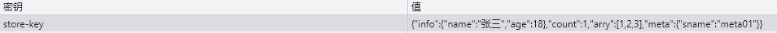 

  单 `store` 中复数数据持久化配置

  ```javascript
  import { defineStore } from "pinia"
  export const useCounterStore = defineStore({
    persist: [
      { key: "meta", storage: localStorage, paths: ["name"] },
      { key: "token", storage: sessionStorage, paths: ["token"] },
    ],
    state: () => ({
      name: '张三',
      token: 'xxxxxxxxxxxxx'
    })
  })
  ```


# 第三方库

## Element Plus

安装 element-plus

```bash
npm install element-plus
```


### 全局引入

所有的组件和插件都会被自动注册，全部都会被打包

main.js

```javascript
import ElementPlus from 'element-plus'
import 'element-plus/lib/theme-chalk/index.css'

createApp(App).use(ElementPlus).mount('#app')
```


### 局部引入

按需引用，包会小一些

#### 组件按需引用

**引入组件**

```vue
<template>
  <div id="app">
    <el-button type="primary">主要按钮</el-button>
  </div>
</template>
<script lang="ts">
import { defineComponent } from 'vue'

import { ElButton } from 'element-plus'

export default defineComponent({
  name: 'App',
  components: {
    ElButton
  }
})
</script>

<style lang="less">
</style>
```

**引入样式**

1. 安装 babel 插件

   ```bash
   npm install babel-plugin-import -D
   ```

2. 配置 babel.config.js

   ```javascript
   module.exports = {
     plugins: [
       [
         'import',
         {
           libraryName: 'element-plus',
           customStyleName: (name) => {
             return `element-plus/lib/theme-chalk/${name}.css`
           }
         }
       ]
     ],
     presets: ['@vue/cli-plugin-babel/preset']
   }
   ```


#### 按需全局引入

main.js

```javascript
import {
  ElButton,
  ElTable,
  ElAlert,
  ElAside,
  ElAutocomplete,
  ElAvatar,
  ElBacktop,
  ElBadge,
} from 'element-plus'

const app = createApp(App)

const components = [
  ElButton,
  ElTable,
  ElAlert,
  ElAside,
  ElAutocomplete,
  ElAvatar,
  ElBacktop,
  ElBadge
]

for (const cpn of components) {
  app.component(cpn.name, cpn)
}
```


#### 插件按需引入

```bash
npm install -D unplugin-vue-components unplugin-auto-import
```

配置 vue.config.js

```javascript
const AutoImport = require('unplugin-auto-import/webpack')
const Components = require('unplugin-vue-components/webpack')
const { ElementPlusResolver } = require('unplugin-vue-components/resolvers')

module.exports = {
  configureWebpack: {
    plugins: [
      AutoImport({
        resolvers: [ElementPlusResolver()]
      }),
      Components({
        resolvers: [ElementPlusResolver()]
      })
    ]
  }
}
```


### icons 组件

使用 icons 组件，需要单独下载依赖包

```bash
npm install @element-plus/icons
```

- 局部导入

  ```javascript
  import { Avatar, Lock, View } from '@element-plus/icons'
  ```

- 全局导入

  ```javascript
  import * as icons from '@element-plus/icons'
  
  const app = createApp(App)
  
  Object.keys(icons).forEach((key) => {
  
    app.component(key, icons[key])
  
  })
  ```

使用

```html
<edit style="width: 22px; height: 22px; margin-right: 8px" />
<share style="width: 1em; height: 1em; margin-right: 8px" />
```


## Axios

**安装 axios**

```shell
npm install axios
```


### 普通封装

**环境变量**

- .env.development

  ```bash
  # 标志
  ENV = 'development'
  # base api
  VUE_APP_BASE_API = '/api'
  ```

- .env.production

  ```bash
  # 标志
  ENV = 'production'
  # base api
  VUE_APP_BASE_API = '/prod-api'
  ```

**创建 axios 模块**

```javascript
// request.js
import axios from 'axios'

const service = axios.create({
  baseURL: process.env.VUE_APP_BASE_API,
  timeout: 5000
})
```

**添加请求拦截器**

```javascript
// request.js
import axios from 'axios'
import store from '@/store'
import { isCheckTimeout } from '@/utils/auth'
...

// 请求拦截器
service.interceptors.request.use(
  config => {
    // 在这个位置需要统一的去注入token
    if (store.getters.token) {
      // 验证登录token是否超时
      if (isCheckTimeout()) {
        // 登出操作
        store.dispatch('user/logout')
        return Promise.reject(new Error('token 失效'))
      }
      // 如果token存在 注入token
      config.headers.Authorization = `Bearer ${store.getters.token}`
    }
    // 配置接口国际化等等配置
    config.headers['Accept-Language'] = store.getters.language
		// 必须返回配置
    return config
  },
  error => {
    return Promise.reject(error)
  }
)
```

**添加响应拦截器**

```javascript
// request.js
import axios from 'axios'
import store from '@/store'
import { ElMessage } from 'element-plus'
...

// 响应拦截器
service.interceptors.response.use(
  response => {
    // response.data 服务器提供的业务数据，可以根据自己的业务去自定义以下代码
    const { success, message, data } = response.data
    //  要根据success的成功与否决定下面的操作
    if (success) {
      return data
    } else {
      // 业务错误
      ElMessage.error(message) // 提示错误消息
      return Promise.reject(new Error(message))
    }
  },
  error => {
    // 处理 token 超时问题
    if (error.response && error.response.data && error.response.data.code === 401) {
      // token超时
      store.dispatch('user/logout')
    }
    ElMessage.error(error.message) // 提示错误信息
    return Promise.reject(error)
  }
)
```

**导出请求工具函数**

```javascript
// 请求工具函数
// 参数： 请求地址，请求方式，提交的数据
export default (url, method, submitData) => {
  return service({
    url,
    method,
    // 1. 如果是get请求  需要使用params来传递submitData   ?a=10&c=10
    // 2. 如果不是get请求  需要使用data来传递submitData   请求体传参
    [method.toLowerCase() === 'get' ? 'params' : 'data']: submitData
  })
}
```

**导入使用**

```javascript
import request from '@/utils/request'
export const login = data => {
  return request('/sys/login', 'get', data)
}
```


### 类式封装

**类型扩展**

```typescript
import type { AxiosRequestConfig, AxiosResponse } from 'axios'
// 请求响应拦截器配置
export interface VRequestInterceptors<T = AxiosResponse> {
  // 请求成功拦截器，在拦截中可以获得参数config，同时可以返回参数config
  requestInterceptor?: (config: AxiosRequestConfig) => AxiosRequestConfig
  // 请求失败拦截
  requestInterceptorCatch?: (error: any) => any
  // 响应成功拦截
  responseInterceptor?: (res: T) => T
  // 响应失败拦截
  responseInterceptorCatch?: (error: any) => any
}
// 扩展AxiosRequestConfig类型，添加拦截器等选项，泛型T为请求的数据类型
export interface VRequestConfig<T = AxiosResponse> extends AxiosRequestConfig {
  // 拦截器
  interceptors?: VRequestInterceptors<T>
  // loading蒙版
  showLoading?: boolean
}
```

**环境变量**

```typescript
let BASE_URL = ''
const TIME_OUT = 10000
if (process.env.NODE_ENV === 'development') {
  BASE_URL = 'http://123.207.32.32:8000/'
} else if (process.env.NODE_ENV === 'production') {
  BASE_URL = 'http://vue.org/prod'
} else {
  BASE_URL = 'http://coderwhy.org/test'
}
export { BASE_URL, TIME_OUT }
```

**封装类**

```typescript
import axios from 'axios'
import type { AxiosInstance } from 'axios'
import type { VRequestInterceptors, VRequestConfig } from './type'
import { ElLoading } from 'element-plus'
import { ILoadingInstance } from 'element-plus/lib/el-loading/src/loading.type'

const DEAFULT_LOADING = true

class VRequest {
  // axios实例
  instance: AxiosInstance
  // 配置中传来的构造器
  interceptors?: VRequestInterceptors
  // 是否显示loading蒙版
  showLoading: boolean
  // loading组件实例
  loading?: ILoadingInstance

  constructor(config: VRequestConfig) {
    // 创建axios实例
    this.instance = axios.create(config)
    // 保存配置信息
    this.showLoading = config.showLoading ?? DEAFULT_LOADING
    // 保存实例的拦截器
    this.interceptors = config.interceptors

    // 从config中取出的拦截器
    // axios的拦截器是一个数组，use把函数放进数组中
    this.instance.interceptors.request.use(
      this.interceptors?.requestInterceptor,
      this.interceptors?.requestInterceptorCatch
    )
    this.instance.interceptors.response.use(
      this.interceptors?.responseInterceptor,
      this.interceptors?.responseInterceptorCatch
    )

    // 后添加的拦截器先执行，可以按需求自己调整顺序
    // 添加类中封装的统一的请求拦截器
    this.instance.interceptors.request.use(
      (config) => {
        console.log('所有的实例都有的拦截器: 请求成功拦截')
        if (this.showLoading) {
          this.loading = ElLoading.service({
            lock: true,
            text: '正在请求数据....',
            background: 'rgba(0, 0, 0, 0.5)'
          })
        }
        return config
      },
      (err) => {
        console.log('所有的实例都有的拦截器: 请求失败拦截')
        return err
      }
    )

    // 添加类中封装的统一的响应拦截器，提取类型为T的响应数据（只返回想要的res.data数据）
    this.instance.interceptors.response.use(
      (res) => {
        console.log('所有的实例都有的拦截器: 响应成功拦截')
        // 将loading移除
        this.loading?.close()
        const data = res.data
		// 即使请求成功，还需要通过判断服务器返回的returnCode，判断是否
        if (data.returnCode === '-1001') {
          console.log('请求失败~, 错误信息')
        } else {
          return data
        }
      },
      (err) => {
        console.log('所有的实例都有的拦截器: 响应失败拦截')
        // 将loading移除
        this.loading?.close()
        // 例子: 判断不同的HttpErrorCode显示不同的错误信息
        if (err.response.status === 404) {
          console.log('404的错误~')
        }
        return err
      }
    )
  }

  // 可以为单独的请求添加配置信息，例如拦截器等
  request<T>(config: VRequestConfig<T>): Promise<T> {
    return new Promise((resolve, reject) => {
	  // 每个单独的请求可以有自己的拦截
	  // 调用拦截器，将请求的config进行转化
      if (config.interceptors?.requestInterceptor) {
        config = config.interceptors.requestInterceptor(config)
      }
      // 判断是否需要显示loading
      if (config.showLoading === false) {
        this.showLoading = config.showLoading
      }

      // request返回的response的类型已经不是AxiosResponse类型了，因为已经在拦截器中返回了res.data的类型
	  // 所以request的第二个泛型类型要由AxiosResponse改成T
      this.instance.request<any, T>(config)
        .then((res) => {
          // 调用单个请求的响应拦截器对数据处理
          if (config.interceptors?.responseInterceptor) {
            res = config.interceptors.responseInterceptor(res)
          }
          // 将showLoading设置true, 这样不会影响下一个请求
          this.showLoading = DEAFULT_LOADING
          // 将结果resolve返回出去
          resolve(res)
        })
        .catch((err) => {
          // 将showLoading设置true, 这样不会影响下一个请求
          this.showLoading = DEAFULT_LOADING
          reject(err)
          return err
        })
    })
  }

  get<T>(config: VRequestConfig<T>): Promise<T> {
    return this.request<T>({ ...config, method: 'GET' })
  }

  post<T>(config: VRequestConfig<T>): Promise<T> {
    return this.request<T>({ ...config, method: 'POST' })
  }

  delete<T>(config: VRequestConfig<T>): Promise<T> {
    return this.request<T>({ ...config, method: 'DELETE' })
  }

  patch<T>(config: VRequestConfig<T>): Promise<T> {
    return this.request<T>({ ...config, method: 'PATCH' })
  }
}

export default VRequest
```

**实例化axios封装类并导出**

```typescript
import VRequest from './request'
import { BASE_URL, TIME_OUT } from './request/config'

const http = new VRequest({
  baseURL: BASE_URL,
  timeout: TIME_OUT,
  // 拦截器
  interceptors: {
    // 配置请求成功拦截器
    requestInterceptor: (config) => {
      // 携带token的拦截
      const token = ''
      if (token) {
        config.headers.Authorization = `Bearer ${token}`
      }
      console.log('请求成功的拦截')
      return config
    },
    // 配置请求失败拦截器
    requestInterceptorCatch: (err) => {
      console.log('请求失败的拦截')
      return err
    },
    // 配置响应成功拦截器
    responseInterceptor: (res) => {
      console.log('响应成功的拦截')
      return res
    },
    // 配置响应失败拦截器
    responseInterceptorCatch: (err) => {
      console.log('响应失败的拦截')
      return err
    }
  }
})

export default http
```

**导入使用**

```typescript
import http from './service'

http.get<DataType>({
  url: '/home/multidata',
  showLoading: false,
  interceptors: {
    requestInterceptor: (config) => {
      config.headers['token'] = '123'
      return config
    },
    responseInterceptor: (res) => {
      return res
    }
  }
})
.then((res) => {
  console.log(res)
})
```


## Normalize

安装重置样式包

```bash
npm i normalize.css
```

在 main.js 导入 normalize.css

```javascript
import 'normalize.css

createApp(App).use(store).use(router).mount('#app')
```


## VueUse

基于组合 API 的 @vueuse/core工具库

```bash
npm i @vueuse/core
```

按需引入

```bash
import { useWindowScroll } from '@vueuse/core'
```


## Echarts

安装 Echarts

```bash
npm install echarts
```

引入 Echarts

```javascript
import * as echarts from 'echarts'
```

初始化 Echarts 对象，并且设置配置进行绘制

```html
<div ref="divRef" :style="{ width: '600px', height: '500px' }"></div>
```

使用 `echarts.init(dom, theme, options)` 初始化

通过 `setOption `方法设置绘制的数据

```javascript
const divRef = ref<HTMLElement>()
onMounted(() => {
  // 初始化echarts的实例
  const echartInstance = echarts.init(divRef.value!, 'light', { renderer: 'svg' })
	// 编写配置文件
  const option = {
  	title: { text: 'ECharts 入门示例', subtext: '哈哈哈啊' },
  	tooltip: { trigger: 'axis', axisPointer: { type: 'cross' } },
  	legend: { data: ['销量'] },
  	xAxis: { data: ['衬衫', '羊毛衫', '雪纺衫', '裤子', '高跟鞋', '袜子'] },
  	yAxis: {}, // 通常不配置y轴，会根据数据的范围自动设置区间范围
  	series: [ { name: '销量', type: 'bar', data: [18, 20, 36, 10, 10, 20] }]
	}
	// 设置配置,并且开始绘制
  echartInstance.setOption(option)
})
```

**Canvas vs SVG** 的渲染选择

- Canvas 更适合绘制图形元素数量非常大的图表

  如热力图、地理坐标系或平行坐标系上的大规模线图或散点图等

- SVG 内存占用更低，使用浏览器内置的缩放功能时不会模糊，移动端和数量小的图表比较适合

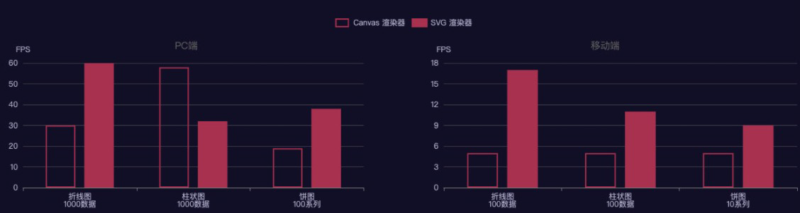 


## mockjs

mockjs 可以模拟获得响应的数据，可以拦截 axios 的接口调用，实现了调用接口的逻辑且得到模拟的数据

安装

```bash
npm i --save-dev mockjs
```

创建 src/mock/index.js 文件，配置 mockjs

```javascript
import Mock from 'mockjs'

// 基本配置
Mock.setup({
  // 随机延时200-300毫秒，模拟网络延时
  timeout: '200-300'
})
```

请求 API 函数

```javascript
/**
 * 获取收藏分页数据
 * @param {Integer} collectType - 收藏类型，1为商品，2为专题，3为品牌
 * @returns
 */
export const findCollect = ({ page = 1, pageSize = 10, collectType = 1 }) => {
  return request('/member/collect', 'get', { page, pageSize, collectType })
}
```

 src/mock/index.js 文件中，使用 mock 拦截

- 参数1：接口地址路径匹配规则
- 参数2：请求方式
- 参数3：返回数据（函数返回，函数参数 `config ` 获取请求传递的数据）

```javascript
// 拦截 /member/collect 接口
Mock.mock(/\/member\/collect/, 'get', config => {
  const queryString = config.url.split('?')[1]
  const queryObject = qs.parse(queryString)
  const items = []
  for (let i = 0; i < +queryObject.pageSize; i++) {
    items.push(Mock.mock({
      id: '@id',
      name: '@ctitle(10,20)',
      desc: '@ctitle(4,10)',
      price: '@float(100,200,2,2)',
      picture: `clothes_goods_${Mock.mock('@integer(1,8)')}.jpg`
    }))
  }
  return {
    msg: '获取收藏商品成功',
    result: {
      counts: 35,
      pageSize: +queryObject.pageSize,
      page: +queryObject.page,
      items
    }
  }
})
```

在 main.js 中导入

```javascript
import '@/mock'
```


## tui.editor

支持所见即所得的 markdown 编辑器，使用MIT开源协议

安装

```bash
npm i @toast-ui/editor
```

渲染基本结构

```html
<div class="markdown-container">
  <!-- 渲染区 -->
  <div id="markdown-box"></div>
</div>
```

初始化

```javascript
import MkEditor from '@toast-ui/editor'
// css
import '@toast-ui/editor/dist/toastui-editor.css'
// 语言包
import '@toast-ui/editor/dist/i18n/zh-cn'
import { onMounted } from 'vue'
import { useStore } from 'vuex'
const store = useStore()

// Editor实例
let mkEditor

// DOM 渲染完成后渲染
let el
onMounted(() => {
  el = document.querySelector('#markdown-box')
  initEditor()
})

const initEditor = () => {
  mkEditor = new MkEditor({
    // 挂载的el
    el,
    // 高度
    height: '500px',
    // 样式
    previewStyle: 'vertical',
    // 国际化
    language: store.getters.language === 'zh' ? 'zh-CN' : 'en'
  })
  mkEditor.getMarkdown()
}
```

提交文章

```javascript
const onSubmitClick = async () => {
  await commitArticle({
    content: mkEditor.getHTML()
  })
	// 重置
  mkEditor.reset()
  emits('onSuccess')
}
```

编辑文章

```javascript
const props = defineProps({
  content: { type: Object }
})
watch(() => props.content, val => {
  if (val) {
    mkEditor.setHTML(val)
  }
}, { immediate: true })
```

国际化语言变换

```javascript
watch(() => store.getters.language, () => {
  if (!el) return
  // 备份内容
  const htmlStr = mkEditor.getHTML()
  // 销毁
  mkEditor.destroy()
  // 重新创建
  initEditor()
  mkEditor.setHTML(htmlStr)
})
```

父组件使用

```html
<markdown :content="detail" @onSuccess="onSuccess"></markdown>
```


## wangEditor

开源 Web 富文本编辑器

安装

```bash
npm i wangeditor@4.7.6
```

wangEditor 的国际化处理使用 i18next

```bash
npm i --save i18next
```

渲染基本结构

```html
<div class="editor-container">
  <div id="editor-box"></div>
</div>
```

初始化

```javascript
import E from 'wangeditor'
// 国际化
import i18next from 'i18next'
import { onMounted } from 'vue'
import { useStore } from 'vuex'
const store = useStore()

// Editor实例
let editor

// DOM 渲染完成后渲染
let el
onMounted(() => {
  el = document.querySelector('#editor-box')
  initEditor()
})


const initEditor = () => {
  editor = new E(el)
  editor.config.zIndex = 1
  // 菜单栏提示
  editor.config.showMenuTooltips = true
  editor.config.menuTooltipPosition = 'down'
  // 国际化相关处理
  editor.config.lang = store.getters.language === 'zh' ? 'zh-CN' : 'en'
  editor.i18next = i18next
  editor.create()
}

```

提交文章

```javascript
const onSubmitClick = async () => {
  await commitArticle({
    content: editor.txt.html()
  })

  editor.txt.html('')
  emits('onSuccess')
}
```

编辑文章

```javascript
const props = defineProps({
  content: { type: Object }
})
watch(() => props.content, val => {
  if (val) {
    editor.txt.html(val)
  }
}, { immediate: true })
```

父组件使用

```html
<editor :detail="detail" @onSuccess="onSuccess"></editor>
```


## vue-i18n

**安装**

```bash
npm install vue-i18n@next
```

**创建语言包**

中文语言包 zh.js

```javascript
export default {
  login: {
    title: '用户登录',
    loginBtn: '登录',
    usernameRule: '用户名为必填项',
    passwordRule: '密码不能少于6位'
  }
  ...
}
```

英文语言包 en.js

```javascript
export default {
  login: {
    title: 'User Login',
    loginBtn: 'Login',
    usernameRule: 'Username is required',
    passwordRule: 'Password cannot be less than 6 digits'
  }
  ...
}
```

**vuex 中定义语言状态**

```javascript
state: () => ({
  language: getItem('language') || 'zh'
})
mutations: {
  // 设置国际化
  setLanguage(state, lang) {
    setItem('language', lang)
    state.language = lang
  }
}
```

**创建 i18n/index.js 文件**

```javascript
import { createI18n } from 'vue-i18n'
import mZhLocale from './lang/zh'
import mEnLocale from './lang/en'
import store from '@/store'

// 创建 messages 数据源
const messages = {
  en: {
    msg: { ...mEnLocale }
  },
  zh: {
    msg: { ...mZhLocale }
  }
}

// 获取当前 lang
function getLanguage() {
  return store && store.getters && store.getters.language
}

// 初始化 i18n 实例
const i18n = createI18n({
  // 使用 Composition API 模式，则需要将其设置为false
  legacy: false,
  // 全局注入 $t 函数
  globalInjection: true,
  locale: getLanguage(),
  messages
})

export default i18n
```

**全局注册 i18n**

```javascript
// i18n 导入放到 APP.vue 导入之前，因为可能会在 app.vue 中使用国际化内容
import i18n from '@/i18n'
import App from './App.vue'
...
app.use(i18n).mount('#app')
```

**封装语言选择组件**

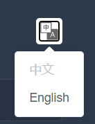 

在**模板中使用`$t`函数**来获取注册的语言内容

```html
<el-dropdown trigger="click" class="international" @command="handleSetLanguage">
  <div>
    <el-tooltip :content="$t('msg.navBar.lang')">
      <svg-icon id="guide-lang" icon="language" />
    </el-tooltip>
  </div>
  <template #dropdown>
    <el-dropdown-menu>
      <el-dropdown-item :disabled="language === 'zh'" command="zh">中文</el-dropdown-item>
      <el-dropdown-item :disabled="language === 'en'" command="en">English</el-dropdown-item>
    </el-dropdown-menu>
  </template>
</el-dropdown>
```

在**组合式中使用`const i18n = useI18n()`获取国际化对象**，使用**`i18n.t`函数**来获取注册的语言内容

```javascript
import { computed } from 'vue'
import { useI18n } from 'vue-i18n'
import { useStore } from 'vuex'
import { ElMessage } from 'element-plus'

const store = useStore()
const language = computed(() => store.getters.language)

// 切换语言
const i18n = useI18n()
const handleSetLanguage = lang => {
  i18n.locale.value = lang
  store.commit('app/setLanguage', lang)
  ElMessage.success(i18n.t('msg.toast.switchLangSuccess'))
}
```

父组件中使用

```html
<lang-select class="lang-select"></lang-select>
```

在**非组件中使用`i18n.global.t()`**获取注册的语言内容

```javascript
import i18n from '@/i18n'
// 把参数作为语言包内容的 key 进行处理
export function generateTitle(title) {
  return i18n.global.t('msg.route.' + title)
}
```

初始赋值时， `i18n`会根据当前语言环境获取到对应的国际化内容，当语言环境改变时，属性的值未重新获取，依然为初始赋值内容

国际化内容应该**使用计算属性动态获取**

```javascript
const loginRules = ref({
  username: [
    {
     	// message: i18n.t('msg.login.usernameRule')  
       message: computed(() => {
         return i18n.t('msg.login.usernameRule')
       })
    }
  ]
})
```

**监听语言变化函数**

```javascript
import { watch } from 'vue'
import store from '@/store'
import i18n from '@/i18n'

// 监听语言
export function watchSwitchLang(...callbacks) {
  watch(() => store.getters.language, () => {
      callbacks.forEach(callback => callback(store.getters.language))
    }
  )
}
```

```javascript
import { watchSwitchLang } from '@/utils/i18n'
watchSwitchLang(() => {
  loginFromRef.value.validate()
})
```


## indexedDB

使用 **indexedDB 构建 Mock 体系**

将本地浏览器端的 indexedDB 作为前端获取数据的源头，将 indexedDB 仓库中的数据直接封装成各种接口，以供前端调用

借助 indexedDB 进行开发调试，后期整体替换成真实的接口

**创建 indexedDB 操作封装类**

```typescript
export default class DB {
  // 数据库名称
  private dbName: string
	// 数据库对象
  private db: any
  constructor(dbName: string) {
    this.dbName = dbName
  } 
  // 打开数据库
  public openStore(stores: any) {
		// ...
  }
  // 新增/修改数据库数据
  updateItem(storeName: string, data: any) {
    // ...
  }
  // 删除数据
  deleteItem(storeName: string, key: number | string) {
		// ...
  }
  // 查询所有数据
  getList(storeName: string) {
    // ...
  }
  // 查询某一条数据
  getItem(storeName: string, key: number | string) {
		// ...
  }
}
```

> 创建数据库对象
>
> ```typescript
> export const testDB = new DB('testDB')
> ```

**定义表数据结构类型**

```typescript
// 表结构数据类型
type TypeObjectStore = {
  keyPath: string,				// 主键
  indexs?: Array<string>	// 字段
}
// 表字段结构
const webUser: TypeObjectStore = { keyPath: 'userId', indexs: ['mobile', 'password', 'status']}
// 表结构
const userObjectStore = { web_user: webUser }
```

**打开数据库函数**

```typescript
// store 参数类型：多个表结构的数组
public openStore(stores: any) {
  // open函数 参数1：数据库名，参数2：版本号
  const request = window.indexedDB.open(this.dbName, 4)
  return new Promise((resolve, reject) => {
    
    // 数据库打开成功
    request.onsuccess = (event: any) => {
      // 获取数据库对象
      this.db = event.target.result
      resolve(true)
    }
    
    // 数据库打开失败
    request.onerror = (event) => {
      reject(event)
    }
    
    // 数据库升级成功
    request.onupgradeneeded = (event) => {
      // 获取数据库对象
      const result: any = event.target.result
			// 初始化多个 ojectStore 对象仓库
      for (const storeName in stores) {
        // 获取要创建的表的主键和字段
        const { keyPath, indexs } = stores[storeName]
        // 没有表则新建表
        if (!result.objectStoreNames.contains(storeName)) {
          // 创建存储对象，返回一个对象仓库(即新建一个表)
          // keyPath：主键; autoIncrement：是否自增
          const store = result.createObjectStore(storeName, { autoIncrement: true, keyPath })
          if (indexs && indexs.length) {
            // createIndex 新建索引，unique字段是否唯一
            // 在数据库中进行检索数据的时候，只能通过被设置为索引的属性来进行检索
            indexs.map((v: string) => store.createIndex(v, v, { unique: false }))
          }
          // 创建对象仓库成功
          store.transaction.oncomplete = (e: any) => {
            // 创建对象仓库成功
          }
        }
      }
    }
  })
}
```

> 打开数据库使用
>
> ```typescript
> // 引入数据库和对象仓库
> import testDB from './db'
> router.beforeEach((to, from, next) => {
>   testDB.openStore({ ...userObjectStore, ...recordObjectStore })
>     .then((res: any) => {
>     	console.log('初始化所有对象仓库', res)
>   })
> })
> ```

**新增 / 修改数据函数**

```typescript
// 参数：表名，数据
updateItem(storeName: string, data: any) {
  // 打开一个事务 参数1：数据库对象名，参数2：只读|读写
  const store = this.db.transaction([storeName], 'readwrite').objectStore(storeName)
  // 添加数据，返回连接对象
  // 新增用add方法，因为兼容新增和修改所有使用put
  const request = store.put({
    ...data,
    updateTIme: new Date().getTime()
  })
  return new Promise((resolve, reject) => {
    // 数据写入成功
    request.onsuccess = (event: any) => {
      resolve(event)
    }
    // 数据写入失败
    request.onerror = (event: any) => {
      reject(event)
    }
  })
}
```

**删除数据函数**

```typescript
// 参数：表名，主键
deleteItem(storeName: string, key: number | string) {
  const store = this.db.transaction([storeName], 'readwrite').objectStore(storeName)
  const request = store.delete(key)
  return new Promise((resolve, reject) => {
    // 数据删除成功
    request.onsuccess = (event: any) => {
      resolve(event)
    }
    // 数据删除失败
    request.onerror = (event: any) => {
      reject(event)
    }
  })
}
```

**查询所有数据函数**

```typescript
// 参数：表名
getList(storeName: string) {
  const store = this.db.transaction(storeName).objectStore(storeName)
  const request = store.getAll()
  return new Promise((resolve, reject) => {
    // 查询所有数据成功
    request.onsuccess = (event: any) => {
      resolve(event.target.result)
    }
    // 查询所有数据失败
    request.onerror = (event: any) => {
      reject(event)
    }
  })
}
```

**查询某一条数据函数**

```typescript
// 参数：表名，主键
getItem(storeName: string, key: number | string) {
  const store = this.db.transaction(storeName).objectStore(storeName)
  const request = store.get(key)
  return new Promise((resolve, reject) => {
    // 查询某一条数据成功
    request.onsuccess = (event: any) => {
      resolve(event.target.result)
    }
    // 查询某一条数据失败
    request.onerror = (event: any) => {
      reject(event)
    }
  })
}
```

使用 indexedDB  的封装 mock 方法模拟登录请求操作

```typescript
// 用户注册
export async function userSignApi(params: any) {
  // 是否存在相同手机号
  const hasMobile = await new Promise((resolve, reject) => {
    testDB.getList('web_user').then((res: any) => {
      res && res.filter((item: any) => {
        // 存在相同手机号
        if (item.mobile === params.mobile) {
          resolve(true)
        }
      })
      resolve(false)
    })
  })
  let result: IResult
  if (hasMobile) {
    result = await new Promise((resolve, reject) => {
      resolve({ code: '000001', success: false, message: '数据已存在', result: null })
    })
  } else {
    const obj = { status: 0 }
    Object.assign(params, obj)
    result = await new Promise((resolve, reject) => {
      testDB.updateItem('web_user', params).then(res => {
        resolve({ code: '000000', success: true, message: '操作成功', result: null })
      })
    })
  }
  return result
}
```

```typescript
// 用户登录
export async function userLoginApi(params: any) {
  // 校验手机号和密码是否正确
  const correct: any = await new Promise((resolve, reject) => {
    testDB.getList('web_user').then((res: any) => {
      res && res.filter((item: any) => {
        if (item.mobile === params.mobile) { // 校验手机号
          if (item.password === params.password) { // 校验密码
            // '000000'表示'操作成功'
            resolve({ code: '000000', userId: item.userId })
          } else {
            resolve({ code: '000002' })
          }
        }
      })
      // 其他
      resolve({ code: '000004' })
    })
  })
  let result: IResult
  if (correct.code !== '000000') {
    result = await new Promise((resolve, reject) => {
      resolve({ code: correct.code, success: false, 
               message: correct.code === '000002' ? 
               '密码不正确' : (correct.code === '000003' ? '手机号不正确' : '不存在该用户，请先注册'),
               result: null })
    })
  } else { // 手机号和密码正确后更新登录状态
    const token = (new Date()).getTime() + ''
    localStorage.setItem("token", token)
    const obj = { status: 1, userId: correct.userId, token }
    Object.assign(params, obj)
    result = await new Promise((resolve, reject) => {
      testDB.updateItem('web_user', params).then(res => {
        resolve({ code: '000000', success: true, message: '操作成功', result: obj })
      })
    })
  }
  return result
}
```

```typescript
// 用户登出
export async function userLogoutApi() {
  // 根据用户token更改登录态为0
  const correct: any = await new Promise((resolve, reject) => {
    testDB.getList('web_user').then((res: any) => {
      res && res.filter((item: any) => {
        const token = localStorage.getItem("token")
        if (item.token && item.token.indexOf(token) !== -1) { // 存在相同token
          resolve({ userId: item.userId })
        }
      })
      resolve({ code: '000005' })
    })
  })
  let result: IResult
  if (correct.code === '000005') {
    result = await new Promise((resolve, reject) => {
      resolve({ code: '000005', success: false, message: '登录过期', result: null })
    })
  } else {
    const params = await new Promise((resolve, reject) => {
      testDB.getItem('web_user', correct.userId).then(res => {
        resolve(res)
      })
    })
    const obj = { status: 0, token: null }
    Object.assign(params, obj)
    result = await new Promise((resolve, reject) => {
      testDB.updateItem('web_user', params).then(res => {
        resolve({ code: '000000', success: true, message: '操作成功', result: null })
      })
    })
  }
  return result
}
```


##  tailwindcss

安装 tailwindcss 

```bash
npm install -D tailwindcss
```

```bash
npm install -D tailwindcss postcss autoprefixer
```

创建 tailwind.config.js 配置文件

```bash
npx tailwindcss init -p
```

 添加 tailwind 基础指令组件

```scss
// 创建 src/styles/index.scss 文件
@tailwind base;
@tailwind components;
@tailwind utilities;
```

在 main.js 中引入 index.scss 文件

```javascript
import './styles/index.scss'
```

配置 tailwind.config.js 配置文件

```javascript
module.exports = {
  // Tailwind 应用范围
  content: ['./index.html', './src/**/*.{vue,js}'],
  ...
}
```

安装 vscode 插件

 


# 项目初始化

Vite 构建前台项目结构

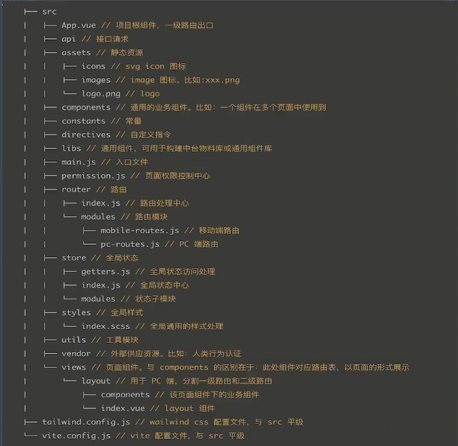 


# 配置部署

## 环境配置 WebPack

### 环境变量

根据不同的环境设置不同的环境变量

- 开发环境：development
- 生产环境：production
- 测试环境：test

设置方式：

- 根据 **process.env.NODE_ENV** 区分

  在 node 中，全局变量 `process` 表示的是当前的 node 进程，process.env 包含着系统环境的信息

  `process.env.NODE_ENV` 是 webpack 的 DefinePlugin 插件注入的值

  - 开发环境: development
  - 生成环境: production
  - 测试环境: test

  ```javascript
  let BASE_URL = ''
  if (process.env.NODE_ENV === 'development') {
    BASE_URL = 'http://123.207.32.32:8000/'
  } else if (process.env.NODE_ENV === 'production') {
    BASE_URL = 'http://coderwhy.org/prod'
  } else {
    BASE_URL = 'http://coderwhy.org/test'
  }
  export { BASE_URL }
  ```

- 编写不同的**环境变量配置文件**

  **项目根目录中放置**下列文件来指定环境变量

  - **.env**：在**所有的环境中被载入**
  
  - .env.local：在所有的环境中被载入，但会被 git 忽略
  
  - **.env.production**：**生产环境中被载入**
  
    ```bash
    # 标志
    ENV = 'production'
    # base api
    VUE_APP_BASE_API = '/prod-api'
    ```
  
  - .env.production.local：生产环境中被载入，但会被 git 忽略

  - **.env.development**：**开发环境中被载入**
  
    ```bash
    # 标志
    ENV = 'development'
    # base api
    VUE_APP_BASE_API = '/api'
    ```
  
  - .env.development.local：开发环境中被载入，但会被 git 忽略
  
  只有 **NODE_ENV**，**BASE_URL** 和**以 VUE_APP_ 开头的变量**将会通过 webpack.DefinePlugin 静态地嵌入到客户端侧的代码中
  
  ```bash
  # .env.production
  VUE_APP_BASE_URL=https://coderwhy.org/prod
  VUE_APP_BASE_NAME=kobe
  ```
  
  ```bash
  # .env.production
  VUE_APP_BASE_URL=https://coderwhy.org/dev
  VUE_APP_BASE_NAME=coderwhy
  ```
  
  `vue-cli-service build` 会加载存在的 .env、.env.production、.env.production.local 文件来构建生成环境应用
  
  自定义环境变量配置文件：.env.staging 文件
  
  - 需要设置 NODE_NEV
  
    ```bash
    # .env.staging
    NODE_ENV=production
    VUE_APP_BASE_URL=https://coderwhy.org/stag
    ```
  
  - `vue-cli-service build --mode staging ` 会加载存在的 .env、.env.staging 和 .env.staging.local 文件
  
    根据 NODE_ENV 构建出相对应的环境应用
  
  **访问环境变量**
  
  ```javascript
  console.log(process.env.VUE_APP_BASE_URL)
  ```
  
  ```javascript
  const service = axios.create({
    baseURL: process.env.VUE_APP_BASE_API,
    timeout: 5000
  })
  ```


### 配置文件

**vue.config.js** 是一个可选的配置文件，如果项目的根目录中存在这个文件，那么它会被 @vue/cli-service 自动加载

这个文件应该导出一个包含了选项的对象，也可以使用 @vue/cli-service 提供的 defineConfig 帮手函数

```javascript
module.exports = {
  // 选项...
}

// 帮手函数写法
const { defineConfig } = require('@vue/cli-service')
module.exports = defineConfig({
  // 选项...
})
```

常见配置选项

- **publicPath**：配置应用程序部署的子目录（默认是 `/`，相当于部署在 `https://www.my-app.com/`）；

- **outputDir**：生产环境构建输出的文件夹

  ```javascript
  module.exports = {
    publicPath: './',
    outputDir: './build'
  }
  ```

- **configureWebpack**：修改 webpack 的配置

  可以是一个对象，直接会被合并到 webpack 的最终配置中

  ```javascript
  module.exports = {
    configureWebpack: {
      resolve: {
        alias: {
          views: '@/views'
        }
      }
    }
  }
  ```

  可以是一个函数，会接收一个 config，可以通过 config 来修改配置

  ```javascript
  module.exports = {
    configureWebpack: (config) => {
      config.resolve.alias = {
        '@': path.resolve(__dirname, 'src'),
        views: '@/views'
      }
    }
  }
  ```

- **chainWebpack**：修改 webpack 的配置，进行更细粒度的修改

  是一个函数，会接收一个基于  webpack-chain 的 config 对象，可以对配置进行修改，可以链式操作

  ```javascript
  module.exports = {
    chainWebpack: (config) => {
      config.resolve.alias.set('@', path.resolve(__dirname, 'src')).set('views', '@/views')
    }
  }
  ```


### 跨域访问

开发阶段的**跨域访问配置**

在 vue.config.js 文件中配置

```javascript
module.exports = {
  devServer: {
    // 配置反向代理
    proxy: {
      // 当地址中有/api的时候会触发代理机制
      '^/api': {
        // 要代理的服务器地址 
        target: 'http://152.136.185.210:5000',
        // 替换开头的/api
        pathRewrite: {
          '^/api': ''
        },
        // 是否跨域
        changeOrigin: true
      }
    }
  }
}
```


### 路径别名

在 vue.config.js 文件中配置

```javascript
resolve: {
   alias: {
     '@': path.resolve(__dirname, 'src'),
     '#': path.resolve(__dirname, 'src/assets')
   }
}
```

在组件中**使用别名**

```javascript
import {getName} from '@/util/name'
```

```css
background: url(~@/assets/img/04_2.jpg);
```

```html
<!-- 可以加 ~ 也可以不加 -->

```

也可以添加 `jsconfig.json`

```json
{
  "compilerOptions": {
    "baseUrl": ".",
    "paths": {
      "@/*": ["./src/*"],
    }
  },
  "exclude": ["node_modules", "dist"]
}
```


### 按需导入

借助 **unplugin-vue-components** 插件，可以自动导入 ui 库，插件内置了大多数流行库解析器

支持 Element Plus，Ant Design Vue，Vant，Element UI，Headless UI 等第三方组件库

使用该插件，会自动生成一个 ui 库组件以及指令的路径 components.d.ts 文件

```bash
npm i -D unplugin-vue-components
```

借助 **unplugin-auto-import** 插件，可以自动导入 vue3 的 hooks

支持 vue，vue-router，vue-i18n，@vueuse/head，@vueuse/core 等自动引入

使用该插件，会自动生成 auto-imports.d.ts 文件（默认是在根目录）

```bash
npm i -D unplugin-auto-import
```

配置 vue.config.js

```javascript
import AutoImport from 'unplugin-auto-import/webpack'
import Components from 'unplugin-vue-components/webpack'
import { ElementPlusResolver } from 'unplugin-vue-components/resolvers'

module.exports = {
  ...
  configureWebpack: {
    plugins: [
      AutoImport({
        resolvers: [ElementPlusResolver()]
      }),
      Components({
        resolvers: [ElementPlusResolver()]
      })
    ]
  }
}
```

配置 vite.config.js

```javascript
import AutoImport from 'unplugin-auto-import/vite'
import Components from 'unplugin-vue-components/vite'
import { ElementPlusResolver } from 'unplugin-vue-components/resolvers'

export default defineConfig({
  plugins: [
    ...
    AutoImport({
      resolvers: [ElementPlusResolver()]
    }),
    Components({
      resolvers: [ElementPlusResolver()]
    })
  ]
})
```


### 预处理器全局导入

使用 vue-cli 的 **style-resoures-loader** 插件来完成**自动注入**到每个样式文件或者 vue 组件中 style 标签中

**避免在每个样式文件中手动的 `@import` 导入**，可以在各个样式文件中**直接使用变量和方法**

```bash
vue add style-resources-loader
```

在 vue.config.js 中添加配置

```javascript
const path = require('path')
module.exports = {
  pluginOptions: {
    'style-resources-loader': {
      preProcessor: 'less',
      patterns: [
        // 写入需要注入的文件
        path.join(__dirname, './src/assets/styles/variables.less'),
        path.join(__dirname, './src/assets/styles/mixins.less')
      ]
    }
  }
}
```

> 导入的只是需要在其他文件中调用的变量和 mixin 方法，普通的样式还是在 main.js 中导入


## 环境配置 Vite

### 环境变量

vite 中提供了 .env 环境变量文件

```bash
# production 开发模式，development 生产模式
model: production | development

.env																# 所有情况下都会加载
.env.local													# 所有情况下都会加载，但会被 git 忽略
.env.[mode]													# 只有在指定模式下才会加载
.env.[model].local									# 只有在指定模式下才会加载，但会被 git 忽略
```

 默认只有以 `VITE_` 为前缀的变量才会暴露出去，给 vite 处理

```bash
# .env.production
VITE_BASE_API = '/prod-api'
```

```bash
# .env.development
VITE_BASE_API = '/api'
```

访问环境变量

```javascript
console.log(import.meta.env.VITE_BASE_API)
```

```javascript
const service = axios.create({
  baseURL: import.meta.env.VITE_BASE_API,
  timeout: 5000
})
```


### 跨域访问

在 vite.config.js 文件中配置

```javascript
export default defineConfig({
  plugins: [vue()],
  // 代理
  server: {
    proxy: {
      // 代理所有 /api 的请求，该求情将被代理到 target 中
      '/api': {
        // 代理请求之后的请求地址
        target: 'http://152.136.185.210:5000',
        // 跨域
        changeOrigin: true
      }
    }
  }
})
```


### 路径别名

在 vite.config.js 文件中配置

```javascript
export default defineConfig({
  plugins: [vue()],
  // 软链接
  resolve: {
    alias: {
      '@': join(__dirname, '/src')
    }
  },
})
```


## 规范设置

### Editorconfig 配置

EditorConfig 有助于为不同 IDE 编辑器上处理同一项目的多个开发人员维护一致的编码风格

在 VSCode 中安装 **EditorConfig for VS Code 插件**

根目录下创建 **.editorconfig 配置文件**

```yaml
# http://editorconfig.org

root = true

[*] # 表示所有文件适用
charset = utf-8 # 设置文件字符集为 utf-8
indent_style = space # 缩进风格（tab | space）
indent_size = 2 # 缩进大小
end_of_line = lf # 控制换行类型(lf | cr | crlf)
trim_trailing_whitespace = true # 去除行首的任意空白字符
insert_final_newline = true # 始终在文件末尾插入一个新行

[*.md] # 表示仅 md 文件适用以下规则
max_line_length = off
trim_trailing_whitespace = false
```


### ESLint 配置

安装 Eslint

```bash
npm install -D eslint vue-eslint-parser eslint-plugin-vue
npm install -D @typescript-eslint/eslint-plugin @typescript-eslint/parser
```

创建项目的时候，脚手架工具已经帮助安装了 ESLint 代码检测工具

项目中的 **.eslintrc.js 文件**就是 eslint 的配置文件

ESLint 配置文档：https://eslint.bootcss.com/docs/user-guide/configuring

```javascript
// .eslintrc.js
// ESLint 配置文件遵循 commonJS 的导出规则，所导出的对象就是 ESLint 的配置对象
module.exports = {
  // 表示当前目录即为根目录，ESLint 规则将被限制到该目录下
  root: true,
  // env 表示启用 ESLint 检测的环境
  env: {
    // 在 node 环境下启动 ESLint 检测
    node: true
  },
  // ESLint 中基础配置需要继承的配置
  extends: [
    "plugin:vue/vue3-essential",
    "@vue/standard"
  ],
  // 解析器
  parserOptions: {
    parser: "babel-eslint"
  },
  // 需要修改的启用规则及其各自的错误级别
  /**
   * 错误级别分为三种：
   * "off" 或 0 - 关闭规则
   * "warn" 或 1 - 开启规则，使用警告级别的错误：warn (不会导致程序退出)
   * "error" 或 2 - 开启规则，使用错误级别的错误：error (当被触发的时候，程序会退出)
   */
  rules: {
    "no-console": process.env.NODE_ENV === "production" ? "warn" : "off",
    "no-debugger": process.env.NODE_ENV === "production" ? "warn" : "off"
  }
};
```

**解决 ESLint 验证错误**

错误信息最后就是 ESLint 的验证规则，下图规则为：`quotes`

 

在 .eslintrc.js 文件中，**添加或修改验证规则**

```javascript
rules: {
	...
  "quotes": "error" // 默认
	"quotes": "warn" // 修改为警告
	"quotes": "off" // 修改不校验
}
```

ESlint 格式化项目文件

```bash
npx eslint --ext "*.vue" --fix "src/**/*{.ts,.vue}"
```


### Prettier 格式化

在 VSCode 中可以安装 **prettier 插件**，可以在保存代码时让代码直接符合 标准 ESLint 标准

在 VSCode 中设置 `Format On Save` 为 `true`

项目中安装 prettier 脚本

```bash
npm install prettier -D
```

在 package.json 配置规则格式化脚本

```bash
npm set-script prettier "prettier --write ."
```

在项目中新建 **.prettierrc 文件**，该文件为 perttier 默认配置文件

```json
{
  "useTabs": false,						// 使用tab缩进还是空格缩进
  "tabWidth": 2,							// tab是空格的情况下，是几个空格
  "printWidth": 80,						// 一行字符的长度
  "singleQuote": true,				// 是否使用单引号
  "trailingComma": "none",		// 在多行输入的尾逗号是否添加
  "semi": false								// 语句末尾是否要加分号
}
```

在项目中新建 **.prettierignore 忽略文件**

```ini
/dist/*
.local
.output.js
/node_modules/**

**/*.svg
**/*.sh

/public/*
```

解决 **eslint 和 prettier 冲突**

 

“方法名和后面的小括号之间，应该有一个空格” 的冲突问题

在 .eslintrc.js 中关闭”**方法名后增加空格**“的规则

```javascript
rules: {
  ...
  'space-before-function-paren': 'off'
}
```

可以安装插件解决冲突（vue 在创建项目时，如果选择 prettier，那么这两个插件会自动安装）

```bash
npm i eslint-plugin-prettier eslint-config-prettier -D
```

在 .eslintrc.js 中添加插件

```javascript
extends: [
  ...
  'plugin:prettier/recommended'
],
```


### Commitizen 提交规范

commitizen 是 **git 提交规范化工具**，提供了 `git cz` 的指令用于代替 `git commit`

当使用 commitizen 进行代码提交时，commitizen 会提交在提交时填写所有必需的提交字段

全局安装 commitizen

```bash
npm install -g commitizen
```

安装 cz-customizable 插件

```bash
npm install cz-customizable -D
```

添加以下配置到 package.json 中

```json
...
  "config": {
    "commitizen": {
      "path": "node_modules/cz-customizable"
    }
  }
```

项目根目录下创建 **.cz-config.js 自定义提示文件**

使用 `git cz` 代替 `git commit`，即可看到提示内容

```javascript
module.exports = {
  // 可选类型
  types: [
    { value: 'feat', name: 'feat:     新功能' },
    { value: 'fix', name: 'fix:      修复' },
    { value: 'docs', name: 'docs:     文档变更' },
    { value: 'style', name: 'style:    代码格式' },
    { value: 'refactor', name: 'refactor: 代码重构' },
    { value: 'perf', name: 'perf:     性能优化' },
    { value: 'test', name: 'test:     增加测试' },
    { value: 'chore', name: 'chore:    构建流程或辅助工具的变动' },
    { value: 'revert', name: 'revert:   代码回退' },
    { value: 'build', name: 'build:    打包' }
  ],
  // 消息步骤
  messages: {
    type: '请选择提交类型:',
    customScope: '请输入修改范围(可选):',
    subject: '请简要描述提交(必填):',
    body: '请输入详细描述(可选):',
    footer: '请输入要关闭的issue(可选):',
    confirmCommit: '确认使用以上信息提交？(y/n/e/h)'
  },
  // 跳过问题
  skipQuestions: ['body', 'footer'],
  // subject文字长度默认是72
  subjectLimit: 72
}
```

在 package.json 中创建脚本替代 `git commit`

```bash
npm set-script commit "git cz"
```

使用 **husky + commitlint 检查提交描述是否符合规范**要求

- commitlint：用于检查提交信息

  安装 @commitlint/config-conventional 和 @commitlint/cli

  ```bash
  npm i @commitlint/config-conventional @commitlint/cli -D
  ```

  根目录下创建 **commitlint.config.js** 文件

  ```bash
  echo "module.exports = {extends: ['@commitlint/config-conventional']}" > commitlint.config.js
  ```

  在 commitlint.config.js 中，配置commitlint （确保保存为 UTF-8 的编码格式）

  ```javascript
  module.exports = {
    extends: ['@commitlint/config-conventional']
  }
  ```

- husky：是 git hooks 工具

  安装依赖

  ```bash
  npm install husky -D
  ```

  启动 hooks， 生成 .husky 文件夹

  ```bash
  npx husky install
  ```

   

  在 package.json 中生成 prepare 指令，并执行

  ```bash
  npm set-script prepare "husky install"
  ```

  ```bash
  npm run prepare
  ```

   执行成功提示

   

  使用 husky 生成 commit-msg 文件，验证提交信息

  ```bash
  npx husky add .husky/commit-msg 'npx --no-install commitlint --edit "$1"'
  ```

   

通过 **pre-commit 检测提交时代码规范**

husky 监测 pre-commit 钩子，在该钩子下执行 `npx eslint --ext .js,.vue src` 指令来去进行 eslint 检测

```bash
npx husky add .husky/pre-commit "npx eslint --ext .js,.vue src
```

 

通过 **lint-staged 提交时自动修复格式错误**（只检查本次修改更新的代码）

lint-staged 无需单独安装，vue-cli 已经帮助安装过了

修改 package.json 配置

```json
"lint-staged": {
  "src/**/*.{js,vue}": [
    "eslint --fix",
    "git add"
  ]
}
```

修改 .husky/pre-commit 文件

```shell
#!/bin/sh
. "$(dirname "$0")/_/husky.sh"

npx lint-staged
```


## 源码调试

1. git clone 方式下载

   ```bash
   git clone https://github.com/vuejs/core.git
   ```

2. 安装 Vue 源码项目相关的依赖

   ```bash
   yarn install
   ```

3. 对项目执行打包操作

   修改 package.json，开启代码映射，可以映射到具体的打包文件中进行调试

   ```json
   "dev": "node scripts/dev.js --sourcemap"
   ```

   项目打包

   ```bash
   yarn dev
   ```

4. 调试代码

   通过打包后生成的 packages/vue/dist/vue.global.js 来调试代码

   在 packages/vue/examples 中创建测试文件，引入 vue.global.js 代码

   ```html
   <div id="app"></div>
   <script src="../../dist/vue.global.js"></script>
   <script>
       debugger;
   	Vue.createApp({
           templete: `<h2>哈哈哈</h2>`,
       }).mount('#app');
   </script>
   ```


## 服务器部署

### 环境配置

1. 安装 gcc，nginx 编译时依赖 gcc 环境

   ```bash
   yum -y install gcc gcc-c++
   ```

2. 安装 prce，让 nginx  支持重写功能

   ```bash
   yum -y install pcre*
   ```

3. 安装 zlib，nginx 使用 zlib 对 http 包内容进行 gzip 压缩

   ```bash
   yum -y install zlib zlib-devel 
   ```

4. 安装 openssl，用于通讯加密

   ```bash
   yum -y install openssl openssl-devel
   ```


### Nginx 安装配置

1. 下载 nginx 压缩包

   ```bash
   wget https://nginx.org/download/nginx-1.11.5.tar.gz
   ```

2. 解压 nginx

   ```bash
   tar -zxvf  nginx-1.11.5.tar.gz
   ```

3. 安装 nginx

   进入 nginx-1.11.5 目录

   ```bash
   cd nginx-1.11.5
   ```

   检查平台安装环境

   ```bash
   ./configure --prefix=/usr/local/nginx
   ```

   进行源码编译

   ```bash
   make
   ```

   安装 nginx

   ```bash
   make install
   ```

   查看 nginx 配置

   ```bash
   /usr/local/nginx/sbin/nginx -t
   ```

4. 制作 nginx 软连接

   进入 `usr/bin` 目录

   ```bash
   cd /usr/bin
   ```

   制作软连接

   ```bash
   ln -s /usr/local/nginx/sbin/nginx nginx
   ```

5. 设置配置文件

   修改 nginx 默认配置文件

   ```bash
   vim /usr/local/nginx/conf/nginx.conf
   ```

   在最底部增加配置项（按 `i` 进入 输入模式，按 `esc` 键，`:wq!` 保存并退出）

   ```nginx
   include /nginx/*.conf;
   ```

   创建新的配置文件

   ```bash
   touch /nginx/nginx.conf
   ```

   ```bash
   vim /nginx/nginx.conf
   ```

   写入如下配置（ `:wq!` 保存退出）

   ```nginx
   server {
       # 端口
       listen       80;
       # 域名
       server_name  localhost;
       # 资源地址
       root   /nginx/dist/;
       # 目录浏览
       autoindex on;
       # 缓存处理
       add_header Cache-Control "no-cache, must-revalidate";
       # 请求配置
       location / {
           # 跨域
           add_header Access-Control-Allow-Origin *;
           # 返回 index.html
           try_files $uri $uri/ /index.html;
       }
   }
   ```

6. 在 `root/nginx` 中创建 `dist` 文件夹，传输编译后的项目

7. 启动 nginx

   利用配置文件启动 nginx

   ```bash
   nginx -c /usr/local/nginx/conf/nginx.conf
   ```

   配置文件修改重装载

   ```bash
   nginx -s reload
   ```


# 服务端渲染


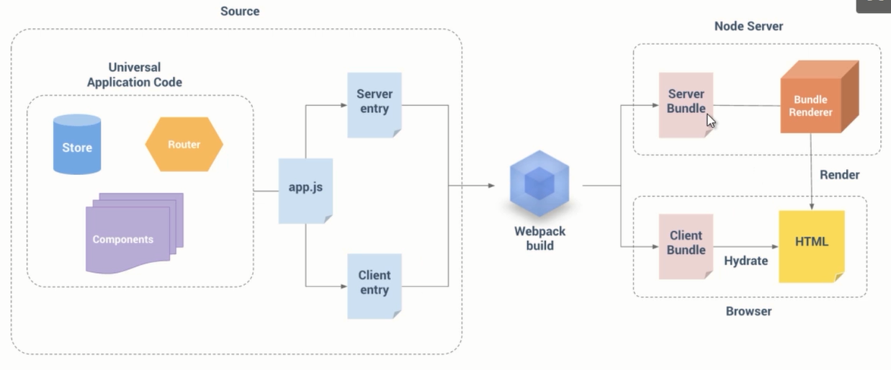 

- Server entry：服务端应用入口

  会被打包成 Server Bundle，在服务端处理服务器渲染 

- Client entrty：客户端应用入口

  会被打包成 Client Bundle，在浏览器处理服务端渲染好的静态页面，把 vue 实例挂载在静态页面的 DOM 中

目录结构

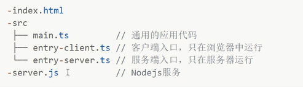 


## Webpack 配置 SSR

### 前期准备

- 创建目录结构

  ```bash
  - build
  -- webpack.base.js									# 公共配置文件
  -- webpack.client.dev.js 						# 客户端配置文件
  -- webpack.server.dev.js 						# 服务端配置文件
  - scr
  -- client														# 客户端目录
  --- router 													# 客户端路由
  --- store 													# 客户端vuex
  --- view 														# 组件
  --- app.js													# 通用分发入口
  --- App.vue
  --- entry.client.js									# 客户端入口
  --- entry.server.js									# 服务端入口
  --- index.template.html							# 最终挂载的 HTML
  -- server 													# 服务端目录
  --- router													# 服务端路由
  --- app.js													# 服务端启动
  ```

  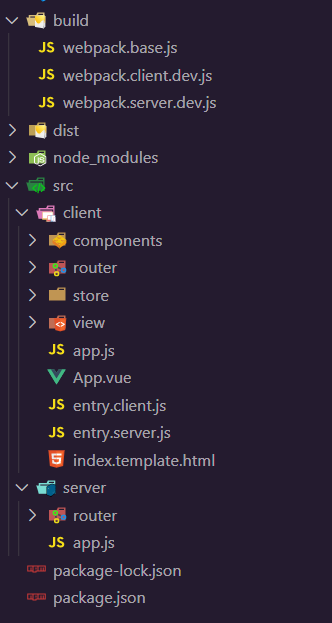 

- 安装必要的依赖（不使用脚手架创建项目）

  ```bash
  npm install -D webpack webpack-cli webpack-dev-server
  # webpack合并
  npm install -D webpack-merge
  # 不将node_modules里面的包打进去
  npm install -D  webpack-node-externals
  # babel
  npm install -D babel-loader @babel/core @babel/preset-env
  # 读取css文件
  npm install -D css-loader
  # 从css文件中提取css代码到单独的文件中
  npm install -D mini-css-extract-plugin
  # 构建后生成html文件
  npm install -D html-webpack-plugin
  # 构建中忽略某些文件
  npm install -D ignore-loader
  # node热启动
  npm install -D nodemon
  # Vue
  npm install -D vue-loader@next @vue/compiler-sfc
  npm install vue@next vue-router@next vuex@next
  npm install @vue/server-renderer
  ```

  ```bash
  # 服务端依赖 koa
  npm install koa @koa/router koa-static
  ```

- 创建组件要挂载到的 html 模板

  > **./src/client/index.template.html**

  ```html
  <!DOCTYPE html>
  <html lang="en">
    <head>
      <meta charset="UTF-8">
      <meta http-equiv="X-UA-Compatible" content="IE=edge">
      <meta name="viewport" content="width=device-width, initial-scale=1.0">
      <title>SSR</title>
    </head>
    <body>
      <div id="app"></div>
    </body>
  </html>
  ```

- 创建路由实例

  > **./src/client/router/index.js**

  ```javascript
  import { createRouter, createMemoryHistory, createWebHistory } from "vue-router"
  import Home from "../view/Home/index.vue";
  import About from "../view/About/index.vue";
  
  // createMemoryHistory 服务端使用
  // createWebHistory 客户端使用
  const isSSR = typeof window === "undefined"
  const history = isSSR ? createMemoryHistory() : createWebHistory()
  
  const routes = [
    { path: "/", name: "home", component: Home },
    { path: "/about", name: "about", component: About },
  ]
  
  // 函数创建，避免状态的单例问题
  export default () => createRouter({ history, routes })
  ```

  > **避免单例**：
  >
  > 在 CSR 中, 每次打开页面都是从服务端下载代码(或缓存)，然后创建一个全局的根实例.
  >
  > 但是在 SSR 中，在 node.js 启动的服务器进程是长期运行的⼀个线程，每次进入该进程，它**只会进行⼀次取值并留存在内存**
  >
  > 如果一直用同一个全局的实例，就会导致每次客户端的请求都指向了同一个实例，有可能造成状态污染
  >
  > 都应该通过⼀个**工厂函数来创建实例**，Vue 的根实例 `app`、`route`、`store` 都需要这样处理

- 创建状态管理 vuex 实例

  > **./src/client/store/index.js**

  ```javascript
  import { createStore } from "vuex"
  import demo from "./module/demo"
  
  // 函数创建，避免状态的单例问题
  export default () => {
    return createStore({
      modules: { demo }
    })
  }
  ```

  vuex 模块

  ```javascript
  export default {
    namespaced: true,
    state() {
      return {
        userInfo: { name: "初始值", address: "beijing" },
      }
    },
    mutations: {
      setData(state, payload) {
        state.userInfo = payload
      }
    }
  }
  ```

- 页面组件的数据请求

  > **./src/client/view/Home/index.vue**

  ```html
  <template>
    <h1 class="home-h1">home</h1>
    <div>{{ userInfo.name }}-{{ userInfo.address }}</div>
  </template>
  ```

  ```javascript
  import { computed, onServerPrefetch } from "vue"
  import { useStore } from "vuex"
  import axios from "axios"
  
  const store = useStore()
  const userInfo = computed(() => store.state.demo.userInfo)
  
  const fetchData = async () => {
    const res = await 
    	axios.get("https://www.fastmock.site/mock/408a0aa430e1783a6cec0c0706aeea8e/test/api/ssr")
    store.commit("demo/setData", res.data.info)
  }
  
  // 只在服务器端执行的钩子
  onServerPrefetch(async () => {
    await fetchData()
  })
  
  if (userInfo.value.name === "yd") {
    fetchData()
  }
  ```


### 客户端配置

- 创建通用入口文件 app.js，创建以供服务端和客户端使用的 Vue 实例

  > **./src/client/app.js**

  ```javascript
  import { createApp, createSSRApp } from "vue"
  import createRouter from "./router/index"
  import createStore from "./store/index"
  import App from "./App.vue"
  
  // 函数创建，避免状态的单例问题
  export default function () {
    const router = createRouter()
    const store = createStore()
    const isSSR = typeof window === "undefined"
    const app = (isSSR ? createSSRApp : createApp)(App)
    app.use(router).use(store)
    return { app, router, store }
  }
  ```

- 创建客户端入口文件 entry.client.js

  > **./src/client/entry.client.js**

  ```javascript
  import createApp from "./app"
  const { app, store } = createApp()
  // 
  if (window.__INITIAL_STATE__) {
    console.log("客户端获取的state", __INITIAL_STATE__)
    store.replaceState(window.__INITIAL_STATE__)
  }
  app.mount("#app", true)
  ```


### 服务端配置

- 创建服务端 koa 入口文件 app.js

  > **./src/server/app.js**

  ```javascript
  const Koa = require("koa")
  const server = require("koa-static")
  const { resolve } = require("path")
  const app = new Koa()
  const router = require("./router")
  router(app)
  
  app.use(server(resolve(__dirname, "../../dist")))
  app.listen(3000, () => {
    console.log("running 3000")
  })
  ```

- 创建服务端入口文件 entry.server.js

  > **./src/client/entry.server.js**

  ```javascript
  import createApp from "./app"
  // 避免状态单例
  export default () => {
    const { app, router, store } = createApp()
    return { app, router, store }
  }
  ```

- 配置服务端路由 

  > **./src/server/router/index.js**

  ```javascript
  const Router = require("@koa/router")
  const router = new Router()
  const { resolve } = require("path")
  const fs = require("fs")
  const { renderToString } = require("@vue/server-renderer")
  const serverBundle = require("../../../dist/server-bundle.js").default
  const template = fs.readFileSync(resolve(__dirname, "../../../dist/index.html"), "utf-8")
  
  const renderState = (state, windowKey) => {
    return `<script>window.${windowKey}=${JSON.stringify(state)}</script>`
  }
  
  module.exports = (app) => {
    router.get(["/", "/about"], async (ctx, next) => {
      const { app: appComp, router: r, store } = serverBundle()
      r.push(ctx.req.url)
      await r.isReady()
      let appContent = await renderToString(appComp)
      appContent = 
        `<div id="app">${renderState(store.state, "__INITIAL_STATE__")}${appContent}</div>`
      let html = template.replace(`<div id="app"></div>`, appContent)
      ctx.body = html
    })
    app.use(router.routes()).use(router.allowedMethods())
  }
  ```

  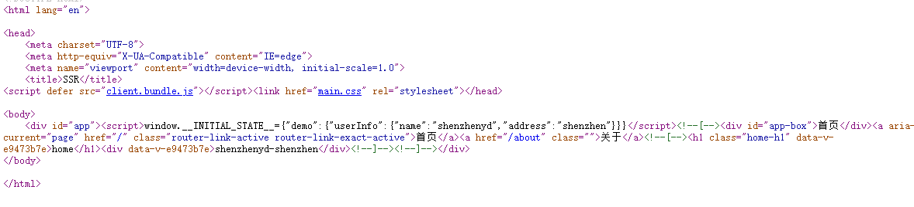 


### Webpack 配置

- 跟目录下创建 bulid 文件夹

  创建公共配置文件 webpack.base.js，客户端配置文件 webpack.client.dev.js，服务端配置文件 webpack.server.dev.js

  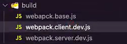 

- 公共配置文件 webpack.base.js

  > **./build/webpack.base.js**

  ```javascript
  const { resolve } = require("path");
  const { VueLoaderPlugin } = require("vue-loader");
  
  module.exports = {
    output: { path: resolve(__dirname, "../dist") },
    module: {
      // 模块解析规则
      rules: [
        // vue 语法解析
        { test: /\.vue$/, use: ["vue-loader"] },
        // js 解析
        { 
          test: /\.js$/, 
          use: { loader: "babel-loader", options: { presets: ["@babel/preset-env"] }},
          exclude: /node_module/,
        }
      ]
    },
    plugins: [new VueLoaderPlugin()],
  };
  ```

- 客户端配置文件 webpack.client.dev.js

  > **./build/webpack.client.dev.js**

  ```javascript
  const { resolve } = require("path");
  const { merge } = require("webpack-merge");
  
  const HtmlWebpackPlugin = require("html-webpack-plugin");
  //抽离 css 样式
  const MiniCssExtractPlugin = require("mini-css-extract-plugin");
  const baseConfig = require("./webpack.base");
  
  const devConfig = {
    mode: "development",
    // 入口
    entry: resolve(__dirname, "../src/client/entry.client.js"),
    output: { filename: "client.bundle.js" },
    devServer: {
      static: { directory: resolve(__dirname, "../dist") },
      port: 8080,
      historyApiFallback: true,
    },
    module: {
      rules: [{ test: /\.css$/, use: [MiniCssExtractPlugin.loader, "css-loader"] }]
    },
    plugins: [
      new MiniCssExtractPlugin(),
      // 配置模板
      new HtmlWebpackPlugin({ template: resolve(__dirname, "../src/client/index.template.html") })
    ]
  };
  module.exports = merge(baseConfig, devConfig);
  ```

- 服务端配置文件 webpack.server.dev.js

  > **./build/webpack.server.dev.js**

  ```javascript
  const { resolve } = require("path");
  const nodeExternals = require("webpack-node-externals");
  const { merge } = require("webpack-merge");
  const baseConfig = require("./webpack.base");
  
  const serverConfig = {
    mode: "development",
    entry: resolve(__dirname, "../src/client/entry.server.js"),
    output: { filename: "server-bundle.js", libraryTarget: "commonjs2" },
    target: "node",
    externals: nodeExternals(),
    module: {
      rules: [{ test: /\.css$/, use: "ignore-loader" }],
    }
  };
  module.exports = merge(baseConfig, serverConfig);
  ```

- 执行和编译脚本

  ```json
  "scripts": {
    "client:server": "webpack serve --config ./build/webpack.client.dev.js",
    "client:dev": "webpack --config ./build/webpack.client.dev.js",
    "server:dev": "webpack --config ./build/webpack.server.dev.js",
    "dev:build": "npm run client:dev && npm run server:dev",
    "dev:server": "nodemon ./src/server/app.js"
  }
  ```


## 预渲染


# 组件封装案例

## 表单控件

### 复选框

 

```html
<div class="app-checkbox" @click="changeChecked()">
  <i v-if="checked" class="iconfont icon-checked"></i>
  <i v-else class="iconfont icon-unchecked"></i>
  <span v-if="$slots.default">
    <slot></slot>
  </span>
</div>
```

实现双向绑定

```javascript
const props = defineProps({
  modelValue: { type: Boolean, default: false }
})
const emit = defineEmits(['update:modelValue'])
const checked = ref(false)
const changeChecked = () => {
  checked.value = !checked.value
  emit('update:modelValue', checked.value)
}
// 使用侦听器，得到父组件传递数据，给checked数据
watch(() => props.modelValue, () => {
  checked.value = props.modelValue
}, { immediate: true })
```

使用 vueuse 的 `useVModel` 进行双向绑定

```javascript
import { useVModel } from '@vueuse/core'
const props = defineProps({
  modelValue: { type: Boolean, default: false }
})
const emit = defineEmits(['update:modelValue'])
const checked = useVModel(props, 'modelValue', emit)
const changeChecked = () => {
  checked.value = !checked.value
}
```

父组件中使用

```html
<app-checkbox v-model="inventory">显示</app-checkbox>
```


### 数量选择

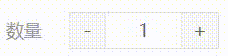 

```html
<div class="my-numbox">
  <div class="label" v-if="label">{{label}}</div>
  <div class="numbox">
    <a @click="changeNum(-1)" href="javascript:;">-</a>
    <input type="text" readonly :value="modelValue">
    <a @click="changeNum(1)" href="javascript:;">+</a>
  </div>
</div>
```

使用 vueuse 的 `useVModel` 进行双向绑定

```javascript
const prop = defineProps({
	label: { type: String },
	modelValue: { type: Number, default: 1 },
	min: {	type: Number, default: 1 },
	max: { type: Number, default: 100 }
})
const emit = defineEmits(['change'])
const num = useVModel(props, 'modelValue', emit)
// 按钮点击事件
const changeNum = (step) => {
  const newValue = count.value + step
  // 值不合法终止
  if (newValue < props.min || newValue > props.max) return
  count.value = newValue
  emit('change', newValue)
}
```

父组件使用

```html
<my-numbox label="数量" v-model="num" :max="goods.inventory"></my-numbox>
```


### 表单（Element）

使用 Element 二次封装表单

```html
<my-form v-bind="searchFormConfig" v-model="formData">
  <template #header>
    <h1 class="header">检索</h1>
  </template>
  <template #footer>
    <div class="handle-btns">
      <el-button icon="el-icon-refresh">重置</el-button>
      <el-button type="primary" icon="el-icon-search">搜索</el-button>
    </div>
  </template>
</my-form>
```

表单配置类型

```typescript
export interface IForm {
  formItems: IFormItem[]
  labelWidth?: string
  colLayout: any
  itemLayout: any
}
export interface IFormItem {
  field: string
  type: 'input' | 'password' | 'select' | 'datepicker'
  label: string
  rules?: any[]
  placeholder?: any
  options?: any[]
  otherOptions?: any
}
```

父组件配置表单

```javascript
// 表单配置
const searchFormConfig: IForm = {
  labelWidth: '120px',
  itemLayout: { padding: '10px 40px' },
  colLayout: { span: 8 },
  formItems: [
    { field: 'id', type: 'input', label: 'id', placeholder: '请输入id' },
    { field: 'name', type: 'input', label: '用户名', placeholder: '请输入用户名' },
    { field: 'password', type: 'password', label: '密码', placeholder: '请输入密码' },
    { field: 'sport', type: 'select', label: '喜欢的运动', placeholder: '请选择喜欢的运动',
      options: [
        { title: '篮球', value: 'basketball' },
        { title: '足球', value: 'football' }
      ]
    },
    { field: 'createTime', type: 'datepicker', label: '创建时间',
      otherOptions: { startPlaceholder: '开始时间', endPlaceholder: '结束时间', type: 'daterange' }
    }
  ]
}
// 双向绑定数据由配置文件的field来决定
const formItems = searchFormConfig.formItems ?? []
const formOriginData: any = {}
for (const item of formItems) {
  formOriginData[item.field] = ''
}
const formData = ref(formOriginData)
```

封装组件 form 

```html
<div class="header">
  <slot name="header"></slot>
</div>
<el-form :label-width="labelWidth">
  <el-row>
    
    <template v-for="item in formItems" :key="item.label">
      <el-col v-bind="colLayout">
        <el-form-item :label="item.label" :rules="item.rules" :style="itemStyle">
          
          <template v-if="item.type === 'input' || item.type === 'password'">
            <el-input v-model="formData[`${item.field}`]" v-bind="item.otherOptions"
              :placeholder="item.placeholder" :show-password="item.type === 'password'"/>
          </template>
          
          <template v-else-if="item.type === 'select'">
            <el-select v-model="formData[`${item.field}`]" v-bind="item.otherOptions"
              :placeholder="item.placeholder" style="width: 100%">
              <el-option v-for="option in item.options" :key="option.value" :value="option.value">
                {{ option.title }}
              </el-option>
            </el-select>
          </template>
          
          <template v-else-if="item.type === 'datepicker'">
            <el-date-picker v-model="formData[`${item.field}`]" v-bind="item.otherOptions"
              style="width: 100%">
            </el-date-picker>
          </template>
          
        </el-form-item>
      </el-col>
    </template>
    
  </el-row>
</el-form>
<div class="footer">
  <slot name="footer"></slot>
</div>
```

```javascript
const props = defineProps({
	modelValue: { type: Object, required: true },
  formItems: { type: Array as PropType<IFormItem[]>, default: () => [] },
  labelWidth: { type: String, default: '100px' },
  itemStyle: { type: Object, default: () => ({ padding: '10px 40px' }) },
  colLayout: { type: Object, default: () => ({ xl: 6, lg: 8, md: 12, sm: 24, xs: 24 }) }
})
const emit = defineEmits(['update:modelValue'])
// 对父组件通过v-modal传过来的数据进行双向绑定
// 对传入的数据进行克隆
const formData = ref({ ...props.modelValue })
// 侦听formData，发生变化提交给父组件
watch(formData, (newValue) => emit('update:modelValue', newValue), { deep: true })
```


### 用户登录

 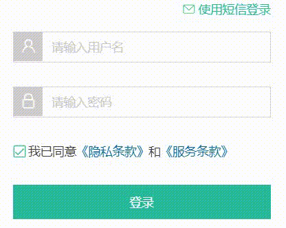 

使用 **VeeValidate 库进行表单验证**

```bash
npm i vee-validate
```

- 使用 VeeValidate  的 `Form` 组件，替代 html 的 `form ` 标签

  - 使用 `validation-schema` 属性，传入校验规则

  - 添加 `v-slot="{errors}"` ，使用作用域插槽暴露 `errors` 错误对象

    通过 `errors['校验规则名称']` 取出错误信息，有则显示，无即隐藏

- 使用 VeeValidate  的 `Field` 组件，替代 `input` 标签，默认解析成 `input`
  - 添加 `name` 属性，作用是指定使用 schema 中哪个校验规则
  - `as` 属性可以指定为其他标签，也可指定为组件，组件需要支持 `v-model` 否则校验不会触发

```html
<div class="toggle">
  <a @click="isMsgLogin=false" href="javascript:;" v-if="isMsgLogin">
    <i class="iconfont icon-user"></i> 使用账号登录
  </a>
  <a @click="isMsgLogin=true" href="javascript:;" v-else>
    <i class="iconfont icon-msg"></i> 使用短信登录
  </a>
</div>
<Form ref="formCom" class="form" :validation-schema="schema" v-slot="{errors}" autocomplete="off">
  <!-- 账号密码登录 -->
  <template v-if="!isMsgLogin">
  	<!-- 账号 -->
  	<div class="form-item">
  	  <div class="input">
  	    <i class="iconfont icon-user"></i>
  	    <Field v-model="form.account" name="account" type="text" 
  	           :class="{error:errors.account}" placeholder="请输入用户名" />
  	  </div>
  	  <!-- 账号错误信息 -->
  	  <div class="error" v-if="errors.account">
  	    <i class="iconfont icon-warning" /> {{errors.account}}
  	  </div>
  	</div>
  	<!-- 密码 -->
  	<div class="form-item">
  	  <div class="input">
  	    <i class="iconfont icon-lock"></i>
  	    <Field v-model="form.password" name="password" type="password"
  	           :class="{error:errors.password}" placeholder="请输入密码" />
  	  </div>
  	  <!-- 密码错误信息 -->
  	  <div class="error" v-if="errors.password">
  	    <i class="iconfont icon-warning" /> {{errors.password}} 
      </div>
  	</div>
  </template>
  <!-- 手机号验证码登录 -->
	<template v-else>
    <!-- 手机号 -->
		<div class="form-item">
		  <div class="input">
		    <i class="iconfont icon-user"></i>
		    <Field v-model="form.mobile" name="mobile" type="text"
               :class="{error:errors.mobile}" placeholder="请输入手机号" />
		  </div>
      <!-- 手机号错误信息 -->
		  <div class="error" v-if="errors.mobile">
		    <i class="iconfont icon-warning" /> {{errors.mobile}}
		  </div>
		</div>
    <!-- 验证码 -->
		<div class="form-item">
		  <div class="input">
		    <i class="iconfont icon-code"></i>
		    <Field v-model="form.code" name="code" type="text" placeholder="请输入验证码"
               :class="{error:errors.code}" />
		    <span @click="send()" class="code"> {{ time ===0 ? '发送验证码' : `${time}秒后发送` }}</span>
		  </div>
      <!-- 验证码错误信息 -->
		  <div class="error" v-if="errors.code">
		    <i class="iconfont icon-warning" /> {{errors.code}}
		  </div>
		</div>
  </template>
  <!-- 同意选项 -->
  <div class="form-item">
    <div class="agree">
      <Field as="MyCheckbox" name="isAgree" v-model="form.isAgree" />
      <span>我已同意</span>
    </div>
    <!-- 同意选项错误信息 -->
    <div class="error" v-if="errors.isAgree">
      <i class="iconfont icon-warning" /> {{errors.isAgree}}
    </div>
  </div>
  <a @click="login()" href="javascript:;" class="btn">登录</a>
</Form>
```

定义**校验规则函数**

```javascript
export default {
  // 用户名校验
  account (value) {
    if (!value) return '请输入用户名'
    // 规则：字母开头6-20字符之间
    if (!/^[a-zA-Z]\w{5,19}$/.test(value)) return '字母开头且6-20个字符'
    return true
  },
  // 密码校验
  password (value) {
    if (!value) return '请输入密码'
    // 规则：密码格式6-24个字符
    if (!/^\w{6,24}$/.test(value)) return '密码6-24个字符'
    return true
  },
  // 手机号检验
  mobile (value) {
    if (!value) return '请输入手机号'
    // 规则：1开头 3-9 之间  9个数字
    if (!/^1[3-9]\d{9}$/.test(value)) return '手机号格式不对'
    return true
  },
  // 验证码校验
  code (value) {
    if (!value) return '请输入短信验证码'
    // 规则： 6个数字
    if (!/^\d{6}$/.test(value)) return '短信验证码6个数字'
    return true
  },
  // 同意选项校验
  isAgree (value) {
    if (!value) return '请勾选登录协议'
    return true
  }
}
```

```javascript
// 导入 vee-validate 的组件
import { Form, Field } from 'vee-validate'
// 导入校验规则
import schema from '@/utils/vee-validate-schema'
// 表单数据对象
const form = reactive({ isAgree: true, account: null, password: null, mobile: null, code: null })
// 是否是短信登录
const isMsgLogin = ref(false)
// 校验规则函数对象
// 函数返回true是校验成功，返回字符串就是失败，字符串就是错误提示
const mySchema = {
  account: schema.account,
	password: schema.password,
	mobile: schema.mobile,
	code: schema.code,
	isAgree: schema.isAgree
}
```

**监听手机登录和账号登录的切换**，重置表单（数据+清除校验结果）

```javascript
const formCom = ref(null)
watch(isMsgLogin, () => {
  // 重置数据
  form.isAgree = true
  form.account = null
  form.password = null
  form.mobile = null
  form.code = null
  // 如果是没有销毁 Field 组件，之前的校验结果是不会清除  例如：v-show 切换的
  // Form 组件提供了一个 resetForm 函数，用来清除校验结果
  formCom.value.resetForm()
})
```

**登录处理**

```javascript
const store = useStore()
const router = useRouter()
const route = useRoute()
const login = async () => {
  // Form 组件提供了一个 validate 函数作为整体表单校验，返回一个 promise
  const valid = await formCom.value.validate()
  if (valid) {
    try {
      if (isMsgLogin.value) {
        // 手机号登录
        const { mobile, code } = form
        await store.dispatch('user/userMobileLogin', { mobile, code })
      } else {
        // 帐号登录
        const { account, password } = form
        await store.dispatch('user/userAccountLogin', { account, password })
      }
      // 成功消息提示
      Message({ type: 'success', text: '登录成功' })
      // 进行跳转
      router.push(route.query.redirectUrl || '/')
    } catch (e) {
      // 失败消息提示
      if (e.response.data) {
        Message({ type: 'error', text: e.response.data.message || '登录失败' })
      }
    }
  }
}
```

**登录请求**

```javascript
import md5 from 'md5'
...
actions: {
  // 帐号登录
	userAccountLogin(context, payload) {
	  const { account, password } = payload
	  return new Promise((resolve, reject) => {
      // 帐号登录请求
	    accountLogin({ account, password: md5(password) }).then(data => {
        const { id, account, avatar, mobile, nickname, token } = data.result
        // 存储 token
        context.commit('user/setToken', token)
        // 存储用户信息
      	context.commit('user/setUserInfo', { id, account, avatar, mobile, nickname })
        // 保存用户登录时间
        setTimeStamp()
        resolve()
      }).catch(err => {
        reject(err)
      })
    })
	},
  // 手机号登录
  userMobileLogin(context, payload) {
    const { mobile, code } = payload
    return new Promise((resolve, reject) => {
      // 手机号登录请求
      mobileLogin({ mobile, code }).then(date => {
        ...
        const { id, account, avatar, mobile, nickname, token } = data.result
        // 存储 token
        context.commit('user/setToken', token)
        // 存储用户信息
      	context.commit('user/setUserInfo', { id, account, avatar, mobile, nickname })
        ...
      })
    }
  }
}
```

```javascript
import { setItem, getItem } from '@/utils/storage'
...
state: () => ({
  token: getItem(TOKEN) || '',
  userInfo: {}
})
mutations: {
  // 存储token
	setToken(state, token) {
	  state.token = token
	  setItem(TOKEN, token)
	},
  //  存储用户信息
  setUserInfo(state, userInfo) {
    state.userInfo = userInfo
  }
}
```

**登录时间戳保存函数**

```javascript
import { setItem, getItem } from '@/utils/storage'

// 获取时间戳
export function getTimeStamp() {
  return getItem('timeStamp')
}
// 设置时间戳
export function setTimeStamp() {
  setItem('timeStamp', Date.now())
}
// 是否超时
export function isCheckTimeout() {
  // 当前时间戳
  var currentTime = Date.now()
  // 缓存时间戳
  var timeStap = getTimeStamp()
  // 是否超过时效时长
  return currentTime - timeStamp > 2 * 3600 * 1000
}
```

> 可以在请求拦截器中判断是否token已经过期处理
>
> ```javascript
> // 请求拦截器
> service.interceptors.request.use(
>   config => {
>     // token是否存在
>     if (store.getters.token) {
>       // token是否过期
>       if (isCheckTimeout()) {
>         // 登出操作
>         store.dispatch('user/logout')
>         return Promise.reject(new Error('token 失效'))
>       }
>       // 请求头添加token信息处理
>       ...
>     }
> 		...
>     return config // 必须返回配置
>   }
> )
> ```

短信再次发送**倒计时函数**

```javascript
// 使用 vueUse 的 useIntervalFn 函数，useIntervalFn(回调函数,执行间隔,是否立即开启)
const time = ref(0)
// pause 暂停，resume 开始
const { pause, resume } = useIntervalFn(() => {
  time.value--
  if (time.value <= 0) {
    pause()
  }
}, 1000, false)
onUnmounted(() => {
  pause()
})
```

**发送验证码函数**

```javascript
const send = async () => {
  // 校验手机号，如果成功才去发送短信
  const valid = mySchema.mobile(form.mobile)
  if (valid === true) {
    // 请求成功开启60s的倒计时，不能再次点击，没有倒计时才可以发送，倒计时结束恢复
    if (time.value === 0) {
      await userMobileLoginMsg(form.mobile)
      Message({ type: 'success', text: '发送成功' })
      time.value = 60
      resume()
    }
  } else {
    // 失败，使用 vee 的错误函数，显示错误信息 setFieldError(字段,错误信息)
    formCom.value.setFieldError('mobile', valid)
  }
}
```

**退出登录**

```html
<a @click="logout()" href="javascript:;">退出登录</a>
```

```javascript
const store = useStore()
const logout = () => {
	store.dispatch('user/logout')	
}
```

```javascript
import { removeAllItem } from '@/utils/storage'
import router from '@/router'
...
actions: {
	logout() {
	  this.commit('user/setToken', '')
	  this.commit('user/setUserInfo', {})
    // 清除所有 localStorage
	  removeAllItem()
	  router.push('/login')
	}
}
```


### 地址选择

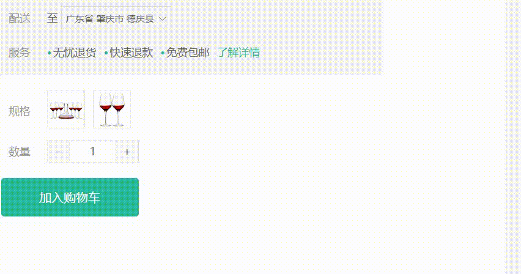 

```html
<div class="city" ref="target">
  <!-- 下拉列表控件 -->
  <div class="select" @click="toggle()" :class="{active:visible}">
    <!-- fullLocation：显示 “省 市 区” 格式的字符串 -->
    <span v-if="!fullLocation" class="placeholder">{{placeholder}}</span>
    <span v-else class="value">{{fullLocation}}</span>
    <i class="iconfont icon-angle-down"></i>
  </div>
  <!-- 选项框 -->
  <div class="option" v-if="visible">
    <div v-if="loading" class="loading"></div>
    <template v-else>
      <span class="ellipsis" v-for="item in currList" :key="item.code" @click="changeItem(item)">
        {{item.name}}
      </span>
    </template>
  </div>
</div>
```

```javascript
const props = defineProps({
	fullLocation: { type: String, default: '' },
	placeholder: { type: String, defulat: '请选择配送地址' }
})
const emit = defineEmits(['change'])
// 显示隐藏选项框
const visible = ref(false)
// 所有省市区数据
const allCityData = ref([])
// 正在加载数据
const loading = ref(false)
// 选择的省市区数据
const changeResult = reactive({ 
  provinceCode: '', provinceName: '',
  cityCode: '', cityName: '',
  countyCode: '', countyName: '',
  fullLocation: ''
})
```

获取省市区数据函数

```javascript
const getCityData = () => {
  // 数据：https://yjy-oss-files.oss-cn-zhangjiakou.aliyuncs.com/tuxian/area.json
  // 1. 本地没有缓存，发请求获取数据
  // 2. 本地缓存有缓存，取出本地数据
  return new Promise((resolve, reject) => {
    // 约定：数据存储在window上的cityData字段
    if (window.cityData) {
      resolve(window.cityData)
    } else {
      const url = 'https://yjy-oss-files.oss-cn-zhangjiakou.aliyuncs.com/tuxian/area.json'
      axios.get(url).then(res => {
        // 缓存
        window.cityData = res.data
        resolve(res.data)
      })
    }
  })
}
```

获取的所有省市区数据  

动态切换选择框中的省市区数据

```javascript
// 当前显示的地区数组
const currList = computed(() => {
  // 默认省一级
  let list = allCityData.value
  // 已经选择了省，切换到市一级
  if (changeResult.provinceCode && changeResult.provinceName) {
    list = list.find(p => p.code === changeResult.provinceCode).areaList
  }
  // 已经选择了市，切换到县地区一级
  if (changeResult.cityCode && changeResult.cityName) {
    list = list.find(c => c.code === changeResult.cityCode).areaList
  }
  return list
})
```

点击选择省市区数据，记录并提交到父组件

```javascript
const changeItem = (item) => {
  if (item.level === 0) {
    // 省一级
    changeResult.provinceCode = item.code
    changeResult.provinceName = item.name
  }
  if (item.level === 1) {
    // 市一级
    changeResult.cityCode = item.code
    changeResult.cityName = item.name
  }
  if (item.level === 2) {
    // 地区一级
    changeResult.countyCode = item.code
    changeResult.countyName = item.name
    // 完整路径 “省 市 区” 格式
    changeResult.fullLocation =
      `${changeResult.provinceName} ${changeResult.cityName} ${changeResult.countyName}`
    // 这是最后一级，选完了，关闭对话框，通知父组件数据
    close()
    emit('change', changeResult)
  }
}
```

开启关闭选项框

```javascript
// 开启关闭选项框
const toggle = () => {
  visible.value ? close() : open()
}
// 打开选项框
const open = () => {
  visible.value = true
  loading.value = true
  // 获取地区数据
  getCityData().then(data => {
    allCityData.value = data
    loading.value = false
  })
  // 清空之前选择
  for (const key in changeResult) {
    changeResult[key] = ''
  }
}
// 关闭选项框
const close = () => {
  visible.value = false
}
```

点击组件外部元素，选择框关闭

```javascript
import { onClickOutside } from '@vueuse/core'
const target = ref(null)
// 参数1：监听的元素 参数2：点击了该元素外的其他地方触发的函数
onClickOutside(target, () => {
  close()
})
```

样式

```less
.city {
  display: inline-block;
  position: relative;
  z-index: 400;
  .select {
    border: 1px solid #e4e4e4;
    height: 30px;
    padding: 0 5px;
    line-height: 28px;
    cursor: pointer;
    &.active {
      background: #fff;
    }
    .placeholder {
      color: #999;
    }
    .value {
      color: #666;
      font-size: 12px;
    }
    i {
      font-size: 12px;
      margin-left: 5px;
    }
  }
  .option {
    width: 542px;
    border: 1px solid #e4e4e4;
    position: absolute;
    left: 0;
    top: 29px;
    background: #fff;
    min-height: 30px;
    line-height: 30px;
    display: flex;
    flex-wrap: wrap;
    padding: 10px;
    > span {
      width: 130px;
      text-align: center;
      cursor: pointer;
      border-radius: 4px;
      padding: 0 3px;
      &:hover {
        background: #f5f5f5;
      }
    }
    .loading {
      height: 290px;
      width: 100%;
      background: url(../../assets/images/loading.gif) no-repeat center;
    }
  }
}
```

父组件使用

```html
<city-select @change="changeCity" :fullLocation="fullLocation"></city-select>
```

```javascript
const props = defineProps({
  goods: { type: Object, default: () => ({}) }
})
// 默认地址
const provinceCode = ref('110000')
const cityCode = ref('119900')
const countyCode = ref('110101')
const fullLocation = ref('北京市 市辖区 东城区')
// 获取用户收货地址中的默认地址
if (props.goods.userAddresses) {
  const defaultAddresss = props.goods.userAddresses.find(item => item.isDefualt === 1)
  if (defaultAddresss) {
    provinceCode.value = defaultAddresss.provinceCode
    cityCode.value = defaultAddresss.cityCode
    countyCode.value = defaultAddresss.countyCode
    fullLocation.value = defaultAddresss.fullLocation
  }
}
// 城市选中事件处理函数
const changeCity = (result) => {
  provinceCode.value = result.provinceCode
  cityCode.value = result.cityCode
  countyCode.value = result.countyCode
  fullLocation.value = result.fullLocation
}
```


### SKU 库存单位

 

获取的 SKU 的数据结构

`goods.skus` 数据结构：库存信息 

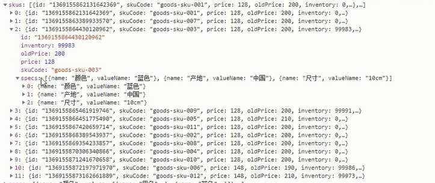 

`goods.spec` 数据结构：选项信息

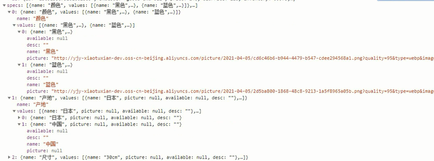 

大致步骤：

1. 根据后台返回的 skus 数据得到有效 sku 组合
2. 根据有效的 sku 组合得到所有的子集集合
3. 根据子集集合组合成一个路径字典
4. 在组件初始化的时候去判断每个规格是否点击
5. 在点击规格的时候去判断其他规格是否可点击
6. 判断的依据是，拿着所有有规格和现在已经选中的规则取搭配，得到可走路径。
   1. 如果可走路径在字典中，可点击
   2. 如果可走路径不在字典中，禁用

 

```html
<div class="goods-sku">
  <dl v-for="item in goods.specs" :key="item.id">
    <dt>{{item.name}}</dt>
    <dd>
      <template v-for="val in item.values" :key="val.name">
        
        <span :class="{selected:val.selected,disabled:val.disabled}"
              @click="changeSku(item,val)" v-else>{{val.name}}
        </span>
      </template>
    </dd>
  </dl>
</div>
```

```javascript
const props = defineProps({
  // 商品信息
	goods: { type: Object, default: () => ({}) },
  // SkuId
	skuId: { type: String, default: '' }
})
const emit = defineEmits(['change'])
```

根据传入的 skuId 设置**默认选中**

```javascript
// 默认选中
const initDefaultSelected = (goods, skuId) => {
  // 1. 找出sku的信息
  // 2. 遍历每一个按钮，按钮的值和sku记录的值相同，就选中。
  const sku = goods.skus.find(sku => sku.id === skuId)
  goods.specs.forEach((item, i) => {
    const val = item.values.find(val => val.name === sku.specs[i].valueName)
    val.selected = true
  })
}

if (props.skuId) {
  initDefaultSelected(props.goods, props.skuId)
}
```

根据 skus 数据得到**路径字典对象**

- js算法库 https://github.com/trekhleb/javascript-algorithms
- 幂集算法 powerSet https://raw.githubusercontent.com/trekhleb/javascript-algorithms/master/src/algorithms/sets/power-set/bwPowerSet.js

```javascript
import powerSet from '@/vender/power-set'
const spliter = '★'
const pathMap = getPathMap(props.goods.skus)
const getPathMap = (skus) => {
  const pathMap = {}
  skus.forEach(sku => {
    // 从所有的sku中筛选出有效的sku
    if (sku.inventory > 0) {
      const valueArr = sku.specs.map(val => val.valueName)
      // 根据有效的sku使用power-set算法，得到可选值数组
      // 例如：[1,2,3] ==> [[1],[2],[3],[1,2],[1,3],[2,3],[1,2,3]]
      const valueArrPowerSet = powerSet(valueArr)
      // 遍历子集，往pathMap插入数据
      valueArrPowerSet.forEach(arr => {
        // 根据arr得到字符串的key，约定key是：['蓝色','美国'] ===> '蓝色★美国'
        const key = arr.join(spliter)
        // 根据子集往路径字典对象中存储 key-value
        if (pathMap[key]) {
          pathMap[key].push(sku.id)
        } else {
          pathMap[key] = [sku.id]
        }
      })
    }
  })
  return pathMap
}
```

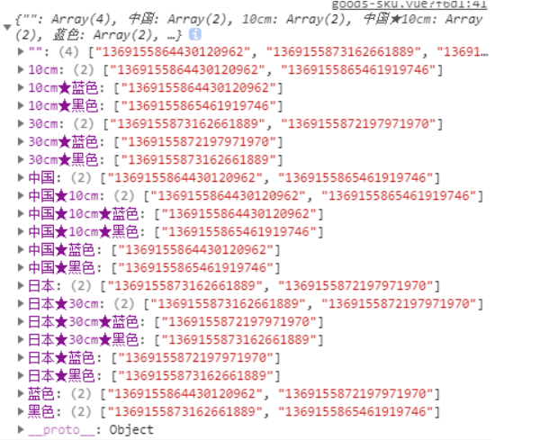 得到的路径字典对象

初始化按钮禁用状态

```javascript
updateDisabledStatus(props.goods.specs, pathMap)

// 获取已选中的值数组
const getSelectedValues = (specs) => {
  const arr = []
  // 遍历所有的规格选项
  specs.forEach(item => {
    // 获取选中的按钮的值
    const seletedVal = item.values.find(val => val.selected)
    arr.push(seletedVal ? seletedVal.name : undefined)
  })
  return arr
}

// 更新按钮禁用状态
const updateDisabledStatus = (specs, pathMap) => {
  // 1. 约定每一个按钮的状态由本身的disabled数据来控制
  specs.forEach((item, i) => {
    const selectedValues = getSelectedValues(specs)
    item.values.forEach(val => {
      // 2. 判断当前是否选中，是选中不用判断
      if (val.selected) return
      // 3. 如果未选，拿当前的值按照顺序套入选中的值数组
      selectedValues[i] = val.name
      // 4. 剔除undefined数据，按照分隔符拼接key
      const key = selectedValues.filter(value => value).join(spliter)
      // 5. 拿着key去路径字典中查找是否有数据，有可以点击，没有就禁用（true）
      val.disabled = !pathMap[key]
    })
  })
}
```

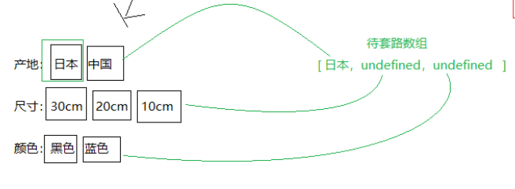 

选中与取消

```javascript
const changeSku = (item, val) => {
  // 当按钮是禁用的阻止程序运行
  if (val.disabled) return
  // 选中与取消选中逻辑
  if (val.selected) {
    val.selected = false
  } else {
    // 把所有规格按钮全部取消，当前按钮选中
    item.values.forEach(valItem => {
      valItem.selected = false
    })
    val.selected = true
  }
  // 点击按钮时：更新按钮禁用状态
  updateDisabledStatus(props.goods.specs, pathMap)
  
  // 将选择的sku信息通知父组件{skuId,price,oldPrice,inventory,specsText}
  const validSelectedValues = getSelectedValues(props.goods.specs).filter(v => v)
  // 选择完整的sku组合按钮，才可以拿到这些信息，提交父组件
  if (validSelectedValues.length === props.goods.specs.length) {
    const skuIds = pathMap[validSelectedValues.join(spliter)]
    const sku = props.goods.skus.find(sku => sku.id === skuIds[0])
    emit('change', {
      skuId: sku.id,
      price: sku.price,
      oldPrice: sku.oldPrice,
      inventory: sku.inventory,
      // 属性名：属性值 属性名1：属性值1 ... 这样的字符串
      specsText: sku.specs.reduce((p, c) => `${p} ${c.name}：${c.valueName}`, '').trim()
    })
  } else {
    // 不是完整的sku组合按钮，提交空对象父组件
    // 父组件需要判断是否规格选择完整，不完整不能加购物车。
    emit('change', {})
  }
}
```

父组件使用

```html
<goods-sku :goods="goods" @change="changeSku"></goods-sku>
```


### 购物车

购物车的各种操作都会分为**两种状态**，**未登录**和**已登录**

- 未登录，通过 mutations 修改 vuex 中的数据即可，vuex 已经实现持久化，会同步保持在本地
- 已登录，通过 api 接口请求，响应成功后通过 mutations 修改 vuex 中的数据即可，它也会同步在本地
- 登录后，需要合并本地购物车到服务端
- 退出后，清空 vuex 数据也会同步清空本地数据

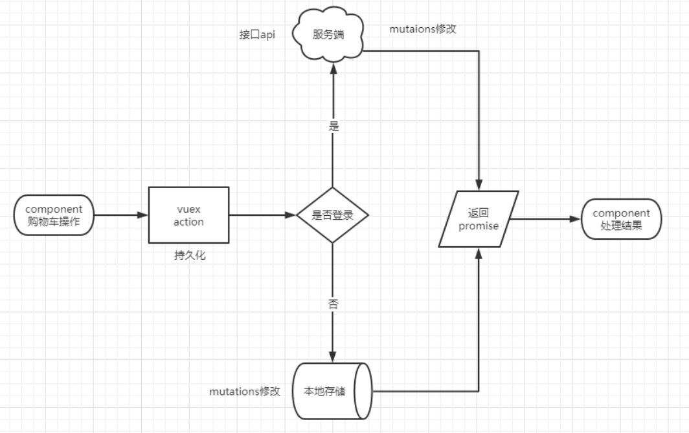 

#### 加入购物车

```javascript
state () {
  return {
    list: []	// 购物车商品列表
  }
}
mutations: {
  // 加入购物车
	insertCart (state, payload) {
    // 查找state中否有相同商品
	  const sameIndex = state.list.findIndex(goods => goods.skuId === payload.skuId)
	  // 如果有相同的商品，查询它的数量，累加到payload上，再保存最新位置，原来商品需要删除
    if (sameIndex > -1) {
	    const count = state.list[sameIndex].count
	    payload.count += count
	    // 删除原来
	    state.list.splice(sameIndex, 1)
	  }
	  // 追加新的商品
	  state.list.unshift(payload)
	},
  // 设置购物车
  setCart (state, payload) {
    // 如果payload为空数组，清空。如果payload为有值数组，设置。
    state.list = payload
  }
},
actions: {
  // 加入购物车
	insertCart (ctx, payload) {
	  return new Promise((resolve, reject) => {
	    if (ctx.rootState.user.profile.token) {
	      // 已登录的情况，调用API加入购物车
	      insertCartApi({ skuId: payload.skuId, count: payload.count }).then(() => {
	        // 调用API获取购物车列表
          return findCartApi()
	      }).then(data => {
          // 服务器获取的列表重新保存到本地
	        ctx.commit('setCart', data.result)
	        resolve()
	      })
	    } else {
	      // 未登录的情况，添加到本地
	      ctx.commit('insertCart', payload)
	      resolve()
	    }
	  })
	}
}
```

组件中调用

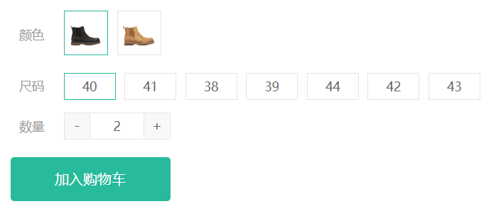 

```html
<!-- sku组件 -->
<goods-sku :goods="goods" @change="changeSku"></goods-sku>
<!-- 数量选择组件 -->
<goods-numbox label="数量" v-model="num" :max="goods.inventory"></goods-numbox>
<!-- 按钮组件 -->
<goods-button @click="insertCart()" type="primary" style="margin-top:20px">加入购物车</goods-button>
```

```javascript
const store = useStore()
const route = useRoute()
const num = ref(1)					// 选择数量
const currSku = ref(null)		// 选择后的sku
const goods = ref(null)			// 商品信息
```

```javascript
// 获取商品详情
watch(() => route.params.id, (newVal) => {
  if (newVal && `/product/${newVal}` === route.path) {
    findGoods(route.params.id).then(data => {
      // 让商品数据为null然后使用v-if的组件可以重新销毁和创建
      goods.value = null
      nextTick(() => {
        goods.value = data.result
      })
    })
  }
}, { immediate: true })
//修改sku信息
const changeSku = (sku) => {
  // 修改商品的现价原价库存信息
  if (sku.skuId) {
    goods.value.price = sku.price
    goods.value.oldPrice = sku.oldPrice
    goods.value.inventory = sku.inventory
  }
  // 记录选择后的sku，可能有数据，可能没有数据{}
  currSku.value = sku
}
```

```javascript
// 加入购物车
const insertCart = () => {
  if (currSku.value && currSku.value.skuId) {
    const { skuId, specsText: attrsText, inventory: stock } = currSku.value
    const { id, name, price, mainPictures } = goods.value
    store.dispatch('cart/insertCart', { 
      	skuId, attrsText, stock, id, name,
      	price, nowPrice: price, picture: mainPictures[0], 
      	selected: true, isEffective: true, count: num.value
    }).then(() => {
      Message({ type: 'success', text: '加入购物车成功' })
    })
  } else {
    Message({ text: '请选择完整规格' })
  }
}
```


#### 移出购物车

```javascript
state () {
  return {
    list: []	// 购物车商品列表
  }
}
mutations: {
	// 删除购物车商品
	deleteCart (state, skuId) {
	  const index = state.list.findIndex(item => item.skuId === skuId)
	  state.list.splice(index, 1)
	}
},
action: {
	// 删除购物车，payload为skuId
	deleteCart (ctx, payload) {
	  return new Promise((resolve, reject) => {
	    if (ctx.rootState.user.profile.token) {
	      // 已登录
	      deleteCartApi([payload]).then(() => {
          // 调用API重新获取购物车列表
	        return findCartApi()
	      }).then(data => {
          // 服务器获取的列表重新保存到本地
	        ctx.commit('setCart', data.result)
	        resolve()
	      })
	    } else {
	      // 未登录
	      ctx.commit('deleteCart', payload)
	      resolve()
	    }
	  })
	},
  // 批量删除，isClear 为true是清空失效商品，为false是删除选中商品
 	batchDeleteCart (ctx, isClear) {
 	  return new Promise((resolve, reject) => {
 	    if (ctx.rootState.user.profile.token) {
 	      // 已登录
 	      const ids = ctx.getters[isClear ? 'invalidList' : 'selectedList'].map(item => item.skuId)
 	      deleteCartApi(ids).then(() => {
          // 调用API重新获取购物车列表
 	        return findCartApi()
 	      }).then(data => {
          // 服务器获取的列表重新保存到本地
 	        ctx.commit('setCart', data.result)
 	        resolve()
 	      })
 	    } else {
 	      // 未登录，遍历删除
 	      ctx.getters[isClear ? 'invalidList' : 'selectedList'].forEach(item => {
 	        ctx.commit('deleteCart', item.skuId)
 	      })
 	      resolve()
 	    }
 	  })
 	}
}
```

组件中调用

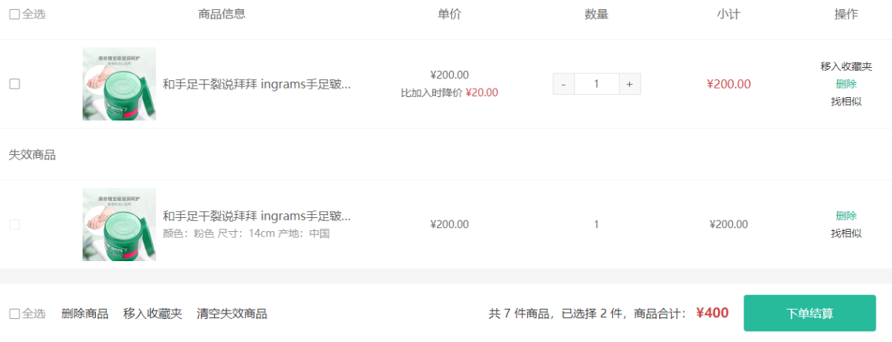 

```javascript
const store = useStore()
// 删除
const deleteCart = (skuId) => {
  Confirm({ text: '是否确认删除商品' }).then(() => {
    store.dispatch('cart/deleteCart', skuId).then(() => {
      Message({ type: 'success', text: '删除成功' })
    })
  }).catch(e => {})
}
// 批量删除选中商品，或清空无效商品
const batchDeleteCart = (isClear) => {
  Confirm({ text: `是否确认删除${isClear ? '失效' : '选中'}的商品` }).then(() => {
    store.dispatch('cart/batchDeleteCart', isClear)
  }).catch(e => {})
}
```


#### 有效 / 失效商品

```javascript
state () {
  return {
    list: []	// 购物车商品列表
  }
},
getters: {
	// 有效商品列表
	validList (state) {
	  // 有效商品：库存stock大于0 并且 商品有效标识isEffective为true  
	  return state.list.filter(goods => goods.stock > 0 && goods.isEffective)
	},
	// 有效商品总件数
	validTotal (state, getters) {
    // 件数累加
	  return getters.validList.reduce((p, c) => p + c.count, 0)
	},
	// 有效商品总金额
	validAmount (state, getters) {
    // 总金额累加
	  return getters.validList.reduce((p, c) => p + Math.round(c.nowPrice * 100) * c.count, 0) / 100
	},
	// 无效商品列表
	invalidList (state) {
	  return state.list.filter(goods => goods.stock <= 0 || !goods.isEffective)
	},
}
```


#### 合并本地购物车

登录后需要把把本地购物车合并，且清空本地购物车

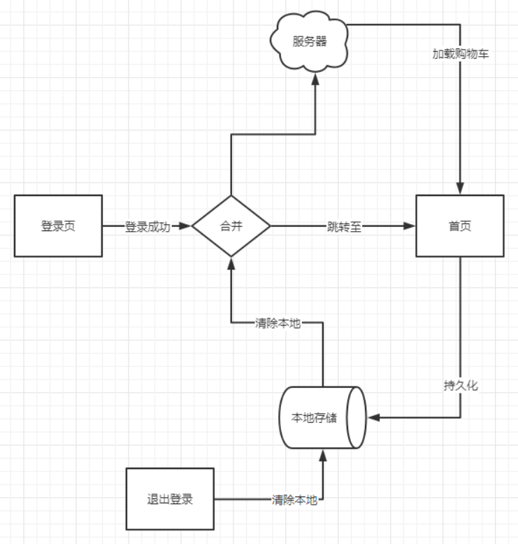 

```javascript
state () {
  return {
    list: []	// 购物车商品列表
  }
},
mutations: {
	// 设置购物车
	setCart (state, payload) {
	  state.list = payload
	}
},
actions: {
	// 合并购物车
	async mergeCart (ctx) {
	  // 准备合并的参数
	  const cartList = ctx.state.list.map(goods => {
	    return { skuId: goods.skuId, selected: goods.selected, count: goods.count }
	  })
    // 调用合并API接口函数进行购物合并
	  await mergeLocalCartApi(cartList)
	  // 合并成功，清空本地购物车
	  ctx.commit('setCart', [])
	}
}
```

登录组件中在**登录完成后**调用合并购物车函数

```javascript
// 登录
const login = async () => {
  const valid = await formCom.value.validate()
  if (valid) {
    try {
      // 登录处理
      const { account, password } = form
      const data = await userAccountLogin({ account, password })
      // 存储用户信息
      const { id, account, avatar, mobile, nickname, token } = data.result
      store.commit('user/setUser', { id, account, avatar, mobile, nickname, token })
      // 合并购物车
      store.dispatch('cart/mergeCart').then(() => {
        // 合并成功后进行跳转
        router.push(route.query.redirectUrl || '/')
        // 成功消息提示
        Message({ type: 'success', text: '登录成功' })
      })
    } catch (e) {
      // 失败提示
      if (e.response.data) {
        Message({ type: 'error', text: e.response.data.message || '登录失败' })
      }
    }
  }
}
```


#### 修改购物车

```javascript
state () {
  return {
    list: []	// 购物车商品列表
  }
},
mutations: {
	// 修改购物车商品
	updateCart (state, goods) {
    // 查找要修改的商品信息
	  const updateGoods = state.list.find(item => item.skuId === goods.skuId)
    // 商品对象参数的字段不固定，只修改参数传递来的字段
	  for (const key in goods) {
	    if (goods[key] !== undefined && goods[key] !== null && goods[key] !== '') {
	      updateGoods[key] = goods[key]
	    }
	  }
	},
	// 设置购物车
	setCart (state, payload) {
	  state.list = payload
	}
},
actions: {
  // 修改购物车
	updateCart (ctx, payload) {
	  return new Promise((resolve, reject) => {
	    if (ctx.rootState.user.profile.token) {
	      // 已登录
	      updateCartApi(payload).then(() => {
          // 调用API重新获取购物车列表
	        return findCartApi()
	      }).then(data => {
          // 服务器获取的列表重新保存到本地
	        ctx.commit('setCart', data.result)
	        resolve()
	      })
	    } else {
	      // 未登录
	      ctx.commit('updateCart', payload)
	      resolve()
	    }
	  })
	}
}
```

```javascript
actions: {
  // 修改规格，参数：旧SkuId，新Sku数据
	updateCartSku (ctx, { oldSkuId, newSku }) {
	  return new Promise((resolve, reject) => {
	    if (ctx.rootState.user.profile.token) {
	      // 已登录
        // 找出旧的商品信息
	      const oldGoods = ctx.state.list.find(item => item.skuId === oldSkuId)
        // 调用Api删除旧商品数据
	      deleteCartApi([oldGoods.skuId]).then(() => {
          // 添加新的商品(原先商品的数量+新skuId)
	        return insertCartApi({ skuId: newSku.skuId, count: oldGoods.count })
	      }).then(() => {
          // 调用API重新获取购物车列表
	        return findCartApi()
	      }).then(data => {
	        ctx.commit('setCart', data.result)
	        resolve()
	      })
	    } else {
	      // 未登录
        // 找出旧的商品信息
	      const oldGoods = ctx.state.list.find(item => item.skuId === oldSkuId)
        // 删除本地旧商品数据
	      ctx.commit('deleteCart', oldSkuId)
        // 根据新的sku信息和旧的商品信息，合并成一条新的购物车商品数据
	      const { skuId, price: nowPrice, specsText: attrsText, inventory: stock } = newSku
	      const newGoods = { ...oldGoods, skuId, nowPrice, attrsText, stock }
        // 添加新的商品
	      ctx.commit('insertCart', newGoods)
	      resolve()
	    }
	  })
	}
}
```

组件中使用

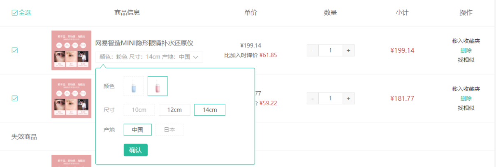 

```html
<tr v-for="goods in $store.getters['cart/validList']" :key="goods.skuId">
	<!-- 选择规格 -->
  <td>
	<cart-sku @change="$event=>updateCartSku(goods.skuId, $event)" 
            :skuId="goods.skuId" :attrsText="goods.attrsText" />
  </td>
  <!-- 修改数量 -->
	<td>
	  <goods-numbox @change="$event=>updateCount(goods.skuId,$event)"
                  :max="goods.stock" :modelValue="goods.count"/>
  </td>
  <!-- 其他省略 -->
</tr>
```

```javascript
const store = useStore()
// 修改数量
const updateCount = (skuId, count) => {
  store.dispatch('cart/updateCart', { skuId, count })
}
// 修改规格
const updateCartSku = (oldSkuId, newSku) => {
  store.dispatch('cart/updateCartSku', { oldSkuId, newSku })
}
```


#### 单选 / 全选商品

```javascript
getters: {
	// 已选商品列表
	selectedList (state, getters) {
	  return getters.validList.filter(item => item.selected)
	},
	// 已选商品总件数
	selectedTotal (state, getters) {
	  return getters.selectedList.reduce((p, c) => p + c.count, 0)
	},
	// 已选商品总金额
	selectedAmount (state, getters) {
	  return getters.selectedList.reduce((p, c) => p + Math.round(c.nowPrice * 100) * c.count, 0) / 100
	},
	// 是否全选
	isCheckAll (state, getters) {
	  return getters.validList.length !== 0 && getters.selectedList.length === getters.validList.length
	}
}
```

```javascript
actions: {
  // 全选与取消全选
 	checkAllCart (ctx, selected) {
 	  return new Promise((resolve, reject) => {
 	    if (ctx.rootState.user.profile.token) {
 	      // 已登录
        // 筛选出所有有效商品的skuid
 	      const ids = ctx.getters.validList.map(item => item.skuId)
        // 调用Api进行全选/反选
 	      checkAllCartApi({ selected, ids }).then(() => {
          // 调用API重新获取购物车列表
 	        return findCartApi()
 	      }).then(data => {
 	        ctx.commit('setCart', data.result)
 	        resolve()
 	      })
 	    } else {
 	      // 未登录，循环选中/取消选中
 	      ctx.getters.validList.forEach(goods => {
 	        ctx.commit('updateCart', { skuId: goods.skuId, selected })
 	      })
 	      resolve()
 	    }
 	  })
 	}  
}
```

组件中使用

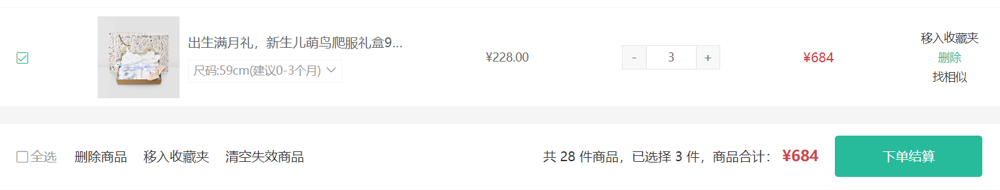 

```html
<tr v-for="goods in $store.getters['cart/validList']" :key="goods.skuId">
	<!-- 单选 -->
  <td>
    <goods-checkbox @change="($event)=>checkOne(goods.skuId, $event)"
                    :modelValue="goods.selected" />
  </td>
  <!-- 其他省略 -->
</tr>
<div>
  <!-- 全选 -->
  <goods-checkbox @change="checkAll"
                  :modelValue="$store.getters['cart/isCheckAll']">全选</goods-checkbox>
</div>
<div class="total">
  共 {{$store.getters['cart/validTotal']}} 件商品，已选择 {{$store.getters['cart/selectedTotal']}} 件
  ，商品合计：<span class="red">¥{{$store.getters['cart/selectedAmount']}}</span>
</div>
```

```javascript
const store = useStore()
// 单选
const checkOne = (skuId, selected) => {
  store.dispatch('cart/updateCart', { skuId, selected })
}
// 全选
const checkAll = (selected) => {
  store.dispatch('cart/checkAllCart', selected)
}
```


#### 获取购物车

```javascript
state () {
  return {
    list: []	// 购物车商品列表
  }
},
actions: {
	// 获取商品列表
	findCart (ctx) {
	  return new Promise((resolve, reject) => {
	    if (ctx.rootState.user.profile.token) {
	      // 已登录
        // 调用API获取购物车列表
	      findCartApi().then(data => {
          // 购物车信息保存到本地
	        ctx.commit('setCart', data.result)
	        resolve()
	      })
	    } else {
	      // 未登录
	      // 通过商品skuid更新本地购物车信息
        const promiseArr = ctx.state.list.map(goods => {
          // 获取最新的商品信息
	        return getNewCartGoodsApi(goods.skuId)
	      })
	      // dataList是成功结果的集合，数据顺序和promiseArr顺序一致，也就是和state.list一致
	      Promise.all(promiseArr).then(dataList => {
	        // 更新本地购物车
	        dataList.forEach((data, i) => {
	          ctx.commit('updateCart', { skuId: ctx.state.list[i].skuId, ...data.result })
	        })
	        resolve()
	      })
	    }
	  })
	}
}
```

组件初始化的时候调用

```javascript
const store = useStore()
store.dispatch('cart/findCart')
```


#### 下单结算

```javascript
const store = useStore()
const router = useRouter()
const checkout = () => {
  // 判断是否选中商品
  if (store.getters['cart/selectedList'].length === 0) {
    return Message({ text: '至少选中一件商品' })
  }
  // 如果登录直接跳转
  if (store.state.user.profile.token) {
    return router.push('/checkout')
  }
  // 未登录弹出确认框
  Confirm({ text: '下单结算需要登录，确认现在去登录吗？' }).then(() => {
    router.push('/checkout')
  }).catch(e => {})
}
```

```javascript
// 路由拦截
router.beforeEach((to, from) => {
  // 用户信息
  const { token } = store.state.user.profile
  // 跳转去checkout开头的地址却没有登录
  if (to.path.startsWith('/checkout') && !token) {
    return { path: '/login', query: { redirectUrl: to.fullPath } }
  }
})
```


## 基础控件

### 按钮

```html
<button class="my-button ellipsis" :class="[size,type]">
  <slot />
</button>
```

```javascript
const prop = defineProps({
  size: { type: String, default: 'middle' },
	type: { type: String, default: 'default' }
})
```

```less
.my-button {
  appearance: none;
  border: none;
  outline: none;
  background: #fff;
  text-align: center;
  border: 1px solid transparent;
  border-radius: 4px;
  cursor: pointer;
}
.large {
  width: 240px;
  height: 50px;
  font-size: 16px;
}
.middle {
  width: 180px;
  height: 50px;
  font-size: 16px;
}
.small {
  width: 100px;
  height: 32px;
  font-size: 14px;
}
.mini {
  width: 60px;
  height: 32px;
  font-size: 14px;
}
.default {
  border-color: #e4e4e4;
  color: #666;
}
.primary {
  border-color: @xtxColor;
  background: @xtxColor;
  color: #fff;
}
.plain {
  border-color: @xtxColor;
  color: @xtxColor;
  background: lighten(@xtxColor,50%);
}
.gray {
  border-color: #ccc;
  background: #ccc;;
  color: #fff;
}
```

父组件使用

```html
<my-button @click="cancel" size="mini" type="gray">取消</my-button>
<my-button @click="submit" size="mini" type="primary">确认</my-button>
```


### 排序按钮

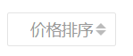 

```html
<a @click="changeSort()" href="javascript:;">
  价格排序
  <i class="arrow up" :class="{active: sortMethod=='asc'}" />
  <i class="arrow down" :class="{active: sortMethod=='desc'}" />
</a>
```

```less
a {
  height: 30px;
  line-height: 28px;
  border: 1px solid #e4e4e4;
  padding: 0 20px;
  margin-right: 20px;
  color: #999;
  border-radius: 2px;
  position: relative;
  transition: all .3s;
  &.active {
    background: @xtxColor;
    border-color: @xtxColor;
    color: #fff;
  }
  .arrow {
    position: absolute;
    border: 5px solid transparent;
    right: 8px;
    &.up {
      top: 3px;
      border-bottom-color: #bbb;
        &.active {
        border-bottom-color: @xtxColor;
      }
    }
    &.down {
      top: 15px;
      border-top-color: #bbb;
      &.active {
        border-top-color: @xtxColor;
      }
    }
  }
}
```

```javascript
const sortMethod = ref(null)
const emit = defineEmits(['sort-change'])
const changeSort = (sortField) => {
	if (sortMethod.value === null) {
	  sortMethod.value = 'desc'
	} else {
	  sortMethod.value = sortMethod.value === 'desc' ? 'asc' : 'desc'
	}
  emit('sort-change', sortMethod)
}
```


### SVG 图标

同时可以处理外部 svg 图标和项目内部的 svg 图标

```html
<!-- 外部图标 -->
<div v-if="isExternal" :style="styleExternalIcon"
     class="svg-external-icon svg-icon" :class="className"/>
<!-- 内部图标 -->
<svg v-else class="svg-icon" :class="className" aria-hidden="true">
  <use :xlink:href="iconName" :fill="color"/>
</svg>
```

```javascript
const props = defineProps({
  // icon 图标
  icon: { type: String, required: true },
  // 图标类名
  className: { type: String, default: '' },
  // svg 图标的颜色
  color: { type: String }
})

// 项目内部图标，添加前缀
const iconName = computed(() => `#icon-${props.icon}`)

// 判断是否为外部图标
const isExternal = computed(() => /^(https?:|mailto:|tel:)/.test(props.icon))
// 外部图标样式
const styleExternalIcon = computed(() => ({
  mask: `url(${props.icon}) no-repeat 50% 50%`,
  '-webkit-mask': `url(${props.icon}) no-repeat 50% 50%`
}))
```

```css
.svg-icon {
  width: 1em;
  height: 1em;
  vertical-align: -0.15em;
  fill: currentColor;
  overflow: hidden;
}

.svg-external-icon {
  background-color: currentColor;
  mask-size: cover !important;
  display: inline-block;
}
```

**webpack 中配置**

- 导入所有内部 SVG 图标

  ```javascript
  import SvgIcon from '@/components/SvgIcon'
  
  // https://webpack.docschina.org/guides/dependency-management/#requirecontext
  // 通过 require.context() 函数来创建自己的 context
  const svgRequire = require.context('./svg', false, /\.svg$/)
  // 此时返回一个 require 的函数，可以接受一个 request 的参数，用于 require 的导入。
  // 该函数提供了三个属性，可以通过 require.keys() 获取到所有的 svg 图标
  // 遍历图标，把图标作为 request 传入到 require 导入函数中，完成本地 svg 图标的导入
  svgRequire.keys().forEach(svgIcon => svgRequire(svgIcon))
  
  export default app => {
    app.component('svg-icon', SvgIcon)
  }
  ```


- 使用 webpack 的 **svg-sprite-loader** 处理 svg 图标

  ```bash
  npm i --save-dev svg-sprite-loader
  ```

- vue.config.js 文件中添加配置

  ```javascript
  const path = require('path')
  module.exports = {
    chainWebpack(config) {
      // 设置 svg-sprite-loader
      config.module
        .rule('svg')
        .exclude.add(path.join(__dirname, 'src/icons'))
        .end()
      config.module
        .rule('icons')
        .test(/\.svg$/)
        .include.add(path.join(__dirname, 'src/icons'))
        .end()
        .use('svg-sprite-loader')
        .loader('svg-sprite-loader')
        .options({
          symbolId: 'icon-[name]'
        })
        .end()
    }
  }
  ```


**Vite 中配置**

- 使用 Vite 的 **vite-plugin-svg-icons** 处理 svg 图标

  ```bash
  npm i vite-plugin-svg-icons -D
  ```

- vite.config.ts 文件中添加配置

  ```javascript
  import { createSvgIconsPlugin } from 'vite-plugin-svg-icons'
  export default defineConfig({
    plugins: [
      vue(),
      createSvgIconsPlugin({
        // 指定需要缓存的图标文件夹
        iconDirs: [path.resolve(process.cwd(), 'src/assets/icons')],
        // 指定symbolId格式
        symbolId: 'icon-[name]'
      })
    ],
  })
  ```

  main.js 中导入 svg 图标

  ```javascript
  import 'virtual:svg-icons-register
  ```

组件中使用

```html
<!-- 内部图标 -->
<svg-icon :icon="icon"></svg-icon>
<!-- 外部图标 -->
<svg-icon icon="https://res.lgdsunday.club/user.svg"></svg-icon>
```


### 全屏

使用 Fullscreen API 的包装库 screenfull

```bash
npm i screenfull
```

创建全屏按钮组件

```html
<div>
  <svg-icon :icon="isFullscreen ? 'exit-fullscreen' : 'fullscreen'" @click="onToggle"/>
</div>
```

```javascript
import { ref, onMounted, onUnmounted } from 'vue'
import screenfull from 'screenfull'

// 是否全屏
const isFullscreen = ref(false)

// 切换事件
const onToggle = () => {
  screenfull.toggle()
}

// 设置侦听器
onMounted(() => {
  screenfull.on('change', change)
})

// 删除侦听器
onUnmounted(() => {
  screenfull.off('change', change)
})

// 监听变化
const change = () => {
  isFullscreen.value = screenfull.isFullscreen
}
```


### 引导页

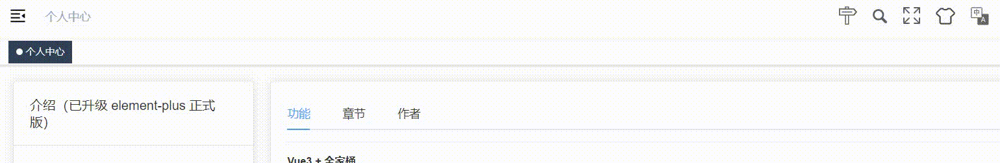 

**安装 driver.js**

```bash
npm i driver.js
```

创建引导页组件

```html
<div>
  <el-tooltip :content="$t('msg.navBar.guide')">
    <svg-icon id="guide-start" icon="guide" @click="onClick" />
  </el-tooltip>
</div>
```

在组件中**初始化 driver**

```javascript
import Driver from 'driver.js'
import 'driver.js/dist/driver.min.css'
import { onMounted } from 'vue'
import steps from './steps'

let driver = null
onMounted(() => {
  initDriver()
})

// 初始化 driver
const initDriver = () => {
  driver = new Driver({
    animate: false,
    // 禁止点击蒙版关闭
    allowClose: false,
    closeBtnText: i18n.t('msg.guide.close'),
    nextBtnText: i18n.t('msg.guide.next'),
    prevBtnText: i18n.t('msg.guide.prev')
  })
}

// 开始引导
const onClick = () => {
  driver.defineSteps(steps(i18n))
  driver.start()
}
```

**创建步骤定义**

```javascript
// 此处不要导入 @/i18n 使用 i18n.global 
// 因为在 router 中 layout 不是按需加载，所以会在 Guide 会在 I18n 初始化完成之前被直接调用。导致 i18n 为 undefined
const steps = i18n => {
  return [
    {
      // 引导也需要渲染在哪个id
      element: '#guide-start',
      popover: {
        // 标题
        title: i18n.t('msg.guide.guideTitle'),
        // 描述内容
        description: i18n.t('msg.guide.guideDesc'),
        // 显示位置
        position: 'bottom-right'
      }
    },
    {
      // <svg-icon id="guide-search" />
      element: '#guide-search',
      popover: {
        title: i18n.t('msg.guide.searchTitle'),
        description: i18n.t('msg.guide.searchDesc'),
        position: 'bottom-right'
      }
    },
    {
      element: '#guide-theme',
      popover: {
        title: i18n.t('msg.guide.themeTitle'),
        description: i18n.t('msg.guide.themeDesc'),
        position: 'bottom-right'
      }
    }
  ]
}
export default steps
```


### 页面打印

 

使用 **vue-print-nb** 插件进行局部打印，vue-print-nb **以指令的形式存在**

```bash
npm i vue3-print-nb
```

在 main.js 中注册

```javascript
import print from 'vue3-print-nb'
...
app.use(print)
```

将指令挂载到打印按钮上

```html
<el-button type="primary" v-print="printObj" :loading="printLoading">
	print
</el-button>
```

指定打印区域的 id 进行匹配

```html
<div id="userInfoBox" class="user-info-box">
  ...
</div>
```

创建打印对象

```javascript
const printLoading = ref(false)
const printObj = {
  // 打印区域
  id: 'userInfoBox',
  // 打印标题
  popTitle: 'imooc-vue-element-admin',
  // 打印前
  beforeOpenCallback(vue) {
    printLoading.value = true
  },
  // 执行打印
  openCallback(vue) {
    printLoading.value = false
  }
}
```


## 导航控件

### 面包屑

#### 原生封装

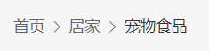 

使用 `render` 函数进行拼接创建（最后一项不需要 `>` 图标，需要动态创建）

父容器 breadcrumb 组件

```javascript
render () {
  const items = this.$slots.default()
  const dymanicItems = []
  // 遍历插槽中的 item，得到一个动态创建的节点，最后一个 item 不加 i 标签
  items.forEach((item, i) => {
    // 对插槽节点进行判断
    if (item.type.name === 'breadcrumbItem' || item.type.displayName === 'transition') {
      dymanicItems.push(item)
      if (i < (items.length - 1)) {
        dymanicItems.push(h('i', { class: 'iconfont icon-angle-right' }))
      }
    }
  })
  // 把动态创建的节点渲染再放入 breadcrumb 标签中
  // h函数：第一个参数：标签名字，第二个参数：标签属性对象，第三个参数：子节点
  return h('div', { class: 'xtx-bread' }, dymanicItems)
}
```

```vue
<!-- 去除 scoped 属性，让样式可以作用到 bread-item 组件 -->
<style lang='less'>
.xtx-bread{
  display: flex;
  padding: 25px 10px;
  &-item {
    a {
      color: #666;
      transition: all .4s;
      &:hover {
        color: @xtxColor;
      }
    }
  }
  i {
    font-size: 12px;
    margin-left: 5px;
    margin-right: 5px;
    line-height: 22px;
  }
}
</style>
```

子容器 breadcrumbItem 组件

```html
<div class="breadcrum-item">
  <router-Link v-if="to" :to="to">
    <slot></slot>
  </router-Link>
  <span v-else>
    <slot></slot>
  </span>
</div>
```

```vue
<script setup name="breadcrumbItem">
	const props = defineProps({
		to: { type: [String, Object], default: '' }
  })
</script>
```

组件内使用

```html
<breadcrumb>
	<breadcrum-item to="/">首页</breadcrum-item>
	<breadcrum-item v-if="category.top" :to="`/category/${category.top.id}`">
    {{category.top.name}}
  </breadcrum-item>
	<breadcrum-item v-if="category.sub" :key="category.sub.id">
      {{category.sub.name}}
  </breadcrum-item>
</breadcrumb>
```

```javascript
const route = useRoute()
const store = useStore()
const category = computed(() => {
  const obj = {}
  store.state.category.list.forEach(top => {
    top.children && top.children.forEach(sub => {
      if (sub.id === route.params.id) {
        // 设置二级类目
        obj.sub = { id: sub.id, name: sub.name }
        // 设置一级类目
        obj.top = { id: top.id, name: top.name }
      }
    })
  })
  return obj
})
```


#### Element 封装

使用 Element 二次封装面包屑

```html
<my-breadcrumb :breadcrumbs="breadcrumbs" />
```

父组件中获取面包屑数据：`[{name: string, path: string}]`

通过当前路由地址，例如当前路由为 `/system/user`，则面包屑就应该显示为：系统 / 用户管理

```javascript
const store = useStore()
const breadcrumbs = computed(() => {
  // 当前菜单
  const userMenus = store.state.login.userMenus
  const route = useRoute()
  // 当前路由
  const currentPath = route.path
  // 获取当前面包屑，{name, path} 数组形式
  return pathMapBreadcrumbs(userMenus, currentPath)
})
```

根据当前路由和菜单的映射关系获取面包屑

菜单结构例：

`[{name: '系统', url: '/system', type: '1', children: {name: '用户', url: '/system/user', type: '2'}}, ...]`

```javascript
export interface IBreadcrumb {
  name: string
  path: string
}
export function pathMapBreadcrumbs(userMenus: any[], currentPath: string) {
  const breadcrumbs: IBreadcrumb[] = []
  const pathMapToMenu = ((userMenus) => {
    for (const menu of userMenus) {
      if (menu.url === currentPath || pathMapToMenu(menu.children ?? [])) {
        breadcrumbs.unshift({ name: menu.name, path: menu.url })
        return menu
      }
  })
  pathMapToMenu(userMenus)
  return breadcrumbs
}
```

面包屑组件

```html
<el-breadcrumb separator="/">
  <template v-for="item in breadcrumbs" :key="item.name">
    <el-breadcrumb-item :to="{ path: item.path }">{{item.name}}</el-breadcrumb-item>
  </template>
</el-breadcrumb>
```

```javascript
import { defineComponent, PropType } from 'vue'
import { IBreadcrumb } from '../types'
const breadcrumbs = defineProps({
	type: Array as PropType<IBreadcrumb[]>,
	default: () => []
})
```


### 标签页

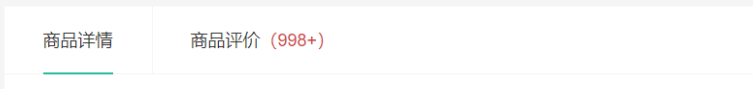 

```html
<div class="goods-tabs">
  <nav>
    <a :class="{ active: activeName === 'detail' }" href="javascript:;" @click="clickTab('detail')">
      商品详情
    </a>
    <a :class="{ active: activeName === 'comment' }" href="javascript:;" @click="clickTab('comment')">
      商品评价<span>(500+)</span>
    </a>
  </nav>
  <!-- 这个位置显示对应的组件 GoodsDetail 或者 GoodsComment -->
  <component :is="'goods-'+activeName" />
</div>
```

```javascript
const activeName = ref('detail')
const clickTab = (name) => {
  activeName.value = name
}
```

父组件使用

```html
<goods-tabs :goods="goods"></goods-tabs>
```


### 可关闭标签页

 

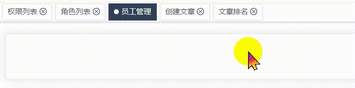 

**创建记录标签页的状态管理**

```javascript
state: () => {
  tagsViewList: getItem('tagsView') || []
},
mutations: {
  // 添加标签
  addTagsViewList(state, tag) {
    const isFind = state.tagsViewList.find(item => {
      return item.path === tag.path
    })
    // 处理重复
    if (!isFind) {
      state.tagsViewList.push(tag)
      setItem('tagsView', state.tagsViewList)
    }
  },

  // 删除标签
	removeTagsView(state, payload) {
	  if (payload.type === 'index') {
      // 根据下标删除
	    state.tagsViewList.splice(payload.index, 1)
	    return
	  } else if (payload.type === 'other') {
      // 删除其他所有
	    state.tagsViewList.splice(
	      payload.index + 1,
	      state.tagsViewList.length - payload.index + 1
	    )
	    state.tagsViewList.splice(0, payload.index)
	  } else if (payload.type === 'right') {
      // 删除右侧所有
	    state.tagsViewList.splice(
	      payload.index + 1,
	      state.tagsViewList.length - payload.index + 1
	    )
	  }
	  setItem(TAGS_VIEW, state.tagsViewList)
	},

  // 更新标签
  changeTagsView(state, { index, tag }) {
    state.tagsViewList[index] = tag
    setItem('tagsView', state.tagsViewList)
	},

  // 初始化标签（退出登录等调用）
	initTagsViewList(state) {
	  state.tagsViewList = []
	}
}
```

**创建标签页组件**

根据数据渲染标签，同时具备路由跳转功能

```html
<div class="tags-view-container">
  <el-scrollbar class="tags-view-wrapper">
    <router-link v-for="(tag, index) in $store.state.app.tagsViewList" :key="tag.fullPath"
                 :to="{ path: tag.fullPath }"
                 class="tags-view-item" :class="isActive(tag) ? 'active' : ''"
                 @contextmenu.prevent="openMenu($event, index)">
      {{ tag.title }}
      <i v-show="!isActive(tag)" class="el-icon-close" @click.prevent.stop="onCloseClick(index)"/>
    </router-link>
  </el-scrollbar>
  <!-- 右键菜单 -->
  <context-menu v-show="visible" :style="menuStyle" :index="selectIndex"></context-menu>
</div>
```

```javascript
import { ref, reactive, watch } from 'vue'
import { useRoute } from 'vue-router'
import { useStore } from 'vuex'
const route = useRoute()
const store = useStore()

// 是否被选中
const isActive = tag => {
  return tag.path === route.path
}

// 关闭 tag 的点击事件
const onCloseClick = index => {
  store.commit('app/removeTagsView', { type: 'index', index: index })
}

// 右键菜单相关
const selectIndex = ref(0)
const visible = ref(false)
const menuStyle = reactive({
  left: 0,
  top: 0
})

// 展示右键菜单
const openMenu = (e, index) => {
  const { x, y } = e
  menuStyle.left = x + 'px'
  menuStyle.top = y + 'px'
  selectIndex.value = index
  visible.value = true
}

// 关闭右键菜单
const closeMenu = () => {
  visible.value = false
}

// 添加/移除关闭右键菜单事件
watch(visible, val => {
  if (val) {
    document.body.addEventListener('click', closeMenu)
  } else {
    document.body.removeEventListener('click', closeMenu)
  }
})
```

**创建标签右键菜单**

```html
<ul class="context-menu-container">
  <li @click="onRefreshClick">刷新</li>
  <li @click="onCloseRightClick">关闭右侧</li>
  <li @click="onCloseOtherClick">关闭其他</li>
</ul>
```

```javascript
import { defineProps } from 'vue'
import { useRouter } from 'vue-router'
import { useStore } from 'vuex'

const props = defineProps({
  index: { type: Number, required: true }
})

const router = useRouter()
// 刷新
const onRefreshClick = () => {
  router.go(0)
}
// 关闭右侧
const store = useStore()
const onCloseRightClick = () => {
  store.commit('app/removeTagsView', {
    type: 'right',
    index: props.index
  })
}
// 关闭其他
const onCloseOtherClick = () => {
  store.commit('app/removeTagsView', {
    type: 'other',
    index: props.index
  })
}
```

**创建组件切换渲染组件**，处理基于路由的动态过渡

```html
<div class="app-main">
  <router-view v-slot="{ Component, route }">
    <transition name="fade-transform" mode="out-in">
      <!-- 标签页内容需要被缓存 -->
      <keep-alive>
        <component :is="Component" :key="route.path" />
      </keep-alive>
    </transition>
  </router-view>
</div>
```

```javascript
import { useRoute } from 'vue-router'
import { useStore } from 'vuex'
import { isTags } from '@/utils/tags'
import { generateTitle } from '@/utils/i18n'

const route = useRoute()
const store = useStore()

// 监听路由变化，添加标签页记录
watch(route, (to, from) => {
  // 判断当前路由是否需要被添加
	if (!isTags(to.path)) return
    const { fullPath, meta, name, params, path, query } = to
    store.commit('app/addTagsViewList', 
                 { fullPath, meta, name, params, path, query, title: getTitle(to) })
  }, { immediate: true}
)

// 获取标签页标题
const getTitle = route => {
  let title = ''
  if (!route.meta) {
    const pathArr = route.path.split('/')
    title = pathArr[pathArr.length - 1]
  } else {
    title = generateTitle(route.meta.title)
  }
  return title
}

// 国际化语言变化，更新标题
watch(() => store.getters.language, () => {
  store.getters.tagsViewList.forEach((route, index) => {
    store.commit('app/changeTagsView', { index, tag: { ...route, title: getTitle(route) } })
  })
})
```

> 标签页缓存记录黑名单
>
> ```javascript
> const blackList = ['/login', '/import', '/404', '/401']
> // path 是否需要被缓存
> export function isTags(path) {
> return !whiteList.includes(path)
> }
> ```
>
> 标签页标题国际化
>
> ```javascript
> import i18n from '@/i18n'
> export function generateTitle(title) {
> return i18n.global.t('msg.route.' + title)
> }
> ```
>
> 对于缓存的组件，如果数据发生变化需要重新加载数据，需要使用监听 `onActivated` 事件，重新获取数据
>
> ```javascript
> import { onActivated } from 'vue'
> onActivated(getDataFun)
> ```

父组件使用

```html
<!-- 标签 -->
<tags-view></tags-view>
 <!-- 内容区 -->
<app-main></app-main>
```


### 滑块标签页

筋斗云特效：ul 的横向滚动距离 + 当前元素距离屏幕边缘的距离

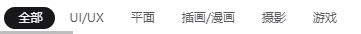 

```html
<ul class="relative ..." ref="ulTarget">
  <!-- 滑块 -->
  <li class="absolute ..." :style="sliderStyle"></li>
  <!-- category item -->
  <li v-for="(item, index) in $store.getters.categorys" :key="item.id"
      :ref="setItemRef" @click="onItemClick(index)">
    {{ item.name }}
  </li>
</ul>
```

```javascript
import { onBeforeUpdate } from 'vue'
import { useScroll } from '@vueuse/core'

const currentCategoryIndex = ref(0)

// 滑块位置
const sliderStyle = ref({
  transform: 'translateX(0px)',
  width: '52px'
})

// item 点击事件
const onItemClick = (index) => {
	currentCategoryIndex.value = index
}

// 获取 ul 元素，以计算偏移位置
const ulTarget = ref(null)

// 获取填充的所有 item 元素
let itemRefs = []
const setItemRef = (el) => {
  if (el) {
    itemRefs.push(el)
  }
}

// 数据改变之后，DOM变化之前
onBeforeUpdate(() => {
  itemRefs = []
})

// 获取ul的响应式横向滚动距离
const { x: ulScrollLeft } = useScroll(ulTarget)

watch(currentCategoryIndex, (val) => {
    // 获取选中元素的 left、width
    const { left, width } = itemRefs[val].getBoundingClientRect()
    // 为 sliderStyle 设置属性
    sliderStyle.value = {
      // ul 横向滚动位置 + 当前元素的 left 偏移量
      transform: `translateX(${ulScrollLeft.value + left - 10 + 'px'})`,
      width: width + 'px'
    }
  }
)
```


## 展示控件

### 骨架屏

 

组件封装

```html
<!-- 盒子 -->
<div class="skeleton" :style="{width,height}" :class="{shan:animated}">
  <div class="block" :style="{backgroundColor:bg}"></div>
</div>
```

```javascript
const props = defineProps({
  // 背景颜色
  bg: { type: String, default: '#efefef' },
  // 宽度
  width: { type: String, default: '100px' },
  // 高度
  height: { type: String, default: '100px' },
  // 是否动画
  animated: { type: Boolean, default: false }
}
```

```less
.skeleton {
  display: inline-block;
  position: relative;
  overflow: hidden;
  vertical-align: middle;
  .block {
    width: 100%;
    height: 100%;
    border-radius: 2px;
  }
}
.shan {
  &::after {
    content: "";
    position: absolute;
    animation: shan 1.5s ease 0s infinite;
    top: 0;
    width: 50%;
    height: 100%;
    background: linear-gradient(
      to left,
      rgba(255, 255, 255, 0) 0,
      rgba(255, 255, 255, 0.3) 50%,
      rgba(255, 255, 255, 0) 100%
    );
    transform: skewX(-45deg);
  }
}
@keyframes shan {
  0% {
    left: -100%;
  }
  100% {
    left: 120%;
  }
}
```

父组件

```html
<template v-if="item">
  <!-- ... -->
</template>
<!-- 骨架 -->
<template v-else>
  <skeleton height="18px" width="60px" bg="rgba(255,255,255,0.2)" style="margin-right:5px" />
</template>
```


### 轮播图

大致要点

- 自动播放

- 鼠标进入开启，离开暂停
- 指示器切换，上一张，下一张
- 销毁组件，清理定时器

```html
<div class='carousel' @mouseenter="stop()" @mouseleave="start()">
  <ul class="carousel-body">
    <li class="carousel-item" v-for="(item,i) in sliders" :key="i" :class="{fade:index===i}">
      <router-link v-if="item.imgUrl" to="/">
        
      </router-link>
    </li>
  </ul>
  <!-- 上一张 -->
  <a @click="toggle(-1)" href="javascript:;" class="carousel-btn prev">
    <i class="iconfont icon-angle-left"></i>
  </a>
  <!-- 下一张 -->
  <a @click="toggle(1)" href="javascript:;" class="carousel-btn next">
    <i class="iconfont icon-angle-right"></i>
  </a>
  <!-- 指示器 -->
  <div class="carousel-indicator">
    <span @click="index=i" v-for="(item,i) in sliders" :key="i" :class="{active:index===i}"></span>
  </div>
</div>
```

```javascript
const props = defineProps({
	// 轮播图数据
	sliders: { type: Array, default: () => [] },
	// 是否自动轮播
	autoPlay: { type: Boolean, default: false },
	// 间隔时长
	duration: { type: Number, default: 3000 }
})

// 控制显示图片的索引
const index = ref(0)

// 自动轮播图
let timer = null
const autoPlayFn = () => {
  // 防止定时器重复添加
  clearInterval(timer)
  // 自动播放，每隔多久切换索引
  timer = setInterval(() => {
    index.value++
    if (index.value >= props.sliders.length) {
      index.value = 0
    }
  }, props.duration)
}

// 监听sliders数据变化，如果有数据且autoPlay是true，开启自动滚动
watch(() => props.sliders, (newVal) => {
  if (newVal.length && props.autoPlay) {
    autoPlayFn()
  }
}, { immediate: true })

// 鼠标进入暂停播放，离开开启自动播放
const stop = () => {
  if (timer) clearInterval(timer)
}
const start = () => {
  if (props.sliders.length && props.autoPlay) {
    autoPlayFn()
  }
}

// 上一张 下一张
const toggle = (step) => {
  const newIndex = index.value + step
  if (newIndex > (props.sliders.length - 1)) {
    index.value = 0
    return
  }
  if (newIndex < 0) {
    index.value = props.sliders.length - 1
    return
  }
  index.value = newIndex
}

// 组件卸载，清除定时器
onUnmounted(() => {
  clearInterval(timer)
})
```

```less
.xtx-carousel{
  width: 100%;
  height: 100%;
  min-width: 300px;
  min-height: 150px;
  position: relative;
  .carousel{
    &-body {
      width: 100%;
      height: 100%;
    }
    &-item {
      width: 100%;
      height: 100%;
      position: absolute;
      left: 0;
      top: 0;
      opacity: 0;
      transition: opacity 0.5s linear;
      &.fade {
        opacity: 1;
        z-index: 1;
      }
      img {
        width: 100%;
        height: 100%;
      }
    }
    &-indicator {
      position: absolute;
      left: 0;
      bottom: 20px;
      z-index: 2;
      width: 100%;
      text-align: center;
      span {
        display: inline-block;
        width: 12px;
        height: 12px;
        background: rgba(0,0,0,0.2);
        border-radius: 50%;
        cursor: pointer;
        ~ span {
          margin-left: 12px;
        }
        &.active {
          background:  #fff;
        }
      }
    }
    &-btn {
      width: 44px;
      height: 44px;
      background: rgba(0,0,0,.2);
      color: #fff;
      border-radius: 50%;
      position: absolute;
      top: 228px;
      z-index: 2;
      text-align: center;
      line-height: 44px;
      opacity: 0;
      transition: all 0.5s;
      &.prev{
        left: 20px;
      }
      &.next{
        right: 20px;
      }
    }
  }
  &:hover {
    .carousel-btn {
      opacity: 1;
    }
  }
}
```


### 无限加载

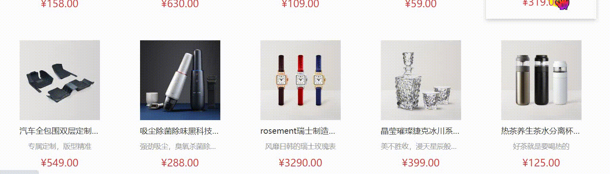 

无限加载组件

```html
<div class="infinite-loading" ref="target">
  <div class="loading" v-if="loading">
    <span class="text">正在加载...</span>
  </div>
  <div class="none" v-if="finished">
    <span class="text">没有更多了</span>
  </div>
</div>
```

```javascript
import { ref } from 'vue'
import { useIntersectionObserver } from '@vueuse/core'
const props = defineProps({
	loading: { type: Boolean, default: false },
	finished: { type: Boolean, default: false }
})
const target = ref(null)
// 监听target是否进入可视区
useIntersectionObserver(target, ([{ isIntersecting }]) => {
  if (isIntersecting) {
    // 进入可视区
    if (!props.loading && !props.finished) {
      // 触发加载事件条件：请求加载完成，数据加载完毕
      emit('infinite')
    }
  }
}, { threshold: 0 })
```

使用组件

```html
<!-- 商品列表 -->
<div class="goods-list">
  <ul>
    <li v-for="goods in goodsList" :key="goods.id" >
      <goods-item :goods="goods"></goods-item>
    </li>
  </ul>
  <!-- 无限加载组件 -->
  <infinite-loading :loading="loading" :finished="finished" @infinite="getData"></infinite-loading>
</div>
```

```javascript
// 加载中
const loading = ref(false)
// 是否加载完毕
const finished = ref(false)
// 商品列表数据
const goodsList = ref([])
// 请求参数
let reqParams = {
  page: 1,
  pageSize: 20
}
const getData = () => {
  loading.value = true
  findSubCategoryGoods(reqParams).then(({ result }) => {
    if (result.items.length) {
      // 有数据就追加数据
      goodsList.value.push(...result.items)
      // 把page改成下一页页码
      reqParams.page++
    } else {
      // 没有数据，代表加载完成
      finished.value = true
    }
    loading.value = false
  })
}
```


### 放大镜

 

```html
<!-- 放大图片 -->
<div v-show="show" class="large" :style="[{backgroundImage:`url(${images})`}, largePosition]"></div>
<!-- 正常图片 -->
<div class="small" ref="target">
  
  <!-- 遮罩色块 -->
  <div v-show="show" class="layer" :style="layerPosition"></div>
</div>
```

```less
.large {
  position: absolute;
  top: 0;
  left: 412px;
  width: 400px;
  height: 400px;
  box-shadow: 0 0 10px rgba(0,0,0,0.1);
  background-repeat: no-repeat;
  background-size: 800px 800px;
  background-color: #f8f8f8;
}
.small {
  width: 400px;
  height: 400px;
  background: #f5f5f5;
  position: relative;
  cursor: move;
  .layer {
    width: 200px;
    height: 200px;
    background: rgba(0,0,0,.2);
    left: 0;
    top: 0;
    position: absolute;
  }
}
```

```javascript
import { reactive, ref, watch } from 'vue'
import { useMouseInElement } from '@vueuse/core'
// 是否显示遮罩和大图
const show = ref(false)
// 遮罩的坐标
const layerPosition = reactive({ left: 0, top: 0 })
// 大图背景定位
const largePosition = reactive({ backgroundPositionX: 0, backgroundPositionY: 0 })
// 使用useMouseInElement得到基于元素左上角的坐标和是否离开元素数据
const target = ref(null)
// elementX 鼠标基于容器左上角X轴偏移
// elementY 鼠标基于容器左上角Y轴偏移
// isOutside 鼠标是否在模板容器外
const { elementX, elementY, isOutside } = useMouseInElement(target)
watch([elementX, elementY, isOutside], () => {
  // 设置是否显示预览大图
  show.value = !isOutside.value
  // 计算坐标
  const position = { x: 0, y: 0 }

  // 控制X轴方向的定位 0-200 之间
  if (elementX.value < 100) position.x = 0
  else if (elementX.value > 300) position.x = 200
  else position.x = elementX.value - 100
  
	// 控制Y轴方向的定位 0-200 之间
  if (elementY.value < 100) position.y = 0
  else if (elementY.value > 300) position.y = 200
  else position.y = elementY.value - 100

  // 设置遮罩容器的定位
  layerPosition.left = position.x + 'px'
  layerPosition.top = position.y + 'px'
  
  // // 设置大背景的定位，放大两倍
  largePosition.backgroundPositionX = -2 * position.x + 'px'
  largePosition.backgroundPositionY = -2 * position.y + 'px'
})
```


### 分页

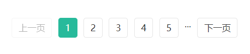 

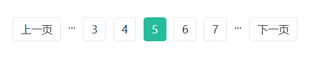 

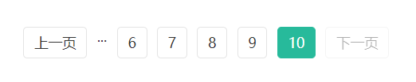 

```html
<div class="pagination">
  <a v-if="myCurrentPage > 1" @click="changePager(myCurrentPage-1)" href="javascript:;">
    上一页
  </a>
  <a v-else href="javascript:;" class="disabled">
    上一页
  </a>
  <span v-if="pager.start > 1">...</span>
  <a v-for="i in pager.btnArr" @click="changePager(i)" 
     href="javascript:;" :key="i" :class="{active:i===myCurrentPage}">
    {{ i }}
  </a>
  <span v-if="pager.end<pager.pageCount">...</span>
  <a v-if="myCurrentPage<pager.pageCount" @click="changePager(myCurrentPage+1)"
     href="javascript:;">
    下一页
  </a>
  <a v-else href="javascript:;" class="disabled">
    下一页
  </a>
</div>
```

```javascript
const props = defineProps({
  // 总页数
  total: { type: Number, default: 100 },
  // 每页显示的数据件数
	pageSize: { type: Number, default: 10 },
  // 当前页
	currentPage: { type: Number, default: 1 }
})
const emit = defineEmits(['current-change'])
```

```javascript
// 按钮的个数，需要动态可以设置响应式数据
const count = 5
// 当前显示的页码
const myCurrentPage = ref(1)
// 总页数
const myTotal = ref(100)
// 每页显示的数据件数
const myPageSize = ref(10)

// 监听props的变化，更新组件内部数据
watch(props, () => {
  myTotal.value = props.total
  myPageSize.value = props.pageSize
  myCurrentPage.value = props.currentPage
}, { immediate: true })

// 切换分页
const changePager = (page) => {
  // 页码相同不作为
  if (myCurrentPage.value !== page) {
    myCurrentPage.value = page
    // 通知父组件
    emit('current-change', page)
  }
}
```

```javascript
// 总页数，起始按钮，结束按钮，按钮数组
const pager = computed(() => {
  // // 计算总页数: 总条数 / 每一页条数 (向上取整)
  const pageCount = Math.ceil(myTotal.value / myPageSize.value)
  
  // 计算起始页码和结束页码
  // 1. 理想情况根据当前页码，和按钮个数可得到
  const offset = Math.floor(count / 2)
  let start = myCurrentPage.value - offset
  let end = start + count - 1
  
  // 2. 如果起始页码小于1，需要重新计算
  if (start < 1) {
    start = 1
    end = (start + count - 1) > pageCount ? pageCount : (start + count - 1)
  }
  
  // 3. 如果结束页码大于总页数，需要处计算
  if (end > pageCount) {
    end = pageCount
    start = (end - count + 1) < 1 ? 1 : (end - count + 1)
  }
  
  // 处理完毕start和end得到按钮数组
  const btnArr = []
  for (let i = start; i <= end; i++) {
    btnArr.push(i)
  }
  return { pageCount, btnArr, start, end }
})
```

父组件使用

```html
<my-pagination v-if="total > 0" @current-change="changePagerFn"
               :page-size="reqParams.pageSize" :current-page="reqParams.page">
</my-pagination>
```

```javascript
// 数据请求条件
const reqParams = reactive({ page: 1, pageSize: 10, .....})
// 数据列表
const list = ref([])
// 记录总条数
const total = ref(0)
watch(reqParams, () => {
  findGoodsList(goods.value.id, reqParams).then(data => {
    list.value = data.result.items
    total.value = data.result.counts
  })
}, { immediate: true })

// 分页切换
const changePagerFn = (newPage) => {
  reqParams.page = newPage
}
```


### Excel 导入

Excel 导入的核心是：解析 excel 的数据，上传解析之后的数据

解析 Excel 数据使用 xlsx 库

```bash
npm i xlsx
```

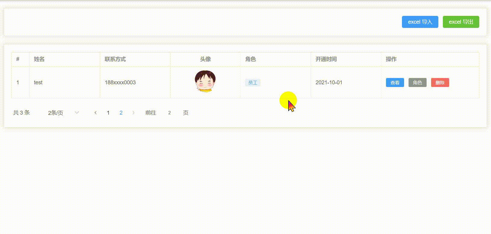 

文件导入按钮和拖拽控件

```html
<div class="upload-excel">
  <!-- 上传按钮 -->
  <div class="btn-upload">
    <el-button :loading="loading" type="primary" @click="handleUpload">upload</el-button>
  </div>
  <!-- 文件上传控件，隐藏 -->
  <input ref="excelUploadInput" style="display: none; z-index: -9999;"       
         type="file" accept=".xlsx, .xls" @change="handleChange"/>
  <!-- 拖拽控件 -->
  <div class="drop"
       @drop.stop.prevent="handleDrop"
       @dragover.stop.prevent="handleDragover"
       @dragenter.stop.prevent="handleDragover">
    <i class="el-icon-upload" />
    <span>drop</span>
  </div>
</div>
```

> HTML 拖放（Drag and Drop）接口
>
> - `drop`：当元素或选中的文本在可释放目标上**被释放**时触发
>
> - `dragover`：当元素或选中的文本**被拖到**一个可释放目标上时触发（触发直到丢弃为止）
>
>   用于确定要向用户显示哪些反馈
>
> - `dragenter`：当拖拽元素或选中的文本**进入到**一个可释放目标时触发（拖入目标元素的那一刻触发），
>
>   用于确定放置目标是否要接受放置

```javascript
import XLSX from 'xlsx'
import { defineProps, ref } from 'vue'
import { ElMessage } from 'element-plus'

const props = defineProps({
  // 上传前回调
  beforeUpload: Function,
  // 成功回调
  onSuccess: Function
})
const loading = ref(false)
// 文件上传控件
const excelUploadInput = ref(null)
```

事件处理

```javascript
// 点击上传触发
const handleUpload = () => {
  excelUploadInput.value.click()
}
const handleChange = e => {
  const files = e.target.files
  const rawFile = files[0] // only use files[0]
  if (!rawFile) return
  // 触发上传事件
  upload(rawFile)
}

// 拖拽文本释放时触发
const handleDrop = e => {
  // 上传中跳过
  if (loading.value) return
  const files = e.dataTransfer.files
  if (files.length !== 1) {
    ElMessage.error('必须要有一个文件')
    return
  }
  const rawFile = files[0]
  if (!isExcel(rawFile)) {
    ElMessage.error('文件必须是 .xlsx, .xls, .csv 格式')
    return false
  }
  // 触发上传事件
  upload(rawFile)
}

// 拖拽悬停时触发
const handleDragover = e => {
  // https://developer.mozilla.org/zh-CN/docs/Web/API/DataTransfer/dropEffect
  // 在新位置生成源项的副本
  e.dataTransfer.dropEffect = 'copy'
}

// 判断文件类型
const isExcel = file => {
  return /\.(xlsx|xls|csv)$/.test(file.name)
}
```

共通上传事件

```javascript
// 上传事件
const upload = rawFile => {
  excelUploadInput.value.value = null
  // 如果没有指定上传前回调的话
  if (!props.beforeUpload) {
    readerData(rawFile)
    return
  }
  // 如果指定了上传前回调，那么只有返回 true 才会执行后续操作
  const before = props.beforeUpload(rawFile)
  if (before) {
    readerData(rawFile)
  }
}
```

解析 Excel 文件

```javascript
// 读取数据（异步）
const readerData = rawFile => {
  loading.value = true
  return new Promise((resolve, reject) => {
    // https://developer.mozilla.org/zh-CN/docs/Web/API/FileReader
    const reader = new FileReader()
    // 该事件在读取操作完成时触发
    // https://developer.mozilla.org/zh-CN/docs/Web/API/FileReader/onload
    reader.onload = e => {
      // 1. 获取解析到的数据
      const data = e.target.result
      // 2. 利用 XLSX 对数据进行解析
      const workbook = XLSX.read(data, { type: 'array' })
      // 3. 获取第一张表格（工作簿）名称
      const firstSheetName = workbook.SheetNames[0]
      // 4. 只读取 Sheet1（第一张表格）的数据
      const worksheet = workbook.Sheets[firstSheetName]
      // 5. 解析数据表头
      const header = getHeaderRow(worksheet)
      // 6. 解析数据体
      const results = XLSX.utils.sheet_to_json(worksheet)
      // 7. 传入解析之后的数据
      generateData({ header, results })
      // 8. loading 处理
      loading.value = false
      // 9. 异步完成
      resolve()
    }
    // 启动读取指定的 Blob 或 File 内容
    reader.readAsArrayBuffer(rawFile)
  })
}

// 解析表头数据（固定写法）
const getHeaderRow = sheet => {
  const headers = []
  const range = XLSX.utils.decode_range(sheet['!ref'])
  let C
  const R = range.s.r
  /* start in the first row */
  for (C = range.s.c; C <= range.e.c; ++C) {
    /* walk every column in the range */
    const cell = sheet[XLSX.utils.encode_cell({ c: C, r: R })]
    /* find the cell in the first row */
    let hdr = 'UNKNOWN ' + C // <-- replace with your desired default
    if (cell && cell.t) hdr = XLSX.utils.format_cell(cell)
    headers.push(hdr)
  }
  return headers
}

// 根据导入内容，生成数据
const generateData = excelData => {
  props.onSuccess && props.onSuccess(excelData)
}
```

父组件中使用

```html
<upload-excel :onSuccess="onSuccess"></upload-excel>
```

```javascript
import { userBatchImport } from '@/api/user-manage'

// 数据解析成功之后的回调
const onSuccess = async ({ header, results }) => {
  const updateData = generateData(results)
  await userBatchImport(updateData)
  ElMessage.success({
    message: results.length + i18n.t('msg.excel.importSuccess'),
    type: 'success'
  })
  router.push('/user/manage')
}

// 解析数据，生成新数组
const generateData = results => {
  const arr = []
  results.forEach(item => {
    const userInfo = {}
    Object.keys(item).forEach(key => {
      // 处理excel导入的时间格式
      if (USER_RELATIONS[key] === 'openTime') {
        userInfo[USER_RELATIONS[key]] = formatDate(item[key])
        return
      }
      // key 为中文，需要对应转换为英文
      userInfo[USER_RELATIONS[key]] = item[key]
    })
    arr.push(userInfo)
  })
  return arr
}
```

```javascript
// 导入数据对应表
export const USER_RELATIONS = {
  姓名: 'username',
  联系方式: 'mobile',
  角色: 'role',
  开通时间: 'openTime'
}

// 解析 excel 导入的时间格式（固定写法）
export const formatDate = numb => {
  const time = new Date((numb - 1) * 24 * 3600000 + 1)
  time.setYear(time.getFullYear() - 70)
  const year = time.getFullYear() + ''
  const month = time.getMonth() + 1 + ''
  const date = time.getDate() - 1 + ''
  return (
    year +
    '-' +
    (month < 10 ? '0' + month : month) +
    '-' +
    (date < 10 ? '0' + date : date)
  )
}
```


### Excel 导出

将 json 结构数据转化为 excel 数据，并下载

安装 excel 解析器和编译器库 **xlsx**

```bash
npm i xlsx
```

安装文件下载工具 **file-saver**

```bash
npm i file-saver
```

**json 结构数据转化为 excel 数据的通用处理逻辑** Export2Excel.js

```javascript
/* eslint-disable */
import { saveAs } from 'file-saver'
import XLSX from 'xlsx'

function datenum(v, date1904) {
  if (date1904) v += 1462
  var epoch = Date.parse(v)
  return (epoch - new Date(Date.UTC(1899, 11, 30))) / (24 * 60 * 60 * 1000)
}

function sheet_from_array_of_arrays(data, opts) {
  var ws = {}
  var range = {
    s: {
      c: 10000000,
      r: 10000000
    },
    e: {
      c: 0,
      r: 0
    }
  }
  for (var R = 0; R != data.length; ++R) {
    for (var C = 0; C != data[R].length; ++C) {
      if (range.s.r > R) range.s.r = R
      if (range.s.c > C) range.s.c = C
      if (range.e.r < R) range.e.r = R
      if (range.e.c < C) range.e.c = C
      var cell = {
        v: data[R][C]
      }
      if (cell.v == null) continue
      var cell_ref = XLSX.utils.encode_cell({
        c: C,
        r: R
      })

      if (typeof cell.v === 'number') cell.t = 'n'
      else if (typeof cell.v === 'boolean') cell.t = 'b'
      else if (cell.v instanceof Date) {
        cell.t = 'n'
        cell.z = XLSX.SSF._table[14]
        cell.v = datenum(cell.v)
      } else cell.t = 's'

      ws[cell_ref] = cell
    }
  }
  if (range.s.c < 10000000) ws['!ref'] = XLSX.utils.encode_range(range)
  return ws
}

function Workbook() {
  if (!(this instanceof Workbook)) return new Workbook()
  this.SheetNames = []
  this.Sheets = {}
}

function s2ab(s) {
  var buf = new ArrayBuffer(s.length)
  var view = new Uint8Array(buf)
  for (var i = 0; i != s.length; ++i) view[i] = s.charCodeAt(i) & 0xff
  return buf
}

export const export_json_to_excel = ({
  multiHeader = [],
  header,
  data,
  filename,
  merges = [],
  autoWidth = true,
  bookType = 'xlsx'
} = {}) => {
  // 1. 设置文件名称
  filename = filename || 'excel-list'
  // 2. 把数据解析为数组，并把表头添加到数组的头部
  data = [...data]
  data.unshift(header)
  // 3. 解析多表头，把多表头的数据添加到数组头部（二维数组）
  for (let i = multiHeader.length - 1; i > -1; i--) {
    data.unshift(multiHeader[i])
  }
  // 4. 设置 Excel 表工作簿（第一张表格）名称
  var ws_name = 'SheetJS'
  // 5. 生成工作簿对象
  var wb = new Workbook()
  // 6. 将 data 数组（json格式）转化为 Excel 数据格式
  var ws = sheet_from_array_of_arrays(data)
  // 7. 合并单元格相关（['A1:A2', 'B1:D1', 'E1:E2']）
  if (merges.length > 0) {
    if (!ws['!merges']) ws['!merges'] = []
    merges.forEach((item) => {
      ws['!merges'].push(XLSX.utils.decode_range(item))
    })
  }
  // 8. 单元格宽度相关
  if (autoWidth) {
    /*设置 worksheet 每列的最大宽度*/
    const colWidth = data.map((row) =>
      row.map((val) => {
        /*先判断是否为null/undefined*/
        if (val == null) {
          return {
            wch: 10
          }
        } else if (val.toString().charCodeAt(0) > 255) {
          /*再判断是否为中文*/
          return {
            wch: val.toString().length * 2
          }
        } else {
          return {
            wch: val.toString().length
          }
        }
      })
    )
    /*以第一行为初始值*/
    let result = colWidth[0]
    for (let i = 1; i < colWidth.length; i++) {
      for (let j = 0; j < colWidth[i].length; j++) {
        if (result[j]['wch'] < colWidth[i][j]['wch']) {
          result[j]['wch'] = colWidth[i][j]['wch']
        }
      }
    }
    ws['!cols'] = result
  }

  // 9. 添加工作表（解析后的 excel 数据）到工作簿
  wb.SheetNames.push(ws_name)
  wb.Sheets[ws_name] = ws
  // 10. 写入数据
  var wbout = XLSX.write(wb, {
    bookType: bookType,
    bookSST: false,
    type: 'binary'
  })
  // 11. 下载数据
  saveAs(
    new Blob([s2ab(wbout)], {
      type: 'application/octet-stream'
    }),
    `${filename}.${bookType}`
  )
}

```

 

创建 Excel 导出控件

```html
<el-input v-model="excelName" :placeholder="$t('msg.excel.placeholder')"></el-input>
<el-button type="primary" @click="onConfirm" :loading="loading">导出</el-button>
```

```javascript
// 默认导出文件名
let exportDefaultName = i18n.t('msg.excel.defaultName')
// 导出文件名
const excelName = ref('')
excelName.value = exportDefaultName

// 导出按钮点击事件
const loading = ref(false)
const onConfirm = async () => {
  loading.value = true
  // 服务器获取数据
  const allUser = (await getUserManageAllList()).list
  // 导入转换工具包
  const excel = await import('@/utils/Export2Excel')
  // 将 json 对象转化为 二维数组形式
  const data = formatJson(USER_RELATIONS, allUser)
  // Excel 导出
  excel.export_json_to_excel({
    // excel 表头
    header: Object.keys(USER_RELATIONS),
    // excel 数据（二维数组结构）
    data,
    // 文件名称
    filename: excelName.value || exportDefaultName,
    // 是否自动列宽
    autoWidth: true,
    // 文件类型
    bookType: 'xlsx'
  })
  loading.value = false
}
```

```javascript
// 将json数组对象化成二维数组形式
const formatJson = (headers, rows) => {
  // 首先遍历数组
  // [{ username: '张三'},{},{}]  => [[’张三'],[],[]]
  return rows.map(item => {
    return Object.keys(headers).map(key => {
      // 时间特殊处理
      if (headers[key] === 'openTime') {
        return dateFormat(item[headers[key]])
      }
      // 角色数组转换为字符串
      if (headers[key] === 'role') {
        const roles = item[headers[key]]
        return JSON.stringify(roles.map(role => role.title))
      }
      return item[headers[key]]
    })
  })
}
```

```javascript
// Excel 表头数据对应表
export const USER_RELATIONS = {
  姓名: 'username',
  联系方式: 'mobile',
  角色: 'role',
  开通时间: 'openTime'
}

// 解析 excel 时间格式（固定写法）
export const formatDate = numb => {
  const time = new Date((numb - 1) * 24 * 3600000 + 1)
  time.setYear(time.getFullYear() - 70)
  const year = time.getFullYear() + ''
  const month = time.getMonth() + 1 + ''
  const date = time.getDate() - 1 + ''
  return (
    year +
    '-' +
    (month < 10 ? '0' + month : month) +
    '-' +
    (date < 10 ? '0' + date : date)
  )
}
```


## 反馈控件

### 消息框

 

在固定顶部显示，有三种类型：成功，错误，警告

组件使用的方式不够便利，封装成工具函数方式去使用

```html
<transition name="down">
	<!-- 绑定样式 -->
	<div class="message" :style="style[type]">
	  <!-- 绑定图标 -->
	  <i class="iconfont" :class="[style[type].icon]"></i>
	  <span class="text">{{text}}</span>
	</div>
</transition>
```

```less
.down {
  &-enter {
    &-from {
      transform: translate3d(0,-75px,0);
      opacity: 0;
    }
    &-active {
      transition: all 0.5s;
    }
    &-to {
      transform: none;
      opacity: 1;
    }
  }
}
.message {
  width: 300px;
  height: 50px;
  position: fixed;
  z-index: 9999;
  left: 50%;
  margin-left: -150px;
  top: 25px;
  line-height: 50px;
  padding: 0 25px;
  border: 1px solid #e4e4e4;
  background: #f5f5f5;
  color: #999;
  border-radius: 4px;
  i {
    margin-right: 4px;
    vertical-align: middle;
  }
  .text {
    vertical-align: middle;
  }
}
```

```javascript
const props = defineProps({
  text: { type: String, default: '' },
  type: { type: String, default: 'warn' }
})
// 样式对象
const style = {
  warn: {
    icon: 'icon-warning',
    color: '#E6A23C',
    backgroundColor: 'rgb(253, 246, 236)',
    borderColor: 'rgb(250, 236, 216)'
  },
  error: {
    icon: 'icon-shanchu',
    color: '#F56C6C',
    backgroundColor: 'rgb(254, 240, 240)',
    borderColor: 'rgb(253, 226, 226)'
  },
  success: {
    icon: 'icon-queren2',
    color: '#67C23A',
    backgroundColor: 'rgb(240, 249, 235)',
    borderColor: 'rgb(225, 243, 216)'
  }
}

// 元素显示隐藏
const visible = ref(false)
onMounted(() => {
  visible.value = true
})
```

封装成能够显示组件的函数，函数可以导入直接使用，也可以挂载在 vue 实例原型上

```javascript
import { createVNode, render } from 'vue'
import MyMessage from './my-message.vue'

// DOM容器
const div = document.createElement('div')
div.setAttribute('class', 'msssage-container')
document.body.appendChild(div)

// 定时器标识
let timer = null
export default ({ type, text }) => {
  // 根据组件创建虚拟节点 createVNode(组件,属性对象（props）)
  const vnode = createVNode(MyMessage, { type, text })
  // 把虚拟节点渲染DOM容器中
  render(vnode, div)
  // 3s后销毁组件
  clearTimeout(timer)
  timer = setTimeout(() => {
  	render(null, div)
  }, 3000)
}
```

在组件中使用

```javascript
import Message from '@/components/library/Message'
Message({ type: 'error', text: '登录失败' })
```


### 确认框

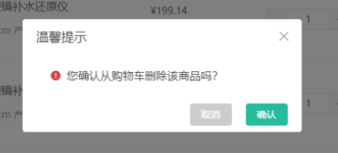 

实现函数式调用组件方式

```html
<div class="popup-confirm" :class="{fade}">
  <div class="wrapper" :class="{fade}">
    <div class="header">
      <h3>{{title}}</h3>
      <a @click="cancel" href="JavaScript:;" class="iconfont icon-close-new"></a>
    </div>
    <div class="body">
      <i class="iconfont icon-warning"></i>
      <span>{{text}}</span>
    </div>
    <div class="footer">
      <app-button @click="cancel" size="mini" type="gray">取消</app-button>
      <app-button @click="submit" size="mini" type="primary">确认</app-button>
    </div>
  </div>
</div>
```

```less
.popup-confirm {
  position: fixed;
  left: 0;
  top: 0;
  width: 100%;
  height: 100%;
  z-index: 8888;
  background: rgba(0,0,0,0);
  &.fade {
    transition: all 0.4s;
    background: rgba(0,0,0,.5);
  }
  .wrapper {
    width: 400px;
    background: #fff;
    border-radius: 4px;
    position: absolute;
    top: 50%;
    left: 50%;
    transform: translate(-50%,-60%);
    opacity: 0;
    &.fade {
      transition: all 0.4s;
      transform: translate(-50%,-50%);
      opacity: 1;
    }
    .header,.footer {
      height: 50px;
      line-height: 50px;
      padding: 0 20px;
    }
    .body {
      padding: 20px 40px;
      font-size: 16px;
      .icon-warning {
        color: @priceColor;
        margin-right: 3px;
        font-size: 16px;
      }
    }
    .footer {
      text-align: right;
      .xtx-button {
        margin-left: 20px;
      }
    }
    .header {
      position: relative;
      h3 {
        font-weight: normal;
        font-size: 18px;
      }
      a {
        position: absolute;
        right: 15px;
        top: 15px;
        font-size: 20px;
        width: 20px;
        height: 20px;
        line-height: 20px;
        text-align: center;
        color: #999;
        &:hover {
          color: #666;
        }
      }
    }
  }
}
```

```javascript
const props = defineProps({
	title: { type: String, default: '温馨提示' },
	text: { type: String, default: '' },
	cancelCallback: { type: Function },
	submitCallback: { type: Function }
})
// 对话框默认隐藏
const fade = ref(false)
// 取消
const cancel = () => {
  props.cancelCallback()
}
// 确认
const submit = () => {
  props.submitCallback()
}
// 组件渲染完毕后
onMounted(() => {
  // 过渡效果需要在元素创建完毕后延时一会加上才会触发
  setTimeout(() => {
    fade.value = true
  }, 0)
})
```

封装成能够显示组件的函数，函数可以导入直接使用，也可以挂载在 vue 实例原型上

```javascript
import { createVNode, render } from 'vue'
import MyConfirm from './my-confirm.vue'

// DOM容器
const div = document.createElement('div')
div.setAttribute('class', 'confirm-container')
document.body.appendChild(div)

// 返回promise对象，点击取消销毁组件，点击确认销毁组件
export default ({ title, text }) => {
  return new Promise((resolve, reject) => {
   	// 取消回调
		const cancelCallback = () => {
      // 销毁组件
		  render(null, div)
		}
    // 确认回调
		const submitCallback = () => {
      // 销毁组件
		  render(null, div)
      // 执行后续操作
		  resolve()
		}
    // 使用createVNode创建虚拟节点
    const vn = createVNode(MyConfirm, { title, text, cancelCallback, submitCallback })
		// dom容器装载组件
    render(vn, div)
  });
}
```

组件调用

```javascript
import Confirm from '@/components/library/Confirm'
const deleteCart = (skuId) => {
  Confirm({ text: '是否确认删除商品' }).then(() => {
    store.dispatch('cart/deleteCart', skuId)
  }).catch(e => {})
}
```


### 对话框

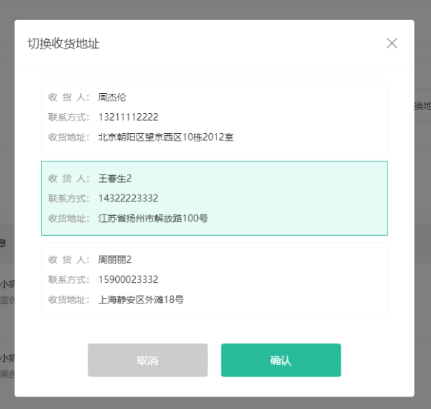 

```html
<div class="dialog" v-show="visible" :class="{fade}">
  <div class="wrapper" :class="{fade}">
    <div class="header">
      <h3>{{title}}</h3>
      <a @click="closeDialog()" href="JavaScript:;" class="iconfont icon-close-new"></a>
    </div>
    <div class="body">
      <slot />
    </div>
    <div class="footer">
      <slot name="footer" />
    </div>
  </div>
</div>
```

```javascript
const props = defineProps({
  title: { type: String, default: '' },
	visible: { type: Boolean, default: false }
})
const emit = defineEmits(['update:visible'])

const fade = ref(false)
// visible的值为true打开对话框，否则关闭对话框
watch(() => props.visible, (newVal) => {
  setTimeout(() => {
    fade.value = newVal
  }, 0)
}, { immediate: true })

// 关闭对话框，修改父组件数据状态
const closeDialog = () => {
  emit('update:visible', false)
}
```

父组件使用

```html
<app-button @click="openDialog()" class="btn">选择</app-button>
<app-dialog title="选择收货地址" v-model:visible="visibleDialog">
  <div @click="selectedAddress=item" v-for="item in list" :key="item.id">
    <ul>
      <li><span>收货地址：</span>{{item.fullLocation.replace(/ /g,'')+item.address}}</li>
    </ul>
  </div>
  <template #footer>
    <app-button @click="visibleDialog=false" type="gray" style="margin-right:20px">取消</app-button>
    <app-button @click="confirmAddressFn" type="primary">确认</app-button>
  </template>
</app-dialog>
```

```javascript
// 切换地址对话框显示隐藏
const visibleDialog = ref(false)
// 打开关闭通过v-model来实现
const openDialog = () => {
  visibleDialog.value = true
}
```


### 气泡框

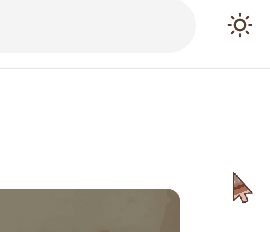 

```html
<div class="relative" @mouseleave="onMouseleave" @mouseenter="onMouseenter">
  <!-- 按钮控件区域 -->
  <div ref="referenceTarget">
    <!-- 具名插槽 -->
    <slot name="reference" />
  </div>
  <!-- 气泡展示动画 -->
  <transition name="slide">
    <div v-show="isVisable" ref="contentTarget" :style="contentStyle" class="absolute ...">
      <!-- 匿名插槽 -->
      <slot />
    </div>
  </transition>
</div>
```

```javascript
// 延迟关闭时长
const DELAY_TIME = 100
// 控制气泡展示
const isVisable = ref(false)
// 控制延迟关闭
let timeout = null

// 鼠标移入的触发行为
const onMouseenter = () => {
  isVisable.value = true
  // 再次触发时，清理延时装置
  if (timeout) {
    clearTimeout(timeout)
  }
}
// 鼠标移出的触发行为
const onMouseleave = () => {
  // 防抖延时装置
  // 如果气泡消失的太快，用户无法点击到气泡
  timeout = setTimeout(() => {
    isVisable.value = false
    timeout = null
  }, DELAY_TIME)
}
```

```javascript
// 气泡弹出位置
const PROP_TOP_LEFT = 'top-left'
const PROP_TOP_RIGHT = 'top-right'
const PROP_BOTTOM_LEFT = 'bottom-left'
const PROP_BOTTOM_RIGHT = 'bottom-right'
const placementEnum = [
  PROP_TOP_LEFT,
  PROP_TOP_RIGHT,
  PROP_BOTTOM_LEFT,
  PROP_BOTTOM_RIGHT
]

// 气泡弹出位置
const props = defineProps({
  placement: { type: String, default: 'bottom-left', validator(val) {
      const result = placementEnum.includes(val)
      if (!result) {
        throw new Error(`你的 placement 必须是 ${placementEnum.join('、')} 中的一个`)
      }
      return result
    }
  }
})
// 计算元素尺寸
const referenceTarget = ref(null)
const contentTarget = ref(null)
const useElementSize = (target) => {
  if (!target) return {}
  return {
    width: target.offsetWidth,
    height: target.offsetHeight
  }
}
// 计算弹层位置
const contentStyle = ref({
  top: 0,
  left: 0
})
// 监听展示的变化，在展示时计算气泡位置
watch(isVisable, (val) => {
  if (!val) return
  // 等待渲染成功之后
  // 在数据改变之后，需要等一段时间 DOM 才会变化，通过nextTick函数的参数，监听DOM变化后的回调
  nextTick(() => {
    switch (props.placement) {
        // 左上
      case PROP_TOP_LEFT:
        contentStyle.value.top = 0
        contentStyle.value.left = -useElementSize(contentTarget.value).width + 'px'
        break
        // 右上
      case PROP_TOP_RIGHT:
        contentStyle.value.top = 0
        contentStyle.value.left = useElementSize(referenceTarget.value).width + 'px'
        break
        // 左下
      case PROP_BOTTOM_LEFT:
        contentStyle.value.top = useElementSize(referenceTarget.value).height + 'px'
        contentStyle.value.left = -useElementSize(contentTarget.value).width + 'px'
        break
        // 右下
      case PROP_BOTTOM_RIGHT:
        contentStyle.value.top = useElementSize(referenceTarget.value).height + 'px'
        contentStyle.value.left = useElementSize(referenceTarget.value).width + 'px'
        break
    }
  })
})
```

父组件的使用

```html
<m-popover placement="bottom-left">
	<template #reference>
    头像
  </template>
  <div>
    菜单
  </div>
</m-popover>
```


### 移动端底部弹窗

 

```html
<div class="">
  <!-- teleport 挂载到 body 上 -->
  <teleport to="body">
    <!-- 蒙版 -->
    <transition name="fade">
      <!-- 无需主动触发 事件 -->
      <div class="w-screen h-screen bg-zinc-900/80 z-40 fixed top-0 left-0"
           v-if="isOpen" @click="isOpen = false"></div>
    </transition>
    <!-- 内容区域 -->
    <transition name="popup-down-up">
      <div v-if="isOpen"v-bind="$attrs"
           class="w-screen bg-white dark:bg-zinc-800 z-50 fixed bottom-0">
        <!-- 内容插槽 -->
        <slot />
      </div>
    </transition>
  </teleport>
</div>
```

```javascript
import { useScrollLock } from '@vueuse/core'
import { useVModel } from '@vueuse/core'

const props = defineProps({
  modelValue: {
    required: true,
    type: Boolean
  }
})
// 通过 useVModel 获取到响应式数据 isOpen，当 isOpen 改变时，会自动触发 update:modelValue
const isOpen = useVModel(props)
// 滚动锁定
const isLocked = useScrollLock(document.body)

// 监听 isOpen
watch(isOpen, (val) => {
  // 弹窗展开，弹窗背后内容滚动锁定
  isLocked.value = val
}, { immediate: true })
```

```css
/* fade 展示动画 */
.fade-enter-active {
  transition: all 0.3s;
}

.fade-leave-active {
  transition: all 0.3s;
}

.fade-enter-from,
.fade-leave-to {
  opacity: 0;
}
/* popup-down-up 展示动画 */
.popup-down-up-enter-active {
  transition: all 0.3s;
}
```

父组件

```html
<m-popup v-model="isOpenPopup">
  <menu-vue @onItemClick="onItemClick"></menu-vue>
</m-popup>
```

```javascript
// popup 展示
const isOpenPopup = ref(false)
```


# 指令封装案例

## 自动聚焦

```javascript
app.directive('focus', (el) => {
    el.focus();
})
```


## 防抖

多次点击/输入，只触发一次

```javascript
app.directive("debounce", {
  mounted: (el, { value, arg }) => {
    if (typeof value !== "function" && typeof value.fn !== "function") {
      return;
    }
    const delay = arg || 200;
    const fn = value.fn || value;
    el.event = value.event || (el.tagName.toLowerCase() === "input" ? "input" : "click");
    el.timer = null;
    el.handler = function () {
      if (el.timer) {
        clearTimeout(el.timer);
        el.timer = null;
      }
      el.timer = setTimeout(() => {
        fn.apply(this, arguments);
        el.timer = null;
      }, delay);
    };
    el.addEventListener(el.event, el.handler);
  },
  beforeMount(el) {
    if (el.timer) {
      clearTimeout(el.timer);
      el.timer = null;
    }
    el.removeEventListener(el.event, el.handler);
  },
});
```

```html
<button v-debounce="btnClick">防抖</button>
<button v-debounce:1000="{ fn: btnClick, event: 'click' }">防抖</button>
```


## 节流

一个时间段，只触发一次

```javascript
app.directive("throttle", {
  mounted(el, { value, arg }) {
    if (typeof value !== "function" && typeof value.fn !== "function") {
      return;
    }
    const delay = arg || 200;
    const fn = value.fn || value;
    el.event = value.event || (el.tagName.toLowerCase() === "input" ? "input" : "click");
    el.timer = null;
    el.handler = function () {
      if (el.timer) return;
      el.timer = setTimeout(() => {
        fn.apply(this, arguments);
        el.timer = null;
      }, delay);
    };
    el.addEventListener(el.event, el.handler);
  },
  beforeMount(el) {
    if (el.timer) {
      clearTimeout(el.timer);
      el.timer = null;
    }
    el.removeEventListener(el.event, el.handler);
  },
});
```

```html
<button v-throttle="btnClick">节流</button>
<button v-throttle:1000="{ fn: btnClick, event: 'click' }">节流</button>
```


## 图片懒加载

当图片进入可视区域内时加载图片

基于 webAPI `IntersectionObserver` 封装懒加载指令

创建观察对象实例

```javascript
const observer = new IntersectionObserver(callback[, options])
```

- callback：回调函数，被观察 dom 进入可视区、离开可视区都会触发，有两个回调参数 `entries` , `observer`

  - `entries`：被观察的元素信息对象的数组 `[{元素信息}]`，信息中**属性 `isIntersecting` 判断进入或离开**
  - `observer`：观察实例

- options：配置参数，三个配置属性 `root`、 `rootMargin`、 `threshold`

  - `root`：基于的滚动容器，默认是 document

  - `rootMargin`：容器有没有外边距

  - `threshold`：交叉的比例，target 元素和 root 元素相交程度达到该值时，回调函数将会被执行

    可以是单一的 number 也可以是 number 数组

    - 只要有一个 target 像素出现在 root 元素中，值为 `0`，默认，回调函数将会被执行

    - 可见性超过 50% 的时候，值为 `0.5`

    - 每多 25% 就执行一次回调，数组 `[0, 0.25, 0.5, 0.75, 1]`
    - 当 target 完全出现在 root 元素中时候，值为 `1`

- 返回的实例提供两个方法
  - `observe(dom)`：观察指定的 dom
  - `unobserve(dom)`：停止指定的 dom

封装懒加载指令全局指令

```javascript
import defaultImg from '@/assets/images/200.png'
const defineDirective = (app) => {
  app.directive('lazyload', {
    mounted (el, binding) {
      const observer = new IntersectionObserver(([{ isIntersecting }]) => {
        if (isIntersecting) {
          observer.unobserve(el)
          el.onerror = () => {
            el.src = defaultImg
          }  
          el.src = binding.value
        }
      }, {
        threshold: 0.01
      })
      observer.observe(el)
    }
  })
}
```

作为插件注册

```javascript
export default {
  install (app) {
    defineDirective(app)
  }
}
```

在 img 上使用 v-lazyload 值为图片地址，不设置 src 属性

```html

```


## 时间格式化

全局注册时间格式化指令

```javascript
// src\directives\format-time.js
import dayjs from 'dayjs';
// 时间格式化指令
export default function(app) {
  app.directive("format-time", {
    created(el, bindings) {
      binding.format = "YYYY-MM-DD HH:mm:ss";
      if (bindings.value) {
        binding.format = bindings.value;
      }
    },
    mounted(el, bindings) {
      const textContent = el.textContent;
      let timestamp = parseInt(textContent);
      if (textContent.length === 10) {
        timestamp = timestamp * 1000
      }
      el.textContent = dayjs(timestamp).format(binding.format);
    }
  })
}
```

```javascript
// src\directives\index.js
import registerFormatTime from './format-time';
// 注册所有自定义指令
export default function registerDirectives(app) {
  registerFormatTime(app);
}
```

```javascript
// src\main.js
const app = createApp(App);
registerDirectives(app);
app.mount('#app');
```

```vue
<template>
  <h2 v-format-time="'YYYY/MM/DD'">{{timestamp}}</h2>
</template>
<script>
  export default {
    setup() {
      const timestamp = 1624452193;
      return {
        timestamp
      }
    }
  }
</script>
```


## 复制到剪贴板

动态创建一个不可见的辅助标签  `<textarea>` ，将目标内容赋值到它的 `value` 属性，利用其 `onselect()` 事件选中值，

再通过使用 `document.execCommand('Copy')` 方法，拷贝当前选中内容到剪贴板

```javascript
app.directive("copy", {
  beforeMount: (el, binding) => {
    el.addEventListener("click", () => {
      // 要复制到剪贴板的目标内容
      const targetContent = 
            typeof value === "function" ?
            value() : typeof value !== "string" ? JSON.stringify(value) : value;
      if (!targetContent) return console.warn("没有需要复制的目标内容");
      // 创建textarea标签
      const textarea = document.createElement("textarea");
      // 设置相关属性
      textarea.readOnly = "readonly";
      // 设置不可见
      textarea.style.position = "fixed";
      textarea.style.top = "-99999px";
      // 把目标内容赋值给它的value属性
      textarea.value = targetContent;
      // 插入到页面
      document.body.appendChild(textarea);
      // 调用onselect()方法
      textarea.select();
      // 把目标内容复制进剪贴板, 该API会返回一个Boolean;
      const res = document.execCommand("Copy");
      res && console.log("复制成功，剪贴板内容：" + targetContent);
      // 移除textarea标签
      document.body.removeChild(textarea);
    });
  },
  unmounte: (el) => {
    el.removeEventListener("click", () => {});
  },
});
```

`document.execCommand('Copy')` 已被废弃，可以使用  Clipboard Api 来实现，Clipboard APi 仅能在 HTTPS 和 localhost 中有效

```javascript
app.directive("copy", {
  beforeMount: (el, binding) => {
    el.addEventListener("click", () => {
      const targetContent = 
            typeof value === "function" ?  
            value(): typeof value !== "string" ? JSON.stringify(value) : value;
      if (!targetContent) return console.warn("没有需要复制的目标内容");
      navigator.clipboard.writeText(targetContent).then(() => {
        console.log("复制成功，剪贴板内容：" + targetContent);
      });
    });
  },
  unmounte: (el) => {
    el.removeEventListener("click", () => {});
  },
});
```

```html
<!-- 静态值复制 -->
<button v-copy="message">复制</button>
<!-- 动态值复制 -->
<button v-copy="() => message">复制</button>
```

> 复制到剪贴板的第三方类库：
>
> [v-clipboard](https://github.com/euvl/v-clipboard)


## 输入限制


# 函数封装案例

## 本地缓存

```javascript
// 存储数据
export const setItem = (key, value) => {
  // 将数组、对象类型的数据转化为 JSON 字符串进行存储
  if (typeof value === 'object') {
    value = JSON.stringify(value)
  }
  window.localStorage.setItem(key, value)
}

// 获取数据
export const getItem = key => {
  const data = window.localStorage.getItem(key)
  try {
    return JSON.parse(data)
  } catch (err) {
    return data
  }
}

// 删除数据
export const removeItem = key => {
  window.localStorage.removeItem(key)
}

// 删除所有数据
export const removeAllItem = key => {
  window.localStorage.clear()
}
```


## 日期格式化

安装 dayjs

```bash
npm install dayjs
```

日期 Format 函数

```typescript
import dayjs from 'dayjs'
import utc from 'dayjs/plugin/utc'
// 支持utc转化
dayjs.extend(utc)

const DATE_TIME_FORMAT = 'YYYY-MM-DD HH:mm:ss'
 
// 格式化Utc时间，东八区
export function formatUtcString(utcString: string, format: string = DATE_TIME_FORMAT) {
  return dayjs.utc(utcString).utcOffset(8).format(format)
}
// 格式化时间戳
export function formatTimestamp(timestamp: number, format: string = DATE_TIME_FORMAT) {
  return dayjs(timestamp).format(format)
}
```

注册函数

```typescript
export default function registerProperties(app: App) {
  app.config.globalProperties.$filters = {
    formatTime(value: string) {
      return formatUtcString(value)
    }
  }
}
```

注册

```typescript
const app = createApp(App)
app.use(registerProperties)
app.mount('#app')
```


## 数据懒加载（VueUse）

使用 `vueuse` 的 `useIntersectionObserver` 来实现监听进入可视区域行为

`useIntersectionObserver` 函数：

```javascript
// stop：停止观察进入或移出可视区域的行为函数
const { stop } = useIntersectionObserver(
  // target：观察的目标dom容器，必须是dom容器，而且是vue3.0方式绑定的dom对象
  target,
  // isIntersecting： 是否进入可视区域，true是进入，false是移出
  // observerElement： 被观察的dom
  ([{ isIntersecting }], observerElement) => {
    // 在此处可根据isIntersecting来判断，然后做业务
  }
)
```

封装数据懒加载钩子函数

```javascript
import { useIntersectionObserver } from '@vueuse/core'
import { ref } from 'vue'

// 数据懒加载函数，参数：获取数据函数
export const useLazyData = (apiFn) => {
  // 被观察的对象
  const target = ref(null)
  // 获取的数据
  const result = ref([])
  const { stop } = useIntersectionObserver(
    target,
    ([{ isIntersecting }], observerElement) => {
      if (isIntersecting) {
        stop()
        // 调用API获取数据
        apiFn().then(data => {
          result.value = data.result
        })
      }
    }
  )
  // 返回 dom 和获取的数据
  return { target, result }
}
```

组件内使用

```html
<div ref="target" style="position: relative;height: 426px;">
```

```javascript
import { useLazyData } from '@/hooks'
const { target, result } = useLazyData(GetNewsData)
```


## 倒计时

 

使用 `vueuse` 的 `useIntervalFn` 来实现倒计时

```javascript
import { useIntervalFn } from '@vueuse/core'
import { ref, onUnmounted } from 'vue'
import dayjs from 'dayjs'

export const usePayTime = () => {
  // 倒计时逻辑
  const time = ref(0)
  const timeText = ref('')
  const { pause, resume } = useIntervalFn(() => {
    time.value--
    timeText.value = dayjs.unix(time.value).format('mm分ss秒')
    if (time.value <= 0) {
      pause()
    }
  }, 1000, false)
  onUnmounted(() => {
    pause()
  })

  // 开启定时器 countdown 倒计时时间
  const start = (countdown) => {
    time.value = countdown
    timeText.value = dayjs.unix(time.value).format('mm分ss秒')
    resume()
  }

  return { start, timeText }
}
```

组件中使用

```html
<p>订单提交成功！请尽快完成支付。</p>
<p v-if="order.countdown > -1">支付还剩 <span>{{timeText}}</span>, 超时后将取消订单</p>
<p v-else>订单已经超时</p>
```

```javascript
// 倒计时函数
const { start, timeText } = usePayTime()

const route = useRoute()
// 获取订单数据
const order = ref(null)
findOrderDetailApi(route.query.orderId).then(data => {
  order.value = data.result
  // 根据后端提供 countdown 倒计时秒数，开始倒计时
  if (data.result.countdown > -1) {
    start(data.result.countdown)
  }
})
```


## 超时验证

```javascript
// token 时间戳
export const TIME_STAMP = 'timeStamp'
// 超时时长(毫秒) 两小时
export const TOKEN_TIMEOUT_VALUE = 2 * 3600 * 1000
```

```javascript
import { TIME_STAMP, TOKEN_TIMEOUT_VALUE } from '@/constant'
import { setItem, getItem } from '@/utils/storage'

// 获取时间戳
export function getTimeStamp() {
  return getItem(TIME_STAMP)
}
// 设置时间戳
export function setTimeStamp() {
  setItem(TIME_STAMP, Date.now())
}
// 是否超时
export function isCheckTimeout() {
  // 当前时间戳
  var currentTime = Date.now()
  // 缓存时间戳
  var timeStamp = getTimeStamp()
  return currentTime - timeStamp > TOKEN_TIMEOUT_VALUE
}
```


## 相对时间

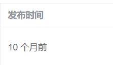 

安装 dayjs

```bash
npm install dayjs
```

使用相对时间插件

```javascript
import dayjs from 'dayjs'
import rt from 'dayjs/plugin/relativeTime'
// 语言包
import 'dayjs/locale/zh-cn'

// 加载相对时间插件
dayjs.extend(rt)
function relativeTime(val) {
  if (!isNaN(val)) {
    val = parseInt(val)
  }
  return dayjs().locale('zh-cn').to(dayjs(val))
}
```

注册函数

```javascript
export default app => {
  app.config.globalProperties.$filters = {
    relativeTime
  }
}
```


## 登录鉴权

当用户未登陆时，不允许进入除定义的白名单之外的其他页面

使用**全局前置路由守卫**进行登录鉴权操作

```javascript
import router from './router'
import store from './store'

// 白名单
const whiteList = ['/login']

// 路由前置守卫
router.beforeEach(async (to, from, next) => {
  // 存在 token ，进入主页
  if (store.getters.token) {
    // 用户登录后，不允许进入登录页面
    if (to.path === '/login') {
      return '/'
    }
  } else {
    // 没有token的情况下，可以进入白名单
    if (whiteList.indexOf(to.path) === -1) {
      return '/login'
    }
  }
})
```

在 main.js 中导入

```javascript
import router from './router'
// 导入权限控制模块
import './permission'

createApp(App).use(router).mount('#app')
...
```


## 是否移动端

根据宽度判断

```javascript
import { useWindowSize } from '@vueuse/core'
// 提供了屏幕变化的响应式数据
const { width } = useWindowSize()
// PC 设备指定宽度
export const PC_DEVICE_WIDTH = 1280
export const isMobileTerminal = computed(() => {
	return width.value < PC_DEVICE_WIDTH
})
```

根据设备判断

```javascript
export const isMobileTerminal = computed(() => {
  return /Android|webOS|iPhone|iPad|iPod|BlackBerry|IEMobile|Opera Mini/i.test(
    navigator.userAgent
  )
})
```

移动端加载移动端路由文件

```javascript
import { isMobileTerminal } from '@/utils/flexible'
import mobileTerminalRoutes from './modules/mobile-routes'
import pcTerminalRoutes from './modules/pc-routes'

const router = createRouter({
  history: createWebHistory(),
  routes: isMobileTerminal.value ? mobileTerminalRoutes : pcTerminalRoutes
})
```


## 初始化 rem 基准值

```javascript
export const useREM = () => {
  // 定义最大的 fontSize
  const MAX_FONT_SIZE = 40
  // 监听 html 文档被解析完成的事件
  document.addEventListener('DOMContentLoaded', () => {
    // 获取 html 标签
    const html = document.querySelector('html')
    // 获取根元素 fontSize 标准，屏幕宽度 / 10。（以 Iphone 为例 Iphone 6 屏幕宽度为 375，则标准 fontSize 为 37.5）
    let fontSize = window.innerWidth / 10
    // 获取到的 fontSize 不允许超过我们定义的最大值
    fontSize = fontSize > MAX_FONT_SIZE ? MAX_FONT_SIZE : fontSize
    // 定义根元素（html）fontSize 的大小 （rem）
    html.style.fontSize = fontSize + 'px'
  })
}
```

main.js 中导入，初始化时执行

```javascript
import { useREM } from './utils/flexible'
// 设置 rem
useREM()
createApp(App).use(...)
```


# 常见问题

## hover 关闭

**单页面路由**跳转不会刷新页面，**css 的 hover一直触发无法关闭**

 

需要手动设置跳转后关闭弹窗，为每个菜单添加控制显示隐藏的布尔类型的 `open`  属性

```javascript
state () {
  return {
    list: [
      { name: '居家', open: false },
      { name: '美食', open: false },
      { name: '服饰', open: false }
    ]
  }
},
mutations: {
  // 定义show和hide函数，控制当前分类的二级分类显示和隐藏
  show (state, id) {
    const currCategory = state.list.find(item => item.id === id)
    currCategory.open = true
  },
  hide (state, id) {
    const currCategory = state.list.find(item => item.id === id)
    currCategory.open = false
  }
},
```

```html
<li v-for="item in list" :key="item.id" @mouseenter="show(item)" @mouseleave="hide(item)">
  <RouterLink :to="" @click="hide(item)">{{item.name}}</RouterLink>
  <div class="layer" :class="{open:item.open}">
    <ul>
      <li v-for="sub in item.children" :key="sub.id">
         <RouterLink :to="" @click="hide(item)">{{sub.name}}</RouterLink>
      </li>
    </ul>
  </div>
</li>
```

```less
layer {
	&.open {
	  height: 132px;
	  opacity: 1;
	}
}
```

```javascript
const show = (item) => {
  store.commit('category/show', item)
}
const hide = (item) => {
  store.commit('category/hide', item)
}
```
