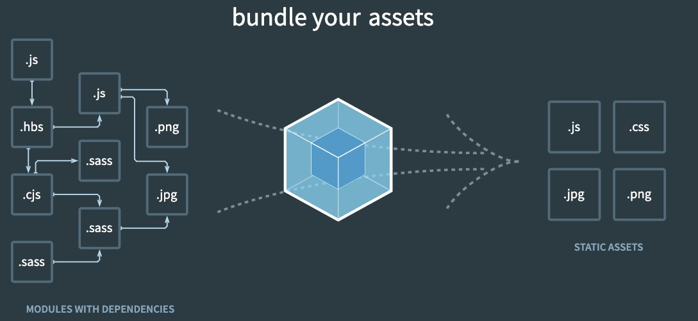
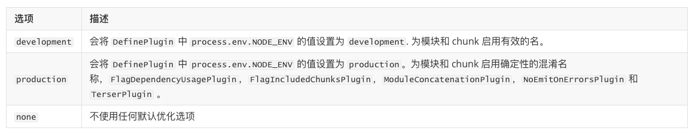
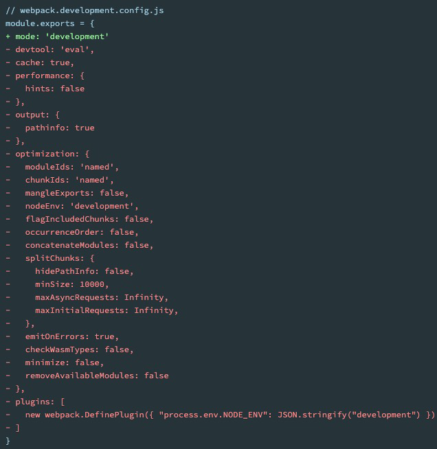
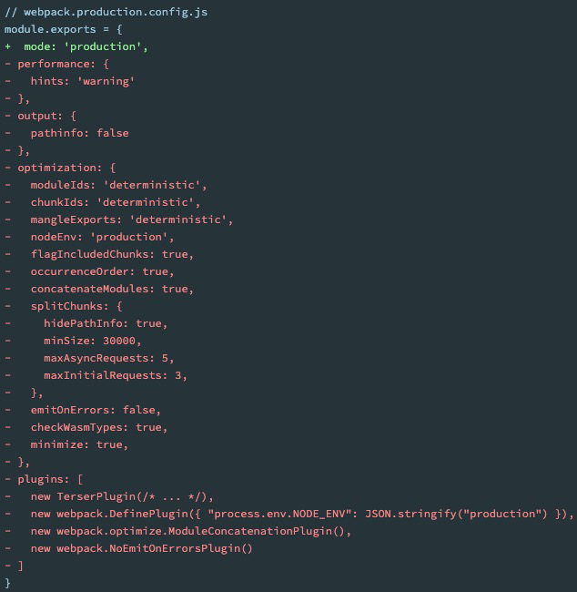
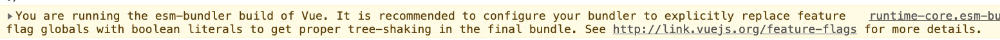

# 认识 Webpack

webpack 是一个**静态的模块化打包工具**，为现代的 JavaScript 应用程序

- 打包 bundler：webpack 可以将帮助进行打包
- 静态的 static：最终可以将代码打包成最终的静态资源（部署到静态服务器）
- 模块化 module：webpack 默认支持各种模块化开发，ES Module、CommonJS、AMD 等
- 现代的 modern：处理现代前端开发面临各种各样的问题

现代前端开发面临的问题

- 需要通过模块化的方式来开发
- 会使用一些高级的特性来加快开发效率或者安全性，比如通过 ES6+、TypeScript、sass、less 等
- 开发过程中，希望实时的监听文件的变化，并且反映到浏览器上，提高开发的效率
- 需要将代码进行压缩、合并以及其他相关的优化

依赖关系：

- webpack 在处理应用程序时，它会根据命令或者配置文件**找到入口文件**

  从入口开始，会**生成一个依赖关系图**，这个依赖关系图会包含应用程序中所需的所有模块（比如 .js 文件、css 文件、图片、字体等）

  然后遍历图结构，打包一个个模块（根据文件的不同使用不同的 loader 来解析）

   

- 无论 .js 文件、css 文件还是图片等，在 webpack 里都被视为模块，如果希望某个模块能够被打包，就需要这个模块具有依赖关系

  ```javascript
  // 通过import加载模块
  import "../css/style.css";
  ```


# 安装

**使用前提**：Webpack 的运行是依赖 **Node 环境**，需要先安装 Node.js，并且同时会安装 npm

安装分为：**webpack**、**webpack-cli**

```bash
npm install webpack webpack-cli –g # 全局安装
npm install webpack webpack-cli –D # 局部
```

webpack 和 webpack-cli 的关系

1. 执行 webpack 命令，会执行 node_modules 下的.bin目录下的webpack
2. webpack 在执行时是依赖 webpack-cli 的，如果没有安装就会报错
3. 而 webpack-cli 中代码执行时，才是真正利用 webpack 进行编译和打包的过程
4. 所以在安装 webpack 时，需要同时安装 webpack-cli

**全局安装**

```bash
npm install webpack webpack-cli –g 
```

**局部安装**

1. 创建package.json文件，用于管理项目的信息、库依赖等

   ```bash
   npm init
   npm init -y
   ```

2. 安装局部 webpack

   ```bash
   npm install webpack webpack-cli -D
   ```

3. 执行局部 webpack

   ```bash
   npx webpack
   ```

   或在 package.json 中创建 scripts 脚本，执行脚本

   ```json
   "script": {
       "build": "webpack"
   }
   ```

   ```bash
   npm run build
   ```


# 配置文件

**默认打包**：

在目录下直接执行 `webpack `命令，会生成一个 dist 文件夹，里面存放一个 main.js 的文件，就是打包之后的文件

打包后的文件的代码被压缩和丑化了，但是依然还存在ES6的语法，需要通过babel来进行转换和设置

当我们运行 webpack 时，webpack 会查找当前目录下的 **src/index.js 作为入口**，如果这个文件不存在，会报错

也可以通过配置来指定入口和出口

```bash
npx webpack --entry ./src/main.js --output-path ./build
```

也可以在**根目录下创建一个 webpack.config.js** 文件，来作为 **webpack 的配置文件**

## 入口出口配置

context 的作用是用于解析入口（entry point）和加载器（loader）

```javascript
const path = require('path');

// 指定入口出口配置
module.exports = {
  context: path.resolve(__dirname, "./")
  entry: "./src/main.js",
  output: {
    path: path.resolve(__dirname, "./build"),	// 绝对路径
    filename: "bundle.js"
  }
}
```


## Mode 配置

Mode 配置选项，可以告知 webpack 使用响应模式的内置优化

可选值有：'none' | 'development' | 'production'，默认值是 production

 

Mode 配置为开发阶段 development

```javascript
module.exports = {
  mode: "development",
  // 设置source-map, 建立js映射文件, 方便调试代码和错误
  devtool: "source-map",
}
```

Mode 配置为生产阶段 production

```javascript
module.exports = {
  mode: "production"
}
```

当 Mode 设置为 development / production 时，同时也配置了其他的属性

 


## devServer 配置

文件发生变化时，可以自动的完成编译和展示，webpack 提供了几种可选的方式

- webpack watch mode

- webpack-dev-server
- webpack-dev-middleware


### watch mode

在 watch 模式下，webpack 依赖图中的所有文件，只要有一个发生了更新，那么代码将被重新编译

不需要手动去运行npm run build指令

开启 watch 方式：

1. webpack.config.js 配置文件中，添加watch: true

   ```javascript
   module.exports = {
       watch: true
   }
   ```

2. 启动 webpack 的命令中，添加 **--watch** 的标识

   在 package.json 的 scripts 中添加一个 watch 的脚本

   ```json
   "scripts": {
       "watch": "webpack --watch" 
   }
   ```


### webpack-dev-server

自动刷新浏览器，不使用 VSCode 的 live-server 的情况下，可以具备 live reloading（**实时重新加载**）的功能，开启本地服务

```bash
npm install webpack-dev-server -D
```

dev server 本身就可以监听文件的变化，不需要添加 watch

```json
"scripts": {
  "serve": "webpack serve"
}
```

修改配置文件

- **contentBase**：有额外的文件需要被 dev server 服务。开发阶段不想使用 CopyWebpackPlugin 去拷贝，可以将文件路径写到这里

- **hot**：模块热替换（HMR）

  **模块热替换** 是指在应用程序运行过程中，替换、添加、删除模块，而无需重新刷新整个页面

  1. 不重新加载整个页面，可以保留某些应用程序的状态不丢失
  2. 只更新需要变化的内容，节省开发的时间
  3. 修改了 css、js 源代码，会立即在浏览器更新

  设置 hot 属性之后，还需要去指定哪些模块发生更新时，进行 HMR

  ```javascript
  if (module.hot) {
    module.hot.accept("./js/element.js", () => {
      console.log("element模块发生更新了");
    })
  }
  ```

  但是在框架中（Vue、React），希望进行热更新，不需要手动去指定 module.hot.accept

  vue 开发中，使用 vue-loader，此 loader 支持 vue 组件的 HMR，开箱即用

- **host**：设置主机地址

  默认值是 localhost，如果希望其他地方也可以访问，可以设置为 0.0.0.0

  - localhost：本质上是一个域名，通常情况下会被解析成 127.0.0.1（回环地址）

    意思其实是主机自己发出去的包，直接被自己接收

    正常的数据传输： 应用层- 传输层- 网络层- 数据链路层- 物理层

    而回环地址，在网络层直接就被获取到了，不会经数据链路层和物理层

    比如监听 127.0.0.1 时，在同一个网段下的主机中，通过 ip 地址是不能访问的

  - 0.0.0.0：监听 IPV4 上所有的地址，再根据端口找到不同的应用程序

- **port**：设置监听的端口，默认情况下是8080

- **open**：是否打开浏览器，默认 false，也可以设置为类似于Google Chrome等值

  等同于

  ```js
  "scripts": {
    "serve": "webpack serve --open"
  }
  ```

- **compress**：是否为静态文件开启 gzip compression，默认 false

- **proxy**：设置代理来解决跨域访问

  将请求先发送到一个代理服务器，代理服务器和 API 服务器没有跨域的问题

  - target：代理到的目标地址

    例如 `/api/moment `会被代理到 `http://localhost:8888/api/moment`

    ```javascript
    // 配置文件参见下文
    // 本地地址：http://localhost:7777
    // 请求地址：http://localhost:8888/moment
    axios.get("/api/moment").then(res => {
      console.log(res);
    }).catch(err => {
      console.log(err);
    })
    ```

  - pathRewrite：默认情况下 /api 也会被写入到 URL 中，如果希望删除，可以使用 pathRewrite

  - secure：默认情况下不接受在 HTTPS 上运行且证书无效的后端服务器，如果希望支持，设置为false

  - changeOrigin：是否更新使用代理后请求的 headers 中的 host 地址

    真实的请求，其实是需要通过`http://localhost:8888`来请求的，使用了代理，默认情况请求头的 host 是 `localhost:7777`

```javascript
module.exports = {
  devServer: {
    contentBase: "./public",
    hot: true,
    host: "0.0.0.0",
    port: 7777,
    open: true,
    // compress: true,
    proxy: {
      "/api": {
        target: "http://localhost:8888",
        pathRewrite: {
          "^/api": ""
        },
        secure: false,
        changeOrigin: true
      }
    }
  }
}
```

webpack-dev-server 在编译之后**不会写入到任何输出文件**。而是将 bundle 文件**保留在内存中**


## resolve 配置

resolve 用于设置模块如何被解析，可以帮助 webpack 处理每个 require / import 语句，引入到合适的模块

webpack 能解析三种**文件路径**：

1. 绝对路径

2. 相对路径

   import / require 的资源文件所处的目录，被认为是上下文目录，将给定的相对路径拼接此上下文路径，来生成模块的绝对路径

3. 模块路径

   在 resolve.modules 中指定的所有目录中检索模块

   默认值是 ['node_modules']，所以默认会从node_modules中查找文件

   ```javascript
   module.exports = {
       resolve: {
           module: ['node_modules']
       }
   }
   ```

打包导入的文件或文件夹

- 如果是一个文件，且具有**扩展名**，则直接打包，没有扩展名，则使用 resolve.extensions 选项作为文件扩展名解析

  resolve.extensions 的默认值是 ['.wasm', '.mjs', '.js', '.json']

  ```javascript
  import { sum } from "js/math";
  ```

  ```javascript
  module.exports = {
    resolve: {
      extensions: [".js", ".json", ".mjs", ".vue", ".ts", ".jsx", ".tsx"]
    }
  }
  ```

- 如果是一个文件夹，会根据 resolve.mainFiles 配置选项中指定的**文件顺序查找**

  resolve.mainFiles 的默认值是 ['index']

  再根据 resolve.extensions 来解析扩展名

**配置别名**

当项目的目录结构比较深的时候，或者一个文件的路径可能需要 ../../../ 这种路径片段，可以给某些常见的路径起一个别名

```javascript
// import "../../../js/element";
import "js/element";
```

```javascript
module.exports = {
  resolve: {
	alias: {
	  "@": path.resolve(__dirname, "./src"),
	  "js": path.resolve(__dirname, "./src/js")
	}
  }
}
```


## 自定义名称配置文件

如果配置文件并不是 webpack.config.js 的名字，需要指定配置文件

```bash
webpack --config wk.config.js
```

或在 package.json 中修改 scripts 脚本

```json
"script": {
    "build": "webpack --config wk.config.js"
}
```

```bash
npm run build
```


# 加载器 loader

## 配置方式

**loader** 可以用于对模块的源代码进行转换，在加载这个模块时，webpack 并不知道如何对其进行加载，必须制定对应的 loader 来完成

**loader 的配置方式**：

1. 内联方式

   在引入的模块前加上使用的 loader，并且使用 ! 分割

   ```javascript
   import "css-loader!../css/style.css";
   ```

2. CLI 方式（webpack5 中不再使用）

3. 配置文件方式

   webpack.config.js 配置文件的 **module.rules** 中**允许配置多个 loader**

   **rules 属性对应的值是一个数组**，数组中存放的是一个个的 **Rule 对象**，对象中可以设置多个属性

   - ##### test：用于对资源进行匹配的，通常设置成正则表达式

   - ##### use：对应的值时一个数组：[UseEntry]

     UseEntry是一个对象，可以通过对象的属性来设置一些其他属性

     - **loader**：必须有一个 loader 属性，对应的值是一个字符串
     - **options**：可选属性，值是一个字符串或者对象，值会被传入到 loader 中
     - **query**：目前已经使用options来替代

     ```javascript
     module.exports = {
       module: {
         rules: [
           {
             test: /\.css$/,
             use: [
               {
                 loader: "postcss-loader",
                 options: {
                   postcssOptions: {
                     plugins: [
                       require("autoprefixer")
                     ]
                   }
                 }
               }
             ]
           }
         ]
       }   
     }
     ```

     传递字符串（如：use: [ 'style-loader' ]）是 loader 属性的简写方式（如：use: [ { loader: 'style-loader'} ]）
   
     ```javascript
     module.exports = {
       module: {
         rules: [
           {
             test: /\.less$/,
             use: [
               "style-loader",
               "css-loader",
               "less-loader"
             ]
           }
         ]
       }
     }
     ```
   
   - ##### loader：Rule.use: [ { loader } ] 的简写
   
     ```javascript
     module.exports = {
       module: {
         rules: [
           {
             test: /\.css$/, //正则表达式
             loader: "css-loader"
           }
         ]
       }
     }
     ```


## CSS 打包

### css-loader

对于加载 css 文件来说，需要一个可以读取 css 文件的 loader，最常用的是 **css-loader**

```bash
npm install css-loader -D
```

在配置文件中，添加 css-loader

```javascript
module.exports = {
  module: {
    rules: [
      {
        test: /\.css$/,
        loader: "css-loader"
        // use: ["css-loader"]
        // use: [
        //   { loader: "css-loader" }
        // ]
      }
    ]
  }
}
```


### style-loader

css-loader 只是**负责将 .css 文件进行解析**，并**不会将解析之后的 css 插入到页面中**

如果希望再完成**插入 style 的操作**，还需要另外一个 loader，就是 **style-loader**

```bash
npm install style-loader -D
```

在配置文件中，添加 style-loader

```javascript
module.exports = {
  module: {
    rules: [
      {
        test: /\.css$/,
        use: [
            "style-loader",
            "css-loader"
        ]
      }
    ]
  }
}
```

因为 loader 的执行顺序是从右向左（或者说从下到上，或者说从后到前的），所以需要**将 style-loader 写到 css-loader 的前面**


### less-loader

less、sass 等编写的 css 需要通过工具转换成普通的 css

使用 less-loader，来自动使用 less 工具转换 less 到 css

```bash
npm install less-loader -D
```

在配置文件中，添加 less-loader

```javascript
module.exports = {
  module: {
    rules: [
      {
        test: /\.less/,
        use: [
          "style-loader",
          "css-loader",
          "less-loader" 
        ]
      }
    ]
  }
}
```


### postcss-loader

PostCSS 是一个通过 JavaScript 来转换样式的工具，可以帮助进行一些 CSS 的转换和适配，比如自动添加浏览器前缀、css 样式的重置等

实现这些功能，需要借助于 PostCSS 对应的插件

在 webpack 中使用 postcss 就是使用 postcss-loader 来处理

```bash
npm install postcss-loader -D
```

postcss 需要有对应的插件才会起效果，所以我们**需要配置它的 plugin**

```javascript
module.exports = {
  module: {
    rules: [
      {
        test: /\.css/,
        use: [
            "style-loader",
            "css-loader",
            { 
              loader: "postcss-loader",
              options: {
                postcssOptions: {
                  plugins: [
                    require("autoprefixer")
                  ]
                }
              }
            }
        ]
      }
    ]
  }
}
```

也可以将 postcss 的配置信息放到根目录的 **postcss.config.js** 中进行管理

```javascript
// postcss.config.js
module.exports = {
  plugins: [
    require("postcss-preset-env")
  ]
}
```

```javascript
// webpack.config.js
module.exports = {
  module: {
    rules: [
      {
        test: /\.css/,
        use: [
            "style-loader",
            "css-loader",
            "postcss-loader"
        ]
      }
    ]
  }
}
```

**常用插件**：

- **autoprefixer**：自动管理浏览器前缀

  ```bash
  npm install autoprefixer -D
  ```

- **postcss-preset-env**：将一些现代的CSS特性，转成大多数浏览器认识的CSS，会根据目标浏览器或者运行时环境添加所需的polyfill

  已经内置了autoprefixer

  ```bash
  npm install postcss-preset-env -D
  ```

**终端使用 PostCSS**

也可以直接在终端使用 PostCSS

```bash
npm install postcss postcss-cli -D
```

安装插件

```bash
npm install autoprefixer -D
```

直接使用使用 postcss 工具，并且使用 autoprefixer

```bash
npx postcss --use autoprefixer -o output.css ./src/css/input.css
```


## 图片/字体打包

### 图片加载路径

比较常见的使用图片的方式是两种：

- img 元素，设置 src 属性
- 其他元素（比如div），设置 background-image 的 css 属性

css 中指定图片地址，可以顺利打包图片文件

```css
// image.css
.image-bg {
  background-image: url("../img/nhlt.jpg");
}
```

```javascript
import "../css/image.css";
const bgDivEl = document.createElement('div');
bgDivEl.className = "image-bg";
```

不可以使用相对路径指定图片地址，需要将图片当成模块一样导入才可以顺利打包

```javascript
// 无法正确打包，因为打包过程中，相对路径会变成相对于配置文件的路径
const imgEl = document.createElement('img');
imgEl.src = '../img/zznh.png';
```

```javascript
import zzhnImage from '../img/zznh.png';
const imgEl = document.createElement('img');
imgEl.src = zzhnImage;
```


### file-loader

file-loader 的作用就是帮助我们处理 **import / require() / url()** 等方式引入的一个文件资源，并且会将它放到我们输出的文件夹中

```bash
npm install file-loader -D
```

在配置文件中，添加 file-loader

- 可以使用 **PlaceHolders** 来按一定的规则命名文件名称

  常见 placeholder：

  - [ext]： 处理文件的扩展名
  - [name]：处理文件的名称
  - [hash]：文件的内容，使用MD4的散列函数处理，生成的一个128位的hash值（32个十六进制）
  - [contentHash]：在file-loader中和[hash]结果是一致的
  - [hash:\<length>]：截取hash的部分长度
  - [path]：文件相对于webpack配置文件的路径

- 可以通过 **outputPath** 来设置输出的文件夹

```javascript
module.exports = {
  module: {
    rules: [
      {
        test: /\.(jpe?g|png|gif|svg)$/,
        use: {
          loader: "file-loader",
          options: {
            outputPath: "img",
            name: "[name]_[hash:6].[ext]"
          }
        }
      }
    ]
  }
}
```


### url-loader

url-loader 和 file-loader 的工作方式是相似的，但是可以将较小的文件**转成 base64 的 URI**

```bash
npm install url-loader -D
```

默认情况下 url-loader 会将所有的图片文件转成 base64 编码，不会在 dist 文件夹中放置图片文件

一般设置为小的图片需要转换，大的图片直接使用图片即可

在配置文件中，添加 url-loader

- limit 属性：设置转换的限制，单位为 byte，限制以下大小的图片将被转成 base64

```javascript
module.exports = {
  module: {
    rules: [
      {
        test: /\.(jpe?g|png|gif|svg)$/,
        use: {
          loader: "url-loader",
          options: {
            outputPath: "img",
            name: "[name]_[hash:6].[ext]",
            limit: 100 * 1024
          }
        }
      }
    ]
  }
}
```


### 资源模块类型

在 webpack5 之前，加载这些资源需要使用一些 loader，比如 raw-loader 、url-loader、file-loader

在 webpack5 开始，可以直接使用资源模块类型（asset module type），来替代上面的这些 loader

新的模块类型：

- **asset/resource**：发送一个单独的文件并导出URL，替换 file-loader
- **asset/inline**：导出一个资源的 data URI，替换 url-loader
- **asset/source**：导出资源的源代码，替换 raw-loader
- **asset**：在导出一个data URI 和发送一个单独的文件之间自动选择，替换 url-loader

在配置文件中，使用资源模块类型

- 定义文件名：添加一个 generator 属性，并且设置 filename

  ```javascript
  module.exports = {
    module: {
      rules: [
        {
          test: /\.(jpe?g|png|gif|svg)$/,
          type: "asset/resource",
          generator: {
            filename: "img/[name]_[hash:6][ext]"
          }
        }
      ]
    }
  }
  ```

- limit效果：将 type 修改为 asset，添加一个 parser 属性，并且制定 dataUrl 的条件，添加 maxSize 属性

  ```javascript
  module.exports = {
    module: {
      rules: [
        {
          test: /\.(jpe?g|png|gif|svg)$/,
          type: "asset/resource",
          generator: {
            filename: "img/[name]_[hash:6][ext]"
          },
          parser: {
            dataUrlCondition: {
              maxSize: 100 * 1024
            }
          }
        }
      ]
    }
  }
  ```

- 定义文件输出路径：修改 output，添加 assetModuleFilename 属性

  placeholder 中的 [ext] 前面不需要加 .

  ```javascript
  module.exports = {
    entry: "./src/main.js",
    output: {
      path: path.resolve(__dirname, "./build"),
      filename: "bundle.js",
      assetModuleFilename: "img/[name]_[hash:6][ext]"
    }
  }
  ```


### 字体打包

可以选择使用 file-loader 来处理，也可以选择直接使用 webpack5 的资源模块类型来处理

```css
@font-face {font-family: "iconfont";
  src: url('iconfont.eot?t=1611048831079'); /* IE9 */
  src: url('iconfont.eot?t=1611048831079#iefix') format('embedded-opentype'), /* IE6-IE8 */
  url('iconfont.woff2?t=1611048831079') format('woff2'),
  url('iconfont.woff?t=1611048831079') format('woff'),
  url('iconfont.ttf?t=1611048831079') format('truetype')
}
.iconfont {
  font-family: "iconfont" !important;
  font-size: 16px;
  font-style: normal;
}
```

```javascript
import "../font/iconfont.css";
const iEl = document.createElement('i');
iEl.className = "iconfont icon-ashbin";
```

使用 file-loader 打包

```javascript
module.exports = {
  module: {
    rules: [
      {
        test: /\.(eot|ttf|woff2?)$/,
        use: {
          loader: "file-loader",
          options: {
            // outputPath: "font",
            name: "font/[name]_[hash:6].[ext]"
          }
        }
      }
    ]
  }
}
```

使用资源模块类型打包

```javascript
module.exports = {
  module: {
    rules: [
      {
        test: /\.(eot|ttf|woff2?)$/,
        type: "asset/resource",
        generator: {
          filename: "font/[name]_[hash:6][ext]"
        }
      }
    ]
  }
}
```


# 插件 Plugin

Plugin 可以用于执行更加广泛的任务，比如打包优化、资源管理、环境变量注入等

## CleanWebpackPlugin

重新打包时，都自动删除dist文件夹

```bash
npm install clean-webpack-plugin -D
```

配置文件

```java
const { CleanWebpackPlugin } = require("clean-webpack-plugin");
module.exports = {
  // 其他省略
  plugins: [
    new CleanWebpackPlugin()
  ]
}
```


## HtmlWebpackPlugin

HTML 文件是编写在根目录下的，而最终打包的 dist 文件夹中是没有 index.html 文件

在进行项目部署的时，必然也是需要有对应的入口文件 index.html，所以也需要对 index.html 进行打包处理

```bash
npm install html-webpack-plugin -D
```

index.html 文件默认情况下是根据 ejs 的一个模板来生成的，在 html-webpack-plugin 的源码中，有一个 default_index.ejs 模块

根据项目需求，可以自定义一个 index.html 文件，用于打包

例如 vue 或者 react 项目，需要一个可以挂载后续组件的根标签 `<div id="app"></div>`

在**自定义模板**中，可以使用 **EJS 模块填充数据**，类似这样的语法 `<% 变量%>`

```html
<!DOCTYPE html>
<html lang="">
  <head>
    <meta charset="utf-8">
    <meta http-equiv="X-UA-Compatible" content="IE=edge">
    <meta name="viewport" content="width=device-width,initial-scale=1.0">
    <link rel="icon" href="<%= BASE_URL %>favicon.ico">
    <title><%= htmlWebpackPlugin.options.title %></title>
  </head>
  <body>
    <noscript>
      <strong>We're sorry but <%= htmlWebpackPlugin.options.title %> doesn't work properly without JavaScript enabled. Please enable it to continue.</strong>
    </noscript>
    <div id="app"></div>
    <!-- built files will be auto injected -->
  </body>
</html>

```

配置文件

- template：指定要使用的模板 index.html 所在的路径
- title：在进行 htmlWebpackPlugin.options.title 读取时，就会读到该信息

```javascript
const HtmlWebpackPlugin = require("html-webpack-plugin");
module.exports = {
  // 其他省略
  plugins: [
    new CleanWebpackPlugin({
       template: "./public/index.html",
       title: "哈哈哈哈"
    })
  ]
}
```

如果模块中使用了 BASE_URL 常量，需要使用 DefinePlugin 插件

```html
<link rel="icon" href="<%= BASE_URL %>favicon.ico">
```

**DefinePlugin** 允许在编译时**创建配置的全局常量**，是 一个webpack 内置的插件，无需安装

```javascript
const { DefinePlugin } = require("webpack");
module.exports = {
  // 其他省略
  plugins: [
    new DefinePlugin({
      BASE_URL: "'./'"
    })
  ]
}
```


## CopyWebpackPlugin

复制一个单独的文件或者整个目录到新建的文件夹下

```bash
npm install copy-webpack-plugin -D
```

配置文件

- 复制的规则 在patterns 中设置
- from：设置从哪一个源中开始复制
- to：复制到的位置，可以省略，会默认复制到打包的目录下
- globOptions：设置一些额外的选项，其中可以编写需要忽略的文件

```javascript
const CopyWebpackPlugin = require('copy-webpack-plugin');
module.exports = {
  // 其他省略
  plugins: [
    new CopyWebpackPlugin({
      patterns: [
        {
          from: "public",
          to: "./",
          globOptions: {
            ignore: [
              "**/index.html"
            ]
          }
        }
      ]
    })
  ]
}
```


# Babel

Babel 是一个工具链，主要用于旧浏览器或者环境中将 ECMAScript 2015+ 代码转换为向后兼容版本的 JavaScript

## 命令行使用

babel 本身可以作为一个独立的工具使用

- **@babel/core**：babel 的核心代码，必须安装
- **@babel/cli**：可以在命令行使用 babel

```bash
npm install @babel/cli @babel/core -D
```

使用 babel 来处理源代码

- src：是源文件的目录
- --out-dir：指定要输出的文件夹
- --out-file：指定要输出的文件名

```bash
npx babel src --out-dir dist
```

**使用插件**：

比如需要转换箭头函数，那么就可以使用箭头函数转换相关的插件

```bash
npm install @babel/plugin-transform-arrow-functions -D
```

let / const 转成 var 插件

```bash
npm install @babel/plugin-transform-block-scoping -D
```

命令行中使用插件处理

```bash
npx babel src --out-dir dist --plugins=@babel/plugin-transform-arrow-functions
```

同时使用多个插件

```bash
npx babel src --out-dir dist --plugins=@babel/plugin-transform-block-scoping,@babel/plugin-transform-arrow-functions
```

**使用预设**：

如果要转换的内容过多，一个个设置是比较麻烦的，可以使用预设（preset）

比较常见的预设：env、react、TypeScript

```bash
npm install @babel/preset-env -D
```

命令行执行

```bash
npx babel src --out-dir dist --presets=@babel/preset-env
```


## babel-loader

```bash
npm install babel-loader @babel/core
```

配置文件，使用插件

```bash
npm install @babel/plugin-transform-arrow-functions -D
npm install @babel/plugin-transform-block-scoping -D
```

```javascript
module.exports = {
  module: {
    rules: [
      {
        test: /\.js$/,
        use: {
          loader: "babel-loader",
          options: {
            plugins: [
              "@babel/plugin-transform-arrow-functions",
              "@babel/plugin-transform-block-scoping",
            ]
          }
        }
      }
    ]
  }
}
```

使用预设

```bash
npm install @babel/preset-env -D
```

```bash
module.exports = {
  module: {
    rules: [
      {
        test: /\.js$/,
        use: {
          loader: "babel-loader",
          options: {
            presets: [
              "@babel/preset-env"
            ]
          }
        }
      }
    ]
  }
}
```


## 配置文件

babel 也可以将配置信息放到一个独立的文件中

- babel.config.json（或者.js，.cjs，.mjs）文件

  早期使用较多的配置方式，但是对于配置 Monorepos 项目是比较麻烦的

- .babelrc.json（或者.babelrc，.js，.cjs，.mjs）文件

  （babel7）可以直接作用于Monorepos项目的子包，推荐

```javascript
// webpack.config.js
module.exports = {
  module: {
    rules: [
      {
        test: /\.js$/,
        loader: "babel-loader"
      }
    ]
  }
}
```

```javascript
// babel.config.js
module.exports = {
  presets: [
    "@babel/preset-env"
  ]
}
```


# Vue 打包

## 版本文件引用

Vue 的不同版本 JavaScript 文件引用

- ##### vue(.runtime).global(.prod).js

  通过浏览器中的 `<script src="...">  `直接使用，会暴露一个全局的 Vue 来使用

  通过 **CDN 引入和下载的 Vue 版本**就是这个版本

- ##### vue(.runtime).esm-browser(.prod).js

  通过原生**ES 模块导入**使用(在浏览器中通过 `<script type="module">  `来使用)

- ##### vue(.runtime).esm-bundler.js

  用于 webpack，rollup 和 parcel 等**构建工具**

  构建工具中默认是 vue.runtime.esm-bundler.js，如果需要解析模板 template，需要手动指定为 vue.esm-bundler.js

- ##### vue.cjs(.prod).js

  服务器端渲染使用

  通过require()在Node.js中使用

Vue 在选择版本的时候分为**运行时+编译器** vs **仅运行时**(runtime)

- **运行时+编译器包含了对 template 模板的编译代码**，更加完整，但是也更大一些
- **仅运行时没有包含对 template 版本的编译代码**，相对更小一些

在 Vue 的开发过程中有三种方式来编写 DOM 元素，需要的编译方式不同

1. template 模板：要通过源码中一部分代码来进行编译
2. render 函数：h 函数直接返回一个虚拟节点
3. .vue 文件中的 template：通过 vue-loader 对其进行编译

需要引用正确的版本进行编译（使用 vue-loader 不需要替换版本）

```javascript
import { createApp } from 'vue/dist/vue.esm-bundler';

// Vue代码
const app = createApp({
  template: "#my-app",
  data() {
    return {
      title: "Hello World",
      message: "哈哈哈"
    }
  }
});
const app = createApp(App);
app.mount("#app");
```


## .vue 文件编译

使用 **vue-loader** 和 vue-loader 中的 **VueLoaderPlugin** 插件，同时需要依赖 **@vue/compiler-sfc** 来对 template 进行解析

```bash
npm install vue-loader -D
npm install @vue/compiler-sfc -D
```

配置文件

```javascript
const { VueLoaderPlugin } = require('vue-loader/dist/index');
module.exports = {
  // 其他省略
  module: {
    rules: [
      {
        test: /\.vue$/,
        loader: "vue-loader"
      }
    ]
  },
  plugins: {
      new VueLoaderPlugin()
  }
}
```

全局标识的配置

 

- \__VUE_OPTIONS_API__：使用 Vue 的 Options，对 vue2 进行适配，默认是 true

- \__VUE_PROD_DEVTOOLS__：Production 模式下是否支持 devtools 工具，默认是 false

```java
plugins: {
  new DefinePlugin({
     __VUE_OPTIONS_API__: true,
     __VUE_PROD_DEVTOOLS__: false
   })
}
```


# 开发和生产环境

如果所有的 webpack 配置信息都放到一个配置文件 webpack.config.js 中，当配置越来越多时，这个文件会变得越来越不容易维护

某些配置是在开发环境使用，某些配置是在生成环境使用，某些配置在开发和生成环境都会使用，最好对配置进行划分，方便维护和管理

创建三个文件，区分开发和生成环境配置

安装配置**文件合并**插件

```bash
npm install webpack-merage -D
```

- webpack.comm.conf.js

  ```javascript
  const path = require("path");
  const HtmlWebpackPlugin = require("html-webpack-plugin");
  
  module.exports = {
    target: "web",
    entry: "./src/main.js",
    output: {
      path: path.resolve(__dirname, "../build"),
      filename: "js/bundle.js",
    }
    module: {
      rules: [
        {
          test: /\.js$/,
          loader: "babel-loader"
        }
      ],
    },
    plugins: [
      new HtmlWebpackPlugin({
        template: "./public/index.html",
        title: "哈哈哈哈"
      })
    ],
  };
  
  ```

- webpack.dev.conf.js

  ```javascript
  const { merge } = require('webpack-merge');
  const commonConfig = require('./webpack.comm.config');
  
  module.exports = merge(commonConfig, {
    mode: "development",
    devtool: "source-map",
    devServer: {
      contentBase: "./public",
      hot: true,
      port: 7777,
      open: true,
      proxy: {
        "/api": {
          target: "http://localhost:8888",
          pathRewrite: {
            "^/api": ""
          },
          secure: false,
          changeOrigin: true
        }
      }
    },
  })
  ```

- webpack.prod.conf.js

  ```javascript
  const { CleanWebpackPlugin } = require("clean-webpack-plugin");
  const CopyWebpackPlugin = require('copy-webpack-plugin');
  const {merge} = require('webpack-merge');
  const commonConfig = require('./webpack.comm.config');
  
  module.exports = merge(commonConfig, {
    mode: "production",
    plugins: [
      new CleanWebpackPlugin(),
      new CopyWebpackPlugin({
        patterns: [
          {
            from: "./public",
            globOptions: {
              ignore: [
                "**/index.html"
              ]
            }
          }
        ]
      }),
    ]
  })
  ```

启动时区分不同的配置

```json
"scripts": {
  "build": "webpack --config ./config/webpack.prod.config.js",
  "serve": "webpack serve --config ./config/webpack.dev.config.js"
}
```

