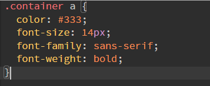
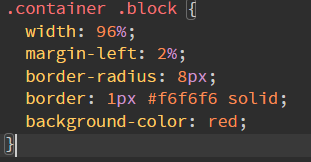
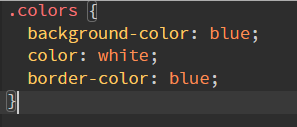
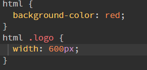
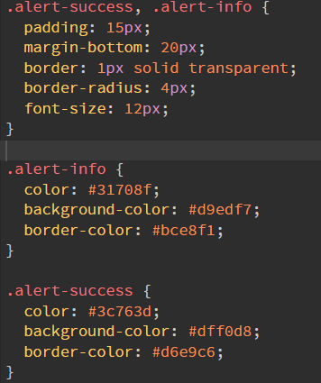
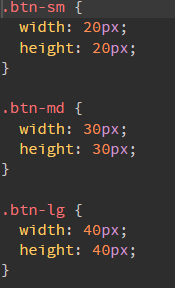
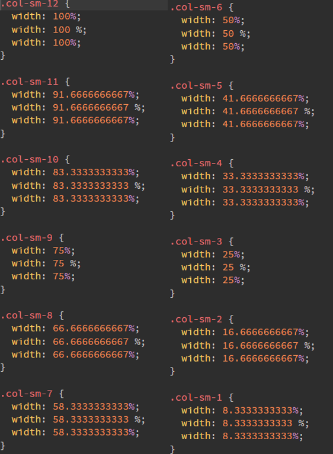
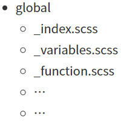
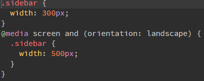
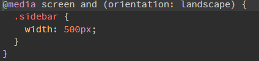

## 变量

### 变量定义

**定义变量格式**：`$变量名: 变量值;`

变量以美元符号开头，不能以数字，可包含字母、数字、下划线、横线

变量一定要先定义，后使用

```scss
$width: 1600px;
$font_size:16px;
```

- 通过连接符与下划线定义的同名变量为同一变量

  ```scss
  $font-size:14px;
  $font_size:16px;
  .container{font-size: $font-size;}
  ```


- 可以在变量的结尾添加 `!default`，如果该变量没有在其他地方定义或即便定义了但值为 null，那此处设置的默认值才生效，否则使用其他地方设置的那个值

  ```scss
  $content: "First content";
  $content: "Second content?" !default;
  $new_content: "First time reference" !default;
  #main {
    content: $content;
    new-content: $new_content;
  }
  ```

    编译后的 css

  


### 变量作用域

- 局部变量

  在选择器内容定义的变量，只能在选择器范围内使用

  ```scss
  .container {
    $font-size: 14px;
    font-size: $font-size;
  }
  ```

- 全局变量

  全局定义的变量，定义后可以全局使用

  ```scss
  $font-size:16px;
  .container {
    font-size: $font-size;
  }
  ```

- 局部变量转换为全局变量：添加  `!global` 声明

  ```scss
  .container {
    $font-size: 16px !global;
    font-size: $font-size;
  }
  .footer {
    font-size: $font-size;
  }
  ```


### 数据类型

支持 7 种主要的数据类型

#### 数字

支持带单位数字、不带单位数字，单位会和数字当做一个整体，进行算数运算

```scss
$layer-index:10;
$height: 120px;
.container {
  height: $font-size;
}
```


#### 字符串

有引号字符串、无引号字符串

通常在编译 CSS 文件时不会改变其类型，只有使用 **`#{}` 差值语法**时，有引号字符串将被编译为无引号字符串

```scss
$container: "top bottom";
$what: heart;
```


#### 布尔值

只有自身是 false 和 null 才会返回 false，其他一切都将返回 true

```scss
$blank-mode:true;
.container {
  @if $blank-mode {
    background-color: #000;
  }
  @else {
    background-color: #fff;
  }
}
```


#### 数组

用空格或逗号作分隔符

```scss
$block-base-padding: 6px 10px 6px 10px;
$font-base-family: 'Open Sans', Helvetica, Sans-Serif;
```

 数组中可以包含子数组

```scss
$list1: 1px 2px, 5px 6px;
$list2: (1px 2px) (5px 6px);
```


#### 映射

相当于 JavaScript 的 object，必须被圆括号包围，可以映射任何类型键值对

```scss
$color-map: (color1: #fa0000, color2: #fbe200, color3: #95d7eb);
$fonts: (serif: "Helvetica Neue",monospace: "Consolas");
```

- `map-get(map, key` 返回 Map 中 key 所对应的 value，找不到返回 null

  ```scss
  $font-sizes: ("small": 12px, "normal": 18px, "large": 24px)
  .container {
    font-size: map-get($font-sizes, "small");
  }
  ```

- `map-has-key(map, key)` 判断 map 是否有对应的 key

  ```scss
  map-has-key($font-sizes, "big")	// 结果: false
  ```

- `map-keys(map)` 返回 map 中所有的 key 组成的队列

  ```scss
  map-keys($font-sizes)	// 结果: "small", "normal, "large"
  ```

- `map-merge(map1, map2)` 合并两个 map 形成一个新的 map 类型，即将 map2 添加到 map1的尾部

  ```scss
  map-merge($font-sizes, $font-sizes2)
  ```

- `map-remove(map, keys...)` 移除 map 中的 keys，多个 key 使用逗号隔开

  ```scss
  map-remove($font-sizes, "small", "large")
  ```

- `map-values(map)` 返回 map 中所有的 value 并生成一个队列

  ```scss
  map-values($font-sizes)	// 结果: 12px, 18px, 24px
  ```


#### 颜色

```scss
$top-bg-color:rgba(255,147,29,0.6);
$color0: green;
// 调亮
$color1: lighten($color, 15%);
// 调暗
$color2: darken($color, 15%);
// 增加饱和度
$color3: saturate($color, 15%);
// 减少饱和度
$color4: desaturate($color, 15%);
// 颜色进行算数运算
$color5: (green + red);
```


#### 空值

不能使用与任何类型进行运算，主要用于逻辑判断和函数返回以指示缺少结果

```scss
// 值null是其类型的唯一值
$var:null;
```


### 插值语法

通过 `#{}` 插值语句可以在选择器、属性名、属性值、注释中使用变量

使用 `#{}` 可以**避免运行运算表达式**，直接编译 css

```scss
$class-name: danger;
$attr: color;
a.#{$class-name} {
    border-#{$attr}: #F00;
}
```

```scss
p {
  $font-size: 12px;
  $line-height: 30px;
  font: #{$font-size}/#{$line-height} Helvetica,sans-serif;
}
```


## 运算

算术运算符 `+`、`-`、`*`、`/`、`%`，关系运算符 `==`、`!=`，`<`，`>`，`<=`，`>=`，逻辑运行符 `and`、`or`、`not`

### 算术运算符

- 加法运算

  数字相加：只要有单位，结果必有单位；都有单位，**单位跟随第一个字符**；**相对单位和绝对单位不能相加**

  ```scss
  .container {
    width: 1 + 2;				// 3
    width: 1 + 2px;			// 3px
    width: 50 + 20%;		// 70%
    width: 1px + 2;			// 3px
    width: 1px + 2px;		// 3px
    width: 50% + 20%;		// 70%
    width: 10pt + 20px;	// 25pt
    width: 10% + 20px;	// 编译不通过
  }
  ```

  字符串相加：第一个字符串有无引号决定结果是否有引号

  ```scss
  .container {
    width: "a" + "b"; 	// "ab"
    width: "a" + b;	  	// "ab"
    width: a + "b";	  	// ab
    width: a + b;	  		// ab
  }
  ```

  数字和字符串相加：第一位有引号，结果必有引号；第一位是数字，最后一位有引号，结果必有引号

  ```scss
  .container {
    width: 1 + px;			// 1px
    width: "1" + px; 		// "1px"
    width: 1 + "px"; 		// "1px"
    width: a + 1;				// a1
    width: "a" + 1; 		// "a1"
    width: a + "1"; 		// a1
  }
  ```

- 减法运算

  数字相减：只要有单位，结果必有单位；都有单位，**单位跟随第一个字符**；**相对单位和绝对单位不能相减**

  ```scss
  .container {
    width: 1 - 2;				// -1
    width: 1 - 2px;			// -1px
    width: 10 - 30%;		// -20%
    width: 1px - 2;			// -1px
    width: 100% - 30;		// 70%
    width: 1px - 2px;		// -1px
    width: 50pt - 20px;	// 35pt
    width: 50% - 20px;	// 编译不通过
  }
  ```

  字符串相减：单纯拼接

  ```scss
  .container {
    width: a - 1;  			// a-1
    width: 1 - a;  			// 1-a
    width: "a" - 1;			// "a"-1
    width: a - "1";			// a-"1"
  }
  ```

- 乘法运算

  **只能有一个字段有单位**，结果会跟随单位

  ```scss
  .container {
    width: 50 * 30;				// 1500
    width: 10 * 30%;			// 300%
    width: 60% * 30%;			// 编译不通过
    width: 50px * 20px;		// 编译不通过
    width: 50 * 2px;			// 100px
    width: 50pt * 4;			// 200pt
  }
  ```

- 除法运算

  只有以下三种情况 `/` 才被视为除法运算符号，除此之外结果只是按照顺序去除空格后拼接

  1. 如果值或值的一部分，是**变量或者函数的返回值**
  2. 如果值被**圆括号包裹**
  3. 如果值是算数表达式的一部分

  ```scss
  .container {
    width: 10 / 5;				// 10/5
    width: 10px / 5px;		// 10px/5px
  }
  ```

  ```scss
  .container {
    $width: 100px;
    // 使用变量
    width: $width / 2;			// 50px
    // 使用了其他算数表达式
    width: 10px / 10 * 2;		// 2px
    width: 20px / 2px * 5%;	// 50%
    // 使用括号
    width: (500px / 2);			// 250px
    width: (100% / 12);			// 8.3333333333%	不会四舍五入，精确到小数点后5位
    // 使用函数
    z-index: round(10) / 2;	// 5
    // 不运算
    font: 16px/30px Arial, Helvetica, sans-serif;
  }
  ```

  都有单位，结果会舍弃单位；**相对单位和绝对单位不能相除**

  ```scss
  .container {
    width: (10px / 20px);		// 0.5
    width: (100px / 20pt);	// 3.75
    width: (100% / 20px);		// 编译不通过
  }
  ```

- 取余运算

  `%` 两侧必须要有空格

  只要有单位，结果必有单位；都有单位，**单位跟随第一个字符**；**相对单位和绝对单位不能互相取余**

  ```scss
  .container {
    width: 10 % 3;						// 1
    width: 50 % 3px;					// 2px
    width: 50px % 4px;				// 2px
    width: 50px % 7;					// 1px
    width: 50% % 7;						// 1%
    width: 50% % 9%;					// 5%
    width: 50px % 13.33333px;	// 10.00001px
    width: 50px % 10pt;				// 10px
    width: 50px % 5%;					// 编译不通过
  }
  ```

  

### 关系运算符

`==` 等于，`!=` 不等于，`<` 小于、`>` 大于、`<=` 小于等于、`>=` 大于等于

```scss
$theme:1;
.container {
  @if $theme == 1 {
    background-color: red;
  }
  @else {
    background-color: blue;
  }
}
```

```scss
$theme:"blue";
.container {
  @if $theme != "blue" {
    background-color: red;
  }
  @else {
    background-color: blue;
  }
}
```

```scss
$theme:3;
.container {
  @if $theme >= 5 {
    background-color: red;
  }
  @else {
    background-color: blue;
  }
}
```


### 逻辑运行符

`and` 逻辑与，`or` 逻辑或，`not` 逻辑非

```scss
$width:100;
$height:200;
$last:false;
div {
  @if $width > 50 and $height < 300 {
    font-size: 16px;
  }
  @else {
    font-size: 14px;
  }
  @if not $last {
    border-color: red;
  }
  @else {
    border-color: blue;
  }
}
```


## 嵌套

### 选择器嵌套

更方便与直观的查看与管理选择器的父子级关系

```scss
.container {
  width: 1200px;
  margin: 0 auto;
  .header {
    height: 90px;
    line-height: 90px;
    .log {
      width: 100px;
      height: 60px;
    }
  }
  .center {
    height: 600px;
    background-color: #F00;
  }
  .footer {
    font-size: 16px;
    text-align: center;
  }
}
```


### 父选择器 &

`&` 代表嵌套规则外层的父选择器

```scss
.container {
  width: 1200px;
  margin: 0 auto;
  a {
    color: #333;
    &:hover {
      text-decoration: underline;
      color: #F00;
    }
  }
  .top {
    border: 1px #f2f2f2 solid;
    &-left {
      float: left;
      width: 200px;
    }
  }
}
```


### 属性嵌套

有些 CSS 属性遵循相同的命名空间 ，比如 `font-family`，`font-size`，`font-weight` 都以 font 作为属性的命名空间

为了便于管理这样的属性，同时也为了避免了重复输入，scss 允许**将属性嵌套在命名空间中**

```scss
.container {
  a {
    color: #333;
    font: {
      size: 14px;
      family: sans-serif;
      weight: bold;
    }
  }
}
```

  编译后的 css


## 混合

混合指令用于定义可重复使用的样式，有助于减少重复代码，只需声明一次，就可在文件中引用


### 基础混合

使用 `@mixin` 定义混合指令以及使用 `@include` 进行调用

```scss
// 定义混合
@mixin block {
  width: 96%;
  margin-left: 2%;
  border-radius: 8px;
  border: 1px #f6f6f6 solid;
}
// 使用混合
.container {
  .block {
    @include block;
    background-color: red;
  }
}
```

  编译后的 css

- 混合嵌入选择器

  ```scss
  @mixin warning-text {
    .warn-text {
      font-size: 12px;
      color: rgb(255, 253, 123);
      line-height: 180%;
    }
  }
  .container {
    @include warning-text;
  }
  ```

     编译后的 css


### 参数混合

按照变量的格式，通过逗号分隔，将参数写进 Mixin 名称后的圆括号里

```scss
// 定义flex布局元素纵轴的排列方式
@mixin flex-align($aitem) {
  -webkit-box-align: $aitem;
  -webkit-align-items: $aitem;
  -ms-flex-align: $aitem;
  align-items: $aitem;
}
.container {
  @include flex-align(center);
}
.footer {
  @include flex-align($aitem: center);
}
```

- 位置传参

  ```scss
  @mixin block-padding($top, $right, $bottom, $left) {
    padding-top: $top;
    padding-right: $right;
    padding-bottom: $bottom;
    padding-left: $left;
  }
  .container {
    @include block-padding(10px, 20px, 30px, 40px);
  }
  ```

- 关键词传参

  ```scss
  @mixin block-padding($top, $right, $bottom, $left) {
    padding-top: $top;
    padding-right: $right;
    padding-bottom: $bottom;
    padding-left: $left;
  }
  .container {
    @include block-padding($left: 20px, $top: 10px, $bottom: 10px, $right: 30px);
  }
  ```

- 默认参数

  ```scss
  @mixin block-padding($top:0, $right:0, $bottom:0, $left:0) {
    padding-top: $top;
    padding-right: $right;
    padding-bottom: $bottom;
    padding-left: $left;
  }
  // 不传参数
  .container1 {
    @include block-padding;
  }
  // 位置传参
  .container2 {
    @include block-padding(10px,20px);
  }
  // 关键词指定传参
  .container3 {
    @include block-padding($left: 10px, $top: 20px);
  }
  ```

- 可变参数

  ```scss
  /** 
  	*定义线性渐变
  	*@param $direction  方向
  	*@param $gradients  颜色过度的值列表
  */
  @mixin linear-gradient($direction, $gradients...) {
    background-color: nth($gradients, 1);
    background-image: linear-gradient($direction, $gradients);
  }
  .table-data {
    @include linear-gradient(to right, #F00, orange, yellow);
  }
  ```

  

### 混合中导入内容

当定义 `@mixin` 时，并且在 `@mixin` 里设置了 `@content`，`@include` 的时候可以将导入的内容插入到  `@content` 标志的地方

可以看作参数的升级版

```scss
$color: white;
@mixin colors($color: blue) {
  background-color: $color;
  @content;
  border-color: $color;
}
.colors {
  @include colors { color: $color; }
}
```

  编译后的 css

```scss
@mixin example {
  html {
    @content;
  }
}
@include example {
  background-color: red;
  .logo {
    width: 600px;
  }
}
```

  编译后的 css

```scss
$breakpoints: (small: 320px, medium: 600px, large: 768px);
@mixin respond-to($breakpoint) {
  @if map-has-key($breakpoints, $breakpoint) {
    $value: map-get($breakpoints, $breakpoint);
    @media screen and (min-width: $value) {
      @content;
    }
  } @else {
    @warning "Unknown `#{$breakpoint}` in $breakpoints";
  }
}
.m-tabs {
  background-color: #f2f2f2;
  @include respond-to(medium) {
    background-color: #666;
  }
}
```

 


## 继承

### 继承基础

继承 `@extend` 的作用是将重复使用的样式，延伸给需要包含这个样式的其他样式

```scss
.alert {
  padding: 15px;
  margin-bottom: 20px;
  border: 1px solid transparent;
  border-radius: 4px;
  font-size: 12px;
}
.alert-info {
  @extend .alert;
  color: #31708f;
  background-color: #d9edf7;
  border-color: #bce8f1;
}
.alert-success {
  @extend .alert;
  color: #3c763d;
  background-color: #dff0d8;
  border-color: #d6e9c6;
}
.alert-warning {
  @extend .alert;
  color: #8a6d3b;
  background-color: #fcf8e3;
  border-color: #faebcc;
}
.alert-danger {
  @extend .alert;
  color: #a94442;
  background-color: #f2dede;
  border-color: #ebccd1;
}
```

   编译后会转换成并集选择器

- 多个继承

  ```scss
  .alert {
    padding: 15px;
    margin-bottom: 20px;
    border: 1px solid transparent;
    border-radius: 4px;
    font-size: 12px;
  }
  .important {
    font-weight: bold;
    font-size: 14px;
  }
  .alert-danger {
    @extend .alert;
    @extend .important;
    color: #a94442;
    background-color: #f2dede;
    border-color: #ebccd1;
  }
  ```

- 多层继承

  ```scss
  .alert {
    padding: 15px;
    margin-bottom: 20px;
    border: 1px solid transparent;
    border-radius: 4px;
    font-size: 12px;
  }
  .important {
    @extend .alert;
    font-weight: bold;
    font-size: 14px;
  }
  .alert-danger {
    @extend .important;
    color: #a94442;
    background-color: #f2dede;
    border-color: #ebccd1;
  }
  ```

    编译后的 css

  

### 占位符 %

使用占位符 `%` 会让被继承的选择器**不会被编译**输出到最终的 css 文件中，占位符选择器以百分号 `%` 开头

```scss
%alert {
  padding: 15px;
  margin-bottom: 20px;
  border: 1px solid transparent;
  border-radius: 4px;
  font-size: 12px;
}
.alert-info {
  @extend %alert;
  color: #31708f;
  background-color: #d9edf7;
  border-color: #bce8f1;
}
.alert-success {
  @extend %alert;
  color: #3c763d;
  background-color: #dff0d8;
  border-color: #d6e9c6;
}
```

 编译后的 css


### 混合和继承的选择

`@mixin` 在网络传输中比 `@extend`  拥有更好的性能，尽管有些文件未压缩时更大，但使用 gzip 压缩后，依然可以保证拥有更好的性能

所以尽量不要使用 `@extend`

 


## 流程控制

### @if 指令

语法方式同 js 的 if....else、 if....else if....else

```scss
$theme:"green";
.container {
  @if $theme=="red" {
    color: red;
  }
  @else if $theme=="blue" {
    color: blue;
  }
  @else if $theme=="green" {
    color: green;
  }
  @else {
    color: darkgray;
  }
}
```

```scss
// css的三角形@mixin声明
@mixin triangle($direction:top, $size:30px, $border-color:black) {
  width: 0px;
  height: 0px;
  display: inline-block;
  border-width: $size;
  border-#{$direction}-width: 0;
	@if ($direction == top) {
	  border-color: transparent transparent $border-color transparent;
	  border-style: dashed dashed solid dashed;
	}
	@else if($direction == right) {
	  border-color: transparent transparent transparent $border-color;
	  border-style: dashed dashed dashed solid;
	}
	@else if($direction == bottom) {
	  border-color: $border-color transparent transparent transparent;
	  border-style: solid dashed dashed dashed;
	}
	@else if($direction == left) {
	  border-color: transparent $border-color transparent transparent;
	  border-style: dashed solid dashed dashed;
	}
}
.p0 {
  @include triangle();
}
.p1 {
  @include triangle(right, 50px, red);
}
.p2 {
  @include triangle(bottom, 50px, blue);
}
.p3 {
  @include triangle(left, 50px, green);
}
```


### @for 指令

`@for` 指令可以在限制的范围内重复输出格式，每次按要求（变量的值）对输出结果做出变动

包含两种格式

- `@for $var from n through m`：循环 n 到 m，条件范围包含 m，$var 必须是正整数

  ```scss
  @for $i from 1 through 3 {
    .p#{$i} {
      width: 10px * $i;
      height: 30px;
      background-color: red;
    }
  }
  ```

   编译后的 css

- `@for $var from n to m`：循环 n 到 m，条件范围不包含 m，$var 必须是正整数

  ```scss
  @for $i from 1 to 4 {
    .p#{$i} {
      width: 10px * $i;
      height: 30px;
      background-color: red;
    }
  }
  ```

   编译后的 css


### @each 指令

`$var in $list` 

循环列表

```scss
$color-list: red green blue turquoise darkmagenta;
@each $color in $color-list {
  $index: index($color-list, $color);
  .p#{$index - 1} {
    background-color: $color;
  }
}
```

 编译后的 css

循环 Map

```scss
$btn-sizes: ( sm: 20px, md: 30px, lg: 40px );
@each $modifier, $size in $btn-sizes {
  .btn-#{$modifier} {
    width: $size;
    height: $size;
  }
}
```

 编译后的 css


### @while 指令

`@while` 指令重复输出格式直到表达式返回结果为 false

```scss
$column:12;
@while $column>0 {
  .col-sm-#{$column} {
    width: $column / 12 * 100%;
    // width: $column / 12 * 100 + %; 会编译失败
    width: $column / 12 * 100#{"%"};
    width: unquote($string: $column / 12 * 100 + "%");
  }
  $column:$column - 1;
}
```

  编译后的 css


## 函数

### 自定义函数

函数由 `@function` 定义，返回值用 `@retrurn` 来指示，每个 `@function` 都必须要 `@return`

函数只能作为一个属性的值，因为它返回的就只能是一个 css 值，而不能是样式块

函数的参数传递与 Mixin 一致

```scss
@function column-width($col, $total) {
  @return percentage($col/$total);
}
.col-3 {
  width: column-width(3, 8);
}
```

- 关键词传参

  ```scss
  @function column-width($col, $total) {
    @return percentage($col/$total);
  }
  .col-3 {
    width: column-width($col:3, $total:8);
  }
  ```

- 默认参数

  ```scss
  @function column-width($col:3, $total:8) {
    @return percentage($col/$total);
  }
  .col-3 {
    width: column-width();
  }
  ```

- 可变参数

  ```scss
  @function sum($numbers...) {
    $sum: 0;
    @each $number in $numbers {
      $sum: $sum + $number;
    }
    @return $sum;
  }
  .div1 {
    width: sum(10px, 20px, 30px, 40px);
  }
  ```

  


### 内置函数

#### 字符串函数

- 添加引号 `quote($string)`

  ```scss
  p :after {
    content: quote(这是里面的内容);
  }
  ```

- 除去引号 `unquote($string)`

  ```scss
  p {
    background-color: unquote($string: "#F00");
  }
  ```

- 内容插入字符串给定位置 `str-insert($string, $insert, $index)`

  ```scss
  p :after {
    content: str-insert("Hello world!", " my", 6);
  }
  ```

- 截取字符串 `str-slice($string, $start, $end)`

  ```scss
  p :after {
    content: str-slice("hello", 2, 3);
  }
  ```


#### 数学函数

- 不带单位的数值转成百分比 `percentage($number)`

  ```scss
  .box2 { 
    width: percentage(.1rem / .3rem);	// 33.3333333333%;
  }
  ```

- 四舍五入为整数 `round($number)`

  ```scss
  .xs-row { 
    width: round(33.33333333333333px);	// 33px
  }
  ```

- 向上取整 `ceil($number)`

  ```scss
  .fs14 { 
    font-size: ceil(13.1px);	// 14px
  }
  ```

- 向下取整 `floor($number)`

  ```scss
  .fs16 {
    font-size: floor(16.9px);	// 16px
  }
  ```

- 绝对值 `abs($number)`

  ```scss
  .fs16 { 
    font-size: abs(-1.6rem);	// 1.6rem
  }
  ```

- 随机数 `random($number?:number)`

  ```scss
  div {
    height: random();		// 0-1 区间
    width: random(666); // 0-n 区间
  }
  ```

- 最大值 `max($numbers…)`、最小值 `min($numbers…)`

  ```scss
  div { 
    width: min(2rem, 10rem);	// 2rem
    height: max(2rem, 10rem);	// 10rem
    height: max(2px, 10rem);	// 单位不相同，报错
  }
  ```


#### 列表函数

- 返回列表长度 `length($list)`、返回指定索引值 `nth($list, $n)`

  ```scss
  $list: google, baidu, sogo;
  @for $i from 1 through length($list){
    .icon-#{nth($list, $i)}{
      content: '#{nth($list, $i)}'
    }
  }
  ```

- 拼接两个列表 `join($list1, $list2, [$separator])`，``$separator` 值是 `auto`（默认）、`comma`、`space`

  ```scss
  $list1: google, baidu, sogo;
  $list2: facebook, instagram, twitter;
  $list3: join($list1, $list2, comma);
  ```


#### Map 函数

- 返回 Map 中 key 所对应的 value `map-get($map, $key)`，如果没有对应的 key，则返回 null 值

  ```scss
  $font-sizes: ("small": 12px, "normal": 18px, "large": 24px);
  span {
    font-size: map-get($font-sizes, "small");
  }
  ```

- 判断 map 是否有对应的 key `map-has-key($map, $key)`

  ```scss
  $layer: ( offcanvas: 1, lightbox: 500, dropdown: 10, tooltip: 15);
  @function layer($name) {
    @if map-has-key($layer, $name) {
      @return map-get($layer, $name);
    }
    @warn "The key #{$name} is not in the map '$layer'";
    @return null;
  };
  .m-lightbox {
    z-index: layer(lightbox);
  }
  ```

- 合并两个 map 形成一个新的 map 类型 `map-merge($map1,$map2)`

  ```scss
  $btn-default: (
    padding: 10px,
    background: #000,
  );
  $btn-primary: (
    color: #000,
    background: #fff,
  );
  .div {
    @each $key, $value in map-merge($btn-default, $btn-primary) {
      #{$key}: $value;
    }
  }
  ```

   


#### 颜色函数

- 颜色变亮，亮度值（0% - 100%）`lighten($color, $amount)`
- 颜色变暗，亮度值（0% - 100%）`darken(color, amount)`
- 提高色彩饱和度 `saturate($color, $amount)`
- 调低色彩饱和度 `desaturate($color, $amount)`
- 降低颜色透明度 `opacify($color, $amount)` `fade-in($color, $amount)`
- 提升颜色透明度 `transparentize($color, $amount)` `fade-out($color, $amount)`


#### 自检函数

- 返回数据类型 `type-of($value)`
- 返回单位 `unit($number)`
- 判断是否带单位 `unitless($number)`
- 判断两个值是否可以进行做加、减和合并运算 `comparable($number1, $number2)`


#### 三元条件函数

- 判断 $condition，如果条件成立，则返回 $if-true 的结果，如果条件不成立，则返回 $if-false 的结果

  `if($condition,$if-true,$if-false)`

  ```scss
  div {
    width: if(true,8em,20em)
  }
  ```


## 导入

### 导入 @import

sass 拓展了 `@import` 的功能，被导入的文件将合并编译到同一个 CSS 文件中，**被导入的文件中的变量和混合可以在导入的文件中使用**

```scss
// public.scss
$font-base-color:#333;
```

```scss
@import "public";
$color:#666;
.container {
  border-color: $color;
  color: $font-base-color;
}
```

- 如果没有指示扩展名，将会试着寻找文件名相同并且扩展名为 .scss 或 .sass 的文件并将其导入

  ```scss
  @import "foo";
  @import "foo.scss";
  ```

- 以下情况下， `@import` 仅作为普通的 CSS 语句，不会导入任何 Sass 文件

  ```scss
  // 文件拓展名是 .css
  @import "public.css";
  // 文件名以 http:// 开头
  @import url(public);
  // 文件名是 url() 
  @import "http://xxx.com/xxx";
  // @import 包含 media queries
  @import 'landscape' screen and (orientation:landscape);
  ```

- 可以将 `@import` 嵌套进 CSS 样式或者 `@media` 中，这样导入的样式只能出现在嵌套的层中，不能使用在控制指令或混入中

  ```scss
  // _base.scss
  .main-color {
    color: #F00;
  }
  ```

  ```scss
  .container {
    @import "base";
  }
  ```

- 允许同时导入多个文件

  ```scss
  @import "rounded-corners", "text-shadow";
  ```

- `url()` 导入方式可以使用 `#{ }` 插值语句

  ```scss
  $family: unquote("Droid+Sans");
  @import url("http://fonts.googleapis.com/css?family=\#{$family}");
  ```

- 局部文件：如果不希望被导入的文件被编译，文件名可以以下划线  `_` 开头

  ```scss
  // _theme.scss
  $border-color:#999;
  $background-color:#f2f2f2;
  ```

  ```scss
  @import "theme";
  .container {
    border-color: $border-color;
    background-color: $background-color;
  }
  ```

- 目录下创建 _index.scss 并 `@import` 导入目录下的其他文件，可以将目录下多个 scss 文件组成一个包来被导入

  ```scss
  // mylib/_index.scss
  @import "sub1";
  @import "sub2";
  @import "sub3";
  ```

  ```scss
  @import "mylib"
  ```

   


### 模块导入 @use

由 `@use` 加载的样式表被称为模块，通过 `@use` 加载的模块不管被引用了多少次，都只会在编译后输出一次到 css 中，使用 `@import` 多次引入同一模块，会反复输出到 css 中

```scss
@use '_styles.scss';
```

- 也支持省略 .scss 后缀名，省略开头 `_`，省略 _index.scss 导入

- `@use` 引入一个模块，默认会形成一个以模块文件名命名的命名空间，模块中的所有**成员都通过这个命名空间来访问**

  ```scss
  // a.scss
  @mixin flex {
    display: flex;
  }
  ```

  ```scss
  @use './a.scss';
  .flex {
    @include a.flex;
  }
  ```

- 使用 `@use ... as ...` 自定义命名空间名称

  ```scss
  @use "variable" as var;
  .hoge {
    color: var.$color-main;
  }
  ```

- 去除命名空间

  ```scss
  @use './a.scss' as *;
  .flex {
    @include flex;
  }
  ```

- 私有成员：如果不想将模块中的成员暴露给其他文件访问，将模块成员以 `-` 或 `_` 开头即可

  ```scss
  // a.scss
  @mixin _flex {
    display: flex;
  }
  ```

  ```scss
  @use './a.scss';
  .flex {
    @include a._flex;  // 报错：模块的私有成员无法在模块外部使用
  }
  ```

- 如果模块中的变量使用 `!default` 设置了默认值，使用 `@use` 引入时，使用 `@use ... with ...` 来覆盖默认值

  ```scss
  // a.scss
  $red: #f00 !default;
  $size: 16px !default;
  $bg: #fff;
  @mixin base {
    color: $red;
    font-size: $size;
    background: $bg;
  }
  ```

  ```scss
  @use './a.scss' with( $red: #a55, $size: 14px);
  .button {
    @include a.base;
  }
  ```

- 内置函数归类到了内置模块中

  `sass:math`、`sass:math`、`sass:color`、`sass:string`、`sass:list`、`sass:map`、`sass:selector`、`sass:meta`

  ```scss
  @use "sass:color";
  .box {
    border: 1px solid color.scale($primary-color, $lightness: 20%);
  }
  ```


### 模块转发 @forward

`@forward` 语句可以引入另一个模块的所有变量、混合和函数，将它们**直接作为当前模块的API暴露出去**，而不会在当前模块增加代码

```scss
// bootstrap.scss
@forward "functions";
@forward "variables";
@forward "mixins";
/*
	此时生成的bootstrap.css文件中，是不包含"functions"、“variables”、"mixins"代码的
	也不能在bootstrap.scss文件中使用这些模块
	另一个文件中@import或者@use导入bootstrap模块，再去使用这些方法
	bootstrap.scss文件类似于一个传输中转站
*/
```

- 使用 `show`、`hide` 控制成员在下游文件中是否可见

  ```scss
  // 禁止转发某些成员
  @forward "functions" show $var, color-mix;
  // 只转发某些成员
  @forward "functions" hide assert-ascending;
  ```

- 给子模块添加前缀

  ```scss
  /* material/_index.scss */
  @forward "theme" as theme-*;
  ```

  ```scss
  @use 'material' as *;
  p {
    color: $theme-white;
  }
  ```


## 其他

### 媒体查询 @media

如果 `@media` 嵌套在 CSS 规则内，编译时 `@media` 将被编译到文件的最外层，包含嵌套的父选择器

```scss
.sidebar {
  width: 300px;
  @media screen and (orientation: landscape) {
    width: 500px;
  }
}
```

 

`@media` 的查询语句允许互相嵌套使用，编译时 Sass 会自动添加 `and`

```scss
@media screen {
  .sidebar {
    @media (orientation: landscape) {
      width: 500px;
    }
  }
}
```

 

`@media` 结合混合的 `@content` 使用

```scss
$breakpoints: (
  "sm": "screen and (min-width: 400px)",
  "md": "screen and (min-width: 768px)",
  "lg": "screen and (min-width: 1000px)",
  "xl": "screen and (min-width: 1200px)",
);
@mixin mq($breakpoint) {
  @media #{map-get($breakpoints, $breakpoint)} {
    @content;
  }
}
.test {
  color: blue;
  @include mq(sm) {
    color: yellow;
  }
  @include mq(lg) {
    color: red;
  }
} 
```

  


### 调试和报错

- `@debug` 用于调试，按标准错误输出流输出
- `@warn` 用于警告，按标准错误输出流输出
- `@error` 用于报错，按标准错误输出流输出
