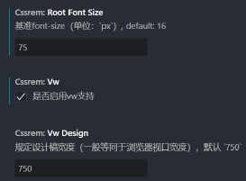
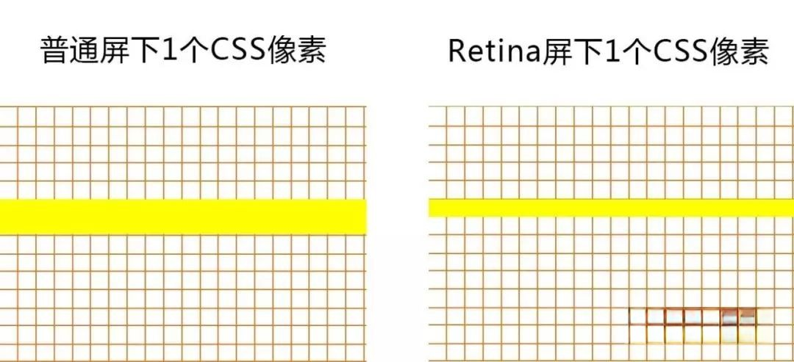
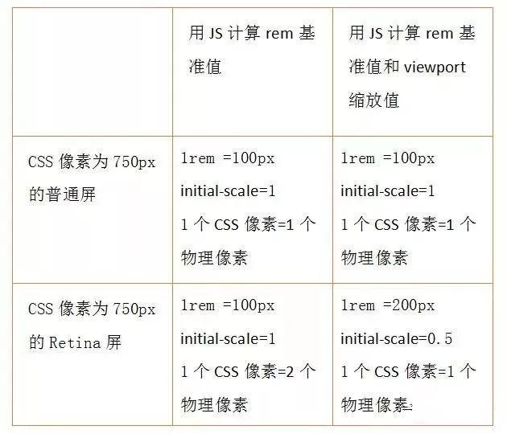
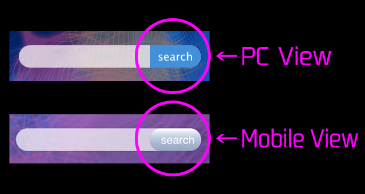
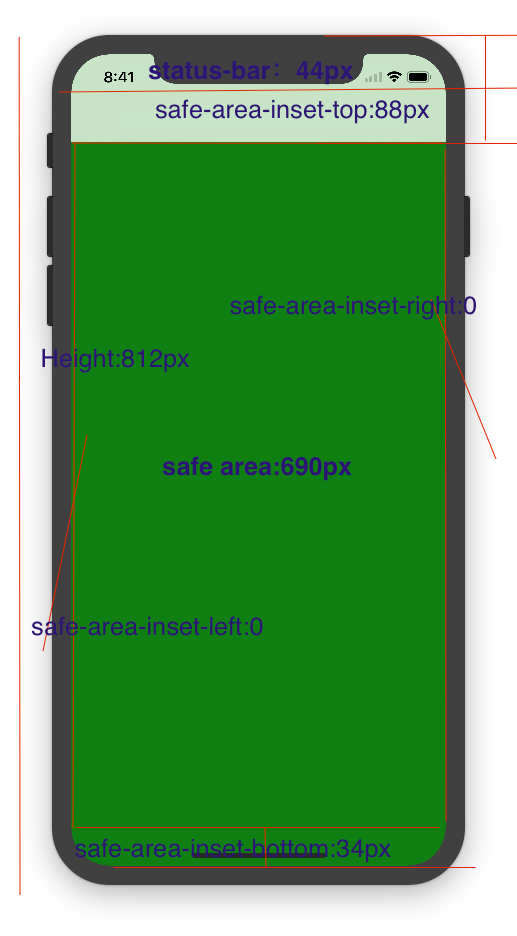
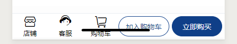
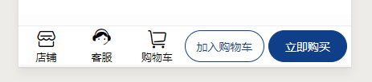

# 移动端适配

## 视口 viewport

在 PC 页面中浏览器可视区域就是视口，布局视口和视觉视口是同一个，但是在移动端布局视口和可见视口不一样

移动端的网页窗口往往比较小，希望一个**大的网页在移动端可以完整的显示**，所以在默认情况下，**移动端的布局视口是大于视觉视口的**

在移动端，可以将视口划分为三种情况

- 布局视口（layout viewport）

  布局视口的**默认宽度是 980px**，默认情况下网页在移动端会按照宽度为 980px 来布局一个页面的盒子和内容

  为了显示可以完整的显示在页面中，**对整个页面进行缩小**

   

- 视觉视口（visual layout）

  按照 980px 显示内容，在用户可见区域的视口就是视觉视口

   

- 理想视口（ideal layout）

  设置 `<meta>` 元素中的 `viewport` 来**修改默认的视口宽度**

  ```html
  <!-- 视口标签 -->
  <meta name="viewport" content="width=device-width, user-scalable=no,
  initial-scale=1.0, maximum-scale=1.0, minimum-scale=1.0">
  ```

  | 属性          | 说明                                             | 设置                   |
  | ------------- | ------------------------------------------------ | ---------------------- |
  | width         | 视口宽度，可以设置特殊值 `device-width` 设备宽度 | 视口宽度和设备保持一致 |
  | initial-scale | 初始缩放比， 0-10 的数字                         | 视口缩放比例1.0        |
  | maximum-scale | 最大缩放比，0-10 的数字                          | 最大允许的缩放比例1.0  |
  | minimum-scale | 最小缩放比，0-10 的数字                          | 最小允许的缩放比例1.0  |
  | user-scalable | 用户是否可以缩放，yes 或 no（1 或 0）            | 不允许用户自行缩放     |


## 移动端常见尺寸

 

安卓手机：大部分 4.7~5寸 的设备为 720px，基本以750为准

```javascript
// 查询设备宽度
const width = document.documentElement.clientWidth
// 查询设备dpr
const dpr = window.devicePixelRatio
```

判断安卓和 ios

```javascript
// 获取浏览器的userAgent，转化为小写
var ua = navigator.userAgent.toLowerCase();
// 判断是否是苹果
var isIos = (ua.indexOf('iphone') != -1) || (ua.indexOf('ipad') != -1);
if(isIos){
  // 做苹果手机兼容
}else{
  // 做安卓手机兼容
}
```


## 多倍图

一张 50px × 50px 的图片，在视网膜屏下打开，图片会按照 dpr 放大倍数，会造成图片模糊 

需要放一个 100px × 100px 的图片（**按照 dpr 倍数放大**），然后**手动把放图片的容器给缩小**为 50px × 50px

也就是说**准备的图片要比实际需要的大小大 n 倍**（n 为 dpr 倍数），就是多倍图

 

- 媒体查询选择合适的图片，再使用 `background-size` 背景缩放

  ```scss
  // 常见多倍屏幕最小dpr是1.3
  @mixin retina-image($image, $width, $height) {
    @media (min--moz-device-pixel-ratio: 1.3),
      (-o-min-device-pixel-ratio: 2.6/2),
      (-webkit-min-device-pixel-ratio: 1.3),
      (min-device-pixel-ratio: 1.3),
      (min-resolution: 1.3dppx) {
        background-image: url($image);
        background-size: $width $height;
    }
  }
  .image {
    background: url("my-image.png") no-repeat;
    @include retina-image("my-image2x.png", 1000px, 500px);
  }
  ```

- 对于不适合用 `background-image` 的图片，可以使用 `srcset` 属性的响应式图片

  `srcset` 属性可以提供一个或多个图像候选地址，以逗号分隔

  `srcset` 属性的每个图像候选地址由**图片 URL** 和**实际宽度**(例如：640w)或**像素密度**(例如：2x)**描述符**组成，只能添加一个描述符

  实际宽度是 `screen.width` * `window.devicePixelRatio` 计算出来的结果

  ```html
  <!-- 根据dpr会选择对应的图片 -->
  
  <!-- 根据实际宽度会选择对应的图片 -->
  
  <!--
  	例如，加载一个全屏图片
  	iPhone11 (逻辑分辨率:414 x 896, DPR:2) 会选择 image_M.jpg
  	Macbook Pro (逻辑分辨率:1440 x 900, DPR:2) 会选择 imageXL.jpg
  -->
  ```

- 多倍精灵图的做法
  1. 通过软件把精灵图等比例缩放为原来的一半
  2. 根据大小 测量坐标
  3. `background-size` 设置为精灵图原来宽度的一半
- 多倍图切图插件 cutterman


## viewport 缩放适配布局

固定布局视口，**宽度设置固定的值**，根据**不同屏幕尺寸**的设备时采用**等比缩放**的方案

对设计稿进行还原时不关注屏幕尺寸的差异，而是直接按设计稿来开发，网页宽度始终设置为设计稿的宽度

```html
<meta name="viewport" content="width={设计稿宽度}, initial-scale={屏幕逻辑像素宽度/设计稿宽度}" > 
```

```javascript
const WIDTH = 750
const mobileAdapter = () => {
  let scale = screen.width/WIDTH
  let content = `width=${WIDTH}, initial-scale=${scale}, maximum-scale=${scale}, minimum-scale=${scale}`
  let meta = document.querySelector('meta[name=viewport]')
  if(!meta) {
    meta = document.createElement('meta')
    meta.setAttribute('name', 'viewport')
    document.head.appendChild(meta)
  } 
  meta.setAttribute('content', content)
}
mobileAdapter()
window.onorientationchange = mobileAdapter
```


## 百分比布局

百分比布局，就是流式布局，也称非固定像素布局

通过把**盒子宽度设置成百分比**来根据屏幕宽度进行伸缩

- 最大宽度 / 高度 `max-width` / `max-height`

- 最小宽度 / 高度 `min-width` / `min-height`

```css
div {
    width: 100%;
    max-width: 980px;
    min-width: 320px;
    margin: 0 auto;
}
```

因为**不同属性的百分比值，相对的可能是不同参照物**，所以**百分比往往很难统一**，比较少使用


## rem 适配布局

相对单位 `rem` 是相对于 `<html>` 元素的字体大小，rem 布局就是通过**修改 `<html>` 元素的 `font-size` 尺寸来改变页面中元素的大小**

```css
/* 根html 为 12px */
html {
	font-size: 12px;
}
/* 此时 div 的字体大小就是 24px */
div {
	font-size: 2rem;
}
```

- `font-size` 大小和视口宽度的关系

  **font-size = 100 * 屏幕宽度 / 设计稿宽度**

  按照划分标准把屏幕**划分为一定等份**，每一等份就是  `<html>`  的字体大小

  划分标准可以是 10、15、20 等分，一般情况下是 10 等份

- 针对不同的屏幕，设置 `<html>` 不同的 `font-size`

  - 通过**媒体查询**来设置不同尺寸范围内的屏幕  `<html>`   的  `font-size` 尺寸

    如果**动态改变尺寸，不会实时的进行更新**

    ```css
    @media screen and (min-width: 320px) {
      html {
        font-size: 20px;
      }
    }
    @media screen and (min-width: 375px) {
      html {
        font-size: 24px;
      }
    }
    @media screen and (min-width: 414px) {
      html {
        font-size: 28px;
      }
    }
    @media screen and (min-width: 480px) {
      html {
        font-size: 32px;
      }
    }
    ```

  - 通过 **javascript 实时检测屏幕尺寸的改变**，实时更改 `font-size`

    ```javascript
    // 1.获取html的元素
    const htmlEl = document.documentElement
    function setRemUnit() {
      // 2.获取html的宽度(视口的宽度)
      const htmlWidth = htmlEl.clientWidth
      // 3.根据宽度计算一个html的font-size的大小
      const htmlFontSize = htmlWidth / 10
      // 4.将font-size设置到html上
      htmlEl.style.fontSize = htmlFontSize + "px"
    }
    // 保证第一次进来时, 可以设置一次font-size
    setRemUnit()
    // 当屏幕尺寸发生变化时, 实时来修改html的font-size
    window.addEventListener("resize", setRemUnit)
    ```

  - **直接引入 lib-flexible 库**

    不需要做媒体查询，flexible 已经处理了

    flexible 将当前的设备视口划分了 10 等份，不同设备，比例保持一致

- 将原来要设置的尺寸，转化成 `rem` 单位

  - 手动换算

    375 px 屏幕上，100px 宽度的盒子：100px / font-size: 37.5px = 2.6667rem

  - less / scss 的**换算函数**

    ```less
    .pxToRem(@px) {
      result: 1rem * (@px / @htmlFontSize);
    }
    .box {
      width: .pxToRem(100)[result];
      height: .pxToRem(18)[result];
    }
    ```

  - webpack 工具 **postcss-pxtorem** 自动的转化

  - **VSCode 插件** px to rem

     


## rem + viewport 缩放适配布局

在**多倍屏下 1px** 可能会被**显示的很粗**，如果使用 **rem 适配**，宽度可能会被换算到小于 0.5px，部分浏览器会直接**当成 0px 来处理**

 

- 可以选择的解决办法：

  - 针对 1px 的大小不进行 rem 单位转换

  - 根据 dpr 进行媒体查询，用伪元素 + `transform` 的方法重画边框，并对边框进行缩放

    ```css
    @media screen and (-webkit-min-device-pixel-ratio: 2) {
      .border-1px:before {
        content: " ";
        position: absolute;
        left: 0;
        top: 0;
        width: 100%;
        height: 1px;
        border-top: 1px solid #D9D9D9;
        color: #D9D9D9;
        transform-origin: 0 0;
        transform: scaleY(0.5);
      }
    }
    ```

- 使用 rem 和 viewport 缩放

  根据屏幕尺寸和 dpr，设置不同屏幕所应有的 rem 基准值和 `initial-scale` 缩放值

  ```javascript
  const docEl = document.documentElement;
  const fontEl = document.createElement('style');
  const metaEl = document.querySelector('meta[name="viewport"]');
  const dpr = window.devicePixelRatio || 1;
  // 设计稿是750,采用1：100的比例,
  const rem = 100 * (docEl.clientWidth * dpr / 750);
  // 缩放比例
  const scale = 1 / dpr;
  // 设置viewport，进行缩放，达到高清效果
  metaEl.setAttribute('content', 'width=' + dpr * docEl.clientWidth + ',initial-scale=' + scale + ',maximum-scale=' + scale + ', minimum-scale=' + scale + ',user-scalable=no');
  // 动态写入样式
  docEl.firstElementChild.appendChild(fontEl);
  fontEl.innerHTML = 'html{font-size:' + rem + 'px!important;}';
  ```

    

  

## vw 自适应布局

相对单位 `vw`/  `vh` 能够根据窗口大小来自动调节字体大小

- `vw` ：viewport width 视口宽度单位，1vw = 1/100 视口宽度

  例如：当前屏幕视口是 375 像素，1vw 就是 3.75 像素

- `vh`：viewport height 视口高度单位，1vh = 1/100 视口高度

- `vw` 和 `vh` 总是针对于当前屏幕视口，而百分比是相对于父元素来说的

- vw 自适应布局不需要去计算 html 的 `font-size` 大小，缺点就是它没有最小或者最大限制

- vw 单位换算

  - 手动换算

    50px 转换为 `vw` 单位 ：50 / (视口宽度 / 100)

  - less / scss 的**换算函数**

    ```less
    @vwUnit = 3.75;
    .pxToVw(@px) {
      result: (@px / @vwUnit) * 1vw;
    }
    .box {
      width: .pxToVw(100)[result];
      height: .pxToVw(100)[result];
    }
    ```

  - webpack 工具 **postcss-px-to-viewport-8-plugin** 自动的转化

  - **VSCode 插件** px to vw

     


- 使用 vw 模仿 bootstrap 的栅栏布局

  ```css
  /* 只要在一行中所有的列加起来等于100vw就实现响应式布局 */
  .col-2 { 
    float: left; 
    width: 50vw; 
  } 
  .col-4 { 
    float: left; 
    width: 25vw; 
  } 
  .col-5 { 
    float: left; 
    width: 20vw; 
  } 
  .col-8 { 
    float: left; 
    width: 12.5vw; 
  }
  ```

  

# 移动端特殊样式

- `-webkit-tap-highlight-color` 清除点击高亮

  IOS 点击按钮链接时，会出现一个半透明的灰色背景，可以通过 `-webkit-tap-highlight-color` 重设颜色

   

  ```css
  html {
    -webkit-tap-highlight-color: transparent;
  }
  ```

- `-webkit-appearance: none` 消除输入框和按钮的原生外观

  在 iOS 上加上这个属性才能给按钮和输入框添加自定义样式

   

  ```css
  input, button, select, textarea {
    -webkit-appearance: none;
  }
  ```

- `-webkit-touch-callout: none` 禁用长按页面时的弹出菜单

  禁止在 IOS 上长按弹出 IOS 系统菜单

  ```css
  img, a {
    -webkit-touch-callout: none; 
  }
  ```

- `pointer-event: none` 禁止图片点击放大

  禁止部分安卓手机点击图片会放大的效果

  注意这也会让 `` 标签的点击事件失效，如果要添加点击事件，只能添加到在上面一层

  ```css
  img {
      pointer-event: none;
  }
  ```

- 禁止 IOS 识别长串数字为电话

  ```html
  <meta name="format-detecation" content="telephone=no">
  ```

- `-webkit-overflow-scrolling` 属性控制元素在移动设备上是否使用滚动回弹效果

  `auto` ：普通滚动, 当手指从触摸屏上移开，滚动会立即停止

  `touch`：回弹效果的滚动, 当手指从触摸屏上移开，内容会继续保持一段时间的滚动效果

  ```css
  main {
    overflow-y: scroll;
    -webkit-overflow-scrolling: touch;
  }
  ```

  有时会有卡住不动的 bug，解决方法就是在 `webkit-overflow-scrolling:touch`属性的下一层子元素上，将 `height` 加 1% 或1px，从而主动触发 scrollbar

  ```css
  main-inner {
    min-height: calc(100% + 1px)
  }
  /* 或者使用伪元素 */
  main:after {
    min-height: calc(100% + 1px)
  }
  ```

  在 iOS 13 之后，不需再设置 `-webkit-overflow-scrolling:touch`，`overflow` 滚动的元素默认都是弹性效果

  也可以使用 iScroll 组件库

- 安卓不会自动播放视频

  ```javascript
  // 安卓autoplay没效果，需要手动触发
  window.addEventListener('touchstart', function(){
      audio.play();
  }, false);
  ```

- 移动端安全区域

  IOS11 新增 Webkit 的 css 函数，`env()` 和 `constant()`，用于设定**安全区域与边界的距离**

  新增 `viweport-fit` 属性，使得**页面内容完全覆盖整个窗口**

  只有**设置了 `viewport-fit=cover`，才能使用 `env()` 函数**

  ```html
  <meta name="viewport" content="width=device-width, viewport-fit=cover" />
  ```

  `env()` 和 `constant()` 有四个预定义的变量：

  - `safe-area-inset-left`：安全区域距离左边边界的距离
  - `safe-area-inset-right`：安全区域距离右边边界的距离
  - `safe-area-inset-top`：安全区域距离顶部边界的距离，对应的就是 iphoneX 的**顶部的刘海**
  - `safe-area-inset-bottom`：安全区域距离底部边界的距离，对应的就是 iphoneX 的**小黑条的高度**

   

  ```css
  body {
    /* 为导航栏+状态栏的高度 88px */
    padding-top: constant(safe-area-inset-top);				/* 兼容 iOS < 11.2 */
    padding-top: env(safe-area-inset-top);						/* 兼容 iOS >= 11.2 */
    /* 如果未竖屏时为0 */
    padding-left: constant(safe-area-inset-left);			/* 兼容 iOS < 11.2 */
    padding-left: env(safe-area-inset-left);					/* 兼容 iOS >= 11.2 */
    /* 如果未竖屏时为0 */
    padding-right: constant(safe-area-inset-right);		/* 兼容 iOS < 11.2 */
    padding-right: env(safe-area-inset-right);				/* 兼容 iOS >= 11.2 */
    /* 为底下圆弧的高度 34px */
    padding-bottom: constant(safe-area-inset-bottom);	/* 兼容 iOS < 11.2 */
    padding-bottom: env(safe-area-inset-bottom);			/* 兼容 iOS >= 11.2 */
  }
  /* 先使用 constant 再使用 env，需要同时存在，而且顺序不能换 */ 
  ```

  适配底部小黑条

  适配前  适配后

  ```css
  .nav {
    height: calc(50px + constant(safe-area-inset-bottom));
    height: calc(50px + env(safe-area-inset-bottom));
    padding-bottom: constant(safe-area-inset-bottom);
    padding-bottom: env(safe-area-inset-bottom);
  }
  ```

  

  


